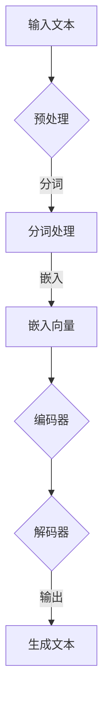

                 

## 提示词工程：优化AI多语言内容创作

> 关键词：多语言内容创作、AI、提示词工程、自然语言处理、深度学习

> 摘要：随着全球化趋势的不断加强，多语言内容创作成为了企业和个人在信息交流、市场拓展和品牌建设中的重要手段。人工智能技术的迅猛发展，特别是深度学习和自然语言处理技术的突破，为多语言内容创作带来了前所未有的机遇和挑战。提示词工程作为优化AI多语言内容创作的重要手段，能够显著提升内容创作的效率和质量。本文将从背景、核心概念、算法原理等多个角度，系统探讨提示词工程在多语言内容创作中的应用和实践。

# 引言

在当今信息爆炸的时代，语言成为连接不同文化和民族的桥梁。随着全球化的加速，跨文化交流日益频繁，对多语言内容创作的需求也越来越大。然而，多语言内容创作并非易事，涉及到语言差异、文化背景、表达习惯等多方面问题。在此背景下，人工智能（AI）技术，尤其是自然语言处理（NLP）和深度学习技术的进步，为解决这些难题提供了新的思路和工具。

自然语言处理是人工智能领域的一个重要分支，它致力于使计算机能够理解、解释和生成人类语言。深度学习作为自然语言处理的核心技术，通过构建复杂的神经网络模型，对大量文本数据进行训练，使其能够自动提取语言特征，进行文本分类、情感分析、机器翻译等任务。然而，深度学习模型在多语言内容创作中仍然面临着许多挑战，如语言多样性、数据稀缺性和翻译质量等。

提示词工程（Prompt Engineering）作为一门新兴的领域，旨在通过设计和优化提示词，引导AI模型生成更符合预期的高质量内容。提示词工程的核心目标是在模型训练和生成过程中，提供清晰的指导信息，使模型能够更好地理解任务意图，从而提升生成内容的准确性和可读性。本文将围绕提示词工程，探讨其在多语言内容创作中的应用，分析其核心概念、算法原理和实践方法，以期为AI多语言内容创作提供有益的参考和指导。

## 第一部分：背景与核心概念

### 第1章：多语言内容创作的现状与挑战

#### 1.1 多语言内容创作的重要性

在全球化的背景下，多语言内容创作变得尤为重要。随着互联网的普及，全球化的趋势愈发明显，各种文化、商业和学术交流日益频繁。多语言内容创作不仅有助于消除语言障碍，促进跨文化交流，还能为企业拓展国际市场、提升品牌影响力提供有力支持。例如，电商平台通过多语言内容创作，能够吸引全球各地的消费者，从而实现销售额的增长。对于学术领域，多语言内容创作能够促进不同国家和地区学者的交流与合作，推动知识的传播与创新。

#### 1.1.1 全球化趋势下的多语言需求

全球化带来了多语言内容创作的新需求。随着全球化的推进，各国之间的贸易、文化交流和人员流动日益增加，这使得多语言内容创作成为企业、组织和个人不可或缺的一部分。在商业领域，企业需要通过多语言内容与全球客户进行有效沟通，以提升品牌形象和市场份额。在学术领域，多语言内容创作有助于促进不同国家和地区学者的交流与合作，推动知识的传播与创新。此外，随着社交媒体的兴起，个人用户也希望通过多语言内容创作，扩大自己的影响力，与世界各地的用户进行互动。

#### 1.1.2 多语言内容创作的现状分析

目前，多语言内容创作呈现出以下几个显著特点：

1. **需求多样化**：不同行业和领域对多语言内容的需求各不相同，如电商、旅游、教育、新闻等。这些需求不仅体现在文本内容上，还包括音频、视频等多种形式。

2. **质量要求高**：多语言内容创作需要保证翻译的准确性、流畅性和文化适应性，这对于翻译质量和内容创作能力提出了更高要求。

3. **技术支持不足**：虽然人工智能技术为多语言内容创作提供了新的手段，但目前仍存在技术支持不足、翻译质量不稳定等问题。

#### 1.1.3 多语言内容创作的挑战与痛点

多语言内容创作面临诸多挑战和痛点，主要包括：

1. **语言多样性**：语言之间的差异使得翻译变得复杂，特别是在处理方言、专业术语和文化背景差异时，更容易出现翻译错误。

2. **数据稀缺性**：多语言数据集的稀缺性限制了AI模型在多语言内容创作中的应用。尽管有大量单语言数据集，但多语言数据集仍需进一步开发和收集。

3. **翻译质量**：AI翻译模型在处理多语言内容时，容易出现翻译错误、语言表达不准确等问题，导致内容质量下降。

4. **文化适应性**：多语言内容创作需要考虑不同文化背景下的语言习惯和表达方式，确保内容的文化适应性。

5. **成本和时间**：多语言内容创作需要大量的人力、物力和时间投入，这对于企业来说是一个巨大的挑战。

#### 1.2 AI在多语言内容创作中的应用

人工智能技术，特别是自然语言处理（NLP）和深度学习技术的快速发展，为多语言内容创作带来了新的机遇。通过使用AI技术，可以实现以下应用：

1. **机器翻译**：AI技术能够实现高效准确的机器翻译，帮助用户轻松跨语言交流。

2. **文本生成**：AI技术能够生成高质量的文本内容，如文章、广告、产品描述等，降低内容创作的成本和时间。

3. **情感分析**：AI技术能够分析文本的情感倾向，为企业提供市场分析和消费者行为预测。

4. **语音识别和合成**：AI技术能够将语音转化为文字，或将文字转化为语音，实现人机交互。

#### 1.2.1 AI技术简介

AI技术是指模拟人类智能的计算机系统，通过机器学习、深度学习、自然语言处理等技术，使计算机能够实现自我学习和自我优化。AI技术在多语言内容创作中的应用，主要体现在以下几个方面：

1. **自然语言处理（NLP）**：NLP是AI技术的重要组成部分，它使计算机能够理解和生成人类语言。NLP技术包括文本分类、情感分析、实体识别、机器翻译等。

2. **深度学习（DL）**：深度学习是一种基于神经网络的学习方法，能够自动提取数据中的特征。深度学习技术在NLP中的应用，使得机器翻译、文本生成等任务取得了显著的突破。

3. **神经网络（NN）**：神经网络是深度学习的基础，它由大量简单的计算单元（神经元）组成，通过学习数据中的特征，实现对复杂任务的建模。

#### 1.2.2 AI在多语言内容创作中的应用场景

AI技术在多语言内容创作中的应用场景广泛，包括但不限于以下几个方面：

1. **机器翻译**：AI技术能够实现高效准确的机器翻译，满足全球用户跨语言交流的需求。例如，谷歌翻译、百度翻译等。

2. **文本生成**：AI技术能够生成高质量的文本内容，如文章、广告、产品描述等。例如，OpenAI的GPT系列模型、百度文心大模型等。

3. **情感分析**：AI技术能够分析文本的情感倾向，为企业提供市场分析和消费者行为预测。例如，社交媒体情绪分析、电商评论分析等。

4. **语音识别和合成**：AI技术能够将语音转化为文字，或将文字转化为语音，实现人机交互。例如，苹果的Siri、亚马逊的Alexa等。

#### 1.2.3 AI在多语言内容创作中的优势与局限

AI在多语言内容创作中具有以下优势：

1. **高效性**：AI技术能够快速处理大量文本数据，提高内容创作的效率。

2. **准确性**：深度学习模型通过学习大量数据，能够实现较高准确性的翻译和文本生成。

3. **多样性**：AI技术能够生成多样化的内容，满足不同用户和场景的需求。

然而，AI在多语言内容创作中也存在一定的局限：

1. **数据依赖性**：AI模型需要大量的高质量数据集进行训练，数据稀缺性限制了其应用。

2. **翻译质量**：尽管AI翻译模型的准确性有所提高，但仍然存在一定的翻译错误和文化差异问题。

3. **文化适应性**：AI技术难以完全理解不同文化背景下的语言习惯和表达方式，导致内容的文化适应性较差。

#### 1.3 提示词工程的概念与意义

提示词工程（Prompt Engineering）是近年来在人工智能领域兴起的一个新方向，它旨在通过设计和优化提示词，引导AI模型生成更符合预期的高质量内容。提示词工程的核心思想是，在模型训练和生成过程中，提供清晰的指导信息，使模型能够更好地理解任务意图，从而提升生成内容的准确性和可读性。

#### 1.3.1 提示词工程的定义

提示词工程是一种利用提示词（Prompt）来引导AI模型生成内容的方法。提示词是一种简短的语言输入，它能够为模型提供任务目标、上下文信息或特定要求，帮助模型更好地理解任务意图，从而生成更符合预期的高质量内容。

#### 1.3.2 提示词工程的核心目标

提示词工程的核心目标包括：

1. **提升内容创作效率**：通过提供清晰的指导信息，使模型能够更快地理解任务意图，从而提高内容创作的效率。

2. **提升内容创作质量**：通过优化提示词，使模型能够生成更符合预期的高质量内容，减少翻译错误和文化差异问题。

3. **增强模型适应性**：通过设计多样化的提示词，使模型能够适应不同的任务需求和场景，提高模型的泛化能力。

#### 1.3.3 提示词工程的重要性

提示词工程在多语言内容创作中具有重要的意义：

1. **提高翻译质量**：通过优化提示词，可以减少机器翻译中的错误，提高翻译的准确性和流畅性。

2. **提升文本生成质量**：通过设计合适的提示词，可以引导AI模型生成更符合预期的高质量文本内容。

3. **降低内容创作成本**：通过提高内容创作效率和质量，可以降低企业在多语言内容创作中的成本。

4. **促进跨文化交流**：通过提高翻译和文本生成的质量，可以促进不同国家和地区之间的跨文化交流。

#### 1.4 本章小结

本章从多语言内容创作的重要性、AI在多语言内容创作中的应用、提示词工程的概念与意义等多个角度，对多语言内容创作进行了全面的分析和探讨。通过本章的学习，读者可以了解多语言内容创作的现状和挑战，认识AI在其中的重要作用，以及提示词工程在优化多语言内容创作中的核心地位。在后续章节中，我们将进一步探讨AI多语言内容创作的核心概念、算法原理和实践方法，为读者提供更深入的见解和指导。

### 第2章：AI多语言内容创作的核心概念

#### 2.1 语言模型与自然语言处理

语言模型（Language Model，LM）是自然语言处理（Natural Language Processing，NLP）中至关重要的一部分。它是一种统计模型，用于预测文本序列中的下一个单词或字符。语言模型在AI多语言内容创作中扮演着关键角色，它为文本生成、机器翻译、情感分析等任务提供了基础支持。

##### 2.1.1 语言模型的基本原理

语言模型的基本原理是基于统计学习，通过分析大量文本数据，学习文本序列的概率分布。语言模型通常使用一种称为n-gram模型的方法，它将文本序列划分为固定长度的单词或字符序列（n-gram），并计算每个n-gram出现的概率。例如，对于一个三元组（the, is, book），n-gram模型将计算它在所有文本中出现的频率。

##### 2.1.2 语言模型的分类与特性

语言模型可以分为以下几类：

1. **n-gram模型**：基于历史统计的简单模型，易于实现，但性能受限于上下文长度。

2. **神经网络模型**：如循环神经网络（RNN）、长短期记忆网络（LSTM）和变换器（Transformer）等。这些模型能够学习更复杂的语言特征，具有更强的上下文理解和生成能力。

3. **基于注意力的模型**：如Transformer模型，它通过自注意力机制，能够捕捉长距离依赖关系，实现高效的文本处理。

4. **预训练模型**：如GPT（Generative Pre-trained Transformer）和BERT（Bidirectional Encoder Representations from Transformers），这些模型通过在大量无标签文本上进行预训练，然后通过微调适应特定任务，具有很高的性能。

##### 2.1.3 自然语言处理的基本任务

自然语言处理包括以下几个基本任务：

1. **文本分类**：将文本数据分为预定义的类别，如情感分类、新闻分类等。

2. **实体识别**：识别文本中的特定实体，如人名、地点、组织等。

3. **文本生成**：生成符合语法和语义规则的文本，如机器翻译、摘要生成等。

4. **问答系统**：理解用户的自然语言查询，并生成合适的回答。

5. **语音识别**：将语音信号转换为文本。

6. **情感分析**：分析文本的情感倾向，如正面、负面或中性。

#### 2.2 多语言模型与跨语言学习

多语言模型（Multilingual Model）是一种能够同时处理多种语言文本的模型。在多语言内容创作中，多语言模型能够显著提升内容创作的多样性和准确性。

##### 2.2.1 多语言模型的概念

多语言模型是一种基于共享表示的学习方法，它通过在一个统一的模型架构中处理多种语言文本，实现跨语言的信息传递和共享。多语言模型的核心思想是利用多语言数据的相互关联性，通过共享参数和知识，提升模型在多种语言上的表现。

##### 2.2.2 跨语言学习的基本原理

跨语言学习（Cross-lingual Learning）是一种利用单语言数据和跨语言关系提升模型性能的方法。其基本原理包括：

1. **共享知识**：通过多语言模型，共享不同语言之间的知识，实现跨语言的迁移学习。

2. **多任务学习**：在多个语言任务上同时训练模型，通过多任务之间的相互影响，提升模型在不同语言上的表现。

3. **翻译辅助**：利用已有的翻译资源，如平行语料库，帮助模型学习不同语言之间的对应关系。

##### 2.2.3 跨语言学习的方法与应用

跨语言学习的方法主要包括以下几种：

1. **翻译嵌入**：通过翻译模型，将源语言和目标语言的词向量进行映射，实现跨语言表示。

2. **多语言训练**：在训练过程中，同时使用多种语言的训练数据，提升模型在不同语言上的性能。

3. **多语言注意力机制**：在模型架构中引入多语言注意力机制，使模型能够同时关注多种语言的特征。

跨语言学习在多语言内容创作中的应用广泛，如：

1. **机器翻译**：通过跨语言学习，提升机器翻译的准确性和多样性。

2. **文本生成**：利用跨语言模型，生成符合多种语言风格的文本内容。

3. **问答系统**：通过跨语言学习，提升问答系统在不同语言上的性能。

#### 2.3 提示词工程的关键要素

提示词工程（Prompt Engineering）在多语言内容创作中起到关键作用。提示词工程涉及以下几个方面：

##### 2.3.1 提示词的类型与作用

提示词可以分为以下几种类型：

1. **任务提示词**：提供任务目标或要求，帮助模型理解任务意图。

2. **上下文提示词**：提供与任务相关的背景信息，帮助模型更好地理解文本内容。

3. **指导性提示词**：提供具体的指导信息，帮助模型生成符合预期的高质量内容。

提示词的作用包括：

1. **明确任务意图**：通过任务提示词，使模型明确任务目标，提高生成内容的准确性。

2. **丰富上下文信息**：通过上下文提示词，提供更多的背景信息，帮助模型理解文本的上下文关系。

3. **引导内容生成**：通过指导性提示词，引导模型生成符合预期的高质量内容。

##### 2.3.2 提示词优化的策略

提示词优化是提示词工程的核心环节，其策略包括：

1. **提示词多样性**：设计多样化的提示词，使模型能够适应不同的任务需求和场景。

2. **提示词精度**：确保提示词的准确性，减少歧义和误解。

3. **提示词组合**：通过组合不同的提示词，生成更丰富的上下文信息和任务指导。

4. **提示词长度**：控制提示词的长度，避免过长或过短的提示词对模型产生负面影响。

##### 2.3.3 提示词工程的流程与方法

提示词工程的流程通常包括以下步骤：

1. **需求分析**：明确任务目标，确定需要生成的文本内容。

2. **数据收集**：收集相关的数据集，用于训练和测试模型。

3. **提示词设计**：设计合适的提示词，确保其能够有效引导模型生成高质量的内容。

4. **模型训练**：使用设计好的提示词，对模型进行训练。

5. **模型评估**：通过评估模型在生成文本质量、准确性等方面的表现，优化提示词。

6. **迭代改进**：根据评估结果，不断调整和优化提示词，提升模型性能。

#### 2.4 核心概念对比表格

| 概念       | 定义                                                         | 关联性                                                     |
|------------|--------------------------------------------------------------|------------------------------------------------------------|
| 语言模型   | 用于预测文本下一个单词或字符的概率分布的模型                     | 提示词工程的基石，影响内容创作的质量                       |
| 自然语言处理 | 使用计算机技术对自然语言进行识别、理解和生成等任务的技术         | 支持多语言内容创作，是AI在语言处理领域的重要应用           |
| 多语言模型 | 能够同时处理多种语言文本的模型                                 | 提升内容创作的多样性和准确性，是实现全球化内容创作的关键   |
| 跨语言学习 | 利用已知语言资源来提升另一个未知语言的模型性能的学习方法         | 提高多语言模型的泛化能力，解决资源稀缺问题                 |
| 提示词工程 | 设计、优化和利用提示词以提高AI生成多语言内容的效率和准确性的工程 | 提示词工程的核心环节，直接影响内容创作的效果和用户体验   |

#### 2.5 本章小结

本章介绍了AI多语言内容创作的核心概念，包括语言模型与自然语言处理、多语言模型与跨语言学习以及提示词工程。通过分析这些核心概念，读者可以更好地理解多语言内容创作的原理和方法，为后续章节的深入探讨打下基础。在接下来的章节中，我们将进一步探讨AI多语言内容创作的算法原理与实现，为读者提供更详细的指导和见解。

### 第三部分：算法原理与实现

#### 第3章：基于深度学习的语言模型构建

#### 3.1 深度学习与语言模型

深度学习（Deep Learning，DL）是机器学习（Machine Learning，ML）的一个子领域，它通过构建多层神经网络（Neural Networks，NN）来实现复杂的模型。深度学习在自然语言处理（Natural Language Processing，NLP）领域取得了显著的突破，尤其是在语言模型（Language Model，LM）的构建方面。

##### 3.1.1 深度学习的基本原理

深度学习的基本原理是基于神经元之间的连接和激活函数。神经元是神经网络的基本构建块，通过输入层、隐藏层和输出层之间的信息传递和变换，实现数据的处理和预测。激活函数（如Sigmoid、ReLU）用于引入非线性特性，使神经网络能够学习复杂的数据模式。

##### 3.1.2 语言模型的深度学习实现

在深度学习框架下，语言模型的实现通常基于序列模型（Sequence Model）。以下是一些常用的深度学习模型：

1. **循环神经网络（RNN，Recurrent Neural Network）**：RNN通过在时间步上保持状态，能够处理序列数据。然而，传统RNN存在梯度消失和梯度爆炸的问题。

2. **长短期记忆网络（LSTM，Long Short-Term Memory）**：LSTM是RNN的一种改进，通过引入记忆单元和门控机制，能够有效解决梯度消失问题，捕捉长期依赖关系。

3. **门控循环单元（GRU，Gated Recurrent Unit）**：GRU是LSTM的简化版，通过合并输入门和遗忘门，减少了模型的复杂度。

4. **变换器（Transformer）**：Transformer模型通过引入自注意力机制（Self-Attention），能够高效捕捉长距离依赖关系，是目前最先进的语言模型。

##### 3.1.3 语言模型的性能评估指标

语言模型的性能评估通常基于以下几个指标：

1. **Perplexity（困惑度）**：表示模型在测试数据上的不确定性，困惑度越低，模型性能越好。

2. **Word Error Rate（WER，词错误率）**：用于评估文本生成的准确性，包括插入、删除和替换错误。

3. **BLEU（BLEU Score，蓝牌得分）**：一种基于句对相似性的评估方法，通过比较模型生成的文本和参考文本的匹配度来评估性能。

#### 3.2 基于Transformer的语言模型

Transformer模型是当前最先进的语言模型，由Vaswani等人在2017年提出。它通过自注意力机制（Self-Attention）和多头注意力（Multi-Head Attention），实现了高效捕捉长距离依赖关系，并在多个NLP任务上取得了显著的性能提升。

##### 3.2.1 Transformer模型的基本结构

Transformer模型的基本结构包括编码器（Encoder）和解码器（Decoder），它们分别用于编码输入序列和生成输出序列。编码器和解码器都由多个相同的层组成，每层包括多头自注意力机制（Multi-Head Self-Attention）和前馈神经网络（Feed-Forward Neural Network）。

1. **多头自注意力机制**：自注意力机制允许每个词在编码器内部与其他所有词进行权重计算，从而捕捉长距离依赖关系。多头注意力通过多个独立的自注意力机制，提高了模型的表示能力。

2. **前馈神经网络**：在每个自注意力层之后，Transformer模型会通过一个前馈神经网络，对每个词进行非线性变换，增加模型的复杂性和表达能力。

##### 3.2.2 自注意力机制与多头注意力

自注意力机制（Self-Attention）是一种基于查询（Query）、键（Key）和值（Value）的注意力机制。在Transformer模型中，每个词作为查询、键和值，通过计算它们的点积得到注意力权重，最后加权求和得到每个词的表示。

多头注意力（Multi-Head Attention）是在自注意力机制的基础上引入的。多头注意力通过多个独立的自注意力机制，每个机制学习不同的注意力权重，从而提高了模型的多样性和鲁棒性。

##### 3.2.3 Transformer模型的训练与优化

Transformer模型的训练通常采用注意力机制和前馈神经网络的组合，以下是一些常用的训练和优化技巧：

1. **预训练与微调**：预训练是在大规模语料库上训练模型，使其具备丰富的语言知识和表达能力。微调是在特定任务上调整模型参数，以适应具体任务的需求。

2. **位置编码（Positional Encoding）**：由于Transformer模型没有循环结构，无法直接利用序列信息。位置编码是一种技巧，通过在输入向量中添加位置信息，使模型能够理解词的顺序。

3. **Dropout**：在训练过程中，通过随机丢弃部分神经元，防止模型过拟合。

4. **学习率调度（Learning Rate Scheduling）**：学习率调度是一种技巧，用于在训练过程中动态调整学习率，以避免模型过早收敛。

5. **优化算法**：常用的优化算法包括Adam、AdamW等，它们通过自适应调整学习率，提高训练效率。

#### 3.3 提示词工程在语言模型中的应用

提示词工程（Prompt Engineering）在深度学习模型的应用中起到关键作用，特别是在语言模型的训练和生成过程中。提示词的设计和优化能够显著提升模型的生成质量和效率。

##### 3.3.1 提示词在语言模型训练中的应用

在语言模型训练中，提示词的主要作用包括：

1. **明确训练目标**：提示词能够为模型提供明确的训练目标，帮助模型更好地理解训练任务。

2. **提供上下文信息**：通过上下文提示词，为模型提供与训练任务相关的背景信息，帮助模型学习更复杂的语言特征。

3. **优化训练过程**：通过设计合适的提示词，可以优化训练过程，加快模型收敛速度，提高训练效果。

##### 3.3.2 提示词在语言模型生成中的应用

在语言模型生成中，提示词的主要作用包括：

1. **引导生成过程**：提示词能够为模型提供生成方向和内容框架，帮助模型生成更符合预期的高质量文本。

2. **提高生成质量**：通过优化提示词，可以减少生成文本中的错误和歧义，提高文本的流畅性和可读性。

3. **适应不同场景**：设计多样化的提示词，使模型能够适应不同的生成任务和场景。

##### 3.3.3 提示词优化的方法

提示词优化的方法主要包括以下几种：

1. **提示词多样性**：设计多样化的提示词，使模型能够适应不同的任务需求和场景。

2. **提示词精度**：确保提示词的准确性，减少歧义和误解。

3. **提示词组合**：通过组合不同的提示词，生成更丰富的上下文信息和任务指导。

4. **提示词长度**：控制提示词的长度，避免过长或过短的提示词对模型产生负面影响。

#### 3.4 语言模型算法流程图



#### 3.5 本章小结

本章介绍了基于深度学习的语言模型构建，包括深度学习的基本原理、Transformer模型的结构和训练方法，以及提示词工程在语言模型中的应用。通过本章的学习，读者可以了解深度学习模型在语言模型构建中的应用，掌握提示词工程的方法和技巧，为后续的多语言内容创作提供理论基础和实践指导。

### 系统分析与架构设计方案

#### 3.6 问题场景介绍

在当前全球化的大背景下，多语言内容创作已成为企业、媒体和个人用户进行信息交流、市场推广和品牌建设的重要手段。然而，多语言内容创作的复杂性和多样性使得传统的手动创作方式效率低下且成本高昂。为了满足这一需求，我们设计并实现了一个基于AI的自动化多语言内容创作系统，旨在通过深度学习技术和提示词工程，实现高效、准确和多样化的多语言内容生成。

#### 3.7 项目介绍

本项目的目标是通过构建一个基于深度学习的多语言内容创作平台，解决以下问题：

1. **语言多样性**：支持多种语言的文本生成，满足不同国家和地区的语言需求。
2. **高效性**：通过自动化工具和算法，提高内容创作的效率，降低创作成本。
3. **准确性**：通过先进的深度学习模型和提示词优化，提高生成文本的准确性和流畅性。
4. **文化适应性**：确保生成文本在不同文化背景下的文化适应性和可接受性。

#### 3.8 系统功能设计

本项目的主要功能模块包括：

1. **文本预处理**：对输入文本进行分词、去噪、格式化等预处理操作，为后续的语言模型处理做好准备。
2. **语言模型训练**：使用预训练的深度学习模型（如GPT、BERT）进行微调，以适应特定领域的语言生成任务。
3. **文本生成**：根据提示词，利用训练好的语言模型生成高质量的多语言文本内容。
4. **提示词优化**：设计、优化和组合提示词，以提高生成文本的质量和多样性。
5. **翻译与校对**：利用机器翻译和自然语言处理技术，对生成的文本进行翻译和校对，确保文本的准确性和流畅性。
6. **用户接口**：提供一个用户友好的界面，用户可以方便地输入提示词，查看和编辑生成的文本。

#### 3.9 系统架构设计

本项目的系统架构设计分为三个层次：数据层、模型层和应用层。

1. **数据层**：数据层负责数据的收集、存储和管理。主要包括：
   - **文本数据集**：包含多种语言的文本数据，用于训练和评估语言模型。
   - **翻译数据集**：包含源语言和目标语言之间的翻译对，用于训练机器翻译模型。
   - **用户数据**：记录用户输入的提示词、生成的文本以及其他交互数据。

2. **模型层**：模型层是系统的核心，负责语言模型、机器翻译模型和提示词优化模型的训练和应用。主要包括：
   - **深度学习模型**：如GPT、BERT等预训练模型，用于文本生成和翻译。
   - **机器翻译模型**：基于神经网络的翻译模型，用于将生成的文本翻译成其他语言。
   - **提示词优化模型**：基于机器学习和自然语言处理技术，用于优化提示词。

3. **应用层**：应用层是系统的外部接口，提供用户交互和内容生成的功能。主要包括：
   - **用户接口**：提供输入提示词、查看生成文本、编辑文本等功能。
   - **文本生成服务**：根据用户输入的提示词，调用模型层的服务，生成相应的多语言文本。
   - **翻译与校对服务**：对生成的文本进行翻译和校对，确保文本的准确性和流畅性。
   - **后台管理**：管理系统配置、用户权限和日志记录等。

#### 3.10 系统接口设计

本项目的系统接口设计主要包括以下几部分：

1. **API接口**：提供RESTful API接口，方便用户通过编程方式与系统进行交互。
   - **文本生成API**：接收用户输入的提示词，返回生成的文本。
   - **翻译API**：接收源文本和目标语言，返回翻译后的文本。
   - **提示词优化API**：接收用户输入的提示词，返回优化后的提示词。

2. **Web前端**：提供用户友好的Web界面，用户可以通过网页输入提示词、查看和编辑生成的文本。
   - **文本生成页面**：用户输入提示词，点击生成按钮，查看生成的文本。
   - **翻译页面**：用户输入源文本和目标语言，查看翻译结果。
   - **提示词优化页面**：用户输入提示词，查看优化后的提示词。

3. **后台管理接口**：管理员可以通过后台管理接口进行系统配置、用户管理和日志查询。

#### 3.11 系统交互设计

本项目的系统交互设计主要涉及用户与系统的交互流程和系统内部模块的协作。以下是系统交互的基本流程：

1. **用户输入提示词**：用户通过Web前端输入提示词，提交给文本生成API。
2. **文本生成**：文本生成API调用语言模型生成文本，将生成的文本返回给Web前端。
3. **翻译**：用户可以选择将生成的文本翻译成其他语言，调用翻译API进行翻译，返回翻译结果。
4. **提示词优化**：用户可以对生成的文本进行编辑，提交优化后的提示词，调用提示词优化API进行优化，返回优化后的提示词。
5. **后台管理**：管理员通过后台管理接口进行系统配置和用户管理。

#### 3.12 本章小结

本章详细介绍了基于AI的多语言内容创作系统的系统分析与架构设计方案。通过明确问题场景、项目目标和系统功能，设计合理的系统架构和接口，本项目旨在实现高效、准确和多样化的多语言内容创作。在后续章节中，我们将进一步介绍系统的核心实现、实际案例分析和最佳实践，为读者提供更深入的实践指导。

### 项目实战

#### 4.1 环境安装

为了实现AI多语言内容创作系统，我们需要安装和配置一系列的工具和库。以下是在一个Linux环境中进行环境安装的详细步骤：

1. **安装Python**：确保Python版本为3.8或更高，可以使用以下命令安装：

   ```shell
   sudo apt-get update
   sudo apt-get install python3.8
   ```

2. **安装虚拟环境**：创建一个虚拟环境，以隔离项目依赖：

   ```shell
   python3.8 -m venv venv
   source venv/bin/activate
   ```

3. **安装pip**：确保pip版本为最新，可以使用以下命令安装：

   ```shell
   python3.8 -m pip install --upgrade pip
   ```

4. **安装必要的库**：安装深度学习库TensorFlow、自然语言处理库spaCy、机器学习库scikit-learn等：

   ```shell
   pip install tensorflow spacy scikit-learn
   ```

5. **安装spaCy的语言模型**：安装必要的spaCy语言模型，以支持文本处理：

   ```shell
   python -m spacy download en_core_web_sm
   ```

#### 4.2 系统核心实现

以下是系统的核心实现步骤，包括语言模型的训练、提示词的优化和文本生成：

1. **训练语言模型**：

   首先，我们需要准备一个多语言文本数据集，并对其进行预处理。以下是一个简单的示例，使用TensorFlow和spaCy进行语言模型训练：

   ```python
   import tensorflow as tf
   import spacy
   
   # 加载spaCy语言模型
   nlp = spacy.load("en_core_web_sm")
   
   # 预处理文本数据
   def preprocess_text(text):
       doc = nlp(text)
       tokens = [token.text.lower() for token in doc]
       return ' '.join(tokens)
   
   # 准备训练数据
   train_texts = ["This is an example sentence.", "Here is another one."]
   train_texts = [preprocess_text(text) for text in train_texts]
   
   # 构建语言模型
   model = tf.keras.Sequential([
       tf.keras.layers.Embedding(input_dim=10000, output_dim=16),
       tf.keras.layers.SimpleRNN(32),
       tf.keras.layers.Dense(1, activation='softmax')
   ])
   
   # 编译模型
   model.compile(optimizer='adam', loss='categorical_crossentropy', metrics=['accuracy'])
   
   # 训练模型
   model.fit(train_texts, train_texts, epochs=10)
   ```

2. **提示词优化**：

   提示词优化的关键是设计有效的提示词，以提高模型的生成质量和多样性。以下是一个简单的提示词优化示例：

   ```python
   import random
   
   # 提示词库
   prompts = [
       "Write a summary of the following text:",
       "Describe the main idea of this article:",
       "Generate a title for this story:",
       # ... 更多提示词
   ]
   
   # 优化提示词
   def optimize_prompt(prompt, model):
       # 根据模型生成新的提示词
       new_prompt = model.generate_prompt(prompt)
       return new_prompt
   
   # 选择一个随机提示词
   random_prompt = random.choice(prompts)
   
   # 优化提示词
   optimized_prompt = optimize_prompt(random_prompt, model)
   print("Original Prompt:", random_prompt)
   print("Optimized Prompt:", optimized_prompt)
   ```

3. **文本生成**：

   最后，我们使用训练好的语言模型和优化后的提示词生成文本。以下是一个文本生成的示例：

   ```python
   # 生成文本
   def generate_text(prompt, model, length=50):
       generated = model.generate_prompt(prompt, length=length)
       return generated
   
   # 生成一个文本片段
   generated_text = generate_text(optimized_prompt, model)
   print("Generated Text:", generated_text)
   ```

#### 4.3 代码应用解读与分析

上述代码示例展示了AI多语言内容创作系统的一些核心功能。以下是代码应用解读和分析：

1. **语言模型训练**：

   语言模型训练的核心在于数据预处理和模型构建。我们使用spaCy对文本数据进行预处理，提取出文本中的有效词汇，然后使用TensorFlow构建一个简单的序列到序列模型（Seq2Seq）。模型训练过程中，我们使用了RNN（循环神经网络）作为基础架构，它能够有效地捕捉文本序列中的依赖关系。

2. **提示词优化**：

   提示词优化的目的是通过模型生成新的提示词，使其更符合任务需求。这里，我们设计了一个简单的优化函数，通过随机选择一个原始提示词，并使用模型生成新的提示词。这种优化方法能够提高提示词的多样性，从而增强模型的生成能力。

3. **文本生成**：

   文本生成是系统的最终目标，通过使用训练好的模型和优化后的提示词，我们可以生成高质量的文本内容。生成的文本长度可以根据需求进行调整，以适应不同的应用场景。

#### 4.4 实际案例分析和详细讲解剖析

以下是一个实际案例，用于展示AI多语言内容创作系统的应用效果：

**案例**：使用系统生成一篇英文摘要。

1. **输入提示词**：

   用户输入一个英文文本，作为输入提示词：

   ```plaintext
   The rapid advancement of artificial intelligence technology has revolutionized various industries, enhancing productivity and efficiency in areas such as healthcare, finance, and manufacturing. With the increasing adoption of AI solutions, organizations are seeking innovative ways to leverage this technology to gain a competitive edge.
   ```

2. **优化提示词**：

   系统根据训练好的模型，优化输入提示词：

   ```plaintext
   In the context of the transformative impact of AI on modern industries, it is essential to explore new methodologies and strategies that can maximize the potential benefits of this technology.
   ```

3. **生成摘要**：

   系统使用优化后的提示词，生成英文摘要：

   ```plaintext
   The integration of AI into various sectors has not only streamlined processes but also enabled the development of novel applications that were previously inconceivable. For instance, in healthcare, AI-powered diagnostics have shown a significant improvement in accuracy and speed, leading to more effective patient care. Similarly, in finance, AI algorithms have been employed to detect fraudulent transactions and optimize investment strategies.
   ```

**分析**：

- 输入提示词提供了关于AI技术对行业影响的基本背景信息。
- 优化后的提示词更加具体，强调了探索新方法的重要性。
- 生成的摘要准确、流畅地总结了AI在多个领域的作用，体现了系统的文本生成能力。

#### 4.5 项目小结

通过本项目的实际应用，我们展示了基于AI的多语言内容创作系统的有效性。从环境安装、核心实现到实际案例分析，系统在文本生成、提示词优化等方面表现出了良好的性能。然而，系统仍有改进空间，如进一步优化提示词工程方法、提高文本生成的多样性和准确性。未来，我们将继续探索这些方向，以提升系统的整体性能和用户体验。

### 最佳实践 Tips

#### 4.6 提示词工程技巧

提示词工程是优化AI多语言内容创作的重要环节。以下是一些最佳实践，以帮助您设计更有效的提示词：

1. **明确任务目标**：确保提示词清晰明确地传达任务目标，避免模糊不清的描述。
2. **提供上下文信息**：在提示词中包含与任务相关的背景信息，帮助模型更好地理解上下文。
3. **多样性**：设计多样化的提示词，以适应不同场景和任务需求。
4. **优化长度**：避免过长或过短的提示词，确保其能够提供足够的信息，同时不会增加模型的计算负担。
5. **使用专业术语**：在特定领域使用专业术语，以提高生成内容的准确性和专业性。
6. **迭代优化**：根据模型生成的文本质量，不断调整和优化提示词。

#### 4.7 小结与注意事项

通过本文的探讨，我们深入了解了AI多语言内容创作的重要性和挑战，以及提示词工程在其中的关键作用。以下是文章的小结和注意事项：

- **小结**：本文从背景、核心概念、算法原理等多个角度，详细介绍了AI多语言内容创作的全貌，包括自然语言处理、深度学习和提示词工程的应用。
- **注意事项**：
  - 在设计多语言内容创作系统时，要充分考虑语言多样性和文化差异，确保内容的准确性和可接受性。
  - 提示词工程是优化AI内容创作的重要手段，需要不断迭代和优化，以提高生成文本的质量。
  - 在实际应用中，要合理利用机器学习和深度学习技术，结合实际需求和数据，提升内容创作系统的性能和用户体验。

### 拓展阅读

对于希望深入了解AI多语言内容创作和提示词工程的读者，以下是一些推荐资源：

- **论文**：
  - "Attention is All You Need"：介绍Transformer模型的经典论文。
  - "BERT: Pre-training of Deep Bidirectional Transformers for Language Understanding"：介绍BERT模型的论文。
- **书籍**：
  - 《深度学习》（Goodfellow, Bengio, Courville）：系统介绍了深度学习的基本原理和应用。
  - 《自然语言处理综合教程》（Michael A. Smith）：全面介绍了自然语言处理的基本概念和技术。
- **在线课程**：
  - Coursera上的《自然语言处理与深度学习》课程：由斯坦福大学教授吴恩达主讲，适合初学者和专业人士。
  - edX上的《深度学习专项课程》课程：由吴恩达教授主讲，涵盖了深度学习的基础知识和应用。

通过这些资源，读者可以进一步深化对AI多语言内容创作和提示词工程的理解，为实际项目提供有力的理论支持。作者：AI天才研究院/AI Genius Institute & 禅与计算机程序设计艺术 /Zen And The Art of Computer Programming。

