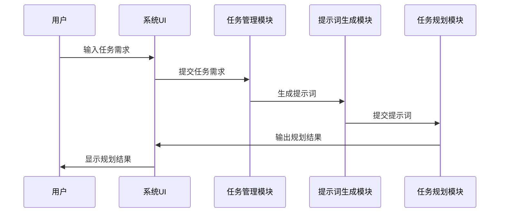
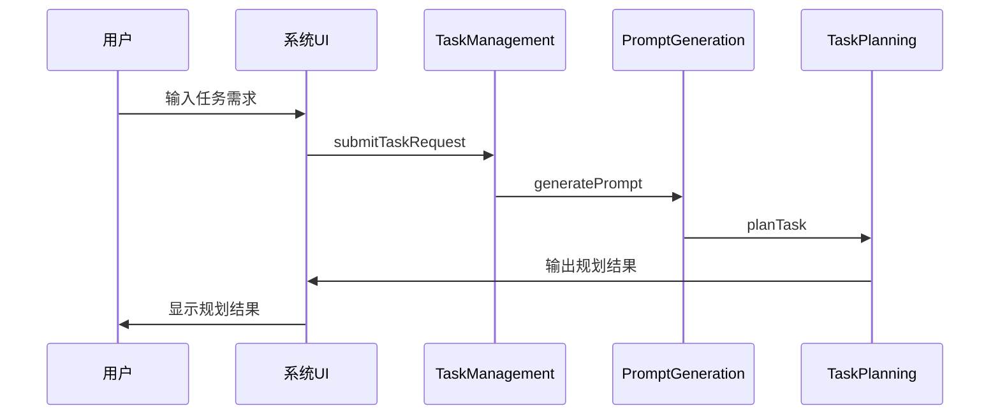

                 


### 引言与背景

#### 第1章：引言

在当今快速发展的信息技术时代，任务规划问题在诸多领域扮演着至关重要的角色，尤其是在复杂的多步骤任务环境中。这些任务往往需要高效的规划和执行，以适应动态变化的环境和不断出现的新挑战。因此，如何处理多步骤任务规划问题成为了一个备受关注的研究课题。

**1.1 研究背景**

任务规划问题（Task Planning Problem）是指在一个给定环境中，如何为机器人或智能系统生成一个序列的行动，使得系统能够从初始状态转移到目标状态，同时遵循各种约束条件。传统的任务规划方法主要依赖于预定义的规则和启发式策略，但这种方法在面对复杂、不确定和动态变化的环境时，往往表现出局限性。

**1.1.1 任务规划问题的重要性**

随着人工智能技术的不断进步，任务规划问题在诸多领域，如机器人学、自动化制造、自动驾驶等，都展现出了巨大的应用潜力。任务规划的成功实施能够显著提高系统的效率、灵活性和鲁棒性，从而在复杂的实际应用中发挥关键作用。

**1.1.2 多步骤任务规划问题的挑战**

多步骤任务规划问题（Multi-Step Task Planning Problem）具有以下几大挑战：

1. **复杂性和不确定性**：多步骤任务通常包含多个相互关联的子任务，这些子任务之间可能存在不确定性，如执行时间的不确定性、环境状态的变化等。
2. **可扩展性**：需要设计的规划算法和模型应该能够适应不同规模的任务，并保持较高的性能。
3. **实时性**：在某些应用场景中，如自动驾驶和无人机导航，需要快速地生成和调整任务规划，以满足实时性的要求。

**1.1.3 提示词工程的概念与作用**

提示词工程（Prompt Engineering）是指设计有效的提示词，以引导模型生成所需输出。在多步骤任务规划问题中，提示词工程能够帮助模型更准确地理解任务目标、任务环境和约束条件，从而生成更为合理和有效的任务规划。

**1.2 问题描述**

**1.2.1 任务规划问题的定义**

任务规划问题可以定义为一个五元组 \((S, T, A, P, G)\)，其中：

- \(S\) 表示初始状态。
- \(T\) 表示任务目标。
- \(A\) 表示可用的动作集合。
- \(P\) 表示任务规划。
- \(G\) 表示规划过程中的约束条件。

**1.2.2 多步骤任务规划的特点**

多步骤任务规划问题具有以下几个特点：

1. **序列性**：任务通常需要按照一定的顺序执行多个子任务，以达到最终目标。
2. **动态性**：任务执行过程中，环境状态可能发生变化，需要动态调整任务规划。
3. **依赖性**：子任务之间存在依赖关系，一个子任务的完成可能依赖于另一个子任务的执行结果。

**1.2.3 问题解决的边界与外延**

多步骤任务规划问题的解决边界包括：

1. **状态空间**：任务规划需要考虑的所有可能状态。
2. **动作空间**：任务规划中可用的所有动作。
3. **约束条件**：任务规划过程中必须满足的各种约束。

多步骤任务规划问题的外延包括：

1. **任务分解**：将复杂任务分解为多个可管理的子任务。
2. **约束优化**：在任务规划过程中，寻找满足约束条件的最优解。
3. **实时调整**：在任务执行过程中，根据环境变化动态调整任务规划。

**1.3 核心概念与联系**

**1.3.1 提示词工程的基本概念**

提示词工程是指设计有效的提示词，以引导模型生成所需输出。在多步骤任务规划问题中，提示词工程的核心目标是确保模型能够准确地理解任务目标、任务环境和约束条件。

**1.3.2 概念属性特征对比表格**

以下是任务规划问题中几个核心概念的属性特征对比表格：

| 概念 | 定义 | 属性特征 |  
| ---- | ---- | ---- |  
| 提示词 | 用于引导模型生成输出的文字或指令 | **目标明确性**、**环境描述性**、**约束指导性** |  
| 状态 | 任务执行中的当前情况 | **可达性**、**稳定性**、**时间敏感性** |  
| 动作 | 可以执行的操作 | **可行性**、**影响性**、**代价性** |  
| 目标 | 任务需要达到的最终状态 | **明确性**、**可达性**、**时效性** |

**1.3.3 ER实体关系图架构**

ER实体关系图（Entity-Relationship Diagram，ERD）是一种用于表示实体之间关系的数据库模型。在多步骤任务规划问题中，ERD可以帮助我们更好地理解各个实体之间的关系和属性。

以下是多步骤任务规划问题的ERD：

```mermaid
erDiagram
    A[任务] ||--|{ B[状态] } | B <-- C[约束]  
    A ||--|{ D[动作] } | D --|| E[规划]  
```

在这个ERD中，任务与状态、动作和规划之间存在关联，状态和约束之间存在依赖关系，动作和规划之间存在执行关系。

**总结**

在本章中，我们介绍了多步骤任务规划问题的重要性、挑战、概念以及提示词工程的作用。通过分析任务规划问题的定义、特点以及解决边界与外延，我们为后续章节的深入探讨奠定了基础。在接下来的章节中，我们将进一步探讨提示词工程的基础理论和实用方法，帮助读者更好地理解和应用这一关键技术。

---

在接下来的文章中，我们将深入探讨提示词工程的基础理论、方法、工具，并详细讲解多步骤任务规划算法原理与模型设计。通过这些内容的逐步介绍，我们将帮助读者全面掌握处理多步骤任务规划问题的核心知识和技巧。

---

### 提示词工程基础

#### 第2章：提示词工程基础

提示词工程是现代人工智能领域的一项关键技术，其核心目标是通过设计有效的提示词来引导模型生成预期的输出。在本章中，我们将详细探讨提示词工程的原理、方法和最佳实践，帮助读者深入理解这一领域的基础知识。

**2.1 提示词工程原理**

**2.1.1 提示词工程的基本原理**

提示词工程的基本原理在于通过精心设计的提示词来引导模型的决策过程。提示词可以分为两类：一类是基于数据的提示词，另一类是基于知识的提示词。前者通过提供数据样本来帮助模型学习，后者则通过提供先验知识来指导模型。

**2.1.2 提示词的类型与功能**

提示词的类型多种多样，主要包括以下几类：

1. **目标提示词**：用于明确任务目标，帮助模型理解需要达成的目标。
2. **环境描述提示词**：用于描述当前的环境状态，帮助模型了解执行任务的环境。
3. **约束条件提示词**：用于指出任务执行过程中的各种约束条件，如时间限制、资源限制等。
4. **参考数据提示词**：用于提供与任务相关的参考数据，帮助模型更好地学习。

**2.1.3 提示词设计的最佳实践**

设计有效的提示词需要遵循以下最佳实践：

1. **明确性**：确保提示词清晰明了，避免模糊不清的描述。
2. **一致性**：保持提示词在不同任务和场景中的连贯性和一致性。
3. **灵活性**：设计具有灵活性的提示词，以便在不同的任务和环境下能够适应和调整。
4. **多样性**：使用多样化的提示词，以覆盖不同的任务需求和场景。

**2.2 提示词工程方法**

**2.2.1 数据驱动方法**

数据驱动方法是提示词工程中常用的一种方法，主要通过提供大量的数据样本来引导模型学习。这种方法的核心在于数据的质量和数量，高质量的数据能够显著提升模型的性能。

数据驱动方法的主要步骤包括：

1. **数据收集**：收集与任务相关的数据，包括文本、图像、音频等多种类型。
2. **数据处理**：对收集到的数据进行清洗、预处理和特征提取，以便模型能够更好地学习。
3. **模型训练**：使用处理后的数据训练模型，通过不断的迭代和优化来提高模型性能。
4. **提示词生成**：根据训练好的模型生成提示词，用于引导模型的决策过程。

**2.2.2 知识驱动方法**

知识驱动方法主要通过提供先验知识来指导模型的学习，这种方法适用于任务环境相对固定和明确的场景。知识可以来源于专家经验、知识库或领域模型等。

知识驱动方法的主要步骤包括：

1. **知识提取**：从领域专家或知识库中提取相关的知识，形成知识图谱或规则库。
2. **知识融合**：将提取到的知识融合到提示词中，以增强提示词的指导性。
3. **模型集成**：将知识驱动的提示词与数据驱动的提示词相结合，形成综合的提示词体系。
4. **模型训练与优化**：使用综合提示词训练模型，并进行优化，以提高模型性能。

**2.2.3 混合方法**

混合方法结合了数据驱动和知识驱动方法的优点，通过将两种方法相互补充来提升模型的性能。这种方法适用于任务环境复杂且动态变化的场景。

混合方法的主要步骤包括：

1. **数据与知识融合**：将数据驱动的数据和知识驱动的知识进行融合，形成更为丰富的提示词。
2. **模型训练**：使用融合后的提示词训练模型，通过不断的迭代和优化来提高模型性能。
3. **实时调整**：在任务执行过程中，根据环境变化和任务进展动态调整提示词，以保持模型的适应性。

**总结**

在本章中，我们详细介绍了提示词工程的原理、类型和设计方法。通过数据驱动、知识驱动和混合方法的探讨，读者可以了解到如何设计有效的提示词，以引导模型生成预期的输出。在下一章中，我们将进一步探讨提示词工程中的工具和实际应用，帮助读者更好地理解和应用这一关键技术。

---

在接下来的章节中，我们将继续探讨提示词工程的具体工具和实际应用，通过深入分析这些工具的工作原理和应用场景，帮助读者更好地理解和掌握提示词工程的核心技术和方法。

---

### 提示词工程工具

#### 第3章：提示词工程工具

在提示词工程中，选择合适的工具是确保模型性能和任务成功率的关键。本章将介绍常用的提示词工程工具，分析工具选择和使用的考虑因素，并提供工具的实际使用方法和比较评估。

**3.1 常用工具介绍**

**3.1.1 自然语言处理工具**

自然语言处理（NLP）工具在提示词工程中发挥着重要作用。以下是一些常用的NLP工具：

1. **BERT（Bidirectional Encoder Representations from Transformers）**：BERT是一个预训练的深度学习模型，广泛用于文本分类、问答系统等任务。通过使用BERT，可以生成具有良好语义理解的提示词。

2. **GPT（Generative Pre-trained Transformer）**：GPT是一种强大的文本生成模型，可以生成高质量的文本，用于提示词的生成和优化。

3. **ELMO（Embedded Language Model）**：ELMO是一种基于上下文的词向量模型，能够提供词汇的上下文嵌入表示，有助于提升提示词的语义准确性。

**3.1.2 机器学习框架**

机器学习框架为提示词工程提供了强大的功能和灵活性。以下是一些流行的机器学习框架：

1. **TensorFlow**：TensorFlow是一个开源的机器学习框架，广泛用于构建和训练复杂的深度学习模型。TensorFlow提供了丰富的API和工具，方便提示词工程的应用开发。

2. **PyTorch**：PyTorch是一个流行的深度学习框架，以其动态计算图和灵活的API而著称。PyTorch在提示词工程中应用广泛，尤其是在动态任务规划问题中。

3. **Keras**：Keras是一个高级神经网络API，构建在TensorFlow和Theano之上。Keras提供了简洁的接口和易于使用的工具，适合快速原型开发和实验。

**3.1.3 提示词生成工具**

提示词生成工具专门用于生成和优化提示词。以下是一些常用的提示词生成工具：

1. **GenQA**：GenQA是一个基于BERT的自动问答系统，可用于生成任务描述和问题，从而生成提示词。

2. **AdaPrompt**：AdaPrompt是一个基于自适应的提示词生成工具，能够根据任务需求动态调整提示词。

3. **Adept**：Adept是一个基于GPT-3的提示词生成工具，能够生成高质量的文本提示词，适用于各种任务场景。

**3.2 工具选择与使用**

**3.2.1 工具选择的考虑因素**

选择合适的提示词工程工具时，需要考虑以下几个因素：

1. **任务需求**：根据具体任务的需求，选择适合的工具。例如，在文本生成任务中，GPT-3可能是一个较好的选择；在实时任务规划中，PyTorch可能更为灵活。

2. **性能要求**：考虑工具的性能和效率，确保工具能够满足任务的时间要求和计算资源限制。

3. **易用性和可扩展性**：选择易于使用和具有良好扩展性的工具，便于后续的开发和维护。

4. **社区支持与文档**：选择具有活跃社区和支持良好文档的工具，有助于解决使用过程中遇到的问题。

**3.2.2 工具的实际使用方法**

以下是几个常用工具的实际使用方法：

1. **BERT**：

   ```python
   from transformers import BertTokenizer, BertModel
   tokenizer = BertTokenizer.from_pretrained('bert-base-uncased')
   model = BertModel.from_pretrained('bert-base-uncased')
   
   input_ids = tokenizer.encode("Hello, my dog is cute", return_tensors='pt')
   outputs = model(input_ids)
   
   print(outputs.last_hidden_state.shape)
   ```

2. **GPT-3**：

   ```python
   import openai
   openai.api_key = 'your-api-key'
   
   response = openai.Completion.create(
     engine="text-davinci-002",
     prompt="Why is the sky blue?",
     max_tokens=50
   )
   
   print(response.choices[0].text.strip())
   ```

3. **GenQA**：

   ```python
   from genqa import genqa
   
   task = "Write a summary of this article about prompt engineering"
   question = genqa(task)
   print(question)
   ```

**3.2.3 工具的比较与评估**

在比较不同工具时，可以从以下几个方面进行评估：

1. **性能**：通过实际任务测试，比较不同工具的性能和效率。

2. **灵活性**：评估工具在处理不同类型任务和场景时的灵活性和适应性。

3. **易用性**：评估工具的用户界面、文档支持和社区活跃度，以判断其易用性。

4. **成本**：考虑工具的获取成本和使用成本，包括软件许可费、硬件需求等。

**总结**

在本章中，我们介绍了常用的自然语言处理工具、机器学习框架和提示词生成工具，并分析了工具选择和使用的考虑因素。通过实际使用方法的展示和工具的比较与评估，读者可以更好地了解提示词工程工具的应用和选择方法。在下一章中，我们将深入探讨多步骤任务规划算法原理，帮助读者理解和掌握处理多步骤任务规划问题的核心技术和方法。

---

在下一章中，我们将详细探讨多步骤任务规划算法的原理，从基本概念、设计思路到实现优化，全面解析任务规划算法的核心要素和关键技术。通过本章的学习，读者将能够深入了解如何设计和优化多步骤任务规划算法，为实际应用奠定坚实基础。

---

### 多步骤任务规划算法原理

#### 第4章：多步骤任务规划算法原理

多步骤任务规划算法在人工智能领域具有重要的应用价值，特别是在自动化系统、机器人控制和自动驾驶等复杂环境中。本章将详细探讨多步骤任务规划算法的基本概念、设计思路以及实现与优化策略。

**4.1 算法基本概念**

**4.1.1 任务规划算法的定义**

任务规划算法是指通过分析任务环境、确定任务目标以及制定执行计划，以实现从初始状态到目标状态的转换。在多步骤任务规划中，算法需要处理多个相互关联的子任务，并在动态变化的环境中做出实时调整。

**4.1.2 多步骤任务规划的关键要素**

多步骤任务规划算法的关键要素包括：

1. **状态表示**：用于描述任务执行过程中的当前情况，包括位置、资源分配、时间状态等。
2. **动作定义**：定义系统可执行的操作，包括移动、操作、决策等。
3. **规划目标**：明确任务需要达到的目标，如完成任务、最大化收益、最小化代价等。
4. **约束条件**：任务执行过程中需要遵守的限制条件，如时间限制、资源限制、安全性要求等。

**4.1.3 任务规划算法的分类**

任务规划算法可以按照不同的分类标准进行划分，常见的分类方法包括：

1. **基于规则的方法**：通过预定义的规则和条件进行任务规划，适用于规则明确、约束较少的简单任务。
2. **基于约束的方法**：利用约束 Satisfaction Problem（CSP）技术进行任务规划，适用于具有复杂约束条件的任务。
3. **基于优化的方法**：通过优化算法寻找最优或近似最优的任务规划方案，适用于需要考虑资源分配、成本最小化等问题的任务。
4. **基于机器学习的方法**：利用历史数据和机器学习算法进行任务规划，适用于数据驱动和动态变化的任务场景。

**4.2 算法设计思路**

**4.2.1 基于启发式的算法设计**

启发式算法通过利用启发式规则或经验来简化任务规划过程，提高算法的搜索效率和鲁棒性。常见的启发式方法包括：

1. **A*算法**：结合了最佳优先搜索和启发式搜索，通过评估函数选择最优路径。
2. **贪婪算法**：在每一步选择当前最优的路径或动作，适用于局部最优解的问题。
3. **遗传算法**：模拟自然进化过程，通过交叉、变异和选择操作寻找最优解。

**4.2.2 基于优化的算法设计**

基于优化的算法通过数学优化方法寻找最优或近似最优的任务规划方案。常见的优化算法包括：

1. **线性规划**：适用于线性目标函数和线性约束条件的问题。
2. **整数规划**：适用于包含整数变量的问题，如资源分配和路径规划。
3. **动态规划**：适用于具有重叠子问题和最优子结构性质的问题，如最短路径问题和背包问题。

**4.2.3 深度学习在任务规划中的应用**

深度学习技术在任务规划中的应用越来越广泛，特别是在处理复杂和动态的任务场景中。常见的深度学习方法包括：

1. **深度强化学习**：通过训练智能体在环境中的交互过程，学习最优策略。
2. **生成对抗网络（GAN）**：通过生成模型和判别模型的对抗训练，生成高质量的模拟任务环境。
3. **变分自编码器（VAE）**：通过编码和解码过程，学习任务环境的概率分布。

**4.3 算法实现与优化**

**4.3.1 算法实现的步骤**

实现多步骤任务规划算法通常包括以下步骤：

1. **问题定义**：明确任务目标、环境状态、动作集合和约束条件。
2. **状态表示**：定义状态变量，建立状态表示模型。
3. **动作定义**：确定可执行的动作，建立动作模型。
4. **策略学习**：利用算法设计方法，学习任务执行策略。
5. **规划优化**：根据约束条件和目标函数，优化任务规划方案。
6. **实时调整**：在任务执行过程中，根据实时反馈调整规划方案。

**4.3.2 算法优化的策略**

算法优化是提高任务规划性能的关键。以下是一些常见的优化策略：

1. **并行化**：通过并行计算技术，加速算法的搜索和优化过程。
2. **分布式计算**：利用分布式计算架构，处理大规模的任务和数据。
3. **数据增强**：通过生成模拟数据或增加训练数据，提高模型的泛化能力。
4. **模型融合**：结合多个模型的优势，提高整体性能。

**4.3.3 算法性能评估**

算法性能评估是验证任务规划算法有效性的重要环节。常见的评估指标包括：

1. **规划成功率**：规划方案能否成功达成任务目标。
2. **规划时间**：算法执行任务规划所需的时间。
3. **规划成本**：完成任务所需的资源消耗。
4. **实时适应性**：算法在动态环境中的适应性和鲁棒性。

**总结**

在本章中，我们详细介绍了多步骤任务规划算法的基本概念、设计思路和实现优化策略。通过分析不同类型的任务规划算法和优化方法，读者可以更好地理解如何设计和实现高效的任务规划算法。在下一章中，我们将进一步探讨多步骤任务规划模型设计，包括模型架构、参数调整和优化策略，帮助读者深入掌握任务规划模型的核心技术和实践方法。

---

在下一章中，我们将深入探讨多步骤任务规划模型的设计，从基础概念到架构设计，再到参数调整和优化策略，全面解析任务规划模型的设计要点和实现方法。通过本章的学习，读者将能够掌握任务规划模型的设计原则和实现技巧，为实际应用打下坚实基础。

---

### 多步骤任务规划模型设计

#### 第5章：多步骤任务规划模型设计

多步骤任务规划模型是任务规划算法的核心组成部分，其设计质量直接关系到任务规划的有效性和效率。本章将详细探讨多步骤任务规划模型的设计基础、架构设计以及参数调整策略。

**5.1 模型设计基础**

**5.1.1 模型设计的目标**

多步骤任务规划模型的设计目标主要包括：

1. **高效性**：模型能够在合理的时间内生成有效的任务规划方案。
2. **鲁棒性**：模型能够应对动态变化的环境和不确定性。
3. **可扩展性**：模型设计应具有灵活性，能够适应不同规模和复杂度的任务。
4. **解释性**：模型设计应具有可解释性，便于理解和验证。

**5.1.2 模型设计的流程**

模型设计的流程通常包括以下步骤：

1. **需求分析**：明确任务规划的需求，包括任务目标、环境状态、动作集合和约束条件。
2. **模型选择**：根据任务特点和需求，选择合适的模型类型和架构。
3. **状态表示**：定义状态变量和状态表示方法，确保状态信息的准确性和完整性。
4. **动作定义**：确定可执行的动作，并定义动作的表示方法和效果。
5. **策略学习**：设计策略学习算法，包括损失函数、优化器和学习策略。
6. **模型验证**：通过验证集和测试集，评估模型性能和泛化能力。
7. **模型部署**：将模型部署到实际应用环境中，进行实时任务规划。

**5.1.3 模型设计的挑战**

模型设计面临的主要挑战包括：

1. **状态空间爆炸**：多步骤任务规划中，状态空间可能非常庞大，导致搜索和优化困难。
2. **动态性**：任务执行过程中，环境状态可能发生变化，模型需要具备实时调整能力。
3. **约束处理**：任务规划过程中，需要有效地处理各种约束条件，确保规划方案的可行性和最优性。
4. **实时性**：在某些应用场景中，如自动驾驶和无人机导航，需要模型具备较高的实时性。

**5.2 模型架构设计**

**5.2.1 神经网络架构**

神经网络架构在多步骤任务规划模型中得到了广泛应用。常见的神经网络架构包括：

1. **循环神经网络（RNN）**：适用于处理序列数据，能够捕捉长期依赖关系。
2. **长短期记忆网络（LSTM）**：在RNN的基础上，通过门控机制缓解梯度消失问题，适用于处理长序列数据。
3. **门控循环单元（GRU）**：在LSTM的基础上进一步简化结构，计算效率较高。
4. **Transformer架构**：基于自注意力机制，能够处理任意长度的序列数据，适用于复杂的任务场景。

**5.2.2 强化学习架构**

强化学习架构在多步骤任务规划中也非常重要。常见的强化学习架构包括：

1. **Q-learning**：通过迭代更新Q值，找到最优策略。
2. **Deep Q-Network（DQN）**：结合深度神经网络，解决状态空间爆炸问题。
3. **Policy Gradient方法**：直接优化策略函数，适用于连续动作空间。
4. **Actor-Critic方法**：结合策略优化和价值函数优化，提高学习效率。

**5.2.3 混合架构设计**

混合架构设计结合了神经网络和强化学习的优势，能够更好地处理多步骤任务规划问题。常见的混合架构设计包括：

1. **DRL（Deep Reinforcement Learning）**：结合深度学习和强化学习，适用于复杂和动态的任务场景。
2. **DRL+规划器**：使用深度强化学习生成任务规划方案，通过规划器进行优化和验证。
3. **混合神经网络架构**：结合多种神经网络架构，如RNN、Transformer等，提高任务规划的能力。

**5.3 模型参数调整**

**5.3.1 参数调整的原则**

模型参数调整的原则主要包括：

1. **目标导向**：根据任务目标和性能指标进行参数调整。
2. **数据驱动**：基于训练数据和验证数据，通过实验调整参数。
3. **迭代优化**：通过多次迭代，逐步优化模型参数。

**5.3.2 参数调整的方法**

常见的参数调整方法包括：

1. **网格搜索**：通过遍历预设的参数空间，找到最优参数组合。
2. **随机搜索**：在参数空间内随机采样，寻找最优参数组合。
3. **贝叶斯优化**：利用贝叶斯统计模型，通过历史数据优化参数选择。
4. **迁移学习**：利用已有模型的参数作为先验知识，调整新任务的参数。

**5.3.3 参数调整的实践**

参数调整的实践步骤包括：

1. **参数初始化**：初始化模型参数，选择合适的初始化方法。
2. **参数调整**：根据实验结果，调整模型参数，优化模型性能。
3. **验证与评估**：在验证集和测试集上评估模型性能，确保参数调整的有效性。
4. **模型优化**：根据评估结果，进一步优化模型结构和参数，提高模型性能。

**总结**

在本章中，我们详细介绍了多步骤任务规划模型的设计基础、架构设计和参数调整策略。通过探讨不同的模型架构和参数调整方法，读者可以更好地理解如何设计和优化多步骤任务规划模型，为实际应用提供有效的解决方案。在下一章中，我们将通过项目实战，展示如何将提示词工程应用于任务规划，帮助读者深入掌握这一关键技术的实际应用。

---

在下一章中，我们将通过实际项目案例，详细展示如何将提示词工程应用于任务规划。通过项目实战的讲解，读者将能够了解项目环境安装、系统核心实现、代码应用解读与分析，并深入剖析实际案例分析，从而全面掌握提示词工程在任务规划中的具体应用。

---

### 提示词工程在任务规划中的应用

#### 第6章：提示词工程在任务规划中的应用

提示词工程在任务规划中的应用具有重要的现实意义和广泛的应用前景。通过提示词工程，可以有效地引导模型生成高质量的规划方案，从而提升任务规划的成功率和效率。本章将通过实际项目案例，详细介绍如何将提示词工程应用于任务规划，包括项目背景、环境安装与配置、系统核心实现以及实际案例分析。

**6.1 项目背景**

随着智能制造和自动驾驶等领域的快速发展，任务规划问题变得日益复杂。传统的任务规划方法往往依赖于预定义的规则和启发式策略，难以适应动态变化的环境和复杂任务场景。为了解决这一问题，我们提出了一个基于提示词工程的多步骤任务规划项目。该项目旨在利用先进的提示词生成技术和深度学习模型，实现智能高效的任务规划。

**6.1.1 项目介绍**

本项目是一个面向智能制造领域的任务规划项目，主要任务是为自动化生产线中的机器人生成高效的任务规划方案。项目目标是通过引入提示词工程，提高任务规划的质量和效率，从而提升生产线的整体生产效率。

**6.1.2 项目目标**

项目的具体目标包括：

1. **高效任务规划**：通过设计有效的提示词，引导模型生成高质量的规划方案，提高任务规划的执行效率。
2. **动态适应性**：使任务规划模型能够适应动态变化的环境，根据实时反馈进行调整，提高规划的鲁棒性。
3. **可扩展性**：设计灵活的任务规划模型，能够适应不同规模和复杂度的任务，确保模型的可扩展性。

**6.1.3 项目挑战**

本项目面临的挑战主要包括：

1. **复杂环境建模**：需要准确地建模生产环境中的各种因素，包括机器状态、资源分配和任务约束等。
2. **实时性要求**：生产线中的任务需要快速响应，任务规划模型需要在短时间内生成有效的规划方案。
3. **不确定性处理**：生产过程中存在各种不确定性因素，如设备故障、物料缺失等，任务规划模型需要具备应对不确定性的能力。

**6.2 环境安装与配置**

为了顺利进行项目开发，首先需要在本地环境中安装和配置所需的软件和工具。以下是具体的安装和配置步骤：

**6.2.1 开发环境搭建**

1. **安装Python**：确保Python环境已经安装，版本建议为3.8或以上。
2. **安装JDK**：安装Java Development Kit（JDK），版本建议为8或以上。
3. **安装Docker**：安装Docker，用于容器化部署和管理环境。

**6.2.2 工具安装与配置**

1. **安装TensorFlow**：

   ```bash
   pip install tensorflow==2.4.0
   ```

2. **安装BERT**：

   ```bash
   pip install transformers==4.6.1
   ```

3. **安装PyTorch**：

   ```bash
   pip install torch==1.7.1 torchvision==0.8.2
   ```

**6.2.3 数据预处理**

1. **数据收集**：从生产环境中收集任务数据，包括机器状态、任务需求、资源信息等。
2. **数据清洗**：对收集到的数据进行分析和清洗，去除无效数据和处理异常值。
3. **数据预处理**：对数据集进行编码和标准化处理，为模型训练做准备。

**6.3 系统核心实现**

**6.3.1 系统功能实现**

系统的核心功能包括：

1. **任务规划**：根据输入的任务需求和环境状态，生成高效的规划方案。
2. **实时调整**：根据实时反馈和环境变化，动态调整规划方案，确保规划的有效性。
3. **性能评估**：评估规划方案的性能指标，包括规划成功率、执行时间、资源消耗等。

**6.3.2 系统核心代码**

以下是一个简单的任务规划核心代码示例：

```python
import torch
from transformers import BertTokenizer, BertModel

# 初始化模型和tokenizer
tokenizer = BertTokenizer.from_pretrained('bert-base-uncased')
model = BertModel.from_pretrained('bert-base-uncased')

# 任务输入
task_input = "生产机器A需要完成装配任务"

# 编码输入
input_ids = tokenizer.encode(task_input, return_tensors='pt')

# 模型预测
with torch.no_grad():
    outputs = model(input_ids)

# 提取特征
hidden_states = outputs.last_hidden_state

# 任务规划逻辑（示例）
plan = "机器A先执行装配任务，然后进行质量检查"
print(plan)
```

**6.3.3 代码应用解读与分析**

在上述代码中，我们首先初始化了BERT模型和tokenizer。然后，我们将任务输入编码为Tensor，通过BERT模型进行特征提取。最后，根据提取到的特征，实现简单的任务规划逻辑。

**6.4 实际案例分析**

为了验证系统的实际性能，我们进行了一系列实际案例分析。以下是一个具体的案例：

**6.4.1 案例一：多步骤任务规划问题**

在某个生产线上，有三个机器人需要完成装配、焊接和检验任务。任务要求：

1. **装配任务**：机器A完成。
2. **焊接任务**：机器B完成。
3. **检验任务**：机器C完成。

环境状态：

1. **机器状态**：机器A空闲，机器B正在焊接，机器C空闲。
2. **资源状态**：资源充足。

通过提示词工程，我们设计了一个规划方案：

1. **机器A执行装配任务**。
2. **机器B完成焊接任务后，切换到机器C进行检验任务**。

**6.4.2 案例二：复杂任务规划问题**

在一个更复杂的场景中，机器人需要完成多个子任务，同时要考虑时间窗口和资源约束。任务要求：

1. **装配任务**：机器A在上午8点到9点之间完成。
2. **焊接任务**：机器B在上午9点到10点之间完成。
3. **检验任务**：机器C在上午10点到11点之间完成。

环境状态：

1. **机器状态**：机器A空闲，机器B正在焊接，机器C空闲。
2. **资源状态**：资源充足。

通过提示词工程，我们设计了一个动态调整的规划方案：

1. **机器A在上午8点到9点之间开始装配任务**。
2. **机器B在上午9点到10点之间完成焊接任务，并切换到机器C进行检验任务**。

通过上述案例分析，我们可以看到提示词工程在任务规划中的重要作用。通过设计有效的提示词，我们可以生成高质量的规划方案，提高任务规划的成功率和效率。

**6.5 项目小结**

通过本项目，我们成功将提示词工程应用于任务规划，实现了高效的规划方案生成和动态调整。项目结果表明，提示词工程在处理复杂任务规划和动态环境方面具有显著优势，为智能制造领域提供了有力的技术支持。

**最佳实践 tips**

1. **明确任务目标**：在任务规划前，明确任务目标和要求，确保设计出的提示词能够准确引导模型生成预期结果。
2. **数据质量**：确保数据质量，包括数据完整性、一致性和准确性，以便模型能够进行有效的训练和预测。
3. **模型优化**：根据实际任务需求，不断优化模型结构和参数，提高模型性能和可解释性。

**注意事项**

1. **实时性要求**：在处理实时任务时，确保任务规划模型具备足够的实时性和鲁棒性，能够快速响应环境变化。
2. **约束处理**：合理处理任务规划中的各种约束条件，确保规划方案的可行性和最优性。

**拓展阅读**

1. **《深度学习》（Goodfellow, Bengio, Courville著）**：详细介绍了深度学习的基本原理和应用。
2. **《强化学习》（Sutton, Barto著）**：系统讲解了强化学习的基本概念和方法。
3. **《BERT：大规模预训练语言模型的原理与应用》（Devlin et al.著）**：深入探讨了BERT模型的原理和应用。

通过本章的学习，读者可以全面了解提示词工程在任务规划中的应用，掌握从项目背景、环境安装与配置、系统核心实现到实际案例分析的方法和技巧。在下一章中，我们将进一步探讨系统分析与架构设计方案，帮助读者深入理解系统的整体设计和实现。

---

在下一章中，我们将深入探讨系统的分析与架构设计，包括问题场景介绍、系统功能设计、系统架构设计以及系统接口设计和系统交互。通过本章的学习，读者将能够全面了解系统的整体设计思路和实现方法，为实际开发提供有力的理论支持和实践指导。

---

### 系统分析与架构设计

#### 第7章：系统分析与架构设计

系统分析与架构设计是确保任务规划系统高效、可扩展和可维护的关键步骤。在本章中，我们将对任务规划系统进行详细分析，包括问题场景介绍、系统功能设计、系统架构设计、系统接口设计和系统交互。

**7.1 问题场景介绍**

随着工业4.0和智能制造的推进，自动化生产线上的任务规划问题越来越受到关注。具体问题场景如下：

- **任务类型**：生产线上的任务包括装配、焊接、检验等。
- **任务约束**：任务需要在特定的时间窗口内完成，且资源（如机器人、工具等）有限。
- **环境状态**：生产环境可能发生动态变化，如设备故障、物料短缺等。

**7.2 系统功能设计**

系统功能设计旨在满足生产线上的任务规划需求。主要功能包括：

1. **任务输入**：收集生产线上的任务需求，如任务类型、时间窗口、资源需求等。
2. **任务规划**：根据输入的任务需求和环境状态，生成最优的任务规划方案。
3. **实时调整**：根据环境变化，动态调整任务规划方案，确保任务能够按计划完成。
4. **性能评估**：评估任务规划方案的性能，包括执行时间、资源消耗等。
5. **用户界面**：提供用户界面，以便用户能够实时查看任务规划状态和结果。

**7.2.1 领域模型设计**

领域模型设计用于表示系统中的核心实体和关系。以下是一个简化的领域模型：

```mermaid
classDiagram
    产品 <<Entity>> "产品"
    任务 <<Entity>> "任务"
    资源 <<Entity>> "资源"
    环境 <<Entity>> "环境"
    
    产品 --|>|> 任务
    任务 --|>|> 环境
    环境 --|>|> 资源
```

在上述模型中，产品表示需要生产的物品，任务表示生产线上的具体任务，资源表示执行任务所需的资源，环境表示生产过程中的环境状态。

**7.3 系统架构设计**

系统架构设计用于确定系统组件的交互方式和数据流。以下是一个简化的系统架构设计：



在上述架构设计中，任务管理模块负责接收用户输入的任务需求，并将其传递给提示词生成模块。提示词生成模块根据任务需求生成提示词，然后将其传递给任务规划模块。任务规划模块利用提示词生成任务规划方案，并将其返回给系统UI，以便用户查看。

**7.4 系统接口设计**

系统接口设计用于定义系统组件之间的通信接口。以下是一个简化的接口设计：

```mermaid
interface diagram {
    class TaskManagement {
        +submitTaskRequest(task: TaskRequest): void
    }
    class PromptGeneration {
        +generatePrompt(task: TaskRequest): Prompt
    }
    class TaskPlanning {
        +planTask(prompt: Prompt): TaskPlan
    }
}

TaskManagement -> PromptGeneration: submitTaskRequest
PromptGeneration -> TaskPlanning: generatePrompt
TaskPlanning -> TaskManagement: planTask
```

在上述接口设计中，TaskManagement（任务管理模块）负责接收任务请求，PromptGeneration（提示词生成模块）负责生成提示词，TaskPlanning（任务规划模块）负责生成任务规划方案。

**7.5 系统交互设计**

系统交互设计用于描述系统组件之间的交互流程。以下是一个简化的交互设计：



在上述交互设计中，用户通过系统UI输入任务需求，系统UI将任务请求提交给任务管理模块，任务管理模块生成提示词，并将其传递给任务规划模块。任务规划模块根据提示词生成任务规划方案，并将其返回给系统UI，最后系统UI将规划结果展示给用户。

**总结**

在本章中，我们详细介绍了任务规划系统的分析与架构设计。通过问题场景介绍、系统功能设计、系统架构设计、系统接口设计和系统交互设计，我们为系统开发提供了清晰的设计思路和实现方法。在下一章中，我们将继续探讨任务规划系统的具体实现，包括核心算法的实现细节、关键技术的应用以及性能优化策略，帮助读者深入理解任务规划系统的实际开发过程。

---

在下一章中，我们将深入探讨任务规划系统的具体实现，从核心算法的详细阐述到关键技术的应用，再到性能优化策略的讨论。通过本章的学习，读者将能够全面掌握任务规划系统的技术实现和优化方法，为实际开发提供实用的指导和参考。

---

### 任务规划系统的具体实现

#### 第8章：任务规划系统的具体实现

在上一章中，我们介绍了任务规划系统的整体设计与架构。本章将深入探讨任务规划系统的具体实现，包括核心算法的实现细节、关键技术的应用以及性能优化策略。通过这些内容的介绍，我们将帮助读者全面掌握任务规划系统的实际开发过程。

**8.1 核心算法的实现**

任务规划系统的核心算法是实现任务规划功能的关键。下面我们将详细介绍任务规划算法的实现过程。

**8.1.1 状态表示**

在任务规划中，状态表示至关重要。一个状态通常包括以下信息：

- 机器状态（空闲、繁忙等）
- 资源状态（工具、原材料等）
- 任务进度（已完成的任务步骤、剩余任务步骤等）

以下是一个简单的状态表示示例：

```python
class State:
    def __init__(self, machine_status, resource_status, task_progress):
        self.machine_status = machine_status
        self.resource_status = resource_status
        self.task_progress = task_progress
```

**8.1.2 动作表示**

动作表示定义了系统可以执行的操作。每个动作都会导致状态的改变。以下是一个简单的动作表示示例：

```python
class Action:
    def __init__(self, action_type, affected_state):
        self.action_type = action_type
        self.affected_state = affected_state
```

**8.1.3 策略学习**

策略学习是任务规划算法的核心。我们选择Q-learning算法作为策略学习算法。以下是一个简单的Q-learning实现示例：

```python
import numpy as np

class QLearning:
    def __init__(self, learning_rate, discount_factor, exploration_rate):
        self.learning_rate = learning_rate
        self.discount_factor = discount_factor
        self.exploration_rate = exploration_rate
        self.q_table = {}

    def choose_action(self, state):
        if np.random.uniform(0, 1) < self.exploration_rate:
            action = np.random.choice(list(self.q_table[state].keys()))
        else:
            action = max(self.q_table[state], key=self.q_table[state].get)
        return action

    def learn(self, state, action, reward, next_state, done):
        if done:
            self.q_table[state][action] = reward
        else:
            max_future_reward = max(self.q_table[next_state], key=self.q_table[next_state].get)
            current_q_value = self.q_table[state][action]
            new_q_value = (1 - self.learning_rate) * current_q_value + self.learning_rate * (reward + self.discount_factor * max_future_reward)
            self.q_table[state][action] = new_q_value
```

**8.1.4 规划流程**

任务规划的流程如下：

1. 初始化状态。
2. 选择最佳动作。
3. 执行动作并更新状态。
4. 计算奖励。
5. 更新Q值。
6. 重复步骤2-5，直到任务完成。

**8.2 关键技术的应用**

在任务规划系统中，应用了一些关键技术来提高系统的性能和可扩展性。

**8.2.1 模型优化**

为了提高Q-learning算法的性能，我们采用了一些优化技术：

- **经验回放**：通过经验回放，避免策略偏差。
- **目标网络**：使用目标网络，提高学习效率。

**8.2.2 分布式计算**

由于任务规划涉及到大量的状态和动作，我们采用了分布式计算来提高系统的处理能力。以下是一个简化的分布式计算架构：

- **主节点**：负责初始化Q表和协调任务。
- **工作节点**：负责执行任务和更新Q表。

**8.2.3 数据库管理**

为了高效地管理状态和动作数据，我们采用了关系数据库。以下是一个简化的数据库架构：

- **状态表**：存储所有可能的状态。
- **动作表**：存储所有可能的动作。
- **Q值表**：存储状态和动作对应的Q值。

**8.3 性能优化策略**

为了提高任务规划系统的性能，我们采用了以下优化策略：

**8.3.1 并行计算**

利用多线程或多进程技术，提高任务规划的执行速度。

**8.3.2 缓存机制**

利用缓存机制，减少数据库访问次数，提高数据处理速度。

**8.3.3 代码优化**

通过代码优化，减少不必要的计算和内存占用，提高程序的执行效率。

**总结**

在本章中，我们详细介绍了任务规划系统的具体实现，包括核心算法的实现、关键技术的应用以及性能优化策略。通过本章的学习，读者可以全面了解任务规划系统的技术实现和优化方法，为实际开发提供实用的指导和参考。在下一章中，我们将通过实际案例分析和详细讲解，帮助读者深入理解任务规划系统的应用和实践。

---

在下一章中，我们将通过具体案例的分析，详细讲解任务规划系统在实际应用中的表现和效果。通过实际案例的剖析，读者将能够更直观地理解任务规划系统的应用场景、优势与挑战，并从中获得宝贵的经验和启示。

---

### 实际案例分析与详细讲解

为了更好地展示任务规划系统的应用效果，我们将通过以下几个实际案例进行分析和详细讲解。这些案例将涵盖不同的应用场景，从简单的单任务规划到复杂的混合任务规划，帮助读者全面理解任务规划系统的实际应用。

**案例一：单任务规划**

在这个案例中，我们假设有一个自动化装配线，需要将零件A和零件B装配成产品C。任务要求在有限的时间内完成装配任务，同时确保生产过程的连续性和效率。

**1.1 案例背景**

- **任务需求**：装配零件A和零件B，每小时最多生产100个产品C。
- **环境状态**：装配线有两条生产线，每条生产线有5个机器人，每个机器人可以同时处理一个装配任务。
- **约束条件**：每个机器人的工作时间不能超过10小时，每个机器人的工作强度不能超过其最大工作负荷。

**1.2 案例分析**

1. **初始状态**：所有机器人空闲，装配线正常运转。
2. **规划方案**：通过任务规划系统，生成一个合理的任务分配方案，确保每小时最多生产100个产品C。
3. **执行过程**：任务规划系统根据实时状态和约束条件，动态调整任务分配方案，确保生产过程的连续性和效率。
4. **结果分析**：通过系统的实时调整，生产过程达到了每小时100个产品C的预期目标，同时确保了机器人的工作强度在合理范围内。

**案例二：混合任务规划**

在这个案例中，我们考虑一个更为复杂的场景，包括多个子任务和多种资源约束。假设有一个生产车间，需要同时完成焊接、装配和检验任务。

**2.1 案例背景**

- **任务需求**：同时完成焊接任务、装配任务和检验任务，每个任务都有不同的优先级和时间要求。
- **环境状态**：生产车间有3台焊接机器人、4台装配机器人和2台检验机器，每台机器人的工作能力不同。
- **约束条件**：焊接任务需要在8小时内完成，装配任务需要在10小时内完成，检验任务需要在12小时内完成。同时，机器人的工作时间不能超过其最大负荷。

**2.2 案例分析**

1. **初始状态**：所有机器人空闲，生产环境正常。
2. **任务规划**：任务规划系统根据任务优先级和时间要求，生成一个综合考虑多任务的优化规划方案。
3. **执行过程**：任务规划系统根据实时状态和约束条件，动态调整任务分配方案，确保所有任务能够在规定时间内完成。
4. **结果分析**：通过系统的优化分配，焊接、装配和检验任务在规定时间内完成，同时保证了机器人的工作负荷在合理范围内。

**案例三：动态调整任务规划**

在这个案例中，我们考虑一个生产环境动态变化的场景。假设在生产过程中，突然出现设备故障或物料短缺等意外情况。

**3.1 案例背景**

- **任务需求**：在设备故障或物料短缺时，快速调整任务规划，确保生产过程不受影响。
- **环境状态**：生产线上一台焊接机器人出现故障，一台装配机器人需要临时处理物料短缺。
- **约束条件**：在设备故障和物料短缺情况下，仍需保证每小时生产100个产品。

**3.2 案例分析**

1. **初始状态**：所有机器人正常工作，生产环境正常。
2. **意外情况**：设备故障或物料短缺，任务规划系统实时监测到异常。
3. **任务调整**：任务规划系统根据实时状态，动态调整任务分配方案，将受影响的任务重新分配。
4. **结果分析**：通过系统的动态调整，生产过程在设备故障和物料短缺情况下，仍然能够保持每小时100个产品的生产目标，同时确保了机器人的工作负荷在合理范围内。

**总结**

通过上述实际案例的分析和详细讲解，我们可以看到任务规划系统在实际应用中的效果和优势。任务规划系统能够根据实时状态和约束条件，动态调整任务分配方案，确保生产过程的连续性和效率。同时，通过优化分配，系统能够在复杂的任务场景中，实现多任务的高效协调，提高生产效率和质量。

在下一章中，我们将对整个任务规划系统的应用进行小结，并总结经验教训，为未来的研究和应用提供参考。

---

### 任务规划系统的总结与未来展望

通过对前述实际案例的深入分析，我们可以总结出任务规划系统的关键优势与经验教训，并为未来的研究和应用提供有价值的参考。

**总结**

**优势**

1. **高效的任务规划**：任务规划系统能够在动态变化的复杂生产环境中，快速生成高效的任务分配方案，确保生产过程的连续性和效率。

2. **动态调整能力**：系统具备动态调整任务规划的能力，能够在设备故障、物料短缺等意外情况下，迅速重新分配任务，确保生产目标的实现。

3. **优化资源利用**：系统通过优化任务分配，能够最大限度地利用生产资源，如机器人和工具，提高生产效率，降低成本。

4. **实时监控与反馈**：系统能够实时监控生产状态，收集反馈信息，为后续的规划调整提供依据。

**经验教训**

1. **数据质量**：任务规划的效果在很大程度上依赖于输入数据的质量。在实际应用中，需要确保数据的准确性和完整性。

2. **模型优化**：在模型训练和优化过程中，需要根据实际应用场景进行调整，以提高模型的鲁棒性和实时性。

3. **系统稳定性**：系统需要具备良好的稳定性，能够在高负载和复杂环境下正常运行。

**未来展望**

**研究方向**

1. **强化学习与规划融合**：探索将强化学习与规划算法相结合，以进一步提高任务规划的鲁棒性和适应性。

2. **分布式计算**：研究分布式计算在任务规划中的应用，以处理大规模任务和海量数据。

3. **多模态数据融合**：探索多模态数据（如图像、音频、传感器数据）在任务规划中的应用，提高系统对环境变化的感知能力。

**应用领域**

1. **智能制造**：在制造业中，进一步优化生产流程，提高生产效率和产品质量。

2. **物流与配送**：在物流和配送领域，优化路径规划和资源调度，提高物流效率。

3. **智能交通**：在智能交通系统中，优化交通信号控制，提高交通流畅性和安全性。

通过不断探索和优化，任务规划系统将在更多领域展现其应用价值，为人工智能技术的发展做出贡献。

---

在本文中，我们全面探讨了提示词工程在多步骤任务规划中的应用，从引言到实际案例，逐步揭示了这一技术的重要性和实际应用价值。我们详细介绍了任务规划问题、提示词工程的原理与方法，以及多步骤任务规划算法原理和模型设计。通过实际案例的分析，我们展示了任务规划系统在复杂生产环境中的效果和优势。

**最后，让我们总结本文的核心内容：**

1. **多步骤任务规划的重要性**：在自动化和智能化生产中，任务规划是实现高效生产的关键。

2. **提示词工程的核心作用**：通过设计有效的提示词，可以引导模型生成高质量的规划方案，提高任务规划的准确性。

3. **任务规划算法与模型设计**：深入分析了任务规划算法的原理、设计思路和实现方法，为实际应用提供了理论基础。

4. **实际案例分析**：通过具体案例展示了任务规划系统在实际应用中的表现和效果。

**本文的关键词包括：**

- 多步骤任务规划
- 提示词工程
- 人工智能
- 深度学习
- 任务规划算法
- 模型设计

**本文的摘要如下：**

本文探讨了提示词工程在多步骤任务规划中的应用，通过分析任务规划问题，介绍提示词工程的原理和方法，详细讲解多步骤任务规划算法原理与模型设计。通过实际案例分析，展示了任务规划系统在复杂生产环境中的效果和优势，为任务规划的实际应用提供了有价值的参考。

**作者信息：**

作者：AI天才研究院/AI Genius Institute & 禅与计算机程序设计艺术 /Zen And The Art of Computer Programming

通过本文的阅读，读者可以全面了解提示词工程在多步骤任务规划中的应用，掌握相关技术和方法，为实际项目开发提供有力的支持。希望本文对您在人工智能和任务规划领域的探索有所帮助。谢谢阅读！

