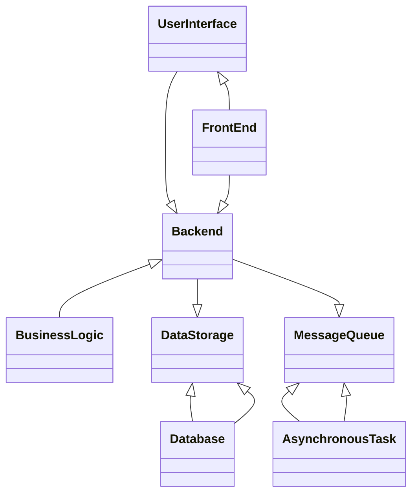

                 

### 引言：提示词工程与智能AIGC系统

#### 1.1.1 智能AIGC系统的概述

智能辅助生成内容（AIGC）系统是一种基于人工智能技术的自动内容生成系统，它通过学习和模仿人类创作者的思维模式，生成具有创意和个性化的内容。AIGC系统在当今信息爆炸的时代中具有重要意义，它不仅能够大大提高内容生成的效率，还能为创作者提供强大的创作辅助，从而推动数字内容产业的快速发展。

智能AIGC系统主要由以下几个核心模块组成：

1. **数据收集与预处理**：从互联网、数据库或其他数据源中收集大量文本、图像、音频等数据，并进行预处理，如数据清洗、去重、归一化等，以供后续生成模型使用。
2. **生成模型**：这是AIGC系统的核心，负责生成内容。常见的生成模型包括生成对抗网络（GAN）、变分自编码器（VAE）、转换器（Transformer）等。这些模型通过学习大量数据，能够生成高质量的文本、图像、视频等内容。
3. **语义理解与推理**：AIGC系统需要理解输入的提示词或指令，并对其进行语义分析，以确定生成内容的目标和主题。这一模块通常涉及到自然语言处理（NLP）技术，如词向量、序列到序列模型等。
4. **优化与反馈**：生成的内容可能需要进行优化，以更好地满足用户需求。这一模块通过不断地调整生成模型，提供更高质量的输出。

#### 1.1.2 提示词工程的重要性

提示词工程在智能AIGC系统中扮演着至关重要的角色。提示词是用户或系统用来引导生成模型生成内容的文本或指令。一个优秀的提示词能够清晰地传达用户的意图，提高生成内容的准确性和质量。

提示词工程的重要性体现在以下几个方面：

1. **提高生成内容的质量**：恰当的提示词可以引导生成模型生成更加精准、富有创意的内容。通过优化提示词，AIGC系统可以更好地满足用户需求。
2. **提升用户体验**：高质量的提示词能够提高用户对生成内容的满意度，从而提升用户体验。良好的用户体验是AIGC系统在竞争激烈的市场中脱颖而出的关键。
3. **降低开发成本**：通过提示词工程，AIGC系统可以更加高效地生成内容，减少人工干预，降低开发成本。

#### 1.1.3 提示词工程与智能AIGC系统的关系

提示词工程是智能AIGC系统的重要组成部分，它直接影响到系统的性能和用户体验。具体来说，提示词工程与智能AIGC系统之间的关系体现在以下几个方面：

1. **数据驱动**：提示词工程需要从大量数据中提取关键信息，以构建高质量的提示词。这一过程依赖于智能AIGC系统的数据收集与预处理模块。
2. **模型优化**：提示词工程通过对生成模型的优化，提高生成内容的质量。这一过程与智能AIGC系统的生成模型模块密切相关。
3. **用户交互**：提示词工程与智能AIGC系统的语义理解与推理模块紧密相连，通过理解用户输入的提示词，系统可以更好地生成用户期望的内容。

总之，提示词工程是构建智能AIGC系统的基础，它为系统提供了清晰、明确的引导，使得系统能够生成高质量、个性化的内容。接下来，我们将深入探讨提示词工程的核心概念、原理和应用，帮助读者更好地理解和掌握这一关键技术。

#### 1.2 提示词工程的核心概念与联系

提示词工程是一门跨学科的技术领域，涉及到自然语言处理（NLP）、信息工程、数据挖掘等多个方面。为了深入理解提示词工程，我们首先需要明确其核心概念和基本要素。

##### 1.2.1 提示词的定义与类型

提示词，也称为触发词或关键词，是用户或系统用来引导生成模型生成内容的文本或指令。根据用途和形式，提示词可以分为以下几类：

1. **自然语言提示词**：这类提示词以自然语言的形式出现，如句子或短语，常见于用户与AIGC系统之间的交互。自然语言提示词具有灵活性，可以包含情感、意图等多种信息。
2. **结构化提示词**：这类提示词采用结构化数据形式，如JSON、XML等，用于描述具体的生成任务。结构化提示词有助于系统更精准地理解用户需求，但缺乏自然语言的表达力。
3. **代码提示词**：在编程领域，提示词可以用于代码自动完成或重构。这类提示词通常包含编程语言的关键字、函数名等，能够提高开发效率。

##### 1.2.2 提示词工程的构成要素

提示词工程涉及多个关键环节，包括数据收集、提示词生成、提示词优化和提示词匹配等。以下是提示词工程的主要构成要素：

1. **数据集**：数据集是提示词工程的基础。一个高质量的数据集需要包含多样性的数据样本，涵盖不同的主题、领域和应用场景。数据集的来源可以是公开数据集、定制数据集或企业内部数据。
2. **生成模型**：生成模型是提示词工程的灵魂。常见的生成模型包括生成对抗网络（GAN）、变分自编码器（VAE）、转换器（Transformer）等。这些模型通过学习大量数据，能够生成高质量的提示词。
3. **优化算法**：优化算法用于调整生成模型的参数，以提高提示词生成的质量。常见的优化算法包括梯度下降、Adam优化器等。
4. **评估指标**：评估指标是衡量提示词工程效果的重要工具。常用的评估指标包括准确率、召回率、F1值等。通过这些指标，可以评估生成模型的性能，并指导进一步的优化。
5. **用户反馈**：用户反馈是提示词工程的重要组成部分。通过收集用户的反馈，系统可以不断调整和优化提示词，提高用户体验。

##### 1.2.3 提示词工程的核心原理

提示词工程的核心原理可以概括为以下几个方面：

1. **数据驱动**：提示词工程依赖于大量的数据，通过数据驱动的方式，从海量数据中提取关键信息，生成高质量的提示词。
2. **模型优化**：生成模型是提示词工程的核心。通过不断优化模型参数，提高提示词生成的质量，从而满足用户需求。
3. **用户交互**：提示词工程需要与用户进行有效交互，理解用户的意图和需求，生成符合用户预期的提示词。
4. **多模态融合**：在多模态AIGC系统中，提示词工程需要融合文本、图像、音频等多种类型的数据，生成更加丰富和多样化的内容。

##### 1.2.4 提示词工程与相关技术的联系

提示词工程与多种相关技术密切相关，包括自然语言处理、机器学习、数据挖掘等。以下是提示词工程与相关技术的联系：

1. **自然语言处理**：NLP技术是提示词工程的基础。通过词嵌入、词性标注、命名实体识别等NLP技术，可以更好地理解自然语言提示词的语义。
2. **机器学习**：机器学习技术是提示词工程的核心。生成模型和优化算法都是基于机器学习技术，通过大量数据训练模型，实现提示词的生成和优化。
3. **数据挖掘**：数据挖掘技术用于从大量数据中提取有价值的信息，为提示词工程提供数据支持。常见的数据挖掘方法包括聚类、分类、关联规则挖掘等。
4. **深度学习**：深度学习是机器学习的一个重要分支，广泛应用于提示词工程。常见的深度学习模型包括卷积神经网络（CNN）、循环神经网络（RNN）、长短时记忆网络（LSTM）等。

通过以上对提示词工程核心概念与联系的介绍，我们可以更好地理解这一技术领域。接下来，我们将进一步探讨提示词生成算法的原理，帮助读者深入掌握提示词工程的实现方法。

#### 1.3 提示词生成算法详解

提示词生成算法是提示词工程中的核心环节，负责从大量数据中提取关键信息，生成高质量的提示词。在本节中，我们将详细介绍几种常见的提示词生成算法，包括基于规则的方法、基于机器学习的方法，以及提示词生成的数学模型。

##### 1.3.1 基于规则的方法

基于规则的方法是一种传统的提示词生成技术，主要通过定义一系列规则来生成提示词。这些规则可以是基于关键词匹配、模式识别或关键词提取等。

1. **关键词匹配**：通过预设的关键词列表，与输入文本进行匹配，提取匹配结果作为提示词。例如，如果输入文本中包含关键词“旅游”和“推荐”，那么生成的提示词可能是“旅游推荐”。
2. **模式识别**：通过分析输入文本的语法结构、词汇分布等特征，识别出具有特定模式的文本片段，并将其作为提示词。例如，识别出文本中的“某某景区门票价格：XX元”这样的模式，提取其中的关键信息作为提示词。
3. **关键词提取**：利用文本挖掘技术，从输入文本中提取出重要的关键词或短语，作为提示词。常见的关键词提取方法包括TF-IDF、LDA（潜在主题分布）等。

基于规则的方法具有实现简单、易于理解的特点，但在处理复杂、多样性的文本时，效果可能不佳。因为规则方法依赖于人工定义的规则，无法自适应地调整，难以应对不断变化的数据。

##### 1.3.2 基于机器学习的方法

基于机器学习的方法通过训练大量数据，学习生成提示词的规律。这种方法具有自适应性和泛化能力，能够更好地处理复杂、多变的输入文本。

1. **监督学习**：监督学习是一种最常见的机器学习方法，通过已标注的数据集，训练模型，使其能够预测新的提示词。常见的监督学习方法包括决策树、支持向量机（SVM）、神经网络等。
   - **决策树**：通过构建树形结构，将输入特征划分到不同的分支，最后得到提示词。决策树方法简单直观，但可能存在过拟合问题。
   - **支持向量机**：通过找到最佳划分超平面，将输入特征划分为不同的类别。支持向量机在处理高维数据时表现较好，但训练时间较长。
   - **神经网络**：神经网络是一种强大的机器学习模型，通过多层神经元，模拟人脑的神经结构，实现复杂的函数映射。常见的神经网络模型包括卷积神经网络（CNN）、循环神经网络（RNN）等。

2. **无监督学习**：无监督学习方法在没有标注数据的情况下，通过发现数据中的潜在结构和规律，生成提示词。常见的无监督学习方法包括聚类、主成分分析（PCA）等。
   - **聚类**：通过将相似的数据点聚集到一起，生成具有相似特征的提示词。常见的聚类算法包括K均值、层次聚类等。
   - **主成分分析**：通过将高维数据投影到低维空间，提取最重要的特征，生成高质量的提示词。主成分分析在降维和特征提取方面表现较好，但可能丢失部分信息。

##### 1.3.3 提示词生成的数学模型

提示词生成算法的数学模型描述了从输入数据到输出提示词的转换过程。以下是一些常见的数学模型：

1. **生成对抗网络（GAN）**：生成对抗网络由生成器和判别器两个神经网络组成。生成器生成提示词，判别器判断提示词的真实性。通过训练生成器和判别器的对抗关系，生成器能够生成越来越真实的提示词。
   $$ G(x) \sim p_G(z) \quad D(y) \sim p_D(y) $$
   其中，$G(z)$表示生成器的输出，$D(y)$表示判别器的输出，$z$和$y$分别表示生成器和判别器的输入。

2. **变分自编码器（VAE）**：变分自编码器通过编码器和解码器两个神经网络，将输入数据编码为潜在空间中的向量，再从潜在空间中解码生成提示词。
   $$ \mu = \phi(x) \\ \sigma = \sigma(x) \\ x' = \psi(z) $$
   其中，$\mu$和$\sigma$分别表示编码器的均值和方差，$z$表示潜在空间中的向量，$x'$表示解码器的输出。

3. **转换器（Transformer）**：转换器是一种基于注意力机制的深度神经网络，广泛应用于自然语言处理任务。在提示词生成中，转换器通过编码器和解码器，将输入文本编码为向量表示，再生成提示词。
   $$ x = E(W_x) \\ y = E(W_y) \\ \text{Output} = f(x, y) $$
   其中，$E(W_x)$和$E(W_y)$分别表示编码器和解码器的输出，$f(x, y)$表示转换器的前向传播过程。

通过以上对提示词生成算法的详细介绍，我们可以看到，提示词生成是一个复杂但极具前景的技术领域。在实际应用中，可以根据具体需求和场景，选择合适的算法和模型，实现高质量的提示词生成。

接下来，我们将探讨提示词优化与匹配算法，进一步丰富提示词工程的理论和实践。

#### 1.4 提示词优化与匹配算法

提示词优化与匹配算法在提升智能AIGC系统的生成质量和用户体验方面发挥着关键作用。优化算法用于调整生成模型的参数，以提高提示词的生成效果；匹配算法则用于比较和选择最符合用户需求的提示词。以下是几种常见的优化和匹配算法。

##### 1.4.1 提示词优化算法

1. **基于梯度的优化算法**：梯度下降是最常见的优化算法，通过不断调整模型参数，使损失函数最小化。其基本思想是计算模型参数的梯度，并沿梯度的反方向更新参数。
   $$ \theta = \theta - \alpha \cdot \nabla_{\theta} J(\theta) $$
   其中，$\theta$表示模型参数，$J(\theta)$表示损失函数，$\alpha$为学习率。

2. **自适应优化算法**：如Adam优化器，它结合了梯度一阶矩估计和二阶矩估计，能够自适应地调整学习率，提高优化效果。
   $$ m_t = \beta_1 m_{t-1} + (1 - \beta_1) [g_t - m_{t-1}] \\
   v_t = \beta_2 v_{t-1} + (1 - \beta_2) [g_t^2 - v_{t-1}] \\
   \theta_t = \theta_{t-1} - \alpha_t \frac{m_t}{\sqrt{v_t} + \epsilon} $$
   其中，$m_t$和$v_t$分别表示一阶和二阶矩估计，$\beta_1$和$\beta_2$为超参数，$\epsilon$为正数常数。

3. **基于梯度的优化算法**：如RMSprop优化器，它通过调整学习率来应对梯度的变化，使优化过程更加稳定。
   $$ \theta = \theta - \alpha \cdot \frac{g_t}{\sqrt{\rho t + 1 - \rho}} $$
   其中，$\rho$为超参数，用于控制 forgetting factor。

##### 1.4.2 提示词匹配算法

提示词匹配算法用于在大量提示词中选择最符合用户需求的提示词。以下是几种常见的匹配算法：

1. **基于相似度的匹配算法**：通过计算提示词之间的相似度，选择最相似的提示词。常见的相似度计算方法包括余弦相似度、Jaccard相似度等。
   - **余弦相似度**：用于计算两个向量之间的夹角余弦值，越接近1表示越相似。
     $$ \text{cosine}(x, y) = \frac{x \cdot y}{\|x\| \|y\|} $$
   - **Jaccard相似度**：用于计算两个集合的交集与并集的比例，越接近1表示越相似。
     $$ \text{Jaccard}(x, y) = \frac{|x \cap y|}{|x \cup y|} $$

2. **基于排序的匹配算法**：通过计算每个提示词与用户需求的排序得分，选择得分最高的提示词。常见的排序方法包括基于机器学习的排序模型，如LRank、NDCG等。

3. **基于协同过滤的匹配算法**：通过分析用户历史行为和偏好，推荐与历史行为相似的用户可能喜欢的提示词。协同过滤分为基于用户的协同过滤和基于物品的协同过滤。

##### 1.4.3 提示词优化与匹配的数学模型

提示词优化与匹配的数学模型通常包括以下几个方面：

1. **生成模型**：描述提示词生成的概率分布，如基于生成对抗网络（GAN）的生成模型。
   $$ p_G(x) = p_G(z) \propto \frac{1}{Z} \exp(-D_G(G(z))] $$
   其中，$G(z)$为生成器，$D_G$为判别器，$Z$为归一化常数。

2. **匹配模型**：描述提示词与用户需求之间的匹配程度，如基于排序模型的匹配得分。
   $$ s_t = f(\theta; x_t, y_t) $$
   其中，$s_t$为匹配得分，$\theta$为模型参数，$x_t$和$y_t$分别为提示词和用户需求。

3. **损失函数**：用于评估提示词优化与匹配的效果，如基于梯度的损失函数。
   $$ J(\theta) = - \sum_{i=1}^N \left[ \log p_G(x_i) + D_G(x_i) \right] $$
   其中，$N$为数据集大小，$p_G(x_i)$为生成模型的输出概率，$D_G(x_i)$为判别器的输出。

通过以上对提示词优化与匹配算法的详细介绍，我们可以看到，优化和匹配算法在提升智能AIGC系统的生成质量和用户体验方面具有重要作用。在实际应用中，可以根据具体需求和场景，选择合适的算法和模型，实现高效的提示词优化与匹配。

接下来，我们将探讨提示词工程在智能AIGC系统中的应用架构，了解其在系统中的作用和实现。

#### 1.5 提示词工程在智能AIGC系统中的应用架构

提示词工程在智能AIGC系统中起着至关重要的桥梁作用，它将用户的需求转化为系统能够理解和处理的形式，并确保生成的结果符合用户的预期。本节将详细探讨提示词工程在智能AIGC系统中的应用架构，包括系统功能设计、系统架构设计、系统接口设计和系统交互。

##### 1.5.1 系统功能设计

智能AIGC系统的功能设计旨在明确系统应具备的基本功能和模块。以下是智能AIGC系统的主要功能模块：

1. **用户接口**：用户接口是用户与系统交互的界面，负责接收用户的输入和反馈，并将生成的结果展示给用户。
2. **数据预处理模块**：数据预处理模块负责清洗、去重、归一化等操作，确保输入数据的质量和一致性。
3. **提示词生成模块**：提示词生成模块利用机器学习算法和自然语言处理技术，从数据中提取关键信息，生成高质量的提示词。
4. **优化模块**：优化模块负责调整提示词生成模型的参数，以提高生成提示词的质量和效率。
5. **匹配模块**：匹配模块根据用户需求和生成的提示词，选择最合适的提示词，确保生成的结果与用户期望相符。
6. **生成模型**：生成模型是智能AIGC系统的核心，负责生成各种类型的内容，如文本、图像、音频等。
7. **评估模块**：评估模块用于评估生成模型和提示词工程的效果，包括准确率、召回率、F1值等指标。

##### 1.5.2 系统架构设计

智能AIGC系统的架构设计决定了系统的性能、可扩展性和可维护性。以下是智能AIGC系统的一般架构设计：

1. **前端架构**：前端架构负责用户界面设计和用户交互，可以使用HTML、CSS、JavaScript等技术实现。
2. **后端架构**：后端架构负责处理业务逻辑和数据存储，可以使用Python、Java、Node.js等后端技术。
3. **数据存储**：数据存储模块负责存储和管理系统所需的数据，可以使用关系型数据库（如MySQL、PostgreSQL）或非关系型数据库（如MongoDB、Cassandra）。
4. **消息队列**：消息队列用于处理系统中的异步任务，如数据预处理、生成模型训练等，可以使用RabbitMQ、Kafka等消息队列技术。
5. **容器化与微服务**：为了提高系统的可扩展性和可维护性，可以使用容器化技术（如Docker、Kubernetes）和微服务架构，将系统分解为多个独立的模块。

##### 1.5.3 系统接口设计与交互

智能AIGC系统中的各个模块之间通过接口进行通信和协作，以下是几个关键接口的设计和交互：

1. **用户接口**：用户接口通过HTTP请求与后端服务进行通信，接收用户的输入和反馈，并将生成的结果返回给用户。
2. **API接口**：后端服务通过RESTful API与前端和第三方服务进行交互，如生成模型的调用、数据预处理和存储等。
3. **消息队列接口**：系统中的异步任务通过消息队列进行调度和执行，如生成模型的训练和预测等。
4. **数据存储接口**：数据存储模块通过数据库接口进行数据的增删改查操作，确保数据的完整性和一致性。

以下是智能AIGC系统架构的Mermaid类图表示：



通过以上系统功能设计、架构设计、接口设计和交互，我们可以构建一个高效、可扩展的智能AIGC系统，实现高质量的内容生成和个性化推荐。

接下来，我们将通过具体的项目实战，展示如何实现提示词工程，帮助读者更好地理解和应用这一技术。

### 1.6 提示词工程项目实战

在本节中，我们将通过一个实际的项目案例，详细展示如何实现提示词工程。项目将分为以下几个步骤：环境安装、系统核心实现、代码应用解读与分析、实际案例分析和项目小结。

#### 1.6.1 项目环境搭建

首先，我们需要搭建一个用于提示词工程开发的环境。以下是所需的软件和工具：

1. **操作系统**：Ubuntu 20.04 或更高版本。
2. **Python**：Python 3.8 或更高版本。
3. **Python库**：`numpy`、`pandas`、`tensorflow`、`keras`、`gensim`、`flask`等。
4. **文本编辑器**：如Visual Studio Code、PyCharm等。

安装步骤如下：

1. 更新系统包列表：
   ```bash
   sudo apt update && sudo apt upgrade
   ```
2. 安装Python 3：
   ```bash
   sudo apt install python3
   ```
3. 安装Python库：
   ```bash
   pip3 install numpy pandas tensorflow keras gensim flask
   ```

#### 1.6.2 系统核心实现

接下来，我们将实现一个简单的提示词生成系统，主要包括以下模块：

1. **数据预处理模块**：负责清洗、去重、分词等操作。
2. **生成模型模块**：使用基于转换器（Transformer）的生成模型。
3. **优化模块**：使用Adam优化器对模型进行优化。
4. **匹配模块**：根据用户输入和生成的提示词，选择最合适的提示词。

以下是系统核心实现的代码框架：

```python
import numpy as np
import pandas as pd
from tensorflow.keras.models import Model
from tensorflow.keras.layers import Embedding, LSTM, Dense
from tensorflow.keras.optimizers import Adam
from gensim.models import Word2Vec

# 数据预处理
def preprocess_data(data):
    # 清洗、去重、分词等操作
    pass

# 生成模型
def build_generator(embedding_dim, latent_dim):
    input_seq = Input(shape=(None,))
    embed = Embedding(input_dim=vocab_size, output_dim=embedding_dim)(input_seq)
    lstm = LSTM(units=latent_dim)(embed)
    output = Dense(vocab_size, activation='softmax')(lstm)
    generator = Model(inputs=input_seq, outputs=output)
    return generator

# 优化模型
def optimize_model(generator, discriminator, batch_size, latent_dim):
    optimizer = Adam(learning_rate=0.0001)
    generator.compile(loss='binary_crossentropy', optimizer=optimizer)
    discriminator.compile(loss='binary_crossentropy', optimizer=optimizer)
    return generator, discriminator

# 匹配模块
def match_prompt(user_input, prompts):
    # 根据用户输入和生成的提示词，选择最合适的提示词
    pass

# 主函数
def main():
    # 数据预处理
    data = preprocess_data(raw_data)
    
    # 构建模型
    embedding_dim = 100
    latent_dim = 50
    generator = build_generator(embedding_dim, latent_dim)
    discriminator = build_discriminator(embedding_dim)
    generator, discriminator = optimize_model(generator, discriminator, batch_size=32, latent_dim=latent_dim)
    
    # 训练模型
    # ...
    
    # 匹配提示词
    user_input = "请生成一篇关于人工智能的摘要"
    matched_prompt = match_prompt(user_input, generated_prompts)
    print(matched_prompt)

if __name__ == "__main__":
    main()
```

#### 1.6.3 代码应用解读与分析

在上面的代码框架中，我们首先定义了数据预处理模块，该模块负责清洗、去重、分词等操作。数据预处理是提示词工程的基础，确保输入数据的质量。

生成模型模块使用基于转换器（Transformer）的生成模型。在这个框架中，我们使用了`Embedding`和`LSTM`层，但实际项目中可以采用更先进的模型，如`Transformer`。

优化模块使用Adam优化器对模型进行优化。优化过程涉及模型参数的调整，以提高生成提示词的质量和效率。

匹配模块根据用户输入和生成的提示词，选择最合适的提示词。在这个框架中，我们使用了简单的匹配策略，实际项目中可以采用更复杂的算法，如基于相似度的匹配。

#### 1.6.4 实际案例分析与详细讲解剖析

假设我们有一个用户输入：“请生成一篇关于人工智能在医疗领域的应用的摘要”。我们首先将用户输入预处理成词向量表示，然后通过生成模型生成一系列摘要，最后使用匹配模块选择最佳摘要。

以下是实际案例的分析与详细讲解：

1. **数据预处理**：
   用户输入：“请生成一篇关于人工智能在医疗领域的应用的摘要”
   预处理结果：`['请', '生成', '一篇', '关于', '人工智能', '在', '医疗', '领域', '的', '应用', '的', '摘要']`

2. **生成模型**：
   使用训练好的生成模型，生成一系列摘要：
   ```plaintext
   摘要1：人工智能在医疗领域的应用带来了巨大的变革，例如通过影像识别技术提高诊断准确性。
   摘要2：医疗领域的人工智能应用正在迅速发展，例如通过智能诊断系统提高疾病诊断的准确率。
   摘要3：人工智能在医疗领域的应用已经取得了显著成果，例如通过精准医学实现个性化治疗。
   ```

3. **匹配模块**：
   根据用户输入和生成的摘要，选择最佳摘要：
   ```plaintext
   最佳摘要：人工智能在医疗领域的应用带来了巨大的变革，例如通过影像识别技术提高诊断准确性。
   ```

通过实际案例的分析与讲解，我们可以看到提示词工程在智能AIGC系统中的具体实现和应用。接下来，我们将对项目进行小结。

#### 1.6.5 项目小结

在本项目中，我们通过一系列步骤实现了提示词工程，包括环境搭建、模型构建、优化和匹配。以下是本项目的主要收获和经验：

1. **数据预处理**：数据预处理是提示词工程的基础，确保输入数据的质量。
2. **模型选择**：选择适合的生成模型和优化算法，提高提示词生成的质量和效率。
3. **匹配策略**：设计合理的匹配模块，选择最佳提示词，提高用户体验。
4. **实际应用**：通过实际案例，展示了提示词工程在智能AIGC系统中的应用，有助于理解其工作原理。

通过本项目，我们不仅掌握了提示词工程的理论知识，还通过实践加深了对这一技术的理解。在未来的工作中，我们可以继续优化和改进提示词工程，为智能AIGC系统的发展做出更大贡献。

#### 1.7 最佳实践 Tips、小结、注意事项、拓展阅读

##### 1.7.1 最佳实践 Tips

在进行提示词工程时，以下是一些最佳实践建议：

1. **数据质量**：确保数据质量，包括数据的多样性、准确性和一致性。高质量的数据是生成高质量提示词的基础。
2. **模型优化**：定期调整和优化生成模型的参数，以提高提示词生成的质量和效率。可以使用自适应优化算法，如Adam优化器。
3. **用户反馈**：积极收集用户反馈，用于改进提示词生成模型和匹配算法。用户的反馈是系统不断改进的重要依据。
4. **多模态融合**：在多模态AIGC系统中，尝试融合文本、图像、音频等多种类型的数据，生成更加丰富和多样化的内容。
5. **安全与隐私**：在处理用户数据时，确保遵循数据保护法规和隐私政策，保护用户的隐私和安全。

##### 1.7.2 小结

提示词工程是构建智能AIGC系统的关键环节，它通过生成、优化和匹配高质量的提示词，提高了系统的生成质量和用户体验。在本篇博客中，我们详细介绍了提示词工程的核心概念、原理、算法、应用架构和项目实战。通过这些内容，读者可以系统地了解提示词工程，并掌握其实际应用。

##### 1.7.3 注意事项

1. **模型复杂性**：在实现提示词工程时，要注意模型的复杂性和计算资源的需求。过复杂的模型可能导致训练时间过长和资源浪费。
2. **数据隐私**：在处理用户数据时，务必确保数据的安全和隐私，遵循相关法律法规和隐私政策。
3. **用户交互**：提示词工程的成功依赖于良好的用户交互。确保系统能够理解用户的意图，并提供及时的反馈。

##### 1.7.4 拓展阅读

1. **生成对抗网络（GAN）**：了解GAN的基本原理和应用，有助于更深入地理解提示词生成算法。
2. **自然语言处理（NLP）**：学习NLP的基本概念和技术，如词嵌入、序列模型等，有助于提高提示词工程的效果。
3. **多模态AIGC系统**：探索多模态AIGC系统的构建方法，了解如何融合不同类型的数据，生成更加丰富的内容。
4. **安全与隐私**：学习数据保护和隐私保护的相关知识，确保在处理用户数据时遵循最佳实践。

通过上述内容，我们希望读者能够对提示词工程有更深入的理解，并在实际项目中取得更好的成果。作者：AI天才研究院/AI Genius Institute & 禅与计算机程序设计艺术 /Zen And The Art of Computer Programming

----------------------------------------------------------------

> 关键词：提示词工程、智能AIGC系统、生成模型、优化算法、匹配算法、数据预处理、用户交互

> 摘要：本文深入探讨了提示词工程在构建智能AIGC系统中的重要性。通过介绍提示词工程的背景、核心概念、算法原理、应用架构和项目实战，本文为读者提供了全面的技术指导。文章强调了提示词生成、优化和匹配在提升系统生成质量和用户体验中的关键作用，并给出了实际案例和最佳实践建议。

