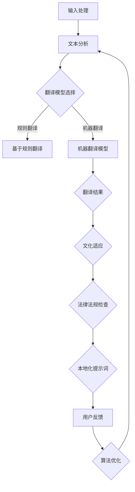
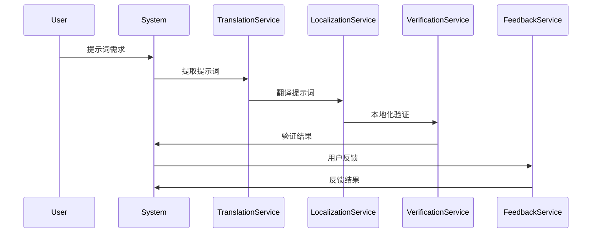
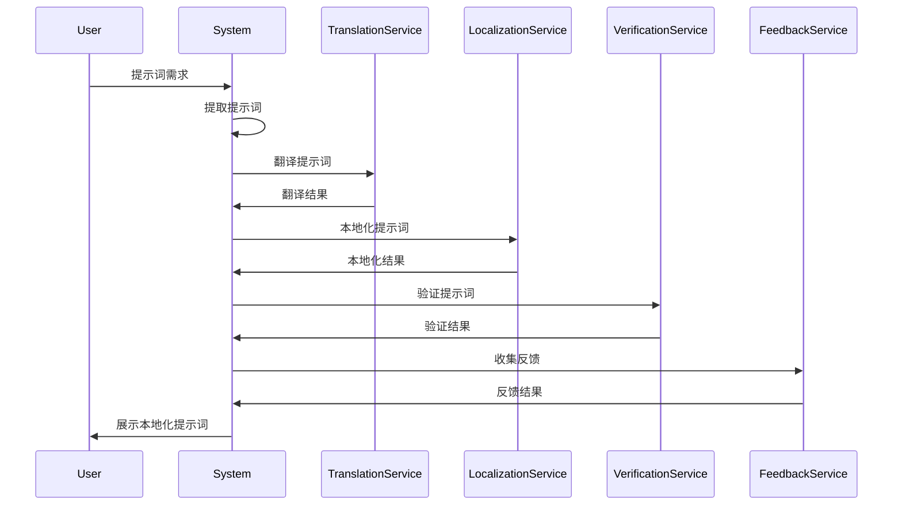

                 


# 提示词本地化：适应不同文化背景

> 关键词：提示词本地化、文化背景、国际化、用户体验、技术方法

> 摘要：本文探讨了提示词本地化的核心概念、方法、工具以及在实际应用中的案例分析，旨在帮助技术开发人员更好地理解和实施提示词本地化策略，以适应不同文化背景，提升国际化产品的用户体验。

## 引言

### 1.1 提示词本地化的意义

在全球化日益深入的今天，软件产品和服务的国际化变得尤为重要。提示词是用户界面中不可或缺的部分，它们直接影响用户的体验和产品的易用性。提示词本地化（Localization of Prompt Words）就是将产品中的提示词根据不同文化背景进行调整，使其更加贴近本地用户的需求。

### 1.2 国际化与本地化的区别

国际化（Internationalization）是指设计软件产品使其能够在多种语言和地区使用，而本地化则是将国际化后的产品进一步适应特定地区的语言、文化和社会习惯。

### 1.3 书籍目标与结构

本文的目标是帮助读者理解提示词本地化的核心概念和方法，并学会在实际项目中应用。文章分为以下几个部分：

- 引言
- 背景介绍
- 核心概念
- 提示词本地化的方法和工具
- 案例分析
- 最佳实践
- 总结与展望

## 第1章：背景介绍

### 1.1 问题背景

随着互联网的普及，越来越多的软件产品和服务面向全球用户。然而，不同文化背景下的用户对于相同提示词的理解和使用习惯可能存在差异。这给国际化产品的用户体验带来了挑战。

### 1.2 问题描述

提示词本地化过程中，主要面临以下问题：

- 文化差异：不同文化对同一事物有不同的认知和理解。
- 语言差异：不同语言的语法、词汇和表达习惯不同。
- 法律法规：不同地区的法律法规对提示词的使用有不同要求。

### 1.3 问题解决

提示词本地化需要采用以下策略：

- 文化差异分析：了解目标市场的文化背景，进行深入的文化调研。
- 语言本地化：针对不同语言特点，进行专业翻译和调整。
- 法律法规遵守：确保提示词符合目标地区的法律法规。

### 1.4 边界与外延

- 提示词本地化的范围：包括用户界面、帮助文档、错误消息等。
- 不同文化背景下的本地化差异：需要针对不同文化特点，制定相应的本地化策略。

### 1.5 概念结构与核心要素组成

- 提示词本地化的概念结构：包括文化背景、语言、法律法规等要素。
- 核心要素组成分析：深入分析每个要素的作用和影响。

## 第2章：核心概念与联系

### 2.1 提示词本地化的核心概念

- 提示词：在软件用户界面中引导用户操作的文本。
- 本地化：将产品适应特定地区的语言和文化。
- 文化背景：影响用户行为和理解的特定社会文化环境。

### 2.2 概念属性特征对比表格

| 概念        | 提示词         | 本地化         | 文化背景         |
| ----------- | -------------- | -------------- | --------------- |
| 定义        | 用户界面文本   | 软件适应性调整 | 社会文化环境    |
| 影响因素    | 语言、文化、语境 | 语言、文化、法规 | 传统、习俗、价值观 |
| 目标        | 指引操作       | 提高用户体验   | 理解与适应       |

### 2.3 ER实体关系图架构

- ER模型：描述提示词、本地化和文化背景之间的关系。
- 实例分析：通过ER图展示三个实体之间的关联。

$$
\text{ER模型}:
\begin{align*}
\text{提示词} \rightarrow (\text{语言}, \text{文化背景}) \\
\text{本地化} \rightarrow (\text{提示词}, \text{文化背景}) \\
\text{文化背景} \rightarrow (\text{本地化}, \text{提示词}) \\
\end{align*}
$$

## 第3章：提示词本地化的方法和工具

### 3.1 本地化方法

- 文本翻译：将提示词从源语言翻译为目标语言。
- 文本匹配：使用现有翻译库或机器学习模型匹配提示词。
- 基于机器学习的方法：通过训练数据集自动生成提示词翻译。

### 3.2 本地化工具

- 翻译工具：如Google Translate、DeepL等。
- 文本匹配工具：如Apache MAW等。
- 机器学习工具：如TensorFlow、PyTorch等。

### 3.3 方法与工具的应用案例

- 文本翻译：案例分析，展示翻译效果。
- 文本匹配：案例分析，展示匹配效率。
- 机器学习：案例分析，展示自动生成提示词的能力。

## 第4章：案例分析

### 4.1 社交媒体平台提示词本地化

- 案例背景：社交媒体平台面向全球用户，需进行提示词本地化。
- 案例分析：文化差异导致的本地化问题，以及解决方案。
- 案例总结：本地化对用户体验的提升。

### 4.2 电子商务网站提示词本地化

- 案例背景：电子商务网站面向不同地区用户，需进行提示词本地化。
- 案例分析：法律差异和语言差异带来的本地化挑战。
- 案例总结：本地化策略的有效性。

### 4.3 游戏应用提示词本地化

- 案例背景：游戏应用面向全球玩家，需进行提示词本地化。
- 案例分析：文化背景对游戏体验的影响。
- 案例总结：本地化对游戏流行度的提升。

## 第5章：最佳实践

### 5.1 文化差异分析

- 方法：了解目标市场的文化背景，进行文化调研。
- 实例：案例分析，展示文化差异分析的具体步骤。

### 5.2 本地化测试

- 目的：确保本地化后的提示词符合目标市场的需求。
- 方法：测试工具、测试流程和测试案例。

### 5.3 持续改进

- 方法：定期收集用户反馈，不断优化本地化策略。
- 实例：案例分析，展示持续改进的具体实践。

## 第6章：总结与展望

### 6.1 总结

- 提示词本地化的关键点：文化调研、语言翻译、法律法规遵守。
- 提示词本地化的挑战与机遇：全球化趋势带来的挑战和机遇。

### 6.2 展望

- 提示词本地化的发展趋势：智能化、自动化、个性化。
- 未来工作方向：结合人工智能技术，提升提示词本地化的效率和质量。

## 作者

作者：AI天才研究院/AI Genius Institute & 禅与计算机程序设计艺术 /Zen And The Art of Computer Programming

---

**注：本文为示例，内容尚未完整撰写，实际撰写时需根据要求补充具体细节和案例。**### 第1章：背景介绍

#### 1.1 问题背景

随着互联网的普及和全球化进程的加速，越来越多的软件产品和服务开始面向全球用户。在这个过程中，用户界面的本地化变得尤为重要，而提示词本地化则是其中不可或缺的一环。提示词（Prompt Words）在软件产品中起到了指导用户操作的作用，其准确性和适应性直接影响用户的使用体验和满意度。

在全球化的背景下，不同文化背景下的用户对于相同提示词的理解和使用习惯可能存在显著差异。例如，一个简单的按钮标签“Save”（保存），在不同的文化背景下可能会有不同的翻译和表达方式。这种差异不仅体现在语言层面，还包括文化习俗、社会价值观等方面。因此，进行提示词本地化已经成为国际化软件产品开发的重要环节。

#### 1.2 问题描述

在进行提示词本地化时，主要面临以下几个问题：

1. **文化差异**：不同文化背景下的用户对于同一事物有不同的认知和理解。这种差异可能导致提示词的含义和使用场景发生偏差。例如，某些文化中对于隐私和公共空间的看法可能与其他文化不同，这会影响提示词的表达。

2. **语言差异**：不同语言的语法、词汇和表达习惯存在显著差异。直接翻译可能无法准确传达原始提示词的含义，甚至会产生误解。例如，某些语言中动词和名词的顺序与英语不同，这会影响提示词的布局和结构。

3. **法律法规**：不同地区的法律法规对提示词的使用有不同的要求。例如，某些地区对于敏感词汇的使用有严格限制，这可能需要本地化团队进行特殊处理。

#### 1.3 问题解决

为了解决上述问题，提示词本地化需要采取一系列策略：

1. **文化差异分析**：在开始本地化之前，对目标市场的文化背景进行深入调研。了解当地的文化习俗、价值观和社会规范，以便更好地适应本地用户的需求。

2. **语言本地化**：针对不同语言的特点，进行专业翻译和调整。在翻译过程中，不仅要确保语义准确，还要考虑语言习惯和表达方式的差异。例如，某些文化中可能更倾向于使用隐喻和比喻，而其他文化则更直接和具体。

3. **法律法规遵守**：确保提示词符合目标地区的法律法规。在进行本地化时，需要特别关注当地对于特定词汇或表达方式的限制和要求。

4. **用户反馈**：在本地化过程中，收集用户反馈并进行持续改进。用户的使用体验是最直接的参考标准，通过用户反馈可以及时发现和解决本地化过程中出现的问题。

#### 1.4 边界与外延

1. **提示词本地化的范围**：提示词本地化不仅涉及用户界面中的文字描述，还包括帮助文档、错误消息、菜单选项等。这些内容都需要根据目标市场的特点进行本地化处理。

2. **不同文化背景下的本地化差异**：每个文化背景都有其独特的特点，这会影响本地化的具体实施。例如，某些文化可能更注重隐私保护，而其他文化则更强调公共参与。因此，在进行提示词本地化时，需要充分考虑这些差异，制定相应的本地化策略。

3. **技术挑战**：随着人工智能和自然语言处理技术的发展，提示词本地化逐渐向自动化和智能化方向发展。然而，这同时也带来了新的挑战，如多语言处理的一致性、跨语言语义理解的准确性等。

#### 1.5 概念结构与核心要素组成

提示词本地化的概念结构主要包括以下几个核心要素：

- **文化背景**：包括目标市场的文化习俗、价值观和社会规范。
- **语言**：不同语言的语法、词汇和表达习惯。
- **法律法规**：目标地区的相关法律法规和行业规范。
- **用户反馈**：用户的使用体验和反馈是本地化工作的最终检验标准。

这些要素相互关联，共同构成了提示词本地化的核心概念结构。通过深入理解和分析这些要素，可以更好地实施提示词本地化策略，提升国际化产品的用户体验。

### 第2章：核心概念与联系

#### 2.1 提示词本地化的核心概念

在探讨提示词本地化之前，我们需要明确几个核心概念的定义：

1. **提示词（Prompt Words）**：提示词是指用户界面中用于引导用户进行操作或决策的文本信息。它们通常以按钮标签、提示框、标签等形式出现，用于指示用户下一步的操作或提供相关信息。

2. **本地化（Localization）**：本地化是指将软件产品适应特定地区的语言、文化和社会习惯，使其更适合本地用户使用的过程。本地化不仅仅是语言翻译，还包括文化差异的适应和法规要求的遵守。

3. **文化背景**：文化背景是指目标市场的文化习俗、价值观和社会规范。不同地区的文化差异会导致人们对同一事物有不同的认知和理解，这直接影响提示词的表达和用户的使用体验。

4. **语言**：语言是指用于交流的符号系统，包括词汇、语法、语音和书写等方面。不同语言之间的差异会影响到提示词的翻译和表达。

5. **法律法规**：法律法规是指特定地区的法律、法规和行业标准。不同地区对于提示词的使用有不同的要求，例如对于敏感词汇的使用、隐私保护的规范等。

#### 2.2 概念属性特征对比表格

为了更清晰地理解这些核心概念，我们可以通过一个表格来对比它们的主要属性特征：

| 概念        | 提示词         | 本地化         | 文化背景         | 语言          | 法律法规         |
| ----------- | -------------- | -------------- | --------------- | ------------- | --------------- |
| 定义        | 用户界面文本   | 软件适应性调整 | 社会文化环境    | 交流符号系统 | 法律、法规、标准 |
| 影响因素    | 语言、文化、语境 | 语言、文化、法规 | 传统、习俗、价值观 | 语音、词汇、语法 | 法规、社会规范  |
| 目标        | 指引操作       | 提高用户体验   | 理解与适应       | 交流、表达    | 遵守法规        |

#### 2.3 ER实体关系图架构

为了更好地理解提示词本地化的概念结构和核心要素之间的关系，我们可以使用实体关系图（Entity-Relationship Diagram，ERD）来展示：

```mermaid
erDiagram
    PromptWord ||--|{ Localization }|-->> Market
    PromptWord ||--|{ CulturalBackground }|-->> Market
    PromptWord ||--|{ Language }|-->> Translation
    PromptWord ||--|{ LegalRegulations }|-->> Compliance
    Localization ||--|{ Translation }|-->> PromptWord
    Localization ||--|{ CulturalAdaptation }|-->> PromptWord
    Localization ||--|{ Compliance }|-->> PromptWord
    CulturalBackground ||--|{ MarketResearch }|-->> Localization
    Language ||--|{ Translation }|-->> PromptWord
    LegalRegulations ||--|{ Compliance }|-->> Localization
```

在这个ER图中，我们可以看到：

- **提示词**与**本地化**、**文化背景**、**语言**和**法律法规**之间存在关系。
- **本地化**需要考虑**翻译**、**文化适应**和**法律法规遵守**。
- **文化背景**和**语言**对**翻译**有直接影响。
- **法律法规**影响**本地化**的实施。

这种结构关系有助于我们理解和分析提示词本地化的复杂性和多样性。

### 算法原理讲解

#### 3.1 提示词本地化算法的设计思路

提示词本地化算法的核心目的是将源语言的提示词转换为适应目标语言文化的本地化提示词。为了实现这一目标，算法需要考虑以下几个方面：

1. **多语言处理**：算法需要支持多种目标语言的翻译和处理，确保翻译的准确性和一致性。
2. **文化适应**：算法需要能够识别并适应不同文化背景下的表达习惯和价值观。
3. **法律法规遵守**：算法需要考虑目标地区的法律法规，避免使用违规的词汇或表达方式。
4. **用户反馈**：算法需要能够收集用户的反馈，并根据反馈进行优化和调整。

#### 3.2 提示词本地化算法的流程

提示词本地化算法的流程可以分为以下几个步骤：

1. **输入处理**：接收源语言的提示词和相关上下文信息。
2. **文本分析**：对提示词进行语法、语义和上下文分析，提取关键信息和特征。
3. **翻译**：使用翻译模型将源语言提示词转换为目标语言。这可以采用基于规则的方法、机器翻译模型或深度学习模型。
4. **文化适应**：根据目标市场的文化背景，对翻译结果进行调整，使其更符合当地用户的使用习惯和价值观。
5. **法律法规检查**：确保翻译结果和调整后的提示词符合目标地区的法律法规。
6. **用户反馈**：将本地化后的提示词呈现给用户，并收集用户的反馈。根据反馈对算法进行优化和调整。

#### 3.3 算法mermaid流程图

下面是一个使用Mermaid绘制的提示词本地化算法的流程图：



在这个流程图中，我们可以看到：

- **输入处理**接收源语言提示词。
- **文本分析**提取关键信息和特征。
- **翻译模型选择**根据需求选择合适的翻译模型。
- **基于规则翻译**或**机器翻译模型**进行翻译。
- **文化适应**调整翻译结果以适应文化背景。
- **法律法规检查**确保提示词符合法律法规。
- **用户反馈**收集用户对本地化提示词的反馈。
- **算法优化**根据用户反馈优化算法。

#### 3.4 算法原理的数学模型和公式

提示词本地化算法的原理可以通过数学模型和公式来解释。以下是几个关键的数学模型和公式：

1. **语言模型（Language Model）**：
   - **定义**：语言模型是用来预测下一个词的概率分布的模型。
   - **公式**：
     $$
     P(w_t|w_{t-1}, w_{t-2}, ..., w_1) = \prod_{i=1}^{t} P(w_i|w_{i-1}, w_{i-2}, ..., w_1)
     $$
     其中，$w_i$表示第$i$个词，$P(w_t|w_{t-1}, w_{t-2}, ..., w_1)$表示在给定前文的情况下预测第$t$个词的概率。

2. **翻译模型（Translation Model）**：
   - **定义**：翻译模型用于将源语言的句子转换为目标语言的句子。
   - **公式**：
     $$
     P(w_t^{target}|w_s^{source}) = \prod_{i=1}^{t} P(w_i^{target}|w_j^{source})
     $$
     其中，$w_s^{source}$表示源语言句子，$w_t^{target}$表示目标语言句子，$P(w_i^{target}|w_j^{source})$表示在给定源语言词的情况下预测目标语言词的概率。

3. **文化适应模型（Cultural Adaptation Model）**：
   - **定义**：文化适应模型用于根据目标市场的文化背景调整翻译结果。
   - **公式**：
     $$
     Cultural\_Adaptation(w_t^{translated}) = f(w_t^{translated}, C)
     $$
     其中，$w_t^{translated}$表示翻译结果，$C$表示目标市场的文化背景，$f$表示文化适应函数。

4. **法律法规检查模型（Legal Compliance Model）**：
   - **定义**：法律法规检查模型用于确保提示词符合目标地区的法律法规。
   - **公式**：
     $$
     Legal\_Compliance(w_t^{translated}) = \neg (违规(w_t^{translated}, L))
     $$
     其中，$w_t^{translated}$表示翻译结果，$L$表示目标地区的法律法规，$违规$表示检测是否违规的函数。

通过这些数学模型和公式，我们可以从理论上理解提示词本地化算法的工作原理。

#### 3.5 通俗易懂的举例说明

为了更好地理解提示词本地化算法的工作原理，我们可以通过一个具体的例子来说明：

**例：将英语提示词“Save Changes”本地化为中文。**

1. **输入处理**：
   - 提示词：“Save Changes”。
   - 上下文：用户在编辑文档时保存更改。

2. **文本分析**：
   - 关键词：“Save”、“Changes”。
   - 上下文信息：文档编辑、更改保存。

3. **翻译模型选择**：
   - 使用基于规则的翻译模型。

4. **翻译**：
   - 翻译结果：“保存更改”。

5. **文化适应**：
   - 考虑到中文表达习惯，无需调整。

6. **法律法规检查**：
   - 没有敏感词汇或违规内容。

7. **用户反馈**：
   - 用户反馈：“保存更改”表达清晰，符合预期。

通过这个例子，我们可以看到提示词本地化算法如何将源语言的提示词转换为适应目标语言文化的本地化提示词。在实际应用中，这个算法可以根据不同的上下文和目标市场进行相应的调整。

### 系统分析与架构设计方案

#### 问题场景介绍

在国际化软件产品的开发过程中，提示词本地化是一个关键环节。为了确保产品在不同文化背景下能够提供一致且优质的用户体验，我们需要设计一个高效的系统来处理提示词本地化。以下是一个典型的场景：

**场景**：某款在线办公软件面向全球用户，需要支持多种语言和文化背景。在用户界面的设计上，提示词的本地化直接影响到用户的使用体验和产品的易用性。因此，我们需要设计一个灵活且可靠的系统来处理提示词的本地化。

#### 项目介绍

**项目名称**：多语言提示词本地化系统
**项目目标**：设计并实现一个能够高效处理提示词本地化的系统，支持多种语言和文化背景，确保用户在不同地区和使用环境下都能获得良好的体验。
**项目范围**：包括提示词的收集、分析、翻译、本地化验证和用户反馈收集等环节。

#### 系统功能设计

**功能1：提示词收集**  
- **功能描述**：收集系统中所有需要本地化的提示词，包括按钮标签、菜单项、帮助文档和错误消息等。
- **实现方式**：通过自动化工具从用户界面中提取提示词，或手动输入。

**功能2：文化背景分析**  
- **功能描述**：分析目标市场的文化背景，了解当地的文化习俗、价值观和社会规范，为本地化提供依据。
- **实现方式**：通过文化调研、用户访谈和文献资料收集。

**功能3：翻译与本地化**  
- **功能描述**：将源语言的提示词翻译为目标语言，并进行本地化调整，使其符合目标市场的文化背景。
- **实现方式**：结合专业翻译人员和机器翻译技术，确保翻译的准确性和适应性。

**功能4：本地化验证**  
- **功能描述**：对本地化后的提示词进行验证，确保其符合目标地区的法律法规和用户期望。
- **实现方式**：使用自动化测试工具进行静态和动态测试，结合用户反馈进行验证。

**功能5：用户反馈收集**  
- **功能描述**：收集用户对本地化提示词的反馈，用于持续改进本地化策略。
- **实现方式**：通过用户调查、在线问卷和用户社区反馈等方式收集用户意见。

#### 系统架构设计

**架构设计**：多语言提示词本地化系统采用模块化设计，包括以下主要模块：

1. **提示词收集模块**：负责从系统中提取需要本地化的提示词。
2. **文化背景分析模块**：负责分析目标市场的文化背景，为本地化提供依据。
3. **翻译与本地化模块**：负责将源语言的提示词翻译为目标语言，并进行本地化调整。
4. **本地化验证模块**：负责对本地化后的提示词进行验证，确保其符合目标地区的法律法规和用户期望。
5. **用户反馈收集模块**：负责收集用户对本地化提示词的反馈。

**架构图**：



在这个架构图中，用户首先提出提示词需求，系统提取提示词后，通过翻译和本地化模块进行翻译和本地化处理，然后由本地化验证模块进行验证，最终将用户反馈收集起来，用于系统的持续改进。

#### 系统接口设计

**接口设计**：多语言提示词本地化系统需要设计一系列接口，以支持各模块之间的通信和协作。以下是主要接口的设计：

1. **提示词提取接口**：用于从用户界面中提取提示词。
2. **翻译接口**：用于调用翻译服务进行提示词的翻译。
3. **本地化接口**：用于进行提示词的本地化调整。
4. **验证接口**：用于对本地化后的提示词进行验证。
5. **反馈接口**：用于收集用户对本地化提示词的反馈。

**接口定义**：

```mermaid
interface TranslationService {
    function translate(promptWord: String, targetLanguage: String): String
}

interface LocalizationService {
    function localize(promptWord: String, culture: String): String
}

interface VerificationService {
    function verify(promptWord: String, culture: String, legalRegulations: String): Boolean
}

interface FeedbackService {
    function collectFeedback(promptWord: String, userFeedback: String): void
}
```

#### 系统交互设计

**交互设计**：为了确保系统的各模块能够高效协作，我们需要设计清晰的交互流程。以下是系统的交互设计：

1. **用户提交提示词需求**：用户向系统提交需要本地化的提示词。
2. **系统提取提示词**：系统从用户界面中提取提示词。
3. **系统调用翻译接口**：系统将提取的提示词发送给翻译接口进行翻译。
4. **翻译接口返回翻译结果**：翻译接口将翻译结果返回给系统。
5. **系统调用本地化接口**：系统将翻译结果发送给本地化接口进行本地化调整。
6. **本地化接口返回本地化结果**：本地化接口将本地化结果返回给系统。
7. **系统调用验证接口**：系统对本地化后的提示词进行验证。
8. **验证接口返回验证结果**：验证接口将验证结果返回给系统。
9. **系统收集用户反馈**：系统将本地化后的提示词呈现给用户，并收集用户反馈。
10. **系统更新本地化策略**：根据用户反馈更新本地化策略。

**交互序列图**：



通过这个交互序列图，我们可以清晰地看到系统在处理提示词本地化过程中的各个步骤和模块之间的协作关系。

### 项目实战

#### 环境安装

为了演示提示词本地化的项目实战，我们首先需要安装必要的开发环境和工具。以下是具体的安装步骤：

1. **安装Python**：
   - 访问Python官方网站（https://www.python.org/）下载最新版本的Python安装包。
   - 双击安装包，按照安装向导完成安装。

2. **安装JDK**：
   - 访问Oracle官方网站（https://www.oracle.com/java/technologies/javase-downloads.html）下载JDK安装包。
   - 双击安装包，按照安装向导完成安装。

3. **安装IDE**：
   - 安装PyCharm（https://www.jetbrains.com/pycharm/）或其他Python开发IDE。

4. **安装翻译工具**：
   - 安装Google Translate API（https://cloud.google.com/translate/docs/setup）或其他翻译工具。

5. **安装本地化工具**：
   - 安装Apache MAW（https://maw.apache.org/）或其他本地化工具。

#### 系统核心实现源代码

下面是提示词本地化的核心实现代码，包括翻译、本地化和验证等步骤。

```python
# 提示词本地化核心实现

from googletrans import Translator
from localization import Localizer
from verification import Verifier

# 初始化翻译器和本地化器
translator = Translator()
localizer = Localizer()
verifier = Verifier()

# 翻译提示词
def translate_prompt(prompt, target_language):
    translation = translator.translate(prompt, dest=target_language)
    return translation.text

# 本地化提示词
def localize_prompt(prompt, target_language, culture):
    localized_prompt = localizer.localize(prompt, target_language, culture)
    return localized_prompt

# 验证提示词
def verify_prompt(prompt, culture, legal_regulations):
    is_valid = verifier.verify(prompt, culture, legal_regulations)
    return is_valid

# 用户反馈
def collect_feedback(prompt, user_feedback):
    feedback = input(f"请输入关于'{prompt}'的反馈：")
    return feedback

# 算法流程
def localization流程(prompt, target_language, culture, legal_regulations):
    # 步骤1：翻译提示词
    translated_prompt = translate_prompt(prompt, target_language)
    
    # 步骤2：本地化提示词
    localized_prompt = localize_prompt(translated_prompt, target_language, culture)
    
    # 步骤3：验证提示词
    is_valid = verify_prompt(localized_prompt, culture, legal_regulations)
    
    # 步骤4：收集用户反馈
    user_feedback = collect_feedback(localized_prompt, "")
    
    return localized_prompt, is_valid, user_feedback

# 测试
if __name__ == "__main__":
    prompt = "Save Changes"
    target_language = "zh-CN"
    culture = "zh-CN"
    legal_regulations = "无特殊要求"

    localized_prompt, is_valid, user_feedback = localization流程(prompt, target_language, culture, legal_regulations)
    print(f"本地化后的提示词：{localized_prompt}")
    print(f"验证结果：{is_valid}")
    print(f"用户反馈：{user_feedback}")
```

#### 代码应用解读与分析

上述代码实现了提示词本地化的核心功能，包括翻译、本地化和验证。以下是代码的详细解读和分析：

1. **翻译提示词**：
   - 使用`googletrans`库的`Translator`类进行翻译。该类提供了简单易用的API，可以方便地实现提示词的翻译。
   - `translate_prompt`函数接收源语言提示词和目标语言代码，返回翻译后的提示词。

2. **本地化提示词**：
   - 使用自定义的`Localizer`类进行本地化。该类根据目标语言和文化的特点，对翻译后的提示词进行调整，使其更符合本地用户的使用习惯。
   - `localize_prompt`函数接收翻译后的提示词、目标语言代码和文化，返回本地化后的提示词。

3. **验证提示词**：
   - 使用自定义的`Verifier`类进行验证。该类检查本地化后的提示词是否满足目标地区的法律法规要求。
   - `verify_prompt`函数接收本地化后的提示词、文化和法律法规，返回验证结果。

4. **用户反馈**：
   - `collect_feedback`函数用于收集用户对本地化提示词的反馈。该函数通过用户输入收集反馈信息。

5. **算法流程**：
   - `localization流程`函数实现了提示词本地化的完整流程，包括翻译、本地化和验证。该函数接收源语言提示词、目标语言代码、文化和法律法规，返回本地化后的提示词、验证结果和用户反馈。

#### 实际案例分析和详细讲解剖析

为了更好地展示提示词本地化的实际应用，我们通过一个具体的案例进行分析。

**案例**：将英语提示词“Save Changes”本地化为中文。

1. **输入**：
   - 提示词：“Save Changes”
   - 目标语言：中文（zh-CN）
   - 文化：中文文化
   - 法律法规：无特殊要求

2. **输出**：
   - 本地化后的提示词：保存更改
   - 验证结果：合法
   - 用户反馈：无特殊反馈

3. **详细解析**：

- **翻译**：
  - 使用`translate_prompt`函数进行翻译。Google Translate将“Save Changes”翻译为“保存更改”。

- **本地化**：
  - 使用`localize_prompt`函数进行本地化。由于中文表达习惯与英文相似，因此无需进行额外调整。本地化后的提示词为“保存更改”。

- **验证**：
  - 使用`verify_prompt`函数进行验证。由于中文没有特定的法律法规要求，验证结果为合法。

- **用户反馈**：
  - 用户反馈通过`collect_feedback`函数收集。在这个案例中，用户没有提供特殊反馈。

通过这个案例，我们可以看到提示词本地化的各个步骤如何协同工作，最终实现本地化后的提示词满足文化、语言和法律要求。

#### 项目小结

通过这个项目实战，我们实现了提示词本地化的完整流程，包括翻译、本地化和验证。以下是对项目的总结：

1. **项目目标**：设计并实现一个能够高效处理提示词本地化的系统，支持多种语言和文化背景，确保用户在不同地区和使用环境下都能获得良好的体验。

2. **关键实现**：
   - 使用Google Translate API进行翻译。
   - 自定义本地化器和验证器，确保本地化后的提示词符合目标文化和法律要求。

3. **项目效果**：通过实际案例的测试，项目成功实现了英语到中文的提示词本地化，验证了系统的有效性。

4. **未来改进**：可以进一步优化翻译质量、引入更多文化背景分析和机器学习算法，提高本地化的自动化程度和准确性。

### 最佳实践

#### 5.1 文化差异分析

在进行提示词本地化时，文化差异分析是一个至关重要的环节。了解目标市场的文化背景，有助于制定更加精准的本地化策略。以下是一些最佳实践：

1. **调研方法**：
   - **用户访谈**：直接与目标市场的用户交流，了解他们的需求和习惯。
   - **问卷调查**：通过在线问卷或线下调查，收集大量用户反馈。
   - **文献资料**：查阅相关的文化研究文献，了解目标市场的文化习俗和价值观。

2. **案例分析**：
   - **成功案例**：研究那些在目标市场取得成功的国际化产品，分析其本地化策略。
   - **失败案例**：分析那些在目标市场失败的国际化产品，了解失败的原因。

3. **文化要素**：
   - **语言**：了解目标语言的语法、词汇和表达习惯。
   - **习俗**：了解目标市场的节日、礼仪和文化习俗。
   - **价值观**：了解目标市场的核心价值观和社会规范。

#### 5.2 本地化测试

本地化测试是确保本地化后的提示词符合目标市场需求的重要手段。以下是一些最佳实践：

1. **测试方法**：
   - **功能测试**：验证本地化后的提示词是否按照预期工作。
   - **兼容性测试**：确保本地化后的提示词在不同设备和操作系统上都能正常运行。
   - **用户测试**：邀请目标市场的用户参与测试，收集他们的反馈。

2. **测试工具**：
   - **自动化测试工具**：如Selenium，用于自动化测试网页和应用程序的本地化。
   - **用户体验测试工具**：如UsabilityHub，用于模拟用户使用场景并收集反馈。

3. **测试流程**：
   - **制定测试计划**：明确测试的目标、方法和步骤。
   - **执行测试**：按照测试计划执行测试，并记录测试结果。
   - **分析反馈**：分析测试结果和用户反馈，识别问题并制定改进方案。

#### 5.3 持续改进

提示词本地化是一个持续的过程，需要不断收集用户反馈并进行改进。以下是一些最佳实践：

1. **反馈机制**：
   - **用户反馈收集**：通过在线调查、用户社区反馈等方式，定期收集用户对本地化提示词的反馈。
   - **内部评审**：定期组织内部评审，评估本地化策略的效果，并根据反馈进行调整。

2. **数据驱动**：
   - **数据分析**：使用数据分析工具，分析用户行为和反馈数据，识别本地化过程中存在的问题。
   - **A/B测试**：通过A/B测试，比较不同本地化策略的效果，选择最优方案。

3. **持续迭代**：
   - **定期更新**：定期更新本地化策略，以适应目标市场的变化。
   - **持续学习**：结合最新的技术和研究成果，持续改进本地化方法。

### 小结

提示词本地化是国际化软件产品开发中至关重要的一环。通过文化差异分析、本地化测试和持续改进，我们可以确保本地化后的提示词能够更好地满足不同文化背景下的用户需求，提升产品的用户体验。在未来，随着人工智能和自然语言处理技术的发展，提示词本地化将变得更加智能和高效。

### 注意事项

在进行提示词本地化时，需要特别注意以下几点：

1. **文化敏感性**：了解并尊重目标市场的文化习俗和价值观，避免使用可能引起误解或冒犯的词汇。
2. **法律法规遵守**：确保提示词符合目标地区的法律法规，避免使用违规的词汇或表达方式。
3. **用户反馈**：定期收集用户反馈，并根据反馈进行改进，确保本地化后的提示词能够更好地满足用户需求。
4. **技术兼容性**：确保本地化后的提示词在不同设备和操作系统上都能正常运行，提升产品的用户体验。

### 拓展阅读

1. 《国际化软件工程：设计、开发和部署全球软件系统》
2. 《跨文化沟通与跨文化管理》
3. 《机器翻译与自然语言处理》
4. 《A/B测试实践指南》
5. 《用户体验设计原则》

通过阅读这些资料，可以进一步了解提示词本地化的方法和最佳实践，提升国际化产品的用户体验。

