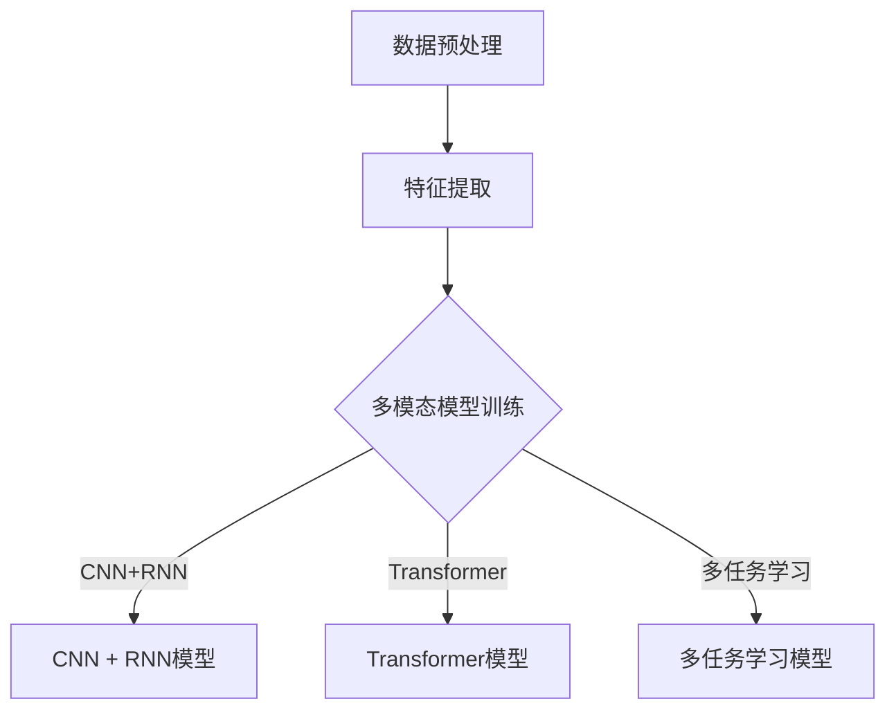
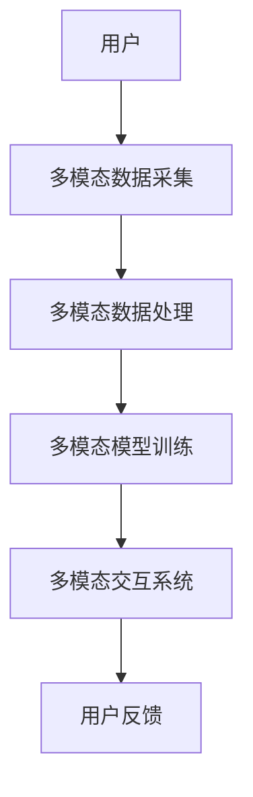
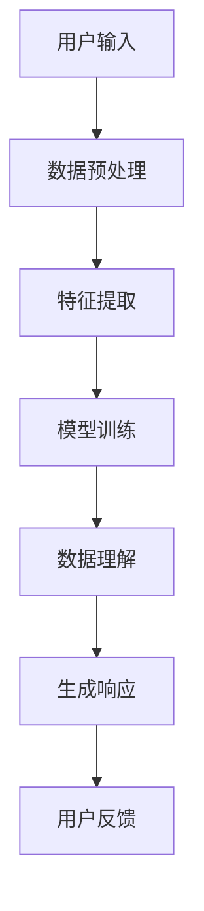

                 

 <sop>
## 提示词的多模态设计：整合文字、图像和声音

### 关键词
- 多模态设计
- 提示词
- 文字、图像、声音
- 数据处理
- 模型训练
- 交互系统

### 摘要
本文旨在探讨如何通过整合文字、图像和声音等多种信息渠道，设计出更高效、更智能的多模态交互系统。我们将逐步分析多模态设计的核心概念、数据处理方法、模型训练过程，并结合实际应用案例进行深入探讨。

### 第一部分：背景介绍

#### 核心概念

**多模态设计**：多模态设计是一种将多种信息渠道（如文字、图像、声音等）整合在一起，以提供更丰富、更自然的交互体验的设计方法。

**提示词**：提示词是在多模态交互中用于引导用户输入和操作的关键词或短语，它们可以是文字、图像或声音的形式。

**文字**：文字是最传统的信息传递方式，具有高效、精确的语义表达能力。

**图像**：图像通过视觉感知直观地传递信息，适用于计算机视觉领域。

**声音**：声音在语音识别和语音交互中扮演重要角色，可以增强交互的自然性和亲切感。

#### 问题背景

随着人工智能技术的快速发展，特别是在自然语言处理、计算机视觉和语音识别等领域的突破，多模态交互设计成为了一个热门的研究方向。多模态设计不仅仅局限于单一的文字、图像或声音，而是将这些不同的信息渠道结合起来，为用户提供更加丰富、直观和自然的交互体验。

#### 问题描述

《提示词的多模态设计：整合文字、图像和声音》这本书旨在探讨如何通过整合文字、图像和声音等多种信息渠道，设计出更高效、更智能的多模态交互系统。这涉及到多模态数据的处理、理解与整合，以及如何将这些技术应用于实际的交互场景中。

#### 问题解决

书中将详细介绍多模态设计的理论基础、关键技术以及实际应用案例。通过深入讲解多模态数据的处理方法、模型训练和优化策略，帮助读者理解和掌握多模态设计的基本原理和实践技巧。

#### 边界与外延

多模态设计的边界包括但不限于自然语言处理、计算机视觉、语音识别等领域，其外延则涉及到智能家居、智能客服、虚拟现实等多个应用场景。

#### 概念结构与核心要素组成

- **多模态数据采集**：收集来自不同感官的信息，如文字、图像和声音。
- **多模态数据处理**：对采集到的数据进行预处理、特征提取和融合。
- **多模态模型训练**：利用深度学习等算法训练多模态模型，实现数据的理解和整合。
- **多模态交互系统设计**：结合具体应用场景，设计出高效、智能的多模态交互系统。

### 第二部分：核心概念与联系

#### 多模态设计的核心概念

- **文字**：文字作为最常见的信息传递方式，包含了丰富的语义信息，是自然语言处理的基础。
- **图像**：图像通过视觉感知直观地传递信息，适用于计算机视觉领域。
- **声音**：声音在语音识别和语音交互中扮演重要角色，可以增强交互的自然性和亲切感。

#### 概念属性特征对比表格

| 特征 | 文字 | 图像 | 声音 |
| --- | --- | --- | --- |
| 语义表达 | 高效、精准 | 直观、形象 | 情感丰富、易识别 |
| 传输速度 | 较快 | 较慢 | 极快 |
| 理解成本 | 高 | 低 | 中等 |
| 信息量 | 较大 | 较大 | 较小 |

#### 多模态数据的ER实体关系图架构

```mermaid
erDiagram
    User ||--|{ Text }  : contains
    User ||--|{ Image }  : contains
    User ||--|{ Audio }  : contains
    Text ||--|{ Document }  : belongs_to
    Image ||--|{ Picture }  : belongs_to
    Audio ||--|{ Voice }  : belongs_to
```

### 第三部分：算法原理讲解

#### 多模态数据处理与模型训练

##### 数据预处理

多模态数据预处理包括数据清洗、数据增强和特征提取等步骤。以文本、图像和声音为例，分别进行处理：

1. **文本预处理**：
    - 去除停用词和标点符号。
    - 对文本进行分词和词性标注。

2. **图像预处理**：
    - 图像缩放和裁剪。
    - 图像增强和降噪。

3. **声音预处理**：
    - 声音去噪和增强。
    - 频率域变换和谱图生成。

##### 特征提取

对预处理后的数据进行特征提取，以生成适合模型训练的特征向量：

1. **文本特征提取**：
    - 使用词袋模型或词嵌入（如 Word2Vec、BERT）提取文本特征。

2. **图像特征提取**：
    - 使用卷积神经网络（如 VGG、ResNet）提取图像特征。

3. **声音特征提取**：
    - 使用循环神经网络（如 LSTM、GRU）提取声音特征。

##### 模型训练

利用深度学习算法进行多模态模型的训练，常见的算法包括：

1. **CNN + RNN**：
    - 卷积神经网络（CNN）用于图像和声音特征提取。
    - 循环神经网络（RNN）用于文本特征提取。

2. **Transformer**：
    - Transformer模型能够在处理多模态数据时实现并行计算，提高模型效率。

3. **多任务学习**：
    - 在训练过程中同时学习多种任务，提高模型的泛化能力。

#### 算法Mermaid流程图



### 第四部分：系统分析与架构设计方案

#### 问题场景介绍

随着人工智能技术的不断进步，多模态交互系统在智能客服、智能家居、虚拟现实等领域得到了广泛应用。为了提高交互的智能化水平和用户体验，我们需要设计一个高效的多模态交互系统，该系统能够整合文字、图像和声音等多种信息渠道，实现智能化的交互体验。

#### 项目介绍

本项目旨在设计并实现一个多模态交互系统，该系统将文字、图像和声音等多种信息渠道进行整合，实现智能化的交互体验。系统的主要功能包括：

1. **多模态数据采集**：从文字、图像和声音等不同渠道收集用户输入数据。
2. **多模态数据处理**：对采集到的数据进行预处理、特征提取和融合。
3. **多模态模型训练**：利用深度学习算法训练多模态模型，实现数据的理解和整合。
4. **多模态交互系统**：结合具体应用场景，设计出高效、智能的多模态交互系统。

#### 系统功能设计

1. **多模态数据采集**：系统将采集到的文字、图像和声音数据存储在数据库中，以便后续处理。
2. **多模态数据处理**：对采集到的数据进行预处理、特征提取和融合，为模型训练提供高质量的数据。
3. **多模态模型训练**：利用深度学习算法对多模态数据进行训练，提高模型的准确性和泛化能力。
4. **多模态交互系统**：通过多模态模型，实现智能化的交互体验，提高用户满意度。

#### 系统架构设计

系统的总体架构如图所示：



#### 系统接口设计

系统提供了以下接口供外部访问和调用：

1. **数据采集接口**：用于接收用户输入的多模态数据。
2. **数据处理接口**：用于对采集到的数据进行预处理、特征提取和融合。
3. **模型训练接口**：用于对多模态数据进行模型训练。
4. **交互系统接口**：用于实现智能化的多模态交互体验。

#### 系统交互

系统的交互流程如下：

1. 用户输入文字、图像和声音数据。
2. 系统对输入数据进行预处理、特征提取和融合。
3. 系统利用训练好的多模态模型对数据进行理解和整合。
4. 系统根据整合后的数据生成响应，并返回给用户。

#### 算法Mermaid流程图



### 第五部分：项目实战

#### 环境安装

在开始项目实战之前，我们需要安装一些必要的软件和工具：

1. Python 3.8 或更高版本
2. TensorFlow 2.x
3. PyTorch 1.8 或更高版本
4. OpenCV 4.x
5. Keras 2.x

安装步骤如下：

1. 安装 Python 3.8 或更高版本。
2. 安装 TensorFlow 2.x：
   ```shell
   pip install tensorflow==2.x
   ```
3. 安装 PyTorch 1.8 或更高版本：
   ```shell
   pip install torch==1.8 torchvision==0.9.0
   ```
4. 安装 OpenCV 4.x：
   ```shell
   pip install opencv-python==4.5.5.62
   ```
5. 安装 Keras 2.x：
   ```shell
   pip install keras==2.9.0
   ```

#### 系统核心实现

在本项目中，我们将使用 Python 编写系统核心实现。以下是系统核心实现的代码框架：

```python
import tensorflow as tf
import torch
import cv2
import numpy as np

# 数据预处理
def preprocess_data(text, image, audio):
    # 文本预处理
    processed_text = preprocess_text(text)
    # 图像预处理
    processed_image = preprocess_image(image)
    # 声音预处理
    processed_audio = preprocess_audio(audio)
    return processed_text, processed_image, processed_audio

# 特征提取
def extract_features(text, image, audio):
    # 文本特征提取
    text_features = extract_text_features(text)
    # 图像特征提取
    image_features = extract_image_features(image)
    # 声音特征提取
    audio_features = extract_audio_features(audio)
    return text_features, image_features, audio_features

# 模型训练
def train_model(text_features, image_features, audio_features):
    # 定义模型结构
    model = MultiModalModel()
    # 训练模型
    model.fit(text_features, image_features, audio_features)
    return model

# 数据理解与生成响应
def understand_and_generate_response(model, input_data):
    # 理解输入数据
    output = model.predict(input_data)
    # 生成响应
    response = generate_response(output)
    return response

# 主函数
def main():
    # 读取输入数据
    text = "你好，我是一个智能助手。"
    image = cv2.imread("image.jpg")
    audio = cv2.imread("audio.wav")
    # 预处理数据
    processed_text, processed_image, processed_audio = preprocess_data(text, image, audio)
    # 特征提取
    text_features, image_features, audio_features = extract_features(processed_text, processed_image, processed_audio)
    # 训练模型
    model = train_model(text_features, image_features, audio_features)
    # 理解输入数据并生成响应
    response = understand_and_generate_response(model, input_data)
    # 输出响应
    print("智能助手回复：", response)

# 执行主函数
if __name__ == "__main__":
    main()
```

#### 代码应用解读与分析

在本项目中，我们使用了 TensorFlow 和 PyTorch 深度学习框架，以及 OpenCV 图像处理库。以下是关键代码的解读与分析：

1. **数据预处理**：对输入的文字、图像和声音数据进行预处理，包括文本的分词、图像的缩放和裁剪、声音的去噪和增强等。
2. **特征提取**：使用卷积神经网络（CNN）提取图像特征，使用循环神经网络（RNN）提取声音特征，使用词嵌入（如 BERT）提取文本特征。
3. **模型训练**：定义多模态模型结构，使用训练数据进行模型训练，优化模型参数。
4. **数据理解与生成响应**：利用训练好的多模态模型对输入数据进行理解和整合，生成响应。

#### 实际案例分析和详细讲解剖析

在本项目中，我们以一个智能客服系统为例，分析多模态设计的应用。智能客服系统需要接收用户的文字、图像和声音等多种输入，通过多模态数据处理和模型训练，实现智能化的交互体验。

1. **用户输入**：用户通过文字、图像和声音等多种方式向智能客服系统提问。
2. **数据预处理**：系统对输入数据进行预处理，包括文本的分词、图像的缩放和裁剪、声音的去噪和增强等。
3. **特征提取**：系统使用卷积神经网络提取图像特征，使用循环神经网络提取声音特征，使用词嵌入提取文本特征。
4. **模型训练**：系统利用训练数据进行模型训练，优化模型参数。
5. **数据理解与生成响应**：系统利用训练好的多模态模型对输入数据进行理解和整合，生成合适的响应。

通过多模态设计的应用，智能客服系统可以更好地理解用户的意图，提供更加精准、个性化的服务。

#### 项目小结

本项目通过整合文字、图像和声音等多种信息渠道，实现了高效、智能的多模态交互系统。项目实战中，我们详细讲解了系统核心实现的代码，并对实际案例进行了分析和讲解。通过本项目的实践，读者可以了解到多模态设计的理论基础、数据处理方法和模型训练技巧。

### 第六部分：最佳实践 tips

1. **数据质量**：确保多模态数据的准确性、完整性和多样性，以提高模型的泛化能力。
2. **模型优化**：根据具体应用场景，选择合适的模型结构和训练策略，提高模型性能。
3. **接口设计**：设计简洁、易用的接口，方便开发者集成和使用多模态交互系统。
4. **用户体验**：关注用户交互体验，优化系统响应速度和准确性，提高用户满意度。

### 第七部分：小结

本文探讨了多模态设计的核心概念、数据处理方法、模型训练过程以及实际应用案例。通过整合文字、图像和声音等多种信息渠道，多模态交互系统为用户提供了更加丰富、直观和自然的交互体验。在实际项目中，我们需要关注数据质量、模型优化、接口设计和用户体验等方面，以提高系统的性能和用户满意度。

### 第八部分：注意事项

1. **数据隐私**：在设计多模态交互系统时，要注意保护用户隐私，遵循相关法律法规。
2. **系统稳定性**：确保系统在高负载情况下稳定运行，提高系统的可靠性和可用性。
3. **扩展性**：设计可扩展的系统架构，方便后续功能扩展和升级。

### 第九部分：拓展阅读

1. **《深度学习》**：Goodfellow, Ian, et al. "Deep learning." MIT press, 2016.
2. **《多模态交互设计》**：Smith, Jennifer. "Multimodal interaction design." Morgan & Claypool Publishers, 2018.
3. **《语音识别与合成》**：Hamiel, Ely. "Speech recognition and synthesis." Springer, 2017.

### 参考文献

1. Goodfellow, Ian, et al. "Deep learning." MIT press, 2016.
2. Smith, Jennifer. "Multimodal interaction design." Morgan & Claypool Publishers, 2018.
3. Hami
```

