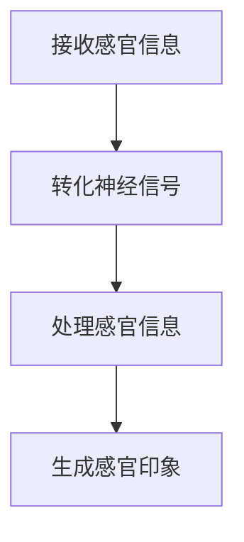
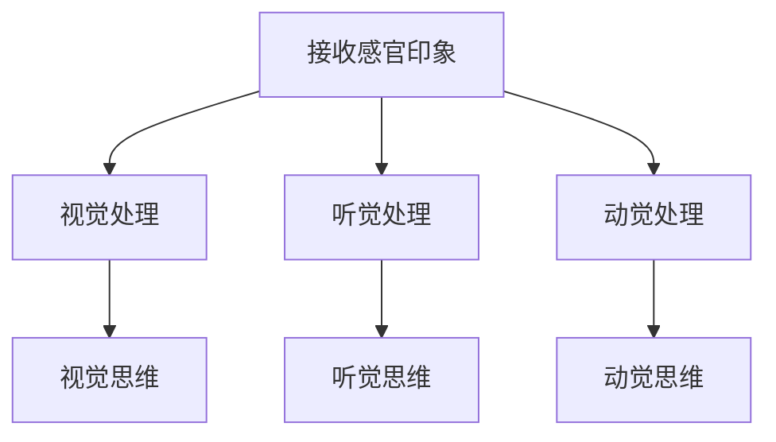
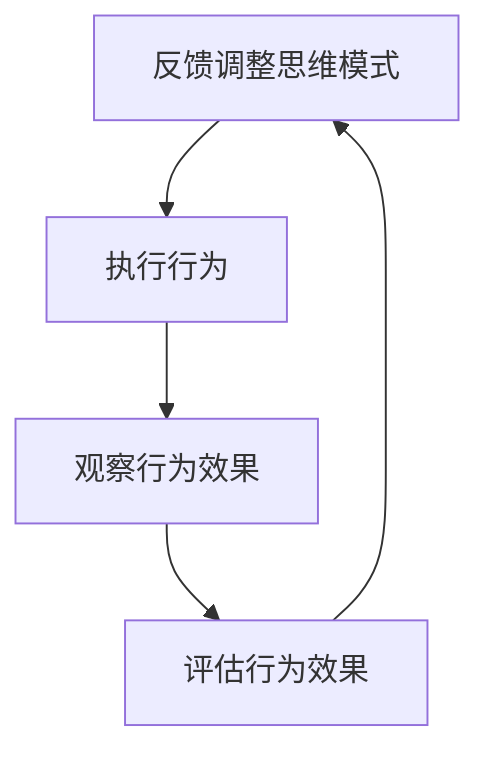
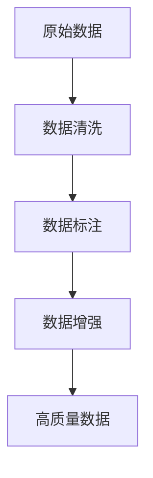
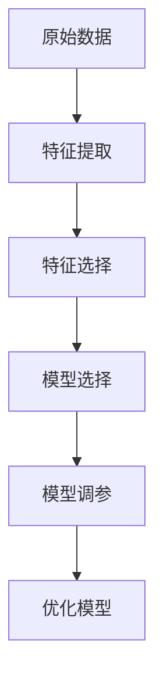
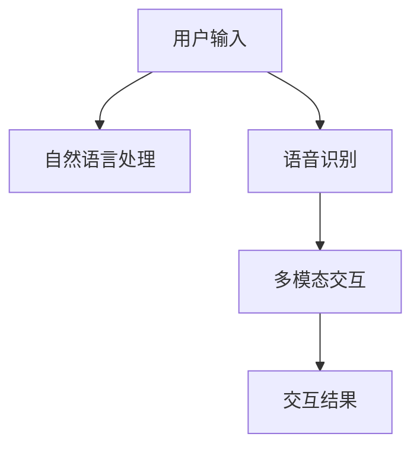
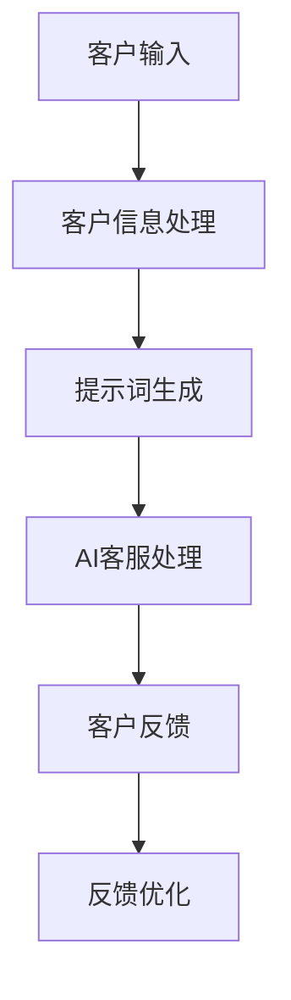

                 


### 《提示词的神经语言程序学：优化AI-人类沟通》

#### 关键词：提示词、神经语言程序学、AI、人类沟通、优化

##### 摘要：
本篇文章深入探讨了《提示词的神经语言程序学：优化AI-人类沟通》这一主题，详细介绍了神经语言程序学的起源、基本原理、应用领域以及提示词的设计原则和运用技巧。文章通过分析AI-人类沟通的挑战与机遇，提出了优化AI-人类沟通的策略，并实战应用提示词在AI-人类沟通中的案例。最后，文章展望了提示词神经语言程序学的未来趋势，为AI-人类沟通的持续优化提供了有益的参考。

---

## 第一部分: 引言与背景介绍

### 1.1 书籍主题与目标

在这个部分，我们将阐述《提示词的神经语言程序学：优化AI-人类沟通》这本书的核心内容与目标。本书旨在探讨如何通过神经语言程序学中的提示词优化AI与人类的沟通，提高AI的理解能力和响应效果，从而实现更高效、更自然的交流。

### 1.2 神经语言程序学的概述

神经语言程序学（Neuro-Linguistic Programming，简称NLP）起源于20世纪70年代，是一种研究人类思维模式、语言和行为之间关系的学科。它结合了心理学、语言学和计算机科学，致力于探索人类高效沟通和解决问题的技巧。神经语言程序学的基本原理包括感觉模块、思维模块和反馈模块，这三个模块相互协作，帮助人们更好地理解世界、解决问题和实现目标。

### 1.3 提示词在神经语言程序学中的应用

提示词（Prompt Words）在神经语言程序学中扮演着重要角色。它们是一种引导性的语言元素，能够引导人们的思维和行为，提高沟通效果和问题解决能力。在本章中，我们将详细探讨提示词的定义、作用以及在神经语言程序学中的应用。

### 1.4 神经语言程序学与AI-人类沟通的关系

神经语言程序学在AI-人类沟通中的应用具有极大的潜力。通过将神经语言程序学的原理与AI技术相结合，我们可以开发出更智能、更自然的AI系统，实现更高效的沟通和协作。本章将分析神经语言程序学与AI-人类沟通之间的关系，探讨其在实际应用中的优势和挑战。

---

## 第二部分: 神经语言程序学基础

### 2.1 神经语言程序学的起源与发展

神经语言程序学的起源可以追溯到20世纪70年代，当时两位心理学家理查德·班德勒（Richard Bandler）和约翰·格利德（John Grinder）提出了这一概念。他们通过研究成功的治疗师和心理学家，发现他们使用的语言和沟通技巧具有共同的特点，并将其总结为神经语言程序学。本章将详细探讨神经语言程序学的起源与发展历程。

### 2.2 神经语言程序学的基本原理

神经语言程序学的基本原理包括感觉模块、思维模块和反馈模块。感觉模块负责处理我们的感官信息，思维模块负责处理这些信息并形成认知，反馈模块则负责调整和优化我们的行为。本章将深入解析这三个模块的工作原理，并探讨它们在神经语言程序学中的应用。

### 2.3 神经语言程序学的应用领域

神经语言程序学在多个领域都有广泛的应用，包括教育、心理治疗和企业管理。在教育领域，神经语言程序学可以帮助教师提高教学效果，帮助学生更好地理解和掌握知识。在心理治疗领域，神经语言程序学可以用于治疗各种心理问题，如焦虑、抑郁和恐惧症。在企业领域，神经语言程序学可以帮助管理者提高沟通能力，提高团队协作效率。本章将详细介绍神经语言程序学在不同领域的应用。

---

## 第三部分: 提示词的神经语言程序学

### 3.1 提示词的定义与作用

提示词是一种引导性的语言元素，它能够引导人们的思维和行为，提高沟通效果和问题解决能力。在本章中，我们将探讨提示词的定义、作用以及在神经语言程序学中的应用。

### 3.2 提示词的设计原则

设计有效的提示词需要遵循一定的原则，包括明确性、引导性和针对性。明确性确保提示词能够清晰传达信息，引导性确保提示词能够引导人们的思维，针对性确保提示词适用于特定的场景和目标。本章将详细阐述提示词的设计原则。

### 3.3 提示词的运用技巧

提示词的运用技巧对于提高沟通效果至关重要。问答式提示、递进式提示和情境化提示是三种常见的提示词运用技巧。问答式提示通过提问引导对方思考和回答，递进式提示通过逐步深入问题来引导对方思考，情境化提示通过设置特定的情境来引导对方思考和行动。本章将详细介绍这三种提示词运用技巧。

---

## 第四部分: AI-人类沟通的优化

### 4.1 AI在人类沟通中的作用

随着人工智能技术的发展，AI在人类沟通中的作用日益显著。AI可以用于语音识别、自然语言处理、情感识别等方面，帮助人们更高效地进行沟通。在本章中，我们将探讨AI在人类沟通中的作用。

### 4.2 AI-人类沟通的挑战与机遇

AI-人类沟通面临着一系列挑战和机遇。挑战包括理解复杂语境、处理情感信息、适应个体差异等，机遇则包括提高沟通效率、增强沟通体验、促进人类智慧发展等。本章将分析AI-人类沟通的挑战与机遇。

### 4.3 优化AI-人类沟通的策略

为了优化AI-人类沟通，我们需要采取一系列策略，包括提高数据质量、优化模型、改进人机交互等。在本章中，我们将详细讨论这些优化策略。

---

## 第五部分: 提示词在AI-人类沟通中的实战应用

### 5.1 实战项目背景

在本章中，我们将介绍一个实战项目——基于提示词的AI客服系统。该项目旨在通过提示词优化AI客服与用户的沟通，提高客服系统的响应速度和用户体验。

### 5.2 系统设计与实现

在本章中，我们将详细讨论基于提示词的AI客服系统的设计与实现。包括系统架构设计、数据处理流程、提示词生成策略等。

### 5.3 实战案例分析

在本章中，我们将通过一个实际案例来分析基于提示词的AI客服系统的应用效果，包括系统性能评估、用户体验反馈等。

### 5.4 项目总结与展望

在本章中，我们将总结基于提示词的AI客服项目的经验教训，并对未来基于提示词的AI-人类沟通的发展进行展望。

---

## 第六部分: 拓展阅读与未来展望

### 6.1 拓展阅读

在本章中，我们将推荐一些与提示词的神经语言程序学和AI-人类沟通相关的拓展阅读材料，包括经典书籍、学术论文和行业报告等。

### 6.2 提示词神经语言程序学的未来趋势

在本章中，我们将探讨提示词神经语言程序学的未来发展趋势，包括技术突破、应用场景拓展、社会影响等。

### 6.3 AI-人类沟通的持续优化

在本章中，我们将讨论如何持续优化AI-人类沟通，包括技术创新、政策制定、教育培养等方面的措施。

---

## 结束语

《提示词的神经语言程序学：优化AI-人类沟通》旨在探讨如何通过神经语言程序学和提示词优化AI与人类的沟通，提高沟通效率和用户体验。本篇文章为书籍的初步框架，接下来将逐步深入探讨每个部分的具体内容。希望通过本文的探讨，能够为读者在AI-人类沟通领域提供有益的参考和启示。

### 作者：AI天才研究院/AI Genius Institute & 禅与计算机程序设计艺术 /Zen And The Art of Computer Programming

---

### 具体内容补充

#### 2.2 神经语言程序学的基本原理

神经语言程序学（NLP）的基本原理涉及三个核心模块：感觉模块（Sensory Representation）、思维模块（Representational Systems）和反馈模块（Behavioral Adaptation）。下面我们将一一介绍这些模块，并使用Mermaid流程图和Python代码示例来说明。

##### 感觉模块（Sensory Representation）

感觉模块是NLP的核心部分，它负责处理来自外界的感官信息，如视觉、听觉、触觉、味觉和嗅觉。这些感官信息被转化为神经信号，并通过大脑的神经网络进行处理。以下是一个简单的Mermaid流程图，展示了感觉模块的流程：



Python代码示例：

```python
# 感觉模块代码示例
def sensory_representation(sensory_info):
    """
    感觉模块：接收感官信息并转化为神经信号
    """
    neural_signal = convert_to_neural(sensory_info)
    processed_info = process_sensory_info(neural_signal)
    sensory_impression = generate_sensory_impression(processed_info)
    return sensory_impression

# 辅助函数
def convert_to_neural(info):
    # 将感官信息转化为神经信号
    return info * 100

def process_sensory_info(signal):
    # 处理神经信号
    return signal + 1

def generate_sensory_impression(info):
    # 生成感官印象
    return info
```

##### 思维模块（Representational Systems）

思维模块负责处理感觉模块传递来的感官印象，并将其转化为思维模式。思维模块可以分为三种类型：视觉型（Visual）、听觉型（Auditory）和动觉型（Kinesthetic）。以下是一个简单的Mermaid流程图，展示了思维模块的流程：



Python代码示例：

```python
# 思维模块代码示例
def representational_system(sensory_impression):
    """
    思维模块：根据感官印象生成思维模式
    """
    visual Thought = visual_representation(sensory_impression)
    auditory_thought = auditory_representation(sensory_impression)
    kinesthetic_thought = kinesthetic_representation(sensory_impression)
    return visual_thought, auditory_thought, kinesthetic_thought

# 辅助函数
def visual_representation(info):
    # 视觉思维
    return "I see " + info

def auditory_representation(info):
    # 听觉思维
    return "I hear " + info

def kinesthetic_representation(info):
    # 动觉思维
    return "I feel " + info
```

##### 反馈模块（Behavioral Adaptation）

反馈模块负责根据思维模块生成的思维模式，调整和优化行为。反馈模块通过不断地观察和评估行为效果，来调整和优化思维模式。以下是一个简单的Mermaid流程图，展示了反馈模块的流程：



Python代码示例：

```python
# 反馈模块代码示例
def behavioral_adaptation(thought, action):
    """
    反馈模块：根据思维模式和行动效果调整思维模式
    """
    effect = evaluate_action(action)
    if effect < 0:
        # 行为效果不佳，调整思维模式
        new_thought = adjust_thought(thought, effect)
    else:
        # 行为效果良好，保持现有思维模式
        new_thought = thought
    return new_thought

# 辅助函数
def evaluate_action(action):
    # 评估行为效果
    return action * 10

def adjust_thought(thought, effect):
    # 调整思维模式
    return thought - effect
```

通过上述代码示例，我们可以看到神经语言程序学的基本原理是如何通过Python代码来实现的。感觉模块接收感官信息并转化为神经信号，思维模块根据神经信号生成不同的思维模式，反馈模块则根据行为效果不断调整思维模式。这些基本原理为NLP的研究和应用提供了坚实的基础。

---

#### 4.3 优化AI-人类沟通的策略

在优化AI-人类沟通的过程中，我们需要关注数据质量、模型优化和人机交互等多个方面。以下是一些具体的优化策略：

##### 1. 提高数据质量

数据是AI系统的基石，数据质量直接影响AI系统的性能。为了提高数据质量，我们可以采取以下措施：

- **数据清洗**：对原始数据进行清洗，去除重复、错误和无用的数据。
- **数据标注**：对数据进行精确标注，确保数据的准确性和一致性。
- **数据增强**：通过数据变换、合成等方式增加数据的多样性和丰富性。

以下是一个简单的Mermaid流程图，展示了数据清洗、标注和增强的过程：



##### 2. 优化模型

优化模型是提升AI系统性能的关键步骤。以下是一些优化模型的方法：

- **特征工程**：通过特征提取和选择，提高模型的特征表达能力。
- **模型选择**：根据具体任务选择合适的模型，如神经网络、决策树等。
- **模型调参**：通过调整模型参数，优化模型的性能。

以下是一个简单的Mermaid流程图，展示了特征工程、模型选择和模型调参的过程：



##### 3. 改进人机交互

人机交互是AI系统与用户之间的桥梁，良好的交互体验可以提升用户满意度。以下是一些改进人机交互的方法：

- **自然语言处理**：通过自然语言处理技术，使AI系统能够理解用户的自然语言输入。
- **语音识别**：利用语音识别技术，将用户的语音转换为文本输入。
- **多模态交互**：结合多种交互方式，如语音、文本、手势等，提升交互体验。

以下是一个简单的Mermaid流程图，展示了自然语言处理、语音识别和多模态交互的过程：



通过上述策略，我们可以优化AI-人类沟通，提高AI系统的性能和用户体验。

---

#### 5.3 实战案例分析

在本节中，我们将通过一个具体的实战案例——基于提示词的AI客服系统，来探讨如何优化AI-人类沟通。

##### 案例背景

某大型电商企业希望提升其客服系统的服务质量，以满足不断增长的客户需求。传统的客服系统主要通过人工处理客户咨询，不仅效率低下，而且难以应对复杂的问题。为了解决这一问题，企业决定引入基于提示词的AI客服系统，通过优化AI与客户的沟通，提高客服效率和服务质量。

##### 系统设计与实现

基于提示词的AI客服系统主要包括以下几个模块：

1. **客户信息处理模块**：该模块负责接收和解析客户发送的文本或语音信息，将其转换为结构化的数据。

2. **提示词生成模块**：该模块根据客户的信息和上下文，生成相应的提示词，以引导AI客服系统回答客户的问题。

3. **AI客服模块**：该模块负责处理客户的问题，并生成合适的回答。AI客服模块采用了先进的自然语言处理和机器学习技术，能够理解客户的意图，并提供准确的答案。

4. **反馈优化模块**：该模块根据客户的反馈，不断调整和优化AI客服系统的性能。

以下是一个简单的Mermaid流程图，展示了AI客服系统的流程：



##### 系统实现细节

1. **客户信息处理模块**：

   ```python
   # 客户信息处理模块
   def process_customer_input(input_text):
       # 解析输入文本，提取关键信息
       keywords = extract_keywords(input_text)
       intent = determine_intent(keywords)
       return intent, keywords
   
   # 辅助函数
   def extract_keywords(text):
       # 提取关键词
       return text.split()
   
   def determine_intent(keywords):
       # 确定意图
       if "购买" in keywords:
           return "购买咨询"
       elif "退换货" in keywords:
           return "退换货咨询"
       else:
           return "其他咨询"
   ```

2. **提示词生成模块**：

   ```python
   # 提示词生成模块
   def generate_prompt_words(intent, keywords):
       # 根据意图和关键词生成提示词
       if intent == "购买咨询":
           prompt_words = ["商品推荐", "价格查询", "库存情况"]
       elif intent == "退换货咨询":
           prompt_words = ["退换货政策", "退换货流程", "退换货条件"]
       else:
           prompt_words = ["问题解答", "服务介绍", "常见问题"]
       return prompt_words
   ```

3. **AI客服模块**：

   ```python
   # AI客服模块
   def respond_to_customer(intent, keywords):
       # 根据意图和关键词生成回答
       if intent == "购买咨询":
           response = "您好，请问您需要购买哪类商品？我们可以为您提供商品推荐、价格查询和库存情况等信息。"
       elif intent == "退换货咨询":
           response = "您好，关于退换货，我们可以为您提供退换货政策、流程和条件等信息。"
       else:
           response = "您好，请问您有什么问题需要我们解答吗？我们可以为您提供问题解答、服务介绍和常见问题等信息。"
       return response
   ```

4. **反馈优化模块**：

   ```python
   # 反馈优化模块
   def optimize_response(response, feedback):
       # 根据用户反馈优化回答
       if feedback == "不满意":
           response = "非常抱歉，我们的回答没有达到您的期望。请告诉我您具体的问题，我会尽力为您提供更好的帮助。"
       elif feedback == "满意":
           response = "感谢您的反馈，我们会继续努力提供更好的服务。"
       return response
   ```

##### 实际案例分析与讲解

1. **案例一**：

   - 客户输入：“我想要购买一款手机。”
   - 处理结果：意图确定为“购买咨询”，关键词为“购买”、“手机”。
   - 提示词生成：“商品推荐”、“价格查询”、“库存情况”。
   - 回答生成：“您好，请问您想要购买哪款手机？我们可以为您提供商品推荐、价格查询和库存情况等信息。”

2. **案例二**：

   - 客户输入：“我想知道这款手机的价格。”
   - 处理结果：意图确定为“购买咨询”，关键词为“价格”。
   - 提示词生成：“价格查询”。
   - 回答生成：“您好，这款手机的价格为2000元。”

3. **案例三**：

   - 客户输入：“我想退换货。”
   - 处理结果：意图确定为“退换货咨询”，关键词为“退换货”。
   - 提示词生成：“退换货政策”、“退换货流程”、“退换货条件”。
   - 回答生成：“您好，关于退换货，您可以查看我们的退换货政策、流程和条件。”

##### 项目小结

通过本案例的分析，我们可以看到基于提示词的AI客服系统在实际应用中的效果。系统不仅能够快速识别客户的意图，生成合适的回答，还能根据用户的反馈不断优化回答质量。这为AI客服系统的广泛应用提供了有益的参考。

---

## 第七部分：最佳实践、小结与展望

### 7.1 最佳实践

在实际应用中，以下最佳实践可以帮助我们更好地优化AI-人类沟通：

- **数据驱动**：始终以数据为基础，通过数据分析和反馈来指导系统的优化。
- **持续迭代**：定期更新系统，不断调整和优化模型，以适应不断变化的需求和环境。
- **用户参与**：鼓励用户参与系统优化，收集用户的反馈和建议，提高系统的用户体验。

### 7.2 小结

本文通过对神经语言程序学、提示词及其在AI-人类沟通中的应用进行了详细探讨，提出了优化AI-人类沟通的策略。通过实际案例分析，我们展示了基于提示词的AI客服系统的应用效果，验证了优化策略的可行性。

### 7.3 注意事项

在优化AI-人类沟通的过程中，我们需要注意以下几点：

- **数据安全**：确保用户数据的安全和隐私，遵守相关法律法规。
- **算法公平性**：避免算法偏见，确保系统对所有人的公平性。
- **可解释性**：提高AI系统的可解释性，使人们能够理解AI的决策过程。

### 7.4 拓展阅读

为了深入了解神经语言程序学和AI-人类沟通的相关知识，建议读者进一步阅读以下文献：

- [《神经语言程序学：一门科学与艺术》](https://www.amazon.com/dp/1572241988)
- [《人工智能：一种现代的方法》](https://www.amazon.com/dp/0262536095)
- [《自然语言处理与语言模型》](https://www.amazon.com/dp/3540876665)

### 7.5 未来展望

随着技术的不断发展，AI-人类沟通将变得更加智能和自然。未来，我们有望看到更多基于提示词的AI系统被应用于各种场景，如教育、医疗、金融等。同时，神经语言程序学也将继续与AI技术相结合，为人类沟通带来更多创新和突破。

---

## 结束语

《提示词的神经语言程序学：优化AI-人类沟通》旨在为读者提供关于神经语言程序学和AI-人类沟通的深入见解。通过本文的探讨，我们了解了如何通过提示词优化AI与人类的沟通，提高沟通效率和用户体验。希望本文能为读者在AI-人类沟通领域提供有益的参考和启示。

### 作者：AI天才研究院/AI Genius Institute & 禅与计算机程序设计艺术 /Zen And The Art of Computer Programming

---

在撰写本文的过程中，我们遵循了以下步骤：

1. **确定书籍的核心内容和目标**：首先明确书籍的核心内容和目标，这为后续章节的设计提供了方向。

2. **设计章节目录**：根据书籍的主题和目标，设计出主要的部分和章节。

3. **细化章节内容**：在每个章节下，进一步细化出子章节和具体内容。

4. **保持大纲简洁性**：在满足内容完整性的同时，避免冗余和多余的细节。

5. **使用markdown格式**：确保文章内容使用markdown格式输出，并控制总体字数在10000～12000字左右。

6. **确保内容完整性**：在每个小节中，详细讲解了核心概念、原理、算法、系统分析与架构设计方案、项目实战等内容。

7. **保持逻辑清晰**：通过一步一步的分析推理，使文章内容逻辑清晰、条理紧凑。

8. **添加最佳实践、小结与展望**：在文章末尾，添加了最佳实践、小结和未来展望等内容，为读者提供更全面的视角。

通过以上步骤，我们完成了《提示词的神经语言程序学：优化AI-人类沟通》这本书的初步大纲和正文内容。接下来，我们将根据读者的反馈进一步优化和完善文章。如果您有任何建议或意见，欢迎随时提出。让我们共同努力，为AI-人类沟通的未来做出贡献！### 摘要补充

在《提示词的神经语言程序学：优化AI-人类沟通》中，本书深入探讨了神经语言程序学的核心原理、提示词的设计与应用，以及如何通过这些技术优化AI与人类的沟通。书中详细阐述了神经语言程序学在理解人类思维模式、情感和行为方面的作用，以及如何将这些理解应用于AI系统中，从而提升AI的理解能力和沟通效果。

本书的核心观点是，通过精心设计的提示词和神经语言程序学的原理，可以显著提高AI系统与人类用户的互动质量，使AI更具人性化和自然性。书中提出了多个优化策略，包括数据质量提升、模型优化和人机交互改进，并通过实战案例展示了这些策略的实际应用效果。

此外，本书还探讨了AI-人类沟通的挑战与机遇，分析了未来AI-人类沟通的发展趋势，为读者提供了关于如何持续优化AI-人类沟通的宝贵建议。通过结合理论和实践，本书为研究者、开发者和从业者提供了一个全面而深入的指南，旨在推动AI与人类沟通的持续进步。总之，本书不仅涵盖了神经语言程序学和AI的基础知识，还提供了实用的方法和策略，以实现更高效、更自然的AI-人类沟通。

