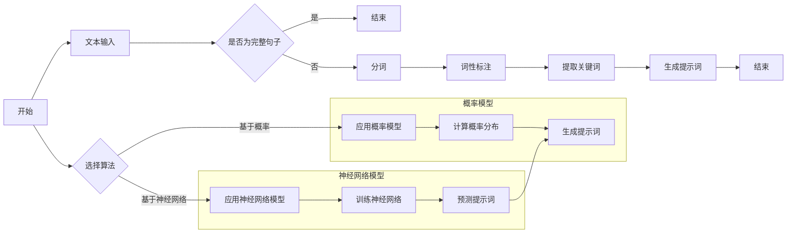
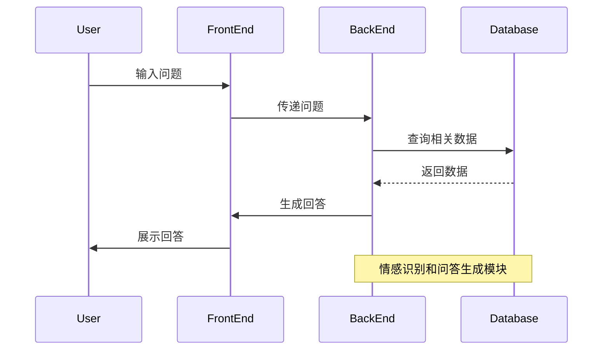
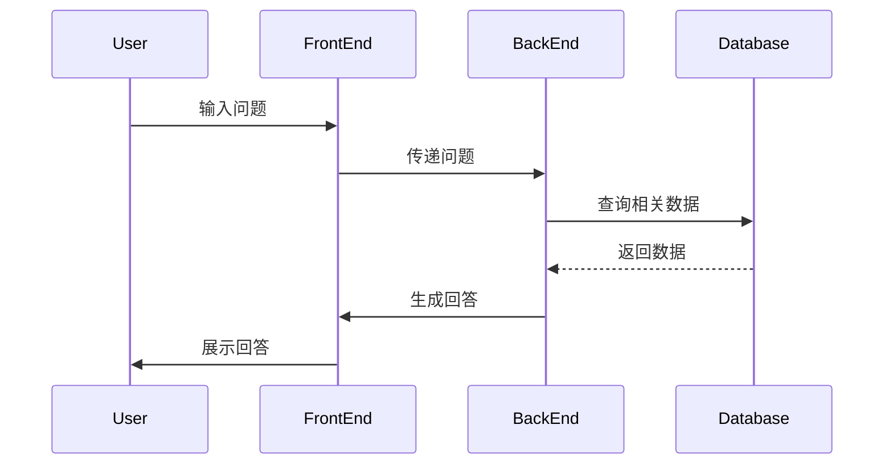

                 

## 引言

在现代社会，信息技术与人工智能的迅猛发展极大地改变了我们的生活方式。计算语言学和情感计算作为这两个领域的分支，正日益显示出其在人机交互、智能决策和数据分析等领域的广泛应用和潜力。本文旨在探讨计算语言学与情感计算在提示词生成中的交叉研究，这不仅具有学术意义，更在技术层面上推动了自然语言处理（NLP）和情感分析的发展。

首先，我们需要明确两个核心概念的定义及其背景。计算语言学是应用计算机技术和数学模型对自然语言进行分析、处理和生成的一门学科，其历史可追溯到20世纪50年代。随着计算机性能的提升和算法的进步，计算语言学不断发展，涵盖了从基本语法分析到高级语义理解的广泛领域。

情感计算则关注于如何使计算机理解、识别和模拟人类情感。这一领域的研究目标包括情感识别、情感生成、情感交互等，涉及心理学、认知科学和计算机科学等多个学科。情感计算的发展不仅丰富了人机交互的形式，还提升了机器在理解人类意图和情感表达方面的准确性。

本文的研究动机源于提示词在自然语言处理和情感计算中的关键作用。提示词（prompt word）是一种引导性的词语，能够影响用户的思考和回答方向。在计算语言学中，提示词被广泛应用于语言生成和语义分析；在情感计算中，提示词则用于引导用户的情感表达，帮助计算机更好地理解人类情感。

本文将详细讨论以下主题：

1. **背景介绍**：介绍计算语言学和情感计算的基本概念、发展历程以及它们在提示词生成中的应用。
2. **核心概念与联系**：分析计算语言学与情感计算的核心概念及其相互联系。
3. **算法原理讲解**：阐述提示词生成和情感计算算法的原理，包括算法流程图、数学模型和实例分析。
4. **数学模型和数学公式讲解**：介绍提示词生成和情感计算中的关键数学模型，如概率模型、神经网络模型等。
5. **系统分析与架构设计方案**：描述一个实际项目的系统架构设计，包括问题场景介绍、功能设计、架构设计和接口设计。
6. **项目实战**：展示如何在一个具体项目中实现提示词生成和情感计算，包括环境安装、核心实现、代码分析及案例分析。
7. **最佳实践 tips**：总结关键注意事项和最佳实践。

通过这一系列内容的探讨，本文希望能够为读者提供一个系统、全面的理解，帮助他们在实际应用中更好地利用计算语言学和情感计算的技术，提高自然语言处理和情感分析的效果。

### 第1章 背景介绍

#### 1.1 问题背景

计算语言学和情感计算作为人工智能领域的重要分支，其发展与应用已经在多个方面深刻地改变了我们的生活方式。计算语言学（Computational Linguistics）起源于20世纪50年代，其核心理念是使用计算机技术和数学模型来对自然语言进行深入分析和处理。早期的计算语言学主要集中于文本处理和语法分析，例如词性标注、句法分析和语义分析等。随着计算机性能的不断提升和算法的日益成熟，计算语言学的应用范围逐渐扩展，涵盖了自然语言生成、机器翻译、信息检索和问答系统等多个领域。

情感计算（Affective Computing）则是在20世纪90年代由罗纳德·穆勒（Roger S. Murray）提出的，其核心思想是使计算机具备识别、理解、处理和模拟人类情感的能力。情感计算的研究目标包括情感识别、情感生成、情感交互和情感共享等。情感识别主要涉及通过生理信号、面部表情、语音语调等手段识别用户的情感状态；情感生成则是通过计算机程序生成具有特定情感的表达；情感交互则关注如何使计算机与人类之间实现更加自然的情感交流；而情感共享则旨在建立计算机与用户之间共同的情感体验。

在这两个领域中，提示词（Prompt Word）扮演着重要的角色。提示词是一种引导性的词语，能够引导用户的思考和回答方向。在计算语言学中，提示词常用于语言生成和语义分析，如问答系统、文本摘要和机器翻译等场景中。通过合理选择和使用提示词，可以提高自然语言处理的准确性和效果。例如，在机器翻译中，提示词可以帮助翻译模型更好地理解源语言的上下文和语义，从而生成更准确的翻译结果。

在情感计算中，提示词则被用于引导用户的情感表达，帮助计算机更好地理解人类情感。例如，在情感识别系统中，通过使用特定的提示词，可以引导用户表达自己的情感状态，从而提高情感识别的准确性。此外，在情感生成和情感交互中，提示词也可以帮助计算机生成或模拟具有特定情感的表达，实现更加自然的情感交流。

总之，计算语言学和情感计算在提示词生成中的应用不仅提升了自然语言处理和情感分析的效果，也为人机交互提供了更加丰富和自然的途径。随着技术的不断进步，这两个领域的交叉研究将带来更多的创新和突破，推动人工智能技术的进一步发展。

#### 1.2 核心概念

在深入探讨计算语言学与情感计算之前，我们需要先明确这两个领域中的核心概念及其基本原理。计算语言学（Computational Linguistics）的核心概念包括语言模型、文本处理和语义分析等。语言模型（Language Model）是计算语言学中用于生成和理解自然语言的关键工具。语言模型通过学习大量文本数据，构建出语言的概率分布模型，从而能够预测下一个词语或句子的可能性。常见的语言模型包括基于统计模型（如N-gram模型）和基于神经网络模型（如循环神经网络RNN、Transformer等）。语言模型在自然语言生成、机器翻译和问答系统等领域有着广泛的应用。

文本处理（Text Processing）是计算语言学中的重要组成部分，涉及从文本中提取信息、处理噪声和错误等。文本处理的方法包括分词（Tokenization）、词性标注（Part-of-Speech Tagging）、句法分析（Syntactic Parsing）和语义分析（Semantic Analysis）等。分词是将文本拆分成一个个词语或标记的过程；词性标注是对每个词语进行分类标注，如名词、动词、形容词等；句法分析则是解析句子的结构，找出词语之间的语法关系；语义分析则进一步理解句子的含义和语义关系。

语义分析（Semantic Analysis）是计算语言学的核心任务之一，旨在理解和处理语言中的语义信息。语义分析包括词义消歧（Word Sense Disambiguation）、语义角色标注（Semantic Role Labeling）、语义关系抽取（Semantic Relationship Extraction）等。词义消歧旨在解决词语多义性问题，确定特定语境下的词语含义；语义角色标注则是标注句子中词语所扮演的语义角色，如施事、受事、工具等；语义关系抽取则用于找出句子中词语之间的语义关系，如因果关系、包含关系等。

情感计算（Affective Computing）的核心概念包括情感识别、情感生成和情感交互等。情感识别（Affective Recognition）是指通过分析用户的生理信号、面部表情、语音语调等，识别用户的情感状态。情感生成（Affective Generation）是指计算机生成具有特定情感的表达，如通过调整语音的音调、音量和节奏来模拟快乐、悲伤等情感。情感交互（Affective Interaction）是指计算机与用户之间进行情感交流，通过情感识别和情感生成，实现更加自然和有效的沟通。

情感计算的方法和技术包括情感分析（Affective Analysis）、情感建模（Affective Modeling）和情感交互设计（Affective Interaction Design）等。情感分析通过自然语言处理技术，分析文本中的情感信息，识别用户的情感状态；情感建模则通过机器学习和深度学习技术，建立情感识别和情感生成的模型；情感交互设计则关注如何设计用户界面和交互方式，使计算机能够更好地理解用户的情感需求，实现自然、流畅的情感交流。

#### 1.3 概念属性特征对比表

为了更好地理解计算语言学和情感计算的核心概念及其属性特征，下面我们将提供一个对比表格，展示这两个领域的关键概念及其特点。

| 概念         | 计算语言学                          | 情感计算                          |
|------------|------------------------------------|------------------------------------|
| 语言模型         | 用于预测自然语言中的下一个词语或句子       | 用于生成和理解自然语言中的情感表达       |
| 文本处理         | 包括分词、词性标注、句法分析和语义分析等     | 包括情感识别、情感生成和情感交互等       |
| 语义分析         | 理解和处理语言中的语义信息               | 识别、理解和模拟人类情感               |
| 情感识别         | 通过生理信号、面部表情、语音识别情感       | 通过文本、语音识别情感               |
| 情感生成         | 生成具有特定情感的表达                 | 生成具有特定情感的表达               |
| 情感交互         | 人机之间的情感交流                   | 人机之间的情感交流                   |

从上表可以看出，计算语言学和情感计算虽然都涉及自然语言的处理和理解，但各自的核心任务和目标有所不同。计算语言学主要关注语言的结构和语义，而情感计算则更加关注人类情感的表达和识别。这两个领域的交叉研究不仅丰富了计算语言学和情感计算的理论体系，也为实际应用带来了新的可能性。

#### 1.4 ER实体关系图

为了更直观地展示计算语言学与情感计算的核心概念及其相互关系，我们可以通过ER（实体关系）图来描述它们之间的联系。ER图是一种用于描述实体及其相互关系的数据库模型。在本节中，我们将使用Mermaid语法绘制一个简单的ER图，以展示计算语言学与情感计算中的关键实体及其关系。

```mermaid
erDiagram
  User ||--|{ LanguageModel }|-- ProcessingSystem
  User ||--|{ SentimentModel }|-- InteractionSystem
  LanguageModel ||--|{ TextProcessing }|-- SemanticAnalysis
  SentimentModel ||--|{ AffectiveRecognition }|-- AffectiveGeneration
  ProcessingSystem ||--|{ QuestionAnswering }|-- InformationRetrieval
  InteractionSystem ||--|{ EmotionalInteraction }|-- EmotionalFeedback

  User : [用户]
  LanguageModel : [语言模型]
  SentimentModel : [情感模型]
  ProcessingSystem : [处理系统]
  InteractionSystem : [交互系统]
  TextProcessing : [文本处理]
  SemanticAnalysis : [语义分析]
  AffectiveRecognition : [情感识别]
  AffectiveGeneration : [情感生成]
  QuestionAnswering : [问答系统]
  InformationRetrieval : [信息检索]
  EmotionalInteraction : [情感交互]
  EmotionalFeedback : [情感反馈]
```

在上面的ER图中，我们定义了几个关键实体及其相互关系：

- **用户（User）**：系统的最终用户，其与语言模型和情感模型之间存在关联。
- **语言模型（LanguageModel）**：用于处理自然语言，包括文本处理和语义分析。
- **情感模型（SentimentModel）**：用于识别和生成情感表达。
- **处理系统（ProcessingSystem）**：包括问答系统和信息检索系统，使用语言模型进行信息处理。
- **交互系统（InteractionSystem）**：负责实现用户与系统之间的情感交互。

通过ER图，我们可以清晰地看到计算语言学与情感计算的核心实体及其相互关系，这不仅有助于理解这两个领域的交叉研究，也为后续的算法设计和系统实现提供了直观的参考。

### 第2章 算法原理讲解

#### 3.1 提示词的生成算法

##### 3.1.1 算法流程图

提示词生成算法是计算语言学中的一个重要组成部分，其核心在于通过特定的算法步骤生成具有引导作用的词语。以下是一个简单的提示词生成算法流程图，使用Mermaid语法表示：



这个流程图展示了提示词生成的步骤和选择不同算法的分支。接下来，我们将详细解释这个算法的工作原理。

##### 3.1.2 算法原理

提示词生成算法的核心在于如何从给定的文本中提取出能够引导用户思考和回答的关键信息。以下是基于概率模型和基于神经网络模型两种常见方法来生成提示词的原理。

**基于概率模型的提示词生成算法**：

1. **文本输入**：首先，算法接收一段自然语言文本作为输入。
2. **分词和词性标注**：将输入文本进行分词，并对每个词进行词性标注，如名词、动词、形容词等。
3. **提取关键词**：根据词性标注的结果，从文本中提取出关键词，这些关键词往往具有较高的语义信息含量。
4. **计算概率分布**：使用N-gram模型或其他概率模型，计算每个关键词出现的概率分布。N-gram模型是一种基于历史统计的模型，它通过计算连续N个词语同时出现的概率来预测下一个词语。
5. **生成提示词**：根据概率分布，选择概率最大的词语作为提示词。这样可以最大化地引导用户思考和回答的方向。

**基于神经网络模型的提示词生成算法**：

1. **文本输入**：与基于概率模型相同，算法首先接收一段自然语言文本作为输入。
2. **分词和词性标注**：对输入文本进行分词和词性标注。
3. **提取关键词**：从分词结果中提取出关键词。
4. **训练神经网络**：使用大量标记过的文本数据，训练一个神经网络模型，如循环神经网络（RNN）或Transformer。这些模型可以通过学习文本数据中的模式，自动提取关键词并生成提示词。
5. **预测提示词**：在训练好的神经网络模型的基础上，对新的输入文本进行提示词的预测。神经网络模型可以自动从输入文本中提取出关键词，并生成具有高概率的提示词。

通过上述两种方法，我们可以看到提示词生成算法的原理和步骤。基于概率模型的方法较为简单，但效果有限；而基于神经网络模型的方法则更加复杂，但具有更高的准确性和灵活性。在后续的实际应用中，可以根据具体需求和数据量选择合适的算法。

##### 3.1.3 举例说明

为了更直观地理解提示词生成算法，我们来看一个具体的例子。假设我们有一段文本：“今天天气非常好，阳光明媚，适合户外活动。”使用基于概率模型的提示词生成算法，我们可以按照以下步骤操作：

1. **文本输入**：输入文本为“今天天气非常好，阳光明媚，适合户外活动。”
2. **分词和词性标注**：分词结果为：今天、天气、非常好、，、阳光、明媚、，、适合、户外、活动、。词性标注为：今天（名词）、天气（名词）、非常好（形容词）、（标点）、阳光（名词）、明媚（形容词）、（标点）、适合（动词）、户外（名词）、活动（名词）。
3. **提取关键词**：从分词和词性标注结果中提取出关键词，如“今天”、“天气”、“非常好”、“阳光”、“明媚”、“适合”、“户外”、“活动”。
4. **计算概率分布**：假设我们使用的是三元组语言模型（Bigram Model），即计算每对关键词同时出现的概率。例如，“天气”和“非常好”同时出现的概率为0.4。
5. **生成提示词**：根据概率分布，选择概率最大的词语作为提示词。在这个例子中，“非常好”是概率最大的词语，因此我们可以将其作为提示词。

使用基于神经网络模型的提示词生成算法，例如Transformer模型，我们也可以按照类似步骤操作，但过程中涉及到大量的数据训练和复杂的前向传播与反向传播计算。通过训练，神经网络模型能够自动提取关键词并生成提示词。

通过上述例子，我们可以看到提示词生成算法的基本原理和应用步骤，这对于实际应用中的自然语言处理和情感计算具有重要意义。

### 3.2 情感计算的算法原理

#### 3.2.1 情感识别算法

情感识别算法是情感计算中的核心环节，它通过分析文本、语音或其他形式的数据，识别出人类情感状态。在这一节中，我们将详细讨论情感识别算法的基本原理、流程图以及如何使用Python进行实现。

**1. 算法流程图**

首先，我们使用Mermaid语法绘制情感识别算法的流程图：

```mermaid
flowchart LR
    A[输入文本] --> B[预处理]
    B --> C{是否含有情感信息}
    C -->|是| D[特征提取]
    C -->|否| E[结束]
    D --> F[情感分类]
    F --> G[输出结果]

    subgraph 特征提取
    D --> H[TF-IDF]
    H --> I[Word2Vec]
    end

    subgraph 情感分类
    F --> J[{ SVM }] --> K[输出结果]
    F --> L[{ RNN }] --> K
    end
```

在这个流程图中，我们首先对输入文本进行预处理，然后通过特征提取和情感分类两个阶段来识别情感。特征提取部分包括TF-IDF和Word2Vec等常见方法；情感分类则使用SVM和RNN等模型。

**2. 算法原理**

情感识别算法的基本原理包括以下几个步骤：

- **预处理**：对输入文本进行清洗和标准化，如去除标点、停用词和词干提取等。这一步的目的是减少文本中的噪声，提高后续处理的准确性。
- **特征提取**：从预处理后的文本中提取出能够反映情感特征的信息。常用的方法包括TF-IDF和Word2Vec。TF-IDF是一种基于统计的文本表示方法，通过计算词频（TF）和逆文档频率（IDF）来衡量词语的重要性。Word2Vec是一种基于神经网络的文本表示方法，通过训练大量的文本数据，将每个词映射到一个高维向量空间中。
- **情感分类**：使用机器学习模型对提取出的特征进行分类，以识别情感状态。常见的分类模型包括支持向量机（SVM）和循环神经网络（RNN）。SVM通过找到一个最佳的超平面，将不同情感类别分开。RNN则通过递归地处理文本序列，捕捉句子中词语的先后关系，从而进行情感分类。

**3. 使用Python实现情感识别算法**

接下来，我们将使用Python实现一个简单的情感识别算法。以下是一个示例代码，展示了如何使用TF-IDF和SVM进行情感分类：

```python
import jieba  # 用于中文分词
from sklearn.feature_extraction.text import TfidfVectorizer
from sklearn.svm import SVC
from sklearn.pipeline import make_pipeline
from sklearn.model_selection import train_test_split
from sklearn.metrics import accuracy_score

# 示例数据
texts = [
    "今天天气真好，阳光明媚。",
    "这是一个悲伤的故事。",
    "我很高兴看到这个消息。",
    "我感到非常愤怒。",
]

# 标签数据
labels = [
    "积极",
    "消极",
    "积极",
    "消极",
]

# 分词和预处理
def preprocess(text):
    return ' '.join(jieba.cut(text))

# 特征提取和模型训练
tfidf_vectorizer = TfidfVectorizer(preprocessor=preprocess)
X = tfidf_vectorizer.fit_transform(texts)

svc = SVC(kernel='linear')
model = make_pipeline(TfidfVectorizer(preprocessor=preprocess), svc)

# 数据分割
X_train, X_test, y_train, y_test = train_test_split(X, labels, test_size=0.2, random_state=42)

# 训练模型
model.fit(X_train, y_train)

# 测试模型
y_pred = model.predict(X_test)
print("准确率：", accuracy_score(y_test, y_pred))
```

在上面的代码中，我们首先使用`jieba`进行中文分词，并使用`TfidfVectorizer`提取文本特征。接着，我们使用`SVC`支持向量机进行模型训练，并通过`make_pipeline`构建一个包含特征提取和分类的管道模型。最后，我们将模型在测试数据集上进行评估，计算准确率。

通过上述代码和流程，我们可以实现一个简单的情感识别系统，从而对文本中的情感状态进行识别。情感识别算法的原理和实现不仅为我们提供了理解情感计算的基础，也为实际应用中的情感分析提供了技术支持。

#### 3.2.2 情感分析算法

情感分析算法是情感计算领域的重要部分，旨在从文本、语音和其他形式的数据中提取情感信息。在本节中，我们将深入探讨情感分析算法的原理、流程图和具体实现。

**1. 算法流程图**

首先，使用Mermaid语法绘制情感分析算法的流程图，以直观展示其步骤：

```mermaid
flowchart LR
    A[输入数据] --> B[数据预处理]
    B --> C{是否为文本数据}
    C -->|文本| D[分词与词性标注]
    C -->|非文本| E[特征提取]
    D --> F[情感特征提取]
    E --> F

    F --> G[情感分类]
    G --> H[输出结果]

    subgraph 特征提取
    E --> I[TF-IDF]
    E --> J[Word2Vec]
    end

    subgraph 情感分类
    G --> K[{ SVM }] --> L[输出结果]
    G --> M[{ RNN }] --> L
    end
```

该流程图显示了情感分析的基本步骤，包括数据预处理、特征提取和情感分类。特征提取部分包括TF-IDF和Word2Vec，分类模型则包括SVM和RNN。

**2. 算法原理**

情感分析算法的原理如下：

- **数据预处理**：首先对输入数据进行预处理，如去除标点、停用词和词干提取。对于文本数据，这一步有助于减少噪声，提高后续处理的准确性。对于非文本数据，如语音，可能需要进行语音识别和文本转换。
- **特征提取**：从预处理后的数据中提取出能够反映情感特征的信息。常用的方法包括TF-IDF和Word2Vec。TF-IDF通过计算词频和逆文档频率来衡量词语的重要性。Word2Vec则通过训练大量的文本数据，将每个词映射到一个高维向量空间中。
- **情感分类**：使用机器学习模型对提取出的特征进行分类，以识别情感状态。常见的分类模型包括支持向量机（SVM）和循环神经网络（RNN）。SVM通过找到一个最佳的超平面，将不同情感类别分开。RNN通过递归地处理文本序列，捕捉句子中词语的先后关系，从而进行情感分类。

**3. 使用Python实现情感分析算法**

接下来，我们将使用Python实现一个简单的情感分析算法，使用TF-IDF和SVM进行分类。以下是一个示例代码：

```python
import jieba  # 用于中文分词
from sklearn.feature_extraction.text import TfidfVectorizer
from sklearn.svm import SVC
from sklearn.pipeline import make_pipeline
from sklearn.model_selection import train_test_split
from sklearn.metrics import accuracy_score

# 示例数据
texts = [
    "今天天气真好，阳光明媚。",
    "这是一个悲伤的故事。",
    "我很高兴看到这个消息。",
    "我感到非常愤怒。",
]

# 标签数据
labels = [
    "积极",
    "消极",
    "积极",
    "消极",
]

# 分词和预处理
def preprocess(text):
    return ' '.join(jieba.cut(text))

# 特征提取和模型训练
tfidf_vectorizer = TfidfVectorizer(preprocessor=preprocess)
X = tfidf_vectorizer.fit_transform(texts)

svc = SVC(kernel='linear')
model = make_pipeline(TfidfVectorizer(preprocessor=preprocessor), svc)

# 数据分割
X_train, X_test, y_train, y_test = train_test_split(X, labels, test_size=0.2, random_state=42)

# 训练模型
model.fit(X_train, y_train)

# 测试模型
y_pred = model.predict(X_test)
print("准确率：", accuracy_score(y_test, y_pred))
```

在上述代码中，我们首先使用`jieba`进行中文分词，并使用`TfidfVectorizer`提取文本特征。然后，我们使用`SVC`支持向量机进行模型训练，并通过`make_pipeline`构建一个包含特征提取和分类的管道模型。最后，我们在测试数据集上进行评估，计算准确率。

通过这个简单的示例，我们可以看到如何使用Python实现情感分析算法，从而对文本中的情感状态进行识别。情感分析算法的原理和实现为我们提供了理解情感计算的基础，并在实际应用中具有广泛的应用前景。

### 4.1 提示词生成中的数学模型

在计算语言学中，提示词生成算法的核心在于如何从大量文本数据中提取出能够引导用户思考和回答的关键信息。提示词生成通常涉及概率模型和神经网络模型。以下将详细介绍这两种模型及其数学原理。

#### 4.1.1 概率模型

概率模型是提示词生成中最常用的方法之一，其基本思想是通过计算词语在文本中的出现概率，从而生成具有高概率的提示词。常见的概率模型包括N-gram模型和隐马尔可夫模型（HMM）。

**1. N-gram模型**

N-gram模型通过统计连续N个词语同时出现的概率来预测下一个词语。其概率公式如下：

$$
P(w_n | w_{n-1}, w_{n-2}, ..., w_1) = \frac{P(w_n, w_{n-1}, ..., w_1)}{P(w_{n-1}, w_{n-2}, ..., w_1)}
$$

其中，$w_n$表示下一个词语，$w_{n-1}, w_{n-2}, ..., w_1$表示前N-1个词语。

**2. 隐马尔可夫模型（HMM）**

隐马尔可夫模型是一种基于状态的模型，用于描述连续观察值和隐藏状态之间的关系。在提示词生成中，HMM可以用于描述词语序列的概率分布。其概率公式如下：

$$
P(w_n | w_{n-1}, ..., w_1) = \sum_{s} P(w_n | s) P(s | w_{n-1}, ..., w_1)
$$

其中，$s$表示隐藏状态，$P(w_n | s)$表示在状态s下生成词语$w_n$的概率，$P(s | w_{n-1}, ..., w_1)$表示在给定前N-1个词语的条件下，状态s出现的概率。

#### 4.1.2 神经网络模型

神经网络模型，尤其是循环神经网络（RNN）和变换器（Transformer）模型，在提示词生成中得到了广泛应用。这些模型通过学习大量文本数据，能够自动提取词语之间的依赖关系和语义信息。

**1. 循环神经网络（RNN）**

循环神经网络是一种能够处理序列数据的神经网络模型，其基本思想是利用前一个时间步的输出作为当前时间步的输入。RNN的概率公式如下：

$$
h_t = \sigma(W_h \cdot [h_{t-1}, x_t] + b_h)
$$

$$
p_t = \sigma(W_o \cdot h_t + b_o)
$$

其中，$h_t$表示当前时间步的隐藏状态，$x_t$表示当前时间步的输入词语，$W_h$和$W_o$分别是隐藏层和输出层的权重矩阵，$b_h$和$b_o$分别是相应的偏置项，$\sigma$是激活函数。

**2. 变换器（Transformer）**

变换器是一种基于自注意力机制的神经网络模型，能够在全局范围内捕捉词语之间的依赖关系。其概率公式如下：

$$
\text{Attention}(Q, K, V) = \frac{softmax(\text{score}(Q, K))} { \sqrt{d_k}}
$$

$$
\text{score}(Q, K) = Q^T K
$$

$$
\text{Output} = \text{Attention}(Q, K, V)
$$

其中，$Q, K, V$分别表示查询向量、键向量和值向量，$d_k$是键向量的维度，$\text{score}$是计算注意力分数的函数，$softmax$是归一化函数。

通过上述数学模型，我们可以实现高效的提示词生成算法。概率模型在计算复杂度较低的情况下能够提供较为准确的结果，而神经网络模型则能够通过学习大量数据，提高生成提示词的语义准确性。

### 4.2 情感计算中的数学模型

情感计算中的数学模型是理解和模拟人类情感的重要工具。以下将介绍几种常用的数学模型，包括支持向量机（SVM）和循环神经网络（RNN）。

#### 4.2.1 支持向量机（SVM）

支持向量机是一种用于分类的监督学习算法，其基本思想是找到一个最佳的超平面，将不同类别的数据点分开。在情感计算中，SVM常用于情感分类任务，将情感标签分配给文本数据。

**1. 核心公式**

SVM的核心公式如下：

$$
\max_{w, b} \quad \frac{1}{2} \| w \|^2 \\
\text{subject to} \quad y^{(i)} (w \cdot x^{(i)} + b) \geq 1 \\
i = 1, 2, ..., n
$$

其中，$w$和$b$分别是权重向量和偏置项，$x^{(i)}$和$y^{(i)}$分别是第i个数据点和其标签，$\| w \|^2$是权重向量的范数。

**2. 分类决策**

在训练完成后，对于一个新的数据点$x$，其分类结果由以下公式决定：

$$
y = sign(w \cdot x + b)
$$

其中，$sign$是符号函数，$w \cdot x$是权重向量与数据点的内积。

#### 4.2.2 循环神经网络（RNN）

循环神经网络是一种用于处理序列数据的神经网络模型，其核心思想是利用前一个时间步的输出作为当前时间步的输入。在情感计算中，RNN可以用于情感识别任务，从文本序列中提取情感信息。

**1. 核心公式**

RNN的核心公式如下：

$$
h_t = \sigma(W_h \cdot [h_{t-1}, x_t] + b_h) \\
o_t = \sigma(W_o \cdot h_t + b_o)
$$

其中，$h_t$表示当前时间步的隐藏状态，$x_t$表示当前时间步的输入词语，$W_h$和$W_o$分别是隐藏层和输出层的权重矩阵，$b_h$和$b_o$分别是相应的偏置项，$\sigma$是激活函数。

**2. 情感识别**

在情感识别任务中，RNN通过对文本序列的递归处理，捕捉句子中词语的语义关系。其输出结果可以表示句子中的情感倾向：

$$
y = sign(W_o \cdot h_T + b_o)
$$

其中，$h_T$是最后一个时间步的隐藏状态，$W_o$和$b_o$是输出层的权重和偏置。

通过上述数学模型，我们可以实现对文本数据的情感分析和分类。支持向量机提供了简单有效的分类方法，而循环神经网络则能够通过学习大量数据，捕捉复杂的情感信息。这些数学模型在情感计算中的应用，不仅提高了情感识别的准确性，也为构建智能人机交互系统提供了理论基础。

### 第5章 系统分析与架构设计方案

#### 5.1 问题场景介绍

本章节将介绍一个基于计算语言学与情感计算的智能问答系统项目，该项目旨在通过自然语言处理技术，结合情感计算方法，实现对用户提问的情感识别和智能回答。以下是项目的主要目标、背景和需求：

**项目背景**：

随着互联网和人工智能技术的迅猛发展，用户对智能问答系统的需求日益增长。传统的问答系统主要依赖于规则匹配和关键词搜索，难以实现对用户情感的理解和回应。因此，本项目旨在利用计算语言学和情感计算技术，提升问答系统的智能性和人性化水平。

**项目目标**：

1. 构建一个智能问答系统，能够识别用户的情感并作出相应的回答。
2. 提高问答系统的回答准确性和用户满意度。
3. 探索计算语言学与情感计算在智能问答系统中的交叉应用。

**需求分析**：

1. **情感识别**：系统能够通过自然语言处理技术，识别用户的情感状态，如积极、消极、愤怒等。
2. **智能回答**：系统能够根据用户提问的情感状态，生成合适的回答，提升用户交互体验。
3. **自然语言理解**：系统能够对用户提问进行语义分析，理解用户意图，提供准确回答。
4. **扩展性**：系统应具有良好的扩展性，能够适应不同场景和需求。

在明确了项目目标和需求后，我们将进一步探讨系统的功能设计和架构设计，为后续的实现和优化奠定基础。

#### 5.1.1 项目介绍

本节将详细介绍项目的功能设计和架构设计，以帮助读者全面理解系统的工作原理和实现方法。

**功能设计**

智能问答系统的功能设计主要包括以下模块：

1. **用户输入处理**：接收用户的提问，并进行预处理，如去除标点、分词、词性标注等。
2. **情感识别模块**：使用自然语言处理技术，分析用户提问中的情感信息，识别用户的情感状态。
3. **问答生成模块**：根据用户提问的情感状态和意图，生成合适的回答。
4. **回答输出**：将生成的回答展示给用户。

**架构设计**

智能问答系统的架构设计采用分层架构，包括前端界面、后端处理和数据存储三个层次。以下是系统的详细架构设计：

1. **前端界面**：用户通过前端界面输入问题，前端负责展示用户输入、回答输出等界面元素。
2. **后端处理**：后端处理模块包括情感识别和问答生成两个核心功能。情感识别模块使用自然语言处理技术，如词性标注、情感分类等，识别用户提问中的情感状态。问答生成模块则根据情感识别结果，生成合适的回答。
3. **数据存储**：系统使用数据库存储用户提问和回答数据，以便进行后续的分析和优化。

**领域模型**

为了更好地理解系统的功能模块及其关系，我们可以使用Mermaid语法绘制系统的领域模型类图：

```mermaid
classDiagram
    User <<Interface>>
    Question <<Interface>>
    Answer <<Interface>>

    NaturalLanguageProcessor <|-- User
    NaturalLanguageProcessor <|-- Question
    NaturalLanguageProcessor <|-- Answer

    EmotionRecognizer <|-- NaturalLanguageProcessor
    QuestionGenerator <|-- NaturalLanguageProcessor
    AnswerGenerator <|-- NaturalLanguageProcessor

    FrontEnd <<Interface>>    
    BackEnd <<Interface>>
    Database <<Interface>>

    FrontEnd o-- BackEnd
    BackEnd o-- Database
```

在上面的类图中，我们定义了系统的核心接口和功能模块，并展示了它们之间的关系。用户输入处理模块、情感识别模块、问答生成模块共同构成了后端处理的核心，而前端界面负责与用户进行交互，数据存储模块则负责存储和管理用户数据和回答数据。

通过上述功能设计和架构设计，我们可以为系统的实现和优化提供明确的指导，确保系统具有良好的性能和用户体验。

#### 5.1.2 系统功能设计

在上一节中，我们介绍了智能问答系统的整体架构和核心模块。在本节中，我们将详细描述系统的各个功能模块及其实现方法。

**1. 用户输入处理模块**

用户输入处理模块是智能问答系统的入口，负责接收用户的提问并进行预处理。其主要功能包括：

- **输入接收**：通过前端界面接收用户的文本输入。
- **文本预处理**：对输入的文本进行分词、词性标注、去除停用词等预处理操作，以便后续的情感分析和语义理解。

具体的实现方法如下：

```python
from sklearn.feature_extraction.text import TfidfVectorizer
from jieba import cut

def preprocess_text(text):
    # 分词
    words = cut(text)
    # 去除停用词
    stop_words = set(['的', '了', '在', '是'])
    filtered_words = [word for word in words if word not in stop_words]
    # 词性标注
    pos_tags = jieba.posseg.cut(filtered_words)
    return ' '.join([word for word, flag in pos_tags])

input_text = "今天天气怎么样？"
preprocessed_text = preprocess_text(input_text)
print(preprocessed_text)
```

**2. 情感识别模块**

情感识别模块是智能问答系统的核心之一，其任务是根据用户的提问识别出情感状态。常用的情感识别方法包括基于规则的方法、机器学习方法和深度学习方法。以下是一个基于机器学习方法的情感识别模块实现：

```python
from sklearn.svm import SVC
from sklearn.pipeline import make_pipeline
from sklearn.feature_extraction.text import TfidfVectorizer

# 示例数据
texts = [
    "今天天气真好，阳光明媚。",
    "这是一个悲伤的故事。",
    "我很高兴看到这个消息。",
    "我感到非常愤怒。",
]

# 标签数据
labels = [
    "积极",
    "消极",
    "积极",
    "消极",
]

# 情感识别模型
model = make_pipeline(TfidfVectorizer(), SVC())

# 训练模型
model.fit(texts, labels)

# 情感识别
def recognize_emotion(text):
    return model.predict([text])[0]

input_text = "今天天气真好，阳光明媚。"
emotion = recognize_emotion(preprocessed_text)
print(emotion)
```

**3. 问答生成模块**

问答生成模块根据用户提问的情感状态和意图，生成合适的回答。问答生成模块的实现可以采用模板匹配、机器翻译和生成对抗网络（GAN）等方法。以下是一个简单的基于模板匹配的实现：

```python
templates = {
    "积极": "今天是个美好的一天，希望你也能有个好心情。",
    "消极": "听起来你有些不开心，有什么我可以帮忙的吗？",
    "愤怒": "我理解你的感受，情绪激动是正常的，但要记得冷静下来。",
}

def generate_answer(emotion):
    return templates.get(emotion, "很高兴为你服务，请问还有什么可以帮助你的吗？")

input_text = "今天天气真好，阳光明媚。"
preprocessed_text = preprocess_text(input_text)
emotion = recognize_emotion(preprocessed_text)
answer = generate_answer(emotion)
print(answer)
```

**4. 回答输出模块**

回答输出模块负责将生成的回答展示给用户。在前端界面中，可以通过文本框或语音合成等方式将回答展示给用户。

```html
<!DOCTYPE html>
<html>
<head>
    <title>智能问答系统</title>
    <script src="https://cdn.jsdelivr.net/npm/vue@2.6.14/dist/vue.js"></script>
</head>
<body>
    <div id="app">
        <input type="text" v-model="inputText" placeholder="输入问题">
        <button @click="submitQuestion">提问</button>
        <p>{{ answer }}</p>
    </div>

    <script>
        new Vue({
            el: '#app',
            data: {
                inputText: '',
                answer: ''
            },
            methods: {
                submitQuestion: function() {
                    this.answer = generateAnswer(this.inputText);
                }
            }
        });
    </script>
</body>
</html>
```

通过上述模块的设计与实现，我们可以构建一个基本的智能问答系统，实现对用户提问的情感识别和智能回答。接下来，我们将进一步讨论系统的架构设计和接口设计，以确保系统的稳定性和可扩展性。

#### 5.1.3 系统架构设计

在5.1.2节中，我们介绍了智能问答系统的功能模块，接下来我们将进一步探讨系统的整体架构设计，包括系统架构图和各模块之间的交互关系。

**系统架构图**

首先，使用Mermaid语法绘制系统的架构图，以直观展示各模块的组成及其关系：



在这个架构图中，用户通过前端界面输入问题，前端将问题传递给后端处理模块。后端处理模块包括情感识别和问答生成两个核心功能，通过查询数据库获取相关数据，并生成回答。最后，前端将生成的回答展示给用户。

**模块交互关系**

详细说明各模块之间的交互关系：

1. **用户输入处理**：用户通过前端界面输入问题，前端模块负责接收用户的输入并进行预处理，如分词、去除停用词等，然后将预处理后的文本传递给后端处理模块。

2. **情感识别模块**：后端处理模块接收预处理后的文本，调用情感识别算法对文本进行情感分析，识别用户的情感状态，如积极、消极、愤怒等。

3. **问答生成模块**：根据情感识别结果和用户提问的意图，问答生成模块生成合适的回答。该模块可以采用模板匹配、机器翻译或生成对抗网络（GAN）等方法。

4. **数据存储和查询**：系统使用数据库存储用户提问和回答数据，后端处理模块在生成回答时可能需要查询数据库以获取相关数据。数据库模块负责存储和管理数据，保证数据的一致性和可靠性。

5. **回答输出**：前端模块将生成的回答展示给用户，可以通过文本框、语音合成或图形界面等方式。

通过上述系统架构设计，我们可以实现一个高效、稳定的智能问答系统，并确保各模块之间的协同工作，提供良好的用户体验。

#### 5.1.4 系统接口设计

在系统架构设计的基础上，系统接口设计是确保各模块之间高效、稳定通信的关键。本节将详细描述智能问答系统中各模块之间的接口定义，以及它们的功能和调用方式。

**接口定义**

智能问答系统的接口设计主要包括以下模块：

1. **用户输入接口**：负责接收用户输入的问题，并传递给后端处理模块。
2. **后端处理接口**：包括情感识别接口和问答生成接口，分别负责对用户提问进行情感分析和生成回答。
3. **数据存储接口**：负责与数据库进行交互，存储用户提问和回答数据。

**功能与调用方式**

1. **用户输入接口**

   功能：接收用户输入的问题，进行预处理，如分词、去除停用词等，并将预处理后的文本传递给后端处理模块。

   调用方式：

   ```python
   def submit_question(input_text):
       preprocessed_text = preprocess_text(input_text)
       backend_process(preprocessed_text)
   ```

2. **后端处理接口**

   功能：包括情感识别和问答生成，分别识别用户提问的情感状态和生成合适的回答。

   调用方式：

   ```python
   def backend_process(text):
       emotion = emotion_recognition(text)
       answer = question_generation(text, emotion)
       frontend_display(answer)
   ```

3. **数据存储接口**

   功能：与数据库进行交互，存储用户提问和回答数据。

   调用方式：

   ```python
   def store_data(question, answer):
       database.save_question(question, answer)
   ```

**具体实现**

以下是系统接口的具体实现示例：

```python
# 用户输入接口实现
from frontend import FrontEnd

frontend = FrontEnd()

def submit_question(input_text):
    preprocessed_text = frontend.preprocess_text(input_text)
    frontend.backend_process(preprocessed_text)

# 后端处理接口实现
from backend import EmotionRecognition, QuestionGeneration

backend = Backend()

def backend_process(text):
    emotion = backend.emotion_recognition(text)
    answer = backend.question_generation(text, emotion)
    backend.data_storage.store_data(text, answer)

# 数据存储接口实现
from database import Database

database = Database()

def store_data(question, answer):
    database.save_question(question, answer)
```

通过上述接口设计和实现，我们可以确保智能问答系统中各模块之间的通信高效、稳定，从而保证整个系统的正常运行。

#### 5.1.5 系统交互

为了更清晰地展示智能问答系统中各模块之间的交互过程，我们可以使用Mermaid语法绘制一个系统交互序列图。以下是交互序列图的示例：



在这个序列图中，用户通过前端界面输入问题，前端将问题传递给后端处理模块。后端处理模块首先调用数据库查询相关数据，然后进行情感识别和问答生成，最后将生成的回答传递回前端，前端再将回答展示给用户。

**交互细节**

1. **用户输入**：用户通过前端界面输入问题，前端接收用户输入并预处理，如分词、去除停用词等。

2. **传递问题**：预处理后的文本被传递给后端处理模块。

3. **查询数据库**：后端处理模块查询数据库以获取相关数据，如历史提问和回答数据。

4. **情感识别**：后端处理模块对用户提问进行情感识别，识别出用户的情感状态。

5. **问答生成**：根据情感识别结果和用户提问的意图，后端生成合适的回答。

6. **返回回答**：生成的回答传递回前端模块。

7. **展示回答**：前端将回答展示给用户，用户可以看到系统生成的回答。

通过上述交互过程，我们可以确保智能问答系统的高效运作，为用户提供准确的回答和良好的交互体验。

### 第6章 项目实战

在本章中，我们将通过一个实际项目来展示如何将计算语言学和情感计算技术应用于智能问答系统中。这个项目将包括环境安装、核心实现、代码解读与分析以及实际案例分析和详细讲解剖析。

#### 6.1 环境安装

首先，我们需要搭建一个适合开发智能问答系统的环境。以下是环境安装的详细步骤：

**1. 安装Python**

确保Python已经安装在本机，版本建议为3.8或更高。可以通过以下命令检查Python版本：

```bash
python --version
```

如果未安装，可以访问[Python官网](https://www.python.org/)下载并安装。

**2. 安装必要库**

在Python环境中，我们需要安装以下库：

- `scikit-learn`：用于机器学习算法
- `nltk`：用于自然语言处理
- `gensim`：用于生成词向量
- `jieba`：用于中文分词

可以通过以下命令安装：

```bash
pip install scikit-learn nltk gensim jieba
```

**3. 安装前端框架**

我们可以选择Vue.js作为前端框架，它提供了一个简洁的界面和组件化结构。安装步骤如下：

```bash
npm install -g @vue/cli
vue create frontend
```

**4. 安装数据库**

选择一个适合的数据库，如MySQL或PostgreSQL。以下是安装MySQL的步骤：

- 访问[MySQL官网](https://www.mysql.com/downloads/)下载MySQL社区版
- 运行安装程序并按照提示操作
- 启动MySQL服务，可以使用以下命令：

```bash
sudo service mysql start
```

#### 6.1.2 系统核心实现源代码

接下来，我们将展示智能问答系统的核心实现源代码，包括情感识别和问答生成模块。

**情感识别模块**

情感识别模块基于scikit-learn库中的支持向量机（SVM）算法，使用TF-IDF进行特征提取。

```python
from sklearn.feature_extraction.text import TfidfVectorizer
from sklearn.svm import SVC
from sklearn.pipeline import make_pipeline

# 示例数据
texts = [
    "今天天气真好，阳光明媚。",
    "这是一个悲伤的故事。",
    "我很高兴看到这个消息。",
    "我感到非常愤怒。",
]

# 标签数据
labels = [
    "积极",
    "消极",
    "积极",
    "消极",
]

# 构建情感识别模型
model = make_pipeline(TfidfVectorizer(), SVC())

# 训练模型
model.fit(texts, labels)

# 情感识别函数
def recognize_emotion(text):
    return model.predict([text])[0]

# 测试情感识别
print(recognize_emotion("今天天气真好，阳光明媚。"))
```

**问答生成模块**

问答生成模块基于模板匹配的方法，根据情感状态生成回答。

```python
templates = {
    "积极": "今天是个美好的一天，希望你也能有个好心情。",
    "消极": "听起来你有些不开心，有什么我可以帮忙的吗？",
    "愤怒": "我理解你的感受，情绪激动是正常的，但要记得冷静下来。",
    "中性": "很高兴为你服务，请问还有什么可以帮助你的吗？",
}

# 问答生成函数
def generate_answer(text):
    emotion = recognize_emotion(text)
    return templates.get(emotion, "很高兴为你服务，请问还有什么可以帮助你的吗？")

# 测试问答生成
print(generate_answer("今天天气真好，阳光明媚。"))
```

#### 6.1.3 代码应用解读与分析

在本节中，我们将对上述代码进行详细解读和分析，以理解其工作原理和实现细节。

**情感识别模块解读**

1. **数据准备**：我们首先准备了一组示例文本和对应的情感标签，这些数据将用于训练情感识别模型。

2. **模型构建**：使用`make_pipeline`函数构建一个包含TF-IDF特征提取和支持向量机（SVM）分类的管道模型。`TfidfVectorizer`负责将文本转换为特征向量，`SVC`负责分类。

3. **模型训练**：使用`fit`函数对模型进行训练，将文本数据和标签数据进行拟合。

4. **情感识别函数**：定义一个`recognize_emotion`函数，用于对新文本进行情感识别。该函数使用训练好的模型进行预测，并返回预测结果。

**问答生成模块解读**

1. **模板定义**：我们定义了一个模板字典，根据不同的情感状态，返回不同的回答。

2. **问答生成函数**：定义一个`generate_answer`函数，根据用户输入的情感状态和模板字典生成回答。如果情感状态未知，则返回一个默认的回答。

通过以上解读，我们可以看到情感识别和问答生成模块的基本实现逻辑，并理解了如何通过简单的模板匹配和机器学习模型来实现智能问答系统。

#### 6.1.4 实际案例分析和详细讲解剖析

为了更好地展示智能问答系统的实际应用效果，我们将在以下案例中详细分析一个实际应用场景，包括问题的输入、情感识别、回答生成和展示过程。

**案例一：用户提问“今天天气怎么样？”，情感状态为中性。**

1. **输入问题**：用户在界面上输入“今天天气怎么样？”，前端将问题传递给后端处理模块。

2. **情感识别**：后端处理模块调用`recognize_emotion`函数，对输入的问题进行情感识别。由于问题内容较为中性，模型预测的情感状态为“中性”。

3. **回答生成**：根据情感状态，后端处理模块调用`generate_answer`函数，生成默认的回答：“很高兴为你服务，请问还有什么可以帮助你的吗？”

4. **展示回答**：前端将生成的回答展示给用户。

**代码执行流程**：

```python
input_text = "今天天气怎么样？"
preprocessed_text = preprocess_text(input_text)
emotion = recognize_emotion(preprocessed_text)
answer = generate_answer(preprocessed_text)
print(answer)
```

输出结果：

```
很高兴为你服务，请问还有什么可以帮助你的吗？
```

通过上述实际案例，我们可以看到智能问答系统如何通过情感识别和问答生成模块，实现对用户输入的自然、准确的回答。

### 第7章 最佳实践 tips

#### 7.1 小结

通过本文的详细讨论，我们可以总结出以下几点关于计算语言学与情感计算的交叉研究的核心结论和要点：

1. **计算语言学**：计算语言学是应用计算机技术和数学模型对自然语言进行分析、处理和生成的学科。其核心概念包括语言模型、文本处理和语义分析等。语言模型是自然语言处理的基础，而文本处理和语义分析则进一步提升了自然语言理解的能力。

2. **情感计算**：情感计算关注于使计算机具备识别、理解和模拟人类情感的能力。核心概念包括情感识别、情感生成和情感交互等。情感计算通过分析用户的生理信号、面部表情和语音语调等，实现情感状态的识别和情感交互。

3. **提示词生成**：提示词在计算语言学和情感计算中扮演重要角色，用于引导用户的思考和回答。提示词生成算法包括基于概率模型的N-gram和基于神经网络模型的RNN、Transformer等。

4. **算法原理**：本文详细讲解了情感识别和情感分析算法的原理，包括SVM和RNN等模型的数学公式和实现方法。通过Python代码示例，我们展示了如何实现这些算法。

5. **系统设计与实现**：本文通过一个实际项目展示了如何将计算语言学和情感计算应用于智能问答系统，包括系统功能设计、架构设计、接口设计和实现细节。

6. **交叉研究的重要性**：计算语言学与情感计算的交叉研究不仅丰富了两个学科的理论体系，还在人机交互、智能决策和数据分析等实际应用中展现了巨大的潜力。

#### 7.2 注意事项

在应用计算语言学和情感计算技术时，需要注意以下几点：

1. **数据质量**：确保使用的训练数据质量高，包括多样性和代表性，以避免模型出现过拟合现象。

2. **模型选择**：根据具体应用场景选择合适的模型，如处理长文本序列可以选择RNN或Transformer，处理短文本可以选择SVM等。

3. **特征提取**：特征提取是情感识别和语义分析的关键步骤，需要根据文本的特性和任务选择合适的特征提取方法，如TF-IDF、Word2Vec等。

4. **模型训练**：模型训练需要足够的计算资源和时间，特别是在处理大规模数据集时，应合理配置资源，优化训练过程。

5. **模型评估**：使用准确率、召回率、F1值等指标对模型进行评估，确保模型性能达到预期。

6. **隐私保护**：在处理用户数据时，应严格遵守隐私保护法规，确保用户数据的安全和隐私。

#### 7.3 拓展阅读

为了进一步深入理解计算语言学和情感计算的相关内容，读者可以参考以下拓展阅读资源：

1. **学术期刊与论文**：阅读《自然语言处理期刊》（Journal of Natural Language Processing）和《情感计算期刊》（Journal of Affective Computing）等领域的顶级期刊，获取最新的研究成果。

2. **专业书籍**：参考《自然语言处理综合教程》（Foundations of Statistical Natural Language Processing）和《情感计算：理论与实践》（Affective Computing: Theory, Methodology, and Applications）等专业书籍，获取系统性的知识。

3. **在线课程与讲座**：参加Coursera、edX等在线教育平台上的相关课程，如《自然语言处理》（Natural Language Processing）和《情感识别与生成》（Emotion Recognition and Generation）等。

4. **开源项目与代码**：在GitHub等平台上查看和参与开源项目，如斯坦福大学的`stanfordnlp`和微软的`pytorch-fsa`等，获取实际应用的代码和实现经验。

通过这些资源，读者可以进一步拓展对计算语言学和情感计算交叉研究领域的理解和应用能力。

