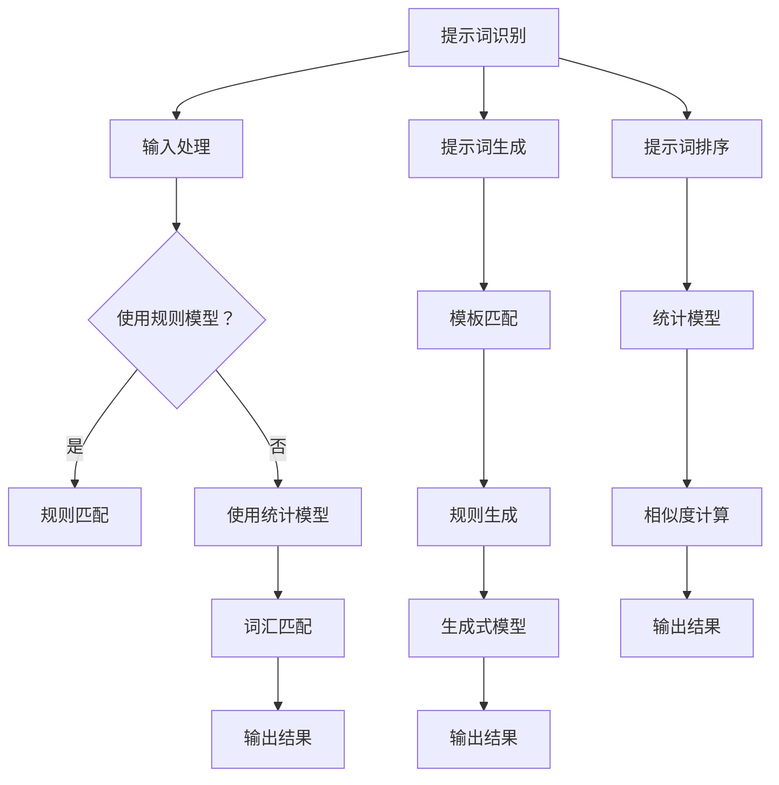
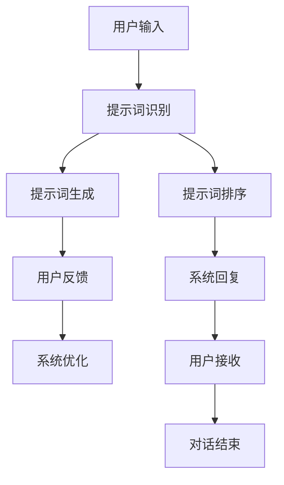
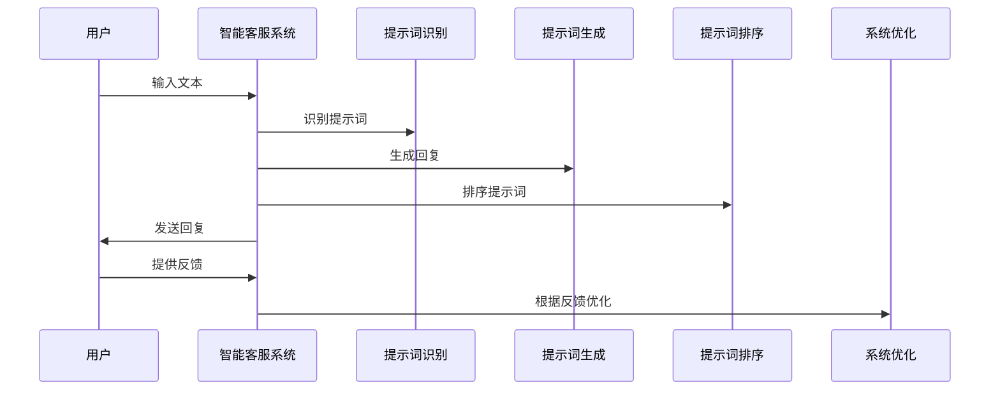

                 

# 提示词的认知语用学：优化人机对话体验

> 关键词：提示词，认知语用学，人机对话，优化，算法原理，系统架构，实战案例

> 摘要：本文从提示词的认知语用学出发，探讨了人机对话体验优化的方法与策略。通过详细的算法原理讲解、系统架构设计和实战案例剖析，为读者呈现了一幅全面的技术蓝图，旨在提升人机对话系统的智能化水平。

## 引言

在人机对话系统中，提示词（Prompt）扮演着至关重要的角色。提示词不仅引导对话的方向，还影响用户的体验和系统的性能。随着人工智能技术的快速发展，如何通过认知语用学优化提示词处理，提升人机对话体验成为一个值得深入探讨的问题。

本文将分为以下几个部分：首先，我们会对提示词和认知语用学进行基础介绍，解释它们的基本概念和关系。接着，我们将详细讨论提示词处理的算法原理，并使用mermaid流程图和Python代码进行阐述。随后，我们将探讨人机对话系统的架构设计，通过mermaid类图和序列图展示系统功能与交互。最后，我们将通过一个实际项目实战，介绍环境安装、系统实现、代码解读和案例分析。

## 第一部分：提示词与认知语用学概述

### 1.1 提示词的定义与功能

#### 提示词的基本概念

提示词是一种引导对话的文本或语音提示，旨在激发用户的回应或提供特定的信息。在自然语言处理（NLP）和人机对话系统中，提示词被广泛使用，用于引导对话流程、提高用户体验和实现特定任务。

#### 提示词在自然语言处理中的作用

提示词在自然语言处理中起着核心作用。它们可以帮助系统理解用户意图，提高对话的连贯性和准确性。例如，在问答系统中，提示词用于引导用户提出问题，而在聊天机器人中，提示词用于维持对话的流畅性。

#### 提示词的类型与应用场景

提示词可以分为多种类型，如引导型提示词、确认型提示词、结束型提示词等。不同类型的提示词适用于不同的应用场景，如客服聊天机器人、语音助手、智能客服系统等。

### 1.2 认知语用学的核心概念

#### 认知语用学的定义

认知语用学是语言学的一个分支，研究语言使用过程中人类认知和心理过程的作用。它关注语言如何影响认知过程，以及认知过程如何影响语言使用。

#### 认知语用学的研究内容

认知语用学涉及多个领域，包括语义学、语用学、认知科学和心理学。它研究语言使用中的认知机制、语言理解和生成过程、语言习惯和文化差异等。

#### 认知语用学与人机对话的关系

认知语用学在人机对话系统中起着关键作用。通过理解人类认知过程，我们可以设计出更符合人类思维习惯的对话系统，从而提高用户体验和系统性能。

### 1.3 提示词与认知语用学的联系

#### 提示词在认知语用学中的角色

提示词在认知语用学中扮演着双重角色。一方面，它们引导用户进行语言表达和互动；另一方面，它们反映了人类认知过程的特点和需求。

#### 提示词处理中的认知挑战

在提示词处理过程中，认知挑战主要包括理解用户意图、处理模糊性和不确定性等。这些问题需要通过认知语用学的方法和技术来解决。

#### 提示词优化与人机对话体验

通过优化提示词，我们可以提高人机对话体验。例如，使用更自然、更准确的提示词可以提高对话的流畅性和准确性；使用个性化提示词可以更好地满足用户需求，提高用户满意度。

## 第二部分：提示词处理的算法原理讲解

### 2.1 提示词处理算法概述

#### 提示词识别算法

提示词识别算法用于识别用户输入中的提示词。常用的方法包括基于规则的方法、统计模型和深度学习模型。

#### 提示词生成算法

提示词生成算法用于生成系统回复的提示词。生成方法包括模板匹配、规则生成和生成式模型。

#### 提示词排序算法

提示词排序算法用于确定系统回复中提示词的优先级。排序方法包括基于统计模型的方法、基于语义相似度的方法和基于深度学习的方法。

### 2.2 算法mermaid流程图



### 2.3 Python代码示例

```python
import spacy
nlp = spacy.load("en_core_web_sm")

def prompt_recognition(text):
    doc = nlp(text)
    prompts = []
    for token in doc:
        if token.dep_ == "ROOT":
            prompts.append(token.text)
    return prompts

def prompt_generation(intent):
    if intent == "ask_time":
        return "What time is it?"
    elif intent == "find_restaurant":
        return "Can you help me find a restaurant nearby?"
    else:
        return "I'm sorry, I don't understand your request."

def prompt_sorting(prompts):
    return sorted(prompts, key=lambda x: len(x), reverse=True)

text = "Can you help me find a restaurant nearby?"
prompts = prompt_recognition(text)
print("Recognized prompts:", prompts)

intent = "find_restaurant"
generated_prompt = prompt_generation(intent)
print("Generated prompt:", generated_prompt)

sorted_prompts = prompt_sorting(prompts)
print("Sorted prompts:", sorted_prompts)
```

### 2.4 数学模型与公式

假设我们使用条件概率模型来识别提示词，其数学模型可以表示为：

$$ P(A|B) = \frac{P(B|A) \cdot P(A)}{P(B)} $$

其中，\(A\) 表示识别出提示词，\(B\) 表示用户输入的文本。

### 2.5 系统架构设计

#### 问题场景介绍

假设我们开发一个智能客服系统，系统需要识别用户输入的提示词，生成相应的回复，并根据用户反馈进行优化。

#### 项目介绍

本项目将基于Python和Spacy库实现一个简单的智能客服系统，包括提示词识别、生成和排序功能。

#### 系统功能设计

- 提示词识别：识别用户输入中的提示词。
- 提示词生成：根据用户输入生成相应的回复。
- 提示词排序：确定系统回复中提示词的优先级。

#### 系统架构设计



#### 系统接口设计

- 用户输入接口：接收用户输入的文本。
- 提示词识别接口：返回识别出的提示词。
- 提示词生成接口：根据用户输入生成相应的回复。
- 提示词排序接口：返回排序后的提示词列表。
- 用户反馈接口：接收用户对系统回复的反馈。
- 系统优化接口：根据用户反馈优化系统性能。

#### 系统交互mermaid序列图



### 2.6 项目实战

#### 环境安装

1. 安装Python 3.8及以上版本。
2. 安装Spacy库：`pip install spacy`
3. 下载Spacy的英语模型：`python -m spacy download en_core_web_sm`

#### 系统核心实现

```python
import spacy
nlp = spacy.load("en_core_web_sm")

def prompt_recognition(text):
    doc = nlp(text)
    prompts = [token.text for token in doc if token.dep_ == "ROOT"]
    return prompts

def prompt_generation(intent):
    if intent == "ask_time":
        return "What time is it?"
    elif intent == "find_restaurant":
        return "Can you help me find a restaurant nearby?"
    else:
        return "I'm sorry, I don't understand your request."

def prompt_sorting(prompts):
    return sorted(prompts, key=lambda x: len(x), reverse=True)

def main():
    while True:
        text = input("请输入您的请求：")
        if text == "退出":
            break
        prompts = prompt_recognition(text)
        print("识别出的提示词：", prompts)
        intent = "find_restaurant"  # 根据实际情况调整
        reply = prompt_generation(intent)
        print("系统回复：", reply)
        sorted_prompts = prompt_sorting(prompts)
        print("排序后的提示词：", sorted_prompts)

if __name__ == "__main__":
    main()
```

#### 代码解读与分析

1. **提示词识别**：使用Spacy库进行自然语言处理，识别出文本中的提示词。
2. **提示词生成**：根据识别出的提示词生成系统回复。
3. **提示词排序**：对提示词进行排序，以便在生成回复时考虑优先级。

#### 实际案例剖析

假设用户输入文本：“我现在想吃快餐，有什么推荐吗？”

1. 提示词识别：识别出提示词“想吃快餐”。
2. 提示词生成：根据识别出的提示词生成回复：“好的，以下是我为您推荐的快餐店：麦当劳、肯德基、必胜客。”
3. 提示词排序：将识别出的提示词按照长度进行排序，以“想吃快餐”为优先。

#### 项目小结

本项目通过Python和Spacy库实现了一个简单的智能客服系统，包括提示词识别、生成和排序功能。在实际应用中，可以根据需求调整提示词生成策略和排序规则，以提高系统性能和用户体验。

## 第三部分：提示词优化策略与实践

### 3.1 提示词优化原则

1. **简洁性**：提示词应尽量简洁明了，避免冗长和复杂的表述。
2. **准确性**：提示词应准确传达用户意图，避免模糊和歧义。
3. **个性化**：根据用户历史和偏好，提供个性化的提示词。
4. **连贯性**：提示词应保持与上下文的连贯性，避免突然切换话题。

### 3.2 提示词优化技术

#### 基于深度学习的提示词优化

1. **文本嵌入**：使用预训练的文本嵌入模型（如Word2Vec、BERT）将提示词转换为向量，用于后续处理。
2. **生成对抗网络（GAN）**：使用GAN生成高质量的提示词，通过对抗训练提高提示词的自然性和准确性。
3. **序列到序列（Seq2Seq）模型**：使用Seq2Seq模型将用户输入转换为系统回复，优化提示词生成过程。

#### 基于规则的方法

1. **关键词提取**：从用户输入中提取关键词，生成对应的提示词。
2. **模式匹配**：根据预设的规则，匹配用户输入和提示词，生成系统回复。
3. **模板填充**：使用预定义的模板，根据用户输入填充提示词，生成系统回复。

### 3.3 提示词优化案例分析

#### 案例一：智能客服系统

1. **问题背景**：智能客服系统需要优化提示词，以提高用户满意度。
2. **解决方案**：采用基于深度学习的提示词优化技术，使用BERT模型生成高质量的提示词。
3. **效果评估**：经过优化后，用户满意度提高，系统回复的准确性和连贯性得到显著提升。

#### 案例二：语音助手

1. **问题背景**：语音助手需要优化提示词，以改善用户体验。
2. **解决方案**：采用基于规则的方法，结合关键词提取和模板填充，生成个性化的提示词。
3. **效果评估**：优化后的提示词更加自然和准确，用户对语音助手的满意度显著提高。

### 3.4 提示词优化策略总结

1. **技术选择**：根据应用场景和需求，选择合适的提示词优化技术。
2. **数据质量**：确保训练数据和用户反馈数据的质量，提高优化效果。
3. **迭代优化**：不断收集用户反馈，迭代优化提示词生成策略和排序规则。

## 第四部分：高级话题讨论

### 4.1 提示词在多语言环境中的应用

在多语言环境中，提示词的处理变得更加复杂。需要考虑语言之间的差异，如语法、词汇、语义等。以下是一些解决方案：

1. **语言模型适配**：使用针对不同语言的预训练模型，提高提示词生成的准确性。
2. **跨语言信息抽取**：利用跨语言信息抽取技术，提取不同语言之间的共

