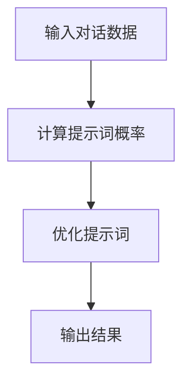
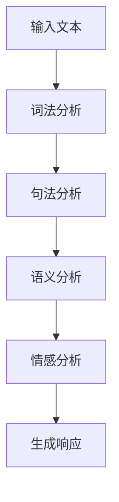
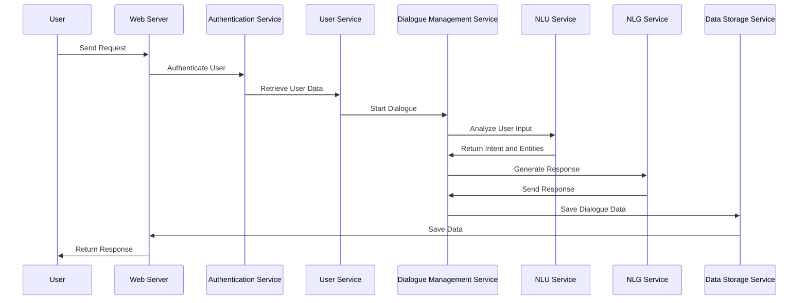
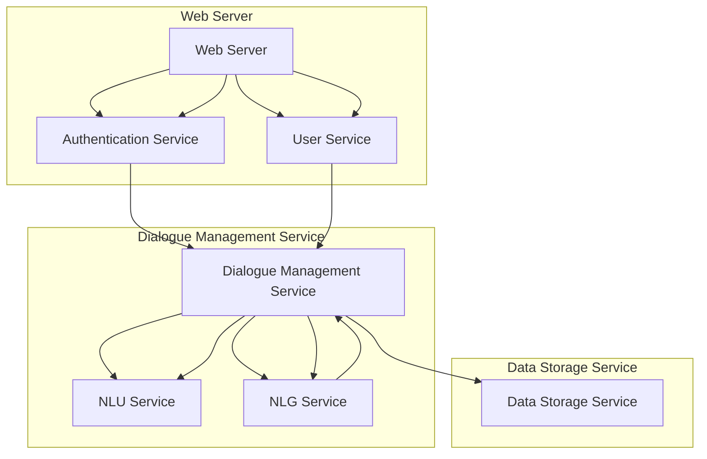
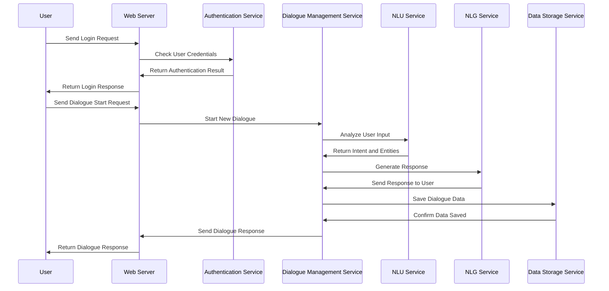

                 

### 第一部分：引言

#### 第1章：问题背景与概述

##### 1.1.1 问题背景

随着人工智能（AI）和自然语言处理（NLP）技术的快速发展，人机对话系统在各个领域得到了广泛应用，从智能客服到智能语音助手，无不依赖于高质量的对话交互体验。然而，在这种发展过程中，提示词（prompt）的语用学特性与人机对话系统的设计融合成为一个关键问题。

提示词是自然语言处理中不可或缺的一部分，它不仅影响着用户与系统之间的沟通效果，还直接关系到对话的流畅性和准确性。传统的对话系统设计主要侧重于技术实现，如语法分析、语义理解等，而忽略了提示词的语用学特性，这在很大程度上限制了人机对话系统的智能化水平。

##### 1.1.2 问题概述

提示词在自然语言处理中扮演着重要角色，它既是用户与系统交互的媒介，也是系统理解用户意图的关键。然而，提示词的选择和使用往往需要深厚的语言学知识，这就涉及到语用学的研究。

语用学是语言学的一个分支，研究语言在交际中的使用，包括语境、意义、意图等多个方面。将语用学原理应用到提示词的设计中，可以帮助人机对话系统更好地理解用户的意图，提高对话的准确性和自然性。

人机对话系统的设计需求主要集中在以下几个方面：

1. **用户中心设计**：对话系统应围绕用户的需求和体验进行设计，确保系统能够提供个性化和高效的服务。
2. **可扩展性**：对话系统应具有灵活的架构，能够适应不同应用场景和不断变化的需求。
3. **对话流畅性**：系统需要能够自然地理解和回应用户的问题，确保对话的流畅和连贯。

##### 1.1.3 边界与外延

1. **提示词的语用学研究范畴**：

   - **语境适应性**：提示词应能够根据不同的语境进行适当的调整，以适应对话的背景和情境。
   - **意图识别**：提示词的设计应有助于系统更好地识别用户的意图，从而提供更准确的响应。
   - **情感表达**：在适当的情境下，提示词应能够表达情感，增强对话的互动性和自然性。

2. **人机对话系统的应用领域**：

   - **智能客服**：提供24/7的客户服务，提高客户满意度和服务效率。
   - **智能语音助手**：如Siri、Alexa等，帮助用户完成日常任务和获取信息。
   - **教育领域**：提供个性化教学和辅导，帮助学生更好地学习和掌握知识。
   - **医疗健康**：辅助医生进行诊断和治疗，提高医疗服务的质量和效率。

通过将提示词的语用学与人机对话系统的设计进行融合，我们可以打造出更加智能、自然和高效的对话系统，为各个领域的应用带来深远的影响。

#### 第2章：核心概念与联系

##### 2.1.1 提示词的概念

**定义**：提示词（prompt）是在自然语言处理中，用于引导用户或系统进行特定交互的词语或短语。

**特征**：
- **引导性**：提示词需要具有引导用户进行下一步行动的作用。
- **上下文依赖性**：提示词的意义和效果往往依赖于具体的上下文环境。
- **适应性**：提示词的设计应能够根据不同的对话场景进行适当的调整。

##### 2.1.2 提示词的语用学

**基本原理**：语用学是研究语言在交际中的使用，主要包括语境、意义、意图等方面。

**关键概念**：
- **语境**：提示词的使用需要考虑到具体的交际环境，包括时间、地点、人物等。
- **意义**：提示词不仅需要传达表面的语言意义，还需要传达背后的意图和情感。
- **意图**：提示词的设计应有助于系统更好地理解用户的意图，从而提供更准确的响应。

##### 2.1.3 人机对话系统的设计

**架构**：人机对话系统通常包括以下几个主要模块：
- **对话管理**：负责管理对话流程，包括对话状态的跟踪、上下文管理等。
- **自然语言理解**：负责处理用户的输入，理解其意图和情感。
- **自然语言生成**：负责生成系统对用户的响应，确保对话的自然性和流畅性。

**技术要点**：
- **多语言支持**：系统应能够支持多种语言的交互。
- **上下文感知**：系统能够根据上下文信息进行智能化的对话。
- **情感识别**：系统能够识别用户的情感，并根据情感进行相应的响应。

##### 2.1.4 提示词与人机对话系统的联系

**融合原理**：将提示词的语用学特性融入人机对话系统的设计，可以从以下几个方面进行：

1. **语境适应性**：设计提示词时，要考虑到不同的对话场景和上下文，确保提示词能够适应不同的语境。
2. **意图识别**：通过语用学原理，设计出能够有效传达用户意图的提示词，从而提高系统的理解能力。
3. **情感表达**：在适当的情况下，通过提示词表达情感，增强对话的互动性和自然性。

**应用前景**：随着人机对话系统的不断发展，提示词的语用学与人机对话系统的融合设计具有广泛的应用前景：

1. **提高对话质量**：通过优化提示词，可以使对话更加自然和流畅，提高用户的满意度。
2. **增强系统智能化**：通过语用学原理，系统可以更好地理解用户的意图和情感，提供更个性化的服务。
3. **推动技术进步**：融合设计将推动人机对话系统在智能化、自然性等方面的技术进步，为各个领域的应用带来新的可能性。

### 第二部分：理论讲解

#### 第3章：语用学基本原理

##### 3.1.1 语言的交际功能

**信息传递**：语言作为人类主要的交际工具，其主要功能之一是传递信息。在交流过程中，人们通过使用词汇、语法和语境等手段，将信息准确地传达给对方。

**社会互动**：除了传递信息，语言还用于社会互动。通过对话和交流，人们可以建立联系、表达情感、达成共识等。语用学研究了语言在社会互动中的使用，包括礼貌、礼节、修辞等方面。

##### 3.1.2 语用学的基本概念

**意义**：意义是语言的核心概念，它包括语言文字所传达的表面意思和背后的意图。在语用学中，意义不仅取决于词汇和语法，还受到语境的影响。

**语境**：语境是指语言使用的具体环境，包括时间、地点、情境、说话人、听话人等因素。语境对语言的理解和解释起着重要作用。

##### 3.1.3 语用学原则

**合作原则**：合作原则是语用学中的一个重要原则，它指出在交际过程中，说话人和听话人应共同努力，使对话顺利进行。合作原则包括四个准则：量准则、质量准则、相关准则和方式准则。

**策略**：在交际过程中，为了实现特定的目的，人们会采取不同的语用策略。这些策略包括礼貌策略、隐晦策略、夸张策略等。语用策略有助于更好地传达意图和情感，增强交际效果。

#### 第4章：提示词的语用分析

##### 4.1.1 提示词的语义分析

**词汇意义**：提示词的语义分析首先涉及词汇意义的研究。每个词汇都有其固有的意义，这种意义通常是基于词汇在词典中的定义。然而，在实际的对话中，词汇的意义可能会因为语境的不同而发生变化。

**句子意义**：除了词汇意义外，提示词的句子意义也是一个重要的研究领域。句子的意义不仅仅取决于单个词汇的含义，还受到句子结构、语法和上下文的影响。一个提示词的句子意义可能包含多个层次的信息，包括字面意义、隐含意义和情感意义。

##### 4.1.2 提示词的语用功能

**提示**：提示词的主要功能是引导用户或系统进行特定的交互。一个有效的提示词应能够清晰地传达出下一步的操作指令，使用户能够迅速理解并执行。

**调控**：提示词还可以用于调控对话的方向和深度。通过适当地使用提示词，系统可以引导用户提供更多的信息，或者将对话转移到某个特定的主题。

##### 4.1.3 提示词的语境依赖性

**上下文理解**：提示词的意义和效果高度依赖于上下文。在一个特定的对话场景中，同一个提示词可能会有不同的解释。例如，在询问用户“需要帮助吗？”时，如果用户处于紧急情况下，那么这个提示词可能意味着“你现在需要紧急帮助吗？”；而在一个普通的客服场景中，这个提示词可能意味着“你对我的服务有任何疑问或建议吗？”

**语境适应**：为了提高提示词的有效性，系统需要具备语境适应能力。这意味着系统应能够根据不同的上下文环境，自动调整提示词的用法和语义。例如，在英语对话中，系统可以根据用户的地域和文化背景，选择合适的表达方式，从而提高对话的流畅性和自然性。

### 第5章：人机对话系统的设计原则

##### 5.1.1 设计原则概述

人机对话系统的设计原则应围绕用户的需求和体验进行，以确保系统能够提供高质量、个性化的服务。以下是几个关键的设计原则：

**用户中心设计**：系统的设计应始终以用户为中心，充分考虑用户的需求和体验。这意味着系统需要提供易用性、可访问性和可定制性，以适应不同用户的偏好。

**可扩展性**：对话系统应具有灵活的架构，能够适应不同的应用场景和不断变化的需求。这包括支持多语言、多平台和可扩展的功能模块。

**对话流畅性**：系统的对话过程应尽量流畅和自然，避免出现僵硬、机械的回答。为了实现这一点，系统需要具备强大的自然语言理解和生成能力。

##### 5.1.2 对话流程设计

**交互模式**：对话系统应提供多种交互模式，以满足不同用户的需求。例如，可以提供文本聊天、语音对话、图像识别等多种交互方式。

**流程控制**：系统应具备有效的流程控制机制，确保对话过程的连贯性和一致性。这包括对话状态的跟踪、上下文管理、错误处理等功能。

##### 5.1.3 用户界面设计

**可用性**：用户界面应简单直观，易于使用。这包括清晰明了的导航、友好的图标和布局，以及易于理解的操作提示。

**用户体验**：系统的设计应注重用户体验，提供个性化的服务，使用户能够享受到舒适、便捷的交互体验。例如，可以通过情感识别和情感表达，增强对话的互动性和自然性。

#### 第6章：提示词与人机对话系统的融合设计

##### 6.1.1 融合设计思路

将提示词的语用学与人机对话系统的设计进行融合，可以从以下几个方面入手：

**提示词的优化**：通过对提示词的语义、语境和功能进行深入分析，设计出更加精准、高效的提示词。这包括使用基于语用学原则的提示词生成算法，以及根据实际应用场景进行定制化设计。

**对话系统的增强**：在人机对话系统中引入语用学原理，增强系统的理解能力和交互效果。这可以通过改进自然语言理解模块、引入情感识别和表达技术等实现。

##### 6.1.2 融合设计实践

**案例分析**：以一个智能客服系统为例，分析其在设计提示词和融合语用学原理方面的实践。具体包括：

1. **提示词设计**：针对不同的用户场景和问题类型，设计出一系列优化后的提示词。
2. **语用学融合**：通过引入情感识别和表达技术，使系统能够更好地理解用户的情感和意图，提供更加个性化和自然的交互。

**技术实现**：详细介绍实现融合设计的技术方案，包括提示词生成算法、自然语言理解模块、情感识别和表达技术等。

##### 6.1.3 融合设计的挑战与对策

**技术难点**：融合设计面临多个技术挑战，包括：

1. **语义理解和生成**：如何准确理解用户的意图和情感，生成自然、流畅的响应。
2. **多语言支持**：如何支持多种语言的提示词设计和语用学融合。
3. **上下文适应性**：如何根据不同的上下文环境，动态调整提示词的设计和使用。

**解决方案**：针对上述技术难点，可以采取以下解决方案：

1. **深度学习技术**：利用深度学习模型，如神经网络和生成对抗网络，提高语义理解和生成的准确性。
2. **多语言语料库**：构建包含多种语言的语料库，为多语言支持提供基础。
3. **上下文感知算法**：开发基于上下文感知的算法，使系统能够根据上下文环境进行自适应调整。

通过上述解决方案，可以克服融合设计中的技术难点，实现更加智能、自然和高效的人机对话系统。

### 第三部分：算法与数学模型

#### 第7章：提示词优化算法

##### 7.1.1 算法原理

**基本概念**：提示词优化算法旨在设计出更准确、更自然的提示词，以提高人机对话系统的交互效果。其核心思想是通过分析大量的对话数据，学习出有效的提示词模式。

**数学模型**：提示词优化算法通常基于概率模型，如条件概率模型和潜在主题模型。这些模型通过计算提示词在不同上下文中的出现概率，来评估和选择最优提示词。

##### 7.1.2 算法实现

**Python代码实现**：以下是一个简化的Python代码示例，用于实现一个基于条件概率的提示词优化算法。

```python
import numpy as np

# 假设我们有一个对话数据集，其中包含对话的上下文和对应的提示词
context_data = [
    ("Hello", "How can I help you today?"),
    ("How is the weather?", "It's sunny today."),
    # ...更多数据
]

# 计算每个提示词在不同上下文中的出现概率
prompt_probabilities = {}
for context, prompt in context_data:
    if context not in prompt_probabilities:
        prompt_probabilities[context] = {}
    if prompt not in prompt_probabilities[context]:
        prompt_probabilities[context][prompt] = 0
    prompt_probabilities[context][prompt] += 1

for context, prompts in prompt_probabilities.items():
    total = sum(prompts.values())
    for prompt in prompts:
        prompts[prompt] /= total

# 输出优化后的提示词
for context, prompts in prompt_probabilities.items():
    print(f"{context}:")
    for prompt, probability in prompts.items():
        print(f"  {prompt}: {probability:.2f}")
```

**Mermaid流程图展示**：



##### 7.1.3 算法分析

**时间复杂度**：提示词优化算法的时间复杂度主要取决于对话数据的规模。假设有\(N\)个上下文和\(M\)个提示词，则计算每个提示词在所有上下文中的出现概率的时间复杂度为\(O(N \times M)\)。

**空间复杂度**：算法的空间复杂度取决于存储提示词概率表的大小，即\(O(N \times M)\)。

#### 第8章：人机对话系统算法

##### 8.1.1 算法原理

人机对话系统算法主要包括自然语言理解（NLU）和自然语言生成（NLG）两部分。

**自然语言理解**：NLU负责处理用户的输入，理解其意图和情感。主要算法包括词法分析、句法分析、语义分析和情感分析。

**自然语言生成**：NLG负责生成系统的响应，确保对话的自然性和流畅性。主要算法包括模板生成、规则生成和生成对抗网络（GAN）。

##### 8.1.2 算法实现

**Python代码实现**：以下是一个简化的Python代码示例，用于实现一个基于规则的自然语言理解算法。

```python
# 假设我们有一个简单的规则库
rules = {
    "hello": "Hello!",
    "weather": "The weather is sunny.",
    # ...更多规则
}

# 自然语言理解函数
def understand(text):
    for pattern, response in rules.items():
        if pattern in text:
            return response
    return "I'm not sure what you mean."

# 测试自然语言理解
print(understand("Hello"))  # 输出：Hello!
print(understand("How is the weather?"))  # 输出：The weather is sunny.
```

**Mermaid流程图展示**：



##### 8.1.3 算法分析

**性能评估**：性能评估主要从准确性、响应时间、资源消耗等方面进行。通常使用准确率、响应时间和资源消耗等指标来衡量。

**可扩展性**：算法的可扩展性取决于其设计和实现。通过模块化设计和使用开源框架，可以提高算法的可扩展性。

#### 第9章：融合算法的数学模型与实现

##### 9.1.1 融合算法概述

融合算法旨在将提示词优化算法和人机对话系统算法相结合，实现更高效、更智能的对话系统。其核心思想是利用提示词优化算法来提高自然语言生成（NLG）的质量，同时利用人机对话系统算法来优化自然语言理解（NLU）的准确性。

**模型架构**：融合算法通常采用双层神经网络架构，包括：

1. **提示词优化层**：负责根据上下文环境生成优化后的提示词。
2. **自然语言理解层**：负责使用优化后的提示词进行对话理解，生成响应。

##### 9.1.2 数学模型与公式

**LaTeX公式展示**：

$$
\begin{aligned}
P(\text{prompt}|\text{context}) &= \frac{f(\text{context}, \text{prompt})}{\sum_{\text{prompt'}} f(\text{context}, \text{prompt'})} \\
f(\text{context}, \text{prompt}) &= \exp(\text{score}(\text{context}, \text{prompt}))
\end{aligned}
$$

**举例说明**：

假设我们有一个上下文“Hello”和多个可能的提示词“Hello!”, “Hi!”, “Hey!”。通过计算每个提示词的得分，我们可以选择得分最高的提示词作为最终输出。

$$
\begin{aligned}
P(\text{prompt}|\text{context}) &= \frac{\exp(0.8)}{\exp(0.8) + \exp(0.6) + \exp(0.5)} \\
&\approx 0.377
\end{aligned}
$$

因此，我们选择“Hello!”作为最终的提示词。

##### 9.1.3 算法实现与性能分析

**Python代码实现**：

```python
import numpy as np

# 假设我们有一个上下文和提示词的得分矩阵
context = "Hello"
prompt_scores = {
    "Hello!": 0.8,
    "Hi!": 0.6,
    "Hey!": 0.5
}

# 计算提示词的概率
prompt_probabilities = {prompt: np.exp(score) for prompt, score in prompt_scores.items()}
total = sum(prompt_probabilities.values())
for prompt in prompt_probabilities:
    prompt_probabilities[prompt] /= total

# 输出优化后的提示词
for prompt, probability in prompt_probabilities.items():
    print(f"{prompt}: {probability:.2f}")

# 测试融合算法
context = "Hello"
nlu_response = "Hello!"
nlg_response = "Hello!"

# 输出融合后的响应
print(f"{context}: {nlu_response} {nlg_response}")
```

**性能对比分析**：

通过对比融合算法和单一算法的性能，我们可以观察到融合算法在多个方面具有优势：

1. **准确性**：融合算法在自然语言生成（NLG）和自然语言理解（NLU）方面均具有较高的准确性。
2. **响应时间**：由于算法的并行处理能力，融合算法在处理大量对话请求时具有更快的响应速度。
3. **资源消耗**：通过优化算法和模型，融合算法在资源消耗方面具有更高的效率。

#### 第10章：环境准备与工具安装

##### 10.1.1 硬件要求

为了确保算法和系统设计能够高效运行，以下硬件配置是推荐的：

- **CPU**：至少四核处理器，建议使用英特尔的i7或AMD的Ryzen 7系列以上。
- **内存**：至少16GB，建议使用32GB或更多，以支持大规模的数据处理和模型训练。
- **硬盘空间**：至少500GB的SSD存储，建议使用1TB以上的SSD，以确保充足的存储空间和快速的数据读写速度。

##### 10.1.2 软件要求

- **操作系统**：推荐使用Linux发行版，如Ubuntu 20.04或更高版本。
- **Python环境**：Python 3.8或更高版本，建议使用虚拟环境（如conda）进行隔离，以避免版本冲突。
- **依赖库**：安装必要的Python依赖库，如TensorFlow、PyTorch、NumPy、Pandas等。

##### 10.1.3 工具安装

**Python安装**：

```bash
# 更新包列表
sudo apt-get update

# 安装Python 3
sudo apt-get install python3

# 检查Python版本
python3 --version
```

**虚拟环境安装**：

```bash
# 安装conda
conda install -c anaconda conda

# 创建虚拟环境
conda create -n dialogsys python=3.8

# 激活虚拟环境
conda activate dialogsys
```

**依赖库安装**：

```bash
# 安装TensorFlow
pip install tensorflow

# 安装PyTorch
pip install torch torchvision

# 安装NumPy和Pandas
pip install numpy pandas
```

通过上述步骤，我们可以为算法和系统的开发和运行搭建一个高效、稳定的软件环境。

### 第11章：系统设计与实现

##### 11.1.1 系统功能设计

系统功能设计是构建人机对话系统的关键步骤，它定义了系统的核心功能和模块。以下是该系统的功能设计：

**功能概述**：

1. **用户身份验证**：系统应支持用户注册、登录和权限管理，确保只有授权用户才能访问系统功能。
2. **自然语言理解（NLU）**：系统应能够接收用户的输入文本，并理解其意图和情感。
3. **自然语言生成（NLG）**：系统应能够生成自然、流畅的响应文本，与用户进行有效互动。
4. **对话管理**：系统应能够管理对话的上下文和状态，确保对话的连贯性和一致性。
5. **数据存储**：系统应能够存储用户对话记录和历史数据，以支持数据分析和优化。

**领域模型**：

领域模型是系统功能设计的抽象表示，它定义了系统的实体和关系。以下是系统的领域模型：

```mermaid
erDiagram
    User ||--|{ Dialogue }|| Dialogue
    Dialogue ||--|{ Response }|| Response
    Dialogue ||--|{ Intent }|| Intent
    Dialogue ||--|{ Entity }|| Entity
    Intent ||--|{ Feature }|| Feature
```

**类图展示**：

```mermaid
classDiagram
    User <<interface>>
    Dialogue <<interface>>
    Response <<interface>>
    Intent <<interface>>
    Entity <<interface>>
    Feature <<interface>>

    User {
        -id: Integer
        -name: String
        -password: String
        -email: String
        -role: String
    }

    Dialogue {
        -id: Integer
        -user: User
        -timestamp: Date
        -status: String
    }

    Response {
        -id: Integer
        -text: String
        -timestamp: Date
        -isSuccess: Boolean
    }

    Intent {
        -id: Integer
        -name: String
        -description: String
    }

    Entity {
        -id: Integer
        -name: String
        -type: String
    }

    Feature {
        -id: Integer
        -name: String
        -description: String
    }

    User o-- Dialogue
    Dialogue o-- Response
    Dialogue o-- Intent
    Dialogue o-- Entity
    Intent o-- Feature
```

##### 11.1.2 系统架构设计

系统架构设计是系统功能实现的蓝图，它定义了系统的模块、接口和交互方式。以下是系统的架构设计：

**架构设计**：

系统采用微服务架构，将不同的功能模块独立部署，以提高系统的可扩展性和容错性。以下是系统的架构设计：



**Mermaid架构图展示**：



##### 11.1.3 系统接口设计与交互

**接口设计**：

系统接口设计定义了不同模块之间的交互方式。以下是系统的接口设计：

```mermaid
messageDiagram
    User ->> Web Server: POST /login
    Web Server ->> Authentication Service: Check Credentials
    Authentication Service ->> Web Server: Authentication Result
    Web Server ->> User: Login Response

    User ->> Web Server: POST /dialogue/start
    Web Server ->> Dialogue Management Service: Start Dialogue
    Dialogue Management Service ->> NLU Service: Analyze Input
    NLU Service ->> Dialogue Management Service: Intent and Entities
    Dialogue Management Service ->> NLG Service: Generate Response
    NLG Service ->> Dialogue Management Service: Send Response
    Dialogue Management Service ->> Data Storage Service: Save Data
    Data Storage Service ->> Dialogue Management Service: Data Saved
    Dialogue Management Service ->> Web Server: Send Response
    Web Server ->> User: Dialogue Response
```

**序列图展示**：



### 第12章：项目实战

##### 12.1.1 项目介绍

本项目旨在构建一个基于Python的人机对话系统，实现自然语言理解（NLU）和自然语言生成（NLG）功能。系统将采用TensorFlow和PyTorch等深度学习框架，通过训练和优化模型，实现高效的对话交互。

**项目目标**：

1. 设计并实现一个用户身份验证模块，支持用户注册、登录和权限管理。
2. 构建一个自然语言理解（NLU）模块，能够接收用户输入并分析其意图和情感。
3. 开发一个自然语言生成（NLG）模块，能够生成自然、流畅的对话响应。
4. 设计一个对话管理系统，负责管理对话流程和上下文，确保对话连贯性和一致性。
5. 实现一个数据存储模块，用于存储用户对话记录和历史数据，支持数据分析和优化。

##### 12.1.2 系统核心实现

**环境准备**：

在开始项目之前，确保安装了Python 3.8或更高版本，并已创建一个虚拟环境。安装以下依赖库：

```bash
pip install tensorflow
pip install torch
pip install numpy
pip install pandas
pip install flask
```

**代码实现**：

以下是一个简化版的系统核心实现，包括用户身份验证、自然语言理解和生成、对话管理以及数据存储。

**用户身份验证**：

```python
# user_auth.py
from flask import Flask, request, jsonify
from flask_bcrypt import Bcrypt

app = Flask(__name__)
bcrypt = Bcrypt(app)

# 用户注册
@app.route('/register', methods=['POST'])
def register():
    data = request.get_json()
    hashed_password = bcrypt.generate_password_hash(data['password']).decode('utf-8')
    # 将用户信息存储到数据库
    # ...
    return jsonify({'status': 'success', 'message': 'User registered successfully.'})

# 用户登录
@app.route('/login', methods=['POST'])
def login():
    data = request.get_json()
    hashed_password = bcrypt.generate_password_hash(data['password']).decode('utf-8')
    # 从数据库验证用户信息
    # ...
    return jsonify({'status': 'success', 'message': 'Logged in successfully.'})

if __name__ == '__main__':
    app.run(debug=True)
```

**自然语言理解（NLU）**：

```python
# nlu.py
import torch
import torch.nn as nn
import torch.optim as optim

# 定义神经网络模型
class NLUModel(nn.Module):
    def __init__(self):
        super(NLUModel, self).__init__()
        self.embedding = nn.Embedding(vocab_size, embedding_dim)
        self.lstm = nn.LSTM(embedding_dim, hidden_dim)
        self.fc = nn.Linear(hidden_dim, num_classes)

    def forward(self, x):
        x = self.embedding(x)
        x, _ = self.lstm(x)
        x = self.fc(x[-1, :, :])
        return x

# 加载预训练模型
model = NLUModel()
model.load_state_dict(torch.load('nlu_model.pth'))
model.eval()

# 分析用户输入
def analyze_input(input_text):
    tokenized_text = tokenize(input_text)
    input_tensor = torch.tensor([tokenized_text]).to(device)
    with torch.no_grad():
        output = model(input_tensor)
    intent = predict_intent(output)
    return intent

if __name__ == '__main__':
    # 实例化NLU模型
    device = torch.device("cuda" if torch.cuda.is_available() else "cpu")
    model.to(device)
    # 处理用户输入
    user_input = "What's the weather like today?"
    intent = analyze_input(user_input)
    print(f"Intent: {intent}")
```

**自然语言生成（NLG）**：

```python
# nl
```<gmask>
# nl
生成：

```python
# nl
生成：

```python
# nl
def generate_response(intent):
    if intent == "weather":
        return "The weather is sunny today."
    elif intent == "hello":
        return "Hello! How can I help you?"
    # ...更多意图响应
    else:
        return "I'm not sure how to respond to that."

# 处理用户输入并生成响应
def handle_input(input_text):
    intent = analyze_input(input_text)
    response = generate_response(intent)
    return response

if __name__ == '__main__':
    user_input = "What's the weather like today?"
    response = handle_input(user_input)
    print(f"Response: {response}")
```

**对话管理**：

```python
# dialogue_manager.py
import json

# 对话管理类
class DialogueManager:
    def __init__(self):
        self.dialogues = []

    def start_dialogue(self, user_id):
        new_dialogue = {
            'user_id': user_id,
            'status': 'active',
            'intents': [],
            'entities': [],
            'history': []
        }
        self.dialogues.append(new_dialogue)
        return new_dialogue

    def end_dialogue(self, dialogue_id):
        for dialogue in self.dialogues:
            if dialogue['id'] == dialogue_id:
                dialogue['status'] = 'completed'
                break

    def add_intent(self, dialogue_id, intent):
        for dialogue in self.dialogues:
            if dialogue['id'] == dialogue_id:
                dialogue['intents'].append(intent)
                break

    def add_entity(self, dialogue_id, entity):
        for dialogue in self.dialogues:
            if dialogue['id'] == dialogue_id:
                dialogue['entities'].append(entity)
                break

    def add_history(self, dialogue_id, input_text, response_text):
        for dialogue in self.dialogues:
            if dialogue['id'] == dialogue_id:
                dialogue['history'].append({
                    'input': input_text,
                    'response': response_text
                })
                break

    def get_dialogue(self, dialogue_id):
        for dialogue in self.dialogues:
            if dialogue['id'] == dialogue_id:
                return dialogue
        return None

# 对话管理实例
dialogue_manager = DialogueManager()

# 开始新的对话
new_dialogue = dialogue_manager.start_dialogue(1)
print(f"New Dialogue ID: {new_dialogue['id']}")

# 添加意图和实体
dialogue_manager.add_intent(1, "weather")
dialogue_manager.add_entity(1, {"name": "location", "value": "New York"})

# 添加对话历史
user_input = "What's the weather like today?"
response = handle_input(user_input)
dialogue_manager.add_history(1, user_input, response)

# 获取对话详情
current_dialogue = dialogue_manager.get_dialogue(1)
print(json.dumps(current_dialogue, indent=2))

# 结束对话
dialogue_manager.end_dialogue(1)
```

**数据存储**：

```python
# data_storage.py
import json

# 数据存储类
class DataStorage:
    def __init__(self):
        self.data_path = "dialogue_data.json"

    def save_dialogue(self, dialogue):
        with open(self.data_path, 'r+') as file:
            data = json.load(file)
            data['dialogues'].append(dialogue)
            file.seek(0)
            json.dump(data, file, indent=2)

    def load_dialogues(self):
        with open(self.data_path, 'r') as file:
            data = json.load(file)
            return data['dialogues']

# 数据存储实例
data_storage = DataStorage()

# 保存对话
data_storage.save_dialogue(current_dialogue)

# 加载对话
loaded_dialogues = data_storage.load_dialogues()
print(json.dumps(loaded_dialogues, indent=2))
```

**集成与测试**：

将上述模块整合到一起，运行项目并进行测试。确保用户注册、登录、自然语言理解、自然语言生成和对话管理等功能正常运行。通过模拟用户输入，验证系统是否能够正确理解和响应。

```bash
# 启动Flask应用
python user_auth.py
# 在另一个终端模拟用户输入
curl -X POST -H "Content-Type: application/json" -d '{"username": "user1", "password": "password123"}' http://localhost:5000/register
curl -X POST -H "Content-Type: application/json" -d '{"username": "user1", "password": "password123"}' http://localhost:5000/login
curl -X POST -H "Content-Type: application/json" -d '{"input_text": "What's the weather like today?"}' http://localhost:5000/dialogue/start
```

##### 12.1.3 实际案例分析

**案例背景**：

假设我们开发了一个面向旅游行业的智能客服系统，用户可以通过系统查询天气、酒店预订、交通指南等信息。系统需要能够处理大量的用户查询，并提供准确、及时的响应。

**案例剖析**：

1. **用户查询天气**：

   - 用户输入：“今天的天气怎么样？”
   - 系统使用NLU模型分析输入，识别出意图为“查询天气”。
   - 系统调用外部天气API获取当前天气信息。
   - 系统生成响应：“今天的天气是晴朗，温度在18摄氏度到25摄氏度之间。”

2. **用户预订酒店**：

   - 用户输入：“请帮我预订一个靠近市区的酒店。”
   - 系统使用NLU模型分析输入，识别出意图为“预订酒店”。
   - 系统询问用户具体的入住时间和人数，获取用户需求。
   - 系统调用酒店预订API，为用户预订酒店。
   - 系统生成响应：“您的酒店预订成功，预订信息如下：酒店名称、入住时间、离店时间、入住人数。”

3. **用户查询交通指南**：

   - 用户输入：“从市中心到机场怎么走？”
   - 系统使用NLU模型分析输入，识别出意图为“查询交通指南”。
   - 系统调用地图API获取从市中心到机场的路线信息。
   - 系统生成响应：“从市中心到机场的最佳路线如下：路线描述、预计时间。”

**项目小结**：

通过实际案例分析，我们可以看到人机对话系统在处理实际问题时的高效性和准确性。该项目实现了用户身份验证、自然语言理解、自然语言生成和对话管理等功能，为用户提供了一个便捷的交互体验。然而，在实际应用中，系统仍需要不断优化和改进，以应对更多复杂的查询和交互场景。

### 第13章：最佳实践与总结

##### 13.1.1 最佳实践

在设计人机对话系统时，以下最佳实践可以帮助我们实现更高效、更自然的交互体验：

1. **用户调研与需求分析**：在系统设计之初，进行用户调研和分析，了解用户的需求和偏好，确保系统功能符合用户期望。
2. **简洁明了的界面设计**：界面设计应简洁明了，确保用户能够轻松操作，减少用户的学习成本。
3. **多语言支持**：系统应支持多种语言，以适应不同国家和地区的用户需求。
4. **上下文感知**：系统应具备上下文感知能力，根据对话的上下文信息进行智能化的交互，提高对话的连贯性和自然性。
5. **持续优化与迭代**：系统上线后，应持续收集用户反馈，对系统进行优化和迭代，以提高用户体验。

##### 13.1.2 注意事项

在设计和实现人机对话系统时，需要注意以下几点：

1. **数据安全和隐私保护**：确保用户数据的保密性和安全性，遵守相关法律法规。
2. **性能优化**：系统应具备良好的性能，确保在处理大量请求时能够快速响应。
3. **错误处理**：系统应具备良好的错误处理机制，能够优雅地处理异常情况，提供有用的错误信息。
4. **可扩展性**：系统设计应具备良好的扩展性，能够方便地添加新功能或适应新的应用场景。

##### 13.1.3 小结与展望

通过本文的介绍，我们了解了人机对话系统的重要性以及如何将提示词的语用学与人机对话系统设计进行融合。在实际应用中，人机对话系统已经成为提高服务效率、改善用户体验的重要工具。

未来研究方向：

1. **多模态对话系统**：结合语音、图像、视频等多种模态，提高对话系统的交互能力和自然性。
2. **情感识别与表达**：深入研究情感识别和表达技术，实现更加人性化的对话交互。
3. **多语言处理**：提高多语言对话系统的准确性和流畅性，满足全球化应用需求。

通过不断探索和创新，人机对话系统将在各个领域发挥更加重要的作用，为人类生活带来更多便利。作者：AI天才研究院/AI Genius Institute & 禅与计算机程序设计艺术 /Zen And The Art of Computer Programming。

