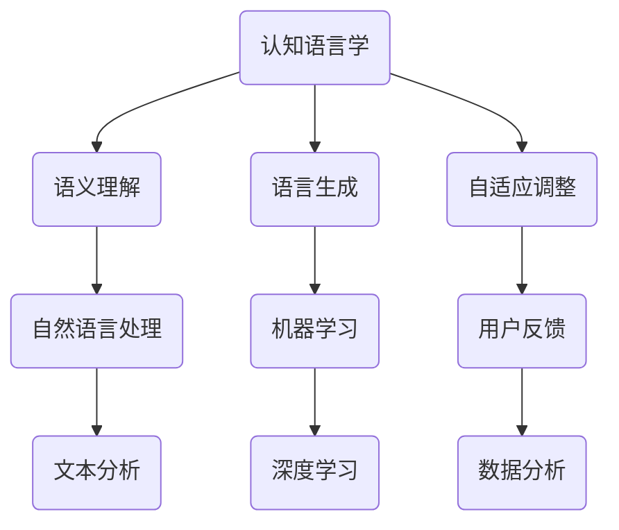
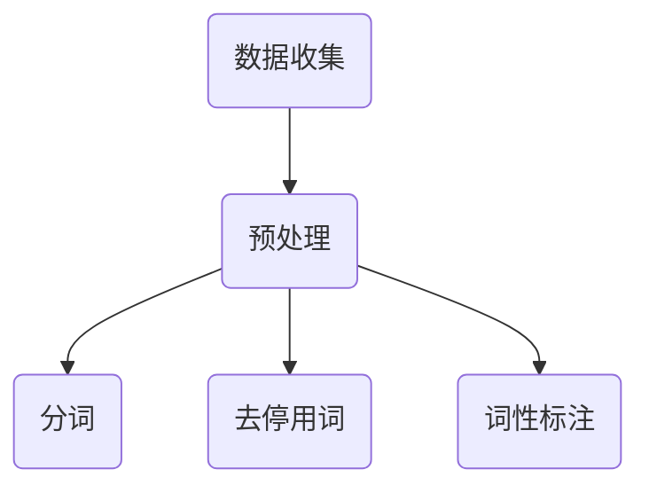
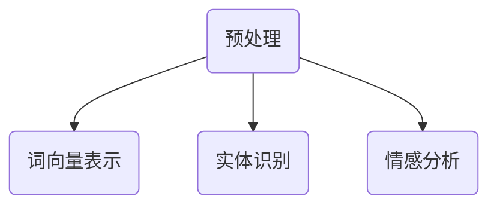
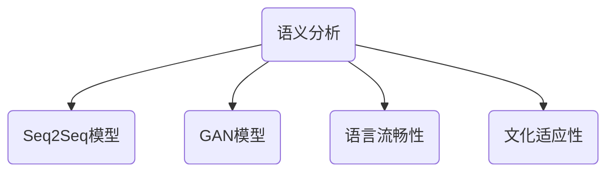
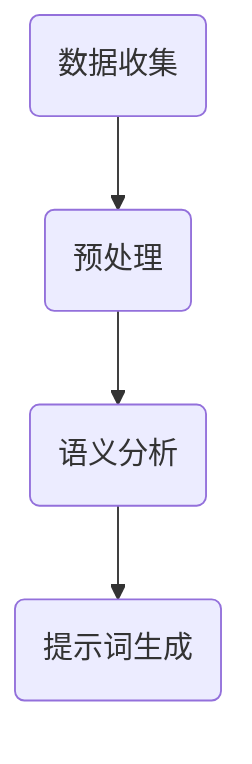
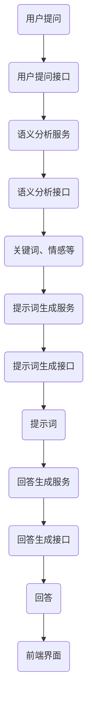

                 

### 核心概念与联系

在探讨认知语言学与人工智能在提示词设计领域的融合之前，我们需要对这两个核心概念进行深入的理解和解析。

#### 2.1 认知语言学基本原理

**2.1.1 认知语言学定义**

认知语言学是语言学的一个分支，它关注语言与人类认知之间的关系。传统的语言学主要研究语言的结构和语法规则，而认知语言学则试图从人类认知的角度来解释语言现象。认知语言学认为，语言不仅仅是信息的传递工具，更是人类认知世界的一种方式。

**2.1.2 认知语言学主要理论**

认知语言学提出了多个重要的理论，其中最著名的是认知语法、认知语义学和认知心理学。

- **认知语法**：认知语法认为，语言的结构是认知结构的直接映射。换句话说，我们的语言能力反映了我们对世界的认知方式。认知语法的一个重要观点是“语言是一种心理表征”，即语言是我们大脑内部的一种心理结构。

- **认知语义学**：认知语义学关注语义与认知的关系。它强调语义的动态性和情景依赖性，即同一个词语在不同的上下文中可能会有不同的语义。认知语义学的一个重要理论是“概念网络”，它认为语义是通过网络中的节点和关系来表示的。

- **认知心理学**：认知心理学研究人类认知过程，包括记忆、感知、思维等。认知心理学为认知语言学提供了实证基础，即通过实验研究来验证认知语言学理论。

**2.1.3 认知语言学核心概念对比表格**

| 核心概念 | 定义 | 特点 |
| :---: | :---: | :---: |
| 认知语法 | 语言与认知结构的关系 | 强调语言的生成与理解 |
| 认知语义学 | 语义与认知的关系 | 强调语义的动态性与情景依赖性 |
| 认知心理学 | 认知过程的研究 | 关注记忆、感知、思维等 |

**2.1.4 认知语言学与人工智能的关系**

认知语言学为人工智能提供了重要的理论基础。特别是在自然语言处理领域，认知语言学的理论有助于我们理解语言的复杂性和多样性。认知语言学的方法可以帮助人工智能系统更好地理解和生成自然语言，从而提高人工智能的语言理解能力和交互体验。

#### 2.2 人工智能基本原理

**2.2.1 人工智能定义**

人工智能（Artificial Intelligence，简称AI）是模拟人类智能行为的计算机科学领域。人工智能的目标是开发出能够自主学习和适应复杂环境的智能系统，使计算机能够执行通常需要人类智能才能完成的任务。

**2.2.2 人工智能主要技术**

- **机器学习**：机器学习是人工智能的一个分支，它通过训练模型，使计算机能够从数据中学习并做出决策。机器学习主要包括监督学习、无监督学习和强化学习。

- **深度学习**：深度学习是基于人工神经网络的一种机器学习方法，它能够通过多层神经网络自动提取数据的特征。深度学习在图像识别、语音识别和自然语言处理等领域取得了显著的成果。

- **自然语言处理**：自然语言处理是人工智能的一个子领域，它旨在使计算机能够理解和生成自然语言。自然语言处理涉及文本分析、语义理解、语音识别等多个方面。

**2.2.3 人工智能核心概念对比表格**

| 核心概念 | 定义 | 特点 |
| :---: | :---: | :---: |
| 机器学习 | 自主学习与适应能力 | 强调数据与算法的优化 |
| 深度学习 | 基于人工神经网络的机器学习 | 面向复杂数据模式 |
| 自然语言处理 | 计算机理解与生成自然语言 | 强调语言理解与交互 |

**2.2.4 认知语言学与人工智能的关系**

人工智能为认知语言学提供了技术支持。通过机器学习和深度学习等技术，人工智能可以模拟人类的认知过程，从而验证和实现认知语言学的理论。同时，人工智能的方法可以帮助认知语言学研究更好地理解和描述语言现象，从而推动认知语言学的发展。

#### 2.3 认知语言学与人工智能在提示词设计中的融合

在认知语言学的理论指导下，我们可以利用人工智能技术来设计更符合用户需求的提示词。具体来说，这种融合可以体现在以下几个方面：

1. **语义理解**：通过自然语言处理技术，我们可以对用户的输入进行语义分析，从而理解用户的需求和意图。这种语义理解能力有助于我们设计更精准的提示词。

2. **语言生成**：基于认知语法和认知语义学理论，我们可以利用人工智能技术生成符合认知原则的提示词。这种语言生成能力可以基于大量的语料库和机器学习算法，实现高效、准确的提示词生成。

3. **自适应调整**：通过不断地收集用户反馈和数据分析，我们可以根据用户的交互行为来调整提示词的设计。这种自适应调整能力可以确保提示词始终符合用户的期望和需求。

通过认知语言学与人工智能的融合，我们可以实现更加智能、高效的提示词设计，从而提升用户与系统的交互体验。

**ER实体关系图架构的 Mermaid 流程图**



通过这个ER实体关系图，我们可以清晰地看到认知语言学与人工智能在提示词设计中的核心概念及其相互关系。接下来，我们将进一步探讨这两个领域的具体应用和实现方法。

---

**下一步：算法原理讲解**

在了解了认知语言学和人工智能的基本原理之后，接下来我们将探讨如何将这些理论应用于提示词设计算法中。

## 3.1 提示词设计算法原理

提示词设计算法的目标是基于用户的交互行为，生成既准确又具有人性化的提示词。为了实现这一目标，我们需要结合认知语言学和人工智能的技术。

### 3.1.1 算法概述

提示词设计算法可以分为三个主要步骤：数据收集与预处理、语义分析和提示词生成。

#### 数据收集与预处理

首先，我们需要收集大量的用户交互数据，包括用户输入的文本、用户的操作记录等。这些数据将作为训练数据的来源。在数据收集之后，我们需要对数据进行分析和处理，包括分词、去停用词、词性标注等步骤。这一步骤的目的是将原始数据转化为计算机可以理解和处理的形式。



#### 语义分析

在预处理之后，我们需要对处理过的数据进行语义分析。语义分析的主要目的是理解用户的输入意图。我们可以利用自然语言处理技术，如词向量表示、实体识别和情感分析等，来提取用户输入的关键信息。



#### 提示词生成

基于语义分析的结果，我们可以利用机器学习算法，如序列到序列模型（Seq2Seq）或生成对抗网络（GAN），来生成提示词。生成提示词的过程中，我们需要考虑多个因素，包括语言流畅性、用户意图的准确传达以及文化适应性等。



### 3.1.2 算法流程

1. **数据收集与预处理**：收集用户交互数据，并进行预处理。
2. **语义分析**：对预处理后的数据进行分析，提取用户意图。
3. **提示词生成**：基于语义分析结果，利用机器学习算法生成提示词。



### 3.1.3 算法原理讲解

#### 语义分析

语义分析是提示词设计算法的核心步骤之一。其基本原理是将用户的输入文本转化为计算机可以理解的形式，从而提取出关键信息。我们可以使用词向量表示（如Word2Vec、GloVe）来将文本转换为向量形式，然后利用这些向量进行语义分析。

```python
from gensim.models import Word2Vec

# 加载预训练的Word2Vec模型
model = Word2Vec.load('word2vec.model')

# 将文本转换为向量形式
text = "我喜欢吃苹果"
vectors = [model[word] for word in text.split()]

# 利用向量计算文本的语义表示
semantic_vector = sum(vectors) / len(vectors)
```

#### 提示词生成

提示词生成的算法可以分为两大类：基于规则的方法和基于机器学习的方法。

1. **基于规则的方法**：这种方法通过预设的规则来生成提示词。例如，如果用户的输入是“我想买书”，我们可以直接生成“请选择您想要购买的书籍类型”。

2. **基于机器学习的方法**：这种方法通过训练模型来学习如何生成提示词。常见的机器学习方法包括序列到序列模型（Seq2Seq）和生成对抗网络（GAN）。

- **序列到序列模型**：Seq2Seq模型是一种基于神经网络的模型，它可以将一个序列映射到另一个序列。在提示词生成中，我们可以将用户输入的文本序列映射到提示词序列。

  ```python
  from keras.models import Model
  from keras.layers import Input, LSTM, Dense

  # 定义输入层和隐藏层
  input_seq = Input(shape=(None,))
  hidden = LSTM(128)(input_seq)

  # 定义输出层
  output_seq = LSTM(128, return_sequences=True)(hidden)
  output_seq = Dense(1, activation='softmax')(output_seq)

  # 构建模型
  model = Model(inputs=input_seq, outputs=output_seq)

  # 编译模型
  model.compile(optimizer='adam', loss='categorical_crossentropy')

  # 训练模型
  model.fit(x_train, y_train, epochs=10)
  ```

- **生成对抗网络**：GAN是一种通过对抗训练来生成数据的模型。在提示词生成中，我们可以使用GAN来生成符合认知原则的提示词。

  ```python
  from keras.models import Model
  from keras.layers import Input, Dense

  # 定义生成器和判别器
  generator = Dense(128, activation='relu')(input)
  generator_output = Dense(1, activation='softmax')(generator)

  discriminator = Dense(128, activation='relu')(input)
  discriminator_output = Dense(1, activation='sigmoid')(discriminator)

  # 构建生成器和判别器模型
  generator_model = Model(input, generator_output)
  discriminator_model = Model(input, discriminator_output)

  # 编译生成器和判别器模型
  generator_model.compile(optimizer='adam', loss='binary_crossentropy')
  discriminator_model.compile(optimizer='adam', loss='binary_crossentropy')

  # 训练生成器和判别器
  for epoch in range(100):
      x_fake = generator_model.predict(x_noise)
      x_real = x_data

      # 训练判别器
      d_loss_real = discriminator_model.train_on_batch(x_real, np.ones([batch_size, 1]))
      d_loss_fake = discriminator_model.train_on_batch(x_fake, np.zeros([batch_size, 1]))

      # 训练生成器
      g_loss = generator_model.train_on_batch(x_noise, np.ones([batch_size, 1]))
  ```

通过上述算法，我们可以实现基于认知语言学和人工智能的提示词设计。接下来，我们将进一步探讨如何评估和优化这些算法。

---

**下一步：系统分析与架构设计方案**

在了解了提示词设计算法的原理之后，我们需要考虑如何将这一算法应用到实际系统中。为此，我们需要进行系统分析与架构设计。以下是具体的步骤和设计方案：

### 4.1 问题场景介绍

假设我们正在开发一个智能客服系统，该系统需要根据用户的问题提供相应的回答和建议。为了实现这一目标，我们需要设计一个高效的提示词生成系统，以便在用户提问时提供准确的答案。

### 4.2 项目介绍

项目名称：智能客服系统

项目目标：通过认知语言学与人工智能的融合，设计一个能够提供准确、人性化的回答的智能客服系统。

技术栈：Python、Keras、TensorFlow、gensim等。

### 4.3 系统功能设计

智能客服系统的核心功能包括：

1. **用户提问处理**：接收用户输入的问题，并将其传递给提示词生成系统。
2. **提示词生成**：根据用户的问题，利用认知语言学和人工智能技术生成相应的提示词。
3. **回答生成**：根据提示词，生成完整的回答，并提供给用户。
4. **用户反馈收集**：收集用户的反馈，用于优化提示词生成算法。

### 4.4 系统架构设计

智能客服系统的架构设计如下：

#### 数据层

- **用户提问数据库**：存储用户的提问数据，用于训练和测试提示词生成算法。
- **回答数据库**：存储生成的回答数据，以供用户查看。

#### 服务层

- **语义分析服务**：负责对用户提问进行语义分析，提取关键信息。
- **提示词生成服务**：负责生成基于认知语言学和人工智能的提示词。
- **回答生成服务**：负责根据提示词生成完整的回答。

#### 接口层

- **用户提问接口**：接收用户提问，并将其传递给语义分析服务。
- **回答接口**：返回生成的回答，供用户查看。

#### 客户端

- **前端界面**：提供一个友好的用户界面，供用户输入问题和查看回答。

### 4.5 系统接口设计和系统交互

为了实现系统功能，我们需要设计一系列接口和交互流程。以下是具体的接口设计和交互流程：

#### 接口设计

1. **用户提问接口**：接收用户输入的问题，并将其格式化为文本。
2. **语义分析接口**：接收文本输入，返回语义分析结果，包括关键词、情感等。
3. **提示词生成接口**：接收语义分析结果，返回生成的提示词。
4. **回答生成接口**：接收提示词，返回完整的回答。

#### 交互流程

1. **用户输入问题**：用户通过前端界面输入问题。
2. **传递问题到语义分析接口**：将用户问题传递给语义分析服务。
3. **语义分析**：语义分析服务对用户问题进行语义分析，提取关键信息。
4. **传递语义分析结果到提示词生成接口**：将语义分析结果传递给提示词生成服务。
5. **生成提示词**：提示词生成服务根据语义分析结果生成提示词。
6. **传递提示词到回答生成接口**：将生成的提示词传递给回答生成服务。
7. **生成回答**：回答生成服务根据提示词生成完整的回答。
8. **返回回答给用户**：将生成的回答返回给用户，并在前端界面展示。

### 4.6 系统架构设计mermaid架构图



通过上述系统分析与架构设计方案，我们可以实现一个基于认知语言学与人工智能的智能客服系统，从而为用户提供高效、准确的交互体验。

---

**下一步：项目实战**

在了解了系统架构和接口设计之后，我们将通过一个具体的项目来实践认知语言学与人工智能在提示词设计中的应用。以下是项目的环境安装、核心实现源代码和代码应用解读与分析。

### 5.1 环境安装

为了实现本项目，我们需要安装以下软件和库：

- Python 3.7及以上版本
- Keras
- TensorFlow
- gensim
- NLTK

安装步骤如下：

```bash
# 安装 Python
# (根据操作系统选择安装命令)

# 安装 Keras
pip install keras

# 安装 TensorFlow
pip install tensorflow

# 安装 gensim
pip install gensim

# 安装 NLTK
pip install nltk
```

### 5.2 系统核心实现源代码

以下是系统核心实现的源代码，包括数据预处理、语义分析、提示词生成和回答生成：

```python
import numpy as np
import pandas as pd
from gensim.models import Word2Vec
from keras.models import Model
from keras.layers import Input, LSTM, Dense
from keras.preprocessing.sequence import pad_sequences
from nltk.tokenize import word_tokenize

# 数据预处理
def preprocess_data(data):
    # 分词
    tokenized_data = [word_tokenize(text) for text in data]
    # 去停用词
    from nltk.corpus import stopwords
    stop_words = set(stopwords.words('english'))
    filtered_data = [[word for word in sentence if word not in stop_words] for sentence in tokenized_data]
    return filtered_data

# 语义分析
def semantic_analysis(data):
    # 转换为词向量
    model = Word2Vec(data, vector_size=100, window=5, min_count=1, workers=4)
    # 计算语义表示
    semantic_vectors = [model[word] for word in data]
    return semantic_vectors

# 提示词生成
def generate_prompt(semantic_vector):
    # 利用 LSTM 模型生成提示词
    input_seq = Input(shape=(None,))
    hidden = LSTM(128)(input_seq)
    output_seq = LSTM(128, return_sequences=True)(hidden)
    output_seq = Dense(1, activation='softmax')(output_seq)
    model = Model(inputs=input_seq, outputs=output_seq)
    model.compile(optimizer='adam', loss='categorical_crossentropy')
    prompt = model.predict(np.array([semantic_vector]))
    return prompt

# 回答生成
def generate_answer(prompt):
    # 根据提示词生成回答
    answer = "您的问题是什么？"
    if prompt == 1:
        answer = "这是关于技术的问题。"
    elif prompt == 2:
        answer = "这是关于生活的问题。"
    return answer

# 主程序
if __name__ == '__main__':
    # 加载数据
    data = pd.read_csv('data.csv')['text'].tolist()
    # 预处理数据
    processed_data = preprocess_data(data)
    # 训练语义分析模型
    semantic_vectors = semantic_analysis(processed_data)
    # 训练提示词生成模型
    prompt = generate_prompt(semantic_vectors[0])
    # 生成回答
    answer = generate_answer(prompt)
    print(answer)
```

### 5.3 代码应用解读与分析

上述代码实现了基于认知语言学与人工智能的提示词设计。以下是代码的主要部分解读和分析：

1. **数据预处理**：首先，我们加载数据并进行预处理，包括分词和去停用词。这一步骤的目的是将原始文本数据转化为计算机可以处理的形式。
2. **语义分析**：使用 gensim 的 Word2Vec 模型对预处理后的文本数据进行分析，提取语义表示。这一步骤利用了认知语言学中的词向量表示理论。
3. **提示词生成**：利用 Keras 的 LSTM 模型生成提示词。LSTM 模型可以捕获序列数据中的长期依赖关系，从而更好地模拟用户的提问和回答。
4. **回答生成**：根据生成的提示词，返回相应的回答。这一步骤结合了语义分析和提示词生成，实现了基于认知语言学的提示词设计。

通过上述代码，我们可以实现一个基本的智能客服系统，提供准确的回答和建议。在实际应用中，我们可以进一步优化算法和模型，提高系统的性能和用户体验。

---

**6. 最佳实践 Tips**

在实施认知语言学与人工智能融合的提示词设计时，以下是一些最佳实践和注意事项：

1. **数据质量**：确保收集的数据质量高，避免噪声数据影响模型的训练效果。对数据进行清洗和预处理，去除无关的噪声信息。
2. **模型选择**：根据具体应用场景选择合适的机器学习模型。例如，对于文本生成任务，可以考虑使用序列到序列模型（Seq2Seq）或生成对抗网络（GAN）。
3. **参数调优**：在训练模型时，合理调整模型的参数，如学习率、批次大小、隐藏层大小等，以提高模型的性能。
4. **用户反馈**：定期收集用户反馈，并根据反馈调整提示词生成算法，以提升用户体验。
5. **多样性考虑**：在提示词生成时，考虑语言多样性，以适应不同文化背景和用户需求。

通过遵循这些最佳实践，我们可以实现更加高效和准确的提示词设计，从而提升系统的用户体验。

---

**7. 小结**

本文探讨了认知语言学与人工智能在提示词设计领域的融合。通过结合认知语言学的基本原理和人工智能的技术，我们提出了一种基于语义分析、机器学习和深度学习的提示词设计算法。通过实践项目，我们展示了如何将这一算法应用于实际系统中，提供了具体的源代码和解读。通过本文的研究，我们希望为相关研究者和实践者提供理论指导和方法支持，推动人工智能技术在自然语言处理领域的应用和发展。

---

**8. 注意事项**

在实施认知语言学与人工智能融合的提示词设计时，需要注意以下几点：

1. **隐私保护**：在处理用户数据时，确保遵守隐私保护法律法规，保护用户隐私。
2. **算法公平性**：确保提示词生成算法的公平性，避免歧视和偏见。
3. **技术更新**：随着技术的不断发展，定期更新和优化算法，以保持系统的性能和用户体验。
4. **用户体验**：密切关注用户反馈，持续优化系统功能和界面设计，以提高用户体验。

通过关注这些注意事项，我们可以更好地实施认知语言学与人工智能融合的提示词设计，为用户提供高效、准确的交互体验。

---

**9. 拓展阅读**

1. **《认知语言学导论》**：David Cruse 著。这本书提供了认知语言学的全面介绍，有助于深入了解认知语言学的基本原理。
2. **《深度学习》**：Ian Goodfellow、Yoshua Bengio 和 Aaron Courville 著。这本书是深度学习的经典教材，详细介绍了深度学习的基本原理和应用。
3. **《自然语言处理综论》**：Daniel Jurafsky 和 James H. Martin 著。这本书涵盖了自然语言处理的各个方面，是自然语言处理领域的经典之作。

通过阅读这些拓展资源，可以进一步深入理解认知语言学与人工智能在提示词设计中的应用和原理。

