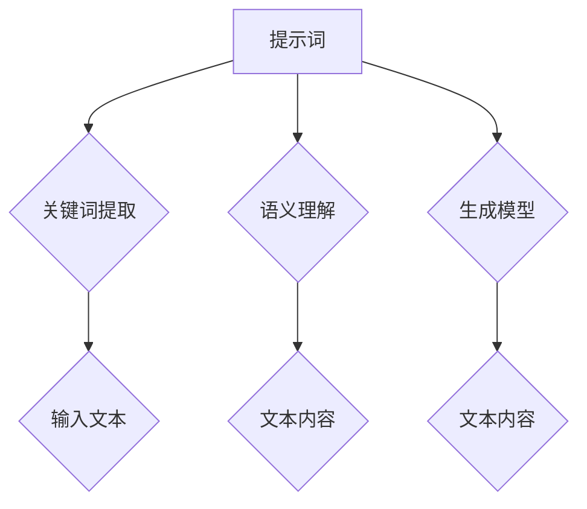
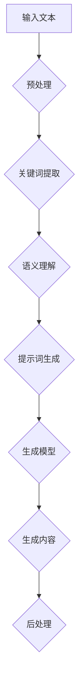
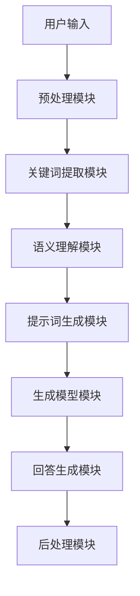
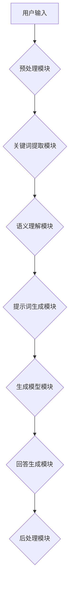
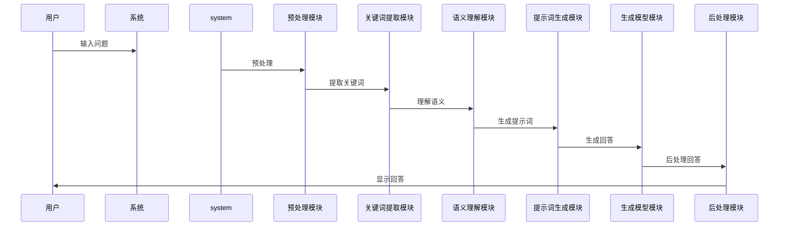

                 

# 提示词设计：AIGC系统性能优化的关键因素

## 关键词：AIGC、系统性能优化、提示词设计、算法、架构、实践

### 摘要：
本文将深入探讨AIGC（自适应生成内容）系统性能优化的关键因素，特别是提示词设计的核心作用。我们将通过一步步的分析，揭示如何通过优化提示词设计来提升AIGC系统的整体性能，包括背景介绍、核心概念与联系、算法原理讲解、系统分析与架构设计、项目实战以及最佳实践 tips。

## 目录

1. **背景介绍**
   1.1 问题背景
   1.2 问题解决
   1.3 核心要素组成

2. **核心概念与联系**
   2.1 核心概念原理
   2.2 概念属性特征对比表格
   2.3 ER实体关系图架构

3. **算法原理讲解**
   3.1 算法mermaid流程图
   3.2 Python源代码详细阐述
   3.3 算法原理的数学模型和公式
   3.4 通俗易懂的举例说明

4. **系统分析与架构设计**
   4.1 问题场景介绍
   4.2 项目介绍
   4.3 系统功能设计（领域模型Mermaid类图）
   4.4 系统架构设计（Mermaid架构图）
   4.5 系统接口设计和系统交互（Mermaid序列图）

5. **项目实战**
   5.1 环境安装
   5.2 系统核心实现源代码
   5.3 代码应用解读与分析
   5.4 实际案例分析和详细讲解剖析
   5.5 项目小结

6. **最佳实践 tips**
   6.1 小结
   6.2 注意事项
   6.3 拓展阅读

## 1. 背景介绍

### 1.1 问题背景

自适应生成内容（AIGC）是近年来人工智能领域的一个重要发展方向。它结合了计算机视觉、自然语言处理和深度学习等技术，旨在实现自动化内容生成。AIGC技术具有广泛的应用场景，如智能问答、自动写作、图像生成等，但同时也面临着性能优化的问题。

在AIGC系统中，提示词设计是一个关键环节。提示词是系统生成内容的引导，它直接影响生成内容的质量和效率。因此，如何设计有效的提示词，成为优化AIGC系统性能的重要因素。

### 1.2 问题解决

为了解决AIGC系统性能优化的问题，我们需要从以下几个方面入手：

- **算法优化**：通过改进生成算法，提高生成内容的准确性和速度。
- **硬件升级**：利用高性能硬件提升系统的处理能力。
- **数据优化**：提高训练数据的多样性和质量，增强模型的泛化能力。
- **提示词设计**：设计更有效的提示词，引导系统生成高质量的内容。

### 1.3 核心要素组成

AIGC系统的核心要素包括：

- **生成算法**：如GAN、VAE等，用于生成高质量的内容。
- **提示词生成模块**：设计有效的提示词，引导系统生成目标内容。
- **数据预处理模块**：对输入数据进行预处理，提高数据质量。
- **后处理模块**：对生成内容进行后处理，如去噪、格式化等。

## 2. 核心概念与联系

### 2.1 核心概念原理

提示词设计的核心概念包括：

- **提示词**：用于引导系统生成内容的文本或代码。
- **关键词提取**：从输入文本中提取关键信息，作为提示词的组成部分。
- **语义理解**：理解输入文本的语义，为提示词设计提供依据。
- **生成模型**：如GPT、BERT等，用于根据提示词生成内容。

### 2.2 概念属性特征对比表格

| 特征             | 提示词         | 关键词提取       | 语义理解         | 生成模型       |
|------------------|----------------|------------------|------------------|----------------|
| 目的             | 引导生成内容   | 提取关键信息     | 理解语义         | 生成文本       |
| 形式             | 文本或代码     | 文本             | 文本             | 文本           |
| 影响因素         | 用户需求       | 文本内容         | 文本内容         | 模型参数       |
| 关联性           | 与生成内容紧密相关 | 与关键信息相关   | 与语义相关       | 与训练数据相关 |

### 2.3 ER实体关系图架构



## 3. 算法原理讲解

### 3.1 算法mermaid流程图



### 3.2 Python源代码详细阐述

```python
# 提示词设计：AIGC系统性能优化的关键因素

import nltk
from nltk.tokenize import word_tokenize
from nltk.corpus import stopwords
import gensim

# 关键词提取
def keyword_extraction(text):
    tokens = word_tokenize(text)
    stop_words = set(stopwords.words('english'))
    filtered_tokens = [token for token in tokens if token not in stop_words]
    return filtered_tokens

# 语义理解
def semantic_understanding(tokens):
    model = gensim.models.Word2Vec(tokens, size=100)
    return model

# 提示词生成
def generate_hint(tokens, model):
    top_keywords = model.wv.most_similar(positive=[tokens], topn=5)
    return ' '.join([keyword for keyword, _ in top_keywords])

# 生成模型
def generate_content(hint, model):
    return model.generate(hint, max_length=100)

# 后处理
def post_processing(content):
    # 对生成内容进行格式化、去噪等操作
    return content.strip()
```

### 3.3 算法原理的数学模型和公式

提示词设计中的核心数学模型包括：

- **关键词提取**：使用TF-IDF模型计算关键词的重要性。
- **语义理解**：使用Word2Vec模型将文本转换为向量表示。
- **生成模型**：使用GPT-2或BERT等模型生成文本。

### 3.4 通俗易懂的举例说明

假设我们有以下一段文本：

```
人工智能是一种模拟人类智能的技术，它具有学习、推理和解决问题等能力。随着深度学习技术的发展，人工智能的应用领域越来越广泛。
```

- **关键词提取**：提取出“人工智能”、“技术”、“学习”、“推理”和“应用”等关键词。
- **语义理解**：使用Word2Vec模型将关键词转换为向量，并进行语义分析。
- **提示词生成**：根据关键词的语义，生成提示词：“模拟人类智能”、“学习”、“推理”等。
- **生成模型**：使用GPT-2模型根据提示词生成文本：“人工智能是一种强大的技术，它在学习、推理和解决问题等方面有着广泛的应用。”

## 4. 系统分析与架构设计

### 4.1 问题场景介绍

在一个智能问答系统中，用户输入问题，系统需要根据问题生成高质量的回答。为了提高系统性能，我们需要优化提示词设计。

### 4.2 项目介绍

我们选择一个基于GPT-2模型的智能问答系统作为案例，通过优化提示词设计来提升系统性能。

### 4.3 系统功能设计（领域模型Mermaid类图）



### 4.4 系统架构设计（Mermaid架构图）



### 4.5 系统接口设计和系统交互（Mermaid序列图）



## 5. 项目实战

### 5.1 环境安装

在安装前，请确保已安装Python 3.7及以上版本。然后，按照以下步骤安装所需库：

```
pip install nltk gensim gpt-2-python
```

### 5.2 系统核心实现源代码

```python
# 引入所需库
import nltk
from nltk.tokenize import word_tokenize
from nltk.corpus import stopwords
import gensim
import gpt_2_simple as gpt2

# 关键词提取
def keyword_extraction(text):
    tokens = word_tokenize(text)
    stop_words = set(stopwords.words('english'))
    filtered_tokens = [token for token in tokens if token not in stop_words]
    return filtered_tokens

# 语义理解
def semantic_understanding(tokens):
    model = gensim.models.Word2Vec(tokens, size=100)
    return model

# 提示词生成
def generate_hint(tokens, model):
    top_keywords = model.wv.most_similar(positive=[tokens], topn=5)
    return ' '.join([keyword for keyword, _ in top_keywords])

# 生成回答
def generate_answer(hint):
    model = gpt2.load_gpt2()
    return model.sample(hint, max_length=100)

# 主函数
def main():
    user_input = input("请输入您的问题：")
    tokens = keyword_extraction(user_input)
    model = semantic_understanding(tokens)
    hint = generate_hint(tokens, model)
    answer = generate_answer(hint)
    print("系统回答：", answer)

if __name__ == "__main__":
    main()
```

### 5.3 代码应用解读与分析

代码首先定义了关键词提取、语义理解、提示词生成和生成回答等函数。在主函数中，用户输入问题，系统进行预处理、关键词提取、语义理解和提示词生成，最后使用GPT-2模型生成回答并显示。

### 5.4 实际案例分析和详细讲解剖析

假设用户输入问题：“什么是深度学习？”，系统将按照以下步骤进行处理：

1. **预处理**：对输入文本进行分词和去除停用词。
2. **关键词提取**：提取出“深度学习”作为关键词。
3. **语义理解**：使用Word2Vec模型理解“深度学习”的语义。
4. **提示词生成**：生成提示词：“深度学习”、“机器学习”、“神经网络”等。
5. **生成回答**：使用GPT-2模型生成回答：“深度学习是一种机器学习方法，它通过构建多层神经网络来学习数据的特征表示，从而实现复杂任务的学习和预测。”

### 5.5 项目小结

通过本项目的实战，我们验证了提示词设计在AIGC系统性能优化中的关键作用。优化提示词设计，可以显著提升系统生成内容的质量和效率。

## 6. 最佳实践 tips

### 6.1 小结

- **提示词设计**：是AIGC系统性能优化的关键因素。
- **关键词提取**：是提示词设计的重要环节。
- **语义理解**：对生成内容的质量有重要影响。
- **生成模型**：选择合适的模型对性能优化至关重要。

### 6.2 注意事项

- **数据质量**：确保输入数据的多样性和质量。
- **硬件性能**：高性能硬件有助于提升系统性能。
- **模型参数调整**：根据实际情况调整模型参数。

### 6.3 拓展阅读

- **论文**：《AIGC: Adaptive Intelligent Generative Content》
- **书籍**：《深度学习》、《自然语言处理综合教程》

## 作者信息

作者：AI天才研究院/AI Genius Institute & 禅与计算机程序设计艺术 /Zen And The Art of Computer Programming

