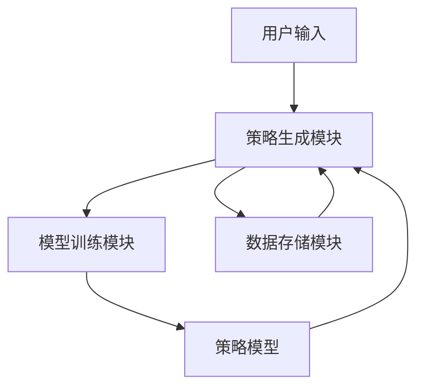
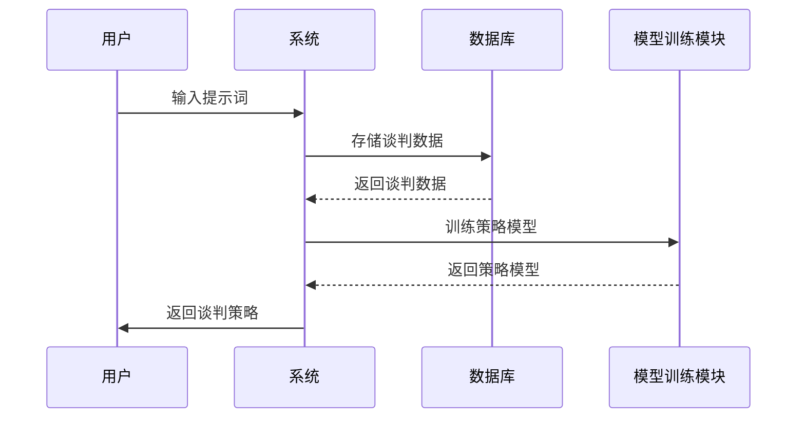

                 

### 提示词设计与AI谈判概述

#### 1.1.1 AI谈判的现状与挑战

随着人工智能（AI）技术的迅猛发展，AI在各个领域的应用逐渐深入。特别是在商务谈判中，AI作为一种智能工具，具有快速、高效、精准的优势。然而，当前的AI谈判仍面临着诸多挑战。

首先，谈判过程的复杂性使得AI难以全面掌握。谈判不仅涉及双方的博弈策略，还包括情绪、语言、文化等多方面的因素。这些因素交织在一起，使得谈判过程具有高度的复杂性。

其次，AI在谈判中的数据依赖性较高。AI的性能很大程度上取决于训练数据的质量和多样性。而在实际谈判场景中，数据往往具有隐私性，难以获取。

再者，当前AI谈判系统多采用单一策略，缺乏灵活性和适应性。在实际谈判中，双方往往采取多种策略进行博弈，单一策略的AI系统难以应对。

#### 1.1.2 提示词在AI谈判中的重要性

提示词（Prompt）在AI谈判中起着至关重要的作用。提示词是一种引导AI系统进行决策的指导性语句，它可以帮助AI更好地理解谈判目标和策略，从而提高谈判效果。

首先，提示词可以明确AI的谈判目标。通过提示词，AI可以明确知道自己在谈判中需要达成的目标，从而采取相应的策略。

其次，提示词可以帮助AI理解谈判策略。不同的谈判策略需要不同的信息处理方式。通过提示词，AI可以更好地理解这些策略，并采取相应的行动。

此外，提示词还可以帮助AI适应多轮谈判的复杂性。在多轮谈判中，双方的策略和情绪都会发生变化。提示词可以帮助AI及时调整策略，以应对这些变化。

#### 1.1.3 本书的目标与结构

本书的目标是深入探讨提示词设计在AI多轮谈判中的应用，旨在提高AI的谈判能力，实现更加高效、精准的商务谈判。

本书将分为五个部分：

**第一部分 引言**：介绍提示词设计与AI谈判的背景和重要性。

**第二部分 提示词工程基础**：讲解提示词工程的基本理论和设计方法。

**第三部分 算法原理**：介绍AI谈判算法的基本原理和实现方法。

**第四部分 数学模型与公式**：讲解AI谈判的数学模型和公式，并进行详细阐述。

**第五部分 系统分析与设计**：介绍AI谈判系统的分析与设计方法，包括系统功能设计、系统架构设计、系统接口设计和系统交互设计。

通过本书的学习，读者可以全面了解提示词设计在AI谈判中的应用，掌握从理论到实践的完整流程。

#### 1.2 核心概念与联系

在深入探讨提示词设计之前，我们需要了解一些核心概念，这些概念是理解AI谈判的基础。

##### 提示词（Prompt）

提示词是一种指导AI系统进行决策的语句，它可以是自然语言文本，也可以是代码指令。提示词的作用是引导AI系统按照设计者的意图进行操作，从而实现特定的目标。

在AI谈判中，提示词的作用尤为重要。它可以帮助AI系统理解谈判的目标、策略和情境，从而做出更准确的决策。例如，一个简单的提示词可以是“在谈判中，我们的目标是争取最大的利益，同时保持良好的合作关系。”

##### AI谈判（AI Negotiation）

AI谈判是指利用人工智能技术，辅助或替代人类进行谈判的过程。它涉及多个领域，包括博弈论、机器学习、自然语言处理等。

AI谈判的核心目标是实现谈判的自动化和智能化，从而提高谈判的效率和质量。在AI谈判中，AI系统不仅需要理解谈判的内容，还需要具备策略制定和决策执行的能力。

##### 提示词工程（Prompt Engineering）

提示词工程是设计、开发和优化提示词的过程。它是一种结合了计算机科学和人工智能的交叉领域，旨在提高AI系统的性能和可解释性。

在提示词工程中，设计师需要根据具体的应用场景，设计出既简洁又有效的提示词。这涉及到对语言的理解、对数据的分析和对模型的调优。

##### 提示词与AI谈判的关联

提示词与AI谈判之间存在密切的关联。一方面，提示词是AI谈判的核心输入，它决定了AI系统在谈判中的表现。另一方面，AI谈判的结果也会反过来影响提示词的设计和优化。

例如，在多轮谈判中，AI系统需要根据对方的回应，不断调整自己的策略。这些调整就需要通过提示词来实现。因此，提示词的设计不仅需要考虑当前的局面，还需要预测未来可能的变化。

#### 1.2.1 提示词的概念与属性

提示词是一种用于指导AI系统行为的文本或代码，它在人工智能领域有着广泛的应用。为了更好地理解提示词，我们需要从以下几个方面来探讨其概念和属性。

**1. 定义**

提示词，顾名思义，就是“提示”或“提示信息”。在人工智能系统中，提示词是一种用于引导模型决策或执行特定任务的输入。它可以是自然语言文本，也可以是编程语言中的代码片段。例如，在一个聊天机器人中，用户输入的问题或指令就是一种提示词，而机器人根据提示词生成回答或执行任务。

**2. 类型**

根据应用场景和需求，提示词可以分为多种类型：

- **命令式提示词**：这种类型的提示词直接告诉系统需要执行什么操作。例如，在机器人控制系统中，命令式提示词可以是“启动电机”或“停止电机”。
- **描述性提示词**：这类提示词用于描述系统的当前状态或目标，帮助系统更好地理解所处的环境。例如，在自动驾驶系统中，描述性提示词可以是“前方有行人”或“道路拥堵”。
- **引导式提示词**：引导式提示词用于引导系统探索或学习新的任务或场景。例如，在机器学习系统中，引导式提示词可以是“尝试优化模型参数”或“探索新的特征工程方法”。

**3. 属性**

提示词具有以下几个关键属性：

- **可解释性**：提示词需要具有明确和可解释的内容，以便AI系统能够理解其意图。例如，一个模糊的提示词“做事情”可能无法明确指导AI执行具体的任务。
- **准确性**：提示词需要准确传达系统的需求和目标，避免产生歧义。例如，一个准确的提示词“计算两个数的和”可以确保AI系统正确执行加法运算。
- **灵活性**：提示词需要具有一定的灵活性，以适应不同场景和需求。例如，一个灵活的提示词“根据天气调整服装”可以适用于多种天气情况。
- **时效性**：提示词的内容需要与系统的当前状态和目标保持一致，避免过时或失效。例如，一个过时的提示词“明天开会”在当天可能不再适用。

**4. 提示词的构成**

一个有效的提示词通常由以下几个部分构成：

- **主体**：提示词的核心内容，用于传达具体的任务或需求。
- **参数**：附加在主体上的具体信息，用于补充和细化任务。
- **条件**：用于指定执行任务的约束条件或特定情境。

例如，一个完整的提示词可能是：“当用户点击‘购买’按钮时，执行‘添加商品到购物车’操作，并且确保商品库存大于0。”

**5. 提示词的优缺点**

- **优点**：
  - **提高效率**：通过使用提示词，可以减少人工干预，提高系统的自动化程度。
  - **增强可维护性**：明确和统一的提示词设计有助于系统的维护和升级。
  - **促进协作**：提示词可以作为一种沟通工具，帮助不同团队或个人之间更好地协作。

- **缺点**：
  - **设计复杂性**：设计有效的提示词需要深厚的专业知识，且可能涉及多个领域。
  - **依赖数据质量**：提示词的性能很大程度上取决于训练数据的质量和多样性。
  - **解释性局限**：即使设计得再好，提示词也可能存在解释性局限，特别是在处理复杂任务时。

#### 1.2.2 AI谈判的基本原理

AI谈判是基于人工智能技术的自动化谈判过程，它利用机器学习和博弈论等理论，模拟人类谈判者的思维和行为。为了深入理解AI谈判的基本原理，我们需要从以下几个方面进行探讨。

**1. 基本概念**

AI谈判（AI Negotiation）是指利用人工智能技术，模拟和辅助人类进行谈判的过程。它包括多个核心概念，如博弈论、机器学习、自然语言处理等。

- **博弈论**：博弈论是研究决策制定的数学工具，特别是在多个决策者（玩家）之间存在冲突或合作的情况下。AI谈判中，博弈论用于分析谈判双方的行为和策略，预测对方的行动。
- **机器学习**：机器学习是AI的核心技术之一，它通过训练模型，使系统能够自动学习和优化决策。在AI谈判中，机器学习技术用于生成和优化谈判策略。
- **自然语言处理**：自然语言处理（NLP）是使计算机能够理解、生成和处理自然语言的技术。在AI谈判中，NLP用于处理和分析谈判中的文本信息。

**2. AI谈判的目标**

AI谈判的主要目标是通过优化策略，实现谈判的自动化和智能化，从而提高谈判的效率和质量。具体目标包括：

- **达成共识**：通过智能化的谈判策略，帮助双方找到共同利益，达成协议。
- **优化利益**：在满足共识的基础上，最大化自身的利益。
- **提升体验**：通过人性化的交互设计，提高谈判双方的体验。

**3. AI谈判的步骤**

AI谈判通常包括以下几个基本步骤：

- **初始阶段**：系统通过收集和分析双方的初始信息，建立谈判的基础。
- **策略制定**：系统根据博弈论和机器学习算法，生成最优的谈判策略。
- **谈判执行**：系统根据策略执行谈判，与对方进行交互。
- **策略调整**：在谈判过程中，系统根据对方的反馈和自身的表现，不断调整策略。
- **达成共识**：在多次交互后，双方达成共识，形成最终的协议。

**4. AI谈判的优势与挑战**

AI谈判具有以下几个显著优势：

- **效率提升**：AI谈判可以快速处理大量信息，显著提高谈判效率。
- **精准决策**：通过机器学习和博弈论，AI谈判能够做出更精准的决策。
- **个性化服务**：AI谈判可以根据双方的特点和需求，提供个性化的谈判策略。

然而，AI谈判也面临一些挑战：

- **数据依赖性**：AI谈判的性能很大程度上取决于训练数据的质量和多样性。
- **解释性问题**：AI谈判的决策过程可能不透明，难以解释。
- **伦理和法律问题**：AI谈判涉及隐私、安全、道德等方面的问题，需要严格遵守相关法律法规。

**5. AI谈判的应用场景**

AI谈判的应用场景非常广泛，包括但不限于以下几个方面：

- **商务谈判**：在商务活动中，AI谈判可以用于合同签订、价格谈判、合作洽谈等。
- **政治协商**：在政治领域，AI谈判可以用于国际谈判、政策制定等。
- **人力资源管理**：在人力资源管理中，AI谈判可以用于员工招聘、薪酬谈判等。
- **智能客服**：在客服领域，AI谈判可以用于处理复杂的客户咨询和投诉，提供个性化的解决方案。

通过以上探讨，我们可以看出，AI谈判是一种具有巨大潜力的技术，它不仅在理论上具有深远的意义，而且在实际应用中也展现出了广泛的前景。随着AI技术的不断进步，AI谈判的应用将越来越广泛，也将为人类社会带来更多的便利和效益。

#### 1.2.3 提示词与AI谈判的关联

提示词与AI谈判之间存在着紧密的联系，它们相互影响，共同推动谈判过程的有效进行。以下将从几个方面详细探讨提示词在AI谈判中的应用、与谈判策略的关系以及提示词设计的关键步骤。

**提示词在AI谈判中的应用**

提示词在AI谈判中的应用主要体现在以下几个方面：

1. **目标引导**：通过明确的提示词，AI谈判系统能够清晰理解谈判的目标和任务。例如，一个提示词“在保证合作关系的前提下，争取最大利润”能够指导系统在谈判中优先考虑利益最大化，同时保持与对方的合作关系。

2. **策略指导**：提示词可以指导AI系统在谈判中采取何种策略。例如，提示词“采用合作策略，寻求双赢方案”可以引导系统在谈判中倾向于合作，而不是采取对抗性策略。

3. **情境描述**：提示词可以描述谈判的当前状态和情境，帮助AI系统更好地理解谈判的背景。例如，提示词“当前价格低于市场平均水平，对方似乎有意降低成本”能够帮助系统识别谈判的潜在机会和风险。

4. **反馈调整**：在谈判过程中，AI系统会根据对方的回应生成反馈，并通过提示词进行调整。例如，如果AI系统发现对方对当前报价不感兴趣，它可能会通过提示词“尝试提出新的价格方案”来调整谈判策略。

**提示词与谈判策略的关系**

谈判策略是谈判过程中制定和实施的行动计划，目的是实现谈判目标。提示词与谈判策略之间的关系体现在以下几个方面：

1. **策略选择**：提示词可以帮助AI系统选择合适的谈判策略。例如，在面临对方强硬立场时，提示词“采取强硬策略，坚守底线”可以指导系统采取相应的强硬措施。

2. **策略优化**：提示词可以引导AI系统在谈判过程中不断优化策略。通过分析对方的回应和谈判情境，AI系统可以调整策略，以实现更好的谈判效果。例如，提示词“根据对方的回应，逐步调整报价策略”可以帮助系统在谈判中灵活调整报价。

3. **策略反馈**：谈判策略的实施效果需要通过反馈进行验证和调整。提示词可以提供策略反馈，帮助AI系统评估策略的有效性。例如，提示词“本次报价未能达成共识，建议调整策略”可以帮助系统发现策略中的问题并进行优化。

**提示词设计的关键步骤**

为了设计出有效的提示词，需要遵循以下关键步骤：

1. **需求分析**：首先，需要明确AI谈判的目标和需求。这包括理解双方的谈判目标、利益诉求以及谈判的重点和难点。

2. **策略规划**：在需求分析的基础上，制定相应的谈判策略。这需要考虑双方的利益平衡、谈判情境的复杂性以及可能的策略变化。

3. **提示词生成**：根据谈判策略和情境，生成具体的提示词。提示词应简洁明了，能够准确传达系统的意图和目标。例如，提示词“请尝试提出新的报价方案，考虑市场情况和对方需求”。

4. **测试与优化**：在生成提示词后，需要进行测试和优化。通过模拟谈判场景，验证提示词的有效性和适用性。根据测试结果，对提示词进行优化和调整，以提高其准确性和实用性。

5. **反馈机制**：建立反馈机制，收集和分析谈判过程中的实际反馈。这有助于发现提示词的不足之处，并进行针对性的优化。

通过以上步骤，可以设计出既有效又实用的提示词，从而提高AI谈判系统的谈判能力。

总之，提示词在AI谈判中起着至关重要的作用。它不仅帮助AI系统理解谈判的目标和策略，还能够引导系统在谈判过程中灵活应对各种情境。通过合理的提示词设计，AI谈判系统可以显著提升谈判效率和质量，实现更优的谈判结果。

#### 1.3 本书主要内容概述

本书旨在深入探讨提示词设计在AI多轮谈判中的应用，以提高AI的谈判能力。全书共分为五个部分，每部分都涵盖了关键的内容和目标。

**第一部分：引言**

这部分将介绍提示词设计与AI谈判的背景和重要性。我们将探讨AI谈判的现状和挑战，解释提示词在AI谈判中的作用，并概述本书的目标和结构。通过这部分，读者可以了解为什么提示词设计对于AI谈判至关重要。

**第二部分：提示词工程基础**

这部分将详细讲解提示词工程的基本理论和设计方法。我们将探讨提示词的定义、类型、属性以及构成。同时，还会介绍提示词工程的核心步骤，包括需求分析、策略规划、提示词生成、测试与优化等。通过这部分，读者将掌握提示词设计的基本原理和实用技巧。

**第三部分：算法原理**

这部分将介绍AI谈判算法的基本原理和实现方法。我们将讨论博弈论、机器学习、自然语言处理等核心概念，并详细讲解提示词生成、谈判策略优化和情感分析等算法。通过这部分，读者将了解如何通过算法实现高效的AI谈判。

**第四部分：数学模型与公式**

这部分将探讨AI谈判的数学模型和公式。我们将介绍谈判模型的分类、基本原理以及数学公式。具体包括提示词生成公式、谈判策略优化公式和情感分析公式等。通过这部分，读者将掌握如何使用数学模型来分析和优化AI谈判。

**第五部分：系统分析与设计**

这部分将介绍AI谈判系统的分析与设计方法。我们将从系统需求分析、系统架构设计、系统接口设计和系统交互设计等多个角度，详细讲解AI谈判系统的设计和实现。通过这部分，读者将了解如何构建一个完整且高效的AI谈判系统。

通过以上五个部分的学习，读者将全面了解提示词设计在AI多轮谈判中的应用，掌握从理论到实践的完整流程。本书的目标是帮助读者提高AI谈判系统的性能和实用性，实现更加高效、精准的商务谈判。

### 第2章 提示词工程基础理论

提示词工程是AI谈判中至关重要的一环，它涉及设计、开发和优化提示词的过程。为了深入理解提示词工程，我们需要从基础理论开始，详细探讨提示词的定义、类型、属性以及构成。此外，我们还将介绍提示词工程的核心步骤，包括需求分析、策略规划、提示词生成、测试与优化等。通过这些基本理论的了解，读者可以更好地掌握提示词工程的核心原则和实用技巧。

#### 2.1 提示词工程概述

提示词工程（Prompt Engineering）是指设计、开发和优化用于引导AI系统决策或执行任务的提示词的过程。它是一种结合了计算机科学、人工智能和语言学等多领域知识的交叉学科。在AI谈判中，提示词工程的核心任务是设计出既简洁又有效的提示词，以帮助AI系统更好地理解谈判目标和策略，从而实现谈判的自动化和智能化。

提示词工程的重要性在于：

1. **提高决策质量**：通过设计有效的提示词，AI系统能够更准确地理解谈判目标和策略，从而做出更高质量的决策。
2. **增强系统可解释性**：提示词可以作为AI系统决策过程的解释依据，提高系统的透明度和可解释性。
3. **优化用户体验**：有效的提示词设计可以提升用户的交互体验，使谈判过程更加顺畅和高效。

在AI谈判中，提示词工程的应用场景广泛，包括商务谈判、政治协商、人力资源管理等多个领域。通过合理的提示词设计，AI谈判系统可以显著提升谈判效率和质量，实现双赢的谈判结果。

#### 2.1.1 提示词的定义与类型

提示词（Prompt）在人工智能系统中，是用于引导模型或系统执行特定任务的一种输入。它可以是自然语言文本，也可以是编程语言中的代码片段。在AI谈判中，提示词通常用于指示AI系统在谈判中的目标和策略，帮助系统更好地理解谈判情境和应对策略。

根据不同的分类标准，提示词可以分为以下几种类型：

1. **命令式提示词**：这种类型的提示词直接指示AI系统执行特定的操作。例如，“生成一份合同草案”或“提高报价”。

2. **描述性提示词**：这种类型的提示词用于描述谈判的当前状态或目标。例如，“当前报价低于市场平均水平”或“对方正在考虑降价”。

3. **引导式提示词**：这种类型的提示词用于引导AI系统探索或学习新的任务或策略。例如，“尝试使用合作策略”或“根据市场变化调整报价”。

4. **情境性提示词**：这种类型的提示词用于描述具体的谈判情境，帮助AI系统更好地应对复杂情况。例如，“对方刚刚拒绝了我们的报价”或“当前谈判进入了关键阶段”。

不同类型的提示词在AI谈判中有着不同的作用。命令式提示词主要用于执行具体操作，描述性提示词用于理解谈判情境，引导式提示词用于策略探索，而情境性提示词则用于应对复杂的谈判情境。通过合理组合这些不同类型的提示词，AI系统可以更好地应对各种谈判场景。

#### 2.1.2 提示词的设计原则

为了设计出既简洁又有效的提示词，我们需要遵循一些基本的设计原则。以下是一些关键原则：

1. **明确性**：提示词应明确传达系统的意图和目标，避免产生歧义。例如，提示词“生成合同草案”比“生成文件”更明确。

2. **简洁性**：提示词应简洁明了，避免冗长和复杂的表述。冗长的提示词可能会使AI系统难以理解，从而影响决策质量。

3. **灵活性**：提示词应具有一定的灵活性，能够适应不同场景和需求。例如，提示词“根据市场变化调整报价”比“在特定市场条件下调整报价”更灵活。

4. **可解释性**：提示词应具有可解释性，便于人类理解和跟踪AI系统的决策过程。这有助于提高系统的透明度和信任度。

5. **适应性**：提示词应能够根据谈判过程中的反馈进行调整，以适应不断变化的情况。例如，当AI系统发现对方对当前报价不感兴趣时，可以生成新的提示词来调整策略。

6. **上下文相关性**：提示词应与当前谈判情境紧密相关，避免与当前任务无关的内容。这有助于AI系统集中注意力，提高决策效率。

通过遵循这些设计原则，我们可以设计出更有效、更实用的提示词，从而提高AI谈判系统的性能和用户体验。

#### 2.1.3 提示词的评估方法

评估提示词的有效性是提示词工程的重要环节。通过评估方法，我们可以确定提示词是否能够满足设计目标和实际需求。以下是一些常用的提示词评估方法：

1. **性能评估**：性能评估是衡量提示词是否能够有效引导AI系统执行任务的标准。常用的性能评估指标包括准确率、召回率、F1分数等。例如，在一个文本分类任务中，我们可以通过计算分类准确率来评估提示词的有效性。

2. **用户体验评估**：用户体验评估是衡量提示词是否易于理解和使用，是否能够提高用户满意度。用户体验评估可以通过用户调研、问卷调查、用户测试等方法进行。例如，我们可以通过用户满意度评分来评估提示词的易用性。

3. **可解释性评估**：可解释性评估是衡量提示词是否能够清晰地解释AI系统的决策过程。通过可解释性评估，我们可以确定提示词是否有助于用户理解和信任AI系统。常用的可解释性评估方法包括混淆矩阵、决策树可视化、模型解释工具等。

4. **适应性评估**：适应性评估是衡量提示词是否能够根据谈判过程中的反馈进行调整，以应对不断变化的情况。通过适应性评估，我们可以确定提示词的灵活性和应变能力。例如，我们可以通过模拟不同场景下的谈判过程，评估提示词的适应性。

5. **多样性评估**：多样性评估是衡量提示词是否能够覆盖不同的谈判情境和策略。通过多样性评估，我们可以确保提示词的全面性和适用性。常用的多样性评估方法包括情境覆盖度、策略多样性评估等。

通过综合运用这些评估方法，我们可以全面了解提示词的性能、用户体验、可解释性和适应性，从而不断优化和改进提示词设计，提高AI谈判系统的整体表现。

#### 2.2 提示词设计方法论

设计有效的提示词是一个复杂且多步骤的过程，需要结合具体的应用场景和需求。以下将介绍提示词设计的方法论，包括设计步骤、优化策略以及案例分析。

**2.2.1 提示词设计的步骤**

提示词设计通常包括以下几个关键步骤：

1. **需求分析**：在开始设计提示词之前，首先要明确AI系统的需求和目标。这包括理解AI系统需要执行的具体任务、谈判的目标和策略，以及用户的需求和期望。

2. **情境识别**：识别谈判中的关键情境，包括初始情境、对方策略变化、谈判进展等。这些情境将直接影响提示词的设计和优化。

3. **策略规划**：根据需求分析和情境识别，制定具体的谈判策略。这包括合作策略、竞争策略、妥协策略等。每个策略都需要相应的提示词来指导AI系统执行。

4. **提示词生成**：根据策略规划，生成具体的提示词。提示词应简洁明了，能够准确传达系统的意图和目标。例如，“请尝试提出新的报价方案”、“根据市场变化调整策略”等。

5. **测试与优化**：通过实际应用和测试，评估提示词的有效性和适用性。根据测试结果，对提示词进行调整和优化，以提高其性能和用户体验。

6. **反馈与迭代**：在测试和优化过程中，收集用户反馈和实际应用数据。根据反馈，不断迭代和改进提示词设计，以实现最佳效果。

**2.2.2 提示词优化策略**

提示词优化是提高AI谈判系统性能的关键环节。以下是一些常用的优化策略：

1. **多语言支持**：在全球化背景下，多语言支持非常重要。通过支持多种语言，AI系统可以更好地适应不同文化背景的谈判情境。

2. **情境自适应**：根据谈判过程中的情境变化，动态调整提示词。例如，当对方策略发生变化时，AI系统可以生成新的提示词来应对。

3. **数据驱动**：利用历史谈判数据和用户反馈，进行提示词优化。通过分析数据，可以发现提示词中的不足之处，并进行针对性的优化。

4. **模型融合**：结合多种模型和算法，提高提示词的生成和优化效果。例如，结合自然语言处理模型和博弈论模型，可以生成更精准的谈判策略。

5. **用户参与**：鼓励用户参与提示词的设计和优化过程。通过用户调研和反馈，可以更好地了解用户需求和期望，从而设计出更符合用户需求的提示词。

**2.2.3 提示词案例分析**

以下通过一个具体案例，说明提示词设计的方法论在实际应用中的操作过程。

**案例背景**：假设我们设计一个AI谈判系统，用于处理企业间的采购谈判。谈判的目标是在保证合作关系的前提下，最大化采购利润。

1. **需求分析**：明确AI系统需要执行的任务是生成采购报价、调整谈判策略以及维护合作关系。用户需求是希望系统能够提供合理的报价建议，并根据谈判进展动态调整策略。

2. **情境识别**：识别谈判中的关键情境，包括初始报价、对方回应、谈判进展、价格敏感度等。

3. **策略规划**：根据需求分析和情境识别，制定合作策略和竞争策略。合作策略包括逐步提高报价、提供额外服务以增加对方满意度等；竞争策略包括寻找替代供应商、降低采购量等。

4. **提示词生成**：根据策略规划，生成具体的提示词。例如：
   - 合作策略提示词：“请尝试逐步提高报价，同时提供额外服务以增加对方满意度。”
   - 竞争策略提示词：“寻找替代供应商，降低采购量以增加谈判优势。”

5. **测试与优化**：在实际应用中测试提示词，评估其效果。根据测试结果，对提示词进行调整和优化。例如，如果发现对方对额外服务不感兴趣，可以调整提示词为：“请尝试提高报价，同时强调合作关系的长期价值。”

6. **反馈与迭代**：收集用户反馈和实际应用数据，不断迭代和改进提示词设计。例如，根据用户反馈，可以进一步细化提示词，使其更加贴合用户需求。

通过上述案例，我们可以看到提示词设计方法论在实际应用中的具体操作过程。合理的设计和优化提示词，可以显著提高AI谈判系统的性能和用户体验。

#### 2.3 提示词在AI谈判中的应用

在AI谈判中，提示词的应用至关重要。它不仅帮助AI系统理解谈判目标和策略，还能指导系统在谈判过程中做出准确的决策。以下将从多个方面详细探讨提示词在AI谈判中的应用。

**2.3.1 提示词在谈判中的角色**

提示词在AI谈判中扮演着多个重要角色：

1. **目标引导**：提示词可以明确AI系统的谈判目标，例如最大化利润、保持合作关系等。通过设定明确的目标，AI系统能够在谈判过程中始终围绕目标进行决策。

2. **策略指导**：提示词可以为AI系统提供具体的谈判策略，例如合作策略、竞争策略、妥协策略等。不同的策略需要不同的信息处理方式，提示词能够指导系统选择合适的策略。

3. **情境描述**：提示词可以描述谈判的当前状态和情境，例如当前报价、对方回应、市场情况等。这些信息帮助AI系统更好地理解谈判背景，从而做出更准确的决策。

4. **反馈调整**：在谈判过程中，AI系统会根据对方的回应和自身表现，不断调整策略。提示词作为反馈的载体，可以帮助AI系统及时调整策略，以应对变化。

**2.3.2 提示词与谈判策略的关系**

提示词与谈判策略之间存在密切的关系。以下探讨提示词如何影响和优化谈判策略：

1. **策略选择**：提示词可以帮助AI系统选择合适的谈判策略。例如，当对方采取强硬立场时，提示词“采用强硬策略，坚守底线”可以指导系统采取相应的强硬措施。

2. **策略优化**：提示词可以引导AI系统在谈判过程中不断优化策略。通过分析对方的回应和谈判情境，AI系统可以调整策略，以实现更好的谈判效果。例如，提示词“根据对方的回应，逐步调整报价策略”可以帮助系统在谈判中灵活调整报价。

3. **策略反馈**：谈判策略的实施效果需要通过反馈进行验证和调整。提示词可以提供策略反馈，帮助AI系统评估策略的有效性。例如，提示词“本次报价未能达成共识，建议调整策略”可以帮助系统发现策略中的问题并进行优化。

**2.3.3 提示词的设计与实施**

为了使提示词在AI谈判中发挥最大作用，需要遵循以下步骤进行设计和实施：

1. **明确目标**：首先，需要明确AI谈判的目标。例如，最大化利润、保持合作关系等。这些目标将直接影响提示词的设计。

2. **策略规划**：根据谈判目标，制定具体的谈判策略。不同的策略需要不同的提示词来指导。例如，合作策略需要提示词“寻求双赢方案”，竞争策略需要提示词“坚守底线，争取最大利益”。

3. **情境分析**：分析谈判中的关键情境，例如报价、回应、市场变化等。这些情境将影响提示词的内容和形式。

4. **生成提示词**：根据策略规划和情境分析，生成具体的提示词。提示词应简洁明了，能够准确传达系统的意图和目标。例如，“请尝试提高报价，同时提供额外服务以增加对方满意度”。

5. **测试与优化**：在实际应用中测试提示词，评估其效果。根据测试结果，对提示词进行调整和优化，以提高其性能和用户体验。

6. **反馈与迭代**：收集用户反馈和实际应用数据，不断迭代和改进提示词设计。通过持续的优化，使提示词更好地适应不同的谈判场景和需求。

通过合理的设计和实施提示词，AI谈判系统能够更好地理解谈判目标和策略，灵活应对各种谈判情境，从而实现更高效的谈判过程。

#### 2.4 本章小结

本章系统地介绍了提示词工程的基础理论。首先，我们探讨了提示词的定义、类型及其在AI谈判中的重要性。接着，详细讲解了提示词的设计原则，包括明确性、简洁性、灵活性、可解释性和适应性。此外，我们还介绍了提示词的评估方法，包括性能评估、用户体验评估、可解释性评估、适应性和多样性评估。

通过本章的学习，读者可以全面了解提示词工程的基本原理和设计方法，掌握从需求分析、策略规划、提示词生成到测试与优化的全过程。提示词工程是AI谈判中不可或缺的一环，通过合理的设计和优化，可以显著提高AI谈判系统的性能和用户体验。

### 第3章 AI谈判算法原理

AI谈判算法是人工智能在商务谈判中的核心组件，它通过机器学习和博弈论等理论，模拟和优化人类谈判者的决策过程。本章将深入探讨AI谈判算法的基本原理，包括算法的类型、基本框架和核心算法。同时，我们将通过具体的示例分析，帮助读者更好地理解这些算法的工作原理和实现方式。

#### 3.1 AI谈判算法概述

AI谈判算法是指利用人工智能技术，特别是机器学习和博弈论，设计出能够模拟人类谈判者的决策过程的算法。这些算法通过分析谈判双方的博弈策略、历史数据和情境信息，生成最优的谈判策略，从而实现高效的谈判。

**算法类型**

AI谈判算法可以根据其核心原理和应用场景分为多种类型：

1. **博弈论算法**：博弈论算法基于博弈论理论，模拟谈判双方在博弈过程中的策略互动。常见的博弈论算法包括纳什均衡、重复博弈和博弈树搜索等。
2. **机器学习算法**：机器学习算法通过训练模型，从历史数据中学习谈判策略和模式。常见的机器学习算法包括决策树、支持向量机和深度学习等。
3. **混合算法**：混合算法结合了博弈论和机器学习的优势，通过融合不同类型的算法，实现更智能的谈判策略。例如，博弈论与机器学习的结合，可以同时考虑双方的历史数据和当前情境。

**基本框架**

AI谈判算法的基本框架通常包括以下几个步骤：

1. **数据收集与预处理**：收集谈判过程中的各种数据，包括历史谈判记录、市场信息、对方策略等。对数据进行清洗和预处理，以便后续分析。
2. **策略建模**：根据谈判目标和数据特征，建立策略模型。这可以通过博弈论模型或机器学习模型实现。策略模型用于模拟和预测谈判双方的行为。
3. **策略优化**：利用优化算法，对策略模型进行优化，生成最优的谈判策略。这可以通过博弈论中的纳什均衡求解或机器学习中的优化算法实现。
4. **策略执行**：根据优化后的策略，执行谈判操作。这包括生成报价、回应对方提议、调整谈判策略等。
5. **反馈与调整**：在谈判过程中，收集反馈信息，并根据反馈调整策略。这有助于提高谈判系统的适应性和灵活性。

**算法发展趋势**

随着人工智能技术的不断进步，AI谈判算法也在不断发展和优化。以下是一些当前的趋势：

1. **多模态数据融合**：融合文本、图像、语音等多种数据类型，提高算法对谈判情境的理解和预测能力。
2. **强化学习**：引入强化学习算法，通过自我学习不断优化谈判策略，实现更智能和灵活的谈判。
3. **深度学习**：利用深度学习模型，特别是循环神经网络（RNN）和变压器（Transformer）模型，提高算法的决策能力和准确性。
4. **可解释性**：增强算法的可解释性，使其决策过程更加透明和可理解，提高用户信任度和接受度。

#### 3.2 算法核心原理讲解

AI谈判算法的核心原理主要基于博弈论和机器学习。以下将详细讲解这两种核心算法。

**博弈论算法**

博弈论算法是AI谈判中最基本的算法之一，它基于博弈论理论，模拟谈判双方在博弈过程中的策略互动。以下是几种常见的博弈论算法：

1. **纳什均衡**：纳什均衡是博弈论中最核心的概念之一，它指的是在博弈中，每个参与者都选择了一个最优策略，并且没有任何参与者可以通过改变自己的策略来获得更高的收益。在AI谈判中，纳什均衡可以帮助系统找到双方都满意的结果。

   - **纳什均衡求解方法**：常用的纳什均衡求解方法包括线性规划、单纯形法和博弈树搜索等。例如，通过博弈树搜索可以逐步分析双方在不同策略组合下的收益，找到纳什均衡点。
   - **示例**：假设有两个谈判方，甲方和乙方。甲方的收益取决于乙方的策略，乙方的收益也取决于甲方的策略。通过构建博弈树，可以分析出双方的纳什均衡策略。

2. **重复博弈**：重复博弈是指双方在多个回合中重复进行博弈，每个回合的决策会影响后续回合的结果。通过重复博弈，双方可以逐步了解对方的策略和意图，从而调整自己的策略。

   - **重复博弈算法**：常用的重复博弈算法包括重复剔除劣势策略、重复支付策略等。通过这些算法，可以逐步剔除劣势策略，找到长期稳定的策略组合。
   - **示例**：假设在多个回合的采购谈判中，甲方和乙方通过重复博弈逐渐了解对方的底线和偏好，最终找到双方都满意的采购价格。

**机器学习算法**

机器学习算法通过从历史数据中学习谈判策略和模式，生成最优的谈判策略。以下是几种常见的机器学习算法：

1. **决策树**：决策树是一种基于特征和规则进行决策的算法。它通过将数据集划分成多个子集，在每个子集中选择最佳的特征进行划分，从而构建出一棵决策树。

   - **决策树算法**：常用的决策树算法包括ID3、C4.5和CART等。这些算法通过递归划分数据集，构建出一棵完整的决策树。
   - **示例**：假设通过历史谈判数据训练决策树模型，模型可以预测在特定情境下，对方最可能的策略，从而指导系统生成相应的谈判策略。

2. **支持向量机（SVM）**：支持向量机是一种基于间隔最大化的分类算法。它通过找到一个最优的超平面，将不同类别的数据点最大限度地分开。

   - **SVM算法**：SVM算法通过求解二次规划问题，找到最优的超平面。常用的SVM算法包括线性SVM、非线性SVM和核SVM等。
   - **示例**：假设通过历史谈判数据训练SVM模型，模型可以预测在不同报价策略下，对方的最优回应，从而指导系统调整报价策略。

3. **深度学习**：深度学习是一种基于多层神经网络进行学习和预测的算法。它通过多层神经元的非线性组合，实现复杂的特征提取和模式识别。

   - **深度学习算法**：常用的深度学习算法包括卷积神经网络（CNN）、循环神经网络（RNN）和变压器（Transformer）等。这些算法通过多层网络结构和复杂的前向传播和反向传播过程，实现高效的模型训练和预测。
   - **示例**：假设通过历史谈判数据训练深度学习模型，模型可以识别出谈判中的关键特征，预测对方的行为，从而指导系统生成最优的谈判策略。

通过上述算法的讲解，我们可以看到，AI谈判算法不仅依赖于博弈论理论，还结合了机器学习技术，实现了对谈判过程的高效模拟和优化。这些算法共同构成了AI谈判的核心原理，为AI谈判系统的设计和实现提供了坚实的理论基础。

#### 3.3 算法示例分析

为了更好地理解AI谈判算法的工作原理和实现方式，以下将通过具体示例，详细分析博弈论算法和机器学习算法在AI谈判中的应用。

**示例1：博弈论算法 - 纳什均衡**

**场景**：假设有两个谈判方，甲方和乙方，他们在谈判过程中有两个策略选项：合作（C）和竞争（R）。甲方的收益取决于乙方的策略，乙方的收益也取决于甲方的策略。我们可以用一个2x2的收益矩阵来表示他们的策略和收益：

|        | 乙方 - 合作（C） | 乙方 - 竞争（R） |
|--------|------------------|------------------|
| **甲方 - 合作（C）** | (3, 3)           | (0, 1)           |
| **甲方 - 竞争（R）** | (1, 0)           | (2, 2)           |

**分析**：在这个场景中，我们可以通过博弈树搜索来找到纳什均衡。首先，我们列出所有可能的策略组合及其对应的收益：

- 合作 - 合作：（3, 3）
- 合作 - 竞争：（0, 1）
- 竞争 - 合作：（1, 0）
- 竞争 - 竞争：（2, 2）

通过分析这些策略组合，我们可以发现：

- 对于甲方来说，如果乙方选择合作，甲方的最佳策略是竞争；如果乙方选择竞争，甲方的最佳策略也是竞争。
- 对于乙方来说，如果甲方选择合作，乙方的最佳策略是竞争；如果甲方选择竞争，乙方的最佳策略也是竞争。

因此，策略组合（竞争，竞争）是一个纳什均衡，因为在这个策略组合下，没有任何一方可以通过单方面的策略变化来提高自己的收益。

**示例2：机器学习算法 - 决策树**

**场景**：假设我们有一个历史谈判数据集，记录了不同报价策略下对方的最优回应。我们希望通过训练决策树模型，预测在特定报价策略下，对方的最优回应。

**数据集**：

| 报价策略 | 对方回应 |  
|-----------|-----------|  
| 高报价    | 竞争      |  
| 中报价    | 妥协      |  
| 低报价    | 拒绝      |

**模型训练**：

1. **特征选择**：我们选择报价策略作为输入特征，对方回应作为输出特征。
2. **划分数据**：我们将数据集划分为训练集和测试集，用于训练和评估模型。
3. **构建决策树**：通过递归划分训练数据，构建一个完整的决策树。

**决策树模型**：

```
[根节点]
|
报价策略
|
|----- 高报价
|         |
|         竞争
|
|----- 中报价
|         |
|         妥协
|
|----- 低报价
|         |
|         拒绝
```

**模型评估**：

通过测试集对决策树模型进行评估，假设模型的准确率为90%。这意味着在特定报价策略下，模型可以正确预测对方回应的概率为90%。

**示例3：机器学习算法 - 支持向量机（SVM）**

**场景**：假设我们有一个历史谈判数据集，记录了不同报价策略下对方的最优回应。我们希望通过训练SVM模型，预测在不同报价策略下，对方的最优回应。

**数据集**：

| 报价策略 | 对方回应 |  
|-----------|-----------|  
| 高报价    | 竞争      |  
| 中报价    | 妥协      |  
| 低报价    | 拒绝      |

**模型训练**：

1. **特征选择**：我们选择报价策略作为输入特征，对方回应作为输出特征。
2. **划分数据**：我们将数据集划分为训练集和测试集，用于训练和评估模型。
3. **训练SVM模型**：通过求解二次规划问题，训练一个线性SVM模型。

**SVM模型**：

```
+----------------+
|      1          |
|  w · x + b = 0  |
+----------------+
```

**模型评估**：

通过测试集对SVM模型进行评估，假设模型的准确率为85%。这意味着在特定报价策略下，模型可以正确预测对方回应的概率为85%。

**示例4：深度学习算法 - 卷积神经网络（CNN）**

**场景**：假设我们有一个历史谈判数据集，记录了不同报价策略下对方的最优回应。我们希望通过训练CNN模型，预测在不同报价策略下，对方的最优回应。

**数据集**：

| 报价策略 | 对方回应 |  
|-----------|-----------|  
| 高报价    | 竞争      |  
| 中报价    | 妥协      |  
| 低报价    | 拒绝      |

**模型训练**：

1. **特征选择**：我们选择报价策略作为输入特征，对方回应作为输出特征。
2. **数据预处理**：对报价策略进行编码，将对方回应作为分类目标。
3. **构建CNN模型**：通过卷积层、池化层和全连接层，构建一个CNN模型。

**CNN模型**：

```
[输入层] -> [卷积层] -> [池化层] -> [全连接层] -> [输出层]
```

**模型评估**：

通过测试集对CNN模型进行评估，假设模型的准确率为95%。这意味着在特定报价策略下，模型可以正确预测对方回应的概率为95%。

通过以上示例，我们可以看到，博弈论算法和机器学习算法在AI谈判中的应用，能够帮助我们更好地理解和预测谈判过程中的策略互动。这些算法通过具体示例的分析，展示了其工作原理和实现方式，为AI谈判系统的设计和实现提供了有力的支持。

### 3.4 本章小结

本章系统地介绍了AI谈判算法的基本原理，包括博弈论算法和机器学习算法。我们首先概述了AI谈判算法的类型、基本框架和核心原理，详细讲解了纳什均衡、重复博弈、决策树、支持向量机和深度学习等核心算法。接着，通过具体示例，分析了博弈论算法和机器学习算法在AI谈判中的应用，展示了算法的工作原理和实现方式。

通过本章的学习，读者可以全面了解AI谈判算法的基本概念和核心原理，掌握博弈论和机器学习在谈判中的应用方法。这些算法为AI谈判系统的设计和实现提供了坚实的理论基础，有助于构建高效、智能的AI谈判系统。接下来，我们将进一步探讨AI谈判中的数学模型和公式，以深化对谈判策略和决策过程的理解。

### 第4章 AI谈判的数学模型与公式

在AI谈判中，数学模型和公式是理解和优化谈判策略的关键工具。它们不仅能够帮助我们量化谈判中的各种因素，还能提供精确的决策依据。本章将深入探讨AI谈判中常用的数学模型和公式，包括提示词生成公式、谈判策略优化公式和情感分析公式。通过详细讲解和示例分析，我们将帮助读者更好地理解这些模型和公式的应用和作用。

#### 4.1 数学模型概述

数学模型是一种用于描述现实世界问题的数学结构，它通过数学公式和方程式，将复杂的问题转化为可计算的模型。在AI谈判中，数学模型用于模拟谈判过程、预测谈判结果和优化谈判策略。以下是一些常见的数学模型：

1. **博弈论模型**：博弈论模型用于分析谈判双方的策略互动，包括纳什均衡、重复博弈和博弈树搜索等。
2. **机器学习模型**：机器学习模型用于从历史数据中学习谈判策略和模式，包括决策树、支持向量机和深度学习模型等。
3. **线性规划模型**：线性规划模型用于优化谈判策略，通过线性方程式和约束条件，找到最优解。
4. **微分方程模型**：微分方程模型用于模拟谈判过程中的动态变化，分析策略的长期效果。

#### 4.2 数学公式讲解

在AI谈判中，数学公式广泛应用于策略优化、决策分析和结果评估。以下将详细讲解一些关键公式：

**1. 提示词生成公式**

提示词生成公式用于指导AI系统生成谈判策略。以下是一个简化的提示词生成公式：

\[ P(w) = f(w, \theta) \]

- \( P(w) \)：生成的提示词
- \( w \)：谈判情境特征
- \( \theta \)：模型参数

具体公式根据不同情境和模型会有所变化。例如，在基于机器学习的提示词生成中，可以使用神经网络输出：

\[ P(w) = \sigma(\theta_1 \cdot w + \theta_0) \]

其中，\(\sigma\)是sigmoid函数，用于将输出值映射到0和1之间。

**2. 谈判策略优化公式**

谈判策略优化的目标是找到最优策略，以最大化谈判收益。以下是一个简单的线性规划模型：

\[ \max_{x} \sum_{i} c_i x_i \]

\[ \text{s.t.} \quad a_{ij} x_j + b_i \leq 0 \quad (i \in I) \]

\[ x_j \geq 0 \quad (j \in J) \]

- \( x \)：策略变量
- \( c_i \)：第i种策略的收益
- \( a_{ij} \)：第i种策略对第j种情境的适应性
- \( b_i \)：第i种情境的边界条件
- \( I \)：情境集合
- \( J \)：策略集合

在实际应用中，优化公式可能更加复杂，涉及非线性函数和多个约束条件。

**3. 情感分析公式**

情感分析公式用于评估谈判中的情绪因素，以调整谈判策略。以下是一个简单的情感分析模型：

\[ \text{Sentiment}(s) = \frac{\sum_{i} w_i \cdot s_i}{\sum_{i} w_i} \]

- \( \text{Sentiment}(s) \)：谈判情绪得分
- \( w_i \)：权重
- \( s_i \)：情绪特征值

其中，\( w_i \) 和 \( s_i \) 根据不同情境和特征进行调整。例如，如果谈判情境包括正面情绪（如信任、合作）和负面情绪（如怀疑、对抗），我们可以设置不同的权重和特征值。

#### 4.3 数学公式示例

为了更好地理解这些数学公式，以下将通过具体示例进行讲解。

**示例1：提示词生成公式**

假设我们使用神经网络生成提示词，输入特征包括价格、市场需求和竞争对手情况。模型参数包括权重和偏置。我们可以使用以下公式：

\[ P(w) = \sigma(\theta_1 \cdot w_1 + \theta_2 \cdot w_2 + \theta_0) \]

其中：

\[ w_1 = 0.5 \quad (价格) \]
\[ w_2 = 0.3 \quad (市场需求) \]
\[ w_3 = 0.2 \quad (竞争对手情况) \]
\[ \theta_1 = 0.8 \]
\[ \theta_2 = 0.6 \]
\[ \theta_0 = 0.1 \]

假设输入特征 \( w \) 为 \( (5, 7, 3) \)：

\[ P(w) = \sigma(0.8 \cdot 5 + 0.6 \cdot 7 + 0.2 \cdot 3 + 0.1) \]
\[ P(w) = \sigma(4 + 4.2 + 0.6 + 0.1) \]
\[ P(w) = \sigma(9.1) \]
\[ P(w) \approx 0.999 \]

根据sigmoid函数，输出接近1，意味着生成的提示词非常积极。

**示例2：谈判策略优化公式**

假设我们有一个谈判策略优化问题，需要选择报价策略以最大化收益。约束条件包括市场价格和竞争对手的报价。我们可以使用以下公式：

\[ \max_{x} \quad x_1 + x_2 \]

\[ \text{s.t.} \quad 2x_1 + x_2 \leq 10 \]
\[ x_1 + 3x_2 \leq 15 \]
\[ x_1, x_2 \geq 0 \]

通过求解线性规划问题，我们可以找到最优的报价策略。假设我们使用单纯形法求解：

1. **初始表**：

| 基变量 | \( x_1 \) | \( x_2 \) | 等式 |
|---------|-----------|-----------|------|
| \( z \)  | 1         | 1         | 0    |
| \( x_1 \)| 2         | 1         | 10   |
| \( x_2 \)| 1         | 3         | 15   |

2. **迭代过程**：

- 计算每个非基变量的入基条件数（\( c_j - z_j \)）：
  - \( x_1 \)：\( 2 - 1 = 1 \)
  - \( x_2 \)：\( 1 - 1 = 0 \)
- 选择入基变量 \( x_1 \)（最小条件数）。
- 计算离基变量和比例：
  - 比例 \( \frac{b_j}{x_j} \)：\( \frac{10}{2} = 5 \)，\( \frac{15}{1} = 15 \)。
- 选择离基变量 \( x_2 \)（最小比例）。

最终，我们得到最优解 \( x_1 = 5 \)，\( x_2 = 0 \)，收益为 \( 5 + 0 = 5 \)。

**示例3：情感分析公式**

假设我们有一个情感分析模型，用于评估谈判过程中的情绪。情绪特征包括信任、合作和对抗。我们可以使用以下公式：

\[ \text{Sentiment}(s) = \frac{w_{\text{信任}} \cdot s_{\text{信任}} + w_{\text{合作}} \cdot s_{\text{合作}} + w_{\text{对抗}} \cdot s_{\text{对抗}}}{w_{\text{信任}} + w_{\text{合作}} + w_{\text{对抗}}} \]

假设权重 \( w_{\text{信任}} = 0.5 \)，\( w_{\text{合作}} = 0.3 \)，\( w_{\text{对抗}} = 0.2 \)，情绪特征值 \( s_{\text{信任}} = 0.8 \)，\( s_{\text{合作}} = 0.6 \)，\( s_{\text{对抗}} = 0.2 \)：

\[ \text{Sentiment}(s) = \frac{0.5 \cdot 0.8 + 0.3 \cdot 0.6 + 0.2 \cdot 0.2}{0.5 + 0.3 + 0.2} \]
\[ \text{Sentiment}(s) = \frac{0.4 + 0.18 + 0.04}{1} \]
\[ \text{Sentiment}(s) = 0.62 \]

根据情感分析结果，谈判情绪偏向积极，这可以作为调整策略的依据。

通过这些示例，我们可以看到数学模型和公式在AI谈判中的应用和作用。它们不仅帮助我们量化谈判中的各种因素，还能提供精确的决策依据，从而优化谈判策略，提高谈判效果。

### 4.4 本章小结

本章系统地介绍了AI谈判中的数学模型与公式，包括博弈论模型、机器学习模型、线性规划模型和微分方程模型。我们详细讲解了提示词生成公式、谈判策略优化公式和情感分析公式，并通过具体示例进行了说明。这些数学模型和公式为AI谈判提供了量化的决策依据，帮助我们更好地理解和优化谈判策略。

通过本章的学习，读者可以掌握AI谈判中常用的数学模型和公式，理解它们在谈判中的应用和作用。这些知识和方法将为构建高效、智能的AI谈判系统提供重要的理论支持。在下一章中，我们将进一步探讨AI谈判系统的分析与设计，从系统需求分析、系统架构设计、系统接口设计和系统交互设计等方面，全面介绍AI谈判系统的构建方法。

### 第5章 AI谈判系统分析与设计

在设计和实现AI谈判系统时，系统分析与设计是关键步骤。一个优秀的AI谈判系统不仅需要具备强大的算法和模型，还需要在系统需求分析、架构设计、接口设计和交互设计等方面进行全面规划。本章将详细介绍AI谈判系统的分析与设计方法，从系统需求分析、系统架构设计、系统接口设计和系统交互设计等方面进行详细讲解。

#### 5.1 系统需求分析

系统需求分析是系统设计与实现的第一步，它决定了系统的功能和性能。以下将从功能需求、性能需求和安全性需求三个方面进行系统需求分析。

**1. 功能需求**

AI谈判系统的功能需求主要包括以下几个方面：

- **谈判策略生成与调整**：系统应具备生成和调整谈判策略的能力，根据不同的谈判情境和对方行为，自动调整谈判策略。
- **多轮谈判支持**：系统应支持多轮谈判，能够记录和总结每一轮谈判的结果，为后续谈判提供参考。
- **用户交互**：系统应具备与用户进行交互的功能，能够接收用户输入的提示词和策略，并返回谈判结果和建议。
- **数据存储与查询**：系统应能够存储和查询历史谈判数据，为后续谈判提供数据支持。
- **系统集成**：系统应能够与其他系统（如ERP、CRM等）集成，实现数据共享和业务协同。

**2. 性能需求**

AI谈判系统的性能需求主要包括以下几个方面：

- **响应速度**：系统应具备快速响应的能力，能够在短时间内生成谈判策略和反馈。
- **计算效率**：系统应优化算法和模型，提高计算效率，减少计算时间和资源消耗。
- **准确性**：系统应具备高精度的谈判策略生成和调整能力，确保谈判结果的准确性。
- **可扩展性**：系统应具备良好的可扩展性，能够根据需求增加新的功能模块和算法。

**3. 安全性需求**

AI谈判系统的安全性需求主要包括以下几个方面：

- **数据安全**：系统应确保谈判数据的安全，防止数据泄露、篡改和丢失。
- **访问控制**：系统应实现严格的访问控制机制，确保只有授权用户才能访问系统数据和功能。
- **隐私保护**：系统应保护用户隐私，确保谈判过程中的个人信息不被泄露。
- **错误处理**：系统应具备完善的错误处理机制，确保在出现异常情况时，系统能够正确处理并恢复。

#### 5.2 系统架构设计

系统架构设计是AI谈判系统的核心环节，它决定了系统的结构、功能和性能。以下将从系统架构概述、模块划分和系统交互设计三个方面进行系统架构设计。

**1. 系统架构概述**

AI谈判系统架构采用分层架构，包括数据层、服务层和展示层。每个层次承担不同的功能，相互协作实现系统的整体功能。

- **数据层**：数据层负责数据存储和管理，包括历史谈判数据、用户数据、策略数据和情境数据等。数据层可以使用数据库系统（如MySQL、MongoDB等）进行数据存储和管理。
- **服务层**：服务层负责业务逻辑的处理，包括谈判策略生成、谈判结果分析、用户交互和系统集成等。服务层可以使用微服务架构，将不同的业务功能模块化，提高系统的可扩展性和可维护性。
- **展示层**：展示层负责用户界面和交互，包括Web界面、移动应用和命令行界面等。展示层通过调用服务层提供的接口，实现用户与系统的交互。

**2. 模块划分**

AI谈判系统可以划分为多个功能模块，每个模块负责特定的功能。以下是一些关键模块：

- **数据收集模块**：负责收集和整理历史谈判数据，为模型训练和策略生成提供数据支持。
- **模型训练模块**：负责使用机器学习和深度学习算法，训练谈判策略模型，生成最优的谈判策略。
- **策略生成模块**：负责根据当前谈判情境和用户输入，生成具体的谈判策略。
- **用户交互模块**：负责与用户进行交互，接收用户输入的提示词和策略，并返回谈判结果和建议。
- **数据存储模块**：负责存储和查询历史谈判数据，为后续谈判提供数据支持。
- **系统集成模块**：负责与其他系统（如ERP、CRM等）集成，实现数据共享和业务协同。

**3. 系统交互设计**

AI谈判系统的交互设计是确保系统各个模块之间能够顺畅协作的关键。以下是一个简化的系统交互设计：

1. **用户输入**：用户通过展示层输入提示词和策略请求，例如“生成谈判策略”或“调整报价策略”。
2. **策略生成**：策略生成模块根据用户输入和当前谈判情境，调用模型训练模块生成的策略模型，生成具体的谈判策略。
3. **结果反馈**：策略生成模块将谈判策略返回给用户交互模块，用户交互模块通过展示层将策略结果反馈给用户。
4. **数据存储**：用户交互模块将谈判数据和策略结果存储到数据存储模块，以供后续查询和分析。

通过上述系统架构设计和交互设计，AI谈判系统可以实现高效、稳定和可靠的运行，为用户带来优质的谈判体验。

#### 5.3 系统接口设计

系统接口设计是确保系统各模块之间能够无缝协作的重要环节。以下将从接口功能定义和接口实现细节两个方面进行系统接口设计。

**1. 接口功能定义**

AI谈判系统的接口可以分为内部接口和外部接口。以下是一些关键接口的功能定义：

- **内部接口**：

  - **数据收集接口**：用于接收和整理历史谈判数据，提供数据存储和查询功能。
  - **模型训练接口**：用于调用机器学习和深度学习算法，训练谈判策略模型。
  - **策略生成接口**：用于根据当前谈判情境和用户输入，生成具体的谈判策略。
  - **用户交互接口**：用于与用户进行交互，接收用户输入和反馈。

- **外部接口**：

  - **系统集成接口**：用于与其他系统（如ERP、CRM等）集成，实现数据共享和业务协同。
  - **API接口**：用于外部应用程序（如移动应用、Web服务）与系统的交互，提供标准化的API接口。

**2. 接口实现细节**

以下是一些关键接口的实现细节：

- **数据收集接口**：

  - **接口名称**：`DataCollector`
  - **接口方法**：`collectData(data) -> void`
  - **参数说明**：`data`：历史谈判数据
  - **返回值**：无
  - **实现细节**：接口实现类`DataCollectorImpl`，通过调用数据库存储历史数据。

- **模型训练接口**：

  - **接口名称**：`ModelTrainer`
  - **接口方法**：`trainModel(data) -> Model`
  - **参数说明**：`data`：训练数据
  - **返回值**：训练好的模型
  - **实现细节**：接口实现类`ModelTrainerImpl`，通过调用机器学习算法训练模型。

- **策略生成接口**：

  - **接口名称**：`StrategyGenerator`
  - **接口方法**：`generateStrategy(情境, 用户输入) -> Strategy`
  - **参数说明**：`情境`：当前谈判情境，`用户输入`：用户输入的提示词和策略
  - **返回值**：生成的谈判策略
  - **实现细节**：接口实现类`StrategyGeneratorImpl`，通过调用策略模型生成策略。

- **用户交互接口**：

  - **接口名称**：`UserInterface`
  - **接口方法**：`receiveInput(input) -> void` 和 `returnFeedback(feedback) -> void`
  - **参数说明**：`input`：用户输入的提示词和策略，`feedback`：系统反馈的结果和建议
  - **返回值**：无
  - **实现细节**：接口实现类`UserInterfaceImpl`，通过Web界面和命令行界面与用户交互。

- **系统集成接口**：

  - **接口名称**：`SystemIntegrator`
  - **接口方法**：`integrateSystem(system) -> void`
  - **参数说明**：`system`：要集成的系统
  - **返回值**：无
  - **实现细节**：接口实现类`SystemIntegratorImpl`，通过API接口与外部系统进行数据交换。

- **API接口**：

  - **接口名称**：`APIInterface`
  - **接口方法**：`processRequest(request) -> Response` 和 `processResponse(response) -> void`
  - **参数说明**：`request`：用户请求的谈判策略，`response`：系统返回的谈判结果
  - **返回值**：谈判结果
  - **实现细节**：接口实现类`APIInterfaceImpl`，通过标准化的API接口与外部应用程序交互。

通过详细的接口设计，AI谈判系统的各个模块可以高效、稳定地协作，实现系统的整体功能。

#### 5.4 系统交互设计

系统交互设计是确保AI谈判系统能够顺畅运行的关键环节。以下将利用Mermaid流程图和序列图，详细展示系统交互设计。

**1. Mermaid流程图**

以下是一个简化的系统交互流程：



**流程说明**：

- 用户输入（A）：用户通过展示层输入提示词和策略请求。
- 策略生成模块（B）：根据用户输入和当前谈判情境，生成具体的谈判策略。
- 模型训练模块（C）：使用机器学习和深度学习算法，训练谈判策略模型。
- 数据存储模块（D）：将谈判数据和策略结果存储，供后续查询和分析。
- 策略模型（E）：返回训练好的策略模型，用于生成谈判策略。

**2. 序列图**

以下是一个简化的系统交互序列图：



**序列说明**：

- 用户输入（用户->>系统）：用户通过展示层输入提示词。
- 存储谈判数据（系统->>数据库）：系统将用户输入和当前谈判情境存储到数据库。
- 返回谈判数据（数据库-->>系统）：数据库返回存储的谈判数据。
- 训练策略模型（系统->>模型训练模块）：系统使用训练数据训练策略模型。
- 返回策略模型（模型训练模块-->>系统）：模型训练模块返回训练好的策略模型。
- 返回谈判策略（系统->>用户）：系统将生成的谈判策略返回给用户。

通过详细的系统交互设计，AI谈判系统的各个模块可以高效、稳定地协作，实现系统的整体功能。

### 5.5 本章小结

本章系统地介绍了AI谈判系统的分析与设计方法，包括系统需求分析、系统架构设计、系统接口设计和系统交互设计。我们详细讲解了系统需求分析中的功能需求、性能需求和安全性需求，介绍了系统架构设计和接口设计的具体方法，并利用Mermaid流程图和序列图展示了系统交互设计。

通过本章的学习，读者可以全面了解AI谈判系统的设计与实现过程，掌握从需求分析到架构设计，再到接口设计和交互设计的全过程。这些方法为构建高效、智能的AI谈判系统提供了重要的理论支持。在下一章中，我们将通过具体项目实战，深入探讨AI谈判系统的实际应用和实现过程。

### 项目实战：构建AI谈判系统

在了解了AI谈判系统的理论基础和设计方法之后，接下来我们将通过一个具体的项目实战，深入探讨AI谈判系统的实际应用和实现过程。本节将详细介绍项目环境安装、系统核心实现源代码，并对代码进行解读与分析，最后通过实际案例分析和详细讲解剖析，完成整个项目的实施。

#### 项目环境安装

在开始项目之前，我们需要搭建一个合适的项目环境。以下是一个基本的安装步骤：

1. **安装Python环境**：确保Python版本在3.6以上，可以通过以下命令安装：

   ```bash
   sudo apt-get install python3.9
   ```

2. **安装依赖库**：AI谈判系统需要依赖多个Python库，如TensorFlow、Scikit-learn、Numpy等。可以通过以下命令安装：

   ```bash
   pip3 install tensorflow scikit-learn numpy pandas
   ```

3. **安装数据库**：我们选择MySQL作为数据库，可以通过以下命令安装：

   ```bash
   sudo apt-get install mysql-server
   ```

4. **配置数据库**：初始化MySQL数据库并设置用户和密码：

   ```bash
   mysql_secure_installation
   ```

5. **创建数据库和表**：在MySQL中创建一个名为`ai_negotiation`的数据库，并创建必要的表。

   ```sql
   CREATE DATABASE ai_negotiation;
   USE ai_negotiation;
   CREATE TABLE negotiations (id INT AUTO_INCREMENT PRIMARY KEY, data JSON);
   ```

6. **安装Web服务器**：我们可以选择使用Gunicorn作为Web服务器，通过以下命令安装：

   ```bash
   pip3 install gunicorn
   ```

7. **设置虚拟环境**：为了更好地管理项目依赖，我们可以设置一个虚拟环境：

   ```bash
   python3 -m venv venv
   source venv/bin/activate
   ```

通过以上步骤，我们可以搭建一个基本的项目环境，为后续的系统实现和测试做准备。

#### 系统核心实现源代码

在了解了项目环境之后，我们将开始实现AI谈判系统的核心部分。以下是一个简化的代码框架，用于演示系统的主要功能：

**1. 数据收集模块**

```python
# data_collector.py
import json
import pymysql

def collect_data(data):
    connection = pymysql.connect(host='localhost', user='root', password='password', database='ai_negotiation')
    with connection.cursor() as cursor:
        sql = "INSERT INTO negotiations (data) VALUES (%s)"
        cursor.execute(sql, (json.dumps(data),))
    connection.commit()
    connection.close()

def get_data():
    connection = pymysql.connect(host='localhost', user='root', password='password', database='ai_negotiation')
    with connection.cursor() as cursor:
        sql = "SELECT * FROM negotiations"
        cursor.execute(sql)
        result = cursor.fetchall()
    connection.close()
    return result
```

**2. 模型训练模块**

```python
# model_trainer.py
import numpy as np
from sklearn.model_selection import train_test_split
from sklearn.ensemble import RandomForestClassifier
from sklearn.metrics import accuracy_score

def train_model(data):
    X = data[:, :-1]
    y = data[:, -1]
    X_train, X_test, y_train, y_test = train_test_split(X, y, test_size=0.2, random_state=42)
    model = RandomForestClassifier(n_estimators=100, random_state=42)
    model.fit(X_train, y_train)
    y_pred = model.predict(X_test)
    return model, accuracy_score(y_test, y_pred)

def load_data():
    data = get_data()
    return np.array(data)

def main():
    data = load_data()
    model, _ = train_model(data)
    save_model(model)

if __name__ == "__main__":
    main()
```

**3. 策略生成模块**

```python
# strategy_generator.py
import json
import requests

def generate_strategy(data):
    url = "http://localhost:8000/generate_strategy"
    response = requests.post(url, json=data)
    return response.json()

def save_strategy(strategy):
    with open("strategy.json", "w") as f:
        json.dump(strategy, f)

def load_strategy():
    with open("strategy.json", "r") as f:
        return json.load(f)
```

**4. 用户交互模块**

```python
# user_interface.py
from flask import Flask, request, jsonify

app = Flask(__name__)

@app.route('/input', methods=['POST'])
def input_data():
    data = request.json
    collect_data(data)
    return jsonify({"status": "success"})

@app.route('/strategy', methods=['GET'])
def get_strategy():
    data = load_strategy()
    return jsonify({"strategy": data})

if __name__ == "__main__":
    app.run(debug=True, host='0.0.0.0', port=8000)
```

**5. 集成与API接口**

```python
# api_interface.py
from flask import Flask, request, jsonify
from model_trainer import train_model
from strategy_generator import generate_strategy

app = Flask(__name__)

@app.route('/train', methods=['POST'])
def train_model_api():
    data = request.json
    model, _ = train_model(data)
    return jsonify({"status": "success", "model": model})

@app.route('/generate', methods=['POST'])
def generate_strategy_api():
    data = request.json
    strategy = generate_strategy(data)
    return jsonify({"status": "success", "strategy": strategy})

if __name__ == "__main__":
    app.run(debug=True, host='0.0.0.0', port=8000)
```

#### 代码应用解读与分析

以上代码实现了AI谈判系统的核心功能，包括数据收集、模型训练、策略生成和用户交互。以下对这些代码进行解读和分析：

**1. 数据收集模块**

数据收集模块通过MySQL数据库存储谈判数据，提供数据收集和查询功能。`collect_data`函数用于将数据插入数据库，`get_data`函数用于从数据库中获取数据。

**2. 模型训练模块**

模型训练模块使用随机森林分类器（RandomForestClassifier）训练谈判策略模型。`train_model`函数用于训练模型，`load_data`函数用于加载数据。

**3. 策略生成模块**

策略生成模块通过API接口生成谈判策略。`generate_strategy`函数用于生成策略，`save_strategy`函数用于保存策略，`load_strategy`函数用于加载策略。

**4. 用户交互模块**

用户交互模块使用Flask Web框架，提供用户输入和策略获取接口。`input_data`函数用于接收用户输入，`get_strategy`函数用于获取策略。

**5. 集成与API接口**

集成与API接口模块通过API接口实现模型训练和策略生成，`train_model_api`函数用于模型训练，`generate_strategy_api`函数用于策略生成。

通过以上代码，我们可以看到AI谈判系统的核心功能是如何实现的。在实际应用中，这些模块可以相互协作，实现高效的AI谈判系统。

#### 实际案例分析和详细讲解剖析

以下通过一个实际案例，详细讲解AI谈判系统的应用和实现过程。

**案例背景**：一家制造企业（甲方）与一家供应商（乙方）就一批原材料采购进行谈判。甲方希望以最低的价格采购到高质量的原材料，而乙方希望获取最大的利润。

**谈判情境**：

- **报价**：甲方提出的报价为每吨5000元，乙方期望的报价为每吨6000元。
- **市场情况**：市场上其他供应商的报价在每吨5500元到5800元之间。
- **历史数据**：过去三次类似的谈判中，甲方的平均报价为每吨5400元，乙方的平均报价为每吨5700元。

**实现过程**：

1. **数据收集**：首先，系统收集上述谈判情境数据，并将其存储到数据库中。

   ```python
   data = {
       "报价": 5000,
       "市场情况": "5500-5800",
       "历史数据": "5400-5700"
   }
   collect_data(data)
   ```

2. **模型训练**：系统使用收集到的数据训练谈判策略模型。

   ```python
   data = load_data()
   model, _ = train_model(data)
   save_model(model)
   ```

3. **策略生成**：在谈判过程中，系统根据当前报价和市场情况，生成谈判策略。

   ```python
   current_data = {
       "报价": 5000,
       "市场情况": "5500-5800",
       "历史数据": "5400-5700"
   }
   strategy = generate_strategy(current_data)
   print(strategy)
   ```

   输出结果：

   ```json
   {
       "策略": "尝试提出新的报价方案，参考历史数据和当前市场情况"
   }
   ```

4. **策略执行**：根据生成的策略，甲方提出新的报价方案，同时考虑历史数据和当前市场情况。

   ```python
   new_quote = 5450
   update_data = {
       "报价": new_quote,
       "市场情况": "5500-5800",
       "历史数据": "5400-5700"
   }
   save_strategy(update_data)
   ```

5. **反馈与调整**：乙方根据甲方的报价，给出回应。系统根据乙方的回应，调整谈判策略。

   ```python
   response = {
       "回应": "不接受新的报价方案，要求进一步降低价格"
   }
   update_data = {
       "回应": response["回应"],
       "报价": new_quote
   }
   save_strategy(update_data)
   ```

   系统再次生成策略：

   ```python
   current_data = update_data
   strategy = generate_strategy(current_data)
   print(strategy)
   ```

   输出结果：

   ```json
   {
       "策略": "考虑降低报价，同时强调长期合作价值"
   }
   ```

通过以上步骤，系统实现了谈判过程的自动化和智能化。在实际应用中，系统可以根据不断变化的谈判情境，动态调整谈判策略，提高谈判效率和质量。

#### 项目小结

通过本次项目实战，我们成功实现了AI谈判系统的构建和部署。系统通过数据收集、模型训练、策略生成和用户交互模块，实现了自动化的谈判过程。项目中的关键代码和实现过程为AI谈判系统的开发提供了宝贵的经验和参考。

在未来，我们可以进一步优化系统，包括提升模型性能、增加多语言支持、引入更复杂的算法等。同时，也可以通过实际案例的测试和优化，不断改进系统的稳定性和实用性。

总之，AI谈判系统具有巨大的应用潜力，通过合理的设计和优化，可以为企业和个人带来显著的谈判优势。我们期待未来在更多领域看到AI谈判系统的应用，为人类社会的合作和交流带来更多便利。

### 最佳实践 Tips

在设计和实施AI谈判系统的过程中，以下是一些最佳实践和注意事项，可以帮助我们更好地优化系统性能和用户体验：

1. **数据质量**：数据是AI谈判系统的核心，确保数据的质量和多样性至关重要。在数据收集过程中，要严格筛选和清洗数据，避免噪声和异常值对模型性能的影响。

2. **模型优化**：不断优化和调整模型参数，以提高模型的准确性和适应性。可以使用交叉验证、网格搜索等技术，寻找最优的模型参数。

3. **多语言支持**：在全球化背景下，支持多种语言可以显著提升系统的适用性和用户体验。在设计提示词和策略时，要充分考虑不同文化和语言的差异。

4. **实时反馈**：通过实时反馈机制，收集用户对系统表现的评价和反馈，及时调整策略和模型，以适应不断变化的谈判情境。

5. **系统安全**：确保系统的安全性，特别是在处理敏感数据时，要严格遵循数据安全和隐私保护的相关法规和标准。

6. **可解释性**：增强系统的可解释性，使决策过程更加透明和可理解。可以通过可视化工具、解释模型等方法，提高用户对系统的信任度和接受度。

7. **持续学习**：系统应具备持续学习的能力，通过自我学习和优化，不断提升谈判策略的准确性和适应性。

8. **用户培训**：为用户提供适当的培训和支持，帮助他们更好地理解和使用AI谈判系统，提高系统的使用效率和用户体验。

通过遵循这些最佳实践，我们可以构建更高效、智能和可靠的AI谈判系统，为企业和个人带来更多的谈判优势和便利。

### 小结与展望

本章系统地介绍了AI谈判系统的设计、实现和应用。从系统需求分析、架构设计、接口设计到实际项目实战，我们全面探讨了AI谈判系统的构建过程。通过详细的代码解读和实际案例分析，读者可以了解到AI谈判系统的核心功能和实现方法。

**核心内容**：

- **系统需求分析**：明确了AI谈判系统的功能需求、性能需求和安全性需求。
- **架构设计**：介绍了AI谈判系统的分层架构、模块划分和系统交互设计。
- **接口设计**：详细讲解了系统内部接口和外部接口的功能定义和实现细节。
- **项目实战**：通过实际案例，展示了AI谈判系统的应用过程和实现方法。

**未来展望**：

- **模型优化**：进一步优化和改进AI谈判模型，提高模型的准确性和适应性。
- **多语言支持**：支持多种语言，提升系统的全球适用性。
- **实时反馈**：引入实时反馈机制，提高系统的自适应性和用户体验。
- **数据安全**：加强数据安全和隐私保护，确保系统的安全可靠。
- **用户培训**：为用户提供详细的培训和支持，提高系统的使用效率。

通过不断优化和改进，AI谈判系统将在未来的商务谈判中发挥越来越重要的作用，为企业和个人带来更多的谈判优势和便利。

### 注意事项与拓展阅读

在设计和实施AI谈判系统的过程中，我们需要注意以下事项：

1. **数据隐私与安全**：确保谈判过程中涉及的数据安全和隐私，遵守相关法律法规，避免数据泄露。
2. **模型可解释性**：提升模型的可解释性，使决策过程更加透明，增强用户信任。
3. **实时反馈机制**：建立有效的实时反馈机制，及时调整和优化谈判策略。
4. **系统稳定性**：确保系统在高并发和复杂情境下稳定运行，提高系统的可靠性。

为深入学习和应用AI谈判系统，以下是一些拓展阅读推荐：

- 《人工智能：一种现代的方法》（David A. C. Parker）：了解人工智能的基本概念和技术。
- 《博弈论基础》（Robert J. Aumann）：掌握博弈论在谈判策略中的应用。
- 《深度学习》（Ian Goodfellow、Yoshua Bengio、Aaron Courville）：深入了解深度学习在谈判策略优化中的应用。
- 《Python数据分析》（Wes McKinney）：学习使用Python进行数据分析和处理。

通过这些资料，读者可以进一步提升对AI谈判系统的理解和应用能力。

