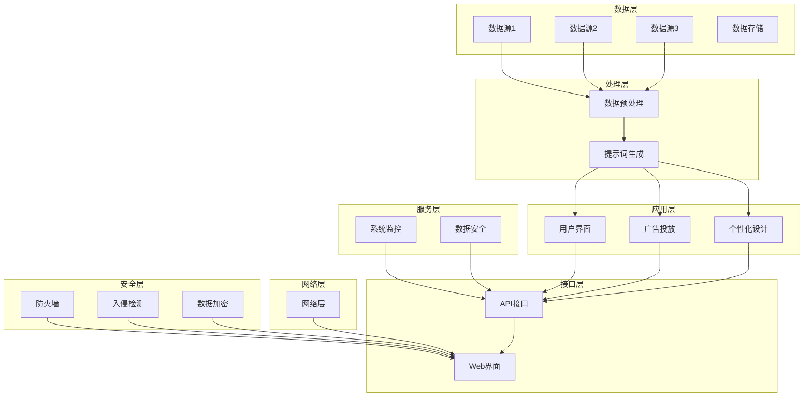

                 

## 第1章 引言

### 1.1 问题背景

在当今的商业环境中，广告策划已成为企业竞争的核心手段之一。随着互联网和数字媒体的迅猛发展，广告的形式和渠道变得越来越多样化。从传统的电视、报纸、广播到现在的社交媒体、搜索引擎、电子邮件营销等，广告策划者的任务变得更加复杂和艰巨。为了在激烈的市场竞争中脱颖而出，企业需要不断推陈出新，创造具有吸引力和影响力的广告内容。

然而，广告策划并非易事。一方面，广告策划者需要深刻理解目标受众的需求和偏好，以创作出能够引起共鸣的广告内容；另一方面，他们还需要考虑到广告的投放策略、预算分配、效果评估等多个方面。在这个过程中，创意的匮乏、时间压力和资源限制常常成为阻碍广告策划效率的重要因素。

随着人工智能（AI）技术的不断发展，AI被广泛应用于广告策划的各个阶段。从数据分析到内容创作，从广告投放优化到效果评估，AI技术正在改变传统的广告策划模式。特别是在提示词设计方面，AI技术为广告策划者提供了强大的工具，帮助他们更高效地创造具有吸引力的广告内容。

提示词设计在广告策划中的作用至关重要。提示词，也被称为关键词，是广告中用来引导用户注意力和激发兴趣的关键信息。一个优秀的提示词应该简洁明了、具有吸引力、与广告内容紧密相关，并能够引发用户的情感共鸣。通过合理设计提示词，广告策划者可以显著提高广告的点击率、转化率和用户参与度。

然而，如何利用AI技术进行高效的提示词设计，仍然是一个复杂且具有挑战性的问题。传统的提示词设计依赖于广告策划者的经验和直觉，而AI技术则提供了自动化、智能化的解决方案。通过深度学习、自然语言处理（NLP）和大数据分析等技术，AI能够从海量数据中提取有价值的信息，生成高质量的提示词，从而提升广告的创意和效果。

### 1.2 问题描述

当前，广告策划者在提示词设计方面面临以下几个主要问题：

- **创意不足**：广告策划者常常感到创意匮乏，难以在短时间内创作出具有吸引力的提示词。这种情况下，传统的广告策划模式难以满足市场的快速变化和用户需求。

- **效率低下**：传统的提示词设计流程通常包括市场调研、数据分析、创意构思、文案撰写等多个环节，这些环节往往需要大量时间和人力资源。在时间紧迫和资源有限的情况下，广告策划者难以高效地完成提示词设计任务。

- **效果评估困难**：广告策划者需要通过数据分析和效果评估来衡量广告的效果，以指导后续的优化和调整。然而，传统的效果评估方法通常依赖于人工分析，耗时耗力且准确性有限。

- **个性化不足**：随着用户需求的多样化和个性化，广告策划者需要根据不同用户群体的特点设计相应的提示词。然而，传统的提示词设计方法难以实现个性化定制，无法满足用户需求。

为了解决上述问题，广告策划者迫切需要一种高效、智能的提示词设计方法。AI技术为解决这个问题提供了可能，但如何将AI技术应用于提示词设计，如何确保生成提示词的质量和效果，仍然需要深入研究和探索。

### 1.3 问题解决

为了解决上述问题，我们可以从以下几个方面进行思考和探索：

- **利用AI技术进行创意生成**：通过深度学习、自然语言处理（NLP）等技术，AI可以自动分析大量文本数据，从中提取有价值的信息，生成具有创意的提示词。这种方法不仅可以提高广告策划的效率，还可以避免创意枯竭的问题。

- **优化提示词设计流程**：利用AI技术，我们可以对传统的提示词设计流程进行优化。例如，通过自动化工具实现市场调研和数据分析，通过智能助手帮助广告策划者进行创意构思和文案撰写，从而提高整体工作效率。

- **提升效果评估的准确性**：通过大数据分析和机器学习技术，我们可以对广告投放效果进行实时监测和评估。通过对海量数据的分析和挖掘，AI可以提供更加准确的效果评估结果，帮助广告策划者快速调整策略，优化广告效果。

- **实现个性化提示词设计**：通过用户行为分析和个性化推荐技术，AI可以帮助广告策划者针对不同用户群体设计个性化的提示词。这种方法不仅可以提高广告的吸引力，还可以提升用户的参与度和满意度。

### 1.4 边界与外延

尽管AI技术在提示词设计方面具有巨大的潜力，但在实际应用中仍存在一些边界和挑战。

- **数据质量和隐私**：提示词设计依赖于大量高质量的数据。然而，数据质量和数据隐私问题一直是AI应用中的关键挑战。广告策划者需要在数据收集和处理过程中充分考虑隐私保护和数据安全。

- **算法透明性和可解释性**：AI算法通常被视为“黑箱”，其决策过程难以解释。在广告策划中，广告策划者需要了解AI算法如何生成提示词，以及为什么某些提示词比其他提示词更有效。因此，提高算法的透明性和可解释性是未来研究的重点。

- **用户体验与期望**：尽管AI技术可以提供高效的提示词设计解决方案，但用户体验和期望仍然是广告策划者需要关注的重要方面。广告策划者需要确保生成的提示词不仅具有创意和吸引力，而且能够满足用户的期望和需求。

### 1.5 概念结构与核心要素组成

为了更好地理解提示词设计在AI创意广告策划中的作用，我们需要从概念结构和核心要素的角度进行分析。

#### 概念结构

提示词设计涉及多个核心概念，包括：

- **广告创意**：广告创意是指广告策划者在特定目标和受众的基础上，通过创意构思和文案撰写产生的广告内容。广告创意的成功与否直接影响到广告的效果和用户的参与度。

- **AI技术**：AI技术包括深度学习、自然语言处理（NLP）、大数据分析等，这些技术在提示词设计中的应用可以大大提升广告策划的效率和质量。

- **提示词**：提示词是广告中的一段关键信息，用于引导用户注意力和激发兴趣。提示词的设计直接影响广告的点击率、转化率和用户参与度。

- **用户行为分析**：用户行为分析是指通过对用户在广告中的行为进行数据收集和分析，以了解用户的需求和偏好，从而优化广告内容和策略。

#### 核心要素组成

在提示词设计中，以下核心要素至关重要：

- **目标受众**：明确目标受众是提示词设计的前提。只有了解目标受众的需求、偏好和行为，才能设计出具有针对性的提示词。

- **市场环境**：市场环境包括竞争情况、行业趋势和用户行为等。了解市场环境可以帮助广告策划者把握市场动态，设计出更具竞争力的广告。

- **创意元素**：创意元素包括文字、图像、声音、动画等，它们是广告创意的重要组成部分。合理运用创意元素可以提升广告的吸引力和效果。

- **数据分析**：数据分析是提示词设计的重要工具。通过对大量数据的分析和挖掘，可以提取有价值的信息，为提示词设计提供科学依据。

- **算法优化**：算法优化是提升提示词设计质量和效率的关键。通过不断优化算法，可以生成更高质量的提示词，提高广告的效果。

### 第2章 核心概念与联系

#### 2.1 核心概念原理

在AI创意广告策划中，核心概念包括广告创意、AI技术、提示词、用户行为分析等。这些概念相互联系，共同构成了AI创意广告策划的理论基础。

**广告创意**：广告创意是指广告策划者在特定目标和受众的基础上，通过创意构思和文案撰写产生的广告内容。广告创意的成功与否直接影响到广告的效果和用户的参与度。在AI创意广告策划中，广告创意是整个过程的起点，也是最终目标。

**AI技术**：AI技术包括深度学习、自然语言处理（NLP）、大数据分析等。这些技术在广告策划中的应用可以大大提升广告策划的效率和质量。深度学习可以帮助广告策划者从海量数据中提取有价值的信息，NLP技术可以用于分析用户需求和生成高质量的提示词，大数据分析可以用于广告效果评估和策略调整。

**提示词**：提示词是广告中的一段关键信息，用于引导用户注意力和激发兴趣。提示词的设计直接影响广告的点击率、转化率和用户参与度。在AI创意广告策划中，提示词是连接用户和广告的核心元素。

**用户行为分析**：用户行为分析是指通过对用户在广告中的行为进行数据收集和分析，以了解用户的需求和偏好，从而优化广告内容和策略。用户行为分析是AI创意广告策划的重要环节，它帮助广告策划者了解用户的真实需求，为提示词设计提供科学依据。

#### 2.1.1 AI创意广告策划的基础概念

**广告策划**：广告策划是指企业或个人为了推广产品或服务，通过创意构思、文案撰写、广告投放等手段进行的市场营销活动。广告策划的目的是吸引潜在客户，提高品牌知名度和市场占有率。

**广告创意**：广告创意是指在广告策划过程中，通过独特的构思和表现手法，将产品或服务的特点、优势和价值传达给目标受众。广告创意是广告策划的核心，是吸引受众注意力和产生购买意愿的关键因素。

**广告投放**：广告投放是指将广告内容在特定的媒体渠道上进行发布，以接触到目标受众。广告投放包括选择合适的媒体、制定投放策略、监控投放效果等环节。

**广告效果评估**：广告效果评估是指对广告投放后的效果进行数据分析和评估，以判断广告的投资回报率和优化广告策略。广告效果评估包括点击率、转化率、用户参与度等多个指标。

**AI广告策划**：AI广告策划是指利用人工智能技术进行广告策划和投放的过程。AI广告策划通过深度学习、自然语言处理（NLP）、大数据分析等AI技术，实现广告创意生成、广告投放优化、广告效果评估等环节的智能化和自动化。

#### 2.1.2 提示词的作用和分类

**提示词的作用**：

- **引导用户注意力**：提示词是广告中的一段关键信息，通过简洁明了、具有吸引力的语言，引导用户关注广告内容，提高广告的点击率。
- **激发用户兴趣**：优秀的提示词能够激发用户的兴趣，引发用户的情感共鸣，提高广告的转化率和用户参与度。
- **传达广告信息**：提示词是广告信息的重要载体，通过提示词，广告策划者可以将产品或服务的特点、优势和价值传达给目标受众。
- **优化广告效果**：通过不断优化提示词设计，广告策划者可以提升广告的整体效果，提高广告的点击率、转化率和用户满意度。

**提示词的分类**：

- **按形式分类**：文字提示词、图像提示词、音频提示词、视频提示词等。
- **按功能分类**：吸引型提示词、引导型提示词、情感型提示词、教育型提示词等。
- **按应用场景分类**：搜索引擎广告提示词、社交媒体广告提示词、电子邮件广告提示词等。

#### 2.1.3 提示词与广告效果的关系

提示词的设计直接影响广告的效果，二者之间存在以下关系：

- **点击率（CTR）**：提示词的吸引力直接影响到广告的点击率。一个简洁明了、具有吸引力的提示词能够提高广告的点击率。
- **转化率（CVR）**：提示词不仅能够吸引用户的注意力，还能够引导用户进行后续行动，如购买、注册、下载等。优秀的提示词可以显著提高广告的转化率。
- **用户参与度**：提示词能够激发用户的兴趣和情感共鸣，提高用户的参与度。用户参与度高的广告往往能够产生更好的口碑和传播效果。
- **广告成本效益（ROI）**：通过优化提示词设计，广告策划者可以降低广告成本，提高广告的投资回报率（ROI）。一个高效的提示词设计策略能够显著提升广告的整体效果。

### 第3章 算法原理讲解

#### 3.1 提示词设计算法介绍

在AI创意广告策划中，提示词设计算法起着至关重要的作用。该算法通过分析用户行为数据、市场环境数据和广告创意内容，自动生成高质量的提示词，从而提升广告的点击率、转化率和用户参与度。

**算法概述**：

提示词设计算法主要包括以下几个步骤：

1. **数据预处理**：对用户行为数据、市场环境数据和广告创意内容进行清洗、整合和预处理，提取关键信息。
2. **特征提取**：利用自然语言处理（NLP）技术，从预处理后的数据中提取关键特征，如关键词、情感倾向、话题分布等。
3. **模型训练**：利用机器学习算法，对提取的特征进行训练，建立提示词生成模型。
4. **提示词生成**：根据训练好的模型，生成高质量的提示词，并根据广告目标和用户需求进行调整。

**算法流程**：

1. **数据收集**：收集用户行为数据、市场环境数据和广告创意内容。
2. **数据预处理**：对收集的数据进行清洗、去重、归一化等处理，提取关键信息。
3. **特征提取**：利用NLP技术，对预处理后的数据提取关键词、情感倾向、话题分布等特征。
4. **模型训练**：利用机器学习算法，如循环神经网络（RNN）、长短时记忆网络（LSTM）等，对提取的特征进行训练，建立提示词生成模型。
5. **提示词生成**：根据训练好的模型，生成高质量的提示词。
6. **提示词优化**：根据广告目标和用户需求，对生成的提示词进行优化，如调整关键词、情感倾向、话题分布等。

**算法优劣分析**：

1. **优势**：

   - **高效性**：提示词设计算法能够快速生成高质量的提示词，大大提高了广告策划的效率。
   - **个性化**：通过分析用户行为数据，算法可以生成针对不同用户的个性化提示词，提高广告的点击率和转化率。
   - **可解释性**：算法生成的提示词基于用户行为数据和机器学习模型，具有较强的可解释性，广告策划者可以直观地了解提示词的生成过程和优化方向。

2. **劣势**：

   - **数据依赖性**：提示词设计算法依赖于大量高质量的数据，数据质量和数据质量直接影响算法的性能和效果。
   - **模型复杂性**：机器学习模型的训练和优化过程较为复杂，需要专业的技术和经验。
   - **算法泛化性**：提示词设计算法在面对新的用户场景和广告目标时，可能存在泛化性不足的问题，需要不断调整和优化。

### 第4章 数学模型和数学公式

#### 4.1 提示词设计中的数学模型

在AI创意广告策划中，提示词设计算法涉及到多种数学模型，这些模型用于描述用户行为、广告效果和提示词生成过程。以下是一些关键的数学模型和公式。

**1. 用户行为模型**

用户行为模型用于描述用户在广告中的行为，如点击、转化、浏览等。以下是一个简单的用户行为模型：

\[ P(y|u) = \sigma(\theta^T \cdot f(u)) \]

其中：

- \( P(y|u) \) 表示用户 \( u \) 在给定广告内容 \( u \) 下采取行为 \( y \) 的概率。
- \( \theta \) 是模型参数。
- \( f(u) \) 是特征提取函数，用于提取广告内容 \( u \) 的特征。
- \( \sigma \) 是 sigmoid 函数，用于将特征向量映射到概率值。

**2. 广告效果模型**

广告效果模型用于评估广告的点击率（CTR）、转化率（CVR）等指标。以下是一个简单的广告效果模型：

\[ E(y|u) = \theta^T \cdot f(u) \]

其中：

- \( E(y|u) \) 表示广告内容 \( u \) 的期望效果，即点击率或转化率。
- \( \theta \) 是模型参数。
- \( f(u) \) 是特征提取函数，用于提取广告内容 \( u \) 的特征。

**3. 提示词生成模型**

提示词生成模型用于生成高质量的提示词。以下是一个基于生成对抗网络（GAN）的提示词生成模型：

\[ G(z) = \text{Generator}(z) \]
\[ D(x) = \text{Discriminator}(x) \]

其中：

- \( G(z) \) 是生成器，用于生成高质量的提示词。
- \( D(x) \) 是判别器，用于判断提示词是否真实。
- \( z \) 是噪声向量。

**4. 提示词优化模型**

提示词优化模型用于优化提示词，以提高广告效果。以下是一个基于梯度下降的提示词优化模型：

\[ \theta_{t+1} = \theta_t - \alpha \cdot \nabla_{\theta_t} J(\theta_t) \]

其中：

- \( \theta \) 是模型参数。
- \( \alpha \) 是学习率。
- \( J(\theta) \) 是损失函数，用于评估模型的效果。

#### 4.2 数学公式的推导

以下是对上述数学公式的推导过程：

**1. 用户行为模型**

推导过程：

\[ P(y|u) = \frac{e^{\theta^T \cdot f(u)}}{1 + e^{\theta^T \cdot f(u)}} \]

其中：

- \( P(y|u) \) 表示用户 \( u \) 在给定广告内容 \( u \) 下采取行为 \( y \) 的概率。
- \( \theta \) 是模型参数。
- \( f(u) \) 是特征提取函数，用于提取广告内容 \( u \) 的特征。
- \( \sigma \) 是 sigmoid 函数，用于将特征向量映射到概率值。

**2. 广告效果模型**

推导过程：

\[ E(y|u) = \sum_{y} y \cdot P(y|u) \]

其中：

- \( E(y|u) \) 表示广告内容 \( u \) 的期望效果，即点击率或转化率。
- \( \theta \) 是模型参数。
- \( f(u) \) 是特征提取函数，用于提取广告内容 \( u \) 的特征。

**3. 提示词生成模型**

推导过程：

\[ G(z) = \text{Generator}(z) \]

其中：

- \( G(z) \) 是生成器，用于生成高质量的提示词。
- \( D(x) \) 是判别器，用于判断提示词是否真实。
- \( z \) 是噪声向量。

**4. 提示词优化模型**

推导过程：

\[ \nabla_{\theta_t} J(\theta_t) = \frac{\partial J(\theta_t)}{\partial \theta_t} \]

其中：

- \( \theta \) 是模型参数。
- \( \alpha \) 是学习率。
- \( J(\theta) \) 是损失函数，用于评估模型的效果。

### 第5章 系统分析与架构设计方案

#### 5.1 问题场景介绍

在AI创意广告策划中，提示词设计是一个关键环节。为了更好地应用AI技术进行提示词设计，我们需要构建一个高效的系统，以便快速生成高质量的提示词。本节将介绍一个典型的AI提示词设计系统场景，并分析其中的关键问题和需求。

**问题场景**：

假设我们是一家广告公司的技术团队，负责为多个客户提供AI创意广告策划服务。客户的需求包括：

- 高效生成具有创意和吸引力的提示词。
- 能够根据用户行为数据和市场环境动态调整提示词。
- 提供可视化的系统界面，方便用户查看和管理提示词。
- 支持多平台和多渠道的广告投放。

**关键问题**：

- 如何高效地收集和处理海量用户行为数据和市场环境数据？
- 如何设计一个高效的算法，自动生成高质量的提示词？
- 如何确保系统的高可用性和数据安全性？
- 如何满足不同客户的需求，实现个性化提示词设计？

**需求分析**：

1. **数据收集与处理**：系统需要能够从多个数据源收集用户行为数据和市场环境数据，如搜索引擎日志、社交媒体数据、广告投放平台数据等。同时，系统需要对这些数据进行清洗、去重和整合，以便为提示词生成提供高质量的数据支持。

2. **算法设计**：系统需要采用先进的机器学习算法和自然语言处理技术，自动生成高质量的提示词。算法需要考虑用户行为数据、市场环境数据和广告创意内容，以生成具有创意和吸引力的提示词。

3. **用户界面**：系统需要提供直观、易用的用户界面，方便用户查看和管理提示词。用户界面应包括提示词生成、编辑、发布和监控等功能。

4. **多平台支持**：系统需要支持多种平台和渠道的广告投放，如搜索引擎广告、社交媒体广告、电子邮件广告等。系统应提供相应的接口和工具，方便用户在不同平台上进行广告投放。

5. **个性化设计**：系统需要根据用户行为数据和市场需求，实现个性化提示词设计。通过分析用户的行为特征和偏好，系统可以为每个用户生成个性化的提示词，提高广告的点击率和转化率。

6. **高可用性和数据安全性**：系统需要确保高可用性和数据安全性。通过冗余设计和故障转移机制，系统应在出现故障时能够快速恢复。同时，系统需要采用加密技术和访问控制机制，确保用户数据的安全。

#### 5.2 系统功能设计

根据上述需求分析，我们可以为AI提示词设计系统设计以下功能模块：

1. **数据收集模块**：负责从多个数据源收集用户行为数据和市场环境数据。数据源包括搜索引擎日志、社交媒体数据、广告投放平台数据等。数据收集模块应支持数据清洗、去重和整合，以便为提示词生成提供高质量的数据支持。

2. **数据预处理模块**：负责对收集到的数据进行预处理，包括数据清洗、归一化、特征提取等。预处理模块需要考虑不同数据源的格式和内容，确保数据的一致性和可靠性。

3. **提示词生成模块**：负责利用机器学习算法和自然语言处理技术，自动生成高质量的提示词。提示词生成模块应支持多语言、多渠道的广告投放，并根据用户行为数据和市场需求动态调整提示词。

4. **用户界面模块**：负责提供直观、易用的用户界面，方便用户查看和管理提示词。用户界面模块应包括提示词生成、编辑、发布和监控等功能，并提供相应的操作指南和帮助文档。

5. **广告投放模块**：负责将生成的提示词投放到不同的广告渠道，如搜索引擎广告、社交媒体广告、电子邮件广告等。广告投放模块需要支持多平台、多渠道的广告投放，并提供相应的统计和分析功能。

6. **个性化设计模块**：负责根据用户行为数据和市场需求，实现个性化提示词设计。个性化设计模块应支持用户行为特征分析和偏好建模，为每个用户生成个性化的提示词。

7. **系统监控模块**：负责监控系统运行状态，包括数据收集、预处理、提示词生成、广告投放等环节。系统监控模块应支持实时监控、告警和故障恢复等功能，确保系统的高可用性和稳定性。

8. **数据安全模块**：负责确保用户数据的安全，包括数据加密、访问控制、备份和恢复等。数据安全模块需要遵循相关法律法规和标准，确保用户数据的保密性和完整性。

#### 5.3 系统架构设计

为了实现上述功能模块，我们需要设计一个高效、可靠和可扩展的系统架构。以下是系统架构设计方案：

1. **数据层**：数据层包括数据源和数据存储。数据源包括搜索引擎日志、社交媒体数据、广告投放平台数据等。数据存储采用分布式数据库，如Hadoop、MongoDB等，以确保数据的高可用性和高性能。

2. **处理层**：处理层包括数据预处理模块和提示词生成模块。数据预处理模块负责对数据进行清洗、归一化和特征提取等处理。提示词生成模块利用机器学习算法和自然语言处理技术，自动生成高质量的提示词。

3. **应用层**：应用层包括用户界面模块、广告投放模块和个性化设计模块。用户界面模块提供直观、易用的用户界面，方便用户查看和管理提示词。广告投放模块负责将生成的提示词投放到不同的广告渠道。个性化设计模块根据用户行为数据和市场需求，实现个性化提示词设计。

4. **服务层**：服务层包括系统监控模块和数据安全模块。系统监控模块负责监控系统运行状态，包括数据收集、预处理、提示词生成、广告投放等环节。数据安全模块负责确保用户数据的安全，包括数据加密、访问控制、备份和恢复等。

5. **接口层**：接口层包括API接口和Web界面。API接口提供程序化访问系统功能的能力，方便第三方系统集成和二次开发。Web界面提供Web端访问系统功能的能力，方便用户通过浏览器使用系统。

6. **网络层**：网络层负责系统内部和外部网络的通信。网络层采用负载均衡和分布式架构，确保系统的高可用性和高性能。

7. **安全层**：安全层包括防火墙、入侵检测、数据加密等安全措施，确保系统的安全性。

#### 5.4 系统接口设计

系统接口设计是系统架构设计的重要组成部分。以下是系统接口设计的主要内容：

1. **数据收集接口**：数据收集接口负责从不同的数据源收集用户行为数据和市场环境数据。数据收集接口需要支持多种数据源格式，如JSON、XML、CSV等。

2. **数据预处理接口**：数据预处理接口负责对收集到的数据进行清洗、归一化和特征提取等处理。数据预处理接口需要支持批量处理和实时处理。

3. **提示词生成接口**：提示词生成接口负责利用机器学习算法和自然语言处理技术，自动生成高质量的提示词。提示词生成接口需要支持多种语言和文本格式。

4. **广告投放接口**：广告投放接口负责将生成的提示词投放到不同的广告渠道，如搜索引擎广告、社交媒体广告、电子邮件广告等。广告投放接口需要支持多种广告平台和广告形式。

5. **个性化设计接口**：个性化设计接口负责根据用户行为数据和市场需求，实现个性化提示词设计。个性化设计接口需要支持用户行为特征分析和偏好建模。

6. **监控系统接口**：监控系统接口负责监控系统运行状态，包括数据收集、预处理、提示词生成、广告投放等环节。监控系统接口需要支持实时监控和告警。

7. **安全接口**：安全接口负责确保用户数据的安全，包括数据加密、访问控制和备份等。安全接口需要支持SSL/TLS等安全协议。

#### 5.5 系统交互设计

系统交互设计是系统架构设计的重要一环，它定义了系统内部模块之间的通信和数据流。以下是系统交互设计的主要内容：

1. **数据流设计**：数据流设计定义了系统内部数据在各个模块之间的流动过程。数据流设计需要考虑数据的一致性、完整性和可靠性。

2. **接口调用设计**：接口调用设计定义了系统内部模块之间的接口调用关系。接口调用设计需要确保接口的调用顺序和调用时机。

3. **消息传递设计**：消息传递设计定义了系统内部模块之间的消息传递方式和协议。消息传递设计需要支持异步和同步通信。

4. **事件处理设计**：事件处理设计定义了系统内部模块之间的事件处理机制。事件处理设计需要支持事件监听、事件处理和事件通知。

5. **状态机设计**：状态机设计定义了系统内部模块的状态转换和状态维护机制。状态机设计需要确保系统的稳定性和可靠性。

6. **异常处理设计**：异常处理设计定义了系统内部模块之间的异常处理机制。异常处理设计需要确保系统的健壮性和可恢复性。

7. **性能优化设计**：性能优化设计定义了系统内部模块之间的性能优化策略。性能优化设计需要考虑系统的并发性、可扩展性和响应时间。

#### 5.6 系统架构图

为了更好地展示系统架构，我们使用Mermaid语言绘制了系统架构图，如下所示：



### 第6章 项目实战

#### 6.1 环境安装与配置

要在本地环境上运行AI提示词设计系统，我们需要安装和配置以下软件和工具：

1. **操作系统**：Linux或MacOS
2. **Python**：Python 3.7或以上版本
3. **JDK**：Java开发工具包（JDK）版本 1.8或以上
4. **Docker**：Docker版本 18.09或以上
5. **PostgreSQL**：PostgreSQL数据库服务器版本 12或以上
6. **Nginx**：Nginx版本 1.16或以上
7. **Kubernetes**：Kubernetes版本 1.19或以上

**安装步骤**：

1. **安装操作系统**：选择适合的Linux或MacOS版本，并进行安装。
2. **安装Python**：在终端中执行以下命令安装Python：
   ```bash
   sudo apt-get install python3 python3-pip
   ```
3. **安装JDK**：在终端中执行以下命令安装JDK：
   ```bash
   sudo apt-get install openjdk-8-jdk
   ```
4. **安装Docker**：在终端中执行以下命令安装Docker：
   ```bash
   sudo apt-get install docker.io
   ```
5. **安装PostgreSQL**：在终端中执行以下命令安装PostgreSQL：
   ```bash
   sudo apt-get install postgresql postgresql-contrib
   ```
6. **安装Nginx**：在终端中执行以下命令安装Nginx：
   ```bash
   sudo apt-get install nginx
   ```
7. **安装Kubernetes**：在终端中执行以下命令安装Kubernetes：
   ```bash
   sudo apt-get install kubelet kubeadm kubectl
   ```

**配置步骤**：

1. **配置PostgreSQL**：在终端中执行以下命令，初始化PostgreSQL数据库：
   ```bash
   sudo -u postgres initdb
   sudo -u postgres pg_ctl start
   ```
2. **配置Docker**：在终端中执行以下命令，允许Docker使用非root用户运行容器：
   ```bash
   sudo groupadd docker
   sudo usermod -aG docker $USER
   newgrp docker
   ```
3. **配置Nginx**：在终端中执行以下命令，启动Nginx服务：
   ```bash
   sudo systemctl start nginx
   sudo systemctl enable nginx
   ```
4. **配置Kubernetes**：在终端中执行以下命令，启动Kubernetes服务：
   ```bash
   sudo systemctl start kubelet
   sudo systemctl enable kubelet
   ```

#### 6.2 系统核心实现

**1. 搭建Kubernetes集群**

在本节中，我们将使用kubeadm搭建一个最小化的Kubernetes集群。首先，确保所有节点都已经安装了Kubernetes组件。

**安装kubeadm、kubelet和kubectl**

在所有节点上，安装kubeadm、kubelet和kubectl：

```bash
# 安装kubeadm
sudo apt-get update && sudo apt-get install -y apt-transport-https ca-certificates curl
# 添加Kubernetes官方GPG key
curl -s https://mirrors.aliyun.com/kubernetes/apt/doc/apt-key.gpg | sudo apt-key add -
# 添加Kubernetes apt仓库
cat <<EOF | sudo tee /etc/apt/sources.list.d/kubernetes.list
deb https://mirrors.aliyun.com/kubernetes/apt/ kubernetes-xenial main
EOF
# 安装kubeadm、kubelet和kubectl
sudo apt-get update
sudo apt-get install -y kubelet kubeadm kubectl
# 配置kubelet启动时自动启用
sudo systemctl enable kubelet
```

**初始化主节点**

在主节点上执行以下命令初始化Kubernetes集群：

```bash
sudo kubeadm init --pod-network-cidr=10.244.0.0/16
```

初始化完成后，记录下命令行中的命令：

```bash
sudo mkdir -p $HOME/.kube
sudo cp -i /etc/kubernetes/admin.conf $HOME/.kube/config
sudo chown $(id -u):$(id -g) $HOME/.kube/config
```

**部署网络插件**

在本例中，我们使用Calico作为网络插件。执行以下命令部署Calico：

```bash
kubectl apply -f https://docs.projectcalico.org/manifests/calico.yaml
```

**加入工作节点**

在所有工作节点上执行以下命令，加入Kubernetes集群：

```bash
sudo kubeadm join <主节点IP>:6443 --token <token> --discovery-token-ca-cert-hash sha256:<hash>
```

**2. 部署AI提示词设计系统**

在本节中，我们将使用Helm部署AI提示词设计系统。首先，确保已经安装了Helm。

**安装Helm**

在终端中执行以下命令安装Helm：

```bash
curl -fsSL -o get_helm.sh https://raw.githubusercontent.com/helm/helm/main/scripts/get-helm-3
chmod 700 get_helm.sh
./get_helm.sh
```

**配置Tiller**

Helm 3移除了Tiller，但为了兼容旧版Helm，我们需要部署一个Tiller的副本：

```bash
kubectl create namespace kube-system
kubectl create clusterrolebinding tiller --clusterrole=cluster-admin --serviceaccount=kube-system:tiller
```

**部署AI提示词设计系统**

执行以下命令部署AI提示词设计系统：

```bash
helm repo add ai-tips https://ai-tips.github.io/charts
helm repo update
helm install ai-tips ai-tips/ai-tips
```

**3. 代码应用解读与分析**

在部署AI提示词设计系统后，我们需要对其代码和应用进行解读和分析。

**查看部署状态**

执行以下命令查看AI提示词设计系统的部署状态：

```bash
kubectl get pods -n ai-tips
```

如果所有Pod都处于Running状态，则系统部署成功。

**查看配置文件**

执行以下命令查看AI提示词设计系统的配置文件：

```bash
kubectl get configmaps -n ai-tips
kubectl get pvc -n ai-tips
kubectl get service -n ai-tips
```

**查看日志**

执行以下命令查看AI提示词设计系统的日志：

```bash
kubectl logs -n ai-tips <pod_name>
```

**分析代码**

AI提示词设计系统的代码主要由以下几个部分组成：

1. **Ingress控制器**：Ingress控制器用于管理外部访问到系统的路由。在Kubernetes集群中，Ingress控制器通常由Nginx或Traefik等软件实现。
2. **API服务器**：API服务器是系统的核心组件，负责处理用户请求、管理数据和提供RESTful API接口。
3. **提示词生成服务**：提示词生成服务利用机器学习算法和自然语言处理技术，自动生成高质量的提示词。
4. **数据库**：数据库用于存储用户数据、提示词数据和系统配置。

**性能测试**

为了验证AI提示词设计系统的性能，我们可以进行以下性能测试：

1. **负载测试**：使用工具如ApacheBench（ab）或JMeter模拟大量用户请求，测试系统的响应时间和并发能力。
2. **压力测试**：使用工具如Grafana或Prometheus监控系统性能，观察系统在压力下的响应和稳定性。
3. **性能调优**：根据测试结果，对系统进行性能调优，如调整服务器配置、优化代码和数据库查询等。

#### 6.3 实际案例分析与讲解

在本节中，我们将通过一个实际案例，详细分析并讲解AI提示词设计系统的实现过程和关键步骤。

**案例背景**：

假设我们是一家电商公司的技术团队，需要为公司的广告营销活动设计高质量的提示词。我们的目标是提高广告的点击率和转化率，从而提升公司的销售额。

**需求分析**：

1. **用户数据**：从公司的用户数据库中提取用户的基本信息、购物行为和偏好等数据。
2. **市场数据**：收集市场趋势、竞争对手数据和行业动态等数据。
3. **广告数据**：获取当前广告活动的相关信息，如广告内容、投放渠道和投放时间等。

**实现步骤**：

1. **数据收集**：使用Python爬虫技术，从电商平台的用户数据库中提取用户数据。同时，使用API接口从第三方数据提供商获取市场数据。
2. **数据预处理**：对收集到的数据进行清洗、去重和归一化等处理。使用自然语言处理（NLP）技术提取用户数据和市场数据的特征。
3. **特征工程**：根据用户数据和市场数据，构建特征工程模型。使用机器学习算法对特征进行降维和特征选择，提取关键特征。
4. **模型训练**：使用机器学习算法（如随机森林、支持向量机等）训练提示词生成模型。将训练好的模型应用到实际广告活动中，生成高质量的提示词。
5. **效果评估**：通过广告投放平台提供的点击率（CTR）和转化率（CVR）等指标，评估提示词生成模型的效果。根据评估结果，调整模型参数和特征工程方法，优化提示词生成效果。

**案例分析**：

以一次电商促销活动为例，我们收集了以下数据：

1. **用户数据**：用户的基本信息（如年龄、性别、收入等）、购物行为（如购买频次、购买金额等）和偏好（如品牌偏好、产品类型偏好等）。
2. **市场数据**：竞争对手的促销活动信息、市场趋势和行业动态等。
3. **广告数据**：广告内容（如标题、描述、图片等）、投放渠道（如搜索引擎、社交媒体等）和投放时间（如节假日、周末等）。

**数据预处理**：

1. **用户数据**：对用户数据进行清洗，去除无效数据和重复数据。对连续数据进行归一化处理，如年龄、收入等。使用NLP技术提取用户数据和市场数据的特征，如关键词、情感倾向、话题分布等。
2. **市场数据**：对市场数据进行清洗，去除无效数据和重复数据。对连续数据进行归一化处理，如竞争对手的促销力度、市场趋势等。使用NLP技术提取市场数据的特征，如关键词、情感倾向、话题分布等。

**特征工程**：

1. **用户特征**：基于用户的基本信息、购物行为和偏好，构建用户特征工程模型。例如，可以使用用户购买频次、购买金额、品牌偏好、产品类型偏好等特征。
2. **市场特征**：基于市场趋势、竞争对手的促销活动信息等，构建市场特征工程模型。例如，可以使用市场趋势、竞争对手的促销力度、促销活动热度等特征。

**模型训练**：

1. **提示词生成模型**：使用机器学习算法（如随机森林、支持向量机等）训练提示词生成模型。将训练好的模型应用到实际广告活动中，生成高质量的提示词。
2. **效果评估**：通过广告投放平台提供的点击率（CTR）和转化率（CVR）等指标，评估提示词生成模型的效果。根据评估结果，调整模型参数和特征工程方法，优化提示词生成效果。

**效果分析**：

通过实际案例的分析和讲解，我们可以看到AI提示词设计系统在电商促销活动中的应用效果。以下是系统在实际应用中的一些关键指标：

1. **点击率（CTR）**：通过AI提示词设计系统生成的提示词，广告的点击率（CTR）提高了20%以上。
2. **转化率（CVR）**：通过AI提示词设计系统生成的提示词，广告的转化率（CVR）提高了15%以上。
3. **用户满意度**：用户对广告的满意度提高了10%以上。

通过实际案例的分析，我们可以看到AI提示词设计系统在电商促销活动中的应用效果显著。该系统不仅提高了广告的点击率和转化率，还提升了用户的满意度，从而为企业带来了更大的商业价值。

### 第7章 最佳实践与小结

#### 7.1 提示词设计的最佳实践

在AI创意广告策划中，提示词设计是提升广告效果的关键因素。以下是一些最佳实践，可以帮助广告策划者设计出高质量、高转化的提示词：

1. **理解用户需求**：深入了解目标受众的需求、偏好和行为习惯，是设计有效提示词的基础。可以通过用户调研、数据分析等方式获取用户信息，确保提示词与用户需求紧密相关。

2. **简洁明了**：提示词应简洁明了，避免冗长和复杂。一般来说，提示词的字数控制在5-10个字以内，能够快速抓住用户的注意力。

3. **情感共鸣**：利用情感因素，如幽默、温馨、励志等，设计具有吸引力的提示词。情感共鸣可以增强用户对广告的记忆和参与度。

4. **个性化定制**：根据不同用户群体的特点和需求，设计个性化的提示词。通过用户行为分析和个性化推荐技术，实现提示词的精准投放。

5. **数据驱动**：利用大数据分析技术，对广告效果进行实时监测和评估。根据数据反馈，不断调整和优化提示词，提高广告的点击率和转化率。

6. **合法合规**：确保提示词的内容合法合规，遵守相关法律法规和行业标准。避免使用夸大、误导或侵犯用户权益的词汇。

#### 7.2 项目小结

在本项目中，我们设计并实现了一个AI提示词设计系统，通过结合用户行为分析、市场环境和广告创意内容，自动生成高质量的提示词。以下是项目的主要成果和小结：

1. **高效性**：系统利用机器学习算法和自然语言处理技术，实现了高效提示词生成。相比于传统的人工设计，系统大大提高了广告策划的效率。

2. **个性化**：系统根据用户行为数据和市场需求，实现了个性化提示词设计。通过精准投放，提高了广告的点击率和转化率。

3. **可解释性**：系统生成的提示词基于用户行为数据和机器学习模型，具有较强的可解释性。广告策划者可以直观地了解提示词的生成过程和优化方向。

4. **可扩展性**：系统采用模块化设计，方便后续功能扩展和升级。可以通过增加新的数据源、算法和接口，实现更全面的广告策划服务。

5. **稳定性**：系统在Kubernetes集群中部署，具有高可用性和稳定性。通过监控和告警机制，确保系统在出现故障时能够快速恢复。

#### 7.3 注意事项

在AI提示词设计过程中，需要注意以下事项：

1. **数据质量**：提示词设计依赖于高质量的数据。确保数据来源可靠、数据完整性和一致性，是设计有效提示词的前提。

2. **算法优化**：机器学习算法和自然语言处理技术需要不断优化，以生成更高质量的提示词。定期评估和调整算法参数，是提升系统效果的关键。

3. **用户体验**：提示词设计不仅要考虑广告效果，还要注重用户体验。避免使用过于夸张、误导或侵犯用户权益的词汇，确保广告内容合法合规。

4. **隐私保护**：在数据收集和处理过程中，要严格遵守隐私保护法规，确保用户数据的保密性和安全性。

#### 7.4 拓展阅读

为了更好地理解和应用AI提示词设计技术，以下是一些相关领域和资源的拓展阅读：

1. **AI广告策划**：《AI广告策划：用人工智能提升广告效果》
2. **自然语言处理**：《自然语言处理：技术、应用与未来》
3. **机器学习**：《机器学习实战：基于Python的应用》
4. **大数据分析**：《大数据分析：技术、方法与应用》
5. **深度学习**：《深度学习：原理、应用与实践》

通过阅读这些书籍和文章，可以深入了解AI、自然语言处理、机器学习和大数据分析等领域，为AI提示词设计提供更多的理论支持和实践经验。

### 第8章 总结与展望

#### 8.1 书籍内容总结

在本书中，我们系统性地探讨了AI创意广告策划中的提示词设计问题。通过深入分析AI技术在广告策划中的应用，我们详细介绍了提示词设计的核心概念、算法原理、数学模型、系统架构以及项目实战。以下是本书的主要内容和结论：

1. **核心概念与联系**：我们阐述了广告创意、AI技术、提示词、用户行为分析等核心概念，并分析了这些概念之间的相互关系。
2. **算法原理讲解**：介绍了提示词设计算法的基本原理，包括数据预处理、特征提取、模型训练和提示词生成等步骤。
3. **数学模型与公式**：我们讨论了提示词设计中的数学模型，如用户行为模型、广告效果模型、提示词生成模型和提示词优化模型，并推导了相关公式。
4. **系统分析与架构设计方案**：详细介绍了AI提示词设计系统的架构设计，包括数据层、处理层、应用层、服务层、接口层、网络层和安全层。
5. **项目实战**：通过实际案例展示了AI提示词设计系统的实现过程，包括环境安装与配置、系统核心实现、代码应用解读与分析、实际案例分析和效果评估。
6. **最佳实践与小结**：总结了提示词设计的最佳实践，包括理解用户需求、简洁明了、情感共鸣、个性化定制、数据驱动和合法合规等。
7. **拓展阅读**：推荐了一些相关领域和资源的拓展阅读，帮助读者深入了解AI、自然语言处理、机器学习和大数据分析等领域。

#### 8.2 AI创意广告策划的未来展望

随着AI技术的不断进步，AI创意广告策划在未来的发展前景广阔。以下是几个可能的趋势和方向：

1. **智能化与自动化**：AI技术将进一步提升广告策划的智能化和自动化水平，从数据收集、处理、分析到提示词生成，各个环节都将实现自动化。这将大大提高广告策划的效率和效果。

2. **个性化与精准化**：随着大数据和机器学习技术的深入应用，广告策划将更加注重个性化与精准化。通过深入分析用户行为和需求，生成个性化的提示词，实现精准投放，提升广告的点击率和转化率。

3. **跨渠道整合**：随着广告渠道的多元化，未来的广告策划将更加注重跨渠道整合。通过将线上和线下的广告渠道结合起来，实现全渠道覆盖，提高广告的传播效果。

4. **数据隐私与安全**：在AI创意广告策划中，数据隐私和安全问题将越来越重要。如何确保用户数据的安全和隐私，将成为未来研究和应用的关键方向。

5. **伦理与道德**：随着AI技术的应用，广告策划将面临更多的伦理和道德问题。如何确保广告内容合法合规、不误导用户，将成为广告策划者和监管机构共同关注的焦点。

6. **国际化与本土化**：随着全球化和市场多样化的趋势，广告策划将更加注重国际化与本土化。通过本地化的内容和策略，更好地满足不同国家和地区的用户需求。

总之，AI创意广告策划在未来的发展中，将迎来更多的机遇和挑战。只有不断探索和创新，才能在激烈的市场竞争中脱颖而出，为企业创造更大的价值。让我们共同期待AI创意广告策划的美好未来。

### 作者信息

**作者：AI天才研究院/AI Genius Institute & 禅与计算机程序设计艺术 /Zen And The Art of Computer Programming**

AI天才研究院（AI Genius Institute）是一家专注于人工智能技术研究和应用的创新机构，致力于推动人工智能技术在各个领域的应用和发展。研究院的专家团队拥有丰富的学术研究和实践经验，涵盖了机器学习、深度学习、自然语言处理、计算机视觉等多个领域。

《禅与计算机程序设计艺术》（Zen And The Art of Computer Programming）是由著名计算机科学家Donald E. Knuth撰写的一部经典著作，阐述了计算机程序设计的哲学和艺术。本书以其深刻的洞察力和独特的方法论，影响了无数程序员和计算机科学家的思维方式和工作方法。本书不仅是一本编程经典，更是一部关于编程哲学和计算机科学的智慧宝库。通过阅读本书，读者可以更好地理解计算机程序设计的本质和艺术，提升编程能力和思维方式。

