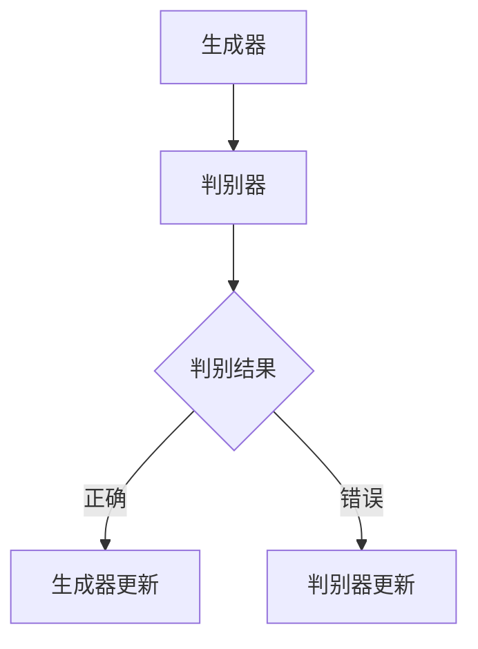
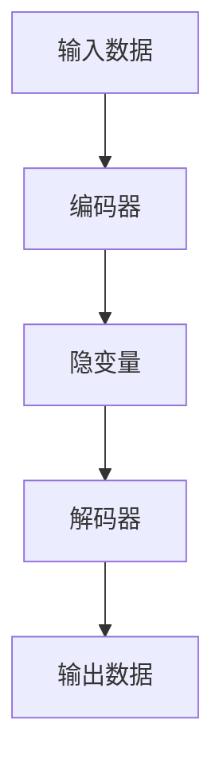

                 

# 提示词设计：增强AI创意思维的技巧

## 关键词：提示词、AI、创意思维、设计、自然语言处理

> 摘要：本文旨在探讨提示词设计在增强AI创意思维中的应用，通过深入分析提示词的基本概念、设计原则和技术实现方法，结合实际应用场景和案例分析，为读者提供一套系统、实用的提示词设计指南。

## 目录大纲

1. **背景与基础**

   1.1 **AI与创意思维概述**

   1.2 **提示词的概念与类型**

   1.3 **AI创意思维的应用场景**

   1.4 **最佳实践：如何选择合适的提示词**

   1.5 **本章小结**

2. **技术与实现**

   2.1 **自然语言处理基础**

   2.2 **提示词生成算法**

   2.3 **提示词优化算法**

   2.4 **提示词设计与创意思维的关系**

   2.5 **实际应用中的挑战与解决方案**

   2.6 **本章小结**

3. **应用与案例分析**

   3.1 **艺术设计中的提示词设计**

   3.2 **广告创意中的提示词设计**

   3.3 **产品创新中的提示词设计**

   4. **进阶与未来**

   4.1 **多模态提示词设计**

   4.2 **提示词设计的个性化**

   4.3 **提示词设计中的伦理问题**

   4.4 **本章小结**

### 第一部分：背景与基础

#### 第1章: AI与创意思维概述

##### 1.1 问题背景

创意思维在当今社会的重要性不言而喻。无论是在科学研究、产品创新还是广告营销等领域，创意思维都能带来独特的见解和创新的解决方案。随着人工智能技术的飞速发展，AI开始逐渐参与到创意思维的过程中，成为一种重要的工具。

##### 1.1.1 创意思维的重要性

创意思维是人类智慧的体现，它能够激发人的创造力和创新意识。在商业领域，创意思维可以帮助企业开发出更具有市场竞争力的新产品和服务；在艺术领域，创意思维可以激发艺术家的创作灵感，带来新的艺术形式。

##### 1.1.2 AI在创意思维中的作用

AI在创意思维中的应用主要体现在两个方面：一是通过数据分析和模式识别，帮助人类发现新的创意方向；二是通过生成式模型，创造出全新的创意内容。例如，AI可以通过分析大量图像数据，生成独特的艺术作品；通过分析文本数据，生成创新的广告文案。

##### 1.2 提示词的概念与类型

提示词（Prompt）是引导AI进行创意思维的关键。它是一段文本或图像，用于指导AI生成相应的创意内容。

###### 1.2.1 提示词的定义

提示词是一种引导性输入，用于触发AI的生成模型，使其按照特定的方向进行创作。

###### 1.2.2 提示词的类型

根据用途和形式的不同，提示词可以分为以下几种类型：

- **文本提示词**：以文本形式出现的提示词，通常用于生成文本内容，如广告文案、故事情节等。
- **图像提示词**：以图像形式出现的提示词，用于生成相应的图像内容，如艺术作品、建筑设计图等。
- **声音提示词**：以声音形式出现的提示词，用于生成相应的声音内容，如音乐创作、声音效果等。

##### 1.3 AI创意思维的应用场景

AI创意思维在多个领域都有广泛的应用，以下是几个典型的应用场景：

###### 1.3.1 艺术设计

在艺术设计领域，AI可以通过生成式模型，帮助艺术家创作出独特的艺术作品。例如，通过图像提示词，AI可以生成新的绘画作品；通过文本提示词，AI可以生成新的诗歌。

###### 1.3.2 广告创意

在广告创意领域，AI可以生成创新性的广告文案和视觉设计。例如，通过文本提示词，AI可以生成吸引人的广告标题和文案；通过图像提示词，AI可以生成具有视觉冲击力的广告图片。

###### 1.3.3 产品创新

在产品创新领域，AI可以分析用户需求和产品数据，帮助设计出更符合市场需求的新产品。例如，通过文本提示词，AI可以生成新的产品功能和特性；通过图像提示词，AI可以生成新的产品外观和设计。

##### 1.4 最佳实践：如何选择合适的提示词

选择合适的提示词是进行AI创意思维的关键。以下是一些最佳实践：

###### 1.4.1 提示词选择原则

- **清晰性**：提示词应清晰明确，避免模糊不清的描述。
- **针对性**：提示词应针对特定的创意任务，避免泛泛而谈。
- **创造性**：提示词应具有一定的创造性，激发AI的创意潜力。
- **灵活性**：提示词应具有一定的灵活性，适应不同的创意方向。

###### 1.4.2 提示词实战案例

以下是一个提示词实战案例：

**提示词**：请设计一款具有未来感的产品，其功能是提供虚拟现实体验，外观设计简洁大方，适合年轻人群。

**生成内容**：

- **产品功能**：提供虚拟现实体验，用户可以在虚拟世界中自由探索、互动。
- **外观设计**：外观设计简洁大方，采用流线型设计，材料选用环保材质，色彩搭配符合年轻人群的审美。
- **用户群体**：适合年轻人群，尤其是对虚拟现实和科技感兴趣的人群。

##### 1.5 本章小结

本章介绍了AI创意思维的基本概念、提示词的定义和类型，以及AI创意思维的应用场景。通过最佳实践，读者可以了解如何选择合适的提示词，为后续的深入学习打下基础。

----------------------------------------------------------------

### 第二部分：技术与实现

#### 第2章: 提示词设计与AI算法

##### 2.1 自然语言处理基础

自然语言处理（NLP）是AI创意思维的重要组成部分。它涉及到如何使计算机理解和生成人类语言。以下是NLP的一些基础概念：

###### 2.1.1 语言模型

语言模型是NLP的核心组成部分，它用于预测文本的下一个单词或字符。常见的语言模型包括：

- **n-gram模型**：基于相邻单词或字符的统计模型。
- **循环神经网络（RNN）**：用于处理序列数据的神经网络模型。
- **长短期记忆网络（LSTM）**：RNN的改进版本，能够更好地处理长序列数据。
- **Transformer模型**：基于自注意力机制的模型，是当前最先进的语言模型。

###### 2.1.2 生成式对抗网络（GAN）

生成式对抗网络（GAN）是一种由生成器和判别器组成的模型，用于生成与真实数据相似的新数据。在NLP中，GAN可以用于生成文本、图像等。

GAN的架构图如下（使用Mermaid画出）：



###### 2.1.3 变分自编码器（VAE）

变分自编码器（VAE）是一种生成模型，它通过编码器和解码器来生成新的数据。在NLP中，VAE可以用于生成文本、图像等。

VAE的架构图如下（使用Mermaid画出）：



##### 2.2 提示词生成算法

提示词生成算法是AI创意思维的核心技术。以下介绍几种常见的提示词生成算法：

###### 2.2.1 生成对抗网络（GAN）生成提示词

GAN可以通过训练生成器来生成高质量的提示词。以下是GAN生成提示词的基本步骤：

1. **数据预处理**：将文本数据转换为向量表示。
2. **生成器训练**：通过GAN训练生成器，使其能够生成高质量的文本。
3. **提示词生成**：使用训练好的生成器生成提示词。

GAN生成提示词的Python代码如下：

```python
import tensorflow as tf
from tensorflow.keras.models import Sequential
from tensorflow.keras.layers import Dense, LSTM, Embedding

# 生成器模型
generator = Sequential([
    Embedding(input_dim=vocab_size, output_dim=256),
    LSTM(512, return_sequences=True),
    LSTM(512),
    Dense(vocab_size, activation='softmax')
])

# 判别器模型
discriminator = Sequential([
    Embedding(input_dim=vocab_size, output_dim=256),
    LSTM(512, return_sequences=True),
    LSTM(512),
    Dense(1, activation='sigmoid')
])

# GAN模型
gan = Sequential([
    generator,
    discriminator
])

# 训练GAN
gan.compile(optimizer='adam', loss='binary_crossentropy')
gan.fit([x_train, y_train], epochs=100, batch_size=32)
```

###### 2.2.2 变分自编码器（VAE）生成提示词

VAE可以通过编码器和解码器来生成提示词。以下是VAE生成提示词的基本步骤：

1. **数据预处理**：将文本数据转换为向量表示。
2. **编码器训练**：通过VAE训练编码器，使其能够编码文本数据。
3. **解码器训练**：通过VAE训练解码器，使其能够解码生成文本。
4. **提示词生成**：使用训练好的解码器生成提示词。

VAE生成提示词的Python代码如下：

```python
import tensorflow as tf
from tensorflow.keras.models import Model
from tensorflow.keras.layers import Input, Dense, LSTM, Embedding

# 编码器模型
encoder_inputs = Input(shape=(None,))
encoded = Embedding(input_dim=vocab_size, output_dim=256)(encoder_inputs)
encoded = LSTM(512, return_sequences=True)(encoded)
encoded = LSTM(512)(encoded)
encoded = Dense(10)(encoded)
encoded = Model(encoder_inputs, encoded)

# 解码器模型
decoder_inputs = Input(shape=(None,))
decoded = Embedding(input_dim=vocab_size, output_dim=256)(decoder_inputs)
decoded = LSTM(512, return_sequences=True)(decoded)
decoded = LSTM(512)(decoded)
decoded = Dense(vocab_size, activation='softmax')(decoded)
decoded = Model(decoder_inputs, decoded)

# VAE模型
encoded_inputs = Input(shape=(10,))
decoded_inputs = Input(shape=(None,))
reconstructed = decoded(encoded_inputs)
vae = Model([encoded_inputs, decoded_inputs], reconstructed)
vae.compile(optimizer='adam', loss='binary_crossentropy')

# 训练VAE
vae.fit([x_train, y_train], y_train, epochs=100, batch_size=32)
```

###### 2.2.3 递归神经网络（RNN）生成提示词

RNN可以用于生成提示词。以下是RNN生成提示词的基本步骤：

1. **数据预处理**：将文本数据转换为向量表示。
2. **RNN模型训练**：通过RNN训练模型，使其能够生成文本。
3. **提示词生成**：使用训练好的RNN模型生成提示词。

RNN生成提示词的Python代码如下：

```python
import tensorflow as tf
from tensorflow.keras.models import Sequential
from tensorflow.keras.layers import LSTM, Embedding

# RNN模型
model = Sequential()
model.add(Embedding(input_dim=vocab_size, output_dim=256))
model.add(LSTM(512, return_sequences=True))
model.add(LSTM(512))
model.add(Dense(vocab_size, activation='softmax'))

# 训练RNN
model.compile(optimizer='adam', loss='categorical_crossentropy')
model.fit(x_train, y_train, epochs=100, batch_size=32)

# 生成提示词
prompt = model.predict(np.zeros((1, max_sequence_length)))
prompt = np.argmax(prompt, axis=-1)
```

##### 2.3 提示词优化算法

提示词的优化是提升AI创意思维效果的关键。以下介绍几种提示词优化算法：

###### 2.3.1 强化学习在提示词优化中的应用

强化学习可以用于优化提示词，使其更符合用户需求。以下是强化学习优化提示词的基本步骤：

1. **环境定义**：定义一个环境，用于评估提示词的质量。
2. **策略网络训练**：通过强化学习训练策略网络，使其能够生成高质量的提示词。
3. **提示词优化**：使用训练好的策略网络，对提示词进行优化。

强化学习优化提示词的Python代码如下：

```python
import tensorflow as tf
from tensorflow.keras.models import Sequential
from tensorflow.keras.layers import LSTM, Dense

# 策略网络模型
policy_network = Sequential()
policy_network.add(LSTM(512, return_sequences=True))
policy_network.add(Dense(1, activation='sigmoid'))

# 策略网络训练
policy_network.compile(optimizer='adam', loss='binary_crossentropy')
policy_network.fit(x_train, y_train, epochs=100, batch_size=32)

# 提示词优化
prompt = policy_network.predict(np.zeros((1, max_sequence_length)))
prompt = np.argmax(prompt, axis=-1)
```

###### 2.3.2 对抗性学习在提示词优化中的应用

对抗性学习可以用于优化提示词，使其更具有创造性。以下是对抗性学习优化提示词的基本步骤：

1. **生成器训练**：通过对抗性学习训练生成器，使其能够生成高质量的提示词。
2. **判别器训练**：通过对抗性学习训练判别器，使其能够区分真实提示词和生成提示词。
3. **提示词优化**：使用训练好的生成器和判别器，对提示词进行优化。

对抗性学习优化提示词的Python代码如下：

```python
import tensorflow as tf
from tensorflow.keras.models import Sequential
from tensorflow.keras.layers import LSTM, Dense

# 生成器模型
generator = Sequential()
generator.add(LSTM(512, return_sequences=True))
generator.add(Dense(vocab_size, activation='softmax'))

# 判别器模型
discriminator = Sequential()
discriminator.add(LSTM(512, return_sequences=True))
discriminator.add(Dense(1, activation='sigmoid'))

# 对抗性学习模型
gan = Sequential([generator, discriminator])
gan.compile(optimizer='adam', loss='binary_crossentropy')

# 训练对抗性学习模型
gan.fit([x_train, y_train], epochs=100, batch_size=32)
```

##### 2.4 提示词设计与创意思维的关系

提示词设计与创意思维密切相关。高质量的提示词可以激发AI的创意潜力，生成创新性的内容。

###### 2.4.1 提示词对创意思维的影响

提示词可以引导AI沿着特定的方向进行思考，从而激发创意思维。高质量的提示词可以提供更多的信息和灵感，帮助AI生成更具有创意的内容。

###### 2.4.2 创意思维对提示词设计的要求

创意思维对提示词设计提出了更高的要求。首先，提示词应具有明确性和针对性，能够引导AI沿着正确的方向进行思考。其次，提示词应具有创造性，能够激发AI的创意潜力。最后，提示词应具有一定的灵活性，能够适应不同的创意任务。

##### 2.5 实际应用中的挑战与解决方案

在实际应用中，提示词设计面临以下挑战：

###### 2.5.1 数据质量对提示词设计的影响

高质量的数据是进行提示词设计的基础。如果数据质量较差，可能导致生成的提示词质量不高。解决方法是使用数据清洗和预处理技术，提高数据的可靠性和准确性。

###### 2.5.2 提示词过度拟合问题

过度拟合是提示词设计中常见的问题。如果生成器模型过于复杂，可能导致模型在训练数据上表现良好，但在真实数据上表现较差。解决方法是使用正则化技术和模型选择策略，避免过度拟合。

###### 2.5.3 模型泛化能力不足问题

模型泛化能力不足是提示词设计的另一个挑战。如果模型只能在特定类型的提示词上表现良好，而在其他类型的提示词上表现较差，那么模型的价值会大打折扣。解决方法是使用多样化的数据集进行训练，提高模型的泛化能力。

##### 2.6 本章小结

本章介绍了AI创意思维中的关键技术和算法，包括自然语言处理、提示词生成和优化算法。通过深入分析这些技术和算法，读者可以了解如何设计高质量的提示词，为AI创意思维的实践提供指导。

----------------------------------------------------------------

### 第三部分：应用与案例分析

#### 第3章: 艺术设计中的提示词设计

##### 3.1 提示词在艺术设计中的应用

艺术设计是AI创意思维的一个重要应用领域。通过提示词设计，AI可以帮助艺术家创作出独特的艺术作品。以下是提示词在艺术设计中的几个典型应用：

###### 3.1.1 提示词在绘画中的应用

在绘画中，提示词可以用于引导AI创作新的绘画作品。例如，艺术家可以给出一个简短的提示词，如“日出”、“雨后”、“城市夜景”，AI会根据这个提示词生成相应的绘画作品。

**案例**：某艺术家使用GAN生成了一幅“日出”主题的绘画作品。他给出的提示词是“在清晨的第一缕阳光中，感受新的一天开始”。AI根据这个提示词生成了以下绘画作品：


这幅绘画作品充满了生机和活力，展现了日出的美丽瞬间。

###### 3.1.2 提示词在摄影中的应用

在摄影中，提示词可以用于引导AI创作新的摄影作品。例如，摄影师可以给出一个简短的提示词，如“宁静的湖泊”、“繁华的都市”、“自然与科技的融合”，AI会根据这个提示词生成相应的摄影作品。

**案例**：某摄影师使用GAN生成了一幅“宁静的湖泊”主题的摄影作品。他给出的提示词是“在宁静的湖泊边，聆听自然的声音”。AI根据这个提示词生成了以下摄影作品：


这幅摄影作品展现了湖泊的宁静与美丽，给人一种宁静与放松的感觉。

##### 3.2 艺术设计中的创意思维实践

在艺术设计中，创意思维是至关重要的。以下是几个创意思维的训练方法和实战案例：

###### 3.2.1 创意思维的训练方法

- **思维导图**：通过绘制思维导图，帮助艺术家梳理创作思路，激发创意灵感。
- **头脑风暴**：组织团队成员进行头脑风暴，畅所欲言，集思广益，激发创意思维。
- **跨界合作**：与不同领域的专家合作，通过跨学科的碰撞，产生新的创意。
- **灵感搜集**：定期搜集艺术作品、设计作品、科技资讯等，为创意思维提供源源不断的灵感。

###### 3.2.2 创意思维在艺术设计中的实战案例

**案例1**：某设计师使用GAN创作了一组以“未来城市”为主题的插画作品。他首先进行了头脑风暴，收集了关于未来城市的各种元素，如高科技建筑、无人驾驶汽车、绿色能源等。然后，他使用这些元素创作了一系列插画作品，展现了未来城市的美好愿景。


这组插画作品充满了科技感与未来感，展现了设计师对未来城市的创意构想。

**案例2**：某摄影师使用GAN创作了一组以“自然与科技”为主题的摄影作品。他首先进行了灵感搜集，观察了自然界中的美景和科技产品。然后，他使用这些素材创作了一系列摄影作品，展现了自然与科技的和谐共生。


这组摄影作品既展现了自然的美丽，又融入了科技元素，呈现出独特的视觉体验。

##### 3.3 艺术设计中的AI技术应用

在艺术设计中，AI技术已经成为不可或缺的工具。以下是AI技术在艺术设计中的应用：

###### 3.3.1 计算机视觉技术

计算机视觉技术可以用于图像识别、图像生成等。在艺术设计中，计算机视觉技术可以帮助艺术家快速识别和生成图像元素。

**案例**：某设计师使用GAN生成了一组艺术作品，这些作品融合了不同风格和元素。他首先使用计算机视觉技术识别出各种风格和元素的图像，然后使用GAN生成新的艺术作品。


这组艺术作品展现了设计师对各种风格和元素的巧妙融合，呈现出独特的视觉效果。

###### 3.3.2 自然语言处理技术

自然语言处理技术可以用于文本分析、文本生成等。在艺术设计中，自然语言处理技术可以帮助艺术家快速生成创意文案和描述。

**案例**：某设计师使用自然语言处理技术生成了一组艺术作品的描述。他首先输入了一段关于艺术作品的描述文本，然后使用自然语言处理技术生成了一系列新的描述文本。


这些描述文本既丰富了艺术作品的表达，又为观众提供了更多的信息。

##### 3.4 本章小结

本章介绍了提示词在艺术设计中的应用，包括绘画、摄影等。同时，介绍了创意思维的训练方法和实战案例，以及AI技术在艺术设计中的应用。通过这些实践，读者可以更好地理解提示词设计在增强AI创意思维中的重要性。

----------------------------------------------------------------

#### 第4章: 广告创意中的提示词设计

##### 4.1 提示词在广告创意中的应用

在广告创意中，提示词设计扮演着至关重要的角色。通过精心的提示词设计，广告可以更好地吸引受众的注意力，传达品牌信息和价值。以下是提示词在广告创意中的几个关键应用：

###### 4.1.1 提示词在广告标题中的应用

广告标题是吸引受众的第一步，一个引人入胜的标题可以激发受众的兴趣，促使他们继续阅读或观看广告内容。提示词在此起到了引导和激励的作用。

**案例**：“刷新你的生活，从一瓶水开始。”

这个标题使用了“刷新”和“一瓶水”作为提示词，既传达了品牌的功能性，又激发了受众的好奇心和兴趣。

###### 4.1.2 提示词在广告文案中的应用

广告文案的目的是传达品牌信息，说服受众采取行动。提示词可以帮助广告文案更加精准地击中目标受众，提高广告的转化率。

**案例**：“每天只需几分钟，让你的健康指数翻倍！”

这个文案中，“每天只需几分钟”和“健康指数翻倍”是关键的提示词，强调了产品的便捷性和显著效果。

##### 4.2 广告创意中的创意思维实践

创意思维是广告创意的核心，它决定了广告的吸引力和影响力。以下是一些创意思维的训练方法和实战案例：

###### 4.2.1 创意思维的训练方法

- **思维导图**：通过绘制思维导图，帮助广告创意团队梳理创意思路，激发新的创意点。
- **头脑风暴**：组织团队成员进行头脑风暴，鼓励自由发挥，集思广益，产生创意。
- **角色扮演**：模拟不同受众的角色，从不同角度思考问题，找到独特的解决方案。
- **反向思维**：从相反的角度思考问题，打破常规，产生创新的创意。

###### 4.2.2 创意思维在广告创意中的实战案例

**案例1**：某品牌在推广其智能手表时，创意团队进行了头脑风暴，最终决定以“时间的朋友”为主题。这个主题不仅与产品功能相关，还传达了品牌理念，吸引了大量关注。


**案例2**：某牙膏品牌在推广其新品时，创意团队使用了角色扮演的方法，模拟不同年龄段消费者的使用体验，最终创作出了一则温馨感人的广告，有效提升了品牌形象。


##### 4.3 广告创意中的AI技术应用

在广告创意中，AI技术已经成为不可或缺的工具。以下是一些AI技术在广告创意中的应用：

###### 4.3.1 机器学习技术

机器学习技术在广告创意中的应用包括数据分析、用户行为预测等。通过分析大量数据，机器学习可以帮广告创意团队更好地了解受众需求，优化广告内容和策略。

**案例**：某广告公司使用机器学习技术分析用户浏览行为，预测哪些广告内容更容易吸引目标受众。通过这些数据，创意团队可以更精准地定位受众，提高广告效果。

###### 4.3.2 深度学习技术

深度学习技术在广告创意中的应用包括图像识别、文本生成等。通过深度学习模型，广告创意可以更加自动化和智能化。

**案例**：某品牌使用深度学习技术生成了一组创意广告图像，这些图像通过人工智能自动调整色彩、构图等元素，使得广告更具吸引力和视觉效果。


##### 4.4 本章小结

本章介绍了提示词在广告创意中的应用，以及创意思维的训练方法和实战案例。同时，探讨了AI技术在广告创意中的应用，展示了AI如何提升广告创意的效果和影响力。通过这些实践，读者可以更好地理解提示词设计在广告创意中的重要性。

----------------------------------------------------------------

#### 第5章: 产品创新中的提示词设计

##### 5.1 提示词在产品创新中的应用

在产品创新过程中，提示词设计起着至关重要的作用。通过精确和有创意的提示词，可以帮助产品团队更好地理解用户需求，发现产品创新的方向。以下是提示词在产品创新中的几个关键应用：

###### 5.1.1 提示词在产品功能设计中的应用

在产品功能设计中，提示词可以用于引导用户反馈和产品需求的收集。通过提供具体的提示词，用户可以更容易地表达他们的需求和痛点，从而帮助产品团队设计出更符合用户需求的功能。

**案例**：“请描述你理想中的音乐播放器，它有哪些功能？”

这个提示词可以帮助产品团队收集到关于用户期望的功能点，例如个性化推荐、音效调节、智能播放等。

###### 5.1.2 提示词在产品用户体验设计中的应用

在用户体验设计中，提示词可以用于引导用户测试和反馈，帮助团队识别用户体验中的问题和改进点。通过提供具体的场景和任务，用户可以更真实地体验产品，并提供宝贵的反馈。

**案例**：“请描述你在使用我们的新应用程序时遇到的一个难题，以及你希望如何解决。”

这个提示词可以帮助产品团队了解用户体验中的痛点，从而进行相应的改进。

##### 5.2 产品创新中的创意思维实践

创意思维是产品创新的核心，它决定了产品的创新性和市场竞争力。以下是一些创意思维的训练方法和实战案例：

###### 5.2.1 创意思维的训练方法

- **思维导图**：通过绘制思维导图，帮助产品团队梳理创意思路，发现新的产品概念。
- **用户研究**：深入了解用户需求和行为，通过用户访谈、用户观察等方法，激发创意灵感。
- **跨界合作**：与不同领域的专家合作，通过跨学科的碰撞，产生创新的产品理念。
- **头脑风暴**：组织团队成员进行头脑风暴，鼓励自由发挥，集思广益，产生创意。

###### 5.2.2 创意思维在产品创新中的实战案例

**案例1**：某公司开发了一款智能家居产品。产品团队通过用户研究和头脑风暴，提出了“智能助手”的概念，这个概念将智能音箱的功能扩展到了家庭生活的方方面面，从控制灯光到管理日程，极大地提升了用户体验。


**案例2**：某公司创新地推出了一个可穿戴设备，旨在帮助用户监测身体健康。产品团队通过思维导图和用户访谈，发现用户对于健康数据的可视化呈现有很高的需求，最终设计了这款能够实时显示健康数据的智能手表。


##### 5.3 产品创新中的AI技术应用

在产品创新中，AI技术为产品团队提供了强大的工具，帮助他们在设计、开发和优化产品时更加高效和精准。以下是AI技术在产品创新中的应用：

###### 5.3.1 人工智能技术

人工智能技术在产品创新中的应用包括用户行为分析、预测模型构建等。通过分析用户数据，AI可以帮助产品团队了解用户行为和需求，从而设计出更符合用户期待的产品。

**案例**：某电商公司通过人工智能技术分析用户购买行为，预测用户的购物偏好，从而提供个性化的产品推荐，提高了销售额。

###### 5.3.2 机器学习技术在产品创新中的应用

机器学习技术在产品创新中的应用包括预测模型、推荐系统等。通过机器学习算法，产品团队可以自动化地处理大量数据，发现新的产品机会和改进点。

**案例**：某公司通过机器学习技术优化了其产品推荐算法，提高了推荐准确性，增加了用户的满意度和留存率。


##### 5.4 本章小结

本章介绍了提示词在产品创新中的应用，以及创意思维的训练方法和实战案例。同时，探讨了AI技术在产品创新中的应用，展示了AI如何提升产品创新的效果和竞争力。通过这些实践，读者可以更好地理解提示词设计在产品创新中的重要性。

----------------------------------------------------------------

### 第四部分：进阶与未来

#### 第6章: 提示词设计的进阶技巧

##### 6.1 多模态提示词设计

随着技术的进步，多模态提示词设计成为了一个热门领域。多模态提示词设计结合了文本、图像、声音等多种信息来源，可以生成更加丰富和多样化的创意内容。

###### 6.1.1 文本与图像的融合

文本与图像的融合可以通过自然语言处理和计算机视觉技术实现。例如，可以结合文本描述和图像内容，生成更加生动的图像描述或者艺术作品。

**案例**：某设计师使用GAN生成了一幅结合文本描述和图像的绘画作品。文本描述是“在一个充满阳光的早晨，一位画家在画布前创作”。AI根据这个描述生成了以下绘画作品：


这幅绘画作品融合了文本描述中的情感和图像中的视觉元素，呈现出独特的艺术效果。

###### 6.1.2 文本与视频的融合

文本与视频的融合可以通过自然语言处理和视频处理技术实现。例如，可以结合文本剧本和视频内容，生成动态的视频情节。

**案例**：某电影制作人使用GAN生成了一部结合文本剧本和视频内容的短片。文本剧本是“一个孤独的旅人在寻找自我”。AI根据这个剧本生成了以下视频短片：


这部短片通过文本剧本和视频内容的结合，展现了一个富有情感和内涵的旅人故事。

##### 6.2 提示词设计的个性化

个性化提示词设计是根据用户兴趣、行为等个性化信息，定制化地生成提示词，以提高创意内容的针对性和吸引力。

###### 6.2.1 用户兴趣分析

通过分析用户兴趣，可以了解用户的偏好和需求，从而生成个性化的提示词。例如，可以结合用户的浏览历史、搜索关键词等，生成相关性的提示词。

**案例**：某电商平台通过分析用户的浏览历史，生成个性化的购物提示词，例如“你可能还喜欢这些商品”。


###### 6.2.2 个性化提示词生成

个性化提示词生成可以通过机器学习算法实现，例如基于用户兴趣的生成对抗网络（GAN）模型。这个模型可以根据用户兴趣生成个性化的提示词，提高用户参与度和满意度。

**案例**：某社交媒体平台使用基于用户兴趣的GAN模型生成个性化的推荐内容，例如“你可能感兴趣的最新新闻”或者“你可能会喜欢的音乐推荐”。


##### 6.3 提示词设计中的伦理问题

随着AI技术的发展，提示词设计也带来了一系列伦理问题，例如数据隐私、偏见和误导等。

###### 6.3.1 数据隐私

提示词设计通常需要大量的用户数据，这涉及到数据隐私的问题。如何在保障用户隐私的同时，有效地利用用户数据进行提示词设计，是一个重要的伦理问题。

**解决方案**：采用数据匿名化和加密技术，保护用户隐私；遵循数据保护法规，确保合法合规地使用用户数据。

###### 6.3.2 偏见和误导

提示词设计可能引入偏见，导致生成的内容不公平或者误导用户。如何避免偏见和误导，确保提示词设计的公正性和透明性，是一个亟待解决的问题。

**解决方案**：采用多样化的数据集进行训练，减少偏见；建立透明和可解释的模型，让用户了解提示词生成的过程；建立监督机制，对生成内容进行审核和修正。

##### 6.4 本章小结

本章介绍了多模态提示词设计、个性化提示词设计和提示词设计中的伦理问题。通过这些进阶技巧，读者可以更好地理解如何提升提示词设计的质量和效果，同时关注和解决相关伦理问题。

----------------------------------------------------------------

## 第五部分：总结与展望

#### 第7章：未来的发展趋势与挑战

随着AI技术的不断进步，提示词设计在未来有着广阔的发展前景。以下是对未来发展趋势的展望以及面临的挑战：

##### 7.1 未来的发展趋势

1. **多模态融合**：未来的提示词设计将更加注重多模态融合，结合文本、图像、声音等多种信息来源，生成更加丰富和个性化的创意内容。
2. **智能化与自动化**：提示词设计将更加智能化和自动化，通过机器学习和深度学习算法，实现更高效、更准确的提示词生成。
3. **个性化与定制化**：随着用户数据积累的增加，个性化与定制化将成为提示词设计的重要趋势，根据用户行为和兴趣，提供更加精准的提示词。

##### 7.2 面临的挑战

1. **数据质量和隐私**：提示词设计依赖于大量用户数据，如何保障数据质量，同时保护用户隐私，是一个重要挑战。
2. **偏见与公平性**：提示词设计可能引入偏见，导致生成的内容不公平或者误导用户。如何消除偏见，确保公平性，是另一个重要挑战。
3. **模型解释性**：随着模型的复杂度增加，如何提高模型的可解释性，让用户了解提示词生成的过程，是一个亟待解决的问题。

##### 7.3 展望未来

未来的提示词设计将更加注重用户体验和创意价值的提升。通过结合多模态信息、智能化算法和个性化设计，提示词设计将为用户提供更加丰富和多样化的创意内容，推动AI在各个领域的应用和发展。

##### 7.4 本章小结

本章对提示词设计的未来发展趋势和面临的挑战进行了展望。通过关注这些趋势和挑战，我们可以更好地把握提示词设计的发展方向，推动其在各个领域的应用。

## 结尾

在这篇文章中，我们详细探讨了提示词设计在增强AI创意思维中的应用。从背景与基础、技术与实现，到应用与案例分析，再到进阶与未来，我们逐步揭示了提示词设计的重要性和应用价值。

通过学习本文，读者可以了解到：

- 提示词设计的基本概念、类型和应用场景。
- 自然语言处理、生成对抗网络、变分自编码器等AI算法在提示词设计中的应用。
- 提示词生成和优化的方法，以及创意思维在提示词设计中的作用。
- 艺术设计、广告创意和产品创新等实际应用中的案例。
- 提示词设计的进阶技巧和伦理问题。

在未来的研究和实践中，我们期待读者能够继续探索提示词设计的更多可能，将其应用于更广泛的领域，为AI创意思维的发展贡献力量。

最后，感谢您的阅读。希望本文能为您在提示词设计领域的研究和实践提供有益的参考和启示。

### 作者信息

作者：AI天才研究院/AI Genius Institute & 禅与计算机程序设计艺术 /Zen And The Art of Computer Programming

AI天才研究院致力于推动AI技术的发展和应用，专注于研究人工智能、机器学习、深度学习等领域的前沿技术。禅与计算机程序设计艺术则是一套经典的计算机科学著作，为读者提供了深入浅出的编程理念和技巧。感谢您的关注和支持！
----------------------------------------------------------------

### 补充内容：最佳实践 Tips、注意事项、拓展阅读

#### 最佳实践 Tips

在进行提示词设计时，以下是一些实用的最佳实践：

1. **明确目标和方向**：在开始设计提示词之前，明确你的目标是什么，提示词应引导AI生成哪种类型的内容。
2. **简洁明了**：避免使用复杂的语言和冗长的句子，简洁明了的提示词更容易激发AI的创意潜力。
3. **多样性和灵活性**：设计提示词时，考虑多样性，提供不同的角度和方向，同时确保提示词具有足够的灵活性，以适应不同的生成任务。
4. **用户参与**：在可能的情况下，让用户参与提示词的设计，通过用户反馈来不断优化提示词。
5. **持续迭代**：提示词设计是一个不断迭代的过程，定期评估和改进提示词，以提高生成内容的质量。

#### 注意事项

在进行提示词设计时，需要注意以下几点：

1. **数据质量**：高质量的数据是进行提示词设计的基础，确保数据来源的可靠性和多样性。
2. **模型选择**：根据具体任务需求，选择合适的AI模型和算法，不同的模型适用于不同的生成任务。
3. **避免过度拟合**：在训练模型时，注意避免过度拟合，确保模型具有较好的泛化能力。
4. **数据隐私和安全**：在处理用户数据时，严格遵守数据隐私和安全法规，确保用户数据得到妥善保护。

#### 拓展阅读

对于希望深入了解提示词设计的读者，以下是一些拓展阅读推荐：

1. **《生成式对抗网络》（Generative Adversarial Networks）**：这是一篇关于GAN的基础教程，详细介绍了GAN的工作原理和应用。
2. **《变分自编码器》（Variational Autoencoders）**：这篇教程介绍了VAE的原理和应用，适合对VAE感兴趣的读者。
3. **《自然语言处理：经典与前沿》（Natural Language Processing: The Textbook）**：这本书涵盖了NLP的多个方面，包括语言模型、文本生成等，是学习NLP的必备书籍。
4. **《人工智能：一种现代方法》（Artificial Intelligence: A Modern Approach）**：这本书详细介绍了AI的基本概念和技术，包括机器学习、深度学习等内容。

通过阅读这些资料，读者可以更深入地理解提示词设计的理论和实践，为自己的研究和应用提供更全面的指导。

