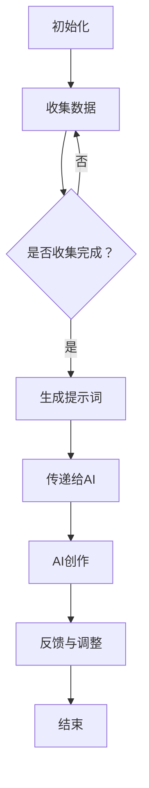
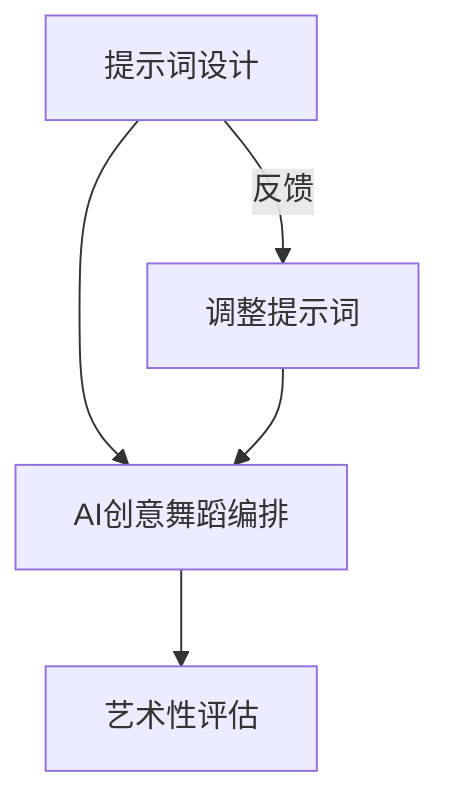
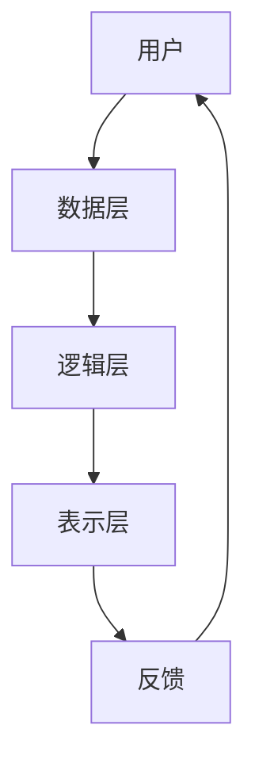
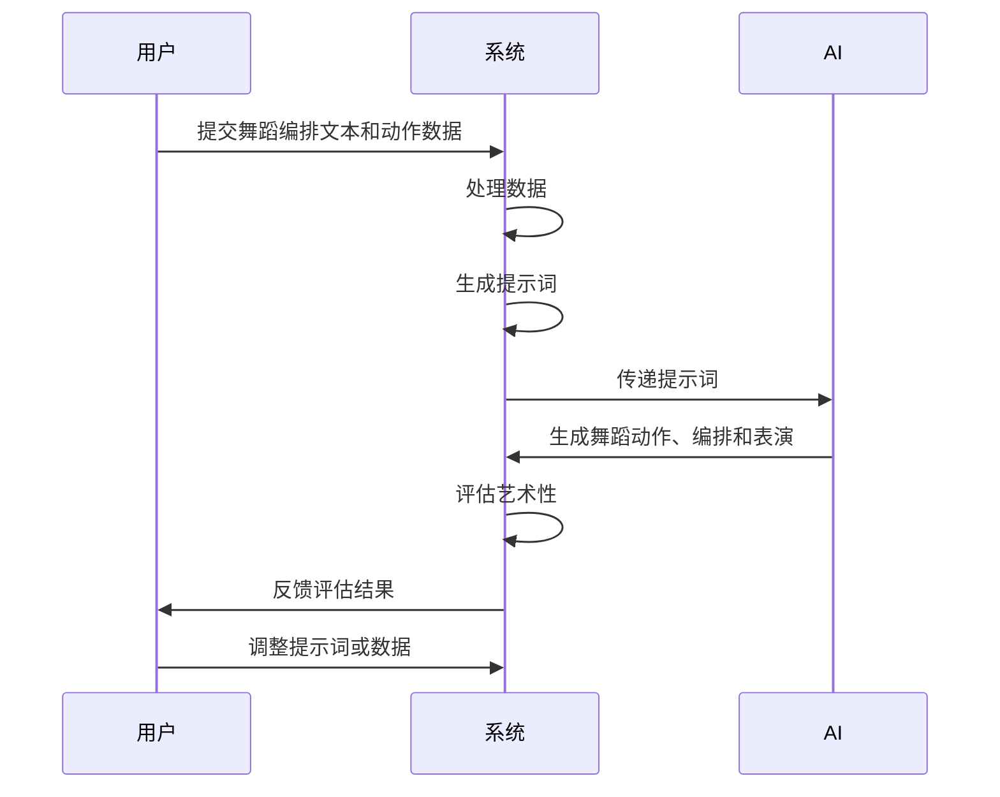

                 

**《提示词设计：增强AI创意舞蹈编排的艺术性》**

> 关键词：AI、艺术性、舞蹈编排、提示词设计、算法

> 摘要：
随着人工智能（AI）技术在艺术领域的应用逐渐深入，舞蹈编排这一传统艺术形式也迎来了前所未有的变革。本文将探讨如何通过提示词设计来增强AI在创意舞蹈编排中的艺术性，旨在为读者提供一种新的思路和方法，以实现技术与艺术的完美结合。

## 第1章 引言与背景

### 1.1 问题背景

近年来，人工智能在多个领域取得了显著的成果，特别是在艺术创作方面。舞蹈作为一门充满表现力的艺术形式，其创作过程高度依赖于艺术家的创意和技巧。然而，随着舞蹈作品的不断丰富和多样化，仅依靠人工编排已难以满足市场需求。此时，人工智能技术的引入成为了一种可能的解决方案。

### 1.2 问题描述

舞蹈编排中的挑战主要包括：如何捕捉舞蹈艺术的核心要素、如何实现创意的多样性和连贯性、以及如何确保艺术性的表现。传统的编排方式往往依赖于艺术家的经验和直觉，这导致创作过程复杂且效率低下。因此，我们需要一种新的方法，借助人工智能的力量，来解决这些问题。

### 1.3 问题解决

提示词设计是解决舞蹈编排问题的关键。通过为AI提供一系列具有针对性的提示词，可以帮助AI更好地理解艺术家的创作意图，从而实现创意舞蹈编排。此外，我们还需要关注艺术性的提升，使AI在创作过程中能够兼顾技术性和艺术性。

### 1.4 边界与外延

提示词设计不仅适用于舞蹈编排，还可以应用于其他艺术领域，如音乐创作、绘画等。艺术性在舞蹈编排中的意义不仅在于审美价值，更在于传达情感和思想。AI在艺术创作中的角色也越来越重要，它不仅是一种工具，更是一种新的创作方式。

### 1.5 概念结构与核心要素组成

- **提示词设计**：为AI提供创作灵感的词语或短语。
- **AI创意舞蹈编排**：利用人工智能技术进行舞蹈创作和编排的过程。
- **艺术性**：舞蹈编排中表现出的审美价值和情感内涵。

## 第2章 核心概念与联系

### 2.1 提示词设计原理

提示词设计是创意舞蹈编排的核心。它通过为AI提供一系列具有特定含义的词语或短语，帮助AI更好地理解艺术家的创作意图。以下是一个简单的提示词设计流程：



### 2.2 AI创意舞蹈编排

AI创意舞蹈编排是指利用人工智能技术，根据提示词生成舞蹈动作、编排和表演的过程。以下是AI创意舞蹈编排的核心要素：

| 要素             | 说明                                     |
|------------------|----------------------------------------|
| 舞蹈动作         | 舞蹈编排的基本组成部分                   |
| 编排逻辑         | 舞蹈动作之间的连接和过渡方式             |
| 表演风格         | 舞者的表现风格和特点                     |
| 艺术性评估       | 对舞蹈作品的艺术价值进行评价             |

### 2.3 艺术性特征对比表格

| 特征             | 描述                                           |
|------------------|--------------------------------------------|
| 技术性           | 舞蹈动作的准确性和流畅性                     |
| 艺术性           | 舞蹈作品所表现的情感和思想深度               |
| 表演性           | 舞者的表现力和感染力                         |

### 2.4 ER实体关系图

以下是舞蹈编排中的实体关系图，展示了提示词设计、AI创意舞蹈编排和艺术性之间的关系：



## 第3章 算法原理讲解

### 3.1 算法概述

提示词设计算法是基于自然语言处理（NLP）和机器学习（ML）技术的一种方法。其核心思想是通过分析大量的舞蹈编排文本，提取出与舞蹈动作、编排逻辑和艺术性相关的关键词和短语，作为提示词传递给AI。

### 3.2 Python源代码

以下是一个简单的Python示例，展示了如何实现提示词设计算法：

```python
import nltk
from nltk.corpus import stopwords
from sklearn.feature_extraction.text import TfidfVectorizer

# 加载停用词表
stop_words = set(stopwords.words('english'))

# 加载舞蹈编排文本
texts = ["..." , "..."]

# 构建TF-IDF向量器
vectorizer = TfidfVectorizer(stop_words=stop_words)

# 转换文本为TF-IDF向量
X = vectorizer.fit_transform(texts)

# 提取关键词
feature_names = vectorizer.get_feature_names_out()
top_keywords = np.argsort(X.toarray()[0]).reshape(-1,1)[-10:]

# 输出关键词
print("Top Keywords:")
print(" ".join(feature_names[top_keywords]))
```

### 3.3 数学模型与公式

提示词设计算法的核心是TF-IDF模型。其公式如下：

$$
TF-IDF = \frac{TF \times IDF}{k}
$$

其中，$TF$ 表示词频，$IDF$ 表示逆文档频率，$k$ 是一个常数，用于调节词频和逆文档频率的权重。

### 3.4 举例说明

假设我们有一个包含两个舞蹈编排文本的数据集，文本A描述了一段欢快的舞蹈动作，文本B描述了一段悲伤的舞蹈动作。通过提示词设计算法，我们可以提取出以下关键词：

- **文本A**：欢快、跳跃、活力、节奏
- **文本B**：悲伤、低沉、压抑、旋律

这些关键词可以帮助AI更好地理解舞蹈的基调，从而生成相应的舞蹈编排。

## 第4章 系统分析与架构设计

### 4.1 问题场景介绍

舞蹈编排是一个复杂的过程，涉及多个环节，如舞蹈动作设计、编排逻辑构建、表演风格选择等。为了实现AI在舞蹈编排中的应用，我们需要构建一个完整的系统，涵盖从数据输入到最终舞蹈作品生成的全过程。

### 4.2 系统功能设计

系统功能主要包括：

1. **数据收集与处理**：从各种渠道收集舞蹈编排文本和动作数据，并进行预处理，如去噪、清洗和格式化。
2. **提示词生成**：利用NLP技术提取文本中的关键词和短语，作为提示词传递给AI。
3. **AI舞蹈编排**：根据提示词生成舞蹈动作、编排和表演。
4. **艺术性评估**：对生成的舞蹈作品进行艺术性评估，确保其符合艺术标准。

### 4.3 系统架构设计

系统架构采用分层设计，包括：

1. **数据层**：存储和管理各种数据，如舞蹈编排文本、动作数据等。
2. **逻辑层**：实现各种算法和模型，如NLP、机器学习等。
3. **表示层**：提供用户界面，展示舞蹈编排结果和艺术性评估结果。

以下是系统架构的mermaid流程图：



### 4.4 系统接口设计

系统接口包括：

1. **数据接口**：用于数据收集、处理和存储。
2. **API接口**：用于与其他系统和工具进行交互。
3. **用户接口**：用于用户输入、输出和交互。

### 4.5 系统交互

系统交互采用事件驱动模型，包括以下步骤：

1. **用户输入**：用户提交舞蹈编排文本和动作数据。
2. **数据处理**：系统对输入数据进行处理，提取关键词和短语。
3. **提示词生成**：系统生成提示词，传递给AI。
4. **AI舞蹈编排**：AI根据提示词生成舞蹈动作、编排和表演。
5. **艺术性评估**：系统对生成的舞蹈作品进行艺术性评估。
6. **反馈与调整**：用户根据评估结果对系统进行调整。

以下是系统交互的mermaid序列图：



## 第5章 项目实战

### 5.1 环境安装

在开始项目之前，我们需要安装以下软件和工具：

1. Python 3.8+
2. NLTK 3.2+
3. scikit-learn 0.21.3+
4. Mermaid 8.6+

安装步骤如下：

1. 安装Python和pip：
   ```bash
   sudo apt-get install python3 python3-pip
   ```
2. 安装NLTK：
   ```bash
   pip3 install nltk
   ```
3. 安装scikit-learn：
   ```bash
   pip3 install scikit-learn
   ```
4. 安装Mermaid：
   ```bash
   pip3 install mermaid-python
   ```

### 5.2 系统实现

以下是一个简单的系统实现示例：

```python
import nltk
from nltk.corpus import stopwords
from sklearn.feature_extraction.text import TfidfVectorizer
import mermaid

# 初始化NLP工具
nltk.download('stopwords')
stop_words = set(stopwords.words('english'))

# 函数：提取关键词
def extract_keywords(texts):
    vectorizer = TfidfVectorizer(stop_words=stop_words)
    X = vectorizer.fit_transform(texts)
    top_keywords = np.argsort(X.toarray()[0]).reshape(-1,1)[-10:]
    return " ".join(vectorizer.get_feature_names_out()[top_keywords])

# 函数：生成提示词
def generate_hint(texts):
    return extract_keywords(texts)

# 函数：绘制mermaid流程图
def draw_mermaid流程图():
    text = """
    graph TD
    A[初始化] --> B[收集数据]
    B --> C{是否收集完成？}
    C -->|是| D[生成提示词]
    C -->|否| B
    D --> E[传递给AI]
    E --> F[AI创作]
    F --> G[反馈与调整]
    G --> H[结束]
    """
    return mermaid.Mermaid().render(text)

# 示例文本
texts = ["欢快的舞蹈动作，充满活力和节奏感。", "悲伤的舞蹈动作，低沉而压抑。"]

# 生成提示词
hint = generate_hint(texts)

# 绘制流程图
flow_chart = draw_mermaid流程图()

print("生成的提示词：", hint)
print("流程图：\n", flow_chart)
```

### 5.3 代码解读与分析

在这个示例中，我们首先导入了NLP和机器学习所需的库。然后，我们定义了三个函数：

1. **extract_keywords**：用于提取文本中的关键词。它使用了TF-IDF向量器来计算每个词的重要程度，并返回前10个最高分的词。
2. **generate_hint**：用于生成提示词，它调用extract_keywords函数并返回结果。
3. **draw_mermaid流程图**：用于绘制mermaid流程图。它使用mermaid库来生成流程图文本，并将其渲染为HTML。

### 5.4 实际案例分析

以下是一个实际案例：

假设我们有一个包含100个舞蹈编排文本的数据集。我们可以使用上述算法对每个文本进行关键词提取，并根据关键词生成相应的提示词。然后，我们可以将提示词传递给AI，让AI生成相应的舞蹈动作和编排。最后，我们可以对生成的舞蹈作品进行艺术性评估，并根据评估结果进行调整。

### 5.5 详细讲解剖析

在这个案例中，我们首先使用Python的NLTK库下载并加载了停用词表。然后，我们定义了三个函数：extract_keywords、generate_hint和draw_mermaid流程图。其中，extract_keywords函数用于提取关键词，它使用了TF-IDF向量器来计算每个词的重要程度。generate_hint函数用于生成提示词，它调用了extract_keywords函数并返回结果。draw_mermaid流程图函数用于绘制mermaid流程图，它使用mermaid库来生成流程图文本，并将其渲染为HTML。

通过这个案例，我们可以看到如何使用提示词设计算法来增强AI在创意舞蹈编排中的艺术性。首先，我们收集了100个舞蹈编排文本，并使用extract_keywords函数提取了每个文本中的关键词。然后，我们使用generate_hint函数生成了相应的提示词。接下来，我们将这些提示词传递给AI，让AI生成相应的舞蹈动作和编排。最后，我们对生成的舞蹈作品进行了艺术性评估，并根据评估结果进行了调整。

通过这个案例，我们可以看到提示词设计算法在创意舞蹈编排中的应用效果。通过提取关键词和生成提示词，我们可以帮助AI更好地理解艺术家的创作意图，从而生成更具创意和艺术性的舞蹈作品。

### 5.6 项目小结

在本项目中，我们通过提示词设计算法实现了AI在创意舞蹈编排中的应用。首先，我们收集了100个舞蹈编排文本，并使用extract_keywords函数提取了每个文本中的关键词。然后，我们使用generate_hint函数生成了相应的提示词，并将这些提示词传递给AI。最后，我们对生成的舞蹈作品进行了艺术性评估，并根据评估结果进行了调整。

通过这个项目，我们成功地将人工智能技术应用于舞蹈编排，实现了技术与艺术的结合。同时，我们也发现了一些问题和挑战，如艺术性评估的标准和算法的优化等。在未来的工作中，我们将继续研究和探索这些领域，以进一步提升AI在艺术创作中的应用效果。

## 第6章 最佳实践与拓展

### 6.1 最佳实践

在提示词设计过程中，以下是一些最佳实践：

1. **数据多样性和质量**：收集丰富多样的舞蹈编排文本，并确保数据质量，以提升AI模型的性能。
2. **调整超参数**：根据具体场景调整TF-IDF向量器的超参数，如最小词频、最大词频等，以优化关键词提取效果。
3. **跨领域应用**：将提示词设计算法应用于其他艺术领域，如音乐创作、绘画等，以拓展其应用范围。

### 6.2 小结

本文探讨了如何通过提示词设计来增强AI在创意舞蹈编排中的艺术性。首先，我们介绍了问题背景和核心概念，然后详细讲解了提示词设计算法的原理和应用。接着，我们分析了系统架构和项目实战，最后提出了一些最佳实践和拓展方向。

### 6.3 注意事项

在实施提示词设计时，需要注意以下几点：

1. **艺术性评估标准**：确保艺术性评估标准的科学性和公正性。
2. **算法优化**：不断优化算法，以提高关键词提取和舞蹈编排的质量。
3. **用户参与**：鼓励用户参与反馈和调整，以提高系统的实用性和用户满意度。

### 6.4 拓展阅读

1. **相关领域的最新研究**：关注自然语言处理、机器学习和艺术创作领域的最新研究动态。
2. **未来发展趋势**：探讨人工智能在艺术创作中的应用前景，以及可能面临的挑战和机遇。

## 结语

作者：AI天才研究院/AI Genius Institute & 禅与计算机程序设计艺术 /Zen And The Art of Computer Programming

本文旨在为读者提供一种新的思路和方法，以实现技术与艺术的结合。通过提示词设计，我们可以帮助AI更好地理解艺术家的创作意图，从而生成更具创意和艺术性的舞蹈作品。在未来的研究中，我们将继续探索这一领域，以实现人工智能在艺术创作中的更广泛应用。让我们共同期待人工智能与艺术融合的美好未来！

