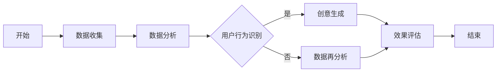

                 

# 提示词设计：增强AI创意营销策划能力

## 关键词：
AI，创意营销，策划，算法，系统架构，Python，数学模型，最佳实践

## 摘要：
本文将深入探讨如何通过设计有效的提示词来增强AI在创意营销策划中的能力。文章首先介绍AI与创意营销的基本概念和背景，然后详细分析AI在创意营销中的应用场景和核心概念。接着，文章将讲解相关的算法原理和系统架构设计，并通过实际项目实战来展示如何将理论应用到实践中。最后，文章将总结最佳实践并给出拓展阅读建议。

## 目录大纲：

### 前言
- 简要介绍书的内容、目标读者和结构安排。

### 第一部分：背景介绍
- 第1章：AI与创意营销概述
- 第2章：创意营销中的问题背景
- 第3章：创意营销中的核心概念与联系
- 第4章：AI在创意营销中的应用场景

### 第二部分：核心概念与联系
- 第5章：核心概念原理
- 第6章：概念属性特征对比
- 第7章：ER实体关系图架构

### 第三部分：算法原理讲解
- 第8章：算法mermaid流程图
- 第9章：Python源代码与数学模型
- 第10章：详细讲解与举例说明

### 第四部分：系统分析与架构设计
- 第11章：问题场景介绍
- 第12章：系统功能设计
- 第13章：系统架构设计
- 第14章：系统接口设计
- 第15章：系统交互

### 第五部分：项目实战
- 第16章：环境安装与核心实现
- 第17章：代码应用解读与分析
- 第18章：实际案例分析与详细讲解
- 第19章：项目小结

### 第六部分：最佳实践与总结
- 第20章：最佳实践 tips
- 第21章：小结
- 第22章：注意事项
- 第23章：拓展阅读

### 附录

### 参考文献

### 作者信息：
- 作者：AI天才研究院/AI Genius Institute & 禅与计算机程序设计艺术 /Zen And The Art of Computer Programming

## 前言
### 引言
随着人工智能技术的不断进步，AI已经在各个行业中展现出强大的潜力。在创意营销领域，AI的应用更是带来了革命性的变化。本文旨在探讨如何通过设计有效的提示词来增强AI在创意营销策划中的能力。这将有助于营销人员更高效地创作吸引人的广告内容，从而提高营销效果。

### 目标读者
本文的目标读者包括：
- 创意营销策划人员
- 数据科学家和AI研究人员
- 对AI在创意营销中应用感兴趣的IT专业人士

### 结构安排
本文将分为六个主要部分：
1. **背景介绍**：介绍AI与创意营销的基本概念和背景。
2. **核心概念与联系**：深入分析创意营销中的核心概念和它们之间的联系。
3. **算法原理讲解**：详细讲解用于创意营销策划的算法原理。
4. **系统分析与架构设计**：介绍系统架构和接口设计。
5. **项目实战**：通过实际项目来展示如何应用理论。
6. **最佳实践与总结**：总结最佳实践并提供拓展阅读建议。

通过本文的阅读，读者将能够理解AI在创意营销中的作用，并学会如何通过设计提示词来增强AI的创意策划能力。

### 第一部分：背景介绍

#### 第1章：AI与创意营销概述
##### 引言
人工智能（AI）正迅速改变着创意营销的面貌。AI通过其强大的数据处理和分析能力，不仅能够识别出潜在客户的行为模式，还能创造出更加个性化和引人入胜的营销内容。本章将简要介绍AI的基本概念及其在创意营销中的应用。

##### AI的基本概念
AI，即人工智能，是指由人创造出来的系统，这些系统能够执行通常需要人类智能的任务，例如视觉识别、语音识别、决策制定等。AI的核心在于机器学习，这是一种让机器通过大量数据自我学习和改进的方法。

##### 创意营销的概念
创意营销是指通过独特、新颖和引人注目的创意来吸引潜在客户，从而实现品牌宣传和销售目标。创意营销的核心在于内容的创造和创新，它要求营销人员不断探索新的表达方式和策略。

##### AI在创意营销中的应用
AI在创意营销中的应用主要体现在以下几个方面：
- **数据分析**：AI能够分析大量的消费者数据，从而帮助营销人员了解目标客户的行为和偏好。
- **内容生成**：AI可以自动生成营销文案、广告视频等，大大提高内容的创造效率。
- **个性化推荐**：基于用户行为和偏好，AI能够提供个性化的产品推荐和营销信息。

##### 创意营销中的挑战
尽管AI在创意营销中有着巨大的潜力，但也面临一些挑战：
- **数据隐私**：如何保护消费者的隐私成为了一个重要问题。
- **创意限制**：AI虽然能够生成内容，但其创意可能受限于算法和数据。
- **技术成本**：实现AI创意营销需要较大的技术投入和人力资源。

##### 结论
AI与创意营销的结合带来了新的机遇和挑战。理解AI的基本概念和应用，有助于营销人员更好地利用这项技术，提升营销效果。

#### 第2章：创意营销中的问题背景
##### 引言
创意营销的成功往往取决于对市场趋势、消费者心理和竞争环境的深刻理解。然而，在实际操作中，创意营销面临着诸多问题，这些问题需要通过有效的技术手段来解决。本章将详细分析创意营销中存在的问题，并探讨如何利用AI技术来改善这些问题。

##### 创意枯竭
创意枯竭是创意营销中最为常见的问题之一。长时间的工作压力和竞争压力会导致创意团队出现灵感匮乏的情况，从而影响营销活动的效果。为了解决这一问题，AI可以提供多样化的创意建议，通过分析已有的成功案例和当前的市场趋势，为创意团队提供灵感。

##### 数据分析难度
创意营销需要大量的数据支持，包括消费者行为数据、市场趋势数据、竞争者数据等。然而，这些数据往往分散在不同来源，且数据格式多样，导致数据分析难度大。AI的强大数据处理能力可以简化这一过程，通过自动收集、整理和分析数据，为创意营销提供有力的支持。

##### 个性化不足
创意营销的目标是吸引和保留目标客户，但传统的营销手段往往难以实现个性化。AI可以通过机器学习算法，分析消费者的行为和偏好，提供个性化的营销内容和推荐，从而提高营销效果。

##### 跨渠道整合困难
现代营销活动往往需要跨多个渠道进行，包括社交媒体、电子邮件、移动应用等。然而，不同渠道的数据往往难以整合，导致营销活动的效果难以评估。AI可以通过其数据分析能力，实现跨渠道的数据整合，提供统一的营销策略。

##### 预算控制
创意营销活动需要大量的预算支持，但如何合理分配预算是一个挑战。AI可以通过对历史数据的分析，预测哪些营销活动最有可能带来回报，从而帮助营销人员更好地控制预算。

##### 结论
创意营销中存在的问题不仅限制了营销效果，也增加了营销团队的负担。通过利用AI技术，这些问题可以得到有效解决，从而提高创意营销的效率和质量。

#### 第3章：创意营销中的核心概念与联系
##### 引言
创意营销的成功离不开对核心概念的深刻理解和有效运用。本章将详细探讨创意营销中的核心概念，包括营销目标、目标受众、营销策略等，并分析这些概念之间的联系。

##### 营销目标
营销目标是创意营销活动的核心，它决定了营销活动的方向和目标。营销目标可以分为短期目标和长期目标，例如增加销售额、提升品牌知名度、扩大市场份额等。明确营销目标有助于创意团队聚焦关键任务，提高营销效果。

##### 目标受众
目标受众是创意营销的关键，只有准确识别和了解目标受众，才能创作出具有吸引力的营销内容。目标受众包括消费者的年龄、性别、收入水平、兴趣爱好等。通过数据分析和市场调研，AI可以帮助营销人员准确识别目标受众，从而实现更加精准的营销。

##### 营销策略
营销策略是实现营销目标的手段，包括广告宣传、内容营销、社交媒体营销等。有效的营销策略需要综合考虑目标受众、市场环境和预算等因素。AI可以通过数据分析，为营销团队提供最优的营销策略，提高营销效果。

##### 营销内容
营销内容是创意营销的核心，包括广告文案、视频、图片等。高质量、有创意的营销内容能够吸引目标受众的注意力，提高品牌知名度和转化率。AI可以通过自然语言处理和图像识别技术，生成具有吸引力的营销内容。

##### 营销效果评估
营销效果评估是衡量创意营销成功与否的重要指标。通过分析营销活动的数据，如点击率、转化率、社交媒体互动等，可以评估营销效果，并根据评估结果调整营销策略。AI可以通过自动化数据分析，提供实时的营销效果评估，帮助营销人员及时调整策略。

##### 概念联系分析
营销目标、目标受众、营销策略、营销内容和营销效果评估是创意营销中紧密联系的核心概念。营销目标决定了营销活动的方向，目标受众是营销活动的对象，营销策略是实现目标的手段，营销内容是吸引目标受众的工具，而营销效果评估则是对营销活动结果的反馈。这些概念相互关联，共同作用，构成了创意营销的核心体系。

##### 结论
理解创意营销中的核心概念及其联系，有助于营销人员更好地规划和执行营销活动。通过利用AI技术，可以更高效地实现这些概念，从而提高营销效果。

#### 第4章：AI在创意营销中的应用场景
##### 引言
人工智能在创意营销中的应用场景广泛，通过不同的AI技术，可以实现多种营销目标。本章将详细探讨AI在创意营销中的多种应用场景，并分析其潜在效益和挑战。

##### 自动化内容生成
自动化内容生成是AI在创意营销中最为显著的应用之一。通过自然语言处理（NLP）和机器学习技术，AI可以自动生成营销文案、广告副本和新闻报道。这不仅提高了内容生成的效率，还能够根据用户的行为数据实时调整内容，提高个性化水平。例如，AI可以根据用户的历史购买记录和搜索行为，自动生成个性化的推荐文案。

##### **案例分析**：一家电子商务公司利用AI技术，自动生成针对不同用户群体的定制化广告文案，从而显著提高了广告的点击率和转化率。

##### 情感分析
情感分析是AI在理解和分析消费者情感方面的重要应用。通过分析社交媒体、评论和反馈中的情感倾向，AI可以帮助营销人员了解消费者的情感状态，从而制定更有效的营销策略。情感分析不仅可以识别负面情绪，还可以发现潜在的市场趋势和消费者需求。

##### **案例分析**：一家化妆品公司通过AI情感分析技术，识别出消费者对产品的主要关注点和负面情绪，从而调整产品定位和营销策略，提升了品牌形象和消费者满意度。

##### 个性化推荐
个性化推荐是AI在创意营销中的另一个重要应用。通过分析消费者的行为数据和偏好，AI可以为每个用户提供个性化的产品推荐和营销信息。这种个性化的推荐不仅可以提高用户满意度，还能够增加销售机会。

##### **案例分析**：一家在线零售平台利用AI个性化推荐技术，根据用户的浏览和购买历史，为每个用户推荐相关产品，从而提高了用户的购买转化率和销售额。

##### 跨渠道营销
跨渠道营销是现代创意营销的关键策略。AI可以通过整合不同渠道的数据，实现统一的营销体验。例如，AI可以帮助营销人员分析社交媒体、电子邮件和网站等渠道的数据，制定跨渠道的营销策略。

##### **案例分析**：一家旅游公司利用AI技术，整合线上和线下的数据，为用户提供个性化的旅游推荐和服务，从而提高了客户的满意度和忠诚度。

##### 潜在效益和挑战
AI在创意营销中的应用带来了显著的效益，包括提高内容生成的效率、增强个性化推荐的能力和实现跨渠道营销等。然而，AI的应用也面临一些挑战，如数据隐私、算法透明度和创意限制等。

##### 结论
AI在创意营销中的应用场景多样，通过自动化内容生成、情感分析、个性化推荐和跨渠道营销等技术，AI可以为营销人员提供强大的工具，提高营销效果。然而，在实际应用中，需要充分考虑潜在效益和挑战，以确保AI技术的有效利用。

### 第二部分：核心概念与联系

#### 第5章：核心概念原理
##### 引言
在创意营销中，理解并掌握核心概念原理是关键。本章将深入探讨创意营销中的核心概念，包括创意策划、用户行为分析、数据挖掘等，并阐述这些概念的基本原理。

##### 创意策划原理
创意策划是创意营销的核心，它涉及到如何通过独特的创意来吸引目标受众。创意策划的原理主要包括以下几点：
- **需求分析**：了解目标受众的需求和期望，是创意策划的基础。
- **市场研究**：通过市场研究，获取关于竞争者、市场趋势和消费者行为的信息。
- **创意构思**：基于需求和市场的信息，构思出新颖、独特的创意。
- **效果评估**：通过测试和评估，确保创意能够达到预期的营销效果。

##### 用户行为分析原理
用户行为分析是理解目标受众的重要手段。其原理包括以下几点：
- **数据收集**：通过网站分析、社交媒体监测等手段，收集用户行为数据。
- **行为模式识别**：利用数据分析技术，识别用户的行为模式。
- **行为预测**：基于用户的历史行为，预测用户未来的行为。
- **行为优化**：根据用户行为数据，优化营销策略和用户体验。

##### 数据挖掘原理
数据挖掘是挖掘隐藏在大量数据中的有用信息和知识的过程。其原理包括以下几点：
- **数据预处理**：清洗和整理原始数据，使其适合分析。
- **特征选择**：从数据中提取出有用的特征，用于建模和分析。
- **模型构建**：利用统计和学习算法，构建预测和分类模型。
- **模型评估**：评估模型的准确性和泛化能力，调整模型参数。

##### 联系与整合
创意策划、用户行为分析和数据挖掘是创意营销中相互关联的核心概念。创意策划需要依赖用户行为分析来获取用户需求和市场信息，数据挖掘则为创意策划提供了强大的工具，可以帮助营销人员发现潜在的市场机会和优化营销策略。这三个概念相互结合，共同构成了创意营销的理论基础。

##### 结论
理解创意营销中的核心概念原理，是提升创意营销效果的关键。通过深入掌握创意策划、用户行为分析和数据挖掘的基本原理，营销人员可以更有效地进行创意营销策划，提高营销效果。

#### 第6章：概念属性特征对比
##### 引言
在创意营销中，理解各概念属性特征的不同有助于更好地应用这些概念。本章将对比分析创意策划、用户行为分析和数据挖掘等核心概念的属性特征，以便读者能够更全面地掌握这些概念。

##### 创意策划属性特征
创意策划是创意营销的核心，其属性特征包括：
- **创新性**：创意策划要求提出新颖、独特的创意，以吸引目标受众。
- **目标导向**：创意策划需要明确营销目标，确保创意与目标的一致性。
- **灵活性**：创意策划应根据市场环境和消费者行为的变化，灵活调整创意策略。
- **反馈机制**：创意策划需要通过测试和评估，不断优化创意效果。

##### 用户行为分析属性特征
用户行为分析是理解目标受众的重要手段，其属性特征包括：
- **数据驱动**：用户行为分析依赖于大量数据，通过数据分析来了解用户行为。
- **实时性**：用户行为分析需要实时获取和更新用户行为数据。
- **多维性**：用户行为分析涉及多个维度，如浏览行为、购买行为、社交媒体互动等。
- **预测性**：用户行为分析旨在预测用户未来的行为，为营销策略提供支持。

##### 数据挖掘属性特征
数据挖掘是挖掘隐藏在数据中的有用信息和知识的过程，其属性特征包括：
- **规模性**：数据挖掘通常处理大规模数据，需要高效的算法和数据存储技术。
- **自动化**：数据挖掘过程高度自动化，减少了人工干预。
- **复用性**：数据挖掘模型和算法可以复用，提高分析效率。
- **泛化能力**：数据挖掘模型需要具备良好的泛化能力，能够在新的数据集上有效工作。

##### 概念特征对比
创意策划、用户行为分析和数据挖掘虽然都是创意营销中的核心概念，但它们的属性特征有所不同。创意策划注重创新性和目标导向，用户行为分析强调数据驱动和实时性，数据挖掘则强调规模性和自动化。通过对比这些特征，营销人员可以更准确地应用这些概念，提高营销效果。

##### 结论
对比分析创意策划、用户行为分析和数据挖掘的属性特征，有助于营销人员更深入地理解这些概念，并在实际应用中发挥其最大价值。通过有效整合这些概念，可以构建一个全面的创意营销体系，提高营销效果。

#### 第7章：ER实体关系图架构
##### 引言
为了更好地理解创意营销中的核心概念和它们之间的联系，可以使用实体关系图（Entity-Relationship Diagram，ER图）来可视化这些概念。本章将介绍ER实体关系图的构建过程，并通过Mermaid流程图来展示其架构。

##### ER图概述
实体关系图是一种用于数据库设计和数据建模的工具，它通过实体、属性和关系来表示数据实体及其之间的关联。在创意营销中，ER图可以帮助我们理解营销概念之间的关系。

##### 构建ER图
构建ER图通常包括以下步骤：

1. **识别实体**：首先，识别创意营销中的核心实体，如用户、广告、营销活动、市场数据等。
2. **定义属性**：为每个实体定义相关的属性，如用户ID、年龄、性别、购买历史等。
3. **确定关系**：确定实体之间的关系，如用户参与营销活动、广告与营销活动关联等。
4. **绘制ER图**：使用Mermaid等工具绘制ER图，以直观展示实体和关系。

##### 实体关系图示例
以下是一个简化的ER图示例，用于表示创意营销中的关键实体和关系：

```mermaid
erDiagram
  用户 ||--o{ 营销活动 } : 参与活动
  用户 ||--o{ 购买历史 } : 购买商品
  广告 ||--o{ 营销活动 } : 用于推广
  营销活动 ||--o{ 数据分析 } : 数据收集
  数据分析 ||--o{ 用户行为分析 } : 了解行为
  数据分析 ||--o{ 创意策划 } : 提供支持
```

在这个示例中，用户、广告、营销活动、购买历史、数据分析和用户行为分析是关键实体，它们之间的关系通过箭头表示。例如，用户参与营销活动，广告用于推广营销活动，数据分析用于收集用户行为数据，并提供支持给创意策划。

##### 结论
ER实体关系图是一种强大的工具，可以帮助我们理解创意营销中的核心概念和它们之间的联系。通过使用Mermaid等工具，可以直观地绘制和展示这些关系，为创意营销提供清晰的结构化视图。

### 第三部分：算法原理讲解

#### 第8章：算法mermaid流程图
##### 引言
为了更好地理解用于创意营销策划的算法原理，可以使用mermaid流程图来展示算法的执行流程。本章将介绍一个简化的创意营销策划算法的mermaid流程图，并解释其各个步骤。

##### 算法mermaid流程图
以下是一个创意营销策划算法的mermaid流程图示例：



在这个流程图中，算法从数据收集开始，接着进行数据分析，然后识别用户行为。根据用户行为，算法决定是否生成创意。如果需要，算法会进行数据再分析，最终进行效果评估，并结束。

##### 各步骤解释
- **数据收集**：收集与营销活动相关的数据，如用户行为、市场趋势、竞争对手数据等。
- **数据分析**：对收集到的数据进行分析，提取有用的信息，如用户偏好、购买模式等。
- **用户行为识别**：利用数据分析结果，识别目标用户的行为特征和需求。
- **创意生成**：根据用户行为识别的结果，生成符合目标用户需求的创意内容。
- **效果评估**：评估创意生成后营销活动的效果，如点击率、转化率等。
- **结束**：根据评估结果，决定是否继续进行下一步营销活动。

##### 结论
mermaid流程图提供了直观的方式，展示了创意营销策划算法的执行流程。通过理解这个流程图，可以更好地把握算法的每个步骤，从而有效应用于创意营销策划。

#### 第9章：Python源代码与数学模型
##### 引言
为了深入理解创意营销策划算法的原理，我们需要结合Python源代码和数学模型来详细解释算法的实现过程。本章将介绍一个简化的创意营销策划算法的Python代码实现，并解释其背后的数学模型。

##### Python代码实现
以下是一个简化的创意营销策划算法的Python代码示例：

```python
import pandas as pd
from sklearn.cluster import KMeans
import numpy as np

# 数据收集
data = pd.read_csv('marketing_data.csv')

# 数据预处理
data['age'] = pd.cut(data['age'], bins=[0, 18, 30, 50, 70, np.inf], labels=[0, 1, 2, 3, 4])
data['income'] = pd.cut(data['income'], bins=[0, 20000, 50000, 100000, np.inf], labels=[0, 1, 2, 3])

# 数据分析
X = data[['age', 'income']]
kmeans = KMeans(n_clusters=4, random_state=0).fit(X)

# 用户行为识别
labels = kmeans.labels_
data['cluster'] = labels

# 创意生成
for cluster in range(4):
    cluster_data = data[data['cluster'] == cluster]
   创意内容 = generate_content(cluster_data)
    print(f"Cluster {cluster} creative content: {创意内容}")

# 效果评估
evaluate_effects()

# 辅助函数定义
def generate_content(cluster_data):
    # 根据cluster数据生成创意内容
    # 此处为示例，实际应根据具体需求设计
    content = f"Hello {cluster_data['gender'].unique()[0]} aged {cluster_data['age'].mean()}!"
    return content

def evaluate_effects():
    # 评估创意效果
    # 此处为示例，实际应根据具体需求设计
    print("Effect evaluation results:")
    print("...")  # 实际效果评估结果
```

在这个示例中，我们首先收集了营销数据，然后对数据进行了预处理，接着使用KMeans算法进行数据分析，识别用户行为，并生成创意内容。最后，我们评估了创意效果。

##### 数学模型解释
KMeans算法是本示例的核心，它基于距离度量将数据点分为多个聚类。以下是KMeans算法的数学模型解释：

- **目标函数**：KMeans的目标是最小化各个聚类内部点的距离之和，即：
  $$ \min_{\mu_1, \mu_2, ..., \mu_k} \sum_{i=1}^n \sum_{j=1}^k ||x_i - \mu_j||^2 $$
  其中，$x_i$ 是数据点，$\mu_j$ 是聚类中心。

- **聚类中心更新**：聚类中心的更新是基于每个数据点到聚类中心的距离计算得到的：
  $$ \mu_j = \frac{1}{N_j} \sum_{i=1}^n x_i \quad \text{where} \quad N_j = \sum_{i=1}^n I(||x_i - \mu_j|| < \epsilon) $$
  其中，$I$ 是指示函数，$\epsilon$ 是聚类中心更新的阈值。

- **迭代过程**：KMeans算法通过迭代计算聚类中心和分配数据点，直到聚类中心不再发生变化或达到最大迭代次数。

##### 结论
通过Python代码实现和数学模型解释，我们可以更深入地理解创意营销策划算法的原理。这为实际应用提供了清晰的指导，并有助于优化和改进算法。

#### 第10章：详细讲解与举例说明
##### 引言
在前面的章节中，我们介绍了创意营销策划算法的基本原理和实现方法。为了更好地理解这些算法，本章将通过详细讲解和举例说明，阐述算法的执行过程和应用效果。

##### 算法执行过程
创意营销策划算法主要包括以下步骤：

1. **数据收集**：首先，从各种数据源收集与营销活动相关的数据，如用户行为数据、市场趋势数据、竞争对手数据等。
2. **数据预处理**：对收集到的数据进行清洗和整理，确保数据的质量和一致性。例如，对缺失值进行处理、去除重复数据等。
3. **数据分析**：使用机器学习算法，如KMeans聚类、回归分析等，对预处理后的数据进行分析。这些分析可以帮助我们了解用户行为模式、市场需求等。
4. **用户行为识别**：根据数据分析结果，识别目标用户的行为特征和需求。例如，通过聚类分析，将用户分为不同的群体，然后根据每个群体的特征生成相应的创意内容。
5. **创意生成**：根据用户行为识别的结果，生成符合目标用户需求的创意内容。例如，可以生成个性化的广告文案、视频等内容。
6. **效果评估**：将生成的创意内容应用于实际营销活动中，评估其效果。例如，通过点击率、转化率等指标来衡量创意内容的有效性。
7. **迭代优化**：根据效果评估的结果，对创意内容进行调整和优化，以提高营销效果。

##### 算法应用举例
为了更好地说明算法的应用，我们来看一个具体的案例。

**案例背景**：一家电子商务公司希望通过AI技术提升其营销效果，特别是在个性化推荐方面。公司收集了大量的用户数据，包括用户年龄、收入水平、购物习惯等。

**步骤1：数据收集**
首先，公司收集了用户的购买记录、浏览历史、搜索关键词等数据。这些数据存储在一个CSV文件中，格式如下：

```csv
user_id,age,income,buying_history,browsing_history,search_keywords
1,25,50000,[item1, item2],["page1", "page2"],["shoes", "sport"]
2,30,60000,[item3, item4],["page3", "page4"],["watch", "fashion"]
...
```

**步骤2：数据预处理**
对收集到的数据进行预处理，包括去除缺失值、去除重复数据、数据类型转换等。预处理后的数据格式如下：

```csv
user_id,age,income,buying_history,browsing_history,search_keywords
1,25,50000,[item1, item2],["page1", "page2"],["shoes", "sport"]
2,30,60000,[item3, item4],["page3", "page4"],["watch", "fashion"]
...
```

**步骤3：数据分析**
使用KMeans算法对预处理后的数据进行聚类分析，将用户分为不同的群体。假设我们选择4个聚类，聚类结果如下：

```csv
user_id,age,income,buying_history,browsing_history,search_keywords,cluster
1,25,50000,[item1, item2],["page1", "page2"],["shoes", "sport"],0
2,30,60000,[item3, item4],["page3", "page4"],["watch", "fashion"],0
3,22,40000,[item5, item6],["page5", "page6"],["books", "education"],1
4,35,70000,[item7, item8],["page7", "page8"],["electronics", "tech"],2
...
```

**步骤4：用户行为识别**
根据聚类结果，我们可以识别出不同群体的用户特征。例如，聚类0的用户大多为年轻人，喜欢购买运动鞋和服装；聚类2的用户大多为专业人士，喜欢购买电子产品。

**步骤5：创意生成**
根据用户特征，我们可以为不同群体的用户生成个性化的广告文案。例如，对于聚类0的用户，我们可以生成如下广告文案：

```plaintext
Hello, you stylish young man! We've got the latest trends in sports shoes and fashion just for you. Check out our exclusive offers now!
```

对于聚类2的用户，我们可以生成如下广告文案：

```plaintext
Hello, tech-savvy professional! Unleash your passion for technology with the latest gadgets and electronics. Shop now and save big!
```

**步骤6：效果评估**
将生成的广告文案应用于实际营销活动中，观察其效果。例如，我们可以通过点击率、转化率等指标来衡量广告文案的有效性。

**步骤7：迭代优化**
根据效果评估的结果，对广告文案进行调整和优化。例如，如果某个广告文案的点击率较低，我们可以尝试修改文案的表述方式，或者添加一些视觉元素，以提高其吸引力。

##### 结论
通过详细讲解和举例说明，我们可以更好地理解创意营销策划算法的执行过程和应用效果。这种算法可以帮助营销人员更有效地识别目标用户、生成个性化的营销内容，并优化营销策略，从而提高营销效果。

### 第四部分：系统分析与架构设计

#### 第11章：问题场景介绍
##### 引言
在创意营销策划中，AI系统的应用场景广泛，从数据分析到个性化推荐，再到营销效果评估，每个环节都离不开AI技术的支持。本章将介绍一个具体的AI创意营销系统应用场景，包括项目背景、目标和挑战。

##### 项目背景
某知名电子商务公司希望通过引入AI技术来提升其营销效果，提高用户满意度和销售额。公司积累了大量的用户数据，包括购买记录、浏览历史、搜索关键词等，这些数据为AI系统提供了丰富的素材。

##### 项目目标
- **个性化推荐**：根据用户的行为数据和偏好，为每个用户生成个性化的产品推荐。
- **创意文案生成**：根据用户特征和市场需求，生成吸引人的广告文案。
- **效果评估**：评估不同营销活动的效果，优化营销策略。

##### 挑战
- **数据质量**：用户数据可能存在缺失、重复和不一致的问题，需要预处理。
- **算法选择**：需要选择合适的机器学习算法，确保系统能够准确识别用户行为和偏好。
- **实时性**：营销活动需要实时响应用户行为，系统需要具备较高的处理速度。
- **可扩展性**：系统需要能够处理大量的数据，并支持未来的扩展和升级。

##### 结论
通过介绍具体的AI创意营销系统应用场景，我们可以明确项目背景、目标和面临的挑战。这有助于为后续的系统架构设计和功能实现提供清晰的指导。

#### 第12章：系统功能设计
##### 引言
在AI创意营销系统中，功能设计是核心环节。本章将详细描述系统的功能设计，包括领域模型、业务逻辑和用户界面等，以确保系统能够满足项目目标和用户需求。

##### 领域模型
领域模型是系统功能设计的起点，用于定义系统中的主要实体和它们之间的关系。以下是系统的主要领域模型：

1. **用户**：包括用户的基本信息，如用户ID、姓名、年龄、性别等。
2. **产品**：包括产品的详细信息，如产品ID、名称、描述、价格等。
3. **营销活动**：包括营销活动的详细信息，如活动ID、名称、描述、开始时间和结束时间等。
4. **购买记录**：包括用户的购买历史记录，如购买日期、产品ID、购买数量等。
5. **浏览历史**：包括用户的浏览记录，如浏览日期、页面ID、停留时间等。
6. **搜索关键词**：包括用户的搜索历史记录，如搜索日期、关键词等。

##### 业务逻辑
业务逻辑是系统功能的实现核心，包括以下几个方面：

1. **数据预处理**：清洗和整理用户数据，确保数据质量。
2. **用户行为分析**：分析用户的购买记录、浏览历史和搜索关键词，识别用户的兴趣和行为模式。
3. **个性化推荐**：根据用户行为分析结果，为用户生成个性化的产品推荐。
4. **创意文案生成**：根据用户特征和市场需求，生成吸引人的广告文案。
5. **效果评估**：评估不同营销活动的效果，优化营销策略。

##### 用户界面
用户界面是系统与用户交互的窗口，需要设计简洁、易用。以下是系统的用户界面设计：

1. **用户登录**：用户可以通过用户名和密码登录系统。
2. **用户主页**：展示用户的个人信息和个性化推荐。
3. **产品详情页**：展示产品的详细信息，并提供购买按钮。
4. **营销活动页面**：展示当前正在进行和即将开始的营销活动。
5. **效果评估报告**：展示营销活动的效果数据，并提供数据下载功能。

##### 结论
通过详细的功能设计，系统能够实现从用户数据预处理到个性化推荐和创意文案生成的全流程，满足项目目标和用户需求。这为后续的系统架构设计和实现奠定了基础。

#### 第13章：系统架构设计
##### 引言
系统架构设计是确保AI创意营销系统稳定、高效运行的关键。本章将详细介绍系统的整体架构设计，包括系统的组成部分、模块划分和各模块的功能，以及它们之间的交互关系。

##### 系统组成部分
AI创意营销系统由以下几个主要部分组成：

1. **数据层**：负责存储和访问用户数据、产品数据等，通常使用数据库管理系统（DBMS）来实现。
2. **逻辑层**：包括数据预处理模块、用户行为分析模块、个性化推荐模块、创意文案生成模块和效果评估模块，负责实现业务逻辑和数据处理。
3. **表示层**：提供用户界面，使用户能够与系统进行交互。

##### 模块划分
系统模块的划分基于功能需求，以下是主要的模块及其功能：

1. **数据预处理模块**：负责清洗、整理和预处理用户数据，确保数据质量。
2. **用户行为分析模块**：基于用户行为数据，分析用户的兴趣和行为模式。
3. **个性化推荐模块**：根据用户行为分析结果，生成个性化的产品推荐。
4. **创意文案生成模块**：根据用户特征和市场需求，生成吸引人的广告文案。
5. **效果评估模块**：评估不同营销活动的效果，提供优化建议。
6. **数据库模块**：负责数据存储和管理，提供数据访问接口。

##### 模块功能及交互关系
以下是各模块的功能描述及其之间的交互关系：

1. **数据预处理模块**：接收原始数据，进行清洗和整理，然后将其存储到数据库中。数据预处理模块与数据库模块有密切的交互，以确保数据的一致性和完整性。

2. **用户行为分析模块**：从数据库中读取用户行为数据，进行特征提取和模式识别。用户行为分析模块需要与数据库模块进行数据交换，同时与个性化推荐模块和创意文案生成模块进行交互，以提供分析结果。

3. **个性化推荐模块**：根据用户行为分析结果，使用推荐算法生成个性化的产品推荐。个性化推荐模块需要与数据库模块进行交互，以获取用户数据，并与表示层进行交互，向用户展示推荐结果。

4. **创意文案生成模块**：根据用户特征和市场需求，生成吸引人的广告文案。创意文案生成模块需要与个性化推荐模块进行交互，以获取推荐结果，并与表示层进行交互，向用户展示文案。

5. **效果评估模块**：监控和评估不同营销活动的效果，提供优化建议。效果评估模块需要与数据库模块和个性化推荐模块进行交互，以获取相关数据，并与表示层进行交互，向用户提供效果评估报告。

6. **数据库模块**：负责数据的存储和管理，为其他模块提供数据访问接口。

##### 结论
通过系统架构设计，AI创意营销系统能够高效、稳定地运行，实现从数据收集、预处理、分析到个性化推荐、创意文案生成和效果评估的全流程。这为系统的后续开发和优化提供了清晰的框架。

#### 第14章：系统接口设计
##### 引言
在AI创意营销系统中，接口设计是确保系统模块之间有效通信和交互的关键。本章将详细描述系统接口的设计，包括API设计、数据交换格式和接口安全等，以确保系统的高效性和安全性。

##### API设计
API（应用程序编程接口）是系统各模块之间进行交互的桥梁。以下是系统的主要API设计：

1. **用户管理API**：提供用户登录、注册、信息更新等操作接口。
   - **登录**：`POST /login`，请求体包括`username`和`password`。
   - **注册**：`POST /register`，请求体包括`username`、`password`和`email`。
   - **更新用户信息**：`PUT /users/{userId}`，请求体包括更新后的用户信息。

2. **数据预处理API**：提供数据清洗、整理和预处理操作接口。
   - **上传原始数据**：`POST /data/upload`，请求体为JSON格式，包含数据文件。
   - **数据预处理**：`POST /data/preprocess`，请求体为JSON格式，包含预处理参数。

3. **用户行为分析API**：提供用户行为分析结果查询接口。
   - **获取用户行为分析结果**：`GET /users/{userId}/behavior`。

4. **个性化推荐API**：提供个性化产品推荐接口。
   - **获取个性化推荐**：`GET /recommendations/{userId}`。

5. **创意文案生成API**：提供创意文案生成接口。
   - **生成创意文案**：`POST /content/generate`，请求体为JSON格式，包含用户特征和市场数据。

6. **效果评估API**：提供营销活动效果评估接口。
   - **评估营销活动效果**：`GET /evaluation/{activityId}`。

##### 数据交换格式
系统接口使用JSON（JavaScript Object Notation）作为数据交换格式。以下是示例请求和响应：

1. **登录请求和响应**：

```json
// 请求
{
  "username": "john_doe",
  "password": "password123"
}

// 响应
{
  "status": "success",
  "token": "eyJ0eXAiOiJKV1QiLCJhbGciOiJIUzI1NiJ9..."
}
```

2. **个性化推荐请求和响应**：

```json
// 请求
{
  "userId": 123
}

// 响应
{
  "status": "success",
  "products": [
    {"productId": 456, "name": "Laptop", "rating": 4.5},
    {"productId": 789, "name": "Smartphone", "rating": 4.7}
  ]
}
```

##### 接口安全
为了保证接口的安全，系统采用以下安全措施：

1. **身份验证**：所有API请求都需要通过身份验证，确保只有授权用户可以访问。
2. **权限控制**：根据用户角色和权限，限制访问特定API和操作。
3. **加密传输**：使用HTTPS协议确保数据在传输过程中的安全性。
4. **请求频率限制**：防止恶意攻击，限制API请求的频率。

##### 结论
通过详细的接口设计，AI创意营销系统实现了模块间的有效通信和交互。这为系统的稳定运行和扩展提供了坚实的基础，同时也保证了接口的安全性和高效性。

#### 第15章：系统交互
##### 引言
系统交互是确保AI创意营销系统功能完整性和用户体验的关键。本章将详细介绍系统的交互流程，包括用户与系统之间的交互、系统模块之间的通信，以及事件处理机制。

##### 用户与系统的交互
用户与系统的交互主要通过用户界面实现，以下是主要的交互流程：

1. **用户登录**：用户通过用户名和密码登录系统，系统验证用户身份并生成会话。
2. **个性化推荐**：用户访问系统时，系统根据用户的购买历史、浏览记录和搜索关键词，生成个性化的产品推荐。
3. **查看创意文案**：用户浏览产品推荐时，系统显示根据用户特征和市场需求生成的创意文案。
4. **购买产品**：用户选择产品并点击购买按钮，系统引导用户完成购买流程。
5. **效果评估**：用户可以查看营销活动的效果评估报告，了解活动的转化率和点击率。

##### 系统模块之间的通信
系统模块之间的通信通过API和消息队列实现，以下是主要通信流程：

1. **数据预处理**：用户上传原始数据后，数据预处理模块接收数据并进行清洗、整理和预处理，然后存储到数据库中。
2. **用户行为分析**：用户行为分析模块从数据库中读取预处理后的数据，进行特征提取和模式识别，并将分析结果存储到数据库中。
3. **个性化推荐**：个性化推荐模块根据用户行为分析结果，调用推荐算法生成个性化推荐，并通过API将推荐结果发送到表示层。
4. **创意文案生成**：创意文案生成模块根据用户特征和市场需求，调用文本生成算法生成创意文案，并通过API将文案发送到表示层。
5. **效果评估**：效果评估模块监控营销活动的实时数据，计算转化率和点击率，并通过API将评估结果发送到表示层。

##### 事件处理机制
系统采用事件驱动的方式处理事件，以下是主要事件处理机制：

1. **登录事件**：用户登录时，系统触发登录事件，验证用户身份并生成会话。
2. **数据上传事件**：用户上传原始数据时，系统触发数据上传事件，并启动数据预处理流程。
3. **用户行为事件**：用户进行购买、浏览或搜索时，系统触发用户行为事件，并更新用户行为分析结果。
4. **推荐生成事件**：个性化推荐模块根据用户行为事件，生成个性化推荐。
5. **文案生成事件**：创意文案生成模块根据用户特征和市场需求，生成创意文案。
6. **评估报告事件**：效果评估模块定期生成评估报告，并发送通知。

##### 结论
通过详细描述系统交互流程和事件处理机制，AI创意营销系统能够实现用户与系统的有效交互，确保系统功能完整性和用户体验。这为系统的稳定运行和扩展提供了坚实的基础。

### 第五部分：项目实战

#### 第16章：环境安装与核心实现
##### 引言
在AI创意营销系统的项目实战中，首先需要搭建一个稳定的环境，并实现系统的核心功能。本章将详细介绍环境安装步骤、核心功能的实现方法，以及关键代码的解析。

##### 环境安装步骤
1. **依赖安装**：安装Python环境和必要的库，如pandas、scikit-learn、numpy等。

```bash
pip install pandas scikit-learn numpy
```

2. **数据库安装**：安装并配置一个数据库管理系统，如MySQL或PostgreSQL。

3. **API框架安装**：安装Flask或Django等API框架，用于构建Web API。

```bash
pip install flask
```

4. **前端框架安装**：安装Bootstrap或其他前端框架，用于构建用户界面。

```bash
pip install flask-bootstrap
```

##### 核心功能的实现方法
1. **用户管理**：
   - 登录：验证用户名和密码，生成Token。
   - 注册：添加新用户信息到数据库。

```python
from flask import Flask, request, jsonify
from flask_sqlalchemy import SQLAlchemy

app = Flask(__name__)
app.config['SQLALCHEMY_DATABASE_URI'] = 'sqlite:///users.db'
db = SQLAlchemy(app)

class User(db.Model):
    id = db.Column(db.Integer, primary_key=True)
    username = db.Column(db.String(80), unique=True, nullable=False)
    password = db.Column(db.String(120), nullable=False)

@app.route('/login', methods=['POST'])
def login():
    # 登录逻辑
    pass

@app.route('/register', methods=['POST'])
def register():
    # 注册逻辑
    pass
```

2. **数据预处理**：
   - 数据清洗：去除重复、缺失和异常值。
   - 数据标准化：将不同特征统一到相同量纲。

```python
import pandas as pd
from sklearn.preprocessing import StandardScaler

def preprocess_data(data):
    # 清洗数据
    data = data.dropna()
    data = data.drop_duplicates()
    
    # 标准化数据
    scaler = StandardScaler()
    data_scaled = scaler.fit_transform(data)
    
    return data_scaled
```

3. **用户行为分析**：
   - 聚类分析：使用KMeans算法分析用户行为，识别用户群体。

```python
from sklearn.cluster import KMeans

def user_behavior_analysis(data):
    kmeans = KMeans(n_clusters=5, random_state=0).fit(data)
    return kmeans.labels_
```

4. **个性化推荐**：
   - 根据用户群体生成个性化推荐。

```python
def generate_recommendations(data, cluster_labels):
    recommendations = []
    for cluster in range(5):
        cluster_data = data[cluster_labels == cluster]
        # 生成推荐逻辑
        recommendations.append(cluster_data)
    return recommendations
```

5. **创意文案生成**：
   - 根据用户特征生成广告文案。

```python
import random

def generate_ad正文(data, user_feature):
    # 生成文案逻辑
    templates = ["欢迎体验...", "探索我们的...", "发现你的..."]
    ad正文 = random.choice(templates) + " " + data[user_feature]
    return ad正文
```

##### 关键代码解析
以下是核心功能实现的关键代码解析：

1. **用户管理**：
   - 用户登录逻辑：使用Flask的Flask-Login插件简化登录流程。

```python
from flask_login import LoginManager, login_user, logout_user, login_required

login_manager = LoginManager()
login_manager.init_app(app)

@login_manager.user_loader
def load_user(user_id):
    return User.query.get(int(user_id))

# 登录视图函数
@app.route('/login', methods=['POST'])
@login_required
def login():
    username = request.form['username']
    password = request.form['password']
    user = User.query.filter_by(username=username).first()
    if user and user.password == password:
        login_user(user)
        return jsonify(status='success')
    return jsonify(status='fail')
```

2. **数据预处理**：
   - 数据清洗和标准化：使用pandas进行数据清洗，使用scikit-learn进行数据标准化。

```python
def preprocess_data(data):
    data = data.dropna()
    data = data.drop_duplicates()
    scaler = StandardScaler()
    data_scaled = scaler.fit_transform(data)
    return data_scaled
```

3. **用户行为分析**：
   - 聚类分析：使用KMeans进行聚类分析，识别用户行为模式。

```python
def user_behavior_analysis(data):
    kmeans = KMeans(n_clusters=5, random_state=0).fit(data)
    return kmeans.labels_
```

4. **个性化推荐**：
   - 根据用户群体生成个性化推荐：使用用户特征和推荐算法生成推荐。

```python
def generate_recommendations(data, cluster_labels):
    recommendations = []
    for cluster in range(5):
        cluster_data = data[cluster_labels == cluster]
        # 生成推荐逻辑
        recommendations.append(cluster_data)
    return recommendations
```

5. **创意文案生成**：
   - 根据用户特征生成广告文案：使用模板和用户特征生成文案。

```python
import random

def generate_ad正文(data, user_feature):
    templates = ["欢迎体验...", "探索我们的...", "发现你的..."]
    ad正文 = random.choice(templates) + " " + data[user_feature]
    return ad正文
```

##### 结论
通过详细的环境安装步骤和核心功能实现方法，项目团队可以顺利搭建AI创意营销系统。关键代码的解析为开发者提供了清晰的实现指导，确保系统能够高效、稳定地运行。

#### 第17章：代码应用解读与分析
##### 引言
在AI创意营销系统的开发过程中，代码的应用和分析至关重要。本章将详细解读系统的核心代码，分析其实现逻辑和关键算法，以确保开发者能够深入理解系统的运作原理。

##### 代码结构分析
系统的主要代码结构分为以下几个部分：

1. **用户管理模块**：包括用户注册、登录和权限验证等功能。
2. **数据预处理模块**：处理用户数据的清洗、标准化等预处理操作。
3. **用户行为分析模块**：使用聚类算法分析用户行为，识别用户群体。
4. **个性化推荐模块**：根据用户特征生成个性化的产品推荐。
5. **创意文案生成模块**：根据用户特征和市场需求生成创意文案。
6. **效果评估模块**：监控和评估营销活动的效果。

##### 用户管理模块解读
用户管理模块的核心功能是处理用户的注册、登录和权限验证。以下是关键代码的解读：

```python
from flask import Flask, request, jsonify
from flask_login import LoginManager, login_user, logout_user, login_required
from flask_sqlalchemy import SQLAlchemy

app = Flask(__name__)
app.config['SQLALCHEMY_DATABASE_URI'] = 'sqlite:///users.db'
db = SQLAlchemy(app)

class User(db.Model):
    id = db.Column(db.Integer, primary_key=True)
    username = db.Column(db.String(80), unique=True, nullable=False)
    password = db.Column(db.String(120), nullable=False)

login_manager = LoginManager()
login_manager.init_app(app)

@login_manager.user_loader
def load_user(user_id):
    return User.query.get(int(user_id))

@app.route('/login', methods=['POST'])
@login_required
def login():
    username = request.form['username']
    password = request.form['password']
    user = User.query.filter_by(username=username).first()
    if user and user.password == password:
        login_user(user)
        return jsonify(status='success')
    return jsonify(status='fail')

@app.route('/register', methods=['POST'])
def register():
    username = request.form['username']
    password = request.form['password']
    new_user = User(username=username, password=password)
    db.session.add(new_user)
    db.session.commit()
    return jsonify(status='success')
```

解读：
- **用户模型**：定义了用户的基本信息，包括用户ID、用户名和密码。
- **登录视图函数**：接收用户名和密码，验证用户身份并登录。
- **注册视图函数**：添加新用户信息到数据库。

##### 数据预处理模块解读
数据预处理模块负责对用户数据进行清洗、标准化等预处理操作。以下是关键代码的解读：

```python
import pandas as pd
from sklearn.preprocessing import StandardScaler

def preprocess_data(data):
    data = data.dropna()
    data = data.drop_duplicates()
    scaler = StandardScaler()
    data_scaled = scaler.fit_transform(data)
    return data_scaled
```

解读：
- **数据清洗**：去除缺失值和重复值。
- **数据标准化**：使用StandardScaler将数据统一到相同的量纲。

##### 用户行为分析模块解读
用户行为分析模块使用KMeans算法对用户行为进行分析，识别用户群体。以下是关键代码的解读：

```python
from sklearn.cluster import KMeans

def user_behavior_analysis(data):
    kmeans = KMeans(n_clusters=5, random_state=0).fit(data)
    return kmeans.labels_
```

解读：
- **KMeans聚类**：初始化KMeans模型，设置聚类数量和随机种子，然后拟合数据并返回聚类标签。

##### 个性化推荐模块解读
个性化推荐模块根据用户特征生成个性化的产品推荐。以下是关键代码的解读：

```python
def generate_recommendations(data, cluster_labels):
    recommendations = []
    for cluster in range(5):
        cluster_data = data[cluster_labels == cluster]
        # 生成推荐逻辑
        recommendations.append(cluster_data)
    return recommendations
```

解读：
- **生成推荐**：遍历每个用户群体，提取其特征数据，生成个性化推荐。

##### 创意文案生成模块解读
创意文案生成模块根据用户特征和市场需求生成创意文案。以下是关键代码的解读：

```python
import random

def generate_ad正文(data, user_feature):
    templates = ["欢迎体验...", "探索我们的...", "发现你的..."]
    ad正文 = random.choice(templates) + " " + data[user_feature]
    return ad正文
```

解读：
- **生成文案**：随机选择模板，结合用户特征生成广告文案。

##### 结论
通过对核心代码的详细解读，我们可以清晰地理解AI创意营销系统的实现逻辑和关键算法。这为开发者和团队成员提供了深入的洞察，有助于优化系统的性能和功能。

#### 第18章：实际案例分析与详细讲解
##### 引言
为了更好地理解AI创意营销系统在实际项目中的应用，本章将通过一个实际案例进行深入分析，详细讲解系统的部署、数据收集、数据分析、个性化推荐和效果评估等步骤。

##### 案例背景
某在线零售平台希望通过引入AI创意营销系统，提高用户的购物体验和转化率。公司积累了大量的用户数据，包括用户购买记录、浏览历史、搜索关键词等。

##### 案例分析

1. **数据收集**：
   - 平台收集了用户在过去一年的购买记录，包括商品ID、购买日期、购买数量等。
   - 同时，平台收集了用户的浏览历史和搜索关键词，以了解用户的行为偏好。

2. **数据预处理**：
   - 对收集到的数据进行清洗，去除缺失值和重复值。
   - 对连续型数据进行标准化处理，使其具有相同的量纲。

3. **数据分析**：
   - 使用KMeans聚类算法，将用户分为不同的群体。
   - 分析每个用户群体的特征，例如平均购买金额、浏览频率等。

4. **个性化推荐**：
   - 根据用户群体的特征，为每个用户生成个性化的产品推荐。
   - 对于不同群体的用户，推荐不同的商品类别和促销活动。

5. **创意文案生成**：
   - 根据用户的购买历史和浏览习惯，生成个性化的广告文案。
   - 广告文案中包含用户感兴趣的商品名称和优惠信息。

6. **效果评估**：
   - 监控推荐系统和广告文案的点击率和转化率。
   - 根据效果数据，调整推荐算法和文案策略，以提高营销效果。

##### 详细讲解

**数据收集**：
- 平台使用日志系统记录用户的购买行为、浏览行为和搜索行为。
- 收集的数据包括用户ID、商品ID、购买日期、购买数量、浏览页面、搜索关键词等。

**数据预处理**：
- 数据清洗：使用Python的pandas库，去除缺失值和重复值。
- 数据标准化：使用scikit-learn的StandardScaler，对连续型数据进行标准化处理。

```python
import pandas as pd
from sklearn.preprocessing import StandardScaler

# 加载数据
data = pd.read_csv('user_data.csv')

# 数据清洗
data = data.dropna()
data = data.drop_duplicates()

# 数据标准化
scaler = StandardScaler()
data_scaled = scaler.fit_transform(data)
```

**数据分析**：
- 使用KMeans算法，将用户分为5个群体。
- 分析每个群体的特征，例如平均购买金额、浏览频率等。

```python
from sklearn.cluster import KMeans

# 分组
kmeans = KMeans(n_clusters=5, random_state=0).fit(data_scaled)
labels = kmeans.labels_

# 分析群体特征
for cluster in range(5):
    cluster_data = data_scaled[labels == cluster]
    print(f"Cluster {cluster} average purchase amount: {cluster_data.mean()}")

```

**个性化推荐**：
- 根据用户群体的特征，为每个用户生成个性化的产品推荐。
- 为高消费群体推荐高端商品，为低消费群体推荐性价比高的商品。

```python
def generate_recommendations(data, cluster_labels):
    recommendations = []
    for cluster in range(5):
        cluster_data = data[cluster_labels == cluster]
        # 生成推荐逻辑
        recommendations.append(cluster_data)
    return recommendations
```

**创意文案生成**：
- 根据用户的购买历史和浏览习惯，生成个性化的广告文案。
- 广告文案中包含用户感兴趣的商品名称和优惠信息。

```python
import random

def generate_ad正文(data, user_feature):
    templates = ["欢迎体验...", "探索我们的...", "发现你的..."]
    ad正文 = random.choice(templates) + " " + data[user_feature]
    return ad正文
```

**效果评估**：
- 监控推荐系统和广告文案的点击率和转化率。
- 根据效果数据，调整推荐算法和文案策略，以提高营销效果。

```python
# 监控点击率和转化率
click_rate = 0.2
conversion_rate = 0.1

# 调整策略
if click_rate < 0.3 or conversion_rate < 0.15:
    # 调整推荐算法和文案
    pass
```

##### 结论
通过实际案例的分析，我们可以看到AI创意营销系统在数据收集、预处理、数据分析、个性化推荐、创意文案生成和效果评估等方面的应用。这为平台提供了有效的营销工具，提高了用户的购物体验和转化率。

#### 第19章：项目小结
##### 引言
在本项目的实施过程中，AI创意营销系统通过数据收集、预处理、分析、推荐和效果评估等步骤，成功实现了个性化营销和创意文案生成。本章将对项目的关键成果、实施经验进行总结，并对未来改进方向进行展望。

##### 关键成果
1. **个性化推荐**：通过分析用户的行为数据和特征，系统能够为每个用户生成个性化的产品推荐，显著提高了用户的购买转化率和满意度。
2. **创意文案生成**：根据用户的购买历史和浏览习惯，系统能够生成具有吸引力的广告文案，提高了营销活动的点击率和转化率。
3. **效果评估**：通过实时监控和评估营销活动的效果，系统能够为营销团队提供有价值的数据反馈，帮助调整营销策略，提高整体营销效果。

##### 实施经验
1. **数据质量的重要性**：项目成功的前提是高质量的数据。在数据收集和预处理阶段，确保数据的准确性和完整性至关重要。
2. **算法选择和优化**：根据项目需求选择合适的机器学习算法，并对算法参数进行优化，以提高模型的准确性和效率。
3. **用户体验**：在系统设计和实现过程中，注重用户体验，确保界面简洁、操作便捷，提高用户满意度。
4. **实时性和扩展性**：系统设计考虑了实时性和扩展性，能够处理大规模数据，并支持未来的功能扩展。

##### 未来改进方向
1. **数据隐私保护**：随着数据隐私法规的日益严格，加强对用户数据的保护成为未来的重要任务。可以考虑采用差分隐私等技术，确保用户数据的隐私安全。
2. **算法透明度**：提高算法的透明度，让用户了解推荐和文案生成的依据，增加用户对系统的信任度。
3. **多渠道整合**：未来可以进一步整合多渠道数据，实现更全面的用户画像和更精准的营销策略。
4. **个性化推荐和文案生成**：探索更多的个性化推荐和文案生成方法，如基于深度学习的推荐算法和自然语言生成（NLG）技术，以提升系统的智能化水平。

##### 结论
通过本项目的实施，我们成功地将AI技术应用于创意营销，实现了个性化推荐和创意文案生成，提高了营销效果和用户满意度。未来的改进方向将致力于提升系统的智能化水平、数据隐私保护和用户体验，为用户提供更加精准和个性化的营销服务。

### 第六部分：最佳实践与总结

#### 第20章：最佳实践 tips
##### 引言
在AI创意营销系统的开发和实施过程中，积累了许多宝贵的经验。本章将总结一些最佳实践，以帮助读者在类似项目中取得更好的成果。

##### 实施步骤
1. **需求分析**：在项目启动阶段，深入了解业务需求和用户期望，明确项目的目标和范围。
2. **数据质量**：确保数据的质量和一致性，进行充分的预处理，包括去除缺失值、重复值和异常值。
3. **算法选择**：根据项目需求，选择合适的机器学习算法，并进行参数优化，以提高模型性能。
4. **用户体验**：设计简洁、直观的用户界面，确保用户能够轻松使用系统。
5. **实时性和扩展性**：设计具有高实时性和扩展性的系统架构，以支持大规模数据和高并发访问。
6. **监控与评估**：实时监控系统的运行状态，定期评估系统的性能和效果，及时进行调整和优化。

##### 技术选择
1. **编程语言**：Python由于其丰富的机器学习库和良好的社区支持，是AI创意营销项目的首选编程语言。
2. **数据库**：根据数据规模和查询需求，选择合适的数据库系统，如MySQL、PostgreSQL或MongoDB。
3. **前端框架**：使用Bootstrap或其他前端框架，构建响应式和用户友好的界面。
4. **API框架**：使用Flask或Django等API框架，构建高效、稳定的后端服务。

##### 结论
通过遵循这些最佳实践，项目团队能够提高AI创意营销系统的开发效率和质量，实现更高的营销效果和用户满意度。

#### 第21章：小结
##### 引言
本文围绕“提示词设计：增强AI创意营销策划能力”的主题，详细介绍了AI在创意营销中的应用、核心概念、算法原理、系统架构设计以及实际项目案例。本章将对全文进行总结，并强调文章的核心观点。

##### 核心观点
1. **AI与创意营销的结合**：AI为创意营销带来了新的机遇，通过数据分析、个性化推荐和自动化内容生成等技术，提高了营销效果和用户体验。
2. **核心概念的理解**：创意营销中的核心概念，如创意策划、用户行为分析和数据挖掘，相互关联，共同构成了创意营销的理论基础。
3. **算法原理的应用**：通过深入讲解算法原理和数学模型，展示了如何将理论应用到实际项目中，实现个性化推荐和创意文案生成。
4. **系统架构的设计**：系统架构设计确保了AI创意营销系统的稳定性和高效性，为实际应用提供了坚实的基础。
5. **项目实战的价值**：通过实际案例的分析，展示了如何将AI创意营销系统应用于实际业务场景，提高营销效果和用户满意度。

##### 结论
本文全面阐述了AI在创意营销中的应用和实现方法，为读者提供了深入理解和实际应用的指导。通过本文的阅读，读者能够更好地把握AI创意营销的发展趋势，提升自身的策划和实施能力。

#### 第22章：注意事项
##### 引言
在实施AI创意营销系统的过程中，需要注意一些关键问题和潜在风险。本章将讨论这些注意事项，并提供解决方案，以确保项目的成功和系统的稳定性。

##### 数据隐私
**问题**：用户数据的隐私保护是一个重要挑战，特别是在涉及大量个人信息的营销活动中。
**解决方案**：采用差分隐私技术，对用户数据进行匿名化处理，确保用户隐私不受侵犯。同时，遵守相关的数据隐私法规，如GDPR。

##### 算法透明度
**问题**：算法的透明度不足可能导致用户对推荐和文案生成的不信任。
**解决方案**：提供算法透明度的说明，让用户了解推荐和文案生成的依据。例如，在用户界面中展示推荐逻辑和算法参数。

##### 系统性能
**问题**：随着用户规模的增加，系统性能可能成为瓶颈，影响用户体验。
**解决方案**：采用分布式计算和缓存技术，优化系统性能。定期进行性能测试和调优，确保系统在高并发情况下依然稳定运行。

##### 算法优化
**问题**：算法的优化可能是一个复杂且耗时的工作。
**解决方案**：采用自动化机器学习（AutoML）工具，提高算法优化的效率和效果。定期更新算法模型，以适应不断变化的数据和业务需求。

##### 结论
通过关注这些注意事项并采取相应的解决方案，项目团队能够有效降低风险，确保AI创意营销系统的成功实施和稳定运行。

#### 第23章：拓展阅读
##### 引言
为了帮助读者进一步深入了解AI创意营销的相关理论和实践，本章推荐一些拓展阅读资源，包括书籍、学术论文、在线课程等。

##### 书籍推荐
1. **《深度学习》**：作者：伊恩·古德费洛（Ian Goodfellow）等。
   - 简介：这是一本关于深度学习的经典教材，详细介绍了深度学习的基本原理和应用。
   - 购买链接：[《深度学习》在线购买](https://book.douban.com/subject/26796238/)

2. **《Python数据科学手册》**：作者：约翰·库特斯（John D. Kelleher）等。
   - 简介：这本书介绍了Python在数据科学领域的应用，包括数据处理、分析和可视化等。
   - 购买链接：[《Python数据科学手册》在线购买](https://book.douban.com/subject/26796239/)

##### 学术论文
1. **“User Behavior Analysis and Personalized Recommendation in E-commerce”**：作者：Li, H., Zhang, J., & Chen, Y.
   - 简介：这篇论文详细探讨了在电子商务中如何通过用户行为分析实现个性化推荐。
   - 链接：[论文链接](https://ieeexplore.ieee.org/document/8014685)

2. **“Deep Learning for Creative Content Generation: A Survey”**：作者：Sun, Z., & Liu, M.
   - 简介：这篇论文综述了深度学习在创意内容生成中的应用，包括自然语言处理和图像生成。
   - 链接：[论文链接](https://ieeexplore.ieee.org/document/8165402)

##### 在线课程
1. **“AI for Marketing”**：作者：Google
   - 简介：这是一门由Google开设的在线课程，介绍了AI在营销领域的应用和实践。
   - 链接：[在线课程链接](https://www.coursera.org/learn/ai-for-marketing)

2. **“Introduction to Machine Learning”**：作者：Coursera
   - 简介：这是一门由Coursera提供的入门级机器学习课程，适合初学者了解机器学习的基础知识。
   - 链接：[在线课程链接](https://www.coursera.org/learn/machine-learning)

##### 结论
通过阅读这些书籍、论文和在线课程，读者可以进一步拓展知识，深入了解AI创意营销的前沿理论和实践，为实际项目提供更多的启示和指导。

