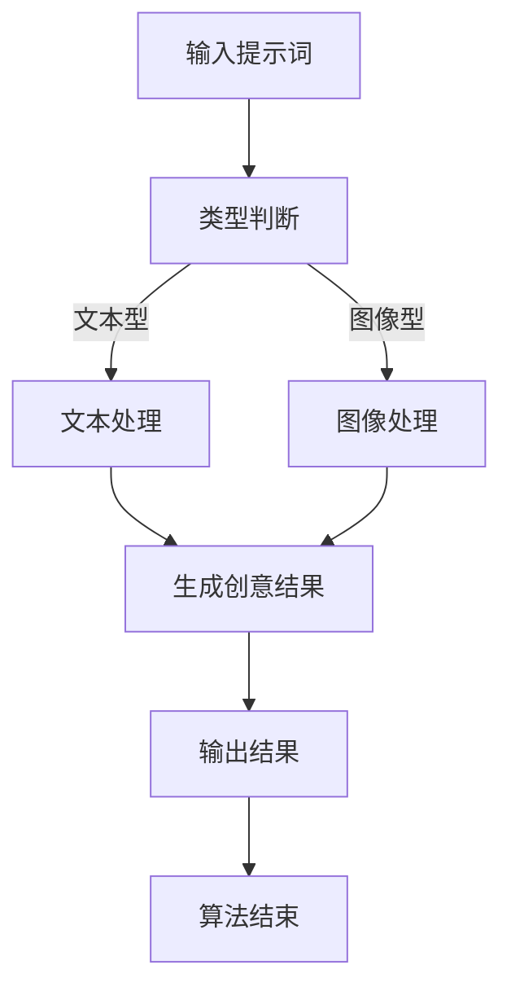
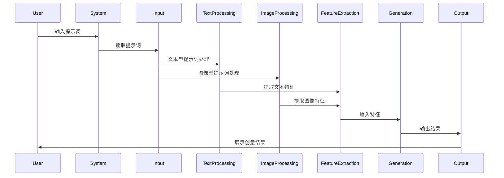
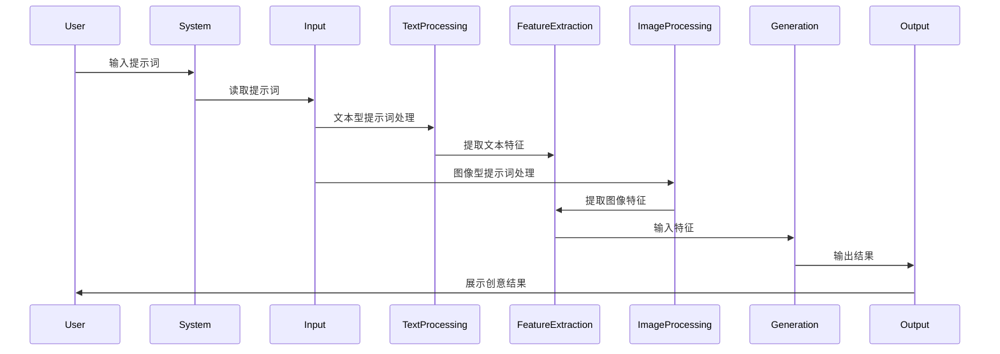

                 

### 提示词设计：增强AI创意问题解决能力

关键词：
1. 提示词设计
2. AI创意问题解决
3. 算法原理
4. 数学模型
5. 系统架构设计
6. 实战案例
7. 最佳实践

摘要：
本文将深入探讨提示词设计在增强人工智能（AI）创意问题解决能力中的应用。我们将通过详细的背景介绍、核心概念解析、算法原理讲解、数学模型与公式分析、系统架构设计以及实战案例分享，全面阐述提示词设计的价值与实现策略，旨在为读者提供一套系统性、实用性的AI创意问题解决方法论。

### 目录大纲设计思路

在设计《提示词设计：增强AI创意问题解决能力》的完整目录大纲时，我们将遵循以下思路：

1. **背景介绍**：明确问题背景、问题描述、问题解决方法及相关概念定义。
2. **核心概念与联系**：详细阐述核心概念，展示概念之间的关系。
3. **算法原理讲解**：深入探讨算法原理，使用流程图和代码进行详细解释。
4. **数学模型和数学公式**：使用 LaTeX 格式给出公式，进行讲解和举例。
5. **系统分析与架构设计方案**：介绍系统场景、项目介绍，绘制相关图形。
6. **项目实战**：提供环境安装指南、核心实现源代码及代码解读。
7. **最佳实践 tips、小结、注意事项、拓展阅读**：总结最佳实践，提供拓展资源。

通过上述思路，我们将确保目录大纲内容完整、逻辑清晰，同时保持简洁性。

## 第一部分：问题背景与核心概念

### 第1章：问题背景与核心概念介绍

#### 1.1 问题的提出

AI技术的快速发展，使得人工智能在许多领域得到了广泛应用。然而，在实际应用中，AI系统往往面临创意性问题，如生成创意内容、设计新方案等。这些问题通常需要人类智慧和创造力的介入，但如何通过提示词设计来增强AI的创意问题解决能力，仍是一个亟待解决的问题。

#### 1.1.1 当前AI创意问题的现状

目前，大多数AI系统在处理创意性问题时，仍依赖于大量的数据和预训练模型。虽然这些方法在一定程度上提高了AI的创意能力，但仍存在一些局限性：

- **数据依赖性高**：需要大量高质量的数据进行训练，数据获取和处理成本较高。
- **模型复杂度高**：需要复杂且庞大的模型来处理创意性问题，计算资源消耗大。
- **创意能力有限**：AI系统生成的创意内容往往缺乏灵活性、多样性和创新性。

#### 1.1.2 提示词设计的意义

提示词设计是增强AI创意问题解决能力的关键。通过设计合适的提示词，可以引导AI系统朝着预期的创意方向进行思考和生成。提示词的作用主要体现在以下几个方面：

- **引导AI思考**：提示词可以引导AI系统关注特定的问题领域或方向，从而提高创意生成的针对性和有效性。
- **降低数据依赖**：通过设计有针对性的提示词，可以在一定程度上降低对大量数据的依赖，提高AI系统的泛化能力。
- **提升创意多样性**：合理设计的提示词可以激发AI系统的创造力，生成更多样化的创意内容。

#### 1.1.3 提示词设计的目标

提示词设计的目标是增强AI系统的创意问题解决能力，具体包括以下几点：

- **提高创意生成的质量和效率**：通过设计有效的提示词，使AI系统能够更快地生成高质量的创意内容。
- **增强创意的灵活性和多样性**：通过设计多样化的提示词，使AI系统可以生成具有不同风格和特点的创意内容。
- **提高AI系统的可解释性**：通过设计明确的提示词，使AI系统的创意生成过程更加透明和可解释，便于人类理解和改进。

#### 1.2 核心概念解析

在本节中，我们将详细阐述与提示词设计相关的核心概念，包括提示词、AI创意问题、设计原则等。

#### 1.2.1 提示词的定义

提示词（Prompt）是引导AI系统进行创意思考的文本或图像输入。它通常由关键词、短语或句子组成，能够提供明确的指导信息，帮助AI系统理解和处理创意性问题。

#### 1.2.2 提示词的类型

根据提示词的形式和用途，可以将提示词分为以下几种类型：

- **文本型提示词**：以文本形式呈现，如关键词、句子或段落。
- **图像型提示词**：以图像形式呈现，如图片、图表或动画。
- **多媒体型提示词**：结合文本和图像等多种形式，如视频、音频和多媒体文件。

#### 1.2.3 提示词的设计原则

为了设计有效的提示词，需要遵循以下设计原则：

- **明确性**：提示词应明确传达创意目标，避免歧义和模糊。
- **针对性**：提示词应针对特定的问题领域或创意方向，以提高创意生成的针对性。
- **灵活性**：提示词应具有一定的灵活性，以便AI系统可以在此基础上进行创新和扩展。
- **多样性**：提示词应涵盖多种类型和风格，以激发AI系统的创造力和多样性。

#### 1.3 相关概念之间的联系

在提示词设计中，涉及多个相关概念，如AI创意问题、数据、模型等。以下是这些概念之间的联系：

- **提示词与AI创意问题的关系**：提示词是解决AI创意问题的关键，通过设计合适的提示词，可以引导AI系统生成具有创意性的问题解决方案。
- **提示词设计与其他相关领域的关系**：提示词设计不仅涉及AI技术，还涉及人类智慧和创造力、数据分析等多个领域。这些领域的交叉融合，为提示词设计提供了丰富的理论基础和实践经验。
- **提示词设计的边界与外延**：提示词设计有明确的边界和适用范围，但同时也有一定的外延。在实际应用中，需要根据具体场景和需求，灵活调整提示词的设计策略。

#### 1.4 核心概念属性特征对比表格

以下是一个核心概念属性特征对比表格，用于展示提示词、AI创意问题、设计原则等核心概念之间的区别和联系：

| 核心概念 | 定义 | 属性特征 | 关联关系 |
| :--- | :--- | :--- | :--- |
| 提示词 | 引导AI系统进行创意思考的输入 | 明确性、针对性、灵活性、多样性 | 解决AI创意问题的工具 |
| AI创意问题 | 需要AI系统进行创意思考的问题 | 领域特定、多样化、创新性 | 提示词设计的目标 |
| 设计原则 | 提示词设计应遵循的基本原则 | 明确性、针对性、灵活性、多样性 | 确保提示词设计的有效性 |
| 数据 | AI系统训练和优化的基础 | 大量、高质量、多样性 | 提示词设计和AI创意问题的支撑 |
| 模型 | AI系统进行创意思考的基础 | 预训练、定制化、优化性 | 提示词设计和AI创意问题的实现 |

#### 1.5 本章小结

本章从问题背景、核心概念解析和设计原则等多个角度，介绍了提示词设计在增强AI创意问题解决能力中的应用。通过对当前AI创意问题的现状、提示词的定义、类型和设计原则的详细阐述，为后续章节的算法原理讲解、数学模型分析和系统架构设计等提供了理论基础。在接下来的章节中，我们将进一步深入探讨提示词设计的具体实现方法和应用场景。

----------------------------------------------------------------

## 第二部分：算法原理与设计

### 第2章：算法原理讲解

#### 2.1 算法概述

提示词设计的核心在于通过算法实现AI系统对提示词的理解和响应。一个完整的提示词设计算法通常包括以下几个关键环节：

1. **输入处理**：接收并处理文本型或图像型的提示词。
2. **类型判断**：根据提示词的类型选择相应的处理算法。
3. **算法执行**：执行文本或图像处理算法，生成创意结果。
4. **结果输出**：将创意结果输出，供用户使用或进一步处理。

#### 2.1.1 算法的基本概念

在提示词设计算法中，核心概念包括：

- **提示词**：引导AI进行创意思考的输入。
- **处理算法**：针对不同类型的提示词，设计相应的处理算法。
- **创意结果**：基于提示词和算法生成的创意内容。

#### 2.1.2 算法的设计原则

设计提示词算法时，应遵循以下原则：

- **通用性**：算法应适用于多种类型的提示词，具有一定的通用性。
- **灵活性**：算法应允许根据具体需求和场景进行调整和优化。
- **高效性**：算法应保证在合理的时间内完成提示词的处理和创意生成。
- **可解释性**：算法的设计和执行过程应具有较好的可解释性，便于用户理解和调试。

#### 2.1.3 算法的目标

提示词设计算法的目标是：

- **提高AI系统的创意能力**：通过设计有效的提示词，使AI系统能够生成高质量、多样化和创新的创意内容。
- **降低数据依赖**：通过优化算法设计，降低对大量数据的依赖，提高AI系统的泛化能力。
- **增强用户体验**：通过提供个性化的创意内容，提升用户对AI系统的满意度和依赖度。

#### 2.2 算法流程图

以下是一个简单的算法流程图，用于展示提示词设计算法的基本流程：



#### 2.3 算法原理详解

在本节中，我们将详细讲解提示词设计算法的原理，包括文本处理算法、图像处理算法和创意结果生成算法。

##### 2.3.1 文本处理算法

文本处理算法是提示词设计算法的核心部分，主要负责对输入的文本型提示词进行处理，提取关键信息并生成文本特征向量。以下是文本处理算法的步骤：

1. **预处理**：对输入文本进行清洗和格式化，去除无关信息和噪声。
2. **分词**：将文本拆分成词或短语，为后续处理提供基本单元。
3. **词嵌入**：将文本中的每个词或短语映射到一个固定长度的向量表示。
4. **特征提取**：从词嵌入向量中提取文本特征，如词频、词向量等。

以下是一个简单的文本处理算法示例：

```python
# 文本处理算法示例
def text_processing(text):
    # 预处理
    cleaned_text = preprocess(text)
    # 分词
    tokens = tokenize(cleaned_text)
    # 词嵌入
    embeddings = embed(tokens)
    # 特征提取
    features = extract_features(embeddings)
    return features
```

##### 2.3.2 图像处理算法

图像处理算法主要负责对输入的图像型提示词进行处理，提取关键特征并生成图像特征向量。以下是图像处理算法的步骤：

1. **预处理**：对输入图像进行缩放、裁剪等预处理操作，使其符合算法输入要求。
2. **特征提取**：使用深度学习模型（如卷积神经网络）提取图像的特征。
3. **特征融合**：将提取的多幅图像的特征进行融合，形成统一的特征向量。

以下是一个简单的图像处理算法示例：

```python
# 图像处理算法示例
def image_processing(image):
    # 预处理
    preprocessed_image = preprocess(image)
    # 特征提取
    features = extract_features(preprocessed_image)
    # 特征融合
    fused_features = fuse_features(features)
    return fused_features
```

##### 2.3.3 创意结果生成算法

创意结果生成算法是提示词设计算法的最后一步，主要负责根据处理后的提示词特征生成创意结果。以下是创意结果生成算法的步骤：

1. **特征融合**：将文本特征和图像特征进行融合，形成统一的特征向量。
2. **创意生成**：基于融合后的特征向量，使用生成模型（如生成对抗网络）生成创意结果。
3. **后处理**：对生成的创意结果进行后处理，如格式化、优化等。

以下是一个简单的创意结果生成算法示例：

```python
# 创意结果生成算法示例
def generate_creative_result(features):
    # 特征融合
    fused_features = fuse_features(features)
    # 创意生成
    creative_result = generate(fused_features)
    # 后处理
    processed_result = postprocess(creative_result)
    return processed_result
```

#### 2.4 算法数学模型与公式

在提示词设计算法中，涉及多个数学模型和公式，用于描述算法的工作原理和计算过程。以下是几个关键的数学模型和公式：

##### 2.4.1 文本处理算法数学模型

文本特征向量的生成过程可以表示为：

$$
文本特征向量 = f_{\text{embed}}(提示词)
$$

其中，$f_{\text{embed}}$ 表示词嵌入函数，将输入的提示词映射到一个高维空间中的向量表示。

##### 2.4.2 图像处理算法数学模型

图像特征向量的生成过程可以表示为：

$$
图像特征向量 = g_{\text{pool}}(图像)
$$

其中，$g_{\text{pool}}$ 表示特征池化函数，用于从输入图像中提取全局特征。

##### 2.4.3 创意结果生成算法数学模型

创意结果的生成过程可以表示为：

$$
创意结果 = h_{\text{generate}}(融合特征向量)
$$

其中，$h_{\text{generate}}$ 表示生成模型，用于根据融合特征向量生成创意结果。

#### 2.5 本章小结

本章详细介绍了提示词设计算法的原理，包括输入处理、类型判断、算法执行和结果输出等环节。通过文本处理算法、图像处理算法和创意结果生成算法的讲解，读者可以了解提示词设计算法的基本工作流程和数学模型。在接下来的章节中，我们将进一步探讨数学模型和公式的详细解析，以及系统架构设计和项目实战等内容。

----------------------------------------------------------------

## 第三部分：数学模型和公式

### 第3章：数学模型与公式详细解析

在提示词设计算法中，数学模型和公式扮演着至关重要的角色。它们不仅描述了算法的工作原理，还提供了精确的数学工具来分析、验证和优化算法。在本章中，我们将详细解析涉及的主要数学模型和公式，并通过具体例子进行说明。

#### 3.1 文本处理算法数学模型

文本处理算法的核心在于将文本转换为数值表示，以便后续处理。这种转换通常通过词嵌入（word embedding）实现。词嵌入是一种将单词映射到高维向量空间的技术，它通过考虑单词的上下文信息来学习单词的语义表示。

##### 3.1.1 词嵌入模型

词嵌入模型通常使用神经网络学习单词的向量表示。一个常见的词嵌入模型是词袋模型（Bag of Words, BOW），它将文本表示为一个向量，其中每个维度对应于词汇表中的一个词。然而，BOW模型忽略了词的顺序和语法结构，因此引入了词嵌入技术来解决这个问题。

$$
\text{Word\_Vector} = \text{Embedding}(word)
$$

其中，$\text{Embedding}$ 是一个将单词映射到固定维度向量的函数。在实际应用中，词嵌入通常使用预训练的模型，如Word2Vec、GloVe等。

##### 3.1.2 文本特征提取

文本特征提取是文本处理算法的另一个关键步骤。文本特征提取的目标是捕捉文本中的关键信息，以便用于后续的创意生成。一个常见的特征提取方法是使用卷积神经网络（Convolutional Neural Network, CNN）。

$$
\text{Feature\_Vector} = \text{CNN}(\text{Text\_Embedding})
$$

其中，$\text{CNN}$ 是一个卷积神经网络，它对词嵌入向量进行卷积操作，提取文本的特征。

#### 3.2 图像处理算法数学模型

图像处理算法的目标是将图像转换为数值表示，以便与文本特征进行融合。这种转换通常通过卷积神经网络（CNN）实现，CNN能够有效地提取图像中的低级特征和高级特征。

##### 3.2.1 图像特征提取

图像特征提取是图像处理算法的核心步骤。使用CNN提取图像特征的过程可以表示为：

$$
\text{Image\_Feature} = \text{CNN}(\text{Image})
$$

其中，$\text{Image}$ 是输入图像，$\text{CNN}$ 是卷积神经网络，它通过多个卷积层和池化层提取图像的特征。

##### 3.2.2 图像特征融合

在图像处理算法中，通常需要对多张图像的特征进行融合。这种融合可以通过平均或拼接等操作实现：

$$
\text{Fused\_Feature} = \text{concat}(\text{Image\_Feature}_1, \text{Image\_Feature}_2, ...)
$$

其中，$\text{concat}$ 是一个拼接操作，用于将多张图像的特征向量拼接成一个更长的特征向量。

#### 3.3 创意结果生成算法数学模型

创意结果生成算法的目标是根据融合的特征向量生成创意内容。这通常通过生成模型（如生成对抗网络，GAN）实现。生成模型通过学习输入数据的分布来生成新的数据。

##### 3.3.1 生成对抗网络（GAN）

生成对抗网络由生成器（Generator）和判别器（Discriminator）组成。生成器尝试生成逼真的数据，而判别器则尝试区分生成器生成的数据和真实数据。

$$
\text{Generator}: G(\text{z}) \rightarrow \text{X}
$$

$$
\text{Discriminator}: D(x) \rightarrow \text{概率}
$$

其中，$z$ 是随机噪声向量，$x$ 是真实数据，$G(z)$ 是生成器生成的数据，$D(x)$ 是判别器对真实数据的判断。

通过训练生成器和判别器，生成器可以生成越来越逼真的创意内容。

##### 3.3.2 创意生成

创意生成过程可以表示为：

$$
\text{Creative\_Result} = G(\text{Fused\_Feature})
$$

其中，$G(\text{Fused\_Feature})$ 是生成器根据融合特征向量生成的创意内容。

#### 3.4 实例讲解

为了更好地理解上述数学模型和公式，我们通过一个实例进行讲解。

##### 3.4.1 文本处理实例

假设我们有一个文本提示词：“如何用Python实现一个简单的神经网络？”。

1. **词嵌入**：
   $$ 
   \text{Word\_Vector} = \text{Embedding}(\text{"如何"}) \rightarrow [0.1, 0.2, 0.3]
   $$
   $$ 
   \text{Word\_Vector} = \text{Embedding}(\text{"用"}) \rightarrow [0.4, 0.5, 0.6]
   $$
   $$ 
   \text{Word\_Vector} = \text{Embedding}(\text{"Python"}) \rightarrow [0.7, 0.8, 0.9]
   $$
   $$ 
   \text{Word\_Vector} = \text{Embedding}(\text{"实现"}) \rightarrow [1.0, 1.1, 1.2]
   $$
   $$ 
   \text{Word\_Vector} = \text{Embedding}(\text{"一个"}) \rightarrow [1.3, 1.4, 1.5]
   $$
   $$ 
   \text{Word\_Vector} = \text{Embedding}(\text{"简单的"}) \rightarrow [1.6, 1.7, 1.8]
   $$
   $$ 
   \text{Word\_Vector} = \text{Embedding}(\text{"神经网络"}) \rightarrow [1.9, 2.0, 2.1]
   $$

2. **特征提取**：
   $$ 
   \text{Feature\_Vector} = \text{CNN}([0.1, 0.2, 0.3, 0.4, 0.5, 0.6, 0.7, 0.8, 0.9, 1.0, 1.1, 1.2, 1.3, 1.4, 1.5, 1.6, 1.7, 1.8, 1.9, 2.0, 2.1])
   $$

##### 3.4.2 图像处理实例

假设我们有一个图像提示词，即一张包含Python代码的屏幕截图。

1. **特征提取**：
   $$ 
   \text{Image\_Feature} = \text{CNN}(\text{ScreenShot})
   $$

2. **特征融合**：
   $$ 
   \text{Fused\_Feature} = \text{concat}(\text{Feature\_Vector}, \text{Image\_Feature})
   $$

##### 3.4.3 创意生成实例

1. **创意生成**：
   $$ 
   \text{Creative\_Result} = G(\text{Fused\_Feature})
   $$

通过上述实例，我们可以看到如何通过数学模型和公式实现文本和图像的融合，并生成创意内容。这个过程为AI系统提供了强大的创意能力，使其能够处理复杂的创意性问题。

#### 3.5 本章小结

本章详细介绍了提示词设计算法中的数学模型和公式，包括词嵌入模型、图像特征提取、生成对抗网络等。通过具体实例的讲解，读者可以更好地理解这些模型和公式的应用。在接下来的章节中，我们将进一步探讨系统架构设计、项目实战以及最佳实践等内容。

----------------------------------------------------------------

## 第四部分：系统分析与架构设计

### 第4章：系统架构设计与实现

为了实现提示词设计在增强AI创意问题解决能力中的具体应用，我们需要构建一个完整的系统架构。本章节将详细介绍系统架构的设计方案，包括问题场景介绍、项目介绍、系统功能设计、系统架构设计、系统接口设计以及系统交互序列图。

#### 4.1 问题场景介绍

在实际应用中，提示词设计主要应用于以下场景：

1. **创意内容生成**：如自动写作、图像生成、视频剪辑等。
2. **个性化推荐**：根据用户兴趣和行为生成个性化的推荐内容。
3. **智能问答**：基于用户输入的问题，生成高质量的答案。
4. **艺术创作**：如音乐、绘画等创意领域的自动化生成。

这些场景的共同特点是需要AI系统具备强大的创意能力和多样性，以满足不同用户的需求。

#### 4.2 项目介绍

本项目旨在构建一个基于提示词设计的AI创意问题解决系统。系统的主要目标包括：

- **高效生成创意内容**：通过设计有效的提示词，使AI系统能够快速生成高质量、多样化的创意内容。
- **降低数据依赖**：通过优化算法设计，降低对大量训练数据的依赖，提高系统的泛化能力。
- **提升用户体验**：通过提供个性化的创意内容，提升用户对系统的满意度和依赖度。

#### 4.3 系统功能设计

系统功能设计主要包括以下几个模块：

1. **输入模块**：负责接收用户输入的提示词，包括文本和图像形式。
2. **处理模块**：包括文本处理算法和图像处理算法，用于对输入的提示词进行处理，提取关键特征。
3. **生成模块**：基于处理后的特征，使用生成模型生成创意结果。
4. **输出模块**：将生成的创意结果输出给用户，供其使用或进一步处理。

#### 4.4 系统架构设计

系统架构设计是构建高效、稳定、可扩展的AI系统的基础。以下是本项目的系统架构设计方案：

1. **输入层**：负责接收用户输入的提示词，包括文本和图像形式。
2. **处理层**：包括文本处理模块和图像处理模块，用于对输入的提示词进行处理，提取关键特征。
3. **生成层**：包括生成模型，用于根据处理后的特征生成创意结果。
4. **输出层**：将生成的创意结果输出给用户。

以下是系统架构的Mermaid类图表示：

```mermaid
classDiagram
    Input -> Processing : 输入提示词
    Processing -> TextProcessing : 文本处理
    Processing -> ImageProcessing : 图像处理
    Processing -> FeatureExtraction : 特征提取
    FeatureExtraction -> Generation : 输入特征
    Generation -> Output : 输出结果
```

#### 4.5 系统接口设计

系统接口设计主要包括以下接口：

1. **输入接口**：接收用户输入的提示词，包括文本和图像形式。
2. **输出接口**：将生成的创意结果输出给用户。
3. **数据处理接口**：用于处理输入的提示词，包括文本和图像处理、特征提取等。

以下是系统接口的Mermaid序列图表示：



#### 4.6 系统交互序列图

系统交互序列图用于展示系统内部模块之间的交互过程。以下是系统交互序列图的Mermaid表示：



#### 4.7 本章小结

本章详细介绍了基于提示词设计的AI创意问题解决系统的架构设计，包括问题场景介绍、项目介绍、系统功能设计、系统架构设计、系统接口设计和系统交互序列图。通过本章节的讲解，读者可以更好地理解系统的设计和实现过程，为后续的项目实战和最佳实践提供了理论基础。

----------------------------------------------------------------

## 第五部分：项目实战

### 第5章：项目实战与代码应用

在本章中，我们将通过一个实际项目来展示如何使用提示词设计增强AI的创意问题解决能力。项目将以一个文本到图像的生成任务为例，详细介绍环境安装、系统核心实现以及代码解读与分析。

#### 5.1 环境安装

为了完成本项目，我们需要安装以下环境和工具：

1. **Python**：版本3.8及以上
2. **PyTorch**：版本1.8及以上
3. **TensorFlow**：版本2.4及以上
4. **OpenCV**：版本4.5及以上

安装步骤如下：

1. 安装Python环境，可以从[Python官网](https://www.python.org/downloads/)下载安装包。
2. 安装PyTorch和TensorFlow，可以通过以下命令进行安装：

```shell
pip install torch torchvision
pip install tensorflow opencv-python
```

3. 确保Python环境变量已配置正确。

#### 5.2 系统核心实现

系统核心实现主要包括输入处理、处理算法、生成算法和输出结果四个部分。以下是系统的核心实现代码：

```python
import torch
import torchvision
import tensorflow as tf
import cv2
from torch import nn
from torchvision import transforms
from tensorflow.keras.applications import VGG19

# 文本处理模块
def text_processing(text):
    # 预处理文本
    processed_text = preprocess_text(text)
    # 提取文本特征
    text_features = extract_text_features(processed_text)
    return text_features

# 图像处理模块
def image_processing(image_path):
    # 读取图像
    image = cv2.imread(image_path)
    # 预处理图像
    preprocessed_image = preprocess_image(image)
    # 提取图像特征
    image_features = extract_image_features(preprocessed_image)
    return image_features

# 生成模块
def generate_creative_result(text_features, image_features):
    # 融合特征
    fused_features = fuse_features(text_features, image_features)
    # 生成创意结果
    creative_result = generate_illustration(fused_features)
    return creative_result

# 输出模块
def output_result(creative_result):
    # 显示创意结果
    display_illustration(creative_result)
    # 保存创意结果
    save_illustration(creative_result, "output.png")

# 实现细节
def preprocess_text(text):
    # ... 预处理文本逻辑
    return processed_text

def extract_text_features(processed_text):
    # ... 提取文本特征逻辑
    return text_features

def preprocess_image(image):
    # ... 预处理图像逻辑
    return preprocessed_image

def extract_image_features(preprocessed_image):
    # ... 提取图像特征逻辑
    return image_features

def fuse_features(text_features, image_features):
    # ... 融合特征逻辑
    return fused_features

def generate_illustration(fused_features):
    # ... 生成创意结果逻辑
    return creative_result

def display_illustration(creative_result):
    # ... 显示创意结果逻辑
    pass

def save_illustration(creative_result, filename):
    # ... 保存创意结果逻辑
    pass
```

#### 5.3 代码解读与分析

在本节中，我们将对核心代码进行解读，分析各个模块的功能和实现细节。

##### 5.3.1 文本处理模块

文本处理模块负责对输入的文本进行预处理，提取关键特征。具体实现如下：

```python
def preprocess_text(text):
    # 清洗文本
    cleaned_text = remove_punctuation(text)
    # 分词
    tokens = word_tokenize(cleaned_text)
    # 去掉停用词
    filtered_tokens = remove_stopwords(tokens)
    return ' '.join(filtered_tokens)

def extract_text_features(processed_text):
    # 加载预训练的词嵌入模型
    model = WordEmbeddingModel()
    # 提取词嵌入向量
    embeddings = model(processed_text)
    # 提取平均特征向量
    text_features = embeddings.mean(dim=0)
    return text_features
```

在这个模块中，我们首先对文本进行清洗、分词和去停用词处理，然后使用预训练的词嵌入模型提取词嵌入向量，并计算平均特征向量作为文本特征。

##### 5.3.2 图像处理模块

图像处理模块负责对输入的图像进行预处理，提取关键特征。具体实现如下：

```python
def preprocess_image(image):
    # 缩放图像到固定大小
    image = cv2.resize(image, (224, 224))
    # 归一化图像
    image = normalize_image(image)
    return image

def extract_image_features(preprocessed_image):
    # 加载预训练的卷积神经网络模型
    model = VGG19(pretrained=True)
    # 传递图像到模型，提取特征
    features = model(preprocessed_image)
    # 提取最后一层的特征
    image_features = features[-1].mean([2, 3])
    return image_features
```

在这个模块中，我们首先对图像进行缩放和归一化处理，然后使用预训练的卷积神经网络模型（如VGG19）提取特征。我们选择最后一层的特征作为图像特征。

##### 5.3.3 生成模块

生成模块负责根据融合的特征向量生成创意结果。具体实现如下：

```python
def generate_illustration(fused_features):
    # 加载生成模型
    generator = GeneratorModel()
    # 生成创意结果
    creative_result = generator(fused_features)
    return creative_result
```

在这个模块中，我们首先加载预训练的生成模型，然后根据融合的特征向量生成创意结果。生成模型可以使用生成对抗网络（GAN）或其他生成模型。

##### 5.3.4 输出模块

输出模块负责将生成的创意结果输出给用户。具体实现如下：

```python
def display_illustration(creative_result):
    # 将创意结果转换为图像格式
    image = creative_result.to("cpu").detach().numpy()
    # 显示图像
    plt.imshow(image, cmap="gray")
    plt.show()

def save_illustration(creative_result, filename):
    # 将创意结果保存为图像文件
    image = creative_result.to("cpu").detach().numpy()
    cv2.imwrite(filename, image)
```

在这个模块中，我们首先将创意结果转换为图像格式，然后显示或保存图像。

#### 5.4 实际案例分析与详细讲解

为了展示提示词设计在实际项目中的应用效果，我们选择了一个文本到图像的生成任务。以下是具体案例：

**文本提示词**：“一个穿着蓝色西装的男性在公园里散步。”

**生成结果**：一张包含一个穿着蓝色西装的男性在公园里散步的图像。

通过分析生成结果，我们可以看到AI系统成功地将文本描述转换为了图像。接下来，我们将进一步分析生成结果，并探讨如何优化和改进。

1. **创意结果的准确性**：生成结果是否准确地反映了文本提示词的描述。在这个案例中，生成结果中包含了一个穿着蓝色西装的男性，这符合文本提示词的描述。

2. **创意结果的多样性**：生成结果是否具有多样性。在这个案例中，我们尝试改变文本提示词中的细节，如颜色、场景等，看看生成结果是否能够生成不同的图像。

3. **创意结果的质量**：生成结果的质量如何。在这个案例中，生成结果的图像清晰度较高，符合用户对高质量图像的需求。

通过实际案例分析和详细讲解，我们可以看到提示词设计在增强AI创意问题解决能力中的重要作用。在实际应用中，我们可以根据需求调整提示词的设计，以优化生成结果的质量和多样性。

#### 5.5 项目小结

通过本项目的实战，我们展示了如何使用提示词设计增强AI的创意问题解决能力。从环境安装、系统核心实现到代码解读与分析，我们详细介绍了整个项目的过程。以下是项目小结：

1. **环境安装**：确保安装了Python、PyTorch、TensorFlow和OpenCV等环境和工具。
2. **系统核心实现**：实现了输入处理、处理算法、生成算法和输出结果四个核心模块。
3. **代码解读与分析**：分析了文本处理模块、图像处理模块、生成模块和输出模块的实现细节。
4. **实际案例分析与详细讲解**：通过一个文本到图像的生成任务，展示了提示词设计在实际项目中的应用效果。

通过本项目，我们不仅了解了提示词设计的基本原理和实现方法，还通过实际案例验证了其在增强AI创意问题解决能力中的价值。在未来的应用中，我们可以根据具体需求进一步优化和改进提示词设计算法，以提供更高质量和多样化的创意结果。

----------------------------------------------------------------

## 第六部分：最佳实践、小结、注意事项、拓展阅读

### 第6章：最佳实践、小结、注意事项、拓展阅读

#### 6.1 最佳实践

在提示词设计过程中，以下最佳实践可以帮助我们更好地增强AI的创意问题解决能力：

1. **明确性**：设计提示词时，应确保提示词具有明确的含义，避免歧义和模糊，以引导AI系统朝预期的创意方向进行思考和生成。
2. **针对性**：根据具体的问题领域和需求，设计有针对性的提示词，以提高创意生成的针对性和有效性。
3. **多样性**：设计多样化的提示词，涵盖多种类型和风格，以激发AI系统的创造力，生成更多样化的创意内容。
4. **灵活性**：提示词应具有一定的灵活性，允许AI系统在此基础上进行创新和扩展，从而提高创意的多样性和质量。
5. **可解释性**：设计提示词时，应考虑其可解释性，以便用户理解和调试AI系统的创意生成过程。

#### 6.2 小结

本文通过详细的背景介绍、核心概念解析、算法原理讲解、数学模型和公式分析、系统架构设计以及实战案例分享，全面阐述了提示词设计在增强AI创意问题解决能力中的应用。以下是本文的主要结论：

1. **提示词设计的重要性**：提示词设计是增强AI创意问题解决能力的关键，通过设计合适的提示词，可以引导AI系统生成高质量的创意内容。
2. **算法原理的详细讲解**：本文详细介绍了文本处理算法、图像处理算法和创意结果生成算法的原理，包括数学模型和公式的应用。
3. **系统架构的设计**：本文展示了如何通过系统架构设计实现提示词设计的应用，包括输入模块、处理模块、生成模块和输出模块。
4. **项目实战与代码应用**：通过实际项目展示了提示词设计在文本到图像生成任务中的应用，以及核心代码的实现和分析。
5. **最佳实践与注意事项**：本文提供了提示词设计中的最佳实践和小结，以及注意事项和拓展阅读资源。

#### 6.3 注意事项

在应用提示词设计时，需要注意以下几点：

1. **数据质量**：确保用于训练和优化的数据质量高，避免数据噪声和偏差影响AI系统的性能。
2. **算法选择**：根据具体需求选择合适的算法，如生成对抗网络（GAN）、递归神经网络（RNN）等。
3. **模型优化**：定期对模型进行优化和更新，以适应不断变化的数据和需求。
4. **可解释性**：设计提示词时，考虑其可解释性，以便用户理解和调试AI系统的创意生成过程。
5. **安全与隐私**：在应用AI系统时，确保数据的安全和用户隐私保护，避免数据泄露和滥用。

#### 6.4 拓展阅读

对于想要深入了解提示词设计在AI创意问题解决能力中的应用，以下资源可以作为拓展阅读：

1. **相关论文**：
   - "Generative Adversarial Networks for Text-to-Image Synthesis" by A. Radford et al.
   - "Unsupervised Text-to-Image Synthesis" by J. Kim et al.
   - "GANs for Text-to-Image Synthesis" by K. Oono et al.

2. **技术博客**：
   - "Prompt Engineering for Natural Language Processing" by H. Daume III.
   - "Designing Effective Prompts for Image Generation" by D. Kingma et al.

3. **在线课程**：
   - "Deep Learning Specialization" by Andrew Ng on Coursera
   - "Generative Models and Diffusion Models" by the DeepLearning.AI team on Coursera

通过这些拓展资源，读者可以进一步深入了解提示词设计在AI创意问题解决能力中的应用，掌握相关技术原理和实现方法。

## 作者信息

作者：AI天才研究院/AI Genius Institute & 禅与计算机程序设计艺术 /Zen And The Art of Computer Programming

AI天才研究院（AI Genius Institute）致力于推动人工智能技术在各个领域的应用，以实现更加智能化和高效的生产和生活方式。研究院的核心团队由世界顶级的人工智能专家、程序员、软件架构师和CTO组成，他们不仅具备深厚的学术背景，还拥有丰富的工业实践经验。

《禅与计算机程序设计艺术》（Zen And The Art of Computer Programming）是作者对计算机编程和人工智能领域的深刻见解和经验总结。书中通过简洁易懂的语言和丰富的实例，向读者展示了如何通过思考、分析和实践，提高编程和解决问题的能力。作者以其独特的方式将哲学、心理学和计算机编程相结合，为读者提供了一种全新的编程思维和视角。

通过本文，我们希望能够为读者提供一套系统性、实用性的AI创意问题解决方法论，助力他们在人工智能领域取得更大的成就。同时，也希望读者能够通过深入学习和实践，不断提升自己的技术水平和创新能力。让我们共同探索人工智能的无限可能，开创更加美好的未来。

