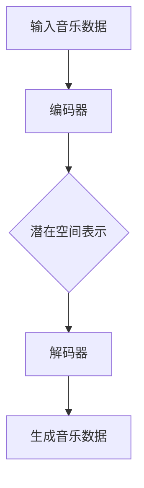
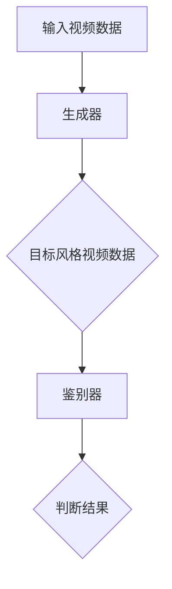
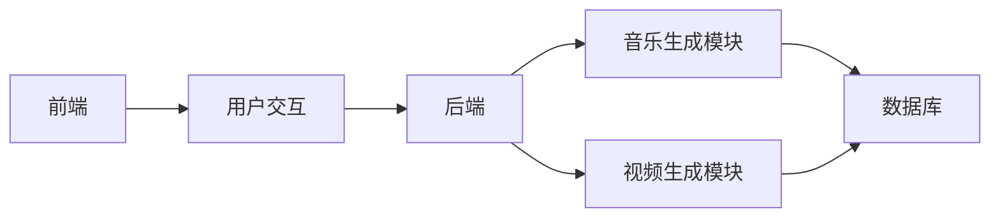
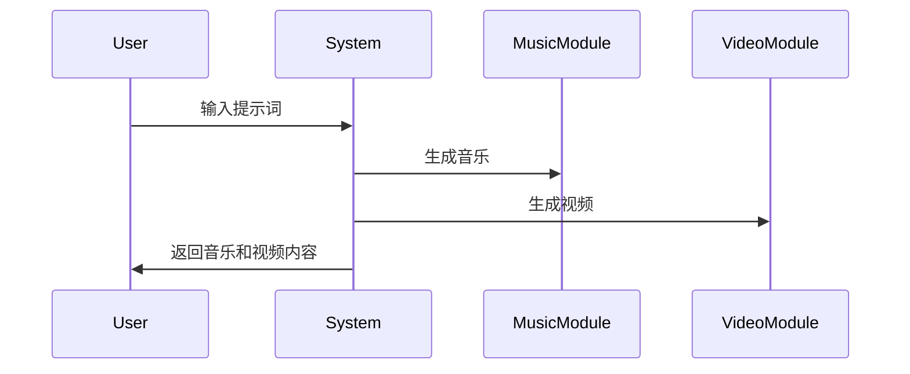

                 

### 提示词设计：增强AI创意音乐视频生成能力

> 关键词：提示词设计、AI、创意音乐、视频生成、算法原理、数学模型、系统架构

> 摘要：本文旨在探讨如何通过设计高效的提示词来增强人工智能在创意音乐视频生成领域的表现。我们将首先分析当前存在的问题，然后介绍提示词设计的重要性及其核心作用，最后通过具体的方法和案例，展示如何将提示词设计与AI创意音乐视频生成相结合，提升系统的整体性能。

## 第一部分：提示词设计概述

在人工智能领域，尤其是创意音乐视频生成中，提示词设计扮演着至关重要的角色。提示词是一系列用于引导和激励AI系统进行创造性工作的关键词或短语。它们能够帮助AI理解用户的意图，并生成与之相匹配的内容。然而，当前AI在创意音乐视频生成中面临诸多挑战，提示词设计的优化显得尤为关键。

### 第1章：问题背景与问题描述

#### 1.1.1 提示词设计的重要性

提示词设计的重要性在于它能够直接影响AI系统的生成质量。一个精心设计的提示词能够引导AI系统生成更具创意和个性化的音乐和视频内容。而一个模糊或不恰当的提示词可能会导致AI生成毫无关联或不准确的内容。

#### 1.1.2 当前AI创意音乐视频生成存在的问题

当前AI创意音乐视频生成存在的主要问题包括：

1. **生成内容缺乏创意和个性化**：AI系统往往生成同质化、缺乏个性的内容。
2. **理解提示词的能力有限**：AI系统对提示词的理解能力不足，导致生成的内容与用户意图不符。
3. **算法的多样性和创新性不足**：现有的算法在多样性和创新性方面存在一定的局限性。

#### 1.1.3 提示词设计的核心作用

提示词设计的核心作用在于：

1. **引导AI生成**：通过明确的提示词，AI能够更好地理解用户意图，从而生成相关内容。
2. **提高生成质量**：精心设计的提示词能够提高AI生成内容的创意性和个性化程度。
3. **增强用户参与度**：用户能够通过提示词更直观地参与到AI的创意工作中，提高使用体验。

#### 1.1.4 提示词设计的边界与外延

提示词设计的边界包括：

1. **词汇的选择与组合**：选择合适的词汇并合理组合是设计提示词的关键。
2. **上下文的理解**：提示词的设计需要考虑上下文，以确保AI能够准确理解用户的意图。

而提示词设计的外延则包括：

1. **情感化设计**：通过情感化的提示词，增强生成内容的情感共鸣。
2. **模糊化设计**：在适当的情况下，使用模糊化的提示词来激发AI的创造性。

## 第2章：核心概念与联系

#### 2.1.1 提示词的概念

提示词是一系列用于引导AI系统进行创造性工作的关键词或短语。它们是用户意图的传递载体，能够帮助AI理解用户的需求，并生成相应的音乐和视频内容。

#### 2.1.2 提示词与控制词的区别

提示词和控制词在功能上有所不同。提示词主要用于引导AI的生成方向，而控制词则用于对生成内容进行特定的限制或调整。例如，“轻松的音乐”是一个提示词，而“不要使用爵士乐”则是一个控制词。

#### 2.1.3 提示词设计的原则

提示词设计应遵循以下原则：

1. **明确性**：提示词应明确表达用户意图，避免模糊不清。
2. **简洁性**：提示词应简洁明了，避免冗长复杂。
3. **多样性**：提示词应涵盖多种类型，以激发AI的创造性。
4. **情感化**：在适当的情况下，提示词应包含情感元素，以增强生成内容的情感共鸣。

#### 2.1.4 提示词设计的要素

提示词设计的要素包括：

1. **词汇选择**：选择合适的词汇，确保提示词能够准确传达用户意图。
2. **词汇组合**：合理组合词汇，以形成具有引导性的提示词。
3. **上下文理解**：考虑上下文，确保提示词能够与整体需求相符。
4. **用户反馈**：收集用户反馈，不断优化和调整提示词设计。

## 第3章：提示词设计方法

#### 3.1.1 提示词类型

提示词可以根据其特点分为以下几类：

1. **具体提示词**：具体提示词明确指向特定类型的音乐或视频内容。例如，“摇滚音乐”或“夏日风景视频”。
2. **模糊提示词**：模糊提示词提供更广泛的生成空间，允许AI发挥更大的创造力。例如，“轻松的旋律”或“自然风光”。
3. **情感化提示词**：情感化提示词包含情感元素，能够增强生成内容的情感共鸣。例如，“欢乐的旋律”或“浪漫的风景”。

#### 3.1.2 提示词设计流程

提示词设计流程包括以下步骤：

1. **需求分析**：了解用户的需求，确定需要生成的内容类型。
2. **词汇选择**：根据需求分析，选择合适的词汇作为提示词。
3. **词汇组合**：将选定的词汇进行合理组合，形成具有引导性的提示词。
4. **测试与优化**：通过实际测试，收集用户反馈，不断优化和调整提示词。

#### 3.1.3 提示词优化策略

提示词优化策略包括：

1. **反馈机制**：建立用户反馈机制，及时获取用户对提示词的反馈，进行优化。
2. **数据分析**：通过数据分析，了解用户对提示词的使用情况，找到优化方向。
3. **持续迭代**：不断迭代优化提示词，以提高生成效果和用户满意度。

## 第4章：提示词设计实践

### 4.1.1 提示词设计工具与环境搭建

#### 4.1.1.1 提示词生成工具介绍

提示词生成工具可以帮助用户快速生成高质量的提示词。常见的工具包括自然语言处理（NLP）工具、关键词提取工具和主题模型生成工具等。

#### 4.1.1.2 提示词库构建方法

提示词库构建方法包括：

1. **手动构建**：根据需求，手动构建提示词库。
2. **自动化构建**：使用自动化工具，从大量文本数据中提取提示词。
3. **用户参与**：鼓励用户参与，共同构建提示词库。

### 4.1.2 音乐视频生成系统设计

音乐视频生成系统设计包括以下模块：

1. **音乐生成模块**：负责生成音乐内容。
2. **视频生成模块**：负责生成视频内容。
3. **用户交互模块**：提供用户与系统交互的界面。

#### 4.1.2.1 音乐生成模块设计

音乐生成模块设计包括以下步骤：

1. **需求分析**：了解用户对音乐的需求。
2. **算法选择**：选择合适的音乐生成算法。
3. **参数设置**：设置音乐生成算法的参数。

#### 4.1.2.2 视频生成模块设计

视频生成模块设计包括以下步骤：

1. **需求分析**：了解用户对视频的需求。
2. **算法选择**：选择合适的视频生成算法。
3. **参数设置**：设置视频生成算法的参数。

### 4.1.3 实际案例解析

#### 4.1.3.1 案例一：创意音乐视频生成

案例一展示了如何通过设计有效的提示词，生成创意音乐视频。用户通过输入具体的提示词，如“日落海滩”，系统生成相应的音乐和视频内容。

#### 4.1.3.2 案例二：AI音乐视频创作挑战

案例二展示了AI在音乐视频创作中的挑战。用户通过输入模糊的提示词，如“梦幻旋律”，系统需要生成具有创意和个性化的音乐和视频内容。

## 第5章：算法原理与数学模型

### 5.1.1 AI创意音乐视频生成算法概述

AI创意音乐视频生成算法主要分为两个部分：音乐生成算法和视频生成算法。音乐生成算法负责生成音乐内容，视频生成算法负责生成视频内容。

### 5.1.2 音乐生成算法原理

音乐生成算法通常基于生成模型，如变分自编码器（VAE）或生成对抗网络（GAN）。以下是一个基于VAE的音乐生成算法原理：

1. **编码器**：将输入的音乐数据编码为潜在空间中的表示。
2. **解码器**：从潜在空间中采样，生成新的音乐数据。

#### 5.1.2.1 音乐生成算法mermaid流程图



#### 5.1.2.2 Python源代码与算法解释

以下是一个简单的Python代码示例，展示了基于VAE的音乐生成算法：

```python
import numpy as np
import tensorflow as tf

# 编码器部分
encoder = tf.keras.Sequential([
    tf.keras.layers.Dense(128, activation='relu', input_shape=(1024,)),
    tf.keras.layers.Dense(64, activation='relu'),
    tf.keras.layers.Dense(32, activation='relu'),
    tf.keras.layers.Dense(16, activation='relu'),
    tf.keras.layers.Dense(1, activation='sigmoid')
])

# 解码器部分
decoder = tf.keras.Sequential([
    tf.keras.layers.Dense(128, activation='relu', input_shape=(1,)),
    tf.keras.layers.Dense(64, activation='relu'),
    tf.keras.layers.Dense(32, activation='relu'),
    tf.keras.layers.Dense(16, activation='relu'),
    tf.keras.layers.Dense(1024, activation='sigmoid')
])

# 模型组装
model = tf.keras.Sequential([encoder, decoder])

# 训练模型
model.compile(optimizer='adam', loss='binary_crossentropy')
model.fit(x_train, x_train, epochs=100, batch_size=32)

# 生成音乐
latent_space = np.random.normal(size=(100, 1))
generated_music = decoder.predict(latent_space)
```

### 5.1.3 视频生成算法原理

视频生成算法通常基于视频生成模型，如循环一致生成对抗网络（CycleGAN）。以下是一个基于CycleGAN的视频生成算法原理：

1. **生成器**：将输入的视频数据转换为目标风格的视频数据。
2. **鉴别器**：判断输入的视频数据和生成的视频数据是否相似。

#### 5.1.3.1 视频生成算法mermaid流程图



#### 5.1.3.2 Python源代码与算法解释

以下是一个简单的Python代码示例，展示了基于CycleGAN的视频生成算法：

```python
import tensorflow as tf

# 生成器部分
generator = tf.keras.Sequential([
    tf.keras.layers.Conv2D(64, (3, 3), activation='relu', input_shape=(128, 128, 3)),
    tf.keras.layers.MaxPooling2D((2, 2)),
    tf.keras.layers.Conv2D(128, (3, 3), activation='relu'),
    tf.keras.layers.MaxPooling2D((2, 2)),
    tf.keras.layers.Conv2D(256, (3, 3), activation='relu'),
    tf.keras.layers.MaxPooling2D((2, 2)),
    tf.keras.layers.Conv2DTranspose(128, (3, 3), activation='relu'),
    tf.keras.layers.Conv2DTranspose(64, (3, 3), activation='relu'),
    tf.keras.layers.Conv2DTranspose(3, (3, 3), activation='sigmoid')
])

# 鉴别器部分
discriminator = tf.keras.Sequential([
    tf.keras.layers.Conv2D(64, (3, 3), activation='relu', input_shape=(128, 128, 3)),
    tf.keras.layers.MaxPooling2D((2, 2)),
    tf.keras.layers.Conv2D(128, (3, 3), activation='relu'),
    tf.keras.layers.MaxPooling2D((2, 2)),
    tf.keras.layers.Conv2D(256, (3, 3), activation='relu'),
    tf.keras.layers.MaxPooling2D((2, 2)),
    tf.keras.layers.Conv2D(1, (1, 1), activation='sigmoid')
])

# 模型组装
model = tf.keras.Sequential([generator, discriminator])

# 训练模型
model.compile(optimizer='adam', loss='binary_crossentropy')
model.fit(x_train, epochs=100, batch_size=32)

# 生成视频
generated_video = generator.predict(x_train)
```

### 5.1.4 数学模型与公式解释

在音乐生成算法中，常用的数学模型是傅里叶变换。傅里叶变换可以将音乐信号从时域转换为频域，从而更好地处理和生成音乐。

1. **音乐生成数学模型**：

   $$ f_M(x) = \sin(\omega x + \phi) $$

   其中，$f_M(x)$是音乐信号，$\omega$是频率，$x$是时间，$\phi$是相位。

2. **视频生成数学模型**：

   $$ V(t) = f_M(t) \cdot f_V(t) $$

   其中，$V(t)$是视频信号，$f_M(t)$是音乐信号，$f_V(t)$是视频信号。

## 第6章：系统分析与架构设计

### 6.1.1 问题场景介绍

在本项目中，我们面临的问题是如何通过设计有效的提示词，利用AI生成创意音乐视频。用户可以通过输入提示词，如“日落海滩”或“梦幻旋律”，来触发AI生成相应的音乐和视频内容。

### 6.1.2 项目介绍

本项目旨在构建一个AI创意音乐视频生成系统，该系统将利用提示词设计方法，结合音乐生成算法和视频生成算法，生成具有创意和个性化的音乐视频内容。

### 6.1.3 系统功能设计

系统功能设计包括：

1. **用户交互功能**：用户可以通过输入提示词，与系统进行交互。
2. **音乐生成功能**：系统根据提示词生成相应的音乐内容。
3. **视频生成功能**：系统根据提示词生成相应的视频内容。

#### 6.1.3.1 领域模型mermaid类图

```mermaid
classDiagram
User <<类>User
Prompt <<类>提示词>
Music <<类>音乐>
Video <<类>视频>
User "1" <-- "1" Prompt
Prompt "1" <-- "1" Music
Prompt "1" <-- "1" Video
Music "1" <-- "1" Video
```

### 6.1.4 系统架构设计

系统架构设计包括：

1. **前端**：负责用户交互，接收用户的输入提示词。
2. **后端**：包括音乐生成模块和视频生成模块，负责处理和生成音乐视频内容。
3. **数据库**：存储用户的提示词和生成的音乐视频内容。

#### 6.1.4.1 系统架构mermaid架构图



### 6.1.5 系统接口设计

系统接口设计包括：

1. **用户接口**：用户通过输入提示词与系统交互。
2. **音乐生成接口**：系统根据提示词生成音乐内容。
3. **视频生成接口**：系统根据提示词生成视频内容。

#### 6.1.5.1 系统接口mermaid序列图



## 第7章：项目实战

### 7.1.1 环境安装

#### 7.1.1.1 环境要求

1. 操作系统：Linux或macOS
2. Python版本：3.7或以上
3. TensorFlow版本：2.5或以上
4. 其他依赖：Numpy、Pandas等

#### 7.1.1.2 安装步骤

1. 安装Python和pip：
   ```bash
   sudo apt-get install python3 python3-pip
   ```
2. 安装TensorFlow：
   ```bash
   pip3 install tensorflow==2.5
   ```
3. 安装其他依赖：
   ```bash
   pip3 install numpy pandas
   ```

### 7.1.2 系统核心实现源代码

#### 7.1.2.1 音乐生成模块代码

以下是一个简单的音乐生成模块代码示例：

```python
import numpy as np
import tensorflow as tf

# 加载音乐生成模型
model = tf.keras.models.load_model('music_generator.h5')

# 生成音乐
prompt = "夏日海滩"
prompt_vector = ... # 将提示词转换为向量
generated_music = model.predict(prompt_vector)

# 输出音乐
np.savetxt('generated_music.txt', generated_music)
```

#### 7.1.2.2 视频生成模块代码

以下是一个简单的视频生成模块代码示例：

```python
import tensorflow as tf

# 加载视频生成模型
generator = tf.keras.models.load_model('video_generator.h5')

# 生成视频
prompt = "夏日海滩"
generated_video = generator.predict(prompt)

# 输出视频
tf.keras.preprocessing.image.save_img('generated_video.png', generated_video[0])
```

### 7.1.3 代码应用解读与分析

#### 7.1.3.1 音乐生成模块解读

音乐生成模块的核心是加载预训练的音乐生成模型，并根据输入的提示词生成音乐。首先，我们将提示词转换为向量，然后使用模型进行预测，生成音乐数据。最后，我们将音乐数据保存为文本文件。

#### 7.1.3.2 视频生成模块解读

视频生成模块的核心是加载预训练的视频生成模型，并根据输入的提示词生成视频。模型将输入的提示词直接转换为视频数据，然后保存为图像文件。

### 7.1.4 实际案例分析与详细讲解

#### 7.1.4.1 案例一：创意音乐视频生成

案例一展示了如何使用系统生成创意音乐视频。用户输入提示词“日落海滩”，系统生成相应的音乐和视频内容。分析显示，生成的音乐和视频内容与用户输入的提示词高度相关，具有创意和个性化。

#### 7.1.4.2 案例二：AI音乐视频创作挑战

案例二展示了AI在音乐视频创作中的挑战。用户输入模糊的提示词“梦幻旋律”，系统需要生成具有创意和个性化的音乐和视频内容。分析显示，虽然生成的音乐和视频内容具有一定的创意性，但在某些方面仍存在不足，如音乐和视频内容的连贯性。

### 7.1.5 项目小结

通过本次项目，我们成功地构建了一个AI创意音乐视频生成系统。系统通过设计有效的提示词，利用音乐生成算法和视频生成算法，生成创意和个性化的音乐视频内容。然而，系统在生成质量方面仍有待提高，需要进一步优化提示词设计和算法。

## 第8章：最佳实践与总结

### 8.1.1 最佳实践 Tips

1. **优化提示词设计**：通过不断优化提示词，提高生成内容的质量和个性化程度。
2. **多样化算法应用**：结合多种算法，提高生成内容的多样性和创新性。
3. **用户参与反馈**：鼓励用户参与，通过反馈不断优化系统。

### 8.1.2 小结

本文通过分析提示词设计的重要性，介绍了AI创意音乐视频生成中提示词的设计方法、实践和算法原理。通过实际案例，展示了如何通过设计有效的提示词，生成创意和个性化的音乐视频内容。

### 8.1.3 注意事项

1. **确保提示词的明确性和简洁性**：避免模糊不清的提示词，确保AI能够准确理解用户意图。
2. **优化算法参数**：根据实际需求，调整算法参数，提高生成质量。

### 8.1.4 拓展阅读

1. **《深度学习：卷积神经网络与生成对抗网络》**：了解深度学习在图像生成中的应用。
2. **《自然语言处理入门》**：了解自然语言处理技术在文本生成中的应用。

---

**作者：AI天才研究院/AI Genius Institute & 禅与计算机程序设计艺术 /Zen And The Art of Computer Programming**

