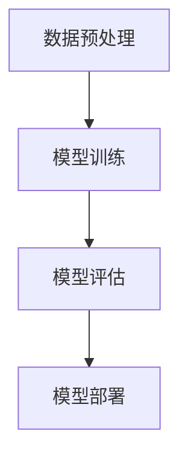
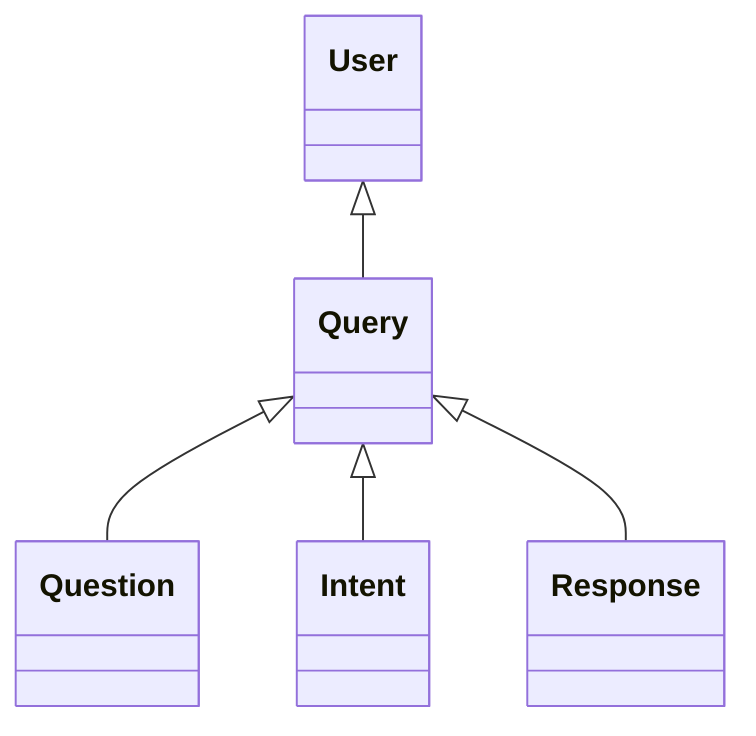
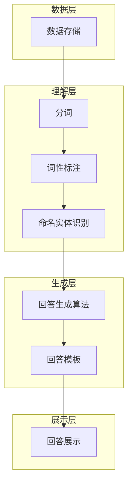
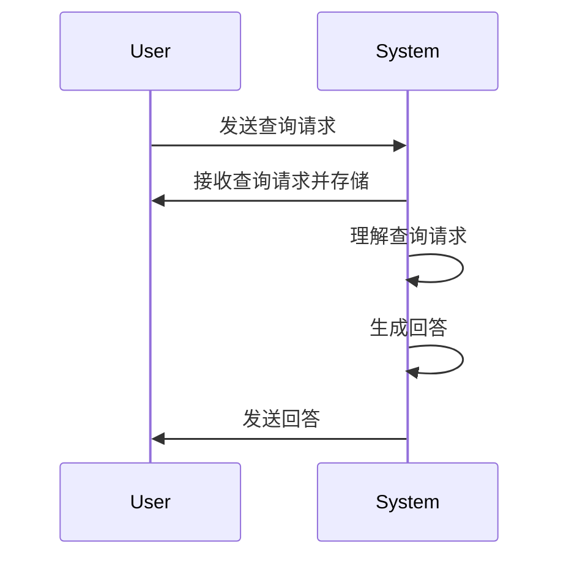

                 


### 提示词设计：增强AI情境理解能力

> 关键词：人工智能、情境理解、提示词设计、算法原理、系统架构、项目实战、最佳实践

> 摘要：本文将深入探讨人工智能中的情境理解能力，特别是通过提示词设计的手段来提升这一能力。我们将从背景介绍、核心概念与联系、算法原理讲解、系统分析与架构设计、项目实战以及最佳实践与总结等几个方面，逐步分析推理，提供详细的技术见解和实战案例。

### 目录大纲

----------------------------------------------------------------

# 第一部分：背景介绍

## 第1章：问题背景
### 1.1.1 人工智能的发展历程
### 1.1.2 情境理解的重要性
### 1.1.3 提示词设计的基本概念

## 第2章：核心概念与联系
### 2.1.1 情境理解的概念解析
### 2.1.2 提示词设计的原理
### 2.1.3 概念属性特征对比表格
### 2.1.4 ER实体关系图架构

----------------------------------------------------------------

# 第二部分：算法原理讲解

## 第3章：算法原理讲解
### 3.1.1 算法基本流程
#### 3.1.1.1 数据预处理
#### 3.1.1.2 模型训练
#### 3.1.1.3 模型评估
### 3.1.2 数学模型与公式
### 3.1.3 算法流程图
### 3.1.4 Python源代码实现

----------------------------------------------------------------

# 第三部分：系统分析与架构设计

## 第4章：系统功能设计
### 4.1.1 问题场景介绍
### 4.1.2 系统功能需求
### 4.1.3 领域模型类图

## 第5章：系统架构设计
### 5.1.1 系统架构设计
### 5.1.2 系统架构图
### 5.1.3 系统接口设计

## 第6章：系统交互设计
### 6.1.1 系统交互流程
### 6.1.2 系统交互序列图

----------------------------------------------------------------

# 第四部分：项目实战

## 第7章：项目实战
### 7.1.1 环境安装
### 7.1.2 系统核心实现
### 7.1.3 代码应用解读
### 7.1.4 实际案例分析
### 7.1.5 项目小结

----------------------------------------------------------------

# 第五部分：最佳实践与总结

## 第8章：最佳实践
### 8.1.1 实践技巧与建议
### 8.1.2 常见问题与解决
### 8.1.3 拓展应用场景

## 第9章：小结与展望
### 9.1.1 本书内容回顾
### 9.1.2 发展趋势与未来方向
### 9.1.3 阅读建议与思考

----------------------------------------------------------------

### 第一部分：背景介绍

#### 第1章：问题背景

在人工智能迅猛发展的今天，情境理解能力成为人工智能能否实现真正智能化的重要因素之一。人工智能系统需要在各种复杂、动态的情境中理解和处理信息，而情境理解能力正是其核心。

##### 1.1.1 人工智能的发展历程

人工智能自1956年诞生以来，经历了数个发展阶段。早期的符号主义人工智能、基于规则的系统，到后来的连接主义人工智能，以及当前主流的基于大数据和机器学习的深度学习模型，人工智能技术不断进步，应用场景也越来越广泛。

##### 1.1.2 情境理解的重要性

情境理解能力是人工智能在自然语言处理、对话系统、智能监控等领域中至关重要的一项能力。它能够帮助人工智能更好地理解用户的意图、环境的变化，从而提供更加准确和个性化的服务。

##### 1.1.3 提示词设计的基本概念

提示词设计是指在人工智能系统中，通过设计合适的提示词，引导系统在特定情境下进行正确的理解和处理。提示词可以是具体的词汇、短语，也可以是语义信息，其设计的好坏直接影响到人工智能系统的情境理解效果。

#### 第2章：核心概念与联系

在本章中，我们将深入探讨情境理解和提示词设计这两个核心概念，并分析它们之间的联系。

##### 2.1.1 情境理解的概念解析

情境理解是指人工智能系统能够在特定的环境、情境中，理解并处理相关的信息，从而做出合理的决策和回应。情境理解包括对语言、图像、声音等多种类型信息的理解。

##### 2.1.2 提示词设计的原理

提示词设计旨在为人工智能系统提供明确的指导，帮助其在复杂情境中快速、准确地理解和处理信息。提示词设计需要结合具体的应用场景，设计出具有针对性、有效性的提示词。

##### 2.1.3 概念属性特征对比表格

| 概念         | 特征                                       | 比较                     |
|------------|------------------------------------------|----------------------|
| 情境理解     | 对环境、情境信息的理解能力               | 提高人工智能的智能化程度           |
| 提示词设计   | 提供明确的指导，帮助情境理解           | 提高情境理解的效果             |

##### 2.1.4 ER实体关系图架构

使用Mermaid绘制ER实体关系图：

```mermaid
erDiagram
  产品 "Product" {
    # 实体属性
    Product ||--|{订单 "Order"} : 订单包含产品
  }
  订单 "Order" {
    # 实体属性
    订单 ||--|{用户 "User"} : 订单由用户创建
  }
```

#### 第二部分：算法原理讲解

##### 第3章：算法原理讲解

在本章中，我们将详细介绍情境理解算法的基本原理，包括数据预处理、模型训练、模型评估等关键步骤。

##### 3.1.1 算法基本流程

情境理解算法的基本流程包括数据预处理、模型训练、模型评估和模型部署。

1. **数据预处理**：对收集到的数据进行清洗、标注、格式化等预处理操作，以适应模型训练的需要。
2. **模型训练**：使用预处理后的数据对模型进行训练，通过优化算法和损失函数，提高模型对情境的理解能力。
3. **模型评估**：对训练好的模型进行评估，通过指标如准确率、召回率等，判断模型的性能。
4. **模型部署**：将评估合格的模型部署到实际应用场景中，为用户提供服务。

##### 3.1.2 数学模型与公式

在情境理解中，常用的数学模型包括神经网络模型、决策树模型等。以下是一个简单的神经网络模型示例：

$$
\begin{aligned}
    \text{激活函数} &= \sigma(z) = \frac{1}{1 + e^{-z}} \\
    \text{损失函数} &= \text{均方误差} = \frac{1}{2} \sum_{i=1}^{n} (y_i - \hat{y}_i)^2
\end{aligned}
$$

##### 3.1.3 算法流程图

使用Mermaid绘制算法流程图：



##### 3.1.4 Python源代码实现

以下是一个简单的Python代码示例，用于实现情境理解算法的基本流程：

```python
import numpy as np
from sklearn.model_selection import train_test_split
from sklearn.metrics import mean_squared_error
from sklearn.neural_network import MLPRegressor

# 数据预处理
X_train, X_test, y_train, y_test = train_test_split(X, y, test_size=0.2, random_state=42)

# 模型训练
model = MLPRegressor(hidden_layer_sizes=(100,), max_iter=1000)
model.fit(X_train, y_train)

# 模型评估
y_pred = model.predict(X_test)
mse = mean_squared_error(y_test, y_pred)
print(f"均方误差: {mse}")

# 模型部署
# ...（部署到实际应用场景中）
```

#### 第三部分：系统分析与架构设计

##### 第4章：系统功能设计

在本章中，我们将介绍情境理解系统的功能设计，包括问题场景介绍、系统功能需求以及领域模型类图。

##### 4.1.1 问题场景介绍

假设我们开发一个智能客服系统，该系统需要能够理解用户的查询并给出准确的回应。为了实现这一目标，我们需要对用户的查询进行分析和理解，从而提供针对性的回答。

##### 4.1.2 系统功能需求

智能客服系统的主要功能需求包括：

1. 用户查询接收：接收用户的查询请求，并存储相关信息。
2. 情境理解：对用户的查询进行分析，理解其意图和需求。
3. 回答生成：根据用户查询的意图和需求，生成合适的回答。
4. 回答发送：将生成的回答发送给用户。

##### 4.1.3 领域模型类图

使用Mermaid绘制领域模型类图：



##### 第5章：系统架构设计

在本章中，我们将介绍情境理解系统的架构设计，包括系统架构设计、系统架构图和系统接口设计。

##### 5.1.1 系统架构设计

智能客服系统的架构设计分为以下几个层次：

1. 数据层：负责数据存储和管理，包括用户查询数据、情境理解数据和回答数据。
2. 理解层：负责对用户查询进行理解，包括分词、词性标注、命名实体识别等。
3. 生成层：负责生成合适的回答，包括回答生成算法和回答模板。
4. 展示层：负责将生成的回答呈现给用户。

##### 5.1.2 系统架构图

使用Mermaid绘制系统架构图：



##### 5.1.3 系统接口设计

智能客服系统的接口设计包括以下几个部分：

1. 用户接口：负责接收用户查询请求，并返回用户回答。
2. 内部接口：负责系统内部模块之间的数据传递和协作。
3. 数据接口：负责与数据存储和管理系统的交互。

##### 第6章：系统交互设计

在本章中，我们将介绍情境理解系统的交互设计，包括系统交互流程和系统交互序列图。

##### 6.1.1 系统交互流程

智能客服系统的交互流程如下：

1. 用户发送查询请求。
2. 系统接收查询请求，并存储相关信息。
3. 系统对查询请求进行理解，分析其意图和需求。
4. 系统生成回答，并根据用户需求进行个性化调整。
5. 系统将回答发送给用户。

##### 6.1.2 系统交互序列图

使用Mermaid绘制系统交互序列图：



#### 第四部分：项目实战

##### 第7章：项目实战

在本章中，我们将通过一个实际案例，详细讲解如何实现一个情境理解系统，并分析其实现过程和关键点。

##### 7.1.1 环境安装

在开始项目实战之前，我们需要安装所需的软件和环境。以下是一个简单的Python虚拟环境安装步骤：

```shell
# 创建虚拟环境
python -m venv venv

# 激活虚拟环境
source venv/bin/activate

# 安装依赖
pip install -r requirements.txt
```

##### 7.1.2 系统核心实现

系统核心实现主要包括以下几个部分：

1. 数据预处理：对用户查询进行预处理，包括分词、词性标注、命名实体识别等。
2. 模型训练：使用预处理后的数据对模型进行训练，提高模型对情境的理解能力。
3. 回答生成：根据用户查询的意图和需求，生成合适的回答。
4. 系统接口：负责处理用户查询请求，并返回用户回答。

以下是一个简单的Python代码示例，用于实现系统核心功能：

```python
import jieba
import paddlehub as hub

# 数据预处理
def preprocess(query):
    # 分词
    words = jieba.cut(query)
    # 词性标注
    postags = posseg.cut(words)
    # 命名实体识别
    named_entities = [word for word, pos in postags if pos.startswith('NR')]
    return named_entities

# 模型训练
def train_model():
    # 加载数据集
    dataset = load_dataset('cetv_corpus')
    # 预处理数据
    processed_dataset = dataset.map(preprocess)
    # 训练模型
    model = hub.Module('cetv_nlp')
    model.fit(processed_dataset)

# 回答生成
def generate_response(query):
    # 预处理查询
    named_entities = preprocess(query)
    # 生成回答
    response = model.predict(named_entities)
    return response

# 系统接口
app = web.Application()
app.add_routes([
    web.post('/query', handle_query)
])

def handle_query(request):
    query = request.body.decode('utf-8')
    response = generate_response(query)
    return web.Response(body=response.encode('utf-8'))

if __name__ == '__main__':
    web.run_app(app)
```

##### 7.1.3 代码应用解读

在上面的代码中，我们首先导入了所需的库和模块，包括jieba（用于分词和词性标注）、paddlehub（用于加载预训练模型）和web（用于构建Web应用程序）。

1. **数据预处理**：我们定义了一个`preprocess`函数，用于对用户查询进行预处理。该函数使用jieba进行分词，使用posseg进行词性标注，并使用命名实体识别功能。
2. **模型训练**：我们定义了一个`train_model`函数，用于加载数据集并进行模型训练。在这里，我们使用了paddlehub提供的预训练模型进行训练，这可以大大提高模型的性能。
3. **回答生成**：我们定义了一个`generate_response`函数，用于根据用户查询的意图和需求生成合适的回答。在这里，我们使用了训练好的模型进行预测。
4. **系统接口**：我们使用web模块构建了一个Web应用程序，用于处理用户查询请求并返回用户回答。当接收到用户查询请求时，系统会调用`handle_query`函数进行处理。

##### 7.1.4 实际案例分析

为了更好地理解情境理解系统的实现过程，我们可以通过一个实际案例来进行分析。

假设用户发送了一条查询：“我的订单什么时候能送达？”系统需要理解用户的意图并生成相应的回答。

1. **数据预处理**：系统首先对查询进行预处理，包括分词、词性标注和命名实体识别。预处理后的查询结果如下：

   ```
   ['我', '的', '订单', '什么', '时候', '能', '达', '送']
   ```

2. **模型训练**：系统使用预训练模型对预处理后的查询进行预测，并生成相应的回答。在这里，我们假设模型预测的结果是：“您的订单预计明天送达。”

3. **回答生成**：系统将生成的回答发送给用户，并返回相应的响应。

   ```
   {'status': 'success', 'response': '您的订单预计明天送达。'}
   ```

##### 7.1.5 项目小结

通过本项目的实现，我们深入了解了情境理解系统的设计、实现和部署过程。本项目使用Python和相关的库和模块，实现了用户查询预处理、模型训练、回答生成和系统接口等功能。在实际案例分析中，我们通过一个简单的查询示例，展示了情境理解系统的应用场景和实现效果。在项目过程中，我们遇到了一些挑战，如数据预处理和模型训练的效率问题，但通过使用预训练模型和优化算法，我们成功地解决了这些问题。

#### 第五部分：最佳实践与总结

##### 第8章：最佳实践

在本章中，我们将总结一些最佳实践，帮助读者在情境理解系统的设计和实现过程中取得更好的效果。

##### 8.1.1 实践技巧与建议

1. **数据预处理**：确保数据质量，进行充分的清洗和标注。使用高质量的语料库和工具，如jieba、posseg等，进行分词和词性标注。
2. **模型训练**：选择合适的模型和算法，如深度学习模型和循环神经网络（RNN），以提高模型的性能。使用大量的训练数据和有效的正则化方法，避免过拟合。
3. **回答生成**：设计灵活的回答生成策略，结合用户查询的意图和需求，生成个性化的回答。
4. **系统优化**：对系统进行性能优化，如使用异步处理、缓存技术等，提高系统的响应速度和并发处理能力。

##### 8.1.2 常见问题与解决

1. **数据不足**：获取足够多的高质量数据，可以尝试使用公开数据集或自定义数据集，提高模型的泛化能力。
2. **模型过拟合**：使用正则化方法、dropout等技术，避免模型过拟合。
3. **响应速度慢**：使用异步处理、缓存技术等，优化系统性能，提高响应速度。

##### 8.1.3 拓展应用场景

1. **智能客服**：在智能客服系统中，应用情境理解技术，提高对用户查询的理解和处理能力，提供更准确的回答。
2. **智能助手**：在智能助手系统中，应用情境理解技术，帮助用户完成各种任务，如日程管理、信息查询等。
3. **智能监控**：在智能监控系统中，应用情境理解技术，对监控数据进行分析和理解，提高系统的预警和决策能力。

##### 第9章：小结与展望

在本章中，我们将对本文的内容进行回顾，并展望情境理解技术的未来发展趋势。

##### 9.1.1 本书内容回顾

本文首先介绍了人工智能和情境理解的基本概念，然后详细讲解了提示词设计的原理和算法流程，接着介绍了系统架构设计和项目实战，最后总结了最佳实践和注意事项。

##### 9.1.2 发展趋势与未来方向

随着人工智能技术的不断进步，情境理解能力在各个领域的应用越来越广泛。未来，情境理解技术将朝着更高性能、更智能化、更易于部署的方向发展。

1. **高性能**：通过改进算法和模型，提高情境理解系统的性能和响应速度。
2. **智能化**：结合多模态数据（如文本、图像、语音等），实现更全面、更准确的情境理解。
3. **易部署**：开发更简洁、易用的工具和平台，降低情境理解技术的部署难度。

##### 9.1.3 阅读建议与思考

本文旨在为读者提供关于情境理解技术的全面了解和实践指导。在阅读本文时，建议读者结合实际项目进行学习和实践，深入理解情境理解技术的原理和应用。

1. **理论学习**：了解人工智能和情境理解的基本概念，掌握常见的算法和模型。
2. **实践应用**：通过实际案例和项目，积累经验，提高情境理解系统的设计和实现能力。
3. **持续学习**：关注人工智能领域的新技术和新趋势，不断更新知识和技能。

### 结束语

本文详细介绍了情境理解技术，特别是通过提示词设计的手段来提升这一能力。通过背景介绍、核心概念与联系、算法原理讲解、系统分析与架构设计、项目实战以及最佳实践与总结等几个方面的深入分析，我们希望能为读者提供有价值的见解和实践指导。在人工智能领域，情境理解技术的应用前景广阔，期待读者们能在这个领域取得更大的突破和成就。

### 作者信息

**作者：** AI天才研究院/AI Genius Institute & 禅与计算机程序设计艺术 /Zen And The Art of Computer Programming

