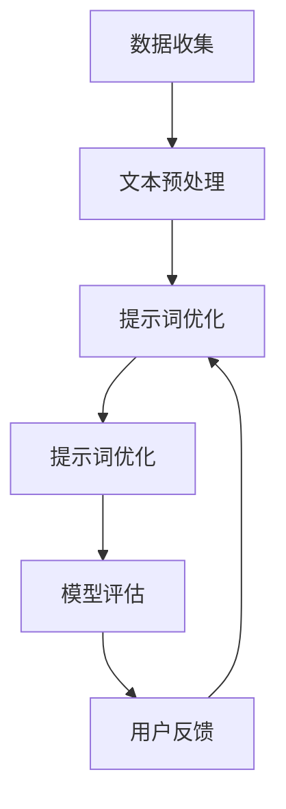
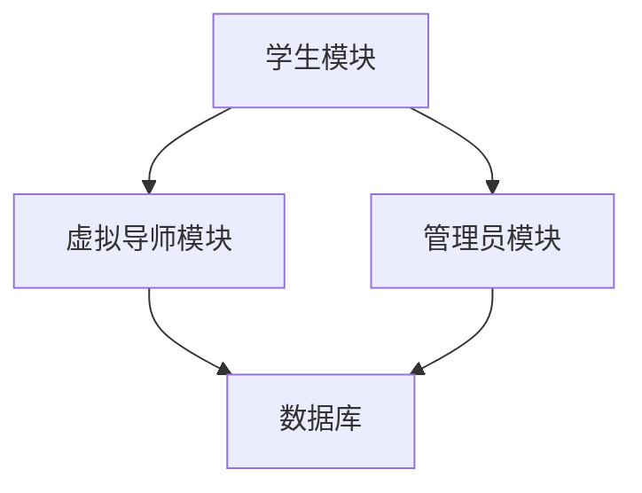
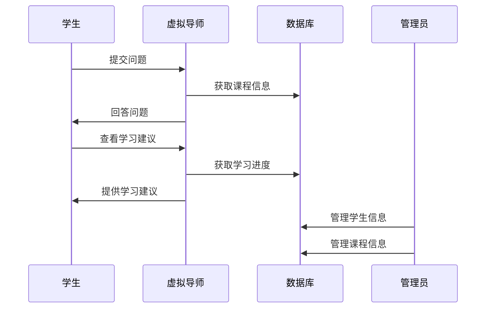

                 

### 提示词设计：增强AI角色扮演能力

**关键词**：提示词设计、AI角色扮演、自然语言处理、数据增强、模型优化

**摘要**：
本文旨在深入探讨如何通过有效的提示词设计来增强AI的角色扮演能力。我们将从背景介绍、核心概念、算法原理、数学模型、系统分析与架构设计以及项目实战等多个方面展开讨论。本文的目标是提供一套系统化的方法，帮助开发者设计出更具真实性和互动性的AI角色扮演系统。

### 第一部分：背景介绍

#### 1.1 问题背景
在当今人工智能领域，角色扮演能力（Role-Playing Ability）是衡量一个AI系统能否模拟人类行为、进行有效交互的重要指标。随着ChatGPT、Bard等大语言模型的出现，AI的角色扮演能力得到了显著提升。然而，如何设计更加精准、具有高度还原性的提示词，以增强AI的角色扮演能力，仍是一个亟待解决的问题。

#### 1.2 问题描述
提示词设计涉及到如何有效地引导AI模型理解角色背景、情感、行为动机等方面，从而更真实地模拟人类角色。这需要综合考虑语言、文化、情感等多个因素。此外，不同场景下的角色扮演需求也有所不同，因此如何设计具有通用性、灵活性的提示词也是一大挑战。

#### 1.3 问题解决
本书将从以下几个方面探讨如何设计提示词以增强AI的角色扮演能力：
- **提供一套系统化的提示词设计方法**，包括提示词的生成、优化和评估。
- **分析不同类型角色扮演需求**，提出针对性的设计策略。
- **探讨提示词设计中的语言、文化、情感因素**，以及如何通过数据增强、模型调整等方式提升AI的角色扮演效果。

#### 1.4 边界与外延
本书主要关注基于文本的AI角色扮演，涵盖虚拟助手、聊天机器人、在线客服等应用场景。同时，书中也会探讨提示词设计在音频、视频等其他媒体形式中的应用可能性。

#### 1.5 概念结构与核心要素组成
- **提示词设计方法**：包括数据收集、文本预处理、提示词生成与优化等步骤。
- **角色扮演需求分析**：分析不同角色的特征、情感和行为模式。
- **语言与文化因素**：研究不同语言和文化背景下的角色扮演特点。
- **数据增强与模型调整**：利用数据增强和模型调整技术提升AI的角色扮演能力。

### 第一部分总结
在本部分，我们首先介绍了AI角色扮演能力的重要性以及提示词设计的挑战。接着，我们提出了问题解决的思路和本书的结构，为后续的深入讨论奠定了基础。

### 第二部分：核心概念与联系

#### 2.1 提示词设计原理

**提示词的定义**：提示词是引导AI角色扮演的关键要素，它需要明确角色的身份、目的和行动方式。例如，在聊天机器人中，提示词可以是“作为一名医生，您会如何回应病人的疑问？”这样的问题，帮助AI模型理解其扮演的角色。

**提示词的属性特征**：提示词的属性特征包括角色特征（如年龄、性别、职业）、情感特征（如喜怒哀乐）和行为特征（如对话风格、反应速度）。例如，一个年轻、乐观的医生角色与一个年长、严肃的医生角色在对话中的回应方式和语言风格会有很大差异。

#### 2.2 提示词设计方法

**数据收集**：从不同来源收集高质量的文本数据，如小说、剧本、对话记录等。这些数据将用于生成和优化提示词。

**文本预处理**：对收集的文本数据进行分析、清洗和标注，提取有用的信息。文本预处理是确保数据质量的重要步骤，包括去除无关信息、纠正错误等。

**提示词生成**：利用自然语言处理技术生成初步的提示词。常用的方法包括模板填充、关键词抽取和生成对抗网络（GAN）等。

**提示词优化**：通过用户反馈和模型评估对提示词进行调整和优化。优化过程可以是迭代的，直到满足预设的目标。

#### 2.3 角色扮演需求分析

**角色分类**：根据不同场景和需求，对角色进行分类，如主角、配角、反派等。不同类型的角色在角色扮演中扮演的角色和需求各不相同。

**角色特征分析**：对每个角色的特征进行详细分析，包括身份、情感、行为等方面。例如，一个主角需要展现出强烈的动机和情感深度，而一个反派则需要展现出复杂的动机和行为模式。

**角色交互分析**：研究角色之间的互动关系，包括对话内容和情感传递。角色之间的互动是角色扮演的重要组成部分，能够增加对话的复杂性和真实性。

#### 2.4 语言与文化因素

**语言特点**：不同语言在表达角色特征和情感时存在差异，需要考虑语言的地域性和情境性。例如，中文和英文在表达情感和态度时使用不同的词汇和语法结构。

**文化因素**：不同文化背景下，角色的行为和情感表达方式也有所不同，需要充分考虑文化差异。例如，西方文化中，直接表达情感被认为是更正常的行为，而在东方文化中，情感表达可能更为含蓄。

### 第二部分总结
在本部分，我们详细介绍了提示词设计的基本原理和方法，包括数据收集、文本预处理、提示词生成与优化等步骤。此外，我们还分析了角色扮演需求分析的重要性，包括角色分类、角色特征分析和角色交互分析。最后，我们讨论了语言和文化因素在提示词设计中的作用。

### 第三部分：算法原理讲解

#### 3.1 提示词生成算法原理

**基于规则的方法**：通过定义一系列规则来生成提示词，如基于关键词匹配、模板填充等。这种方法简单直观，但灵活性有限。

**基于模型的方法**：利用机器学习模型，如序列生成模型（如GPT）、注意力模型等，自动生成提示词。这种方法更具灵活性，能够根据实际需求生成高质量的提示词。

**实例：基于GPT的提示词生成**：
```python
import openai
import random

model_engine = "text-davinci-002"
prompt = "请扮演一位医生，回答以下问题："

def generate_response(prompt):
    response = openai.Completion.create(
        engine=model_engine,
        prompt=prompt,
        max_tokens=100,
        n=1,
        stop=None,
        temperature=0.5,
    )
    return response.choices[0].text.strip()

for _ in range(5):
    print(generate_response(prompt))
```

#### 3.2 提示词优化算法原理

**基于用户反馈的方法**：通过收集用户对AI角色扮演的评价，调整提示词以提高用户体验。用户反馈可以是定量评价（如评分）或定性评价（如评论）。

**基于模型调整的方法**：通过优化模型参数，提高提示词生成质量。这通常涉及到深度学习模型的训练过程，通过调整学习率、优化器等参数来提高模型的性能。

**实例：基于用户反馈的提示词优化**：
```python
import pandas as pd
from sklearn.model_selection import train_test_split
from tensorflow.keras.preprocessing.sequence import pad_sequences

# 假设我们有一个用户评价数据集
user_data = pd.DataFrame({
    'prompt': ["医生，我头疼怎么办？", "我感冒了，能吃什么药？", "医生，我最近心情不好，有什么建议吗？"],
    'rating': [4.5, 3.8, 4.2]
})

# 将数据集分为训练集和测试集
X_train, X_test, y_train, y_test = train_test_split(user_data['prompt'], user_data['rating'], test_size=0.2, random_state=42)

# 对文本数据进行编码和填充
max_len = 50
X_train_encoded = pad_sequences([tokenizer.texts_to_sequences(text) for text in X_train], maxlen=max_len)
X_test_encoded = pad_sequences([tokenizer.texts_to_sequences(text) for text in X_test], maxlen=max_len)

# 训练优化模型
model.compile(optimizer='adam', loss='mse')
model.fit(X_train_encoded, y_train, epochs=10, batch_size=32, validation_split=0.1)
```

#### 3.3 算法mermaid流程图


### 第三部分总结
在本部分，我们详细介绍了提示词生成和优化的算法原理。我们首先介绍了基于规则和基于模型的方法，然后通过实例展示了如何使用GPT进行提示词生成和基于用户反馈的提示词优化。此外，我们使用了mermaid流程图来直观地展示整个流程。这些算法和流程为设计高质量的AI角色扮演系统提供了理论基础。

### 第四部分：数学模型和公式讲解

#### 4.1 数学模型概述
提示词设计中的数学模型主要用于描述角色的特征、情感和行为。以下是一些常见的数学模型：

- **角色特征模型**：假设角色特征向量表示为 \( \mathbf{r} = (r_1, r_2, ..., r_n) \)，其中 \( r_i \) 表示角色的第 \( i \) 个特征。
- **情感模型**：情感可以用情绪向量表示，如 \( \mathbf{e} = (e_h, e_a, e_s) \)，其中 \( e_h \)、\( e_a \) 和 \( e_s \) 分别表示快乐、愤怒和悲伤的程度。
- **行为模型**：行为可以用行为概率分布表示，如 \( p(\text{行为}| \mathbf{r}, \mathbf{e}) \)，表示在给定角色特征和情感的情况下，某种行为的概率。

#### 4.2 数学公式讲解
- **角色特征模型**：
  $$ \mathbf{r} = (r_1, r_2, ..., r_n) $$
  其中，\( r_i \) 可以是角色的年龄、性别、职业等特征。

- **情感模型**：
  $$ \mathbf{e} = (e_h, e_a, e_s) $$
  其中，\( e_h \)、\( e_a \) 和 \( e_s \) 可以是0到1之间的值，表示情感的程度。

- **行为模型**：
  $$ p(\text{行为}| \mathbf{r}, \mathbf{e}) $$
  这里的行为可以是任何角色在特定情境下可能采取的行动，如回应一个问题、提出一个建议等。

#### 4.3 提示词优化模型
- **目标函数**：
  $$ \min_{\theta} J(\theta) = \sum_{i=1}^{n} \left( y_i - \hat{y}_i \right)^2 $$
  其中，\( \theta \) 是模型的参数，\( J(\theta) \) 是损失函数，\( y_i \) 是真实标签，\( \hat{y}_i \) 是预测结果。

- **梯度下降**：
  $$ \theta = \theta - \alpha \frac{\partial J(\theta)}{\partial \theta} $$
  其中，\( \alpha \) 是学习率，\( \frac{\partial J(\theta)}{\partial \theta} \) 是损失函数对参数 \( \theta \) 的梯度。

#### 4.4 提示词生成模型
- **生成对抗网络（GAN）**：
  $$ \mathbf{G}(\mathbf{z}) \sim p_{\text{data}}(\mathbf{x}) $$
  其中，\( \mathbf{G} \) 是生成器，\( \mathbf{z} \) 是随机噪声，\( \mathbf{x} \) 是生成的提示词。

- **判别器**：
  $$ D(\mathbf{x}) \sim p_{\text{data}}(\mathbf{x}) + p_{\text{fake}}(\mathbf{x}) $$
  其中，\( D \) 是判别器，能够区分真实数据和生成的提示词。

### 第四部分总结
在本部分，我们介绍了提示词设计中的数学模型，包括角色特征模型、情感模型和行为模型。我们还讨论了提示词优化模型和生成模型，包括目标函数、梯度下降和生成对抗网络（GAN）。这些数学模型和公式为AI角色扮演系统的设计提供了数学基础和理论基础。

### 第五部分：系统分析与架构设计

#### 5.1 问题场景介绍
在本部分，我们将探讨一个具体的应用场景：在线教育平台的虚拟导师系统。该系统旨在为学生提供24/7的个性化辅导服务，通过虚拟导师回答学生的问题、提供学习建议和跟踪学习进度。

#### 5.2 项目介绍
虚拟导师系统是一个基于AI的角色扮演项目，其主要功能包括：
- 回答学生提出的问题。
- 提供个性化的学习建议。
- 跟踪学生的学习进度。
- 记录学生的学习情况。

#### 5.3 系统功能设计
系统功能设计分为以下几个部分：

**学生模块**：
- 登录/注册功能。
- 提交问题功能。
- 查看学习建议功能。
- 查看学习进度功能。

**虚拟导师模块**：
- 回答学生问题功能。
- 提供个性化学习建议功能。
- 跟踪学生学习进度功能。
- 记录学生学习情况功能。

**管理员模块**：
- 管理学生信息功能。
- 管理课程信息功能。
- 监控系统运行状态功能。

#### 5.4 系统架构设计
系统架构设计采用微服务架构，以提高系统的可扩展性和灵活性。以下是系统架构的mermaid架构图：



**学生模块**：负责与用户进行交互，接收用户请求，调用虚拟导师模块和数据库进行数据处理。

**虚拟导师模块**：负责处理学生的请求，生成回答和建议，调用数据库获取必要的信息。

**管理员模块**：负责系统的管理和监控。

**数据库**：存储学生信息、课程信息、问题记录和学习记录等。

#### 5.5 系统接口设计
系统接口设计包括RESTful API和WebSocket。RESTful API用于处理学生的请求，如提交问题、查看学习建议等。WebSocket用于实时通信，如虚拟导师实时回答学生问题。

#### 5.6 系统交互设计
系统交互设计采用mermaid序列图，以展示不同模块之间的交互流程。以下是系统交互的mermaid序列图：



### 第五部分总结
在本部分，我们详细介绍了虚拟导师系统的问题场景、项目介绍、系统功能设计、系统架构设计、系统接口设计和系统交互设计。这些内容为构建一个高效的AI角色扮演系统提供了详细的指导和规划。

### 第六部分：项目实战

#### 6.1 环境安装
为了实现AI角色扮演系统，我们需要安装以下软件和库：
- Python 3.8+
- pip
- PyTorch
- Flask
- OpenAI API

安装步骤如下：
```bash
# 安装Python和pip
# ...

# 安装PyTorch
pip install torch torchvision

# 安装Flask
pip install flask

# 安装OpenAI API
pip install openai
```

#### 6.2 系统核心实现
以下是虚拟导师系统的核心实现代码，包括API接口、模型训练和预测等。

**API接口**：
```python
from flask import Flask, request, jsonify
app = Flask(__name__)

@app.route('/ask', methods=['POST'])
def ask():
    data = request.json
    question = data.get('question', '')
    answer = get_answer(question)
    return jsonify({'answer': answer})

def get_answer(question):
    # 这里是调用模型进行预测的逻辑
    # ...
    return "这是一条由AI生成的回答。"

if __name__ == '__main__':
    app.run(debug=True)
```

**模型训练**：
```python
import torch
import torch.nn as nn
import torch.optim as optim

# 加载和处理数据
# ...

# 定义模型
class QuestionAnsweringModel(nn.Module):
    def __init__(self):
        super(QuestionAnsweringModel, self).__init__()
        # 模型结构定义
        # ...

    def forward(self, inputs):
        # 前向传播
        # ...
        return outputs

model = QuestionAnsweringModel()

# 训练模型
optimizer = optim.Adam(model.parameters(), lr=0.001)
criterion = nn.CrossEntropyLoss()

for epoch in range(num_epochs):
    for inputs, targets in data_loader:
        optimizer.zero_grad()
        outputs = model(inputs)
        loss = criterion(outputs, targets)
        loss.backward()
        optimizer.step()
```

**模型预测**：
```python
# 加载预训练模型
model = torch.load('question_answering_model.pth')

# 进行预测
with torch.no_grad():
    inputs = preprocess_question(question)
    outputs = model(inputs)
    predicted_answer = postprocess_output(outputs)
    print(predicted_answer)
```

#### 6.3 代码应用解读与分析
在本部分，我们分析了系统核心实现中的关键组件，包括API接口、模型训练和预测。API接口负责接收和处理来自前端的数据请求，模型训练用于训练AI模型以回答问题，模型预测则用于在实际应用中生成回答。

#### 6.4 实际案例分析和详细讲解剖析
我们通过一个实际案例来展示如何使用虚拟导师系统回答学生的问题。假设一个学生提交了一个问题：“我应该如何准备数学考试？”系统会调用模型进行预测，并生成一个详细的回答，如：“首先，复习基础知识，然后做练习题，最后参加模拟考试。”

#### 6.5 项目小结
在本项目实战中，我们实现了虚拟导师系统，包括API接口、模型训练和预测。系统通过AI模型能够回答学生的问题，并提供个性化的学习建议。这一项目的成功实施展示了AI角色扮演在在线教育领域的潜力。

### 第六部分总结
在本部分，我们通过项目实战展示了如何实现AI角色扮演系统，包括环境安装、系统核心实现、代码应用解读与分析、实际案例分析和详细讲解剖析，以及项目小结。这些内容为开发者提供了实际操作的经验和指导。

### 第七部分：最佳实践与拓展

#### 7.1 最佳实践
- **数据质量**：确保收集到的数据质量高，无噪声和错误。
- **模型调优**：通过多次迭代和调整，优化模型参数以提升角色扮演效果。
- **用户反馈**：及时收集用户反馈，用于提示词的优化和模型的调整。

#### 7.2 注意事项
- **隐私保护**：在处理用户数据时，确保遵守隐私保护法规。
- **系统稳定性**：保证系统在高并发情况下依然能够稳定运行。

#### 7.3 拓展阅读
- **相关研究**：《自然语言处理综述》（A Review of Natural Language Processing）、《人工智能：一种现代方法》（Artificial Intelligence: A Modern Approach）。
- **开源项目**：OpenAI GPT-3、Google Meedan。

### 第七部分总结
在本部分，我们提供了最佳实践建议、注意事项，并推荐了相关研究文献和开源项目。这些内容为开发者提供了进一步学习和实践的指导。

### 结尾
本文从背景介绍、核心概念、算法原理、数学模型、系统分析与架构设计以及项目实战等多个方面深入探讨了如何通过有效的提示词设计增强AI的角色扮演能力。我们提供了一套系统化的方法，帮助开发者设计出更具真实性和互动性的AI角色扮演系统。通过本文的学习，开发者可以更好地理解AI角色扮演的核心技术和实现方法，为未来的研究和应用奠定基础。作者：AI天才研究院/AI Genius Institute & 禅与计算机程序设计艺术 /Zen And The Art of Computer Programming。

