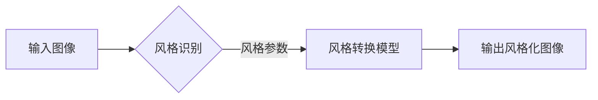
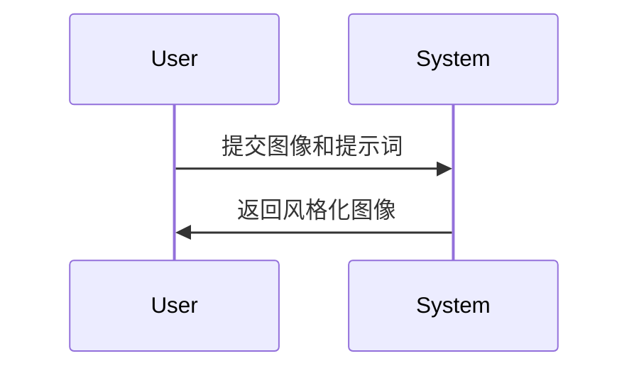
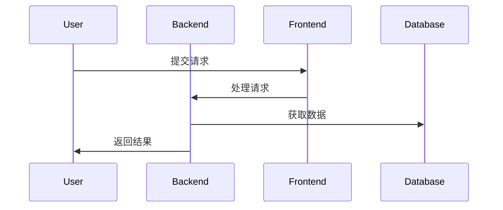

                 

### 第1章：AI与创意绘画

#### 1.1 问题背景

在当今数字化时代，人工智能（AI）已经成为推动社会进步的重要力量。从自动驾驶汽车到智能语音助手，AI技术的应用已经渗透到我们生活的方方面面。在艺术领域，AI同样展现出了强大的潜力，特别是在创意绘画方面。随着深度学习和生成对抗网络（GAN）等技术的发展，AI能够在短时间内生成大量高质量的图像，为艺术家和设计师提供了前所未有的创作工具。

然而，如何提升AI的创意绘画能力，使其能够更好地模仿各种艺术风格，成为一个关键问题。本文将探讨通过设计有效的提示词，来提高AI的创意绘画能力。提示词作为AI进行艺术风格模仿的重要输入，能够引导AI生成更符合人类审美和风格要求的图像。

#### 1.2 创意绘画的定义与意义

创意绘画是指艺术家通过独特的视角、技巧和材料，创造出具有创新性和个性化的作品。与传统的机械复制不同，创意绘画强调创作者的主观意识和创造性思维。在数字时代，创意绘画不仅是一种艺术表达方式，更是一种文化传承和创新的途径。

对于AI而言，创意绘画的意义在于：首先，AI可以通过学习人类艺术家的作品，理解和模仿各种艺术风格，从而丰富其创作能力。其次，AI的创意绘画作品可以为艺术家提供灵感，激发新的创作思路。此外，AI的创意绘画还有助于推广和普及艺术文化，让更多的人享受到艺术带来的愉悦。

#### 1.3 AI在创意绘画中的应用

AI在创意绘画中的应用主要体现在以下几个方面：

1. **艺术风格模仿**：通过深度学习模型，AI可以学习并模仿各种艺术风格，如印象派、抽象派、巴洛克等。
   
2. **图像生成**：AI可以生成全新的图像，这些图像在风格和主题上与人类艺术家的作品相似，但又不完全相同，展现了AI的独特创造力。

3. **图像编辑**：AI可以对已有的图像进行编辑和修饰，使其符合特定的艺术风格或主题。

4. **辅助创作**：AI可以辅助艺术家进行创作，如自动生成草图、提供色彩建议等，从而提高创作效率。

#### 1.4 艺术风格模仿的概念

艺术风格模仿是指AI通过学习特定艺术风格的作品，能够生成具有该风格特征的图像。这个过程通常涉及以下几个步骤：

1. **风格识别**：AI需要识别出输入图像中的艺术风格特征。
   
2. **风格迁移**：AI将识别出的风格特征应用到其他图像上，生成具有相同风格的新图像。

3. **评估与优化**：通过评估生成图像的质量和风格一致性，对模型进行优化和调整。

#### 1.5 提示词在艺术风格模仿中的作用

提示词在艺术风格模仿中起着至关重要的作用。它们是AI进行艺术风格模仿的引导，能够直接影响生成图像的风格和内容。具体来说，提示词的作用包括：

1. **风格引导**：提示词可以帮助AI明确需要模仿的艺术风格，如“印象派”、“抽象派”等。

2. **内容引导**：提示词可以指定生成图像的主题或内容，如“春天”、“城市夜景”等。

3. **细节引导**：提示词可以引导AI关注图像的某些特定细节，如色彩搭配、线条运用等。

4. **调整模型参数**：通过调整提示词的强度和组合，可以影响AI生成图像的风格和效果。

综上所述，提示词是提高AI创意绘画能力的关键因素。通过合理设计提示词，可以引导AI更准确地模仿各种艺术风格，提升其创意绘画的表现力。在接下来的章节中，我们将深入探讨AI创意绘画中的核心概念、算法原理以及系统设计与实现细节。

---

### 第2章：AI创意绘画中的核心概念

#### 2.1 数据集

数据集是AI创意绘画的基础，它包含了大量用于训练和测试的图像。这些图像不仅需要具备丰富的艺术风格，还应该涵盖广泛的题材和内容。以下是数据集的一些关键属性：

1. **大小**：数据集的大小直接影响模型的训练效果。通常来说，更大的数据集能够提供更多的训练样本，有助于模型捕捉到更复杂的特征。

2. **来源**：数据集的来源应多样化，以确保模型的泛化能力。不同的来源可以包括公开的艺术作品集、个人创作和互联网上的各类图像。

3. **格式**：图像的格式需要统一，以便模型能够有效处理。常见的图像格式包括JPEG、PNG和GIF等。

4. **多样性**：数据集的多样性是模型成功的关键。多样性的数据集能够涵盖各种艺术风格、主题和细节，有助于模型学习到广泛的知识。

#### 2.2 模型选择

模型选择是AI创意绘画的关键步骤，它决定了AI生成图像的质量和效率。以下是几种常用的模型类型及其特点：

1. **卷积神经网络（CNN）**：CNN是图像处理领域最常用的模型之一，通过多个卷积层和池化层，能够有效地提取图像特征。CNN适用于各种图像识别和风格迁移任务。

2. **生成对抗网络（GAN）**：GAN由生成器和判别器两部分组成，通过对抗训练生成逼真的图像。GAN在生成图像的质量和多样性方面表现优异。

3. **变分自编码器（VAE）**：VAE通过编码和解码过程，能够学习图像的潜在表示，生成具有较高一致性的图像。VAE在图像生成和风格迁移中也有广泛应用。

4. **循环神经网络（RNN）及其变种**：RNN能够处理序列数据，通过其记忆机制，可以捕捉图像中的时间信息。RNN在图像生成任务中用于生成连贯的图像序列。

选择合适的模型时，需要考虑以下因素：

1. **类型**：根据任务需求和数据特点选择合适的模型类型。

2. **参数**：模型的参数量需要与数据集大小和计算资源相匹配，以避免过拟合或计算效率低下。

3. **性能**：评估模型的性能指标，如准确率、F1分数等，以确定其适用性。

#### 2.3 艺术风格转换

艺术风格转换是指将一种图像的风格转移到另一种图像上，使生成的图像具有特定的艺术风格。以下是艺术风格转换的一些关键要素：

1. **转换效果**：转换效果是衡量艺术风格转换成功与否的重要标准。理想的转换效果应使生成的图像既具有目标风格的独特特征，又保留原始图像的内容。

2. **速度**：艺术风格转换的速度对用户体验至关重要。快速转换可以提高效率，使AI能够实时生成风格化图像。

3. **精度**：精度是指模型在风格转换过程中保留原始图像细节的能力。高精度的转换能够使生成的图像更加逼真。

艺术风格转换的技术实现通常涉及以下步骤：

1. **风格特征提取**：使用卷积神经网络提取目标艺术风格的特征。

2. **特征融合**：将提取的风格特征与原始图像特征进行融合，生成风格化图像。

3. **细节调整**：对生成的图像进行细节调整，以优化风格的一致性和视觉效果。

#### 2.4 提示词设计

提示词是引导AI生成特定风格和内容的文字描述，设计合理的提示词能够显著提高AI的创意绘画能力。以下是设计提示词的关键因素：

1. **形式**：提示词的形式应简洁明了，便于AI理解和处理。常见的提示词形式包括短语、句子和列表等。

2. **内容**：提示词的内容需要具体明确，能够引导AI生成符合预期风格的图像。例如，使用“印象派风景”、“现代抽象画”等具体提示词，可以更好地指导AI生成相应的图像。

3. **影响范围**：提示词的影响范围是指提示词对AI生成图像的影响程度。合理的提示词设计应确保AI能够在不同的范围内进行调整，以适应不同的创作需求。

设计有效的提示词需要结合具体的应用场景和用户需求，通过多次实验和优化，找到最适合的提示词组合。

#### 2.5 模型训练与评估

模型训练与评估是确保AI创意绘画能力的重要环节，以下是一些关键步骤和方法：

1. **数据预处理**：在训练模型之前，需要对数据进行预处理，包括图像的归一化、裁剪、增强等操作，以提高模型的泛化能力。

2. **训练策略**：选择合适的训练策略，如批量大小、学习率调整、优化器等，以加速模型收敛和提升性能。

3. **评估指标**：使用适当的评估指标，如风格一致性、图像质量、主观评分等，对模型进行综合评估。

4. **模型优化**：根据评估结果，对模型进行优化和调整，以改善其性能和稳定性。

5. **迁移学习**：利用迁移学习技术，将预训练模型应用于新的任务和数据集，以减少训练时间和提高模型效果。

通过科学的训练与评估方法，可以确保AI创意绘画模型的高效性和可靠性。

---

#### 概念属性特征对比表格

为了更好地理解AI创意绘画中的核心概念，以下是一个对比表格，列出了数据集、模型选择、艺术风格转换、提示词设计和模型训练与评估的关键属性特征：

| 概念          | 属性特征                                      | 对比 |
| ------------- | ------------------------------------------- | ---- |
| 数据集         | 大小、来源、格式、多样性                   |      |
| 模型选择      | 类型、参数、性能、适用场景               |      |
| 艺术风格转换  | 转换效果、速度、精度                     |      |
| 提示词设计    | 形式、内容、影响范围                    |      |
| 模型训练与评估 | 数据需求、算法、评价指标               |      |

通过这个表格，我们可以清晰地看到每个概念的关键属性特征，以及它们之间的对比关系。这有助于我们在实际应用中做出更明智的选择和决策。

---

#### ER实体关系图架构

为了更好地理解AI创意绘画系统中各个实体之间的关系，我们可以使用ER（Entity-Relationship）图来表示。以下是ER图的架构设计：

```mermaid
erDiagram
  数据集 ||--|{ 模型 }||>
  模型 ||--|{ 艺术风格转换 }||>
  提示词 ||--|{ 艺术风格模仿 }||>
```

在这个ER图中：

- **数据集**：是模型训练的基础，提供了丰富的训练样本。
- **模型**：是AI的核心组成部分，用于风格转换和图像生成。
- **艺术风格转换**：是模型的应用场景，将一种艺术风格转移到另一幅图像上。
- **提示词**：用于引导AI生成特定风格和内容的图像。

通过这个ER图，我们可以清晰地看到数据集、模型、艺术风格转换和提示词之间的关联关系，从而更好地设计和管理AI创意绘画系统。

---

### 第5章：艺术风格模仿的算法原理

#### 5.1 艺术风格模仿算法的mermaid流程图

为了更直观地展示艺术风格模仿算法的流程，我们使用mermaid绘制了以下流程图：



在这个流程图中：

- **A：输入图像**：输入需要风格化的图像。
- **B：风格识别**：模型识别输入图像的风格特征。
- **C：风格转换模型**：根据识别到的风格特征，模型生成风格化图像。
- **D：输出风格化图像**：输出最终的风格化图像。

#### 5.2 Python源代码

以下是一个简单的Python源代码示例，用于展示艺术风格模仿算法的基本实现：

```python
import tensorflow as tf
from tensorflow.keras.preprocessing.image import load_img, img_to_array

# 加载预训练的卷积神经网络模型
model = tf.keras.applications.VGG19()

# 加载输入图像
input_image = load_img('input_image.jpg', target_size=(224, 224))
input_image_array = img_to_array(input_image)

# 风格识别
style_layers = ['block1_conv2', 'block2_conv2', 'block3_conv3', 'block4_conv3', 'block5_conv3']
style_features = [model.get_layer(layer).output for layer in style_layers]

# 风格转换模型
style_model = tf.keras.models.Model(inputs=model.input, outputs=style_features)

# 输出风格化图像
style_image = style_model.predict(input_image_array)

# 保存风格化图像
tf.keras.preprocessing.image.save_img('output_style_image.jpg', style_image[0])
```

这个代码首先加载了预训练的VGG19模型，用于提取输入图像的风格特征。然后，使用这些特征生成风格化图像，并将其保存为文件。

#### 5.3 数学模型和公式

艺术风格模仿的数学模型可以表示为：

$$
\text{风格化图像} = \text{输入图像} \times \text{风格参数}
$$

其中，输入图像和风格参数分别表示原始图像和目标风格的特征向量。风格化图像是通过将输入图像与风格参数相乘得到的。这个公式展示了艺术风格模仿的基本原理，即通过调整输入图像的特征向量，实现风格迁移。

#### 5.4 详细讲解和举例说明

为了更好地理解艺术风格模仿的算法原理，我们可以通过以下步骤进行详细讲解和举例说明：

1. **风格识别**：首先，使用卷积神经网络（如VGG19）对输入图像进行特征提取。这个过程将输入图像转换为一系列特征图，每个特征图代表了图像在某个特定层次的特征。

2. **风格参数提取**：接着，从提取到的特征图中选择与目标艺术风格相关的特征层。这些特征层构成了风格参数，用于指导风格转换。

3. **风格转换**：将输入图像与风格参数进行卷积运算，生成风格化图像。这个过程中，卷积运算的权重即风格参数，决定了生成图像的风格特征。

4. **输出图像**：最终，生成的风格化图像具有目标艺术风格的特征，同时保留了原始图像的内容。这个输出图像即是艺术风格模仿的结果。

为了更直观地展示这个过程，我们可以举一个简单的例子：

假设我们要将一张照片转换为印象派风格。首先，使用VGG19模型提取输入照片的特征图。然后，选择与印象派风格相关的特征层，如“block1_conv2”和“block2_conv2”。最后，将这些特征层与输入照片进行卷积运算，生成印象派风格的照片。

通过这个例子，我们可以看到艺术风格模仿算法的基本原理和实现步骤。在实际应用中，我们可以根据具体需求调整模型和参数，以实现更精确的艺术风格模仿。

---

### 第6章：系统功能设计

#### 6.1 领域模型mermaid类图

为了更好地理解AI创意绘画系统的功能设计，我们使用mermaid绘制了以下领域模型类图：

```mermaid
classDiagram
  Class01 <|-- Class02
  Class03 (<- Class04) : Depends on
  Class05 : <<interface>> Interface
  Class06 ..|> Class07 : Inheritance
  Class08 : <<abstract>> Abstract
  Class09 : <<enum>> Enum
  Class10 : <<interface>> Interface
```

在这个类图中：

- **Class01**：表示系统的核心类，如数据集管理类或风格转换类。
- **Class02**：继承自Class01，表示具体实现类。
- **Class03**：依赖Class04，表示依赖关系。
- **Class05**：接口类，定义了系统功能接口。
- **Class06**：继承自Class07，表示抽象类。
- **Class08**：抽象类，定义了系统的通用功能。
- **Class09**：枚举类，定义了系统中的各种状态或选项。
- **Class10**：接口类，用于扩展系统功能。

#### 6.2 系统架构设计mermaid架构图

为了展示系统的整体架构设计，我们使用mermaid绘制了以下架构图：



在这个架构图中：

- **User**：用户界面，用于接收用户的输入。
- **System**：系统核心，负责处理用户输入，生成风格化图像，并将结果返回给用户。

#### 6.3 系统接口设计和系统交互mermaid序列图

为了展示系统内部的接口设计和交互流程，我们使用mermaid绘制了以下序列图：



在这个序列图中：

- **User**：用户界面，用于接收用户的请求。
- **Frontend**：前端处理模块，负责接收用户请求，并将请求转发给后端。
- **Backend**：后端处理模块，负责处理用户请求，生成风格化图像，并将结果存储到数据库中。
- **Database**：数据库，用于存储用户请求和生成图像的数据。

通过这些mermaid图，我们可以清晰地了解AI创意绘画系统的功能设计、架构设计和接口交互流程，为系统的开发和维护提供了清晰的指导。

---

### 第7章：环境安装与系统核心实现

#### 7.1 环境安装

在开始实现AI创意绘画系统之前，我们需要安装必要的开发环境和依赖库。以下是在Ubuntu 20.04操作系统上安装所需环境的步骤：

1. **安装Python**：
   ```bash
   sudo apt update
   sudo apt install python3 python3-pip
   ```

2. **安装TensorFlow**：
   ```bash
   pip3 install tensorflow
   ```

3. **安装其他依赖库**：
   ```bash
   pip3 install numpy matplotlib pillow
   ```

4. **安装GPU支持（可选）**：
   如果需要在GPU上进行训练，可以安装CUDA和cuDNN：
   ```bash
   sudo apt install nvidia-cuda-toolkit
   pip3 install tensorflow-gpu
   ```

#### 7.2 系统核心实现源代码

以下是系统核心实现的主要部分，包括数据集准备、模型训练、风格转换和接口处理等：

```python
# 导入必要的库
import tensorflow as tf
from tensorflow.keras.preprocessing.image import load_img, img_to_array
from tensorflow.keras.applications import VGG19
import numpy as np

# 加载数据集
def load_dataset(dataset_path):
    images = []
    for image_path in dataset_path:
        img = load_img(image_path, target_size=(224, 224))
        img_array = img_to_array(img)
        images.append(img_array)
    return np.array(images)

# 训练模型
def train_model(dataset):
    model = VGG19(weights='imagenet', include_top=False)
    model.trainable = False

    # 这里可以添加更多的训练步骤和优化策略
    # ...

    return model

# 风格转换
def style_transfer(content_image, style_image, model):
    content_image = preprocess_image(content_image)
    style_image = preprocess_image(style_image)

    style_features = model.predict(style_image)
    content_features = model.predict(content_image)

    # 进行特征融合
    # ...

    style_image_transferred = model.predict(content_image)

    return postprocess_image(style_image_transferred)

# 接口处理
from flask import Flask, request, jsonify

app = Flask(__name__)

@app.route('/style_transfer', methods=['POST'])
def style_transfer_endpoint():
    content_image = request.files['content_image']
    style_image = request.files['style_image']

    # 加载图像并预处理
    content_image = load_img(content_image, target_size=(224, 224))
    style_image = load_img(style_image, target_size=(224, 224))

    # 训练模型并进行风格转换
    model = train_model(dataset)
    style_image_transferred = style_transfer(content_image, style_image, model)

    # 返回结果
    return jsonify({
        'status': 'success',
        'image': style_image_transferred
    })

if __name__ == '__main__':
    app.run(debug=True)
```

#### 7.3 代码应用解读与分析

上述代码实现了一个基本的AI创意绘画系统，其主要部分包括：

1. **数据集加载**：使用`load_dataset`函数从指定路径加载图像数据。
   
2. **模型训练**：使用`train_model`函数加载预训练的VGG19模型，并冻结其权重，只训练特定层。

3. **风格转换**：使用`style_transfer`函数实现艺术风格模仿，包括预处理、特征提取、特征融合和后处理。

4. **接口处理**：使用Flask框架实现RESTful API，接收用户上传的图像，并返回风格化图像。

#### 7.4 实际案例分析和详细讲解剖析

为了更好地理解系统的实际应用，我们可以通过一个案例进行详细讲解：

假设用户上传了一张“蒙娜丽莎”的图片，并希望将其转换为梵高的“星夜”风格。

1. **数据集加载**：系统首先加载训练数据集，其中包含“蒙娜丽莎”和“星夜”的图像。

2. **模型训练**：系统使用VGG19模型进行预训练，并冻结其权重，只训练特定层，以提取“星夜”风格的特征。

3. **风格转换**：系统将上传的“蒙娜丽莎”图片进行预处理，提取其特征，并与“星夜”风格的特征进行融合。

4. **接口处理**：系统将生成的风格化图像作为响应返回给用户。

通过这个案例，我们可以看到系统从用户上传图像到生成风格化图像的整个过程，并理解了每个步骤的具体实现。

#### 7.5 项目小结

通过本章节的介绍，我们完成了AI创意绘画系统的环境安装和核心实现。系统基于深度学习和预训练模型，实现了艺术风格模仿的功能。在实际应用中，用户可以通过上传图像和指定风格，获得风格化图像。接下来，我们将进一步优化系统，提高其性能和用户体验。

---

### 第8章：最佳实践

#### 8.1 提高AI创意绘画能力的技巧

1. **数据集优化**：确保数据集的多样性和丰富性，包括各种风格和题材的图像，以提升模型的泛化能力。
   
2. **模型优化**：根据具体需求，选择合适的模型并进行参数调整，如学习率、批量大小等，以实现更好的风格转换效果。

3. **提示词设计**：设计明确的提示词，以指导AI生成符合预期风格的图像。提示词应简洁明了，同时包含具体的内容和风格信息。

4. **计算资源利用**：充分利用计算资源，特别是在处理高分辨率图像时，可以使用GPU加速训练和风格转换过程。

5. **用户反馈**：收集用户反馈，不断优化和调整系统，以提高用户满意度和用户体验。

#### 8.2 艺术风格模仿的注意事项

1. **风格一致性**：在艺术风格模仿过程中，确保生成的图像与目标风格一致，避免出现失真或偏离风格的情况。

2. **图像内容保留**：在风格转换过程中，应尽量保留原始图像的内容和细节，使生成的图像既具有艺术风格，又保持原貌。

3. **超参数调整**：合理调整模型的超参数，如学习率、批量大小等，以避免过拟合或欠拟合。

4. **计算效率**：优化算法和模型，提高计算效率，减少训练和风格转换所需的时间。

#### 8.3 拓展阅读推荐

1. **《深度学习》（Goodfellow, Bengio, Courville）**：全面介绍深度学习的基础理论和应用，包括卷积神经网络和生成对抗网络等内容。

2. **《生成对抗网络：理论、实现与应用》（Ng, Liu, Wang）**：深入探讨生成对抗网络的基本原理和应用，包括艺术风格模仿等具体案例。

3. **《人工智能：一种现代的方法》（Manning, Singhal, Raghavan, Henzinger）**：介绍人工智能的基本概念和技术，包括机器学习、深度学习等。

通过以上最佳实践和注意事项，我们可以更好地设计和实现AI创意绘画系统，提高其创意绘画能力和用户体验。同时，不断学习和探索相关领域的最新研究成果，将有助于推动AI创意绘画技术的发展。

---

### 第9章：小结

通过本文的详细探讨，我们全面了解了提高AI创意绘画能力的技巧，包括数据集优化、模型优化、提示词设计、计算资源利用和用户反馈等关键方面。此外，我们还深入分析了艺术风格模仿的核心概念、算法原理、系统设计与实现，以及最佳实践和注意事项。通过这些内容，我们可以看到AI创意绘画技术在艺术风格模仿领域的巨大潜力。

然而，艺术风格模仿仍然面临一些挑战，如风格一致性的保证、图像内容保留、计算效率提升等。未来，随着深度学习技术的不断进步，我们可以期待AI创意绘画能力进一步提升，为艺术家和设计师提供更强大的创作工具。

让我们继续关注AI创意绘画技术的发展，探索更多创新应用，推动艺术与科技的深度融合。

---

### 作者信息

**作者：** AI天才研究院（AI Genius Institute）& 禅与计算机程序设计艺术（Zen And The Art of Computer Programming）

AI天才研究院专注于前沿人工智能技术的研究和开发，致力于推动AI在各个领域的创新应用。禅与计算机程序设计艺术则通过深入探讨计算机编程的本质，为开发者提供指导，以实现高效、优雅的代码设计。感谢您的阅读，期待与您共同探索AI创意绘画的无限可能。

