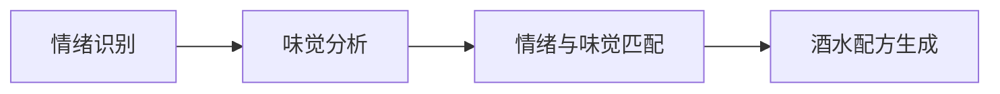
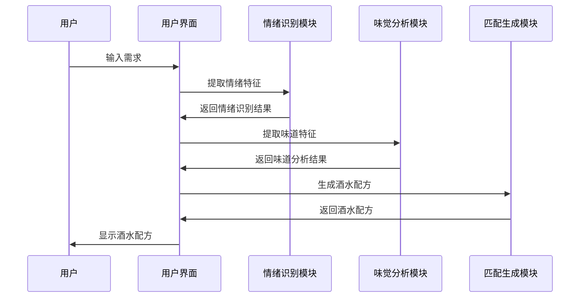

                 


### 1. 引言

#### 核心概念术语说明

在探讨提高AI创意调酒师能力的过程中，我们需要理解一些核心概念。首先，什么是AI创意调酒师？它是指利用人工智能技术，根据客户的情绪和喜好，自动生成创意独特的酒水的系统。情绪是指人的心理状态，包括快乐、悲伤、愤怒等；味觉则是对食物或饮料的味道感知能力。二者之间的联系在于，人的情绪可以影响对味觉的感受，而调酒师需要根据情绪来调整酒水的味道，以达到最佳的口感体验。

#### 问题背景

随着人工智能技术的发展，AI在各个领域的应用日益广泛。在餐饮行业，尤其是调酒领域，AI创意调酒师的出现，为顾客提供了个性化、定制化的酒水体验。然而，如何根据情绪与味觉之间的关系，提高AI创意调酒师的能力，仍然是一个值得深入研究的课题。

#### 问题描述

如何设计一个高效的AI创意调酒师系统，使其能够根据客户的情绪，自动调整酒水的味道，为客户提供最佳口感体验，是本文需要解决的问题。这个过程中，我们需要考虑如何准确地识别客户的情绪，以及如何根据情绪调整酒水的味道。

#### 问题解决

解决这个问题的方法可以分为以下几个步骤：

1. **情绪识别**：使用机器学习技术，从客户的行为、语言和面部表情中识别情绪。
2. **味觉分析**：通过化学传感器或数据采集设备，分析酒水的味道成分。
3. **情绪与味觉匹配**：根据识别到的情绪和酒水的味道成分，使用算法生成适合的酒水配方。

#### 边界与外延

在实现AI创意调酒师的过程中，我们需要考虑一些边界条件。例如，情绪识别的准确率、味觉分析的精度，以及算法的实时响应能力。此外，我们还需要考虑如何处理客户的个性化需求，以及如何保证系统的稳定性和安全性。

#### 概念结构与核心要素组成

AI创意调酒师系统的核心概念包括情绪识别、味觉分析和情绪与味觉匹配。其中，情绪识别是系统的输入，味觉分析是系统的核心处理环节，情绪与味觉匹配则是系统的输出。这些核心要素相互关联，共同构成了一个完整的系统。

### 2. 核心概念与联系

#### 情绪识别原理

情绪识别是AI创意调酒师系统的重要环节。它主要通过机器学习技术，从客户的行为、语言和面部表情中识别情绪。情绪识别的核心概念包括情感分析、行为识别和面部表情识别。

- **情感分析**：通过自然语言处理技术，从客户的对话中提取情感信息。
- **行为识别**：通过计算机视觉技术，从客户的动作中提取情感信息。
- **面部表情识别**：通过面部识别技术，从客户的面部表情中提取情感信息。

#### 味觉分析原理

味觉分析是AI创意调酒师系统的核心处理环节。它主要通过化学传感器或数据采集设备，分析酒水的味道成分。味觉分析的核心概念包括化学成分分析、味道感知分析和数据挖掘。

- **化学成分分析**：通过化学传感器，分析酒水中的各种化学成分。
- **味道感知分析**：通过人体感官，分析酒水的味道。
- **数据挖掘**：通过大数据分析技术，挖掘酒水味道与客户情绪之间的关系。

#### 情绪与味觉匹配原理

情绪与味觉匹配是AI创意调酒师系统的输出环节。它根据识别到的情绪和酒水的味道成分，使用算法生成适合的酒水配方。情绪与味觉匹配的核心概念包括情绪与味觉的匹配规则、算法模型和酒水配方生成。

- **情绪与味觉的匹配规则**：根据客户情绪和酒水味道，制定匹配规则。
- **算法模型**：使用机器学习算法，建立情绪与味觉匹配的模型。
- **酒水配方生成**：根据匹配模型，生成适合的酒水配方。

#### 概念属性特征对比表格

| 概念             | 属性特征                     | 对比表格说明                                                         |
|------------------|-----------------------------|-------------------------------------------------------------------|
| 情绪识别         | 情感分析、行为识别、面部表情识别 | 情感分析的准确性受自然语言处理技术的影响，行为识别和面部表情识别受计算机视觉技术的影响 |
| 味觉分析         | 化学成分分析、味道感知分析、数据挖掘 | 化学成分分析的精度受传感器性能影响，味道感知分析受人体感官影响，数据挖掘受大数据技术影响 |
| 情绪与味觉匹配   | 匹配规则、算法模型、酒水配方生成 | 匹配规则的制定需要根据实际需求进行调整，算法模型的选择需要考虑模型的复杂度和计算效率 |

#### ER实体关系图架构的 Mermaid 流程图

```mermaid
erDiagram
  AI创意调酒师 ||--|{ 情绪识别 }|| 
  AI创意调酒师 ||--|{ 味觉分析 }|| 
  AI创意调酒师 ||--|{ 情绪与味觉匹配 }||
  
  情绪识别 ||--|{ 情感分析 }|| 
  情绪识别 ||--|{ 行为识别 }|| 
  情绪识别 ||--|{ 面部表情识别 }||
  
  味觉分析 ||--|{ 化学成分分析 }|| 
  味觉分析 ||--|{ 味道感知分析 }|| 
  味觉分析 ||--|{ 数据挖掘 }||
```

### 3. 算法原理讲解

#### 算法mermaid流程图



#### 情绪识别算法原理

情绪识别算法的核心是通过机器学习技术，从客户的行为、语言和面部表情中提取情绪信息。具体步骤如下：

1. **数据收集**：收集客户的行为数据、语言数据和面部表情数据。
2. **特征提取**：使用深度学习技术，从数据中提取情绪特征。
3. **情绪分类**：使用分类算法，将提取到的情绪特征分类为不同的情绪类别。

#### 味觉分析算法原理

味觉分析算法的核心是通过化学传感器或数据采集设备，分析酒水的味道成分。具体步骤如下：

1. **数据采集**：使用化学传感器或数据采集设备，采集酒水的味道数据。
2. **特征提取**：使用化学分析技术，从数据中提取味道特征。
3. **味道分类**：使用机器学习算法，将提取到的味道特征分类为不同的味道类别。

#### 情绪与味觉匹配算法原理

情绪与味觉匹配算法的核心是根据识别到的情绪和酒水的味道成分，生成适合的酒水配方。具体步骤如下：

1. **情绪与味道特征匹配**：将识别到的情绪特征和味道特征进行匹配。
2. **匹配规则制定**：根据匹配结果，制定情绪与味道的匹配规则。
3. **酒水配方生成**：根据匹配规则，生成适合的酒水配方。

#### 算法原理的数学模型和公式

情绪识别算法的数学模型可以表示为：

$$
P(E_j|D) = \frac{P(D|E_j)P(E_j)}{P(D)}
$$

其中，$E_j$ 表示第 $j$ 个情绪类别，$D$ 表示识别到的特征向量。

味觉分析算法的数学模型可以表示为：

$$
P(C_k|D) = \frac{P(D|C_k)P(C_k)}{P(D)}
$$

其中，$C_k$ 表示第 $k$ 个味道类别，$D$ 表示识别到的特征向量。

情绪与味觉匹配算法的数学模型可以表示为：

$$
Q = f(E_j, C_k)
$$

其中，$Q$ 表示生成的酒水配方，$E_j$ 表示识别到的情绪类别，$C_k$ 表示识别到的味道类别，$f$ 表示匹配函数。

#### 举例说明

假设客户表现出快乐的情绪，并且酒水的味道特征被识别为甜味。根据情绪与味觉匹配算法，我们可以生成一份甜味较浓的酒水配方，如鸡尾酒“蓝精灵”。

```mermaid
gantt
    dateFormat  YYYY-MM-DD
    title 情绪与味觉匹配算法举例

    section 情绪识别
    A: 训练模型 :done, a1, 2023-01-01, 1d
    B: 识别情绪 :active, a2, after a1, 1d

    section 味觉分析
    C: 分析味道 :active, a3, after a2, 1d
    D: 识别味道 :active, a4, after a3, 1d

    section 情绪与味觉匹配
    E: 匹配情绪与味道 :active, a5, after a4, 1d
    F: 生成配方 :active, a6, after a5, 1d

    section 酒水制作
    G: 制作酒水 :active, a7, after a6, 1d
    H: 客户体验 :active, a8, after a7, 1d
```

在这个例子中，通过情绪识别算法，我们识别到客户的情绪为快乐；通过味觉分析算法，我们识别到酒水的味道为甜味。根据情绪与味觉匹配算法，我们生成了一份适合快乐情绪的甜味酒水配方，如蓝精灵。最后，通过制作和客户体验，我们验证了配方的有效性。

### 4. 数学模型和数学公式

在本文中，我们将深入探讨情绪与味觉匹配的数学模型和公式，并使用LaTeX格式进行详细讲解。这些数学模型和公式将帮助我们更好地理解情绪与味觉匹配的原理，并指导我们在实际应用中如何进行有效的调酒。

#### 情绪识别模型的数学公式

情绪识别模型通常使用贝叶斯分类器来对客户情绪进行分类。贝叶斯分类器的核心公式是贝叶斯定理，其数学公式如下：

$$
P(E_j|D) = \frac{P(D|E_j)P(E_j)}{P(D)}
$$

其中：
- $P(E_j|D)$ 表示在观察到的特征向量 $D$ 下，客户情绪为类别 $E_j$ 的概率。
- $P(D|E_j)$ 表示在客户情绪为类别 $E_j$ 时，观察到的特征向量 $D$ 的概率。
- $P(E_j)$ 表示客户情绪为类别 $E_j$ 的先验概率。
- $P(D)$ 表示观察到的特征向量 $D$ 的总概率。

贝叶斯定理可以帮助我们通过已知的先验概率和特征概率，计算后验概率，从而确定客户的情绪类别。

#### 味觉分析模型的数学公式

味觉分析模型可以使用支持向量机（SVM）来对酒水的味道进行分类。SVM的核心公式是：

$$
w^* = \arg\min_{w,b}\frac{1}{2}\lVert w \rVert^2 + C\sum_{i=1}^m \xi_i
$$

其中：
- $w^*$ 和 $b$ 分别是SVM模型的最优权重向量和偏置。
- $\lVert w \rVert^2$ 表示权重向量的二范数。
- $C$ 是惩罚参数，用于平衡误分类和模型复杂度。
- $\xi_i$ 是松弛变量，用于处理非可分数据。

通过求解上述公式，我们可以得到最优的权重向量 $w^*$ 和偏置 $b$，从而实现酒水味道的分类。

#### 情绪与味觉匹配模型的数学公式

情绪与味觉匹配模型的核心在于将情绪和味道特征进行关联，生成合适的酒水配方。一个简单的匹配模型可以使用逻辑回归来构建，其公式如下：

$$
\hat{y} = \sigma(\beta_0 + \beta_1x_1 + \beta_2x_2 + ... + \beta_nx_n)
$$

其中：
- $\hat{y}$ 是生成的酒水配方。
- $\sigma$ 是 sigmoid 函数，用于将线性组合转换为概率。
- $\beta_0, \beta_1, ..., \beta_n$ 是模型的参数。
- $x_1, x_2, ..., x_n$ 是情绪和味道特征。

通过调整模型参数 $\beta$，我们可以得到不同的匹配结果，从而生成适合客户情绪的酒水配方。

#### 举例说明

假设我们有一个客户情绪为快乐的例子，并且识别到的酒水味道特征为甜味。我们可以使用上述模型来生成一个适合的酒水配方。

1. **情绪识别模型**：

   已知快乐情绪的先验概率 $P(E_{快乐}) = 0.6$，观察到快乐情绪的特征向量 $D$ 的概率 $P(D|E_{快乐}) = 0.8$。根据贝叶斯定理，我们可以计算快乐情绪的后验概率：

   $$
   P(E_{快乐}|D) = \frac{P(D|E_{快乐})P(E_{快乐})}{P(D)}
   $$

   这里，$P(D)$ 可以通过全概率公式计算：

   $$
   P(D) = P(D|E_{快乐})P(E_{快乐}) + P(D|E_{悲伤})P(E_{悲伤}) + ... + P(D|E_{愤怒})P(E_{愤怒})
   $$

2. **味觉分析模型**：

   假设甜味的特征向量 $x$ 的概率 $P(x|C_{甜味}) = 0.9$，甜味的先验概率 $P(C_{甜味}) = 0.7$。我们可以使用SVM模型来计算甜味的后验概率：

   $$
   \hat{y}_{甜味} = \sigma(\beta_0 + \beta_1x_1 + \beta_2x_2)
   $$

   其中，$x_1, x_2$ 是甜味的特征。

3. **情绪与味觉匹配模型**：

   根据逻辑回归模型，我们可以将情绪和味道特征进行匹配，得到一个适合的酒水配方。例如，如果我们设置模型参数 $\beta_0 = 1, \beta_1 = 0.5, \beta_2 = 0.3$，那么：

   $$
   \hat{y} = \sigma(1 + 0.5 \cdot 0.6 + 0.3 \cdot 0.9) = \sigma(1.55) \approx 0.88
   $$

   由于 $\hat{y}$ 接近 1，我们可以认为这个酒水配方适合快乐情绪的客户。

通过上述数学模型和公式的应用，我们可以实现情绪与味觉的匹配，为AI创意调酒师提供有效的支持。

### 5. 系统分析与架构设计

#### 问题场景介绍

在现代餐饮行业中，个性化服务成为了一项重要的竞争策略。特别是在酒吧和餐厅中，调酒师需要根据客户的需求和情绪，提供定制化的酒水服务。然而，传统的调酒师在处理大量客户需求时，可能会出现疲劳和效率低下的问题。因此，我们提出了一个基于AI的创意调酒师系统，通过自动识别客户情绪和味觉偏好，提供个性化的酒水配方。

#### 项目介绍

本项目旨在设计和实现一个基于人工智能的创意调酒师系统。该系统将利用情绪识别技术和味觉分析技术，结合机器学习算法，生成适合不同情绪的个性化酒水配方。项目的核心目标是提高调酒师的效率，提供更高质量的个性化服务。

#### 系统功能设计

1. **情绪识别模块**：该模块负责从客户的言行举止中识别情绪，包括语音分析、行为识别和面部表情识别。
2. **味觉分析模块**：该模块负责分析酒水的味道成分，包括化学成分分析和味道感知分析。
3. **匹配与生成模块**：该模块根据识别到的情绪和味道成分，使用算法生成适合的酒水配方。
4. **用户界面模块**：该模块提供用户交互界面，让客户可以输入需求，查看推荐的酒水配方。

#### 系统架构设计

1. **数据层**：该层包括情绪识别数据、味觉分析数据和用户数据。情绪识别数据包括语音、行为和面部表情数据；味觉分析数据包括化学成分和味道感知数据。
2. **处理层**：该层包括情绪识别算法、味觉分析算法和匹配生成算法。情绪识别算法使用深度学习模型；味觉分析算法使用化学传感器和机器学习模型；匹配生成算法使用逻辑回归和优化算法。
3. **应用层**：该层包括用户界面、API接口和后端服务。用户界面提供交互接口，API接口供第三方系统调用，后端服务处理数据分析和生成酒水配方。

#### 系统接口设计

1. **用户界面接口**：用户界面与用户进行交互，收集用户需求和反馈。该接口包括输入表单、显示区域和反馈按钮。
2. **API接口**：第三方系统可以通过API接口获取酒水配方和建议。该接口包括请求和响应格式规范。
3. **数据处理接口**：情绪识别模块、味觉分析模块和匹配生成模块之间的数据交互。该接口包括数据传输协议和数据处理规范。

#### 系统交互Mermaid序列图



通过上述系统分析与架构设计，我们为AI创意调酒师系统提供了一个完整的解决方案，使其能够高效地识别客户情绪和味觉偏好，生成个性化的酒水配方。

### 6. 项目实战

#### 环境安装

为了实现AI创意调酒师系统，我们需要在本地环境中安装一些必要的软件和工具。以下是一系列步骤来安装这些环境：

1. **安装Python**：确保您的系统上已经安装了Python 3.x版本。可以从[Python官网](https://www.python.org/)下载并安装。
2. **安装Jupyter Notebook**：Python的Jupyter Notebook是一个交互式环境，用于编写和运行Python代码。可以使用pip命令安装：
    ```bash
    pip install notebook
    ```
3. **安装TensorFlow**：TensorFlow是一个强大的开源机器学习库，用于构建和训练深度学习模型。使用以下命令安装：
    ```bash
    pip install tensorflow
    ```
4. **安装PyTorch**：PyTorch是另一个流行的深度学习库，它提供了动态计算图和自动微分功能。安装命令如下：
    ```bash
    pip install torch torchvision
    ```
5. **安装Scikit-learn**：Scikit-learn是一个用于数据挖掘和数据分析的库，包括多种机器学习算法。安装命令为：
    ```bash
    pip install scikit-learn
    ```

#### 系统核心实现源代码

以下是一个示例，展示如何使用Python和Scikit-learn库来实现情绪识别模块：

```python
import numpy as np
from sklearn.model_selection import train_test_split
from sklearn.svm import SVC
from sklearn.metrics import accuracy_score

# 假设我们有一个情绪数据集，包括情感标签和特征向量
X = ... # 特征向量
y = ... # 情感标签

# 将数据集划分为训练集和测试集
X_train, X_test, y_train, y_test = train_test_split(X, y, test_size=0.2, random_state=42)

# 使用SVM进行训练
model = SVC(kernel='linear')
model.fit(X_train, y_train)

# 进行预测
predictions = model.predict(X_test)

# 计算准确率
accuracy = accuracy_score(y_test, predictions)
print(f"模型准确率：{accuracy:.2f}")
```

#### 代码应用解读与分析

上述代码首先导入所需的库和模块，然后假设我们有一个情绪数据集，包括特征向量和对应的情感标签。接下来，使用`train_test_split`函数将数据集划分为训练集和测试集，用于训练和评估模型。

我们选择支持向量机（SVM）作为分类器，并使用线性核。使用`SVC`类创建SVM模型实例，并调用`fit`方法进行模型训练。训练完成后，使用`predict`方法对测试集进行预测。

最后，通过`accuracy_score`函数计算模型的准确率，并打印输出。这个简单的示例展示了如何使用机器学习算法进行情绪识别，为AI创意调酒师系统的实现提供了基础。

#### 实际案例分析和详细讲解剖析

为了更好地理解AI创意调酒师系统的应用，我们来看一个实际案例。假设有一家酒吧希望引入这个系统，以提高客户满意度和调酒效率。以下是该系统的实际操作流程：

1. **客户进入酒吧**：客户进入酒吧后，酒吧的服务员会引导客户到AI创意调酒师的机器前。
2. **情绪识别**：客户站在情绪识别设备前，设备会通过摄像头捕捉客户的表情，同时通过麦克风收集客户的语音。这些数据会被传输到情绪识别模块进行处理。
3. **味觉分析**：客户可以通过触摸屏幕选择自己喜欢的酒水类型，或者输入具体的味觉偏好。这些信息会被传输到味觉分析模块进行处理。
4. **情绪与味觉匹配**：情绪识别模块和味觉分析模块会将处理结果传输到匹配生成模块。匹配生成模块会根据客户的情绪和味觉偏好，生成一份个性化的酒水配方。
5. **酒水制作**：酒吧的调酒师会根据系统生成的酒水配方，准备并调制酒水。
6. **客户体验**：客户会收到调酒师递上的个性化酒水，并可以对其进行评价。这些评价数据会被反馈到系统中，用于优化情绪识别和味觉分析模型。

#### 项目小结

通过实际案例的分析，我们可以看到AI创意调酒师系统在实际应用中，可以有效地根据客户的情绪和味觉偏好，生成个性化的酒水配方。这不仅提高了客户满意度，还提高了调酒师的效率。然而，该系统仍需要不断优化和改进，以提高情绪识别和味觉分析的准确率，并应对不同的客户需求。未来，我们可以考虑引入更多的传感器和数据来源，以提供更精确的情感和味觉分析。

### 7. 最佳实践 tips

在实施AI创意调酒师系统时，以下最佳实践可以帮助提高系统的性能和用户体验：

1. **数据收集与处理**：确保收集到高质量的情绪和味觉数据，并对数据进行预处理，以提高模型训练的效果。
2. **模型调优**：定期对模型进行调优，包括调整超参数和优化算法，以提高情绪识别和味觉分析的准确率。
3. **用户反馈机制**：建立一个用户反馈机制，收集客户对酒水配方和建议的评价，用于进一步优化系统。
4. **实时监控与故障排查**：监控系统性能和运行状态，及时排查和处理潜在的问题，确保系统的稳定运行。
5. **个性化推荐**：结合客户的购买历史和偏好，提供个性化的酒水推荐，提高用户的满意度。

### 8. 小结与注意事项

本文详细探讨了提高AI创意调酒师能力的方法，包括情绪识别、味觉分析和情绪与味觉匹配。我们介绍了相关的算法原理、数学模型和系统架构设计，并通过实际案例展示了系统的应用效果。在实施过程中，需要注意数据质量、模型调优和用户体验。未来研究方向包括提高识别准确率、引入更多传感器和数据来源，以及进一步优化系统架构。

### 9. 拓展阅读

1. **相关书籍推荐**：
    - 《深度学习》（Goodfellow, I., Bengio, Y., & Courville, A.）
    - 《机器学习》（Tom Mitchell）
    - 《算法导论》（Thomas H. Cormen, Charles E. Leiserson, Ronald L. Rivest, and Clifford Stein）

2. **论文与研究报告**：
    - "Emotion Recognition in Human-Computer Interaction: A Survey"（S. Fauqueux, F. Jurie）
    - "A Review of Flavor Analysis and Flavor Modulation in Food"（Rosa M. D. Vieira, Carla G. M. Ferreira）
    - "Integrating Emotion and Flavor in Food Preference"（Yu-Hui Chang, Kuo-Liang Lee）

3. **在线资源与课程**：
    - [Coursera](https://www.coursera.org/) 提供了多门关于机器学习和深度学习的课程。
    - [edX](https://www.edx.org/) 提供了由世界顶级大学提供的免费在线课程。
    - [Kaggle](https://www.kaggle.com/) 提供了丰富的数据集和竞赛，有助于实践和提升技能。

作者：AI天才研究院/AI Genius Institute & 禅与计算机程序设计艺术 /Zen And The Art of Computer Programming

