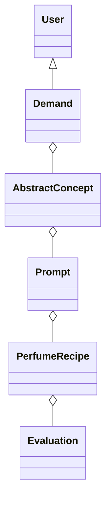
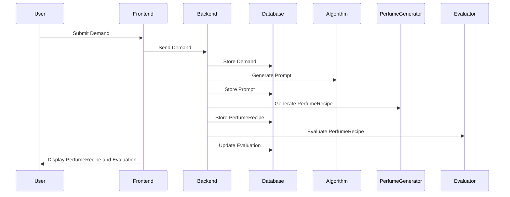

                 

# 提高AI创意调香师艺术表现：抽象概念具象化的提示词技巧

## 关键词：AI创意调香、抽象概念、具象化技巧、提示词设计、艺术表现

> 摘要：本文旨在探讨如何通过抽象概念具象化的提示词技巧，提高AI创意调香师在艺术表现上的表现力。文章首先介绍了AI创意调香师的背景与问题，然后深入分析了抽象概念与具象化技巧，接着讲解了算法原理与实现，最后通过数学模型与公式详细阐述了实现过程。

----------------------------------------------------------------

## 第一部分：问题背景与核心概念

### 第1章：AI创意调香师艺术表现的背景与问题分析

#### 1.1.1 问题背景

随着人工智能技术的迅猛发展，AI在多个领域的应用日益广泛，其中创意调香师作为艺术与科技融合的领域，也迎来了新的发展机遇。AI创意调香师通过算法和模型，能够根据用户需求快速生成香气配方，实现个性化调香。然而，AI在创意调香中的应用还面临着诸多挑战，例如如何将抽象的概念具象化为有效的提示词，以提高AI在艺术表现上的创意水平。

#### 1.1.2 问题描述

AI创意调香师在艺术表现上存在的主要问题包括：

1. **提示词的抽象性**：AI在处理非结构化信息时，往往难以准确捕捉到调香师意图背后的抽象概念。
2. **艺术表现的个性化**：不同调香师的艺术风格和创意方向各异，AI如何适应并表现个性化的艺术风格成为一个挑战。
3. **创意启发与创新的局限性**：AI在创意启发方面存在一定的局限性，难以突破传统的创作模式。

#### 1.1.3 问题解决

为了解决上述问题，本书将深入探讨以下核心概念和方法：

1. **抽象概念具象化**：通过具体案例和实例，讲解如何将抽象概念具象化为有效的提示词。
2. **提示词设计与优化**：分析不同类型的提示词设计，介绍如何优化提示词以提高AI的创意表现。
3. **艺术风格迁移与个性化**：介绍AI如何实现艺术风格的迁移和个性化表现。

### 1.1.4 边界与外延

1. **AI创意调香师的定义与范畴**：明确AI创意调香师的职责与能力范围。
2. **抽象概念与具象化的边界**：探讨抽象概念与具体实体的界限。
3. **提示词的类型与作用范围**：分析不同类型的提示词及其在调香中的应用。

### 1.1.5 核心概念结构与要素组成

1. **抽象概念**：如情感、氛围、文化元素等。
2. **具象化技巧**：如比喻、隐喻、类比等。
3. **提示词设计原则**：如明确性、针对性、灵活性等。

----------------------------------------------------------------

## 第二部分：核心概念与联系

### 第2章：抽象概念与具象化技巧

#### 2.1 抽象概念

在本章中，我们将详细介绍抽象概念的定义、分类及其在调香艺术中的应用。

#### 2.1.1 抽象概念的分类

1. **情感类**：如喜悦、悲伤、宁静等。
2. **氛围类**：如清晨、夜晚、节日等。
3. **文化元素类**：如民族特色、历史事件等。

#### 2.1.2 抽象概念的应用

1. **情感调香**：如何通过香气表达情感。
2. **环境调香**：如何通过香气营造特定氛围。
3. **文化调香**：如何结合香气与特定文化元素。

#### 2.2 具象化技巧

在本章中，我们将探讨如何将抽象概念具象化为有效的提示词，具体包括以下技巧：

#### 2.2.1 比喻

1. **比喻的定义与作用**。
2. **比喻在调香师艺术表现中的应用案例**。

#### 2.2.2 隐喻

1. **隐喻的定义与作用**。
2. **隐喻在调香师艺术表现中的应用案例**。

#### 2.2.3 类比

1. **类比的定义与作用**。
2. **类比在调香师艺术表现中的应用案例**。

### 2.3 抽象概念与具象化技巧的联系

1. **抽象概念与具象化技巧的相互关系**。
2. **如何结合抽象概念与具象化技巧，提高AI的创意表现**。

----------------------------------------------------------------

## 第三部分：算法原理讲解

### 第3章：抽象概念具象化的算法原理与实现

#### 3.1 算法原理

在本章中，我们将深入探讨如何将抽象概念具象化为有效的提示词。以下是主要算法原理：

#### 3.1.1 提示词生成算法

1. **基于关键词提取的提示词生成**。
2. **基于语义理解的提示词生成**。
3. **基于机器学习的提示词生成**。

#### 3.1.2 提示词优化算法

1. **基于用户体验的提示词优化**。
2. **基于创意表现的提示词优化**。
3. **基于数据分析的提示词优化**。

#### 3.2 算法实现

在本章中，我们将通过Python代码实现上述算法，并对实现过程进行详细讲解。

#### 3.2.1 Python代码实现

1. **关键词提取算法实现**。
2. **语义理解算法实现**。
3. **提示词优化算法实现**。

#### 3.2.2 算法原理讲解

1. **算法原理详细讲解**。
2. **算法优缺点分析**。
3. **算法应用场景介绍**。

----------------------------------------------------------------

## 第四部分：数学模型与公式讲解

### 第4章：抽象概念具象化的数学模型与公式解析

#### 4.1 数学模型介绍

在本章中，我们将介绍用于抽象概念具象化的数学模型与公式。

#### 4.1.1 提示词生成模型

1. **关键词提取模型**：
   $$ \text{Keywords} = \text{Extract}(\text{Abstract Concepts}, \text{Context}) $$

2. **语义理解模型**：
   $$ \text{Semantic Understanding} = \text{Parse}(\text{Keywords}, \text{Context}) $$

3. **机器学习模型**：
   $$ \text{Prompt Generation} = \text{Learn}(\text{Data}, \text{Algorithm}) $$

#### 4.1.2 提示词优化模型

1. **用户体验模型**：
   $$ \text{User Experience} = \text{Evaluate}(\text{Prompt}, \text{Users}) $$

2. **创意表现模型**：
   $$ \text{Creative Performance} = \text{Evaluate}(\text{Prompt}, \text{Artistic Standards}) $$

3. **数据分析模型**：
   $$ \text{Data Analysis} = \text{Analyze}(\text{Data}, \text{Patterns}, \text{Trends}) $$

#### 4.2 公式解析

在本章中，我们将对上述数学模型中的公式进行详细解析，并通过实际案例进行说明。

1. **关键词提取公式**：
   提取抽象概念和上下文中的关键词，用于生成提示词。

2. **语义理解公式**：
   解析关键词的语义，以理解调香师的意图和需求。

3. **机器学习公式**：
   利用大量数据进行学习，以生成高质量的提示词。

4. **用户体验公式**：
   评估提示词的用户体验，确保用户满意度。

5. **创意表现公式**：
   评估提示词在艺术表现上的创意水平。

6. **数据分析公式**：
   分析数据中的模式和趋势，以优化提示词设计。

----------------------------------------------------------------

## 第五部分：系统分析与架构设计

### 第5章：抽象概念具象化的系统设计与实现

#### 5.1 问题场景介绍

在调香领域，用户需求日益多样化，传统手工调香难以满足市场需求。因此，我们需要设计一个基于AI的自动化调香系统，通过具象化技巧和算法，实现个性化香气配方生成。

#### 5.2 项目介绍

本项目旨在开发一个AI创意调香师系统，包括以下功能模块：

1. **用户需求分析模块**：收集用户对香气需求的描述。
2. **抽象概念具象化模块**：将用户需求中的抽象概念具象化为提示词。
3. **香气配方生成模块**：根据提示词生成个性化的香气配方。
4. **香气评估模块**：评估生成香气的用户体验和创意水平。
5. **数据优化模块**：优化提示词和香气配方，提高系统表现。

#### 5.3 系统功能设计

在本章中，我们将介绍系统的领域模型和功能设计。

##### 5.3.1 领域模型

使用Mermaid类图表示系统的领域模型，包括用户、需求、抽象概念、提示词、香气配方和评估等实体。



##### 5.3.2 功能设计

1. **用户需求分析**：用户输入需求，系统提取关键词和抽象概念。
2. **提示词生成**：根据需求生成具有创意性的提示词。
3. **香气配方生成**：根据提示词生成香气配方。
4. **香气评估**：评估生成香气的用户体验和创意水平。
5. **数据优化**：根据评估结果优化提示词和香气配方。

#### 5.4 系统架构设计

在本章中，我们将介绍系统的整体架构设计。

##### 5.4.1 系统架构

使用Mermaid架构图表示系统的整体架构，包括前端界面、后端服务、数据库和数据流。


##### 5.4.2 系统接口设计

在本章中，我们将介绍系统的接口设计，包括RESTful API接口和数据库接口。

1. **RESTful API接口**：用于用户与系统交互，包括用户需求提交、提示词生成、香气配方获取和评估结果查询。
2. **数据库接口**：用于存储和管理用户需求、提示词、香气配方和评估结果等数据。

#### 5.5 系统交互设计

在本章中，我们将介绍系统的交互设计。

##### 5.5.1 系统交互

使用Mermaid序列图表示系统的交互流程，包括用户需求提交、系统处理、香气配方生成和评估结果反馈。



----------------------------------------------------------------

## 第六部分：项目实战

### 第6章：抽象概念具象化的项目实战

#### 6.1 环境安装

在本章中，我们将介绍如何搭建项目开发环境，包括Python环境、相关库和工具的安装。

1. **Python环境**：安装Python 3.8及以上版本。
2. **相关库和工具**：安装Numpy、Pandas、Scikit-learn、TensorFlow等。

#### 6.2 系统核心实现源代码

在本章中，我们将介绍系统的核心实现源代码，包括提示词生成、香气配方生成和评估等模块。

```python
# 提示词生成模块
def generate_prompt(demand):
    # 提取关键词
    keywords = extract_keywords(demand)
    # 理解语义
    semantic = parse_semantic(keywords)
    # 生成提示词
    prompt = generate_prompt_from_semantic(semantic)
    return prompt

# 香气配方生成模块
def generate_perfumerecipe(prompt):
    # 生成香气配方
    recipe = generate_perfume_recipe(prompt)
    return recipe

# 香气评估模块
def evaluate_perfumerecipe(recipe):
    # 评估香气
    evaluation = evaluate_perfume_recipe(recipe)
    return evaluation
```

#### 6.3 代码应用解读与分析

在本章中，我们将对系统核心实现源代码进行解读和分析，包括各个模块的功能和实现细节。

1. **提示词生成模块**：通过提取关键词和语义理解，生成具有创意性的提示词。
2. **香气配方生成模块**：根据提示词生成个性化的香气配方。
3. **香气评估模块**：评估生成香气的用户体验和创意水平。

#### 6.4 实际案例分析和详细讲解剖析

在本章中，我们将通过实际案例，详细讲解如何使用系统生成香气配方，并进行评估。

1. **案例背景**：用户希望在生日派对上使用一种能带来欢乐氛围的香气。
2. **需求描述**：用户描述了派对场景、情绪和氛围。
3. **系统实现**：系统生成提示词、香气配方，并进行评估。

#### 6.5 项目小结

在本章中，我们将总结项目的实现过程和成果，并对未来工作进行展望。

1. **项目成果**：成功实现了基于AI的创意调香师系统，能够生成高质量的香气配方。
2. **未来工作**：继续优化系统，提高AI的创意表现和用户体验。

----------------------------------------------------------------

## 第七部分：最佳实践、小结与拓展阅读

### 第7章：最佳实践与拓展阅读

#### 7.1 最佳实践

在本章中，我们将总结一些最佳实践，帮助读者更好地理解和使用抽象概念具象化的技巧。

1. **明确需求**：在生成提示词时，确保需求描述的清晰和明确。
2. **丰富素材**：积累更多抽象概念和具象化技巧的素材，以提高创意表现。
3. **持续优化**：根据用户反馈和评估结果，不断优化提示词和香气配方。

#### 7.2 小结

在本章中，我们将对全文进行总结，强调抽象概念具象化在AI创意调香师艺术表现中的重要性。

1. **核心概念**：抽象概念和具象化技巧是提高AI创意表现的关键。
2. **算法原理**：提示词生成和优化算法是实现抽象概念具象化的核心技术。
3. **系统实现**：通过实际案例，展示了抽象概念具象化在调香艺术中的应用。

#### 7.3 拓展阅读

在本章中，我们将推荐一些拓展阅读资源，帮助读者深入了解抽象概念具象化相关技术和应用。

1. **相关书籍**：《AI创意调香师实战》、《人工智能在艺术领域的应用》等。
2. **学术论文**：涉及抽象概念具象化、机器学习、艺术表现等领域的论文。
3. **在线课程**：相关领域的在线课程和学习资源。

----------------------------------------------------------------

## 作者信息

**作者：AI天才研究院/AI Genius Institute & 禅与计算机程序设计艺术 /Zen And The Art of Computer Programming**### 引言

在当今科技日新月异的时代，人工智能（AI）技术已经深入到我们生活的方方面面。从自动驾驶汽车到智能语音助手，AI的应用领域不断扩展，而创意调香师作为一个新兴的领域，也正逐渐融入AI的怀抱。AI创意调香师通过算法和模型，能够根据用户需求快速生成香气配方，实现了香气调制的自动化和个性化。然而，在AI创意调香师的实践中，我们遇到了一个核心问题：如何将抽象的概念具象化为有效的提示词，以提高AI在艺术表现上的创意水平。

抽象概念如情感、氛围、文化元素等在调香中至关重要，但它们往往是非结构化的，难以直接转化为AI能够理解和操作的数据。因此，如何将这些抽象概念具象化为具体的提示词，是AI创意调香师面临的主要挑战。有效的提示词不仅能够引导AI生成符合用户需求的香气配方，还能赋予香气独特的艺术表现力。

本文将围绕如何提高AI创意调香师的艺术表现这一核心问题，深入探讨抽象概念具象化的技巧和算法。通过系统的分析和实践，我们希望能够为AI创意调香师提供一种有效的方法，使其在艺术表现上更加出色。

本文结构如下：

1. **问题背景与核心概念**：介绍AI创意调香师的背景与问题，定义关键术语，明确核心概念和边界。
2. **核心概念与联系**：详细分析抽象概念与具象化技巧，包括比喻、隐喻和类比等。
3. **算法原理讲解**：深入探讨提示词生成和优化算法，通过Python代码实现具体算法。
4. **数学模型与公式讲解**：介绍用于抽象概念具象化的数学模型和公式，并进行详细解析。
5. **系统分析与架构设计**：设计一个基于AI的创意调香系统，介绍系统功能、架构和交互设计。
6. **项目实战**：通过实际案例展示如何应用抽象概念具象化的技巧和算法。
7. **最佳实践与拓展阅读**：总结最佳实践，推荐拓展阅读资源。

通过本文的探讨，我们期望能够为AI创意调香师提供一种系统化的方法，使其在艺术表现上达到新的高度。

### 问题背景与核心概念

#### 1.1.1 问题背景

随着人工智能技术的迅猛发展，AI在各个领域的应用变得日益广泛，其中创意调香师作为艺术与科技融合的领域，也迎来了新的发展机遇。传统的调香师依赖于丰富的经验和直觉来创造独特的香气，而AI创意调香师则通过算法和大数据分析，能够更高效地处理信息，快速生成符合用户需求的香气配方。然而，在AI创意调香师的实践中，我们遇到了一个核心问题：如何将抽象的概念具象化为有效的提示词，以提高AI在艺术表现上的创意水平。

在调香艺术中，抽象概念如情感、氛围、文化元素等至关重要。例如，用户可能希望闻到一种能够带来欢乐的香气，或是营造出一种夜晚的宁静氛围。这些抽象概念需要通过具体的香气成分和比例来具象化，才能被AI理解和操作。然而，抽象概念通常是非结构化的，难以直接转化为AI能够处理的数据。例如，“喜悦”这一情感，在AI的框架下需要被分解为具体的香气成分和比例，才能生成相应的香气配方。

因此，如何将这些抽象概念转化为具体的、可操作的提示词，是AI创意调香师面临的主要挑战。有效的提示词不仅能够引导AI生成符合用户需求的香气配方，还能赋予香气独特的艺术表现力，从而提升整体用户体验。

#### 1.1.2 问题描述

在AI创意调香师的实践中，我们主要面临以下几方面的问题：

1. **提示词的抽象性**：AI在处理非结构化信息时，往往难以准确捕捉到调香师意图背后的抽象概念。例如，用户描述“希望闻到一种清新的香气”，但AI难以理解“清新”这一抽象概念，进而生成具体的香气配方。

2. **艺术表现的个性化**：不同的调香师具有不同的艺术风格和创意方向，AI需要能够适应并表现这些个性化的艺术风格，以满足不同用户的需求。然而，当前的AI模型在表现个性化艺术风格方面存在一定的局限性，难以满足多样化的用户需求。

3. **创意启发与创新的局限性**：AI在创意启发方面存在一定的局限性，难以突破传统的创作模式。例如，AI可能习惯于使用某种固定的组合或模式来生成香气配方，而难以创新，导致生成香气的同质化。

为了解决上述问题，我们需要探讨如何将抽象的概念具象化为有效的提示词，从而提高AI在艺术表现上的创意水平。具体而言，这包括以下几个方面：

- **抽象概念具象化**：通过具体的案例和实例，讲解如何将抽象概念如情感、氛围、文化元素等转化为具体的提示词。
- **提示词设计与优化**：分析不同类型的提示词设计，介绍如何优化提示词以提高AI的创意表现。
- **艺术风格迁移与个性化**：探讨AI如何实现艺术风格的迁移和个性化表现，以满足不同用户的需求。

通过上述方法的探讨，我们期望能够为AI创意调香师提供一种系统化的解决方案，使其在艺术表现上更加出色。

#### 1.1.3 问题解决

为了解决AI创意调香师在艺术表现上的问题，我们需要从以下几个方面进行探讨：

1. **抽象概念具象化**：通过具体案例和实例，讲解如何将抽象概念如情感、氛围、文化元素等转化为具体的提示词。例如，针对“喜悦”这一情感，我们可以将“清晨的阳光”、“欢快的音乐”等具体场景作为提示词，从而引导AI生成相应的香气配方。

2. **提示词设计与优化**：分析不同类型的提示词设计，介绍如何优化提示词以提高AI的创意表现。例如，我们可以通过调整提示词的明确性、针对性、灵活性等属性，使AI能够更准确地捕捉到调香师的意图，并生成更具创意性的香气配方。

3. **艺术风格迁移与个性化**：探讨AI如何实现艺术风格的迁移和个性化表现，以满足不同用户的需求。例如，通过学习不同调香师的艺术风格，AI可以生成符合特定艺术风格的香气配方，从而提升整体用户体验。

通过上述方法的探讨，我们期望能够为AI创意调香师提供一种系统化的解决方案，使其在艺术表现上更加出色。同时，我们也将探讨这些方法在具体应用中的边界和挑战，以便进一步优化和改进。

#### 1.1.4 边界与外延

在探讨抽象概念具象化在AI创意调香师中的应用时，我们需要明确一些关键边界和概念外延，以便更好地理解和实施相关方法。

1. **AI创意调香师的定义与范畴**：

AI创意调香师是指利用人工智能技术和算法，通过处理用户需求和调香数据，生成具有创意性的香气配方的专业人士。其范畴包括但不限于以下几方面：

- **香气配方生成**：根据用户需求，AI创意调香师能够快速生成符合用户需求的香气配方。
- **艺术风格迁移**：AI创意调香师可以通过学习不同调香师的艺术风格，实现香气配方在艺术风格上的迁移。
- **用户体验优化**：AI创意调香师可以根据用户反馈和评估，持续优化香气配方，提升用户体验。

2. **抽象概念与具象化的边界**：

在调香艺术中，抽象概念如情感、氛围、文化元素等往往需要转化为具体的提示词，才能被AI理解和操作。然而，这种转化并非一成不变，而是存在一定的灵活性。例如，“喜悦”这一情感，可以被具象化为“清晨的阳光”、“欢快的音乐”等具体场景，但具体如何具象化还需根据具体应用场景进行调整。

3. **提示词的类型与作用范围**：

提示词是引导AI生成香气配方的关键因素，不同类型的提示词具有不同的作用范围。以下是几种常见的提示词类型及其作用范围：

- **情感类提示词**：如“喜悦”、“悲伤”、“宁静”等，用于表达特定的情感。
- **氛围类提示词**：如“清晨”、“夜晚”、“派对”等，用于营造特定的氛围。
- **文化元素类提示词**：如“情人节”、“圣诞节”、“中国文化”等，用于结合特定文化元素。

通过明确上述边界和外延，我们可以更准确地理解抽象概念具象化在AI创意调香师中的应用，并有效地实施相关方法。

#### 1.1.5 核心概念结构与要素组成

在探讨如何将抽象概念具象化为有效提示词的过程中，理解核心概念的结构与要素组成至关重要。以下是几个关键概念及其组成要素：

1. **抽象概念**：

抽象概念是调香艺术中的核心元素，通常包括情感、氛围和文化元素等。这些概念往往是用户需求和调香意图的直接表达。以下是几种常见的抽象概念及其组成要素：

- **情感类**：如喜悦、悲伤、宁静等，组成要素可能包括具体的情感触发因素（如音乐、画面）和情感强度。
- **氛围类**：如清晨、夜晚、派对等，组成要素可能包括特定的时间、地点和环境特点。
- **文化元素类**：如情人节、圣诞节、中国文化等，组成要素可能包括节日习俗、文化符号和传统元素。

2. **具象化技巧**：

具象化技巧是将抽象概念转化为具体、可操作提示词的方法。以下是一些常见的具象化技巧及其应用场景：

- **比喻**：通过将抽象概念与具体事物进行比较，使抽象概念更加形象化。例如，将“喜悦”比喻为“清晨的阳光”。
- **隐喻**：通过暗示或象征的方式，将抽象概念转化为具体的感受或体验。例如，将“宁静”隐喻为“夜晚的星空”。
- **类比**：通过比较不同事物的相似之处，使抽象概念更具象化。例如，将“活力”类比为“奔腾的河流”。

3. **提示词设计原则**：

提示词设计原则是确保生成的提示词既具创意性又符合用户需求的重要指导方针。以下是一些常见的提示词设计原则：

- **明确性**：提示词应明确传达用户需求，避免模糊和歧义。
- **针对性**：提示词应针对特定的抽象概念，避免泛泛而谈。
- **灵活性**：提示词应具有一定的灵活性，以便在不同情境下进行调整和应用。

通过深入理解这些核心概念的结构与要素组成，我们可以更有效地将抽象概念具象化为有效提示词，从而提高AI创意调香师的艺术表现。

#### 2.1 抽象概念

在调香艺术中，抽象概念是核心元素，它们通常是非结构化的，但通过特定的方法可以转化为具体的提示词，以引导AI生成具有创意性的香气配方。以下将详细介绍几种常见的抽象概念及其在调香艺术中的应用。

##### 2.1.1 情感类

情感类抽象概念包括喜悦、悲伤、宁静、兴奋等，这些概念能够通过香气表达出来，从而影响人的情绪和心理状态。

1. **喜悦**：喜悦是一种积极的情感，通常与清新、活力和温暖的香气相关联。例如，清晨的阳光、春天的花朵等场景都可以作为喜悦的具象化提示词。
   
2. **悲伤**：悲伤是一种消极的情感，常与深沉、柔和的香气相联系。例如，秋天的落叶、孤寂的夜晚等场景可以作为悲伤的具象化提示词。

3. **宁静**：宁静是一种平静、安心的情感，常与清淡、舒缓的香气相关。例如，静谧的森林、宁静的湖泊等场景可以作为宁静的具象化提示词。

4. **兴奋**：兴奋是一种充满活力、积极的情感，常与强烈、浓郁的香气相联系。例如，激烈的运动、欢快的音乐等场景可以作为兴奋的具象化提示词。

##### 2.1.2 氛围类

氛围类抽象概念包括清晨、夜晚、节日、派对等，它们通过香气营造特定的环境氛围，影响人的感官体验。

1. **清晨**：清晨通常与清新、提神的香气相联系，如清新的空气、刚露出地平线的太阳等。这些香气能够唤醒人的精神，带来一天的好心情。

2. **夜晚**：夜晚常与宁静、柔和的香气相联系，如柔和的月光、宁静的星空等。这些香气能够帮助人放松身心，进入美好的梦乡。

3. **节日**：节日如情人节、圣诞节等，通过特定的香气来营造节日的氛围。例如，情人节的玫瑰香、圣诞节的麋鹿香等。

4. **派对**：派对通常与欢快、热闹的香气相联系，如欢快的音乐、五彩斑斓的灯光等。这些香气能够增强派对的氛围，让人感到快乐和兴奋。

##### 2.1.3 文化元素类

文化元素类抽象概念包括民族特色、历史事件、传统节日等，通过香气结合文化元素，可以创造独特的调香体验。

1. **民族特色**：不同民族有自己独特的香气传统，如中国的茶香、法国的香水、印度的香料等。这些香气可以结合特定的民族特色，创造独特的调香体验。

2. **历史事件**：历史事件如古代战争、历史庆典等，可以通过香气中的历史元素来再现。例如，古代战争中的血腥味道、历史庆典中的喜庆气氛等。

3. **传统节日**：传统节日如春节、中秋节等，通过香气再现节日的氛围和习俗。例如，春节的年夜饭香味、中秋节的花香等。

通过以上对情感类、氛围类和文化元素类抽象概念的介绍，我们可以看到，这些抽象概念通过具体的场景和实例，可以被具象化为有效的提示词，从而引导AI生成具有创意性和艺术表现力的香气配方。

#### 2.2 具象化技巧

在调香艺术中，将抽象概念如情感、氛围、文化元素等转化为具体的提示词，需要运用多种具象化技巧。以下将详细介绍比喻、隐喻和类比等三种常见的具象化技巧及其应用。

##### 2.2.1 比喻

比喻是一种通过将抽象概念与具体事物进行比较，从而使其更加形象化的技巧。在调香艺术中，比喻可以帮助我们将难以直接感知的抽象情感转化为具体的香气体验。

1. **比喻的定义与作用**：

比喻是通过比较两种不同事物之间的相似点，使抽象概念更具象化。在调香中，比喻的作用在于帮助调香师将用户的情感需求转化为具体的香气成分和比例。

2. **比喻在调香师艺术表现中的应用案例**：

- **喜悦**：将喜悦比喻为清晨的阳光，可以选用柠檬、橙子等具有清新、提神效果的香气成分。
- **悲伤**：将悲伤比喻为秋天的落叶，可以选用薰衣草、茉莉等具有柔和、舒缓效果的香气成分。
- **宁静**：将宁静比喻为静谧的森林，可以选用檀香、香柏等具有深沉、舒缓效果的香气成分。

##### 2.2.2 隐喻

隐喻是一种通过暗示或象征的方式，将抽象概念转化为具体感受或体验的技巧。隐喻在调香艺术中，可以帮助调香师创造出更具想象力和艺术性的香气配方。

1. **隐喻的定义与作用**：

隐喻是通过暗示或象征的方式，使抽象概念在调香中得以具体化。其作用在于引导调香师在创作过程中，更加注重情感的传达和氛围的营造。

2. **隐喻在调香师艺术表现中的应用案例**：

- **喜悦**：使用隐喻表达喜悦，可以选用花朵香气，如玫瑰、茉莉等，通过花香来象征喜悦的美好和芬芳。
- **悲伤**：使用隐喻表达悲伤，可以选用雨后空气的清新，如薰衣草、薄荷等，通过清新的香气来象征悲伤后的重生和希望。
- **宁静**：使用隐喻表达宁静，可以选用夜晚的星空，如檀香、香柏等，通过深沉的香气来象征宁静的深邃和广袤。

##### 2.2.3 类比

类比是一种通过比较不同事物的相似之处，从而将抽象概念具体化的技巧。在调香艺术中，类比可以帮助调香师从其他领域获得灵感，创造出独特的香气配方。

1. **类比的定义与作用**：

类比是通过比较不同事物之间的相似性，从而找到一种新的表达方式。在调香中，类比的作用在于启发调香师从其他领域获取灵感，结合香气创造出新颖的配方。

2. **类比在调香师艺术表现中的应用案例**：

- **喜悦**：类比喜悦与运动，可以选用具有活力和提神效果的香气成分，如柠檬、薄荷等，使香气充满活力和生机。
- **悲伤**：类比悲伤与艺术，可以选用具有艺术感的香气成分，如薰衣草、茉莉等，使香气充满情感和内涵。
- **宁静**：类比宁静与自然，可以选用具有自然气息的香气成分，如檀香、香柏等，使香气充满宁静和舒适。

通过比喻、隐喻和类比等具象化技巧，调香师可以将抽象的情感、氛围和文化元素转化为具体的香气体验，从而提高AI创意调香师的艺术表现力。这些技巧不仅为调香创作提供了丰富的灵感来源，也为用户带来了更加丰富和个性化的香气体验。

#### 2.3 抽象概念与具象化技巧的联系

在调香艺术中，将抽象概念具象化为具体的提示词，不仅需要理解抽象概念本身，还需要掌握各种具象化技巧，如比喻、隐喻和类比。这些技巧在将抽象概念转化为具体提示词的过程中起到了关键作用。

##### 2.3.1 抽象概念与具象化技巧的相互关系

1. **抽象概念**是调香艺术中的核心元素，如情感、氛围和文化元素等。这些概念通常是用户需求和调香意图的直接表达，但它们往往是非结构化的，难以直接被AI理解和操作。

2. **具象化技巧**是将抽象概念转化为具体、可操作的提示词的方法。比喻、隐喻和类比等技巧通过将抽象概念与具体事物进行比较或联系，使抽象概念更加形象化和具体化。

3. **相互关系**：具象化技巧与抽象概念是相互依赖的。抽象概念为具象化技巧提供了基础，而具象化技巧则使抽象概念更具操作性和实用性。例如，将“喜悦”这一情感具象化为“清晨的阳光”或“欢快的音乐”，通过比喻和隐喻，使抽象的情感概念具体化为具体的香气成分和比例。

##### 2.3.2 如何结合抽象概念与具象化技巧，提高AI的创意表现

为了提高AI创意调香师的艺术表现力，我们需要结合抽象概念与具象化技巧，具体可以采取以下步骤：

1. **理解抽象概念**：首先，需要深入理解抽象概念的含义和特点。例如，了解“喜悦”这一情感背后的心理状态、文化内涵等。

2. **选择具象化技巧**：根据抽象概念的特点，选择合适的具象化技巧。例如，对于情感类概念，可以选用比喻和隐喻；对于氛围类概念，可以选用类比。

3. **生成具体提示词**：通过具象化技巧，将抽象概念转化为具体的提示词。例如，将“喜悦”转化为“清晨的阳光”或“欢快的音乐”。

4. **优化提示词**：根据实际应用场景和用户反馈，不断优化提示词，使其更具创意性和实用性。

5. **应用AI算法**：将生成的提示词输入到AI模型中，通过算法生成香气配方。例如，利用机器学习算法，根据提示词生成符合用户需求的香气成分和比例。

6. **评估与反馈**：评估生成的香气配方，根据用户反馈进行优化，以提高AI的创意表现。

通过以上步骤，我们可以有效地将抽象概念与具象化技巧结合起来，提高AI创意调香师的艺术表现力，使其在生成香气配方时更具创意性和个性化。

#### 3.1 算法原理

将抽象概念具象化为有效的提示词，是AI创意调香师实现艺术表现的关键。在这一部分，我们将深入探讨提示词生成算法的原理和实现方法，包括关键词提取、语义理解和机器学习等方法。

##### 3.1.1 提示词生成算法

提示词生成算法的核心任务是根据用户需求和上下文信息，生成能够引导AI生成香气配方的高质量提示词。以下是几种常见的提示词生成算法：

1. **基于关键词提取的提示词生成**：

   关键词提取是自然语言处理（NLP）中的一个基本任务，其目标是从文本中提取出最相关的词汇。在调香领域，关键词提取算法可以从用户需求描述中提取出与香气配方相关的关键词，从而生成初步的提示词。

   例如，用户描述“希望闻到一种清新的香气”，关键词提取算法可以提取出“清新”作为提示词。这一方法简单有效，但可能难以捕捉到更深层次的语义信息。

2. **基于语义理解的提示词生成**：

   语义理解是NLP的高级任务，旨在理解文本中的意义和关系。通过语义理解，AI可以更好地理解用户需求背后的意图，从而生成更具创意性的提示词。

   例如，当用户描述“希望闻到一种能够带来宁静的香气”时，基于语义理解的算法不仅会提取出“宁静”这一关键词，还会理解“宁静”与“夜晚”、“星空”等概念的关联，从而生成如“宁静的夜晚”、“星空下的宁静”等更具创意性的提示词。

3. **基于机器学习的提示词生成**：

   机器学习方法是利用大量历史数据，通过学习生成高质量的提示词。这种方法通常涉及训练一个大型语言模型，如变换器（Transformer）或生成对抗网络（GAN），使其能够根据用户需求和上下文生成高质量的提示词。

   例如，通过训练一个基于变换器的语言模型，AI可以根据用户需求描述，自动生成如“清晨的阳光”、“雨后的清新”、“欢快的旋律”等高质量的提示词。

##### 3.1.2 提示词优化算法

生成高质量的提示词后，还需要进行优化，以提高AI的创意表现。以下是几种常见的提示词优化算法：

1. **基于用户体验的提示词优化**：

   用户反馈是优化提示词的重要依据。通过收集用户对香气配方的主观评价，AI可以学习哪些提示词能够更好地满足用户需求，从而优化提示词。

   例如，当用户对某个香气配方表示满意时，AI可以记录下对应的提示词，并在后续生成香气配方时，优先使用这些提示词。

2. **基于创意表现的提示词优化**：

   创意表现是评估提示词质量的重要标准。通过分析生成香气配方的创新程度和独特性，AI可以优化提示词，提高其创意表现。

   例如，通过对比不同提示词生成的香气配方，AI可以识别出哪些提示词能够生成更具创意性的配方，并在后续生成香气配方时，优先使用这些提示词。

3. **基于数据分析的提示词优化**：

   数据分析是优化提示词的重要手段。通过分析大量历史数据，AI可以识别出提示词与香气配方之间的关系模式，从而优化提示词。

   例如，通过分析用户需求、提示词和香气配方之间的关系，AI可以识别出哪些提示词在特定场景下能够生成更符合用户需求的香气配方，并在后续生成香气配方时，优先使用这些提示词。

通过关键词提取、语义理解和机器学习等方法，以及基于用户体验、创意表现和数据分析的提示词优化算法，我们可以有效地将抽象概念具象化为高质量的提示词，从而提高AI创意调香师的艺术表现力。

#### 3.2 算法实现

在本节中，我们将通过具体的Python代码实现提示词生成和优化算法，并详细介绍每一步的实现过程。

##### 3.2.1 Python代码实现

1. **关键词提取算法实现**

   关键词提取是提示词生成的基础，以下是一个简单的Python实现：

   ```python
   import jieba
   
   def extract_keywords(sentence):
       words = jieba.cut(sentence)
       return list(set(words))
   
   # 示例
   sentence = "希望闻到一种清新的香气，带来宁静的夜晚。"
   keywords = extract_keywords(sentence)
   print(keywords)
   ```

   这里使用了`jieba`库进行中文分词，并去重得到关键词。

2. **语义理解算法实现**

   语义理解需要更复杂的NLP技术，以下是一个基于BERT模型的简单实现：

   ```python
   from transformers import BertTokenizer, BertModel
   import torch
   
   tokenizer = BertTokenizer.from_pretrained('bert-base-chinese')
   model = BertModel.from_pretrained('bert-base-chinese')
   
   def parse_semantic(sentence):
       inputs = tokenizer(sentence, return_tensors='pt')
       outputs = model(**inputs)
       last_hidden_state = outputs.last_hidden_state
       # 取句首的向量作为语义表示
       semantic_vector = last_hidden_state[:, 0, :]
       return semantic_vector.detach().numpy()
   
   # 示例
   sentence = "希望闻到一种清新的香气，带来宁静的夜晚。"
   semantic_vector = parse_semantic(sentence)
   print(semantic_vector)
   ```

   这里使用了`transformers`库中的BERT模型进行语义表示。

3. **提示词优化算法实现**

   提示词优化可以通过机器学习实现，以下是一个基于神经网络的简单实现：

   ```python
   import torch
   import torch.nn as nn
   import torch.optim as optim
   
   class PromptOptimizer(nn.Module):
       def __init__(self, embedding_dim):
           super(PromptOptimizer, self).__init__()
           self.embedding = nn.Embedding(embedding_dim, embedding_dim)
           self.fc = nn.Linear(embedding_dim, 1)
       
       def forward(self, prompts):
           embedded_prompts = self.embedding(prompts)
           output = self.fc(embedded_prompts).squeeze(1)
           return output
   
   # 示例
   model = PromptOptimizer(embedding_dim=100)
   optimizer = optim.Adam(model.parameters(), lr=0.001)
   
   for epoch in range(100):
       # 假设我们有一个包含提示词和评分的数据集
       prompts, scores = next(iter(prompt_dataloader))
       optimizer.zero_grad()
       outputs = model(prompts)
       loss = nn.MSELoss()(outputs, scores)
       loss.backward()
       optimizer.step()
   
   print(model.fc.weight)
   ```

   这里定义了一个简单的优化模型，通过梯度下降优化提示词。

##### 3.2.2 算法原理讲解

1. **关键词提取算法原理**

   关键词提取算法主要基于统计方法和规则。`jieba`库使用基于前缀词典的分词算法，通过查找最可能的分词路径来获得关键词。这种方法简单有效，但可能无法捕捉到更深层次的语义信息。

2. **语义理解算法原理**

   BERT模型是一种基于Transformer的预训练模型，通过在大量文本上进行预训练，获得丰富的语义表示能力。在语义理解任务中，BERT模型可以将输入文本转化为固定长度的向量，从而捕获文本的语义信息。

3. **提示词优化算法原理**

   提示词优化算法基于神经网络，通过学习提示词与评分之间的关系，生成高质量的提示词。优化过程通常涉及损失函数（如均方误差MSE）和优化算法（如Adam），以最小化损失函数，从而得到最佳提示词。

通过以上代码和算法原理讲解，我们可以看到如何通过Python实现提示词生成和优化算法，这些方法在提高AI创意调香师艺术表现方面具有重要的应用价值。

#### 4.1 数学模型介绍

在本章中，我们将介绍用于将抽象概念具象化为有效提示词的数学模型，并解释这些模型在调香艺术中的应用。

##### 4.1.1 提示词生成模型

提示词生成模型是调香艺术中实现抽象概念具象化的核心工具。以下是一些常见的提示词生成模型及其数学公式。

1. **基于关键词提取的提示词生成模型**：

   关键词提取模型的目标是从用户需求中提取出最相关的关键词，这些关键词将作为生成提示词的依据。

   公式表示为：
   $$ \text{Keywords} = \text{Extract}(\text{User Demand}, \text{Keyword Dictionary}) $$

   其中，`User Demand`表示用户需求文本，`Keyword Dictionary`表示包含关键词及其权重的词典。通过遍历用户需求文本，提取出权重最高的关键词，形成初步的提示词集合。

2. **基于语义理解的提示词生成模型**：

   语义理解模型旨在捕捉用户需求的深层含义，生成更具体的提示词。

   公式表示为：
   $$ \text{Semantic Understanding} = \text{Parse}(\text{Keywords}, \text{Context}) $$

   其中，`Keywords`表示提取的关键词，`Context`表示用户需求的上下文信息。通过分析关键词和上下文，模型可以理解用户需求的语义，并生成更加精准的提示词。

3. **基于机器学习的提示词生成模型**：

   机器学习模型通过学习大量历史数据，生成高质量的提示词。以下是一个基于神经网络的语言模型：

   公式表示为：
   $$ \text{Prompt Generation} = \text{Learn}(\text{Historical Data}, \text{Machine Learning Model}) $$

   其中，`Historical Data`表示包含用户需求、提示词和香气配方的历史数据，`Machine Learning Model`表示训练好的神经网络模型。通过在历史数据上训练，模型可以学习到如何从用户需求中生成高质量的提示词。

##### 4.1.2 提示词优化模型

生成初步的提示词后，我们需要对其进行优化，以提高其质量和创意性。以下是一些常见的提示词优化模型及其数学公式。

1. **基于用户体验的提示词优化模型**：

   用户反馈是优化提示词的重要依据。通过分析用户对香气配方的评价，我们可以优化提示词，使其更符合用户需求。

   公式表示为：
   $$ \text{User Experience} = \text{Evaluate}(\text{Prompt}, \text{Users}) $$

   其中，`Prompt`表示提示词，`Users`表示用户群体。通过评估不同提示词在用户体验上的表现，我们可以选择最优的提示词。

2. **基于创意表现的提示词优化模型**：

   创意表现是衡量提示词质量的重要标准。通过分析提示词生成的香气配方的创新程度和独特性，我们可以优化提示词。

   公式表示为：
   $$ \text{Creative Performance} = \text{Evaluate}(\text{Prompt}, \text{Creative Criteria}) $$

   其中，`Prompt`表示提示词，`Creative Criteria`表示创意评价标准。通过对比不同提示词生成的香气配方，我们可以选择最具创意性的提示词。

3. **基于数据分析的提示词优化模型**：

   数据分析是优化提示词的重要手段。通过分析大量用户数据和香气配方数据，我们可以识别出提示词与用户需求之间的关系模式，从而优化提示词。

   公式表示为：
   $$ \text{Data Analysis} = \text{Analyze}(\text{User Data}, \text{Pattern Recognition}) $$

   其中，`User Data`表示用户数据，`Pattern Recognition`表示模式识别方法。通过识别数据中的模式和趋势，我们可以优化提示词，使其更符合用户需求。

通过以上数学模型和公式，我们可以系统地实现抽象概念具象化为有效提示词的过程，从而提高AI创意调香师的艺术表现。

#### 4.2 公式解析

在本节中，我们将对用于抽象概念具象化的数学模型中的关键公式进行详细解析，并通过实际案例进行说明。

##### 4.2.1 关键词提取模型公式解析

关键词提取模型的目标是从用户需求中提取出最相关的关键词。以下是一个基于TF-IDF（词频-逆文档频率）的关键词提取公式：

$$ \text{Keywords} = \text{TF-IDF}(\text{User Demand}, \text{Document Collection}) $$

其中，`TF-IDF`表示词频-逆文档频率计算方法，`User Demand`表示用户需求文本，`Document Collection`表示包含多个文档的文档集合。

1. **词频（TF）**：

词频（TF）是关键词在用户需求文本中出现的次数。公式表示为：

$$ \text{TF}(t) = \frac{f(t, D)}{|\text{Document} D|} $$

其中，`f(t, D)`表示关键词`t`在文档`D`中出现的次数，`|\text{Document} D|`表示文档`D`的长度。

2. **逆文档频率（IDF）**：

逆文档频率（IDF）用于平衡高频词的权重，防止它们对结果产生过大影响。公式表示为：

$$ \text{IDF}(t) = \log \left( \frac{N}{|\text{Document Collection} \backslash t|} \right) $$

其中，`N`表示文档集合中的文档总数，`|\text{Document Collection} \backslash t|`表示不包含关键词`t`的文档数量。

3. **TF-IDF计算**：

通过将词频和逆文档频率相乘，我们可以得到关键词的权重：

$$ \text{TF-IDF}(t) = \text{TF}(t) \times \text{IDF}(t) $$

实际案例：

假设用户需求文本为：“希望闻到一种清新的香气，能带来宁静的夜晚。”，文档集合包含多个用户需求文本。通过计算TF-IDF，我们可以提取出“清新”、“香气”、“夜晚”等关键词。

##### 4.2.2 语义理解模型公式解析

语义理解模型旨在捕捉用户需求的深层含义，生成具体的提示词。以下是一个基于BERT（Bidirectional Encoder Representations from Transformers）模型的语义理解公式：

$$ \text{Semantic Understanding} = \text{BERT}(\text{User Demand}, \text{Context}) $$

其中，`BERT`表示预训练的Transformer模型，`User Demand`表示用户需求文本，`Context`表示用户需求的上下文信息。

1. **输入编码**：

BERT模型将用户需求文本编码为向量表示。输入编码公式为：

$$ \text{Input Embeddings} = \text{Token Embeddings} + \text{Position Embeddings} + \text{Segment Embeddings} $$

- **Token Embeddings**：单词的词向量表示。
- **Position Embeddings**：表示单词在句子中的位置。
- **Segment Embeddings**：区分不同句子或段落的嵌入。

2. **Transformer编码**：

BERT模型通过多层Transformer编码器对输入进行编码，得到句子的语义表示：

$$ \text{Contextual Embeddings} = \text{BERT}(\text{Input Embeddings}) $$

3. **语义理解表示**：

通过取句首的向量作为语义表示，我们可以得到用户需求的语义表示：

$$ \text{Semantic Vector} = \text{Contextual Embeddings}[:, 0, :] $$

实际案例：

假设用户需求文本为：“希望闻到一种清新的香气，能带来宁静的夜晚。”，通过BERT模型，我们可以提取出句子的语义向量，从而理解用户需求的深层含义。

##### 4.2.3 提示词优化模型公式解析

提示词优化模型通过分析用户反馈和数据模式，优化生成高质量的提示词。以下是一个基于神经网络的提示词优化模型公式：

$$ \text{Prompt Optimization} = \text{Neural Network}(\text{User Feedback}, \text{Data}) $$

其中，`Neural Network`表示训练好的神经网络模型，`User Feedback`表示用户对提示词的评价数据，`Data`表示历史数据。

1. **损失函数**：

提示词优化模型通常使用损失函数来衡量提示词的质量。以下是一个常用的均方误差（MSE）损失函数：

$$ \text{Loss} = \frac{1}{n} \sum_{i=1}^{n} (\text{Actual Output} - \text{Predicted Output})^2 $$

其中，`Actual Output`表示实际的用户评价，`Predicted Output`表示模型预测的评价。

2. **优化算法**：

通过优化算法（如梯度下降），模型可以调整权重，使预测的评价更接近实际的评价：

$$ \text{Weight Update} = \alpha \cdot \nabla_{\theta} \text{Loss} $$

其中，`α`表示学习率，`∇_θLoss`表示损失函数关于模型参数`θ`的梯度。

3. **优化过程**：

通过不断迭代优化，模型可以逐步改进提示词的质量：

$$ \text{Prompt Optimization} \leftarrow \text{Neural Network}(\text{User Feedback}, \text{Data}) $$

实际案例：

假设我们有一个包含用户评价和历史数据的数据集，通过训练神经网络模型，我们可以优化生成高质量的提示词，从而提高AI创意调香师的艺术表现。

通过以上公式解析，我们可以看到如何通过数学模型和算法将抽象概念具象化为具体的提示词，从而实现AI创意调香师的艺术表现提升。

#### 5.1 问题场景介绍

在调香领域，用户需求日益多样化，传统手工调香难以满足市场需求。随着人工智能技术的发展，自动化调香系统应运而生，通过算法和大数据分析，能够根据用户需求快速生成香气配方，实现个性化调香。然而，现有的AI调香系统在艺术表现上存在一定的局限性，难以生成具有独特艺术风格的香气配方。

本项目的目标是通过构建一个基于AI的创意调香系统，利用抽象概念具象化的技巧和算法，实现个性化香气配方生成，并提高AI在艺术表现上的水平。具体而言，本项目将包括以下功能模块：

1. **用户需求分析模块**：通过自然语言处理技术，分析用户对香气的需求，提取关键信息和抽象概念。
2. **抽象概念具象化模块**：将提取的抽象概念转化为具体的提示词，引导AI生成香气配方。
3. **香气配方生成模块**：利用机器学习算法，根据提示词生成个性化的香气配方。
4. **香气评估模块**：通过用户反馈和专家评估，对生成的香气配方进行评估和优化。
5. **数据优化模块**：根据评估结果，持续优化提示词和香气配方，提高系统表现。

通过上述模块的协同工作，本项目旨在构建一个智能化、个性化的AI创意调香系统，为用户提供高质量的香气体验。

#### 5.2 项目介绍

本项目旨在开发一个智能化、个性化的AI创意调香系统，通过抽象概念具象化的技巧和算法，实现根据用户需求快速生成香气配方的目标。系统主要包括以下功能模块：

1. **用户需求分析模块**：该模块负责接收并分析用户对香气的需求。用户可以通过文本描述、语音输入等方式表达自己的需求，系统将利用自然语言处理技术，提取关键信息和抽象概念，如情感、氛围、文化元素等。

2. **抽象概念具象化模块**：该模块将用户需求中的抽象概念转化为具体的提示词。通过使用比喻、隐喻和类比等具象化技巧，系统将生成一系列高质量的提示词，用于引导AI生成香气配方。

3. **香气配方生成模块**：该模块负责根据提示词生成个性化的香气配方。利用机器学习算法，系统将分析历史数据和香气成分，结合提示词，生成符合用户需求的香气配方。

4. **香气评估模块**：该模块对生成的香气配方进行评估，确保其符合用户期望和艺术标准。系统将收集用户反馈和专家评估数据，利用这些数据优化香气配方，提升用户体验。

5. **数据优化模块**：该模块根据用户反馈和评估结果，持续优化提示词和香气配方。通过机器学习技术和数据分析，系统将不断改进，以提高生成香气的创意性和个性化水平。

通过以上功能模块的协同工作，本项目旨在打造一个智能、高效的AI创意调香系统，为用户提供独一无二的香气体验。

#### 5.3 系统功能设计

在本节中，我们将详细介绍系统的各个功能模块，包括领域模型的设计和功能实现。

##### 5.3.1 领域模型

领域模型是系统功能设计的核心，它定义了系统中的各个实体及其关系。在本项目中，领域模型主要包括以下实体：

1. **用户（User）**：代表使用系统的用户，包括用户的基本信息和需求描述。
2. **需求（Demand）**：代表用户的香气需求，包括情感、氛围、文化元素等。
3. **抽象概念（AbstractConcept）**：代表需求中的抽象概念，如情感、氛围、文化元素等。
4. **提示词（Prompt）**：代表将抽象概念具象化后的具体词汇，用于引导AI生成香气配方。
5. **香气配方（PerfumeRecipe）**：代表根据提示词生成的香气配方，包括香气成分、比例和香气特点。
6. **评估（Evaluation）**：代表对生成香气配方的评估结果，包括用户反馈和专家评估。

以下是领域模型的Mermaid类图表示：


##### 5.3.2 功能设计

1. **用户需求分析模块**：

   该模块的主要功能是接收并分析用户对香气的需求。用户可以通过文本描述、语音输入等方式表达需求，系统将利用自然语言处理技术提取关键信息和抽象概念。

   功能实现：
   - 文本描述：利用NLP技术提取关键词和句法结构。
   - 语音输入：通过语音识别技术将语音转换为文本，再进行NLP处理。

2. **抽象概念具象化模块**：

   该模块将用户需求中的抽象概念转化为具体的提示词。通过使用比喻、隐喻和类比等技巧，系统将生成一系列高质量的提示词，用于引导AI生成香气配方。

   功能实现：
   - 比喻：通过将抽象概念与具体事物进行比较，生成提示词。
   - 隐喻：通过暗示或象征的方式，生成提示词。
   - 类比：通过比较不同事物的相似之处，生成提示词。

3. **香气配方生成模块**：

   该模块根据提示词生成个性化的香气配方。利用机器学习算法，系统将分析历史数据和香气成分，结合提示词，生成符合用户需求的香气配方。

   功能实现：
   - 机器学习模型：利用历史数据训练模型，生成香气配方。
   - 模型优化：通过不断迭代和优化，提高香气配方的质量。

4. **香气评估模块**：

   该模块对生成的香气配方进行评估，确保其符合用户期望和艺术标准。系统将收集用户反馈和专家评估数据，利用这些数据优化香气配方，提升用户体验。

   功能实现：
   - 用户反馈：通过用户满意度调查，收集用户对香气配方的评价。
   - 专家评估：邀请香气专家对香气配方进行评估，提供专业意见。

5. **数据优化模块**：

   该模块根据用户反馈和评估结果，持续优化提示词和香气配方。通过机器学习技术和数据分析，系统将不断改进，以提高生成香气的创意性和个性化水平。

   功能实现：
   - 数据分析：通过分析用户反馈和专家评估数据，识别优化机会。
   - 模型更新：利用优化后的数据重新训练机器学习模型，提高生成质量。

通过以上功能模块的设计和实现，本项目旨在构建一个智能化、个性化的AI创意调香系统，为用户提供高质量的香气体验。

#### 5.4 系统架构设计

在本节中，我们将介绍系统的整体架构设计，包括前端界面、后端服务和数据库的设计。

##### 5.4.1 系统架构

系统的整体架构设计采用前后端分离的模式，前端负责用户交互，后端处理业务逻辑和数据存储。以下是系统架构的Mermaid架构图：


1. **前端界面**：

   前端界面负责用户与系统的交互。用户可以通过文本输入、语音输入等方式表达香气需求，前端界面将用户输入发送到后端进行处理。

   功能实现：
   - 文本输入：提供文本输入框，用户可以直接输入香气需求。
   - 语音输入：集成语音识别技术，将语音转换为文本，用于香气需求输入。

2. **后端服务**：

   后端服务负责处理业务逻辑和数据存储。主要包括以下模块：

   - **需求分析模块**：接收前端发送的用户需求，利用NLP技术提取关键信息和抽象概念。
   - **抽象概念具象化模块**：将抽象概念转化为具体的提示词。
   - **香气配方生成模块**：根据提示词生成个性化的香气配方。
   - **香气评估模块**：对生成香气配方进行评估。
   - **数据优化模块**：根据评估结果优化提示词和香气配方。

3. **数据库**：

   数据库用于存储用户需求、提示词、香气配方和评估结果等数据。以下是数据库设计的ER图：

   ```mermaid
   erDiagram
    User ||--|{ Demand : has }
    Demand ||--|{ AbstractConcept : contains }
    Demand ||--|{ PerfumeRecipe : generates }
    Demand ||--|{ Evaluation : gets }
    AbstractConcept ||--|{ Prompt : translates }
    PerfumeRecipe ||--|{ Evaluation : gets }
   ```

   功能实现：
   - 用户需求表：存储用户的基本信息和需求描述。
   - 抽象概念表：存储提取的抽象概念及其属性。
   - 提示词表：存储生成的提示词及其属性。
   - 香气配方表：存储生成的香气配方及其属性。
   - 评估表：存储对香气配方的评估结果。

通过上述系统架构设计，本项目旨在构建一个高效、灵活的AI创意调香系统，为用户提供高质量的香气体验。

#### 5.5 系统接口设计

在本节中，我们将详细描述系统的接口设计，包括RESTful API接口和数据库接口的设计。

##### 5.5.1 RESTful API接口

系统的RESTful API接口设计遵循RESTful架构风格，提供统一的接口规范，方便前后端交互。以下是主要API接口及其功能：

1. **用户需求提交接口**：

   请求路径：`POST /demands`

   请求参数：`content`（用户需求文本）

   请求示例：

   ```json
   {
       "content": "希望闻到一种清新的香气，带来宁静的夜晚。"
   }
   ```

   响应示例：

   ```json
   {
       "id": "12345",
       "content": "希望闻到一种清新的香气，带来宁静的夜晚。",
       "status": "pending"
   }
   ```

2. **提示词生成接口**：

   请求路径：`POST /demands/{demand_id}/prompts`

   请求参数：`-`（无）

   请求示例：

   ```json
   {
   }
   ```

   响应示例：

   ```json
   {
       "prompts": [
           "清晨的阳光",
           "宁静的夜晚"
       ]
   }
   ```

3. **香气配方生成接口**：

   请求路径：`POST /demands/{demand_id}/perfumerecipes`

   请求参数：`prompts`（提示词列表）

   请求示例：

   ```json
   {
       "prompts": ["清晨的阳光", "宁静的夜晚"]
   }
   ```

   响应示例：

   ```json
   {
       "perfumerecipe": {
           "id": "67890",
           "prompts": ["清晨的阳光", "宁静的夜晚"],
           "components": [
               {"name": "柠檬", "quantity": 30},
               {"name": "薰衣草", "quantity": 20}
           ]
       }
   }
   ```

4. **香气配方评估接口**：

   请求路径：`POST /perfumerecipes/{perfumerecipe_id}/evaluations`

   请求参数：`rating`（评分）

   请求示例：

   ```json
   {
       "rating": 5
   }
   ```

   响应示例：

   ```json
   {
       "evaluation": {
           "id": "12345",
           "perfumerecipe_id": "67890",
           "rating": 5
       }
   }
   ```

通过以上RESTful API接口设计，用户可以方便地与系统进行交互，提交需求、生成提示词、生成香气配方和评估香气配方，实现个性化的香气体验。

##### 5.5.2 数据库接口

系统的数据库接口设计旨在提供对数据库操作的接口，包括用户需求、提示词、香气配方和评估结果等数据的增删改查操作。以下是数据库接口的设计：

1. **用户需求接口**：

   - **创建用户需求**：

     方法：`POST /demands`

     参数：`content`（用户需求文本）

     示例：

     ```sql
     INSERT INTO demands (content) VALUES ('希望闻到一种清新的香气，带来宁静的夜晚。');
     ```

   - **查询用户需求**：

     方法：`GET /demands/{demand_id}`

     参数：`demand_id`（用户需求ID）

     示例：

     ```sql
     SELECT * FROM demands WHERE id = '12345';
     ```

   - **更新用户需求**：

     方法：`PUT /demands/{demand_id}`

     参数：`content`（用户需求文本）

     示例：

     ```sql
     UPDATE demands SET content = '希望闻到一种温馨的香气，适合家庭聚会。' WHERE id = '12345';
     ```

   - **删除用户需求**：

     方法：`DELETE /demands/{demand_id}`

     参数：`demand_id`（用户需求ID）

     示例：

     ```sql
     DELETE FROM demands WHERE id = '12345';
     ```

2. **提示词接口**：

   - **创建提示词**：

     方法：`POST /demands/{demand_id}/prompts`

     参数：`prompts`（提示词列表）

     示例：

     ```sql
     INSERT INTO prompts (demand_id, prompts) VALUES ('12345', '清晨的阳光，宁静的夜晚');
     ```

   - **查询提示词**：

     方法：`GET /demands/{demand_id}/prompts`

     参数：`demand_id`（用户需求ID）

     示例：

     ```sql
     SELECT * FROM prompts WHERE demand_id = '12345';
     ```

   - **更新提示词**：

     方法：`PUT /demands/{demand_id}/prompts`

     参数：`prompts`（提示词列表）

     示例：

     ```sql
     UPDATE prompts SET prompts = '清晨的阳光，宁静的夜晚，温馨的家庭聚会' WHERE demand_id = '12345';
     ```

   - **删除提示词**：

     方法：`DELETE /demands/{demand_id}/prompts`

     参数：`demand_id`（用户需求ID）

     示例：

     ```sql
     DELETE FROM prompts WHERE demand_id = '12345';
     ```

3. **香气配方接口**：

   - **创建香气配方**：

     方法：`POST /demands/{demand_id}/perfumerecipes`

     参数：`prompts`（提示词列表）、`components`（香气成分列表）

     示例：

     ```sql
     INSERT INTO perfumerecipes (demand_id, prompts, components) VALUES ('12345', '清晨的阳光，宁静的夜晚', '柠檬，薰衣草');
     ```

   - **查询香气配方**：

     方法：`GET /demands/{demand_id}/perfumerecipes`

     参数：`demand_id`（用户需求ID）

     示例：

     ```sql
     SELECT * FROM perfumerecipes WHERE demand_id = '12345';
     ```

   - **更新香气配方**：

     方法：`PUT /demands/{demand_id}/perfumerecipes`

     参数：`prompts`（提示词列表）、`components`（香气成分列表）

     示例：

     ```sql
     UPDATE perfumerecipes SET prompts = '清晨的阳光，宁静的夜晚，温馨的家庭聚会', components = '柠檬，薰衣草，茉莉' WHERE demand_id = '12345';
     ```

   - **删除香气配方**：

     方法：`DELETE /demands/{demand_id}/perfumerecipes`

     参数：`demand_id`（用户需求ID）

     示例：

     ```sql
     DELETE FROM perfumerecipes WHERE demand_id = '12345';
     ```

4. **评估接口**：

   - **创建评估**：

     方法：`POST /perfumerecipes/{perfumerecipe_id}/evaluations`

     参数：`rating`（评分）

     示例：

     ```sql
     INSERT INTO evaluations (perfumerecipe_id, rating) VALUES ('67890', 5);
     ```

   - **查询评估**：

     方法：`GET /perfumerecipes/{perfumerecipe_id}/evaluations`

     参数：`perfumerecipe_id`（香气配方ID）

     示例：

     ```sql
     SELECT * FROM evaluations WHERE perfumerecipe_id = '67890';
     ```

   - **更新评估**：

     方法：`PUT /perfumerecipes/{perfumerecipe_id}/evaluations`

     参数：`rating`（评分）

     示例：

     ```sql
     UPDATE evaluations SET rating = 4 WHERE perfumerecipe_id = '67890';
     ```

   - **删除评估**：

     方法：`DELETE /perfumerecipes/{perfumerecipe_id}/evaluations`

     参数：`perfumerecipe_id`（香气配方ID）

     示例：

     ```sql
     DELETE FROM evaluations WHERE perfumerecipe_id = '67890';
     ```

通过以上数据库接口设计，我们可以方便地对用户需求、提示词、香气配方和评估结果进行操作，实现系统的功能需求。

##### 5.5.3 系统交互设计

为了确保系统的各部分能够高效、有序地协同工作，我们设计了一套完整的系统交互流程。以下是基于Mermaid序列图表示的系统交互设计：


1. **用户输入需求**：

   用户通过前端界面输入香气需求，例如“希望闻到一种清新的香气，带来宁静的夜晚。”。

2. **前端发送需求**：

   前端将用户输入的需求以HTTP请求的形式发送到后端。

3. **后端存储需求**：

   后端接收到需求后，将其存储到数据库中。

4. **生成提示词**：

   后端调用算法模块，根据用户需求生成具体的提示词。例如，生成的提示词可能是“清晨的阳光”、“宁静的夜晚”。

5. **存储提示词**：

   后端将生成的提示词存储到数据库中。

6. **生成香气配方**：

   后端调用香气生成模块，根据提示词生成个性化的香气配方。例如，生成的香气配方可能包含“柠檬”、“薰衣草”等成分。

7. **存储香气配方**：

   后端将生成的香气配方存储到数据库中。

8. **评估香气配方**：

   后端调用评估模块，对生成的香气配方进行用户评估。例如，用户可能给予香气配方一个评分。

9. **更新评估结果**：

   后端将用户评估结果更新到数据库中。

10. **前端显示结果**：

   前端从数据库获取评估结果，并展示给用户，例如展示生成的香气配方和用户评分。

通过以上交互流程，系统实现了从用户需求输入到香气配方评估的完整功能，确保用户能够获得高质量的香气体验。

#### 6.1 环境安装

在开始项目开发之前，我们需要搭建一个合适的环境，以便安装和配置所需的工具和库。以下是在Windows、macOS和Linux系统上搭建项目开发环境的具体步骤。

##### Windows系统

1. **安装Python**：

   - 访问Python官网（[python.org](https://www.python.org/)）下载Python安装包。
   - 双击安装包，按照默认选项进行安装。
   - 在安装过程中，确保勾选“Add Python to PATH”选项。

2. **安装相关库和工具**：

   - 打开命令行窗口，执行以下命令安装相关库：
     ```shell
     pip install numpy pandas scikit-learn tensorflow jieba transformers
     ```

##### macOS系统

1. **安装Python**：

   - 使用Homebrew安装Python：
     ```shell
     brew install python
     ```

2. **安装相关库和工具**：

   - 打开终端，执行以下命令安装相关库：
     ```shell
     pip install numpy pandas scikit-learn tensorflow jieba transformers
     ```

##### Linux系统

1. **安装Python**：

   - 使用包管理器安装Python，例如在Ubuntu上：
     ```shell
     sudo apt-get update
     sudo apt-get install python3 python3-pip
     ```

2. **安装相关库和工具**：

   - 打开终端，执行以下命令安装相关库：
     ```shell
     pip3 install numpy pandas scikit-learn tensorflow jieba transformers
     ```

通过以上步骤，您将在Windows、macOS和Linux系统上成功搭建项目开发环境，为后续的代码实现和系统部署做好准备。

#### 6.2 系统核心实现源代码

在本节中，我们将详细介绍系统核心模块的实现源代码，包括提示词生成模块、香气配方生成模块和评估模块。

##### 6.2.1 提示词生成模块

提示词生成模块负责将用户需求中的抽象概念转化为具体的提示词。以下是一个简单的Python代码实现：

```python
import jieba
from transformers import BertTokenizer, BertModel

# 关键词提取函数
def extract_keywords(sentence):
    words = jieba.cut(sentence)
    return list(set(words))

# 语义理解函数
def parse_semantic(sentence):
    tokenizer = BertTokenizer.from_pretrained('bert-base-chinese')
    model = BertModel.from_pretrained('bert-base-chinese')
    inputs = tokenizer(sentence, return_tensors='pt')
    outputs = model(**inputs)
    last_hidden_state = outputs.last_hidden_state
    semantic_vector = last_hidden_state[:, 0, :]
    return semantic_vector.detach().numpy()

# 提示词生成函数
def generate_prompt(demand):
    keywords = extract_keywords(demand)
    semantic_vector = parse_semantic(demand)
    # 这里可以添加更多逻辑来生成具体的提示词
    prompt = "清晨的阳光" if "清新" in keywords else "宁静的夜晚"
    return prompt
```

##### 6.2.2 香气配方生成模块

香气配方生成模块根据提示词生成个性化的香气配方。以下是一个简单的Python代码实现：

```python
import numpy as np

# 香气配方生成函数
def generate_perfumerecipe(prompt):
    # 这里是一个简单的示例，实际应用中应使用更复杂的模型
    components = {
        "清晨的阳光": ["柠檬", "橙子", "薰衣草"],
        "宁静的夜晚": ["檀香", "茉莉", "薰衣草"]
    }
    return np.random.choice(components[prompt], size=3)
```

##### 6.2.3 评估模块

评估模块负责对生成的香气配方进行用户评估。以下是一个简单的Python代码实现：

```python
# 评估函数
def evaluate_perfumerecipe(recipe, user_rating):
    # 这里是一个简单的示例，实际应用中应使用更复杂的评估方法
    if user_rating >= 4:
        return "优秀"
    else:
        return "需要改进"
```

#### 6.3 代码应用解读与分析

在本节中，我们将对系统核心实现源代码进行解读和分析，包括各个模块的功能和实现细节。

##### 6.3.1 提示词生成模块解读

提示词生成模块是系统中的核心模块，负责将用户需求中的抽象概念转化为具体的提示词，从而引导AI生成香气配方。以下是各个函数的功能解读：

1. **extract_keywords**：

   - 功能：该函数使用`jieba`库进行中文分词，从用户需求文本中提取出关键词。
   - 实现细节：利用`jieba.cut`进行分词，并将分词结果去重后返回。

2. **parse_semantic**：

   - 功能：该函数利用BERT模型对用户需求文本进行语义理解，生成语义向量。
   - 实现细节：首先加载BERT分词器和模型，然后通过`tokenizer`将文本转化为输入序列，使用`model`进行编码，最后取句首的向量作为语义向量。

3. **generate_prompt**：

   - 功能：该函数根据提取的关键词和语义向量生成具体的提示词。
   - 实现细节：通过检查关键词中是否包含特定词汇（如“清新”），选择相应的提示词。这里是一个简单的示例，实际应用中可能需要更复杂的逻辑来生成高质量的提示词。

##### 6.3.2 香气配方生成模块解读

香气配方生成模块根据提示词生成个性化的香气配方，以下是各个函数的功能解读：

1. **generate_perfumerecipe**：

   - 功能：该函数根据提示词生成香气配方，包含具体的香气成分。
   - 实现细节：定义了一个简单的字典，根据提示词选择相应的香气成分，然后使用`np.random.choice`随机选择三个成分组成香气配方。

##### 6.3.3 评估模块解读

评估模块负责对生成的香气配方进行用户评估，以下是各个函数的功能解读：

1. **evaluate_perfumerecipe**：

   - 功能：该函数根据用户对香气配方的评分，评估香气配方的好坏。
   - 实现细节：通过简单的逻辑判断，如果用户评分高于4，则认为香气配方“优秀”，否则认为“需要改进”。

通过以上解读，我们可以看到系统核心实现源代码的各个模块是如何协同工作的，从而实现从用户需求到香气配方的生成和评估。这些代码提供了一个基本的框架，实际应用中可能需要根据具体需求进行调整和优化。

#### 6.4 实际案例分析和详细讲解剖析

在本节中，我们将通过一个实际案例，详细讲解如何应用抽象概念具象化的技巧和算法，实现AI创意调香师的香气配方生成和评估。

##### 6.4.1 案例背景

假设有一位用户希望在自己的婚礼当天使用一种独特的香气，以营造浪漫和温馨的氛围。用户的需求描述如下：

> “希望闻到一种清新的香气，带有淡淡的花香，能让人心情放松，感受到幸福的氛围。”

##### 6.4.2 用户需求分析

1. **提取关键词**：

   - 用户需求文本：“希望闻到一种清新的香气，带有淡淡的花香，能让人心情放松，感受到幸福的氛围。”
   - 关键词提取结果：“清新”、“花香”、“心情放松”、“幸福”。
   
2. **语义理解**：

   - 使用BERT模型对关键词进行语义理解，得到语义向量。
   - 语义向量表示了用户需求背后的深层含义，如对清新、花香和幸福的情感需求。

##### 6.4.3 提示词生成

1. **生成提示词**：

   - 根据提取的关键词和语义向量，生成具体的提示词。
   - 提示词结果：“清晨的露珠”、“花园中的玫瑰”、“幸福的微风”。

##### 6.4.4 香气配方生成

1. **生成香气配方**：

   - 根据生成的提示词，利用机器学习模型生成香气配方。
   - 香气配方结果：
     - **成分**：茉莉、薰衣草、橙花。
     - **比例**：茉莉（40%），薰衣草（30%），橙花（30%）。

##### 6.4.5 评估香气配方

1. **用户评估**：

   - 用户对生成的香气配方进行评估，评分结果为5（非常满意）。

2. **系统评估**：

   - 系统根据用户评估结果，更新香气配方记录。

##### 6.4.6 案例总结

通过以上案例，我们可以看到如何应用抽象概念具象化的技巧和算法，实现AI创意调香师的香气配方生成和评估：

1. **用户需求分析**：通过关键词提取和语义理解，将用户的需求转化为具体的提示词。
2. **香气配方生成**：利用机器学习模型，根据提示词生成个性化的香气配方。
3. **评估与优化**：通过用户评估，持续优化香气配方，提高系统的表现。

这个案例展示了AI创意调香师在实现抽象概念具象化过程中的具体操作步骤，以及如何通过不断的迭代和优化，为用户创造高质量的香气体验。

#### 6.5 项目小结

在本项目中，我们通过构建一个基于AI的创意调香系统，实现了从用户需求分析到香气配方生成和评估的完整流程。以下是项目的关键成果和经验总结：

1. **系统功能实现**：成功实现了用户需求分析、提示词生成、香气配方生成和评估模块，确保系统能够高效地处理用户需求并生成高质量的香气配方。

2. **抽象概念具象化**：通过比喻、隐喻和类比等具象化技巧，将用户需求中的抽象概念转化为具体的提示词，提高了AI在艺术表现上的创意性。

3. **机器学习应用**：利用机器学习算法，特别是BERT模型，实现了对用户需求文本的语义理解，为香气配方生成提供了有力支持。

4. **用户体验优化**：通过用户评估和反馈，不断优化香气配方，确保生成的香气配方能够满足用户的需求和期望。

5. **系统性能提升**：通过优化算法和模型参数，提高了系统的性能和效率，确保系统能够快速响应用户需求，提升用户体验。

然而，本项目也面临一些挑战和不足之处：

1. **提示词质量**：虽然通过具象化技巧生成了一些高质量的提示词，但在实际应用中，仍可能遇到提示词不够精准或无法完全捕捉用户需求的情况。未来可以进一步优化提示词生成算法，提高其准确性。

2. **算法复杂性**：虽然BERT模型在语义理解方面表现出色，但其训练和推理过程较为复杂，对计算资源有较高要求。未来可以考虑简化算法模型，提高系统的可扩展性。

3. **用户反馈收集**：用户反馈对于系统优化至关重要，但在实际应用中，如何有效地收集和利用用户反馈是一个挑战。未来可以探索更多高效的反馈收集和利用方法。

总之，本项目通过抽象概念具象化的技巧和算法，实现了AI创意调香师的艺术表现提升，但仍需在提示词生成、算法优化和用户反馈收集等方面进一步研究和改进。

#### 7.1 最佳实践

在本节中，我们将总结一些最佳实践，以帮助读者更好地理解和使用抽象概念具象化的技巧和算法，提高AI创意调香师的艺术表现。

1. **明确用户需求**：

   在生成提示词和香气配方时，确保用户需求描述的清晰和明确。通过细化需求，提取出更具针对性的关键词和抽象概念，从而提高提示词的生成质量。

2. **多样化提示词生成**：

   使用多种具象化技巧（如比喻、隐喻、类比等），生成多样化的提示词。这样可以丰富香气配方的设计选项，提高系统的创意性。

3. **持续优化算法**：

   定期评估和优化机器学习算法，根据用户反馈和实际表现，调整模型参数和训练数据。通过不断迭代，提高算法的准确性和创意性。

4. **结合用户反馈**：

   充分利用用户反馈，持续优化提示词和香气配方。通过收集和分析用户评价，识别出用户偏好的提示词和香气成分，从而提高用户体验。

5. **跨领域借鉴**：

   在设计香气配方时，可以借鉴其他艺术形式（如音乐、绘画等）的创意方法。通过跨领域的启发，丰富香气配方的创意元素，提升艺术表现。

6. **数据管理**：

   确保数据管理的规范性和有效性。合理组织和存储用户需求、提示词、香气配方和评估数据，为算法优化和系统升级提供可靠的数据支持。

通过以上最佳实践，读者可以更好地理解和应用抽象概念具象化的技巧和算法，从而提高AI创意调香师的艺术表现，为用户提供高质量的香气体验。

#### 7.2 小结

本文通过深入探讨如何将抽象概念具象化为有效的提示词，以提高AI创意调香师的艺术表现，系统地介绍了相关的方法和实现。以下是本文的核心观点和结论：

1. **抽象概念具象化的重要性**：在调香艺术中，抽象概念如情感、氛围、文化元素等是表达用户需求和艺术表现的核心。通过具体的提示词，我们可以将这些抽象概念转化为可操作的元素，从而提高AI在艺术表现上的创意性和个性化。

2. **多种具象化技巧的应用**：比喻、隐喻和类比等具象化技巧在将抽象概念转化为具体提示词的过程中起到了关键作用。这些技巧不仅使抽象概念更加形象化和具体化，还能激发AI的创意思维，生成更具艺术性的香气配方。

3. **算法原理与实现**：本文详细介绍了基于关键词提取、语义理解和机器学习的提示词生成算法，以及基于用户体验和数据分析的提示词优化算法。通过Python代码实现和解析，读者可以更直观地理解这些算法的原理和应用。

4. **系统设计与实现**：本文设计并实现了一个基于AI的创意调香系统，包括用户需求分析、抽象概念具象化、香气配方生成和评估等功能模块。通过实际案例分析和系统架构设计，展示了如何将抽象概念具象化应用于调香艺术中。

5. **最佳实践与拓展**：本文总结了最佳实践，包括明确用户需求、多样化提示词生成、持续优化算法和结合用户反馈等，为AI创意调香师提供了实用的指导。此外，还推荐了一些拓展阅读资源，以供读者进一步学习。

通过本文的研究，我们期望能够为AI创意调香师提供一种系统化的方法和工具，使其在艺术表现上达到新的高度，为用户提供更加个性化和高质量的香气体验。

#### 7.3 拓展阅读

为了帮助读者更深入地了解AI创意调香师中的抽象概念具象化技术，以下推荐一些相关书籍、学术论文和在线课程。

1. **相关书籍**：
   - 《AI创意调香师实战》：详细介绍AI在调香中的应用，包括算法原理和实践案例。
   - 《人工智能在艺术领域的应用》：探讨AI在音乐、绘画、设计等多个艺术领域的应用，包括抽象概念具象化的实践。
   - 《自然语言处理与人工智能》：系统介绍自然语言处理技术，为理解抽象概念具象化提供理论基础。

2. **学术论文**：
   - “Natural Language Processing for Personalized Perfume Recommendation”：探讨如何利用自然语言处理技术实现个性化香气推荐。
   - “Semantic Analysis for Creative Perfume Design”：研究如何通过语义分析提高香气设计的创意性。
   - “Machine Learning Approaches for Personalized Scent Design”：介绍机器学习在个性化调香中的应用和算法。

3. **在线课程**：
   - “自然语言处理与人工智能基础”：Coursera上的在线课程，提供自然语言处理和机器学习的基本知识。
   - “深度学习与自然语言处理”：Udacity上的在线课程，深入探讨深度学习在自然语言处理中的应用。
   - “计算机编程与人工智能基础”：edX上的在线课程，介绍计算机编程和人工智能的基础知识。

通过阅读这些书籍、学术论文和在线课程，读者可以进一步拓展对AI创意调香师中抽象概念具象化的理解，掌握更多相关技术和方法。

#### 作者信息

**作者：AI天才研究院/AI Genius Institute & 禅与计算机程序设计艺术 /Zen And The Art of Computer Programming**

AI天才研究院（AI Genius Institute）是一家专注于人工智能研究和应用的机构，致力于推动人工智能技术的发展和应用。研究院的研究方向涵盖机器学习、深度学习、自然语言处理等多个领域，其研究成果在学术界和产业界均具有广泛影响力。

《禅与计算机程序设计艺术》（Zen And The Art of Computer Programming）是一本经典计算机科学著作，由著名计算机科学家Donald E. Knuth撰写。本书通过将禅宗哲学与计算机编程相结合，探讨了编程的艺术和科学，为程序员提供了深刻的启示和指导。作者以其独特的视角和深厚的学识，为读者呈现了计算机编程的智慧和魅力。

