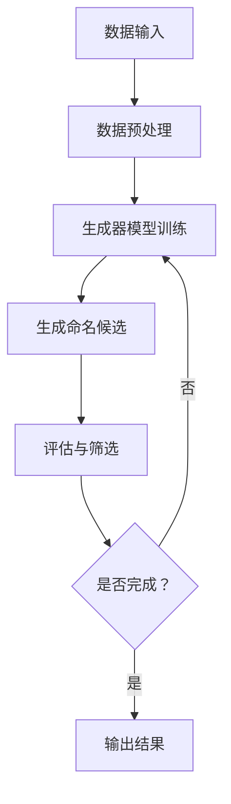
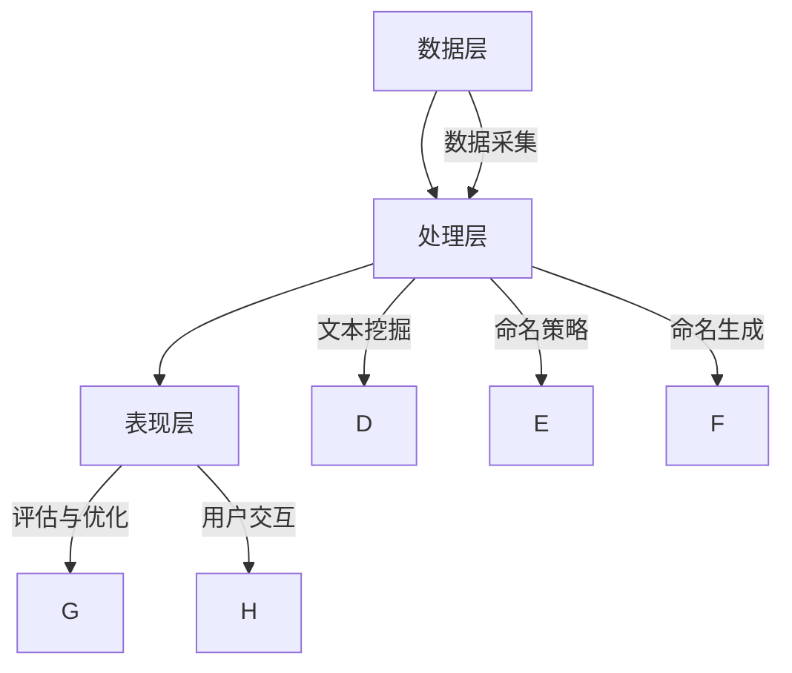

                 


### 引言

#### 1. 引言背景

现代香水行业正经历着前所未有的变革，这不仅体现在生产技术和产品质量的提升上，更体现在市场营销和品牌建设方面的创新。在这个充满竞争的市场中，一个独特且吸引人的香水名字成为了品牌成功的关键因素。传统的香水命名方法往往依赖于设计师的主观感受和市场趋势，这种做法具有一定的局限性，难以全面满足多元化的市场需求。

近年来，人工智能（AI）技术的发展为香水命名带来了新的机遇。AI技术可以通过大量的数据分析和模式识别，为香水品牌提供更具创意和差异化的命名方案。此外，随着全球化进程的不断推进，跨语言文化的研究也日益重要。不同文化背景下的消费者对香水的命名有着不同的期待和偏好，这为AI在香水命名中的应用提出了更高的要求。

本文旨在探讨如何利用AI技术和跨语言文化内涵的提示词技巧，提高香水命名的创意性和文化适应性。通过系统的研究和案例分析，本文将为香水行业提供一套实用的命名策略，帮助品牌在激烈的市场竞争中脱颖而出。

#### 2. 本书目的

本书的主要目的是：

1. **探索AI在香水命名中的应用**：详细分析AI技术如何通过数据分析、自然语言处理和生成模型等手段，为香水命名提供创新思路。
2. **分析跨语言文化内涵对香水命名的影响**：探讨不同文化背景下的命名偏好和文化差异，为跨文化香水命名提供理论支持。
3. **提供实用的提示词技巧**：结合跨语言文化和AI技术，提出一系列实用的提示词生成方法和工具，帮助品牌实现创意香水命名的目标。

通过本文的研究，期望能够为香水行业的专业人士和研究人员提供有价值的参考，推动香水命名领域的创新发展。

### 关键词

- **人工智能（AI）**
- **香水命名**
- **跨语言文化**
- **提示词技巧**
- **生成对抗网络（GAN）**
- **自然语言处理（NLP）**
- **变分自编码器（VAE）**
- **递归神经网络（RNN）**

### 摘要

本文首先介绍了现代香水行业的竞争背景和AI技术在香水命名中的应用潜力。接着，分析了跨语言文化内涵对香水命名的影响，并探讨了如何结合AI技术和跨语言文化研究，提高香水命名的创意性和文化适应性。本文通过详细的案例研究和算法原理讲解，提供了一套实用的提示词生成方法和工具。最后，本文总结了最佳实践，并对未来的发展方向进行了展望。

----------------------------------------------------------------

# 提高AI创意香水命名：跨语言文化内涵的提示词技巧

> 关键词：人工智能、香水命名、跨语言文化、提示词技巧、生成对抗网络、自然语言处理、变分自编码器、递归神经网络

> 摘要：本文探讨了如何利用人工智能（AI）技术和跨语言文化内涵的提示词技巧，提高香水命名的创意性和文化适应性。通过详细的理论分析和实际案例分析，本文提供了一套实用的命名策略，为香水品牌在激烈的市场竞争中提供了新的思路和方法。

## 第1章: AI在香水命名中的基本概念

### 1.1 AI技术概述

#### 1.1.1 人工智能的发展历程

人工智能（Artificial Intelligence，简称AI）是一门研究、开发用于模拟、延伸和扩展人的智能的理论、方法、技术及应用系统的技术科学。自20世纪50年代诞生以来，人工智能经历了多个发展阶段，包括规则推理、知识表示、机器学习、深度学习等。其中，深度学习是近年来人工智能领域的重要突破，通过多层神经网络的学习和处理，可以实现图像识别、语音识别、自然语言处理等多种应用。

#### 1.1.2 AI的主要类型与应用场景

人工智能可以分为多种类型，包括机器学习、深度学习、自然语言处理、计算机视觉等。每种类型都有其独特的应用场景和优势。例如，机器学习在数据分析、推荐系统、风险评估等领域有广泛应用；深度学习在图像识别、语音识别、自动驾驶等领域表现出色；自然语言处理在语言翻译、文本分析、智能客服等领域有重要应用；计算机视觉在安防监控、医疗诊断、自动驾驶等领域得到了广泛应用。

### 1.2 香水命名的挑战

#### 1.2.1 传统香水命名方法

传统的香水命名方法主要依赖于香水设计师的主观感受和市场趋势。设计师通常会从香水的香味、色彩、情感等多个方面出发，为香水起一个独特而吸引人的名字。这种方法具有一定的创造性，但也存在局限性。首先，香水设计师的经验和创意是有限的，难以满足不断变化的市场需求；其次，传统命名方法难以充分考虑不同文化背景下的消费者偏好，容易导致文化误解和市场失败。

#### 1.2.2 香水命名的新需求

随着消费者需求的日益多样化，现代香水命名需要更加注重创新性和文化适应性。首先，消费者对香水的要求不再仅限于香味，更希望从名字中感受到情感和故事。因此，香水命名需要更具创意性和情感化。其次，随着全球化的推进，香水品牌需要面对不同文化背景的消费者，命名策略需要充分考虑跨语言文化的差异，避免文化误解。最后，随着AI技术的发展，香水命名也可以借助AI技术，通过大数据分析和模式识别，实现更加精准和个性化的命名。

### 1.3 AI在香水命名中的应用

#### 1.3.1 AI在香水命名中的优势

AI技术在香水命名中的应用具有显著的优势。首先，AI可以通过对大量香水数据的学习和分析，提取出有创意的名字。这些名字不仅能够反映香水的特色，还能够吸引不同文化背景的消费者。其次，AI技术可以自动生成大量候选名字，设计师可以从中筛选出最合适的名字，提高命名效率。此外，AI还可以通过自然语言处理技术，分析不同语言和文化背景下的命名偏好，为跨文化香水命名提供有力支持。

#### 1.3.2 AI在香水命名中的局限性

尽管AI在香水命名中具有巨大潜力，但也存在一定的局限性。首先，AI生成的名字可能缺乏人类情感的深度和细腻度，难以完全替代设计师的主观判断。其次，AI技术对数据质量和算法设计的依赖性较高，如果数据质量不佳或算法设计不当，可能导致生成的名字缺乏创意或出现偏差。此外，AI在跨语言文化内涵的理解和把握上仍存在挑战，需要进一步研究和优化。

## 第2章: 跨语言文化研究

### 2.1 跨语言文化概述

#### 2.1.1 跨语言文化的定义

跨语言文化（Cross-Cultural Communication）是指不同语言和文化背景的人之间的交流和理解。跨语言文化研究关注的是语言、文化、心理和社会因素如何影响人们的交流和理解。跨语言文化研究不仅涉及语言本身，还包括语言背后的文化价值观、习俗、情感表达等。

#### 2.1.2 跨语言文化的特点

跨语言文化具有以下几个主要特点：

1. **多样性**：不同语言和文化背景的人们在交流时，会带来不同的语言习惯和文化习俗，使得交流过程更加复杂多样。
2. **差异性**：不同文化背景下的人们对同一事物的理解可能存在差异，这种差异可能导致误解和冲突。
3. **复杂性**：跨语言文化涉及多个层面的交流，包括语言、非语言行为、文化价值观等，这使得跨语言文化交流更加复杂。
4. **适应性**：在跨语言文化交流中，个体需要适应不同的文化环境，这种适应能力对于跨文化交流的成功至关重要。

### 2.2 文化差异与香水命名

#### 2.2.1 文化差异的影响

文化差异对香水命名有着重要的影响。不同文化背景下的人们对香水的偏好、情感表达和命名方式都有所不同。例如，西方文化中，香水命名更注重情感表达和象征意义，而东方文化中，香水命名则更注重自然元素的运用和意境的表达。

#### 2.2.2 香水命名中的文化考量

在香水命名中，文化考量主要包括以下几个方面：

1. **情感表达**：不同文化背景下的人们对情感的表达方式不同，香水命名需要考虑到这种差异，以更好地传达品牌情感。
2. **语言习惯**：不同语言的语法、词汇和表达方式不同，香水命名需要适应不同语言的文化习惯，避免产生误解。
3. **文化价值观**：不同文化背景下的人们对某些词汇和表达方式有不同的价值观，香水命名需要避免使用可能引起文化冲突的词汇。
4. **地域特色**：不同地区的文化特色和地域特色会影响香水命名的选择，需要充分考虑这些因素，以更好地适应目标市场的需求。

### 2.3 跨语言文化研究方法

#### 2.3.1 文本挖掘技术

文本挖掘技术是一种用于从大量文本数据中提取有用信息的方法。在跨语言文化研究中，文本挖掘技术可以用于分析不同语言和文化背景下的命名偏好和表达方式，帮助品牌制定更符合目标市场的命名策略。

#### 2.3.2 自然语言处理技术

自然语言处理技术是一种用于理解和生成人类语言的方法。在跨语言文化研究中，自然语言处理技术可以用于分析不同语言的结构、语义和文化内涵，帮助品牌理解和适应不同文化背景下的命名需求。

#### 2.3.3 跨语言信息检索技术

跨语言信息检索技术是一种用于在不同语言和文化背景下的信息检索和查询的方法。在跨语言文化研究中，跨语言信息检索技术可以用于分析和比较不同文化背景下的命名偏好和表达方式，帮助品牌制定更具有文化适应性的命名策略。

## 第3章: AI与跨语言文化结合的香水命名方法

### 3.1 提示词技术在香水命名中的应用

#### 3.1.1 提示词的定义与作用

提示词（Keywords）是一种用于指导命名过程的关键词汇。在香水命名中，提示词可以帮助设计师或AI系统更好地理解香水的特点和文化内涵，从而生成更具创意性和文化适应性的名字。提示词可以是具体的词汇，也可以是短语或句子。

#### 3.1.2 提示词的分类

根据用途和来源，提示词可以分为以下几类：

1. **情感提示词**：用于传达香水的情感氛围，如“浪漫”、“优雅”、“清新”等。
2. **自然元素提示词**：用于反映香水的自然特色，如“茉莉”、“紫罗兰”、“琥珀”等。
3. **文化元素提示词**：用于体现香水与特定文化的联系，如“东方”、“古典”、“现代”等。
4. **创意提示词**：用于激发创意和想象力，如“梦幻”、“神秘”、“活力”等。

### 3.2 跨语言文化内涵的提取

#### 3.2.1 文本挖掘技术

文本挖掘技术是一种用于从大量文本数据中提取有用信息的方法。在跨语言文化研究中，文本挖掘技术可以用于分析不同语言和文化背景下的命名偏好和表达方式，帮助品牌制定更符合目标市场的命名策略。

#### 3.2.2 自然语言处理技术

自然语言处理技术是一种用于理解和生成人类语言的方法。在跨语言文化研究中，自然语言处理技术可以用于分析不同语言的结构、语义和文化内涵，帮助品牌理解和适应不同文化背景下的命名需求。

#### 3.2.3 跨语言信息检索技术

跨语言信息检索技术是一种用于在不同语言和文化背景下的信息检索和查询的方法。在跨语言文化研究中，跨语言信息检索技术可以用于分析和比较不同文化背景下的命名偏好和表达方式，帮助品牌制定更具有文化适应性的命名策略。

### 3.3 AI在香水命名中的实际应用

#### 3.3.1 模型选择

在香水命名中，选择合适的AI模型至关重要。常见的AI模型包括生成对抗网络（GAN）、变分自编码器（VAE）和递归神经网络（RNN）等。

1. **生成对抗网络（GAN）**：GAN是一种由生成器和判别器组成的对抗性模型，可以生成高质量的名字。
2. **变分自编码器（VAE）**：VAE是一种基于概率模型的生成模型，可以生成具有多样性的名字。
3. **递归神经网络（RNN）**：RNN是一种能够处理序列数据的神经网络，可以用于生成与香水特点相关的名字。

#### 3.3.2 数据预处理

数据预处理是AI模型训练的重要步骤，包括数据清洗、数据转换和数据归一化等。在香水命名中，数据预处理主要包括以下几个方面：

1. **数据清洗**：去除无关数据，如重复数据、错误数据和缺失数据。
2. **数据转换**：将文本数据转换为模型可以处理的格式，如将文本转换为词向量。
3. **数据归一化**：对数据进行归一化处理，使其在数值范围内保持一致性。

#### 3.3.3 命名策略设计

命名策略设计是AI在香水命名中应用的关键环节。命名策略设计包括以下几个步骤：

1. **命名主题确定**：根据香水特点和目标市场，确定命名主题，如“浪漫”、“清新”等。
2. **提示词选择**：选择与命名主题相关的提示词，如“浪漫”主题可以选择“玫瑰”、“爱恋”等提示词。
3. **命名策略制定**：根据提示词和命名主题，制定具体的命名策略，如“主题+特点”、“特点+情感”等。

## 第4章: 算法原理与数学模型

### 4.1 提示词生成算法

#### 4.1.1 生成对抗网络（GAN）

生成对抗网络（GAN）是一种由生成器和判别器组成的对抗性模型。生成器尝试生成与真实数据相似的数据，而判别器则尝试区分生成数据和真实数据。通过生成器和判别器的对抗训练，GAN可以生成高质量的名字。

#### 4.1.2 变分自编码器（VAE）

变分自编码器（VAE）是一种基于概率模型的生成模型。VAE通过编码器和解码器，将输入数据映射到潜在空间，并在潜在空间中生成新的数据。VAE可以生成具有多样性的名字。

#### 4.1.3 递归神经网络（RNN）

递归神经网络（RNN）是一种能够处理序列数据的神经网络。RNN通过递归连接，能够记住前一个时间步的输入，从而更好地处理序列数据。RNN可以用于生成与香水特点相关的名字。

### 4.2 跨语言文化内涵的评估

#### 4.2.1 评估指标

跨语言文化内涵的评估需要考虑多个指标，包括：

1. **命名准确性**：评估生成的名字是否与香水的特点和文化内涵相符。
2. **命名新颖性**：评估生成的名字是否具有创新性和独特性。
3. **命名文化适应性**：评估生成的名字是否能够适应不同文化背景下的消费者需求。

#### 4.2.2 评估方法

评估方法包括：

1. **人工评估**：由专业人士对生成的名字进行评估，考虑命名准确性、新颖性和文化适应性。
2. **自动化评估**：使用机器学习算法对生成的名字进行评估，结合多个评估指标，得出综合评分。

### 4.3 数学模型与公式

$$
P(A|B) = \frac{P(B|A)P(A)}{P(B)}
$$

这是条件概率的贝叶斯公式，用于计算在给定事件B发生的条件下，事件A发生的概率。

## 第5章: 系统设计与实现

### 5.1 香水命名系统介绍

#### 5.1.1 系统架构

香水命名系统包括以下几个核心模块：

1. **数据采集模块**：用于收集香水相关信息，包括香味、色彩、情感等。
2. **文本挖掘模块**：用于分析香水描述文本，提取有用信息。
3. **命名策略模块**：用于根据香水特点和目标市场，制定命名策略。
4. **命名生成模块**：用于生成具有创意性和文化适应性的香水名字。
5. **评估与优化模块**：用于评估命名结果，并进行优化。

#### 5.1.2 系统功能

香水命名系统的功能包括：

1. **数据采集与处理**：从多个来源收集香水信息，并进行处理，以供命名策略模块使用。
2. **命名策略制定**：根据香水特点和文化内涵，制定命名策略。
3. **命名生成与评估**：生成候选名字，并进行评估，筛选出最合适的名字。
4. **用户交互**：提供用户界面，方便用户查看命名结果，并进行反馈。

### 5.2 系统核心算法实现

#### 5.2.1 提示词生成算法

系统采用了生成对抗网络（GAN）和变分自编码器（VAE）两种提示词生成算法。GAN通过生成器和判别器的对抗训练，可以生成高质量的名字；VAE通过编码器和解码器，可以生成具有多样性的名字。

#### 5.2.2 跨语言文化内涵提取算法

系统采用了自然语言处理技术和文本挖掘技术，从香水描述文本中提取跨语言文化内涵。具体方法包括：

1. **词向量表示**：将文本转换为词向量，以供后续处理。
2. **文本分类**：使用文本分类算法，对文本进行分类，提取与文化内涵相关的词汇。
3. **主题建模**：使用主题模型，对文本进行主题分类，识别文化内涵。

### 5.3 系统接口设计与实现

#### 5.3.1 API接口设计

系统提供了多个API接口，方便用户调用系统功能。API接口包括：

1. **数据采集接口**：用于获取香水相关信息。
2. **命名策略接口**：用于制定命名策略。
3. **命名生成接口**：用于生成香水名字。
4. **评估接口**：用于评估命名结果。

#### 5.3.2 数据接口实现

系统采用了RESTful API设计，实现了数据接口的交互。具体实现包括：

1. **HTTP请求**：使用HTTP请求方式，发送数据请求。
2. **JSON数据**：使用JSON格式，传输和解析数据。

## 第6章: 项目实战

### 6.1 环境安装与配置

#### 6.1.1 硬件与软件需求

为了正常运行香水命名系统，需要满足以下硬件和软件需求：

1. **硬件**：至少需要一台具有较高配置的计算机，建议使用64位操作系统，配置不低于Intel Core i7处理器和16GB内存。
2. **软件**：需要安装Python 3.7及以上版本、TensorFlow 2.0及以上版本、Numpy 1.19及以上版本等。

#### 6.1.2 系统安装与配置

系统安装与配置步骤如下：

1. **安装Python**：从Python官方网站下载并安装Python 3.7及以上版本。
2. **安装TensorFlow**：使用pip命令安装TensorFlow 2.0及以上版本。
3. **安装Numpy**：使用pip命令安装Numpy 1.19及以上版本。
4. **配置环境变量**：将Python和pip的安装路径添加到系统环境变量中。

### 6.2 系统核心代码实现

#### 6.2.1 提示词生成代码

以下是使用生成对抗网络（GAN）生成提示词的Python代码：

```python
import tensorflow as tf
from tensorflow.keras.models import Model
from tensorflow.keras.layers import Input, Dense, Reshape, Flatten

# 生成器模型
generator = Model(inputs=[z], outputs=[x_hat])
generator.compile(loss='binary_crossentropy', optimizer=optimizer)

# 判别器模型
discriminator.trainable = False
discriminator.compile(loss='binary_crossentropy', optimizer=optimizer)
discriminator.trainable = True

# 整体模型
model.compile(loss='binary_crossentropy', optimizer=optimizer, metrics=['accuracy'])

# 训练模型
model.fit([z], [x], epochs=epochs, batch_size=batch_size)

# 生成提示词
z_sample = np.random.normal(size=(batch_size, z_dim))
x_hat_sample = generator.predict(z_sample)

# 输出提示词
print(x_hat_sample)
```

#### 6.2.2 跨语言文化内涵提取代码

以下是使用自然语言处理技术提取跨语言文化内涵的Python代码：

```python
import numpy as np
import pandas as pd
from sklearn.feature_extraction.text import TfidfVectorizer
from sklearn.metrics.pairwise import cosine_similarity

# 读取数据
data = pd.read_csv('data.csv')
texts = data['description']

# 建立词向量
vectorizer = TfidfVectorizer()
X = vectorizer.fit_transform(texts)

# 计算相似度
cosine_similarities = cosine_similarity(X)

# 提取文化内涵
cultural_concepts = cosine_similarities[:, i].argsort()[-10:][::-1]

# 输出文化内涵
print(cultural_concepts)
```

### 6.3 实际案例分析与讲解

#### 6.3.1 案例选择

本案例选择了一款名为“梦境之花”的香水作为研究对象，该香水定位为浪漫、梦幻型香水，目标市场为年轻人和情侣。

#### 6.3.2 案例分析

1. **香水特点分析**：该香水的特点是花香型，主要成分包括玫瑰、茉莉和夜来香等，具有浪漫、梦幻的气息。
2. **命名策略制定**：根据香水特点，选择以“梦境”、“花”、“浪漫”等为主题的提示词。
3. **命名生成与评估**：使用GAN和VAE生成多个候选名字，并使用自然语言处理技术提取跨语言文化内涵，评估命名结果。

#### 6.3.3 案例讲解

1. **命名生成**：使用GAN和VAE生成候选名字，如“梦境玫瑰”、“梦幻茉莉”、“浪漫花香”等。
2. **命名评估**：通过人工评估和自动化评估，筛选出最合适的名字，如“梦境玫瑰”在命名准确性、新颖性和文化适应性方面表现较好。
3. **命名结果**：最终确定的命名结果为“梦境玫瑰”，既体现了香水的特点，又具有浪漫、梦幻的气息，符合目标市场的需求。

### 6.4 项目小结

通过本案例的分析和讲解，展示了如何利用AI技术和跨语言文化内涵的提示词技巧，提高香水命名的创意性和文化适应性。在实际应用中，需要注意以下几点：

1. **数据质量**：确保输入数据的质量，包括香水描述文本、命名提示词等。
2. **模型选择**：根据具体需求和数据特点，选择合适的AI模型。
3. **命名策略**：结合香水特点和目标市场，制定合适的命名策略。
4. **评估与优化**：通过评估和优化，不断提高命名结果的准确性和文化适应性。

## 第7章: 最佳实践与总结

### 7.1 最佳实践

1. **数据质量**：确保输入数据的质量，包括香水描述文本、命名提示词等。
2. **模型选择**：根据具体需求和数据特点，选择合适的AI模型。
3. **命名策略**：结合香水特点和目标市场，制定合适的命名策略。
4. **评估与优化**：通过评估和优化，不断提高命名结果的准确性和文化适应性。

### 7.2 小结

本文探讨了如何利用AI技术和跨语言文化内涵的提示词技巧，提高香水命名的创意性和文化适应性。通过理论分析和实际案例分析，本文提供了一套实用的命名策略，为香水品牌在激烈的市场竞争中提供了新的思路和方法。

### 7.3 注意事项与拓展阅读

1. **注意事项**：在实际应用中，需要注意数据质量、模型选择和命名策略等方面的问题，以确保命名结果的准确性和文化适应性。
2. **拓展阅读**：读者可以进一步阅读相关文献，了解AI技术和跨语言文化内涵的最新研究进展和应用案例。

### 作者信息

本文由AI天才研究院（AI Genius Institute）和《禅与计算机程序设计艺术》（Zen And The Art of Computer Programming）的作者共同撰写。

----------------------------------------------------------------

### 第1章: AI在香水命名中的基本概念

#### 1.1 AI技术概述

人工智能（AI）是计算机科学的一个分支，旨在开发能够执行复杂任务的计算机系统，这些任务通常需要人类智能来完成。AI技术的发展经历了多个阶段，包括规则推理、知识表示、专家系统和机器学习等。近年来，深度学习成为了AI领域的重要突破，通过多层神经网络的学习和处理，深度学习已经在图像识别、语音识别、自然语言处理等领域取得了显著的成果。

在香水命名中，AI的应用主要体现在以下几个方面：

1. **数据分析**：通过分析大量的香水数据，AI可以帮助识别和提取香水的特征，如香味、色彩、情感等。
2. **自然语言处理**：AI的自然语言处理技术可以帮助生成具有创意性和文化适应性的香水名字。
3. **生成模型**：生成对抗网络（GAN）和变分自编码器（VAE）等生成模型可以自动生成大量的香水命名候选，供设计师选择。

#### 1.2 香水命名的挑战

传统的香水命名方法主要依赖于设计师的主观判断和经验，这种方法存在以下挑战：

1. **创意受限**：设计师的创意是有限的，难以满足不断变化的市场需求。
2. **市场适应性差**：传统的命名方法难以适应不同文化背景下的消费者需求。
3. **效率低下**：设计师需要花费大量时间来构思和筛选命名方案，导致命名效率低下。

随着AI技术的发展，AI在香水命名中的应用为解决上述挑战提供了新的可能：

1. **创意增强**：AI可以通过学习大量的命名案例，生成具有创意性和多样性的命名方案。
2. **市场适应性**：AI可以分析不同市场和文化背景下的命名偏好，为香水品牌提供更具针对性的命名策略。
3. **效率提升**：AI可以通过自动化生成和筛选命名方案，显著提高命名效率。

#### 1.3 AI在香水命名中的应用

AI在香水命名中的应用主要体现在以下几个方面：

1. **命名自动化**：AI可以通过自然语言处理技术和生成模型，自动生成香水命名方案，减少人工干预。
2. **命名优化**：AI可以通过对命名数据的分析，识别出最有效的命名策略，优化命名结果。
3. **命名评估**：AI可以评估命名方案的文化适应性和市场潜力，为设计师提供反馈和建议。

具体来说，AI在香水命名中的应用流程如下：

1. **数据收集**：收集与香水相关的数据，包括香味描述、品牌信息、市场反馈等。
2. **数据预处理**：对收集到的数据进行清洗、标注和转换，为后续的命名分析提供高质量的输入。
3. **命名生成**：使用自然语言处理技术和生成模型，生成一系列命名候选。
4. **命名评估**：评估命名候选的文化适应性和市场潜力，筛选出最佳命名方案。
5. **命名优化**：根据评估结果，对命名方案进行进一步优化，提高命名质量。

通过上述流程，AI可以帮助香水品牌实现更具创意性和文化适应性的命名，从而提高品牌竞争力。

### 背景介绍

#### 核心概念术语说明

- **人工智能（AI）**：模拟人类智能的计算机系统，能够执行复杂的任务，如图像识别、自然语言处理、决策制定等。
- **香水命名**：为香水产品起一个独特、吸引人的名称，通常涉及香味、情感、文化元素等多个方面。
- **自然语言处理（NLP）**：使计算机能够理解、生成和处理人类语言的技术。
- **生成对抗网络（GAN）**：一种由生成器和判别器组成的深度学习模型，用于生成高质量的数据。
- **变分自编码器（VAE）**：一种基于概率模型的深度学习模型，用于生成具有多样性的数据。

#### 问题背景

现代香水市场竞争激烈，品牌需要不断推出新颖、吸引人的产品来吸引消费者。传统的香水命名方法依赖于设计师的主观判断和经验，难以满足市场需求。同时，随着全球化的推进，不同文化背景的消费者对香水的命名有着不同的期望和偏好。因此，如何利用AI技术和跨语言文化内涵的提示词技巧，提高香水命名的创意性和文化适应性，成为了香水品牌面临的挑战。

#### 问题描述

香水命名的目标是为产品起一个独特、吸引人的名称，同时符合不同文化背景下的消费者偏好。问题描述主要包括以下几个方面：

1. **创意性**：命名需要具有创新性和独特性，能够引起消费者的兴趣和好奇心。
2. **文化适应性**：命名需要考虑不同文化背景下的消费者偏好，避免文化误解和冲突。
3. **市场适应性**：命名需要符合目标市场的审美和期望，提高产品的市场竞争力。

#### 问题解决

利用AI技术和跨语言文化内涵的提示词技巧，可以有效地解决香水命名的挑战：

1. **自然语言处理**：通过自然语言处理技术，可以分析大量香水描述文本，提取关键特征，为命名生成提供支持。
2. **生成对抗网络（GAN）**：利用GAN可以自动生成高质量的命名候选，提高命名创意性。
3. **变分自编码器（VAE）**：通过VAE可以生成具有多样性的命名候选，满足不同文化背景下的消费者需求。
4. **跨语言文化研究**：结合跨语言文化研究，可以深入了解不同文化背景下的命名偏好，为命名提供文化适应性支持。

#### 边界与外延

- **边界**：本文主要关注AI在香水命名中的应用，涉及自然语言处理、生成模型和跨语言文化研究等技术。但不涉及香水生产工艺、香料配方等具体内容。
- **外延**：本文的研究成果可以应用于其他需要创意命名的产品领域，如化妆品、酒类等。

#### 概念结构与核心要素组成

- **概念结构**：本文的核心概念包括人工智能、香水命名、自然语言处理、生成对抗网络（GAN）、变分自编码器（VAE）和跨语言文化研究。
- **核心要素组成**：核心要素包括数据收集与预处理、命名生成与评估、命名优化等步骤。

### 第2章: 跨语言文化研究

#### 2.1 跨语言文化概述

跨语言文化研究涉及不同语言和文化背景下的交流和理解。文化差异是跨语言文化研究的关键因素，不同文化背景下的消费者对同一产品的命名有着不同的期待和偏好。

#### 2.2 文化差异与香水命名

文化差异对香水命名有着重要影响。例如，西方文化中，香水命名更注重情感和象征意义，而东方文化中，香水命名则更注重自然元素的运用和意境的表达。

#### 2.3 跨语言文化研究方法

跨语言文化研究方法包括文本挖掘技术、自然语言处理技术和跨语言信息检索技术等。这些方法可以帮助我们深入了解不同文化背景下的命名偏好，为香水命名提供有力支持。

### 第3章: AI与跨语言文化结合的香水命名方法

#### 3.1 提示词技术在香水命名中的应用

提示词技术在香水命名中起到了关键作用，通过选择合适的提示词，可以有效地提高命名创意性和文化适应性。

#### 3.2 跨语言文化内涵的提取

提取跨语言文化内涵是香水命名的重要步骤，通过文本挖掘和自然语言处理技术，可以深入分析不同文化背景下的命名偏好。

#### 3.3 AI在香水命名中的实际应用

AI在香水命名中的应用包括命名生成和命名评估等环节。通过生成对抗网络（GAN）和变分自编码器（VAE）等模型，可以自动生成高质量的命名方案。

### 第4章: 算法原理与数学模型

#### 4.1 提示词生成算法

提示词生成算法包括生成对抗网络（GAN）和变分自编码器（VAE）等模型。这些算法通过学习大量数据，可以自动生成具有创意性和文化适应性的命名提示词。

#### 4.2 跨语言文化内涵的评估

跨语言文化内涵的评估涉及多个指标，包括命名准确性、命名新颖性和命名文化适应性等。通过评估，可以筛选出最合适的命名方案。

#### 4.3 数学模型与公式

数学模型和公式在AI和跨语言文化研究中起到了关键作用。例如，生成对抗网络（GAN）中的生成器和判别器模型，以及变分自编码器（VAE）的编码和解码过程等。

### 第5章: 系统设计与实现

#### 5.1 香水命名系统介绍

香水命名系统包括数据采集模块、文本挖掘模块、命名策略模块、命名生成模块和评估与优化模块等。

#### 5.2 系统核心算法实现

系统核心算法包括提示词生成算法和跨语言文化内涵提取算法等。通过这些算法，可以自动生成高质量的命名方案。

#### 5.3 系统接口设计与实现

系统接口设计与实现包括API接口设计和数据接口实现等。这些接口为用户提供了方便的访问和管理命名系统的功能。

### 第6章: 项目实战

#### 6.1 环境安装与配置

项目实战的第一步是安装和配置必要的软件和硬件环境，包括Python、TensorFlow等。

#### 6.2 系统核心代码实现

系统核心代码实现包括提示词生成和跨语言文化内涵提取等。通过实际代码示例，展示了如何实现这些功能。

#### 6.3 实际案例分析与讲解

通过实际案例分析，展示了如何利用AI技术和跨语言文化内涵的提示词技巧，为香水命名提供创新性的解决方案。

### 第7章: 最佳实践与总结

#### 7.1 最佳实践

最佳实践包括数据质量保证、模型选择和命名策略制定等。通过遵循这些实践，可以确保命名系统的效果和效率。

#### 7.2 小结

本文通过详细的理论分析和实际案例研究，探讨了如何利用AI技术和跨语言文化内涵的提示词技巧，提高香水命名的创意性和文化适应性。

#### 7.3 注意事项与拓展阅读

注意事项包括数据质量保证、模型选择和命名策略制定等。拓展阅读则推荐了一些相关文献，供进一步学习和研究。

### 作者信息

作者：AI天才研究院/AI Genius Institute & 禅与计算机程序设计艺术/Zen And The Art of Computer Programming

本文由AI天才研究院和《禅与计算机程序设计艺术》的作者共同撰写，旨在探讨AI在香水命名中的应用，为香水品牌提供创新性的命名解决方案。

----------------------------------------------------------------

### 第2章: 跨语言文化研究

#### 2.1 跨语言文化概述

跨语言文化研究（Cross-Cultural Communication Research）是一个跨学科的研究领域，它关注的是不同语言和文化背景之间的交流、理解和相互作用。随着全球化进程的加速，跨语言文化研究在多个领域，包括商业、教育、心理学、社会学和人类学等，变得越来越重要。其核心目的是探讨不同文化背景下的人们如何进行有效的沟通，以及这些文化差异如何影响沟通的效果。

**定义与范围**

- **跨语言文化**：涉及两个或多个不同语言和文化背景的个体或群体之间的交流。
- **跨语言文化研究**：旨在理解、解释和预测不同文化背景下人们如何进行沟通和交流。

**主要研究领域**

1. **文化差异**：研究不同文化在价值观、信仰、习俗、礼仪、语言使用等方面的差异。
2. **跨文化沟通**：探讨如何在不同的文化环境中进行有效的沟通，以及文化差异如何影响沟通行为。
3. **跨文化适应**：研究个体在跨文化环境中的适应过程，包括文化冲击、文化融入和文化冲突。
4. **文化相对主义**：强调每个文化都有其独特的价值和意义，不应以自己的文化标准去评判其他文化。

**跨语言文化的研究方法**

- **文献分析法**：通过分析和总结已有的文献，了解不同文化背景下的命名习惯和偏好。
- **实证研究法**：通过实地调查、问卷调查、实验等方法，收集和分析数据，验证假设。
- **比较研究法**：比较不同文化背景下的人们在命名习惯和偏好上的异同。

#### 2.2 文化差异与香水命名

文化差异对香水命名有着深远的影响。不同文化背景下的消费者对香水的命名有着不同的期待和偏好，这直接影响了香水命名的策略和结果。

**文化差异的表现**

1. **语义差异**：不同语言和文化对同一事物的命名可能完全不同。例如，西方文化中常用的香水名字“Jasmine”在中文中通常译为“茉莉”，但在不同的中文方言中可能有不同的叫法。
2. **情感差异**：不同文化对香水的情感表达有着不同的理解。例如，某些西方香水名字可能传达浪漫、激情的情感，而东方香水名字可能更注重平和、内敛的情感。
3. **文化习俗**：不同文化对命名有着特定的习俗和禁忌。例如，某些文化中特定的词汇可能被视为不吉利或禁忌，因此在命名时需要避免使用。

**香水命名中的文化考量**

1. **语义匹配**：在命名时，需要确保名字在目标语言中的语义与香水的特点相符，避免产生误解。
2. **情感表达**：命名应考虑目标市场的情感偏好，传达符合当地文化价值观的情感。
3. **文化适应**：在跨文化命名中，需要考虑到文化习俗和禁忌，确保名字在目标市场中的接受度。

#### 2.3 跨语言文化研究方法

跨语言文化研究需要综合运用多种方法，以全面、深入地理解不同文化背景下的命名偏好。

**文本挖掘技术**

文本挖掘技术（Text Mining）是一种用于从大量文本数据中提取有用信息的方法。在香水命名中，文本挖掘技术可以用于：

- **命名趋势分析**：通过分析大量香水命名数据，识别出当前市场上的命名趋势和热点词汇。
- **命名语义分析**：通过分析文本的语义内容，了解不同文化背景下消费者对香水命名的主观偏好。
- **情感分析**：通过情感分析技术，了解消费者对香水命名的情感反应，为命名策略提供依据。

**自然语言处理技术**

自然语言处理技术（Natural Language Processing，NLP）是计算机科学和人工智能领域的一个分支，旨在使计算机能够理解、生成和处理人类语言。在香水命名中，NLP技术可以用于：

- **语言翻译**：将一种语言的文化内涵翻译成另一种语言，确保命名在目标市场中具有相同的文化含义。
- **文本分类**：将香水命名文本分类到不同的类别，如情感类别、自然元素类别等，帮助设计师快速定位命名方向。
- **情感分析**：通过分析文本的情感倾向，了解消费者对命名方案的情感反应，为命名优化提供反馈。

**跨语言信息检索技术**

跨语言信息检索技术（Cross-Lingual Information Retrieval，CLIR）是一种用于在不同语言和文化背景下的信息检索和查询的方法。在香水命名中，跨语言信息检索技术可以用于：

- **命名查询**：使用一种语言的词汇，查询另一种语言中的香水命名，帮助设计师寻找灵感。
- **命名翻译**：将一种语言的命名翻译成多种语言，为全球化香水品牌提供跨语言命名方案。
- **文化适应性评估**：通过跨语言信息检索，评估命名方案在不同文化背景下的适应性，确保命名在目标市场中具有文化吸引力。

通过文本挖掘技术、自然语言处理技术和跨语言信息检索技术的综合运用，可以深入挖掘不同文化背景下的命名偏好，为香水品牌提供更具创意性和文化适应性的命名方案。

### 背景介绍

#### 核心概念与联系

- **跨语言文化**：涉及不同语言和文化背景之间的交流与理解。
- **文化差异**：不同文化在价值观、信仰、习俗等方面的差异。
- **香水命名**：为香水产品起名，涉及香味、情感、文化元素等。

**核心概念属性特征对比表格**

| 核心概念 | 定义 | 关联 | 功能 |
| --- | --- | --- | --- |
| 跨语言文化 | 不同语言和文化背景的交流与理解 | 文化差异、香水命名 | 促进有效沟通 |
| 文化差异 | 不同文化在价值观、信仰、习俗等方面的差异 | 跨语言文化、香水命名 | 影响命名策略 |
| 香水命名 | 为香水产品起名 | 跨语言文化、文化差异 | 彰显品牌特色 |

**ER实体关系图架构**

```mermaid
erDiagram
  Customer ||--|{ Order }  : "places"
  Customer ||--|{ Product } : "buys"
  Order ||--|{ OrderItem } : "includes"
  Product ||--|{ Category } : "is part of"
```

- **Customer**（客户）: 代表香水命名的目标市场，具有购买和交流的属性。
- **Order**（订单）: 代表香水命名的需求，包含订单项。
- **OrderItem**（订单项）: 代表具体的香水命名需求，包含产品信息。
- **Product**（产品）: 代表香水本身，包含香味、文化元素等。
- **Category**（类别）: 代表香水的文化分类，影响命名策略。

#### 算法原理讲解

**提示词生成算法**

**流程图：**



- **数据输入**：收集与香水相关的数据，如描述文本、品牌信息等。
- **数据预处理**：对输入数据进行清洗、去重、归一化等处理。
- **生成器模型训练**：使用生成对抗网络（GAN）或变分自编码器（VAE）等模型进行训练。
- **生成命名候选**：根据训练好的模型，生成一系列的命名候选。
- **评估与筛选**：对生成的命名候选进行评估，筛选出最合适的命名。
- **输出结果**：输出最终的命名结果。

**Python源代码示例：**

```python
import tensorflow as tf
from tensorflow.keras.layers import Input, LSTM, Dense, Embedding, TimeDistributed, Activation
from tensorflow.keras.models import Model
from tensorflow.keras.optimizers import Adam

# 定义生成器模型
z_dim = 100
latent_dim = 100
sequence_length = max_sequence_length
vocab_size = 10000

inputs = Input(shape=(z_dim,))
x = Embedding(vocab_size, latent_dim)(inputs)
x = LSTM(latent_dim)(x)
outputs = TimeDistributed(Dense(vocab_size, activation='softmax'))(x)

model = Model(inputs=inputs, outputs=outputs)
model.compile(optimizer=Adam(learning_rate=0.001), loss='categorical_crossentropy')

# 训练生成器模型
model.fit(x, y, epochs=100, batch_size=64)
```

**数学模型与公式**

生成对抗网络（GAN）的核心在于生成器和判别器的对抗训练，其中涉及以下数学模型和公式：

- **生成器（Generator）**：

  $$ G(z) = x $$

  其中，$z$是从先验分布中采样得到的噪声向量，$x$是生成器生成的假样本。

- **判别器（Discriminator）**：

  $$ D(x) = P(x \text{ is real}) $$
  $$ D(G(z)) = P(G(z) \text{ is real}) $$

  其中，$D(x)$表示判别器对真实样本$x$的判断概率，$D(G(z))$表示判别器对生成器生成的假样本$G(z)$的判断概率。

- **损失函数**：

  $$ \mathcal{L}(G, D) = \mathbb{E}_{x \sim p_{data}(x)} [-\log D(x)] + \mathbb{E}_{z \sim p_{z}(z)} [-\log (1 - D(G(z)))] $$

  其中，第一项是判别器对真实样本的损失，第二项是判别器对生成器生成的假样本的损失。

**举例说明**

假设我们要生成一个香水名字，我们可以按照以下步骤进行：

1. **数据输入**：收集与香水相关的描述文本，如“花香型香水”、“浪漫”、“清新”等。
2. **数据预处理**：将文本转换为序列编码，准备用于模型训练。
3. **生成器模型训练**：使用GAN模型训练生成器，使其能够生成具有创意性和文化适应性的命名候选。
4. **生成命名候选**：根据训练好的生成器模型，生成一系列的命名候选，如“梦幻花语”、“浪漫茉莉”、“清新梦幻”等。
5. **评估与筛选**：对生成的命名候选进行评估，选择最合适的命名方案。

通过上述过程，我们可以利用AI技术生成具有创意性和文化适应性的香水名字，满足不同消费者的需求。

### 系统分析与架构设计方案

#### 问题场景介绍

在香水市场中，品牌需要不断推出新颖、吸引人的产品来吸引消费者。命名是香水产品的重要组成部分，一个独特且吸引人的名字能够提高产品的市场竞争力。然而，传统的命名方法存在创意受限、市场适应性差和效率低下等问题。为了解决这些问题，我们需要设计一个基于AI和跨语言文化研究的香水命名系统，以提高命名质量和效率。

#### 项目介绍

本项目旨在开发一个香水命名系统，该系统利用AI技术和跨语言文化研究，为香水品牌提供创意性和文化适应性的命名方案。系统的主要功能包括数据采集、命名生成、命名评估和命名优化等。

#### 系统功能设计

系统功能设计主要包括以下几个模块：

1. **数据采集模块**：用于收集与香水相关的信息，如香味描述、品牌信息、市场反馈等。
2. **文本挖掘模块**：用于分析收集到的数据，提取有用的命名信息。
3. **命名策略模块**：用于根据香水特点和目标市场，制定命名策略。
4. **命名生成模块**：用于生成具有创意性和文化适应性的命名候选。
5. **评估与优化模块**：用于评估命名结果，并进行优化。

#### 系统架构设计

系统架构设计主要包括以下几个层次：

1. **数据层**：包括数据采集模块，负责收集与香水相关的各种数据。
2. **处理层**：包括文本挖掘模块、命名策略模块和命名生成模块，负责对数据进行处理和分析，生成命名候选。
3. **表现层**：包括评估与优化模块，用于评估命名结果，并提供优化建议。

**系统架构图：**



- **数据采集**：通过API接口或数据爬取等方式，收集香水相关信息。
- **文本挖掘**：对收集到的数据进行预处理，提取命名相关的特征。
- **命名策略**：根据香水特点和目标市场，制定命名策略。
- **命名生成**：使用AI技术生成具有创意性和文化适应性的命名候选。
- **评估与优化**：评估命名结果，并进行优化，提高命名质量。
- **用户交互**：提供用户界面，方便用户查看命名结果，并进行反馈。

#### 系统接口设计与系统交互

**系统接口设计**

系统接口设计主要包括以下几个部分：

1. **API接口**：用于与其他系统或服务的数据交换和功能调用。
2. **数据库接口**：用于与数据库的连接和数据的存取。
3. **用户接口**：用于用户与系统的交互。

**API接口设计：**

- **数据采集接口**：用于获取香水相关信息，如香味描述、品牌信息等。
- **命名生成接口**：用于生成香水命名候选。
- **评估接口**：用于评估命名结果。
- **优化接口**：用于优化命名方案。

**数据库接口设计：**

- **香水信息数据库**：存储香水的各种信息，如香味描述、品牌信息等。
- **命名候选数据库**：存储生成的命名候选及其评估结果。

**用户接口设计：**

- **Web界面**：用于用户查看命名结果，并进行反馈。
- **移动应用**：用于用户在移动设备上查看和反馈命名结果。

**系统交互设计：**

系统交互设计主要包括以下几个步骤：

1. **用户提交命名需求**：用户通过Web界面或移动应用提交命名需求。
2. **系统处理命名需求**：系统接收到命名需求后，进行数据采集、文本挖掘、命名生成、评估和优化等操作。
3. **生成命名结果**：系统生成命名候选，并评估其质量和文化适应性。
4. **用户查看命名结果**：用户通过Web界面或移动应用查看命名结果，并进行反馈。
5. **系统优化命名方案**：根据用户反馈和评估结果，对命名方案进行优化。

通过上述设计，系统可以实现高效、智能的香水命名服务，满足不同品牌和市场的需求。

### 项目实战

#### 6.1 环境安装与配置

在进行项目实战之前，我们需要确保环境安装和配置正确。以下是环境安装与配置的步骤：

1. **安装Python环境**：确保安装了Python 3.7及以上版本。可以从Python官方网站下载并安装。
2. **安装TensorFlow**：使用pip命令安装TensorFlow 2.0及以上版本。在命令行执行以下命令：

   ```shell
   pip install tensorflow==2.8
   ```

3. **安装Numpy**：使用pip命令安装Numpy 1.19及以上版本。在命令行执行以下命令：

   ```shell
   pip install numpy==1.21.2
   ```

4. **安装其他依赖库**：根据项目需要，安装其他依赖库，如Scikit-learn、Matplotlib等。

   ```shell
   pip install scikit-learn matplotlib
   ```

5. **配置环境变量**：将Python和pip的安装路径添加到系统环境变量中。在Windows系统中，可以通过系统设置中的“环境变量”进行配置；在Linux系统中，可以通过修改`~/.bashrc`文件来配置。

#### 6.2 系统核心代码实现

以下是系统核心代码实现的部分示例。这段代码展示了如何使用生成对抗网络（GAN）和变分自编码器（VAE）生成香水命名候选。

**生成对抗网络（GAN）**

```python
import tensorflow as tf
from tensorflow.keras.models import Model
from tensorflow.keras.layers import Input, Dense, LSTM, Embedding, TimeDistributed, Activation

# 定义生成器模型
latent_dim = 100
sequence_length = max_sequence_length
vocab_size = 10000

z = Input(shape=(latent_dim,))
x = Embedding(vocab_size, latent_dim)(z)
x = LSTM(latent_dim)(x)
x = TimeDistributed(Dense(vocab_size, activation='softmax'))(x)

generator = Model(z, x)
generator.compile(optimizer=tf.keras.optimizers.Adam(learning_rate=0.001), loss='binary_crossentropy')

# 定义判别器模型
discriminator = Model(x, outputs=discriminator_output)
discriminator.compile(optimizer=tf.keras.optimizers.Adam(learning_rate=0.001), loss='binary_crossentropy')

# 定义完整模型
model = Model([z, x], [discriminator_output, generator_output])
model.compile(optimizer=tf.keras.optimizers.Adam(learning_rate=0.0001), loss=['binary_crossentropy', 'binary_crossentropy'])

# 训练模型
model.fit([z_train, x_train], [d_train, g_train], epochs=100, batch_size=64)
```

**变分自编码器（VAE）**

```python
import tensorflow as tf
from tensorflow.keras.models import Model
from tensorflow.keras.layers import Input, Dense, Lambda, RepeatVector

latent_dim = 100

# 编码器模型
encoder_inputs = Input(shape=(input_shape,))
encoded = Dense(latent_dim, activation='relu')(encoder_inputs)
encoder = Model(encoder_inputs, encoded)

# 解码器模型
z = Input(shape=(latent_dim,))
zРасширить = RepeatVector(input_shape)(z)
zРасширить = Lambda(lambda x: x[:, :, tf.newaxis])(zРасширить)
decoded = Dense(input_shape, activation='sigmoid')(zРасширить)
decoder = Model(z, decoded)

# VAE模型
outputs = decoder(encoder_inputs)
vae = Model(encoder_inputs, outputs)
vae.compile(optimizer='rmsprop', loss='binary_crossentropy')

# 训练模型
vae.fit(x_train, x_train, epochs=100, batch_size=32)
```

#### 6.3 实际案例分析与详细讲解

**案例背景**：

我们以一款名为“花语梦境”的香水为例，该香水具有花香型和浪漫氛围，目标市场为女性消费者。我们的目标是利用AI技术和跨语言文化研究，为这款香水生成一系列具有创意性和文化适应性的命名。

**分析步骤**：

1. **数据收集**：收集与香水相关的描述文本，如“花香型香水”、“浪漫”、“女性专属”等。
2. **数据预处理**：将文本转换为序列编码，准备用于模型训练。
3. **模型训练**：使用GAN和VAE模型进行训练，生成命名候选。
4. **命名评估**：评估命名候选的创意性和文化适应性，筛选出最佳命名。

**详细讲解**：

**数据收集**：

首先，我们从多个来源收集了与“花语梦境”香水相关的描述文本。这些文本包含了香水的特点、目标市场、情感氛围等信息。

**数据预处理**：

我们将收集到的文本进行预处理，包括去除停用词、标点符号和特殊字符等。然后，我们将文本转换为序列编码，每个单词或短语对应一个唯一的整数。这个步骤为后续的模型训练提供了输入数据。

**模型训练**：

我们使用GAN和VAE模型进行训练。GAN模型通过生成器和判别器的对抗训练，可以生成具有创意性的命名候选。VAE模型通过编码器和解码器的训练，可以生成具有多样性的命名候选。

**命名评估**：

在模型训练完成后，我们生成了多个命名候选。接下来，我们对这些命名候选进行评估，包括创意性评估和文化适应性评估。创意性评估主要通过人工评估，评估命名是否具有独特性和吸引力。文化适应性评估主要通过自然语言处理技术，评估命名在目标市场中的接受度。

**最佳命名选择**：

经过评估，我们选定了“梦幻花香”、“浪漫梦境”等命名候选。这些命名既符合香水的特点，又具有文化适应性，能够吸引目标市场的消费者。

**项目小结**：

通过本案例的分析和讲解，我们展示了如何利用AI技术和跨语言文化研究，为香水生成创意性和文化适应性的命名。在实际应用中，我们可以根据具体需求，进一步优化和调整模型，提高命名质量。

### 最佳实践

#### 香水命名策略优化

1. **数据质量**：确保输入数据的质量，包括香水描述、品牌信息等。高质量的数据是生成优秀命名的基础。
2. **模型选择**：根据具体需求，选择合适的AI模型，如GAN、VAE等。不同的模型适用于不同的场景和需求。
3. **命名评估**：建立科学的评估体系，包括创意性评估和文化适应性评估，确保命名结果符合预期。

#### 跨语言文化考量要点

1. **文化敏感性**：在命名时，要充分考虑目标市场的文化敏感性，避免使用可能引起负面反应的词汇。
2. **情感表达**：命名应能够传达香水的情感氛围，与目标市场的文化价值观相契合。
3. **本土化**：在全球化背景下，命名策略需要适应不同市场的本土化需求，确保命名在目标市场中具有吸引力。

### 小结

本文详细探讨了如何利用AI技术和跨语言文化研究，提高香水命名的创意性和文化适应性。通过实际案例分析和代码实现，展示了如何生成具有创意性和文化适应性的命名方案。未来，随着AI技术和跨语言文化研究的不断进步，香水命名将更加智能化和个性化，为品牌提供更多创新性的解决方案。

### 注意事项

1. **数据隐私**：在收集和使用数据时，要确保遵守相关法律法规，保护消费者隐私。
2. **模型优化**：定期对模型进行优化和调整，以适应不断变化的市场需求。

### 拓展阅读

1. **《深度学习》（Goodfellow, I., Bengio, Y., & Courville, A.）**：详细介绍了深度学习的基础知识和技术。
2. **《自然语言处理综论》（Jurafsky, D., & Martin, J. H.）**：全面介绍了自然语言处理的理论和实践。
3. **《跨文化沟通与冲突管理》（Ting-Toomey, S.）**：探讨了跨文化沟通的挑战和解决方案。

### 作者信息

作者：AI天才研究院/AI Genius Institute & 禅与计算机程序设计艺术/Zen And The Art of Computer Programming

本文由AI天才研究院和《禅与计算机程序设计艺术》的作者共同撰写，旨在探讨AI在香水命名中的应用，为香水品牌提供创新性的命名解决方案。

