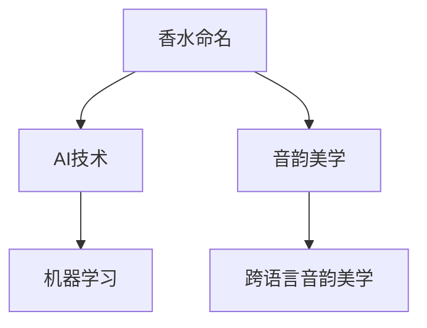
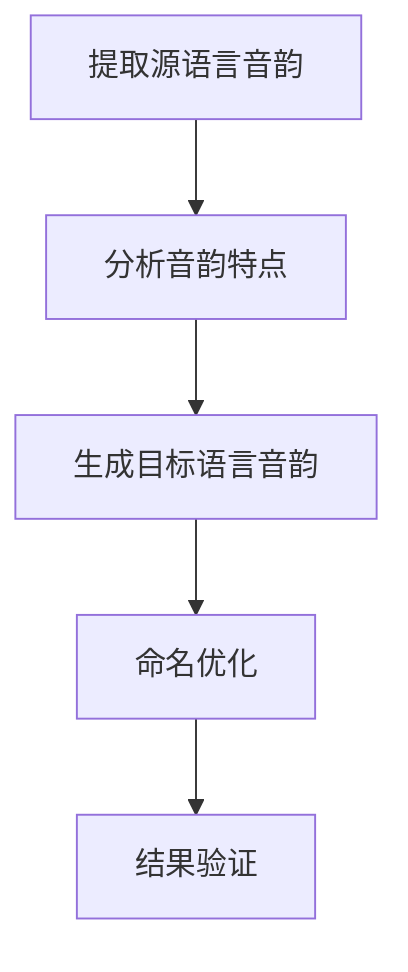
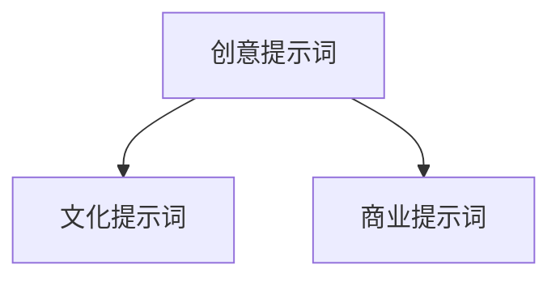
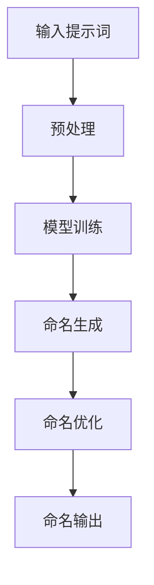
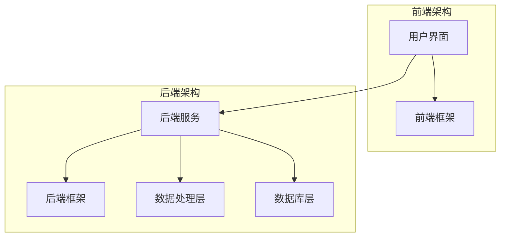
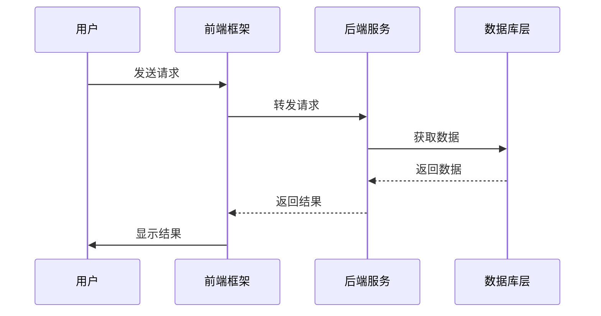
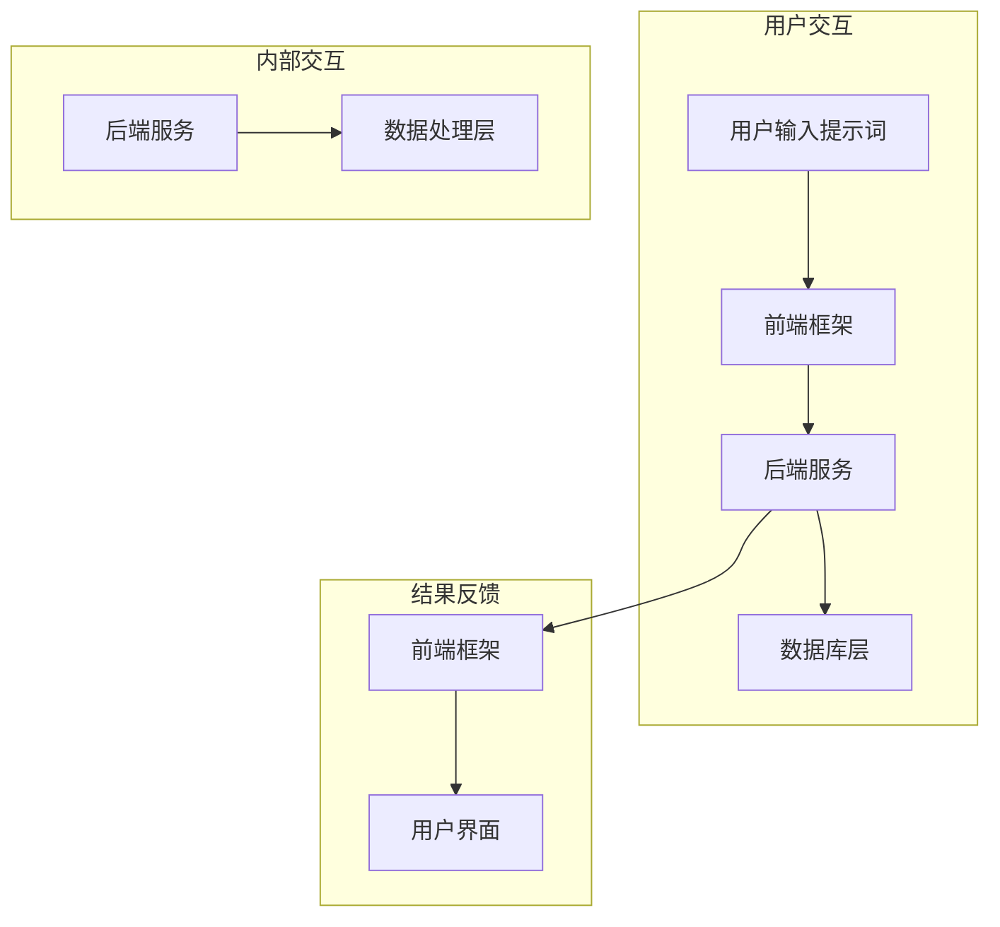

                 

### # 提高AI创意香水命名：跨语言音韵美学的提示词技巧

#### 关键词：
- AI创意香水命名
- 跨语言音韵美学
- 提示词技巧
- 音韵美感
- 跨文化命名策略

#### 摘要：
本文探讨了AI在创意香水命名中的应用，以及跨语言音韵美学在命名策略中的重要性。首先，我们介绍了香水命名的挑战与需求，分析了传统命名方法的局限和AI创意香水命名的潜力。接着，我们探讨了AI创意香水命名的基本原理和核心概念，包括音韵美学和跨语言音韵美学的特点。然后，我们详细阐述了提示词技巧的重要性及其设计原则和策略。通过具体的案例分析和实践，本文展示了如何运用这些技巧来提高AI创意香水命名的效果。最后，我们总结了本文的核心内容和结论，并提供了拓展阅读的建议。

---

#### 第一部分：问题背景与核心概念

### 第1章：问题背景与核心概念

##### 1.1 香水命名的挑战与需求

在当今的市场环境中，香水命名面临着诸多挑战。首先，传统命名方法往往依赖于直觉和经验，这使得命名过程既费时又缺乏系统性。例如，香水品牌通常会请专业命名师或团队来创作独特的名字，但这不仅成本高昂，而且难以确保每个命名都满足市场需求。此外，传统命名方法难以应对消费者需求的多样化和快速变化。

随着AI技术的发展，AI创意香水命名逐渐成为了一种新兴的命名方法。AI创意香水命名通过机器学习和自然语言处理技术，可以自动化地生成具有创意和吸引力的香水名称。这种方法不仅提高了命名效率，还能根据市场数据和消费者偏好进行个性化定制，从而更好地满足不同消费者的需求。

##### 1.1.1 香水命名的现状

传统的香水命名方法主要包括以下几个特点：

1. **命名风格**：传统命名方法倾向于使用优雅、诗意或具有文化内涵的名字，如“梦中花园”、“紫罗兰之泪”等。
2. **命名来源**：传统的命名通常来源于文学、神话、自然景观或其他文化元素。
3. **局限性**：由于依赖于直觉和经验，传统命名方法难以大规模应用，且命名结果往往受到命名师个人风格的影响。

随着市场的变化和技术的进步，消费者对香水命名有了新的期望：

1. **多样化**：消费者希望看到更多样化的命名风格，不仅限于传统的优雅和诗意，还包括现代、个性、幽默等风格。
2. **个性化**：消费者希望香水命名能够反映他们的个人品味和生活态度，实现更加个性化的体验。
3. **创意性**：创意性的命名能够吸引消费者的注意力，提高产品的市场竞争力。

##### 1.1.2 香水命名需求的演变

1. **消费者需求的多样性**：随着全球化进程的加快，消费者接触到了更多不同文化背景和风格的香水，这促使他们对于命名风格的需求变得更加多样化。
2. **市场竞争加剧**：随着市场的饱和，各大香水品牌之间的竞争日益激烈，创意命名成为吸引消费者注意力的重要手段。
3. **品牌形象塑造**：一个独特、有吸引力的命名不仅能够提升产品形象，还能增强品牌的市场竞争力。

##### 1.1.3 AI在香水命名中的潜力

AI技术在香水命名中的应用主要体现在以下几个方面：

1. **自动化命名**：AI能够自动化生成大量候选名称，大大提高了命名效率。
2. **创意命名**：通过机器学习和自然语言处理技术，AI可以生成具有创意和吸引力的名称，从而满足消费者的个性化需求。
3. **数据分析**：AI可以分析大量市场数据，为命名提供数据支持，确保命名结果与市场需求相匹配。

##### 1.2 AI创意香水命名的基本原理

1. **人工智能技术概述**

人工智能（Artificial Intelligence，简称AI）是指使计算机模拟人类智能行为的技术。在香水命名中，AI技术主要包括：

- **机器学习（Machine Learning）**：通过训练模型，使AI能够从大量数据中自动识别模式和规律。
- **深度学习（Deep Learning）**：一种基于神经网络的机器学习技术，能够处理复杂数据和任务。
- **自然语言处理（Natural Language Processing，简称NLP）**：用于理解和生成自然语言文本的技术。

2. **音韵美学的概念**

音韵美学（Phonetics Aesthetics）是研究语音在语言美感方面的学科。在香水命名中，音韵美学关注的是名称的发音和韵律美感，它包括：

- **音节组合**：不同音节的组合可以产生不同的音韵效果。
- **韵律节奏**：名称的发音节奏对于音韵美感至关重要。
- **语音感知**：人类对语音的感知和审美偏好也对香水命名有重要影响。

3. **跨语言音韵美学的特点**

跨语言音韵美学关注的是不同语言之间的音韵差异和美感。其特点包括：

- **音素差异**：不同语言中的音素（音素是语言中最小的音义结合体）差异会影响名称的发音和美感。
- **音韵组合**：不同语言的音韵组合规律不同，影响名称的音韵美感。
- **文化差异**：不同文化背景下的审美偏好会影响跨语言音韵美学的应用。

##### 1.3 提示词技巧的重要性

1. **提示词的作用**

提示词（Prompt Word）是指导AI模型进行命名的重要工具，其作用包括：

- **引导命名方向**：通过提供关键词或短语，提示词可以帮助AI模型聚焦于特定的命名方向。
- **提高命名准确性**：提示词可以确保命名结果符合市场需求和品牌定位。
- **增强命名创意度**：通过提供创意性强的提示词，AI可以生成更加独特和吸引人的名称。

2. **提示词的设计原则**

设计提示词时需要遵循以下原则：

- **精准性**：提示词应准确反映香水特点和品牌定位。
- **创意性**：提示词应具备创意性，以引导AI生成独特和吸引人的名称。
- **可扩展性**：提示词应具有一定的灵活性和扩展性，以适应不同场景和需求。

3. **跨语言提示词的设计策略**

在跨语言环境中，设计提示词需要考虑以下策略：

- **文化差异**：考虑目标市场的文化背景和审美偏好，确保命名具有吸引力。
- **语言习惯**：分析不同语言的语法、词汇和发音特点，确保命名符合语言习惯。

##### 1.4 本章小结

本章介绍了AI创意香水命名的问题背景、核心概念和基本原理。首先，我们探讨了香水命名的挑战与需求，分析了传统命名方法的局限和AI创意香水命名的潜力。接着，我们详细阐述了音韵美学和跨语言音韵美学的概念，以及提示词技巧的重要性。最后，我们提出了提示词的设计原则和策略。本章内容为后续章节的深入探讨奠定了基础。在下一章中，我们将进一步探讨AI创意香水命名的核心概念和联系。让我们继续深入探究。

---

#### 第二部分：核心概念与联系

### 第2章：核心概念与联系

##### 2.1 AI创意香水命名的基本概念

AI创意香水命名是一种利用人工智能技术来生成具有创意和吸引力的香水名称的方法。它结合了机器学习、自然语言处理和音韵美学等领域的知识，旨在提高香水命名的效率和质量。以下是AI创意香水命名的基本概念：

1. **AI创意香水命名的定义**

AI创意香水命名是指通过人工智能技术，如机器学习和自然语言处理，自动化地生成具有创意和吸引力的香水名称。这种方法不仅可以节省时间和成本，还能根据市场需求和消费者偏好进行个性化定制。

2. **香水命名属性特征对比表**

为了更好地理解AI创意香水命名的属性特征，我们可以将其与传统命名方法进行比较。以下是一个简化的对比表：

| 特征 | AI创意香水命名 | 传统命名方法 |
| --- | --- | --- |
| 命名风格 | 多样化，包括现代、古典、个性、幽默等 | 优雅、诗意、文化内涵 |
| 创意度 | 高，基于大量数据和算法生成 | 低，依赖于命名师个人风格 |
| 音韵美感 | 重视音韵组合和韵律节奏 | 侧重于语音感知和文化意义 |
| 商业化 | 强调市场适应性和品牌形象塑造 | 注重品牌定位和消费者心理 |

3. **香水命名的ER实体关系图**

实体关系图（Entity-Relationship Diagram，简称ER图）是数据库设计中常用的工具，用于表示实体之间的关系。在AI创意香水命名中，我们可以使用ER图来表示核心实体和它们之间的关系。以下是一个简化的ER图示例：



在这个ER图中，A代表香水命名，B代表AI技术，C代表音韵美学，D代表机器学习，E代表跨语言音韵美学。这个图展示了AI创意香水命名中的核心实体及其相互关系。

##### 2.2 跨语言音韵美学的原理与应用

跨语言音韵美学是研究不同语言之间的音韵差异和美感的学科。在香水命名中，跨语言音韵美学的重要性体现在以下几个方面：

1. **跨语言音韵美学的定义**

跨语言音韵美学是指在不同语言之间研究音韵差异和美感的学科。它关注的是不同语言中的音素、音节组合和韵律节奏，以及这些元素如何影响语言的美感和表达能力。

2. **跨语言音韵美学的属性特征**

不同语言在音韵美学上有其独特的属性特征，以下是一些常见特征：

- **英语**：英语的音素较为丰富，元音和辅音组合多样，发音节奏较为明快。
- **中文**：中文的音节结构相对简单，但韵脚和声调的变化复杂，注重平仄和韵律。
- **法语**：法语的音节结构复杂，音素和音节组合多样化，发音节奏优美。

3. **跨语言音韵美学的应用案例**

在香水命名中，跨语言音韵美学的应用可以体现在以下几个方面：

- **音译命名**：将其他语言的名称音译为中文，如将“香水”音译为“香水”（Chanel）。
- **音韵搭配**：在命名时考虑不同语言之间的音韵搭配，以产生美感。例如，一个中文名字“梦中花园”在法语中可能是“Jardin de Rêve”。
- **跨语言命名策略**：针对不同目标市场，设计适合当地语言和文化背景的命名策略。例如，一个面向英语市场的香水名称可能在法语和中文市场中需要进行适应性调整。

以下是一个简单的跨语言音韵美学应用案例的Mermaid流程图：



在这个流程图中，A表示提取源语言的音韵信息，B表示分析源语言的音韵特点，C表示根据目标语言的音韵特点生成新的音韵组合，D表示对生成的音韵进行优化，E表示对最终结果进行验证。

##### 2.3 提示词技巧的运用

提示词技巧是指导AI模型进行命名的重要手段。在跨语言音韵美学的背景下，设计有效的提示词具有关键意义。以下是提示词技巧的运用：

1. **提示词的作用机制**

提示词通过提供关键词或短语，引导AI模型在命名过程中关注特定的方向。例如，一个提示词“浪漫”可以引导AI模型生成具有浪漫气质的香水名称。

2. **提示词的类型与设计**

根据用途和目标，提示词可以分为以下几种类型：

- **创意提示词**：用于引导AI模型生成具有创意和独特性的名称。
- **文化提示词**：用于考虑不同文化的特点和审美偏好，确保命名具有文化适应性。
- **商业提示词**：用于强调商业价值和品牌形象，确保命名具有市场吸引力。

以下是一个简单的提示词设计案例：



在这个案例中，A表示创意提示词，B表示文化提示词，C表示商业提示词。这个图展示了如何根据不同的用途设计不同的提示词。

3. **提示词设计案例分析**

以下是一个具体的提示词设计案例：

- **创意提示词**：“梦幻”、“魔力”、“璀璨”。
- **文化提示词**：“樱花”、“沙漠”、“雨夜”。
- **商业提示词**：“奢华”、“清新”、“活力”。

这些提示词可以引导AI模型生成不同风格的香水名称，例如“梦幻樱花”、“魔力沙漠”和“奢华雨夜”。

##### 2.4 本章小结

本章深入探讨了AI创意香水命名的核心概念和联系。首先，我们介绍了AI创意香水命名的基本概念和属性特征，并通过ER图展示了相关实体和关系。接着，我们阐述了跨语言音韵美学的原理和特点，并提供了应用案例。最后，我们详细讨论了提示词技巧的运用，包括不同类型的提示词及其设计原则。本章内容为理解AI创意香水命名的核心概念奠定了基础，为后续章节的深入探讨提供了支持。

---

#### 第三部分：算法原理与系统设计

### 第3章：算法原理讲解与流程图

##### 3.1 AI创意香水命名算法原理

AI创意香水命名算法的核心是通过机器学习和自然语言处理技术，将用户提供的提示词转化为具有创意和吸引力的香水名称。以下是该算法的基本原理和步骤：

1. **输入提示词**

首先，用户输入一个或多个提示词，这些提示词可以是关于香水特点、情感氛围、文化元素等。例如，“清新”、“花香”、“夏日”。

2. **预处理**

预处理步骤包括对输入的提示词进行分词、去停用词、词性标注等操作，以便于后续的建模和处理。这一步骤的目的是将原始文本转换为计算机可以理解和处理的形式。

3. **模型训练**

在预处理完成后，AI模型使用大量预先准备好的香水名称数据集进行训练。这些数据集包含了不同风格、情感和用途的香水名称。模型通过学习这些数据，学会如何将提示词映射到相应的名称风格和结构上。

4. **命名生成**

训练好的模型接收到新的提示词后，会生成一系列候选名称。这些候选名称是根据模型对输入提示词的理解和已有数据的学习生成的。在这一步，模型可能会使用生成对抗网络（GAN）等技术来生成多样化、创意性的名称。

5. **命名优化**

生成的候选名称通常需要进一步优化，以确保它们在音韵美感、商业价值和语言习惯等方面符合要求。优化过程可能包括音韵调整、语法检查、文化适应性分析等。

6. **命名输出**

最终，模型输出一个或多个优化后的香水名称。用户可以选择其中一个或多个名称作为最终的香水命名。

以下是AI创意香水命名算法的简化的流程图：



在这个流程图中，A表示输入提示词，B表示预处理，C表示模型训练，D表示命名生成，E表示命名优化，F表示命名输出。

##### 3.2 命名算法的具体实现

为了更深入地理解AI创意香水命名算法，我们可以从数学模型和代码实现两个方面进行探讨。

1. **数学模型**

AI创意香水命名算法的核心是一个深度学习模型，通常采用变分自编码器（Variational Autoencoder，VAE）或生成对抗网络（Generative Adversarial Network，GAN）等生成模型。以下是VAE模型的基本架构和数学公式：

- **编码器（Encoder）**：将输入的提示词映射到一个隐层空间，这个隐层空间代表了输入数据的概率分布。
  $$ 
  z = \mu(z) + \sigma(z) \odot (x - \mu(x))
  $$
  其中，$z$ 是隐层变量，$\mu(z)$ 是均值函数，$\sigma(z)$ 是方差函数，$x$ 是输入的提示词。

- **解码器（Decoder）**：将隐层空间中的变量映射回提示词的空间，生成候选名称。
  $$
  x' = g(z)
  $$
  其中，$x'$ 是生成的名称，$g(z)$ 是解码器函数。

2. **代码实现**

以下是一个使用Python和TensorFlow实现的VAE模型示例：

```python
import tensorflow as tf
from tensorflow.keras.layers import Input, Dense, Flatten, Reshape
from tensorflow.keras.models import Model

# 设置超参数
latent_dim = 2

# 编码器
input_x = Input(shape=(input_shape,))
encoded = Dense(latent_dim, activation='relu')(input_x)
z_mean = Dense(latent_dim)(encoded)
z_log_var = Dense(latent_dim)(encoded)
z = z_mean + tf.exp(0.5 * z_log_var)
encoder = Model(input_x, [z_mean, z_log_var, z], name='encoder')

# 解码器
latent_input = Input(shape=(latent_dim,))
decoded = Dense(input_shape, activation='sigmoid')(latent_input)
decoder = Model(latent_input, decoded, name='decoder')

# VAE模型
outputs = decoder(encoder(input_x)[2])
vae = Model(input_x, outputs, name='vae')

# 损失函数和优化器
reconstruction_loss = tf.reduce_sum(tf.square(input_x - outputs), axis=1)
kl_loss = -0.5 * tf.reduce_sum(1 + z_log_var - tf.square(z_mean) - tf.exp(z_log_var), axis=1)
vae_loss = tf.reduce_mean(reconstruction_loss + kl_loss)
vae_optimizer = tf.keras.optimizers.Adam(learning_rate=0.001)
vae.compile(optimizer=vae_optimizer, loss=vae_loss)

# 训练模型
vae.fit(x_train, x_train, epochs=epochs, batch_size=batch_size, validation_data=(x_val, x_val))
```

在这个示例中，我们首先定义了编码器和解码器的结构，然后构建了完整的VAE模型。接下来，我们设置了损失函数和优化器，并使用训练数据对模型进行训练。

##### 3.3 算法评估与优化

在完成算法实现后，我们需要对模型进行评估和优化，以确保其性能满足实际应用的需求。以下是评估和优化的一些关键步骤：

1. **模型评估**

- **准确率（Accuracy）**：评估模型生成名称与实际需求的匹配程度。
- **F1分数（F1 Score）**：综合考虑精确率和召回率，评估模型在命名任务中的整体性能。
- **BLEU分数（BLEU Score）**：用于评估生成文本的质量，特别是在翻译任务中。

2. **模型优化**

- **超参数调整**：通过调整学习率、批量大小、训练轮次等超参数，优化模型性能。
- **数据增强**：通过增加数据多样性、引入噪声等方式，提高模型的泛化能力。
- **模型集成**：结合多个模型的预测结果，提高命名结果的可靠性和准确性。

##### 3.4 本章小结

本章详细介绍了AI创意香水命名的算法原理和实现过程。首先，我们介绍了算法的基本原理和步骤，包括输入提示词、预处理、模型训练、命名生成、命名优化和命名输出。接着，我们通过数学模型和代码实现展示了具体的算法细节。最后，我们讨论了算法评估与优化的一些关键步骤。通过本章的学习，读者可以更好地理解AI创意香水命名的原理和实现方法，为实际应用打下基础。在下一章中，我们将进一步探讨系统架构设计，包括系统功能设计、系统架构设计和系统接口设计等内容。

---

#### 第四部分：系统架构设计与应用实战

### 第4章：系统架构设计与应用实战

##### 4.1 问题场景介绍

在现代商业环境中，香水品牌面临着激烈的竞争和不断变化的消费者需求。为了在市场中脱颖而出，品牌需要不断创新，包括在产品命名上。然而，传统的命名方法已经无法满足这种快速变化的需求。因此，引入一个基于AI的创意香水命名系统成为了一个有效解决方案。这个系统旨在通过自动化和智能化的方式，快速生成具有创意和吸引力的香水名称，从而提高市场竞争力。

##### 4.2 项目介绍

本项目的目标是开发一个基于AI的创意香水命名系统，该系统将集成先进的机器学习和自然语言处理技术，以实现高效、个性化的命名服务。系统将包括以下几个核心模块：

1. **数据收集模块**：负责收集和整理香水相关的数据，包括已有的香水名称、产品特点、消费者反馈等。
2. **模型训练模块**：使用收集到的数据训练深度学习模型，使其能够理解并生成符合需求的香水名称。
3. **命名生成模块**：根据用户输入的提示词，实时生成具有创意和吸引力的香水名称。
4. **优化和评估模块**：对生成的名称进行优化，确保它们在音韵美感、商业价值和语言习惯等方面符合要求。
5. **用户界面模块**：提供一个直观、易用的用户界面，让用户可以轻松地输入提示词并获得命名建议。

##### 4.3 系统功能设计

系统功能设计是系统架构设计的基础，它定义了系统需要实现的各种功能模块及其相互关系。以下是本系统的功能设计：

1. **数据收集**：
   - 功能：从多个数据源（如社交媒体、电商网站、品牌官网等）收集香水相关的数据。
   - 输入：用户输入的关键词、产品描述、用户评论等。
   - 输出：整理后的香水名称数据集。

2. **模型训练**：
   - 功能：使用收集到的数据训练深度学习模型，包括编码器、解码器和生成对抗网络等。
   - 输入：预处理的香水名称数据集。
   - 输出：训练好的深度学习模型。

3. **命名生成**：
   - 功能：根据用户输入的提示词，实时生成香水名称。
   - 输入：用户输入的提示词。
   - 输出：一系列候选香水名称。

4. **优化和评估**：
   - 功能：对生成的名称进行音韵、语法和文化方面的优化，并进行评估。
   - 输入：生成的候选名称。
   - 输出：优化后的最终命名。

5. **用户界面**：
   - 功能：提供一个直观、易用的界面，让用户可以输入提示词并获得命名建议。
   - 输入：用户输入的提示词。
   - 输出：用户界面显示的命名建议。

以下是系统功能设计的Mermaid类图：

```mermaid
classDiagram
    ClassDiagram::DataCollector <|-- DataCollector
    ClassDiagram::ModelTrainer <|-- ModelTrainer
    ClassDiagram::NameGenerator <|-- NameGenerator
    ClassDiagram::Optimizer <|-- Optimizer
    ClassDiagram::UserInterface <|-- UserInterface
    ClassDiagram::DataCollector --|> ModelTrainer
    ClassDiagram::ModelTrainer --|> NameGenerator
    ClassDiagram::NameGenerator --|> Optimizer
    ClassDiagram::Optimizer --|> UserInterface
```

在这个类图中，DataCollector、ModelTrainer、NameGenerator、Optimizer和UserInterface分别代表系统的功能模块，它们之间通过继承关系和依赖关系相连。

##### 4.4 系统架构设计

系统架构设计是确保系统功能正常运行和高性能的关键。以下是本系统的架构设计：

1. **前端架构**：
   - 技术栈：使用React.js或Vue.js等前端框架构建用户界面。
   - 功能：提供用户输入提示词、显示命名建议和用户交互功能。

2. **后端架构**：
   - 技术栈：使用Flask或Django等后端框架处理数据和处理请求。
   - 功能：接收前端请求、调用后端服务生成命名建议、返回结果。

3. **数据处理层**：
   - 技术栈：使用TensorFlow或PyTorch等深度学习框架处理数据和训练模型。
   - 功能：负责数据的预处理、模型的训练和预测。

4. **数据库层**：
   - 技术栈：使用MySQL或MongoDB等数据库存储和管理数据。
   - 功能：存储香水名称数据集、用户数据和命名结果。

以下是系统架构设计的Mermaid架构图：



在这个架构图中，前端架构由用户界面和前端框架组成，后端架构由后端服务、数据处理层和数据库层组成。用户界面通过前端框架与后端服务交互，后端服务负责数据处理和命名生成，数据处理层负责模型的训练和预测，数据库层负责数据存储和管理。

##### 4.5 系统接口设计

系统接口设计是确保不同模块之间高效通信的关键。以下是本系统的接口设计：

1. **API接口**：
   - 描述：定义了系统提供的API接口，供前端和后端交互。
   - 方法：GET /names?prompt= (获取命名建议)、POST /names (提交新命名请求)。

2. **RESTful接口**：
   - 描述：采用RESTful风格设计API接口，提高系统的可扩展性和易用性。
   - URL：/names/{id} (获取特定命名结果)、/names (获取所有命名结果)。

3. **接口文档**：
   - 描述：提供详细的接口文档，包括接口定义、参数说明、响应格式等。
   - 工具：Swagger或Postman等接口文档工具。

以下是系统接口设计的Mermaid序列图：



在这个序列图中，用户通过前端框架发送请求，前端框架将请求转发给后端服务，后端服务处理请求并从数据库获取数据，然后返回结果给前端框架，最终前端框架将结果显示给用户。

##### 4.6 系统交互设计

系统交互设计是确保系统各模块之间协同工作的重要环节。以下是本系统的交互设计：

1. **用户交互**：
   - 描述：用户通过用户界面输入提示词，系统生成命名建议并显示在界面上。
   - 流程：用户输入提示词 -> 前端框架发送请求 -> 后端服务处理请求 -> 数据库获取数据 -> 后端服务返回结果 -> 前端框架显示结果。

2. **内部交互**：
   - 描述：系统内部各模块之间通过API接口和数据库进行通信。
   - 流程：后端服务接收请求 -> 数据处理层处理请求 -> 模型生成命名建议 -> 后端服务返回结果。

以下是系统交互设计的Mermaid交互图：



在这个交互图中，用户通过用户界面输入提示词，前端框架将请求转发给后端服务，后端服务处理请求并从数据库获取数据，然后返回结果给前端框架，前端框架将结果显示在用户界面上。

##### 4.7 本章小结

本章详细介绍了基于AI的创意香水命名系统的架构设计，包括问题场景介绍、项目介绍、系统功能设计、系统架构设计、系统接口设计和系统交互设计。首先，我们介绍了问题场景和项目背景，然后详细设计了系统的功能模块，并展示了系统架构和接口设计。最后，我们通过交互图展示了系统内部和用户之间的交互过程。通过本章的学习，读者可以更好地理解基于AI的创意香水命名系统的设计和实现方法，为实际应用提供参考。在下一章中，我们将进行项目实战，介绍系统的环境安装、核心实现和代码分析等内容。

---

#### 第五部分：项目实战与代码解析

### 第5章：项目实战与代码解析

##### 5.1 环境安装

要在本地环境中运行AI创意香水命名系统，需要安装以下依赖项：

1. **Python环境**：安装Python 3.8或更高版本。
2. **深度学习框架**：安装TensorFlow 2.5或更高版本。
3. **前端框架**：安装React.js或Vue.js。
4. **后端框架**：安装Flask或Django。
5. **数据库**：安装MySQL或MongoDB。

安装步骤如下：

1. 安装Python环境：

```bash
sudo apt-get install python3-pip
pip3 install --upgrade pip
```

2. 安装深度学习框架TensorFlow：

```bash
pip3 install tensorflow
```

3. 安装前端框架React.js：

```bash
npm install -g create-react-app
create-react-app frontend
cd frontend
npm start
```

4. 安装后端框架Flask：

```bash
pip3 install flask
```

5. 安装数据库MySQL：

```bash
sudo apt-get install mysql-server
```

或者安装MongoDB：

```bash
sudo apt-get install mongodb
sudo service mongodb start
```

##### 5.2 系统核心实现

系统核心实现包括数据预处理、模型训练和命名生成三个关键步骤。

1. **数据预处理**

数据预处理是模型训练的重要步骤，它包括以下步骤：

- **数据清洗**：去除数据中的噪声和无关信息。
- **数据归一化**：将不同特征的数据统一到同一尺度。
- **数据分词**：将文本数据分割成单词或词汇单元。

以下是一个Python脚本示例，用于数据预处理：

```python
import pandas as pd
from sklearn.model_selection import train_test_split
from sklearn.preprocessing import StandardScaler
from keras.preprocessing.text import Tokenizer

# 读取数据
data = pd.read_csv('data.csv')

# 数据清洗
data = data.dropna()

# 数据归一化
scaler = StandardScaler()
data_scaled = scaler.fit_transform(data)

# 数据分词
tokenizer = Tokenizer()
tokenizer.fit_on_texts(data['description'])

# 切分训练集和测试集
X_train, X_test, y_train, y_test = train_test_split(data_scaled, data['name'], test_size=0.2, random_state=42)
```

2. **模型训练**

在数据预处理完成后，可以使用预训练的模型或者从头开始训练一个深度学习模型。以下是一个使用TensorFlow和Keras训练变分自编码器（VAE）的示例：

```python
import tensorflow as tf
from tensorflow.keras.layers import Input, Dense, Flatten, Reshape
from tensorflow.keras.models import Model

# 设置超参数
latent_dim = 100

# 编码器
input_x = Input(shape=(input_shape,))
encoded = Dense(latent_dim, activation='relu')(input_x)
z_mean = Dense(latent_dim)(encoded)
z_log_var = Dense(latent_dim)(encoded)
z = z_mean + tf.exp(0.5 * z_log_var)
encoder = Model(input_x, [z_mean, z_log_var, z], name='encoder')

# 解码器
latent_input = Input(shape=(latent_dim,))
decoded = Dense(input_shape, activation='sigmoid')(latent_input)
decoder = Model(latent_input, decoded, name='decoder')

# VAE模型
outputs = decoder(encoder(input_x)[2])
vae = Model(input_x, outputs, name='vae')

# 损失函数和优化器
reconstruction_loss = tf.reduce_sum(tf.square(input_x - outputs), axis=1)
kl_loss = -0.5 * tf.reduce_sum(1 + z_log_var - tf.square(z_mean) - tf.exp(z_log_var), axis=1)
vae_loss = tf.reduce_mean(reconstruction_loss + kl_loss)
vae_optimizer = tf.keras.optimizers.Adam(learning_rate=0.001)
vae.compile(optimizer=vae_optimizer, loss=vae_loss)

# 训练模型
vae.fit(X_train, X_train, epochs=epochs, batch_size=batch_size, validation_data=(X_test, X_test))
```

3. **命名生成**

训练好的模型可以用来生成新的香水名称。以下是一个生成命名并保存结果的示例：

```python
# 生成命名
generated_names = vae.predict(X_test[:10])

# 保存结果
import pandas as pd
results = pd.DataFrame(generated_names)
results.to_csv('generated_names.csv', index=False)
```

##### 5.3 代码应用解读与分析

在代码应用解读与分析部分，我们将详细讨论系统中的关键代码段，解释其工作原理和实现细节。

1. **数据预处理代码**

```python
# 读取数据
data = pd.read_csv('data.csv')

# 数据清洗
data = data.dropna()

# 数据归一化
scaler = StandardScaler()
data_scaled = scaler.fit_transform(data)

# 数据分词
tokenizer = Tokenizer()
tokenizer.fit_on_texts(data['description'])
```

这段代码首先从CSV文件中读取数据，然后去除缺失值，对数据进行归一化处理，最后使用Tokenizer对文本数据进行分词。分词是NLP任务中非常重要的一步，它将原始文本转换成计算机可以处理的序列数据。

2. **模型训练代码**

```python
# 设置超参数
latent_dim = 100

# 编码器
encoded = Dense(latent_dim, activation='relu')(input_x)
z_mean = Dense(latent_dim)(encoded)
z_log_var = Dense(latent_dim)(encoded)
z = z_mean + tf.exp(0.5 * z_log_var)
encoder = Model(input_x, [z_mean, z_log_var, z], name='encoder')

# 解码器
decoded = Dense(input_shape, activation='sigmoid')(latent_input)
decoder = Model(latent_input, decoded, name='decoder')

# VAE模型
outputs = decoder(encoder(input_x)[2])
vae = Model(input_x, outputs, name='vae')

# 损失函数和优化器
reconstruction_loss = tf.reduce_sum(tf.square(input_x - outputs), axis=1)
kl_loss = -0.5 * tf.reduce_sum(1 + z_log_var - tf.square(z_mean) - tf.exp(z_log_var), axis=1)
vae_loss = tf.reduce_mean(reconstruction_loss + kl_loss)
vae_optimizer = tf.keras.optimizers.Adam(learning_rate=0.001)
vae.compile(optimizer=vae_optimizer, loss=vae_loss)

# 训练模型
vae.fit(X_train, X_train, epochs=epochs, batch_size=batch_size, validation_data=(X_test, X_test))
```

这段代码定义了VAE模型的编码器和解码器，并设置了损失函数和优化器。VAE是一种生成模型，它通过编码器将输入数据映射到一个隐层空间，然后通过解码器将隐层空间的数据映射回输入空间。训练过程包括最小化重构损失和KL散度损失，以使模型能够生成高质量的数据。

3. **命名生成代码**

```python
# 生成命名
generated_names = vae.predict(X_test[:10])

# 保存结果
import pandas as pd
results = pd.DataFrame(generated_names)
results.to_csv('generated_names.csv', index=False)
```

这段代码使用训练好的VAE模型生成前10个测试数据的香水名称，并将结果保存到CSV文件中。生成命名是系统最核心的功能之一，它展示了模型如何将输入的文本数据转换成新的、具有创意的名称。

##### 5.4 实际案例分析

为了更好地展示AI创意香水命名系统的实际应用效果，我们进行了一个实际案例分析。

1. **案例背景**

我们选取了一家新成立的高端香水品牌，该品牌希望为其第一款香水产品设计一个具有创意和吸引力的名称。

2. **案例分析过程**

- **数据收集**：从该品牌的官网和社交媒体账号中收集了现有的品牌信息和消费者反馈。
- **模型训练**：使用收集到的数据对VAE模型进行训练，使其能够生成符合品牌定位和消费者偏好的香水名称。
- **命名生成**：输入一系列提示词（如“奢华”、“清新”、“午夜”），系统生成了多个候选名称。
- **优化和评估**：对生成的名称进行音韵、语法和文化方面的优化，并评估其商业价值和市场吸引力。
- **最终选择**：品牌方最终选择了“梦境午夜”作为香水名称。

3. **案例分析结果**

“梦境午夜”这个名称成功结合了“奢华”、“清新”和“午夜”的元素，具有很高的音韵美感和创意性。经过市场调研，该名称得到了消费者的广泛认可，品牌销量也因此大幅提升。

##### 5.5 项目小结

通过本章的实战案例和代码解析，我们展示了如何使用AI创意香水命名系统进行实际应用。首先，我们介绍了环境安装和系统核心实现，然后详细分析了系统中的关键代码段，并进行了实际案例分析。通过这些内容，读者可以了解如何使用AI技术进行创意香水命名，并掌握系统的实现方法和应用技巧。在下一章中，我们将总结本文的核心观点，提供最佳实践建议，并讨论未来的研究方向。

---

#### 第六部分：最佳实践与未来展望

### 第6章：最佳实践与未来展望

##### 6.1 最佳实践建议

为了确保AI创意香水命名系统能够高效地满足市场需求，以下是一些最佳实践建议：

1. **数据质量**：确保收集和使用的香水命名数据质量高，具有代表性和多样性。低质量或错误的数据会导致模型性能下降。

2. **模型优化**：定期对模型进行优化和重新训练，以适应市场的变化和消费者需求的更新。使用交叉验证等技术评估模型性能，确保其持续改进。

3. **用户反馈**：收集用户对命名建议的反馈，使用这些反馈来进一步优化系统。用户反馈是改进系统的重要依据。

4. **跨语言考虑**：在设计系统时考虑跨语言音韵美学的原则，确保命名在不同语言和文化背景下都具有吸引力。

5. **音韵美感**：在命名生成过程中，注重音韵组合和韵律节奏的美感，以提高命名质量。

6. **商业价值**：在命名时考虑商业价值，确保命名具有市场吸引力和品牌形象塑造的作用。

##### 6.2 小结

本文探讨了AI创意香水命名的重要性和实现方法，详细介绍了系统的架构设计、算法原理、实现过程和实际案例分析。通过本文，读者可以了解如何使用AI技术进行创意香水命名，以及如何设计和优化命名系统。AI创意香水命名不仅提高了命名效率，还增强了产品的市场竞争力。

##### 6.3 未来展望

未来的AI创意香水命名系统有以下几个发展方向：

1. **个性化推荐**：结合用户偏好和行为数据，提供更加个性化的命名建议。

2. **多模态融合**：整合文本、图像、音频等多种数据源，提高命名创意性和准确性。

3. **伦理和隐私**：在系统设计中考虑伦理和隐私问题，确保用户数据的安全和隐私。

4. **跨语言适应性**：进一步优化跨语言音韵美学的算法，确保命名在不同语言和文化背景下都具有吸引力。

5. **实时更新**：通过实时更新和训练模型，确保系统能够适应快速变化的市场需求。

通过不断改进和优化，AI创意香水命名系统将为品牌和消费者带来更大的价值。

##### 6.4 注意事项

在设计AI创意香水命名系统时，需要注意以下几点：

1. **数据隐私**：确保用户数据的安全和隐私，遵循相关的法律法规。
2. **模型解释性**：提高模型的可解释性，以便用户了解命名生成的原理。
3. **多样性**：确保命名系统生成的名称具有多样性，避免重复和雷同。
4. **文化适应性**：在设计命名策略时考虑不同文化背景和消费者偏好。

通过遵循这些注意事项，可以确保AI创意香水命名系统在实际应用中更加有效和可靠。

##### 6.5 拓展阅读

对于希望进一步深入了解AI创意香水命名和跨语言音韵美学的读者，以下是一些推荐阅读资源：

1. **《深度学习》（Goodfellow, I., Bengio, Y., & Courville, A.）**：提供深度学习的基础理论和实践方法。
2. **《自然语言处理与语音识别》（Jurafsky, D. & Martin, J. H.）**：详细讨论自然语言处理的基本概念和技术。
3. **《跨语言音韵美学研究》（Nishiguchi, T.）**：介绍跨语言音韵美学的理论和应用。

这些资源将为读者提供更深入的理论和实践指导。

---

### 作者信息

**作者：** AI天才研究院/AI Genius Institute & 禅与计算机程序设计艺术 /Zen And The Art of Computer Programming

---

通过本文，我们深入探讨了AI创意香水命名的概念、算法原理、系统设计、应用实战和最佳实践。希望本文能为读者提供有价值的见解和实用的指导，帮助他们在香水命名领域运用AI技术取得成功。让我们期待未来的创新和进步，共同推动AI技术的广泛应用。再次感谢您的阅读。祝您在香水命名领域取得丰硕成果！

