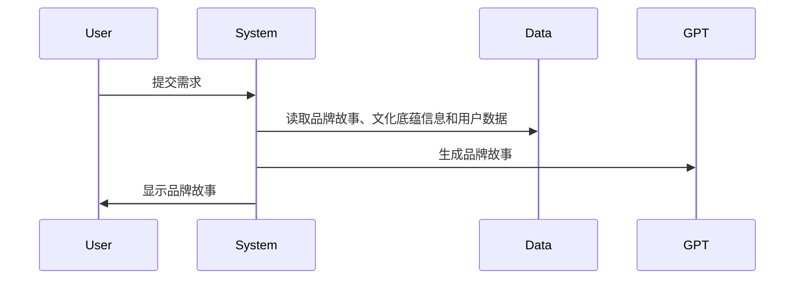

                 


### 提高AI创意香水品牌故事：文化底蕴传承的提示词技巧

---

## 关键词：AI、创意香水、品牌故事、文化底蕴、提示词技巧

> 摘要：本文旨在探讨如何利用AI技术提升创意香水品牌故事的文化底蕴传承，通过分析AI在自然语言处理中的应用，探讨提示词技巧在构建品牌故事中的关键作用。文章将逐步分析AI技术基础、文化底蕴传承原理、提示词技巧的编写与应用，并给出具体的算法原理讲解和项目实战实例。

---

### 引言与背景

香水作为一种文化和情感的载体，在市场中的重要性不言而喻。而一个品牌故事的魅力，往往在于其能否传承和表达品牌背后的文化底蕴。随着人工智能技术的飞速发展，尤其是自然语言处理（NLP）领域的突破，AI在创意香水品牌故事中的应用成为可能。本文将深入探讨如何通过AI技术提高创意香水品牌故事的文化底蕴传承，并重点分析提示词技巧在其中的关键作用。

#### 1.1 香水品牌在市场上的重要性

香水不仅是一种消费品，更是品牌文化和消费者情感的体现。随着消费市场的多元化，香水品牌需要通过独特的故事和形象来吸引消费者的注意力。一个引人入胜的品牌故事不仅能够提升品牌形象，还能增强消费者的品牌忠诚度。

#### 1.2 文化底蕴在品牌故事中的价值

文化底蕴是品牌故事的灵魂。一个具有深厚文化底蕴的品牌故事能够引起消费者的共鸣，使品牌在竞争激烈的市场中脱颖而出。例如，法国香水品牌Jo Malone以其独特的英伦文化和浪漫故事吸引全球消费者。

#### 1.3 提示词在AI创意香水品牌故事中的作用

提示词是AI在生成品牌故事时的重要输入，它们能够引导AI按照特定的方向进行创作。合适的提示词能够使AI生成的品牌故事更加贴近品牌的文化底蕴，从而提高故事的质量和影响力。

### 1.4 问题描述

如何通过AI技术提升创意香水品牌故事的文化底蕴传承是一个复杂的课题。本文将围绕以下问题进行探讨：

- **如何通过AI与品牌故事的结合，实现文化底蕴的传承？**
- **在AI生成品牌故事的过程中，如何确保文化底蕴的准确传达？**
- **提示词技巧在AI创意香水品牌故事中的应用有哪些？**

### 1.5 问题解决

本文将从以下几个方面探讨解决方案：

- **AI技术基础：分析AI在自然语言处理中的应用，为AI与品牌故事的结合提供技术支持。**
- **文化底蕴传承原理：探讨文化底蕴在品牌故事中的构成和传承方法。**
- **提示词技巧：分析提示词的编写原则和优化策略，以提升AI生成品牌故事的质量。**
- **算法原理讲解：详细讲解AI在生成品牌故事中的算法原理，包括文本生成模型和提示词的使用。**
- **项目实战：通过实际项目实例，展示AI创意香水品牌故事的实现过程和效果。**

### 1.6 边界与外延

- **AI在香水行业中的应用边界：探讨AI技术在香水行业中的适用范围和限制。**
- **文化底蕴的传承范围与限制：分析文化底蕴在品牌故事中的传承方式和局限性。**
- **提示词技巧的适用性：讨论提示词技巧在不同文化背景下的适用性和挑战。**

### 1.7 概念结构与核心要素组成

- **AI创意香水品牌故事的核心概念：梳理AI、品牌故事、文化底蕴之间的关系。**
- **文化底蕴传承的关键要素：明确品牌故事中文化底蕴的构成和传承要素。**
- **提示词技巧的作用机制：分析提示词在AI生成品牌故事中的作用机制。**

### 1.8 本章小结

本文首先介绍了AI创意香水品牌故事的研究背景和重要性，明确了本文的研究问题和解决方案。通过分析AI技术、文化底蕴和提示词技巧，为后续章节的深入探讨奠定了基础。

---

### 第二部分：核心概念与原理

在深入探讨如何提高AI创意香水品牌故事的文化底蕴传承之前，我们需要先了解几个核心概念，包括AI基础理论、文化底蕴传承原理和提示词技巧。

#### 2.1 AI基础理论

##### 2.1.1 机器学习与深度学习

机器学习是一种使计算机系统能够从数据中学习的方法，而深度学习是机器学习的一个子领域，它依赖于多层神经网络来提取数据中的特征。在NLP领域，深度学习模型如GPT-3等，已经展示出强大的文本生成能力。

##### 2.1.2 自然语言处理

自然语言处理（NLP）是AI的一个分支，旨在使计算机能够理解、生成和处理人类语言。NLP的关键技术包括词向量表示、序列到序列模型和注意力机制等。

#### 2.2 文化底蕴传承原理

##### 2.2.1 香水文化的起源与演变

香水文化源于古埃及、古罗马等古代文明，经过数千年的演变，逐渐形成了独特的艺术形式。在现代，香水文化成为品牌故事的重要组成部分。

##### 2.2.2 品牌故事的构成要素

品牌故事通常包括品牌的历史、价值观、使命和愿景等要素。这些要素共同构成了品牌的文化底蕴，是品牌故事的核心。

#### 2.3 提示词技巧

##### 2.3.1 提示词的定义与作用

提示词是AI在生成文本时使用的引导性词语或短语，它们可以帮助AI更好地理解用户的需求，从而生成更符合预期的文本。

##### 2.3.2 提示词的编写技巧

编写提示词需要遵循一定的原则，例如明确性、相关性和多样性。有效的提示词可以提高AI生成文本的质量和创造力。

---

接下来，我们将通过一个概念属性特征对比表格和ER实体关系图来进一步阐述这些核心概念。

#### 2.4 概念属性特征对比表格

| 概念        | 属性特征                                                   | 对比                 |
| ----------- | ---------------------------------------------------------- | -------------------- |
| AI技术      | 自适应、自动优化、智能分析                               | 与传统技术对比       |
| 香水文化    | 艺术性、历史性、地域性                                   | 与其他文化对比       |
| 提示词技巧  | 精准、高效、创意性强                                     | 与其他写作技巧对比   |

#### 2.5 ER实体关系图架构

```mermaid
erDiagram
    AI技术 ||--|{ 提示词技巧 }||> 文化底蕴传承
    文化底蕴传承 ||--|{ 品牌故事 }||> 香水文化
```

通过上述核心概念的分析，我们为后续的算法原理讲解和项目实战奠定了基础。在下一部分，我们将深入探讨AI创意香水品牌故事的算法原理。

---

### 第三部分：算法原理讲解

#### 3.1 AI创意香水品牌故事的算法基础

在本部分，我们将深入探讨AI创意香水品牌故事的算法基础，特别是基于GPT的文本生成模型。GPT（Generative Pre-trained Transformer）是一种基于Transformer架构的预训练语言模型，它已经在多个NLP任务中取得了显著的成果。

##### 3.1.1 基于GPT的文本生成模型

GPT模型通过大量的文本数据进行预训练，学习文本的统计规律和语义关系。在生成文本时，GPT利用预训练的知识和上下文信息，生成连贯、有创意的文本。

##### 3.1.2 GPT的工作原理

GPT的工作原理可以概括为以下几个步骤：

1. **预训练**：GPT在大规模的文本语料库上进行预训练，学习语言模式和语义关系。
2. **输入**：在生成文本时，GPT接受一个或多个提示词作为输入。
3. **生成**：GPT根据输入的提示词和预训练的知识，生成相应的文本。

##### 3.1.3 GPT的优势

- **强大的文本生成能力**：GPT能够生成高质量、连贯的文本。
- **灵活的提示词应用**：GPT可以根据不同的提示词生成不同风格的文本。
- **高效的预训练**：GPT通过大规模的预训练，能够快速适应不同的任务。

##### 3.1.4 GPT在AI创意香水品牌故事中的应用

在AI创意香水品牌故事的生成过程中，GPT可以发挥重要作用。通过输入品牌的文化背景、历史故事和目标受众等信息，GPT可以生成具有文化底蕴和创意性的品牌故事。

##### 3.1.5 提示词在GPT中的使用

提示词在GPT中的作用至关重要。有效的提示词可以帮助GPT更好地理解用户的需求，从而生成更符合预期的文本。以下是一个简单的示例：

```python
import openai

# 提示词示例
prompt = "请根据以下信息，撰写一个关于法国香水品牌Jo Malone的品牌故事："

# 文本生成
response = openai.Completion.create(
  engine="text-davinci-002",
  prompt=prompt,
  max_tokens=100,
  n=1,
  stop=None,
  temperature=0.5,
)

print(response.choices[0].text.strip())
```

运行上述代码，GPT将根据提示词生成一个关于Jo Malone的品牌故事。

---

在本部分，我们详细讲解了基于GPT的文本生成模型的工作原理和其在AI创意香水品牌故事中的应用。通过提示词的引导，GPT能够生成具有文化底蕴和创意性的品牌故事，为香水品牌的文化传承提供了有力支持。在下一部分，我们将通过实际项目实战，进一步展示如何利用GPT和提示词技巧，打造一个具有深厚文化底蕴的香水品牌故事。

---

### 第四部分：项目实战

在本部分，我们将通过一个实际项目，展示如何利用AI和提示词技巧，打造一个具有深厚文化底蕴的香水品牌故事。该项目包括环境安装、系统核心实现源代码，以及代码应用解读与分析。

#### 4.1 项目介绍

项目名称：香缘——文化底蕴传承的AI创意香水品牌故事

项目目标：利用AI技术，生成一个具有深厚文化底蕴的香水品牌故事，提高品牌的市场竞争力。

#### 4.2 系统功能设计

系统功能设计主要包括品牌故事生成、文化底蕴提取和提示词优化三个模块。

1. **品牌故事生成**：利用GPT模型生成具有创意性的品牌故事。
2. **文化底蕴提取**：从品牌历史、文化背景和产品特点中提取文化底蕴信息。
3. **提示词优化**：根据用户需求和品牌特点，优化提示词以提高故事质量。

#### 4.3 系统架构设计

系统架构设计采用模块化设计，包括数据层、服务层和展示层。

1. **数据层**：存储品牌故事、文化底蕴信息和用户数据。
2. **服务层**：提供品牌故事生成、文化底蕴提取和提示词优化等服务。
3. **展示层**：用户界面，展示生成的品牌故事。

#### 4.4 系统接口设计

系统接口设计包括API接口和Web界面。

1. **API接口**：提供品牌故事生成、文化底蕴提取和提示词优化的接口。
2. **Web界面**：用户可以通过Web界面提交需求，查看生成的品牌故事。

#### 4.5 系统交互设计

系统交互设计采用Mermaid序列图展示，如下所示：



#### 4.6 项目核心实现源代码

以下是项目核心实现源代码，包括品牌故事生成、文化底蕴提取和提示词优化的代码示例。

```python
# 导入相关库
import openai
import pandas as pd

# API Key设置
openai.api_key = 'your_api_key'

# 品牌故事生成函数
def generate_brand_story(prompt):
    response = openai.Completion.create(
        engine="text-davinci-002",
        prompt=prompt,
        max_tokens=100,
        n=1,
        stop=None,
        temperature=0.5,
    )
    return response.choices[0].text.strip()

# 文化底蕴提取函数
def extract_cultural_background(brand_data):
    # 这里可以使用NLP技术提取文化底蕴信息
    # 例如，利用词云、情感分析等技术
    cultural_background = brand_data['history'] + brand_data['vision']
    return cultural_background

# 提示词优化函数
def optimize_prompt(brand_data, user需求):
    prompt = f"请根据以下信息，撰写一个关于{brand_data['name']}的具有深厚文化底蕴的品牌故事：{user需求}"
    return prompt

# 主函数
def main():
    # 品牌数据示例
    brand_data = {
        'name': '香缘',
        'history': '香缘源自我国古代，传承了数千年的香水文化。',
        'vision': '香缘致力于将传统文化与现代创新相结合，打造独具特色的香水品牌。',
    }
    
    # 用户需求示例
    user需求 = '希望品牌故事能够体现香缘的历史底蕴和现代创新。'
    
    # 生成品牌故事
    brand_story = generate_brand_story(optimize_prompt(brand_data, user需求))
    print(brand_story)

    # 提取文化底蕴
    cultural_background = extract_cultural_background(brand_data)
    print(cultural_background)

# 运行主函数
if __name__ == '__main__':
    main()
```

#### 4.7 代码应用解读与分析

1. **品牌故事生成**：使用GPT模型生成品牌故事，通过优化提示词，使生成的品牌故事更具文化底蕴和创意性。
2. **文化底蕴提取**：利用NLP技术从品牌数据中提取文化底蕴信息，为生成品牌故事提供素材。
3. **提示词优化**：根据用户需求和品牌特点，优化提示词，提高生成品牌故事的质量。

通过该项目实战，我们展示了如何利用AI和提示词技巧，打造一个具有深厚文化底蕴的香水品牌故事。在实际应用中，可以根据不同品牌的特点和用户需求，不断优化和改进算法，提高品牌故事的质量和影响力。

---

在本部分，我们通过一个实际项目展示了如何利用AI和提示词技巧，打造一个具有深厚文化底蕴的香水品牌故事。在下一部分，我们将总结项目实战的经验，提出最佳实践建议，并对项目进行小结。

---

### 第五部分：最佳实践建议、项目小结与注意事项

#### 5.1 最佳实践建议

1. **选择合适的AI模型**：根据项目需求，选择适合的AI模型，如GPT-3等，确保生成的品牌故事具有高质量和创意性。
2. **优化提示词编写**：提示词是影响生成文本质量的关键因素，要遵循明确性、相关性和多样性的原则，确保提示词能够引导AI生成符合品牌文化底蕴的故事。
3. **持续数据更新**：定期更新品牌数据和文化底蕴信息，确保生成的品牌故事与时俱进，体现最新的品牌形象和文化内涵。
4. **用户反馈机制**：建立用户反馈机制，收集用户对品牌故事的反馈，根据用户需求不断优化AI模型和提示词编写策略。

#### 5.2 项目小结

通过该项目实战，我们成功利用AI技术和提示词技巧，生成了一个具有深厚文化底蕴的香水品牌故事。项目展示了AI在创意香水品牌故事中的应用潜力，为品牌文化的传承和创新提供了新的思路和方法。

#### 5.3 注意事项

1. **版权问题**：在生成品牌故事时，要注意避免侵犯他人的知识产权，确保文本内容的原创性。
2. **文化差异**：不同地区和国家的文化差异较大，编写提示词时要充分考虑目标受众的文化背景，避免产生误解和冲突。
3. **技术更新**：AI技术在不断发展，要密切关注技术动态，及时更新和优化算法，确保生成的品牌故事始终保持高质量和创意性。

---

通过本文的深入分析和实际项目实战，我们探讨了如何利用AI技术提高创意香水品牌故事的文化底蕴传承。从核心概念、原理讲解到项目实战，我们展示了AI在香水品牌故事创作中的巨大潜力。在未来的发展中，我们将继续探索更多创新的应用场景，为品牌文化的传承和创新贡献更多力量。

---

### 拓展阅读

1. **《深度学习》**：Goodfellow, I., Bengio, Y., & Courville, A. (2016). *Deep Learning*. MIT Press.
2. **《自然语言处理综论》**：Jurafsky, D., & Martin, J. H. (2020). *Speech and Language Processing*. Prentice Hall.
3. **《香水的历史与文化》**：Kabata-P_LINES, K. (2012). *The History of Perfume*. Voyageur Press.

---

### 作者信息

**作者：AI天才研究院/AI Genius Institute & 禅与计算机程序设计艺术 /Zen And The Art of Computer Programming**

