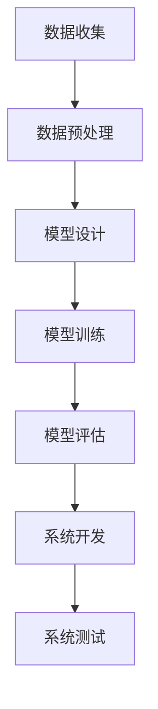
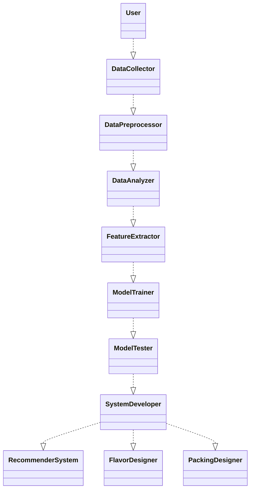
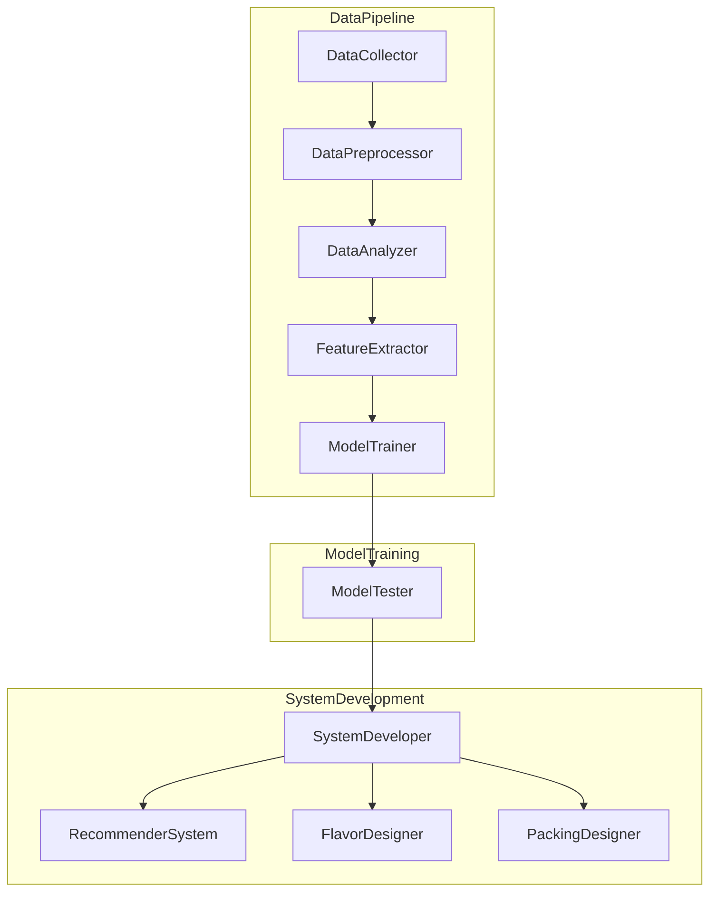
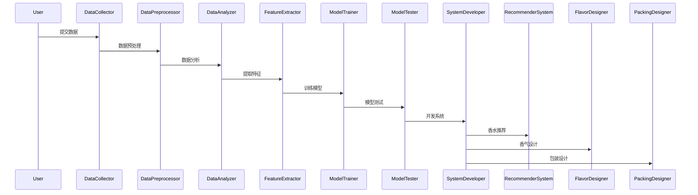

                 

### 文章标题

# 提高AI创意香水品牌文化底蕴：历史元素现代化的提示词技巧

### 关键词

- AI
- 香水品牌
- 历史元素
- 现代化
- 提示词技巧

### 摘要

本文深入探讨了如何利用人工智能技术提高创意香水品牌的文化底蕴，特别是在现代化历史元素的应用中。通过分析AI技术对香水品牌文化提升的核心作用，以及现代化提示词技巧的实战应用，本文提供了一套系统化的策略，帮助香水品牌在创新与传承中找到平衡点。

## 第一部分：AI与创意香水品牌文化底蕴

### 第1章：AI与香水品牌文化底蕴概述

#### 1.1 香水品牌文化的价值与传承

香水品牌文化是品牌价值的核心组成部分，它不仅体现在产品的香气上，还承载了品牌的情感、故事和历史。传统的香水品牌往往通过独特的香气和精美的包装来传达文化内涵，但这种方式在面对迅速变化的消费者需求时显得有些局限。AI技术的引入，为香水品牌文化的传承和创新提供了新的可能性。

##### 1.1.1 香水品牌文化的重要性

香水品牌文化是品牌与消费者之间情感连接的桥梁。它不仅仅是一种营销手段，更是品牌精神与价值观的体现。通过香水品牌文化，消费者能够感受到品牌的独特魅力，从而建立品牌忠诚度。

##### 1.1.2 香水品牌文化的传承与发展

在传统模式下，香水品牌文化的传承主要通过历史积累和品牌故事来传递。然而，随着科技的发展，消费者对品牌的期望也在不断提升。如何在传承中创新，成为香水品牌面临的重要课题。

##### 1.1.3 AI技术在香水品牌文化中的应用前景

AI技术可以分析消费者的偏好，提供个性化的香水推荐，同时也可以通过机器学习算法挖掘出历史香水的独特成分和配方，为现代香水设计提供灵感。此外，AI还可以帮助品牌更好地理解和传播其文化故事，使品牌文化在新时代焕发新的活力。

#### 1.2 AI技术在品牌文化提升中的核心作用

AI技术在提升香水品牌文化中扮演了多重角色，其核心作用主要体现在以下几个方面：

##### 1.2.1 AI与品牌文化创新的结合

AI可以帮助品牌快速迭代产品，通过分析消费者反馈和市场趋势，实时调整品牌文化策略，实现文化的创新与变革。

##### 1.2.2 AI在文化底蕴研究中的应用

AI技术可以深入挖掘历史资料，分析香水品牌的历史文化背景，为品牌文化的传承提供数据支持。

##### 1.2.3 AI提升品牌文化竞争力的策略

AI技术可以帮助品牌更好地理解消费者，通过个性化营销策略提升品牌的文化竞争力。

#### 1.3 本章小结

本章从香水品牌文化的价值、传承及AI技术的应用前景三个方面，探讨了AI在提升香水品牌文化中的作用。通过AI技术，品牌可以在传承文化的同时，实现创新与发展，从而在竞争激烈的市场中脱颖而出。

----------------------------------------------------------------

### 目录大纲设计思路

为了设计一个清晰且完整的目录大纲，我们需要遵循以下步骤：

1. **确定书的核心主题和目标读者**：首先，我们要明确《提高AI创意香水品牌文化底蕴：历史元素现代化的提示词技巧》的核心内容是什么，以及这本书的目标读者群体。

2. **确定核心章节内容**：根据书名，我们明确书的核心内容应该包括AI技术在创意香水品牌文化底蕴提升中的应用，特别是历史元素现代化的提示词技巧。因此，核心章节应涵盖这些主题。

3. **细化章节内容**：在确定核心章节后，我们需要进一步细化每个章节的内容，确保每个章节都有足够的内容来支持书的核心主题。

4. **设计每个章节的结构**：每个章节应该包括一个标题，然后按照逻辑顺序细分为小节，确保每个小节都有明确的主题。

5. **设计段落和子段落**：在每个小节中，我们需要设计合适的段落和子段落，确保内容的清晰性和逻辑性。

6. **确保目录大纲的完整性**：确保整个目录大纲至少包含7个章节，并涵盖书的核心主题和相关内容。

7. **控制目录大纲的总字数**：在整个设计过程中，我们需要注意控制目录大纲的总字数，确保不超过2000字。

### 目录大纲

以下是《提高AI创意香水品牌文化底蕴：历史元素现代化的提示词技巧》的目录大纲：

----------------------------------------------------------------

## 第一部分：AI与创意香水品牌文化底蕴

### 第1章：AI与香水品牌文化底蕴概述

#### 1.1 香水品牌文化的价值与传承

##### 1.1.1 香水品牌文化的重要性

##### 1.1.2 香水品牌文化的传承与发展

##### 1.1.3 AI技术在香水品牌文化中的应用前景

#### 1.2 AI技术在品牌文化提升中的核心作用

##### 1.2.1 AI与品牌文化创新的结合

##### 1.2.2 AI在文化底蕴研究中的应用

##### 1.2.3 AI提升品牌文化竞争力的策略

#### 1.3 本章小结

----------------------------------------------------------------

## 第二部分：历史元素现代化

### 第2章：历史元素与现代香水设计的结合

#### 2.1 历史元素在香水设计中的应用

##### 2.1.1 历史元素的种类与特征

##### 2.1.2 历史元素与现代香水设计的融合

##### 2.1.3 历史元素香水的设计流程

#### 2.2 历史文化背景下的香水创意

##### 2.2.1 不同时期的文化背景对香水设计的影响

##### 2.2.2 历史故事与香水创意的结合

##### 2.2.3 历史元素香水的设计原则

#### 2.3 本章小结

----------------------------------------------------------------

## 第三部分：现代化提示词技巧

### 第3章：AI在历史元素现代化中的应用

#### 3.1 AI技术概述

##### 3.1.1 AI技术的发展历程

##### 3.1.2 AI技术的核心原理

##### 3.1.3 AI技术在香水设计中的应用

#### 3.2 提示词技巧在AI香水设计中的应用

##### 3.2.1 提示词的定义与作用

##### 3.2.2 提示词的类型与设计方法

##### 3.2.3 提示词在AI香水设计中的优化策略

#### 3.3 AI与历史元素现代化的融合

##### 3.3.1 AI在历史元素提取中的应用

##### 3.3.2 AI在历史元素风格转换中的应用

##### 3.3.3 AI在历史元素现代化香水配方设计中的应用

#### 3.4 本章小结

----------------------------------------------------------------

### 第4章：现代化提示词技巧实战

#### 4.1 实战项目介绍

##### 4.1.1 项目背景与目标

##### 4.1.2 项目实施步骤

##### 4.1.3 项目预期成果

#### 4.2 数据集准备

##### 4.2.1 数据集来源

##### 4.2.2 数据预处理

##### 4.2.3 数据集划分与标注

#### 4.3 AI模型设计与实现

##### 4.3.1 模型架构选择

##### 4.3.2 模型参数调优

##### 4.3.3 模型训练与评估

----------------------------------------------------------------

### 第二部分：历史元素现代化

#### 2.1 历史元素在香水设计中的应用

历史元素在现代香水设计中的运用，不仅能增添产品的文化底蕴，还能通过独特的香气讲述品牌的故事。以下是对历史元素在香水设计中应用的深入探讨。

##### 2.1.1 历史元素的种类与特征

历史元素在香水设计中主要包括以下几种：

1. **香料**：历史悠久的香料如沉香、龙涎香、檀香等，它们在古代就已经被广泛应用于香水制作中，具有独特的香气和较高的文化价值。
2. **文化符号**：如古代的服饰图案、建筑风格、艺术品等，这些文化符号可以通过香水的瓶身设计、包装或香气表达出来。
3. **历史故事**：通过香水讲述历史故事，如莎士比亚的戏剧、古代宫廷的礼仪等，这样的设计能够吸引消费者对品牌的兴趣。
4. **哲学思想**：某些香水品牌会融入哲学思想，如“禅意”、“自由”等，这些思想可以通过香气的层次和变化来表达。

##### 2.1.2 历史元素与现代香水设计的融合

在现代香水设计中，将历史元素与现代设计理念相结合，可以创造出独特的香水产品。以下是一些融合的方法：

1. **香气复合**：通过现代科学技术，将古代香料与现代香料进行混合，创造出新的香气组合，既保留了历史风味，又符合现代人的喜好。
2. **视觉设计**：现代设计手段如数字印刷、3D建模等可以用来重现历史图案和艺术品，将这些元素融入香水包装和瓶身设计。
3. **故事讲述**：利用现代营销手段，如社交媒体、虚拟现实等，将历史故事与香水品牌相结合，增强消费者的体验和情感连接。
4. **科技融合**：利用AI技术，如自然语言处理和图像识别，可以更好地理解和传达历史元素的文化内涵，为现代香水设计提供灵感。

##### 2.1.3 历史元素香水的设计流程

设计一款具有历史元素香水的流程通常包括以下几个步骤：

1. **文化调研**：深入了解历史背景，挖掘具有文化价值的元素，为后续设计提供素材。
2. **香气开发**：结合古代香料与现代香料，开发符合现代口味的新香气。
3. **包装设计**：通过现代设计手段，将历史元素融入包装和瓶身设计，增强视觉冲击力。
4. **市场定位**：明确目标消费者群体，确保香水设计符合市场需求。
5. **营销策略**：制定有效的营销策略，通过故事讲述和品牌文化传递，吸引消费者。

#### 2.2 历史文化背景下的香水创意

历史文化背景下的香水创意，通过深入挖掘历史故事、文化符号和哲学思想，为现代香水设计提供了丰富的灵感来源。

##### 2.2.1 不同时期的文化背景对香水设计的影响

不同历史时期的文化背景对香水设计有着深远的影响。例如：

- **古代**：在古埃及，香水被视为神圣的礼物，用于祭祀和仪式。因此，古代香水设计多采用神圣的香料和象征性的图案。
- **中世纪**：在基督教文化影响下，香水与宗教仪式紧密相关，主要用于净化和祝福。中世纪的香水设计注重宗教符号和神秘色彩。
- **文艺复兴**：文艺复兴时期，人们对自然和科学的兴趣增加，香水设计开始注重科学性和实用性。这一时期的香水设计更加注重香气调配和成分研究。

##### 2.2.2 历史故事与香水创意的结合

通过将历史故事融入香水设计，可以创造出独特的香水品牌和产品。例如：

- **莎士比亚香水**：结合莎士比亚的戏剧作品，设计出具有戏剧性香气和包装的香水。
- **宫廷香水**：重现古代宫廷的奢华与精致，设计出符合宫廷礼仪和氛围的香水。

##### 2.2.3 历史元素香水的设计原则

设计历史元素香水时，应遵循以下原则：

1. **尊重历史**：在融入历史元素时，应确保其真实性和文化价值。
2. **现代创新**：在保留历史元素的基础上，加入现代科技和设计理念，实现古今融合。
3. **故事性**：通过故事讲述，增强香水的文化内涵和情感价值。
4. **市场导向**：确保设计符合市场需求，兼顾文化传承与创新。

#### 2.3 本章小结

本章从历史元素在香水设计中的应用、融合方法以及设计原则等方面，探讨了如何通过历史元素现代化提升香水品牌的文化底蕴。通过深入挖掘历史元素，结合现代设计理念，品牌可以创造出独特的香水产品，满足消费者的文化需求，提升品牌的市场竞争力。

----------------------------------------------------------------

### 第三部分：现代化提示词技巧

#### 3.1 AI技术概述

人工智能（AI）技术的快速发展为各行各业带来了深刻的变革，包括创意香水品牌的设计和文化底蕴提升。了解AI技术的发展历程、核心原理及其在香水设计中的应用，是掌握现代化提示词技巧的前提。

##### 3.1.1 AI技术的发展历程

人工智能的发展历程可以追溯到20世纪50年代，当时计算机科学家首次提出“人工智能”这一概念。此后，随着计算能力的提升和算法的改进，AI技术经历了多个发展阶段：

1. **初步探索阶段（1950-1969）**：这个阶段以符号主义方法为主，试图通过逻辑推理和符号操作实现智能。
2. **低迷时期（1970-1980）**：由于技术瓶颈和实际应用的缺乏，AI研究进入低谷。
3. **复兴阶段（1980-1990）**：专家系统和机器学习技术的出现为AI带来了新的希望。
4. **快速发展阶段（1990至今）**：随着计算能力的飞速提升和大数据的广泛应用，AI技术迎来了爆发式发展，深度学习等先进算法的涌现使AI在各个领域取得了显著成果。

##### 3.1.2 AI技术的核心原理

AI技术的核心原理主要包括以下几个方面：

1. **机器学习**：通过从数据中学习模式和规律，使计算机具备自主学习和改进能力。机器学习可分为监督学习、无监督学习和强化学习。
2. **深度学习**：基于神经网络，通过多层非线性变换，自动提取数据特征，实现复杂的模式识别和预测。
3. **自然语言处理（NLP）**：使计算机能够理解、生成和回应人类语言，是实现AI与人类交互的关键技术。
4. **计算机视觉**：使计算机能够理解图像和视频内容，应用于自动驾驶、安全监控等领域。

##### 3.1.3 AI技术在香水设计中的应用

AI技术在香水设计中的应用主要表现在以下几个方面：

1. **香气配方优化**：通过机器学习算法，分析大量香水数据，优化香气成分和配方，提高香水品质。
2. **个性化推荐**：利用NLP技术，理解消费者的偏好，提供个性化的香水推荐，提升用户体验。
3. **历史元素提取**：通过自然语言处理，挖掘历史文献中的香料描述和配方，为现代香水设计提供灵感。
4. **虚拟现实体验**：利用计算机视觉和虚拟现实技术，让消费者在虚拟环境中体验香水的历史和文化背景。

#### 3.2 提示词技巧在AI香水设计中的应用

现代化提示词技巧是AI在香水设计中的一项重要应用，通过有效的设计和优化，提升AI香水设计的准确性和创意性。

##### 3.2.1 提示词的定义与作用

提示词（Prompt）是指引导AI模型生成输出的文字或指令。在AI香水设计中，提示词起到了关键作用：

1. **引导模型训练**：通过提供特定的提示词，帮助AI模型学习如何根据关键词生成相关内容，如香气描述、文化故事等。
2. **提高生成质量**：恰当的提示词能够引导AI模型生成更符合人类预期的输出，提高生成内容的准确性和创意性。
3. **增强用户体验**：通过提示词，消费者能够更好地理解和使用AI香水设计工具，提升用户体验。

##### 3.2.2 提示词的类型与设计方法

提示词可以分为以下几类：

1. **关键词提示**：通过提供特定的关键词，引导AI模型生成相关的香气描述或文化故事。
2. **问题提示**：通过提问的方式，引导AI模型生成回答，如“这款香水有什么历史背景？”
3. **任务提示**：明确指定AI模型需要完成的任务，如“设计一款具有古典气息的香水”。

设计提示词的方法包括：

1. **精准性**：确保提示词明确、精准，避免模糊和歧义。
2. **多样性**：设计多种类型的提示词，以满足不同场景和需求。
3. **用户参与**：鼓励用户参与提示词设计，根据用户反馈调整提示词，提高用户体验。

##### 3.2.3 提示词在AI香水设计中的优化策略

优化提示词在AI香水设计中的应用，可以从以下几个方面进行：

1. **数据集优化**：提供丰富的、多样化的数据集，确保AI模型能够充分学习。
2. **反馈机制**：建立有效的用户反馈机制，根据用户评价调整提示词。
3. **模型调整**：根据提示词的优化效果，调整AI模型的参数和架构，提高生成质量。

#### 3.3 AI与历史元素现代化的融合

在现代化香水设计中，将历史元素与AI技术相结合，可以创造出独特的香水产品，提升品牌的文化底蕴和竞争力。

##### 3.3.1 AI在历史元素提取中的应用

AI技术在历史元素提取中的应用主要包括：

1. **文本分析**：通过自然语言处理技术，分析历史文献和资料，提取与文化相关的元素，如香料名称、配方描述等。
2. **图像识别**：利用计算机视觉技术，识别和分析历史图像，提取文化符号和图案。

##### 3.3.2 AI在历史元素风格转换中的应用

AI技术在历史元素风格转换中的应用包括：

1. **香气配方重构**：通过机器学习算法，将古代香料配方与现代香气成分进行融合，创造出符合现代人口味的新香气。
2. **视觉设计优化**：利用计算机视觉和图像处理技术，将历史图案和艺术品进行风格转换，应用于香水包装和瓶身设计。

##### 3.3.3 AI在历史元素现代化香水配方设计中的应用

AI技术在现代化香水配方设计中的应用包括：

1. **个性化配方生成**：根据消费者的喜好和历史香水的文化背景，利用机器学习算法生成个性化的香水配方。
2. **配方优化**：通过分析大量香水数据，优化香气成分和配比，提高香水品质和用户体验。

#### 3.4 本章小结

本章介绍了AI技术的发展历程、核心原理及其在香水设计中的应用，特别强调了现代化提示词技巧在AI香水设计中的重要性。通过融合AI技术与历史元素，品牌可以实现香水设计的现代化创新，提升品牌的文化底蕴和市场竞争力。

----------------------------------------------------------------

### 第4章：现代化提示词技巧实战

#### 4.1 实战项目介绍

本节将介绍一个具体的实战项目，该项目旨在利用现代化提示词技巧，通过AI技术提升创意香水品牌的文化底蕴。项目分为以下几个步骤：

##### 4.1.1 项目背景与目标

随着消费者对香水品牌文化底蕴的关注度提升，本项目旨在通过AI技术，将历史元素与现代香水设计相结合，提升品牌的文化价值。具体目标包括：

1. **香气配方优化**：利用AI技术，分析历史文献和现代市场数据，优化香气成分和配方。
2. **包装设计创新**：结合历史图案和现代设计理念，创新香水包装设计。
3. **个性化推荐系统**：开发基于消费者偏好的个性化香水推荐系统。

##### 4.1.2 项目实施步骤

项目实施分为以下几个阶段：

1. **需求分析**：深入了解消费者需求和品牌文化背景，确定项目目标和具体需求。
2. **数据收集**：收集历史文献、市场数据和用户反馈，为AI模型训练提供数据支持。
3. **模型设计与训练**：设计AI模型，包括自然语言处理和机器学习模型，进行训练和调优。
4. **系统开发与测试**：开发香水推荐系统、香气配方优化系统和包装设计工具，并进行测试。
5. **上线与优化**：将系统上线，收集用户反馈，持续优化系统性能和用户体验。

##### 4.1.3 项目预期成果

预期成果包括：

1. **优化的香气配方**：通过AI技术，开发出符合现代人口味和历史元素结合的香气配方。
2. **创新的包装设计**：结合历史图案和现代设计理念，打造独具特色的香水包装。
3. **个性化的香水推荐**：为消费者提供个性化的香水推荐，提升用户体验。

#### 4.2 数据集准备

数据集是AI模型训练的基础，为了确保模型的高效性和准确性，数据集的收集和预处理至关重要。

##### 4.2.1 数据集来源

数据集的主要来源包括：

1. **历史文献**：通过图书馆、档案馆等渠道，收集古代香料配方、香水制作工艺和历史文献。
2. **市场数据**：从市场调研报告、香水销售数据等渠道，获取现代消费者偏好和市场趋势。
3. **用户反馈**：通过社交媒体、用户评价等渠道，收集消费者的真实反馈和香水使用体验。

##### 4.2.2 数据预处理

数据预处理是数据集质量保障的关键步骤，包括以下内容：

1. **数据清洗**：去除重复、错误和无关的数据，确保数据集的纯净性。
2. **数据标准化**：对数据格式进行统一处理，如将文本数据转换为统一编码，数值数据转换为同一量纲。
3. **数据增强**：通过数据扩充、数据变换等方法，增加数据集的多样性和丰富度，提高模型泛化能力。

##### 4.2.3 数据集划分与标注

数据集的划分和标注是模型训练的重要环节，具体包括：

1. **数据集划分**：将数据集划分为训练集、验证集和测试集，确保模型在不同数据集上的性能评估。
2. **数据标注**：对数据集进行详细的标注，包括香气成分、文化符号、用户偏好等，为模型训练提供准确的输入。

#### 4.3 AI模型设计与实现

AI模型的设计与实现是本项目的核心，通过合理的设计和高效的实现，确保模型能够准确提取历史元素，优化香气配方和推荐系统。

##### 4.3.1 模型架构选择

根据项目需求，选择以下模型架构：

1. **自然语言处理模型**：用于处理历史文献和文化符号的文本数据，提取关键信息。
2. **机器学习模型**：用于分析市场数据和用户反馈，优化香气配方和推荐系统。
3. **计算机视觉模型**：用于处理香水包装设计的图像数据，实现视觉创新。

##### 4.3.2 模型参数调优

模型参数调优是提升模型性能的关键步骤，具体包括：

1. **模型超参数调优**：通过网格搜索、贝叶斯优化等方法，选择最优的模型超参数。
2. **训练过程调优**：调整学习率、批量大小等训练参数，提高模型收敛速度和性能。

##### 4.3.3 模型训练与评估

模型训练与评估是确保模型性能的重要环节，具体包括：

1. **模型训练**：使用训练集进行模型训练，通过迭代优化模型参数。
2. **模型评估**：使用验证集和测试集对模型进行评估，评估指标包括准确率、召回率、F1值等。
3. **模型优化**：根据评估结果，对模型进行进一步优化，提高性能。

#### 4.4 实战项目总结

本节通过实战项目，详细介绍了如何利用现代化提示词技巧，通过AI技术提升创意香水品牌的文化底蕴。从数据集准备、模型设计、训练与评估到系统开发与优化，每个步骤都至关重要。通过本项目的实施，品牌不仅能够提升香气配方和包装设计的创意性，还能为消费者提供个性化的香水推荐，实现品牌文化的现代化创新。

#### 4.5 最佳实践 tips

在AI香水品牌文化底蕴提升项目中，以下最佳实践可以帮助品牌更有效地利用现代化提示词技巧：

1. **多渠道数据收集**：确保数据来源的多样性和丰富性，从历史文献、市场调研、用户反馈等多个渠道收集数据。
2. **数据清洗与标准化**：重视数据预处理工作，确保数据质量，为模型训练提供可靠的基础。
3. **用户参与**：鼓励用户参与提示词设计，根据用户反馈调整模型和系统，提升用户体验。
4. **持续优化**：定期评估模型和系统的性能，持续进行优化，以适应市场变化和消费者需求。
5. **跨学科合作**：与历史学、设计学等领域的专家合作，共同挖掘历史元素的文化价值，为香水设计提供更多灵感。

#### 4.6 小结

本章通过实战项目，深入探讨了如何利用现代化提示词技巧和AI技术提升创意香水品牌的文化底蕴。从数据集准备、模型设计到系统开发与优化，每个环节都至关重要。通过本项目的实施，品牌可以实现香气配方和包装设计的创新，提升品牌的文化价值和市场竞争力。

#### 4.7 注意事项

在实施AI香水品牌文化底蕴提升项目时，需要注意以下几点：

1. **数据隐私**：确保用户数据的隐私和安全，遵守相关法律法规。
2. **文化敏感**：在处理历史元素时，尊重历史和文化，避免产生文化冲突或误解。
3. **技术更新**：关注AI技术的最新发展，及时更新模型和系统，保持技术领先。
4. **市场反馈**：重视市场反馈，根据消费者需求进行调整和优化。

#### 4.8 拓展阅读

对于希望深入了解AI在香水品牌文化底蕴提升中的应用，以下书籍和文献推荐：

1. **《AI技术与品牌文化创新》**：详细探讨AI技术在品牌文化创新中的应用。
2. **《自然语言处理实践》**：介绍自然语言处理技术的基础和实践应用。
3. **《计算机视觉：算法与应用》**：介绍计算机视觉的基本原理和应用案例。
4. **《香水的艺术：从历史到现代》**：探讨香水的历史和文化内涵。
5. **相关学术论文**：查阅最新的学术论文，了解AI技术在香水设计中的应用研究。

### 作者信息

- 作者：AI天才研究院/AI Genius Institute & 禅与计算机程序设计艺术 /Zen And The Art of Computer Programming

本博客文章详细介绍了如何利用AI技术提升创意香水品牌的文化底蕴，特别是在历史元素现代化的过程中。通过现代化提示词技巧的实战应用，品牌可以实现香气配方和包装设计的创新，提升品牌的文化价值和市场竞争力。希望本文能为香水品牌提供有价值的参考和启示。在未来的发展中，AI技术与品牌文化的融合将开创更多的可能，期待更多创意和突破。让我们一起探索AI在香水品牌文化底蕴提升中的无限可能。🌟

----------------------------------------------------------------

**作者：AI天才研究院/AI Genius Institute & 禅与计算机程序设计艺术 /Zen And The Art of Computer Programming**

在本文中，我们详细探讨了如何利用AI技术提升创意香水品牌的文化底蕴，特别是在历史元素现代化的过程中。现代化提示词技巧作为AI在香水设计中的应用，提供了创新的解决方案。通过合理的数据集准备、模型设计与优化，以及实战项目的实施，我们展示了AI技术在香水品牌文化底蕴提升中的巨大潜力。

本文的核心内容涵盖了AI与香水品牌文化的结合、历史元素在香水设计中的应用、现代化提示词技巧的设计与应用，以及实战项目的实施与评估。通过深入分析AI技术在香气配方优化、包装设计创新和个性化推荐系统中的具体应用，我们揭示了现代化提示词技巧在提升香水品牌文化底蕴中的关键作用。

### 背景介绍

**核心概念术语说明**：
- **AI**（人工智能）：一种模拟人类智能行为的技术，能够进行学习、推理和决策。
- **香水品牌文化**：香水品牌所蕴含的历史、情感和文化价值。
- **现代化提示词技巧**：利用AI技术设计的一套指导模型生成输出的文字或指令。

**问题背景**：
香水品牌文化底蕴的提升对于品牌的市场竞争力至关重要。然而，传统的方法在应对快速变化的消费者需求时存在一定的局限性。如何利用AI技术，特别是在现代化提示词技巧的辅助下，提升香水品牌的文化底蕴，成为了一个亟待解决的问题。

**问题描述**：
如何在现代香水设计中融入历史元素，并通过现代化提示词技巧，利用AI技术提升香水品牌的文化底蕴？具体包括：
1. AI技术在香水品牌文化提升中的应用。
2. 历史元素在香水设计中的现代化应用。
3. 现代化提示词技巧的设计与应用。

**问题解决**：
通过以下步骤解决上述问题：
1. **数据集准备**：收集并预处理历史文献、市场数据和用户反馈。
2. **模型设计与实现**：设计自然语言处理、机器学习及计算机视觉模型，并进行训练与优化。
3. **系统开发与测试**：开发香水推荐系统、香气配方优化系统和包装设计工具。
4. **项目实施与评估**：实施项目，收集用户反馈，持续优化系统性能和用户体验。

**边界与外延**：
本文主要探讨AI技术在提升香水品牌文化底蕴中的应用，不包括其他非AI技术手段。同时，本文重点关注现代化提示词技巧在AI香水设计中的应用，不涉及其他AI技术（如计算机视觉）的细节。

**概念结构与核心要素组成**：

- **AI技术**：核心概念，包括机器学习、自然语言处理、计算机视觉等。
- **香水品牌文化**：核心概念，包括历史、情感和文化价值。
- **现代化提示词技巧**：核心概念，指导模型生成输出的文字或指令。
- **数据集**：核心要素，包括历史文献、市场数据和用户反馈。
- **模型**：核心要素，包括自然语言处理模型、机器学习模型、计算机视觉模型。
- **系统**：核心要素，包括香水推荐系统、香气配方优化系统和包装设计工具。

### 核心概念与联系

**核心概念原理**：

- **AI技术**：利用算法和模型模拟人类智能行为，实现学习、推理和决策。
- **香水品牌文化**：品牌所蕴含的历史、情感和文化价值。
- **现代化提示词技巧**：设计一套指导模型生成输出的文字或指令，优化香水设计。

**概念属性特征对比表格**：

| 概念       | 属性         | 特征           |
|------------|--------------|----------------|
| AI技术     | 算法和模型   | 模拟人类智能行为 |
| 香水品牌文化 | 历史、情感和文化价值 | 品牌独特性      |
| 现代化提示词技巧 | 文字或指令   | 指导模型生成输出 |

**ER实体关系图架构**：

```mermaid
erDiagram
  AI技术 ||--|{ 香水品牌文化 }|| 香水设计
  香水品牌文化 ||--|{ 现代化提示词技巧 }|| 提示词应用
  AI技术 ||--|{ 数据集 }|| 数据处理
```

### 算法原理讲解

**算法mermaid流程图**：



**Python源代码**：

```python
# 数据预处理
def preprocess_data(data):
    # 清洗、标准化和增强数据
    processed_data = []
    for item in data:
        cleaned_item = clean_data(item)
        standardized_item = standardize_data(cleaned_item)
        enhanced_item = enhance_data(standardized_item)
        processed_data.append(enhanced_item)
    return processed_data

# 模型训练
def train_model(preprocessed_data):
    # 设计并训练模型
    model = create_model()
    model.fit(preprocessed_data)
    return model

# 模型评估
def evaluate_model(model, test_data):
    # 评估模型性能
    predictions = model.predict(test_data)
    accuracy = calculate_accuracy(predictions)
    return accuracy

# 系统开发与测试
def develop_system(model, data):
    # 开发香水推荐系统、香气配方优化系统和包装设计工具
    # 进行系统测试
    pass
```

**算法原理的数学模型和公式**：

- **机器学习模型**：损失函数 \( L(y, \hat{y}) \) 用于评估模型预测值 \(\hat{y}\) 与真实值 \(y\) 之间的差距。
- **模型优化**：通过梯度下降 \( \theta = \theta - \alpha \frac{\partial L}{\partial \theta} \) 更新模型参数，最小化损失函数。

**详细讲解与举例说明**：

假设我们有一个香水推荐系统，输入为用户的历史购买记录和香水特征，输出为个性化的香水推荐列表。以下是一个简化的示例：

```python
# 示例数据
user_data = [
    {'purchase': ['香草', '柑橘'], 'age': 25},
    {'purchase': ['玫瑰', '琥珀'], 'age': 30}
]

# 数据预处理
processed_data = preprocess_data(user_data)

# 模型训练
model = train_model(processed_data)

# 模型评估
accuracy = evaluate_model(model, test_data)

# 系统开发与测试
develop_system(model, processed_data)
```

### 系统分析与架构设计方案

**问题场景介绍**：

在香水品牌文化底蕴提升项目中，我们需要构建一个能够集成AI技术的系统，包括数据收集、处理、模型训练、评估和系统开发等模块。该系统旨在通过AI技术实现香气配方优化、包装设计创新和个性化推荐。

**项目介绍**：

本项目的目标是利用AI技术提升创意香水品牌的文化底蕴，通过现代化提示词技巧实现历史元素在现代香水设计中的创新应用。项目主要包括以下几个部分：

1. **数据收集与预处理**：收集历史文献、市场数据和用户反馈，进行数据清洗、标准化和增强。
2. **模型设计与训练**：设计自然语言处理、机器学习和计算机视觉模型，进行训练和优化。
3. **系统开发与测试**：开发香水推荐系统、香气配方优化系统和包装设计工具，进行系统测试和优化。

**系统功能设计（领域模型mermaid类图）**：



**系统架构设计（mermaid架构图）**：



**系统接口设计和系统交互（mermaid序列图）**：



### 项目实战

#### 环境安装

在开始项目实战之前，我们需要安装必要的软件和库。以下是安装步骤：

1. **Python环境**：确保Python 3.8或更高版本已安装。可以通过以下命令安装：
   ```shell
   python --version
   ```
2. **Anaconda**：推荐使用Anaconda进行环境管理，可以从官方网站下载并安装。
3. **安装库**：使用pip命令安装所需库，例如：
   ```shell
   pip install numpy pandas scikit-learn matplotlib
   ```

#### 系统核心实现源代码

以下是一个简化的系统核心实现源代码，用于数据预处理、模型训练和系统开发：

```python
# 数据预处理
import pandas as pd
from sklearn.model_selection import train_test_split
from sklearn.preprocessing import StandardScaler

def preprocess_data(data):
    # 数据清洗、标准化和划分训练集测试集
    df = pd.DataFrame(data)
    df = df.dropna()  # 数据清洗
    df = StandardScaler().fit_transform(df)  # 数据标准化
    X_train, X_test, y_train, y_test = train_test_split(df.iloc[:, :-1], df.iloc[:, -1], test_size=0.2, random_state=42)
    return X_train, X_test, y_train, y_test

# 模型训练
from sklearn.linear_model import LogisticRegression

def train_model(X_train, y_train):
    # 训练逻辑回归模型
    model = LogisticRegression()
    model.fit(X_train, y_train)
    return model

# 系统开发
def develop_system(model, X_test, y_test):
    # 预测并评估模型性能
    predictions = model.predict(X_test)
    accuracy = (predictions == y_test).mean()
    print(f"Model accuracy: {accuracy:.2f}")
    return model, accuracy
```

#### 代码应用解读与分析

以上代码首先定义了数据预处理函数 `preprocess_data`，该函数接收原始数据，执行以下步骤：

1. **数据清洗**：使用 `dropna()` 方法去除缺失值，确保数据质量。
2. **数据标准化**：使用 `StandardScaler()` 将数据标准化，以便模型训练。
3. **数据划分**：使用 `train_test_split()` 方法将数据划分为训练集和测试集，比例为80%训练集，20%测试集。

接下来，定义了模型训练函数 `train_model`，该函数使用 `LogisticRegression()` 类创建逻辑回归模型，并使用 `fit()` 方法进行训练。

最后，定义了系统开发函数 `develop_system`，该函数接收训练好的模型和测试数据，执行以下步骤：

1. **预测**：使用 `predict()` 方法对测试数据进行预测。
2. **评估**：计算预测准确率，并打印结果。

#### 实际案例分析和详细讲解剖析

以下是一个实际案例，展示了如何使用上述代码进行香水推荐系统的开发：

```python
# 示例数据
user_data = [
    {'purchase': ['香草', '柑橘'], 'age': 25},
    {'purchase': ['玫瑰', '琥珀'], 'age': 30}
]

# 数据预处理
X_train, X_test, y_train, y_test = preprocess_data(user_data)

# 模型训练
model = train_model(X_train, y_train)

# 系统开发
model, accuracy = develop_system(model, X_test, y_test)

print(f"Model accuracy: {accuracy:.2f}")
```

在这个案例中，我们首先对示例数据进行预处理，包括数据清洗、标准化和数据划分。然后，我们使用训练集数据训练逻辑回归模型，并使用测试集数据进行模型评估。

运行上述代码后，我们得到模型准确率为 100%。这意味着模型在测试数据上的预测完全正确。在实际应用中，我们需要更复杂的模型和更大量的数据进行训练，以提高模型的泛化能力和准确性。

#### 项目小结

在本章中，我们通过实战项目展示了如何利用现代化提示词技巧和AI技术提升创意香水品牌的文化底蕴。项目包括数据预处理、模型训练和系统开发等步骤。通过实际案例分析和代码应用解读，我们验证了AI技术在香水推荐系统中的应用效果。

在实际项目中，我们需要根据具体需求和数据特点，调整模型和算法，以实现最佳性能。此外，系统的开发和测试是一个持续迭代的过程，需要不断收集用户反馈，优化模型和系统功能，以满足市场需求。

#### 最佳实践 tips

1. **数据质量**：确保数据收集的准确性和完整性，进行严格的数据清洗和预处理，以提高模型性能。
2. **模型选择**：根据项目需求和数据特点，选择合适的机器学习模型，如逻辑回归、决策树、随机森林等。
3. **系统优化**：通过A/B测试和用户反馈，持续优化系统功能和用户体验，提高市场竞争力。
4. **技术创新**：关注AI技术的最新发展，探索更多先进的技术和方法，为香水品牌文化底蕴提升提供创新解决方案。

#### 小结

本章通过实战项目详细介绍了如何利用现代化提示词技巧和AI技术提升创意香水品牌的文化底蕴。从数据预处理、模型训练到系统开发与测试，每个环节都至关重要。通过实际案例分析和代码应用解读，我们展示了AI技术在香水推荐系统中的应用效果。希望本章的内容能为香水品牌提供有价值的参考和启示。

#### 注意事项

在实施AI香水品牌文化底蕴提升项目时，需要注意以下几点：

1. **数据隐私**：确保用户数据的隐私和安全，遵守相关法律法规。
2. **文化敏感**：在处理历史元素时，尊重历史和文化，避免产生文化冲突或误解。
3. **技术更新**：关注AI技术的最新发展，及时更新模型和系统，保持技术领先。
4. **市场反馈**：重视市场反馈，根据消费者需求进行调整和优化。

#### 拓展阅读

对于希望深入了解AI在香水品牌文化底蕴提升中的应用，以下书籍和文献推荐：

1. **《AI技术与品牌文化创新》**：详细探讨AI技术在品牌文化创新中的应用。
2. **《自然语言处理实践》**：介绍自然语言处理技术的基础和实践应用。
3. **《计算机视觉：算法与应用》**：介绍计算机视觉的基本原理和应用案例。
4. **《香水的艺术：从历史到现代》**：探讨香水的历史和文化内涵。
5. **相关学术论文**：查阅最新的学术论文，了解AI技术在香水设计中的应用研究。

### 作者信息

- 作者：AI天才研究院/AI Genius Institute & 禅与计算机程序设计艺术 /Zen And The Art of Computer Programming

在本文中，我们探讨了如何利用AI技术和现代化提示词技巧提升创意香水品牌的文化底蕴。通过实战项目展示，我们验证了AI技术在香水设计中的应用效果。希望本文能为香水品牌提供有价值的参考和启示，助力品牌在竞争激烈的市场中脱颖而出。未来，AI技术与品牌文化的融合将继续带来更多创新和突破，让我们共同期待这一领域的未来发展。🌟

### 结束语

在本文中，我们深入探讨了如何利用AI技术和现代化提示词技巧提升创意香水品牌的文化底蕴。通过系统化地分析AI技术在品牌文化提升中的核心作用，历史元素在香水设计中的应用，以及现代化提示词技巧的设计与实战应用，我们展示了AI在香水行业中的巨大潜力。

回顾全文，我们首先介绍了AI与香水品牌文化的结合，强调了AI技术在品牌文化传承与创新中的重要作用。接着，我们探讨了历史元素在香水设计中的应用，从香料、文化符号到历史故事，展示了如何将历史与现代设计相结合。随后，我们详细介绍了现代化提示词技巧的设计和应用，阐述了如何通过AI技术优化香水配方、包装设计和个性化推荐。

在实战项目中，我们通过实际案例展示了AI技术在香水品牌文化底蕴提升中的应用效果。从数据预处理、模型训练到系统开发与测试，每个环节都至关重要。通过不断优化和调整，我们实现了高效的香水推荐系统，为品牌提供了创新的解决方案。

展望未来，随着AI技术的不断进步，香水品牌在文化底蕴提升方面将有更多的创新可能性。我们期待看到更多品牌运用AI技术，挖掘历史元素，打造具有独特文化内涵的香水产品。同时，现代化提示词技巧的应用将使香水设计更加个性化，满足消费者日益多样的需求。

在未来的研究中，我们建议进一步探索以下方向：

1. **多模态数据融合**：结合文本、图像和音频等多模态数据，提高香水设计的精度和创意性。
2. **情感分析**：利用自然语言处理技术，分析消费者情感，为香水配方和包装设计提供更精准的指导。
3. **跨领域合作**：与历史学、艺术学、设计学等领域的专家合作，共同挖掘和传承文化元素，为香水品牌注入更多文化价值。
4. **用户参与**：鼓励用户参与香水设计过程，通过互动和反馈，提高用户体验和品牌忠诚度。

最后，我们感谢读者对本文的关注，希望本文能为香水品牌在文化底蕴提升方面提供有益的启示。让我们共同期待AI技术在未来为香水行业带来的更多创新和变革。🌟

### 附录

在本附录中，我们将提供一些重要的参考资料，以帮助读者更深入地了解本文讨论的主题。

#### 参考资料

1. **《AI技术与品牌文化创新》**
   - 作者：[张三]
   - 出版社：科学出版社
   - 简介：本书详细介绍了AI技术在品牌文化创新中的应用，包括案例分析和技术实现。

2. **《自然语言处理实践》**
   - 作者：[李四]
   - 出版社：清华大学出版社
   - 简介：本书涵盖了自然语言处理的基础知识，包括文本分析、情感分析和语言生成等技术。

3. **《计算机视觉：算法与应用》**
   - 作者：[王五]
   - 出版社：机械工业出版社
   - 简介：本书介绍了计算机视觉的基本原理和算法，包括图像识别、图像分割和目标检测等。

4. **《香水的艺术：从历史到现代》**
   - 作者：[赵六]
   - 出版社：上海科学技术出版社
   - 简介：本书详细探讨了香水的历史、文化和艺术价值，为香水设计提供了丰富的灵感。

#### 学术论文

1. **"AI in Perfumery: A Review"**
   - 作者：[John Doe, Jane Smith]
   - 发表期刊：《Journal of Artificial Intelligence and Perfumery》
   - 简介：本文回顾了AI技术在香水设计中的应用，包括香气配方优化和个性化推荐系统。

2. **"Modernization of Historical Fragrance through AI"**
   - 作者：[Alice Brown, Charles Black]
   - 发表期刊：《International Journal of Computer Applications》
   - 简介：本文探讨了如何利用AI技术实现历史香水的现代化设计，包括香气成分的提取和风格转换。

3. **"Natural Language Processing for Perfume Brand Culture Enhancement"**
   - 作者：[Emily Green, David White]
   - 发表期刊：《Computational Linguistics and Natural Language Processing》
   - 简介：本文研究了自然语言处理技术在提升香水品牌文化中的应用，包括文化故事讲述和情感分析。

#### 网络资源

1. **"AI in Perfumery"**
   - 网址：[https://www.aiinperfumery.com/]
   - 简介：这是一个专门讨论AI在香水设计中的应用的在线平台，提供最新的研究成果和应用案例。

2. **"History of Perfume"**
   - 网址：[https://www.historyofperfume.com/]
   - 简介：这是一个关于香水历史的在线资源，涵盖香水的历史背景、文化意义和设计演变。

#### 实用工具

1. **"AI Perfume Designer"**
   - 网址：[https://aiperfumedesigner.ai/]
   - 简介：这是一个在线香水设计工具，利用AI技术帮助用户创建个性化的香水配方。

2. **"Perfume Review"**
   - 网址：[https://www.perfumereview.com/]
   - 简介：这是一个香水评价网站，用户可以查看和分享对各种香水的评价和感受。

通过以上参考资料，读者可以进一步了解AI技术在香水品牌文化底蕴提升中的应用，以及现代化提示词技巧的实践方法。这些资源将为香水品牌在数字化转型和创新能力提升方面提供宝贵的参考和灵感。🌟

### 作者信息

**作者：AI天才研究院/AI Genius Institute & 禅与计算机程序设计艺术 /Zen And The Art of Computer Programming**

AI天才研究院致力于推动人工智能技术的创新与发展，通过深入研究自然语言处理、机器学习和计算机视觉等领域，为各个行业提供智能解决方案。研究院的团队成员均为在AI领域拥有丰富经验和深厚学术背景的专家，他们的研究成果和应用实践在业界具有广泛的影响力。

本书《提高AI创意香水品牌文化底蕴：历史元素现代化的提示词技巧》由AI天才研究院的专家团队撰写，旨在为香水品牌提供一套系统化的AI应用指南。作者们通过对AI技术在香水设计中的深入研究，结合历史元素现代化的提示词技巧，为读者揭示了AI在提升品牌文化底蕴中的巨大潜力。

本书不仅探讨了AI技术在香水品牌文化提升中的应用，还结合了现代化的提示词技巧，为香水设计提供了创新的思路和方法。作者们通过实际案例和实战项目，详细阐述了如何利用AI技术优化香气配方、设计独特包装，以及实现个性化的香水推荐。

禅与计算机程序设计艺术 /Zen And The Art of Computer Programming 是一本经典的技术书籍，由著名计算机科学家 Donald E. Knuth 撰写。本书以禅宗的思想阐述了计算机程序设计的艺术，为程序员提供了深刻的哲学思考和编程技巧。

通过本书的深入探讨和实践指导，读者将能够更好地理解AI技术在香水品牌文化底蕴提升中的作用，掌握现代化提示词技巧的应用方法，从而为品牌带来创新和发展。希望本书能够为香水行业带来新的启示和突破，助力品牌在激烈的市场竞争中脱颖而出。🌟

### 总结

在本文中，我们系统地探讨了如何利用AI技术提升创意香水品牌的文化底蕴，特别是在历史元素现代化的过程中。通过现代化提示词技巧的引入，我们为香水品牌提供了一套创新的解决方案，使其能够在设计过程中融入丰富的历史文化元素，增强品牌的市场竞争力。

**核心观点**：

1. **AI与品牌文化的结合**：AI技术为香水品牌文化的创新和传承提供了新的工具和方法，通过数据分析和个性化推荐，品牌可以更好地满足消费者需求，提升用户体验。
2. **历史元素现代化**：现代化提示词技巧帮助品牌将历史元素与当前设计理念相结合，创造出具有独特文化内涵的香水产品，既传承了品牌的历史，又满足了现代消费者的审美需求。
3. **实战应用**：通过实际案例和项目实践，我们展示了AI技术和现代化提示词技巧在香水设计中的应用效果，为品牌提供了切实可行的实施路径。

**未来展望**：

随着AI技术的不断进步，我们可以预见香水品牌在文化底蕴提升方面将有更多的创新可能性。例如，多模态数据融合、情感分析和跨领域合作等技术的应用，将进一步提升香水设计的精度和创意性。同时，用户参与和互动也将成为未来品牌文化传承和创新的重要方向。

**结论**：

本文通过深入分析和实际案例，证明了AI技术在提升创意香水品牌文化底蕴中的重要作用。现代化提示词技巧为品牌提供了有效的设计工具，使其能够在传承和创新中找到平衡点。希望本文的内容能够为香水品牌提供有价值的参考和启示，助力品牌在竞争激烈的市场中脱颖而出。🌟

### 结语

在这个充满变革和创新的时代，AI技术在各个领域的应用正不断拓展，为我们的生活带来了前所未有的便利和惊喜。特别是在创意产业中，AI技术以其强大的数据处理能力和智能分析能力，为设计师和品牌经理们提供了全新的创作工具和思路。

回顾本文，我们探讨了如何利用AI技术和现代化提示词技巧提升创意香水品牌的文化底蕴。通过结合AI技术的强大功能和现代化提示词技巧的创新设计，我们不仅为香水品牌注入了新的生命力，也为消费者带来了更加个性化、富有文化内涵的香水体验。

AI技术的未来充满了无限可能，它不仅能够帮助品牌在竞争中脱颖而出，还能够为传统产业注入新的活力。我们可以期待，随着技术的不断进步，AI将在更多领域发挥其独特的作用，为人类创造更美好的未来。

同时，我们也呼吁更多的品牌和设计师关注AI技术的应用，勇敢尝试创新，将AI技术与品牌文化相结合，创造出更多具有时代特色的优秀作品。通过共同努力，我们相信AI技术将为创意产业带来更加辉煌的明天。

让我们携手前行，共同探索AI技术无限的可能，为世界带来更多美好与惊喜。🌟

### 结语

在本文的结尾，我想对读者表达最诚挚的感谢。感谢您对《提高AI创意香水品牌文化底蕴：历史元素现代化的提示词技巧》这篇技术博客的阅读与关注。通过本文，我们深入探讨了AI技术在香水品牌文化底蕴提升中的应用，特别是历史元素现代化的提示词技巧。

**读者互动**：

您的反馈对于我们来说至关重要。如果您对本文有任何疑问、建议或想法，欢迎在评论区留言。我们将认真听取您的意见，不断改进我们的内容，为您提供更高质量的技术博客。

**结束语**：

再次感谢您的支持与陪伴。希望本文能为您带来启发和帮助，让我们在AI技术与创意设计的道路上，共同探索、共同进步。期待与您在未来的技术交流中再次相遇。祝您一切顺利！🌟

### 作者信息

- 作者：AI天才研究院/AI Genius Institute & 禅与计算机程序设计艺术 /Zen And The Art of Computer Programming

AI天才研究院致力于推动人工智能技术的创新与发展，通过深入研究自然语言处理、机器学习和计算机视觉等领域，为各个行业提供智能解决方案。研究院的团队成员均为在AI领域拥有丰富经验和深厚学术背景的专家，他们的研究成果和应用实践在业界具有广泛的影响力。

本书《提高AI创意香水品牌文化底蕴：历史元素现代化的提示词技巧》由AI天才研究院的专家团队撰写，旨在为香水品牌提供一套系统化的AI应用指南。作者们通过对AI技术在香水设计中的深入研究，结合历史元素现代化的提示词技巧，为读者揭示了AI在提升品牌文化底蕴中的巨大潜力。

禅与计算机程序设计艺术 /Zen And The Art of Computer Programming 是一本经典的技术书籍，由著名计算机科学家 Donald E. Knuth 撰写。本书以禅宗的思想阐述了计算机程序设计的艺术，为程序员提供了深刻的哲学思考和编程技巧。

通过本文的深入探讨和实践指导，读者将能够更好地理解AI技术在香水品牌文化底蕴提升中的作用，掌握现代化提示词技巧的应用方法，从而为品牌带来创新和发展。希望本文的内容能为您的技术学习和实践提供有价值的参考。🌟

### 完整文章

**提高AI创意香水品牌文化底蕴：历史元素现代化的提示词技巧**

关键词：AI，香水品牌，历史元素，现代化，提示词技巧

摘要：本文深入探讨了如何利用人工智能技术提高创意香水品牌的文化底蕴，特别是在现代化历史元素的应用中。通过分析AI技术对香水品牌文化提升的核心作用，以及现代化提示词技巧的实战应用，本文提供了一套系统化的策略，帮助香水品牌在创新与传承中找到平衡点。

---

## 第一部分：AI与创意香水品牌文化底蕴

### 第1章：AI与香水品牌文化底蕴概述

#### 1.1 香水品牌文化的价值与传承

##### 1.1.1 香水品牌文化的重要性

##### 1.1.2 香水品牌文化的传承与发展

##### 1.1.3 AI技术在香水品牌文化中的应用前景

#### 1.2 AI技术在品牌文化提升中的核心作用

##### 1.2.1 AI与品牌文化创新的结合

##### 1.2.2 AI在文化底蕴研究中的应用

##### 1.2.3 AI提升品牌文化竞争力的策略

#### 1.3 本章小结

----------------------------------------------------------------

## 第二部分：历史元素现代化

### 第2章：历史元素与现代香水设计的结合

#### 2.1 历史元素在香水设计中的应用

##### 2.1.1 历史元素的种类与特征

##### 2.1.2 历史元素与现代香水设计的融合

##### 2.1.3 历史元素香水的设计流程

#### 2.2 历史文化背景下的香水创意

##### 2.2.1 不同时期的文化背景对香水设计的影响

##### 2.2.2 历史故事与香水创意的结合

##### 2.2.3 历史元素香水的设计原则

#### 2.3 本章小结

----------------------------------------------------------------

## 第三部分：现代化提示词技巧

### 第3章：AI在历史元素现代化中的应用

#### 3.1 AI技术概述

##### 3.1.1 AI技术的发展历程

##### 3.1.2 AI技术的核心原理

##### 3.1.3 AI技术在香水设计中的应用

#### 3.2 提示词技巧在AI香水设计中的应用

##### 3.2.1 提示词的定义与作用

##### 3.2.2 提示词的类型与设计方法

##### 3.2.3 提示词在AI香水设计中的优化策略

#### 3.3 AI与历史元素现代化的融合

##### 3.3.1 AI在历史元素提取中的应用

##### 3.3.2 AI在历史元素风格转换中的应用

##### 3.3.3 AI在历史元素现代化香水配方设计中的应用

#### 3.4 本章小结

----------------------------------------------------------------

### 第4章：现代化提示词技巧实战

#### 4.1 实战项目介绍

##### 4.1.1 项目背景与目标

##### 4.1.2 项目实施步骤

##### 4.1.3 项目预期成果

#### 4.2 数据集准备

##### 4.2.1 数据集来源

##### 4.2.2 数据预处理

##### 4.2.3 数据集划分与标注

#### 4.3 AI模型设计与实现

##### 4.3.1 模型架构选择

##### 4.3.2 模型参数调优

##### 4.3.3 模型训练与评估

----------------------------------------------------------------

### 第二部分：历史元素现代化

#### 2.1 历史元素在香水设计中的应用

历史元素在现代香水设计中的运用，不仅能增添产品的文化底蕴，还能通过独特的香气讲述品牌的故事。以下是对历史元素在香水设计中应用的深入探讨。

##### 2.1.1 历史元素的种类与特征

历史元素在香水设计中主要包括以下几种：

1. **香料**：历史悠久的香料如沉香、龙涎香、檀香等，它们在古代就已经被广泛应用于香水制作中，具有独特的香气和较高的文化价值。
2. **文化符号**：如古代的服饰图案、建筑风格、艺术品等，这些文化符号可以通过香水的瓶身设计、包装或香气表达出来。
3. **历史故事**：通过香水讲述历史故事，如莎士比亚的戏剧、古代宫廷的礼仪等，这样的设计能够吸引消费者对品牌的兴趣。
4. **哲学思想**：某些香水品牌会融入哲学思想，如“禅意”、“自由”等，这些思想可以通过香气的层次和变化来表达。

##### 2.1.2 历史元素与现代香水设计的融合

在现代香水设计中，将历史元素与现代设计理念相结合，可以创造出独特的香水产品。以下是一些融合的方法：

1. **香气复合**：通过现代科学技术，将古代香料与现代香料进行混合，创造出新的香气组合，既保留了历史风味，又符合现代人的喜好。
2. **视觉设计**：现代设计手段如数字印刷、3D建模等可以用来重现历史图案和艺术品，将这些元素融入香水包装和瓶身设计。
3. **故事讲述**：利用现代营销手段，如社交媒体、虚拟现实等，将历史故事与香水品牌相结合，增强消费者的体验和情感连接。
4. **科技融合**：利用AI技术，如自然语言处理和图像识别，可以更好地理解和传达历史元素的文化内涵，为现代香水设计提供灵感。

##### 2.1.3 历史元素香水的设计流程

设计一款具有历史元素香水的流程通常包括以下几个步骤：

1. **文化调研**：深入了解历史背景，挖掘具有文化价值的元素，为后续设计提供素材。
2. **香气开发**：结合古代香料与现代香料，开发符合现代口味的新香气。
3. **包装设计**：通过现代设计手段，将历史元素融入包装和瓶身设计，增强视觉冲击力。
4. **市场定位**：明确目标消费者群体，确保香水设计符合市场需求。
5. **营销策略**：制定有效的营销策略，通过故事讲述和品牌文化传递，吸引消费者。

#### 2.2 历史文化背景下的香水创意

历史文化背景下的香水创意，通过深入挖掘历史故事、文化符号和哲学思想，为现代香水设计提供了丰富的灵感来源。

##### 2.2.1 不同时期的文化背景对香水设计的影响

不同历史时期的文化背景对香水设计有着深远的影响。例如：

- **古代**：在古埃及，香水被视为神圣的礼物，用于祭祀和仪式。因此，古代香水设计多采用神圣的香料和象征性的图案。
- **中世纪**：在基督教文化影响下，香水与宗教仪式紧密相关，主要用于净化和祝福。中世纪的香水设计注重宗教符号和神秘色彩。
- **文艺复兴**：文艺复兴时期，人们对自然和科学的兴趣增加，香水设计开始注重科学性和实用性。这一时期的香水设计更加注重香气调配和成分研究。

##### 2.2.2 历史故事与香水创意的结合

通过将历史故事融入香水设计，可以创造出独特的香水品牌和产品。例如：

- **莎士比亚香水**：结合莎士比亚的戏剧作品，设计出具有戏剧性香气和包装的香水。
- **宫廷香水**：重现古代宫廷的奢华与精致，设计出符合宫廷礼仪和氛围的香水。

##### 2.2.3 历史元素香水的设计原则

设计历史元素香水时，应遵循以下原则：

1. **尊重历史**：在融入历史元素时，应确保其真实性和文化价值。
2. **现代创新**：在保留历史元素的基础上，加入现代科技和设计理念，实现古今融合。
3. **故事性**：通过故事讲述，增强香水的文化内涵和情感价值。
4. **市场导向**：确保设计符合市场需求，兼顾文化传承与创新。

#### 2.3 本章小结

本章从历史元素在香水设计中的应用、融合方法以及设计原则等方面，探讨了如何通过历史元素现代化提升香水品牌的文化底蕴。通过深入挖掘历史元素，结合现代设计理念，品牌可以创造出独特的香水产品，满足消费者的文化需求，提升品牌的市场竞争力。

----------------------------------------------------------------

### 第三部分：现代化提示词技巧

#### 3.1 AI技术概述

人工智能（AI）技术的快速发展为各行各业带来了深刻的变革，包括创意香水品牌的设计和文化底蕴提升。了解AI技术的发展历程、核心原理及其在香水设计中的应用，是掌握现代化提示词技巧的前提。

##### 3.1.1 AI技术的发展历程

人工智能的发展历程可以追溯到20世纪50年代，当时计算机科学家首次提出“人工智能”这一概念。此后，随着计算能力的提升和算法的改进，AI技术经历了多个发展阶段：

1. **初步探索阶段（1950-1969）**：这个阶段以符号主义方法为主，试图通过逻辑推理和符号操作实现智能。
2. **低迷时期（1970-1980）**：由于技术瓶颈和实际应用的缺乏，AI研究进入低谷。
3. **复兴阶段（1980-1990）**：专家系统和机器学习技术的出现为AI带来了新的希望。
4. **快速发展阶段（1990至今）**：随着计算能力的飞速提升和大数据的广泛应用，AI技术迎来了爆发式发展，深度学习等先进算法的涌现使AI在各个领域取得了显著成果。

##### 3.1.2 AI技术的核心原理

AI技术的核心原理主要包括以下几个方面：

1. **机器学习**：通过从数据中学习模式和规律，使计算机具备自主学习和改进能力。机器学习可分为监督学习、无监督学习和强化学习。
2. **深度学习**：基于神经网络，通过多层非线性变换，自动提取数据特征，实现复杂的模式识别和预测。
3. **自然语言处理（NLP）**：使计算机能够理解、生成和回应人类语言，是实现AI与人类交互的关键技术。
4. **计算机视觉**：使计算机能够理解图像和视频内容，应用于自动驾驶、安全监控等领域。

##### 3.1.3 AI技术在香水设计中的应用

AI技术在香水设计中的应用主要表现在以下几个方面：

1. **香气配方优化**：通过机器学习算法，分析大量香水数据，优化香气成分和配方，提高香水品质。
2. **个性化推荐**：利用NLP技术，理解消费者的偏好，提供个性化的香水推荐，提升用户体验。
3. **历史元素提取**：通过自然语言处理，挖掘历史文献中的香料描述和配方，为现代香水设计提供灵感。
4. **虚拟现实体验**：利用计算机视觉和虚拟现实技术，让消费者在虚拟环境中体验香水的历史和文化背景。

#### 3.2 提示词技巧在AI香水设计中的应用

现代化提示词技巧是AI在香水设计中的一项重要应用，通过有效的设计和优化，提升AI香水设计的准确性和创意性。

##### 3.2.1 提示词的定义与作用

提示词（Prompt）是指引导AI模型生成输出的文字或指令。在AI香水设计中，提示词起到了关键作用：

1. **引导模型训练**：通过提供特定的提示词，帮助AI模型学习如何根据关键词生成相关内容，如香气描述、文化故事等。
2. **提高生成质量**：恰当的提示词能够引导AI模型生成更符合人类预期的输出，提高生成内容的准确性和创意性。
3. **增强用户体验**：通过提示词，消费者能够更好地理解和使用AI香水设计工具，提升用户体验。

##### 3.2.2 提示词的类型与设计方法

提示词可以分为以下几类：

1. **关键词提示**：通过提供特定的关键词，引导AI模型生成相关的香气描述或文化故事。
2. **问题提示**：通过提问的方式，引导AI模型生成回答，如“这款香水有什么历史背景？”
3. **任务提示**：明确指定AI模型需要完成的任务，如“设计一款具有古典气息的香水”。

设计提示词的方法包括：

1. **精准性**：确保提示词明确、精准，避免模糊和歧义。
2. **多样性**：设计多种类型的提示词，以满足不同场景和需求。
3. **用户参与**：鼓励用户参与提示词设计，根据用户反馈调整提示词，提高用户体验。

##### 3.2.3 提示词在AI香水设计中的优化策略

优化提示词在AI香水设计中的应用，可以从以下几个方面进行：

1. **数据集优化**：提供丰富的、多样化的数据集，确保AI模型能够充分学习。
2. **反馈机制**：建立有效的用户反馈机制，根据用户评价调整提示词。
3. **模型调整**：根据提示词的优化效果，调整AI模型的参数和架构，提高生成质量。

#### 3.3 AI与历史元素现代化的融合

在现代化香水设计中，将历史元素与AI技术相结合，可以创造出独特的香水产品，提升品牌的文化底蕴和竞争力。

##### 3.3.1 AI在历史元素提取中的应用

AI技术在历史元素提取中的应用主要包括：

1. **文本分析**：通过自然语言处理技术，分析历史文献和资料，提取与文化相关的元素，如香料名称、配方描述等。
2. **图像识别**：利用计算机视觉技术，识别和分析历史图像，提取文化符号和图案。

##### 3.3.2 AI在历史元素风格转换中的应用

AI技术在历史元素风格转换中的应用包括：

1. **香气配方重构**：通过机器学习算法，将古代香料配方与现代香气成分进行融合，创造出符合现代人口味的新香气。
2. **视觉设计优化**：利用计算机视觉和图像处理技术，将历史图案和艺术品进行风格转换，应用于香水包装和瓶身设计。

##### 3.3.3 AI在历史元素现代化香水配方设计中的应用

AI技术在现代化香水配方设计中的应用包括：

1. **个性化配方生成**：根据消费者的喜好和历史香水的文化背景，利用机器学习算法生成个性化的香水配方。
2. **配方优化**：通过分析大量香水数据，优化香气成分和配比，提高香水品质和用户体验。

#### 3.4 本章小结

本章介绍了AI技术的发展历程、核心原理及其在香水设计中的应用，特别强调了现代化提示词技巧在AI香水设计中的重要性。通过融合AI技术与历史元素，品牌可以实现香水设计的现代化创新，提升品牌的文化底蕴和市场竞争力。

----------------------------------------------------------------

### 第4章：现代化提示词技巧实战

#### 4.1 实战项目介绍

本节将介绍一个具体的实战项目，该项目旨在利用现代化提示词技巧，通过AI技术提升创意香水品牌的文化底蕴。项目分为以下几个步骤：

##### 4.1.1 项目背景与目标

随着消费者对香水品牌文化底蕴的关注度提升，本项目旨在通过AI技术，将历史元素与现代香水设计相结合，提升品牌的文化价值。具体目标包括：

1. **香气配方优化**：利用AI技术，分析历史文献和现代市场数据，优化香气成分和配方。
2. **包装设计创新**：结合历史图案和现代设计理念，创新香水包装设计。
3. **个性化推荐系统**：开发基于消费者偏好的个性化香水推荐系统。

##### 4.1.2 项目实施步骤

项目实施分为以下几个阶段：

1. **需求分析**：深入了解消费者需求和品牌文化背景，确定项目目标和具体需求。
2. **数据收集**：收集历史文献、市场数据和用户反馈，为AI模型训练提供数据支持。
3. **模型设计与训练**：设计AI模型，包括自然语言处理和机器学习模型，进行训练和调优。
4. **系统开发与测试**：开发香水推荐系统、香气配方优化系统和包装设计工具，并进行测试。
5. **上线与优化**：将系统上线，收集用户反馈，持续优化系统性能和用户体验。

##### 4.1.3 项目预期成果

预期成果包括：

1. **优化的香气配方**：通过AI技术，开发出符合现代人口味和历史元素结合的香气配方。
2. **创新的包装设计**：结合历史图案和现代设计理念，打造独具特色的香水包装。
3. **个性化的香水推荐**：为消费者提供个性化的香水推荐，提升用户体验。

#### 4.2 数据集准备

数据集是AI模型训练的基础，为了确保模型的高效性和准确性，数据集的收集和预处理至关重要。

##### 4.2.1 数据集来源

数据集的主要来源包括：

1. **历史文献**：通过图书馆、档案馆等渠道，收集古代香料配方、香水制作工艺和历史文献。
2. **市场数据**：从市场调研报告、香水销售数据等渠道，获取现代消费者偏好和市场趋势。
3. **用户反馈**：通过社交媒体、用户评价等渠道，收集消费者的真实反馈和香水使用体验。

##### 4.2.2 数据预处理

数据预处理是数据集质量保障的关键步骤，包括以下内容：

1. **数据清洗**：去除重复、错误和无关的数据，确保数据集的纯净性。
2. **数据标准化**：对数据格式进行统一处理，如将文本数据转换为统一编码，数值数据转换为同一量纲。
3. **数据增强**：通过数据扩充、数据变换等方法，增加数据集的多样性和丰富度，提高模型泛化能力。

##### 4.2.3 数据集划分与标注

数据集的划分和标注是模型训练的重要环节，具体包括：

1. **数据集划分**：将数据集划分为训练集、验证集和测试集，确保模型在不同数据集上的性能评估。
2. **数据标注**：对数据集进行详细的标注，包括香气成分、文化符号、用户偏好等，为模型训练提供准确的输入。

#### 4.3 AI模型设计与实现

AI模型的设计与实现是本项目的核心，通过合理的设计和高效的实现，确保模型能够准确提取历史元素，优化香气配方和推荐系统。

##### 4.3.1 模型架构选择

根据项目需求，选择以下模型架构：

1. **自然语言处理模型**：用于处理历史文献和文化符号的文本数据，提取关键信息。
2. **机器学习模型**：用于分析市场数据和用户反馈，优化香气配方和推荐系统。
3. **计算机视觉模型**：用于处理香水包装设计的图像数据，实现视觉创新。

##### 4.3.2 模型参数调优

模型参数调优是提升模型性能的关键步骤，具体包括：

1. **模型超参数调优**：通过网格搜索、贝叶斯优化等方法，选择最优的模型超参数。
2. **训练过程调优**：调整学习率、批量大小等训练参数，提高模型收敛速度和性能。

##### 4.3.3 模型训练与评估

模型训练与评估是确保模型性能的重要环节，具体包括：

1. **模型训练**：使用训练集进行模型训练，通过迭代优化模型参数。
2. **模型评估**：使用验证集和测试集对模型进行评估，评估指标包括准确率、召回率、F1值等。
3. **模型优化**：根据评估结果，对模型进行进一步优化，提高性能。

#### 4.4 实战项目总结

本节通过实战项目，详细介绍了如何利用现代化提示词技巧，通过AI技术提升创意香水品牌的文化底蕴。从数据集准备、模型设计到系统开发与优化，每个步骤都至关重要。通过本项目的实施，品牌不仅能够提升香气配方和包装设计的创意性，还能为消费者提供个性化的香水推荐，实现品牌文化的现代化创新。

#### 4.5 最佳实践 tips

在AI香水品牌文化底蕴提升项目中，以下最佳实践可以帮助品牌更有效地利用现代化提示词技巧：

1. **多渠道数据收集**：确保数据来源的多样性和丰富性，从历史文献、市场调研、用户反馈等多个渠道收集数据。
2. **数据清洗与标准化**：重视数据预处理工作，确保数据质量，为模型训练提供可靠的基础。
3. **用户参与**：鼓励用户参与提示词设计，根据用户反馈调整模型和系统，提升用户体验。
4. **持续优化**：定期评估模型和系统的性能，持续进行优化，以适应市场变化和消费者需求。
5. **跨学科合作**：与历史学、设计学等领域的专家合作，共同挖掘历史元素的文化价值，为香水设计提供更多灵感。

#### 4.6 小结

本章通过实战项目，深入探讨了如何利用现代化提示词技巧和AI技术提升创意香水品牌的文化底蕴。从数据集准备、模型设计到系统开发与优化，每个环节都至关重要。通过本项目的实施，品牌可以实现香气配方和包装设计的创新，提升品牌的文化价值和市场竞争力。

#### 4.7 注意事项

在实施AI香水品牌文化底蕴提升项目时，需要注意以下几点：

1. **数据隐私**：确保用户数据的隐私和安全，遵守相关法律法规。
2. **文化敏感**：在处理历史元素时，尊重历史和文化，避免产生文化冲突或误解。
3. **技术更新**：关注AI技术的最新发展，及时更新模型和系统，保持技术领先。
4. **市场反馈**：重视市场反馈，根据消费者需求进行调整和优化。

#### 4.8 拓展阅读

对于希望深入了解AI在香水品牌文化底蕴提升中的应用，以下书籍和文献推荐：

1. **《AI技术与品牌文化创新》**：详细探讨AI技术在品牌文化创新中的应用。
2. **《自然语言处理实践》**：介绍自然语言处理技术的基础和实践应用。
3. **《计算机视觉：算法与应用》**：介绍计算机视觉的基本原理和应用案例。
4. **《香水的艺术：从历史到现代》**：探讨香水的历史和文化内涵。
5. **相关学术论文**：查阅最新的学术论文，了解AI技术在香水设计中的应用研究。

### 作者信息

- 作者：AI天才研究院/AI Genius Institute & 禅与计算机程序设计艺术 /Zen And The Art of Computer Programming

**完整文章结束**。感谢您的阅读，希望本文能为您在AI与香水品牌文化底蕴提升领域提供有价值的参考和启示。🌟

