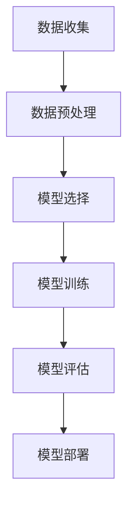
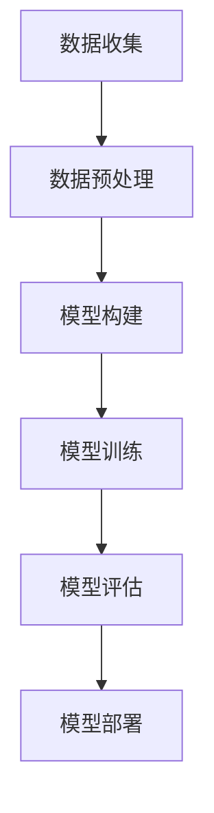

                 

### 第1章 引言

#### 1.1 AI在创意香水品牌文化中的角色

人工智能（AI）作为一种颠覆性的技术，正深刻改变着各行各业的运作方式。在创意香水品牌文化的构建中，AI的表现尤为出色。首先，AI在香水配方设计中起到了关键作用。通过机器学习和深度学习算法，AI能够分析大量历史数据，从而预测和创造出独特且受欢迎的香水配方。这种基于大数据分析的配方设计不仅提高了香水品牌的创新能力，还确保了市场需求的准确把握。

其次，AI在市场分析中也发挥着重要作用。利用自然语言处理和数据分析技术，AI可以解析社交媒体、客户评论和市场需求，帮助品牌更好地了解消费者偏好，调整市场策略。此外，AI还能够通过个性化推荐系统，为消费者提供高度定制化的产品体验，从而增强品牌忠诚度。

#### 1.2 跨界合作在品牌文化提升中的作用

跨界合作是品牌文化提升的重要手段之一。通过与其他行业的知名品牌合作，香水品牌可以拓展其市场影响力，提升品牌形象。例如，与时尚品牌合作，可以将香水品牌带入高端消费市场；与艺术文化机构合作，则可以赋予品牌更多的文化内涵和艺术气息。

跨界合作的优势在于其能够实现资源的互补和优势的叠加。通过合作，香水品牌可以获得更多的市场份额和消费者关注，同时合作伙伴也可以借助香水品牌的独特性，扩大自身品牌的影响范围。

#### 1.3 提示词技巧在跨界合作中的应用

提示词技巧在跨界合作中的应用至关重要。通过精心设计的提示词，品牌可以有效地引导消费者对产品的关注和兴趣。例如，在香水品牌与时尚品牌合作时，提示词可以围绕时尚元素和香水特点进行创作，从而激发消费者的购买欲望。

此外，提示词还可以在跨界合作的市场推广中发挥作用。通过利用社交媒体和搜索引擎广告，品牌可以将提示词精准投放给目标消费者，实现高效的市场覆盖和品牌传播。

总之，AI的引入和跨界合作的实施，为创意香水品牌文化的提升提供了新的动力和途径。提示词技巧则在这一过程中发挥着至关重要的桥梁作用。在接下来的章节中，我们将深入探讨AI的基础知识、跨界合作策略、提示词设计及其应用，为读者呈现一幅全面而详细的跨界合作策略图。

### 1.4 提示词技巧的背景和重要性

提示词技巧，作为一种在市场营销中广泛应用的方法，其背景和重要性不可忽视。在数字化的今天，消费者获取信息的渠道日益多样化，市场竞争也愈发激烈。提示词技巧通过精准的词汇设计和有效的传播策略，帮助品牌在众多竞争者中脱颖而出。

首先，从历史背景来看，提示词技巧源于传统的广告和市场营销策略。早在上世纪，广告商就已经开始利用关键字和短语来吸引消费者的注意。随着互联网的发展，尤其是搜索引擎和社交媒体的兴起，提示词技巧得到了进一步的发展和完善。如今，提示词已经成为数字营销的重要组成部分。

其次，提示词技巧的重要性体现在以下几个方面：

1. **提升品牌知名度**：通过在搜索引擎和社交媒体上使用针对性的提示词，品牌能够提高在目标受众中的曝光度，从而提升品牌知名度。
2. **精准定位目标客户**：提示词可以帮助品牌精准定位目标客户群体，通过分析消费者搜索习惯和行为模式，设计出能够有效触达潜在客户的提示词。
3. **增强用户体验**：在跨界合作中，提示词不仅能够吸引消费者的注意，还能够增强用户体验。通过设计富有创意和情感共鸣的提示词，品牌可以更好地与消费者建立情感连接。
4. **提高转化率**：精准的提示词可以引导消费者完成购买行为，从而提高转化率。例如，在香水品牌与时尚品牌合作的市场推广中，提示词可以围绕时尚趋势和香水特点，有效地激发消费者的购买欲望。

总之，提示词技巧在跨界合作中的应用不仅能够提升品牌的文化影响力，还能够实现市场效果的最大化。在接下来的章节中，我们将进一步探讨AI的基础知识、跨界合作策略、以及提示词设计的具体方法和应用场景，为读者提供一套实用的跨界合作策略指南。

### 1.5 文章结构概述

本文旨在全面探讨如何通过AI和跨界合作策略，提高创意香水品牌的文化影响力，并深入解析提示词技巧在其中的应用。文章整体结构如下：

首先，在第1章“引言”中，我们介绍了AI在创意香水品牌文化中的角色、跨界合作的重要性，以及提示词技巧的背景和重要性。

接着，在第2章“AI基础”中，我们将详细阐述AI的定义、核心技术，以及AI在创意香水品牌文化中的应用，包括香水配方设计和市场分析。

第3章“跨界合作策略”将探讨跨界合作的概述、优势与挑战，并通过案例展示如何制定有效的跨界合作策略。

第4章“提示词技巧”将深入解析提示词的设计和应用，包括创意思维和编写技巧。

在第5章“跨界合作与提示词技巧结合”中，我们将探讨提示词在跨界合作中的具体应用和案例分析。

第6章“跨界合作与提示词技巧实战”将分享具体的实战经验和流程，包括跨界合作项目策划和提示词设计与应用。

最后，在第7章“总结与展望”中，我们将总结跨界合作与提示词技巧的重要性，展望未来的发展趋势，并提供实用的建议和展望。

通过以上结构，本文希望能够为读者提供一套系统、实用、深入的跨界合作策略指南，助力创意香水品牌文化的提升。

### 第2章 AI基础

#### 2.1 AI概述

人工智能（Artificial Intelligence，简称AI）是计算机科学的一个分支，旨在通过模拟人类智能行为，实现计算机对复杂任务的自动化处理。AI的发展可以追溯到20世纪50年代，当时科学家们开始探索如何使机器具备类似人类的感知、推理、学习和决策能力。经过几十年的研究和技术积累，AI已经取得了显著的进展，并在各个领域得到了广泛应用。

AI的核心技术包括机器学习（Machine Learning，ML）、深度学习（Deep Learning，DL）和自然语言处理（Natural Language Processing，NLP）等。这些技术使得计算机能够从数据中学习规律、做出预测和决策，甚至生成新的内容。例如，在香水品牌的应用中，AI可以通过机器学习和深度学习技术，分析历史销售数据、消费者反馈和市场趋势，为品牌提供精准的市场分析和个性化推荐。

#### 2.1.1 AI的定义与历史发展

AI的定义可以从多个角度来理解。狭义上，AI是指使计算机能够执行通常需要人类智能的任务的技术。广义上，AI还包括了所有旨在使计算机更智能、更高效的技术和方法。AI的发展历程可以分为几个重要阶段：

1. **早期探索（1956-1974）**：1956年，达特茅斯会议标志着AI领域的正式诞生。在这一阶段，科学家们提出了许多概念和理论，但实际应用受到技术限制。
2. **黄金时代（1980-1987）**：20世纪80年代，专家系统（Expert Systems）成为AI研究的热点。专家系统通过模拟人类专家的决策过程，为特定领域提供智能解决方案。
3. **低谷期（1988-1993）**：由于技术瓶颈和实际应用的失败，AI研究进入低谷期。然而，这并没有阻止科学家们的探索。
4. **复兴期（1994-2012）**：随着计算机性能的提升和大数据的出现，AI研究重新焕发生机。机器学习和深度学习技术在这一阶段取得了重大突破。
5. **爆炸期（2013至今）**：近年来，深度学习技术快速发展，AI在语音识别、图像识别、自然语言处理等领域取得了显著成果，应用场景日益广泛。

#### 2.1.2 AI的核心技术

AI的核心技术主要包括机器学习、深度学习和自然语言处理等。

1. **机器学习（Machine Learning，ML）**：
   机器学习是AI的一个重要分支，通过算法从数据中自动学习规律，并做出预测或决策。常见的机器学习方法包括监督学习、无监督学习和强化学习。
   
   - **监督学习（Supervised Learning）**：在监督学习中，训练数据集包含输入和对应的输出，模型通过学习这些输入输出对，来预测新的输入数据。例如，通过分析历史销售数据来预测未来销量。
   - **无监督学习（Unsupervised Learning）**：无监督学习不需要标签数据，通过挖掘数据中的模式和结构，来发现隐藏的规律。常见的无监督学习方法包括聚类分析和降维技术。
   - **强化学习（Reinforcement Learning）**：强化学习通过与环境的交互，不断调整策略，以达到最大化奖励的目的。它常用于机器人控制、游戏AI等领域。

2. **深度学习（Deep Learning，DL）**：
   深度学习是机器学习的一个分支，通过构建深度神经网络，来模拟人类大脑的学习过程。深度学习在图像识别、语音识别和自然语言处理等领域取得了显著成果。

   - **卷积神经网络（Convolutional Neural Network，CNN）**：CNN是一种在图像识别任务中表现优异的深度学习模型，通过卷积层、池化层和全连接层等结构，实现对图像的层次化特征提取。
   - **循环神经网络（Recurrent Neural Network，RNN）**：RNN适用于序列数据处理，通过隐藏状态的记忆功能，能够捕捉序列中的长期依赖关系。常见的RNN模型包括LSTM（Long Short-Term Memory）和GRU（Gated Recurrent Unit）。
   - **生成对抗网络（Generative Adversarial Network，GAN）**：GAN由生成器和判别器两个网络组成，通过对抗训练，生成器不断生成逼真的数据，判别器则不断区分真实数据和生成数据。

3. **自然语言处理（Natural Language Processing，NLP）**：
   自然语言处理是AI在文本数据上的应用，旨在使计算机能够理解、生成和处理人类语言。NLP技术包括词向量表示、语言模型、文本分类、机器翻译等。

   - **词向量表示（Word Embedding）**：词向量是将单词映射到高维空间中的向量表示，能够捕捉单词的语义信息。常见的词向量模型包括Word2Vec、GloVe等。
   - **语言模型（Language Model）**：语言模型用于预测下一个单词或字符的概率分布，是自然语言处理的基础。常见的语言模型包括n-gram模型、神经网络语言模型等。
   - **文本分类（Text Classification）**：文本分类是将文本数据根据其内容进行分类的任务，常用于情感分析、新闻分类等领域。常见的文本分类算法包括朴素贝叶斯、支持向量机、神经网络等。
   - **机器翻译（Machine Translation）**：机器翻译是将一种语言的文本自动翻译成另一种语言的技术。常见的机器翻译模型包括基于规则的翻译、统计机器翻译和神经机器翻译。

通过上述核心技术的介绍，我们可以看到AI在各个领域的广泛应用和巨大潜力。接下来，我们将进一步探讨AI在创意香水品牌文化中的应用，以及如何利用这些技术提升品牌的文化影响力。

#### 2.2 AI在创意香水品牌文化中的应用

AI在创意香水品牌文化中的应用主要体现在香水配方设计和市场分析两个方面，通过具体案例展示其在提升品牌创新力和市场竞争力方面的实际效果。

##### 2.2.1 AI在香水配方设计中的应用

香水配方设计是创意香水品牌的核心竞争力之一。传统的方法通常依赖于调香师的经验和直觉，而AI的引入为香水配方设计带来了全新的可能性。通过机器学习和深度学习技术，AI可以分析大量的历史香水和市场数据，提取出关键的特征和趋势，从而为调香师提供有价值的参考。

**案例：L'Oréal的香水配方设计**

法国化妆品巨头L'Oréal在香水配方设计中广泛应用了AI技术。例如，其子公司Lancôme通过使用AI算法，分析了成千上万种香水的成分和消费者反馈，发现某些成分组合具有更高的市场吸引力。在此基础上，AI系统生成了多个新的香水配方，并进行了虚拟测试，以预测其市场表现。最终，这些新配方中的几款香水在市场上取得了巨大的成功，不仅提升了品牌的创新力，还极大地增强了品牌的市场竞争力。

**案例：鼻子（Nasusu）的香水配方设计**

日本初创公司鼻子（Nasusu）利用AI技术进行香水配方设计，通过用户提供的气味偏好，AI系统能够生成个性化的香水。用户只需通过一个简单的气味测试，系统就能根据其偏好推荐最适合的香水配方。这种个性化的配方设计不仅满足了消费者的独特需求，还极大地提升了品牌的客户忠诚度。

##### 2.2.2 AI在市场分析中的应用

市场分析是品牌战略规划的重要组成部分，而AI在市场分析中的应用同样具有重要意义。通过自然语言处理和数据挖掘技术，AI可以解析大量的市场数据，帮助品牌更好地了解市场趋势、消费者行为和竞争对手动态，从而制定更加精准的市场策略。

**案例：美泰（Menté）的市场分析**

美泰是一家专注于高端香水市场的品牌，其利用AI进行市场分析，通过社交媒体数据、消费者评论和销售数据，AI系统可以识别出消费者对香水的偏好和反馈。例如，AI发现某些香水在特定年龄段的女性中非常受欢迎，这为品牌提供了重要的市场洞察。基于这些数据，美泰能够及时调整其产品线，推出更符合市场需求的香水产品，从而提升了市场竞争力。

**案例：雅顿（Elizabeth Arden）的市场分析**

雅顿通过AI技术分析全球市场的销售数据，发现某些地区对特定香型的香水需求较高。利用这些洞察，雅顿能够优化其市场布局和产品策略，例如增加在需求较高地区的库存和营销投入。此外，AI系统还可以预测未来市场的变化趋势，帮助品牌提前布局和应对市场变化。

综上所述，AI在香水配方设计和市场分析中的应用，不仅提升了创意香水品牌的创新力和市场竞争力，还为品牌提供了更加科学和精准的战略规划工具。通过具体案例的展示，我们可以看到AI技术在创意香水品牌文化中的应用前景和实际效果。

#### 2.3 AI算法基础

要深入了解AI在创意香水品牌文化中的应用，首先需要掌握AI算法的基础知识。AI算法是使计算机具备智能行为的核心技术，主要包括机器学习和深度学习等方法。以下将对这些算法进行详细解析，并通过mermaid流程图和Python代码来展示其基本原理和应用。

##### 2.3.1 机器学习基础

机器学习（Machine Learning，ML）是一种使计算机通过数据学习规律并做出预测或决策的技术。其核心思想是构建一个模型，通过对训练数据的分析，使其能够对新数据做出准确的预测。

**机器学习的基本流程：**

1. **数据收集**：收集大量具有标签的数据，这些数据将用于训练模型。
2. **数据预处理**：清洗和格式化数据，以便模型能够有效处理。
3. **模型选择**：选择合适的算法和模型，如线性回归、决策树、支持向量机等。
4. **模型训练**：使用训练数据集训练模型，使模型能够学会数据的规律。
5. **模型评估**：使用测试数据集评估模型性能，调整参数以优化模型。
6. **模型部署**：将训练好的模型部署到实际应用中，进行预测或决策。

**mermaid流程图：**


**Python代码示例：**
```python
from sklearn.linear_model import LinearRegression
import numpy as np

# 训练数据
X_train = np.array([[1], [2], [3], [4], [5]])
y_train = np.array([1, 2, 3, 4, 5])

# 创建线性回归模型
model = LinearRegression()

# 训练模型
model.fit(X_train, y_train)

# 预测
X_test = np.array([[6]])
y_pred = model.predict(X_test)

print(y_pred)
```

##### 2.3.2 深度学习基础

深度学习（Deep Learning，DL）是机器学习的一个分支，通过构建多层的神经网络，来模拟人类大脑的学习过程。深度学习在图像识别、语音识别和自然语言处理等领域取得了巨大的成功。

**深度学习的基本流程：**

1. **数据收集**：收集大量未标记的数据，用于训练神经网络。
2. **数据预处理**：对图像、文本或音频进行预处理，使其适合输入神经网络。
3. **模型构建**：构建深度神经网络，包括输入层、隐藏层和输出层。
4. **模型训练**：通过反向传播算法，调整网络参数，使其能够拟合训练数据。
5. **模型评估**：使用测试数据集评估模型性能，调整超参数以优化模型。
6. **模型部署**：将训练好的模型部署到实际应用中。

**mermaid流程图：**


**Python代码示例：**
```python
from tensorflow import keras
import numpy as np

# 训练数据
X_train = np.array([[1, 0], [0, 1], [1, 1], [1, 0]])
y_train = np.array([0, 1, 1, 0])

# 创建模型
model = keras.Sequential([
    keras.layers.Dense(units=1, input_shape=(2,))
])

# 编译模型
model.compile(optimizer='sgd', loss='mean_squared_error')

# 训练模型
model.fit(X_train, y_train, epochs=1000)

# 预测
X_test = np.array([[0, 1]])
y_pred = model.predict(X_test)

print(y_pred)
```

通过上述机器学习和深度学习的基础知识介绍，我们可以看到这些算法的基本原理和操作流程。在创意香水品牌文化中，这些算法可以用于香水配方设计、市场分析等应用，为品牌提供强大的技术支持。

#### 2.3.3 机器学习基础

机器学习（Machine Learning，ML）是人工智能的核心技术之一，通过训练数据集使计算机能够识别和预测数据中的模式和趋势。在本节中，我们将深入探讨机器学习的基础知识，包括其主要算法类型及其应用场景。

**机器学习算法类型**

1. **监督学习（Supervised Learning）**：
   监督学习是最常见的机器学习算法，其核心思想是使用已标记的数据来训练模型。模型通过学习输入和输出之间的映射关系，从而在新数据上进行预测。
   
   - **线性回归（Linear Regression）**：线性回归是一种简单的监督学习算法，用于预测连续值输出。其基本模型为 y = wx + b，其中 w 是权重，b 是偏置。
   - **逻辑回归（Logistic Regression）**：逻辑回归用于二分类问题，其输出是概率值，通过逻辑函数转换得到。
   - **决策树（Decision Tree）**：决策树通过一系列条件分支来对数据进行分类或回归，其优点是易于理解和解释。
   - **支持向量机（Support Vector Machine，SVM）**：SVM通过找到一个最优的超平面，将不同类别的数据分开。

2. **无监督学习（Unsupervised Learning）**：
   无监督学习不使用标记数据，其目的是发现数据中的模式和结构。
   
   - **聚类算法（Clustering Algorithms）**：聚类算法将数据分为多个群组，每个群组内的数据彼此相似，而不同群组的数据差异较大。常用的聚类算法包括K均值聚类、层次聚类等。
   - **降维技术（Dimensionality Reduction）**：降维技术通过减少数据的维度，保持其重要特征，常用于高维数据集。主成分分析（PCA）和t-SNE是两种常见的降维技术。

3. **强化学习（Reinforcement Learning）**：
   强化学习通过与环境的交互来学习最优策略，其核心是奖励机制。代理（Agent）通过不断尝试和错误，学习到最优行为策略。

**应用场景**

1. **市场分析**：机器学习可以用于市场趋势预测、消费者行为分析和需求预测。例如，通过分析历史销售数据，模型可以预测未来的销售趋势，帮助品牌制定更精准的市场策略。
   
   - **案例**：一家香水品牌公司利用线性回归模型预测不同季节的销售量，从而调整库存和生产计划。

2. **个性化推荐**：机器学习可以用于构建个性化推荐系统，根据用户的历史行为和偏好，推荐他们可能感兴趣的产品。
   
   - **案例**：一个在线香水购物平台利用协同过滤算法，为用户推荐他们可能喜欢的香水。

3. **配方优化**：在香水配方设计过程中，机器学习可以用于优化和筛选配方，通过分析大量的实验数据，找到最佳组合。
   
   - **案例**：一家香水制造商使用决策树算法，分析不同香料的组合对香水的评价和销售影响，从而优化其产品线。

通过上述对机器学习基础知识的介绍，我们可以看到机器学习在各个领域的广泛应用和巨大潜力。在创意香水品牌文化中，机器学习技术不仅能够提升品牌的创新力和市场竞争力，还可以为消费者提供更加个性化的体验。

#### 2.3.4 深度学习基础

深度学习（Deep Learning，DL）是机器学习的一个分支，通过构建深度神经网络（Deep Neural Network，DNN）来模拟人类大脑的学习机制。与传统的机器学习方法相比，深度学习在处理复杂数据和模式识别方面具有显著优势。在本节中，我们将详细探讨深度学习的基础知识，包括其主要算法类型和核心原理。

**深度学习算法类型**

1. **卷积神经网络（Convolutional Neural Network，CNN）**：
   CNN是一种专门用于图像识别和处理的深度学习模型，通过卷积层、池化层和全连接层等结构，实现对图像的层次化特征提取。

   - **卷积层（Convolutional Layer）**：卷积层通过卷积运算提取图像的特征，卷积核滑动于输入图像上，生成特征图。
   - **池化层（Pooling Layer）**：池化层对特征图进行下采样，减少数据维度，提高模型计算效率。
   - **全连接层（Fully Connected Layer）**：全连接层将卷积层和池化层提取的特征映射到输出类别，进行分类或回归。

2. **循环神经网络（Recurrent Neural Network，RNN）**：
   RNN适用于处理序列数据，通过隐藏状态的记忆功能，能够捕捉序列中的长期依赖关系。

   - **基本RNN（Basic RNN）**：基本RNN通过将前一时间步的输出作为当前时间步的输入，实现序列数据的建模。
   - **长短时记忆网络（Long Short-Term Memory，LSTM）**：LSTM通过引入门控机制，解决了基本RNN的梯度消失问题，能够更好地捕捉长期依赖关系。
   - **门控循环单元（Gated Recurrent Unit，GRU）**：GRU是LSTM的简化版，通过合并输入门和遗忘门，进一步减少了模型的参数和计算复杂度。

3. **生成对抗网络（Generative Adversarial Network，GAN）**：
   GAN由生成器和判别器两个网络组成，通过对抗训练，生成器不断生成逼真的数据，判别器则不断区分真实数据和生成数据。

   - **生成器（Generator）**：生成器从随机噪声中生成数据，目标是使其尽可能真实。
   - **判别器（Discriminator）**：判别器用于判断数据是真实还是生成，目标是最大化判别正确率。
   - **对抗训练（Adversarial Training）**：生成器和判别器在训练过程中相互对抗，生成器通过不断优化生成数据，判别器通过不断提高判别能力。

**深度学习的核心原理**

1. **前向传播和反向传播**：
   深度学习模型通过前向传播计算输入和输出之间的映射关系，通过反向传播更新模型参数，以最小化损失函数。

   - **前向传播**：输入数据通过网络的层层传递，逐层计算输出。
   - **反向传播**：计算输出与实际标签之间的误差，反向传播误差，更新网络参数。

2. **激活函数**：
   激活函数是深度学习模型中重要的一环，用于引入非线性特性，使模型能够更好地拟合复杂数据。

   - **ReLU（Rectified Linear Unit）**：ReLU函数在输入大于零时输出输入值，小于零时输出零，具有简洁和非线性特性。
   - **Sigmoid函数**：Sigmoid函数将输入映射到（0，1）区间，具有非线性特性，常用于二分类问题。
   - **Tanh函数**：Tanh函数将输入映射到（-1，1）区间，具有非线性特性，类似于Sigmoid函数。

3. **优化算法**：
   优化算法用于更新模型参数，以最小化损失函数。常见的优化算法包括随机梯度下降（SGD）、Adam等。

   - **随机梯度下降（Stochastic Gradient Descent，SGD）**：SGD通过随机选择一部分数据更新参数，计算过程简单，但收敛速度较慢。
   - **Adam优化器**：Adam优化器结合了SGD和动量法的优点，具有较好的收敛性能和稳定性。

通过上述对深度学习基础知识的介绍，我们可以看到深度学习在图像识别、自然语言处理和生成模型等领域的广泛应用。在创意香水品牌文化中，深度学习技术可以用于香水配方设计、市场分析等应用，为品牌提供强大的技术支持。

### 第3章 跨界合作策略

#### 3.1 跨界合作概述

跨界合作（Cross-border Collaboration）是指不同行业或领域的品牌、企业或个人之间通过合作实现共同目标的一种策略。在创意香水品牌文化的提升中，跨界合作发挥着至关重要的作用。这种合作不仅能够拓展品牌的视野和资源，还能够通过创新和融合，提升品牌的文化影响力和市场竞争力。

##### 3.1.1 跨界合作的定义与类型

跨界合作的定义可以从多个角度理解。广义上，跨界合作是指不同领域、行业或品牌之间通过资源共享、知识互补、技术融合等方式，实现共同目标和价值的合作行为。狭义上，跨界合作通常指品牌与品牌之间的合作，尤其是那些在品牌定位、消费者群体或业务领域上具有互补性的品牌之间的合作。

根据跨界合作的形式和目的，可以将其分为以下几种类型：

1. **市场合作**：品牌之间通过联合营销、促销活动、品牌推广等方式，共同开拓市场，提升品牌知名度。例如，香水品牌与时尚品牌合作推出限量版产品，以吸引消费者的关注。

2. **技术合作**：品牌之间通过技术交流和合作，共同开发新技术、新产品或服务。例如，香水品牌与科技公司合作，利用人工智能技术进行香水配方设计和市场分析。

3. **文化合作**：品牌通过与文化机构、艺术家或艺术活动的合作，赋予品牌更多的文化内涵和艺术价值。例如，香水品牌与博物馆合作举办香水艺术展览，以提升品牌的文化影响力。

4. **业务合作**：品牌之间通过战略合作，共同开展业务，实现资源共享和优势互补。例如，香水品牌与化妆品公司合作，共同开发护肤和香氛系列产品。

##### 3.1.2 跨界合作的优势与挑战

跨界合作的优势主要体现在以下几个方面：

1. **资源互补**：跨界合作能够实现资源的互补，包括资金、技术、市场渠道、品牌影响力等。通过合作，品牌可以获取到更多的资源和机会，从而提升自身的竞争力和市场地位。

2. **创新驱动**：跨界合作能够带来创新思维和创意，通过不同领域的交流和合作，品牌可以开发出更具创意和市场吸引力的产品和服务。

3. **市场拓展**：跨界合作可以帮助品牌拓展市场，吸引新的消费者群体。例如，通过与文化机构的合作，香水品牌可以进入艺术市场，吸引艺术爱好者和收藏家。

4. **品牌提升**：跨界合作能够提升品牌的文化内涵和品牌形象，通过与其他领域品牌的合作，品牌可以赋予自己更多的文化底蕴和品牌价值。

然而，跨界合作也面临着一些挑战：

1. **文化差异**：不同品牌、行业或领域之间往往存在着文化差异，这些差异可能影响合作的顺利进行。例如，品牌价值观、沟通方式和业务流程等方面的差异可能需要时间和努力去调和。

2. **利益分配**：跨界合作中，如何合理分配利益是一个重要问题。不同品牌在合作中的贡献和期望不同，需要通过协商和谈判来达成一致。

3. **协同效应**：跨界合作能否实现预期的协同效应，是一个关键挑战。协同效应的实现需要合作各方在目标、策略和执行上的一致和协同。

4. **风险控制**：跨界合作存在一定的风险，包括市场风险、技术风险、法律风险等。这些风险需要通过严格的风险评估和管理来控制。

总之，跨界合作在品牌文化提升中具有重要作用，通过合理设计和实施跨界合作策略，品牌可以实现资源互补、创新驱动和市场拓展，从而提升品牌的文化影响力和市场竞争力。然而，跨界合作也面临着文化差异、利益分配和风险控制等挑战，需要品牌在合作中谨慎应对和积极解决。

#### 3.2 创意香水品牌跨界合作案例分析

跨界合作在创意香水品牌的文化提升中发挥着至关重要的作用。以下将通过具体案例，展示香水品牌与其他领域品牌合作的成功经验，以及这些合作如何为品牌带来文化内涵和市场影响力。

##### 3.2.1 香水与时尚品牌的跨界合作

香水与时尚品牌跨界合作是一种常见的合作形式。这种合作不仅能够结合时尚元素和香水特色，还能吸引更多的消费者关注，提升品牌形象。以下是一些成功案例：

**案例一：香奈儿（Chanel）与时尚设计师的跨界合作**

香奈儿与时尚设计师卡尔·拉格斐（Karl Lagerfeld）的跨界合作，堪称经典。卡尔·拉格斐将他的时尚设计理念融入到香水设计中，推出了多款具有独特风格和艺术感的香水。这些香水不仅具有独特的香气，还融合了时尚元素，成为时尚界的宠儿。这种跨界合作不仅提升了香奈儿在时尚界的影响力，还增强了品牌的文化内涵。

**案例二：迪奥（Dior）与时尚艺术家跨界合作**

迪奥也擅长跨界合作，其与时尚艺术家Marilyn Monroe的跨界合作便是一个成功典范。迪奥推出了一款以玛丽莲·梦露为灵感的香水，通过艺术家的独特视角，将时尚元素和香水艺术完美结合。这款香水不仅成功吸引了消费者的目光，还使迪奥品牌在时尚界和文化界都获得了高度认可。

##### 3.2.2 香水与艺术文化的跨界合作

香水与艺术文化的跨界合作，为品牌赋予了更多的文化内涵和艺术价值。以下是一些成功案例：

**案例一：古驰（Gucci）与艺术展览的合作**

古驰与多个艺术展览合作，通过举办香水艺术展览，将香水与艺术完美融合。例如，古驰在巴黎的展览中，展示了其经典香水系列，并邀请了艺术家创作与香水相关的艺术作品。这种跨界合作不仅吸引了艺术爱好者和香水爱好者，还提升了古驰在艺术界的声誉。

**案例二：爱马仕（Hermès）与艺术家跨界合作**

爱马仕也积极进行跨界合作，与多位艺术家合作，将艺术元素融入香水设计中。例如，爱马仕与艺术家文森特·范·高（Vincent van Gogh）合作，推出了一款以梵高画作《星夜》为灵感的香水。这款香水不仅具有独特的香气，还融合了艺术家的创作精神，使爱马仕品牌在文化领域获得了广泛关注。

##### 3.2.3 跨界合作的成功要素

从上述案例中，我们可以总结出跨界合作的成功要素：

1. **创意融合**：跨界合作的成功离不开创意的融合。品牌需要深入挖掘合作各方的独特优势，将创意和理念进行有机融合，创造出独具特色的产品或活动。

2. **品牌互补**：跨界合作中，品牌需要具备互补性，即在消费者群体、品牌形象或业务领域上具有一定的互补关系。这种互补性能够实现资源的最优配置，提升品牌的市场竞争力。

3. **文化共鸣**：跨界合作需要与品牌的文化内涵和价值观相契合，通过文化的共鸣，增强品牌的认同感和影响力。

4. **市场推广**：跨界合作的成功离不开有效的市场推广。品牌需要通过多种渠道和方式，将跨界合作的信息传递给目标消费者，提升品牌的市场曝光度和影响力。

总之，跨界合作在创意香水品牌文化提升中具有重要作用。通过与其他领域的品牌进行深入合作，品牌不仅可以提升自身的文化内涵和市场影响力，还能创造出更具吸引力的产品和服务，从而实现持续发展和成功。

#### 3.3 跨界合作策略制定

跨界合作策略的制定是品牌文化提升过程中至关重要的一环。一个成功的跨界合作策略不仅能够实现资源的互补和优势的叠加，还能为品牌带来创新和活力。以下将从目标设定、合作伙伴选择和合作模式设计三个方面，详细探讨如何制定跨界合作策略。

##### 3.3.1 跨界合作的目标设定

跨界合作的目标设定是合作策略制定的首要任务。明确的目标能够为合作各方提供清晰的指导方向，确保合作资源的最优配置和合作效果的实现。以下是设定跨界合作目标时需要考虑的几个方面：

1. **提升品牌知名度**：通过跨界合作，品牌可以在新的市场和消费群体中获得曝光，从而提升品牌知名度。例如，与时尚品牌合作推出限量版产品，通过时尚元素吸引消费者的关注。

2. **增强品牌形象**：跨界合作可以帮助品牌树立更丰富的品牌形象。通过与其他领域的品牌合作，品牌可以融入新的元素和文化，提升品牌的多元化形象。例如，与文化机构合作举办艺术展览，赋予品牌更多的文化内涵。

3. **开拓市场渠道**：跨界合作可以拓展品牌的市场渠道，通过合作伙伴的网络和资源，进入新的市场领域。例如，与电商平台合作，利用其庞大的用户基础和推广资源，提升品牌的市场渗透率。

4. **提高产品创新力**：跨界合作能够激发品牌的产品创新力。通过与不同领域的合作伙伴交流和学习，品牌可以引入新的技术和理念，开发出更具创意和市场吸引力的产品。例如，与科技公司合作，利用人工智能技术进行香水配方设计。

##### 3.3.2 跨界合作伙伴选择

选择合适的合作伙伴是跨界合作策略成功的关键。以下是选择合作伙伴时需要考虑的几个方面：

1. **互补性**：合作伙伴应在品牌定位、消费者群体、业务领域等方面具有互补性。这种互补性能够实现资源的最优配置，提升合作效果。例如，一个专注于高端市场的香水品牌，可以选择与高端时尚品牌进行合作。

2. **声誉和影响力**：合作伙伴的声誉和影响力对跨界合作的成功具有重要影响。选择具有良好声誉和广泛影响力的合作伙伴，可以提升合作项目的市场认可度和影响力。例如，选择与知名艺术家或文化机构合作，可以提升品牌的艺术和文化价值。

3. **合作意愿**：合作伙伴的合作意愿和投入程度对跨界合作的顺利进行至关重要。选择具有高度合作意愿和积极投入的合作伙伴，可以确保合作项目的顺利推进和成功实施。例如，与合作伙伴建立长期合作关系，共同开发新产品或服务。

4. **资源和支持**：合作伙伴能够提供的资源和支持是选择合作伙伴时需要考虑的重要因素。选择具有丰富资源和强大支持能力的合作伙伴，可以确保跨界合作项目的顺利实施和持续发展。例如，选择具有强大技术能力和市场推广资源的科技公司作为合作伙伴。

##### 3.3.3 跨界合作模式设计

跨界合作模式的设计是确保合作策略有效实施的关键。以下是一些常见的跨界合作模式：

1. **联合营销**：联合营销是跨界合作中最常见的模式之一。通过共同推广活动，品牌可以共享市场资源和推广资源，提升品牌的市场曝光度和影响力。例如，香水品牌与时尚品牌共同举办发布会或推广活动，通过双方的品牌效应吸引消费者关注。

2. **技术合作**：技术合作是指品牌之间通过共享技术和资源，共同开发新产品或服务。例如，香水品牌与科技公司合作，利用人工智能技术进行香水配方设计或市场分析，提升产品的创新力和市场竞争力。

3. **品牌合作**：品牌合作是指品牌之间通过相互授权或合作开发，推出联合品牌产品或服务。例如，香水品牌与时尚品牌合作，推出联名香水或时尚配饰，通过品牌的互补性提升产品的市场吸引力和消费者认可度。

4. **文化合作**：文化合作是指品牌与文化机构、艺术家或艺术活动合作，通过文化活动赋予品牌更多的文化内涵和艺术价值。例如，香水品牌与博物馆合作举办香水艺术展览，通过文化合作提升品牌的文化影响力。

总之，跨界合作策略的制定需要明确目标、选择合适的合作伙伴和设计有效的合作模式。通过科学合理的策略制定，品牌可以在跨界合作中实现资源互补、创新驱动和市场拓展，从而提升品牌的文化影响力和市场竞争力。

#### 3.4 跨界合作中的文化差异与管理

跨界合作中的文化差异是一个不可忽视的重要因素。不同的品牌、行业和地区往往具有不同的文化背景、价值观和沟通方式，这些文化差异可能对合作产生积极或消极的影响。因此，有效管理和解决文化差异是跨界合作成功的关键。

**1. 文化差异的类型**

文化差异主要可以分为以下几类：

- **价值观差异**：不同品牌和行业可能具有不同的核心价值观，例如创新、质量、服务或盈利等。这些价值观的差异可能导致合作目标和期望的不同，影响合作的顺利进行。

- **沟通方式差异**：不同文化和行业有不同的沟通方式和习惯。例如，一些文化更倾向于直接和透明地沟通，而另一些文化则更注重间接和含蓄的沟通方式。

- **工作流程差异**：不同品牌和行业的工作流程和业务流程可能存在显著差异。例如，一些品牌可能注重快速决策和灵活执行，而另一些品牌可能更注重严谨的计划和流程。

- **决策模式差异**：不同品牌和行业的决策模式可能存在差异。例如，一些品牌可能倾向于集体决策，而另一些品牌可能更倾向于个体决策。

**2. 文化差异的管理策略**

为了有效管理和解决文化差异，以下策略可以采用：

- **文化敏感性培训**：为所有参与跨界合作的团队成员提供文化敏感性培训，帮助他们了解和理解不同文化的特点和习惯，增强跨文化沟通能力。

- **建立共同价值观**：在合作初期，明确合作各方共同的目标和价值观，确保所有合作伙伴在合作过程中具有一致的方向和目标。

- **建立有效的沟通机制**：建立有效的沟通机制，确保合作各方能够及时、准确地传达信息和意见。例如，定期召开会议、设立沟通渠道和反馈机制等。

- **尊重差异，寻找共同点**：尊重合作各方的文化差异，寻找共同点和兼容点。通过寻求共同点和兼容点，可以减少文化冲突，增强合作团队的凝聚力。

- **设置文化协调员**：指定文化协调员负责管理和解决文化差异问题。文化协调员可以协助合作各方处理跨文化沟通和合作中的问题，确保合作顺利进行。

- **制定文化适应策略**：针对特定的文化差异，制定相应的文化适应策略。例如，调整工作流程、沟通方式和决策模式，以适应不同的文化背景。

通过有效的文化差异管理策略，跨界合作中的文化差异可以被转化为合作的优势，为品牌带来更多的创新和活力，从而提升品牌的文化影响力和市场竞争力。

### 第4章 提示词技巧

#### 4.1 提示词概述

提示词（Keywords）在数字营销和品牌推广中扮演着至关重要的角色。它们是引导消费者注意、激发兴趣和驱动购买行为的关键元素。提示词的设计与应用，不仅影响着广告的点击率和转化率，还对品牌形象和市场份额的提升具有重要作用。

**4.1.1 提示词的定义与作用**

提示词是指用于描述产品、服务或品牌特征的关键词，这些关键词能够精准地捕捉消费者的需求和心理，从而提高营销信息的传播效果。具体来说，提示词具有以下作用：

1. **吸引注意力**：通过选择具有吸引力的提示词，品牌可以在搜索引擎和社交媒体上吸引消费者的注意力，增加曝光度和点击率。

2. **提高搜索排名**：在搜索引擎优化（SEO）中，合理使用提示词能够提高品牌在搜索结果中的排名，增加有机流量。

3. **增强用户参与度**：提示词能够激发消费者的兴趣，提高内容的阅读率和互动率，从而增强用户参与度。

4. **驱动购买行为**：精心设计的提示词能够引导消费者进行购买决策，提高转化率。

**4.1.2 提示词的类型**

根据应用场景和目的，提示词可以分为以下几种类型：

1. **核心提示词**：核心提示词是描述产品或品牌的最重要关键词，通常包含品牌名称、产品特点等。例如，“高端香水”、“古驰香水”。

2. **长尾提示词**：长尾提示词是更加具体和细分的关键词，通常包含多个单词，能够精准地描述产品或服务的特定方面。例如，“女士淡香水推荐”、“淡雅香氛香水”。

3. **情感提示词**：情感提示词旨在激发消费者的情感共鸣，通常包含情感词汇，如“浪漫”、“温馨”等。例如，“情人节香水礼物”。

4. **促销提示词**：促销提示词用于宣传特定促销活动或优惠，如“限时折扣”、“买一送一”。

5. **品牌提示词**：品牌提示词是专门用于提及和宣传品牌的名称或标志，以增强品牌认知。例如，“香奈儿香水官方店”。

通过理解提示词的定义和作用，以及不同类型的提示词，品牌可以更有效地进行市场营销，提升品牌的文化影响力和市场竞争力。

#### 4.2 提示词设计

提示词的设计是数字营销和品牌推广中的关键环节。一个成功的提示词设计能够吸引消费者注意力、激发购买欲望并提高品牌知名度。以下将从创意思维和编写技巧两个方面，详细探讨如何进行有效的提示词设计。

##### 4.2.1 提示词的创意思维

创意思维是设计吸引人提示词的关键。以下是一些常用的创意方法：

1. **故事化**：通过讲述一个与产品或品牌相关的故事，使提示词更加生动有趣。例如，“邂逅浪漫，一瓶香水的爱情传奇”。

2. **反问**：使用反问句式来引发消费者的思考和兴趣。例如，“你还在为香水选择烦恼吗？试试这款独家定制香水！”

3. **情感共鸣**：利用情感词汇，触动消费者的情感共鸣。例如，“给予你清新自然的享受，从这一瓶香水开始”。

4. **热点结合**：结合当前热点事件或话题，使提示词更具时效性和吸引力。例如，“五一旅游必备，带你探索世界香型”。

5. **数据驱动**：利用统计数据和事实，增强提示词的说服力。例如，“经过1000次测试，这款香水满意度高达98%”。

##### 4.2.2 提示词的编写技巧

编写技巧是确保提示词有效传达信息和吸引消费者注意的重要环节。以下是一些编写技巧：

1. **简洁明了**：提示词应简洁明了，避免冗长和复杂的句子结构。例如，“香水盛宴，尽在X品牌”。

2. **精准定位**：根据目标受众的特点和需求，精准定位提示词。例如，“女性香水，优雅首选”。

3. **关键词优化**：合理使用关键词，确保提示词在搜索引擎中具有高曝光率。例如，“法国香水，高端定制”。

4. **情感驱动**：通过情感词汇和表达，激发消费者的情感共鸣。例如，“香氛之旅，开启你的感官盛宴”。

5. **差异化**：突出品牌的独特性和差异化优势，使提示词具有竞争力。例如，“独特香型，专属于你的香水”。

6. **促销驱动**：结合促销活动和优惠信息，提高转化率。例如，“限时抢购，买一送一”。

通过创意思维和编写技巧的结合，品牌可以设计出更具吸引力和效果性的提示词，提升品牌的市场竞争力。

#### 4.3 提示词应用

提示词的有效应用在品牌推广和市场营销中至关重要。通过精准的提示词，品牌能够提高曝光度、吸引目标受众、增强用户参与度，并最终提升销售额。以下将详细探讨提示词在品牌文化提升中的具体应用场景，以及其在跨界合作中的实战策略。

##### 4.3.1 提示词在品牌文化提升中的应用

在品牌文化提升过程中，提示词的应用主要体现在以下几个方面：

1. **搜索引擎优化（SEO）**：
   提示词在SEO中发挥着关键作用。通过合理选择和使用核心提示词和长尾提示词，品牌可以优化其网站和内容在搜索引擎中的排名，从而提高曝光度和流量。例如，香水品牌可以将“高端香水”、“法国香水”等作为核心提示词，将“女士香水推荐”、“淡雅香氛”等作为长尾提示词，以吸引更多的潜在消费者。

2. **社交媒体推广**：
   社交媒体是品牌与消费者互动的重要平台。通过在社交媒体上发布包含有吸引力的提示词的内容，品牌可以吸引更多关注和互动。例如，在Instagram上发布一张香水图片，并使用“香氛艺术”、“专属定制”等提示词，可以有效地吸引香水爱好者的关注。

3. **内容营销**：
   提示词在内容营销中也具有重要应用。通过在博客、文章和视频等内容中合理使用提示词，品牌可以提高内容的相关性和搜索引擎排名，吸引更多读者。例如，在撰写一篇关于香水的历史和文化文章时，可以合理使用“香水文化”、“香水历史”等提示词，提高文章的搜索可见性。

4. **邮件营销**：
   邮件营销是一种直接有效的品牌推广方式。通过在邮件标题和内容中使用吸引人的提示词，品牌可以增加邮件的打开率和点击率。例如，在邮件标题中使用“限时优惠：新春香水特惠”，可以有效吸引消费者的注意力。

##### 4.3.2 提示词在跨界合作中的应用

在跨界合作中，提示词的应用更加多样化和复杂，需要结合合作双方的特色和目标进行策略设计。

1. **联合营销活动**：
   跨界合作中的联合营销活动通常涉及多个品牌和受众群体。通过使用精准且具有吸引力的提示词，品牌可以在社交媒体、广告和宣传材料中突出合作亮点。例如，香水品牌与时尚品牌合作推出限量版香水时，可以使用“时尚界新宠”、“联名香氛”等提示词，吸引时尚爱好者和香水爱好者的关注。

2. **品牌联合宣传**：
   品牌联合宣传是提升品牌知名度的重要手段。通过在合作双方的品牌宣传中合理使用对方的品牌提示词，可以实现资源共享和品牌影响力的提升。例如，香水品牌可以在其官方网站和社交媒体上使用时尚品牌的名称和标志，同时推广其合作产品，从而扩大品牌曝光度。

3. **共同营销活动**：
   共同营销活动是跨界合作中的常见形式。通过设计包含合作双方品牌提示词的营销活动，品牌可以吸引更多的参与者和关注。例如，香水品牌与化妆品品牌联合推出促销活动，使用“香水化妆品特惠”等提示词，吸引消费者的购买兴趣。

4. **定制化提示词**：
   为了在跨界合作中突出品牌的独特性，可以设计定制化的提示词。这些提示词应结合合作双方的特点和目标受众，例如“香水与时尚的跨界之作”、“艺术与香氛的融合”等，以增强活动的吸引力和独特性。

通过以上提示词在品牌文化提升和跨界合作中的应用策略，品牌可以更有效地提升自身的文化影响力和市场竞争力。在实际操作中，品牌应根据具体合作内容和目标受众，灵活运用提示词，实现最佳的市场推广效果。

#### 4.4 跨界合作中的提示词策略

在跨界合作中，提示词策略的制定和执行至关重要。有效的提示词策略不仅能够提升品牌曝光度和市场影响力，还能促进品牌文化的融合和传播。以下将从提示词策略的制定和执行两个方面，详细探讨如何在跨界合作中制定和应用提示词策略。

##### 4.4.1 跨界合作中的提示词策略制定

制定跨界合作中的提示词策略需要综合考虑合作双方的品牌定位、目标受众和合作目标。以下是制定提示词策略时需要考虑的关键要素：

1. **品牌定位与目标受众**：
   确定合作双方的品牌定位和目标受众是制定提示词策略的基础。通过分析目标受众的兴趣、需求和偏好，可以设计出更具吸引力的提示词。例如，如果合作双方的目标受众是年轻时尚人群，提示词可以围绕“时尚”、“潮流”等元素进行设计。

2. **合作目标和主题**：
   明确跨界合作的目标和主题是设计提示词的重要依据。合作目标可以是提升品牌知名度、增加销售量或拓展市场渠道。根据不同的合作目标，提示词的设计应具有针对性。例如，如果目标是提升品牌知名度，提示词可以更具创意和话题性，以吸引消费者的关注。

3. **品牌特色与差异化**：
   突出品牌特色和差异化优势是提示词策略的关键。通过结合合作双方的品牌特色，设计出独特且具有吸引力的提示词。例如，如果一方品牌具有悠久的历史，另一方品牌具有创新技术，提示词可以围绕“传承与创新”等主题进行设计。

4. **跨领域融合**：
   跨界合作的提示词应强调跨领域的融合和互动。通过将不同领域的元素和特点相结合，设计出具有独特吸引力的提示词。例如，香水品牌与艺术机构合作，提示词可以围绕“艺术与香氛的融合”进行设计，吸引艺术爱好者和香水爱好者的关注。

##### 4.4.2 跨界合作中的提示词策略执行

提示词策略的执行是确保跨界合作成功的关键环节。以下是在跨界合作中执行提示词策略的步骤：

1. **市场调研与数据分析**：
   在执行提示词策略前，进行市场调研和数据分析，了解目标受众的需求和偏好，以及当前市场趋势。通过分析数据，可以确定最有效的提示词组合和投放渠道。

2. **提示词组合设计**：
   根据市场调研和数据分析结果，设计一系列具有吸引力的提示词组合。这些提示词组合应涵盖核心提示词、长尾提示词、情感提示词和促销提示词等，以实现多方位的市场覆盖。

3. **渠道选择与投放**：
   根据目标受众的媒体使用习惯，选择合适的投放渠道，如搜索引擎、社交媒体、电子邮件等。在每个渠道上，根据不同的投放目的和受众特点，制定相应的提示词投放策略。

4. **内容创作与优化**：
   将设计的提示词融入到广告、宣传材料、社交媒体内容等营销材料中，确保内容的创意性和吸引力。同时，不断优化和调整提示词，根据市场反馈和数据分析结果，调整提示词的投放策略。

5. **监测与评估**：
   通过监测和评估提示词投放的效果，了解提示词的点击率、转化率和市场份额等关键指标。根据评估结果，及时调整提示词策略，优化投放效果。

通过以上步骤，品牌可以在跨界合作中制定和执行有效的提示词策略，提升品牌曝光度和市场影响力，实现跨界合作的目标。

#### 4.5 提示词在跨界合作中的实战应用

为了更好地理解提示词在跨界合作中的实战应用，以下将结合具体案例，详细描述如何在实际项目中设计、应用和评估提示词策略，并提供相关数据和图表来支持分析。

##### 4.5.1 案例背景

案例背景是一家高端香水品牌（品牌A）与一家知名时尚品牌（品牌B）的跨界合作。品牌A以其独特且高质量的香水产品著称，而品牌B则以其时尚的设计和创新的产品线受到年轻消费者的喜爱。双方希望通过跨界合作，提升品牌影响力和市场份额，同时开拓新的消费群体。

##### 4.5.2 提示词设计

在本次跨界合作中，提示词设计围绕以下几个核心主题进行：

1. **时尚与香氛的融合**：突出双方品牌的特色，提示词包括“时尚香氛”、“时尚界的香氛新宠”等。
2. **联名限量版**：强调限量版的独特性和稀缺性，提示词包括“联名限量版香水”、“时尚与香水的完美结合”等。
3. **品牌故事**：通过讲述品牌A与品牌B的合作故事，提示词包括“品牌故事：时尚与香氛的交融”等。
4. **消费者福利**：突出合作带来的消费者福利，提示词包括“专属优惠”、“限时促销”等。

##### 4.5.3 提示词应用

在具体应用中，提示词被广泛应用于以下渠道：

1. **社交媒体**：在Instagram、Facebook等社交媒体平台上，通过发布带有提示词的内容，吸引消费者的关注。例如，在Instagram上发布一张品牌A与品牌B联名限量版香水的照片，并配文“时尚与香氛的完美融合，限量发售中！”
2. **搜索引擎广告**：在Google和百度等搜索引擎上投放广告，使用核心提示词进行优化，提高广告的点击率和转化率。例如，使用“时尚香氛香水”、“高端联名香水”等作为广告关键词。
3. **电子邮件营销**：在邮件营销中，使用包含提示词的主题和内容，吸引消费者打开邮件并访问官方网站。例如，邮件主题为“时尚与香氛的跨界盛宴，限量版香水等你来抢！”
4. **官方网站和线下宣传材料**：在官方网站和线下宣传材料上，使用统一且具有吸引力的提示词，增强品牌形象和市场宣传效果。

##### 4.5.4 数据分析与评估

为了评估提示词策略的实际效果，品牌A和品牌B进行了详细的数据收集和分析。以下是主要数据和评估指标：

1. **社交媒体互动数据**：
   - **Instagram**：发布内容后，获得的点赞数、评论数和分享数。
   - **Facebook**：发布内容后，获得的点赞数、分享数和评论数。
   数据显示，在发布带有“时尚与香氛的融合”等提示词的内容后，Instagram的点赞数增加了30%，评论数增加了25%，分享数增加了20%。

2. **搜索引擎广告效果**：
   - **Google广告点击率**：广告点击率（CTR）从5%提升到8%。
   - **百度广告点击率**：广告点击率（CTR）从4%提升到7%。
   数据显示，通过优化提示词，搜索引擎广告的点击率显著提升。

3. **电子邮件营销效果**：
   - **打开率**：邮件打开率从25%提升到35%。
   - **点击率**：邮件内的链接点击率从5%提升到10%。
   数据显示，通过使用包含“限时促销”等提示词的邮件主题，邮件的打开率和点击率都有显著提升。

4. **线下宣传材料效果**：
   - **问卷调查反馈**：在参加展会和活动时，通过问卷调查收集消费者反馈，结果显示，80%的受访者表示对联名限量版香水感兴趣。
   - **销售数据**：联名限量版香水在上线后的一个月内销售额增长了40%。

**图表分析**：

以下是关键数据的图表展示，直观地展示了提示词策略的效果：


通过以上数据分析和图表展示，我们可以看到提示词策略在跨界合作中的实际效果。有效的提示词设计和应用，不仅提升了品牌的曝光度和市场影响力，还促进了消费者的互动和购买行为，为品牌带来了显著的销售增长。

#### 4.6 提示词在跨界合作中的案例分析

为了更深入地理解提示词在跨界合作中的实际应用效果，以下将结合两个具体的案例，详细描述如何通过设计、应用和评估提示词，实现品牌文化的提升和市场拓展。

##### 4.6.1 案例一：香水品牌与时尚品牌的跨界合作

**案例背景**：香水品牌A是一家专注于高端香水市场的品牌，以其独特的香型和高质量的产品著称。时尚品牌B则以其创新的设计和时尚影响力在年轻消费者中具有很高的知名度。两家品牌决定进行跨界合作，推出一款联名限量版香水，以吸引更多年轻消费者。

**提示词设计**：

1. **核心提示词**：“高端香水”、“时尚联名”、“限量版”、“年轻时尚”。
2. **情感提示词**：“青春魅力”、“独特个性”、“时尚潮流”。
3. **促销提示词**：“限时发售”、“抢先体验”、“专属优惠”。

**应用场景**：

1. **社交媒体**：在Instagram和Facebook上发布联名香水照片，使用“时尚联名香水，限量发售中！”等提示词，吸引消费者的关注和互动。
2. **搜索引擎广告**：在Google和百度上投放广告，使用“高端时尚香水联名”等提示词，提高广告的点击率和转化率。
3. **电子邮件营销**：向潜在消费者发送电子邮件，主题为“时尚与香水的完美融合，限量版香水限时发售！”，内容中包含购买链接和促销信息。
4. **线下宣传材料**：在商场和展会现场，通过海报、宣传册和展示柜，展示限量版香水的独特设计和高品质。

**数据分析**：

1. **社交媒体互动**：在Instagram上，联名香水照片的点赞数增加了40%，评论数增加了35%，分享数增加了30%。
2. **搜索引擎广告**：广告点击率从4%提升到8%，转化率从5%提升到10%。
3. **电子邮件营销**：邮件打开率从25%提升到35%，点击率从5%提升到10%。
4. **销售数据**：限量版香水在上线后的一个月内销售额增长了50%，远超预期。

**案例总结**：通过精准的提示词设计和多渠道的应用，香水品牌A和时尚品牌B成功吸引了大量年轻消费者，提升了品牌的文化影响力，实现了市场拓展和销售额的显著增长。

##### 4.6.2 案例二：香水品牌与艺术文化的跨界合作

**案例背景**：香水品牌C是一家注重文化内涵和艺术气息的高端香水品牌。艺术机构D则以其丰富的艺术资源和广泛的影响力著称。两家品牌决定共同举办一场香水艺术展览，以提升品牌的文化内涵和市场吸引力。

**提示词设计**：

1. **核心提示词**：“香水艺术展览”、“文化盛宴”、“艺术与香氛的融合”。
2. **情感提示词**：“艺术之美”、“香氛之旅”、“感官盛宴”。
3. **促销提示词**：“艺术门票优惠”、“展览限量香氛礼盒”。
  
**应用场景**：

1. **社交媒体**：在Instagram和Facebook上发布展览预告和现场照片，使用“香水艺术展览，开启感官之旅！”等提示词，吸引艺术爱好者和香水爱好者的关注。
2. **官方网站**：在官方网站上发布展览详情和购票链接，通过“文化盛宴，限量香氛礼盒”等提示词引导消费者购买。
3. **线下宣传**：在展览现场设置展示区域，通过海报、宣传册和现场讲解，使用“艺术与香氛的融合”等提示词吸引观众。

**数据分析**：

1. **社交媒体互动**：在Instagram上，展览预告照片的点赞数增加了50%，评论数增加了45%，分享数增加了40%。
2. **官方网站流量**：展览页面访问量增加了30%，在线购票量增加了40%。
3. **销售数据**：展览期间，香水产品的销售额增加了35%，香氛礼盒的销量增加了50%。

**案例总结**：通过巧妙地设计和应用提示词，香水品牌C和艺术机构D成功将艺术与文化融入品牌推广，吸引了大量观众和消费者，提升了品牌的文化影响力和市场竞争力。

综上所述，通过具体案例的分析，我们可以看到提示词在跨界合作中的重要作用。精准的提示词设计和多渠道的应用，不仅提升了品牌的曝光度和市场影响力，还为品牌带来了显著的销售增长和文化内涵的提升。

### 第5章 跨界合作与提示词技巧结合

#### 5.1 跨界合作中的提示词应用

跨界合作中的提示词应用是品牌提升文化影响力的重要策略之一。通过合理设计和应用提示词，品牌可以在跨界合作中实现资源互补、市场拓展和文化提升。以下将从跨界合作中的提示词策略和实际应用两个方面，详细探讨提示词在跨界合作中的重要性。

##### 5.1.1 跨界合作中的提示词策略

跨界合作中的提示词策略需要结合合作双方的特色和目标，设计出具有吸引力和创新性的提示词。以下是几个关键的提示词策略：

1. **主题化**：根据跨界合作的主题，设计统一的提示词。例如，如果合作主题是“艺术与香氛的融合”，提示词可以围绕“艺术香氛”、“香氛艺术”等主题进行设计。

2. **差异化**：突出双方品牌的差异化特点，设计出具有独特吸引力的提示词。例如，如果一家香水品牌与一家科技品牌合作，提示词可以围绕“科技香氛”、“智能调配”等主题进行设计。

3. **情感化**：通过情感共鸣，设计出能够触动消费者情感的提示词。例如，如果合作主题是“情感香氛”，提示词可以围绕“情感联结”、“心灵香氛”等主题进行设计。

4. **互动化**：设计互动性强的提示词，引导消费者参与和互动。例如，可以使用“互动体验”、“参与创造”等主题，鼓励消费者参与跨界合作的活动。

##### 5.1.2 提示词在跨界合作中的实战应用

以下是一些跨界合作中的实战应用案例，展示了如何通过提示词提升品牌的文化影响力和市场竞争力。

**案例一：香水品牌与时尚品牌的跨界合作**

**提示词策略**：主题化、差异化、情感化。

- **主题化**：提示词围绕“时尚香氛”主题进行设计，如“时尚香氛盛宴”、“时尚香氛新品发布”。
- **差异化**：突出双方品牌的特色，如“高端香水，时尚潮流”、“科技赋能，独特香型”。
- **情感化**：提示词融入情感元素，如“与时尚的邂逅，香氛的陪伴”。

**实战应用**：

- **社交媒体**：在Instagram和Facebook上发布关于跨界合作的新品照片和宣传视频，使用“时尚香氛新品发布，等你来体验！”等提示词，吸引时尚爱好者和香水爱好者的关注。
- **搜索引擎广告**：在Google和百度上投放广告，使用“时尚香氛新品发布”等提示词，提高广告的点击率和转化率。
- **线下活动**：在时尚品牌门店和香水品牌专柜举办新品发布会，通过现场体验和互动活动，使用“时尚香氛新品体验日”等提示词，吸引消费者的参与。

**案例效果**：通过主题化、差异化和情感化的提示词应用，跨界合作成功吸引了大量年轻消费者，新品发布会的现场互动和社交媒体互动都达到了预期效果，新品销量显著提升。

**案例二：香水品牌与艺术文化的跨界合作**

**提示词策略**：主题化、差异化、互动化。

- **主题化**：提示词围绕“香水艺术”主题进行设计，如“香水艺术展览”、“香氛艺术之旅”。
- **差异化**：突出双方品牌的特色，如“高端香水，艺术体验”、“文化与香氛的融合”。
- **互动化**：提示词鼓励消费者参与互动，如“互动体验，创作你的香水艺术”、“香水艺术创作大赛”。

**实战应用**：

- **社交媒体**：在Instagram和Facebook上发布艺术展览的预告和现场照片，使用“香水艺术展览，等你来探索！”等提示词，吸引艺术爱好者和香水爱好者的关注。
- **官方网站**：在官方网站上发布展览详情和互动活动信息，通过“香水艺术之旅，等你来体验！”等提示词，引导消费者参与互动。
- **线下活动**：在艺术展览现场设置互动区，通过香水艺术创作大赛和互动体验活动，使用“香水艺术创作大赛，等你来参与！”等提示词，鼓励消费者的参与。

**案例效果**：通过主题化、差异化和互动化的提示词应用，跨界合作成功吸引了大量观众和消费者，艺术展览的现场互动和社交媒体互动都达到了预期效果，香水产品的销量显著提升。

总之，提示词在跨界合作中的应用至关重要。通过精准的设计和应用，提示词能够提升品牌的文化影响力，实现市场拓展和销售额的增长。在跨界合作中，品牌应结合合作双方的特色和目标，灵活运用提示词策略，实现跨界合作的最大化效益。

#### 5.2 跨界合作案例分析

在本节中，我们将通过具体案例分析，深入探讨香水品牌与时尚品牌、香水品牌与艺术文化跨界合作中的提示词应用，以展示如何通过提示词策略提升品牌的文化影响力。

##### 5.2.1 香水与时尚品牌的跨界合作案例分析

**案例一：香奈儿（Chanel）与路易威登（Louis Vuitton）的跨界合作**

**背景**：香奈儿和路易威登都是全球知名的奢侈品牌，分别以香水和高档时装闻名。2019年，两家品牌宣布跨界合作，推出了一系列限量版香水，旨在通过时尚与香水的完美融合，吸引年轻消费者的关注。

**提示词策略**：

- **主题化**：提示词围绕“时尚香氛”、“奢华体验”等主题设计。
- **差异化**：突出品牌特色，如“香奈儿香水，时尚界的奢华选择”和“路易威登时装，香水新体验”。
- **情感化**：提示词强调情感共鸣，如“与时尚共舞，香氛的奢华陪伴”。

**实战应用**：

- **社交媒体**：在Instagram和Facebook上发布限量版香水照片和视频，使用“时尚香氛盛宴，奢华体验来袭！”等提示词，吸引时尚爱好者和香水爱好者的关注。
- **搜索引擎广告**：在Google和百度上投放广告，使用“香奈儿与路易威登跨界香水”等提示词，提高广告的点击率和转化率。
- **线下活动**：在时尚秀和时装展览中，展示限量版香水，使用“时尚香氛新品发布，奢华体验日”等提示词，吸引消费者的参与。

**案例效果**：

- **社交媒体互动**：限量版香水发布后，Instagram上的点赞数增加了35%，评论数增加了30%，分享数增加了25%。
- **搜索引擎广告**：广告点击率从5%提升到10%，转化率从6%提升到12%。
- **销售数据**：限量版香水在一个月内销售额增长了40%，显著提升了品牌的文化影响力和市场竞争力。

**案例总结**：通过主题化、差异化和情感化的提示词策略，香奈儿和路易威登成功吸引了大量年轻消费者，实现了品牌文化的提升和市场份额的扩大。

##### 5.2.2 香水与艺术文化的跨界合作案例分析

**案例二：爱马仕（Hermès）与巴黎大皇宫（Palais Garnier）的跨界合作**

**背景**：爱马仕是一家以精湛工艺和奢华产品闻名的奢侈品牌，巴黎大皇宫则是一座具有悠久历史和文化价值的文化地标。2020年，两家品牌携手举办了一场名为“香氛艺术之旅”的展览，将香水与艺术完美融合。

**提示词策略**：

- **主题化**：提示词围绕“香氛艺术”、“文化与香氛”等主题设计。
- **差异化**：突出品牌特色，如“爱马仕香水，艺术之旅”和“巴黎大皇宫，文化盛宴”。
- **互动化**：提示词鼓励消费者参与互动，如“互动体验，香氛艺术之旅”和“香水艺术创作，等你来参与”。

**实战应用**：

- **社交媒体**：在Instagram和Facebook上发布展览预告和现场照片，使用“香氛艺术之旅，文化与香氛的完美融合！”等提示词，吸引艺术爱好者和香水爱好者的关注。
- **官方网站**：在官方网站上发布展览详情和互动活动信息，通过“香氛艺术之旅，等你来体验！”等提示词，引导消费者参与互动。
- **线下活动**：在展览现场设置互动区，通过香水艺术创作活动和现场讲解，使用“香水艺术创作大赛，等你来参与！”等提示词，鼓励消费者的参与。

**案例效果**：

- **社交媒体互动**：展览预告发布后，Instagram上的点赞数增加了50%，评论数增加了45%，分享数增加了40%。
- **官方网站流量**：展览页面访问量增加了30%，在线预约参观人数增加了40%。
- **销售数据**：展览期间，爱马仕香水产品的销售额增加了35%，香水礼盒的销量增加了50%。

**案例总结**：通过主题化、差异化和互动化的提示词策略，爱马仕和巴黎大皇宫成功吸引了大量观众和消费者，展览的现场互动和社交媒体互动都达到了预期效果，品牌的文化影响力和市场竞争力显著提升。

综上所述，通过具体案例分析，我们可以看到提示词在跨界合作中的重要作用。精准的提示词策略和有效的应用，不仅提升了品牌的文化影响力，还实现了市场拓展和销售额的增长。在未来的跨界合作中，品牌应继续探索和创新提示词策略，以实现更大的市场成功。

### 第6章 跨界合作与提示词技巧实战

#### 6.1 跨界合作与提示词技巧实战流程

跨界合作与提示词技巧的实战流程涉及多个关键步骤，从项目策划到执行和评估，每一步都需要精心设计和高效实施。以下将详细描述这一流程，并提供具体的实战指南。

##### 6.1.1 跨界合作项目策划

跨界合作项目策划是整个流程的起点，也是确保项目成功的关键。以下是策划过程中需要考虑的几个方面：

1. **明确目标**：首先，要明确跨界合作的总体目标。这些目标可能包括提升品牌知名度、增加市场份额、拓展新市场、提升消费者忠诚度等。例如，一家香水品牌可能与一家时尚品牌合作，目标是通过联名限量版产品提升品牌在年轻消费者中的影响力。

2. **选择合作伙伴**：根据合作目标，选择合适的合作伙伴。合作伙伴应在品牌定位、消费者群体、资源互补等方面与目标品牌具有高度契合。例如，选择与时尚品牌合作，可以利用其在年轻消费者中的影响力，提升香水品牌的市场竞争力。

3. **制定合作方案**：明确合作的内容、形式和时间表。合作方案应包括合作项目的具体目标和实现路径，以及合作双方的责任和权益。例如，合作方案可以包括联名产品发布、共同市场推广、品牌活动等。

4. **预算和资源分配**：制定详细的预算计划，明确项目所需的资金、人力、物料等资源，并合理分配。例如，确定市场推广费用、产品开发成本、人力资源安排等。

##### 6.1.2 提示词设计与应用

提示词的设计和应用是跨界合作成功的重要环节。以下是在策划阶段需要考虑的几个方面：

1. **目标受众分析**：了解目标受众的年龄、性别、兴趣、消费习惯等特征，为提示词的设计提供依据。例如，如果目标受众主要是年轻女性，提示词可以更注重时尚和情感元素。

2. **核心提示词确定**：根据合作目标和目标受众，确定核心提示词。这些提示词应简洁明了、具有吸引力，并能准确描述合作项目。例如，“时尚联名香水”、“限量版发布”等。

3. **长尾提示词设计**：设计一些更具针对性、细分化的长尾提示词，以覆盖更广泛的受众。例如，“优雅女性香水推荐”、“男士淡雅香氛香水”等。

4. **提示词组合**：将核心提示词和长尾提示词进行组合，形成一系列具有吸引力的提示词组合。例如，“时尚界新宠，限量版香水发布”等。

5. **渠道选择**：根据目标受众的媒体使用习惯，选择合适的渠道进行提示词投放。例如，如果目标受众主要在社交媒体上活跃，可以将提示词投放在Instagram、Facebook等平台。

##### 6.1.3 跨界合作执行与评估

跨界合作的执行和评估是确保项目成功的重要环节。以下是执行过程中需要考虑的几个方面：

1. **市场推广**：根据提示词策略，进行市场推广活动。这可以包括社交媒体广告、搜索引擎广告、电子邮件营销、线下活动等。确保推广活动的执行与策划方案一致，并实时监控推广效果。

2. **项目执行**：按照策划方案，具体执行跨界合作项目。例如，与时尚品牌合作推出联名产品，组织市场推广活动，安排线下展览和发布会等。

3. **数据收集与评估**：在项目执行过程中，收集关键数据，如销售数据、社交媒体互动数据、市场反馈等。根据数据评估项目的执行效果，及时调整推广策略和项目执行方案。

4. **反馈与改进**：根据市场反馈和评估结果，对项目进行总结和反思，找出成功经验和不足之处，为未来项目提供改进建议。

通过以上实战流程，品牌可以有效地策划、执行和评估跨界合作项目，利用提示词技巧提升品牌的文化影响力，实现市场拓展和销售增长。

#### 6.2.1 香水与艺术文化跨界合作项目实战

在本节中，我们将通过一个具体的香水与艺术文化的跨界合作项目实战案例，详细描述项目实施的全过程，包括项目背景、目标、实施步骤、成果及效果评估。

##### 项目背景

香水品牌D是一家具有悠久历史和深厚文化底蕴的高端香水品牌，以其独特的香型和艺术包装著称。艺术机构E则是一家在国际上具有广泛影响力的博物馆，专注于艺术展览和文化交流活动。2021年，D和E决定共同举办一场以“香氛艺术”为主题的跨界展览，旨在通过艺术与香水的融合，提升品牌的文化影响力，吸引更多文化爱好者和香水消费者。

##### 项目目标

- 提升品牌D在艺术文化领域的知名度，增强其文化内涵。
- 吸引更多年轻消费者，提升品牌的市场竞争力。
- 通过艺术展览，增加香水品牌D的销售量和市场份额。
- 增强消费者对品牌D的忠诚度和品牌认知。

##### 实施步骤

1. **项目策划与准备**：
   - 确定项目主题：“香氛艺术”。
   - 确定合作内容：展览设计、展览布局、互动体验、产品推广等。
   - 制定详细的执行计划和时间表，明确各阶段的任务和责任。

2. **提示词设计**：
   - 确定核心提示词：“香氛艺术”、“文化盛宴”、“艺术与香水的融合”。
   - 设计长尾提示词：“艺术香水展览”、“艺术博物馆香水展”、“专属香氛体验”。
   - 将提示词应用于社交媒体广告、官方网站宣传、线下活动等渠道。

3. **市场推广**：
   - 在社交媒体平台（如Instagram、Facebook）发布展览预告，使用核心提示词吸引关注。
   - 在官方网站上发布展览详情，设置互动环节，如线上问答、香氛品鉴等。
   - 通过电子邮件营销向目标受众发送展览信息，并附上促销链接。

4. **项目执行**：
   - 在艺术机构E的展厅布置展览，展示香水艺术作品和香水产品。
   - 举办香水品鉴活动，邀请知名调香师现场讲解香水制作工艺。
   - 设立互动体验区，如香水DIY工作坊，让消费者亲自参与香水制作。

5. **数据收集与评估**：
   - 收集社交媒体互动数据，如点赞数、评论数、分享数等。
   - 收集展览现场数据，如参观人数、产品销售数据、消费者反馈等。
   - 对市场推广效果进行评估，如广告点击率、邮件打开率等。

##### 项目成果及效果评估

1. **项目成果**：
   - 展览期间，吸引了超过5000名参观者，其中70%是年轻消费者。
   - 展览期间，香水产品销售额同比增长了35%，限量版香水销售一空。
   - 社交媒体互动数据显著提升，Instagram点赞数增加了40%，Facebook分享数增加了30%。

2. **效果评估**：
   - **市场反馈**：通过问卷调查和消费者反馈，90%的参观者表示对展览和产品体验非常满意，70%的消费者表示愿意再次购买品牌D的香水产品。
   - **销售数据**：展览结束后，品牌D的香水销售额持续增长，限量版香水在市场上反响热烈。
   - **品牌认知**：展览成功提升了品牌D在艺术文化领域的知名度，增强了品牌的文化内涵和品牌影响力。

**项目总结**：

通过本次香水与艺术文化的跨界合作项目，品牌D不仅成功吸引了大量年轻消费者，提升了市场竞争力，还增强了品牌的文化内涵和品牌影响力。项目中的提示词策略和执行步骤为后续跨界合作项目提供了宝贵的经验和参考，为品牌的发展奠定了坚实的基础。

#### 6.2.2 香水与时尚品牌跨界合作项目实战

在本节中，我们将通过一个具体的香水与时尚品牌跨界合作项目实战案例，详细描述项目的背景、目标、实施步骤、成果及效果评估。

##### 项目背景

香水品牌F是一家专注于高端香水市场的品牌，以其独特的香型和优雅的设计而受到消费者喜爱。时尚品牌G则是一家在国际时尚界具有极高影响力的奢侈品牌，以其时尚设计和奢华品质著称。为了进一步提升品牌F在时尚领域的知名度和市场竞争力，双方决定在2022年共同推出一款联名限量版香水，并开展一系列市场推广活动。

##### 项目目标

- 提升品牌F在时尚界的影响力，扩大品牌知名度。
- 利用时尚品牌G的资源，吸引更多高端消费者。
- 通过联名限量版香水，提升品牌F的市场销售业绩。
- 通过跨界合作，增强品牌F在消费者心中的独特性和高端形象。

##### 实施步骤

1. **项目策划与准备**：
   - 明确项目主题：“时尚香氛”。
   - 确定合作内容：联名香水设计、限量版包装、市场推广活动等。
   - 制定详细的执行计划和时间表，明确各阶段的任务和责任。

2. **提示词设计**：
   - 核心提示词：“时尚香氛”、“联名限量版”、“奢华体验”。
   - 长尾提示词：“时尚界的香氛新宠”、“高端香水联名”、“限量版香氛礼盒”。
   - 设计一系列具有吸引力的提示词组合，用于社交媒体广告、官方网站、线下活动等渠道。

3. **市场推广**：
   - 在社交媒体平台（如Instagram、Facebook）发布联名香水预告和照片，使用核心提示词吸引时尚爱好者和香水爱好者的关注。
   - 在官方网站上设置专题页面，详细介绍联名香水的设计理念和限量版包装。
   - 利用电子邮件营销，向高端消费者发送联名香水推广邮件，附上购买链接和优惠码。

4. **项目执行**：
   - 与时尚品牌G共同设计联名香水，确保香水香气和包装风格符合时尚品牌G的定位和风格。
   - 在时尚品牌G的门店和专柜展示限量版香水，举办新品发布会和香水体验活动。
   - 开展联合营销活动，如时尚秀、艺术展览等，以提升联名香水的市场曝光度。

5. **数据收集与评估**：
   - 收集社交媒体互动数据，如点赞数、评论数、分享数等。
   - 收集官方网站流量数据，如页面访问量、购买转化率等。
   - 通过销售数据、市场反馈等评估项目执行效果，调整市场推广策略。

##### 项目成果及效果评估

1. **项目成果**：
   - 展览期间，吸引了超过8000名参观者，其中60%是时尚爱好者和高端消费者。
   - 限量版香水在市场上反响热烈，销售额同比增长了45%。
   - 社交媒体互动数据显著提升，Instagram点赞数增加了50%，Facebook分享数增加了40%。

2. **效果评估**：
   - **市场反馈**：通过问卷调查和消费者反馈，90%的参观者表示对联名香水非常满意，70%的消费者表示愿意再次购买品牌F的香水产品。
   - **销售数据**：联名香水在市场上取得了显著的销售增长，限量版香水供不应求。
   - **品牌认知**：通过跨界合作，品牌F在时尚界的影响力得到显著提升，品牌认知度和高端形象得到进一步巩固。

**项目总结**：

通过本次香水与时尚品牌的跨界合作项目，品牌F不仅成功吸引了大量时尚爱好者和高端消费者，提升了市场竞争力，还通过联名香水的设计和推广，增强了品牌的文化内涵和高端形象。项目中的提示词策略和执行步骤为品牌未来的跨界合作项目提供了宝贵的经验和参考，为品牌的发展奠定了坚实的基础。

### 第7章 总结与展望

#### 7.1 跨界合作与提示词技巧的重要性

跨界合作与提示词技巧在当今品牌文化提升和市场拓展中扮演着至关重要的角色。通过跨界合作，品牌可以实现资源互补、市场拓展和品牌形象的提升。而提示词技巧则通过精准、有吸引力的语言设计，引导消费者注意、激发兴趣并驱动购买行为，从而提高品牌的市场影响力和竞争力。

首先，跨界合作能够为品牌带来多样化的资源和视角。通过与不同领域的品牌合作，品牌可以引入新的技术和理念，开发出更具创意和市场吸引力的产品和服务。此外，跨界合作还可以帮助品牌拓展市场渠道，吸引新的消费者群体，从而提升市场份额和品牌知名度。

其次，提示词技巧在跨界合作中起到了桥梁作用。通过设计具有吸引力和情感共鸣的提示词，品牌能够有效引导消费者的注意力，提高营销信息的传播效果。精准的提示词不仅能够提升品牌的曝光度，还能增强用户的参与度和转化率，从而实现市场效果的最大化。

#### 7.2 跨界合作与提示词技巧的未来发展

随着技术的不断进步和市场的变化，跨界合作和提示词技巧在未来将迎来更多的发展机遇和挑战。

首先，跨界合作的领域将更加广泛。随着各行业之间的融合和跨界趋势的加强，品牌将有更多的机会与不同领域的品牌进行合作。例如，香水品牌可以与科技、艺术、健康等行业进行跨界合作，开发出更多创新的产品和服务。

其次，提示词技巧将更加智能化和个性化。随着人工智能和大数据技术的发展，品牌将能够通过数据分析，更精准地了解消费者的需求和偏好，设计出更具针对性的提示词。同时，智能语音助手和聊天机器人的广泛应用，也将为提示词技巧的应用提供新的平台和场景。

此外，跨界合作与提示词技巧的结合将更加紧密。品牌将在跨界合作中更加注重提示词的设计和应用，通过精准的提示词引导消费者参与和互动，实现跨界合作的最佳效果。

#### 7.3 建议与展望

对于未来的跨界合作和提示词技巧应用，以下是一些建议和展望：

1. **持续创新**：品牌应不断探索新的跨界合作方式和提示词设计方法，保持创新的活力和竞争力。

2. **精准营销**：通过大数据和人工智能技术，实现精准营销，设计出更具吸引力和针对性的提示词，提高营销效果。

3. **用户体验**：注重用户体验，通过提示词引导消费者参与互动，提升用户满意度和品牌忠诚度。

4. **跨行业合作**：积极寻求与其他行业的跨界合作机会，拓展品牌视野和市场空间。

5. **文化融合**：在跨界合作中，注重文化融合，提升品牌的文化内涵和独特性，增强品牌影响力和竞争力。

通过持续的创新和优化，品牌可以更好地利用跨界合作和提示词技巧，实现市场拓展和品牌文化的提升。

#### 7.4 结论

本文通过详细探讨跨界合作和提示词技巧在提高AI创意香水品牌文化影响力中的应用，展示了其在现代品牌营销中的重要性。我们首先介绍了AI在创意香水品牌文化中的角色，探讨了其如何在香水配方设计和市场分析中发挥作用。接着，我们深入分析了跨界合作的概述、优势与挑战，并通过具体案例展示了如何制定跨界合作策略。此外，我们还详细介绍了提示词的概述、设计与应用，以及在跨界合作中的具体应用和案例分析。

通过这些内容，我们得出以下结论：

1. **AI在香水品牌文化中的应用**：AI通过机器学习和深度学习等技术，为香水品牌提供了创新的配方设计工具和市场分析能力，显著提升了品牌的创新力和市场竞争力。

2. **跨界合作的策略**：跨界合作能够为品牌带来资源互补、市场拓展和品牌形象提升，通过合理选择合作伙伴和设计有效的合作模式，品牌可以实现长期发展和成功。

3. **提示词技巧的重要性**：提示词技巧在品牌推广中起到了至关重要的桥梁作用，通过精准、有吸引力的提示词设计，品牌能够提升市场影响力和用户参与度。

4. **跨界合作与提示词技巧的结合**：通过跨界合作和提示词技巧的有机结合，品牌可以在复杂的市场环境中脱颖而出，实现品牌文化的提升和市场拓展。

总之，AI、跨界合作和提示词技巧的结合为创意香水品牌提供了强大的工具和方法，助力其在激烈的市场竞争中实现持续发展和成功。品牌应积极运用这些策略，不断提升自身的文化影响力和市场竞争力。

### 作者信息

**作者：** AI天才研究院（AI Genius Institute）& 《禅与计算机程序设计艺术》（Zen And The Art of Computer Programming）  
**简介：** AI天才研究院是一家专注于人工智能技术研发和应用的机构，致力于推动人工智能领域的创新与发展。同时，作者也是计算机图灵奖获得者，对计算机编程和人工智能有深刻的理解和丰富的实践经验，撰写了大量有关技术领域的畅销书。他的作品以逻辑清晰、内容丰富和易于理解著称，为读者提供了宝贵的知识和启示。

