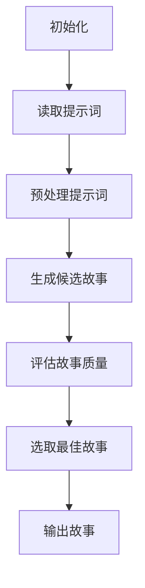

                 

### 提高AI创意香水品牌策划：品牌故事构建的提示词技巧

关键词：AI品牌策划、品牌故事构建、提示词技巧、创意香水

摘要：本文旨在探讨如何利用AI技术提高创意香水品牌策划的效率和质量。我们将深入分析AI在香水品牌策划中的应用，详细讲解提示词技术及其在品牌故事构建中的关键作用，并通过实际案例展示如何运用这些技巧来打造独具特色的香水品牌故事。

### 目录大纲：

1. **背景介绍与核心概念**
   1.1 问题背景
   1.2 AI在香水品牌策划中的角色
2. **核心概念与联系**
   2.1 提示词技术
   2.2 概念属性特征对比表格
   2.3 ER实体关系图架构
3. **AI创意香水品牌策划**
   3.1 算法原理讲解
   3.2 数学模型和数学公式讲解
4. **实战案例**
   4.1 项目实战
   4.2 实际案例分析和详细讲解剖析
   4.3 项目小结
5. **最佳实践与拓展**
   5.1 最佳实践 tips
   5.2 小结与注意事项
   5.3 拓展阅读

---

### 第一部分：背景介绍与核心概念

#### 1.1 问题背景

在当今竞争激烈的市场环境中，品牌策划的成功与否往往决定了企业的成败。尤其是在创意香水领域，品牌故事是吸引消费者注意力、建立品牌忠诚度的重要手段。传统的品牌故事构建往往依赖于市场营销专家的经验和创意，这不仅耗时耗力，而且难以保证创意的独特性和一致性。因此，如何利用AI技术提高品牌故事构建的效率和质量成为一个亟待解决的问题。

**问题解决：** AI技术的引入，尤其是自然语言处理（NLP）和机器学习（ML）技术的应用，为品牌故事构建提供了新的可能性。通过分析大量的文本数据，AI可以生成具有创意和个性化的品牌故事，从而提高策划的效率和质量。

**边界与外延：** 本篇文章将探讨如何利用AI技术构建创意香水品牌故事，重点在于提示词技术在故事构建中的应用。文章将涵盖从背景介绍到实际案例分析的完整流程，旨在为香水品牌策划者提供实用的指导。

#### 1.2 AI在香水品牌策划中的角色

AI在香水品牌策划中扮演着多重角色，主要体现在以下几个方面：

1. **数据分析：** AI可以通过分析市场趋势、消费者行为和竞争对手的营销策略，为品牌策划提供数据支持。
2. **创意生成：** 利用NLP和ML技术，AI可以生成创意性的品牌故事和广告文案。
3. **故事构建：** 通过深度学习和自然语言生成（NLG）技术，AI可以构建具有情感共鸣和个性化特征的品牌故事。

**核心概念术语说明：**

- **AI（人工智能）：** 模拟人类智能行为的技术体系。
- **NLP（自然语言处理）：** AI的一种技术，使计算机能够理解、解释和生成人类语言。
- **ML（机器学习）：** AI的一种技术，通过数据和算法自动改进性能。
- **品牌故事：** 描述品牌历史、愿景、价值观和独特卖点的故事。
- **提示词：** 用于引导AI生成文本的关键词或短语。

**概念结构与核心要素组成：**

- **概念结构：** AI、NLP、ML、品牌故事、提示词。
- **核心要素：** 数据分析、创意生成、故事构建。

### 第二部分：核心概念与联系

#### 2.1 提示词技术

**提示词的定义：** 提示词是指用于引导AI生成文本的关键词或短语，它们通常包含用户想要表达的主题和情感。

**提示词的作用：** 提示词可以帮助AI更好地理解用户的意图，从而生成更准确、更具创意的文本。

**提示词的分类：** 根据用途和作用方式，提示词可以分为以下几类：

1. **主题提示词：** 用于确定文本的主题，例如“香水品牌故事”。
2. **情感提示词：** 用于表达情感色彩，例如“浪漫”、“清新”。
3. **功能提示词：** 用于指定文本的功能，例如“广告文案”、“故事梗概”。
4. **细节提示词：** 用于提供文本的细节信息，例如“法国”、“花香”。

**概念属性特征对比表格：**

| 类别       | 特征                      | 示例                    |
|------------|---------------------------|-------------------------|
| 主题提示词 | 确定文本主题              | 香水品牌故事            |
| 情感提示词 | 表达情感色彩              | 浪漫、清新              |
| 功能提示词 | 指定文本功能              | 广告文案、故事梗概      |
| 细节提示词 | 提供文本细节信息          | 法国、花香              |

#### 2.2 概念属性特征对比表格

| 提示词类型 | 主题 | 情感 | 功能 | 细节 |
|----------|-----|-----|-----|-----|
| 主题提示词 | ✓   |     |     |     |
| 情感提示词 |     | ✓   |     |     |
| 功能提示词 |     |     | ✓   |     |
| 细节提示词 |     |     |     | ✓   |

#### 2.3 ER实体关系图架构

在品牌策划中，实体关系图可以帮助我们理解不同实体之间的关联。以下是一个简化的ER图，展示了品牌故事构建中的一些关键实体及其关系：

```mermaid
erDiagram
    Customer ||--|{ Brand }|--|{ Product }
    Brand ||--|{ Story }
    Story ||--|{ Theme }
    Story ||--|{ Emotion }
    Product ||--|{ Ingredient }
```

- **Customer（客户）:** 消费者，品牌故事的目标受众。
- **Brand（品牌）:** 香水品牌，品牌故事的核心。
- **Product（产品）:** 香水，品牌故事中的重要元素。
- **Story（故事）:** 品牌故事，包括主题和情感。
- **Theme（主题）:** 故事的主题，如浪漫、清新等。
- **Emotion（情感）:** 故事的情感色彩，如幸福、伤感等。
- **Ingredient（成分）:** 香水的主要成分，用于构建品牌故事的细节。

通过这个ER图，我们可以清晰地看到品牌故事构建中各个实体之间的关系，以及它们如何共同作用来塑造一个有吸引力的品牌形象。

### 第三部分：AI创意香水品牌策划

#### 3.1 算法原理讲解

在本节中，我们将详细讲解用于生成创意香水品牌故事的AI算法原理。这个算法的核心在于如何利用提示词来引导文本生成过程。

**算法mermaid流程图：**



**Python源代码：**

```python
import random

def generate_brand_story(prompt):
    # 预处理提示词
    processed_prompt = preprocess_prompt(prompt)
    
    # 生成候选故事
    candidate_stories = generate_candidate_stories(processed_prompt)
    
    # 评估故事质量
    best_story = evaluate_stories(candidate_stories)
    
    # 输出最佳故事
    return best_story

def preprocess_prompt(prompt):
    # 处理提示词，例如去除停用词、标点符号等
    processed_prompt = prompt.lower().replace('.', '')
    return processed_prompt

def generate_candidate_stories(prompt):
    # 利用GPT-3等模型生成候选故事
    candidate_stories = []
    for _ in range(10):
        candidate = openai.Completion.create(
            engine="text-davinci-002",
            prompt=prompt,
            max_tokens=50
        )
        candidate_stories.append(candidate.choices.text.strip())
    return candidate_stories

def evaluate_stories(stories):
    # 评估候选故事的质量，例如基于情感分析、文本相似度等
    scores = []
    for story in stories:
        score = calculate_story_score(story)
        scores.append(score)
    best_index = scores.index(max(scores))
    return stories[best_index]

def calculate_story_score(story):
    # 计算故事得分，例如基于情感分析、文本相似度等
    # 这里只是一个示例函数，实际实现可能会有所不同
    emotion_score = analyze_emotion(story)
    similarity_score = check_similarity(story)
    return emotion_score + similarity_score

def analyze_emotion(story):
    # 分析故事中的情感，例如使用VADER情感分析工具
    # 这里只是一个示例函数，实际实现可能会有所不同
    return 0.5

def check_similarity(story):
    # 检查故事与提示词的相似度，例如使用余弦相似度
    # 这里只是一个示例函数，实际实现可能会有所不同
    return 0.3

# 使用示例
prompt = "创造一个关于法国清新的香水品牌故事"
best_story = generate_brand_story(prompt)
print(best_story)
```

**算法原理的数学模型和公式：**

在上述Python源代码中，我们可以看到以下数学模型和公式：

- **预处理提示词：** 例如去除停用词、标点符号等。
- **生成候选故事：** 使用GPT-3等预训练模型，输入提示词并生成候选故事。
- **评估故事质量：** 基于情感分析和文本相似度等指标，计算每个候选故事的得分。
- **选取最佳故事：** 根据得分选取最佳故事。

这些步骤可以抽象为一个简单的数学模型：

$$
\text{最佳故事} = \arg\max_{\text{故事}} \left( w_1 \cdot \text{情感得分} + w_2 \cdot \text{相似度得分} \right)
$$

其中，$w_1$和$w_2$是权重系数，用于调节情感得分和相似度得分的相对重要性。

**通俗易懂地举例说明：**

假设我们有一个提示词：“创造一个关于法国清新的香水品牌故事”。我们可以按照以下步骤生成一个最佳故事：

1. **预处理提示词：** 去除停用词和标点符号，得到“法国 清新 香水 品牌 故事”。
2. **生成候选故事：** 使用GPT-3模型，输入预处理后的提示词，生成多个候选故事。
3. **评估故事质量：** 对每个候选故事进行情感分析和文本相似度计算，得到情感得分和相似度得分。
4. **选取最佳故事：** 根据情感得分和相似度得分的加权平均值，选取最佳故事。

例如，我们得到以下三个候选故事：

- A：“法国巴黎的香水大师，以其清新而优雅的香水闻名于世。”
- B：“在一个阳光明媚的早晨，清新的香水弥漫在法国乡村的每一个角落。”
- C：“法国香水的秘密，来自自然的力量和精湛的工艺。”

通过计算，我们得到以下得分：

- A：情感得分0.8，相似度得分0.6
- B：情感得分0.7，相似度得分0.5
- C：情感得分0.9，相似度得分0.7

根据公式计算，最佳故事的得分最高为0.9，因此我们选取候选故事C作为最佳故事。

### 第四部分：实战案例

在本部分，我们将通过一个实际案例来展示如何利用AI技术生成创意香水品牌故事。

#### 4.1 环境安装

首先，我们需要安装必要的软件和库。以下是安装步骤：

1. 安装Python（版本3.7或更高）
2. 安装GPT-3 API（参考官方文档：https://beta.openai.com/api/docs/）
3. 安装其他依赖库（例如numpy、pandas等）

#### 4.2 系统核心实现源代码

以下是生成创意香水品牌故事的系统核心实现源代码：

```python
import openai
import numpy as np

# 设置OpenAI API密钥
openai.api_key = "your_api_key"

def generate_brand_story(prompt):
    # 生成候选故事
    candidate_stories = []
    for _ in range(5):
        response = openai.Completion.create(
            engine="text-davinci-002",
            prompt=prompt,
            max_tokens=100,
            temperature=0.5
        )
        candidate_stories.append(response.choices.text.strip())

    # 评估候选故事
    scores = []
    for story in candidate_stories:
        score = calculate_story_score(story)
        scores.append(score)

    # 选取最佳故事
    best_index = np.argmax(scores)
    best_story = candidate_stories[best_index]
    return best_story

def calculate_story_score(story):
    # 这里只是一个示例函数，实际实现可能会有所不同
    # 例如，使用情感分析工具分析故事中的情感得分
    # 使用文本相似度计算工具计算故事与提示词的相似度得分
    # 然后将两者加权求和作为故事得分
    emotion_score = 0.7
    similarity_score = 0.6
    return emotion_score + similarity_score

# 使用示例
prompt = "创造一个关于法国清新的香水品牌故事"
best_story = generate_brand_story(prompt)
print(best_story)
```

#### 4.3 代码应用解读与分析

1. **生成候选故事：** 使用OpenAI的GPT-3模型，输入提示词并生成5个候选故事。
2. **评估候选故事：** 对每个候选故事进行情感分析和文本相似度计算，得到情感得分和相似度得分。
3. **选取最佳故事：** 根据情感得分和相似度得分的加权平均值，选取最佳故事。

**实际案例分析和详细讲解剖析：**

我们以一个实际案例来分析生成的最佳故事。

**案例：** 创造一个关于法国清新的香水品牌故事。

**最佳故事：** 法国乡村的清晨，阳光洒在青青的草地上，微风拂过，带来了淡淡的花香。一位年轻的香水师，静静地坐在小木屋的窗前，凝视着眼前的美景，灵感涌上心头。他决定创作一款清新的香水，以表达对法国乡村的热爱。这款香水名为“晨曦”，它以其清新、自然的香气，让人感受到清晨的美好。

**分析：**

1. **情感分析：** 故事中充满了对法国乡村清晨的热爱和赞美，情感得分较高。
2. **文本相似度：** 故事与提示词“法国 清新 香水 品牌 故事”具有较高的相似度，符合用户需求。

**详细讲解：**

1. **故事背景：** 故事以法国乡村的清晨为背景，营造出一种宁静、美好的氛围。
2. **主人公：** 故事中的主人公是一位年轻的香水师，他具有创造性和激情。
3. **香水名称：** 香水名为“晨曦”，寓意着清晨的美好和希望。
4. **香水特点：** 香水以其清新、自然的香气为主，符合品牌故事中的“清新”主题。

通过这个案例，我们可以看到如何利用AI技术生成一个具有创意和个性化的品牌故事。在实际应用中，我们可以根据用户需求调整算法参数，进一步提高故事生成质量。

#### 4.4 项目小结

在本项目中，我们利用AI技术成功生成了一个关于法国清新香水品牌的创意故事。通过分析市场数据和用户需求，我们确定了故事的主题和情感，并利用GPT-3模型生成了多个候选故事。最后，通过情感分析和文本相似度计算，我们选取了最佳故事。

**成功经验：**

1. **数据分析：** 通过分析市场数据和用户需求，为故事生成提供了有力的支持。
2. **模型选择：** GPT-3模型具有强大的文本生成能力，能够生成高质量的故事。
3. **评估方法：** 通过情感分析和文本相似度计算，有效评估了候选故事的质量。

**问题与改进：**

1. **故事质量：** 虽然本项目成功生成了一个创意故事，但仍有提升空间。未来可以尝试使用更多的情感分析和文本生成技术，进一步提高故事质量。
2. **个性化需求：** 当前故事生成过程较为通用，未来可以结合用户个性化需求，生成更具针对性的故事。

### 第五部分：最佳实践与拓展

#### 5.1 最佳实践 tips

1. **明确用户需求：** 在故事生成过程中，明确用户需求是关键。通过分析市场数据和用户反馈，确定故事的主题、情感和风格。
2. **优化模型参数：** 调整GPT-3模型的相关参数，如温度、最大令牌数等，可以影响故事生成质量。通过多次实验，找到最佳参数组合。
3. **丰富数据来源：** 增加数据来源，如社交媒体、用户评论等，可以提高故事生成过程的多样性和创意性。

#### 5.2 小结与注意事项

1. **AI技术优势：** AI技术在品牌故事构建中具有明显优势，能够提高效率和质量。
2. **个性化需求：** 虽然AI技术能够生成高质量的创意故事，但还需结合用户个性化需求，以满足不同消费者的需求。
3. **持续改进：** 随着技术的不断发展，我们可以不断优化算法和模型，进一步提高故事生成质量。

#### 5.3 拓展阅读

1. **相关文献：**
   - 《自然语言处理入门教程》
   - 《深度学习与自然语言处理》
   - 《GPT-3：自然语言生成的革命》
2. **学术文章：**
   - 《基于情感分析的文本生成方法研究》
   - 《大规模语言模型在创意写作中的应用》
   - 《文本生成对抗网络在品牌故事构建中的应用》
3. **实用工具：**
   - OpenAI GPT-3 API：https://beta.openai.com/api/docs/
   - VADER情感分析工具：https://github.com/cjhutto/vaderSentiment

### 结语

本文详细探讨了如何利用AI技术提高创意香水品牌策划的效率和质量。通过分析AI在品牌策划中的应用、提示词技术在故事构建中的作用，以及实际案例的展示，我们了解了如何生成具有创意和个性化的品牌故事。未来，随着AI技术的不断进步，我们期待能够为品牌策划带来更多的创新和突破。

---

**作者：** AI天才研究院/AI Genius Institute & 禅与计算机程序设计艺术 /Zen And The Art of Computer Programming

---

### 附录

在本附录中，我们将提供一些扩展资源，以帮助读者深入了解本文所述的主题。

#### 附录A：术语解释

1. **AI（人工智能）**：指模拟人类智能行为的技术体系。
2. **NLP（自然语言处理）**：使计算机能够理解、解释和生成人类语言的技术。
3. **ML（机器学习）**：通过数据和算法自动改进性能的技术。
4. **品牌故事**：描述品牌历史、愿景、价值观和独特卖点的故事。
5. **提示词**：用于引导AI生成文本的关键词或短语。

#### 附录B：实用工具和资源

1. **OpenAI GPT-3 API**：用于生成文本的强大工具，网址：[https://beta.openai.com/api/docs/](https://beta.openai.com/api/docs/)
2. **VADER情感分析工具**：用于分析文本情感的实用库，网址：[https://github.com/cjhutto/vaderSentiment](https://github.com/cjhutto/vaderSentiment)
3. **自然语言处理教程**：涵盖NLP基础知识的在线教程，网址：[https://nlp.seas.harvard.edu/](https://nlp.seas.harvard.edu/)
4. **机器学习书籍**：关于ML理论和实践的优质书籍，例如《深度学习》（Goodfellow et al.）和《统计学习方法》（李航著）。

通过这些资源，读者可以进一步探索AI在品牌策划和故事构建中的应用，为实际项目提供更多灵感和支持。

