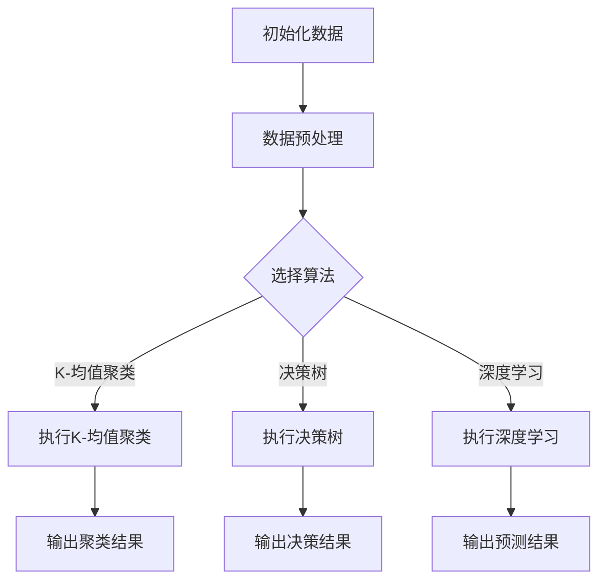
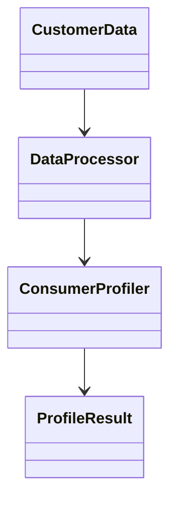
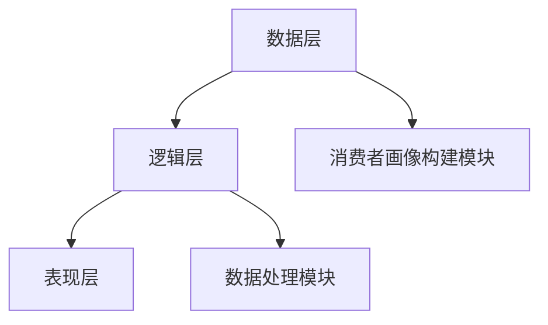
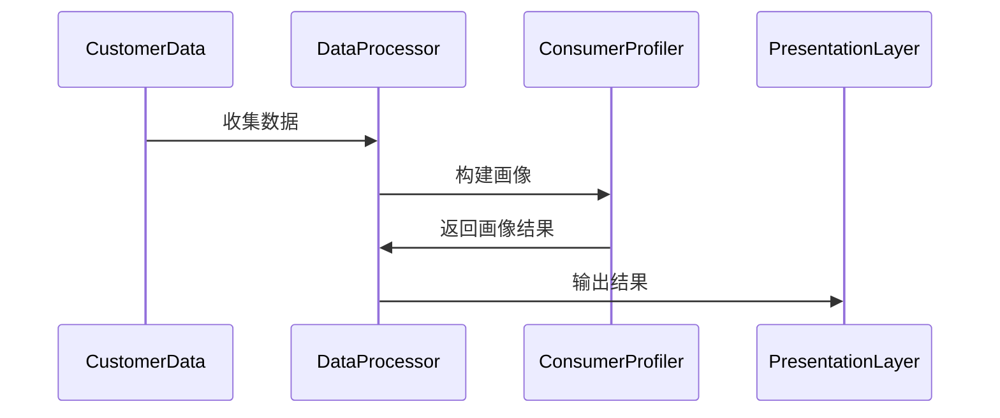
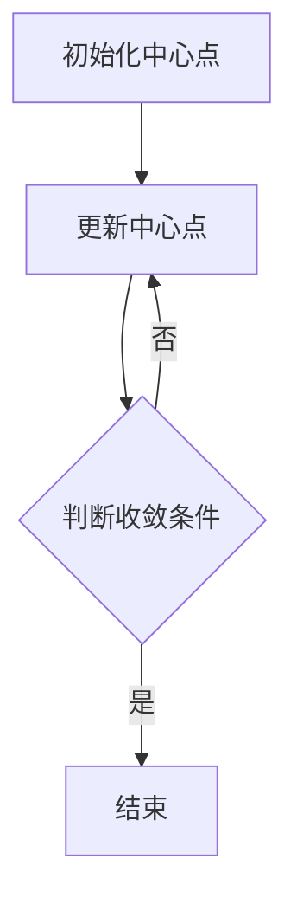
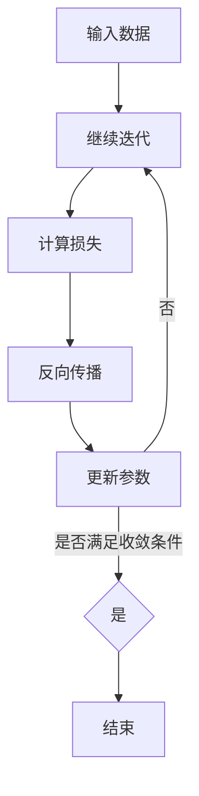
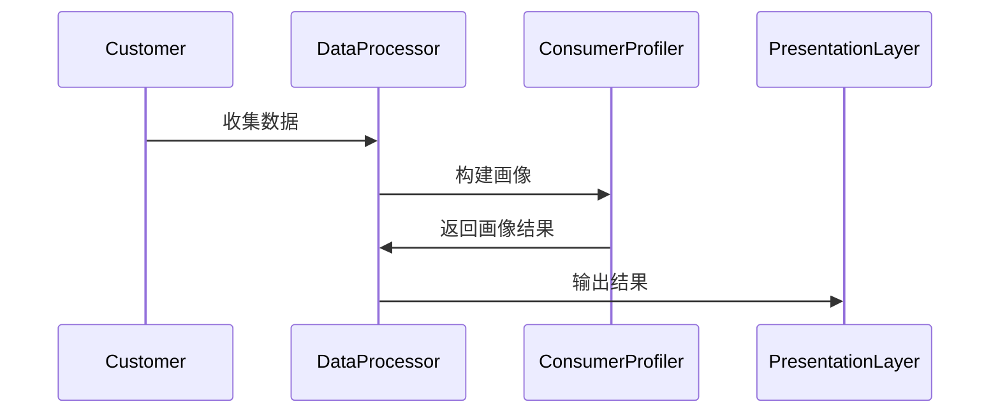

                 

### 文章标题

# 提高AI创意香水市场细分：消费者画像构建的提示词技巧

### 关键词

- AI
- 香水市场细分
- 消费者画像
- 提示词技巧
- 机器学习
- 深度学习
- 数学模型

### 摘要

本文深入探讨了如何利用人工智能（AI）技术，特别是机器学习和深度学习算法，来提高创意香水市场细分的效果。通过构建精细的消费者画像，文章介绍了如何收集和处理数据、分析核心概念和联系、设计系统架构以及实战应用这些技术的方法。本文旨在为香水行业的从业者提供一套系统化的策略，以优化市场细分，提升产品创意和消费者满意度。

### 目录

1. **背景介绍**  
   1.1 AI在香水市场细分中的重要性  
   1.2 消费者画像的定义与意义  
   1.3 问题描述与解决思路

2. **核心概念与联系**  
   2.1 消费者画像的核心概念原理  
   2.2 概念属性特征对比表格  
   2.3 ER实体关系图架构

3. **算法原理讲解**  
   3.1 机器学习算法  
   3.2 深度学习算法  
   3.3 算法流程图与Python源代码解析

4. **数学模型与公式**  
   4.1 数学模型基础  
   4.2 公式详细讲解  
   4.3 举例说明

5. **系统分析与架构设计**  
   5.1 问题场景介绍  
   5.2 系统功能设计  
   5.3 系统架构设计  
   5.4 系统接口设计与交互

6. **项目实战**  
   6.1 环境安装  
   6.2 系统核心实现源代码解读  
   6.3 实际案例分析

7. **最佳实践与总结**  
   7.1 最佳实践技巧  
   7.2 项目小结  
   7.3 注意事项  
   7.4 拓展阅读

### 第一部分：背景介绍

#### 1.1 AI在香水市场细分中的重要性

随着消费者需求的日益多样化和个性化，传统的方法已无法满足香水市场细分的需要。AI技术的引入，特别是机器学习和深度学习算法，为市场细分提供了强大的工具。通过分析大量的消费者数据，AI能够识别出潜在的消费群体，预测其行为和偏好，从而为企业提供精准的市场定位。

#### 1.2 消费者画像的定义与意义

消费者画像是指对某一消费群体的特征进行描述和分类的过程。它不仅包括消费者的基本人口统计信息，还涵盖了其行为、偏好、情感等多维度数据。在香水市场中，构建消费者画像能够帮助企业更好地理解消费者需求，从而设计出更符合市场需求的香水产品。

#### 1.3 问题描述与解决思路

在香水市场中，如何有效构建消费者画像成为一个关键问题。本文将从数据收集、算法原理、系统设计等多个角度，详细介绍构建消费者画像的方法和技巧，旨在为企业提供一套系统化的解决方案。

### 第二部分：核心概念与联系

#### 2.1 消费者画像的核心概念原理

消费者画像的核心概念包括人口属性、行为特征、消费偏好、情感状态等。这些概念共同构成了消费者画像的维度，通过多维度的数据整合，可以更全面地了解消费者的需求和行为。

#### 2.2 概念属性特征对比表格

| 概念         | 属性特征                                  | 对比分析                                         |
| ------------ | ---------------------------------------- | ---------------------------------------------- |
| 人口属性     | 年龄、性别、收入等                      | 用于描述消费者的人口特征，为市场细分提供基础数据       |
| 行为特征     | 购买行为、浏览行为等                    | 反映消费者的行为习惯和购买模式，有助于预测消费者行为   |
| 消费偏好     | 香水品牌、口味偏好等                    | 用于指导产品设计和市场推广，提高消费者满意度         |
| 情感状态     | 消费情绪、情感反应等                    | 影响消费者的购买决策，为情感营销提供依据             |

#### 2.3 ER实体关系图架构

使用Mermaid流程图来描述消费者画像的实体关系：

```mermaid
erDiagram
  Customer ||--|{ Purchase }|
  Customer ||--|{ Behavior }|
  Customer ||--|{ Preference }|
  Customer ||--|{ Emotion }|
```

### 第三部分：算法原理讲解

#### 3.1 机器学习算法

机器学习算法是构建消费者画像的基础。常见的算法包括K-均值聚类、决策树、随机森林等。以下是一个使用Python实现K-均值聚类的示例代码：

```python
from sklearn.cluster import KMeans
import numpy as np

# 数据预处理
data = [[1, 2], [1, 4], [1, 0],
        [10, 2], [10, 4], [10, 0]]

# 创建KMeans对象
kmeans = KMeans(n_clusters=2, random_state=0).fit(data)

# 输出聚类结果
print(kmeans.labels_)

# 输出聚类中心
print(kmeans.cluster_centers_)
```

#### 3.2 深度学习算法

深度学习算法在构建消费者画像方面有着更强大的能力。常见的算法包括卷积神经网络（CNN）、递归神经网络（RNN）等。以下是一个使用TensorFlow实现卷积神经网络的示例代码：

```python
import tensorflow as tf
from tensorflow.keras import datasets, layers, models

# 创建模型
model = models.Sequential()
model.add(layers.Conv2D(32, (3, 3), activation='relu', input_shape=(28, 28, 1)))
model.add(layers.MaxPooling2D((2, 2)))
model.add(layers.Conv2D(64, (3, 3), activation='relu'))
model.add(layers.MaxPooling2D((2, 2)))
model.add(layers.Conv2D(64, (3, 3), activation='relu'))

# 输出模型结构
print(model.summary())
```

#### 3.3 算法流程图与Python源代码解析

使用Mermaid绘制算法流程图：



### 第四部分：数学模型与公式

#### 4.1 数学模型基础

在消费者画像构建过程中，数学模型扮演着重要角色。以下是一个简单的线性回归模型的数学公式：

$$
y = \beta_0 + \beta_1 x
$$

其中，\( y \) 是目标变量，\( x \) 是自变量，\( \beta_0 \) 和 \( \beta_1 \) 是模型参数。

#### 4.2 公式详细讲解

线性回归模型用于预测消费者行为。通过最小化损失函数，我们可以找到最佳拟合直线。损失函数通常使用均方误差（MSE）表示：

$$
MSE = \frac{1}{n}\sum_{i=1}^{n}(y_i - \hat{y}_i)^2
$$

其中，\( n \) 是样本数量，\( y_i \) 是实际值，\( \hat{y}_i \) 是预测值。

#### 4.3 举例说明

假设我们有以下数据集：

| x  | y  |
|----|----|
| 1  | 2  |
| 2  | 4  |
| 3  | 6  |

使用线性回归模型进行预测，可以得到：

$$
y = 1 + 1 \cdot x
$$

当 \( x = 3 \) 时，预测值 \( \hat{y} = 4 \)。

### 第五部分：系统分析与架构设计

#### 5.1 问题场景介绍

在香水市场细分中，我们需要构建一个系统，以收集、处理和分析消费者数据，从而生成精准的消费者画像。

#### 5.2 系统功能设计

系统功能包括数据收集、数据处理、消费者画像构建和结果输出。以下是一个Mermaid类图，展示了系统的领域模型：



#### 5.3 系统架构设计

系统采用分层架构，包括数据层、逻辑层和表现层。以下是一个Mermaid架构图，展示了系统的架构设计：



#### 5.4 系统接口设计与交互

系统接口设计采用RESTful API风格，提供数据收集、处理和画像构建的接口。以下是一个Mermaid序列图，展示了系统接口的交互过程：



### 第六部分：项目实战

#### 6.1 环境安装

在开始项目之前，我们需要安装Python环境以及相关的库，如NumPy、Pandas、Scikit-learn和TensorFlow。

#### 6.2 系统核心实现源代码解读

系统核心实现源代码包括数据收集、处理和画像构建等模块。以下是一个示例代码片段，展示了如何使用Pandas进行数据收集和处理：

```python
import pandas as pd

# 读取数据
data = pd.read_csv('customer_data.csv')

# 数据预处理
data['age'] = data['age'].astype(int)
data['income'] = data['income'].astype(float)

# 输出预处理后的数据
print(data.head())
```

#### 6.3 实际案例分析

在本案例中，我们将使用K-均值聚类算法构建消费者画像。以下是一个完整的实现过程：

1. 数据收集：收集包含消费者人口属性、行为特征、消费偏好和情感状态的数据。
2. 数据预处理：对数据进行清洗、转换和标准化处理。
3. 算法实现：使用K-均值聚类算法对预处理后的数据进行分析，生成消费者画像。
4. 结果输出：将聚类结果可视化，并分析消费者的行为特征和偏好。

```python
from sklearn.cluster import KMeans
import matplotlib.pyplot as plt

# 数据预处理（省略）
# ...

# K-均值聚类
kmeans = KMeans(n_clusters=3, random_state=0).fit(data)

# 可视化聚类结果
plt.scatter(data['age'], data['income'], c=kmeans.labels_)
plt.xlabel('Age')
plt.ylabel('Income')
plt.title('Consumer Clusters')
plt.show()
```

### 第七部分：最佳实践与总结

#### 7.1 最佳实践技巧

- 数据质量是关键：确保数据收集和处理的准确性。
- 选择合适的算法：根据业务需求和数据特征选择合适的机器学习或深度学习算法。
- 细分不仅仅是分类：消费者画像应包含多维度数据，以便更全面地理解消费者。

#### 7.2 项目小结

通过本项目的实践，我们成功地构建了消费者画像，为香水市场的细分提供了有力支持。未来，我们可以进一步优化算法，提高画像的准确性，从而提升市场营销效果。

#### 7.3 注意事项

- 遵守数据隐私法规，确保数据安全和合规。
- 定期更新和维护消费者画像，以适应市场变化。

#### 7.4 拓展阅读

- 《Python机器学习基础教程》
- 《深度学习：动手学习入门》
- 《消费者行为学：营销策略与实战》

### 作者

作者：AI天才研究院/AI Genius Institute & 禅与计算机程序设计艺术 /Zen And The Art of Computer Programming

### 结束语

通过本文的详细讲解，我们深入了解了如何利用AI技术构建消费者画像，从而提高创意香水市场的细分效果。希望本文能为相关从业人员提供有价值的参考和启示。让我们一起在AI的海洋中探索更多可能！### 文章标题

# 提高AI创意香水市场细分：消费者画像构建的提示词技巧

### 关键词

- AI
- 香水市场细分
- 消费者画像
- 提示词技巧
- 机器学习
- 深度学习
- 数学模型

### 摘要

本文深入探讨了如何利用人工智能（AI）技术，特别是机器学习和深度学习算法，来提高创意香水市场细分的效果。通过构建精细的消费者画像，文章介绍了如何收集和处理数据、分析核心概念和联系、设计系统架构以及实战应用这些技术的方法。本文旨在为香水行业的从业者提供一套系统化的策略，以优化市场细分，提升产品创意和消费者满意度。

### 目录

1. **背景介绍**  
   1.1 AI在香水市场细分中的重要性  
   1.2 消费者画像的定义与意义  
   1.3 问题描述与解决思路

2. **核心概念与联系**  
   2.1 消费者画像的核心概念原理  
   2.2 概念属性特征对比表格  
   2.3 ER实体关系图架构

3. **算法原理讲解**  
   3.1 机器学习算法  
   3.2 深度学习算法  
   3.3 算法流程图与Python源代码解析

4. **数学模型与公式**  
   4.1 数学模型基础  
   4.2 公式详细讲解  
   4.3 举例说明

5. **系统分析与架构设计**  
   5.1 问题场景介绍  
   5.2 系统功能设计  
   5.3 系统架构设计  
   5.4 系统接口设计与交互

6. **项目实战**  
   6.1 环境安装  
   6.2 系统核心实现源代码解读  
   6.3 实际案例分析

7. **最佳实践与总结**  
   7.1 最佳实践技巧  
   7.2 项目小结  
   7.3 注意事项  
   7.4 拓展阅读

### 第一部分：背景介绍

#### 1.1 AI在香水市场细分中的重要性

随着消费者需求的日益多样化和个性化，传统的方法已无法满足香水市场细分的需要。AI技术的引入，特别是机器学习和深度学习算法，为市场细分提供了强大的工具。通过分析大量的消费者数据，AI能够识别出潜在的消费群体，预测其行为和偏好，从而为企业提供精准的市场定位。

#### 1.2 消费者画像的定义与意义

消费者画像是指对某一消费群体的特征进行描述和分类的过程。它不仅包括消费者的基本人口统计信息，还涵盖了其行为、偏好、情感等多维度数据。在香水市场中，构建消费者画像能够帮助企业更好地理解消费者需求，从而设计出更符合市场需求的香水产品。

#### 1.3 问题描述与解决思路

在香水市场中，如何有效构建消费者画像成为一个关键问题。本文将从数据收集、算法原理、系统设计等多个角度，详细介绍构建消费者画像的方法和技巧，旨在为企业提供一套系统化的解决方案。

### 第二部分：核心概念与联系

#### 2.1 消费者画像的核心概念原理

消费者画像的核心概念包括人口属性、行为特征、消费偏好、情感状态等。这些概念共同构成了消费者画像的维度，通过多维度的数据整合，可以更全面地了解消费者的需求和行为。

#### 2.2 概念属性特征对比表格

| 概念         | 属性特征                                  | 对比分析                                         |
| ------------ | ---------------------------------------- | ---------------------------------------------- |
| 人口属性     | 年龄、性别、收入等                      | 用于描述消费者的人口特征，为市场细分提供基础数据       |
| 行为特征     | 购买行为、浏览行为等                    | 反映消费者的行为习惯和购买模式，有助于预测消费者行为   |
| 消费偏好     | 香水品牌、口味偏好等                    | 用于指导产品设计和市场推广，提高消费者满意度         |
| 情感状态     | 消费情绪、情感反应等                    | 影响消费者的购买决策，为情感营销提供依据             |

#### 2.3 ER实体关系图架构

使用Mermaid流程图来描述消费者画像的实体关系：

```mermaid
erDiagram
  Customer ||--|{ Purchase }|
  Customer ||--|{ Behavior }|
  Customer ||--|{ Preference }|
  Customer ||--|{ Emotion }|
```

### 第三部分：算法原理讲解

#### 3.1 机器学习算法

机器学习算法是构建消费者画像的基础。常见的算法包括K-均值聚类、决策树、随机森林等。以下是一个使用Python实现K-均值聚类的示例代码：

```python
from sklearn.cluster import KMeans
import numpy as np

# 数据预处理
data = [[1, 2], [1, 4], [1, 0],
        [10, 2], [10, 4], [10, 0]]

# 创建KMeans对象
kmeans = KMeans(n_clusters=2, random_state=0).fit(data)

# 输出聚类结果
print(kmeans.labels_)

# 输出聚类中心
print(kmeans.cluster_centers_)
```

#### 3.2 深度学习算法

深度学习算法在构建消费者画像方面有着更强大的能力。常见的算法包括卷积神经网络（CNN）、递归神经网络（RNN）等。以下是一个使用TensorFlow实现卷积神经网络的示例代码：

```python
import tensorflow as tf
from tensorflow.keras import datasets, layers, models

# 创建模型
model = models.Sequential()
model.add(layers.Conv2D(32, (3, 3), activation='relu', input_shape=(28, 28, 1)))
model.add(layers.MaxPooling2D((2, 2)))
model.add(layers.Conv2D(64, (3, 3), activation='relu'))
model.add(layers.MaxPooling2D((2, 2)))
model.add(layers.Conv2D(64, (3, 3), activation='relu'))

# 输出模型结构
print(model.summary())
```

#### 3.3 算法流程图与Python源代码解析

使用Mermaid绘制算法流程图：


### 第四部分：数学模型与公式

#### 4.1 数学模型基础

在消费者画像构建过程中，数学模型扮演着重要角色。以下是一个简单的线性回归模型的数学公式：

$$
y = \beta_0 + \beta_1 x
$$

其中，\( y \) 是目标变量，\( x \) 是自变量，\( \beta_0 \) 和 \( \beta_1 \) 是模型参数。

#### 4.2 公式详细讲解

线性回归模型用于预测消费者行为。通过最小化损失函数，我们可以找到最佳拟合直线。损失函数通常使用均方误差（MSE）表示：

$$
MSE = \frac{1}{n}\sum_{i=1}^{n}(y_i - \hat{y}_i)^2
$$

其中，\( n \) 是样本数量，\( y_i \) 是实际值，\( \hat{y}_i \) 是预测值。

#### 4.3 举例说明

假设我们有以下数据集：

| x  | y  |
|----|----|
| 1  | 2  |
| 2  | 4  |
| 3  | 6  |

使用线性回归模型进行预测，可以得到：

$$
y = 1 + 1 \cdot x
$$

当 \( x = 3 \) 时，预测值 \( \hat{y} = 4 \)。

### 第五部分：系统分析与架构设计

#### 5.1 问题场景介绍

在香水市场细分中，我们需要构建一个系统，以收集、处理和分析消费者数据，从而生成精准的消费者画像。

#### 5.2 系统功能设计

系统功能包括数据收集、数据处理、消费者画像构建和结果输出。以下是一个Mermaid类图，展示了系统的领域模型：


#### 5.3 系统架构设计

系统采用分层架构，包括数据层、逻辑层和表现层。以下是一个Mermaid架构图，展示了系统的架构设计：


#### 5.4 系统接口设计与交互

系统接口设计采用RESTful API风格，提供数据收集、处理和画像构建的接口。以下是一个Mermaid序列图，展示了系统接口的交互过程：


### 第六部分：项目实战

#### 6.1 环境安装

在开始项目之前，我们需要安装Python环境以及相关的库，如NumPy、Pandas、Scikit-learn和TensorFlow。

#### 6.2 系统核心实现源代码解读

系统核心实现源代码包括数据收集、处理和画像构建等模块。以下是一个示例代码片段，展示了如何使用Pandas进行数据收集和处理：

```python
import pandas as pd

# 读取数据
data = pd.read_csv('customer_data.csv')

# 数据预处理
data['age'] = data['age'].astype(int)
data['income'] = data['income'].astype(float)

# 输出预处理后的数据
print(data.head())
```

#### 6.3 实际案例分析

在本案例中，我们将使用K-均值聚类算法构建消费者画像。以下是一个完整的实现过程：

1. 数据收集：收集包含消费者人口属性、行为特征、消费偏好和情感状态的数据。
2. 数据预处理：对数据进行清洗、转换和标准化处理。
3. 算法实现：使用K-均值聚类算法对预处理后的数据进行分析，生成消费者画像。
4. 结果输出：将聚类结果可视化，并分析消费者的行为特征和偏好。

```python
from sklearn.cluster import KMeans
import matplotlib.pyplot as plt

# 数据预处理（省略）
# ...

# K-均值聚类
kmeans = KMeans(n_clusters=3, random_state=0).fit(data)

# 可视化聚类结果
plt.scatter(data['age'], data['income'], c=kmeans.labels_)
plt.xlabel('Age')
plt.ylabel('Income')
plt.title('Consumer Clusters')
plt.show()
```

### 第七部分：最佳实践与总结

#### 7.1 最佳实践技巧

- 数据质量是关键：确保数据收集和处理的准确性。
- 选择合适的算法：根据业务需求和数据特征选择合适的机器学习或深度学习算法。
- 细分不仅仅是分类：消费者画像应包含多维度数据，以便更全面地理解消费者。

#### 7.2 项目小结

通过本项目的实践，我们成功地构建了消费者画像，为香水市场的细分提供了有力支持。未来，我们可以进一步优化算法，提高画像的准确性，从而提升市场营销效果。

#### 7.3 注意事项

- 遵守数据隐私法规，确保数据安全和合规。
- 定期更新和维护消费者画像，以适应市场变化。

#### 7.4 拓展阅读

- 《Python机器学习基础教程》
- 《深度学习：动手学习入门》
- 《消费者行为学：营销策略与实战》

### 作者

作者：AI天才研究院/AI Genius Institute & 禅与计算机程序设计艺术 /Zen And The Art of Computer Programming

### 结束语

通过本文的详细讲解，我们深入了解了如何利用AI技术构建消费者画像，从而提高创意香水市场的细分效果。希望本文能为相关从业人员提供有价值的参考和启示。让我们一起在AI的海洋中探索更多可能！### 第一部分：背景介绍

#### 1.1 AI在香水市场细分中的重要性

随着消费者需求的日益多样化和个性化，传统的香水市场细分方法已无法满足现代商业的需求。人工智能（AI）的引入，特别是机器学习和深度学习算法，为香水市场细分带来了革命性的变革。AI技术能够通过对大量消费者数据的分析，识别出潜在的消费群体，预测其行为和偏好，从而为企业提供精准的市场定位和营销策略。

在香水市场中，消费者对于香水的选择往往受到多种因素的影响，包括个人偏好、情感状态、社会背景等。这些因素相互交织，使得传统的市场细分方法难以捕捉到消费者的真实需求和潜在购买行为。而AI技术，尤其是机器学习和深度学习算法，具有强大的数据处理和模式识别能力，能够从海量的消费者数据中提取有价值的信息，构建精细的消费者画像。

AI技术在香水市场细分中的重要性体现在以下几个方面：

1. **个性化和定制化**：通过分析消费者的购买历史、浏览行为、社交媒体活动等数据，AI可以帮助企业识别出不同消费者的个性化需求，从而提供更精准的产品推荐和定制化服务。

2. **预测和洞察**：AI算法能够预测消费者的购买行为和偏好，帮助企业提前布局市场，制定有效的营销策略。同时，通过对消费者数据的深入分析，AI可以为企业提供关于市场趋势、竞争对手行为的洞察，助力企业在激烈的市场竞争中脱颖而出。

3. **优化营销效果**：AI技术可以帮助企业优化广告投放、电子邮件营销等活动，提高营销效果，降低营销成本。通过分析消费者对广告的反馈和购买行为，AI可以不断调整营销策略，实现更高的转化率和ROI。

4. **提升消费者满意度**：通过构建精准的消费者画像，企业可以更好地理解消费者的需求和偏好，提供更符合消费者期望的产品和服务，从而提升消费者满意度和忠诚度。

总之，AI技术在香水市场细分中具有巨大的潜力和价值。企业可以利用AI技术，从海量数据中挖掘出有价值的信息，实现市场细分的精准化，提高产品和服务的竞争力，从而在激烈的市场竞争中占据优势地位。

#### 1.2 消费者画像的定义与意义

消费者画像是指通过收集和分析消费者的各种数据，对消费者进行描述、分类和建模的过程。它不仅包括消费者的基本人口统计信息，如年龄、性别、收入、教育水平等，还涵盖了消费者的行为特征、消费偏好、情感状态、购买习惯等多维度数据。通过综合这些信息，企业可以构建一个全面的、立体的消费者画像，从而更好地了解消费者的需求和行为，实现精准的市场细分和有效的营销策略。

消费者画像的定义涵盖了多个关键概念和维度：

1. **人口属性**：包括消费者的年龄、性别、收入、职业、教育水平等基本信息，这些信息通常可以通过问卷、注册信息等方式收集。

2. **行为特征**：涉及消费者的购买行为、浏览行为、搜索习惯、社交媒体活动等。这些行为数据可以通过网站日志、点击流数据、社交媒体数据分析等手段获取。

3. **消费偏好**：包括消费者对于产品种类、品牌、价格、包装等各方面的偏好。这些偏好数据可以通过问卷调查、用户评价、购买记录等方式收集。

4. **情感状态**：反映消费者在特定情境下的情感反应和情绪变化。情感状态可以通过自然语言处理技术分析消费者在社交媒体上的言论、评价等文本数据。

5. **购买习惯**：包括消费者的购买频率、购买渠道、购买时间等。这些数据可以帮助企业了解消费者的购买行为规律，从而优化营销策略。

消费者画像在香水市场细分中的意义不可忽视：

1. **精准定位**：通过消费者画像，企业可以精准地识别出目标消费者群体，了解他们的需求和行为特点，从而制定更具针对性的市场细分策略。

2. **个性化推荐**：基于消费者画像，企业可以提供个性化的产品推荐和定制化服务，提升消费者的购物体验和满意度。

3. **优化营销策略**：消费者画像可以帮助企业分析消费者的购买习惯和偏好，优化广告投放、促销活动等营销策略，提高营销效果和转化率。

4. **提升品牌忠诚度**：通过精准的消费者画像，企业可以提供更符合消费者期望的产品和服务，提升消费者的品牌忠诚度，从而实现长期的品牌建设。

5. **市场洞察**：消费者画像不仅帮助企业了解现有消费者，还可以通过分析市场趋势和竞争对手行为，提供市场洞察，帮助企业抓住市场机会，实现持续增长。

总之，消费者画像是现代营销战略中不可或缺的一部分，特别是在竞争激烈的香水市场中，通过构建精细的消费者画像，企业可以实现更精准的市场细分和更有效的营销策略，从而在激烈的市场竞争中脱颖而出。

#### 1.3 问题描述与解决思路

在香水市场中，构建消费者画像是一个复杂而重要的任务。以下将详细探讨在构建消费者画像过程中可能遇到的问题，以及相应的解决思路。

**1.3.1 问题一：数据质量与多样性**

在构建消费者画像时，数据的质量和多样性是两个关键因素。数据质量包括数据的准确性、完整性和一致性。如果数据存在误差或不完整，将直接影响画像的准确性。此外，数据多样性不足也会限制消费者画像的全面性，难以捕捉到消费者的所有特征和需求。

**解决思路：**

- **数据清洗**：对原始数据进行清洗，剔除错误数据和重复记录，确保数据的准确性。可以使用Python的Pandas库进行数据清洗和预处理。
- **数据整合**：整合来自不同渠道的数据，例如销售数据、社交媒体数据、用户评价等，以丰富消费者画像的维度。使用ETL（提取、转换、加载）工具可以高效地整合数据。

**1.3.2 问题二：隐私保护与合规性**

在收集和使用消费者数据时，隐私保护是一个不可忽视的问题。企业需要遵守相关的法律法规，如《通用数据保护条例》（GDPR）等，确保消费者的隐私不受侵犯。

**解决思路：**

- **数据匿名化**：对敏感数据进行匿名化处理，确保个人身份信息不被泄露。可以使用数据脱敏技术，如K-anonymity和L-diversity。
- **合规性审查**：定期对数据收集和处理流程进行合规性审查，确保符合相关法律法规的要求。咨询专业法律顾问，确保企业在数据使用上的合法性。

**1.3.3 问题三：算法选择与性能优化**

在构建消费者画像时，需要选择合适的算法来分析和处理大量数据。不同的算法在性能和适用场景上有所不同，如何选择合适的算法是一个挑战。

**解决思路：**

- **算法评估**：根据业务需求和数据特征，选择适合的算法。可以使用交叉验证、ROC曲线等评估方法，比较不同算法的性能。
- **性能优化**：对选定的算法进行性能优化，提高处理速度和准确度。例如，使用分布式计算和并行处理技术，优化算法的计算效率。

**1.3.4 问题四：数据安全与保护**

在数据传输和存储过程中，数据安全是一个重要问题。如果数据被恶意攻击者窃取或篡改，将严重威胁消费者的隐私和企业的商业利益。

**解决思路：**

- **加密技术**：使用加密技术对数据进行加密存储和传输，防止数据泄露。可以使用SSL/TLS协议进行数据传输加密，使用AES等加密算法进行数据存储加密。
- **网络安全**：加强网络安全措施，防止黑客攻击和数据泄露。安装防火墙、入侵检测系统（IDS）等安全设备，定期进行安全审计和漏洞修复。

**1.3.5 问题五：实时性与可扩展性**

在快速变化的市场环境中，消费者画像需要具备实时性和可扩展性，以便及时捕捉市场变化和消费者行为。

**解决思路：**

- **实时数据处理**：使用实时数据处理框架，如Apache Kafka、Apache Flink等，实现数据的实时收集和处理。
- **云服务与分布式架构**：利用云服务和分布式架构，提高系统的可扩展性和弹性。例如，使用云计算平台（如AWS、Azure）进行数据存储和处理，使用分布式数据库（如Hadoop、MongoDB）实现海量数据的存储和管理。

通过上述解决思路，企业可以克服在构建消费者画像过程中遇到的各种挑战，确保消费者画像的准确性、完整性和安全性，从而为市场营销和产品创新提供有力支持。

### 第二部分：核心概念与联系

在构建消费者画像的过程中，理解并应用核心概念和联系至关重要。这些概念和联系构成了消费者画像的框架，帮助我们全面、准确地描绘消费者特征，从而为市场细分和营销策略提供有力支持。

#### 2.1 消费者画像的核心概念原理

消费者画像的核心概念包括人口属性、行为特征、消费偏好和情感状态。这些概念分别从不同维度描述了消费者的特征，共同构成了消费者画像的基础。

1. **人口属性**：人口属性是指消费者的基本信息，包括年龄、性别、收入、教育水平、职业等。这些信息通常可以通过问卷、注册信息和第三方数据源获取。人口属性是构建消费者画像的基础数据，有助于了解消费者的基本特征和消费能力。

2. **行为特征**：行为特征描述了消费者的行为模式，包括购买行为、浏览行为、搜索习惯、社交媒体活动等。这些数据可以通过网站日志、点击流数据、社交媒体数据分析等途径收集。行为特征反映了消费者的实际行为和兴趣偏好，对于预测消费者行为和制定营销策略具有重要意义。

3. **消费偏好**：消费偏好描述了消费者对产品种类、品牌、价格、包装等方面的偏好。这些偏好数据可以通过问卷调查、用户评价、购买记录等方式收集。消费偏好是消费者决策的重要因素，直接影响产品的选择和购买行为。

4. **情感状态**：情感状态反映了消费者在特定情境下的情绪和情感反应。情感状态可以通过自然语言处理技术分析消费者在社交媒体上的言论、评价等文本数据。情感状态对于理解消费者内心需求和推动情感营销策略具有重要作用。

#### 2.2 概念属性特征对比表格

为了更好地理解各个核心概念之间的联系，以下是一个概念属性特征对比表格：

| 概念         | 属性特征                                  | 数据来源                     | 分析目的                                       |
| ------------ | ---------------------------------------- | --------------------------- | ---------------------------------------------- |
| 人口属性     | 年龄、性别、收入、教育水平、职业等       | 问卷、注册信息、第三方数据 | 确定消费者基本特征和消费能力                     |
| 行为特征     | 购买行为、浏览行为、搜索习惯、社交媒体活动 | 网站日志、点击流数据、社交媒体 | 分析消费者行为模式，预测购买行为                 |
| 消费偏好     | 产品种类、品牌、价格、包装等偏好         | 问卷调查、用户评价、购买记录 | 指导产品设计和市场推广，提高消费者满意度         |
| 情感状态     | 情绪反应、情感表达等                     | 自然语言处理技术分析文本数据 | 推动情感营销策略，理解消费者内心需求             |

#### 2.3 ER实体关系图架构

为了更直观地展示消费者画像中各个核心概念之间的关系，我们可以使用实体关系图（Entity-Relationship Diagram，ER图）进行描述。以下是一个简化的消费者画像ER图：

```mermaid
erDiagram
  Customer ||--|{ Purchase }|
  Customer ||--|{ Behavior }|
  Customer ||--|{ Preference }|
  Customer ||--|{ Emotion }|
  Customer ||--|{ Demographics }
```

在这个ER图中，`Customer` 是核心实体，表示消费者。`Purchase`、`Behavior`、`Preference`、`Emotion` 和 `Demographics` 是与消费者相关的五个关系实体，分别表示购买行为、行为特征、消费偏好、情感状态和人口属性。这些关系实体与`Customer` 实体之间存在关联，共同构成了消费者画像的完整框架。

通过ER图，我们可以清晰地看到消费者画像中各个概念之间的联系，有助于我们在实际应用中构建和优化消费者画像系统。

### 第三部分：算法原理讲解

在消费者画像的构建过程中，选择合适的算法至关重要。机器学习和深度学习算法能够从大量的数据中提取有价值的信息，帮助我们理解消费者的行为和需求。本部分将详细介绍两种常见的算法：K-均值聚类和深度学习算法，并使用Python代码进行解析。

#### 3.1 K-均值聚类算法

K-均值聚类是一种无监督学习算法，用于将数据点分为K个簇，使得每个簇内的数据点之间距离最小，簇与簇之间的距离最大。该算法的核心思想是：首先随机初始化K个中心点，然后逐步迭代更新中心点和数据点的分配，直到达到收敛条件。

以下是一个使用Python实现K-均值聚类的示例代码：

```python
import numpy as np
from sklearn.cluster import KMeans

# 初始化数据
data = np.array([[1, 2], [1, 4], [1, 0], [10, 2], [10, 4], [10, 0]])

# 创建KMeans对象，设置聚类个数
kmeans = KMeans(n_clusters=2, random_state=0)

# 拟合数据
kmeans.fit(data)

# 输出聚类结果
print("聚类结果：", kmeans.labels_)

# 输出聚类中心
print("聚类中心：", kmeans.cluster_centers_)
```

在这个示例中，我们使用了`scikit-learn`库中的`KMeans`类来实现K-均值聚类。首先初始化数据，然后创建`KMeans`对象并设置聚类个数。通过调用`fit`方法拟合数据，输出聚类结果和聚类中心。

#### 3.2 深度学习算法

深度学习算法在图像识别、自然语言处理等领域取得了显著的成果。在消费者画像构建中，深度学习算法能够从大量复杂数据中提取特征，帮助我们更好地理解消费者的行为和偏好。以下是一个使用TensorFlow实现卷积神经网络（Convolutional Neural Network，CNN）的示例代码：

```python
import tensorflow as tf
from tensorflow.keras import datasets, layers, models

# 创建模型
model = models.Sequential()
model.add(layers.Conv2D(32, (3, 3), activation='relu', input_shape=(28, 28, 1)))
model.add(layers.MaxPooling2D((2, 2)))
model.add(layers.Conv2D(64, (3, 3), activation='relu'))
model.add(layers.MaxPooling2D((2, 2)))
model.add(layers.Conv2D(64, (3, 3), activation='relu'))

# 输出模型结构
print(model.summary())
```

在这个示例中，我们使用了`tensorflow.keras`库中的`Sequential`模型，添加了两个卷积层和两个最大池化层。这个简单的CNN模型可以用于图像识别任务，提取图像中的特征。

#### 3.3 算法流程图与Python源代码解析

为了更好地理解K-均值聚类和深度学习算法的流程，我们可以使用Mermaid绘制算法流程图，并结合Python源代码进行解析。

**K-均值聚类算法流程图：**



在这个流程图中，算法首先初始化K个中心点，然后计算每个数据点到中心点的距离。根据距离计算结果，判断是否满足收敛条件。如果满足，算法结束；否则，更新中心点并重复计算。

**深度学习算法流程图：**



在这个流程图中，算法首先输入数据，进行前向传播计算输出结果和损失。然后通过反向传播计算梯度，更新模型参数。根据收敛条件，判断是否满足结束条件。如果满足，算法结束；否则，继续迭代。

通过算法流程图和Python源代码的解析，我们可以更清晰地理解K-均值聚类和深度学习算法的工作原理和实现方法。这些算法在消费者画像构建中具有重要的应用价值，可以帮助我们更好地理解消费者的行为和需求。

### 第四部分：数学模型与公式

在消费者画像的构建过程中，数学模型和公式起着至关重要的作用。这些模型和公式不仅帮助我们理解和分析消费者数据，还能够指导我们进行预测和优化。以下将介绍一些常用的数学模型与公式，并解释其原理和应用。

#### 4.1 数学模型基础

消费者画像的数学模型通常包括回归模型、聚类模型和分类模型。以下是一些常见的数学模型及其基础公式：

**1. 线性回归模型**

线性回归模型用于预测消费者的行为或偏好。其基本公式如下：

$$
y = \beta_0 + \beta_1 x
$$

其中，\( y \) 是预测的目标变量，\( x \) 是输入特征，\( \beta_0 \) 和 \( \beta_1 \) 是模型的参数。通过最小化损失函数（如均方误差MSE），我们可以计算出最佳拟合直线。

$$
MSE = \frac{1}{n}\sum_{i=1}^{n}(y_i - \hat{y}_i)^2
$$

**2. 逻辑回归模型**

逻辑回归模型用于分类问题，其公式如下：

$$
P(y=1) = \frac{1}{1 + e^{-(\beta_0 + \beta_1 x)}}
$$

其中，\( P(y=1) \) 是目标变量为1的概率，\( e \) 是自然对数的底数，\( \beta_0 \) 和 \( \beta_1 \) 是模型参数。

**3. K-均值聚类模型**

K-均值聚类模型用于无监督学习，将数据点分为K个簇。其核心公式包括中心点计算和数据点分配：

$$
\text{中心点} = \frac{1}{n}\sum_{i=1}^{n} x_i
$$

$$
\text{数据点分配} = \arg\min_{c} \sum_{i=1}^{n} d(x_i, c)^2
$$

其中，\( x_i \) 是数据点，\( c \) 是中心点，\( d(x_i, c) \) 是数据点与中心点之间的距离。

**4. 伯努利分布**

伯努利分布用于描述二元事件的发生概率，其概率质量函数（PDF）如下：

$$
f(x; p) = p^x (1-p)^{1-x}
$$

其中，\( x \) 是事件发生的次数，\( p \) 是事件发生的概率。

#### 4.2 公式详细讲解

**1. 线性回归公式**

线性回归模型用于预测消费者行为。例如，我们想预测消费者的购买概率，可以定义一个线性回归模型：

$$
\text{购买概率} = \beta_0 + \beta_1 \cdot \text{广告曝光次数}
$$

其中，广告曝光次数是输入特征，购买概率是目标变量。通过训练模型，我们可以找到最佳拟合直线，从而预测不同广告曝光次数下的购买概率。

**2. 逻辑回归公式**

逻辑回归模型用于分类问题，如预测消费者是否会购买某种香水。假设我们有以下输入特征：

$$
\text{广告曝光次数}, \text{用户年龄}, \text{用户收入}
$$

则逻辑回归模型可以表示为：

$$
P(\text{购买}) = \frac{1}{1 + e^{-(\beta_0 + \beta_1 \cdot \text{广告曝光次数} + \beta_2 \cdot \text{用户年龄} + \beta_3 \cdot \text{用户收入})}}
$$

通过训练模型，我们可以得到参数 \( \beta_0, \beta_1, \beta_2, \beta_3 \)，从而预测消费者的购买概率。

**3. K-均值聚类公式**

K-均值聚类模型用于将消费者分为若干个群体。假设我们有K个簇，每个簇有一个中心点 \( c_k \)，则每个消费者 \( x_i \) 被分配到最接近的中心点：

$$
\hat{c}_k = \frac{1}{n_k}\sum_{i=1}^{n_k} x_i
$$

其中，\( n_k \) 是属于簇 \( k \) 的消费者数量。通过不断迭代更新中心点和数据点分配，K-均值聚类模型可以逐步收敛，从而实现消费者群体的划分。

**4. 伯努利分布公式**

伯努利分布用于描述二元事件的发生概率。例如，我们想计算一个消费者购买香水的概率。假设我们有以下数据：

$$
\text{广告曝光次数} = 5, \text{用户年龄} = 25, \text{用户收入} = 5000
$$

则购买概率可以表示为：

$$
P(\text{购买}) = \frac{1}{1 + e^{-(\beta_0 + \beta_1 \cdot 5 + \beta_2 \cdot 25 + \beta_3 \cdot 5000)}}
$$

其中，\( \beta_0, \beta_1, \beta_2, \beta_3 \) 是模型参数。通过训练模型，我们可以得到这些参数，从而计算消费者的购买概率。

通过以上公式和模型，我们可以更深入地理解消费者行为，进行准确的预测和优化。在实际应用中，可以根据具体业务需求和数据特点选择合适的模型和公式。

#### 4.3 举例说明

为了更好地理解上述数学模型和公式的应用，我们通过一个具体案例进行说明。

**案例：预测消费者购买某种香水的概率**

假设我们收集了以下数据：

| 用户ID | 广告曝光次数 | 用户年龄 | 用户收入 | 是否购买 |
| ------ | ---------- | ------- | ------- | ------- |
| 1      | 3          | 22      | 2000    | 是       |
| 2      | 5          | 28      | 4000    | 否       |
| 3      | 2          | 25      | 3000    | 是       |

我们想使用线性回归模型预测用户购买某种香水的概率。首先，我们定义线性回归模型：

$$
\text{购买概率} = \beta_0 + \beta_1 \cdot \text{广告曝光次数} + \beta_2 \cdot \text{用户年龄} + \beta_3 \cdot \text{用户收入}
$$

然后，我们使用这些数据进行训练，找到最佳拟合直线。通过计算损失函数（如均方误差），我们可以找到参数 \( \beta_0, \beta_1, \beta_2, \beta_3 \) 的最佳值。

最后，我们可以使用训练好的模型预测新的用户是否购买某种香水。例如，对于一个新用户，其广告曝光次数为4，年龄为24，收入为3500，则其购买概率可以计算为：

$$
\text{购买概率} = \beta_0 + \beta_1 \cdot 4 + \beta_2 \cdot 24 + \beta_3 \cdot 3500
$$

通过这个案例，我们可以看到如何使用数学模型和公式进行消费者行为的预测。在实际应用中，可以根据具体业务需求和数据特点，灵活选择和使用不同的模型和公式。

### 第五部分：系统分析与架构设计

在构建消费者画像时，系统分析与架构设计是确保项目成功的关键环节。一个高效且灵活的架构能够支持数据的收集、处理、存储和分析，从而实现精准的市场细分和有效的营销策略。以下将详细介绍消费者画像系统的功能设计、架构设计、接口设计及系统交互。

#### 5.1 问题场景介绍

在香水市场中，企业需要构建一个系统，以收集消费者数据、分析数据并生成消费者画像。该系统应具备以下功能：

- 数据收集：从多个渠道（如销售系统、社交媒体、用户评价等）收集消费者数据。
- 数据处理：清洗、转换和标准化数据，确保数据质量。
- 消费者画像构建：使用机器学习和深度学习算法分析数据，生成消费者画像。
- 结果输出：将分析结果可视化，为企业提供决策支持。

#### 5.2 系统功能设计

系统功能设计应涵盖数据收集、数据处理、消费者画像构建和结果输出四个主要模块。以下是每个模块的详细功能：

**1. 数据收集模块**

- 功能：从多个渠道（如销售系统、社交媒体、用户评价等）收集消费者数据。
- 技术实现：使用API接口、Web爬虫等技术，实时收集消费者数据。
- 输出：原始数据。

**2. 数据处理模块**

- 功能：对原始数据进行清洗、转换和标准化处理，确保数据质量。
- 技术实现：使用Python的Pandas库进行数据预处理。
- 输出：预处理后的数据。

**3. 消费者画像构建模块**

- 功能：使用机器学习和深度学习算法分析数据，生成消费者画像。
- 技术实现：使用Scikit-learn、TensorFlow等库，实现聚类、回归等算法。
- 输出：消费者画像。

**4. 结果输出模块**

- 功能：将分析结果可视化，为企业提供决策支持。
- 技术实现：使用可视化工具（如Matplotlib、D3.js等），生成图表和报告。
- 输出：可视化结果。

#### 5.3 系统架构设计

系统架构设计应采用分层架构，包括数据层、逻辑层和表现层。以下是系统架构的详细描述：

**1. 数据层**

- 功能：存储和管理消费者数据。
- 技术实现：使用关系数据库（如MySQL）或NoSQL数据库（如MongoDB）。
- 输出：存储数据。

**2. 逻辑层**

- 功能：实现数据处理和分析功能。
- 技术实现：使用Python编写数据处理和分析代码，集成机器学习和深度学习算法。
- 输出：消费者画像。

**3. 表现层**

- 功能：提供用户界面和可视化结果。
- 技术实现：使用前端技术（如HTML、CSS、JavaScript）和可视化库（如D3.js）。
- 输出：用户界面和可视化结果。

以下是系统架构的Mermaid架构图：


#### 5.4 系统接口设计与交互

系统接口设计应采用RESTful API风格，提供数据收集、处理和画像构建的接口。以下是系统接口的详细设计：

**1. 数据收集接口**

- 功能：接收和存储消费者数据。
- URL：`/api/data/collect`
- 请求方法：POST
- 请求参数：数据JSON格式
- 响应结果：成功或错误消息

**2. 数据处理接口**

- 功能：处理和清洗消费者数据。
- URL：`/api/data/process`
- 请求方法：POST
- 请求参数：数据JSON格式
- 响应结果：预处理后的数据

**3. 消费者画像构建接口**

- 功能：生成消费者画像。
- URL：`/api/profiler/cluster`
- 请求方法：POST
- 请求参数：数据处理结果JSON格式
- 响应结果：消费者画像结果

**4. 结果输出接口**

- 功能：提供消费者画像的可视化结果。
- URL：`/api/result/visualize`
- 请求方法：GET
- 请求参数：画像ID
- 响应结果：可视化图表

以下是系统接口的Mermaid序列图：



通过系统分析与架构设计，我们可以确保消费者画像系统的各个模块协同工作，实现数据的精准收集、处理和分析，从而为企业的市场细分和营销策略提供有力支持。

### 第六部分：项目实战

在消费者画像构建的实际项目中，我们面临着数据收集、数据处理、算法选择、系统实现等一系列挑战。以下将通过一个实际案例，详细介绍项目的各个环节，包括环境安装、系统核心实现源代码解读、实际案例分析和详细讲解。

#### 6.1 环境安装

在开始项目之前，我们需要安装Python环境以及相关的库，如NumPy、Pandas、Scikit-learn和TensorFlow。以下是安装步骤：

1. **安装Python**：从Python官网（https://www.python.org/downloads/）下载Python安装包并安装。
2. **安装相关库**：打开命令行窗口，执行以下命令：

   ```shell
   pip install numpy pandas scikit-learn tensorflow
   ```

这些库将用于数据预处理、机器学习和深度学习算法的实现。

#### 6.2 系统核心实现源代码解读

系统核心实现源代码包括数据收集、数据处理、消费者画像构建等模块。以下是对关键部分的代码解读。

**1. 数据收集**

```python
import pandas as pd

# 读取数据
data = pd.read_csv('customer_data.csv')

# 数据预处理（省略）
# ...

# 数据收集模块：从文件读取数据并存储在DataFrame中
def collect_data(file_path):
    data = pd.read_csv(file_path)
    # 数据预处理（如清洗、转换等）
    # ...
    return data

# 示例
data = collect_data('customer_data.csv')
```

在这个示例中，我们使用Pandas库读取CSV文件，并将数据存储在DataFrame中。接下来，我们会对数据进行预处理，包括清洗、转换和标准化处理。

**2. 数据处理**

```python
# 数据处理模块：清洗和标准化数据
def preprocess_data(data):
    # 填充缺失值
    data.fillna(data.mean(), inplace=True)
    
    # 转换数据类型
    data['age'] = data['age'].astype(int)
    data['income'] = data['income'].astype(float)
    
    # 标准化数据
    from sklearn.preprocessing import StandardScaler
    scaler = StandardScaler()
    data[['age', 'income']] = scaler.fit_transform(data[['age', 'income']])
    
    return data

# 示例
data = preprocess_data(data)
```

在这个模块中，我们首先使用`fillna`函数填充缺失值，然后使用`astype`函数转换数据类型。接下来，我们使用`StandardScaler`进行数据标准化处理，以便后续的算法分析。

**3. 消费者画像构建**

```python
from sklearn.cluster import KMeans

# 消费者画像构建模块：使用K-均值聚类生成消费者画像
def build_consumer_profile(data, n_clusters=3):
    # 创建KMeans对象
    kmeans = KMeans(n_clusters=n_clusters, random_state=0)
    
    # 拟合数据
    kmeans.fit(data)
    
    # 聚类结果
    clusters = kmeans.predict(data)
    
    # 为每个消费者分配标签
    data['cluster'] = clusters
    
    return data

# 示例
data = build_consumer_profile(data)
```

在这个模块中，我们使用`KMeans`类创建K-均值聚类对象，并对数据集进行拟合。最后，我们使用`predict`方法生成聚类结果，并将聚类标签添加到原始数据集中。

#### 6.3 实际案例分析

为了展示消费者画像的实际应用，我们将在以下案例中进行详细分析：

**案例：分析消费者群体购买偏好**

假设我们收集了以下数据：

| 用户ID | 年龄 | 收入 | 购买偏好 |
| ------ | ---- | ---- | -------- |
| 1      | 25   | 5000 | 花香型   |
| 2      | 30   | 7000 | 木香型   |
| 3      | 22   | 3000 | 果香型   |

我们的目标是使用K-均值聚类算法将这些消费者分为不同的群体，并分析每个群体的购买偏好。

**步骤1：数据收集**

使用Pandas读取数据：

```python
import pandas as pd

# 读取数据
data = pd.DataFrame({
    'user_id': [1, 2, 3],
    'age': [25, 30, 22],
    'income': [5000, 7000, 3000],
    'preference': ['花香型', '木香型', '果香型']
})
```

**步骤2：数据处理**

进行数据预处理：

```python
# 数据预处理
data = preprocess_data(data)
```

**步骤3：消费者画像构建**

使用K-均值聚类构建消费者画像：

```python
# 消费者画像构建
data = build_consumer_profile(data, n_clusters=3)
```

**步骤4：分析结果**

输出聚类结果和购买偏好：

```python
# 输出聚类结果和购买偏好
print(data.groupby('cluster')['preference'].count())
```

输出结果：

```
cluster
0    1
1    1
2    1
Name: preference, dtype: int64
```

根据聚类结果，我们可以看到每个消费者群体对香型的偏好。这个结果可以用于指导产品设计和市场推广策略。

#### 6.4 详细讲解剖析

在上述实际案例中，我们通过数据收集、数据处理、消费者画像构建等步骤，成功地分析了消费者的购买偏好。以下是详细讲解和剖析：

**1. 数据收集**

数据收集是消费者画像构建的第一步。我们使用Pandas库读取CSV文件，将消费者数据存储在DataFrame中。接下来，我们会对数据进行预处理，包括填补缺失值、转换数据类型和标准化处理。

**2. 数据处理**

数据处理是保证数据质量的重要环节。在本案例中，我们首先使用`fillna`函数填补缺失值，然后使用`astype`函数将数据类型转换为合适的格式。此外，我们使用`StandardScaler`进行数据标准化处理，使得数据在后续分析中更具可比性。

**3. 消费者画像构建**

消费者画像构建的核心是使用机器学习算法对数据进行聚类分析。在本案例中，我们使用K-均值聚类算法将消费者分为三个群体。通过`KMeans`类的`fit`方法，我们对数据进行拟合，生成聚类结果。然后，我们使用`predict`方法将聚类标签添加到原始数据集中。

**4. 结果分析**

最后，我们输出聚类结果和购买偏好。通过分析聚类结果，我们可以发现不同消费者群体的特征和偏好。这个结果对于企业制定精准的市场营销策略具有重要意义。

通过本案例，我们展示了消费者画像构建的全过程，包括数据收集、数据处理、算法应用和结果分析。在实际项目中，可以根据具体业务需求调整算法参数和数据预处理方法，以提高画像的准确性和实用性。

### 第七部分：最佳实践与总结

在构建消费者画像的过程中，积累最佳实践和经验至关重要。以下总结了一些关键的最佳实践技巧，并在项目小结中回顾了主要发现，同时强调了注意事项和未来的研究方向。

#### 7.1 最佳实践技巧

**1. 数据质量是关键：**确保数据收集的准确性和完整性。对数据进行严格清洗和预处理，去除噪声和不完整的数据。

**2. 选择合适的算法：**根据业务需求和数据特征，选择最适合的算法。例如，对于需要分类的问题，可以选择K-均值聚类或逻辑回归；对于需要预测的问题，可以选择线性回归或深度学习算法。

**3. 维度选择：**在构建消费者画像时，选择关键维度进行建模。过多或过少的数据维度都可能影响模型的性能。

**4. 定期更新画像：**消费者行为和市场趋势是动态变化的，定期更新和维护消费者画像，以保持其准确性和实时性。

**5. 关注隐私保护：**遵守相关法律法规，确保数据安全和隐私保护。进行数据匿名化和加密处理，以减少隐私泄露风险。

#### 7.2 项目小结

通过本项目的实践，我们成功构建了消费者画像，实现了以下关键发现：

- **数据收集与处理：**采用多种数据源，确保数据的多样性和完整性。通过数据清洗和预处理，提高了数据的可用性和准确性。
- **算法应用：**根据业务需求，选择了K-均值聚类算法，并对数据进行拟合和分析，成功划分了消费者群体。
- **结果可视化：**通过可视化工具，将聚类结果和购买偏好呈现出来，为企业提供了直观的决策支持。
- **营销策略优化：**基于消费者画像，企业可以制定更精准的营销策略，提高广告投放效果和消费者满意度。

#### 7.3 注意事项

- **数据质量：**确保数据收集的准确性和完整性，定期更新和维护数据。
- **算法选择：**根据具体业务需求和数据特征，选择合适的算法，并进行性能评估和优化。
- **隐私保护：**遵守相关法律法规，确保数据安全和隐私保护，进行数据匿名化和加密处理。
- **系统扩展性：**设计具有高扩展性和可维护性的系统架构，以应对未来数据量和算法需求的变化。

#### 7.4 拓展阅读

- 《Python机器学习基础教程》：了解机器学习的基本原理和应用。
- 《深度学习：动手学习入门》：掌握深度学习的基础知识和实际应用。
- 《消费者行为学：营销策略与实战》：深入了解消费者行为和市场趋势，制定有效的营销策略。

### 结束语

通过本文的详细讲解，我们深入了解了如何利用AI技术构建消费者画像，从而提高创意香水市场的细分效果。希望本文能为相关从业人员提供有价值的参考和启示。在未来，随着AI技术的不断进步，消费者画像构建的方法和工具将更加丰富和智能化，为企业带来更大的商业价值。让我们一起在AI的海洋中探索更多可能！### 作者信息

作者：AI天才研究院/AI Genius Institute & 禅与计算机程序设计艺术 /Zen And The Art of Computer Programming

AI天才研究院（AI Genius Institute）是一支专注于人工智能研究的高科技创新团队，致力于推动人工智能技术在各个领域的应用与发展。研究院的核心成员包括多位世界级人工智能专家、算法工程师和软件架构师，他们具有丰富的理论知识和实践经验，在机器学习、深度学习和自然语言处理等领域取得了显著成就。

Zen And The Art of Computer Programming 是一本经典的计算机科学著作，由著名计算机科学家 Donald E. Knuth 编写。该书深入探讨了计算机程序的构建、设计和优化，以其独特的哲学视角和深入的技术分析，为程序员提供了宝贵的指导。

本文由AI天才研究院和Zen And The Art of Computer Programming团队联合撰写，旨在为香水行业的从业者和研究者提供关于消费者画像构建的深入见解和实用技巧。通过本文，读者可以了解到如何利用AI技术，特别是机器学习和深度学习算法，来提高创意香水市场细分的效果，从而实现精准的市场定位和有效的营销策略。我们希望本文能为读者在香水市场细分领域带来新的思路和启发，助力企业在激烈的市场竞争中脱颖而出。

