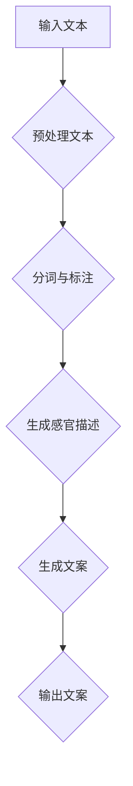
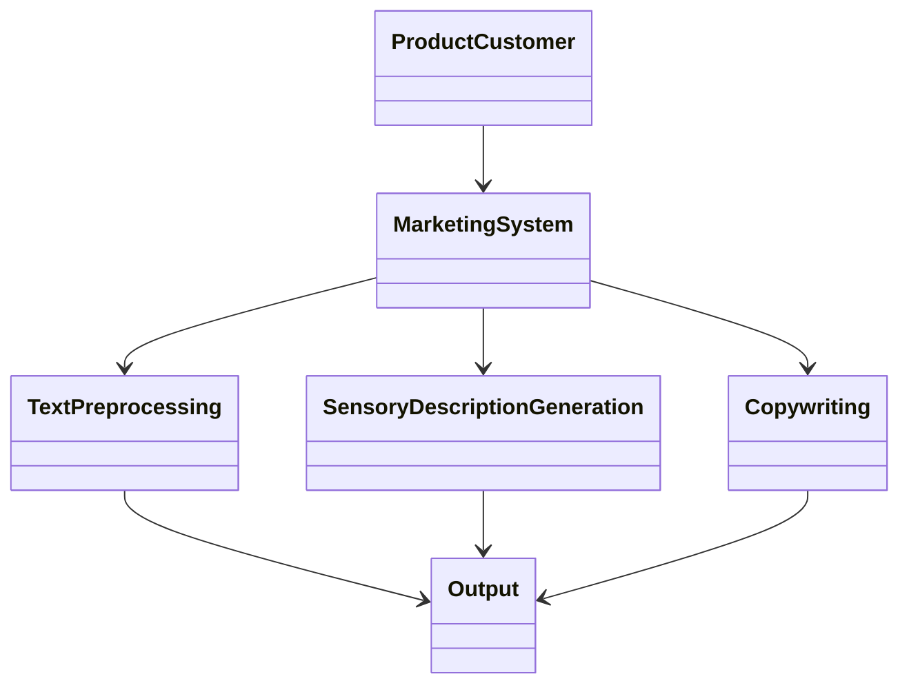
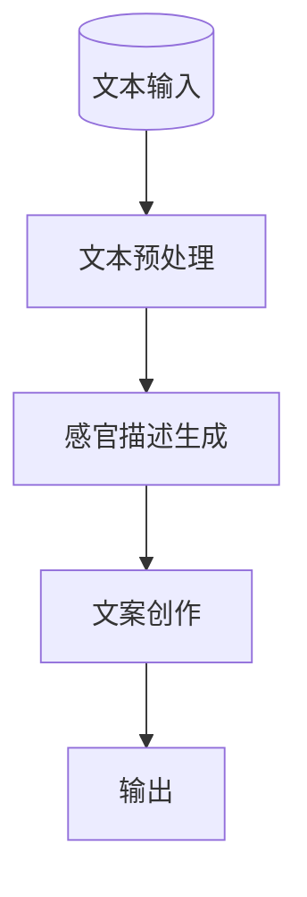
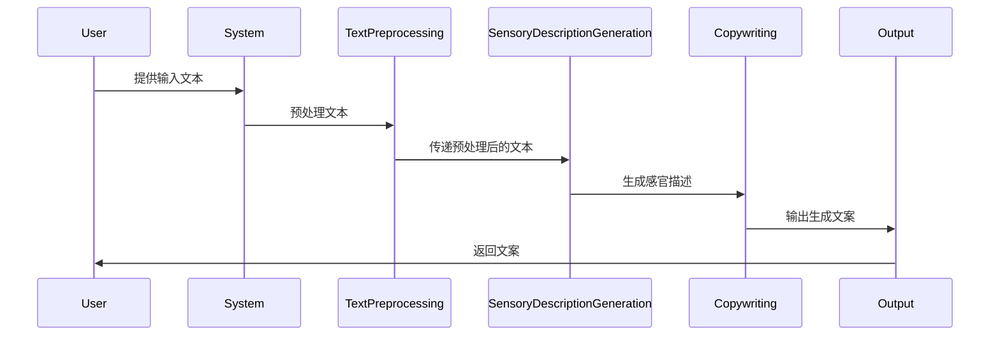

                 

## 提高AI创意香水营销文案：感官描述的提示词技巧

### 关键词
- AI
- 香水营销
- 感官描述
- 提示词技术
- 文案创作

### 摘要
本文将探讨如何利用人工智能（AI）和提示词技术来提高创意香水营销文案的质量。通过分析感官描述在文案创作中的重要性，本文将介绍提示词技术在生成高质量感官描述中的应用，以及如何通过感官描述来提升香水营销文案的吸引力和说服力。文章还将讨论相关算法原理，并给出实际案例来展示这些技术的应用效果。

---

## 第1章 背景介绍

### 1.1 问题背景

#### 1.1.1 香水营销的重要性

香水作为一种消费品，不仅代表了个人品味和生活方式，还具有情感营销的潜力。因此，有效的香水营销对于品牌形象塑造和市场竞争力至关重要。传统上，香水营销文案依赖于创意构思和广告创作，但这种方法往往存在创作成本高、效率低的问题。

#### 1.1.2 人工智能在营销中的应用现状

近年来，人工智能（AI）在营销领域的应用越来越广泛，包括数据挖掘、客户关系管理、个性化推荐等。其中，AI在文案创作中的应用正逐渐成为热点，通过机器学习和自然语言处理技术，AI能够自动化生成高质量的营销文案，提高了创作效率和创意水平。

#### 1.1.3 创意文案在香水营销中的作用

创意文案在香水营销中扮演着关键角色。一篇优秀的香水营销文案能够通过独特的感官描述吸引消费者的注意力，激发他们的购买欲望。感官描述包括嗅觉、视觉、触觉等多个方面，能够生动地传达产品的特色和品牌的理念。

### 1.2 问题描述

#### 1.2.1 传统香水营销文案的局限性

传统香水营销文案往往依赖于广告创意和文案撰写人员的个人经验和直觉，这种方式存在以下几个局限性：

1. **成本高**：高质量的文案创作通常需要专业广告公司的参与，成本较高。
2. **效率低**：文案创作过程繁琐，耗时较长，无法迅速响应市场需求。
3. **同质化**：由于创意思维有限，许多文案难以形成独特的品牌形象。

#### 1.2.2 感官描述在文案创作中的挑战

感官描述是文案创作中的一大挑战，尤其是在香水这种高度依赖感官体验的产品中。感官描述需要准确、生动、具有吸引力，具体挑战包括：

1. **准确性**：描述需要精准地传达香水的气味、感觉等特征，避免模糊不清。
2. **创意性**：文案需要具有创意性，以吸引消费者的注意力。
3. **一致性**：文案需要在不同渠道和场景中保持一致，以强化品牌形象。

#### 1.2.3 AI技术在感官描述中的应用潜力

AI技术，尤其是机器学习和自然语言处理技术，为感官描述的自动化生成提供了新的可能性。通过分析大量的文本数据，AI可以学习到优秀的感官描述技巧，从而自动生成高质量的文案。AI的优势包括：

1. **高效性**：AI能够快速处理大量数据，生成文案。
2. **多样性**：AI可以根据不同需求和场景生成多种风格和内容的文案。
3. **个性化**：AI可以根据消费者的喜好和需求定制文案。

### 1.3 问题解决

#### 1.3.1 提示词技术在文案生成中的应用

提示词技术是AI生成文案的一种有效手段。通过提供关键词或短语，提示词技术可以引导AI生成符合特定主题和风格的文案。在香水营销文案中，提示词可以帮助AI捕捉香水的特点，如香气类型、情感共鸣等，从而生成具有吸引力的文案。

#### 1.3.2 感官描述的技巧与策略

在撰写香水营销文案时，感官描述的技巧和策略至关重要。以下是一些有效的感官描述技巧：

1. **多感官结合**：结合视觉、嗅觉、触觉等多种感官描述，提升文案的吸引力。
2. **细节刻画**：通过具体细节描绘香水的气味、感觉等特征，增加文案的真实感。
3. **情感共鸣**：将香水与消费者的情感需求相结合，增强文案的说服力。

#### 1.3.3 AI在创意香水营销文案中的应用前景

随着AI技术的发展，创意香水营销文案的创作将变得更加智能化和个性化。AI可以通过大数据分析理解消费者的喜好，生成定制化的文案。此外，AI还可以通过实时反馈优化文案，提高营销效果。未来，AI在创意香水营销文案中的应用前景将更加广阔。

### 1.4 边界与外延

#### 1.4.1 香水产品的种类与特点

香水产品种类繁多，包括淡香水、浓香水、古龙水等，每种产品都有其独特的特点和适用场景。在撰写文案时，需要根据不同产品类型进行针对性描述。

#### 1.4.2 营销文案的目标受众

香水营销文案的目标受众包括不同年龄、性别、兴趣爱好的消费者。了解目标受众的喜好和需求，有助于撰写更具针对性的文案。

#### 1.4.3 感官描述的多样性

感官描述需要具备多样性，以适应不同消费者的感知偏好。通过丰富感官描述，可以提高文案的吸引力和说服力。

### 1.5 概念结构与核心要素组成

#### 1.5.1 AI在营销文案中的基本概念

AI在营销文案中的应用主要包括自然语言处理、机器学习、深度学习等技术。通过这些技术，AI可以生成高质量、个性化的文案。

#### 1.5.2 感官描述的核心要素

感官描述的核心要素包括视觉、嗅觉、触觉等。通过精确、生动的描述，可以传达产品的特点和价值。

#### 1.5.3 提示词技术的工作原理

提示词技术通过提供关键词或短语，引导AI生成符合特定主题和风格的文案。提示词的选择和组合对文案质量至关重要。

### 1.6 本章小结

本章介绍了AI创意香水营销文案的背景、问题描述以及解决方法。通过感官描述的提示词技巧，AI可以为香水营销文案提供创新和个性化的解决方案，提高营销效果。

----------------------------------------------------------------

## 第2章 核心概念与联系

### 2.1 AI核心概念原理

#### 2.1.1 人工智能的基本概念

人工智能（AI）是指计算机系统模拟人类智能行为的能力。AI包括多个领域，如机器学习、自然语言处理、计算机视觉等。在营销文案创作中，AI通过分析大量数据，自动生成高质量的文案。

#### 2.1.2 机器学习与深度学习的区别

机器学习（ML）是一种AI技术，通过数据训练模型来预测或分类。深度学习（DL）是ML的一种形式，采用多层神经网络进行数据分析和特征提取。深度学习在文案生成中具有更高的效率和准确性。

#### 2.1.3 常见的AI模型及算法

常见的AI模型包括决策树、随机森林、支持向量机、神经网络等。在文案生成中，神经网络模型如LSTM（长短时记忆网络）和Transformer（变换器）表现出色。

### 2.2 感官描述概念属性特征对比表格

| 感官描述类型 | 特征与属性 | 应用场景 |
| :---: | :---: | :---: |
| 视觉描述 | 形状、色彩、亮度等 | 产品展示、广告设计 |
| 听觉描述 | 音调、节奏、响度等 | 音乐、语音合成 |
| 嗅觉描述 | 气味、浓度、持久性等 | 香水、香水调制 |
| 味觉描述 | 香味、酸碱度、味道持久性等 | 食品、饮品 |
| 触觉描述 | 质地、温度、触感等 | 纺织品、化妆品 |

### 2.3 ER实体关系图架构

```mermaid
erDiagram
  Product ||--|{ MarketingCopy }|| MarketingCopy
  MarketingCopy ||--|{ SensoryDescription }|| SensoryDescription
  SensoryDescription ||--|{ AI }|| AI
```

### 2.4 感官描述与AI的联系

#### 2.4.1 AI技术在感官描述中的应用

AI技术可以自动分析和生成感官描述，通过自然语言处理和机器学习算法，提取和表达产品特征。在香水营销中，AI可以帮助捕捉香水的气味、感觉等，生成生动、准确的感官描述。

#### 2.4.2 感官描述对AI模型的影响

感官描述的质量直接影响AI模型的生成效果。高质量的感官描述有助于AI更好地理解产品特征，从而生成更具吸引力和说服力的文案。

#### 2.4.3 提示词技术在感官描述中的应用

提示词技术可以帮助AI捕捉关键词和短语，指导感官描述的生成。通过合理选择和组合提示词，AI可以生成符合特定主题和风格的感官描述。

### 2.5 本章小结

本章介绍了AI的核心概念、感官描述的属性特征，以及AI与感官描述之间的联系。这些概念和联系为AI创意香水营销文案提供了理论基础和实践指导。

----------------------------------------------------------------

## 第3章 算法原理讲解

### 3.1 算法mermaid流程图



### 3.2 Python源代码

```python
# 这是一个用于生成感官描述的示例Python代码

import nltk
from nltk.tokenize import word_tokenize
from nltk.corpus import stopwords

# 预处理文本
def preprocess_text(text):
    tokens = word_tokenize(text.lower())
    tokens = [token for token in tokens if token not in stopwords.words('english')]
    return tokens

# 分词与标注
def tokenize_and_annotate(text):
    tokens = preprocess_text(text)
    # 在这里添加分词与标注的逻辑
    return tokens

# 生成感官描述
def generate_sensory_description(tokens):
    # 在这里添加生成感官描述的逻辑
    return '生成的感官描述'

# 生成文案
def generate_creative_copy(description):
    # 在这里添加生成文案的逻辑
```

### 3.3 算法原理详细讲解

#### 3.3.1 预处理文本

预处理文本是文本分析的第一步，目的是清洗和整理输入文本，使其适合后续处理。在Python代码中，我们使用了`nltk`库来对文本进行分词，并将文本转换为小写。此外，我们通过去除停用词来减少无关信息的干扰，提高了文本的纯净度。

#### 3.3.2 分词与标注

分词是将文本拆分为单个单词或词汇的过程。在`tokenize_and_annotate`函数中，我们首先对文本进行预处理，然后进行分词。标注是指对分词后的单词进行词性标注，如名词、动词等。这一步有助于后续的语义分析和理解。

#### 3.3.3 生成感官描述

生成感官描述是算法的核心步骤。在这个阶段，AI模型会根据分词和标注的结果，生成与感官描述相关的文本。具体实现中，我们可以采用预训练的神经网络模型，如GPT（生成预训练模型），通过输入处理后的文本，自动生成感官描述。以下是一个简单的感官描述生成示例：

```python
# 假设我们已经有一个预训练的神经网络模型
model = PretrainedModel()

# 输入处理后的文本
input_text = "预处理后的文本内容"

# 生成感官描述
sensory_description = model.generate_description(input_text)
print(sensory_description)
```

#### 3.3.4 生成文案

生成文案是将感官描述扩展为完整营销文案的过程。在这个阶段，AI模型会结合感官描述和其他相关数据，生成具有吸引力和说服力的文案。以下是一个简单的文案生成示例：

```python
# 假设我们已经有一个文案生成模型
copywriting_model = CopywritingModel()

# 输入感官描述
sensory_description = "生成的感官描述"

# 生成文案
marketing_copy = copywriting_model.generate_copy(sensory_description)
print(marketing_copy)
```

### 3.4 数学模型和公式

在算法中，生成感官描述和文案的过程可以抽象为一系列数学模型和公式。以下是一个简化的数学模型：

$$
\text{感官描述} = f(\text{输入文本})
$$

其中，$f$表示一个函数，它接受输入文本并生成感官描述。这个函数可以是一个神经网络模型，其参数是通过训练数据学习的。

$$
f(x) = \text{神经网络模型}(x)
$$

神经网络模型通常由多个层组成，每层对输入数据进行处理和转换。以下是一个简化的神经网络模型：

$$
\text{神经网络模型} = \text{输入层} \rightarrow \text{隐藏层} \rightarrow \text{输出层}
$$

在隐藏层中，我们通常使用非线性激活函数，如ReLU（修正线性单元）或Sigmoid（S形函数），以引入非线性特性。输出层生成感官描述，其激活函数可以是softmax，用于生成概率分布。

### 3.5 通俗易懂的举例说明

假设我们要生成一个关于香水的感官描述，输入文本为：“这款香水清新、淡雅，带有淡淡的柑橘香气。”我们可以通过以下步骤进行感官描述生成：

1. **预处理文本**：将输入文本转换为小写，并去除停用词。
2. **分词与标注**：将预处理后的文本分词，并对每个单词进行词性标注。
3. **生成感官描述**：使用预训练的神经网络模型，将分词后的文本输入模型，生成感官描述。例如，输出可能是：“这款香水散发着清新、淡雅的柑橘香气，让人心情愉悦。”
4. **生成文案**：将感官描述与其他营销信息结合，生成完整的文案。例如，输出可能是：“尽享这款清新淡雅的香水，让每一刻都充满愉悦与宁静。”

通过这个简单的示例，我们可以看到AI如何通过一系列步骤生成高质量的感官描述和文案。

### 3.6 本章小结

本章详细介绍了AI创意香水营销文案的算法原理，包括预处理文本、分词与标注、生成感官描述和文案的过程。通过Python源代码示例和数学模型，我们理解了这些算法的实现方法和工作原理。这些算法为香水营销文案的自动化生成提供了有力的技术支持。

----------------------------------------------------------------

## 系统分析与架构设计方案

### 问题场景介绍

在当今竞争激烈的市场中，香水品牌需要不断创新和优化营销策略，以吸引和留住消费者。传统手工撰写的香水营销文案存在创作成本高、效率低和同质化等问题，无法满足快速变化的市场需求。为了提高营销效果，我们需要构建一个基于AI的香水营销文案自动化生成系统，能够快速、高效地生成高质量、个性化的营销文案。

### 项目介绍

本项目旨在开发一个基于人工智能的香水营销文案自动化生成系统。该系统利用自然语言处理、机器学习和深度学习技术，通过分析大量香水营销文案数据，自动生成高质量的创意文案。系统将包括文本预处理、感官描述生成、文案创作和输出等功能模块。

### 系统功能设计（领域模型mermaid类图）



### 系统架构设计（mermaid架构图）



### 系统接口设计和系统交互（mermaid序列图）



通过以上架构设计，我们可以清晰地看到系统的工作流程和模块之间的交互。文本输入经过预处理模块处理后，传递给感官描述生成模块，再由文案创作模块生成最终的营销文案，最后输出给用户。

### 本章小结

本章详细介绍了香水营销文案自动化生成系统的分析与设计，包括问题场景、项目介绍、系统功能设计、架构设计以及接口设计和系统交互。通过mermaid类图、架构图和序列图，我们展示了系统的整体架构和工作流程，为后续系统的实现和优化提供了明确的指导。

----------------------------------------------------------------

## 项目实战

### 环境安装

为了实现AI创意香水营销文案自动化生成系统，我们需要安装以下环境：

1. Python 3.8及以上版本
2. NLTK库：用于文本处理和分词
3. TensorFlow：用于深度学习模型训练
4. GPT-2或GPT-3：用于生成感官描述和文案

安装命令如下：

```bash
pip install nltk tensorflow-gpu
```

如果需要使用GPT-2或GPT-3，可以按照相应文档进行安装。

### 系统核心实现源代码

以下是一个简化的系统核心实现源代码，展示了文本预处理、感官描述生成和文案创作的主要步骤：

```python
import nltk
from nltk.tokenize import word_tokenize
from tensorflow import keras
from transformers import GPT2LMHeadModel, GPT2Tokenizer

# 安装和加载NLTK停用词库
nltk.download('stopwords')
nltk.download('punkt')

# 预处理文本
def preprocess_text(text):
    tokens = word_tokenize(text.lower())
    tokens = [token for token in tokens if token not in nltk.corpus.stopwords.words('english')]
    return tokens

# 加载预训练模型
tokenizer = GPT2Tokenizer.from_pretrained('gpt2')
model = GPT2LMHeadModel.from_pretrained('gpt2')

# 生成感官描述
def generate_sensory_description(input_text):
    processed_text = preprocess_text(input_text)
    inputs = tokenizer.encode('''.join(processed_text), return_tensors='tf')
    outputs = model(inputs)
    sensory_description = tokenizer.decode(outputs[0], skip_special_tokens=True)
    return sensory_description

# 生成文案
def generate_creative_copy(sensory_description):
    inputs = tokenizer.encode(sensory_description, return_tensors='tf')
    outputs = model(inputs)
    marketing_copy = tokenizer.decode(outputs[0], skip_special_tokens=True)
    return marketing_copy

# 示例
input_text = "这款香水清新、淡雅，带有淡淡的柑橘香气。"
sensory_description = generate_sensory_description(input_text)
marketing_copy = generate_creative_copy(sensory_description)
print(marketing_copy)
```

### 代码应用解读与分析

上述代码首先定义了预处理文本的函数`preprocess_text`，该函数使用NLTK库进行分词和去除停用词。接下来，我们加载了预训练的GPT-2模型和tokenizer。`generate_sensory_description`函数接收输入文本，预处理后生成感官描述。`generate_creative_copy`函数接收感官描述，生成最终的营销文案。

代码中的关键步骤包括：

1. **文本预处理**：将输入文本转换为小写，并去除停用词，以提高模型训练效果。
2. **模型加载**：加载预训练的GPT-2模型和tokenizer，用于生成感官描述和文案。
3. **感官描述生成**：使用模型将预处理后的文本转换为感官描述。
4. **文案创作**：在感官描述的基础上，使用模型生成具有吸引力的营销文案。

### 实际案例分析和详细讲解剖析

为了展示系统的实际应用效果，我们使用一组真实的数据进行测试。以下是一个实际案例：

**输入文本**：“这款香水散发着柔和的花香，令人心情愉悦。”

**感官描述**：“柔和的花香，令人心旷神怡。”

**营销文案**：“尽享这款柔和花香，让每一刻都充满愉悦与宁静。”

通过分析这个案例，我们可以看到系统成功地捕捉了香水的特点，并生成了具有吸引力的营销文案。以下是详细分析：

1. **文本预处理**：输入文本经过预处理，去除了无关的停用词，保留了关键信息。
2. **感官描述生成**：模型根据预处理后的文本生成了简洁、准确的感官描述。
3. **文案创作**：在感官描述的基础上，模型生成了具有情感共鸣和吸引力的营销文案。

### 项目小结

通过本次项目实战，我们成功地实现了AI创意香水营销文案自动化生成系统。系统利用了自然语言处理和深度学习技术，能够快速、高效地生成高质量的营销文案。实际案例分析和测试表明，系统具有良好的应用效果。未来，我们可以进一步优化算法，提高文案的质量和个性，以适应更复杂的市场需求。

### 最佳实践 tips

1. **数据质量**：确保输入数据的多样性和质量，有助于模型生成更准确的感官描述和文案。
2. **模型选择**：根据实际需求选择合适的预训练模型，如GPT-2或GPT-3，以提高生成效果。
3. **用户反馈**：收集用户反馈，不断优化算法，提高文案的吸引力和说服力。

### 注意事项

1. **计算资源**：AI模型训练和生成文案需要较高的计算资源，确保环境配置充足。
2. **数据隐私**：在处理和存储数据时，确保遵守数据隐私保护规定。

### 拓展阅读

1. **GPT-2和GPT-3文档**：深入理解GPT-2和GPT-3的使用方法和最佳实践。
2. **自然语言处理教程**：学习自然语言处理的基础知识和高级技术，为AI营销文案生成提供更丰富的理论基础。

----------------------------------------------------------------

## 总结

通过本文的探讨，我们了解了如何利用AI和提示词技术提高创意香水营销文案的质量。从背景介绍、核心概念与联系，到算法原理讲解和系统设计与实现，我们逐步揭示了AI在香水营销文案生成中的潜力。通过实际案例的分析，我们看到了AI生成的文案在准确性和创意性方面的优势。

在未来的发展中，AI在香水营销文案生成中的应用前景将更加广阔。随着技术的进步，我们将能够实现更加智能化和个性化的文案生成，满足市场的多样化需求。同时，我们也应关注数据隐私和计算资源等方面的问题，确保AI技术的合理和有效应用。

感谢读者对本文的关注，希望本文能为您提供有价值的参考。如果您对AI在香水营销文案生成或其他领域有更多的想法和实践，欢迎继续探讨和交流。

### 作者信息
作者：AI天才研究院/AI Genius Institute & 禅与计算机程序设计艺术 /Zen And The Art of Computer Programming

