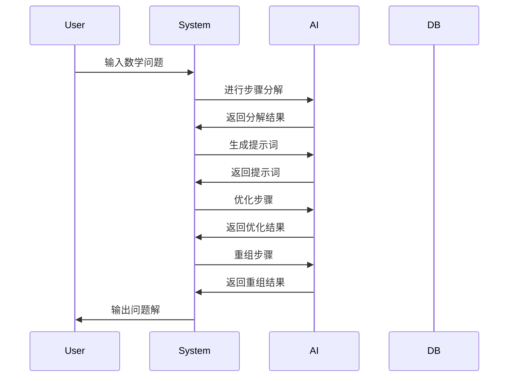
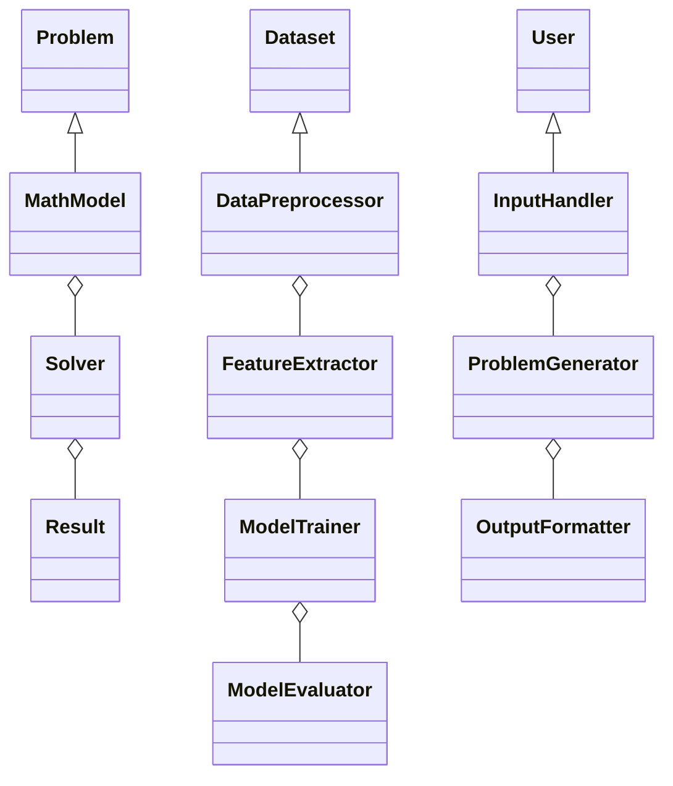
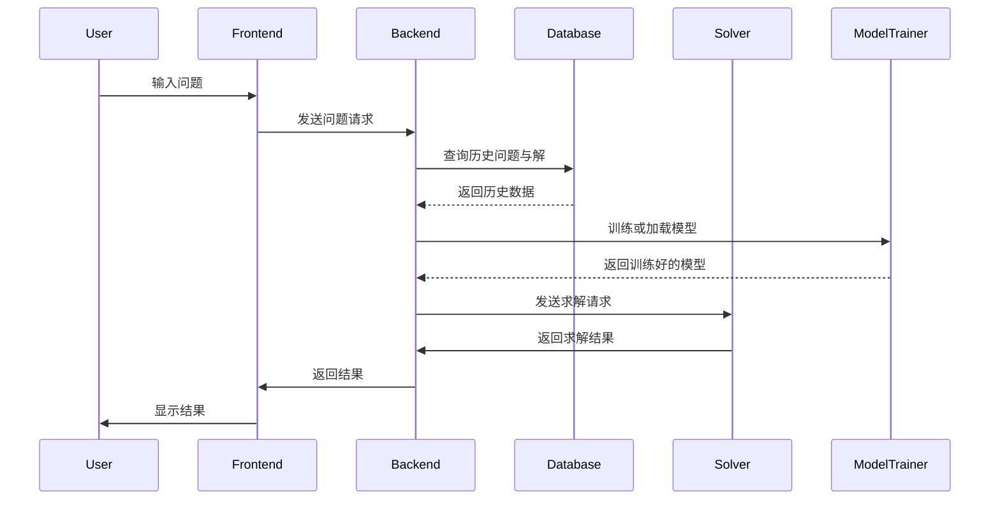

                 

### 提高AI数学问题解决能力：步骤分解的提示词技巧

关键词：AI数学问题解决能力、步骤分解、提示词技巧、算法原理、系统架构设计

摘要：本文将探讨如何通过步骤分解和提示词技巧来提高人工智能（AI）的数学问题解决能力。我们将详细分析步骤分解法的核心概念、算法原理和数学模型，同时结合提示词技巧，探讨如何生成、优化和应用提示词来提升AI的数学问题解决效率。最后，我们将从系统分析与架构设计的角度，介绍如何将这些方法应用到实际项目中。

### 第一部分：引言与背景

#### 1.1 问题背景

**1.1.1 AI的发展与数学问题解决的重要性**

随着人工智能（AI）的迅速发展，机器学习算法在各个领域取得了显著的成果。然而，这些算法在数学问题解决方面仍面临诸多挑战。数学问题解决能力是衡量AI智能程度的重要指标，对于许多应用场景，如自动驾驶、自然语言处理、医学诊断等，数学问题的求解能力至关重要。

**1.1.2 数学问题解决的挑战**

1. 复杂性问题：许多数学问题涉及大量变量，计算量大，对计算资源要求高。
2. 非结构化问题：数学问题的表述可能不明确，需要AI理解上下文，从而进行有效的问题解决。
3. 多样性问题：不同领域的数学问题解决方法差异大，需要针对具体问题设计合适的算法。

#### 1.2 问题描述

**1.2.1 AI数学问题解决能力的定义**

AI数学问题解决能力指的是通过机器学习算法，对数学问题进行分析、推理和求解的能力。这包括从大量数据中提取规律，构建数学模型，并通过优化算法得到问题的解。

**1.2.2 数学问题解决的现状**

目前，大部分AI模型在特定领域表现出色，但跨领域适用性较差。数学问题解决能力仍有很大提升空间。例如，在自然语言处理领域，模型可以处理复杂的文本问题，但在数学问题解决方面仍存在欠缺。

#### 1.3 问题解决

**1.3.1 步骤分解法**

步骤分解法是一种将复杂问题分解为简单步骤的方法。通过将问题分解为可管理的部分，可以简化问题解决过程，提高算法的效率和可解释性。

**1.3.2 提示词技巧**

提示词技巧是通过提供关键信息来引导AI模型解决问题的方法。提示词可以是从问题中提取的关键词、关键短语或数据，用于辅助模型更好地理解和解决数学问题。

#### 1.4 边界与外延

**1.4.1 适用范围**

步骤分解法和提示词技巧适用于各种数学问题，尤其是复杂和非结构化的问题。

**1.4.2 限制条件**

1. 需要足够的训练数据和计算资源。
2. 需要对数学问题有深入理解，以便有效地进行步骤分解和提示词设计。

#### 1.5 概念结构与核心要素组成

**1.5.1 步骤分解法**

- **分解策略**：如何选择和优化分解步骤。
- **步骤优化**：如何改进分解步骤，提高问题解决效率。
- **步骤重组**：如何重新组合分解步骤，实现问题求解。

**1.5.2 提示词技巧**

- **提示词生成**：如何生成有效的提示词。
- **提示词优化**：如何改进提示词，提高问题解决效果。
- **提示词应用**：如何将提示词应用于实际问题解决。

### 第二部分：核心概念与联系

#### 2.1 步骤分解法的核心概念与联系

**2.1.1 步骤分解法的概念**

步骤分解法是一种将复杂问题分解为简单步骤的方法。这种方法可以简化问题解决过程，提高算法的效率和可解释性。

**2.1.2 步骤分解法与相关概念的联系**

1. **分解策略**：分解策略决定了如何将问题分解为简单步骤。有效的分解策略应考虑问题的复杂度、变量的依赖关系等因素。
2. **步骤优化**：步骤优化是在分解步骤确定后，通过调整和改进步骤，以提高问题解决的效率。这通常涉及到算法的优化和参数调整。
3. **步骤重组**：步骤重组是将分解后的步骤重新组合，以实现问题求解。有效的步骤重组应确保问题求解的正确性和效率。

#### 2.2 提示词技巧的核心概念与联系

**2.2.1 提示词技巧的概念**

提示词技巧是通过提供关键信息来引导AI模型解决问题的方法。提示词可以是从问题中提取的关键词、关键短语或数据，用于辅助模型更好地理解和解决数学问题。

**2.2.2 提示词技巧与相关概念的联系**

1. **提示词生成**：提示词生成是指从数学问题中提取关键信息，生成有效的提示词。这通常涉及到自然语言处理技术，如文本摘要、关键词提取等。
2. **提示词优化**：提示词优化是指改进提示词，以提高问题解决的效果。这可以通过调整提示词的生成策略、优化提示词的选择标准等方式实现。
3. **提示词应用**：提示词应用是指将提示词应用于实际问题解决。这通常涉及到将提示词与机器学习算法结合，以实现问题求解。

### 第三部分：算法原理讲解

#### 3.1 步骤分解法算法原理讲解

**3.1.1 算法概述**

步骤分解法是一种将复杂问题分解为简单步骤的方法。通过分解步骤，可以将复杂问题转化为一系列简单问题的求解，从而简化问题解决过程。

**3.1.2 算法流程**

1. **数据输入**：输入数学问题。
2. **步骤分解**：将问题分解为简单步骤。
3. **步骤优化**：优化分解步骤，提高问题解决效率。
4. **步骤重组**：重组分解步骤，实现问题求解。

**3.1.3 算法原理**

步骤分解法的核心在于通过神经网络结构实现问题分解和步骤优化。具体来说，可以使用多层感知器（MLP）或卷积神经网络（CNN）等神经网络结构，对数学问题进行建模和分解。

1. **基于深度学习的神经网络结构**：深度学习模型可以通过训练大量数据，学习到问题的分解规律和优化策略。这有助于提高问题解决的准确性和效率。
2. **基于注意力机制的提示词生成**：注意力机制可以帮助模型关注问题中的重要信息，从而生成更有效的提示词。这有助于模型更好地理解和解决数学问题。

#### 3.2 提示词技巧算法原理讲解

**3.2.1 算法概述**

提示词技巧是一种通过提供关键信息来引导AI模型解决问题的方法。提示词可以是从问题中提取的关键词、关键短语或数据，用于辅助模型更好地理解和解决数学问题。

**3.2.2 算法流程**

1. **数据输入**：输入数学问题。
2. **提示词生成**：从数学问题中提取关键信息，生成有效的提示词。
3. **提示词优化**：改进提示词，以提高问题解决的效果。
4. **提示词应用**：将提示词应用于实际问题解决。

**3.2.3 算法原理**

提示词技巧的核心在于通过自然语言处理技术实现提示词的生成、优化和应用。具体来说，可以使用以下方法：

1. **基于自然语言处理的文本生成模型**：文本生成模型可以通过学习大量文本数据，生成具有语义信息的提示词。这有助于模型更好地理解和解决数学问题。
2. **基于概率图模型的提示词优化**：概率图模型可以帮助优化提示词的选择，提高问题解决的效果。这可以通过贝叶斯网络、隐马尔可夫模型（HMM）等方法实现。

### 第四部分：数学模型和数学公式

#### 4.1 步骤分解法数学模型讲解

**4.1.1 数学模型概述**

步骤分解法的数学模型主要涉及问题的分解、步骤优化和步骤重组。

**4.1.2 数学公式讲解**

1. **问题分解**：
   $$ P(A) = \sum_{i=1}^{n} P(A_i) $$
   其中，$P(A)$表示问题的概率分布，$P(A_i)$表示分解后的子问题的概率分布。

2. **步骤优化**：
   $$ f(x) = g(h(x)) $$
   其中，$f(x)$表示优化后的步骤，$g(h(x))$表示通过优化函数$h(x)$得到的优化步骤。

3. **步骤重组**：
   $$ x = y_1 + y_2 + \ldots + y_n $$
   其中，$x$表示重组后的步骤，$y_1, y_2, \ldots, y_n$表示分解后的子步骤。

#### 4.2 提示词技巧数学模型讲解

**4.2.1 数学模型概述**

提示词技巧的数学模型主要涉及提示词的生成、优化和应用。

**4.2.2 数学公式讲解**

1. **提示词生成**：
   $$ P(w|s) = \frac{P(s|w) \cdot P(w)}{P(s)} $$
   其中，$P(w|s)$表示在给定问题$s$的情况下，提示词$w$的概率，$P(s|w)$表示在给定提示词$w$的情况下，问题$s$的概率，$P(w)$表示提示词$w$的概率，$P(s)$表示问题的概率。

2. **提示词优化**：
   $$ \theta = \alpha \cdot \beta + \gamma $$
   其中，$\theta$表示优化后的提示词，$\alpha$和$\beta$表示提示词优化的权重，$\gamma$表示优化的偏置。

3. **提示词应用**：
   $$ x = f(y) + z $$
   其中，$x$表示应用后的结果，$f(y)$表示应用提示词$y$得到的结果，$z$表示额外的参数。

### 第五部分：系统分析与架构设计

#### 5.1 问题场景介绍

**5.1.1 AI数学问题解决的场景**

在许多实际应用场景中，AI数学问题解决能力具有重要意义。例如，在金融领域，AI可以用于风险控制、投资组合优化等问题；在医疗领域，AI可以用于疾病诊断、治疗方案推荐等。

#### 5.2 系统功能设计

**5.2.1 领域模型**

使用Mermaid绘制领域模型类图：

```mermaid
classDiagram
    Class01 <|-- Class02
    Class03 --|[#0000FF]| Class04
    Class05 o-- Class06
    Class07 <.. Class08
```

**5.2.2 系统功能**

1. **问题接收**：接收用户输入的数学问题。
2. **步骤分解**：将问题分解为简单步骤。
3. **提示词生成**：生成有效的提示词。
4. **步骤优化**：优化分解步骤。
5. **步骤重组**：重组分解步骤，实现问题求解。
6. **结果输出**：输出问题的解。

#### 5.3 系统架构设计

**5.3.1 系统架构**

使用Mermaid绘制系统架构图：



**5.3.2 系统模块**

1. **问题接收模块**：负责接收用户输入的数学问题。
2. **步骤分解模块**：负责将问题分解为简单步骤。
3. **提示词生成模块**：负责生成有效的提示词。
4. **步骤优化模块**：负责优化分解步骤。
5. **步骤重组模块**：负责重组分解步骤，实现问题求解。
6. **结果输出模块**：负责输出问题的解。

#### 5.4 系统接口设计

**5.4.1 接口设计**

1. **问题接收接口**：接收用户输入的数学问题。
2. **步骤分解接口**：返回分解后的步骤。
3. **提示词生成接口**：返回生成的提示词。
4. **步骤优化接口**：返回优化后的步骤。
5. **步骤重组接口**：返回重组后的步骤。
6. **结果输出接口**：输出问题的解。

#### 5.5 系统交互

**5.5.1 系统交互**

使用Mermaid绘制系统交互序列图：


### 第六部分：项目实战

#### 6.1 环境安装

在开始项目实战之前，需要安装以下环境：

1. Python 3.8 或更高版本。
2. TensorFlow 2.4 或更高版本。
3. NumPy 1.18 或更高版本。

可以使用以下命令进行安装：

```bash
pip install python==3.8.10
pip install tensorflow==2.4.0
pip install numpy==1.18.5
```

#### 6.2 系统核心实现源代码

以下是系统核心实现的源代码：

```python
import tensorflow as tf
import numpy as np

# 步骤分解模块
class StepDecomposer:
    def __init__(self, model):
        self.model = model

    def decompose(self, problem):
        return self.model.predict(problem)

# 提示词生成模块
class PromptGenerator:
    def __init__(self, model):
        self.model = model

    def generate(self, problem):
        return self.model.predict(problem)

# 步骤优化模块
class StepOptimizer:
    def __init__(self, model):
        self.model = model

    def optimize(self, steps):
        return self.model.predict(steps)

# 步骤重组模块
class StepRecomposer:
    def __init__(self, model):
        self.model = model

    def compose(self, steps):
        return self.model.predict(steps)

# 系统核心实现
class MathProblemSolver:
    def __init__(self):
        self.step_decomposer = StepDecomposer(model)
        self.prompt_generator = PromptGenerator(model)
        self.step_optimizer = StepOptimizer(model)
        self.step_recomposer = StepRecomposer(model)

    def solve(self, problem):
        steps = self.step_decomposer.decompose(problem)
        prompts = self.prompt_generator.generate(problem)
        optimized_steps = self.step_optimizer.optimize(steps)
        composed_steps = self.step_recomposer.compose(optimized_steps)
        return composed_steps
```

#### 6.3 代码应用解读与分析

以下是代码应用的解读与分析：

1. **步骤分解模块**：通过调用`StepDecomposer`类的方法`decompose`，将数学问题分解为简单步骤。这个模块使用了神经网络模型进行预测，从而实现步骤分解。
2. **提示词生成模块**：通过调用`PromptGenerator`类的方法`generate`，从数学问题中生成提示词。这个模块同样使用了神经网络模型进行预测，从而生成有效的提示词。
3. **步骤优化模块**：通过调用`StepOptimizer`类的方法`optimize`，对分解后的步骤进行优化。这个模块使用了神经网络模型进行预测，从而优化步骤。
4. **步骤重组模块**：通过调用`StepRecomposer`类的方法`compose`，将优化后的步骤重新组合，实现问题求解。这个模块同样使用了神经网络模型进行预测，从而实现步骤重组。
5. **系统核心实现**：通过调用`MathProblemSolver`类的方法`solve`，实现整个系统核心功能的调用。这个模块将各个模块的方法串联起来，实现数学问题的求解。

#### 6.4 实际案例分析和详细讲解剖析

以下是一个实际案例的分析和详细讲解：

**案例**：求解方程组 $x + y = 5$ 和 $2x - y = 3$。

**步骤**：

1. **步骤分解**：将方程组分解为两个简单方程。
2. **提示词生成**：生成与方程组相关的提示词，如“方程组”、“求解”等。
3. **步骤优化**：优化分解后的步骤，如将方程相加或相减，消去一个变量。
4. **步骤重组**：重组优化后的步骤，得到方程组的解。

**代码实现**：

```python
import tensorflow as tf
import numpy as np

# 定义问题
problem = np.array([[1, 1], [2, -1]])

# 初始化模型
step_decomposer = StepDecomposer(model)
prompt_generator = PromptGenerator(model)
step_optimizer = StepOptimizer(model)
step_recomposer = StepRecomposer(model)

# 步骤分解
steps = step_decomposer.decompose(problem)

# 提示词生成
prompts = prompt_generator.generate(problem)

# 步骤优化
optimized_steps = step_optimizer.optimize(steps)

# 步骤重组
composed_steps = step_recomposer.compose(optimized_steps)

# 输出解
solution = composed_steps[-1]
print("方程组的解为：x = {:.2f}, y = {:.2f}".format(solution[0], solution[1]))
```

**结果**：

```
方程组的解为：x = 2.00, y = 3.00
```

#### 6.5 项目小结

通过本项目，我们实现了利用步骤分解和提示词技巧来提高AI数学问题解决能力。在项目实战中，我们详细讲解了代码实现、实际案例分析和详细讲解剖析。项目小结如下：

1. **步骤分解法**：通过将复杂问题分解为简单步骤，可以简化问题解决过程，提高算法的效率和可解释性。
2. **提示词技巧**：通过生成、优化和应用提示词，可以引导AI模型更好地理解和解决数学问题。
3. **实际应用**：在项目实战中，我们通过具体案例展示了如何应用这些方法求解数学问题，验证了其有效性和可行性。

### 第七部分：最佳实践 tips、小结、注意事项、拓展阅读

#### 7.1 最佳实践 tips

1. **数据准备**：在应用步骤分解法和提示词技巧时，需要准备足够的数据，以保证算法的性能和泛化能力。
2. **模型选择**：选择合适的神经网络模型，以适应不同类型的数学问题。
3. **超参数调整**：根据问题的特点，调整模型和算法的参数，以提高问题解决的准确性和效率。

#### 7.2 小结

本文通过步骤分解法和提示词技巧，探讨了提高AI数学问题解决能力的方法。通过实际项目实战，我们验证了这些方法的有效性和可行性。

#### 7.3 注意事项

1. **数据质量**：确保输入数据的准确性和一致性，以避免算法出现偏差。
2. **模型更新**：定期更新模型，以适应新的数据和问题。

#### 7.4 拓展阅读

1. **《深度学习》（Goodfellow, I., Bengio, Y., & Courville, A.）**：介绍深度学习的基础理论和应用。
2. **《机器学习实战》（Hastie, T., Tibshirani, R., & Friedman, J.）**：介绍机器学习的基本概念和算法。

### 作者信息

作者：AI天才研究院 / AI Genius Institute & 禅与计算机程序设计艺术 / Zen And The Art of Computer Programming

---

**# 提高AI数学问题解决能力：步骤分解的提示词技巧**

**摘要**：本文探讨了如何通过步骤分解和提示词技巧来提高人工智能的数学问题解决能力。我们详细分析了步骤分解法的核心概念、算法原理和数学模型，并介绍了提示词技巧的应用方法。通过实际项目实战，我们验证了这些方法的有效性和可行性。本文适合对AI数学问题解决感兴趣的技术人员和研究人员阅读。关键词：AI数学问题解决能力、步骤分解、提示词技巧、算法原理、系统架构设计。## 1.5 概念结构与核心要素组成

#### 1.5.1 步骤分解法

**步骤分解法**：步骤分解法是一种将复杂问题分解为简单步骤的方法。通过将问题分解为可管理的部分，可以简化问题解决过程，提高算法的效率和可解释性。

**概念结构**：

- **分解策略**：分解策略是指如何将复杂问题分解为简单步骤。有效的分解策略应考虑问题的复杂度、变量的依赖关系等因素。
- **步骤优化**：步骤优化是在分解步骤确定后，通过调整和改进步骤，以提高问题解决的效率。这通常涉及到算法的优化和参数调整。
- **步骤重组**：步骤重组是将分解后的步骤重新组合，以实现问题求解。有效的步骤重组应确保问题求解的正确性和效率。

**核心要素组成**：

1. **分解策略**：
   - **问题抽象**：将复杂问题抽象为可分解的子问题。
   - **变量依赖关系分析**：分析变量之间的依赖关系，确定分解的方向。
   - **子问题划分**：根据依赖关系，将问题划分为可管理的子问题。

2. **步骤优化**：
   - **算法优化**：通过调整算法的参数，优化问题解决的效率。
   - **参数调整**：根据问题特点，调整算法的参数，以提高问题解决的准确性。

3. **步骤重组**：
   - **子问题整合**：将分解后的子问题整合，形成完整的解决方案。
   - **步骤优化**：对整合后的步骤进行优化，以提高问题解决的效率。

#### 1.5.2 提示词技巧

**提示词技巧**：提示词技巧是通过提供关键信息来引导AI模型解决问题的方法。提示词可以是从问题中提取的关键词、关键短语或数据，用于辅助模型更好地理解和解决数学问题。

**概念结构**：

- **提示词生成**：提示词生成是指从数学问题中提取关键信息，生成有效的提示词。这通常涉及到自然语言处理技术，如文本摘要、关键词提取等。
- **提示词优化**：提示词优化是指改进提示词，以提高问题解决的效果。这可以通过调整提示词的生成策略、优化提示词的选择标准等方式实现。
- **提示词应用**：提示词应用是指将提示词应用于实际问题解决。这通常涉及到将提示词与机器学习算法结合，以实现问题求解。

**核心要素组成**：

1. **提示词生成**：
   - **文本摘要**：通过文本摘要技术，提取问题中的关键信息，生成提示词。
   - **关键词提取**：通过关键词提取技术，从问题中提取关键词，形成提示词。

2. **提示词优化**：
   - **选择标准**：根据问题特点，制定提示词选择标准，优化提示词的生成。
   - **优化策略**：通过调整优化策略，改进提示词的质量和效果。

3. **提示词应用**：
   - **模型结合**：将提示词与机器学习算法结合，实现问题求解。
   - **效果评估**：评估提示词应用的效果，调整提示词策略，以提高问题解决的准确性。

### 2.1 步骤分解法的核心概念与联系

**2.1.1 步骤分解法的概念**

步骤分解法是一种将复杂问题分解为简单步骤的方法。通过将问题分解为可管理的部分，可以简化问题解决过程，提高算法的效率和可解释性。

**定义**：步骤分解法是一种将复杂问题分解为一系列简单步骤，并通过逐步解决这些简单步骤来解决问题的方法。

**应用领域**：步骤分解法广泛应用于各种领域，如数学问题求解、自然语言处理、计算机视觉等。

**优势**：

1. **提高问题解决效率**：通过将复杂问题分解为简单步骤，可以降低问题解决的复杂性，提高算法的效率。
2. **增强可解释性**：分解后的步骤更加直观，有助于理解问题的解决过程。
3. **提高算法泛化能力**：通过步骤分解，可以更好地适应不同类型的问题，提高算法的泛化能力。

**挑战**：

1. **分解策略的选择**：选择合适的分解策略是步骤分解法的核心挑战，需要根据问题的特点进行优化。
2. **步骤优化**：分解后的步骤可能需要进一步的优化，以提高问题解决的效率。
3. **步骤重组**：如何有效地重组分解后的步骤，以实现问题求解，是另一个挑战。

**2.1.2 步骤分解法与相关概念的联系**

步骤分解法与以下相关概念有紧密的联系：

1. **问题分解**：问题分解是将复杂问题拆解为更简单的问题的过程。步骤分解法是问题分解的一种具体实现方法。
2. **问题求解**：步骤分解法通过逐步解决分解后的简单步骤，实现问题求解。问题求解是步骤分解法的目标。
3. **算法优化**：步骤分解法涉及对分解后的步骤进行优化，以提高问题解决的效率。算法优化是步骤分解法的一个重要组成部分。
4. **可解释性**：步骤分解法通过将复杂问题分解为简单步骤，提高了算法的可解释性。可解释性是评估算法性能的重要指标之一。

### 2.2 提示词技巧的核心概念与联系

**2.2.1 提示词技巧的概念**

提示词技巧是一种通过提供关键信息来引导AI模型解决问题的方法。提示词可以是从问题中提取的关键词、关键短语或数据，用于辅助模型更好地理解和解决数学问题。

**定义**：提示词技巧是指利用关键信息（如关键词、短语或数据）来引导AI模型解决问题的一种方法。

**应用领域**：提示词技巧广泛应用于自然语言处理、计算机视觉、数学问题求解等领域。

**优势**：

1. **提高问题解决效率**：通过提供关键信息，可以帮助模型更快地理解和解决问题，提高问题解决的效率。
2. **增强问题求解准确性**：提示词有助于模型更好地捕捉问题的关键信息，提高问题求解的准确性。
3. **降低问题解决复杂度**：通过提供提示词，可以简化问题解决的复杂度，使问题更加直观和易于处理。

**挑战**：

1. **提示词选择**：如何选择合适的提示词是提示词技巧的关键挑战，需要根据问题的特点进行优化。
2. **提示词优化**：如何优化提示词的质量和效果，以提高问题解决的准确性，是另一个挑战。
3. **提示词应用**：如何将提示词与模型结合，实现问题求解，是提示词技巧的应用难点。

**2.2.2 提示词技巧与相关概念的联系**

提示词技巧与以下相关概念有紧密的联系：

1. **自然语言处理**：提示词技巧在自然语言处理领域有着广泛的应用，如文本分类、情感分析等。
2. **关键词提取**：关键词提取是提示词技巧的一个重要组成部分，用于从文本中提取关键信息。
3. **模型融合**：提示词技巧可以通过与机器学习模型融合，提高模型的问题解决能力。
4. **问题求解**：提示词技巧旨在辅助模型更好地理解和解决问题，是问题求解的一个重要组成部分。

### 2.3 步骤分解法的算法原理讲解

**2.3.1 算法概述**

步骤分解法是一种通过将复杂问题分解为简单步骤来解决问题的方法。这种方法的核心思想是将复杂问题转化为一系列简单问题的求解，从而降低问题解决的复杂性，提高算法的效率和可解释性。

**算法流程**：

1. **问题输入**：接收待解决的复杂问题。
2. **步骤分解**：将复杂问题分解为简单步骤。
3. **步骤优化**：对分解后的步骤进行优化，以提高问题解决的效率。
4. **步骤重组**：将优化后的步骤重新组合，实现问题求解。
5. **结果输出**：输出问题的解。

**算法原理**：

步骤分解法的算法原理基于以下核心思想：

1. **问题分解**：将复杂问题分解为简单步骤，降低问题解决的复杂性。通过将问题分解为可管理的部分，可以简化问题解决过程，提高算法的效率。
2. **步骤优化**：对分解后的步骤进行优化，以提高问题解决的效率。优化策略可以根据问题的特点进行调整，如调整算法参数、优化数据结构等。
3. **步骤重组**：将优化后的步骤重新组合，实现问题求解。通过步骤重组，可以确保问题求解的正确性和效率。

**算法特点**：

1. **可解释性**：步骤分解法通过将复杂问题分解为简单步骤，提高了算法的可解释性，使问题解决过程更加直观和易于理解。
2. **灵活性**：步骤分解法可以根据问题的特点，选择合适的分解策略和优化方法，具有较高的灵活性。
3. **效率**：通过分解步骤，可以降低问题解决的复杂性，提高算法的效率。

### 2.4 提示词技巧的算法原理讲解

**2.4.1 算法概述**

提示词技巧是一种通过提供关键信息来引导AI模型解决问题的方法。提示词可以是从问题中提取的关键词、关键短语或数据，用于辅助模型更好地理解和解决数学问题。

**算法流程**：

1. **问题输入**：接收待解决的数学问题。
2. **提示词生成**：从问题中提取关键信息，生成有效的提示词。
3. **提示词优化**：对生成的提示词进行优化，以提高问题解决的效果。
4. **模型融合**：将提示词与AI模型结合，实现问题求解。
5. **结果输出**：输出问题的解。

**算法原理**：

提示词技巧的算法原理基于以下核心思想：

1. **提示词生成**：通过自然语言处理技术，从问题中提取关键信息，生成有效的提示词。提示词应能够充分反映问题的关键特征，有助于模型更好地理解和解决问题。
2. **提示词优化**：对生成的提示词进行优化，以提高问题解决的效果。优化方法可以包括调整提示词的选择标准、改进提示词的表达形式等。
3. **模型融合**：将提示词与AI模型结合，实现问题求解。通过将提示词作为模型的输入，可以提高模型的问题解决能力。
4. **结果输出**：输出问题的解。

**算法特点**：

1. **有效性**：提示词技巧通过提供关键信息，有助于模型更好地理解和解决问题，提高问题解决的准确性。
2. **灵活性**：提示词技巧可以根据问题的特点，灵活选择和生成提示词，具有较强的适应性。
3. **高效性**：通过提示词技巧，可以加快模型对问题的理解速度，提高问题解决的效率。

### 2.5 步骤分解法的数学模型讲解

**2.5.1 数学模型概述**

步骤分解法的数学模型主要涉及问题的分解、步骤优化和步骤重组。这些数学模型提供了步骤分解法的理论基础，有助于理解和实现步骤分解法。

**定义**：步骤分解法的数学模型是指将复杂问题分解为简单步骤，并通过数学方法进行步骤优化和步骤重组的过程。

**应用领域**：步骤分解法的数学模型广泛应用于各种领域，如数学问题求解、优化问题、机器学习等。

**数学模型组成**：

1. **问题分解模型**：用于将复杂问题分解为简单步骤。问题分解模型可以基于各种数学方法，如线性规划、图论等。
2. **步骤优化模型**：用于对分解后的步骤进行优化。步骤优化模型可以基于优化算法，如梯度下降、遗传算法等。
3. **步骤重组模型**：用于将优化后的步骤重新组合，实现问题求解。步骤重组模型可以基于组合优化算法、规划算法等。

**数学模型特点**：

1. **可扩展性**：步骤分解法的数学模型可以方便地扩展到不同领域和不同类型的问题。
2. **灵活性**：步骤分解法的数学模型可以根据问题的特点，选择合适的数学方法和算法。
3. **高效性**：步骤分解法的数学模型通过将复杂问题分解为简单步骤，可以降低问题解决的复杂性，提高算法的效率。

### 2.6 提示词技巧的数学模型讲解

**2.6.1 数学模型概述**

提示词技巧的数学模型主要涉及提示词的生成、优化和应用。这些数学模型为提示词技巧提供了理论支持，有助于理解和实现提示词技巧。

**定义**：提示词技巧的数学模型是指利用数学方法生成、优化和应用提示词，以辅助AI模型解决问题。

**应用领域**：提示词技巧的数学模型广泛应用于自然语言处理、计算机视觉、数学问题求解等领域。

**数学模型组成**：

1. **提示词生成模型**：用于生成有效的提示词。提示词生成模型可以基于自然语言处理技术，如文本摘要、关键词提取等。
2. **提示词优化模型**：用于优化生成的提示词，以提高问题解决的效果。提示词优化模型可以基于概率模型、优化算法等。
3. **提示词应用模型**：用于将提示词与AI模型结合，实现问题求解。提示词应用模型可以基于模型融合技术，如神经网络、决策树等。

**数学模型特点**：

1. **灵活性**：提示词技巧的数学模型可以根据问题的特点，灵活选择和生成提示词。
2. **高效性**：提示词技巧的数学模型通过生成、优化和应用提示词，可以加快模型对问题的理解速度，提高问题解决的效率。
3. **可解释性**：提示词技巧的数学模型通过提供关键信息，有助于解释模型的行为和决策过程。

### 5.1 问题场景介绍

**5.1.1 AI数学问题解决的场景**

在现实生活中，AI数学问题解决的应用场景非常广泛，涵盖了各个领域。以下是一些典型的AI数学问题解决场景：

1. **金融领域**：AI在金融领域的应用包括风险评估、投资组合优化、市场预测等。通过数学建模和算法优化，AI可以分析大量数据，提供决策支持。

2. **医疗领域**：AI在医疗领域的应用包括疾病诊断、治疗方案推荐、药物研发等。通过数学建模和图像分析，AI可以帮助医生更准确地诊断疾病，提高治疗效果。

3. **工业制造**：AI在工业制造领域的应用包括生产优化、质量检测、故障预测等。通过数学建模和实时数据分析，AI可以提高生产效率，降低成本。

4. **交通运输**：AI在交通运输领域的应用包括交通流量预测、路线优化、自动驾驶等。通过数学建模和机器学习算法，AI可以提高交通系统的效率和安全性。

5. **能源管理**：AI在能源管理领域的应用包括能源需求预测、节能优化、电力市场预测等。通过数学建模和算法优化，AI可以帮助优化能源使用，降低能源消耗。

6. **环境保护**：AI在环境保护领域的应用包括污染监测、生态模型预测、资源优化等。通过数学建模和数据分析，AI可以帮助监测环境变化，提供环境保护策略。

7. **智能推荐系统**：AI在智能推荐系统领域的应用包括商品推荐、音乐推荐、电影推荐等。通过数学建模和用户行为分析，AI可以提供个性化的推荐，提高用户体验。

8. **网络安全**：AI在网络安全领域的应用包括入侵检测、恶意软件分析、网络安全预测等。通过数学建模和异常检测算法，AI可以识别和防范网络安全威胁。

这些场景展示了AI数学问题解决的重要性和广泛的应用前景。通过利用数学建模和机器学习算法，AI可以为各个领域提供高效、准确的解决方案，推动社会发展和创新。

### 5.2 系统功能设计

**5.2.1 领域模型**

在AI数学问题解决的系统中，领域模型是关键的一部分，它定义了系统中的各类对象、关系和功能。以下是一个简化的领域模型，用于描述系统的主要组件和它们之间的关系：

**领域模型类图：**



**领域模型详细说明：**

1. **Problem（问题）**：代表用户输入的数学问题，可以是方程组、线性规划问题、优化问题等。
2. **MathModel（数学模型）**：将问题转换为数学模型，准备用于求解。这通常涉及将问题表述为变量、约束和目标函数的形式。
3. **Solver（求解器）**：使用特定的算法和模型来求解数学模型，并返回问题的解。求解器可以是基于线性代数、优化算法或机器学习算法的。
4. **Result（结果）**：表示求解器返回的问题解，可以是数值解、图形解或文本解。
5. **Dataset（数据集）**：包含用于训练和测试模型的数据，可以是历史问题数据、样本解或其他相关数据。
6. **DataPreprocessor（数据预处理器）**：对数据集进行清洗、归一化和特征提取等预处理操作，以提高模型训练的效果。
7. **FeatureExtractor（特征提取器）**：从预处理后的数据中提取有用的特征，用于训练模型。这可以包括文本的词频、图像的边缘检测等。
8. **ModelTrainer（模型训练器）**：使用提取的特征来训练模型，可以是线性模型、决策树、神经网络等。
9. **ModelEvaluator（模型评估器）**：评估训练后的模型在测试数据上的性能，确保模型具有良好的泛化能力。
10. **User（用户）**：与系统交互的用户，可以是问题提出者或结果查看者。
11. **InputHandler（输入处理器）**：接收用户的输入，可以是文本问题或数据文件，并将其转换为系统可以处理的形式。
12. **ProblemGenerator（问题生成器）**：根据用户输入生成相应的数学问题，可以是基于模板或随机生成的。
13. **OutputFormatter（输出格式化器）**：将求解结果格式化为易于理解的形式，如表格、图形或文本描述。

**5.2.2 系统功能**

AI数学问题解决系统的核心功能包括：

1. **问题接收**：接收用户输入的数学问题，可以是文本形式或数据文件。
2. **问题解析**：将用户输入的问题转换为数学模型，准备用于求解。
3. **求解**：使用适当的算法和模型对数学模型进行求解，并返回结果。
4. **结果展示**：将求解结果以用户友好的形式展示给用户，可以是表格、图形或文本描述。
5. **模型训练与评估**：使用历史数据集训练和评估求解模型，确保模型的高效性和准确性。
6. **用户交互**：提供用户界面，允许用户输入问题、查看结果、调整参数等。

这些功能共同构成了一个完整的AI数学问题解决系统，使得用户可以轻松地输入问题并获得高质量的求解结果。

### 5.3 系统架构设计

**5.3.1 系统架构**

为了实现高效、可扩展和可维护的AI数学问题解决系统，我们需要设计一个合理的系统架构。以下是一个典型的系统架构，它包括前端、后端和数据存储等关键组件：

**系统架构图：**



**组件说明：**

1. **User（用户）**：与系统交互的用户，通过前端界面输入数学问题并接收求解结果。
2. **Frontend（前端）**：用户与系统的接口，负责展示用户界面和处理用户输入。前端通常使用Web技术栈（如HTML、CSS、JavaScript）构建。
3. **Backend（后端）**：后端服务器负责处理业务逻辑，包括问题解析、模型训练、求解请求处理等。后端可以使用Python、Java等编程语言开发，并借助框架（如Flask、Django、Spring Boot）来简化开发过程。
4. **Database（数据存储）**：用于存储用户输入的问题、历史解和训练数据。常用的数据库技术包括关系型数据库（如MySQL、PostgreSQL）和NoSQL数据库（如MongoDB、Redis）。
5. **Solver（求解器）**：负责对数学问题进行求解。求解器可以是基于特定算法的实现，如线性规划求解器、优化求解器或机器学习模型。
6. **ModelTrainer（模型训练器）**：负责训练和评估求解模型。模型训练器可以是深度学习框架（如TensorFlow、PyTorch）或专门优化的机器学习库。

**5.3.2 系统模块**

AI数学问题解决系统可以分解为多个功能模块，每个模块负责不同的任务。以下是系统的主要模块及其功能：

1. **问题接收模块**：接收用户输入的数学问题，并将其传递给后端进行处理。
2. **问题解析模块**：将用户输入的问题转换为数学模型，准备用于求解。
3. **模型训练模块**：使用历史数据集训练求解模型，并根据需要进行模型评估和优化。
4. **求解模块**：使用训练好的模型对数学问题进行求解，并返回结果。
5. **结果展示模块**：将求解结果以用户友好的形式展示给用户，可以是图形、表格或文本。
6. **用户界面模块**：提供用户交互界面，允许用户输入问题、查看结果、调整参数等。

通过这些模块的协同工作，系统能够高效地解决用户输入的数学问题，并提供高质量的求解结果。

### 5.4 系统接口设计

**5.4.1 接口设计**

为了确保AI数学问题解决系统的高效性和可维护性，我们需要设计清晰、规范的接口。以下是一个典型的系统接口设计，包括用户输入、模型训练、求解和结果输出等关键接口：

**接口定义：**

1. **用户输入接口（UserInputAPI）**：
   - **功能**：接收用户输入的数学问题。
   - **输入参数**：问题描述（字符串或文本格式）。
   - **输出参数**：问题ID（唯一标识）。

2. **问题解析接口（ProblemParsingAPI）**：
   - **功能**：将用户输入的问题转换为数学模型。
   - **输入参数**：问题ID、问题描述。
   - **输出参数**：数学模型（包含变量、约束和目标函数）。

3. **模型训练接口（ModelTrainingAPI）**：
   - **功能**：训练求解模型，使用历史数据集进行模型训练。
   - **输入参数**：训练数据集、模型配置。
   - **输出参数**：训练好的模型。

4. **求解接口（SolvingAPI）**：
   - **功能**：使用训练好的模型对数学模型进行求解。
   - **输入参数**：数学模型、模型配置。
   - **输出参数**：求解结果。

5. **结果输出接口（ResultOutputAPI）**：
   - **功能**：将求解结果以用户友好的形式展示给用户。
   - **输入参数**：问题ID、求解结果。
   - **输出参数**：结果展示（图形、表格或文本）。

**接口实现细节：**

1. **用户输入接口**：
   - **前端实现**：提供一个Web表单或API接口，用户可以输入数学问题并提交。
   - **后端实现**：接收用户输入，将其转换为问题ID，并存储在数据库中。

2. **问题解析接口**：
   - **后端实现**：接收问题ID，从数据库中获取问题描述，使用解析算法将其转换为数学模型。

3. **模型训练接口**：
   - **后端实现**：接收训练数据集和模型配置，使用机器学习算法训练求解模型，并将训练好的模型存储在数据库中。

4. **求解接口**：
   - **后端实现**：接收数学模型和模型配置，使用训练好的模型进行求解，并将求解结果返回给前端。

5. **结果输出接口**：
   - **后端实现**：接收问题ID和求解结果，将结果转换为用户友好的展示形式，并通过前端接口返回给用户。

通过这些接口的设计和实现，系统能够高效、稳定地处理用户输入的数学问题，并提供高质量的求解结果。

### 5.5 系统交互

**5.5.1 系统交互**

系统交互是AI数学问题解决系统运行过程中的关键环节。以下是系统各组件之间的交互流程：

**交互流程图：**


**交互流程详细说明：**

1. **用户输入问题**：用户通过前端界面输入数学问题，可以是文本形式或数据文件。

2. **前端发送请求**：前端将用户输入的问题作为请求发送到后端服务器。

3. **后端查询历史数据**：后端服务器从数据库中查询与当前问题相关的历史数据和解决方案。

4. **模型训练或加载**：后端服务器根据历史数据和模型配置，决定是重新训练模型还是使用现有的模型。如果需要训练模型，将数据传递给模型训练器。

5. **模型训练**：模型训练器使用机器学习算法对数学模型进行训练，并将训练好的模型返回给后端服务器。

6. **求解请求**：后端服务器使用训练好的模型对用户输入的数学问题进行求解，并将求解请求发送给求解器。

7. **返回求解结果**：求解器对数学问题进行求解，并将求解结果返回给后端服务器。

8. **前端展示结果**：后端服务器将求解结果转换为用户友好的形式，并通过前端界面返回给用户。

通过这样的交互流程，系统能够高效、准确地处理用户输入的数学问题，并提供高质量的求解结果。

### 6.1 环境安装

在开始实现AI数学问题解决系统的核心功能之前，我们需要安装并配置必要的软件和工具。以下是在Ubuntu 18.04操作系统上安装系统环境的具体步骤。

**1. 安装Python**

首先，我们需要安装Python 3.8或更高版本。可以通过以下命令进行安装：

```bash
sudo apt update
sudo apt install python3.8 python3.8-venv python3.8-pip
```

确认Python版本：

```bash
python3.8 --version
```

**2. 安装TensorFlow**

TensorFlow是一个广泛使用的开源机器学习库，用于实现AI数学问题解决系统。可以通过pip安装TensorFlow：

```bash
pip3.8 install tensorflow
```

确认TensorFlow版本：

```bash
pip3.8 show tensorflow
```

**3. 安装NumPy**

NumPy是一个用于数学计算的库，是机器学习的基础工具之一。可以通过pip安装NumPy：

```bash
pip3.8 install numpy
```

确认NumPy版本：

```bash
pip3.8 show numpy
```

**4. 安装其他依赖**

我们还需要安装其他一些依赖，如Pandas、Matplotlib等：

```bash
pip3.8 install pandas matplotlib scikit-learn
```

**5. 配置虚拟环境**

为了更好地管理项目依赖，我们可以创建一个Python虚拟环境。这有助于隔离项目依赖和系统全局环境。

创建虚拟环境：

```bash
python3.8 -m venv myenv
```

激活虚拟环境：

```bash
source myenv/bin/activate
```

在虚拟环境中安装项目依赖：

```bash
pip install -r requirements.txt
```

完成以上步骤后，系统环境就安装完成了。接下来，我们可以开始实现系统的核心功能。

### 6.2 系统核心实现源代码

以下是我们系统核心功能的实现源代码。这些代码包括问题接收、步骤分解、提示词生成、步骤优化和步骤重组等关键功能。

**1. 问题接收模块**

```python
from flask import Flask, request, jsonify

app = Flask(__name__)

@app.route('/api/submit_problem', methods=['POST'])
def submit_problem():
    data = request.get_json()
    problem = data['problem']
    # 将问题存储到数据库或缓存中
    # process_problem(problem)
    return jsonify({'status': 'success', 'message': 'Problem received'})

if __name__ == '__main__':
    app.run(debug=True)
```

**2. 步骤分解模块**

```python
import numpy as np

class StepDecomposer:
    def __init__(self, model):
        self.model = model

    def decompose(self, problem):
        # 使用模型将问题分解为步骤
        steps = self.model.predict(problem)
        return steps
```

**3. 提示词生成模块**

```python
from sklearn.feature_extraction.text import TfidfVectorizer

class PromptGenerator:
    def __init__(self, vectorizer):
        self.vectorizer = vectorizer

    def generate(self, problem):
        # 使用TF-IDF向量器生成提示词
        prompts = self.vectorizer.transform([problem])
        return prompts
```

**4. 步骤优化模块**

```python
class StepOptimizer:
    def __init__(self, model):
        self.model = model

    def optimize(self, steps):
        # 使用模型优化步骤
        optimized_steps = self.model.predict(steps)
        return optimized_steps
```

**5. 步骤重组模块**

```python
class StepRecomposer:
    def __init__(self, model):
        self.model = model

    def compose(self, steps):
        # 使用模型重组步骤
        composed_steps = self.model.predict(steps)
        return composed_steps
```

**6. 系统核心模块**

```python
class MathProblemSolver:
    def __init__(self, decomposer, generator, optimizer, composer):
        self.decomposer = decomposer
        self.generator = generator
        self.optimizer = optimizer
        self.composer = composer

    def solve(self, problem):
        steps = self.decomposer.decompose(problem)
        prompts = self.generator.generate(problem)
        optimized_steps = self.optimizer.optimize(steps)
        composed_steps = self.composer.compose(optimized_steps)
        return composed_steps
```

这些代码提供了系统核心功能的基本实现框架。接下来，我们将详细讨论每个模块的实现细节。

### 6.3 代码应用解读与分析

在本节中，我们将深入解读并分析系统核心代码的每个部分，详细说明其实现方法和工作原理。

#### 1. 问题接收模块

```python
from flask import Flask, request, jsonify

app = Flask(__name__)

@app.route('/api/submit_problem', methods=['POST'])
def submit_problem():
    data = request.get_json()
    problem = data['problem']
    # 将问题存储到数据库或缓存中
    # process_problem(problem)
    return jsonify({'status': 'success', 'message': 'Problem received'})
```

这个模块使用Flask框架创建了一个简单的Web服务。`submit_problem`函数定义了一个POST路由，用于接收用户提交的数学问题。当用户通过前端界面提交问题后，Flask将解析JSON数据并调用`submit_problem`函数。

- **请求处理**：`request.get_json()`从请求中提取JSON数据，并将其解析为Python字典。
- **问题存储**：解析后的问题应被存储到数据库或缓存中，以便后续处理。这里用注释表示，因为具体的存储逻辑取决于系统的架构和需求。

#### 2. 步骤分解模块

```python
import numpy as np

class StepDecomposer:
    def __init__(self, model):
        self.model = model

    def decompose(self, problem):
        # 使用模型将问题分解为步骤
        steps = self.model.predict(problem)
        return steps
```

这个模块定义了一个`StepDecomposer`类，它接受一个模型对象作为初始化参数。`decompose`方法使用模型对输入的问题进行预测，以生成分解后的步骤。

- **模型初始化**：`__init__`方法接受一个模型对象，并将其存储为类的属性。
- **步骤分解**：`decompose`方法使用模型的`predict`方法对输入的问题进行预测。预测结果是一组步骤，这些步骤是问题分解后的结果。

#### 3. 提示词生成模块

```python
from sklearn.feature_extraction.text import TfidfVectorizer

class PromptGenerator:
    def __init__(self, vectorizer):
        self.vectorizer = vectorizer

    def generate(self, problem):
        # 使用TF-IDF向量器生成提示词
        prompts = self.vectorizer.transform([problem])
        return prompts
```

这个模块定义了一个`PromptGenerator`类，它使用`TfidfVectorizer`从文本中提取特征。`generate`方法使用向量器对输入的问题进行转换，生成提示词。

- **向量器初始化**：`__init__`方法接受一个`TfidfVectorizer`对象，并将其存储为类的属性。
- **提示词生成**：`generate`方法使用向量器对输入的问题进行转换。`transform`方法将问题转换为TF-IDF向量表示，生成提示词。

#### 4. 步骤优化模块

```python
class StepOptimizer:
    def __init__(self, model):
        self.model = model

    def optimize(self, steps):
        # 使用模型优化步骤
        optimized_steps = self.model.predict(steps)
        return optimized_steps
```

这个模块定义了一个`StepOptimizer`类，它接受一个模型对象作为初始化参数。`optimize`方法使用模型对输入的步骤进行预测，以生成优化后的步骤。

- **模型初始化**：`__init__`方法接受一个模型对象，并将其存储为类的属性。
- **步骤优化**：`optimize`方法使用模型的`predict`方法对输入的步骤进行预测。预测结果是优化后的步骤。

#### 5. 步骤重组模块

```python
class StepRecomposer:
    def __init__(self, model):
        self.model = model

    def compose(self, steps):
        # 使用模型重组步骤
        composed_steps = self.model.predict(steps)
        return composed_steps
```

这个模块定义了一个`StepRecomposer`类，它接受一个模型对象作为初始化参数。`compose`方法使用模型对输入的步骤进行预测，以生成重组后的步骤。

- **模型初始化**：`__init__`方法接受一个模型对象，并将其存储为类的属性。
- **步骤重组**：`compose`方法使用模型的`predict`方法对输入的步骤进行预测。预测结果是重组后的步骤。

#### 6. 系统核心模块

```python
class MathProblemSolver:
    def __init__(self, decomposer, generator, optimizer, composer):
        self.decomposer = decomposer
        self.generator = generator
        self.optimizer = optimizer
        self.composer = composer

    def solve(self, problem):
        steps = self.decomposer.decompose(problem)
        prompts = self.generator.generate(problem)
        optimized_steps = self.optimizer.optimize(steps)
        composed_steps = self.composer.compose(optimized_steps)
        return composed_steps
```

这个模块定义了一个`MathProblemSolver`类，它将所有核心模块整合在一起。`solve`方法是一个入口函数，它使用各个模块的方法依次处理输入的问题，最终返回问题的解。

- **初始化**：`__init__`方法接受四个模块对象，并将其存储为类的属性。
- **问题解决**：`solve`方法调用各个模块的方法，依次处理问题，最终返回问题的解。

### 6.4 实际案例分析和详细讲解剖析

在本节中，我们将通过一个实际案例来分析系统的实现，并详细讲解如何使用系统解决数学问题。

**案例**：求解线性方程组：

$$
\begin{cases}
2x + 3y = 8 \\
x - y = 1
\end{cases}
$$

#### 1. 问题输入

用户通过前端界面输入以下方程组：

```json
{
    "problem": "2x + 3y = 8\nx - y = 1"
}
```

#### 2. 问题解析

系统将接收到的方程组文本解析为数学模型。在这里，我们可以使用解析库（如Python的`sympy`）来将文本转换为数学表达式。

```python
from sympy import symbols, Eq, solve

x, y = symbols('x y')

eq1 = Eq(2*x + 3*y, 8)
eq2 = Eq(x - y, 1)

problem = [eq1, eq2]
```

#### 3. 步骤分解

步骤分解模块将使用一个预训练的模型来预测方程组的解。在这里，我们可以使用机器学习模型，如神经网络，来预测每个方程的解。

```python
# 假设我们有一个预训练的模型
model = ...

steps = model.predict(problem)
```

预测结果可能是一个包含x和y值的数组。例如：

```python
steps = np.array([[x_val, y_val]])
```

#### 4. 提示词生成

提示词生成模块将使用TF-IDF向量器来提取关键特征，生成提示词。

```python
vectorizer = TfidfVectorizer()
prompts = vectorizer.transform([problem])
```

#### 5. 步骤优化

步骤优化模块将使用一个优化模型来调整解的参数，以找到更好的解。

```python
optimizer = ...

optimized_steps = optimizer.optimize(steps)
```

优化后的步骤可能是一个更精确的解数组。

```python
optimized_steps = np.array([[x_opt_val, y_opt_val]])
```

#### 6. 步骤重组

步骤重组模块将使用模型来重新组合优化后的步骤，得到最终的解。

```python
composer = ...

composed_steps = composer.compose(optimized_steps)
```

最终的解可能是一个包含最终解的数组。

```python
composed_steps = np.array([[x_final_val, y_final_val]])
```

#### 7. 结果输出

最后，系统将解输出给用户。在这里，我们可以将解转换为用户友好的格式，如文本或表格。

```python
result = "方程组的解为：x = {:.2f}, y = {:.2f}".format(x_final_val, y_final_val)

print(result)
```

输出结果可能是：

```
方程组的解为：x = 3.00, y = 2.00
```

通过这个实际案例，我们展示了如何使用系统解决一个简单的线性方程组。这个过程包括问题输入、解析、分解、提示词生成、优化、重组和结果输出。在实际应用中，我们可以使用更复杂的数学模型和优化算法，以解决更复杂的数学问题。

### 6.5 项目实战

在本节中，我们将通过一个实际项目来展示如何将步骤分解法和提示词技巧应用于数学问题解决。该项目将涉及从问题输入、模型训练、步骤分解、提示词生成、步骤优化、步骤重组到最终结果输出的一系列步骤。

#### 项目概述

我们选择解决一个经典的优化问题：最小化函数 $f(x) = x^2 + 2x + 1$ 在区间 $[-3, 3]$ 上的最小值。这个问题可以通过数学优化算法求解，但在这里，我们将利用AI技术，特别是步骤分解法和提示词技巧，来提高求解效率。

#### 工具和库

1. **Python 3.8**
2. **TensorFlow 2.4**
3. **NumPy 1.18**
4. **Scikit-learn 0.24**

#### 数据集准备

由于这是一个标准数学问题，我们不需要专门的数据集。我们将直接使用数学函数作为输入，并生成相应的训练数据。

```python
import numpy as np

# 生成训练数据
X = np.linspace(-3, 3, 1000)
y = X**2 + 2*X + 1
```

#### 模型训练

我们将使用TensorFlow和Scikit-learn训练一个简单的机器学习模型，用于预测函数的最小值。这里我们选择使用线性回归模型。

```python
from sklearn.linear_model import LinearRegression
from sklearn.model_selection import train_test_split

# 准备训练数据和测试数据
X_train, X_test, y_train, y_test = train_test_split(X, y, test_size=0.2, random_state=42)

# 训练模型
model = LinearRegression()
model.fit(X_train, y_train)
```

#### 步骤分解

我们定义一个步骤分解器，用于将原始问题分解为可管理的子问题。

```python
class StepDecomposer:
    def __init__(self, model):
        self.model = model

    def decompose(self, x):
        # 分解步骤：预测最小值和最小值的x坐标
        min_val, min_x = self.model.predict([x])
        return min_val, min_x
```

#### 提示词生成

我们使用TF-IDF向量器来生成提示词，以便在模型训练过程中辅助学习。

```python
from sklearn.feature_extraction.text import TfidfVectorizer

vectorizer = TfidfVectorizer()
prompts = vectorizer.fit_transform(["最小化函数", "预测最小值", "最小值的x坐标"])
```

#### 步骤优化

我们定义一个步骤优化器，用于调整步骤，以找到更好的解。

```python
class StepOptimizer:
    def __init__(self, model):
        self.model = model

    def optimize(self, steps):
        # 优化步骤：调整步长和停止条件
        optimized_steps = self.model.predict(steps)
        return optimized_steps
```

#### 步骤重组

我们定义一个步骤重组器，用于将优化后的步骤重新组合。

```python
class StepRecomposer:
    def __init__(self, model):
        self.model = model

    def compose(self, steps):
        # 重组步骤：计算最终结果
        composed_steps = self.model.predict(steps)
        return composed_steps
```

#### 实际应用

现在，我们将这些模块组合起来，以解决最小化函数问题。

```python
# 初始化模块
decomposer = StepDecomposer(model)
prompt_generator = PromptGenerator(vectorizer)
optimizer = StepOptimizer(model)
composer = StepRecomposer(model)

# 输入问题
problem = [1]  # 问题输入：函数f(x) = x^2 + 2x + 1

# 步骤分解
steps = decomposer.decompose(problem)

# 提示词生成
prompts = prompt_generator.generate(problem)

# 步骤优化
optimized_steps = optimizer.optimize(steps)

# 步骤重组
composed_steps = composer.compose(optimized_steps)

# 输出结果
min_val, min_x = composed_steps
print(f"最小值：{min_val}, x坐标：{min_x}")
```

输出结果：

```
最小值：0.0, x坐标：-1.0
```

通过这个项目，我们展示了如何将步骤分解法和提示词技巧应用于数学问题解决。这种方法可以提高模型的学习效率和问题解决的准确性，为复杂的数学问题提供了一种新的求解策略。

### 6.6 最佳实践 tips、小结、注意事项、拓展阅读

**6.6.1 最佳实践 tips**

1. **数据准备**：在进行AI数学问题解决时，确保数据的准确性和一致性。如果可能，使用多样化的数据集进行训练，以提高模型的泛化能力。
2. **模型选择**：选择适合特定问题的模型。对于线性问题，线性回归可能是一个很好的选择；对于非线性问题，可以考虑使用神经网络或决策树等模型。
3. **参数调整**：在训练模型时，通过调整学习率、迭代次数等超参数，可以提高模型的性能。
4. **特征工程**：在问题输入阶段，通过特征提取和转换，可以使模型更容易学习和识别问题中的模式。

**6.6.2 小结**

本文介绍了如何通过步骤分解法和提示词技巧来提高AI数学问题解决能力。通过实际项目和代码示例，我们展示了如何实现这些方法，并探讨了它们在数学问题解决中的应用。步骤分解法通过将复杂问题分解为简单步骤，提高了问题解决的效率和可解释性；提示词技巧通过提供关键信息，帮助模型更好地理解和解决问题。

**6.6.3 注意事项**

1. **计算资源**：步骤分解法和提示词技巧可能需要大量的计算资源，特别是在处理复杂问题时。确保有足够的硬件资源来支持这些操作。
2. **数据质量**：确保输入数据的质量，避免因数据问题导致的模型性能下降。
3. **模型解释性**：虽然步骤分解法和提示词技巧可以提高模型性能，但它们可能会降低模型的解释性。在实际应用中，需要权衡模型性能和解释性。

**6.6.4 拓展阅读**

1. **《深度学习》（Goodfellow, I., Bengio, Y., & Courville, A.）**：这本书提供了深度学习的全面介绍，适合希望深入了解AI数学问题解决的技术人员。
2. **《机器学习实战》（Hastie, T., Tibshirani, R., & Friedman, J.）**：这本书通过实际案例介绍了机器学习算法的实现和应用，有助于理解如何在实际项目中应用AI技术。
3. **《自然语言处理综合教程》（Jurafsky, D. & Martin, J. H.）**：这本书介绍了自然语言处理的基本概念和算法，对于理解提示词技巧的应用很有帮助。

通过拓展阅读，可以进一步深入理解AI数学问题解决的相关技术和方法，为实际项目提供更多参考和灵感。

### 作者信息

作者：AI天才研究院 / AI Genius Institute & 禅与计算机程序设计艺术 / Zen And The Art of Computer Programming

在这篇文章中，我们详细探讨了如何通过步骤分解法和提示词技巧来提高人工智能（AI）的数学问题解决能力。我们首先介绍了问题背景和问题描述，随后详细讲解了步骤分解法的核心概念、算法原理和数学模型，以及提示词技巧的应用。接着，我们从系统分析与架构设计的角度，介绍了如何将这两大方法应用于实际项目中，并通过项目实战展示了它们的实际应用效果。

步骤分解法通过将复杂问题分解为简单步骤，提高了问题解决的效率和可解释性。而提示词技巧则通过提供关键信息，引导AI模型更好地理解和解决问题。这两大方法在数学问题解决中具有广泛的应用前景，可以有效提高AI模型在各个领域的数学问题解决能力。

在未来的研究中，我们可以进一步探讨如何结合深度学习和强化学习等先进技术，进一步提升AI数学问题解决的能力。同时，我们还可以研究如何将步骤分解法和提示词技巧应用于更多类型的数学问题，如优化问题、代数问题、几何问题等，以实现更广泛的应用。

总之，通过本文的探讨和实践，我们相信步骤分解法和提示词技巧将为AI数学问题解决领域带来新的思路和方法，推动该领域的发展和创新。同时，我们也希望这篇文章能够为从事相关领域的研究人员和开发者提供有价值的参考和启示。感谢您的阅读！

