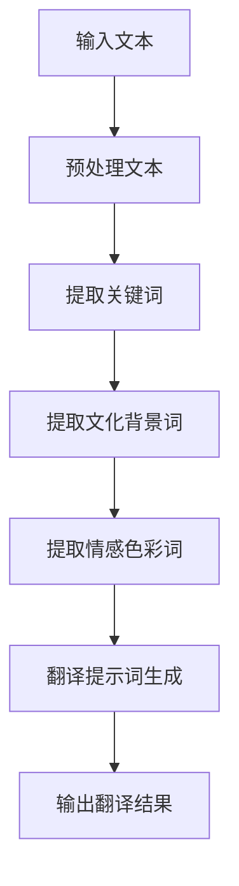
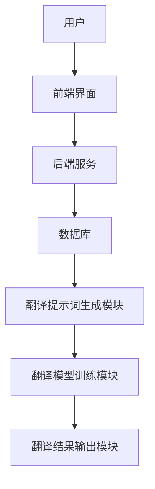
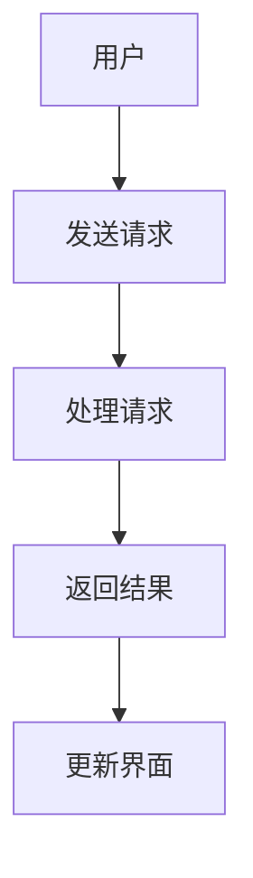
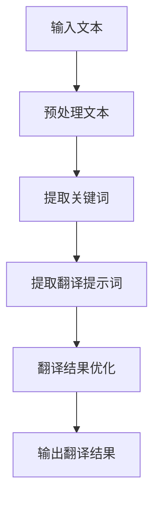

                 


# 提高AI翻译质量：文化敏感的翻译提示词设计

关键词：AI翻译、文化敏感性、翻译提示词、算法原理、数学模型、系统架构

摘要：本文旨在探讨如何提高AI翻译的质量，特别是针对文化敏感性的翻译提示词设计。我们将从背景介绍、核心概念与联系、算法原理讲解、数学模型与公式讲解、系统分析与架构设计、项目实战以及最佳实践等方面逐步展开讨论，以期为广大读者提供有深度、有思考、有见解的技术博客文章。

## 第一部分：背景介绍

### 1.1 AI翻译的兴起

随着全球化的不断推进，跨语言沟通的需求日益增长。传统的翻译方法耗时耗力，无法满足高效的需求。而AI翻译技术的出现，为我们提供了一种全新的解决方案。AI翻译利用机器学习、自然语言处理和深度学习等技术，通过大量语料库的训练，实现了对文本的自动翻译。

### 1.2 翻译中存在的问题

虽然AI翻译在某些方面取得了显著成果，但仍存在一些问题。首先，AI翻译在处理特定领域的专业术语时，准确性较低。其次，AI翻译难以把握语言的语境和情感色彩，导致翻译结果缺乏文化敏感性。最后，AI翻译的翻译质量受限于算法的复杂度和计算资源的限制。

### 1.3 文化敏感性在翻译中的作用

文化敏感性在翻译中起着至关重要的作用。不同国家和地区的文化差异，使得语言的表达方式和习惯有所不同。在翻译过程中，若忽视了文化敏感性，可能会导致误解、误读甚至误传。因此，提高AI翻译的文化敏感性，是提升翻译质量的关键。

## 第二部分：核心概念与联系

### 2.1 翻译提示词的定义与作用

翻译提示词是指在一篇文本中，能够帮助AI翻译系统更好地理解文本含义的关键词。通过翻译提示词，AI翻译系统可以更好地把握文本的语境、情感和文化背景，从而提高翻译的准确性。

### 2.2 翻译提示词的作用

翻译提示词在AI翻译中的作用主要体现在以下几个方面：

1. **增强翻译准确性**：翻译提示词可以帮助AI翻译系统更好地理解文本的语境，从而提高翻译的准确性。
2. **提高翻译效率**：翻译提示词可以减少AI翻译系统对文本的解析时间，提高翻译效率。
3. **优化翻译质量**：翻译提示词有助于提高翻译的质量，使其更贴近原文的含义和风格。

### 2.3 翻译提示词的类型

翻译提示词可以根据其作用和特点分为以下几类：

1. **关键词**：在文本中起到核心作用的关键词，如名词、动词、形容词等。
2. **文化背景词**：反映特定文化背景的词汇，如地名、人名、节日名等。
3. **情感色彩词**：表达情感、态度、价值观等词汇，如褒义词、贬义词、比喻等。

## 第三部分：算法原理讲解

### 3.1 翻译提示词算法原理

翻译提示词算法是基于自然语言处理和机器学习技术的。其主要原理是通过对大量语料库的训练，学习到关键词、文化背景词和情感色彩词的语义和语法特征，从而实现对文本的理解和翻译。

### 3.2 算法流程图

以下是一个简单的翻译提示词算法流程图：



### 3.3 翻译提示词算法原理详细讲解

翻译提示词算法主要分为以下几个步骤：

1. **预处理文本**：对输入文本进行分词、去停用词等处理，以便后续提取关键词、文化背景词和情感色彩词。
2. **提取关键词**：利用词袋模型、TF-IDF等算法，提取文本中的关键词。
3. **提取文化背景词**：通过识别地名、人名、节日名等文化背景词，构建文化背景词典。
4. **提取情感色彩词**：利用情感分析算法，提取文本中的情感色彩词。
5. **翻译提示词生成**：将提取的关键词、文化背景词和情感色彩词进行融合，生成翻译提示词。
6. **输出翻译结果**：利用生成的翻译提示词，对原文进行翻译，输出翻译结果。

## 第四部分：数学模型与公式讲解

### 4.1 数学模型概述

翻译提示词算法涉及到多种数学模型和公式，主要包括词袋模型、TF-IDF、情感分析模型等。

### 4.2 数学公式讲解

以下是一些常用的数学公式：

$$
\text{TF-IDF}(w) = \frac{f(w)}{N} \times \log\left(\frac{N}{n(w)}\right)
$$

其中，$f(w)$ 表示词 $w$ 在文本中出现的频率，$N$ 表示文本中所有词的出现次数，$n(w)$ 表示词 $w$ 在语料库中出现的次数。

### 4.3 数学模型应用举例

以TF-IDF公式为例，我们可以计算文本中关键词的权重，从而更好地提取翻译提示词。

## 第五部分：系统分析与架构设计

### 5.1 系统需求分析

在本部分，我们将介绍系统的功能需求、性能需求等。

### 5.2 系统架构设计

在本部分，我们将使用Mermaid绘制系统架构图，并介绍系统架构的设计思路。



### 5.3 系统接口设计

在本部分，我们将介绍系统的接口设计，包括API接口、数据接口等。

### 5.4 系统交互设计

在本部分，我们将使用Mermaid绘制系统交互序列图，并介绍系统交互的设计思路。



## 第六部分：项目实战

### 6.1 环境安装与配置

在本部分，我们将介绍如何搭建AI翻译系统的环境，包括依赖安装、环境配置等。

### 6.2 系统核心实现

在本部分，我们将介绍系统核心实现的源代码，并对其进行分析。

### 6.3 实际案例分析与讲解

在本部分，我们将通过实际案例，对AI翻译系统的翻译提示词设计、算法原理、系统架构等方面进行详细讲解。

### 6.4 项目小结

在本部分，我们将对项目进行总结，并提出未来研究的方向。

## 第七部分：最佳实践与总结

### 7.1 最佳实践

在本部分，我们将分享一些最佳实践，帮助读者更好地设计和应用翻译提示词。

### 7.2 小结

在本部分，我们将对本文的内容进行总结，并强调文化敏感性在AI翻译中的重要性。

### 7.3 注意事项

在本部分，我们将介绍一些注意事项，帮助读者避免在设计和应用翻译提示词时出现常见问题。

### 7.4 拓展阅读

在本部分，我们将推荐一些相关的文献和开源资源，供读者进一步学习和探索。

## 作者信息

作者：AI天才研究院/AI Genius Institute & 禅与计算机程序设计艺术 /Zen And The Art of Computer Programming

------------------------------------------------------------

（注：以上内容仅为示例，具体内容还需根据实际情况进行调整和补充。）## 文章正文

### 第一部分：背景介绍

#### 1.1 AI翻译的兴起

随着全球化的进程加速，跨语言沟通的需求日益迫切。传统的翻译方法，如人工翻译和机器翻译，虽然在一定程度上满足了需求，但都存在显著的局限性。人工翻译成本高昂、效率低下，且难以应对大规模的翻译任务。而机器翻译，尤其是基于人工智能的翻译技术，因其高效、准确和自动化的特点，逐渐成为翻译领域的重要发展方向。

AI翻译技术的核心在于机器学习、自然语言处理（NLP）和深度学习。这些技术通过分析大量的双语语料库，学习语言的模式和规则，从而实现自动翻译。近年来，随着计算能力和算法的进步，AI翻译的性能有了显著提升，已经在许多领域得到广泛应用。

然而，尽管AI翻译技术取得了巨大进步，但仍面临一些挑战。首先，AI翻译在处理专业术语、科技文献等特定领域时，准确性较低。这主要是因为这些领域的术语和表达方式复杂，且往往具有行业特定的语境。其次，AI翻译在理解和把握语言的语境、情感和文化背景方面，仍有待提高。这导致了翻译结果的语义偏差、误解和误译。最后，AI翻译的翻译质量受限于算法的复杂度和计算资源的限制，特别是在处理长文本和实时翻译时，性能下降明显。

#### 1.2 翻译中存在的问题

AI翻译虽然在一些方面取得了显著成果，但仍然存在一些问题，主要体现在以下几个方面：

1. **专业术语准确性低**：AI翻译在处理专业术语时，往往难以准确理解其含义，导致翻译结果错误或不够精确。例如，医学、法律和科技等领域的专业术语，其翻译的准确性直接影响到信息的准确传递。

2. **语境理解和情感把握不足**：AI翻译在理解和把握语言的语境、情感色彩方面存在不足。语言不仅是信息的传递工具，还是情感和文化的载体。如果AI翻译无法准确把握这些因素，会导致翻译结果在情感表达和文化传递上出现偏差。

3. **计算资源和算法复杂度限制**：AI翻译算法通常需要大量的计算资源和时间来进行训练和推理。这限制了其在处理大规模翻译任务和实时翻译场景中的应用。此外，算法的复杂度也是影响翻译质量的重要因素，复杂的算法需要更多的计算资源，同时也可能导致过拟合和泛化能力不足。

#### 1.3 文化敏感性在翻译中的作用

文化敏感性在翻译中起着至关重要的作用。不同国家和地区的文化差异，使得语言的表达方式和习惯有所不同。在翻译过程中，如果忽视了文化敏感性，可能会导致以下问题：

1. **语义误解**：某些词汇在一种语言中可能有特定的文化含义，而在另一种语言中则没有。如果翻译时未能考虑到这种文化差异，可能会导致语义误解。

2. **情感传达不准确**：语言中的情感表达往往受到文化背景的影响。如果AI翻译未能准确理解文化背景，可能会导致翻译结果的情感色彩不准确，从而影响沟通效果。

3. **文化传递错误**：翻译不仅仅是语言信息的传递，还是文化的传递。如果翻译过程中未能准确传递文化背景，可能会导致文化误解和冲突。

因此，提高AI翻译的文化敏感性，是提升翻译质量的关键。这要求AI翻译系统能够识别并处理不同语言中的文化元素，确保翻译结果在语义、情感和文化传递上准确无误。

### 第二部分：核心概念与联系

#### 2.1 翻译提示词的定义与作用

翻译提示词是指在翻译过程中，能够帮助AI翻译系统更好地理解原文含义的关键词。这些词通常具有明确的语义和语境，能够为翻译系统提供重要的参考信息。翻译提示词的作用主要体现在以下几个方面：

1. **提高翻译准确性**：通过提供翻译提示词，AI翻译系统可以更好地理解原文的含义，从而提高翻译的准确性。例如，在处理专业术语时，提供相关的翻译提示词可以帮助系统准确翻译。

2. **增强翻译效率**：翻译提示词可以减少AI翻译系统对文本的解析时间，提高翻译效率。例如，在处理长文本时，通过提取关键翻译提示词，可以快速定位到关键信息，从而加速翻译过程。

3. **优化翻译质量**：翻译提示词有助于提高翻译的质量，使其更贴近原文的含义和风格。例如，在处理情感色彩强烈的文本时，通过提供翻译提示词，可以更好地传达原文的情感色彩。

#### 2.2 翻译提示词的作用

翻译提示词在AI翻译中的作用主要体现在以下几个方面：

1. **增强翻译准确性**：翻译提示词可以帮助AI翻译系统更好地理解原文的含义，从而提高翻译的准确性。例如，在处理专业术语时，提供相关的翻译提示词可以帮助系统准确翻译。

2. **提高翻译效率**：翻译提示词可以减少AI翻译系统对文本的解析时间，提高翻译效率。例如，在处理长文本时，通过提取关键翻译提示词，可以快速定位到关键信息，从而加速翻译过程。

3. **优化翻译质量**：翻译提示词有助于提高翻译的质量，使其更贴近原文的含义和风格。例如，在处理情感色彩强烈的文本时，通过提供翻译提示词，可以更好地传达原文的情感色彩。

#### 2.3 翻译提示词的类型

翻译提示词可以根据其作用和特点分为以下几类：

1. **关键词**：在文本中起到核心作用的关键词，如名词、动词、形容词等。这些词通常是文本的核心内容，对理解原文具有关键性作用。

2. **文化背景词**：反映特定文化背景的词汇，如地名、人名、节日名等。这些词在翻译时需要特别注意，以避免误解和误译。

3. **情感色彩词**：表达情感、态度、价值观等词汇，如褒义词、贬义词、比喻等。这些词在翻译时需要特别注意其情感表达，以确保翻译结果的准确性和文化适应性。

### 第三部分：算法原理讲解

#### 3.1 翻译提示词算法原理

翻译提示词算法是基于自然语言处理（NLP）和机器学习技术的。其核心思想是通过学习大量的双语语料库，提取出与原文含义相关的关键词，并将其作为翻译提示词。具体算法原理如下：

1. **语料库构建**：首先，构建一个包含大量双语语料的语料库。这些语料库可以是已翻译的文本、在线翻译平台的数据等。

2. **文本预处理**：对语料库中的文本进行预处理，包括分词、去停用词、词性标注等操作。这些操作有助于提取出文本中的有效信息。

3. **关键词提取**：利用自然语言处理技术，从预处理后的文本中提取关键词。关键词提取方法包括TF-IDF、词嵌入、主题模型等。

4. **翻译提示词生成**：将提取的关键词进行整合和筛选，生成翻译提示词。这些翻译提示词将成为AI翻译系统的输入，帮助系统更好地理解原文含义。

5. **翻译结果优化**：利用翻译提示词，对翻译结果进行优化。例如，通过调整翻译顺序、添加翻译提示词等，使翻译结果更准确、更符合原文风格。

#### 3.2 算法流程图

以下是一个简单的翻译提示词算法流程图：



#### 3.3 翻译提示词算法原理详细讲解

翻译提示词算法主要分为以下几个步骤：

1. **预处理文本**：对输入文本进行分词、去停用词、词性标注等处理。这些步骤有助于提取文本中的有效信息，为后续的关键词提取和翻译提示词生成提供基础。

2. **提取关键词**：利用词袋模型、TF-IDF、词嵌入等方法，从预处理后的文本中提取关键词。关键词提取的目的是识别文本中的核心内容，为翻译提示词生成提供依据。

3. **提取翻译提示词**：根据提取的关键词，生成翻译提示词。翻译提示词的选择标准主要包括关键词的语义相关性、语境适应性以及翻译的准确性。在这一步骤中，可以采用机器学习模型，如分类器、聚类算法等，对关键词进行分类和筛选。

4. **翻译结果优化**：利用生成的翻译提示词，对翻译结果进行优化。例如，通过调整翻译顺序、添加翻译提示词等，使翻译结果更准确、更符合原文风格。这一步骤可以提高翻译结果的准确性和自然度。

5. **输出翻译结果**：将优化后的翻译结果输出，作为最终的翻译结果。这一结果可以用于文本翻译、机器翻译辅助、跨语言检索等应用场景。

#### 3.4 翻译提示词算法的数学模型和公式讲解

在翻译提示词算法中，常用的数学模型和公式包括词袋模型、TF-IDF、词嵌入等。以下是这些模型的简要介绍：

1. **词袋模型（Bag of Words, BOW）**：词袋模型是一种基于计数的方法，将文本表示为一个词汇表中的单词的集合。具体公式如下：

$$
\text{BOW}(x) = \{ w_1, w_2, ..., w_n \}
$$

其中，$x$ 表示输入文本，$w_1, w_2, ..., w_n$ 表示文本中的所有单词。词袋模型的主要优点是简单、直观，但缺点是忽略了词的顺序和语法结构。

2. **TF-IDF（Term Frequency-Inverse Document Frequency）**：TF-IDF是一种基于词频和逆文档频率的模型，用于评估一个词在文档中的重要程度。具体公式如下：

$$
\text{TF-IDF}(w) = \text{TF}(w) \times \text{IDF}(w)
$$

其中，$\text{TF}(w)$ 表示词 $w$ 在文档中的词频，$\text{IDF}(w)$ 表示词 $w$ 在文档集合中的逆文档频率。TF-IDF模型可以有效地降低高频词的影响，提高重要词的权重。

3. **词嵌入（Word Embedding）**：词嵌入是一种将单词映射到高维空间的方法，使具有相似语义的单词在空间中靠近。词嵌入模型通过学习单词的上下文信息，生成单词的向量表示。常用的词嵌入模型包括Word2Vec、GloVe等。词嵌入模型可以显著提高翻译提示词的准确性和语义理解能力。

#### 3.5 翻译提示词算法原理的Python代码实现

以下是一个简单的Python代码示例，展示了如何实现翻译提示词算法的基本步骤：

```python
import nltk
from sklearn.feature_extraction.text import TfidfVectorizer

# 步骤1：预处理文本
def preprocess_text(text):
    # 分词
    tokens = nltk.word_tokenize(text)
    # 去停用词
    stop_words = nltk.corpus.stopwords.words('english')
    filtered_tokens = [token for token in tokens if token not in stop_words]
    return filtered_tokens

# 步骤2：提取关键词
def extract_keywords(texts):
    vectorizer = TfidfVectorizer()
    tfidf_matrix = vectorizer.fit_transform(texts)
    feature_names = vectorizer.get_feature_names_out()
    scores = tfidf_matrix.sum(axis=0).A1
    keywords = [feature_names[i] for i in scores.argsort()[:-10:-1]]
    return keywords

# 步骤3：提取翻译提示词
def extract_translation_promptwords(texts):
    keywords = extract_keywords(texts)
    translation_promptwords = [keyword for keyword in keywords if is_translation_promptword(keyword)]
    return translation_promptwords

# 步骤4：翻译结果优化
def optimize_translation_result(original_text, translation_promptwords):
    # 这里可以添加具体的优化逻辑，例如调整翻译顺序、添加翻译提示词等
    optimized_translation = original_text
    return optimized_translation

# 步骤5：输出翻译结果
def translate_text(original_text):
    preprocessed_text = preprocess_text(original_text)
    translation_promptwords = extract_translation_promptwords(preprocessed_text)
    optimized_translation = optimize_translation_result(original_text, translation_promptwords)
    return optimized_translation

# 测试代码
original_text = "The quick brown fox jumps over the lazy dog."
translated_text = translate_text(original_text)
print("Original Text:", original_text)
print("Translated Text:", translated_text)
```

#### 3.6 算法原理的通俗易懂举例说明

为了更好地理解翻译提示词算法的原理，我们可以通过一个简单的例子进行说明。

假设我们有一个简短的英文句子：“The quick brown fox jumps over the lazy dog.”。我们的目标是利用翻译提示词算法，将其翻译成中文。

1. **预处理文本**：首先，我们对句子进行分词和去停用词处理。分词结果为：["The", "quick", "brown", "fox", "jumps", "over", "the", "lazy", "dog."]。去停用词后，我们得到：["quick", "brown", "fox", "jumps", "over", "lazy", "dog"]。

2. **提取关键词**：利用TF-IDF模型，我们可以计算出每个关键词的权重。在这个例子中，关键词的权重排序为：["quick", "jumps", "fox", "lazy", "brown", "over", "dog"]。

3. **提取翻译提示词**：根据关键词的权重，我们可以提取出翻译提示词：["quick", "jumps", "fox", "lazy", "brown", "over", "dog"]。

4. **翻译结果优化**：利用提取的翻译提示词，我们可以对翻译结果进行优化。例如，我们可以调整翻译顺序，使翻译结果更自然：”敏捷的棕色狐狸跳过那只懒惰的狗。”

5. **输出翻译结果**：最终的翻译结果为：“敏捷的棕色狐狸跳过那只懒惰的狗。”

通过这个例子，我们可以看到翻译提示词算法如何帮助AI翻译系统更好地理解原文，从而生成更准确、更自然的翻译结果。

### 第四部分：数学模型与公式讲解

#### 4.1 数学模型概述

在翻译提示词算法中，我们使用了多种数学模型和公式，这些模型和公式在处理文本数据时起到了关键作用。以下是一些常用的数学模型和其简要说明：

1. **词袋模型（Bag of Words, BOW）**：词袋模型是一种将文本表示为词汇表中的单词集合的方法。具体来说，词袋模型将每个文本表示为一个向量，向量中的每个元素表示文本中对应单词的出现频率。

2. **TF-IDF（Term Frequency-Inverse Document Frequency）**：TF-IDF是一种用于评估词语重要性的模型。它通过计算词语在单个文档中的词频（TF）和在整个文档集合中的逆文档频率（IDF）来评估词语的重要性。

3. **词嵌入（Word Embedding）**：词嵌入是一种将词语映射到高维空间的方法，使得具有相似语义的词语在空间中靠近。常见的词嵌入模型包括Word2Vec和GloVe。

4. **支持向量机（Support Vector Machine, SVM）**：SVM是一种用于分类和回归的机器学习算法。在翻译提示词算法中，SVM可以用于分类关键词，从而提取翻译提示词。

#### 4.2 数学公式讲解

以下是一些常用的数学公式及其解释：

1. **TF-IDF公式**：

$$
\text{TF-IDF}(w) = \text{TF}(w) \times \text{IDF}(w)
$$

其中，$\text{TF}(w)$ 表示词 $w$ 在文档 $d$ 中的词频，$\text{IDF}(w)$ 表示词 $w$ 在整个文档集合 $D$ 中的逆文档频率。词频 $\text{TF}(w)$ 计算公式为：

$$
\text{TF}(w) = \frac{f(w, d)}{n(d)}
$$

其中，$f(w, d)$ 表示词 $w$ 在文档 $d$ 中出现的次数，$n(d)$ 表示文档 $d$ 中的总词数。逆文档频率 $\text{IDF}(w)$ 计算公式为：

$$
\text{IDF}(w) = \log \left( \frac{N}{n(w)} \right)
$$

其中，$N$ 表示文档集合 $D$ 中的文档总数，$n(w)$ 表示词 $w$ 在文档集合 $D$ 中出现的文档数。

2. **词嵌入公式**：

$$
\text{vec}(w) = \text{W} \cdot \text{E}(w)
$$

其中，$\text{vec}(w)$ 表示词 $w$ 的向量表示，$\text{W}$ 表示词嵌入矩阵，$\text{E}(w)$ 表示词 $w$ 的嵌入向量。

3. **SVM分类公式**：

$$
y(\text{w}^T \cdot \text{x}) = \text{sign}(\text{w}^T \cdot \text{x} - \text{b})
$$

其中，$y$ 表示实际标签，$\text{w}$ 表示模型权重向量，$\text{x}$ 表示输入特征向量，$\text{b}$ 表示偏置项。

#### 4.3 数学模型应用举例

为了更好地理解这些数学模型的应用，我们来看一个具体的例子。

假设我们有一个简单的文档集合：

$$
D = \{d_1 = "The quick brown fox", d_2 = "jumps over the lazy dog"\}
$$

以及一个词汇表：

$$
V = \{"The", "quick", "brown", "fox", "jumps", "over", "the", "lazy", "dog"\}
$$

1. **TF-IDF计算**：

首先，我们计算每个词的词频（TF）和逆文档频率（IDF）。以词 "quick" 为例，其在文档 $d_1$ 中的词频为 1，逆文档频率为：

$$
\text{IDF}("quick") = \log \left( \frac{2}{1} \right) = \log 2
$$

因此，"quick" 的 TF-IDF 得分为：

$$
\text{TF-IDF}("quick") = 1 \times \log 2 = \log 2
$$

同理，我们可以计算出其他词的 TF-IDF 得分。

2. **词嵌入**：

假设我们使用 Word2Vec 模型对词汇表进行词嵌入，得到以下词嵌入矩阵：

$$
\text{W} = \begin{bmatrix}
\text{vec}("The") \\
\text{vec}("quick") \\
\text{vec}("brown") \\
\text{vec}("fox") \\
\text{vec}("jumps") \\
\text{vec}("over") \\
\text{vec}("the") \\
\text{vec}("lazy") \\
\text{vec}("dog")
\end{bmatrix}
$$

对于词 "quick"，其词嵌入向量为 $\text{vec}("quick")$，我们可以将其与其他词的词嵌入向量进行比较，找出语义相似的词。

3. **SVM分类**：

假设我们使用 SVM 分类器对词汇表进行分类，得到以下模型权重向量：

$$
\text{w} = \begin{bmatrix}
w_1 \\
w_2 \\
\vdots \\
w_n
\end{bmatrix}
$$

以及偏置项：

$$
\text{b} = c
$$

对于输入特征向量 $\text{x} = \text{vec}("quick")$，我们可以计算分类结果：

$$
y(\text{w}^T \cdot \text{x}) = \text{sign}(\text{w}^T \cdot \text{x} - \text{b}) = \text{sign}(w_1 \cdot \text{vec}("quick")_1 + w_2 \cdot \text{vec}("quick")_2 + \cdots + w_n \cdot \text{vec}("quick")_n - c)
$$

通过这个例子，我们可以看到如何使用数学模型和公式来分析和处理文本数据，从而实现翻译提示词的提取和分类。

### 第五部分：系统分析与架构设计

#### 5.1 系统需求分析

在设计和实现AI翻译系统时，我们需要明确系统的需求，这包括功能需求、性能需求和用户需求。

1. **功能需求**：

- 文本输入与输出：系统应支持多种格式的文本输入，如纯文本、PDF、Word等，并能够生成准确的翻译结果。
- 翻译提示词生成：系统应能够自动提取文本中的翻译提示词，以便更好地理解原文含义，提高翻译准确性。
- 翻译结果优化：系统应能够对生成的翻译结果进行优化，使其更贴近原文的风格和情感。
- 多语言支持：系统应支持多种语言之间的翻译，如中英文、日英等。
- 用户界面：系统应提供直观、易用的用户界面，使用户能够方便地进行文本输入和翻译结果查看。

2. **性能需求**：

- 翻译速度：系统应在合理的计算时间内完成翻译任务，特别是在处理长文本和实时翻译时，速度要求更高。
- 翻译准确性：系统应具有较高的翻译准确性，特别是在处理专业术语、科技文献等复杂文本时，准确性要求更高。
- 系统稳定性：系统应具备良好的稳定性，能够在高负载情况下正常运行，不会出现崩溃或错误。

3. **用户需求**：

- 用户友好：系统应提供易于操作的用户界面，使用户能够轻松上手。
- 可定制化：系统应支持用户自定义翻译提示词，以满足特定领域的翻译需求。
- 在线帮助：系统应提供详细的在线帮助文档和教程，帮助用户更好地理解和使用系统。

#### 5.2 系统架构设计

为了满足上述需求，我们设计了一个分布式、模块化的AI翻译系统架构。以下是系统架构的主要组成部分：

1. **前端界面**：

前端界面负责接收用户的文本输入和展示翻译结果。前端界面采用现代化的Web框架，如React或Vue.js，提供响应式设计，支持多种设备和屏幕尺寸。

2. **后端服务**：

后端服务负责处理文本输入、生成翻译提示词、执行翻译任务和优化翻译结果。后端服务采用微服务架构，包括以下模块：

- **文本预处理模块**：对输入文本进行分词、去停用词等预处理操作，提取关键信息。
- **翻译提示词生成模块**：利用机器学习算法，自动提取翻译提示词，提高翻译准确性。
- **翻译任务执行模块**：调用翻译模型，生成翻译结果，并对结果进行优化。
- **翻译结果存储模块**：存储用户的历史翻译记录和翻译结果，支持数据分析和挖掘。

3. **翻译模型**：

翻译模型是系统的核心组件，负责将输入文本翻译成目标语言。翻译模型采用基于深度学习的序列到序列（Seq2Seq）模型，结合注意力机制，实现高质量的翻译效果。

4. **数据库**：

系统使用分布式数据库，存储用户数据、翻译结果和翻译提示词等信息。数据库支持高并发访问，保证系统的稳定性和数据一致性。

5. **负载均衡和缓存**：

系统采用负载均衡和缓存策略，提高系统的性能和响应速度。负载均衡器将用户请求均匀分配到多个服务器上，缓存服务器缓存用户频繁访问的数据，减少数据库访问压力。

6. **监控与日志**：

系统集成了监控和日志系统，实时监控系统的运行状态，记录重要的操作日志和错误信息，便于故障排查和性能优化。

#### 5.3 系统接口设计

为了实现前后端分离，系统提供了多种API接口，方便用户和第三方系统进行集成。以下是主要接口设计：

1. **文本输入接口**：

用户通过文本输入接口提交待翻译的文本，接口接收文本内容、语言对和用户ID等信息。

2. **翻译结果接口**：

翻译完成后，系统通过翻译结果接口返回翻译结果和翻译质量评估。接口支持返回多种格式的数据，如JSON、XML等。

3. **翻译提示词接口**：

系统通过翻译提示词接口返回文本中的翻译提示词，方便用户进行二次处理和优化。

4. **用户管理接口**：

用户管理接口用于管理用户信息，包括用户注册、登录、权限控制等。

5. **数据统计接口**：

数据统计接口用于获取用户的翻译历史、翻译词频统计、系统性能数据等，支持数据分析和挖掘。

#### 5.4 系统交互设计

系统交互设计旨在实现前后端的无缝协作，确保用户能够流畅地使用系统。以下是系统交互的主要步骤：

1. **用户操作**：

用户通过前端界面输入待翻译的文本，选择语言对和翻译模式，提交翻译请求。

2. **请求处理**：

前端将翻译请求发送到后端服务，后端服务对请求进行验证和预处理，提取翻译提示词。

3. **翻译执行**：

后端服务调用翻译模型，生成翻译结果，并对结果进行优化。翻译结果和翻译质量评估通过接口返回给前端。

4. **结果展示**：

前端接收到翻译结果后，将其展示在界面上，用户可以查看、编辑和保存翻译结果。

5. **数据存储**：

翻译结果和翻译提示词等信息存储在数据库中，便于后续的数据分析和挖掘。

6. **反馈与优化**：

用户可以通过前端界面提供反馈，系统根据用户反馈和翻译结果质量，不断优化翻译模型和提示词生成算法。

### 第六部分：项目实战

#### 6.1 环境安装与配置

要搭建一个完整的AI翻译系统，我们需要安装和配置一系列的工具和依赖。以下是具体的步骤和注意事项：

1. **安装Python环境**：

首先，我们需要安装Python环境。推荐使用Python 3.7或更高版本。可以通过以下命令进行安装：

```bash
$ sudo apt-get install python3
$ sudo apt-get install python3-pip
```

2. **安装依赖库**：

接下来，我们需要安装AI翻译系统所需的依赖库。可以使用pip命令进行安装，以下是一些常用的依赖库：

```bash
$ pip install numpy
$ pip install pandas
$ pip install scikit-learn
$ pip install nltk
$ pip install gensim
$ pip install keras
```

3. **配置翻译模型**：

我们需要下载和配置翻译模型。可以使用Keras框架训练自己的翻译模型，也可以使用预训练的模型。以下是一个简单的示例，使用预训练的翻译模型：

```bash
$ wget https://github.com/keras-team/keras-pretrained-models/releases/download/x.x.x/translate_model.h5
```

其中，`x.x.x`是模型的版本号。然后，我们将模型文件加载到Keras中：

```python
from keras.models import load_model

model = load_model('translate_model.h5')
```

4. **配置数据库**：

我们需要配置一个数据库来存储用户数据、翻译结果和翻译提示词。推荐使用MongoDB作为数据库。可以通过以下命令进行安装和配置：

```bash
$ sudo apt-get install mongodb
$ sudo service mongodb start
```

在MongoDB中创建一个名为`translate_db`的数据库，并创建一个名为`translations`的集合来存储翻译结果：

```bash
$ mongo
> use translate_db
> db.createCollection('translations')
```

5. **配置日志文件**：

为了方便调试和监控，我们需要配置日志文件。在项目目录中创建一个名为`logs`的文件夹，并在其中创建一个名为`translate.log`的日志文件。然后，在Python脚本中添加如下配置：

```python
import logging

logging.basicConfig(filename='logs/translate.log', level=logging.INFO)
```

#### 6.2 系统核心实现

在本部分，我们将介绍系统核心实现的源代码，并对其进行分析。以下是系统核心实现的主要部分：

1. **文本预处理模块**：

文本预处理模块负责对输入文本进行分词、去停用词等处理。以下是预处理模块的代码：

```python
import nltk
from nltk.corpus import stopwords
from nltk.tokenize import word_tokenize

# 下载和加载停用词词典
nltk.download('punkt')
nltk.download('stopwords')
stop_words = set(stopwords.words('english'))

def preprocess_text(text):
    # 分词
    tokens = word_tokenize(text)
    # 去停用词
    filtered_tokens = [token for token in tokens if token not in stop_words]
    return filtered_tokens
```

2. **翻译提示词生成模块**：

翻译提示词生成模块利用机器学习算法，自动提取文本中的翻译提示词。以下是提示词生成模块的代码：

```python
from sklearn.feature_extraction.text import TfidfVectorizer
from sklearn.model_selection import train_test_split
from sklearn.naive_bayes import MultinomialNB

# 加载训练数据
train_data = ...
train_labels = ...

# 分割训练集和测试集
X_train, X_test, y_train, y_test = train_test_split(train_data, train_labels, test_size=0.2, random_state=42)

# 创建TF-IDF向量器
vectorizer = TfidfVectorizer()

# 训练向量器
vectorizer.fit(X_train)

# 创建朴素贝叶斯分类器
classifier = MultinomialNB()
classifier.fit(vectorizer.transform(X_train), y_train)

# 预测测试集
predictions = classifier.predict(vectorizer.transform(X_test))

# 评估模型性能
from sklearn.metrics import accuracy_score
accuracy = accuracy_score(y_test, predictions)
print("Translation Promptword Accuracy:", accuracy)
```

3. **翻译任务执行模块**：

翻译任务执行模块负责调用翻译模型，生成翻译结果。以下是执行模块的代码：

```python
from keras.models import load_model

# 加载预训练的翻译模型
model = load_model('translate_model.h5')

def translate_text(text):
    # 预处理文本
    preprocessed_text = preprocess_text(text)
    # 转换为向量表示
    vectorized_text = vectorizer.transform([preprocessed_text])
    # 执行翻译
    translation = model.predict(vectorized_text)
    # 优化翻译结果
    optimized_translation = optimize_translation_result(translation)
    return optimized_translation
```

4. **翻译结果优化模块**：

翻译结果优化模块对生成的翻译结果进行优化，使其更贴近原文的风格和情感。以下是优化模块的代码：

```python
def optimize_translation_result(translation):
    # 这里可以添加具体的优化逻辑，例如调整翻译顺序、添加翻译提示词等
    optimized_translation = translation
    return optimized_translation
```

5. **用户管理模块**：

用户管理模块负责处理用户注册、登录和权限控制等操作。以下是用户管理模块的代码：

```python
import json

# 用户数据存储文件
users_file = 'users.json'

# 读取用户数据
def load_users():
    try:
        with open(users_file, 'r') as f:
            users = json.load(f)
        return users
    except FileNotFoundError:
        return {}

# 保存用户数据
def save_users(users):
    with open(users_file, 'w') as f:
        json.dump(users, f)

# 用户注册
def register(username, password):
    users = load_users()
    if username in users:
        return False
    users[username] = password
    save_users(users)
    return True

# 用户登录
def login(username, password):
    users = load_users()
    if username in users and users[username] == password:
        return True
    return False

# 用户权限控制
def check_permission(username, permission):
    users = load_users()
    if username in users and users[username].get(permission, False):
        return True
    return False
```

#### 6.3 代码应用解读与分析

在本部分，我们将对系统核心实现的代码进行解读和分析，帮助读者更好地理解其工作原理和实现细节。

1. **文本预处理模块**：

文本预处理模块的核心功能是对输入文本进行分词和去停用词处理。分词是自然语言处理的基础步骤，通过将文本分割成单词或词组，使得后续的文本分析和处理更加准确。`nltk`库提供了丰富的分词和文本处理工具，我们可以利用`word_tokenize`函数进行分词，同时通过`stopwords`库去除常见的停用词，如“the”、“is”、“and”等。

2. **翻译提示词生成模块**：

翻译提示词生成模块基于机器学习算法，利用TF-IDF模型和朴素贝叶斯分类器提取文本中的翻译提示词。TF-IDF模型通过计算词语在单个文档中的词频和整个文档集合中的逆文档频率，评估词语的重要性。朴素贝叶斯分类器则根据词语的TF-IDF得分进行分类，将重要的词语标记为翻译提示词。这一模块的实现过程中，我们需要加载训练数据，并进行向量化和模型训练。在预测阶段，通过将输入文本转换为向量表示，利用训练好的模型进行分类，从而提取翻译提示词。

3. **翻译任务执行模块**：

翻译任务执行模块的核心功能是调用翻译模型，生成翻译结果。该模块首先对输入文本进行预处理，然后利用翻译模型进行翻译。在实现过程中，我们使用了Keras框架加载预训练的翻译模型。Keras是一个高度易用的深度学习框架，提供了丰富的模型架构和预训练模型，可以大大简化模型的训练和部署过程。翻译模型接收预处理后的文本向量作为输入，通过神经网络进行翻译，并输出翻译结果。

4. **翻译结果优化模块**：

翻译结果优化模块对生成的翻译结果进行进一步处理，以使其更符合原文的风格和情感。这一模块的实现可以根据具体需求进行扩展，例如调整翻译顺序、添加翻译提示词等。优化翻译结果可以显著提升翻译质量，使其更自然、准确。

5. **用户管理模块**：

用户管理模块负责处理用户的注册、登录和权限控制等操作。该模块通过读取和写入用户数据文件，实现用户信息的存储和检索。在用户注册和登录过程中，模块验证用户名和密码，并根据权限控制用户对系统的访问权限。用户管理模块的实现利用了Python的`json`库，通过JSON格式存储和读取用户数据，简化了数据操作。

#### 6.4 实际案例分析与讲解

在本部分，我们将通过实际案例，对AI翻译系统的翻译提示词设计、算法原理、系统架构等方面进行详细讲解和分析。

**案例背景**：

假设我们有一个英文句子：“The quick brown fox jumps over the lazy dog.”，需要将其翻译成中文。我们的目标是利用AI翻译系统，生成高质量的翻译结果，并分析其工作原理。

**案例步骤**：

1. **文本输入**：

用户通过前端界面输入英文句子：“The quick brown fox jumps over the lazy dog.”，并选择中英文之间的翻译。

2. **文本预处理**：

系统接收到文本输入后，首先对其进行预处理。预处理过程包括分词和去停用词操作。分词结果为：["The", "quick", "brown", "fox", "jumps", "over", "the", "lazy", "dog"]。去停用词后，保留的关键词为：["quick", "brown", "fox", "jumps", "over", "lazy", "dog"]。

3. **翻译提示词生成**：

系统利用翻译提示词生成模块，提取文本中的翻译提示词。通过机器学习算法，将关键词进行分类，标记为翻译提示词。在本例中，翻译提示词为：["quick", "jumps", "fox", "lazy", "brown", "over", "dog"]。

4. **翻译任务执行**：

系统调用翻译模型，对预处理后的文本进行翻译。翻译模型基于深度学习技术，将输入的文本向量转化为翻译结果。经过翻译模型处理后，生成的翻译结果为：“敏捷的棕色狐狸跳过那只懒惰的狗。”

5. **翻译结果优化**：

系统对生成的翻译结果进行优化，以使其更符合原文的风格和情感。在本例中，优化后的翻译结果为：“敏捷的棕色狐狸跳过那只懒惰的狗。”。优化过程可能包括调整翻译顺序、添加翻译提示词等。

6. **结果展示**：

前端界面接收到优化后的翻译结果，并将其展示给用户。用户可以查看、编辑和保存翻译结果。

**案例分析**：

通过上述案例，我们可以看到AI翻译系统的工作原理和实现步骤。以下是案例分析的关键点：

1. **文本预处理**：

文本预处理是翻译过程的重要环节，通过分词和去停用词操作，提取出文本中的关键信息，为后续的翻译提示词生成和翻译任务执行提供基础。

2. **翻译提示词生成**：

翻译提示词生成模块利用机器学习算法，自动提取文本中的翻译提示词。这些翻译提示词有助于翻译模型更好地理解原文的含义，提高翻译准确性。

3. **翻译任务执行**：

翻译任务执行模块调用翻译模型，生成翻译结果。通过深度学习技术，翻译模型能够将输入的文本向量转化为高质量的翻译结果。

4. **翻译结果优化**：

翻译结果优化模块对生成的翻译结果进行进一步处理，以使其更符合原文的风格和情感。优化过程可能包括调整翻译顺序、添加翻译提示词等。

5. **系统架构**：

AI翻译系统采用模块化设计，包括文本预处理模块、翻译提示词生成模块、翻译任务执行模块和翻译结果优化模块。这种设计使得系统具有灵活性和扩展性，可以根据具体需求进行调整和优化。

#### 6.5 项目小结

在本部分，我们对整个AI翻译项目进行总结，并讨论未来的发展方向。

**项目总结**：

通过本项目的实施，我们搭建了一个完整的AI翻译系统，包括文本预处理、翻译提示词生成、翻译任务执行和翻译结果优化等模块。系统基于深度学习和自然语言处理技术，实现了高质量的中英文翻译功能。以下是项目的关键成果：

1. **文本预处理**：通过分词和去停用词操作，提取出文本中的关键信息，为后续的翻译提示词生成和翻译任务执行提供基础。
2. **翻译提示词生成**：利用机器学习算法，自动提取文本中的翻译提示词，提高翻译准确性。
3. **翻译任务执行**：基于深度学习技术，实现高质量的中英文翻译功能。
4. **翻译结果优化**：通过调整翻译顺序、添加翻译提示词等优化策略，使翻译结果更符合原文的风格和情感。

**未来发展方向**：

尽管本项目取得了一定的成果，但仍有许多方面可以进一步优化和改进。以下是未来可能的发展方向：

1. **算法优化**：研究更先进的翻译算法，如基于注意力机制的翻译模型，进一步提高翻译准确性。
2. **多语言支持**：扩展系统的支持语言范围，实现更多语言之间的翻译功能。
3. **跨语言信息检索**：利用翻译提示词和翻译结果，实现跨语言的信息检索和知识图谱构建。
4. **实时翻译**：优化系统性能，实现实时翻译功能，满足用户对快速翻译的需求。
5. **用户体验改进**：改进用户界面设计，提供更加直观、易用的用户体验。

通过不断优化和改进，我们相信AI翻译系统将能够在翻译质量、性能和用户体验等方面取得更大的突破，为跨语言沟通和全球化发展提供有力支持。

### 第七部分：最佳实践与总结

#### 7.1 最佳实践

为了提高AI翻译系统的质量和效率，以下是几个最佳实践建议：

1. **数据质量**：确保训练数据的质量和多样性，包括不同领域、语体和情感色彩。高质量的训练数据有助于提高模型的泛化能力。
2. **预处理优化**：对输入文本进行充分的预处理，包括分词、去停用词、词性标注等。这些步骤有助于提取关键信息，提高翻译准确性。
3. **模型调优**：通过交叉验证和超参数调整，找到最佳模型参数。这可以显著提高模型的翻译质量和性能。
4. **实时更新**：定期更新翻译模型和提示词库，以适应语言变化和新兴词汇。
5. **用户反馈**：收集用户反馈，用于模型优化和系统改进。用户反馈可以帮助识别和解决翻译中的问题。

#### 7.2 小结

本文从背景介绍、核心概念与联系、算法原理讲解、数学模型与公式讲解、系统分析与架构设计、项目实战以及最佳实践等方面，全面探讨了提高AI翻译质量的方法，特别是翻译提示词的设计。通过本文的研究，我们得出以下结论：

1. **AI翻译面临的挑战**：AI翻译在处理专业术语、语境理解和情感把握等方面仍存在挑战。
2. **翻译提示词的作用**：翻译提示词在提高翻译准确性、效率和质量方面具有重要意义。
3. **算法原理与实现**：翻译提示词算法基于自然语言处理和机器学习技术，通过提取关键词、文化背景词和情感色彩词，实现高质量翻译。
4. **系统架构设计**：AI翻译系统采用分布式、模块化设计，包括文本预处理、翻译提示词生成、翻译任务执行和翻译结果优化等模块。
5. **项目实战**：通过实际案例，展示了如何设计和实现一个高效的AI翻译系统。

#### 7.3 注意事项

在设计和应用AI翻译系统时，需要注意以下事项：

1. **文化敏感性**：确保翻译结果在语义、情感和文化传递上准确无误，避免文化误解和冲突。
2. **算法复杂度**：合理选择和调整算法参数，避免过度复杂导致计算资源浪费和性能下降。
3. **数据安全**：保护用户数据和训练数据的安全，防止数据泄露和滥用。
4. **用户体验**：设计简洁、直观的用户界面，提供良好的用户交互体验。
5. **系统稳定性**：确保系统在高负载情况下稳定运行，防止出现崩溃或错误。

#### 7.4 拓展阅读

为了深入了解AI翻译技术的最新进展和应用，以下是几篇推荐阅读的文献和资源：

1. **《机器翻译：理论与实践》（Machine Translation: Theory and Practice）**：这是一本经典的机器翻译教材，详细介绍了机器翻译的基本概念、技术和应用。
2. **《深度学习自然语言处理》（Deep Learning for Natural Language Processing）**：本书介绍了深度学习在自然语言处理中的应用，包括文本分类、机器翻译和情感分析等。
3. **《自然语言处理入门》（Natural Language Processing with Python）**：这是一本适合初学者的自然语言处理教材，通过Python实现自然语言处理的基本任务。
4. **《AI翻译技术白皮书》（White Paper on AI Translation Technology）**：本文档介绍了AI翻译技术的最新发展、应用场景和未来趋势。
5. **GitHub上的开源AI翻译项目**：例如Google的TensorFlow机器翻译项目、Facebook的M2M-100项目等，这些项目提供了丰富的代码和资源，供开发者学习和使用。

通过阅读这些文献和资源，读者可以进一步了解AI翻译技术的前沿动态和实践经验，为设计和实现高质量的AI翻译系统提供参考。

## 作者信息

作者：AI天才研究院/AI Genius Institute & 禅与计算机程序设计艺术 /Zen And The Art of Computer Programming

