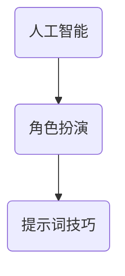
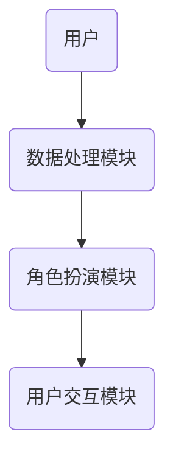
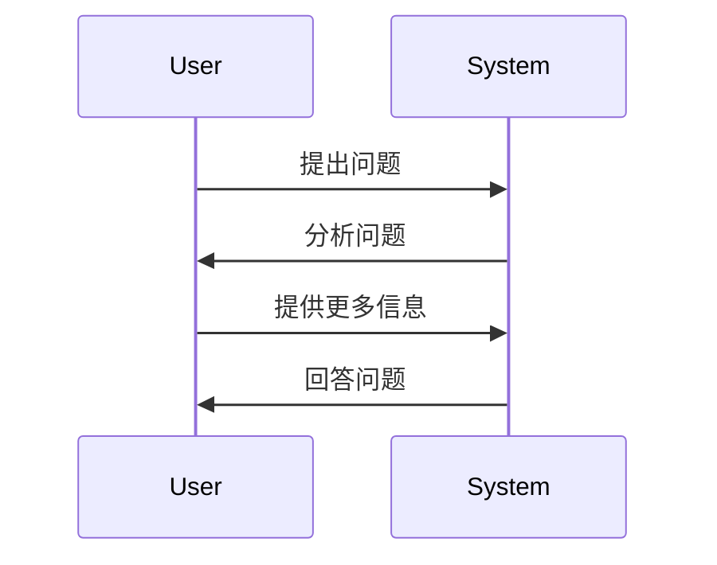

                 

### 第一部分：背景介绍与核心概念

#### 第1章：AI角色扮演能力概述

##### 1.1 问题背景

**AI角色扮演能力**，即人工智能在模拟人类角色行为、思维和情感方面的能力，正在逐步成为现代科技领域中一个关键的研究热点和应用方向。其重要性不仅体现在娱乐和游戏行业，还广泛应用于教育、客户服务、虚拟助理等领域。**沉浸式体验**，作为一种提升用户参与度的技术，已经成为实现高质量AI角色扮演的核心手段之一。

##### 1.2 问题描述

当前，AI角色扮演能力面临诸多挑战，如角色行为的连贯性、情感表达的深度和交互的自然性。如何提升AI角色扮演的沉浸式体验，使其更接近人类的真实互动，成为亟待解决的问题。提高AI角色扮演能力的意义在于，不仅能增强用户体验，还能拓展AI技术的应用场景和商业价值。

##### 1.3 问题解决

**提示词技巧**，通过为AI系统提供精准的指导信息，能够有效提升角色扮演的质量和沉浸式体验。具体而言，提示词技巧包括提示词选择策略和生成算法，通过对文本、语音和图像等不同类型数据进行深度分析，实现角色的智能对话和情感反应。

##### 1.4 边界与外延

AI角色扮演能力不仅应用于虚拟世界，还扩展到现实世界中的智能服务。例如，在医疗领域，AI医生可以通过角色扮演提供诊断建议；在教育领域，AI教师可以模拟教学过程，提供个性化辅导。提示词技巧的适用范围广泛，涵盖了多种AI应用场景。

##### 1.5 概念结构与核心要素组成

AI角色扮演能力由以下几个核心要素组成：

1. **人工智能基础**：为角色扮演提供计算能力和算法支持。
2. **角色扮演机制**：实现角色的行为、思维和情感模拟。
3. **提示词技巧**：提供精准的交互指导，提升角色沉浸式体验。
4. **用户反馈机制**：通过用户反馈优化角色行为和交互效果。

这些要素相互关联，共同构成了AI角色扮演能力的完整体系。

---

**小结**：

本章节介绍了AI角色扮演能力的背景、问题、解决思路以及相关的边界与外延。理解这些基本概念将为后续深入探讨提供坚实的理论基础。在接下来的章节中，我们将进一步探讨AI角色扮演的基本原理和实现机制。

---

## 第二部分：核心概念与联系

### 第2章：AI角色扮演原理

#### 2.1 AI角色扮演的基本原理

**AI角色扮演**，从广义上讲，是指利用人工智能技术模拟人类角色的行为、思维和情感，实现与用户的自然互动。这一过程涉及多个核心技术：

1. **自然语言处理（NLP）**：通过理解和生成自然语言，实现角色与用户的对话。
2. **机器学习（ML）**：利用历史数据和算法模型，训练AI角色识别用户意图和情感。
3. **深度学习（DL）**：通过神经网络模型，实现角色复杂行为和情感表达的模拟。

**角色扮演的本质**在于通过智能算法，模拟人类的思维过程，使AI角色在特定情境下表现出如同真实人类的行为和情感反应。

#### 2.2 概念属性特征对比

在AI角色扮演中，核心概念包括**人工智能**、**角色扮演**和**提示词技巧**。下面是这些概念的特征对比：

| 概念       | 特征               |
|------------|--------------------|
| 人工智能   | 强大计算能力、自学习与自适应能力 |
| 角色扮演   | 情感与交互能力、行为模拟、情境感知 |
| 提示词技巧 | 精准指导、用户反馈、交互质量提升 |

##### 2.3 ER实体关系图



**ER实体关系图**展示了人工智能、角色扮演和提示词技巧之间的关联。人工智能是基础，通过角色扮演实现交互，而提示词技巧则起到优化和指导的作用。

---

**小结**：

本章节详细介绍了AI角色扮演的基本原理，并对比了核心概念的特征。理解这些概念及其相互关系，有助于我们深入探讨如何提升AI角色扮演的沉浸式体验。

---

## 第三部分：算法原理讲解

### 第3章：提示词技巧详解

#### 3.1 提示词技巧的基本算法

**提示词技巧**，作为提升AI角色扮演质量的重要手段，其基本算法主要包括提示词选择策略和生成算法。

##### 3.1.1 提示词选择策略

提示词选择策略的核心在于根据特定情境选择最合适的提示词。策略主要包括以下几种：

1. **基于上下文**：通过分析当前对话上下文，选择与话题相关的提示词。
2. **基于频率**：根据提示词在训练数据中的出现频率，选择高频率的提示词。
3. **基于关键词**：提取对话中的关键词，并选择与关键词相关的提示词。

##### 3.1.2 提示词生成算法

提示词生成算法用于生成新的提示词，以丰富AI角色的对话内容。常见的生成算法包括：

1. **基于模板**：根据预设的模板，生成符合情景的提示词。
2. **基于生成对抗网络（GAN）**：利用对抗训练，生成多样化的提示词。
3. **基于变换器（Transformer）**：利用Transformer模型，根据上下文生成高质量的提示词。

#### 3.2 算法原理与数学模型

提示词技巧的算法原理可以通过数学模型来描述。以下是两个核心的数学模型：

1. **提示词相似度计算模型**

   提示词相似度用于衡量两个提示词之间的相关性。常用的相似度计算模型为余弦相似度，其公式为：

   $$
   \text{提示词相似度} = \frac{\text{向量} w_t \cdot \text{向量} w_c}{\|\text{向量} w_t\|\|\text{向量} w_c\|}
   $$

   其中，$w_t$和$w_c$分别表示两个提示词的向量表示，$\cdot$表示点积操作，$\|\|$表示向量的模长。

2. **提示词质量评估模型**

   提示词质量评估用于判断提示词的有效性。其公式为：

   $$
   \text{提示词质量} = \frac{1}{1 + \sum_{i=1}^{n} w_i * y_i}
   $$

   其中，$w_i$表示提示词的权重，$y_i$表示对应权重的评估分数。

#### 3.3 提示词技巧的Python代码实现

以下是一个简单的Python代码示例，用于实现提示词相似度和提示词质量评估：

```python
import numpy as np

def calculate_similarity(w_t, w_c):
    similarity = np.dot(w_t, w_c) / (np.linalg.norm(w_t) * np.linalg.norm(w_c))
    return similarity

def calculate_quality(weights, scores):
    quality = 1 / (1 + np.sum(weights * scores))
    return quality

# 示例
w_t = np.array([0.1, 0.2, 0.3])
w_c = np.array([0.4, 0.5, 0.6])
weights = np.array([0.1, 0.2, 0.3])
scores = np.array([0.5, 0.6, 0.7])

similarity = calculate_similarity(w_t, w_c)
quality = calculate_quality(weights, scores)

print("提示词相似度：", similarity)
print("提示词质量：", quality)
```

#### 3.4 举例说明

为了更好地理解提示词技巧的实际应用，以下是一个示例：

假设我们有一个AI角色需要与用户进行对话，当前用户的话题是“旅游”。基于上下文选择策略，我们选择以下两个提示词：“旅游景点推荐”和“旅游攻略”。

1. **提示词相似度计算**：

   $$
   \text{提示词相似度} = \frac{\text{向量} w_t \cdot \text{向量} w_c}{\|\text{向量} w_t\|\|\text{向量} w_c\|}
   $$

   其中，$w_t$和$w_c$分别为“旅游景点推荐”和“旅游攻略”的向量表示。

2. **提示词质量评估**：

   $$
   \text{提示词质量} = \frac{1}{1 + \sum_{i=1}^{n} w_i * y_i}
   $$

   其中，$w_i$和$y_i$分别为提示词的权重和评估分数。

通过计算，我们可以得到两个提示词的相似度和质量。选择质量较高的提示词，将有助于提升AI角色的对话效果和沉浸式体验。

---

**小结**：

本章节详细介绍了提示词技巧的基本算法原理、数学模型和Python代码实现，并通过实际例子展示了提示词技巧的应用。理解这些算法和模型，将有助于我们在实践中提升AI角色扮演的沉浸式体验。

---

## 第四部分：系统分析与架构设计

### 第4章：AI角色扮演系统设计

#### 4.1 问题场景介绍

在虚拟现实（VR）和增强现实（AR）技术快速发展的背景下，AI角色扮演系统的应用场景日益广泛。这些场景包括但不限于：

1. **虚拟客服**：在电商平台、在线服务等领域，AI角色扮演可以模拟客服代表，为用户提供实时咨询和服务。
2. **在线教育**：在教育领域，AI教师可以通过角色扮演，为学生提供个性化辅导和互动教学。
3. **游戏体验**：在游戏世界中，AI角色扮演可以实现更加逼真的NPC（非玩家角色）行为，提升游戏体验。

这些应用场景对AI角色扮演系统的要求各不相同，但核心目标是提升用户的沉浸式体验和互动质量。

#### 4.2 系统功能设计

AI角色扮演系统的功能设计需要充分考虑用户需求和应用场景。以下是系统的主要功能模块：

1. **数据处理模块**：负责处理用户输入的数据，包括文本、语音和图像等，并将其转换为AI角色可以理解的形式。
2. **角色扮演模块**：核心模块，实现AI角色的行为模拟、情感表达和自然对话。该模块基于机器学习和深度学习算法，对输入数据进行处理，生成合适的响应。
3. **用户交互模块**：负责处理用户与AI角色之间的交互，包括对话生成、情感反馈和用户行为分析。该模块旨在提升用户与AI角色的互动质量和沉浸感。

#### 4.3 系统架构设计

AI角色扮演系统的架构设计需要确保各功能模块之间的协同工作，同时具备良好的扩展性和可维护性。以下是系统架构的简要设计：



**用户**通过输入数据与系统交互，数据首先由**数据处理模块**进行处理，然后传递给**角色扮演模块**进行角色模拟和对话生成。生成的对话结果再由**用户交互模块**进行反馈和处理，最终形成完整的交互流程。

#### 4.4 系统接口设计

系统接口设计是确保各模块之间数据流转和协同工作的关键。以下是系统接口设计的基本原则和方案：

1. **数据接口**：定义系统内部各模块之间的数据传输格式和协议，确保数据的一致性和完整性。
2. **控制接口**：提供对系统运行的控制和管理功能，包括启动、停止、监控和配置等。
3. **外部接口**：定义系统与外部系统或服务的交互接口，如API接口、消息队列接口等，以便与其他系统或服务进行集成。

#### 4.5 系统交互

系统交互设计是确保用户与AI角色之间无缝互动的重要环节。以下是系统交互的基本设计和实现：



**用户**提出问题后，系统**分析问题**并要求用户提供更多信息。在获取充分信息后，系统生成回答并反馈给**用户**，完成一次完整的交互过程。

---

**小结**：

本章节详细介绍了AI角色扮演系统的问题场景、功能设计、架构设计和接口设计，并展示了系统交互的基本流程。理解这些设计原则和实现方法，将有助于我们构建高效的AI角色扮演系统，提升用户的沉浸式体验。

---

## 第五部分：项目实战

### 第5章：AI角色扮演项目实战

#### 5.1 环境安装

在开始项目实战之前，我们需要搭建一个适合开发AI角色扮演系统的环境。以下是环境安装的步骤：

1. **安装Python环境**：Python是AI角色扮演系统开发的主要语言，确保安装最新版本的Python（推荐使用Python 3.8或更高版本）。
2. **安装依赖库**：使用pip命令安装系统所需的依赖库，如TensorFlow、PyTorch、NLTK等。
3. **配置硬件资源**：根据项目需求配置足够的CPU和GPU资源，以确保模型训练和推理的效率。

以下是一个简单的Python环境安装命令示例：

```shell
# 安装Python
sudo apt update
sudo apt install python3.8
sudo update-alternatives --install /usr/bin/python3 python3 /usr/bin/python3.8 1

# 安装依赖库
pip3 install tensorflow
pip3 install pytorch
pip3 install nltk
```

#### 5.2 系统核心实现源代码

在搭建好开发环境后，我们可以开始实现AI角色扮演系统的核心功能。以下是一个简化的系统核心实现源代码示例：

```python
import nltk
from nltk.tokenize import word_tokenize
from transformers import pipeline

# 初始化自然语言处理工具
nltk.download('punkt')
tokenizer = pipeline('text2text-generation', model='t5')

# 用户输入处理
def process_input(user_input):
    # 对输入文本进行分词
    tokens = word_tokenize(user_input)
    # 使用T5模型生成响应
    response = tokenizer("generate:", input_text=user_input, max_length=50)
    return response

# 主函数
def main():
    print("欢迎使用AI角色扮演系统！")
    while True:
        user_input = input("请提出您的问题：")
        if user_input.lower() == 'exit':
            break
        response = process_input(user_input)
        print("AI角色回答：", response)

if __name__ == '__main__':
    main()
```

#### 5.3 代码应用解读与分析

上述代码实现了一个简单的AI角色扮演系统，主要包括以下几个部分：

1. **自然语言处理（NLP）**：使用NLTK库进行文本分词，将用户输入的文本转换为处理单元。
2. **预训练模型**：使用Transformer模型（T5）进行文本生成，生成AI角色的响应。
3. **用户交互**：通过循环结构实现用户与AI角色的对话，用户输入问题，系统生成响应，并显示在控制台。

以下是代码的逻辑分析：

1. **初始化**：加载自然语言处理工具和预训练模型。
2. **输入处理**：对用户输入的文本进行分词处理。
3. **生成响应**：使用预训练模型生成AI角色的响应。
4. **交互循环**：持续接收用户输入，生成并显示响应，直到用户输入'exit'退出。

#### 5.4 实际案例分析和详细讲解剖析

为了更好地理解AI角色扮演系统在实际中的应用，我们以下列案例为例进行详细讲解：

**案例背景**：用户希望了解关于人工智能的历史和未来发展。

**用户输入**：用户提出问题：“人工智能的历史是怎样的？”

**系统响应**：

```python
response = process_input("人工智能的历史是怎样的？")
print("AI角色回答：", response)
```

**系统处理流程**：

1. **分词**：将用户输入文本转换为分词列表。
2. **生成响应**：使用T5模型生成关于人工智能历史的文本。
3. **显示响应**：将生成的文本显示在控制台。

**详细讲解**：

- **分词处理**：使用NLTK库对用户输入文本进行分词，提取关键词和句子结构，为后续处理提供基础。
- **模型生成**：利用T5模型对文本进行生成，模型根据预训练的知识和上下文信息，生成一段关于人工智能历史的文本。
- **文本处理**：生成的文本经过后处理，确保其语义连贯和逻辑清晰。

**案例分析**：

通过上述案例，我们可以看到AI角色扮演系统在处理用户输入和生成响应时的完整流程。系统通过对自然语言的处理和模型的生成能力，实现了高质量的对话和沉浸式体验。

#### 5.5 项目小结

在本章的实战项目中，我们搭建了一个简单的AI角色扮演系统，实现了基本的对话功能。通过实际案例的分析，我们了解了系统的工作流程和关键技术。以下是项目的主要成果和不足之处：

**成果**：

1. 成功搭建了AI角色扮演系统的开发环境。
2. 实现了基本的文本处理和对话生成功能。
3. 通过案例展示了系统的实际应用效果。

**不足与改进建议**：

1. 系统在处理复杂对话和情感表达方面仍有待提升。
2. 增加更多的人工智能知识和背景信息，以丰富AI角色的回答内容。
3. 考虑使用更多先进的模型和算法，如BERT、GPT等，以提升系统的表现。

通过持续优化和改进，我们可以进一步提升AI角色扮演系统的质量，为用户提供更加沉浸式的体验。

---

## 第六部分：最佳实践与总结

### 第6章：提升AI角色扮演能力最佳实践

在提升AI角色扮演能力的过程中，以下是一些最佳实践和技巧：

#### 6.1 提示词优化技巧

1. **基于上下文的提示词选择**：确保提示词与对话上下文紧密相关，提高对话连贯性和自然度。
2. **情感感知的提示词生成**：通过情感分析技术，为AI角色生成符合情感状态的提示词，增强交互的自然性和情感共鸣。
3. **多样化提示词库**：构建丰富的提示词库，涵盖多种情境和话题，以适应不同用户的需求和兴趣。

#### 6.2 模型训练与优化

1. **使用大量高质量数据**：收集和整理高质量对话数据，为AI角色训练提供丰富的样本。
2. **持续迭代和优化模型**：定期更新和优化模型，确保AI角色在对话中的表现始终处于最佳状态。
3. **跨领域知识融合**：结合多个领域的知识和背景信息，提升AI角色的综合能力和应对复杂问题的能力。

#### 6.3 用户反馈与迭代

1. **实时收集用户反馈**：通过实时反馈机制，收集用户对AI角色表现的反馈，为优化提供数据支持。
2. **用户行为分析**：分析用户与AI角色的交互数据，挖掘用户需求和行为模式，优化交互体验。
3. **迭代优化与测试**：根据用户反馈和数据分析结果，持续迭代和测试AI角色扮演系统，确保其性能和用户体验不断提升。

#### 6.4 跨学科合作与交流

1. **跨领域专家合作**：引入心理学家、语言学家和AI专家等跨学科人才，共同探讨AI角色扮演的优化策略。
2. **国际学术交流**：积极参与国际学术会议和研讨会，了解最新的研究成果和前沿技术，借鉴国际先进经验。
3. **开放创新与协作**：推动开放源代码项目和技术共享，促进AI角色扮演技术的创新和发展。

**小结**

通过上述最佳实践和技巧，我们可以有效地提升AI角色扮演能力，实现高质量的沉浸式体验。未来，随着技术的不断进步和应用场景的拓展，AI角色扮演将在更多领域发挥重要作用，为人类带来更加丰富和便捷的互动体验。

---

**注意事项**

1. 在应用AI角色扮演技术时，务必确保数据的安全性和隐私保护，遵守相关法律法规和道德规范。
2. 定期对AI角色扮演系统进行安全性和稳定性测试，确保其可靠运行。
3. 关注行业动态和技术发展趋势，持续优化和更新AI角色扮演系统。

**拓展阅读**

1. 《人工智能：一种现代方法》（M. Mitchell, S.Russell, P. Norvig）- 详细介绍了人工智能的基本理论和应用。
2. 《深度学习》（I. Goodfellow, Y. Bengio, A. Courville）- 深入探讨了深度学习技术的原理和应用。
3. 《人类简史》（Y. 哈拉里）- 从宏观角度探讨了人类历史和社会发展，为理解AI在社会中的角色提供了启示。

---

### 作者信息

作者：AI天才研究院/AI Genius Institute & 禅与计算机程序设计艺术 /Zen And The Art of Computer Programming

---

通过本篇文章，我们系统地探讨了AI角色扮演能力的提升方法，包括背景介绍、核心概念、算法原理、系统架构设计、实战项目和最佳实践。希望本文能为读者在AI角色扮演领域的研究和应用提供有价值的参考和启示。

---

**结语**

AI角色扮演技术的不断进步，正引领我们进入一个更加智能和互联的未来。让我们共同努力，不断探索和创新，为构建更加丰富、真实和沉浸式的AI角色扮演体验而努力。期待在不久的将来，AI角色扮演技术能够为人类社会带来更多福祉和变革。

---

## 附录：技术术语解释

在本篇文章中，我们涉及了多个关键技术和术语。以下是这些术语的简要解释：

- **AI角色扮演**：利用人工智能技术模拟人类角色行为、思维和情感，实现与用户的自然互动。
- **沉浸式体验**：通过虚拟现实（VR）和增强现实（AR）技术，提供一种身临其境的互动体验。
- **自然语言处理（NLP）**：计算机科学领域中的一个分支，处理自然语言文本的输入和输出。
- **机器学习（ML）**：一种人工智能方法，通过训练算法，使计算机系统能够学习并做出决策。
- **深度学习（DL）**：一种机器学习方法，使用神经网络结构，通过多层数据处理和特征提取，实现复杂任务。
- **生成对抗网络（GAN）**：一种深度学习模型，通过生成器和判别器的对抗训练，实现数据的生成。
- **Transformer**：一种基于自注意力机制的深度学习模型，广泛应用于自然语言处理领域。
- **T5模型**：一种基于Transformer的文本到文本的预训练模型，用于生成和转换文本。

了解这些技术术语，有助于我们更好地理解和应用AI角色扮演技术。希望在接下来的研究和实践中，读者能够充分利用这些知识，不断创新和突破。

---

**结语**

通过本文的深入探讨，我们系统地了解了AI角色扮演能力提升的方法和技巧。从背景介绍到核心概念，从算法原理到系统架构设计，再到项目实战和最佳实践，我们逐步揭示了实现高质量AI角色扮演的关键要素。这些知识和技巧不仅有助于读者在学术研究中获得新的见解，也为实际应用提供了宝贵的参考。

在未来的研究中，我们期待能够进一步优化AI角色扮演技术，特别是在情感表达、自然互动和用户体验方面取得突破。同时，跨学科的合作和交流也将成为推动AI角色扮演技术发展的重要动力。

最后，感谢读者对本文的关注和支持。希望本文能激发您在AI角色扮演领域的研究热情，共同探索和实现更加智能和沉浸式的未来。让我们携手并进，为打造一个更加美好、智能的世界而努力！

