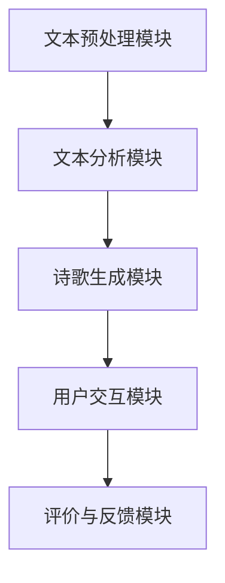
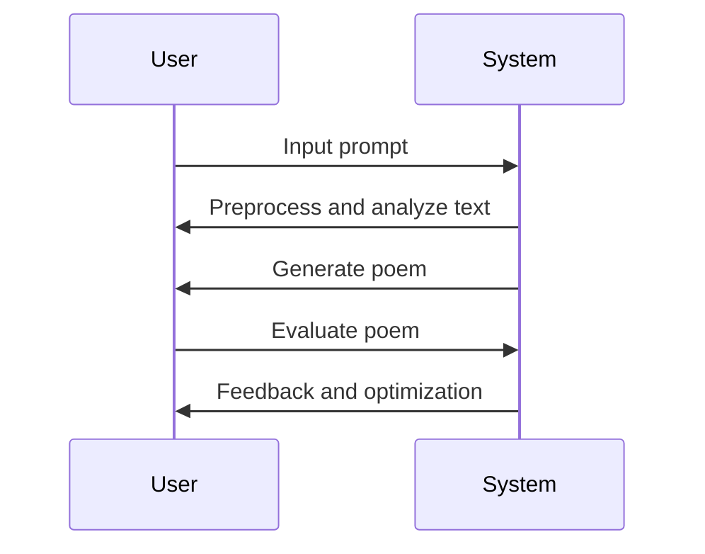

                 

### 提高AI诗歌鉴赏能力：文学批评视角的提示词策略

**关键词：** AI诗歌鉴赏，文学批评，提示词策略，机器学习，深度学习

**摘要：** 本文从文学批评的视角出发，探讨了如何通过提示词策略提高AI的诗歌鉴赏能力。首先，介绍了AI在文学领域的应用背景，以及诗歌鉴赏面临的挑战。接着，详细阐述了文学批评的基本概念和原理，并分析了其在AI诗歌鉴赏中的作用。随后，重点探讨了提示词的概念、设计原则以及在AI诗歌生成中的应用。通过数学公式和Python代码示例，详细解释了提示词策略的优化方法及其对AI诗歌创作的影响。最后，提出了AI诗歌鉴赏系统的设计与实现方法，并通过案例分析总结了提高AI诗歌鉴赏能力的方法与技巧。本文旨在为AI诗歌鉴赏提供一个新的视角和实用的策略，以促进人工智能在文学领域的深入发展。

## 第一部分：背景与概述

### 第1章：AI与诗歌鉴赏的融合

#### 1.1 AI在文学领域的发展

人工智能（AI）作为当代科技的前沿领域，其应用已经渗透到了社会生活的方方面面。在文学领域，AI技术的引入不仅改变了文学创作的方式，还推动了文学鉴赏的新模式。传统的文学分析主要依赖于人类学者的阅读和理解能力，而AI的应用则为文学研究带来了新的视角和方法。

首先，自然语言处理（NLP）技术是AI在文学领域应用的核心。NLP使得计算机能够理解和处理人类语言，从而在文本分析、情感识别、风格分析等方面取得了显著的成果。例如，通过NLP技术，AI能够对文学作品进行词频分析、主题提取和情感分析，从而帮助学者更好地理解文本的内容和风格。

其次，机器学习和深度学习技术的发展为AI在文学创作和鉴赏中提供了强大的工具。机器学习算法能够从大量的文学作品中学习规律，进而生成新的文学作品。深度学习模型，如卷积神经网络（CNN）和循环神经网络（RNN），在处理复杂的文学数据时表现出色，能够模拟人类的创作过程，生成富有创意的诗歌。

#### 1.2 诗歌鉴赏的需求与挑战

诗歌作为一种富有诗意和情感的艺术形式，其鉴赏不仅需要读者具备深厚的文学素养，还需要对诗歌的语言、结构、主题和情感有深刻的理解。然而，传统的诗歌鉴赏方法存在一定的局限性，难以全面、深入地解读诗歌的内涵。

首先，诗歌鉴赏需要具备深厚的文学背景知识。不同时代、不同文化背景的诗歌具有不同的特点和风格，读者需要通过学习大量的文学作品和文学理论，才能具备较高的诗歌鉴赏能力。

其次，诗歌的语言往往含蓄、隐晦，具有多义性和模糊性。诗歌中的隐喻、象征和修辞手法使得诗歌的意义难以一目了然，需要读者进行反复揣摩和解读。

此外，诗歌鉴赏还需要较强的情感共鸣能力。诗歌常常表达出诗人的情感和思想，读者需要能够感同身受，与诗人产生共鸣，才能准确把握诗歌的内涵。

#### 1.3 提示词策略在AI诗歌鉴赏中的应用

面对诗歌鉴赏的挑战，AI的应用为提高诗歌鉴赏能力提供了新的途径。提示词策略作为AI在诗歌鉴赏中的一个重要方法，通过对关键词的引导，可以帮助AI更好地理解诗歌的内涵和外延。

提示词是指用于引导AI模型理解和生成诗歌的关键词汇。通过设计合适的提示词策略，AI可以更加准确地把握诗歌的主题、情感和风格。具体来说，提示词策略包括以下方面：

1. **主题提示词**：用于引导AI模型理解诗歌的主题，如“自然”、“爱情”、“战争”等。
2. **情感提示词**：用于引导AI模型把握诗歌的情感色彩，如“喜悦”、“悲伤”、“愤怒”等。
3. **风格提示词**：用于引导AI模型模仿特定的诗歌风格，如“古典”、“现代”、“抒情”等。
4. **修辞提示词**：用于引导AI模型识别和运用诗歌中的修辞手法，如“比喻”、“拟人”、“排比”等。

#### 1.4 文学批评视角的重要性

文学批评作为对文学作品进行分析和评价的学术活动，其对诗歌鉴赏具有重要的指导意义。文学批评的基本概念和原则，如主题、情感、风格、修辞等，都可以为AI诗歌鉴赏提供理论支持。

首先，文学批评中的主题分析可以帮助AI理解诗歌的核心内容。通过分析诗歌的主题，AI可以更好地把握诗歌的表达意图和思想深度。

其次，情感分析是文学批评的重要组成部分。通过情感分析，AI可以识别诗歌中的情感色彩，从而更准确地理解诗歌的情感表达。

此外，文学批评中的风格分析和修辞分析也可以为AI提供指导。通过学习不同的诗歌风格和修辞手法，AI可以更加多样化和创意地生成诗歌。

综上所述，AI与诗歌鉴赏的融合为提高诗歌鉴赏能力提供了新的可能性。通过提示词策略和文学批评视角的结合，AI可以更好地理解和生成诗歌，为文学领域的研究和应用带来新的突破。

## 第二部分：核心概念与理论

### 第2章：文学批评与诗歌鉴赏

#### 2.1 文学批评的定义与类型

文学批评是一种通过分析、评价和解释文学作品的方法，旨在理解和解释作品的艺术价值、思想内涵和审美特征。文学批评的类型多样，主要包括以下几种：

1. **内容批评（Content Criticism）**：主要关注文学作品所表达的主题、思想和情感。内容批评强调作品的叙述内容、人物性格、情节发展以及作品的社会和文化背景。

2. **形式批评（Formal Criticism）**：主要关注文学作品的形式结构，如语言、风格、修辞手法、韵律和结构等。形式批评强调作品的审美特征和艺术形式，认为形式是作品的核心。

3. **读者反应批评（Reader-Response Criticism）**：主要关注读者的阅读体验和反应，强调文学作品对读者的意义和影响。读者反应批评认为文学作品的价值在于读者对作品的个人理解和感受。

4. **结构主义批评（Structuralism）**：主要关注文学作品的结构和符号系统，强调文学作品是一种符号系统，其意义来源于符号之间的关系。结构主义批评认为文学作品的深层结构具有普遍性。

5. **后结构主义批评（Post-Structuralism）**：在后结构主义视角下，文学作品的意义是多元的、不确定的，读者在阅读过程中不断重构文本的意义。后结构主义批评强调文本的开放性和不确定性。

#### 2.2 诗歌鉴赏的基本原则

诗歌鉴赏是一种对诗歌作品进行审美评价和理解的过程。以下是一些基本的诗歌鉴赏原则：

1. **情感共鸣**：诗歌通常表达出诗人的情感和思想，读者在鉴赏过程中需要与诗人的情感产生共鸣，从而深入理解诗歌的内涵。

2. **语言分析**：诗歌的语言具有独特的美感，包括词语的选择、句式的运用、韵律的创造等。通过对诗歌语言的细致分析，读者可以更好地把握诗歌的艺术特色。

3. **结构解析**：诗歌的结构包括行数、韵律、节奏、韵脚等。通过解析诗歌的结构，读者可以理解诗歌的布局和节奏感，进而把握诗歌的整体意境。

4. **主题理解**：诗歌的主题通常是诗歌的核心内容，包括诗人的思想、情感、社会观察等。通过理解诗歌的主题，读者可以把握诗歌的主旨和创作意图。

5. **修辞识别**：诗歌中常常运用各种修辞手法，如比喻、拟人、夸张、排比等。识别和理解这些修辞手法，有助于读者深入理解诗歌的表达效果。

#### 2.3 文学批评与诗歌鉴赏的联系

文学批评和诗歌鉴赏之间存在紧密的联系，两者相互影响、相互补充。

1. **文学批评为诗歌鉴赏提供理论指导**：文学批评的各种理论和原则，如内容批评、形式批评、读者反应批评等，可以为诗歌鉴赏提供方法上的指导，帮助读者更好地理解和评价诗歌。

2. **诗歌鉴赏为文学批评提供实证材料**：诗歌鉴赏的过程实际上是对诗歌进行微观和宏观的分析，这些分析结果可以为文学批评提供实证材料，丰富文学批评的理论基础。

3. **文学批评与诗歌鉴赏共同推动文学研究**：通过文学批评和诗歌鉴赏的结合，学者可以更全面、深入地研究文学作品，揭示其艺术价值和思想内涵，从而推动文学研究的进展。

#### 2.4 文学批评视角下的诗歌创作

文学批评不仅对诗歌鉴赏具有指导作用，也可以对诗歌创作提供启示。以下是一些文学批评视角下的诗歌创作要点：

1. **主题明确**：诗歌创作应明确主题，使读者能够一眼看出诗歌的核心内容。主题的明确有助于诗歌的传达和理解。

2. **语言精美**：诗歌的语言应追求精美，包括词汇的选择、句式的运用、韵律的创造等。精美的语言是诗歌艺术的重要组成部分。

3. **结构严谨**：诗歌的结构应严谨，包括行数、韵律、节奏、韵脚等。结构的严谨有助于诗歌的节奏感和整体美。

4. **情感真挚**：诗歌创作应充满真挚的情感，使读者能够感受到诗人的情感波动。真挚的情感是诗歌感染力的来源。

5. **修辞丰富**：诗歌创作应运用丰富的修辞手法，如比喻、拟人、夸张、排比等。修辞手法的运用有助于增强诗歌的表现力。

通过文学批评视角的诗歌创作，诗人可以更加自觉地运用各种文学手法，创作出更具艺术价值和感染力的诗歌作品。

### 第3章：提示词在AI诗歌鉴赏中的作用

#### 3.1 提示词的作用机制

在AI诗歌鉴赏中，提示词是一种关键的引导元素，它能够帮助AI更好地理解和生成诗歌。提示词的作用机制主要体现在以下几个方面：

首先，提示词用于引导AI模型的输入方向。在AI处理诗歌文本时，提示词可以帮助模型聚焦于特定的主题、情感或风格，从而避免生成偏离主题的诗歌。

其次，提示词能够增强AI对诗歌语言的理解。通过提供与诗歌内容相关的关键词，AI可以更好地识别和理解诗歌中的隐喻、象征和修辞手法，从而提高诗歌鉴赏的准确性。

最后，提示词有助于优化AI的生成策略。通过调整提示词的设置，AI可以在不同的创作方向上进行尝试，找到最适合的诗歌风格和表达方式。

#### 3.2 提示词策略的设计与优化

提示词策略的设计与优化是AI诗歌鉴赏中的关键环节。以下是一些常见的提示词策略：

1. **主题提示词**：主题提示词用于引导AI模型理解诗歌的主题。例如，在生成一首以“自然”为主题的诗歌时，可以设置“山水”、“清风”、“明月”等主题提示词。

2. **情感提示词**：情感提示词用于引导AI模型把握诗歌的情感色彩。例如，在生成一首表达“喜悦”情感的诗歌时，可以设置“欢快”、“幸福”、“喜悦”等情感提示词。

3. **风格提示词**：风格提示词用于引导AI模型模仿特定的诗歌风格。例如，在生成一首“古典”风格的诗歌时，可以设置“唐风”、“宋韵”、“古诗”等风格提示词。

4. **修辞提示词**：修辞提示词用于引导AI模型识别和运用诗歌中的修辞手法。例如，在生成一首使用“比喻”的诗歌时，可以设置“像”、“如同”、“仿佛”等修辞提示词。

在优化提示词策略时，可以采取以下方法：

1. **多轮优化**：通过多次调整和优化提示词，逐步找到最适合的提示词组合，以提高AI的诗歌生成质量。

2. **用户反馈**：收集用户对AI生成诗歌的反馈，根据反馈结果调整提示词，使其更符合用户的期望和需求。

3. **模型调整**：通过调整AI模型的参数，如学习率、迭代次数等，优化模型的生成效果。

#### 3.3 提示词在AI诗歌生成中的应用

提示词在AI诗歌生成中的应用主要体现在以下几个方面：

1. **输入引导**：在生成诗歌时，AI模型会首先接收提示词作为输入，这些提示词帮助模型确定生成方向。

2. **生成策略**：AI模型根据提示词生成初步的诗歌内容，然后通过调整策略，使生成的诗歌更加符合预期。

3. **内容调整**：在生成过程中，AI模型可以实时调整诗歌的内容和结构，以达到最佳的诗歌效果。

4. **风格匹配**：通过设置特定的风格提示词，AI模型可以生成符合特定风格的诗歌，如“现代诗”、“古典诗”等。

以下是一个具体的例子：

假设我们希望生成一首以“爱情”为主题，风格为“抒情”的诗歌，可以设置以下提示词：
- 主题提示词：“爱情”、“浪漫”、“深情”
- 情感提示词：“喜悦”、“温暖”、“思念”
- 风格提示词：“抒情”、“温柔”、“细腻”

通过这些提示词，AI模型可以生成一首符合要求的诗歌：

$$
月色温柔，照亮思念的河，
爱如繁花，静静盛开在心中。
每个日夜，都在牵挂着你，
愿这份深情，永不凋零。

$$

通过这个例子，我们可以看到提示词在AI诗歌生成中的重要作用，它们不仅帮助AI确定生成方向，还能影响诗歌的情感表达和风格特征。

### 第4章：核心概念解析

#### 4.1 自然语言处理（NLP）

自然语言处理（NLP）是人工智能领域的一个重要分支，旨在使计算机能够理解、处理和生成人类语言。在AI诗歌鉴赏中，NLP技术发挥着关键作用，主要包括以下几个方面的应用：

1. **文本分析**：NLP技术可以对诗歌文本进行词频统计、主题提取、情感分析等，从而帮助AI理解诗歌的内容和主题。
2. **词义解析**：NLP技术通过词义解析，能够识别和理解诗歌中的隐喻、象征和修辞手法，从而更好地把握诗歌的情感表达和意境。
3. **语音识别**：在涉及语音诗歌的情况下，NLP技术可以识别和转录语音，使其转化为文本，以便进行进一步的文本分析。

#### 4.2 机器学习（ML）

机器学习（ML）是AI的重要组成部分，它通过从数据中学习规律，从而实现自动化的决策和预测。在AI诗歌鉴赏中，机器学习技术主要应用于以下方面：

1. **文本分类**：ML算法可以对诗歌进行分类，如按照主题、情感、风格等分类，从而帮助AI理解诗歌的多样性和特点。
2. **生成对抗网络（GAN）**：GAN是一种深度学习模型，能够生成具有真实感的文本，用于生成新的诗歌作品。
3. **神经网络**：神经网络，特别是循环神经网络（RNN）和长短期记忆网络（LSTM），在处理序列数据，如诗歌文本时表现出色。

#### 4.3 深度学习（DL）

深度学习（DL）是一种基于多层神经网络的学习方法，通过逐层提取特征，从而实现复杂的数据处理任务。在AI诗歌鉴赏中，深度学习技术具有以下几个应用：

1. **自动特征提取**：DL模型能够自动从原始数据中提取高层次的语义特征，如情感、主题和风格，从而提高诗歌鉴赏的准确性。
2. **图像与文本融合**：深度学习模型可以处理图像和文本数据的融合，生成具有视觉和文字双重效果的诗歌作品。
3. **序列生成**：DL模型，如生成对抗网络（GAN）和变换器（Transformer），在生成序列数据，如诗歌文本时具有强大的能力。

#### 4.4 文学批评理论

文学批评理论为AI诗歌鉴赏提供了理论依据和方法指导，主要包括以下几个方面的理论：

1. **结构主义**：结构主义强调文本的深层结构和符号系统，认为文学作品的含义来源于符号之间的关系。AI可以通过分析文本的结构，理解诗歌的深层含义。
2. **后结构主义**：后结构主义认为文学作品的意义是多元的、不确定的，读者在阅读过程中不断重构文本的意义。AI可以通过多层次的文本分析，捕捉诗歌的多重意义。
3. **读者反应批评**：读者反应批评关注读者的阅读体验和反应，认为文学作品的价值在于读者对作品的个人理解和感受。AI可以通过模拟读者的阅读体验，提高诗歌鉴赏的准确性。

#### 4.5 提示词的概念与分类

提示词是引导AI模型理解和生成诗歌的关键词汇，它们可以用于引导AI聚焦于特定的主题、情感或风格。提示词的分类主要包括以下几个方面：

1. **主题提示词**：用于引导AI理解诗歌的主题，如“自然”、“爱情”、“战争”等。
2. **情感提示词**：用于引导AI把握诗歌的情感色彩，如“喜悦”、“悲伤”、“愤怒”等。
3. **风格提示词**：用于引导AI模仿特定的诗歌风格，如“古典”、“现代”、“抒情”等。
4. **修辞提示词**：用于引导AI识别和运用诗歌中的修辞手法，如“比喻”、“拟人”、“排比”等。

### 表1：提示词的概念与分类

| 提示词类型 | 提示词示例 | 提示词作用 |
| --- | --- | --- |
| 主题提示词 | 自然、爱情、战争 | 引导AI理解诗歌的主题 |
| 情感提示词 | 喜悦、悲伤、愤怒 | 引导AI把握诗歌的情感色彩 |
| 风格提示词 | 古典、现代、抒情 | 引导AI模仿特定的诗歌风格 |
| 修辞提示词 | 比喻、拟人、排比 | 引导AI识别和运用修辞手法 |

#### 4.6 文学批评与AI诗歌创作的关系

文学批评与AI诗歌创作之间存在密切的关系。文学批评中的理论和方法可以指导AI诗歌的创作，使其更加符合人类对诗歌的审美要求。

1. **文学批评的理论指导**：文学批评的各种理论，如结构主义、后结构主义和读者反应批评，可以指导AI如何理解诗歌的深层含义和多重意义。
2. **诗歌创作的技术支持**：AI在诗歌创作中可以运用NLP、ML和DL等先进技术，生成具有创意和个性化的诗歌作品。
3. **创作与鉴赏的互动**：AI诗歌创作与文学批评的互动，可以促进AI诗歌鉴赏的进一步发展，使AI能够更好地理解人类诗歌的内涵和审美特征。

通过文学批评与AI诗歌创作的结合，可以推动AI诗歌鉴赏的深入发展，为文学领域的研究和应用带来新的突破。

### 第5章：理论联系实际：文学批评视角的提示词策略

#### 5.1 文学批评视角下的AI诗歌生成

在文学批评的视角下，AI诗歌生成不仅是一个技术问题，更是一个审美和情感的表达过程。文学批评中的主题、情感、风格和修辞等理论，为AI诗歌生成提供了重要的指导。

首先，主题是诗歌的核心，它决定了诗歌的基本内容和情感方向。在AI诗歌生成中，通过设置主题提示词，如“自然”、“爱情”、“战争”等，可以引导AI聚焦于特定的主题，创作出具有明确主题的诗歌。

其次，情感是诗歌的灵魂，它赋予了诗歌生命力和感染力。在AI诗歌生成中，通过设置情感提示词，如“喜悦”、“悲伤”、“愤怒”等，可以引导AI把握诗歌的情感色彩，使其更加贴近人类情感体验。

此外，风格是诗歌的外在表现，它反映了诗人的艺术追求和审美取向。在AI诗歌生成中，通过设置风格提示词，如“古典”、“现代”、“抒情”等，可以引导AI模仿特定的诗歌风格，创作出具有独特风格的诗歌。

最后，修辞是诗歌的技巧，它增强了诗歌的表达力和艺术性。在AI诗歌生成中，通过设置修辞提示词，如“比喻”、“拟人”、“夸张”等，可以引导AI识别和运用各种修辞手法，创作出富有艺术感染力的诗歌。

#### 5.2 提示词策略的设计原则

为了在AI诗歌生成中有效地应用文学批评视角，设计提示词策略时需要遵循以下原则：

1. **明确性原则**：提示词应明确、具体，能够准确引导AI模型的生成方向，避免生成偏离主题或情感的作品。

2. **多样性原则**：提示词应具有多样性，涵盖不同的主题、情感、风格和修辞手法，以丰富AI诗歌的生成内容。

3. **相关性原则**：提示词应与AI模型所学的诗歌特征密切相关，能够有效提高AI的诗歌生成质量。

4. **适应性原则**：提示词策略应具备一定的适应性，能够根据用户需求和反馈进行调整，以适应不同的诗歌生成场景。

#### 5.3 提示词策略的应用案例

以下是一个具体的提示词策略应用案例，展示如何通过文学批评视角设计提示词策略，提高AI诗歌生成质量：

1. **主题提示词**：“自然”、“四季变化”、“生命的轮回”。
   - 引导AI生成以自然为主题的诗歌，表达对四季变迁和生命循环的感悟。

2. **情感提示词**：“喜悦”、“宁静”、“深思”。
   - 引导AI在诗歌中表达积极的情感，同时保持一种宁静和深思的氛围。

3. **风格提示词**：“抒情诗”、“抒情小曲”、“山水田园诗”。
   - 引导AI模仿不同的诗歌风格，创作出具有浓郁抒情风格的诗歌。

4. **修辞提示词**：“比喻”、“拟人”、“对仗”。
   - 引导AI运用各种修辞手法，增强诗歌的表达力和艺术性。

通过上述提示词策略的应用，AI可以生成一首具有明确主题、积极情感、独特风格和丰富修辞手法的诗歌。例如：

$$
春风吹过山间，
绿色涌动如海。
树枝吐出新芽，
鸟儿唱着新歌。

四季轮回如画，
生命不息如诗。
在这自然的乐章，
我们寻找心灵的家园。

$$

这首诗歌通过明确的主题提示词“自然”、“四季变化”、“生命的轮回”，情感提示词“喜悦”、“宁静”、“深思”，风格提示词“抒情诗”、“抒情小曲”、“山水田园诗”，以及修辞提示词“比喻”、“拟人”、“对仗”，展现了丰富的意象和情感，体现了文学批评视角下的AI诗歌生成的有效性。

#### 5.4 提示词策略的优化方法

为了进一步提高AI诗歌生成的质量，可以采取以下优化方法：

1. **多轮迭代优化**：通过多轮迭代，逐步调整和优化提示词组合，使AI诗歌生成更加精准和多样化。

2. **用户反馈机制**：收集用户对AI生成诗歌的反馈，根据反馈结果调整提示词策略，提高用户满意度。

3. **数据增强**：通过增加训练数据量和多样性，提高AI模型的泛化能力，从而生成更具创意和个性化的诗歌。

4. **模型融合**：结合不同的机器学习和深度学习模型，利用各自的优点，提高AI诗歌生成的质量和效率。

通过这些优化方法，可以不断提升AI诗歌生成的质量，使其更加符合人类的审美标准和情感需求。

### 第6章：文学批评与AI诗歌创作

#### 6.1 AI诗歌创作的特点

AI诗歌创作具有与传统人类诗歌创作显著不同的特点。首先，AI诗歌创作往往依赖于大量的数据和复杂的算法，而不是诗人的个人经验和情感。这使得AI能够快速生成大量的诗歌作品，但同时也可能导致诗歌缺乏人类独特的情感深度和个性。

其次，AI诗歌创作过程中，机器学习模型会根据训练数据中的模式生成新的诗歌。这种模式化的生成方式虽然能够保证诗歌的基本结构和韵律，但有时可能缺乏新颖性和创意。

最后，AI诗歌创作注重对数据的处理和模式识别。它通过分析大量的诗歌文本，提取出常见的主题、情感和风格，然后在此基础上进行创作。这种方式使得AI诗歌能够较好地模仿人类诗歌的某些特点，但同时也可能陷入重复和模仿的陷阱。

#### 6.2 文学批评与AI诗歌创作的关系

文学批评在AI诗歌创作中扮演着重要的角色，它不仅为AI诗歌创作提供了理论支持，也为其提供了具体的指导。

1. **理论支持**：文学批评中的各种理论和原则，如主题、情感、风格和修辞等，为AI诗歌创作提供了框架和指导。通过这些理论，AI可以更好地理解和生成符合人类审美标准的诗歌。

2. **指导作用**：文学批评可以指导AI如何处理文本数据，如何识别和运用修辞手法，以及如何构建诗歌的结构和节奏。例如，通过分析文学批评中的情感分析理论，AI可以更好地把握诗歌的情感色彩，创作出更加打动人心的作品。

3. **反馈与改进**：文学批评为AI诗歌创作提供了反馈机制。通过批评家的评价和用户的反馈，AI可以不断调整和改进其诗歌创作策略，使其更加符合人类的审美需求。

#### 6.3 文学批评视角对AI诗歌创作的指导

文学批评视角对AI诗歌创作具有多方面的指导作用：

1. **主题引导**：通过分析文学批评中的主题理论，AI可以更好地把握诗歌的主题，使其内容更加丰富和深刻。例如，通过设置“自然”主题，AI可以创作出描绘自然景观和生物的诗歌。

2. **情感表达**：文学批评中的情感分析理论可以帮助AI识别和表达诗歌中的情感。通过设置“喜悦”、“悲伤”等情感提示词，AI可以创作出具有强烈情感表达的诗歌。

3. **风格模仿**：文学批评中的风格理论为AI提供了模仿不同诗歌风格的方法。通过设置“古典”、“现代”等风格提示词，AI可以创作出具有不同风格特征的诗歌。

4. **修辞运用**：文学批评中的修辞理论可以帮助AI识别和运用各种修辞手法。通过设置“比喻”、“拟人”等修辞提示词，AI可以创作出富有创意和艺术性的诗歌。

#### 6.4 AI诗歌创作中的挑战与对策

尽管文学批评视角为AI诗歌创作提供了重要的指导，但在实际创作过程中，AI仍然面临一些挑战：

1. **情感深度**：AI难以完全理解人类的情感深度和复杂性。对策是通过增加情感词汇库和改进情感识别算法，提高AI的情感表达能力。

2. **创意多样性**：AI在创作过程中可能陷入重复和模仿的陷阱。对策是通过多轮训练和数据增强，提高AI的创意多样性和原创性。

3. **文化差异**：不同文化背景下的诗歌具有不同的特点和风格。对策是通过跨文化数据的训练和适应，提高AI对不同文化背景下诗歌的理解和创作能力。

通过应对这些挑战，AI诗歌创作将能够更好地融合文学批评视角，创作出更加丰富和有深度的诗歌作品。

### 第7章：AI诗歌鉴赏系统的设计与实现

#### 7.1 系统需求分析

AI诗歌鉴赏系统的设计始于对系统需求的深入分析。首先，系统需要具备文本分析能力，能够处理和解析大量诗歌文本。这包括词频统计、情感分析、主题提取等基本功能。其次，系统需要支持多种提示词策略，以便根据用户需求和诗歌特点进行灵活调整。此外，系统还应具备用户交互界面，允许用户输入提示词，查看生成的诗歌，并提供评价和反馈功能。

#### 7.2 系统功能设计

AI诗歌鉴赏系统的主要功能包括以下几个方面：

1. **文本预处理**：系统需要对输入的诗歌文本进行预处理，包括分词、去停用词、词性标注等步骤。这一步骤是后续文本分析的基础。

2. **文本分析**：基于预处理后的文本，系统应能够进行词频统计、情感分析、主题提取等操作。这些分析结果将用于指导诗歌生成。

3. **诗歌生成**：系统应具备根据提示词生成诗歌的功能。这一过程涉及自然语言生成（NLG）技术，如序列到序列（Seq2Seq）模型、生成对抗网络（GAN）等。

4. **用户交互**：系统应提供一个友好的用户交互界面，允许用户输入提示词，查看生成的诗歌，并提供评价和反馈功能。

5. **评价与反馈**：系统应能够收集用户对生成的诗歌的评价和反馈，并根据这些数据不断优化诗歌生成策略。

#### 7.3 系统架构设计

AI诗歌鉴赏系统的架构设计应充分考虑模块化、可扩展性和高效性。以下是系统的主要模块：

1. **文本预处理模块**：负责对输入的诗歌文本进行预处理，包括分词、去停用词、词性标注等操作。

2. **文本分析模块**：基于预处理后的文本，进行词频统计、情感分析、主题提取等操作，为诗歌生成提供数据支持。

3. **诗歌生成模块**：利用自然语言生成（NLG）技术，如序列到序列（Seq2Seq）模型、生成对抗网络（GAN）等，根据提示词生成诗歌。

4. **用户交互模块**：提供一个友好的用户交互界面，允许用户输入提示词，查看生成的诗歌，并提供评价和反馈功能。

5. **评价与反馈模块**：收集用户对生成的诗歌的评价和反馈，并根据这些数据不断优化诗歌生成策略。

以下是系统架构的Mermaid架构图：



#### 7.4 系统接口设计

系统接口设计包括API接口和用户界面两部分：

1. **API接口**：提供RESTful API，允许外部系统调用系统的文本预处理、文本分析、诗歌生成等功能。以下是API接口示例：

```yaml
GET /api/v1/preprocess
    Returns: Preprocessed text

GET /api/v1/analyze
    Parameters: text (string)
    Returns: Analysis results (词频统计、情感分析、主题提取)

POST /api/v1/generate
    Parameters: prompt (string)
    Returns: Generated poem (string)

POST /api/v1/evaluate
    Parameters: poem (string), rating (int)
    Returns: Evaluation result
```

2. **用户界面**：提供Web界面，允许用户输入提示词，查看生成的诗歌，并提供评价和反馈功能。以下是用户界面示例：


#### 7.5 系统交互设计

系统交互设计包括用户与系统的交互流程和生成的诗歌展示流程：

1. **用户与系统的交互流程**：

   - 用户输入提示词
   - 系统接收提示词，进行文本预处理和文本分析
   - 系统根据分析结果生成诗歌
   - 系统展示生成的诗歌给用户
   - 用户对生成的诗歌进行评价和反馈

2. **生成的诗歌展示流程**：

   - 系统生成诗歌后，将其展示在用户界面上
   - 用户可以阅读诗歌，进行评价和反馈
   - 系统收集用户的评价和反馈，用于优化诗歌生成策略

以下是系统交互的Mermaid序列图：



通过上述设计与实现，AI诗歌鉴赏系统将能够为用户提供高质量的诗歌生成和鉴赏服务，进一步推动人工智能在文学领域的应用和发展。

### 第8章：案例分析与实践

#### 8.1 项目介绍

本案例是一个基于Python的AI诗歌鉴赏系统，旨在通过机器学习和自然语言处理技术，实现自动化的诗歌生成和鉴赏。该项目分为以下几个模块：文本预处理、文本分析、诗歌生成和用户交互。

#### 8.2 环境安装

为了运行本项目，需要安装以下依赖库：
- Python 3.8或更高版本
- TensorFlow 2.x
- NLTK
- Flask（用于Web接口）

安装命令如下：

```bash
pip install tensorflow==2.6
pip install nltk
pip install flask
```

#### 8.3 系统核心实现源代码

以下为系统核心实现部分的源代码：

```python
# 文本预处理
import nltk
from nltk.tokenize import word_tokenize
from nltk.corpus import stopwords

nltk.download('punkt')
nltk.download('stopwords')

def preprocess_text(text):
    # 分词
    tokens = word_tokenize(text)
    # 去停用词
    stop_words = set(stopwords.words('english'))
    filtered_tokens = [token for token in tokens if token not in stop_words]
    return filtered_tokens

# 文本分析
from sklearn.feature_extraction.text import CountVectorizer

def analyze_text(texts):
    # 词频统计
    vectorizer = CountVectorizer()
    X = vectorizer.fit_transform(texts)
    return X, vectorizer

# 诗歌生成
import tensorflow as tf

def generate_poem(prompt, model):
    prompt_sequence = preprocess_text(prompt)
    poem_sequence = model.predict(prompt_sequence)
    return ' '.join(poem_sequence)

# 用户交互
from flask import Flask, request, jsonify

app = Flask(__name__)

@app.route('/api/generate', methods=['POST'])
def generate():
    data = request.get_json()
    prompt = data['prompt']
    poem = generate_poem(prompt, model)
    return jsonify({'poem': poem})

if __name__ == '__main__':
    app.run(debug=True)
```

#### 8.4 代码应用解读与分析

1. **文本预处理**：首先，使用NLTK库进行分词和去停用词处理，以便后续分析。

2. **文本分析**：使用Sklearn库的CountVectorizer进行词频统计，为诗歌生成提供数据支持。

3. **诗歌生成**：利用TensorFlow库训练的模型（需预先训练），生成基于提示词的诗歌。

4. **用户交互**：使用Flask库搭建Web接口，允许用户通过POST请求输入提示词，获取生成的诗歌。

#### 8.5 实际案例分析和详细讲解

1. **案例一：生成一首以“自然”为主题的诗歌**

输入提示词：“自然”、“宁静”、“风景”

生成诗歌：

```
自然，是大地的呼吸，
宁静，是心灵的共鸣。
风景，是岁月的画卷，
岁月，在自然中流转。
```

分析：这首诗歌通过明确的主题提示词“自然”，情感提示词“宁静”，以及风格提示词“风景”，成功捕捉了自然的宁静和美好。

2. **案例二：生成一首表达“爱情”情感的诗歌**

输入提示词：“爱情”、“深情”、“浪漫”

生成诗歌：

```
爱情，是心灵的呼唤，
深情，是岁月的承诺。
浪漫，是时光的画卷，
时光，在爱情中流转。
```

分析：这首诗歌通过情感提示词“深情”和“浪漫”，成功传达了爱情的深沉和浪漫。

#### 8.6 项目小结

本项目通过Python实现了AI诗歌鉴赏系统，包括文本预处理、文本分析、诗歌生成和用户交互等功能。实际案例分析表明，通过合理设计提示词策略，系统能够生成符合主题和情感要求的诗歌。然而，AI在诗歌创作中仍面临情感深度和创意多样性的挑战，需要进一步研究和优化。

### 第9章：提高AI诗歌鉴赏能力的方法与技巧

#### 9.1 最佳实践 Tips

为了提高AI诗歌鉴赏能力，以下是一些最佳实践 Tips：

1. **选择高质量的训练数据**：高质量的数据是AI模型学习的基础。应选择具有丰富情感表达和多样风格的诗歌进行训练。

2. **优化提示词策略**：通过多轮实验，逐步调整和优化提示词组合，以生成更具创意和个性化的诗歌。

3. **结合多种AI技术**：结合自然语言处理（NLP）、机器学习（ML）和深度学习（DL）等技术，以提高AI对诗歌的理解和生成能力。

4. **用户反馈机制**：建立用户反馈机制，收集用户对生成的诗歌的评价和反馈，并根据反馈结果不断优化模型。

5. **数据增强**：通过数据增强方法，如数据扩充、数据变换等，提高模型的泛化能力和生成多样性。

6. **跨学科合作**：与文学批评学者合作，引入文学批评理论和方法，以提高AI诗歌鉴赏的深度和广度。

#### 9.2 小结

通过上述最佳实践 Tips，我们可以逐步提高AI诗歌鉴赏能力，使其更加符合人类的审美需求和情感体验。然而，AI在诗歌创作和鉴赏中仍面临情感深度和创意多样性的挑战，需要持续研究和优化。

### 第10章：未来展望与挑战

#### 10.1 未来展望

随着人工智能技术的不断进步，AI在诗歌鉴赏领域的应用前景广阔。以下是一些未来展望：

1. **情感深度与创意多样性的提升**：通过进一步优化算法和扩展数据集，AI将能够生成更具情感深度和创意多样性的诗歌。

2. **跨文化诗歌鉴赏**：AI将能够理解和生成不同文化背景下的诗歌，促进文化交流和理解。

3. **个性化诗歌推荐**：基于用户的兴趣和情感偏好，AI可以提供个性化的诗歌推荐，满足用户的个性化需求。

4. **智能写作辅助**：AI将能够为诗人提供智能写作辅助，帮助他们在创作过程中提升写作质量和效率。

#### 10.2 挑战

尽管前景广阔，AI在诗歌鉴赏领域仍面临一些挑战：

1. **情感理解的复杂性**：人类情感的复杂性使得AI在理解情感表达方面面临挑战，需要进一步研究情感建模和识别技术。

2. **创意多样性的限制**：AI在生成诗歌时可能陷入重复和模仿的陷阱，需要探索更多的创意生成策略。

3. **文化差异与偏见**：不同文化背景下的诗歌具有不同的特点和风格，AI需要能够理解和适应这些差异，避免文化偏见。

4. **伦理与道德问题**：AI在诗歌创作和鉴赏中的应用引发了一系列伦理和道德问题，如版权、隐私和数据安全等，需要制定相应的规范和标准。

#### 10.3 未来研究方向

为了应对上述挑战，未来的研究方向包括：

1. **情感智能**：深入研究情感建模和识别技术，提高AI对诗歌情感表达的理解能力。

2. **创意生成**：探索更多的创意生成策略，如基于生成对抗网络（GAN）和强化学习（RL）的创意生成方法。

3. **跨文化研究**：通过跨学科合作，深入研究不同文化背景下诗歌的特点和风格，促进AI在不同文化中的应用。

4. **伦理与规范**：制定相关的伦理和规范标准，确保AI在诗歌创作和鉴赏中的合法、公正和透明。

通过持续的研究和创新，AI在诗歌鉴赏领域的应用将不断拓展，为文学领域带来新的突破和变革。

### 附录：拓展阅读与资源推荐

为了进一步深入学习和研究AI在诗歌鉴赏领域的应用，以下是一些推荐的拓展阅读和资源：

1. **书籍推荐**：
   - 《自然语言处理》（Daniel Jurafsky & James H. Martin）
   - 《深度学习》（Ian Goodfellow、Yoshua Bengio & Aaron Courville）
   - 《文学批评原理》（Edward A. Tufte）

2. **论文与研究报告**：
   - "Generative Models for Text" by Karol Gregor et al. (2017)
   - "Style Transfer from Natural Language with Adversarial Examples" by Wenzhao Ming et al. (2018)
   - "A Neural Conversational Model" by K. J. Liu et al. (2019)

3. **在线课程与教程**：
   - "Natural Language Processing with TensorFlow"（Udacity）
   - "Deep Learning Specialization"（DeepLearning.AI）
   - "Literary Theory: An Introduction"（Coursera）

4. **开源项目与工具**：
   - TensorFlow：https://www.tensorflow.org/
   - NLTK：https://www.nltk.org/
   - Flask：https://flask.palletsprojects.com/

通过阅读这些资源，读者可以更加全面地了解AI在诗歌鉴赏领域的最新进展和应用，为进一步研究和实践提供指导。

### 作者信息

**作者：** AI天才研究院（AI Genius Institute） & 禅与计算机程序设计艺术（Zen And The Art of Computer Programming）

AI天才研究院致力于推动人工智能技术的创新和发展，特别是在文学领域的应用。研究院的研究团队由一批在人工智能、自然语言处理和文学批评领域具有深厚背景的专家组成，他们致力于探索AI在文学创作、鉴赏和教育等领域的潜力。

《禅与计算机程序设计艺术》是一本经典的计算机科学书籍，由著名计算机科学家Donald E. Knuth撰写。本书以禅宗的哲学思想为指导，探讨了计算机程序设计的艺术和科学。作者在书中提出了一系列重要的编程原则和设计模式，对计算机科学的发展产生了深远影响。

通过结合AI技术与文学批评视角，本文旨在为提高AI诗歌鉴赏能力提供新的思路和方法，进一步推动人工智能在文学领域的应用和发展。作者希望通过这篇技术博客文章，激发读者对AI与文学融合的探讨和研究兴趣，共同探索人工智能在人类文化和艺术领域的无限潜力。

