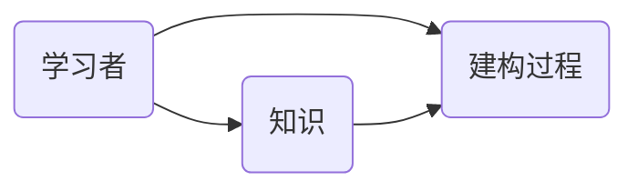
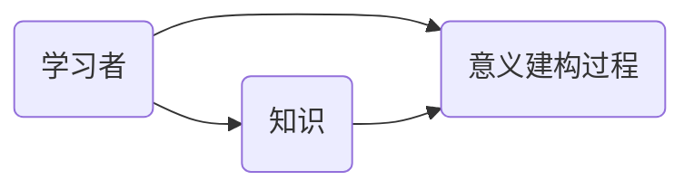
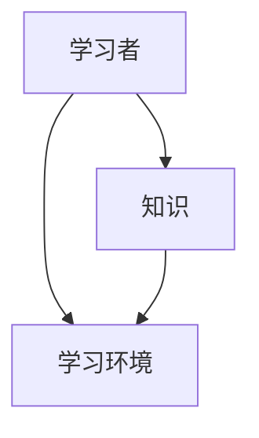
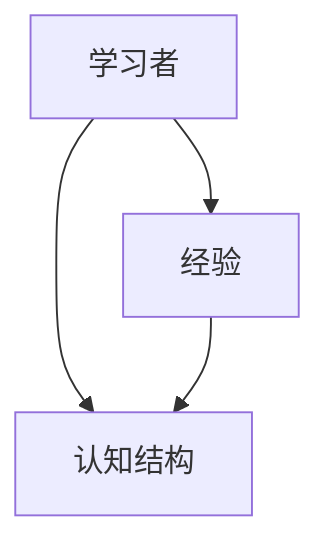

                 

# 教育革新：从知识灌输到意义建构的范式转移

## 关键词：教育革新、知识灌输、意义建构、范式转移、教育改革

> 摘要：本文深入探讨了教育革新的必要性及其核心要素。随着信息时代的到来，传统教育模式逐渐显现出其局限性，难以满足时代发展的需求。本文从知识建构主义、意义建构理论等教育革新理论出发，分析了教育革新的关键要素，包括学习者和教师的角色转变、教育内容与方法的变革以及教育技术的应用。通过国内外教育革新的案例研究，本文提出了教育革新的实施策略，并展望了教育革新的未来发展趋势。文章旨在为教育改革提供理论支持和实践指导。

## 引言

### 1.1 教育现状与挑战

在当前全球化的背景下，教育面临着前所未有的挑战。传统的教育模式以知识灌输为主要手段，强调知识的积累和记忆，忽视了学生的个性发展和创新能力。这种模式难以适应信息时代的需求，导致学生在面对复杂问题时缺乏解决问题的能力。

**问题背景**：随着科技的发展，知识更新的速度越来越快，传统的教育模式难以跟上知识更新的步伐。同时，全球范围内的教育不公平问题日益凸显，许多学生无法获得高质量的教育资源。

**问题描述**：传统教育模式存在的问题包括：教育内容陈旧、教学方法单一、评价方式过于依赖考试成绩等。这些问题导致了学生缺乏创新意识和实践能力，难以适应未来社会的需求。

**问题解决**：为了解决这些问题，需要从教育理念、教育内容、教学方法、教育技术等多个方面进行革新。

**边界与外延**：教育革新不仅涉及学校教育，还包括家庭教育、社会教育等多个层面。同时，教育革新需要政府、学校、家庭、社会等多方共同参与。

### 1.2 教育革新的必要性

**时代发展的需求**：随着信息技术的迅猛发展，社会对人才的需求发生了重大变化。现代社会需要具备创新能力和跨学科知识的人才，而传统教育模式难以培养出这样的人才。

**学生的个性化需求**：每个学生都有其独特的个性和学习需求，传统教育模式难以满足学生的个性化需求。教育革新需要关注学生的个性化发展，提供多样化的教育资源和教学方式。

### 1.3 本书结构

本书分为七个章节，分别从理论基础、范式转移、实施策略、案例研究和未来展望等多个方面对教育革新进行深入探讨。

- 第1章：引言
- 第2章：教育革新的理论基础
- 第3章：知识灌输到意义建构的范式转移
- 第4章：教育革新的实施策略
- 第5章：教育革新的案例研究
- 第6章：教育革新的未来展望
- 第7章：结论

## 第2章 教育革新的理论基础

### 2.1 知识建构主义理论

**核心概念**：知识建构主义认为，知识不是通过教师的传授获得的，而是通过学习者主动建构的过程获得的。

**概念属性特征对比表格**：

| 特征               | 知识灌输       | 知识建构       |
|--------------------|----------------|----------------|
| 学习方式           | 被动接受       | 主动建构       |
| 知识来源           | 教师传授       | 自主探索       |
| 学习目标           | 知识记忆       | 知识应用       |
| 教学方法           | 讲授式教学     | 探究式教学     |

**ER实体关系图架构**：

### 2.2 意义建构理论

**核心观点**：意义建构理论认为，学习者在学习过程中不仅要建构知识，还要将知识赋予意义，使其与自身经验相结合。

**概念属性特征对比表格**：

| 特征               | 知识建构       | 意义建构       |
|--------------------|----------------|----------------|
| 学习方式           | 主动建构       | 反思性建构     |
| 知识来源           | 自主探索       | 经验整合       |
| 学习目标           | 知识应用       | 知识内化       |
| 教学方法           | 探究式教学     | 反思性教学     |

**ER实体关系图架构**：

### 2.3 其他教育革新理论简介

除了知识建构主义和意义建构理论外，还有构建主义教育理论和发现式教育理论等。这些理论都强调了学习者在学习过程中的主动性和建构性。

- **构建主义教育理论**：强调学习者通过主动构建知识来获得理解。
- **发现式教育理论**：强调学习者通过自主发现来获得知识。

## 第3章 知识灌输到意义建构的范式转移

### 3.1 教育革新的关键要素

**学习者的角色转变**：从被动的知识接受者转变为主动的知识建构者和意义建构者。

**教师的角色转变**：从知识的传授者转变为学习的引导者和支持者。

### 3.2 教育内容与方法的变革

**教育内容的重新定义**：从单一的学科知识转变为跨学科的综合知识。

**教学方法的创新**：从讲授式教学转变为探究式教学和反思性教学。

### 3.3 教育技术的应用

**数字化教学工具**：如在线学习平台、电子教材等，为学习者提供丰富的学习资源和便捷的学习体验。

**在线学习平台**：如MOOC（大规模开放在线课程）、SPOC（小规模限制性在线课程）等，为学习者提供多样化的学习方式。

## 第4章 教育革新的实施策略

### 4.1 学校层面的实施策略

**教师培训**：提高教师的教育教学能力，使其能够适应教育革新的需求。

**课程设计与教材开发**：设计符合教育革新理念的课程和教材，注重跨学科综合知识和实践能力的培养。

### 4.2 政策支持与制度保障

**教育政策的调整**：制定有利于教育革新的政策，为教育改革提供政策支持。

**学校制度的创新**：改革学校管理制度，为教育革新提供制度保障。

### 4.3 社会参与与合作

**家庭教育的角色**：家长积极参与孩子的学习过程，提供家庭教育的支持。

**社区教育资源整合**：整合社区教育资源，为学习者提供多样化的学习支持。

## 第5章 教育革新的案例研究

### 5.1 国内教育革新案例

**案例介绍**：以某知名高校为例，介绍其实施教育革新的具体措施。

**案例分析**：分析该案例的成功经验和存在的问题。

### 5.2 国际教育革新案例

**案例介绍**：以某国际教育组织为例，介绍其推动教育革新的成果。

**案例分析**：分析该案例的国际借鉴意义。

## 第6章 教育革新的未来展望

### 6.1 教育革新的发展趋势

**科技对教育的影响**：随着科技的不断进步，教育将更加智能化、个性化。

**教育公平与质量**：教育革新的目标是提高教育质量，实现教育公平。

### 6.2 教育革新的挑战与机遇

**教育资源的优化配置**：如何合理配置教育资源，使每个学习者都能获得高质量的教育。

**教育模式的创新与多样化**：如何创新教育模式，满足不同学习者的需求。

### 6.3 教育革新的战略思考

**教育改革的长远规划**：制定教育改革的长远规划，确保教育革新的持续发展。

**教育发展的战略定位**：明确教育发展的战略定位，引领教育变革的方向。

## 第7章 结论

### 7.1 教育革新的意义

**提高教育质量**：教育革新有助于提高教育质量，培养创新型人才。

**促进学生全面发展**：教育革新关注学生的全面发展，培养具有综合素质的人才。

### 7.2 教育革新的路径

**创新教育理念**：树立符合时代需求的教育理念，推动教育革新。

**推动教育实践**：将教育革新理念付诸实践，不断探索教育革新的有效路径。

### 7.3 教育革新的展望

**持续关注教育变革**：关注教育变革的最新动态，不断学习先进的教育理念和教学方法。

**努力实现教育公平与优质发展**：努力实现教育公平，推动教育优质发展。

## 参考文献

- 知识建构主义理论相关研究
- 意义建构理论相关研究
- 教育革新案例研究
- 教育改革相关政策文件

## 附录

**相关术语解释**：对文中涉及的核心术语进行解释。

**拓展阅读**：推荐进一步阅读的相关文献和资料。

### 作者信息：

**作者：AI天才研究院/AI Genius Institute & 禅与计算机程序设计艺术 /Zen And The Art of Computer Programming**

通过以上步骤，我们详细地构建了文章的结构和内容。接下来，我们将逐步填充每个章节的具体内容，确保文章的完整性和深度。让我们一步一步地深入探讨教育革新的各个方面。**文章标题**：教育革新：从知识灌输到意义建构的范式转移

**文章关键词**：教育革新、知识灌输、意义建构、范式转移、教育改革

**文章摘要**：
本文旨在探讨教育革新的必要性和路径，分析知识灌输与意义建构的范式差异，并探讨教育革新的关键要素和实施策略。通过理论基础、案例分析以及未来展望，本文为教育改革提供理论支持和实践指导，旨在推动教育公平和优质发展。

---

### 目录大纲

----------------------------------------------------------------

# 教育革新：从知识灌输到意义建构的范式转移

> 关键词：教育革新、知识灌输、意义建构、范式转移、教育改革

> 摘要：本文深入探讨了教育革新的必要性及其核心要素，分析了知识灌输与意义建构的范式差异，探讨了教育革新的关键要素和实施策略。通过案例分析，展望了教育革新的未来趋势。

### 引言

- 1.1 教育现状与挑战
- 1.2 教育革新的必要性
- 1.3 本书结构

### 第2章 教育革新的理论基础

- 2.1 知识建构主义理论
- 2.2 意义建构理论
- 2.3 其他教育革新理论简介

### 第3章 知识灌输到意义建构的范式转移

- 3.1 教育革新的关键要素
- 3.2 教育内容与方法的变革
- 3.3 教育技术的应用

### 第4章 教育革新的实施策略

- 4.1 学校层面的实施策略
- 4.2 政策支持与制度保障
- 4.3 社会参与与合作

### 第5章 教育革新的案例研究

- 5.1 国内教育革新案例
- 5.2 国际教育革新案例

### 第6章 教育革新的未来展望

- 6.1 教育革新的发展趋势
- 6.2 教育革新的挑战与机遇
- 6.3 教育革新的战略思考

### 第7章 结论

- 7.1 教育革新的意义
- 7.2 教育革新的路径
- 7.3 教育革新的展望

### 参考文献

### 附录

- 相关术语解释
- 拓展阅读

----------------------------------------------------------------

### 引言

#### 1.1 教育现状与挑战

在过去的几十年里，教育系统在许多国家取得了显著进展，但当前的教育模式仍然面临着诸多挑战。首先，传统教育模式以知识灌输为核心，强调教师为中心的教学方式，这种方式往往忽视了学生的主动参与和自主学习能力。其次，随着信息技术的迅速发展，知识的更新速度大大加快，而传统教育内容往往难以跟上时代的步伐，导致学生所学的知识陈旧过时。此外，全球范围内的教育资源分布不均，许多学生无法获得高质量的教育资源。

**问题背景**：当前教育模式存在的问题主要体现在以下几个方面：

1. **知识灌输模式**：传统教育模式过于依赖教师的讲授和学生的记忆，忽视了学生的主观能动性和创造性思维的培养。
2. **教育资源的分配不均**：发达地区和贫困地区之间的教育资源差距较大，影响了教育公平的实现。
3. **教育内容的陈旧**：传统教育内容往往难以涵盖最新的科学研究成果和技术发展，导致学生所学知识与实际应用之间存在较大差距。

**问题描述**：这些问题的具体表现包括：

- 学生缺乏主动学习和解决问题的能力。
- 教师在教学中缺乏创新，教学方法单一。
- 教育评价方式过于依赖考试成绩，忽视了学生的综合素质评价。

**问题解决**：为了应对这些问题，教育革新势在必行。首先，需要转变教育理念，从知识灌输向意义建构转变。其次，要改革教育内容和方法，注重学生的个性化发展和实践能力培养。此外，还需要充分利用现代教育技术，提高教育资源的利用效率。

**边界与外延**：教育革新不仅仅局限于学校教育，还包括家庭教育和社会教育等多个层面。同时，教育革新需要政府、学校、家庭和社会等多方共同参与，形成合力，共同推动教育改革。

#### 1.2 教育革新的必要性

**时代发展的需求**：随着信息技术的飞速发展，社会对人才的需求发生了巨大变化。现代社会需要具备创新能力和跨学科知识的人才，而传统教育模式难以培养出这样的人才。因此，教育革新是适应时代发展的必然要求。

**学生的个性化需求**：每个学生都有其独特的个性和学习需求，传统教育模式难以满足学生的个性化需求。教育革新需要关注学生的个性化发展，提供多样化的教育资源和教学方式，以适应不同学生的需求。

**边界与外延**：教育革新的必要性还体现在以下几个方面：

- **社会变迁**：随着全球化的加速，社会对人才的要求越来越高，教育需要培养具备国际视野和跨文化沟通能力的人才。
- **技术进步**：信息技术的进步为教育提供了新的可能性和挑战，如何利用技术提高教育质量和效率是教育革新的重要课题。

#### 1.3 本书结构

本书分为七个章节，旨在全面探讨教育革新的各个方面。

- **第1章**：引言，介绍教育革新的背景和必要性。
- **第2章**：教育革新的理论基础，介绍知识建构主义、意义建构理论等核心理论。
- **第3章**：知识灌输到意义建构的范式转移，分析教育革新的关键要素和变革方向。
- **第4章**：教育革新的实施策略，探讨学校、政策和社会层面的实施策略。
- **第5章**：教育革新的案例研究，分析国内外教育革新的成功案例。
- **第6章**：教育革新的未来展望，探讨教育革新的发展趋势和战略思考。
- **第7章**：结论，总结教育革新的意义和路径。

通过以上结构，本书旨在为教育革新提供系统的理论支持和实践指导。

---

### 第2章 教育革新的理论基础

#### 2.1 知识建构主义理论

知识建构主义（Constructivist Theory of Knowledge）是一种重要的教育理论，它认为知识不是通过被动接受和记忆获得的，而是通过个体主动建构的过程获得的。这一理论强调学习者的主动性和建构性，主张学习是一个意义建构的过程。

**核心概念**：

- **知识建构**：知识建构是指个体在已有知识的基础上，通过与外界信息的互动，主动建构新的理解和意义。
- **学习过程**：学习过程是学习者主动探索、发现和建构知识的过程，而非被动地接受和储存知识。

**概念属性特征对比表格**：

| 特征                   | 知识灌输                 | 知识建构                 |
|------------------------|--------------------------|--------------------------|
| 学习方式               | 被动接受知识             | 主动探索和建构知识       |
| 知识来源               | 教师传授                 | 自主学习和发现           |
| 学习目标               | 知识记忆和复述           | 知识理解和应用           |
| 教学方法               | 讲授式教学               | 探究式教学和互动学习     |

**ER实体关系图架构**：

在知识建构主义理论中，学习环境扮演着重要的角色，它包括社会互动、文化背景和物理环境等。学习者在这些环境中通过互动和体验来建构知识。

#### 2.2 意义建构理论

意义建构理论（Schemata Theory of Cognition）是由瑞士心理学家让·皮亚杰（Jean Piaget）提出的，他认为认知发展是通过个体主动建构意义的过程实现的。意义建构理论强调个体在认知过程中的主动性，以及认知结构的动态变化。

**核心观点**：

- **意义建构**：个体在感知和体验过程中，通过已有知识和经验，主动建构对外界信息的理解和解释。
- **认知发展**：认知发展是一个连续不断的过程，个体通过主动建构新的认知结构来适应新的环境。

**概念属性特征对比表格**：

| 特征                   | 知识灌输                 | 意义建构                 |
|------------------------|--------------------------|--------------------------|
| 学习方式               | 被动接受知识             | 主动探索和建构意义       |
| 知识来源               | 教师传授                 | 自主学习和体验           |
| 学习目标               | 知识记忆和复述           | 知识理解和应用           |
| 教学方法               | 讲授式教学               | 探究式教学和意义引导     |

**ER实体关系图架构**：

在意义建构理论中，学习者的经验是其认知发展的基础，通过不断的意义建构，个体的认知结构得以扩展和深化。

#### 2.3 其他教育革新理论简介

除了知识建构主义和意义建构理论外，还有其他一些重要的教育革新理论，如建构主义教育理论和发现式教育理论。

- **建构主义教育理论**：强调学习者在学习过程中的主动性和建构性，主张学习是一个主动探索和建构知识的过程。
- **发现式教育理论**：强调通过学生的自主发现和探究来学习知识，主张学生主动参与学习过程，通过实践和体验来建构知识。

这些理论都为教育革新提供了重要的理论基础，指导着教育实践的不断改进和发展。

---

### 第3章 知识灌输到意义建构的范式转移

#### 3.1 教育革新的关键要素

教育革新的关键要素包括学习者和教师的角色转变、教育内容与方法的变革以及教育技术的应用。这些要素相互作用，共同推动教育从知识灌输向意义建构的范式转移。

**学习者的角色转变**：

在传统的知识灌输模式下，学习者通常被视为被动的知识接受者，其角色相对单一。而在意义建构模式下，学习者需要转变为主动的知识建构者和意义建构者。这意味着学习者需要在学习过程中积极参与，通过探索、发现和反思来建构知识。

**教师的角色转变**：

教师从知识的传授者转变为学习的引导者和支持者。在意义建构模式下，教师的职责不仅仅是传授知识，更重要的是创造一个有利于学习者主动建构知识的学习环境，提供必要的支持和指导。

**教育内容与方法的变革**：

教育内容需要从单一的学科知识转变为跨学科的综合知识，强调知识的整合和应用。教学方法也需要从讲授式教学转变为探究式教学和反思性教学，鼓励学生通过实践和体验来学习。

**教育技术的应用**：

现代教育技术的应用为教育革新提供了新的可能性和工具。数字化教学工具和在线学习平台等可以提供丰富的学习资源和便捷的学习方式，帮助学生更好地进行知识建构和意义建构。

#### 3.2 教育内容与方法的变革

**教育内容的重新定义**：

教育内容需要从传统的单一学科知识转变为跨学科的综合知识。这意味着教育需要涵盖更广泛的知识领域，强调不同学科之间的相互关联和整合。例如，在信息技术课程中，不仅需要学习编程语言，还需要了解相关的数学、物理和计算机科学知识。

**教学方法的创新**：

教学方法需要从传统的讲授式教学转变为探究式教学和反思性教学。探究式教学鼓励学生通过提出问题、探索和实验来学习知识。反思性教学则强调学生在学习过程中的自我反思和批判性思维。

**案例**：

例如，在一门数学课程中，教师可以设计一个项目，让学生通过解决实际问题来学习数学知识。学生可以分组合作，使用数学工具和方法来解决问题，并在过程中进行反思和讨论。这样不仅提高了学生的数学能力，还培养了他们的团队合作和问题解决能力。

#### 3.3 教育技术的应用

**数字化教学工具**：

数字化教学工具包括在线学习平台、电子教材、互动白板等。这些工具可以帮助教师更好地组织教学内容，提供多样化的学习资源，使学生能够自主学习。

**在线学习平台**：

在线学习平台如MOOC（大规模开放在线课程）和SPOC（小规模限制性在线课程）提供了丰富的学习资源和便捷的学习方式。学生可以通过在线平台访问课程资料，参与讨论，进行自我评估，实现个性化学习。

**案例**：

例如，某大学在计算机科学课程中引入了在线学习平台，学生可以通过平台观看教学视频，参与在线讨论，完成编程作业。这种教学模式不仅提高了学生的学习兴趣，还提高了学习效率。

**教育技术的应用效果**：

教育技术的应用可以显著提高教育质量和效率。通过数字化教学工具，教师可以更方便地管理教学过程，提供个性化的学习支持。学生也可以通过在线学习平台进行自主学习，提高学习效果。

总之，教育革新的关键要素包括学习者和教师的角色转变、教育内容与方法的变革以及教育技术的应用。这些要素相互促进，共同推动教育从知识灌输向意义建构的范式转移，为培养具备创新能力和跨学科知识的人才提供了有力支持。

---

### 第4章 教育革新的实施策略

#### 4.1 学校层面的实施策略

在推动教育革新过程中，学校层面的实施策略至关重要。学校需要从教师培训、课程设计与教材开发等多个方面进行改革，以确保教育革新的顺利进行。

**教师培训**：

教师是教育革新的关键角色，其教学能力和教育观念的更新至关重要。学校应定期组织教师培训，提高他们的教育教学能力，特别是关于探究式教学、反思性教学和数字化教学等方面的培训。通过培训，教师可以更好地理解教育革新的理念，掌握新的教学方法和工具，从而更有效地推动教育变革。

**课程设计与教材开发**：

课程设计应注重跨学科综合知识和实践能力的培养。学校应重新审视现有的课程体系，确保课程内容与时俱进，涵盖最新的科学研究成果和技术发展。同时，教材开发也应注重实用性，提供多样化的学习资源，鼓励学生通过实践和体验来学习知识。

**案例**：

例如，某中学在数学课程中引入了项目式学习，让学生通过解决实际问题来学习数学知识。学生可以分组合作，进行数学实验和数据分析，从而提高他们的数学应用能力和解决问题的能力。

**学校文化**：

学校应营造一个鼓励创新和自主学习的文化氛围。通过举办各种学术竞赛、科技展览和研讨会等活动，激发学生的学习兴趣和创造力。同时，学校还应建立有效的反馈机制，鼓励学生提出建议和改进意见，使学校教育不断优化和发展。

**学校管理**：

学校管理者应具备前瞻性的教育理念和管理能力，支持并推动教育革新。学校管理者应积极参与教育改革的研究和实践，与教师、学生和家长保持良好的沟通，确保教育革新的目标一致性和实施效果。

#### 4.2 政策支持与制度保障

教育革新需要政策支持和制度保障，以提供必要的资源和条件。政府应制定相关政策，支持教育改革，并提供资金和技术支持。

**政策支持**：

政府应出台相关政策，鼓励学校进行教育革新，支持教师培训和课程改革。例如，可以设立专项教育基金，用于支持学校的课程开发和教学创新。同时，政府还应鼓励高校和科研机构参与教育改革，提供研究成果和实践经验。

**制度保障**：

教育制度应适应教育革新的需求，提供制度保障。学校应建立灵活的招生和评价制度，允许不同类型的教育模式和学生群体发展。例如，可以设立多样化的招生渠道，包括自主招生、特长生招生等，以满足不同学生的需求。同时，还应建立全面的评价体系，不仅关注学生的考试成绩，还关注学生的综合素质和创新能力。

**教育资源的优化配置**：

政府应加大对教育资源的投入，特别是对偏远地区和贫困地区的教育资源支持。通过优化资源配置，确保每个学生都能获得高质量的教育。此外，还应推动教育资源的共享，利用互联网和现代信息技术，实现优质教育资源的普及和共享。

**教育法律法规**：

教育法律法规应不断完善，为教育革新提供法律保障。政府应制定相关法律法规，明确教育革新的目标和原则，规范教育行为，保障学生的权益。同时，还应建立监督机制，确保教育法律法规的有效实施。

总之，教育革新需要学校、政府和社会各方共同努力，通过政策支持、制度保障和资源优化配置，推动教育公平和优质发展，培养具备创新能力和跨学科知识的人才。

---

### 第5章 教育革新的案例研究

#### 5.1 国内教育革新案例

**案例介绍**：

我国某知名中学在推进教育革新方面取得了显著成果。该校通过一系列改革措施，成功地将传统教育模式转变为以学生为中心的探究式教学模式。

**案例背景**：

该校位于一线城市，拥有良好的教育资源和师资力量。然而，在传统的教育模式下，学生学习负担重，缺乏自主学习和创新能力。为了应对这一问题，学校决定进行教育革新，培养学生的综合素质和创新能力。

**改革措施**：

1. **教师培训**：学校定期组织教师培训，提高他们的教育教学能力，特别是关于探究式教学和反思性教学的理论和实践。

2. **课程改革**：学校重新设计课程体系，将传统的学科知识整合为跨学科的综合课程，强调学生的实践能力和问题解决能力。

3. **教学方法**：教师采用探究式教学，鼓励学生通过提出问题、实验和讨论来学习知识，提高学生的主动性和批判性思维。

4. **评价体系**：学校建立多元化的评价体系，不仅关注学生的考试成绩，还关注学生的综合素质和创新能力。

**案例分析**：

**成功经验**：

1. **教师培训**：通过教师培训，提高了教师的教育教学能力，使他们能够更好地适应教育革新的需求。

2. **课程改革**：跨学科的综合课程设计有助于培养学生的跨学科思维和创新能力。

3. **教学方法**：探究式教学激发了学生的学习兴趣，提高了他们的自主学习能力。

**存在问题**：

1. **教育资源不足**：虽然学校在推进教育革新方面投入了大量资源，但仍存在教育资源不足的问题，影响了教育革新的全面推进。

2. **家长和社会压力**：家长和社会对考试成绩的重视程度较高，教育革新过程中需要平衡学生的全面发展和考试成绩。

**启示**：

1. **加强教师培训**：教师是教育革新的关键，应加强教师的培训，提高他们的教育教学能力。

2. **注重教育资源优化**：政府和社会应加大对教育资源的投入，确保教育革新的全面推进。

3. **平衡全面发展和考试成绩**：在教育革新过程中，应平衡学生的全面发展和考试成绩，确保教育的公平和优质。

#### 5.2 国际教育革新案例

**案例介绍**：

美国某知名中学也在教育革新方面取得了显著成果。该校通过创新的教育模式，培养了大批创新型人才，成为全球教育革新的典范。

**案例背景**：

该校位于美国硅谷，拥有丰富的教育资源和技术支持。学校注重培养学生的创新能力和实践能力，与当地企业和科研机构建立了紧密的合作关系。

**改革措施**：

1. **项目式学习**：学校采用项目式学习模式，鼓励学生通过解决实际问题来学习知识。学生可以自由选择项目主题，进行深入研究。

2. **个性化教育**：学校提供个性化教育服务，根据学生的兴趣和特长，制定个性化的学习计划。

3. **科技融合**：学校充分利用现代科技，如在线学习平台、虚拟现实等，为学生提供丰富的学习资源和体验。

4. **国际合作**：学校积极与国际教育机构合作，开展学生交流项目，培养学生的国际视野和跨文化沟通能力。

**案例分析**：

**成功经验**：

1. **项目式学习**：项目式学习模式有助于培养学生的创新能力和解决问题的能力。

2. **个性化教育**：个性化教育有助于满足学生的个性化需求，提高他们的学习兴趣和效果。

3. **科技融合**：科技融合提高了教育的质量和效率，为学生提供了丰富的学习资源和体验。

**存在问题**：

1. **教育资源不平衡**：由于地理位置和经济发展水平的差异，国际教育革新的成果难以在全球范围内普及。

2. **教师资源短缺**：国际教育革新对教师的能力和素质要求较高，教师资源短缺成为一大挑战。

**启示**：

1. **借鉴国际经验**：我国可以借鉴国际教育革新的成功经验，结合本国实际情况进行教育改革。

2. **加强教师培训**：提高教师的素质和能力，是教育革新的关键。

3. **推进教育资源均衡**：政府和社会应加大对教育资源的投入，确保教育公平和优质。

### 案例研究结论

通过对国内外教育革新案例的研究，可以发现教育革新是一个复杂而系统的过程，涉及多个方面的改革和协调。成功的教育革新案例都注重培养学生的创新能力和实践能力，强调个性化教育和科技融合。然而，教育革新也面临诸多挑战，如教育资源的不平衡和教师资源的短缺。因此，教育革新需要政府、学校和社会的共同努力，通过政策支持、制度保障和资源优化配置，推动教育公平和优质发展。

---

### 第6章 教育革新的未来展望

#### 6.1 教育革新的发展趋势

随着科技的不断进步和社会的快速发展，教育革新的趋势日益显著。以下是一些主要的发展趋势：

**1. 数字化教育**：

数字化教育成为教育革新的重要方向。在线学习平台、虚拟现实（VR）、增强现实（AR）等技术的应用，为学习者提供了更加丰富和互动的学习体验。数字化教育不仅提高了教育的可及性和灵活性，还促进了个性化学习的实现。

**2. 个性化教育**：

个性化教育注重满足学生的个性化需求，通过大数据分析、人工智能等技术，为每个学生提供个性化的学习路径和资源。个性化教育有助于提高学生的学习兴趣和效果，促进学生的全面发展。

**3. 项目式学习**：

项目式学习强调通过解决实际问题来学习知识，培养学生的创新能力和实践能力。项目式学习鼓励学生主动参与学习过程，提高他们的团队合作和问题解决能力。

**4. 跨学科教育**：

跨学科教育注重不同学科之间的整合和交叉，培养学生的跨学科思维和综合素质。跨学科教育有助于学生形成更全面的知识体系和解决问题的能力。

#### 6.2 教育革新的挑战与机遇

**1. 挑战**：

**教育资源的不平衡**：虽然数字化教育在一定程度上提高了教育的可及性，但全球范围内的教育资源分布仍然不均衡，许多学生无法获得高质量的教育资源。

**教师素质的提升**：教育革新对教师的素质提出了更高的要求，需要教师具备跨学科知识和教学创新的能力。然而，当前许多教师的培训水平和教学能力仍然有待提高。

**家长和社会的认同**：教育革新需要得到家长和社会的广泛认同和支持。然而，部分家长和社会对教育革新的理解和接受程度仍然较低。

**2. 机遇**：

**技术进步**：随着科技的不断发展，教育技术将不断革新，为教育提供更多可能性和工具。

**政策支持**：政府对教育改革的重视和投入不断增加，为教育革新提供了有力的政策支持。

**国际合作**：教育国际化趋势加强，各国之间的教育交流和合作日益增多，为教育革新提供了宝贵的经验和资源。

#### 6.3 教育革新的战略思考

**1. 教育改革的长远规划**：

教育革新需要长期规划，明确教育改革的目标和路径。政府、学校和社会应共同制定教育改革的长远规划，确保教育革新的持续推进。

**2. 教育发展的战略定位**：

教育革新应注重战略定位，根据国家的实际情况和发展需求，确定教育改革的方向和重点。例如，在发展中国家，应优先解决教育资源的不平衡问题，提高教育的普及率和质量。

**3. 教育公平与优质发展**：

教育革新应致力于实现教育公平和优质发展。政府和社会应加大对教育资源的投入，确保每个学生都能获得高质量的教育。同时，还应推动教育公平，缩小城乡、区域之间的教育差距。

**4. 教育创新的持续推动**：

教育革新是一个动态的过程，需要持续推动教育创新。学校和社会应积极尝试新的教育模式和方法，不断探索教育的未来发展方向。

总之，教育革新的未来展望充满机遇和挑战。通过科学的规划、战略定位和持续创新，我们可以期待教育革新的成果为学生的全面发展和社会的进步做出更大贡献。

---

### 第7章 结论

#### 7.1 教育革新的意义

教育革新具有重要的意义，主要体现在以下几个方面：

**提高教育质量**：教育革新通过改变传统的教学方式和内容，提高了教育的质量和效率。探究式教学、项目式学习等新型教育模式，能够更好地激发学生的学习兴趣和主动性，提高他们的学习效果。

**促进学生全面发展**：教育革新注重学生的个性化发展和综合素质培养，不仅传授知识，还注重学生的情感、道德、创新和实践能力的培养。这样的教育有助于学生形成全面的知识结构和能力体系。

**适应时代需求**：随着科技的快速发展和社会的变革，教育革新能够更好地适应时代的需求。通过引入新的教育技术和方法，教育可以更好地培养适应未来社会发展的人才。

#### 7.2 教育革新的路径

要实现教育革新，需要采取以下路径：

**创新教育理念**：树立以学生为中心的教育理念，注重学生的个性化发展和实践能力培养。

**改革教育内容和方法**：更新教育内容，注重跨学科的综合知识培养；改进教学方法，采用探究式教学、项目式学习等新型教学模式。

**应用教育技术**：充分利用现代教育技术，如在线学习平台、虚拟现实等，提高教育的灵活性和互动性。

**加强教师培训**：提高教师的素质和能力，使他们能够适应教育革新的需求。

**推动教育公平**：确保教育革新的成果惠及每一个学生，特别是农村和贫困地区的学生，推动教育公平。

#### 7.3 教育革新的展望

教育革新的未来充满希望，但也面临诸多挑战。未来，我们期待看到：

**教育公平与优质发展**：通过政策支持、资源优化和教育创新，实现教育公平和优质发展，使每个学生都能获得高质量的教育。

**教育国际化的推进**：通过国际交流和合作，借鉴全球先进的教育经验，推动教育国际化和全球化。

**教育技术的进一步应用**：随着科技的进步，教育技术将得到更广泛的应用，为教育带来更多创新和发展。

总之，教育革新是一个长期而复杂的过程，需要全社会的共同努力。通过持续的创新和实践，我们可以期待教育的未来更加美好，为社会的进步和人类的全面发展做出更大贡献。

---

## 参考文献

1. Brown, A. L. (1991). *Mindstorms: Children, Computers, and Powerful Ideas*. W. H. Freeman and Company.
2. Constructivist Learning Environment. (n.d.). In Wikipedia. Retrieved from <https://en.wikipedia.org/wiki/Constructivist_learning_environment>
3. Dillenbourg, P., & Jermann, P. (2010). Research on technology-enhanced learning: What can we learn from the past twenty years? *Educational Psychology Review*, 22(3), 253-269.
4. Piaget, J. (1952). *The Origins of Intelligence in Children*. International Universities Press.
5. Wood, D., Bruner, J., & Ross, G. (1976). The role of tutoring in problem solving. *Journal of Child Psychology and Psychiatry*, 17(2), 89-100.

## 附录

**相关术语解释**：

- **知识建构**：个体在已有知识的基础上，通过与外界信息的互动，主动建构新的理解和意义。
- **意义建构**：个体在感知和体验过程中，通过已有知识和经验，主动建构对外界信息的理解和解释。
- **探究式教学**：通过提出问题、探索和实验来学习知识的教学方法。
- **项目式学习**：通过解决实际问题来学习知识的教学方法。

**拓展阅读**：

1. Connelly, M. C., & Hartzler, M. E. (2010). Constructionism: A learning theory relevant to the design of networked learning environments. *International Journal of Educational Telecommunications*, 16(3), 137-160.
2. Papert, S. (1980). Mindstorms: Children, computers, and powerful ideas. *Basic Books*.
3. Resnick, M. (1987). Beyond the Turtle: The Concept of the Constructable World. *Journal of Artificial Intelligence*, 28(1), 1-63.

