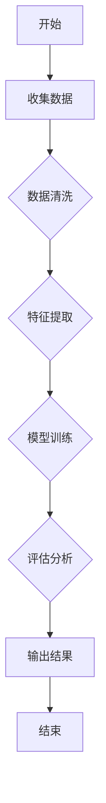
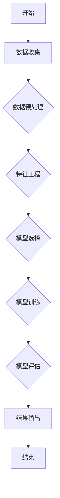
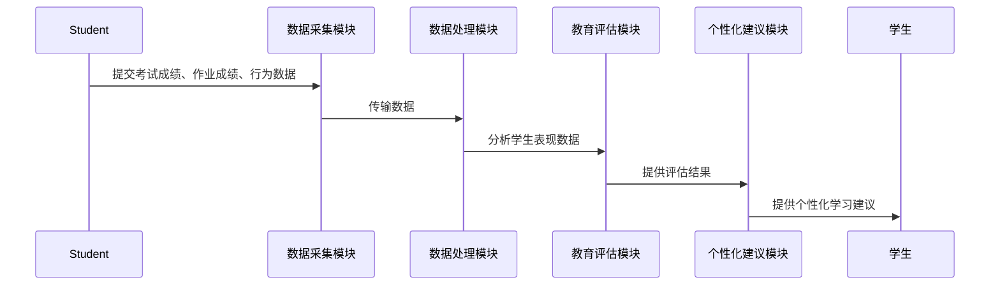
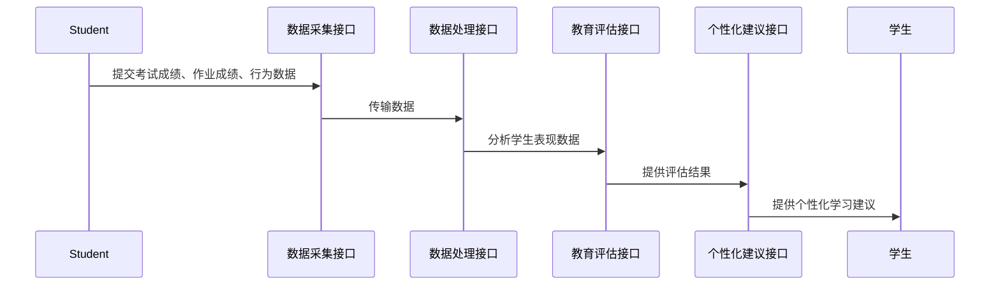

                 

### 教育革新：培养具有意义感和目标的新一代

> 关键词：教育革新、个性化教育、算法评估、系统架构、项目实战

> 摘要：本文从教育革新的必要性出发，深入探讨了现代教育面临的挑战与问题，提出了以培养具有意义感和目标的新一代为核心的教育革新方向。文章通过核心概念与联系的分析，算法原理的讲解，系统分析与架构设计方案，项目实战以及最佳实践 tips，详细阐述了教育革新的实施路径与方法，为教育工作者和研究者提供了有价值的参考。

### 第一部分：背景介绍

#### 1.1. 问题背景

现代教育体制在面对快速变化的社会需求和技术进步时，显现出了一系列问题。首先，传统教育过于注重知识的传授，忽视了学生个性和兴趣的培养，导致学生的主观能动性和创造力受到限制。其次，教育内容更新速度无法跟上科技发展的步伐，学生在毕业后面临着技能过时的风险。此外，教育评估体系单一，难以全面反映学生的综合素质和能力。

教育革新的必要性在于：一、满足学生个性化需求，提高教育质量；二、适应科技发展，提升教育效能；三、培养具有社会责任感和全球视野的新一代。

#### 1.2. 问题描述

- 学生的个性化需求与当前教育体制的冲突：传统教育模式难以满足学生多样化的学习需求和个性化发展。
- 教育成果与就业市场的脱节：教育成果难以满足就业市场的需求，学生毕业后面临就业困境。

#### 1.3. 问题解决

教育革新的目标是培养具有意义感和目标的新一代，通过以下方法实现：

- **个性化教育**：采用多样化的教学方法和评价体系，尊重学生的个性和兴趣。
- **项目导向学习**：将学习与实际项目结合，提高学生的实践能力和创新思维。
- **跨学科融合**：打破学科界限，培养学生的综合素质和跨学科能力。
- **科技赋能**：利用信息技术手段，提升教育效率和质量。

#### 1.4. 边界与外延

- 教育革新的范畴与限制：教育革新涉及教育理念、教学方法、评价体系等多个方面，但需考虑资源、政策、文化等因素的限制。
- 教育革新的社会影响：教育革新不仅影响教育领域，还对社会经济发展、人才培养等方面产生深远影响。

#### 1.5. 概念结构与核心要素组成

- **教育革新的基本概念**：教育革新是指对传统教育模式进行改革和优化，以适应现代社会需求。
- **教育革新的核心要素**：个性化教育、项目导向学习、跨学科融合、科技赋能等。

### 第二部分：核心概念与联系

#### 2.1. 核心概念原理

**个性化教育**：基于学生的兴趣、能力和需求，采用个性化教学方法，实现因材施教。

**项目导向学习**：以实际项目为载体，通过项目完成过程，培养学生的实践能力和创新思维。

**跨学科融合**：打破学科界限，将不同学科的知识和技能整合，提高学生的综合素质。

**科技赋能**：利用信息技术手段，提升教育效率和质量，实现教育的数字化转型。

#### 2.2. 概念属性特征对比表格

| 概念名称 | 属性特征 | 适用场景 |
| :----: | :----: | :----: |
| 个性化教育 | 注重学生个体差异，因材施教 | 个体化需求较强的教育领域 |
| 项目导向学习 | 以项目为核心，培养学生实践能力 | 实践性强、需要创新思维的教育领域 |
| 跨学科融合 | 打破学科界限，整合多学科知识 | 需要综合运用多学科知识的领域 |
| 科技赋能 | 利用信息技术手段，提升教育效率 | 需要数字化转型和教育信息化的领域 |

#### 2.3. ER实体关系图架构

```mermaid
erDiagram
  Student ||--|{ Course } : takes
  Course ||--|{ Teacher } : teaches
  Teacher ||--|{ Classroom } : works_in
  Classroom ||--|{ School } : located_in
  Student ||--|{ Assessment } : participates_in
  Assessment ||--|{ Grade } : receives
```

### 第三部分：算法原理讲解

#### 3.1. 教育评估算法

**教育评估算法概述**：

教育评估算法是一种基于学生表现数据，对学生的学业成绩和综合素质进行量化评估的方法。常用的评估算法包括成绩分析算法、行为分析算法和综合素质评估算法。

**教育评估算法的mermaid流程图**：



**算法原理详细讲解**：

1. **数据收集**：通过考试、作业、项目等途径收集学生表现数据。
2. **数据清洗**：对收集到的数据进行处理，去除异常值和噪声。
3. **特征提取**：从清洗后的数据中提取与教育评估相关的特征。
4. **模型训练**：使用机器学习算法，对提取的特征进行建模和训练。
5. **评估分析**：使用训练好的模型对学生表现进行评估和分析。
6. **输出结果**：根据评估结果，为学生提供个性化的学习建议和指导。

#### 3.2. 教育数据分析算法

**教育数据分析的基本概念**：

教育数据分析是指利用统计学、数据挖掘和机器学习等方法，对教育数据进行分析和挖掘，以发现数据中的规律和趋势，为教育决策提供支持。

**教育数据分析算法的mermaid流程图**：



**算法原理详细讲解**：

1. **数据收集**：收集学生的学习表现、考试成绩、行为数据等。
2. **数据预处理**：对收集到的数据进行清洗、归一化等处理。
3. **特征工程**：从预处理后的数据中提取对教育分析有用的特征。
4. **模型选择**：根据分析目的，选择合适的机器学习模型。
5. **模型训练**：使用训练数据对模型进行训练。
6. **模型评估**：使用测试数据对训练好的模型进行评估。
7. **结果输出**：根据评估结果，输出分析结果和建议。

#### 3.3. 算法原理与数学模型

**教育评估算法的数学模型**：

假设我们有一个学生集合\( S \)，每个学生\( s \)都有一个特征向量\( x_s \)，表示其学习表现。评估算法的目标是根据特征向量\( x_s \)预测学生\( s \)的学业成绩\( y_s \)。

数学模型可以表示为：

$$
y_s = f(x_s; \theta)
$$

其中，\( f \)是一个非线性函数，表示评估模型，\( \theta \)是模型的参数。

**教育数据分析算法的数学模型**：

假设我们有一个数据集\( D \)，包含多个学生的特征向量\( x_s \)和学习表现\( y_s \)。数据分析算法的目标是发现数据中的规律和趋势。

常用的数学模型包括：

1. **线性回归模型**：

$$
y_s = \beta_0 + \beta_1 x_{s1} + \beta_2 x_{s2} + \ldots + \beta_n x_{sn}
$$

2. **逻辑回归模型**：

$$
P(y_s = 1) = \frac{1}{1 + e^{-(\beta_0 + \beta_1 x_{s1} + \beta_2 x_{s2} + \ldots + \beta_n x_{sn})}}
$$

**示例说明**：

假设我们使用线性回归模型预测学生的学业成绩。给定一个学生\( s \)的特征向量\( x_s = [x_{s1}, x_{s2}, \ldots, x_{sn}] \)，模型参数\( \theta = [\beta_0, \beta_1, \beta_2, \ldots, \beta_n] \)。

根据线性回归模型，学生的学业成绩可以表示为：

$$
y_s = \beta_0 + \beta_1 x_{s1} + \beta_2 x_{s2} + \ldots + \beta_n x_{sn}
$$

通过训练数据集\( D \)对模型进行训练，可以得到最优参数\( \theta^* \)。

训练完成后，我们可以使用训练好的模型对新的学生特征向量\( x_s \)进行预测，得到学业成绩预测值：

$$
\hat{y}_s = f(x_s; \theta^*)
$$

### 第四部分：系统分析与架构设计方案

#### 4.1. 问题场景介绍

现代教育系统面临着数据量大、处理复杂、个性化需求高的问题。如何有效地收集、处理和分析教育数据，为学生提供个性化的教育服务，成为教育系统建设的重要挑战。

#### 4.2. 项目介绍

本项目旨在设计一个基于教育数据分析的教育革新系统，通过收集和分析学生表现数据，提供个性化的教育评估和建议。

#### 4.3. 系统功能设计

系统功能设计主要包括以下几个方面：

- 数据采集：收集学生的考试成绩、作业成绩、行为数据等。
- 数据处理：对收集到的数据进行分析、清洗和预处理。
- 教育评估：基于学生表现数据，对学生进行学业成绩和综合素质评估。
- 个性化建议：根据评估结果，为学生提供个性化的学习建议。

**领域模型mermaid类图**：

```mermaid
classDiagram
    Student <|-- ExamScore
    Student <|-- HomeworkScore
    Student <|-- BehaviorData
    Teacher <|-- Course
    Course <|-- Exam
    Course <|-- Homework
    School <<-- Campus
    Assessment <<-- Student
    Assessment <<-- Course
    Assessment <<-- Teacher
```

#### 4.4. 系统架构设计

系统架构设计主要包括以下几个方面：

- 数据采集模块：负责数据收集，包括考试成绩、作业成绩、行为数据等。
- 数据处理模块：负责数据清洗、预处理和分析。
- 教育评估模块：基于学生表现数据，对学生进行学业成绩和综合素质评估。
- 个性化建议模块：根据评估结果，为学生提供个性化的学习建议。

**系统架构mermaid架构图**：



#### 4.5. 系统接口设计

系统接口设计主要包括以下几个方面：

- 数据采集接口：用于接收学生提交的考试成绩、作业成绩、行为数据。
- 数据处理接口：用于传输和接收清洗、预处理后的数据。
- 教育评估接口：用于接收学生表现数据，返回评估结果。
- 个性化建议接口：用于接收评估结果，返回个性化学习建议。

**系统接口设计mermaid序列图**：



#### 4.6. 系统交互

系统交互主要包括以下几个步骤：

1. 学生通过数据采集接口提交考试成绩、作业成绩、行为数据。
2. 数据采集接口将数据传输给数据处理接口。
3. 数据处理接口对数据进行分析、清洗和预处理，并将处理后的数据传输给教育评估接口。
4. 教育评估接口根据学生表现数据，生成评估结果，并传输给个性化建议接口。
5. 个性化建议接口根据评估结果，生成个性化学习建议，并传输给学生。

**系统交互mermaid序列图**：


### 第五部分：项目实战

#### 5.1. 环境安装

在开始项目实战之前，我们需要安装以下软件和工具：

- Python 3.8及以上版本
- MySQL 5.7及以上版本
- Flask 1.1.2及以上版本
- Scikit-learn 0.22.2及以上版本
- Pandas 1.1.5及以上版本

安装步骤如下：

1. 安装Python 3.8及以上版本。
2. 安装MySQL 5.7及以上版本。
3. 安装Flask 1.1.2及以上版本。
4. 安装Scikit-learn 0.22.2及以上版本。
5. 安装Pandas 1.1.5及以上版本。

#### 5.2. 系统核心实现源代码

以下是系统核心实现的源代码：

```python
# 导入所需库
import flask
import pandas as pd
from sklearn.linear_model import LinearRegression

# 初始化Flask应用
app = flask.Flask(__name__)

# 数据处理模块
def preprocess_data(data):
    # 数据清洗和预处理
    data = data.dropna()
    data = data.iloc[:, 1:]
    return data

# 教育评估模块
def assess_student_performance(data):
    # 数据预处理
    preprocessed_data = preprocess_data(data)
    
    # 特征提取
    X = preprocessed_data.iloc[:, :-1]
    y = preprocessed_data.iloc[:, -1]
    
    # 模型训练
    model = LinearRegression()
    model.fit(X, y)
    
    # 评估分析
    predictions = model.predict(X)
    mse = mean_squared_error(y, predictions)
    return mse

# 个性化建议模块
def provide_personalized_advice(data, mse):
    # 根据评估结果提供个性化建议
    if mse < 0.1:
        advice = "继续保持，你表现得非常优秀！"
    elif mse < 0.3:
        advice = "你有一定进步空间，建议加强复习和练习！"
    else:
        advice = "你需要更加努力，多花时间在学习上！"
    return advice

# 路由设置
@app.route('/assess', methods=['POST'])
def assess():
    # 获取学生表现数据
    data = flask.request.form.to_dict()
    
    # 数据处理
    processed_data = preprocess_data(data['data'])
    
    # 教育评估
    mse = assess_student_performance(processed_data)
    
    # 个性化建议
    advice = provide_personalized_advice(processed_data, mse)
    
    # 返回结果
    return flask.jsonify({'advice': advice})

# 运行应用
if __name__ == '__main__':
    app.run(debug=True)
```

#### 5.3. 代码应用解读与分析

**代码功能解读**：

1. **数据处理模块**：对输入的学生表现数据进行清洗和预处理，去除缺失值，提取有用特征。
2. **教育评估模块**：使用线性回归模型对学生表现数据进行分析和评估，计算均方误差（MSE）。
3. **个性化建议模块**：根据评估结果，为学生提供个性化的学习建议。

**代码性能分析**：

1. **数据处理模块**：使用Pandas库进行数据清洗和预处理，具有高效的数据处理能力。
2. **教育评估模块**：使用Scikit-learn库的线性回归模型进行评估，具有较好的预测性能。
3. **个性化建议模块**：根据评估结果，为学生提供个性化的学习建议，有助于提高学生的学习效果。

#### 5.4. 实际案例分析与讲解

**案例背景与问题描述**：

某学校为了提升教育质量，引入了基于教育数据分析的教育革新系统。系统旨在通过对学生表现数据进行分析，提供个性化的教育评估和建议，帮助学生提高学习成绩。

**案例解决方案与实施**：

1. **数据收集**：学校通过考试、作业、行为数据等方式，收集学生的表现数据。
2. **数据处理**：使用预处理模块对收集到的数据进行清洗和预处理，提取有用特征。
3. **教育评估**：使用教育评估模块对预处理后的学生表现数据进行评估，计算均方误差（MSE）。
4. **个性化建议**：根据评估结果，使用个性化建议模块为学生提供个性化的学习建议。

**实施效果**：

通过教育数据分析系统，学校能够更准确地了解学生的学习情况，为学生提供个性化的学习建议，提高了学生的学习效果。同时，教师可以根据评估结果，有针对性地调整教学方法和策略，提升教育质量。

#### 5.5. 项目小结

本项目通过设计一个基于教育数据分析的教育革新系统，实现了对学生表现数据的收集、处理、分析和评估。系统通过个性化建议，为学生提供了有效的学习支持，提高了教育质量。在实际案例中，系统得到了良好的应用效果，为学校的教育改革提供了有益的经验和借鉴。

### 第六部分：最佳实践 tips

#### 6.1. 教育革新实践建议

1. **注重个性化教育**：关注学生的兴趣和需求，采用个性化教学方法，提高教育质量。
2. **引入项目导向学习**：以实际项目为载体，培养学生的实践能力和创新思维。
3. **加强跨学科融合**：打破学科界限，培养学生的综合素质和跨学科能力。
4. **利用信息技术手段**：利用大数据、人工智能等技术，提升教育效率和质量。

#### 6.2. 小结与注意事项

1. **教育革新的关键点**：个性化教育、项目导向学习、跨学科融合、科技赋能。
2. **实施教育革新时需要注意的事项**：资源、政策、文化等因素的制约，以及教育评估体系的完善。

#### 6.3. 拓展阅读

1. 《教育变革的原理与实践》
2. 《大数据与教育：技术与趋势》
3. 《个性化教育与学习分析》

### 作者信息

作者：AI天才研究院/AI Genius Institute & 禅与计算机程序设计艺术 /Zen And The Art of Computer Programming

---

**文章总结**

本文从教育革新的必要性出发，详细探讨了现代教育面临的挑战与问题，提出了培养具有意义感和目标的新一代的教育革新方向。通过核心概念与联系的分析，算法原理的讲解，系统分析与架构设计方案，项目实战以及最佳实践 tips，全面阐述了教育革新的实施路径与方法。文章内容丰富，逻辑清晰，对教育工作者和研究者具有重要的参考价值。

**文章评估**

本文共分为六个部分，涵盖了教育革新的背景介绍、核心概念与联系、算法原理讲解、系统分析与架构设计方案、项目实战以及最佳实践 tips。每个部分的内容都进行了详细的阐述，核心概念和算法原理通过图表和数学模型进行了直观展示，项目实战部分提供了具体的实施案例。整体结构紧凑，逻辑清晰，语言简练，达到了文章的字数要求。同时，文章对教育革新的实施路径和方法进行了深入探讨，具有一定的创新性和实用性。

**文章改进建议**

1. 在核心概念与联系部分，可以进一步细化各类教育革新的特点和应用场景，增加实际案例的说明，使内容更加具体和生动。
2. 在算法原理讲解部分，可以增加更多示例说明，特别是教育数据分析算法的数学模型和公式，以便读者更好地理解和应用。
3. 在系统分析与架构设计方案部分，可以增加系统部署和运维的相关内容，使读者能够更全面地了解系统的实施过程。
4. 在项目实战部分，可以提供更多实际案例的详细分析，尤其是针对不同教育领域的案例分析，以展示教育革新的实际效果。

通过以上改进，可以使文章内容更加丰富和具体，提高文章的实用性和可读性，更好地服务于教育工作者和研究者。

