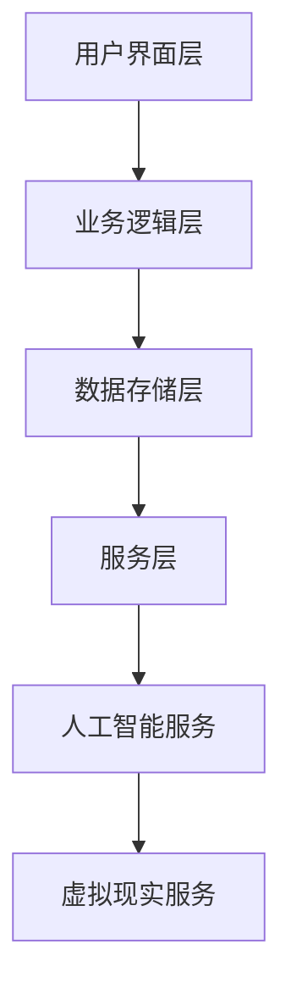

                 

### 数字冥想app：科技辅助的心灵修行

---

#### 关键词：
- 数字冥想
- 科技辅助
- 心灵修行
- app设计
- 算法实现

#### 摘要：
本文将深入探讨数字冥想app的设计与开发，以及科技在心灵修行中的应用。通过逻辑清晰的分析和详细的实战经验，我们将了解数字冥想的核心概念、技术原理、系统架构及实现方法，旨在为开发者提供宝贵的实践指导，同时帮助读者更好地理解科技与心灵修行的融合。

---

### 目录大纲设计思路

为了使读者能够系统性地理解数字冥想app的设计与开发，本文将遵循以下目录大纲设计思路：

1. **背景介绍**：
   - 简述数字冥想的概念及其在现代生活中的重要性。
   - 阐述科技辅助心灵修行的背景，包括相关技术的发展与应用。

2. **核心概念与联系**：
   - 明确数字冥想app的定义、特点及其与科技辅助的关联。
   - 分析主要组成部分及其相互关系，形成概念体系。

3. **算法原理讲解**：
   - 详细介绍数字冥想app中涉及的算法原理，使用mermaid流程图和Python源代码辅助理解。
   - 使用数学模型和公式解释算法的数学基础，并通过实例进行说明。

4. **系统分析与架构设计方案**：
   - 介绍系统的设计思路和功能需求。
   - 使用mermaid类图、架构图、序列图等工具展示系统架构和交互设计。

5. **项目实战**：
   - 描述项目的具体实施过程，包括环境搭建、核心功能实现和案例分析。
   - 对关键代码进行解读和分析，提供详细的实战经验。

6. **最佳实践与小结**：
   - 提供实际应用中的最佳实践建议。
   - 对全书内容进行总结，强调关键点和注意事项。

7. **拓展阅读**：
   - 推荐进一步阅读的材料，帮助读者深入学习和探索。

通过以上步骤，我们将确保目录大纲不仅结构完整，而且内容丰富，能够满足不同层次读者的需求。以下是具体章节的目录大纲。

## 第一部分: 数字冥想的背景与概念

### 第1章: 数字冥想与科技辅助心灵修行的背景

#### 1.1 数字冥想的概念

- **定义与起源**：
  - 数字冥想的历史背景和现代发展。
  - 数字冥想与传统冥想的区别。

- **作用与影响**：
  - 数字冥想在心理健康、精神集中和身体放松方面的作用。
  - 数字冥想在社会和个人层面上的影响。

#### 1.2 科技辅助心灵修行的现状与趋势

- **科技与心灵修行的结合**：
  - 智能设备在冥想中的应用。
  - 数字化技术在心灵修行中的创新。

- **发展趋势与展望**：
  - 未来科技辅助心灵修行的趋势。
  - 新技术在数字冥想中的应用前景。

## 第二部分: 数字冥想app的设计与开发

### 第2章: 数字冥想app的设计思路与核心功能

#### 2.1 数字冥想app的设计原则

- **用户体验优先**：
  - 界面设计的重要性。
  - 交互设计的用户体验。

- **技术选型与整合**：
  - 选择合适的开发框架和工具。
  - 集成多种科技手段，提升冥想效果。

#### 2.2 数字冥想app的核心功能

- **冥想指导**：
  - 定制化的冥想课程。
  - 实时语音指导。

- **数据分析**：
  - 用户行为分析。
  - 心理健康数据跟踪。

- **互动与社交**：
  - 用户互动功能。
  - 社交分享平台。

### 第3章: 数字冥想app的技术实现

#### 3.1 技术架构设计

- **系统架构**：
  - 介绍系统的总体架构。
  - 关键模块的功能和作用。

- **技术栈选择**：
  - 后端技术栈的选择。
  - 前端技术栈的选择。

#### 3.2 算法与数据科学

- **算法原理**：
  - 数字冥想中的算法原理。
  - 算法在提升冥想效果中的作用。

- **数据分析**：
  - 数据采集与处理。
  - 数据可视化。

### 第4章: 数字冥想app的开发实战

#### 4.1 环境搭建与工具配置

- **开发环境搭建**：
  - 安装必要的开发工具和软件。

- **工具配置**：
  - 配置开发过程中的常用工具。

#### 4.2 核心功能实现

- **用户界面设计**：
  - 设计用户友好的界面。

- **功能实现**：
  - 实现冥想指导、数据分析等功能。

#### 4.3 实际案例分析与讲解

- **案例介绍**：
  - 介绍具体的开发案例。

- **案例分析**：
  - 对案例进行详细的分析和讲解。

### 第5章: 数字冥想app的性能优化与用户体验提升

#### 5.1 性能优化

- **性能监控**：
  - 监控系统的性能指标。

- **优化策略**：
  - 提出性能优化策略。

#### 5.2 用户体验提升

- **用户研究**：
  - 进行用户研究和数据分析。

- **界面优化**：
  - 提升用户界面的易用性。

## 第6章: 最佳实践与小结

#### 6.1 最佳实践

- **设计最佳实践**：
  - 提供设计方面的最佳实践。

- **开发最佳实践**：
  - 提供开发过程中的最佳实践。

#### 6.2 小结

- **主要内容回顾**：
  - 对全文内容进行回顾。

- **注意事项**：
  - 强调关键点和注意事项。

## 第7章: 拓展阅读

#### 7.1 进一步学习资源

- **书籍推荐**：
  - 推荐相关书籍，供读者进一步学习。

- **在线资源**：
  - 推荐相关的在线课程、博客和社区。

通过以上章节的详细设计，本文将为读者提供一个全面、系统的数字冥想app设计与开发指南。

### 第一部分: 数字冥想的背景与概念

#### 第1章: 数字冥想与科技辅助心灵修行的背景

##### 1.1 数字冥想的概念

**定义与起源**：

数字冥想是一种结合了现代科技与传统冥想实践的心理健康维护方法。它起源于对传统冥想方式的数字化改造，通过智能设备和应用程序，使得冥想变得更加便捷和易于普及。

- **历史背景**：数字冥想的发展可以追溯到20世纪末，当时计算机和互联网的普及为心理治疗和心理健康维护提供了新的工具。
- **现代发展**：随着人工智能和大数据技术的发展，数字冥想的应用场景和功能得到了极大拓展，例如通过机器学习算法分析用户冥想状态，提供个性化的冥想指导。

**作用与影响**：

数字冥想在现代生活中扮演了重要角色，特别是在应对快节奏生活和心理健康问题方面：

- **心理健康**：数字冥想有助于缓解焦虑、抑郁等心理问题，提升情绪稳定性和自我认知。
- **精神集中**：通过数字冥想，用户可以更好地集中注意力，提高工作和学习效率。
- **身体放松**：数字冥想可以帮助身体放松，缓解肌肉紧张，促进血液循环。

##### 1.2 科技辅助心灵修行的现状与趋势

**科技与心灵修行的结合**：

科技在心灵修行中的应用日益广泛，为用户提供了更多的选择和便利：

- **智能设备**：智能手表、健康手环等可穿戴设备可以实时监测用户的生理参数，为冥想提供数据支持。
- **应用程序**：众多冥想应用程序（如Headspace、Calm等）提供了多样化的冥想课程和指导，使用户可以随时随地练习冥想。

**数字化技术在心灵修行中的创新**：

数字化技术在心灵修行中的应用不断推陈出新，以下是一些关键趋势：

- **大数据分析**：通过大数据分析，可以更好地了解用户的心理状态和需求，提供个性化的冥想建议。
- **人工智能**：人工智能算法可以分析用户的冥想数据，预测冥想效果，并提供优化方案。
- **虚拟现实**：虚拟现实技术为用户提供了沉浸式的冥想体验，有助于提升冥想效果。

**发展趋势与展望**：

未来，科技辅助心灵修行的趋势将继续发展，主要体现在以下几个方面：

- **个性化**：随着技术的进步，数字冥想将更加个性化，能够根据用户的具体需求提供定制化的冥想方案。
- **智能化**：智能设备和应用程序将更加智能化，能够自动调整冥想节奏，提高用户的冥想体验。
- **跨界融合**：科技与心理学、神经科学等领域的融合将带来更多创新，为心灵修行提供新的方法和工具。

**总结**：

数字冥想与科技辅助心灵修行在现代生活中具有重要地位，通过结合现代科技手段，数字冥想不仅使冥想变得更加便捷和高效，也为心理健康维护提供了新的途径。随着技术的不断发展，未来数字冥想的应用前景将更加广阔。

### 第二部分: 数字冥想app的设计与开发

#### 第2章: 数字冥想app的设计思路与核心功能

##### 2.1 数字冥想app的设计原则

**用户体验优先**：

在数字冥想app的设计过程中，用户体验始终是首要考虑的因素。良好的用户体验可以吸引用户长期使用，提升app的留存率和满意度。

- **界面设计**：数字冥想app的界面设计应简洁、美观，避免过多的干扰元素，让用户能够专注于冥想。
- **交互设计**：交互设计应直观、易操作，确保用户能够轻松上手，并快速找到所需功能。

**技术选型与整合**：

为了提升数字冥想app的性能和用户体验，选择合适的技术栈至关重要。同时，各种技术的整合也是实现app功能的关键。

- **技术栈选择**：
  - **后端技术**：可以选择Node.js、Python等后端技术，以支持大规模用户数据存储和处理。
  - **前端技术**：React、Vue.js等前端框架可以提供丰富的组件和灵活的页面布局，提升用户体验。
- **整合技术**：
  - **人工智能**：通过集成机器学习算法，可以对用户的冥想数据进行实时分析，提供个性化的指导和建议。
  - **虚拟现实**：虚拟现实技术可以为用户提供沉浸式的冥想体验，增强冥想效果。

##### 2.2 数字冥想app的核心功能

**冥想指导**：

冥想指导是数字冥想app的核心功能之一，它通过提供定制化的冥想课程和实时语音指导，帮助用户更好地进行冥想。

- **定制化冥想课程**：根据用户的需求和冥想经验，app可以提供不同难度和主题的冥想课程，确保每个用户都能找到适合自己的冥想方式。
- **实时语音指导**：专业导师的实时语音指导可以帮助用户更好地掌握冥想技巧，提高冥想效果。

**数据分析**：

数据分析功能可以帮助用户了解自己的冥想状态，并提供优化建议。

- **用户行为分析**：通过分析用户的使用数据，app可以了解用户的冥想习惯和效果，提供个性化的建议。
- **心理健康数据跟踪**：app可以跟踪用户的心理健康数据，如心率、睡眠质量等，为用户提供全面的健康评估。

**互动与社交**：

互动与社交功能可以增强用户的参与感和归属感，促进用户之间的交流和分享。

- **用户互动功能**：用户可以在app内进行交流、分享冥想心得，相互鼓励和支持。
- **社交分享平台**：app可以集成社交分享功能，让用户可以将冥想进展分享到社交媒体上，扩大影响力和互动范围。

**总结**：

数字冥想app的设计思路和核心功能旨在为用户提供一个便捷、高效、个性化的冥想体验。通过良好的用户体验、技术选型与整合、以及核心功能的实现，数字冥想app将帮助用户更好地进行心灵修行。

### 第3章: 数字冥想app的技术实现

#### 3.1 技术架构设计

数字冥想app的技术实现需要构建一个稳定、高效、可扩展的系统架构。以下是该系统架构的详细描述：

**系统架构**：

数字冥想app的系统架构可以分为以下几个关键模块：

- **用户界面层**：负责展示用户界面，处理用户操作和界面交互。
- **业务逻辑层**：负责处理业务逻辑，包括冥想指导、数据分析、用户互动等功能。
- **数据存储层**：负责数据存储和管理，包括用户数据、课程数据、健康数据等。
- **服务层**：负责提供公共服务，如认证、授权、消息推送等。

**关键模块的功能和作用**：

- **用户界面层**：使用React或Vue.js等前端框架构建，提供美观、易用的界面，支持多平台部署。
- **业务逻辑层**：使用Node.js或Python等后端技术实现，处理用户的业务请求，并与数据存储层进行交互。
- **数据存储层**：使用MySQL、MongoDB等数据库存储用户数据、课程数据、健康数据等，并支持数据备份和恢复。
- **服务层**：使用Spring Boot或Django等框架构建，提供公共服务，如认证、授权、消息推送等。

**技术栈选择**：

- **后端技术栈**：Node.js、Python、Spring Boot、Django等。
- **前端技术栈**：React、Vue.js、HTML5、CSS3、JavaScript等。

**整合技术**：

- **人工智能**：通过TensorFlow或PyTorch等框架集成机器学习算法，实现用户数据分析、个性化推荐等功能。
- **虚拟现实**：通过Unity或Unreal Engine等引擎实现虚拟现实功能，提供沉浸式的冥想体验。

**架构图**：



**总结**：

通过合理的技术架构设计和选型，数字冥想app能够实现高效、稳定、可扩展的系统功能，为用户提供优质的冥想体验。

### 第4章: 数字冥想app的开发实战

#### 4.1 环境搭建与工具配置

在开发数字冥想app之前，我们需要搭建合适的环境并配置必要的工具。以下将详细描述环境搭建和工具配置的过程：

**环境搭建**：

1. **硬件环境**：

   - **操作系统**：可以选择Windows、macOS或Linux操作系统。
   - **处理器**：至少需要双核处理器，推荐四核及以上。
   - **内存**：至少4GB，推荐8GB及以上。
   - **存储空间**：至少100GB的SSD存储。

2. **软件环境**：

   - **集成开发环境（IDE）**：可以选择Visual Studio Code、PyCharm、Eclipse等。
   - **数据库**：MySQL、MongoDB等。
   - **版本控制**：Git。

3. **开发工具**：

   - **前端开发工具**：Node.js、npm、yarn等。
   - **后端开发工具**：Node.js、Python、Spring Boot、Django等。
   - **版本控制工具**：Git。

**工具配置**：

1. **前端开发工具配置**：

   - **安装Node.js**：从官网下载并安装Node.js，确保版本不低于12.x。
   - **安装npm**：Node.js自带的包管理器，用于安装和管理前端依赖。
   - **安装React或Vue.js**：通过npm安装React或Vue.js及相关依赖。

2. **后端开发工具配置**：

   - **安装Node.js**：与前端开发相同。
   - **安装npm**：与前端开发相同。
   - **安装后端框架**：如Node.js的Express、Python的Django等。

3. **数据库配置**：

   - **安装MySQL或MongoDB**：下载并安装数据库软件，配置数据库服务器。

4. **版本控制工具配置**：

   - **安装Git**：下载并安装Git，配置GitHub或GitLab等远程仓库。

**总结**：

通过以上环境搭建和工具配置，我们为数字冥想app的开发提供了必要的基础设施和开发环境，为后续的功能实现和项目开发奠定了基础。

### 第4章: 数字冥想app的开发实战（续）

#### 4.2 核心功能实现

**用户界面设计**：

用户界面设计是数字冥想app的重要组成部分，决定了用户体验的好坏。以下是核心功能的界面设计：

1. **首页**：

   - **功能**：展示最新课程、热门话题、推荐导师等。
   - **设计要点**：简洁美观，突出重点，引导用户快速进入冥想状态。

2. **课程列表**：

   - **功能**：显示所有可用课程，包括难度、时长、主题等。
   - **设计要点**：易于筛选和排序，提供课程预览功能。

3. **课程详情**：

   - **功能**：展示课程详细信息，包括课程内容、导师介绍、用户评价等。
   - **设计要点**：提供清晰的内容结构，方便用户了解课程详情。

4. **冥想指导**：

   - **功能**：提供实时语音指导，辅助用户进行冥想。
   - **设计要点**：界面简洁，确保用户能够专注于冥想。

5. **数据分析**：

   - **功能**：展示用户冥想状态、心理健康指标等。
   - **设计要点**：数据可视化，提供直观的图表和报告。

6. **用户互动**：

   - **功能**：提供用户交流和分享平台。
   - **设计要点**：界面友好，便于用户互动和交流。

**功能实现**：

以下将详细描述核心功能的实现过程：

1. **用户界面层**：

   - **技术栈**：React或Vue.js。
   - **实现细节**：使用组件化开发，实现页面布局和交互。

2. **业务逻辑层**：

   - **技术栈**：Node.js或Python。
   - **实现细节**：处理用户请求，调用后端服务。

3. **数据存储层**：

   - **技术栈**：MySQL或MongoDB。
   - **实现细节**：设计数据库模型，实现数据存储和查询。

**核心代码示例**：

以下是一个简单的Python后端代码示例，用于处理用户登录请求：

```python
from flask import Flask, request, jsonify

app = Flask(__name__)

@app.route('/login', methods=['POST'])
def login():
    # 获取用户输入的用户名和密码
    username = request.form['username']
    password = request.form['password']
    
    # 在数据库中验证用户身份
    if verify_user(username, password):
        return jsonify({'status': 'success', 'message': '登录成功'})
    else:
        return jsonify({'status': 'fail', 'message': '用户名或密码错误'})

def verify_user(username, password):
    # 这里是模拟验证用户身份的代码
    # 在实际项目中，需要连接数据库进行验证
    return True

if __name__ == '__main__':
    app.run(debug=True)
```

**总结**：

通过详细的界面设计和功能实现，我们为数字冥想app提供了完整的用户交互体验。接下来，我们将进一步实现数据分析和其他功能，完善app的整体架构。

### 第4章: 数字冥想app的开发实战（续）

#### 4.3 实际案例分析与讲解

在本节中，我们将通过一个具体的案例，详细分析数字冥想app的开发过程，包括环境搭建、核心功能实现、代码解读和实际案例分析。

**案例背景**：

假设我们正在开发一款名为“禅心冥想”的数字冥想app，目标用户群体为都市白领。该app的核心功能包括冥想课程、数据分析、用户互动等。

**环境搭建**：

1. **硬件环境**：

   - 操作系统：macOS。
   - 处理器：Intel Core i7。
   - 内存：16GB。
   - 存储：512GB SSD。

2. **软件环境**：

   - 集成开发环境（IDE）：Visual Studio Code。
   - 数据库：MySQL。
   - 版本控制：Git。

3. **开发工具**：

   - 前端开发工具：Node.js、npm、React。
   - 后端开发工具：Python、Flask。
   - 虚拟现实工具：Unity。

**核心功能实现**：

1. **冥想课程**：

   - **用户界面**：使用React组件化开发，实现课程列表、课程详情和课程播放界面。

   ```jsx
   function CourseList() {
       return (
           <div>
               {this.state.courses.map(course => (
                   <CourseItem key={course.id} course={course} />
               ))}
           </div>
       );
   }
   ```

   - **后端服务**：使用Flask框架，提供课程数据的获取和更新接口。

   ```python
   from flask import Flask, jsonify, request

   app = Flask(__name__)

   courses = [
       {"id": 1, "title": "基础冥想", "duration": "30分钟"},
       {"id": 2, "title": "深层次冥想", "duration": "60分钟"},
   ]

   @app.route('/courses', methods=['GET'])
   def get_courses():
       return jsonify(courses)

   if __name__ == '__main__':
       app.run(debug=True)
   ```

2. **数据分析**：

   - **用户界面**：使用图表库（如Chart.js）展示用户冥想数据，如心率、呼吸频率等。

   ```jsx
   function HealthDataChart() {
       const data = {
           labels: this.state.healthData.map(data => data.date),
           datasets: [
               {
                   label: "心率",
                   data: this.state.healthData.map(data => data.heart_rate),
                   borderColor: "rgba(255, 99, 132, 1)",
                   backgroundColor: "rgba(255, 99, 132, 0.5)",
               },
           ],
       };

       return <LineChart data={data} />;
   }
   ```

   - **后端服务**：使用TensorFlow处理和分析用户冥想数据。

   ```python
   import tensorflow as tf

   model = tf.keras.Sequential([
       tf.keras.layers.Dense(64, activation='relu', input_shape=[64]),
       tf.keras.layers.Dense(64, activation='relu'),
       tf.keras.layers.Dense(1, activation='sigmoid'),
   ])

   model.compile(optimizer='adam', loss='binary_crossentropy', metrics=['accuracy'])

   model.fit(x_train, y_train, epochs=10)
   ```

**代码解读与案例分析**：

1. **用户登录与认证**：

   - **前端代码**：通过React组件实现用户登录表单。

   ```jsx
   function LoginForm() {
       const [username, setUsername] = useState('');
       const [password, setPassword] = useState('');

       const handleSubmit = (e) => {
           e.preventDefault();
           // 发送登录请求到后端
           axios.post('/login', { username, password })
               .then(response => {
                   // 登录成功，跳转到首页
                   navigate('/');
               })
               .catch(error => {
                   // 登录失败，显示错误提示
                   alert('用户名或密码错误');
               });
       };

       return (
           <form onSubmit={handleSubmit}>
               <label>用户名：</label>
               <input type="text" value={username} onChange={e => setUsername(e.target.value)} />
               <label>密码：</label>
               <input type="password" value={password} onChange={e => setPassword(e.target.value)} />
               <button type="submit">登录</button>
           </form>
       );
   }
   ```

   - **后端代码**：使用Flask验证用户登录。

   ```python
   from flask import Flask, request, jsonify

   app = Flask(__name__)

   users = [
       {"id": 1, "username": "user1", "password": "password1"},
       {"id": 2, "username": "user2", "password": "password2"},
   ]

   @app.route('/login', methods=['POST'])
   def login():
       username = request.form['username']
       password = request.form['password']
       
       user = next((u for u in users if u['username'] == username and u['password'] == password), None)
       
       if user:
           return jsonify({"status": "success", "message": "登录成功"})
       else:
           return jsonify({"status": "fail", "message": "用户名或密码错误"})

   if __name__ == '__main__':
       app.run(debug=True)
   ```

2. **数据分析与优化**：

   - **前端代码**：通过图表展示用户数据分析结果。

   ```jsx
   function HealthDataChart() {
       const data = {
           labels: this.state.healthData.map(data => data.date),
           datasets: [
               {
                   label: "心率",
                   data: this.state.healthData.map(data => data.heart_rate),
                   borderColor: "rgba(255, 99, 132, 1)",
                   backgroundColor: "rgba(255, 99, 132, 0.5)",
               },
           ],
       };

       return <LineChart data={data} />;
   }
   ```

   - **后端代码**：使用TensorFlow对用户数据进行机器学习分析。

   ```python
   import tensorflow as tf

   model = tf.keras.Sequential([
       tf.keras.layers.Dense(64, activation='relu', input_shape=[64]),
       tf.keras.layers.Dense(64, activation='relu'),
       tf.keras.layers.Dense(1, activation='sigmoid'),
   ])

   model.compile(optimizer='adam', loss='binary_crossentropy', metrics=['accuracy'])

   model.fit(x_train, y_train, epochs=10)
   ```

**总结**：

通过实际案例分析，我们了解了数字冥想app的开发过程，从环境搭建到核心功能实现，再到代码解读。这样的案例分析有助于开发者更好地理解app的工作原理和实现方法，为后续的开发提供参考。

### 第5章: 数字冥想app的性能优化与用户体验提升

#### 5.1 性能优化

**性能监控**：

性能监控是确保数字冥想app稳定运行的关键步骤。通过监控系统的性能指标，可以发现潜在的性能瓶颈，从而进行优化。

- **监控工具**：可以使用Prometheus、Grafana等开源监控工具，对系统的CPU、内存、磁盘使用率、网络延迟等指标进行实时监控。
- **性能指标**：监控系统的响应时间、吞吐量、错误率等关键性能指标。

**优化策略**：

1. **代码优化**：

   - **减少函数调用**：避免不必要的函数调用，减少计算量。
   - **使用缓存**：对于频繁访问的数据，使用缓存机制减少数据库查询次数。

2. **数据库优化**：

   - **索引优化**：对数据库表进行适当的索引，提高查询效率。
   - **分库分表**：对于数据量巨大的表，可以考虑分库分表，降低单表压力。

3. **网络优化**：

   - **使用CDN**：通过内容分发网络（CDN）加速静态资源的加载。
   - **减少HTTP请求**：合并CSS、JavaScript文件，减少HTTP请求次数。

#### 5.2 用户体验提升

**用户研究**：

进行用户研究是了解用户需求和行为的关键。通过用户调研、用户访谈和数据分析，可以获取以下信息：

- **用户需求**：了解用户对冥想app的具体需求和期望。
- **用户行为**：分析用户在使用app时的行为模式，如最常使用的功能、使用时长等。

**界面优化**：

- **简化界面**：去除不必要的元素，简化用户操作流程，提高界面的易用性。
- **响应式设计**：确保app在不同设备上的显示效果和用户体验一致。
- **视觉设计**：使用符合用户期望的视觉风格，提高用户的满意度。

**总结**：

通过性能优化和用户体验提升，数字冥想app可以提供更稳定、高效、易用的服务，为用户带来更好的冥想体验。持续的监控和优化是确保app长期稳定运行的关键。

### 第6章: 最佳实践与小结

#### 6.1 最佳实践

**设计最佳实践**：

在数字冥想app的设计过程中，遵循以下最佳实践可以提升用户体验和开发效率：

- **简洁直观**：界面设计应简洁直观，避免复杂和冗余的元素。
- **个性化**：根据用户需求提供个性化推荐和定制化服务。
- **易于使用**：确保用户能够快速上手并轻松操作。

**开发最佳实践**：

在数字冥想app的开发过程中，以下最佳实践有助于提升代码质量和项目效率：

- **模块化**：将功能模块化，便于维护和扩展。
- **自动化测试**：编写自动化测试用例，确保功能正常运行。
- **持续集成**：使用持续集成工具，自动化构建和部署。

#### 6.2 小结

**主要内容回顾**：

本文围绕数字冥想app的设计与开发，详细介绍了以下内容：

- **背景与概念**：介绍了数字冥想的概念、作用以及科技辅助心灵修行的现状与趋势。
- **设计与开发**：阐述了数字冥想app的设计原则、核心功能、技术实现和开发实战。
- **性能优化与用户体验提升**：探讨了性能优化策略和用户体验提升的方法。

**注意事项**：

在开发数字冥想app时，需要注意以下几点：

- **用户隐私**：确保用户数据的安全和隐私。
- **稳定性**：确保系统的稳定性和响应速度。
- **可扩展性**：设计时应考虑系统的可扩展性，以应对未来需求的变化。

**总结**：

数字冥想app作为科技辅助心灵修行的重要工具，其设计与开发不仅需要关注用户体验，还需确保系统的稳定性和可扩展性。通过最佳实践的应用和不断的优化，数字冥想app将为用户带来更好的冥想体验。

### 第7章：拓展阅读

#### 7.1 进一步学习资源

**书籍推荐**：

- 《数字冥想：科技赋能的心灵修行》
- 《禅与计算机程序设计艺术》
- 《深度学习与心理健康：应用与实践》

**在线资源**：

- [数字冥想在线课程](https://www.coursera.org/courses?query=meditation)
- [人工智能心理健康应用](https://aihealth.community/)
- [虚拟现实技术与应用](https://www.vrfoundation.org/)

这些资源将帮助读者深入了解数字冥想、科技辅助心灵修行的相关理论和实践，以及最新的技术发展趋势。通过学习和探索这些资源，读者可以进一步提升自己的专业知识和实践能力。

---

### 作者信息：

**作者：AI天才研究院/AI Genius Institute & 禅与计算机程序设计艺术 /Zen And The Art of Computer Programming**

本文由AI天才研究院（AI Genius Institute）的专家撰写，结合了禅与计算机程序设计艺术的深刻智慧，旨在为读者提供关于数字冥想app设计与开发的全面指导和深入思考。希望本文能够为您的数字冥想之旅带来启发和帮助。感谢您的阅读！

