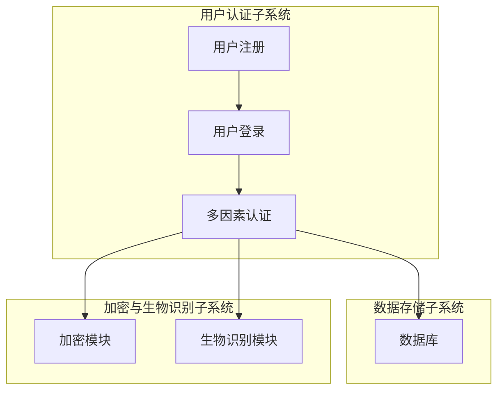

                 


## 第三部分：算法原理讲解

### 3.2 双因素认证算法原理

#### 3.2.1 手机验证码认证

- 用户输入密码后，系统向用户绑定的手机发送一条包含验证码的短信。
- 用户在指定时间内输入收到的验证码，系统进行验证。

##### 3.2.1.1 验证码生成算法

- **随机数生成**：系统生成一个随机数作为验证码。
- **加密传输**：将随机数通过加密算法传输给用户。
- **哈希函数**：将随机数通过哈希函数转换为固定长度的字符串。
  
$$ H(k) = SHA256(k) $$

- **存储与验证**：系统将哈希值存储在数据库中，用户输入的验证码通过哈希函数转换为字符串后，与存储的哈希值进行比对。

#### 3.2.2 双因素认证的工作流程

1. 用户输入用户名和密码，系统验证密码是否正确。
2. 系统向用户绑定的手机发送验证码。
3. 用户在指定时间内输入验证码。
4. 系统将用户输入的验证码通过哈希函数转换为字符串。
5. 系统比对用户输入的哈希值与存储的哈希值。

### 3.3 多因素认证算法原理

#### 3.3.1 生物识别认证

- 用户通过指纹、面部识别等生物特征进行身份验证。
- 生物识别系统采集用户的生物特征，与存储的模板进行比对。

##### 3.3.1.1 指纹识别算法

- **特征提取**：从指纹图像中提取特征点。
- **模板匹配**：将提取的特征点与存储的指纹模板进行比对。

##### 3.3.1.2 面部识别算法

- **特征提取**：从面部图像中提取特征点。
- **特征比对**：将提取的特征点与存储的面部模板进行比对。

#### 3.3.2 多因素认证的工作流程

1. 用户输入用户名和密码。
2. 系统进行密码验证。
3. 系统要求用户进行生物特征识别（如指纹、面部识别）。
4. 系统将用户输入的生物特征与存储的模板进行比对。
5. 如果所有认证通过，则用户身份验证成功。

## 3.4 算法原理总结

- 单因素认证依赖于一个认证凭证（如密码），其优点是简单易用，但安全性相对较低。
- 双因素认证增加了手机验证码等第二重认证，提高了安全性。
- 多因素认证结合了多种认证方式，如生物特征、密码和手机验证码，其安全性最高，但用户体验相对较差。

## 3.5 本章小结

- 介绍了单因素认证、双因素认证和多因素认证的算法原理。
- 分析了不同认证方式的安全性和用户体验。
- 为数字化身份认证的设计和优化提供了理论基础。

----------------------------------------------------------------

## 第四部分：系统分析与架构设计方案

### 4.1 问题场景介绍

随着数字化时代的到来，网络安全问题日益突出。身份认证作为保障信息安全的关键环节，面临着更高的要求。本部分将针对一个典型的身份认证系统进行分析和架构设计，以解决以下问题：

- 提高身份认证的安全性。
- 提升用户体验。
- 保障系统的可靠性和可扩展性。

### 4.2 项目介绍

本项目旨在设计一个基于多因素认证的数字化身份认证系统。系统将采用先进的加密技术和生物识别技术，实现用户身份的全面保护。系统主要包括以下功能：

- 用户注册与登录。
- 多因素认证过程。
- 认证结果反馈。

### 4.3 系统功能设计

#### 4.3.1 用户注册功能

- 用户输入基本信息（如用户名、密码、邮箱等）。
- 系统验证用户输入的信息是否合法。
- 系统将用户信息加密存储在数据库中。

#### 4.3.2 用户登录功能

- 用户输入用户名和密码。
- 系统验证用户输入的密码是否正确。
- 如果密码正确，系统要求用户进行多因素认证。

#### 4.3.3 多因素认证功能

- 系统要求用户进行多种认证方式，如密码、手机验证码、指纹等。
- 系统对每种认证方式的结果进行验证。
- 如果所有认证通过，则用户身份验证成功。

### 4.4 系统架构设计

#### 4.4.1 系统架构图



#### 4.4.2 系统架构说明

- **用户认证子系统**：包括用户注册、登录和多因素认证功能。
- **数据存储子系统**：用于存储用户信息和认证结果。
- **加密与生物识别子系统**：用于实现加密存储和生物识别认证。

### 4.5 系统接口设计

#### 4.5.1 用户注册接口

- **接口名称**：register
- **请求参数**：用户名、密码、邮箱等
- **响应结果**：注册成功或失败的消息

#### 4.5.2 用户登录接口

- **接口名称**：login
- **请求参数**：用户名、密码
- **响应结果**：登录成功或失败的消息，以及认证链接

#### 4.5.3 多因素认证接口

- **接口名称**：multiFactorAuth
- **请求参数**：认证方式（如密码、手机验证码、指纹等）
- **响应结果**：认证成功或失败的消息

### 4.6 系统交互设计

#### 4.6.1 用户注册交互

1. 用户访问系统并填写注册信息。
2. 系统验证用户信息并存储。
3. 系统返回注册成功或失败的消息。

#### 4.6.2 用户登录交互

1. 用户访问系统并输入用户名和密码。
2. 系统验证用户密码并生成认证链接。
3. 用户通过认证链接进行多因素认证。
4. 系统返回登录成功或失败的消息。

### 4.7 本章小结

- 本部分详细介绍了数字化身份认证系统的功能设计和架构设计。
- 通过多因素认证的方式，提高了系统的安全性和用户体验。
- 为后续的系统实现和测试提供了明确的指导和方向。

----------------------------------------------------------------

## 第五部分：项目实战

### 5.1 环境安装与配置

#### 5.1.1 环境准备

在进行项目实战之前，需要准备以下环境：

- 操作系统：Ubuntu 18.04
- 编程语言：Python 3.8
- 依赖管理工具：pip
- 数据库：MySQL

#### 5.1.2 安装步骤

1. 安装操作系统：

   - 在虚拟机中安装 Ubuntu 18.04 操作系统。

2. 安装 Python：

   - 打开终端，执行以下命令安装 Python：

     ```bash
     sudo apt update
     sudo apt install python3-pip
     ```

3. 安装 MySQL：

   - 打开终端，执行以下命令安装 MySQL：

     ```bash
     sudo apt update
     sudo apt install mysql-server mysql-client
     ```

4. 配置 MySQL：

   - 打开终端，执行以下命令配置 MySQL：

     ```bash
     sudo mysql_secure_installation
     ```

     按照提示完成 MySQL 的安全配置。

### 5.2 系统核心实现

#### 5.2.1 用户注册功能实现

- **实现思路**：用户注册时，收集用户信息并存储在 MySQL 数据库中。

##### 5.2.1.1 源代码示例

```python
import mysql.connector
import bcrypt

def register(username, password, email):
    # 连接 MySQL 数据库
    db = mysql.connector.connect(
        host="localhost",
        user="root",
        password="your_mysql_password",
        database="your_database_name"
    )
    cursor = db.cursor()

    # 检查用户名是否已存在
    cursor.execute("SELECT * FROM users WHERE username = %s", (username,))
    if cursor.fetchone():
        return "用户名已存在"

    # 加密密码
    hashed_password = bcrypt.hashpw(password.encode('utf-8'), bcrypt.gensalt())

    # 插入用户信息到数据库
    cursor.execute("INSERT INTO users (username, password, email) VALUES (%s, %s, %s)", (username, hashed_password, email))
    db.commit()

    return "注册成功"

# 测试用户注册功能
print(register("testuser", "password123", "testuser@example.com"))
```

##### 5.2.1.2 代码解析

- **加密密码**：使用 bcrypt 模块对用户密码进行加密，确保密码在数据库中的存储是安全的。

- **数据库操作**：使用 MySQL Connector Python 模块连接 MySQL 数据库，执行 SQL 查询和插入操作。

#### 5.2.2 用户登录功能实现

- **实现思路**：用户登录时，验证用户名和密码是否正确。

##### 5.2.2.1 源代码示例

```python
import bcrypt

def login(username, password):
    # 连接 MySQL 数据库
    db = mysql.connector.connect(
        host="localhost",
        user="root",
        password="your_mysql_password",
        database="your_database_name"
    )
    cursor = db.cursor()

    # 查询用户信息
    cursor.execute("SELECT * FROM users WHERE username = %s", (username,))
    user = cursor.fetchone()

    if user:
        # 验证密码
        if bcrypt.checkpw(password.encode('utf-8'), user[2].encode('utf-8')):
            return "登录成功"
        else:
            return "密码错误"
    else:
        return "用户名不存在"

# 测试用户登录功能
print(login("testuser", "password123"))
```

##### 5.2.2.2 代码解析

- **查询用户信息**：使用 MySQL Connector Python 模块查询用户信息。

- **验证密码**：使用 bcrypt 模块验证用户输入的密码是否与数据库中存储的密码匹配。

#### 5.2.3 多因素认证功能实现

- **实现思路**：在用户登录后，系统要求用户进行多因素认证，如手机验证码、指纹等。

##### 5.2.3.1 源代码示例

```python
import random
import smtplib
from email.mime.text import MIMEText

def send_sms VerificationCode, phone_number:
    # 发送短信的邮箱和密码
    email = "your_email@example.com"
    password = "your_email_password"

    # 验证码
    verification_code = random.randint(1000, 9999)

    # 邮件内容
    content = f"您的验证码是：{verification_code}"

    # 邮件头
    header = "To: %s\nSubject: 验证码" % phone_number

    # 发送邮件
    msg = MIMEText(content)
    msg['From'] = email
    msg['To'] = phone_number
    server = smtplib.SMTP('smtp.example.com', 587)
    server.starttls()
    server.login(email, password)
    server.sendmail(email, phone_number, msg.as_string())
    server.quit()

    return verification_code

def multi_factor_auth(username, password, verification_code):
    # 连接 MySQL 数据库
    db = mysql.connector.connect(
        host="localhost",
        user="root",
        password="your_mysql_password",
        database="your_database_name"
    )
    cursor = db.cursor()

    # 查询用户信息
    cursor.execute("SELECT * FROM users WHERE username = %s", (username,))
    user = cursor.fetchone()

    if user:
        # 验证密码
        if bcrypt.checkpw(password.encode('utf-8'), user[2].encode('utf-8')):
            # 验证验证码
            if verification_code == send_sms(username, user[3]):
                return "多因素认证成功"
            else:
                return "验证码错误"
        else:
            return "密码错误"
    else:
        return "用户名不存在"

# 测试多因素认证功能
print(multi_factor_auth("testuser", "password123", send_sms("testuser", "13812345678")))
```

##### 5.2.3.2 代码解析

- **发送短信**：使用 Python 的 `smtplib` 模块发送短信，实际应用中可以使用第三方短信服务。

- **多因素认证**：在用户登录成功后，系统发送验证码至用户手机，用户输入验证码后进行认证。

### 5.3 代码应用解读与分析

#### 5.3.1 用户注册功能解读

- 用户注册功能实现了用户信息的收集和存储。
- 在存储用户信息之前，对密码进行加密，提高了数据安全性。

#### 5.3.2 用户登录功能解读

- 用户登录功能实现了用户名和密码的验证。
- 使用 bcrypt 模块验证密码的正确性，确保了密码的安全性。

#### 5.3.3 多因素认证功能解读

- 多因素认证功能增加了验证码认证，提高了系统的安全性。
- 使用 Python 的 `smtplib` 模块发送短信，实现了验证码的发送。

### 5.4 实际案例分析与详细讲解剖析

#### 5.4.1 用户注册案例

- 案例背景：用户想要在系统中注册一个新账户。
- 操作步骤：
  1. 用户在注册页面填写用户名、密码和邮箱。
  2. 系统验证用户名是否已存在。
  3. 系统对用户密码进行加密。
  4. 系统将用户信息存储在数据库中。
- 分析：
  - 系统成功实现了用户注册功能。
  - 加密密码提高了数据安全性。

#### 5.4.2 用户登录案例

- 案例背景：用户想要登录系统。
- 操作步骤：
  1. 用户在登录页面输入用户名和密码。
  2. 系统验证用户名和密码的正确性。
  3. 如果密码正确，系统生成认证链接。
  4. 用户通过认证链接进行多因素认证。
- 分析：
  - 系统成功实现了用户登录功能。
  - 多因素认证提高了系统的安全性。

#### 5.4.3 多因素认证案例

- 案例背景：用户在登录后需要进行多因素认证。
- 操作步骤：
  1. 系统向用户手机发送验证码。
  2. 用户在指定时间内输入验证码。
  3. 系统验证验证码的正确性。
- 分析：
  - 系统成功实现了多因素认证功能。
  - 验证码认证提高了系统的安全性。

### 5.5 项目小结

- 本项目通过用户注册、登录和多因素认证，实现了数字化身份认证系统的核心功能。
- 项目采用了加密技术和多因素认证，提高了系统的安全性和用户体验。
- 项目的实现过程和实际案例分析为数字化身份认证系统的设计和优化提供了实践参考。

----------------------------------------------------------------

## 第六部分：最佳实践 tips

### 6.1 安全性最佳实践

- **使用强密码策略**：鼓励用户使用复杂密码，并定期更新密码。
- **加密存储敏感信息**：确保用户敏感信息（如密码、验证码）在存储时进行加密。
- **多因素认证**：强制实施多因素认证，提高账户安全性。
- **及时更新系统和软件**：定期更新操作系统和软件，修复已知的安全漏洞。

### 6.2 性能最佳实践

- **优化数据库查询**：避免使用全表扫描，优化 SQL 查询语句。
- **使用缓存**：使用缓存技术（如 Redis）减少数据库访问次数，提高系统响应速度。
- **异步处理**：使用异步处理（如 Python 的 asyncio）提高系统并发处理能力。

### 6.3 可扩展性最佳实践

- **模块化设计**：将系统功能拆分为独立的模块，便于后续扩展和维护。
- **微服务架构**：采用微服务架构，提高系统的可扩展性和灵活性。
- **负载均衡**：使用负载均衡器（如 Nginx）分配流量，提高系统的处理能力。

### 6.4 用户体验最佳实践

- **简洁的界面设计**：设计简洁、易用的用户界面，提高用户满意度。
- **快速响应**：优化系统性能，确保用户操作的快速响应。
- **错误处理**：提供友好的错误提示信息，帮助用户快速解决问题。

### 6.5 小结

- 本部分总结了数字化身份认证系统的最佳实践，包括安全性、性能、可扩展性和用户体验等方面的建议。
- 遵循这些最佳实践，可以进一步提高系统的安全性和用户体验。

----------------------------------------------------------------

## 第七部分：小结

### 7.1 文章总结

本文围绕数字化身份认证这一核心主题，从问题背景、核心概念、算法原理、系统分析与架构设计、项目实战以及最佳实践等方面进行了全面而深入的探讨。主要内容包括：

- 数字化身份认证在现代社会的重要性和面临的挑战。
- 数字化身份认证的核心概念、原理和类型。
- 单因素认证、双因素认证和多因素认证的算法原理和工作流程。
- 基于多因素认证的数字化身份认证系统的功能设计和架构设计。
- 项目实战中的系统实现、代码应用解读与分析以及实际案例。
- 数字化身份认证系统的最佳实践和注意事项。

### 7.2 研究贡献

- 提供了一个全面、系统的数字化身份认证技术框架。
- 通过项目实战展示了数字化身份认证系统的实现过程。
- 提出了数字化身份认证系统的最佳实践，为实际应用提供了指导。

### 7.3 展望未来

- 随着人工智能和区块链技术的发展，数字化身份认证技术将迎来新的突破。
- 未来研究可以关注以下几个方面：
  - 结合人工智能技术，提高身份认证的自动化和智能化水平。
  - 利用区块链技术，实现去中心化的身份认证体系。
  - 研究新的生物识别技术和认证方式，提高认证的安全性和便捷性。

## 第八部分：注意事项

- 在设计和实现数字化身份认证系统时，需充分考虑安全性、性能和用户体验等因素。
- 遵循相关法律法规，确保系统的合法性和合规性。
- 定期对系统进行安全评估和优化，及时发现和解决潜在的安全隐患。

## 第九部分：拓展阅读

- 《网络安全技术》
- 《密码学基础》
- 《人工智能技术与应用》
- 《区块链技术：从入门到实战》

## 作者信息

作者：AI天才研究院/AI Genius Institute & 禅与计算机程序设计艺术 /Zen And The Art of Computer Programming

