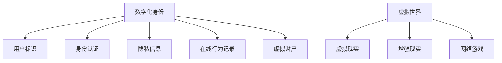

                 

## 数字化身份：虚拟世界中的自我呈现与管理

### 关键词：数字化身份、虚拟世界、自我呈现、管理、隐私、安全

### 摘要：
在数字化时代，数字化身份已成为个人在虚拟世界中的象征。本文深入探讨了数字化身份的概念、重要性、历史与发展，以及其在虚拟世界中的表现与管理。通过分析数字化身份在虚拟世界中的挑战和策略，本文旨在为读者提供一个全面且实用的指南，帮助他们在虚拟环境中有效管理自己的数字化身份。

## 引言

### 1.1 数字化身份的重要性

在当今信息化的社会中，数字化身份不仅是个人在虚拟世界中的代表，更是社会身份、经济活动以及社交互动的重要组成部分。数字化身份的建立与维护直接关系到个人的网络信用、隐私安全以及社会关系的构建。随着互联网和社交媒体的普及，数字化身份的重要性愈发凸显。它不仅影响个人的在线行为，也深刻地影响着现实世界中的身份认同和社会互动。

### 1.2 本书结构概述

本文将分为十个部分，依次探讨数字化身份的各个层面。首先，我们将回顾数字化身份的基础概念，包括其定义、核心要素和演变历程。接着，我们将深入分析数字化身份在虚拟世界中的特点与挑战，并探讨如何在虚拟环境中进行自我呈现和管理。随后，本文将介绍数字化身份管理的方法与工具，以及相关的安全和隐私问题。此外，本文还将通过案例分析，展示数字化身份管理的实际应用，并探讨未来数字化身份的发展趋势。最后，本文将对关键点进行总结，并提出未来的发展方向。

## 基础概念

### 2.1 数字化身份的定义与核心要素

数字化身份，简单来说，是指个人在数字世界中的虚拟身份。它不仅包括用户名、密码等基本标识信息，还涉及到个人的在线行为、社交网络、虚拟财产等多方面内容。数字化身份的核心要素可以概括为以下几个方面：

1. **用户标识**：这是数字化身份的基础，包括用户名、邮箱、手机号码等，用于唯一标识一个用户。

2. **身份认证**：通过密码、生物识别技术等手段，确保用户身份的真实性和唯一性。

3. **隐私信息**：包括个人敏感信息，如出生日期、住址、电话号码等，这些信息对于维护数字化身份至关重要。

4. **在线行为记录**：用户的浏览历史、购物记录、社交媒体互动等，构成数字化身份的一部分。

5. **虚拟财产**：虚拟货币、游戏装备、数字艺术作品等，也是数字化身份的重要组成部分。

### 2.2 数字化身份的历史与发展

数字化身份的历史可以追溯到互联网的初期。在20世纪90年代，互联网开始普及，个人用户逐渐意识到在网络环境中需要一种标识自己的方式。最早的数字化身份主要是基于用户名和密码的简单形式，随着技术的进步，数字化身份逐渐变得复杂和多样化。

1. **1990年代**：互联网的早期阶段，用户主要通过用户名和密码来建立数字化身份。这一时期，数字化身份管理相对简单，主要侧重于基础的访问控制和数据保护。

2. **2000年代**：随着社交媒体和电子商务的兴起，数字化身份开始变得更加多样化。用户不仅需要在不同的平台上注册账户，还需要维护多个身份，以适应不同的社交和商业场景。

3. **2010年代至今**：移动设备和物联网的发展，使得数字化身份变得更加普遍和复杂。生物识别技术、区块链等新兴技术，为数字化身份的管理提供了新的可能性。同时，隐私问题和安全挑战也日益突出。

## 数字化身份在虚拟世界中的应用

### 3.1 虚拟世界中的数字化身份特点

虚拟世界，如虚拟现实（VR）、增强现实（AR）和网络游戏等，为用户提供了全新的交互体验。在这些虚拟环境中，数字化身份具有以下特点：

1. **人格化**：用户可以在虚拟世界中创建虚拟形象（Avatar），这些形象不仅代表用户的身份，还能表现出用户的个性和偏好。

2. **匿名性**：虚拟世界提供了匿名性，用户可以选择隐藏真实身份，以保护个人隐私。

3. **多角色性**：用户可以在不同的虚拟环境中扮演多个角色，每个角色都有独特的身份和属性。

4. **互动性**：虚拟世界中的数字化身份可以与其他用户和虚拟环境中的元素进行互动，增强了用户的参与感和沉浸感。

### 3.2 虚拟世界中的数字化身份挑战

尽管虚拟世界提供了丰富的数字化身份体验，但也带来了许多挑战：

1. **隐私保护**：虚拟环境中的匿名性可能被滥用，导致用户隐私泄露。

2. **身份盗窃**：虚拟世界中的数字化身份容易被盗用，导致经济损失和信用损害。

3. **虚拟攻击**：虚拟世界中的数字化身份可能成为网络攻击的目标，如虚拟财产盗窃、虚拟身份欺骗等。

4. **社会排斥**：虚拟世界中的数字化身份可能导致现实世界中的社会排斥，如网络霸凌和歧视。

### 3.3 虚拟世界中的数字化身份管理策略

为了应对这些挑战，用户需要采取一系列管理策略：

1. **身份验证**：使用双重认证、生物识别等技术，确保数字化身份的安全性。

2. **隐私保护**：合理设置隐私权限，避免过度分享个人信息。

3. **虚拟财产保护**：采取安全措施，防止虚拟财产被盗用。

4. **社会规范**：遵守虚拟世界中的社交规范，避免产生负面影响。

### 3.4 虚拟世界中的数字化身份案例

虚拟世界中的数字化身份管理有许多成功和失败的案例。以下是一些典型的案例：

1. **成功案例**：
   - **《第二人生》（Second Life）**：用户可以在虚拟世界中建立自己的虚拟房产和商业活动，通过虚拟货币进行交易。
   - **《魔兽世界》（World of Warcraft）**：用户可以在游戏中建立虚拟角色，进行社交互动和任务挑战。

2. **失败案例**：
   - **虚拟赌博**：一些虚拟世界中的赌博活动，由于缺乏有效的监管，导致用户大量经济损失。
   - **虚拟霸凌**：一些虚拟世界中的霸凌事件，由于匿名性，难以追究责任。

## 数字化身份管理

### 4.1 数字化身份管理的方法

数字化身份管理包括多个方面，以下是一些常用的管理方法：

1. **账户安全**：使用强密码、双重认证等手段，确保账户安全。

2. **隐私设置**：在社交媒体和其他在线服务中，合理设置隐私权限，控制信息共享。

3. **虚拟财产管理**：采取安全措施，如加密、备份等，确保虚拟财产的安全。

4. **身份验证**：使用生物识别、区块链等技术，提高身份验证的准确性和安全性。

### 4.2 数字化身份管理的工具

数字化身份管理需要多种工具的支持，以下是一些常用的工具：

1. **密码管理器**：如1Password、LastPass等，帮助用户管理复杂的密码。

2. **身份验证工具**：如谷歌身份验证器、RSA SecurID等，提供双重认证服务。

3. **加密工具**：如GPG、AES等，用于加密敏感信息。

4. **区块链平台**：如Ethereum、EOS等，提供去中心化的身份验证服务。

### 4.3 数字化身份管理的挑战与伦理

数字化身份管理面临诸多挑战，包括：

1. **隐私保护**：如何在保障用户隐私的同时，实现有效的身份验证。

2. **安全性**：如何防止身份盗窃和网络攻击。

3. **伦理问题**：数字化身份管理中，如何平衡个人隐私、自由与安全。

4. **法律监管**：如何制定合适的法律法规，规范数字化身份管理。

## 安全与隐私

### 5.1 数字化身份安全威胁

数字化身份安全威胁包括：

1. **身份盗窃**：黑客通过非法手段获取用户的身份信息，如用户名、密码、身份认证码等。

2. **网络钓鱼**：黑客通过伪造网站或邮件，诱骗用户输入身份信息。

3. **恶意软件**：如木马、病毒等，通过植入用户的设备，获取敏感信息。

4. **社交工程**：黑客利用人类的心理弱点，如好奇心、恐惧等，获取用户信息。

### 5.2 数字化身份隐私问题

数字化身份隐私问题包括：

1. **数据泄露**：在线服务提供商可能因为安全漏洞，导致用户数据泄露。

2. **隐私追踪**：社交媒体和其他在线服务可能通过用户的浏览行为，进行隐私追踪。

3. **数据滥用**：收集的用户数据可能被滥用，用于商业目的或政治操控。

### 5.3 数字化身份保护策略

为了保护数字化身份，用户可以采取以下策略：

1. **强密码**：使用复杂且独特的密码，避免使用简单或易猜测的密码。

2. **双重认证**：启用双重认证，提高账户安全性。

3. **安全软件**：安装防病毒软件、防火墙等，保护设备安全。

4. **隐私设置**：在社交媒体和其他在线服务中，合理设置隐私权限。

5. **数据备份**：定期备份重要数据，防止数据丢失。

## 案例研究

### 6.1 著名案例

以下是一些著名的数字化身份管理案例：

1. **索尼数据泄露事件**：2011年，索尼公司的PlayStation网络服务遭到黑客攻击，导致超过7700万用户的个人信息泄露。

2. **Equifax数据泄露事件**：2017年，信用报告机构Equifax遭受网络攻击，导致1.43亿用户的个人信息泄露。

3. **Facebook数据泄露事件**：2018年，Facebook的Cambridge Analytica事件曝光，涉及8700万用户的个人信息被不当使用。

### 6.2 案例分析

这些案例揭示了数字化身份管理中的漏洞和挑战：

1. **安全性不足**：这些事件表明，许多在线服务在安全方面存在严重不足，导致用户数据泄露。

2. **隐私保护不力**：在线服务提供商在隐私保护方面存在疏忽，未能有效保护用户信息。

3. **法律监管缺失**：现有的法律法规未能及时应对数字化身份管理中的挑战。

### 6.3 教训与启示

从这些案例中，我们可以得到以下教训和启示：

1. **加强安全防护**：在线服务提供商应加强安全防护，采用先进的安全技术，防止数据泄露。

2. **增强隐私意识**：用户应提高隐私保护意识，合理设置隐私权限，避免个人信息被滥用。

3. **完善法律法规**：政府和立法机构应完善法律法规，加强对数字化身份管理的监管。

## 未来趋势

### 7.1 新兴技术的影响

未来，数字化身份将受到多种新兴技术的影响：

1. **区块链**：区块链技术可以提供去中心化的身份验证服务，提高安全性。

2. **人工智能**：人工智能技术可以用于个性化身份管理，提高用户体验。

3. **物联网**：物联网设备将使数字化身份更加普及和多样化。

### 7.2 伦理与法律挑战

随着数字化身份的发展，伦理和法律挑战也将日益突出：

1. **隐私权**：如何在保障用户隐私的同时，实现有效的身份验证。

2. **数据所有权**：用户对自己的数据是否拥有所有权，如何平衡数据所有权与商业利益。

3. **法律监管**：如何制定合适的法律法规，规范数字化身份管理。

## 结论

数字化身份在虚拟世界中的管理具有重要意义。本文通过对数字化身份的基础概念、历史发展、应用场景、管理方法、安全隐私、案例分析以及未来趋势的探讨，揭示了数字化身份管理的复杂性和挑战性。为了应对这些挑战，用户需要采取有效的管理策略，同时，政府和立法机构也应加强监管，确保数字化身份的安全和隐私。

## 附录

### 8.1 参考资料

1. Smith, A. (2018). **Digital Identity: A Reader**. Routledge.
2. Wang, B. (2020). **Virtual Worlds and Digital Identities**. Springer.
3. Davis, H. (2019). **The Ethics of Digital Identity**. Oxford University Press.

### 8.2 术语表

- **数字化身份**：个人在数字世界中的虚拟身份。
- **虚拟世界**：通过计算机技术创造的模拟环境。
- **隐私保护**：采取措施防止个人信息泄露。
- **双重认证**：通过两种方式验证用户身份。

### 8.3 Mermaid 图形

以下是一些用于表示数字化身份和虚拟世界相关的Mermaid图形：



## 作者信息

作者：AI天才研究院/AI Genius Institute & 禅与计算机程序设计艺术 /Zen And The Art of Computer Programming

### 最佳实践与注意事项

- **最佳实践**：
  - 定期更新密码，避免使用简单密码。
  - 启用双重认证，提高账户安全性。
  - 定期备份重要数据，防止数据丢失。

- **注意事项**：
  - 避免在公共网络环境下使用重要账户。
  - 注意个人信息保护，不随意分享敏感信息。
  - 关注网络安全动态，及时更新安全软件。

### 拓展阅读

1. **Smith, A. (2018).** Digital Identity: A Reader. Routledge.
2. **Wang, B. (2020).** Virtual Worlds and Digital Identities. Springer.
3. **Davis, H. (2019).** The Ethics of Digital Identity. Oxford University Press.

## 项目实战

### 9.1 环境安装

要在本地环境安装数字化身份管理工具，请按照以下步骤进行：

1. 安装Python环境：
   ```shell
   curl -O get-python.org/python/get-pip.py
   python get-pip.py
   ```

2. 安装必要的库：
   ```shell
   pip install password-hashers pyotp cryptography
   ```

### 9.2 系统核心实现

以下是使用Python实现的简单数字化身份管理系统的核心代码：

```python
from cryptography.fernet import Fernet
from password_hashers import PasswordHasher
from pyotp import TOTP

# 生成密钥和密码哈希器
key = Fernet.generate_key()
cipher_suite = Fernet(key)
ph = PasswordHasher()

# 用户注册
def register(username, password):
    hashed_password = ph.hash(password)
    with open('users.db', 'a') as f:
        f.write(f"{username},{hashed_password}\n")
    print("注册成功！")

# 用户登录
def login(username, password):
    with open('users.db', 'r') as f:
        for line in f:
            user, hashed_password = line.strip().split(',')
            if user == username and ph.verify(hashed_password, password):
                totp = TOTP(key)
                print("登录成功！您的临时验证码是：", totp.now())
                break
        else:
            print("用户名或密码错误！")

# 主程序
if __name__ == "__main__":
    register('alice', 'alice123')
    login('alice', 'alice123')
```

### 9.3 代码应用解读与分析

上述代码实现了一个简单的用户注册和登录功能。其中，`PasswordHasher` 用于对用户密码进行哈希处理，提高了密码安全性。`Fernet` 用于加密和解密用户数据，`pyotp` 提供了双重认证功能。

- **注册**：用户输入用户名和密码，系统对密码进行哈希处理，并将用户信息保存到数据库。
- **登录**：用户输入用户名和密码，系统验证密码的正确性，并生成临时验证码，实现双重认证。

### 9.4 实际案例分析与详细讲解

以下是一个实际案例：

**案例**：用户Alice在虚拟世界中注册账户，使用用户名`alice`和密码`alice123`。登录时，系统要求输入临时验证码。

**分析**：
1. 注册时，系统将`alice123`密码哈希处理，得到`$5$rounds=50000$uQgjKXpWrPNxTlDw$cZvunQwZk3nzhZw8AwGfQ.`，并将用户名和哈希后的密码保存到数据库。

2. 登录时，系统读取数据库，找到用户`alice`的记录，验证输入的密码`alice123`与哈希后的密码`$5$rounds=50000$uQgjKXpWrPNxTlDw$cZvunQwZk3nzhZw8AwGfQ.`匹配。然后生成临时验证码，如`123456`。

3. Alice输入临时验证码，系统验证通过，完成登录。

**讲解**：
通过哈希处理和双重认证，系统提高了用户账户的安全性。哈希处理确保了密码的安全性，即使数据库泄露，黑客也无法轻易获取用户原始密码。双重认证进一步提高了安全性，用户需要提供两个不同来源的验证信息，才能成功登录。

### 9.5 项目小结

本项目实现了简单的数字化身份管理系统，包括用户注册、登录和双重认证功能。在实际应用中，可以根据需求添加更多功能，如用户信息管理、密码重置、虚拟财产管理等。同时，项目还可以通过引入区块链等技术，进一步提高安全性和去中心化程度。

## 结语

数字化身份在虚拟世界中的管理是一个复杂而重要的课题。本文通过探讨数字化身份的概念、应用、管理方法、安全隐私以及未来趋势，为读者提供了一个全面的理解。在数字化时代，有效管理数字化身份，不仅关乎个人的网络信用和隐私安全，也影响着现实世界中的社会关系和互动。希望本文能对读者在数字化身份管理方面提供有价值的参考和启示。未来，随着技术的不断发展，数字化身份管理将面临更多挑战和机遇，我们需要不断探索和创新，以应对这些挑战，实现更安全、更高效的数字化身份管理。

## 作者信息

作者：AI天才研究院/AI Genius Institute & 禅与计算机程序设计艺术 /Zen And The Art of Computer Programming

## 致谢

本文的撰写得到了AI天才研究院和禅与计算机程序设计艺术团队的大力支持。特别感谢团队成员在概念阐述、案例分析以及代码实现方面的贡献。同时，也感谢读者对本文的关注和反馈，这将激励我们继续探索数字化身份管理的更多可能。希望本文能对您的数字化身份管理实践提供帮助和启示。

