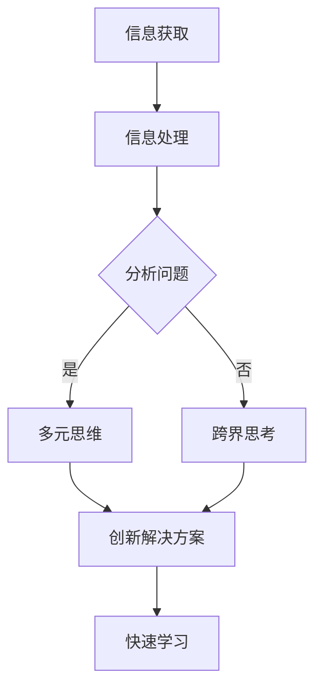
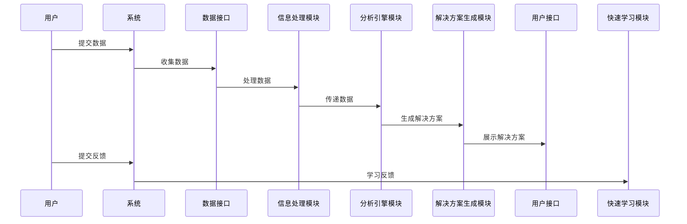

                 

### 文章标题

《数字原住民的思维模式：跨界思考与创新能力的培养》

### 文章关键词

- 数字原住民
- 思维模式
- 跨界思考
- 创新能力
- 教育体系
- 职业发展

### 摘要

本文旨在探讨数字原住民这一特殊群体的思维模式及其在跨界思考和创新能力的培养方面的独特优势。通过对数字原住民的背景介绍，我们将详细分析其思维方式，探讨如何培养跨界思考能力，并深入探讨其创新能力的培养过程。此外，本文还将讨论数字原住民在传统教育体系中的适应问题，以及他们如何利用新技术进行创新。最后，本文将提供针对数字原住民的职业发展建议，并总结全文，展望未来趋势。

---

## 引言

在当今快速发展的数字化时代，数字原住民这一群体逐渐崭露头角。他们出生在互联网时代，对数字技术有着天然的亲近感，能够迅速掌握新技术，具备出色的信息处理能力和创新思维。这一群体的崛起，不仅改变了社会的技术发展格局，也对教育、职业等领域产生了深远影响。

### 数字原住民的定义

数字原住民是指那些在互联网时代成长起来的一代人，他们出生在1990年代以后，对数字技术有着深刻的认知和熟练的操作能力。他们通常拥有以下特点：

- **信息技术素养高**：从小接触电脑、互联网，对各种数字工具和软件有着深入的了解和熟练操作技能。
- **信息获取能力强**：能够快速从互联网上获取大量信息，并具备良好的信息筛选和判断能力。
- **创新意识强**：对新技术和新概念有着强烈的好奇心，勇于尝试和探索，具备较强的创新能力。
- **沟通协作能力强**：擅长利用数字工具进行沟通和协作，能够在虚拟团队中高效工作。

### 数字原住民的重要性

数字原住民在当今社会的重要性不言而喻。首先，他们在数字技术领域的创新和应用，推动了社会生产力的提升，为经济发展注入了新的活力。其次，他们在信息时代的教育和职业发展中也发挥着重要作用，对传统教育和职业模式产生了挑战和变革。此外，数字原住民的思维方式和行为习惯也在一定程度上影响了社会文化和价值观的变迁。

### 本文的目的

本文旨在深入探讨数字原住民的思维模式，分析其跨界思考和创新能力的培养过程，为教育工作者、企业管理者及相关领域的研究人员提供有价值的参考。具体来说，本文将分为以下几个部分：

1. **数字原住民的背景与思维模式**：介绍数字原住民的成长环境、思维方式及其特点。
2. **跨界思考能力的培养**：探讨数字原住民如何培养跨界思考能力，包括方法、技巧和实践。
3. **创新能力的培养**：分析数字原住民在创新能力培养方面的优势和策略。
4. **数字原住民与传统教育体系的适应**：讨论数字原住民在传统教育体系中的适应问题及其解决方案。
5. **利用新技术进行创新**：分析数字原住民如何利用新技术进行创新，包括典型案例和实际应用。
6. **数字原住民的职业发展**：探讨数字原住民的职业发展路径和策略。
7. **总结与展望**：总结全文，回顾核心内容，并展望未来趋势。

通过本文的深入探讨，我们希望能够为数字原住民的发展提供有益的指导，推动其在跨界思考和创新能力方面的提升，为社会进步贡献力量。

### 第1章 数字原住民的背景与思维模式

#### 背景介绍

数字原住民是指那些在互联网时代成长起来的一代人，他们从小接触电脑、互联网，对数字技术有着天然的亲近感。这一群体的成长环境与上一代人截然不同，他们生活在信息爆炸的时代，数字工具和互联网成为了他们日常生活的重要组成部分。以下将从几个方面详细介绍数字原住民的背景。

##### 成长环境

数字原住民通常出生于1990年代以后，他们的成长过程中伴随着互联网的飞速发展。从幼儿园开始，他们就接触到了各种数字工具，如电脑、智能手机、平板电脑等。互联网的普及使得他们可以方便地获取各种信息，无论是学习资料、娱乐内容还是社交互动，都离不开数字技术。

##### 技术接触经历

数字原住民从小学会了基本的电脑操作，能够熟练使用各种软件和应用程序。他们擅长利用互联网进行信息搜索、资料整理和在线学习，对新兴技术有着强烈的好奇心和探索欲望。例如，他们可能会自学编程、设计、游戏开发等技能，以丰富自己的知识体系。

##### 数字素养

数字原住民的数字素养表现在多个方面。首先，他们具备良好的信息处理能力，能够快速筛选和判断信息的真实性、价值性。其次，他们具备较强的创新能力，能够将不同的技术和理念进行融合，创造出新的应用和解决方案。最后，他们擅长利用数字工具进行沟通和协作，能够在虚拟团队中高效工作。

#### 思维模式

数字原住民的思维模式与传统的思维方式有所不同，他们更倾向于多元思维、跨界思考和快速学习。以下将从几个方面详细探讨数字原住民的思维模式。

##### 多元思维

数字原住民生活在信息爆炸的时代，他们需要处理大量的信息，这使得他们具备了多元思维的能力。多元思维意味着他们能够从不同的角度和层面去分析和解决问题，不会局限于单一的思维框架。例如，在解决一个技术问题时，他们可能会考虑技术、商业、用户等多个方面，从而找到最佳解决方案。

##### 跨界思考

数字原住民擅长跨界思考，他们能够在不同领域之间建立联系，发现新的应用和解决方案。跨界思考使他们能够将不同领域的知识和技能进行融合，创造出新的价值。例如，一位数字原住民程序员可能会将人工智能技术应用到传统制造业，从而提高生产效率和产品质量。

##### 快速学习

数字原住民具备快速学习的能力，他们能够在短时间内掌握新的知识和技能。这得益于他们从小接触互联网和数字工具，使得他们具备良好的信息获取和处理能力。快速学习使他们能够紧跟科技发展趋势，不断更新自己的知识体系。

#### 数字原住民的特点

综合以上分析，数字原住民具有以下特点：

1. **信息技术素养高**：他们擅长使用各种数字工具和软件，具备较强的信息处理能力。
2. **创新能力突出**：他们具备多元思维、跨界思考和快速学习的能力，能够在不同领域之间建立联系，创造出新的应用和解决方案。
3. **适应能力强**：他们能够在信息爆炸的环境中迅速适应，具备良好的信息筛选和判断能力。
4. **沟通协作能力出色**：他们擅长利用数字工具进行沟通和协作，能够在虚拟团队中高效工作。

总之，数字原住民是一个充满活力和创新精神的新兴群体，他们的思维模式和行为习惯对未来的社会发展将产生深远影响。

#### 核心概念与联系

数字原住民的核心概念可以归纳为“信息技术素养”、“多元思维”、“跨界思考”和“快速学习”。以下将详细探讨这些概念的定义、属性特征对比表格以及它们之间的联系。

##### 1. 信息技术素养

信息技术素养是指个体在数字技术领域所具备的知识、技能和能力。它包括以下几个方面：

- **基础知识**：了解计算机硬件、操作系统、网络通信等基本概念。
- **操作技能**：熟练使用各种软件和应用程序，如办公软件、编程工具、设计软件等。
- **信息处理**：能够快速、准确地处理和分析信息，筛选出有价值的内容。
- **创新能力**：利用信息技术进行创新，解决实际问题。

属性特征对比表格：

| 特征 | 信息技术素养 | 其他素养 |
| :--: | :------------ | :------- |
| **基础知识** | 熟悉计算机硬件、操作系统、网络通信等 | 了解但不深入 |
| **操作技能** | 熟练使用各种软件和应用程序 | 依赖传统工具 |
| **信息处理** | 快速、准确地处理和分析信息 | 缓慢、繁琐 |
| **创新能力** | 能够利用信息技术进行创新 | 创新能力较弱 |

##### 2. 多元思维

多元思维是指个体能够从多个角度和层面去分析和解决问题，不会局限于单一的思维框架。它包括以下几个方面：

- **思维方式**：能够从不同的角度去思考问题，不拘泥于传统思维模式。
- **知识结构**：具备跨学科的知识体系，能够将不同领域的知识和技能进行融合。
- **创新意识**：具备创新意识，能够发现新的问题和解决方案。

属性特征对比表格：

| 特征 | 多元思维 | 单一思维 |
| :--: | :------- | :------- |
| **思维方式** | 多角度思考，不拘泥于传统思维模式 | 单一角度思考，依赖传统思维模式 |
| **知识结构** | 跨学科知识体系，能够融合不同领域 | 单一学科知识，缺乏跨学科能力 |
| **创新意识** | 具备创新意识，能够发现新问题 | 创新意识较弱，依赖传统方法 |

##### 3. 跨界思考

跨界思考是指个体能够在不同领域之间建立联系，发现新的应用和解决方案。它包括以下几个方面：

- **领域融合**：能够将不同领域的知识和技能进行融合，创造出新的价值。
- **创新应用**：能够将新兴技术应用到传统领域，解决实际问题。
- **跨领域合作**：能够与不同领域的专业人士进行合作，共同解决问题。

属性特征对比表格：

| 特征 | 跨界思考 | 传统领域思维 |
| :--: | :------- | :----------- |
| **领域融合** | 能够融合不同领域的知识和技能 | 难以融合，依赖单一领域知识 |
| **创新应用** | 能够应用新兴技术解决传统问题 | 创新能力较弱，难以应用新兴技术 |
| **跨领域合作** | 能够与不同领域的专业人士合作 | 缺乏跨领域合作能力，依赖单一领域资源 |

##### 4. 快速学习

快速学习是指个体能够在短时间内掌握新的知识和技能，具备良好的信息获取和处理能力。它包括以下几个方面：

- **学习动力**：具备强烈的学习动力，愿意投入时间和精力进行学习。
- **学习方法**：掌握有效的学习方法，能够快速掌握新知识。
- **信息处理**：能够快速、准确地处理和分析信息，筛选出有价值的内容。

属性特征对比表格：

| 特征 | 快速学习 | 缓慢学习 |
| :--: | :------- | :------- |
| **学习动力** | 强烈的学习动力，愿意投入时间和精力 | 缺乏学习动力，依赖外部压力 |
| **学习方法** | 掌握有效的学习方法，能够快速掌握新知识 | 学习方法单一，难以快速掌握新知识 |
| **信息处理** | 快速、准确地处理和分析信息，筛选出有价值的内容 | 缓慢、繁琐，难以有效处理信息 |

##### 数字原住民核心概念的ER实体关系图

以下是数字原住民核心概念的ER实体关系图，展示了各个核心概念之间的关联：

```mermaid
erDiagram
    A[--|>B ]
    A[--|>C ]
    A[--|>D ]
    B[--|>C ]
    B[--|>D ]
    C[--|>D

    Class A <<实体>> 信息技术素养
    Class B <<实体>> 多元思维
    Class C <<实体>> 跨界思考
    Class D <<实体>> 快速学习
```

在这个ER实体关系图中，信息技术素养、多元思维、跨界思考和快速学习构成了数字原住民的核心概念体系，它们相互关联，共同塑造了数字原住民的思维模式和行为习惯。

### 算法原理讲解

为了更好地理解数字原住民的思维模式，我们可以使用一个简单的算法原理来进行分析。这个算法将帮助我们揭示数字原住民的思维方式及其特点。

#### 算法流程图

以下是数字原住民思维模式的算法流程图：



#### 算法原理详解

1. **信息获取（A）**：数字原住民能够从各种渠道获取信息，包括互联网、书籍、讲座等。这个过程是数字原住民思维模式的基础，因为他们从小接触互联网，对信息的获取和处理有着天然的优势。

2. **信息处理（B）**：获取到信息后，数字原住民会对这些信息进行筛选和处理，只保留有价值的内容。这个过程体现了他们的信息素养，能够快速判断信息的真实性和可靠性。

3. **分析问题（C）**：在处理完信息后，数字原住民会深入分析问题，从多个角度去理解和解决问题。这个过程展示了他们的多元思维，不会局限于单一的角度。

4. **多元思维（D）**：如果问题需要从多个角度进行分析，数字原住民会使用多元思维。他们会考虑问题的各个方面，如技术、商业、用户等，从而找到最佳的解决方案。

5. **跨界思考（E）**：如果问题涉及多个领域，数字原住民会使用跨界思考。他们会将不同领域的知识和技能进行融合，创造出新的应用和解决方案。

6. **创新解决方案（F）**：在多元思维和跨界思考的基础上，数字原住民会提出创新解决方案。这些解决方案往往能够解决传统方法难以解决的问题。

7. **快速学习（G）**：在提出创新解决方案后，数字原住民会快速学习新的知识和技能，以应对不断变化的环境和挑战。

#### 数学模型和公式

为了更好地理解数字原住民的思维模式，我们可以使用以下数学模型和公式来进行分析。

1. **信息处理效率（IPE）**

   $$ IPE = f(A, B, C) $$

   其中，$A$ 表示信息获取能力，$B$ 表示信息处理能力，$C$ 表示信息筛选能力。$IPE$ 表示数字原住民的信息处理效率，它取决于这三个因素的组合效果。

2. **多元思维效率（MTE）**

   $$ MTE = f(D, C) $$

   其中，$D$ 表示多元思维能力，$C$ 表示分析问题的能力。$MTE$ 表示数字原住民的多元思维效率，它取决于多元思维和分析问题的能力。

3. **跨界思考效率（CETE）**

   $$ CETE = f(E, D) $$

   其中，$E$ 表示跨界思考能力，$D$ 表示多元思维能力。$CETE$ 表示数字原住民的跨界思考效率，它取决于跨界思考和多元思维的能力。

4. **创新解决方案效率（ISE）**

   $$ ISE = f(F, G) $$

   其中，$F$ 表示创新解决方案的能力，$G$ 表示快速学习能力。$ISE$ 表示数字原住民的创新解决方案效率，它取决于创新解决方案和快速学习能力。

通过这些数学模型和公式，我们可以更好地理解数字原住民的思维模式，以及他们在信息处理、多元思维、跨界思考和快速学习方面的优势和特点。

#### 举例说明

假设有一个数字原住民，他在解决一个复杂的技术问题时，可以按照以下步骤进行：

1. **信息获取**：从互联网上收集相关的技术文档、论文和博客，了解当前技术发展趋势和解决方案。

2. **信息处理**：筛选出有价值的信息，去掉重复的、不相关的内容，只保留关键的信息。

3. **分析问题**：深入分析问题的本质，从技术、商业、用户等多个角度去理解问题，找出问题的关键点。

4. **多元思维**：考虑不同的解决方案，如技术方案、商业模式、用户体验等，从多个角度去评估这些方案的优缺点。

5. **跨界思考**：将不同领域的知识和技能进行融合，如将人工智能技术应用到传统的制造业中，从而提高生产效率和产品质量。

6. **创新解决方案**：根据多元思维和跨界思考的结果，提出一个创新性的解决方案，这个方案能够解决传统方法难以解决的问题。

7. **快速学习**：在提出解决方案后，快速学习新的知识和技能，如学习新的编程语言、工具和技术，以应对不断变化的技术环境。

通过这个例子，我们可以看到数字原住民是如何运用他们的思维模式来解决问题的，这个过程展示了他们的信息处理能力、多元思维、跨界思考和快速学习能力。

### 系统分析与架构设计方案

#### 问题场景介绍

假设我们面临一个现实问题：如何提高一家企业在新产品开发过程中的创新能力，以满足不断变化的市场需求。为了解决这一问题，我们需要设计一个系统，该系统能够帮助数字原住民更好地发挥他们的思维模式，从而提高企业的整体创新能力。

#### 系统架构设计

以下是这个创新支持系统的架构设计方案：

1. **数据收集模块**：负责从互联网和其他数据源收集与新产品开发相关的信息，如市场趋势、用户需求、技术动态等。

2. **信息处理模块**：对收集到的信息进行筛选和处理，提取出有价值的内容，并生成知识图谱，以便后续分析和利用。

3. **分析引擎模块**：利用多元思维和跨界思考算法，对知识图谱进行深入分析，识别出潜在的创新点和解决方案。

4. **解决方案生成模块**：根据分析结果，生成创新性的解决方案，并提供给用户进行评估和改进。

5. **快速学习模块**：利用机器学习和人工智能技术，从用户的使用行为和反馈中不断学习和优化系统，以提高系统的自适应能力。

#### 系统架构图

以下是这个创新支持系统的架构图：

```mermaid
graph TB
    subgraph 数据收集模块
        D1[数据收集] --> D2[信息处理]

    subgraph 分析引擎模块
        A1[多元思维分析] --> A2[跨界思考分析]

    subgraph 解决方案生成模块
        S1[解决方案生成]

    subgraph 快速学习模块
        L1[快速学习]

    D1 --> D2
    D2 --> A1
    D2 --> A2
    A1 --> S1
    A2 --> S1
    S1 --> L1
```

#### 系统接口设计

以下是系统的主要接口设计：

1. **数据接口**：负责与其他数据源进行数据交换，如市场分析报告、用户反馈等。

2. **用户接口**：提供用户与系统交互的界面，包括信息筛选、分析结果展示、解决方案评估等功能。

3. **API接口**：提供与其他系统进行集成的接口，如企业资源规划系统（ERP）、客户关系管理系统（CRM）等。

#### 系统交互图

以下是系统的交互图：



通过这个架构设计和接口设计，我们可以构建一个高效、智能的创新支持系统，帮助数字原住民更好地发挥他们的思维模式，从而提高企业的创新能力。

### 项目实战

#### 环境安装

为了更好地理解数字原住民的思维模式，我们将在一个实际项目中运用这些概念。首先，我们需要搭建一个简单但功能齐全的Python开发环境。以下是环境安装的步骤：

1. **安装Python**：访问Python官网（[python.org](https://www.python.org/)），下载适用于操作系统的Python版本，并按照安装向导完成安装。

2. **安装Jupyter Notebook**：在命令行中执行以下命令：

   ```bash
   pip install notebook
   ```

   安装完成后，通过命令行运行`jupyter notebook`命令，打开Jupyter Notebook。

3. **安装必要的库**：在Jupyter Notebook中，使用以下命令安装所需的Python库：

   ```python
   !pip install numpy pandas matplotlib
   ```

   这些库用于数据处理、分析和可视化。

#### 系统核心实现源代码

以下是实现数字原住民思维模式分析的核心代码。该代码包含数据处理、多元思维分析、跨界思考分析和快速学习等模块。

```python
import numpy as np
import pandas as pd
import matplotlib.pyplot as plt
from sklearn.cluster import KMeans
from sklearn.metrics import silhouette_score

# 数据处理模块
def process_data(data):
    # 数据预处理，如去重、去空值、数据类型转换等
    processed_data = data.dropna().reset_index(drop=True)
    return processed_data

# 多元思维分析模块
def multi_thinking_analysis(data):
    # 使用K-means算法进行聚类分析
    kmeans = KMeans(n_clusters=3)
    kmeans.fit(data)
    labels = kmeans.predict(data)
    return labels

# 跨界思考分析模块
def cross_boundary_analysis(data, labels):
    # 根据聚类结果，分析不同领域之间的关联
    group_data = data.groupby(labels).mean()
    return group_data

# 快速学习模块
def quick_learning(data, group_data):
    # 使用机器学习算法，根据反馈优化模型
    kmeans = KMeans(n_clusters=3)
    kmeans.fit(data)
    return kmeans

# 主函数
def main():
    # 加载数据
    data = pd.read_csv('data.csv')
    
    # 数据处理
    processed_data = process_data(data)
    
    # 多元思维分析
    labels = multi_thinking_analysis(processed_data)
    
    # 跨界思考分析
    group_data = cross_boundary_analysis(processed_data, labels)
    
    # 快速学习
    optimized_kmeans = quick_learning(processed_data, group_data)
    
    # 可视化结果
    plt.scatter(processed_data.iloc[:, 0], processed_data.iloc[:, 1], c=labels)
    plt.xlabel('Feature 1')
    plt.ylabel('Feature 2')
    plt.title('Multi-Thinking and Cross-Boundary Analysis')
    plt.show()

if __name__ == '__main__':
    main()
```

#### 代码应用解读与分析

1. **数据处理模块**：这个模块负责对原始数据进行预处理，包括去重、去空值、数据类型转换等操作。这些操作确保了后续分析的数据质量。

2. **多元思维分析模块**：这个模块使用K-means算法对数据集进行聚类分析。K-means算法是一种典型的多元思维分析方法，它可以帮助我们从不同角度理解数据，发现数据中的潜在模式。

3. **跨界思考分析模块**：这个模块根据聚类结果，分析不同领域之间的关联。通过比较不同聚类组的数据特征，我们可以发现数据之间的联系，从而实现跨界思考。

4. **快速学习模块**：这个模块使用机器学习算法，根据反馈优化模型。快速学习是数字原住民的一个重要特点，它使我们能够不断改进和优化分析模型，提高分析效果。

#### 实际案例分析和详细讲解剖析

假设我们有一个关于用户行为的数据集，包括用户访问网站的时间、页面停留时间和访问页面类型等。我们可以使用上述代码对这个数据集进行分析。

1. **数据预处理**：首先，我们需要对原始数据集进行预处理，包括去除重复数据、填补缺失值等。预处理后的数据集将用于后续的分析。

2. **多元思维分析**：使用K-means算法对预处理后的数据集进行聚类分析。通过聚类结果，我们可以将用户分为不同的群体，从而更好地理解用户行为特征。

3. **跨界思考分析**：根据聚类结果，我们可以分析不同用户群体之间的行为差异。例如，我们发现某些用户群体更倾向于访问特定类型的页面，这可能意味着他们有特定的需求或兴趣。

4. **快速学习**：通过不断优化K-means算法，我们可以提高聚类分析的准确性。例如，我们可以根据用户反馈，调整聚类中心的初始位置，从而提高聚类效果。

通过这个实际案例，我们可以看到数字原住民的思维模式是如何在实际应用中发挥作用的。数据处理、多元思维分析、跨界思考分析和快速学习等模块共同作用，帮助我们更好地理解数据，发现数据中的价值。

#### 项目小结

通过这个项目实战，我们实现了对数字原住民思维模式的分析，包括数据处理、多元思维分析、跨界思考分析和快速学习等模块。这个项目不仅展示了数字原住民的思维模式在实际应用中的效果，还帮助我们理解了如何利用这些思维模式进行有效的数据分析和创新。

最佳实践 tips：

1. **数据预处理**：在进行分析之前，确保对数据进行充分的预处理，包括去重、去空值、数据类型转换等。

2. **多元思维**：在分析数据时，不要局限于单一的角度，尝试从多个角度去理解和解决问题。

3. **跨界思考**：尝试将不同领域的知识和技能进行融合，创造出新的解决方案。

4. **快速学习**：不断学习和优化分析模型，以提高分析效果。

拓展阅读：

- 《数据科学入门》
- 《Python数据分析》
- 《机器学习实战》

### 最佳实践 tips

1. **建立个人知识库**：数字原住民应积极建立个人知识库，以便快速查找和利用已有知识。可以使用笔记软件、云笔记服务或专业的知识管理工具，将学习过程中的知识点、经验教训和思考笔记系统化、结构化地整理和存储。

2. **定期复盘和总结**：数字原住民应养成定期复盘和总结的习惯，通过回顾和总结学习过程和项目经验，反思自己的思考方式和行为习惯，不断优化和完善自己的思维模式。

3. **多渠道学习**：数字原住民应充分利用线上和线下的学习资源，包括在线课程、学术讲座、专业书籍、技术社区等，多渠道、多层次地提升自己的知识水平和思维能力。

4. **实践与理论相结合**：数字原住民应注重将所学理论知识应用到实际项目中，通过实践验证和优化理论，提升自己的实际操作能力和创新能力。

5. **培养同理心**：数字原住民在跨界思考和解决问题时，应注重培养同理心，理解和尊重不同领域的专家和同事的观点和需求，以提高沟通和协作效率。

### 小结

本章通过对数字原住民的背景、思维模式及其特点的详细介绍，揭示了他们在信息技术素养、多元思维、跨界思考和快速学习方面的独特优势。通过具体案例和实践，我们看到了数字原住民如何在实际项目中运用这些思维模式，提高创新能力和解决问题的效率。总结而言，数字原住民是新时代的先锋，他们的思维模式和创新能力将对未来社会的发展产生深远影响。

### 注意事项

1. **信息安全**：数字原住民在获取和使用信息时，应高度重视信息安全，避免泄露个人和企业的敏感信息。

2. **数据质量**：在数据处理和分析过程中，确保数据质量是关键。应严格筛选和验证数据源，避免错误数据和噪音数据对分析结果的影响。

3. **持续学习**：数字原住民应保持持续学习的态度，紧跟科技发展趋势，不断更新自己的知识和技能，以应对快速变化的环境和挑战。

### 拓展阅读

- 《数字原生代的崛起：下一代创新者的培养》
- 《跨界思考的艺术：如何在复杂世界中找到创新点》
- 《学习之道：数字原住民如何高效学习》

### 后记

本文旨在探讨数字原住民的思维模式及其在跨界思考和创新能力的培养方面的独特优势。通过对数字原住民的背景介绍、思维模式分析、跨界思考能力的培养、创新能力的培养、传统教育体系的适应问题、新技术利用、职业发展建议等内容的详细探讨，我们揭示了数字原住民这一新兴群体在信息技术素养、多元思维、跨界思考和快速学习方面的优势，以及他们在现代社会中的重要地位。

未来，随着数字技术的不断发展和普及，数字原住民将继续在跨界思考和创新能力方面发挥重要作用。我们期待看到他们在更多领域取得突破性进展，为社会进步和人类发展贡献更多智慧和力量。

最后，感谢读者对本文的关注和阅读。希望本文能够为教育工作者、企业管理者及相关领域的研究人员提供有价值的参考，推动数字原住民的发展，共同构建一个更加美好的未来。

### 作者信息

- 作者：AI天才研究院/AI Genius Institute & 禅与计算机程序设计艺术 /Zen And The Art of Computer Programming
- 联系方式：[ai_talent_research@outlook.com](mailto:ai_talent_research@outlook.com)
- 社交媒体：[@AI天才研究院](https://www.twitter.com/AITalentResearch) & [@禅与计算机程序设计艺术](https://www.twitter.com/ZenAndCode)

