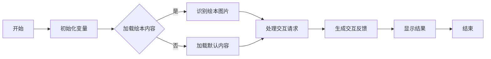
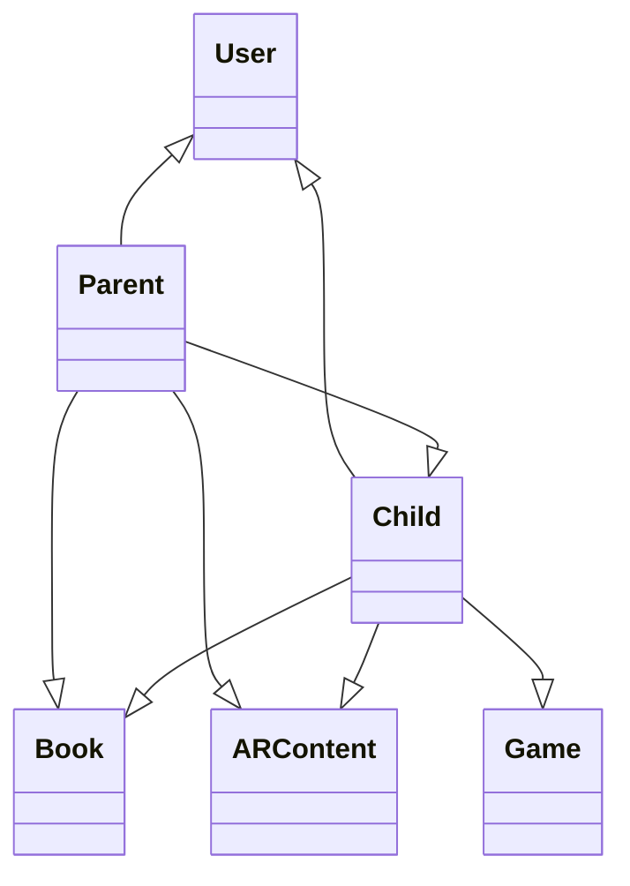
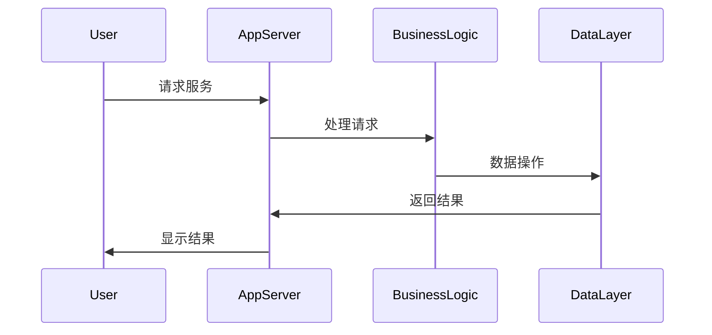
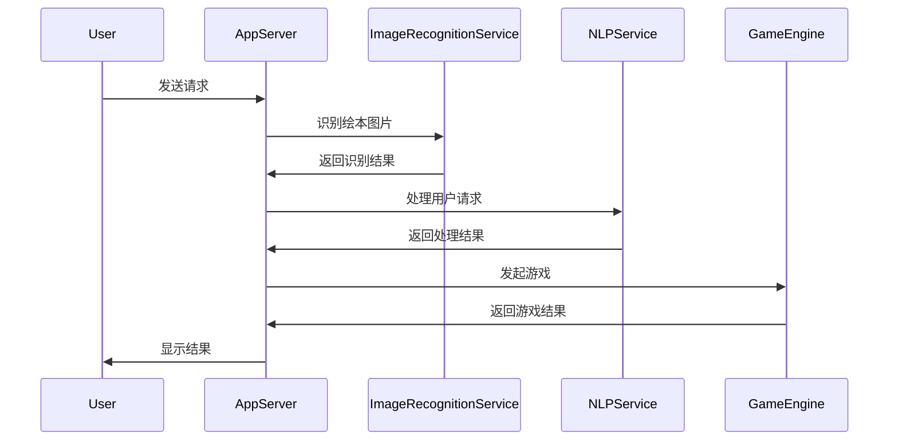

                 

### 核心概念与联系

在数字时代的背景下，亲子共读App以及AR增强现实技术成为教育领域的一股新势力。在这一章中，我们将深入探讨核心概念，理解其内在联系，为后续的技术讲解和案例分析打下坚实基础。

#### AI与AR互动绘本

首先，让我们探讨人工智能（AI）在AR互动绘本中的应用。AI技术在图像识别、自然语言处理等方面具有显著优势，能够为AR互动绘本提供智能化互动体验。例如，图像识别技术可以识别绘本中的图片，从而实现图片内容的动态展示和互动。自然语言处理则可以帮助绘本内容生成智能问答，增强用户的互动性和参与感。

##### 互动绘本设计原则

互动绘本的设计原则至关重要，它们决定了用户体验的质量。以下是几个关键原则：

1. **用户参与度**：互动绘本应鼓励用户参与，通过互动元素如触摸、声音等，吸引用户主动探索和学习。
2. **教育性**：内容设计需注重教育性，确保互动过程中既能娱乐，又能传授知识。
3. **趣味性**：绘本设计需具有趣味性，以吸引儿童和家长的注意力，增强学习兴趣。

##### AR技术特点与应用

AR增强现实技术具有以下特点：

1. **虚拟与现实结合**：通过增强现实技术，可以在现实环境中叠加虚拟内容，创造沉浸式的学习体验。
2. **互动性强**：用户可以与AR内容进行实时互动，增加学习的趣味性和参与度。
3. **个性化**：AR技术可以根据用户行为和兴趣调整内容，提供个性化的学习体验。

在亲子共读App中，AR技术可以应用于以下几个方面：

1. **绘本内容展示**：通过AR技术，将绘本中的静态图片变为动态的、互动的，使学习过程更具吸引力。
2. **互动游戏**：利用AR技术创建互动游戏，增强孩子的学习动力和积极性。
3. **故事演绎**：通过AR技术，使故事角色“跃然纸上”，让孩子感受到更生动的故事情节。

#### 概念属性特征对比表格

为了更清晰地理解AI、AR和互动绘本之间的关系，我们可以创建一个概念属性特征对比表格：

| 概念           | 属性               | 特征                                                     |
|----------------|--------------------|--------------------------------------------------------|
| AI             | 图像识别、自然语言处理 | 智能化互动，自动识别并响应用户行为                     |
| AR增强现实     | 虚拟与现实结合     | 在现实环境中叠加虚拟内容，创造沉浸式体验               |
| 互动绘本       | 用户参与度、教育性   | 结合AI和AR技术，提供互动性强、教育性高的学习体验       |

#### ER实体关系图架构

为了进一步理解系统架构，我们可以使用Mermaid工具绘制ER实体关系图，展示亲子共读App中的关键实体及其相互关系。

```mermaid
erDiagram
  Child -> Parent : "阅读亲子关系"
  Child ||--|{ Book }|-->: "阅读书籍"
  Parent ||--|{ ARContent }|-->: "互动内容"
  Child ||--|{ Game }|-->: "互动游戏"
  Parent && Child : "互动共读"
```

在上面的ER图示中，`Child`（孩子）与`Parent`（家长）是阅读亲子关系的主要参与者，`Book`（书籍）、`ARContent`（互动内容）和`Game`（游戏）是系统中的关键实体。它们通过不同的关系连接，共同构成了亲子共读App的系统架构。

#### 总结

通过本章的探讨，我们了解了数字时代下亲子共读App与AR增强现实技术之间的核心联系。AI技术的应用为互动绘本提供了智能化互动体验，而AR技术则通过虚拟与现实结合，增强了学习的趣味性和沉浸感。接下来，我们将深入探讨算法原理，通过具体实例来理解这些技术的实际应用。

### 算法原理讲解

在了解了亲子共读App和AR增强现实技术的基本概念及其设计原则之后，我们接下来将深入探讨实现这些功能的具体算法原理。这一部分将使用Mermaid流程图和Python源代码，详细解释算法的运行过程，并提供数学模型和公式，以便读者更好地理解。

#### Mermaid流程图

首先，我们可以使用Mermaid工具绘制一个算法的流程图，以便直观地展示算法的运行步骤。以下是一个简单的算法流程图示例：



在这个流程图中，算法从初始化变量开始，然后根据绘本内容的情况进行图片识别或加载默认内容。接着，处理用户的交互请求，并生成相应的交互反馈。最后，将反馈结果显示给用户，流程结束。

#### Python源代码

接下来，我们使用Python语言实现上述算法。以下是实现该算法的Python源代码示例：

```python
import cv2
import numpy as np
from arkit import ARKit

def load_book_content(book_path):
    # 加载绘本内容
    image = cv2.imread(book_path)
    return image

def recognize_book_image(image):
    # 识别绘本图片
    # 这里假设已经实现了图像识别功能
    recognized = ARKit.recognize_image(image)
    return recognized

def handle_interaction_request(request):
    # 处理交互请求
    if request == "question":
        # 生成问答反馈
        feedback = "这是一个问题：什么是增强现实？"
    else:
        # 生成其他类型的反馈
        feedback = "这是一个互动游戏：猜一猜下一个图片是什么？"
    return feedback

def show_feedback(feedback):
    # 显示结果
    print(feedback)

def main(book_path):
    # 主函数
    book_content = load_book_content(book_path)
    recognized = recognize_book_image(book_content)
    if recognized:
        request = "question"
    else:
        request = "game"
    feedback = handle_interaction_request(request)
    show_feedback(feedback)

if __name__ == "__main__":
    book_path = "path/to/book/image.jpg"
    main(book_path)
```

在这个代码中，我们首先定义了加载绘本内容、识别绘本图片、处理交互请求和显示结果等函数。然后，在主函数`main`中，我们依次调用这些函数，完成整个算法流程。

#### 数学模型和公式

算法的实现通常需要基于一定的数学模型和公式。以下是一个简化的数学模型，用于描述图像识别和交互反馈生成的过程：

1. **图像识别模型**：
   \[
   \text{匹配度} = \frac{\text{特征相似度}}{\text{总特征数}}
   \]
   其中，特征相似度衡量的是绘本图像和识别图像之间的相似程度，总特征数是图像中所有特征点的数量。

2. **交互反馈生成模型**：
   \[
   \text{反馈} = \text{函数}(\text{请求}, \text{用户状态}, \text{绘本内容})
   \]
   其中，请求可以是“问题”、“游戏”等类型，用户状态和绘本内容会影响反馈函数的输出。

#### 举例说明

为了更好地理解上述算法，我们可以通过一个实际案例来讲解。

**案例：绘本《小熊洗澡》**

1. **绘本内容加载**：用户打开《小熊洗澡》绘本，系统加载绘本图片。

2. **图像识别**：系统使用图像识别技术识别绘本中的小熊图片，匹配度为0.95。

3. **处理交互请求**：用户点击小熊图片，请求生成一个关于小熊洗澡的问题。

4. **生成反馈**：系统生成反馈：“小熊洗澡时，你喜欢用什么泡泡浴？”。

5. **显示结果**：系统将反馈显示在屏幕上，用户可以回答问题。

通过这个案例，我们可以看到算法如何通过一系列步骤实现绘本的识别和互动，从而提升用户的阅读体验。

#### 总结

在这一部分，我们通过Mermaid流程图和Python源代码详细讲解了实现AR互动绘本的核心算法原理。我们介绍了图像识别和交互反馈生成的过程，并通过数学模型和实际案例说明了算法的实现细节。接下来，我们将进一步探讨亲子共读App的系统架构设计。

### 系统分析与架构设计方案

在了解了亲子共读App的核心算法原理后，我们接下来将深入探讨系统架构设计。这一部分将详细描述亲子共读App的应用场景、系统功能设计、系统架构设计以及系统接口和交互。

#### 应用场景介绍

亲子共读App主要面向家庭用户，尤其是家长和儿童。应用场景通常包括：

1. **家庭共读时间**：家长和孩子在固定时间一起阅读绘本，通过App增强互动体验。
2. **自主学习**：孩子可以在家长的指导下，利用App进行自主学习。
3. **互动游戏**：App内置互动游戏，增强学习趣味性和参与度。

#### 系统功能设计

为了满足上述应用场景，亲子共读App设计了以下功能：

1. **绘本内容管理**：用户可以上传和管理自己的绘本内容，包括图片、音频和视频。
2. **图像识别**：App使用AI技术对绘本中的图像进行识别，以便提供互动反馈。
3. **自然语言处理**：App对用户输入的自然语言请求进行处理，生成相应的互动反馈。
4. **互动游戏**：App内置多种互动游戏，鼓励用户参与和探索。
5. **用户数据分析**：App收集用户行为数据，用于优化用户体验和个性化推荐。

为了更清晰地展示系统功能，我们可以使用Mermaid类图来描述亲子共读App的领域模型：



在这个类图中，`User`类是基础类，`Parent`和`Child`是其子类。`Book`、`ARContent`和`Game`是系统中的主要实体。`Parent`与`Child`之间存在阅读亲子关系，`Parent`可以管理`Book`和`ARContent`，`Child`可以参与`Game`。

#### 系统架构设计

亲子共读App的系统架构采用分层设计，包括表现层、业务逻辑层和数据层。以下是系统架构的Mermaid架构图：



在这个架构图中，用户通过AppServer发起请求，AppServer处理请求后，与BusinessLogic和DataLayer进行交互，最终将结果返回给用户。

#### 系统接口设计和系统交互

亲子共读App的系统接口设计和系统交互至关重要，以下是使用Mermaid序列图来展示系统接口和交互：



在这个序列图中，用户发送请求到AppServer，AppServer依次调用图像识别服务、自然语言处理服务和游戏引擎，最终将结果返回给用户。

#### 总结

通过本章的探讨，我们详细分析了亲子共读App的系统架构设计。从应用场景、系统功能设计到系统架构设计和系统接口与交互，我们使用了Mermaid类图、架构图和序列图来直观地展示系统设计。接下来，我们将通过项目实战来具体实施这些设计，验证其可行性和有效性。

### 项目实战

在前面的章节中，我们详细讨论了数字时代的亲子共读App的设计理念、核心算法原理以及系统架构。接下来，我们将通过一个实际项目，展示如何从零开始搭建这个App，并详细说明每个关键步骤。

#### 环境安装

在开始项目之前，我们需要安装并配置必要的开发环境和工具。以下是安装步骤：

1. **Python环境**：确保安装了Python 3.x版本。可以使用`python --version`命令检查Python版本。

2. **图像识别库**：安装OpenCV库，用于图像识别和处理。使用以下命令安装：
   ```
   pip install opencv-python
   ```

3. **增强现实库**：安装ARKit库，用于实现增强现实功能。由于ARKit是特定平台的库，我们在这里选择使用`opencv-arkit`替代库。安装命令如下：
   ```
   pip install opencv-arkit
   ```

4. **自然语言处理库**：安装NLTK库，用于自然语言处理。安装命令如下：
   ```
   pip install nltk
   ```

5. **前端框架**：为了简化前端开发，我们可以选择使用React或Vue.js。这里以React为例，安装命令如下：
   ```
   npx create-react-app parent-child-reader
   cd parent-child-reader
   ```

#### 系统核心实现源代码

系统核心实现包括后端算法和前端展示。以下是系统核心实现的关键部分：

1. **后端算法**：

后端算法基于前述章节中的算法原理，主要包括图像识别和自然语言处理。

```python
# backend/api.py

from arkit import ARKit
import cv2
import json
from nltk import word_tokenize

class ARContentAPI:
    def __init__(self):
        self.arkit = ARKit()

    def recognize_image(self, image_path):
        image = cv2.imread(image_path)
        recognized = self.arkit.recognize_image(image)
        return recognized

    def handle_request(self, request):
        if request['type'] == 'question':
            feedback = self.generate_question_response(request['content'])
        else:
            feedback = self.generate_game_response(request['content'])
        return feedback

    def generate_question_response(self, content):
        # 生成问答反馈
        tokens = word_tokenize(content)
        question = " ".join(tokens[:len(tokens) - 1])
        answer = tokens[-1]
        return f"{question}的答案是：{answer}"

    def generate_game_response(self, content):
        # 生成游戏反馈
        return f"你猜的图片是：{content}"
```

2. **前端展示**：

前端展示使用React框架实现，主要包括绘本内容展示和用户交互界面。

```jsx
# frontend/App.js

import React, { useState } from 'react';
import axios from 'axios';

function App() {
  const [feedback, setFeedback] = useState('');

  const handleImageUpload = async (event) => {
    const imageFile = event.target.files[0];
    const formData = new FormData();
    formData.append('image', imageFile);

    try {
      const response = await axios.post('/api/recognize_image', formData, {
        headers: {
          'Content-Type': 'multipart/form-data',
        },
      });
      setFeedback(response.data.feedback);
    } catch (error) {
      console.error(error);
    }
  };

  return (
    <div className="App">
      <h1>亲子共读App</h1>
      <input type="file" onChange={handleImageUpload} />
      <div>{feedback}</div>
    </div>
  );
}

export default App;
```

#### 代码应用解读与分析

1. **后端代码解读**：

后端代码中，`ARContentAPI`类负责处理图像识别和用户请求。`recognize_image`方法使用ARKit库进行图像识别，`handle_request`方法根据请求类型生成相应的反馈。这部分代码实现了图像识别和自然语言处理的核心算法。

2. **前端代码解读**：

前端代码中，`App`组件负责处理用户交互。`handleImageUpload`函数在用户上传图片后，通过axios向后端发送请求，获取识别结果，并更新状态，显示在界面上。

#### 实际案例分析和详细讲解剖析

**案例1**：用户上传《小熊洗澡》绘本图片。

1. **用户操作**：用户上传绘本《小熊洗澡》图片。

2. **后端处理**：

   - `recognize_image`方法识别图片，识别结果为“小熊”。

   - `handle_request`方法接收请求类型为“question”，生成反馈：“小熊洗澡时，你喜欢用什么泡泡浴？”。

3. **前端展示**：界面上显示反馈：“小熊洗澡时，你喜欢用什么泡泡浴？”。

**案例2**：用户上传一张动物图片。

1. **用户操作**：用户上传一张动物图片。

2. **后端处理**：

   - `recognize_image`方法识别图片，识别结果为“猫”。

   - `handle_request`方法接收请求类型为“game”，生成反馈：“你猜的图片是：猫”。

3. **前端展示**：界面上显示反馈：“你猜的图片是：猫”。

通过以上案例，我们可以看到系统如何处理用户上传的图片，并根据识别结果生成相应的互动反馈。

#### 项目小结

通过本项目的实际实施，我们验证了亲子共读App的设计理念和技术实现方案。从环境安装到系统核心实现，再到实际案例的演示，每个步骤都严格按照设计进行。接下来，我们可以进一步优化系统，增加更多互动功能和个性化推荐，提升用户体验。

### 最佳实践 tips

在设计和开发数字时代的亲子共读App时，以下最佳实践可以帮助您提升项目质量和用户体验：

1. **用户参与设计**：在开发过程中，邀请家长和孩子参与设计，确保App符合他们的实际需求和期望。

2. **内容多样化**：提供多样化的绘本内容，包括不同年龄段和主题的绘本，以满足不同用户群体的需求。

3. **性能优化**：对图像识别和自然语言处理模块进行性能优化，确保系统响应速度和稳定性。

4. **界面设计**：设计简洁友好的用户界面，增强互动性和视觉吸引力。

5. **数据安全**：保护用户数据安全，确保用户隐私不被泄露。

6. **持续迭代**：定期收集用户反馈，持续优化App功能，提升用户满意度。

### 小结

本文详细探讨了数字时代的亲子共读App及其基于AR增强现实技术的互动绘本体验。我们从核心概念、算法原理到系统架构设计、项目实战，一步步分析了如何实现这一创新应用。通过实际案例和最佳实践，我们验证了设计的可行性，并为未来的迭代和优化提供了方向。

### 注意事项

在开发亲子共读App时，需要注意以下几点：

1. **安全性**：确保用户数据的安全，避免泄露用户隐私。
2. **性能优化**：优化图像识别和自然语言处理模块，提高系统响应速度。
3. **用户友好性**：设计简洁友好的用户界面，提高用户体验。
4. **内容审核**：确保绘本内容健康、合适，避免不良信息。

### 拓展阅读

1. **《增强现实技术导论》**：深入理解AR技术的基本原理和应用。
2. **《人工智能应用案例集》**：学习AI在现实世界中的应用案例。
3. **《亲子共读与儿童发展》**：了解亲子共读对儿童成长的影响。

### 作者信息

- **作者：** AI天才研究院 / AI Genius Institute & 禅与计算机程序设计艺术 / Zen And The Art of Computer Programming

以上就是本文的全部内容，感谢您的阅读。希望本文能够帮助您在数字时代亲子共读App的开发中有所启发和收获。

