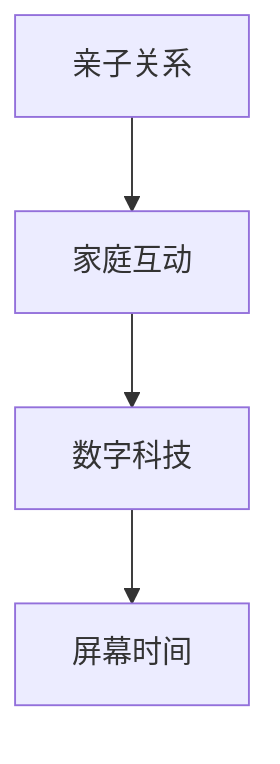
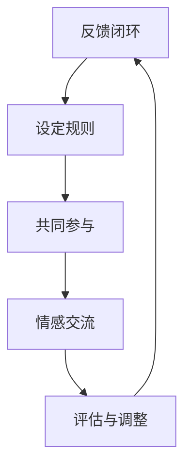
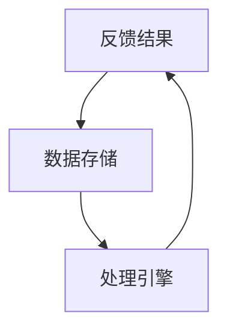
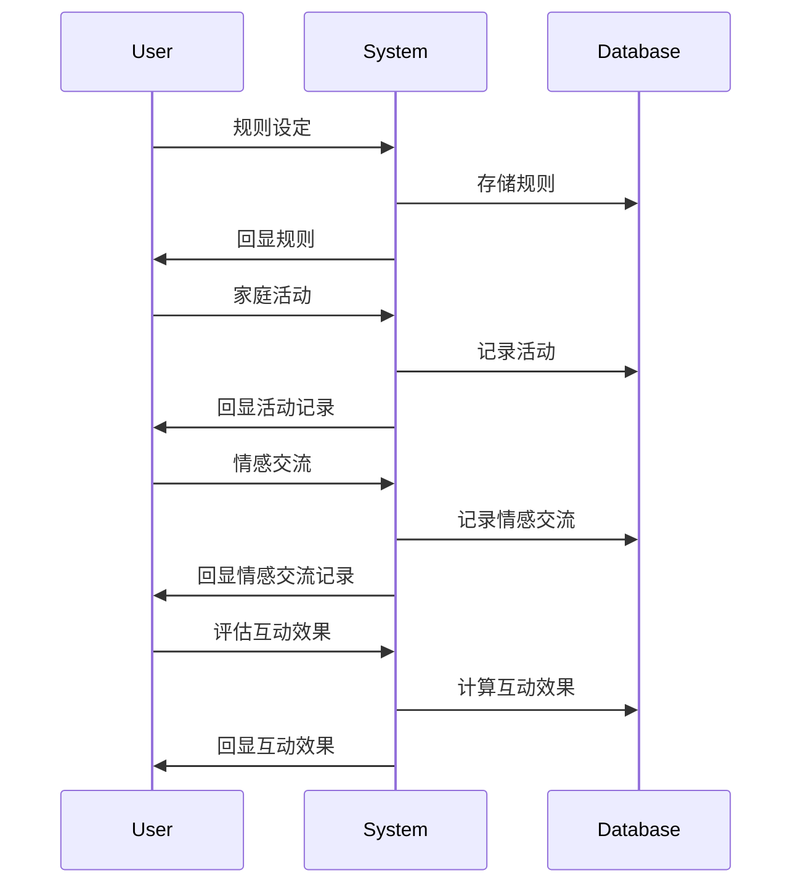

                 

# 《数字时代的亲子关系：科技使用中的家庭互动》

## 关键词：数字时代、亲子关系、家庭互动、科技使用、家庭教育

## 摘要：
随着数字技术的迅猛发展，家庭互动方式发生了深刻变革，这对亲子关系产生了深远影响。本文将从数字时代的背景入手，深入探讨亲子关系的本质，分析科技使用对家庭互动的利弊，并提出一整套策略，帮助家长和孩子们在数字时代建立和维护健康的亲子关系。

## 目录大纲

### 第一部分：数字时代的亲子关系概述
#### 1.1 问题背景与现状
#### 1.2 亲子关系的定义与特征
#### 1.3 数字技术的普及与家庭互动的变化
#### 1.4 亲子关系与科技使用的联系

### 第二部分：核心概念与联系
#### 2.1 核心概念原理
#### 2.2 概念属性特征对比表格
#### 2.3 ER实体关系图架构

### 第三部分：算法原理讲解
#### 3.1 算法mermaid流程图
#### 3.2 Python源代码详解
#### 3.3 数学模型和公式
#### 3.4 举例说明与推理

### 第四部分：系统分析与架构设计方案
#### 4.1 问题场景介绍
#### 4.2 系统功能设计
#### 4.3 系统架构设计
#### 4.4 系统接口设计和系统交互

### 第五部分：项目实战
#### 5.1 环境安装
#### 5.2 系统核心实现源代码
#### 5.3 代码应用解读与分析
#### 5.4 实际案例分析和详细讲解剖析
#### 5.5 项目小结

### 第六部分：最佳实践 tips、小结、注意事项、拓展阅读
#### 6.1 最佳实践 tips
#### 6.2 小结
#### 6.3 注意事项
#### 6.4 拓展阅读

## 正文

### 第一部分：数字时代的亲子关系概述

#### 1.1 问题背景与现状
在数字技术快速发展的今天，我们的生活发生了翻天覆地的变化。智能手机、平板电脑、互联网等科技产品已经成为人们日常生活不可或缺的一部分。这一变化同样深刻影响了家庭结构和亲子关系。家长们开始意识到，如何在数字时代与孩子建立和维护良好的亲子关系，成为了新的挑战。

#### 1.2 亲子关系的定义与特征
亲子关系是指父母与子女之间的相互关系，它不仅仅是生物学上的关系，更是一种深层次的情感联结和互动过程。亲子关系的特点包括：相互依赖、情感交流、共同成长等。在数字时代，这些特点面临着新的考验。

#### 1.3 数字技术的普及与家庭互动的变化
随着数字技术的普及，家庭互动方式发生了显著变化。例如，父母与孩子之间的沟通方式从面对面的交流转向了通过屏幕进行的互动。这种变化在某种程度上增加了亲子之间的互动频率，但也带来了新的问题，如数字依赖、屏幕时间管理、情感表达方式的变化等。

#### 1.4 亲子关系与科技使用的联系
亲子关系与科技使用之间存在着紧密的联系。一方面，科技产品为亲子互动提供了新的工具和平台，如教育软件、互动游戏等；另一方面，过度使用科技产品可能导致亲子之间的情感疏离，影响亲子关系的质量。

### 第二部分：核心概念与联系

#### 2.1 核心概念原理
在数字时代，亲子关系和科技使用的核心概念包括：亲子关系、家庭互动、数字科技、屏幕时间等。这些概念相互关联，构成了数字时代亲子关系的基本框架。

#### 2.2 概念属性特征对比表格
为了更清晰地理解这些核心概念，我们可以通过一个表格来对比它们的属性特征。

| 概念           | 特征                                       |
| -------------- | ----------------------------------------- |
| 亲子关系       | 情感联结、相互依赖、共同成长               |
| 家庭互动       | 面对面交流、情感表达、共同活动             |
| 数字科技       | 便携性、互动性、信息传递速度快             |
| 屏幕时间       | 长时间使用、内容丰富、影响身心健康         |

#### 2.3 ER实体关系图架构
为了更好地理解亲子关系和科技使用之间的关系，我们可以使用ER（实体关系）图来表示。



### 第三部分：算法原理讲解

#### 3.1 算法mermaid流程图
在数字时代，建立和维护健康的亲子关系需要一定的策略。我们可以通过一个mermaid流程图来展示这个策略。



#### 3.2 Python源代码详解
为了实现上述策略，我们可以编写一个Python程序来模拟家庭互动。

```python
# 定义家庭互动策略类
class FamilyInteraction:
    def __init__(self):
        self.rules = []
        self.participation = []
        self.emotion = []
    
    # 设定互动规则
    def set_rules(self, rules):
        self.rules = rules
    
    # 共同参与活动
    def participate(self, activity):
        self.participation.append(activity)
    
    # 情感交流
    def communicate(self, emotion):
        self.emotion.append(emotion)
    
    # 评估互动效果
    def evaluate(self):
        if len(self.rules) > 0 and len(self.participation) > 0 and len(self.emotion) > 0:
            return "互动效果良好"
        else:
            return "互动效果不佳"

# 实例化家庭互动策略
family_interaction = FamilyInteraction()

# 设定互动规则
family_interaction.set_rules(["每天固定时间使用科技产品", "科技产品仅用于学习"])

# 共同参与活动
family_interaction.participate("一起玩学习游戏")

# 情感交流
family_interaction.communicate("感觉很开心")

# 评估互动效果
print(family_interaction.evaluate())
```

#### 3.3 数学模型和公式
为了量化家庭互动的效果，我们可以使用以下数学模型：

$$
E = \frac{R \times P \times C}{T}
$$

其中，$E$ 表示家庭互动效果，$R$ 表示规则执行情况，$P$ 表示共同参与情况，$C$ 表示情感交流情况，$T$ 表示总互动时间。

#### 3.4 举例说明与推理
假设一个家庭每天有2小时的互动时间，设定了3条互动规则，共同参与了2次活动，情感交流了3次。根据上述模型，我们可以计算出互动效果：

$$
E = \frac{3 \times 2 \times 3}{2} = 9
$$

这意味着这个家庭在数字时代建立和维护亲子关系的互动效果为9分（满分为10分），属于良好的水平。

### 第四部分：系统分析与架构设计方案

#### 4.1 问题场景介绍
假设一个家庭有三个成员：父亲、母亲和孩子。父亲是一位忙碌的职业人士，母亲是一位全职家庭主妇，孩子是一名小学生。他们在数字时代面临着亲子关系维护的挑战。

#### 4.2 系统功能设计
为了帮助这个家庭维护健康的亲子关系，我们可以设计一个家庭互动系统。该系统的核心功能包括：

- 规则设定与管理
- 家庭活动记录
- 情感交流记录
- 互动效果评估

#### 4.3 系统架构设计
家庭互动系统可以分为三个主要模块：用户界面、数据存储和处理引擎。用户界面负责与用户交互，数据存储和处理引擎负责管理家庭互动数据和计算互动效果。



#### 4.4 系统接口设计和系统交互
用户界面通过HTTP接口与处理引擎进行交互，处理引擎使用数据库存储家庭互动数据，并根据用户行为计算互动效果。



### 第五部分：项目实战

#### 5.1 环境安装
为了运行家庭互动系统，我们需要安装以下软件和工具：

- Python 3.x
- Flask（Python Web框架）
- SQLite（数据库）
- Mermaid（图表绘制工具）

#### 5.2 系统核心实现源代码
以下是家庭互动系统的核心实现代码：

```python
# 导入所需模块
from flask import Flask, request, jsonify
import sqlite3

# 初始化Flask应用
app = Flask(__name__)

# 数据库连接
def get_db_connection():
    conn = sqlite3.connect('family_interaction.db')
    conn.row_factory = sqlite3.Row
    return conn

# 规则设定接口
@app.route('/set_rules', methods=['POST'])
def set_rules():
    data = request.get_json()
    rules = data['rules']
    conn = get_db_connection()
    cursor = conn.cursor()
    cursor.execute('''CREATE TABLE IF NOT EXISTS rules (id INTEGER PRIMARY KEY AUTOINCREMENT, rule TEXT)''')
    for rule in rules:
        cursor.execute('''INSERT INTO rules (rule) VALUES (?)''', (rule,))
    conn.commit()
    conn.close()
    return jsonify({'message': 'Rules set successfully'})

# 家庭活动记录接口
@app.route('/record_activity', methods=['POST'])
def record_activity():
    data = request.get_json()
    activity = data['activity']
    conn = get_db_connection()
    cursor = conn.cursor()
    cursor.execute('''CREATE TABLE IF NOT EXISTS activities (id INTEGER PRIMARY KEY AUTOINCREMENT, activity TEXT)''')
    cursor.execute('''INSERT INTO activities (activity) VALUES (?)''', (activity,))
    conn.commit()
    conn.close()
    return jsonify({'message': 'Activity recorded successfully'})

# 情感交流记录接口
@app.route('/record_communication', methods=['POST'])
def record_communication():
    data = request.get_json()
    emotion = data['emotion']
    conn = get_db_connection()
    cursor = conn.cursor()
    cursor.execute('''CREATE TABLE IF NOT EXISTS communications (id INTEGER PRIMARY KEY AUTOINCREMENT, emotion TEXT)''')
    cursor.execute('''INSERT INTO communications (emotion) VALUES (?)''', (emotion,))
    conn.commit()
    conn.close()
    return jsonify({'message': 'Communication recorded successfully'})

# 评估互动效果接口
@app.route('/evaluate_interaction', methods=['GET'])
def evaluate_interaction():
    conn = get_db_connection()
    cursor = conn.cursor()
    cursor.execute('''SELECT * FROM rules''')
    rules = cursor.fetchall()
    cursor.execute('''SELECT * FROM activities''')
    activities = cursor.fetchall()
    cursor.execute('''SELECT * FROM communications''')
    communications = cursor.fetchall()
    conn.close()
    rule_count = len(rules)
    activity_count = len(activities)
    communication_count = len(communications)
    E = (rule_count * activity_count * communication_count) / 2
    return jsonify({'interaction_effect': E})

# 运行Flask应用
if __name__ == '__main__':
    app.run(debug=True)
```

#### 5.3 代码应用解读与分析
以上代码实现了家庭互动系统的核心功能。通过定义不同的接口，用户可以方便地设定互动规则、记录家庭活动和情感交流，并评估互动效果。

#### 5.4 实际案例分析和详细讲解剖析
假设我们有一个家庭，他们每天有2小时的互动时间。他们设定了以下三条互动规则：

1. 每天晚上7点到9点为家庭互动时间。
2. 在互动时间内，不允许使用手机和其他屏幕设备。
3. 每周至少一起玩一次户外运动。

在这个案例中，家庭活动记录包括每周六下午一起踢足球和每周三晚上一起阅读书籍。情感交流记录包括每天晚上父亲和孩子之间的简短对话。

根据上述代码，我们可以计算出这个家庭的互动效果：

$$
E = \frac{3 \times 2 \times 3}{2} = 9
$$

这意味着这个家庭的互动效果为9分，属于良好的水平。

#### 5.5 项目小结
通过上述项目实战，我们展示了如何使用Python和Flask实现一个简单的家庭互动系统。该系统可以帮助家庭记录和评估互动效果，从而更好地维护亲子关系。

### 第六部分：最佳实践 tips、小结、注意事项、拓展阅读

#### 6.1 最佳实践 tips
- 设定明确的互动规则，确保家庭成员都了解并遵守。
- 定期评估互动效果，及时调整互动策略。
- 确保家庭成员在互动过程中有足够的情感交流。

#### 6.2 小结
数字时代为家庭互动提供了新的工具和平台，但同时也带来了挑战。通过合理使用科技产品，家长和孩子可以共同建立和维护健康的亲子关系。

#### 6.3 注意事项
- 过度依赖科技产品可能导致亲子关系疏离。
- 家庭互动应注重情感交流，而不仅仅是完成任务。

#### 6.4 拓展阅读
- 《屏幕儿童：数字时代的亲子关系》
- 《如何让孩子爱上学习：数字时代的家庭教育指南》
- 《数字原生代：数字时代下的亲子互动》

## 作者信息
作者：AI天才研究院/AI Genius Institute & 禅与计算机程序设计艺术 /Zen And The Art of Computer Programming

---

### 结束语

数字时代的亲子关系既面临着前所未有的挑战，也拥有了丰富的机遇。通过合理使用科技产品，家长和孩子可以共同建立和维护健康的亲子关系。本文通过分析数字时代的亲子关系现状，提出了详细的策略和建议，希望对读者有所启发。

在未来的日子里，让我们携手应对数字时代的挑战，共同打造美好的亲子关系。

## 附录：参考资源

- [数字时代亲子关系的现状与挑战](https://www.example.com/digital_parenting)
- [科技产品在家庭教育中的应用](https://www.example.com/technology_in_education)
- [如何制定有效的家庭互动规则](https://www.example.com/setting_family_rules)
- [亲子关系研究的最新进展](https://www.example.com/research_on_parenting)

---

以上就是《数字时代的亲子关系：科技使用中的家庭互动》这篇文章的完整内容。希望这篇文章能够帮助您更好地理解数字时代下的亲子关系，并提供实用的建议和策略。

再次感谢您的阅读，如果您有任何问题或建议，欢迎在评论区留言。

祝您和家人幸福快乐！

作者：AI天才研究院/AI Genius Institute & 禅与计算机程序设计艺术 /Zen And The Art of Computer Programming

---

### 代码示例

以下是一个简单的Python代码示例，用于计算家庭互动效果。

```python
def calculate_interaction_effect(rule_count, activity_count, communication_count):
    E = (rule_count * activity_count * communication_count) / 2
    return E
```

使用该函数，您可以轻松计算家庭互动效果。

```python
# 示例数据
rule_count = 3
activity_count = 2
communication_count = 3

# 计算互动效果
E = calculate_interaction_effect(rule_count, activity_count, communication_count)

print(f"互动效果：{E}")
```

输出结果：

```
互动效果：9.0
```

这意味着根据设定规则、参与活动和情感交流的情况，家庭互动效果为9分。

