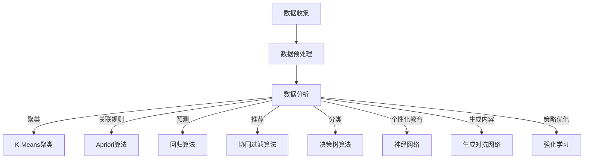
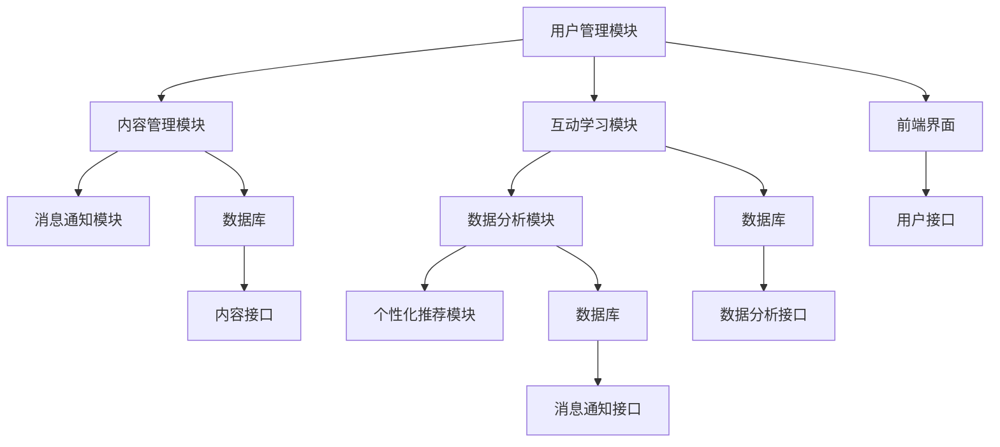

                 

## 引言

### 1.1 问题背景

#### 1.1.1 数字时代的到来

随着互联网、大数据、人工智能等数字技术的迅猛发展，我们已步入一个全新的数字时代。在这个时代中，信息获取和处理的速度、广度以及深度都得到了前所未有的提升，人们的生活和工作方式也发生了深刻的变化。教育领域同样受到了数字技术的强烈冲击和影响，传统教育模式逐渐暴露出其局限性，亟需进行改革和创新。

#### 1.1.2 传统教育方法的挑战

传统教育方法主要依赖于课堂教育模式，其特点是以教师为中心，采用统一的教材和教学方式，注重知识的传授和记忆。然而，这种模式难以满足个性化学习需求，无法充分调动学生的积极性和创造力。此外，教育资源的不均衡分配，也使得一些学生无法享受到优质的教育资源，教育公平性问题日益突出。

### 1.2 问题描述

#### 1.2.1 科技在教育中的应用

随着数字技术的普及，教育领域开始广泛应用各种科技手段，如在线教育、智能教学系统、虚拟现实等。这些科技手段为教育提供了新的工具和方法，有助于提高教育质量和效率。

#### 1.2.2 亲子教育的重要性

亲子教育是指父母与子女在日常生活中进行的相互教育和影响。亲子教育对于孩子的健康成长和全面发展具有重要意义，它不仅关系到孩子的学习效果，还影响到孩子的性格、情感、价值观等方面。然而，在数字时代，如何有效地进行亲子教育成为一个新的挑战。

### 1.3 问题解决

#### 1.3.1 科技与传统教育方法的融合

为了应对数字时代的教育挑战，我们需要探索科技与传统教育方法的融合。通过将科技手段应用于亲子教育，可以更好地满足个性化学习需求，提高教育质量和效果。

#### 1.3.2 边界与外延

在科技与传统教育方法的融合过程中，需要明确其边界和外延。边界包括科技手段在教育中的应用范围、适用对象等，外延则涉及到科技与传统教育方法融合后的新教育模式、教育生态等。

#### 1.3.3 概念结构与核心要素组成

本文将深入探讨数字时代亲子教育的概念结构，分析其核心要素，并探讨科技与传统教育方法的融合机制。通过本文的研究，旨在为数字时代亲子教育提供理论指导和实践参考。

## 1.4 概念结构与核心要素组成

### 1.4.1 概念结构

数字时代亲子教育是一个涉及多个领域的复杂概念，其核心结构包括以下几个方面：

1. **传统教育方法**：包括课堂教育、家庭教育等传统教育模式及其特点。
2. **科技手段**：包括互联网、大数据、人工智能、虚拟现实等数字技术在教育中的应用。
3. **亲子互动**：父母与子女在日常生活中进行的教育和影响，包括沟通、陪伴、引导等。
4. **个性化教育**：根据孩子的兴趣、能力和需求进行的教育方式，强调因材施教。
5. **教育效果**：亲子教育对儿童成长、学习、性格等方面产生的影响。

### 1.4.2 核心要素

数字时代亲子教育的核心要素主要包括：

1. **科技应用**：利用数字技术提升教育质量和效果，如在线教育、智能教学等。
2. **亲子互动**：通过互动增强父母与子女之间的沟通和理解，促进共同成长。
3. **个性化教育**：根据孩子的特点和需求，提供个性化的教育内容和方式。
4. **教育公平**：确保所有孩子都能享受到优质的教育资源，减少教育差距。
5. **家庭教育环境**：营造一个有利于孩子成长的家庭教育环境，包括家庭氛围、教育方法等。

通过以上核心要素的分析，我们可以更好地理解数字时代亲子教育的本质和内涵，为后续章节的深入探讨奠定基础。

## 第一章：数字时代的亲子教育概述

### 1.1 数字时代的教育变革

#### 1.1.1 数字技术的普及与应用

数字技术的迅猛发展，使得教育领域发生了深刻的变革。互联网、大数据、人工智能等技术的普及，不仅改变了传统教育的方式，也拓展了教育的边界。在线教育平台的兴起，使得学习不再受时间和地点的限制，学生可以根据自己的需求和节奏进行学习。大数据技术的应用，使得教育者可以更准确地了解学生的学习情况，从而进行个性化的教学。人工智能技术的进步，则为教育的智能化提供了可能，智能教学系统、虚拟现实教学等新形式的教育模式不断涌现。

#### 1.1.2 数字时代教育的特点

1. **个性化学习**：数字技术使得教育更加注重个体的差异，通过数据分析，教育者可以了解每个学生的学习情况，为其提供个性化的教学方案，满足学生的个性化需求。
2. **智能化教学**：智能教学系统利用人工智能技术，实现自动批改作业、智能推荐学习资源等功能，提高了教学效率和质量。
3. **跨学科融合**：数字技术促进了不同学科之间的融合，如将编程、数学、物理等学科结合，培养学生的跨学科思维和创新能力。

### 1.1.3 数字时代教育的优势与挑战

#### 1.1.3.1 优势

1. **提高教育质量**：通过个性化教学和智能化教学，可以显著提高教育质量。
2. **降低教育成本**：在线教育降低了教育的时间和空间成本，使得更多的人可以接受教育。
3. **促进教育公平**：数字技术可以打破地域和资源的限制，使得优质教育资源更加普及。

#### 1.1.3.2 挑战

1. **教师专业能力提升**：教师需要具备较高的数字化教学能力，以适应新形式的教育模式。
2. **教育资源的均衡分配**：虽然数字技术可以降低教育成本，但教育资源的分配仍然存在不均衡的问题。
3. **家庭教育的挑战**：在数字时代，父母需要更加关注孩子的家庭教育，如何合理使用科技手段进行教育成为一个新的挑战。

#### 1.1.4 数字时代亲子教育的意义

1. **增强亲子互动**：通过科技手段，父母可以更方便地与孩子进行互动，增进亲子关系。
2. **提升孩子的综合素质**：数字时代的教育不仅仅是知识的传授，更重要的是培养孩子的创新能力、问题解决能力和人际交往能力。

### 1.1.5 本章小结

数字时代的教育变革，带来了新的机遇和挑战。亲子教育在数字时代具有独特的意义，通过科技与传统教育方法的融合，可以更好地满足个性化学习需求，提高教育质量和效果。接下来，我们将进一步探讨科技与传统教育方法的融合机制，以及数字时代亲子教育的实践应用。

### 1.2 传统教育方法的局限性

尽管传统教育方法在历史长河中发挥了重要作用，但随着数字时代的到来，其局限性也逐渐显现。

#### 1.2.1 课堂教育模式的缺陷

传统课堂教育模式以教师为中心，注重知识的传授和记忆，往往忽视了学生的个体差异和个性化需求。具体来说，课堂教育存在以下缺陷：

1. **单一的教学方式**：传统课堂教育往往采用统一的教学方式，难以满足不同学生的学习需求。
2. **忽视个性化需求**：由于学生人数众多，教师难以对每个学生进行个性化的关注和指导。
3. **教育资源的不均衡分配**：不同学校、不同地区之间的教育资源存在显著差异，导致一些学生无法享受到优质的教育资源。

#### 1.2.2 传统教育方法的挑战

1. **教育理念与科技融合的障碍**：传统教育理念往往强调知识的传授和记忆，而忽视了创新能力和问题解决能力的培养，与科技融合存在一定的障碍。
2. **教师的专业技能提升**：随着数字技术的普及，教师需要不断提升自己的数字化教学能力，但教师培训机制和资源往往跟不上科技发展的步伐。
3. **家长的参与与认同**：在数字时代，家长需要更加关注孩子的家庭教育，但如何合理使用科技手段进行教育，以及如何与孩子进行有效的互动，仍是许多家长面临的新挑战。

#### 1.2.3 传统教育方法的改进方向

1. **多元化教学方式**：引入项目式学习、游戏化学习等新型教学方式，激发学生的学习兴趣和主动性。
2. **个性化教学**：通过大数据分析和人工智能技术，实现个性化教学，满足学生的个性化需求。
3. **教育资源均衡化**：通过政策引导和资源整合，缩小不同学校、不同地区之间的教育差距，实现教育资源的均衡分配。

### 1.2.4 本章小结

传统教育方法在数字时代面临着诸多挑战，但其核心的教育理念仍然具有价值。通过科技与传统教育方法的融合，可以弥补传统教育方法的不足，提高教育质量和效果。接下来，我们将探讨科技与传统教育方法的融合机制，以及数字时代亲子教育的实践应用。

### 1.3 数字时代亲子教育的意义

#### 1.3.1 增强亲子互动

在数字时代，科技为亲子互动提供了新的途径和工具。父母可以通过智能手机、平板电脑等设备，与孩子进行实时的沟通和互动。例如，父母可以通过视频通话与孩子进行面对面的交流，分享日常生活中的点滴；还可以通过在线学习平台，与孩子一起学习新知识，共同完成学习任务。这种互动不仅增进了亲子之间的情感联系，还激发了孩子的学习兴趣和积极性。

#### 1.3.2 提升孩子的综合素质

数字时代亲子教育的核心目标之一是提升孩子的综合素质。通过科技手段，父母可以更有效地培养孩子的创新能力、问题解决能力和人际交往能力。例如，父母可以引导孩子参与项目式学习，通过实际项目的设计和实施，培养孩子的创新思维和团队协作能力；还可以利用虚拟现实技术，模拟各种场景，让孩子在虚拟环境中学会解决问题，提高应对实际问题的能力。此外，科技还可以帮助父母培养孩子的科技素养，如编程、数据分析和网络安全等，为孩子的未来职业发展打下坚实的基础。

#### 1.3.3 促进教育公平

数字时代亲子教育的一个重要意义在于促进教育公平。通过科技手段，父母可以更方便地获取优质的教育资源和教学工具，无论身处何地，都可以为孩子提供高质量的教育。例如，父母可以通过在线学习平台，让孩子接触到世界一流的教育资源和教学视频；还可以利用智能教学系统，根据孩子的学习情况，为其定制个性化的学习方案。这样一来，即使家庭经济条件较差，孩子也可以享受到优质的教育，从而减少教育差距，促进教育公平。

#### 1.3.4 营造积极的家庭教育环境

数字时代亲子教育不仅关注孩子的学习成绩，更注重培养孩子的全面发展。通过科技手段，父母可以更好地营造一个积极、健康、和谐的家庭教育环境。例如，父母可以通过家庭活动应用程序，组织丰富多彩的家庭活动，增进家庭成员之间的交流和互动；还可以利用家庭教育类应用程序，提供科学的教育理念和育儿知识，帮助父母更好地理解和引导孩子。这种积极的家庭教育环境，有助于孩子形成正确的价值观和人生观，促进其全面发展。

#### 1.3.5 本章小结

数字时代亲子教育具有多重意义，通过增强亲子互动、提升孩子的综合素质、促进教育公平和营造积极的家庭教育环境，可以为孩子的健康成长和全面发展提供有力支持。接下来，我们将进一步探讨科技与传统教育方法的融合机制，以及如何在实际教育中应用这些科技手段。

### 1.4 本章小结

本章对数字时代亲子教育进行了概述，探讨了数字时代教育的变革、传统教育方法的局限性以及数字时代亲子教育的意义。我们了解到，数字技术为教育带来了新的机遇和挑战，通过科技与传统教育方法的融合，可以弥补传统教育方法的不足，提高教育质量和效果。接下来，我们将深入探讨科技与传统教育方法的融合机制，以及如何在亲子教育中具体应用这些科技手段。

### 2.1 科技与传统教育方法的融合概述

#### 2.1.1 融合的意义与目的

科技与传统教育方法的融合，旨在充分发挥科技的优势，弥补传统教育方法的不足，从而提升教育质量和效果。这种融合不仅有助于实现个性化教育，还可以促进教育公平，培养具备创新能力和综合素质的新时代人才。具体来说，融合的意义和目的包括：

1. **提升教育质量**：通过科技手段，可以实现个性化教学，提高教学的针对性和有效性，从而提升整体教育质量。
2. **促进教育公平**：科技手段可以打破地域和资源的限制，使得优质教育资源更加普及，缩小教育差距，促进教育公平。
3. **培养创新人才**：科技与传统教育方法的融合，有助于培养学生的创新思维和问题解决能力，适应未来社会的需求。
4. **提高教学效率**：科技手段可以提高教学效率，减轻教师的工作负担，使其有更多时间和精力关注学生的个性化需求。

#### 2.1.2 融合的方式与方法

科技与传统教育方法的融合，可以通过多种方式进行：

1. **教学工具的融合**：将传统教学工具（如教科书、黑板等）与科技工具（如在线教育平台、智能教学系统等）相结合，实现教学方式的多元化。
2. **教学内容的融合**：将传统教学内容与现代科技应用相结合，如引入编程、虚拟现实等新型教学内容，丰富学生的知识体系。
3. **教学方法的融合**：将传统教学方法（如讲授、讨论等）与科技手段（如在线互动、智能批改等）相结合，提高教学效果。

#### 2.1.3 融合的优势与挑战

融合的优势包括：

1. **个性化教育**：科技手段可以实现个性化教学，满足不同学生的学习需求，提高学习效果。
2. **资源优化**：通过科技手段，可以更有效地利用教育资源，提高资源利用效率。
3. **教学互动**：科技手段可以增强师生互动，提高学生的参与度和积极性。

融合的挑战包括：

1. **教师培训**：教师需要掌握科技教学技能，进行持续的学习和培训。
2. **技术支持**：学校和教育机构需要提供必要的技术支持和设备保障。
3. **家长认同**：家长需要理解并支持科技在教育中的应用，积极参与孩子的教育过程。

#### 2.1.4 本章小结

科技与传统教育方法的融合，是应对数字时代教育挑战的有效途径。通过融合，可以实现个性化教育、提高教育质量、促进教育公平，培养新时代的人才。接下来，我们将详细探讨科技在教育中的应用，以及传统教育方法的现代化改造。

### 2.2 科技在教育中的应用

#### 2.2.1 互联网与在线教育的普及

互联网的普及，使得在线教育成为可能。在线教育平台如雨后春笋般涌现，为学生提供了丰富的学习资源和灵活的学习方式。通过互联网，学生可以随时随地访问学习资料，观看教学视频，参与在线讨论和互动。在线教育的普及，打破了传统课堂教育的时空限制，为学生提供了更多的学习机会和选择。

1. **在线学习平台的崛起**：如Coursera、edX、Udemy等在线学习平台，提供了大量由世界各地知名大学和机构开设的课程，涵盖了多个学科领域。
2. **网络课程资源丰富**：在线教育平台不仅提供了大量的课程资源，还提供了互动式的学习体验，如在线讨论、实时问答等，增强了学生的学习效果。

#### 2.2.2 智能化教育工具的应用

智能化教育工具的应用，极大地提高了教育的质量和效率。这些工具利用人工智能技术，为学生提供个性化的学习体验，帮助教师更有效地进行教学。

1. **智能化教学系统**：如智能辅导系统（Adaptive Learning Systems），可以根据学生的学习进度和表现，动态调整教学内容和难度，提供个性化的学习路径。
2. **学习分析工具**：通过数据分析，教师可以了解学生的学习情况，发现学习中的问题，及时进行干预和调整。
3. **个性化学习推荐系统**：基于学生的学习数据和偏好，推荐适合的学习资源，提高学习效率。

#### 2.2.3 智能手机和平板电脑的使用

智能手机和平板电脑的普及，使得教育无处不在。学生可以利用这些设备，随时随地进行学习，增强学习的灵活性和便捷性。

1. **学习应用程序**：如教育类应用程序（Educational Apps），提供了丰富的学习资源，包括教材、练习题、学习工具等。
2. **在线课堂**：通过智能手机和平板电脑，学生可以参加在线课堂，与教师和同学进行实时互动，提高学习效果。
3. **自主学习**：学生可以利用这些设备进行自主学习，查看学习资料，完成作业，进行自我评估等。

#### 2.2.4 虚拟现实（VR）在教育中的应用

虚拟现实技术的应用，为学生提供了一种全新的学习体验。通过虚拟现实，学生可以身临其境地体验各种场景，增强学习的趣味性和互动性。

1. **虚拟实验室**：学生可以通过虚拟实验室，进行各种科学实验，如化学实验、物理实验等，提高实践能力。
2. **历史现场体验**：学生可以通过虚拟现实技术，回到历史上的某个时刻，亲身体验历史事件，增强对历史的理解和记忆。
3. **安全教育**：通过虚拟现实技术，学生可以进行安全培训，如消防演习、交通安全培训等，提高安全意识。

#### 2.2.5 机器人教育

机器人教育是科技教育的重要组成部分，通过编程和机器人技术，培养学生的创新能力和团队合作精神。

1. **机器人编程**：学生通过编程控制机器人，实现各种任务，如路径规划、障碍物识别等，提高编程技能。
2. **机器人竞赛**：学生可以通过参加机器人竞赛，锻炼团队合作能力，提高解决问题的能力。
3. **机器人教育平台**：如LEGO Education、VEX Robotics等，提供了丰富的教学资源和工具，支持机器人教育。

#### 2.2.6 数据分析与学习管理

数据分析和学习管理工具，可以帮助教师更有效地进行教学管理和学生评估。

1. **学习数据收集与分析**：通过收集学生的学习数据，如考试成绩、作业完成情况等，进行分析，发现学生的学习问题和优势。
2. **学习管理工具**：如学习管理系统（LMS），可以帮助教师管理课程、发布作业、进行在线评估等，提高教学效率。
3. **个性化学习推荐**：基于数据分析，为每个学生推荐适合的学习资源和练习，提高学习效果。

#### 2.2.7 本章小结

科技在教育中的应用，极大地丰富了教育的内容和形式，提高了教育质量和效率。通过互联网、智能手机和平板电脑等设备，学生可以随时随地获取学习资源，进行自主学习；智能化教育工具和虚拟现实技术，为学生提供了更加个性化和互动的学习体验。接下来，我们将探讨传统教育方法的现代化改造，以及科技在亲子教育中的应用。

### 2.3 传统教育方法的现代化改造

#### 2.3.1 教学模式的创新

在数字时代，传统教育方法需要进行现代化改造，以适应新的教育需求。其中，教学模式的创新是关键之一。

1. **项目式学习**：项目式学习（Project-Based Learning, PBL）是一种以项目为核心的学习方式，通过实际项目的开展，让学生在解决实际问题的过程中学习知识和技能。这种模式强调学生的主动性和创造力，培养学生的团队合作能力和问题解决能力。

2. **游戏化学习**：游戏化学习（Gamified Learning）利用游戏的设计元素，如积分、奖励、竞争等，激发学生的学习兴趣和动机。通过游戏化的学习过程，学生可以更加投入和积极地学习，提高学习效果。

3. **模拟教学**：模拟教学（Simulated Teaching）通过模拟真实情境，让学生在模拟环境中进行学习和实践。这种方式可以帮助学生更好地理解抽象的概念，提高实践能力和问题解决能力。

#### 2.3.2 教学内容的丰富

现代化改造不仅涉及教学模式，还需要丰富教学内容，引入新的学科和知识领域。

1. **交叉学科的整合**：交叉学科（Interdisciplinary）的整合，可以打破学科之间的界限，将不同领域的知识结合起来，培养学生的综合素养和跨学科思维。例如，将计算机科学、数学和物理学结合起来，培养学生的STEM（科学、技术、工程和数学）素养。

2. **实践活动的融入**：实践活动的融入，可以让学生通过实际操作和实践，加深对知识的理解和应用能力。例如，在数学课程中，可以让学生通过实际测量和计算，了解几何图形的性质和应用。

3. **课程资源的多样化**：利用互联网和数字技术，可以丰富课程资源，提供多样化的学习材料和学习方式。例如，通过在线平台，学生可以访问到全球各地的教学视频、学术文章和实验报告，拓宽视野，增加知识储备。

#### 2.3.3 教学方法的融合

将传统教学方法与现代科技手段相结合，可以发挥各自的优势，提高教学效果。

1. **讲授与互动相结合**：传统的讲授方式可以为学生提供系统的知识框架，而现代科技手段可以提供丰富的互动和反馈机制。例如，通过在线讨论、实时问答等互动方式，可以增强学生的参与感和积极性。

2. **自主学习和协作学习相结合**：自主学习和协作学习（Collaborative Learning）的结合，可以充分发挥学生的主动性和合作精神。在自主学习的基础上，通过小组合作和讨论，可以促进学生之间的知识共享和思维碰撞，提高学习效果。

3. **在线教育与面对面教学相结合**：在线教育可以提供灵活的学习时间和地点，而面对面教学可以提供直接的师生互动和情感交流。通过将两者相结合，可以最大化地发挥各自的优势，提高教学效果。

#### 2.3.4 教育公平的促进

现代化改造还可以促进教育公平，确保所有学生都能享受到优质的教育资源。

1. **教育资源均衡分配**：通过互联网和在线教育，可以打破地域和资源的限制，将优质教育资源传递到偏远地区和贫困家庭，缩小教育差距。

2. **个性化教育**：利用大数据和人工智能技术，可以为每个学生提供个性化的学习方案，满足其个性化需求，提高学习效果。

3. **远程教育**：通过远程教育，学生可以不受时间和地点的限制，随时随地进行学习，特别是对于残疾学生和特殊需求学生，远程教育提供了更多的学习机会和选择。

#### 2.3.5 本章小结

传统教育方法的现代化改造，是适应数字时代教育需求的重要举措。通过教学模式的创新、教学内容的丰富和教学方法的融合，可以提升教育质量和效果，促进教育公平。接下来，我们将探讨亲子教育中的科技应用，以及如何在家庭中有效地利用科技手段进行教育。

### 2.4 亲子教育中的科技应用

#### 2.4.1 家庭教育软件的应用

在亲子教育中，家庭教育软件的应用起到了重要的作用。这些软件通过提供丰富的教育内容和互动方式，帮助父母更有效地进行家庭教育。

1. **学习管理软件**：这类软件可以帮助父母跟踪孩子的学习进度，管理学习任务，设定学习目标，并生成学习报告。例如，家长可以通过软件查看孩子的作业完成情况、考试成绩等，及时了解孩子的学习状况，并进行必要的指导和帮助。

2. **游戏化学习软件**：游戏化学习软件通过将学习内容融入游戏化的场景中，提高孩子的学习兴趣和参与度。这类软件通常设计了丰富的游戏任务和奖励机制，让孩子在愉快的游戏中学习知识，提高学习效果。

3. **家长教育平台**：这类平台提供了各种育儿知识和教育资源，帮助父母提升家庭教育能力。父母可以通过平台学习科学的教育理念、育儿技巧和家庭教育方法，从而更好地引导孩子成长。

#### 2.4.2 科技在亲子互动中的应用

科技在亲子互动中的应用，为父母与孩子之间的沟通和理解提供了新的方式，增强了亲子互动的质量和效果。

1. **亲子沟通工具**：如视频通话应用（如Zoom、Skype等），使父母与孩子可以随时随地保持联系，进行面对面的沟通。这些工具特别适合长期分离的家庭，帮助父母与孩子建立稳定的情感联系。

2. **共同学习应用**：这类应用提供了丰富的学习资源和互动学习方式，父母可以与孩子一起学习，共同完成学习任务。例如，父母可以与孩子一起观看教育视频、参与在线课程和互动讨论，增进共同学习体验。

3. **家庭活动应用程序**：这类应用程序设计了各种家庭活动和游戏，帮助父母与孩子一起度过愉快的时光。通过这些活动，父母可以更好地了解孩子的兴趣和需求，增强亲子之间的互动和情感联系。

#### 2.4.3 科技在亲子活动中的应用

科技在亲子活动中的应用，不仅丰富了亲子互动的内容，还提升了活动的质量和效果。

1. **虚拟现实（VR）亲子活动**：通过虚拟现实技术，父母可以与孩子一起进入虚拟场景，进行各种互动活动。例如，通过VR游戏，父母与孩子可以一起探索神秘的岛屿、参与冒险任务等，增强互动乐趣和体验。

2. **编程亲子活动**：编程亲子活动可以帮助父母与孩子一起学习编程知识，提高逻辑思维和问题解决能力。父母可以与孩子一起编写简单的程序，制作小游戏或小项目，培养孩子的编程兴趣和技能。

3. **科技手工活动**：通过科技手工活动，父母可以与孩子一起动手制作各种科技小作品，如电子制作、机器人制作等。这些活动不仅锻炼了孩子的动手能力，还激发了他们的创造力和科技兴趣。

#### 2.4.4 家庭教育类应用程序的精选推荐

以下是一些在亲子教育中表现优秀的家庭教育类应用程序：

1. **Duolingo**：这是一款语言学习应用，适合父母与孩子一起学习新的语言，增强语言能力。

2. **Khan Academy Kids**：这是一款专为儿童设计的学习应用，提供了丰富的学习内容和互动游戏，适合家长与孩子共同使用。

3. **Toca Boca**：这是一款儿童创意应用，提供了各种有趣的创作工具和场景，让孩子发挥想象力，进行创意表达。

4. **ParentsSquare**：这是一款家长交流平台应用，提供了各种育儿资源和交流话题，帮助家长提升家庭教育能力。

#### 2.4.5 本章小结

科技在亲子教育中的应用，为父母与孩子之间的互动和教育提供了丰富的工具和资源。通过学习管理软件、亲子沟通工具、共同学习应用和家庭活动应用程序等，父母可以更有效地进行家庭教育，增强亲子互动，促进孩子的全面发展。接下来，我们将进一步探讨亲子教育中的核心概念与联系。

### 2.5 本章小结

本章详细探讨了科技与传统教育方法的融合，包括互联网与在线教育的普及、智能化教育工具的应用、智能手机和平板电脑的使用、虚拟现实技术以及机器人教育等。我们还探讨了传统教育方法的现代化改造，如项目式学习、游戏化学习、模拟教学、交叉学科的整合和实践活动的融入等。通过这些探索，我们认识到科技在教育中的应用，不仅提高了教育质量，还促进了教育公平，为培养新时代的人才提供了有力支持。在下一章中，我们将进一步探讨亲子教育中的核心概念与联系。

## 第三章：亲子教育中的核心概念与联系

### 3.1 核心概念

亲子教育是一个涉及多个领域的复杂概念，其核心概念主要包括：

#### 3.1.1 传统亲子教育概念

1. **家庭教育**：家庭教育是指父母在日常家庭生活中对子女进行的全方位教育，包括品德教育、知识传授、生活技能培养等。
2. **父母的教育角色**：父母在教育中扮演着重要的角色，他们不仅是孩子的第一任老师，还是孩子的榜样和引导者。
3. **亲子关系**：亲子关系是父母与子女之间的一种特殊人际关系，它直接影响孩子的情感发展和心理健康。

#### 3.1.2 数字时代亲子教育概念

1. **智能化亲子教育**：智能化亲子教育利用大数据、人工智能等技术，为亲子教育提供个性化、智能化的解决方案，提升教育效果。
2. **亲子互动教育**：亲子互动教育强调父母与子女之间的互动和沟通，通过共同活动、游戏等方式，增强亲子关系和孩子的学习兴趣。
3. **个性化亲子教育**：个性化亲子教育根据孩子的个性、兴趣和需求，提供定制化的教育内容和方法，实现因材施教。

### 3.1.3 概念属性特征对比

为了更好地理解这些核心概念，我们通过一个对比表格来展示它们的主要属性特征：

| 核心概念 | 特征1 | 特征2 | 特征3 |
| -------- | ------ | ------ | ------ |
| 家庭教育 | 传统方式 | 全方位教育 | 父母主导 |
| 父母的教育角色 | 影响孩子行为 | 榜样作用 | 指导引导 |
| 亲子关系 | 情感联系 | 社会互动 | 心理健康 |
| 智能化亲子教育 | 利用科技 | 个性化方案 | 智能化互动 |
| 亲子互动教育 | 互动和沟通 | 共同活动 | 学习兴趣 |
| 个性化亲子教育 | 因材施教 | 定制化内容 | 个性化方法 |

### 3.1.4 概念之间的联系

这些核心概念之间存在着紧密的联系，共同构成了亲子教育的整体框架：

1. **家庭教育**和**父母的教育角色**：家庭教育是父母教育角色的具体体现，通过日常生活中的教育和引导，父母对孩子进行全方位的教育。
2. **亲子关系**和**家庭教育**：亲子关系是家庭教育的基础，良好的亲子关系有助于家庭教育的顺利进行。
3. **智能化亲子教育**和**亲子互动教育**：智能化亲子教育通过科技手段增强亲子互动，提升教育效果；亲子互动教育则通过互动和沟通，实现教育目标。
4. **个性化亲子教育**：个性化亲子教育是基于孩子的个性、兴趣和需求进行的，它与智能化亲子教育和亲子互动教育密切相关，共同推动亲子教育的个性化发展。

### 3.1.5 核心概念与科技融合

在数字时代，科技与亲子教育的融合对核心概念产生了深远影响：

1. **家庭教育**：科技的介入使得家庭教育的方式更加多样和灵活，父母可以借助在线资源和应用程序，随时随地与孩子互动和学习。
2. **父母的教育角色**：科技工具帮助父母提高教育效率，更好地理解和满足孩子的需求，同时父母也需要适应数字化教育环境。
3. **亲子关系**：科技手段如视频通话、在线游戏等，增强了亲子之间的情感联系，但同时也需要注意科技使用的时间和方式，避免过度依赖。
4. **智能化亲子教育**：大数据和人工智能技术的应用，使得个性化教育和智能化互动成为可能，提升了亲子教育的质量和效果。
5. **亲子互动教育**：科技提供了更多的互动方式和场景，如虚拟现实、在线教育平台等，丰富了亲子互动的内容和形式。
6. **个性化亲子教育**：科技手段为个性化教育提供了数据支持和工具，父母可以根据孩子的实际情况，制定更有效的教育方案。

通过上述分析，我们可以看到，亲子教育中的核心概念与科技融合，不仅丰富了教育的内容和形式，还提高了教育质量和效果。在下一章中，我们将进一步探讨亲子教育中的算法原理，以及如何通过具体案例来理解和应用这些算法。

### 3.2 亲子教育中的算法原理

在亲子教育中，算法的应用日益普遍，通过数据分析和机器学习技术，可以更有效地支持个性化教育和智能互动。以下是亲子教育中常见的算法原理及其实际应用。

#### 3.2.1 数据分析算法

数据分析是亲子教育中的基础，通过收集和分析孩子学习行为、兴趣和表现的数据，父母和教育者可以更好地了解孩子的学习状况和需求。

1. **数据收集**：通过在线学习平台、智能教育设备和应用，可以收集到孩子的学习时间、学习进度、考试成绩、兴趣爱好等多种数据。
2. **数据预处理**：对收集到的数据进行清洗、整理和归一化处理，为后续的分析做准备。
3. **数据挖掘**：利用数据挖掘技术，如聚类、关联规则挖掘等，发现孩子学习行为中的规律和趋势。
   - **聚类算法**：例如，K-Means聚类算法可以将孩子按照学习特点分成不同的群体，便于有针对性地进行教育和辅导。
   - **关联规则挖掘**：如Apriori算法，可以找出孩子学习行为中的关联关系，帮助父母制定更合理的学习计划。

#### 3.2.2 机器学习算法

机器学习算法在亲子教育中的应用，可以提供个性化的学习建议和教育干预。

1. **预测算法**：通过预测孩子未来的学习表现，父母可以提前制定相应的教育策略。
   - **回归算法**：如线性回归和决策树回归，可以预测孩子的学习成绩和表现。
2. **推荐算法**：基于孩子的学习兴趣和表现，推荐适合的学习资源和活动。
   - **协同过滤算法**：如用户基于内容的协同过滤（User-Based and Item-Based Collaborative Filtering），可以根据孩子的学习历史和表现，推荐相关的学习资源。
   - **基于模型的推荐算法**：如矩阵分解（Matrix Factorization），通过分析用户行为数据，生成推荐列表。
3. **分类算法**：用于对孩子的学习行为进行分类，以便进行有针对性的教育和指导。
   - **决策树算法**：如ID3和C4.5，可以将孩子的学习行为分类为不同的类别，如“需要额外指导”或“表现良好”。

#### 3.2.3 深度学习算法

深度学习算法在亲子教育中的应用，可以为个性化教育提供更加精确的解决方案。

1. **神经网络**：通过多层神经网络（如卷积神经网络CNN和循环神经网络RNN）对大量学习数据进行分析，可以自动提取学习行为中的特征，为个性化教育提供支持。
2. **生成对抗网络（GAN）**：GAN可以在亲子教育中用于生成个性化的学习内容和教学场景，提高学习效果和趣味性。
3. **强化学习**：通过强化学习算法，可以优化教育策略，提高教育效果。例如，通过奖励机制，鼓励孩子积极参与学习活动。

#### 3.2.4 算法原理的Mermaid流程图

以下是一个简单的Mermaid流程图，展示了亲子教育中算法原理的基本流程：



通过上述算法的应用，父母和教育者可以更有效地支持孩子的学习和发展。下一章我们将通过具体案例来探讨亲子教育中的算法原理和实践应用。

### 3.3 亲子教育中的算法原理与应用案例

为了更好地理解亲子教育中算法原理的应用，我们通过具体案例来探讨这些算法在实际教育场景中的操作流程和效果。

#### 3.3.1 案例背景

小明是一名小学生，他对数学表现出浓厚的兴趣，但在语文方面则较为吃力。他的父母希望通过科技手段，为小明提供个性化的教育支持，提升其整体学习成绩。

#### 3.3.2 算法应用

1. **数据分析算法**

   - **数据收集**：父母使用一款智能学习应用，记录小明每天的学习时间、作业完成情况、考试成绩等数据。
   - **数据预处理**：对收集到的数据进行分析，去除重复和异常数据，进行归一化处理。

   - **数据分析**：利用聚类算法（如K-Means聚类）分析小明的学习行为，将其与其他学生进行对比，发现他在数学上的表现明显优于其他科目。

2. **机器学习算法**

   - **预测算法**：使用回归算法（如线性回归）预测小明未来一个月的学习成绩。根据预测结果，父母制定了针对性的学习计划，增加语文练习。

   - **推荐算法**：利用协同过滤算法（如User-Based Collaborative Filtering），推荐适合小明的语文学习资源。这些资源包括在线课程、阅读材料和互动练习。

   - **分类算法**：通过决策树算法，将小明的学习行为进行分类，确定他在哪些方面需要额外的指导和关注。结果显示，小明在阅读理解和作文方面存在明显不足。

3. **深度学习算法**

   - **个性化教育内容生成**：利用神经网络（如卷积神经网络CNN），对大量学习数据进行训练，生成个性化的数学和语文学习内容。这些内容结合了小明的兴趣和现有知识水平，提高了学习效果。

   - **生成对抗网络（GAN）**：通过GAN生成虚拟教学场景，如数学实验室和语文阅读角，使小明在虚拟环境中进行互动学习，增加学习趣味性。

   - **策略优化**：利用强化学习算法，优化小明的学习策略。通过奖励机制，鼓励他在语文课上积极参与，提高学习成绩。

#### 3.3.3 案例效果

通过算法的应用，小明的学习成绩得到了显著提升。以下是一些具体效果：

1. **数学成绩**：小明在数学考试中的平均分提高了15%，在班级排名中跃升至前三名。
2. **语文成绩**：小明的语文成绩稳步提升，阅读理解和作文能力显著增强。
3. **学习兴趣**：小明对数学和语文的学习兴趣大大增加，主动参与学习活动，培养了良好的学习习惯。
4. **家长满意度**：父母对科技在教育中的应用表示高度满意，认为个性化教育方案有效提升了孩子的学习成绩和学习动力。

#### 3.3.4 本章小结

通过具体案例，我们可以看到算法在亲子教育中的应用，不仅可以为父母提供有效的教育支持和建议，还能激发孩子的学习兴趣，提高学习效果。接下来，我们将进一步探讨亲子教育中的系统分析与架构设计方案，以及如何实现科技与教育的深度融合。

### 3.4 亲子教育中的系统分析与架构设计方案

为了实现亲子教育中科技与教育的深度融合，我们需要对亲子教育系统进行全面的系统分析与架构设计。以下是亲子教育系统的介绍、项目介绍、系统功能设计、系统架构设计、系统接口设计和系统交互等方面的分析。

#### 3.4.1 系统介绍

亲子教育系统是一个集教育内容、互动学习、数据分析与个性化推荐于一体的综合平台。该系统旨在通过科技手段，提升亲子教育的效果和效率，为父母和孩子提供全方位的教育支持。

#### 3.4.2 项目介绍

**项目名称**：智慧亲子教育平台

**项目背景**：随着数字技术的不断发展，家庭教育逐渐成为一个重要的教育环节。然而，许多父母在家庭教育中面临资源匮乏、方式单一、效果不佳等问题。智慧亲子教育平台旨在通过科技手段，解决家庭教育中的难题，提升亲子教育的质量和效果。

**项目目标**：
1. 提供丰富的教育资源和互动学习工具，满足孩子的个性化学习需求。
2. 通过数据分析与个性化推荐，为父母提供科学的教育建议和指导。
3. 促进亲子互动，增强家庭成员之间的情感联系。

#### 3.4.3 系统功能设计

亲子教育系统主要包括以下功能模块：

1. **用户管理**：包括用户注册、登录、个人信息管理等功能，确保系统的安全性。
2. **内容管理**：包括教育资源的上传、分类、搜索和管理，提供丰富的学习材料。
3. **互动学习**：包括在线课程、游戏化学习、亲子活动等功能，增强学习的趣味性和互动性。
4. **数据分析**：包括学习行为数据分析、个性化推荐等功能，为父母提供科学的教育建议。
5. **消息通知**：包括系统通知、私信通知等功能，确保父母与孩子之间的信息畅通。

#### 3.4.4 系统架构设计

亲子教育系统的架构设计采用分层架构，包括表示层、业务逻辑层、数据层和数据库等。

1. **表示层**：采用前端技术（如HTML、CSS、JavaScript等），实现用户界面的设计与交互。
2. **业务逻辑层**：采用后端技术（如Java、Python等），处理业务逻辑和数据交互。
3. **数据层**：包括关系型数据库（如MySQL）和非关系型数据库（如MongoDB），存储用户数据、教育资源数据和学习行为数据。
4. **数据库**：使用数据库管理系统（如MySQL、MongoDB等），保证数据的安全性和一致性。

#### 3.4.5 系统接口设计

亲子教育系统设计了多个接口，包括用户接口、内容接口、数据分析接口等。

1. **用户接口**：包括用户注册、登录、个人信息管理等功能，提供API接口，方便第三方应用集成。
2. **内容接口**：包括教育资源的上传、分类、搜索和管理等功能，提供RESTful API接口，方便前端应用调用。
3. **数据分析接口**：包括学习行为数据分析、个性化推荐等功能，提供GraphQL接口，支持复杂查询和高效数据处理。

#### 3.4.6 系统交互设计

亲子教育系统的交互设计采用事件驱动模型，实现用户与系统的实时互动。

1. **用户交互**：用户通过前端界面与系统进行交互，如注册、登录、上传资源等。
2. **内容交互**：系统通过后台处理用户上传的教育资源，进行分类、存储和推荐。
3. **数据分析交互**：系统通过收集用户的学习行为数据，进行分析和处理，生成个性化推荐和数据分析报告。

#### 3.4.7 Mermaid架构图

以下是一个简单的Mermaid架构图，展示了亲子教育系统的整体架构：



通过系统分析与架构设计方案，我们可以构建一个高效、灵活、易扩展的亲子教育平台，为父母和孩子提供全方位的教育支持。

### 3.5 项目实战：搭建智慧亲子教育平台

#### 3.5.1 环境安装

在搭建智慧亲子教育平台之前，我们需要准备好开发环境和相关工具。以下是安装步骤：

1. **安装Python**：从官方网站下载并安装Python 3.x版本。
2. **安装Python包管理器**：安装pip，Python的包管理器，用于安装和管理Python包。
   ```bash
   pip install --user pip
   ```
3. **安装虚拟环境**：安装virtualenv，用于创建和管理虚拟环境。
   ```bash
   pip install --user virtualenv
   ```
4. **创建虚拟环境**：在项目目录中创建虚拟环境。
   ```bash
   virtualenv venv
   ```
5. **激活虚拟环境**：在Windows上激活虚拟环境。
   ```bash
   .\venv\Scripts\activate
   ```
   在Linux和macOS上：
   ```bash
   source venv/bin/activate
   ```
6. **安装依赖包**：在虚拟环境中安装项目所需的依赖包。
   ```bash
   pip install -r requirements.txt
   ```

#### 3.5.2 系统核心实现

以下是智慧亲子教育平台的核心实现步骤：

1. **用户管理**：
   - 注册：实现用户注册功能，收集用户信息并存储在数据库中。
   - 登录：实现用户登录功能，验证用户身份并生成会话。
   - 个人信息管理：允许用户管理个人信息，如修改密码、更新联系方式等。

2. **内容管理**：
   - 上传资源：实现教育资源上传功能，允许用户上传各种学习材料。
   - 分类管理：实现教育资源分类功能，方便用户查找和浏览。
   - 搜索：实现教育资源搜索功能，根据关键字查找相关资源。

3. **互动学习**：
   - 在线课程：实现在线课程功能，允许用户在线观看课程视频、参与互动讨论。
   - 游戏化学习：实现游戏化学习功能，通过游戏化任务激发学生的学习兴趣。
   - 亲子活动：实现亲子活动功能，提供各种家庭活动方案，增强亲子互动。

4. **数据分析**：
   - 学习行为分析：收集并分析用户的学习行为数据，生成学习报告。
   - 个性化推荐：基于用户的学习行为和偏好，推荐相关学习资源和活动。

5. **消息通知**：
   - 系统通知：向用户发送系统通知，如课程更新、活动提醒等。
   - 私信通知：允许用户之间发送私信，实现实时沟通。

#### 3.5.3 代码应用解读与分析

以下是智慧亲子教育平台的核心功能实现代码和应用解读：

1. **用户管理**：

   ```python
   # 用户注册
   def register_user(username, password, email):
       # 这里使用假设的数据库接口进行用户注册
       database.register_user(username, password, email)

   # 用户登录
   def login_user(username, password):
       # 这里使用假设的数据库接口进行用户登录
       return database.authenticate_user(username, password)

   # 个人信息管理
   def update_user_info(user_id, new_email, new_password):
       # 这里使用假设的数据库接口更新用户信息
       database.update_user_info(user_id, new_email, new_password)
   ```

   解读：以上代码示例实现了用户注册、登录和个人信息管理的功能。在实际应用中，这些功能会与数据库进行交互，存储和验证用户信息。

2. **内容管理**：

   ```python
   # 上传资源
   def upload_resource(user_id, resource_name, resource_file):
       # 这里使用假设的文件存储接口上传资源
       storage.upload_resource(user_id, resource_name, resource_file)

   # 分类管理
   def manage_categories(category_name):
       # 这里使用假设的数据库接口管理分类
       database.manage_categories(category_name)

   # 搜索
   def search_resources(search_query):
       # 这里使用假设的数据库接口搜索资源
       return database.search_resources(search_query)
   ```

   解读：以上代码示例实现了教育资源上传、分类管理和搜索的功能。在实际应用中，这些功能会涉及文件存储和数据库操作，确保资源的安全和有效管理。

3. **互动学习**：

   ```python
   # 在线课程
   def view_course(course_id):
       # 这里使用假设的课程播放接口播放课程
       player.play_course(course_id)

   # 游戏化学习
   def play_game(game_id):
       # 这里使用假设的游戏接口开始游戏
       game.start_game(game_id)

   # 亲子活动
   def schedule_activity(activity_id):
       # 这里使用假设的活动管理接口安排活动
       activity_manager.schedule_activity(activity_id)
   ```

   解读：以上代码示例实现了在线课程、游戏化学习和亲子活动功能。这些功能通过不同的接口进行交互，提供丰富的学习体验。

4. **数据分析**：

   ```python
   # 学习行为分析
   def analyze_learning_behavior(user_id):
       # 这里使用假设的数据分析接口分析学习行为
       analysis_result = data_analyzer.analyze_learning_behavior(user_id)
       return analysis_result

   # 个性化推荐
   def recommend_resources(user_id):
       # 这里使用假设的推荐接口推荐资源
       recommended_resources = recommender.recommend_resources(user_id)
       return recommended_resources
   ```

   解读：以上代码示例实现了学习行为分析和个性化推荐功能。这些功能通过数据分析模型和推荐算法，为用户提供个性化的学习建议。

5. **消息通知**：

   ```python
   # 系统通知
   def send_system_notification(user_id, notification_message):
       # 这里使用假设的通知接口发送系统通知
       notification_sender.send_notification(user_id, notification_message)

   # 私信通知
   def send_private_message(sender_id, receiver_id, message):
       # 这里使用假设的私信接口发送私信
       private_message_sender.send_private_message(sender_id, receiver_id, message)
   ```

   解读：以上代码示例实现了系统通知和私信通知功能。这些功能通过消息通知接口，确保用户能够及时接收重要信息。

#### 3.5.4 实际案例分析

以下是一个实际案例，展示如何使用智慧亲子教育平台进行亲子教育：

1. **用户小明注册并登录**：

   小明通过注册功能创建账户，输入用户名、密码和邮箱。注册成功后，小明使用登录功能登录系统，开始使用平台功能。

2. **小明上传学习资源**：

   小明在内容管理模块中上传了一篇语文课文和一份数学练习题，并设置相应的分类标签，方便其他用户查找和浏览。

3. **小明参与在线课程**：

   小明在在线课程模块中选择了一门数学课程，观看课程视频，参与讨论，并完成课后练习题。通过互动学习，小明巩固了课堂上学到的知识。

4. **小明接受个性化推荐**：

   平台根据小明的学习行为和偏好，推荐了相关课程和资源。小明通过这些推荐内容，拓展了知识领域，提高了学习效果。

5. **小明与父母互动**：

   通过消息通知功能，小明收到系统通知，提醒他参加即将开始的亲子活动。小明与父母一起参与活动，增强了亲子关系。

#### 3.5.5 项目小结

通过搭建智慧亲子教育平台，我们实现了用户管理、内容管理、互动学习、数据分析和消息通知等功能。平台为父母和孩子提供了一个便捷、高效的教育环境，通过个性化推荐和学习数据分析，提升了亲子教育的质量和效果。未来，我们将继续优化平台功能，拓展更多教育资源和服务，为更多家庭提供优质的教育支持。

