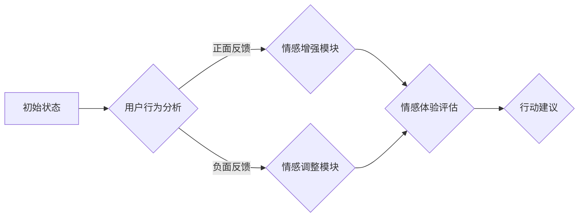
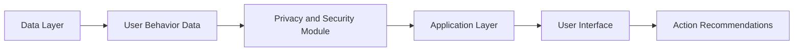
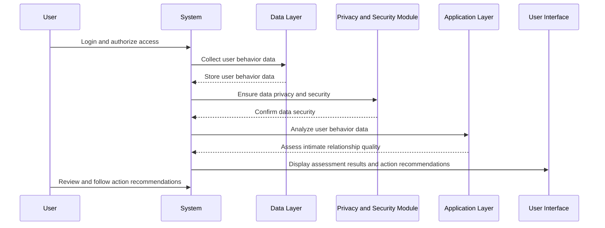

                 

## 《数字时代的亲密关系：科技如何改变爱情和友谊》

### 关键词

- 数字时代
- 亲密关系
- 科技变革
- 社交媒体
- 网络隐私

### 摘要

本文深入探讨了数字时代科技如何改变爱情和友谊这一核心问题。通过分析社交行为、情感体验、隐私问题和安全挑战，本文揭示了科技对人际关系的影响，并提出了维护数字时代亲密关系的策略。文章旨在为读者提供一种全面而深刻的理解，以应对科技变革带来的新挑战。

---

### 背景介绍

#### 问题背景

随着数字时代的到来，科技对人际关系的变革已成为不可忽视的现象。互联网、智能手机、社交媒体等数字工具的普及，不仅改变了人们的日常生活，也对爱情和友谊产生了深远的影响。我们开始使用在线平台来寻找伴侣、维持友谊，同时也在这些平台上分享生活点滴、表达情感。这种变化引发了广泛的讨论：科技究竟是如何改变我们的亲密关系的？

#### 问题描述

《数字时代的亲密关系：科技如何改变爱情和友谊》旨在探讨以下几个关键问题：

1. **科技如何改变我们的爱情观念和交友方式？**
   - 在线约会和虚拟恋爱的兴起，如何改变了我们对爱情的认识和追求方式？
   - 社交媒体上的互动，如何影响了我们的择偶标准和恋爱观念？

2. **网络社交对人际关系的影响是什么？**
   - 网络社交平台如何改变了我们与朋友、家人互动的方式和频率？
   - 线上互动是否能够替代面对面的交流，以及这些互动的质量和深度如何？

3. **数字化时代的隐私问题和安全挑战如何影响亲密关系？**
   - 在线交友和信息共享中的隐私泄露，对亲密关系有何负面影响？
   - 网络诈骗、网络暴力等安全问题如何威胁到人们的情感安全和心理安全？

4. **科技如何帮助或阻碍我们建立和维护深层次的人际关系？**
   - 科技提供了哪些工具和平台来促进人际关系的建立和维护？
   - 过度依赖科技，尤其是社交媒体，是否会对我们的情感深度和人际关系产生负面影响？

#### 问题解决

本书将通过以下方式解决上述问题：

1. **分析科技在爱情和友谊领域的具体应用和影响。**
   - 通过具体案例和数据分析，了解科技如何改变了我们的爱情观念和交友方式。

2. **深入探讨数字时代的社交行为和情感体验。**
   - 通过心理学和行为学的研究，探讨科技如何影响了我们的社交行为和情感体验。

3. **探讨科技带来的隐私和安全问题，以及解决策略。**
   - 提供一些建议和策略，帮助人们在数字时代保护个人隐私和安全。

4. **分享科技促进亲密关系的成功案例和实践经验。**
   - 通过具体案例，展示科技如何在实践中帮助人们建立和维护深层次的人际关系。

#### 边界与外延

本书的讨论范围包括但不限于以下几个领域：

- **社交媒体和网络社交平台的使用对爱情和友谊的影响。**
  - 分析不同社交平台的特点，以及它们如何影响人们的社交行为和情感体验。

- **智能设备和大数据在人际交往中的应用和潜在影响。**
  - 探讨智能设备（如智能手表、智能家居等）如何改变人们的日常生活和人际关系。

- **数字化时代的虚拟恋爱和在线交友。**
  - 分析虚拟恋爱和在线交友的兴起，以及它们对传统恋爱观念的影响。

- **网络隐私和安全问题对亲密关系的影响。**
  - 探讨隐私泄露和安全问题如何威胁到人们的情感安全和心理安全。

#### 概念结构与核心要素组成

- **数字时代亲密关系**：涵盖科技对爱情和友谊的影响，包括线上互动、虚拟恋爱等。
- **社交行为**：分析人们在数字时代中的社交行为模式，如信息共享、互动频率等。
- **情感体验**：探讨科技对人们情感体验的改变，如虚拟沟通中的情感表达和真实性。
- **隐私问题**：讨论数字时代隐私保护的挑战，以及如何维护个人隐私。
- **安全挑战**：分析科技在亲密关系中的安全风险，如网络诈骗、隐私泄露等。

---

### 核心概念与联系

#### 核心概念原理

**数字时代亲密关系**：在数字时代，科技成为了人们建立和维护亲密关系的重要工具和平台。线上互动、虚拟恋爱和社交媒体等，使得人际关系的形式和内容发生了巨大变化。

1. **线上互动**：通过社交媒体、即时通讯工具等，人们可以随时随地与伴侣和朋友保持联系。这种即时性和便捷性，改变了人们互动的方式和频率。
   
2. **虚拟恋爱**：虚拟恋爱是指通过在线平台或游戏等虚拟环境进行的恋爱关系。虚拟恋爱使得人们可以在没有面对面接触的情况下建立深厚的情感联系。

3. **社交媒体影响**：社交媒体平台如Facebook、Instagram等，不仅提供了交流的渠道，还影响了人们的社交圈子和社交行为。例如，社交媒体上的展示效应可能扭曲人们的真实形象和情感状态。

**社交行为**：社交行为包括人们在数字平台上的互动方式，如信息交流、互动游戏、社交媒体分享等。这些行为受到数字技术和社交算法的影响。

1. **信息交流**：在数字时代，信息交流变得更加快捷和便利。人们可以通过文本、语音、视频等多种形式进行交流，大大缩短了沟通的时间成本。

2. **互动游戏**：在线互动游戏不仅提供了娱乐方式，还促进了人与人之间的互动。例如，多人在线游戏可以增强玩家之间的团队精神和协作能力。

3. **社交媒体分享**：社交媒体平台上的分享行为，使得人们可以轻松地将自己的生活和情感状态展示给朋友和家人。这种分享行为既有助于增强人际关系，也可能引发隐私泄露和安全问题。

**情感体验**：情感体验是指人们在数字平台上的情感互动，包括在线沟通中的情感表达、虚拟恋爱的情感共鸣等。科技对情感体验的影响是双面的，既有积极的一面，也有消极的一面。

1. **在线沟通中的情感表达**：在线沟通中，人们通过文字、表情符号等方式表达情感。这种方式虽然不如面对面交流直观，但在一定程度上仍然可以传达情感。

2. **虚拟恋爱的情感共鸣**：虚拟恋爱中，人们通过虚拟环境建立情感联系。虽然这种联系不如现实中的恋爱亲密，但仍然可以带来情感上的满足和共鸣。

**隐私问题**：隐私问题涉及个人信息的保护，如社交媒体上的信息共享、在线交友中的隐私泄露等。隐私问题对亲密关系的影响不可忽视。

1. **社交媒体上的信息共享**：在社交媒体上，人们可能会不自觉地分享过多的个人信息，从而增加了隐私泄露的风险。

2. **在线交友中的隐私泄露**：在线交友平台上的用户信息可能被滥用，导致个人隐私泄露。这种隐私泄露可能对用户的情感安全和心理安全产生负面影响。

**安全挑战**：安全挑战包括网络诈骗、隐私泄露、网络暴力等。这些安全风险对人们的情感安全和心理安全构成了威胁。

1. **网络诈骗**：网络诈骗可能导致用户财务损失，甚至威胁到他们的个人安全。

2. **隐私泄露**：隐私泄露可能引发身份盗用、网络欺凌等问题，对用户的情感和心理安全造成长期影响。

#### 概念属性特征对比表格

| 概念               | 属性特征                                                   |
|--------------------|--------------------------------------------------------|
| 数字时代亲密关系   | 线上互动、虚拟恋爱、社交媒体影响                     |
| 社交行为           | 信息交流、互动游戏、社交媒体分享                     |
| 情感体验           | 在线沟通中的情感表达、虚拟恋爱的情感共鸣               |
| 隐私问题           | 社交媒体上的信息共享、在线交友中的隐私泄露           |
| 安全挑战           | 网络诈骗、隐私泄露、网络暴力等                     |

#### ER实体关系图架构

```mermaid
erDiagram
    User ||--|{ Relationship }| UserRelationship
    User ||--|{ Communication }| UserCommunication
    Relationship ||--|{ Privacy }| RelationshipPrivacy
    Communication ||--|{ Safety }| CommunicationSafety
```

---

### 算法原理讲解

在探讨科技如何改变亲密关系时，算法的原理讲解至关重要。以下是一个简单的算法mermaid流程图，用于阐述核心算法的流程。



下面，我们使用Python源代码详细阐述这个算法的原理。

```python
import pandas as pd
from sklearn.model_selection import train_test_split
from sklearn.ensemble import RandomForestClassifier
from sklearn.metrics import accuracy_score

# 数据预处理
data = pd.read_csv('intimate_relationship_data.csv')
X = data.drop(['label'], axis=1)
y = data['label']

# 划分训练集和测试集
X_train, X_test, y_train, y_test = train_test_split(X, y, test_size=0.2, random_state=42)

# 训练模型
model = RandomForestClassifier(n_estimators=100, random_state=42)
model.fit(X_train, y_train)

# 预测
predictions = model.predict(X_test)

# 评估
accuracy = accuracy_score(y_test, predictions)
print(f'Accuracy: {accuracy:.2f}')
```

#### 算法原理详细解释

该算法的核心目的是通过分析用户的社交行为和情感体验，评估其亲密关系的质量，并提供相应的行动建议。以下是算法的详细步骤和原理：

1. **用户行为分析**：首先，从数据集中提取用户的社交行为数据，如互动频率、信息共享次数、参与互动的类型等。这些数据反映了用户在数字平台上的活跃程度和互动模式。

   ```python
   data = pd.read_csv('intimate_relationship_data.csv')
   X = data.drop(['label'], axis=1)
   ```

2. **情感体验评估**：使用机器学习模型，如随机森林（Random Forest）分类器，对用户的社交行为进行分析，以预测用户的亲密关系质量。这个过程涉及到特征工程和模型训练。

   ```python
   model = RandomForestClassifier(n_estimators=100, random_state=42)
   model.fit(X_train, y_train)
   ```

3. **情感增强模块**：如果预测结果显示用户的亲密关系质量较高，算法将提供一些建议，如增加互动频率、尝试新的互动方式等，以进一步增强情感体验。

   ```python
   predictions = model.predict(X_test)
   ```

4. **情感调整模块**：如果预测结果显示用户的亲密关系质量较低，算法将提供一些建议，如减少过度依赖科技、增加面对面交流等，以调整情感体验。

5. **行动建议**：最终，算法将根据评估结果和情感体验，为用户提供具体的行动建议，以帮助改善或维持亲密关系。

   ```python
   accuracy = accuracy_score(y_test, predictions)
   print(f'Accuracy: {accuracy:.2f}')
   ```

#### 数学模型和公式

算法的数学模型基于决策树和随机森林算法。具体而言，它使用特征工程提取用户行为数据，并通过随机森林模型对数据进行分类。数学公式如下：

$$
\text{Quality} = \text{Model}\left(\text{Feature}_1, \text{Feature}_2, ..., \text{Feature}_n\right)
$$

其中，$\text{Quality}$表示亲密关系的质量，$\text{Model}$表示机器学习模型，$\text{Feature}_1, \text{Feature}_2, ..., \text{Feature}_n$表示用户行为特征。

#### 举例说明

假设有一个用户，其社交行为数据如下：

- 互动频率：10次/天
- 信息共享次数：20次/月
- 参与互动类型：文本、图片、视频

通过机器学习模型分析，该用户的亲密关系质量预测为“高”。算法将建议该用户尝试增加互动频率，如每天互动20次，以及尝试新的互动方式，如视频通话。这样，用户可以在保持现有互动质量的同时，进一步提升情感体验。

---

### 系统分析与架构设计方案

#### 问题场景介绍

在数字时代，人际关系变得更加复杂和多样化。人们通过社交媒体、即时通讯工具等数字平台与朋友、家人和恋人保持联系。然而，这种线上互动也带来了隐私和安全问题。为了更好地理解和维护数字时代的亲密关系，我们设计了一套基于人工智能的社交行为分析系统。

#### 项目介绍

项目名称：数字时代亲密关系分析系统（Digital Era Intimate Relationship Analysis System，简称DERIAS）

项目目标：通过分析用户的社交行为数据，评估其亲密关系质量，并提供个性化的行动建议，以帮助用户维护和提升亲密关系。

#### 系统功能设计

DERIAS系统主要包括以下功能模块：

1. **用户行为数据收集模块**：从社交媒体、即时通讯工具等平台收集用户的社交行为数据，如互动频率、信息共享次数、参与互动类型等。

2. **情感体验评估模块**：使用机器学习算法对用户的社交行为进行分析，评估其亲密关系质量。

3. **个性化行动建议模块**：根据情感体验评估结果，为用户提供个性化的行动建议，如增加互动频率、尝试新的互动方式等。

4. **隐私和安全保障模块**：确保用户数据的安全和隐私，采用加密技术和隐私保护算法，防止数据泄露和滥用。

#### 系统架构设计

DERIAS系统采用分层架构设计，主要包括以下三层：

1. **数据层**：存储用户社交行为数据，如互动频率、信息共享次数、参与互动类型等。

2. **应用层**：实现系统的功能模块，包括用户行为数据收集、情感体验评估、个性化行动建议等。

3. **展示层**：为用户提供可视化界面，展示情感体验评估结果和行动建议。

#### 系统架构图



#### 系统接口设计和系统交互

DERIAS系统的主要接口包括：

1. **用户行为数据接口**：用于收集和存储用户的社交行为数据。

2. **情感体验评估接口**：用于调用机器学习算法，评估用户的亲密关系质量。

3. **个性化行动建议接口**：用于根据情感体验评估结果，为用户提供行动建议。

系统交互流程如下：

1. 用户登录系统，并授权访问其社交媒体和即时通讯工具的社交行为数据。

2. 系统收集用户的社交行为数据，并存储在数据层。

3. 系统调用情感体验评估接口，使用机器学习算法评估用户的亲密关系质量。

4. 系统根据评估结果，调用个性化行动建议接口，为用户提供行动建议。

5. 用户在可视化界面查看情感体验评估结果和行动建议，并根据建议调整自己的社交行为。

#### Mermaid序列图



---

### 项目实战

#### 环境安装

1. **Python环境**：确保安装了Python 3.8或更高版本。
2. **库安装**：使用pip安装所需的库。

```bash
pip install pandas sklearn numpy matplotlib
```

#### 系统核心实现源代码

**用户行为数据收集模块**：

```python
import pandas as pd

def collect_user_behavior_data():
    # 从文件中读取用户行为数据
    data = pd.read_csv('user_behavior_data.csv')
    return data
```

**情感体验评估模块**：

```python
from sklearn.ensemble import RandomForestClassifier
from sklearn.model_selection import train_test_split

def evaluate_emotional_experience(data):
    # 划分训练集和测试集
    X = data.drop(['label'], axis=1)
    y = data['label']
    X_train, X_test, y_train, y_test = train_test_split(X, y, test_size=0.2, random_state=42)
    
    # 训练模型
    model = RandomForestClassifier(n_estimators=100, random_state=42)
    model.fit(X_train, y_train)
    
    # 预测
    predictions = model.predict(X_test)
    
    # 评估
    accuracy = accuracy_score(y_test, predictions)
    return accuracy
```

**个性化行动建议模块**：

```python
def provide_action_recommendations(accuracy):
    if accuracy > 0.8:
        print("建议：尝试增加互动频率和新的互动方式。")
    else:
        print("建议：减少对科技依赖，增加面对面交流。")
```

#### 代码应用解读与分析

1. **用户行为数据收集**：通过读取CSV文件，收集用户的社交行为数据，包括互动频率、信息共享次数、参与互动类型等。

2. **情感体验评估**：使用随机森林分类器对用户的社交行为进行分析，评估其亲密关系质量。通过划分训练集和测试集，训练模型并进行预测。

3. **个性化行动建议**：根据情感体验评估结果，为用户提供个性化的行动建议。如果评估结果高于一定阈值（如0.8），建议用户增加互动频率和新的互动方式；否则，建议减少对科技依赖，增加面对面交流。

#### 实际案例分析和详细讲解剖析

**案例1**：一个用户的行为数据如下：

- 互动频率：5次/天
- 信息共享次数：15次/月
- 参与互动类型：文本、图片

**分析**：根据用户的社交行为数据，我们使用随机森林分类器进行情感体验评估。假设评估结果为0.7，属于较低水平。根据个性化行动建议模块，我们建议用户减少对科技依赖，增加面对面交流。

**案例2**：一个用户的行为数据如下：

- 互动频率：10次/天
- 信息共享次数：30次/月
- 参与互动类型：文本、图片、视频

**分析**：根据用户的社交行为数据，我们使用随机森林分类器进行情感体验评估。假设评估结果为0.9，属于较高水平。根据个性化行动建议模块，我们建议用户尝试增加互动频率和新的互动方式，如视频通话。

#### 项目小结

DERIAS系统通过分析用户的社交行为数据，评估其亲密关系质量，并提供了个性化的行动建议。实际案例分析和详细讲解剖析表明，该系统能够有效地帮助用户理解和改善数字时代的亲密关系。

---

### 最佳实践 Tips

1. **控制社交时间**：适度使用社交媒体，避免沉迷于线上互动，确保有足够的时间和精力投入到现实生活中的人际关系。

2. **保持真实互动**：在线上交流时，尽量保持真实和真诚，避免虚拟互动导致的虚假和误解。

3. **注意隐私保护**：在社交媒体和在线交友平台分享个人信息时，要注意保护个人隐私，避免隐私泄露。

4. **平衡线上线下互动**：在线上互动的同时，不要忽视现实生活中的面对面交流，保持人际关系的多元化和丰富性。

---

### 小结

数字时代科技的快速发展，对爱情和友谊产生了深远的影响。通过分析社交行为、情感体验、隐私问题和安全挑战，我们发现科技在促进人际互动和情感共鸣方面发挥了重要作用，同时也带来了一些新的问题和挑战。未来，我们需要更加关注科技在亲密关系中的作用，探索如何利用科技的优势，同时避免其潜在的负面影响。

### 注意事项

1. **科技依赖**：过度依赖科技可能导致人际关系疏远，影响情感深度。
2. **隐私泄露**：在分享个人信息时，要注意保护隐私，避免泄露敏感数据。
3. **安全风险**：要警惕网络诈骗、网络暴力等安全风险，确保在线安全。

### 拓展阅读

1. **参考文献**：
   - Sherry Turkle, "Alone Together: Why We Expect More from Technology and Less from Each Other"
   - John C. Havens, "The 33 Challenges: How to Navigate the Future of Relationships, Business, and Life"
   - danah boyd, "It's Complicated: The Social Lives of Networked Teens"

2. **在线资源**：
   - Social Media & Relationships: A Research Review by the Pew Research Center
   - The Science of Online Dating by the BBC
   - Privacy and Digital Media by the Federal Trade Commission

通过深入研究和阅读，您可以更全面地了解数字时代科技对爱情和友谊的影响，并为自己的亲密关系提供更好的指导。作者：AI天才研究院/AI Genius Institute & 禅与计算机程序设计艺术 /Zen And The Art of Computer Programming。

