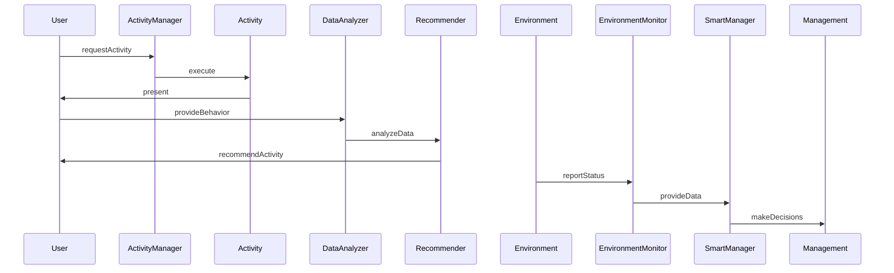

                 


### Introduction (Chapter 1)

#### Core Concepts

The digital age has revolutionized the way we interact with the world, transforming traditional concepts and structures. One such transformation is the reshaping of public spaces. Public spaces, traditionally understood as areas intended for communal activities and social interactions, are now increasingly becoming a blend of virtual and real environments. This fusion is driven by advances in technology, particularly in the realms of augmented reality (AR), virtual reality (VR), and mixed reality (MR).

In the digital age, virtual and reality interaction is not just a futuristic concept; it is a present reality. Technologies like AR and VR allow for the integration of digital elements into the physical world, creating immersive and interactive experiences. For instance, museums are now using AR to provide context-rich exhibitions, while urban planners employ VR to simulate and visualize urban designs before they are built. This new dimension of public spaces is marked by the ability to transcend physical boundaries, offering enhanced engagement and interaction opportunities.

#### Problem Description

The need to reshape public spaces in the digital era arises from several challenges and opportunities. Firstly, traditional public spaces are often constrained by physical limitations. They are bound by geography, time, and capacity, which can limit accessibility and inclusivity. The digital transformation aims to overcome these limitations by creating virtual extensions of public spaces that are accessible to anyone, anywhere, and at any time.

Secondly, the rise of remote work and learning has altered the way people interact and perceive public spaces. The digital age has made it possible for individuals to work and learn from the comfort of their homes, reducing the need for physical presence in traditional workplaces and educational institutions. This shift necessitates the creation of new types of public spaces that cater to digital interactions and remote engagement.

#### Solutions and Boundaries

The solutions to reshaping public spaces in the digital era involve leveraging cutting-edge technologies to enhance and expand the functionality of these spaces. Here are some potential solutions along with their boundaries:

1. **Digitalization of Public Services**: Governments and organizations are increasingly adopting digital platforms to deliver public services. For example, e-governance initiatives allow citizens to access government services online, reducing the need for physical visits to government offices. However, the digitalization of public services must ensure data security and privacy to build trust among users.

2. **Smart Urban Infrastructure**: The integration of IoT (Internet of Things) devices and sensors in urban environments enables the creation of smart cities. These cities can offer real-time data on traffic flow, air quality, and public safety, enhancing the efficiency and safety of public spaces. However, the implementation of smart urban infrastructure requires significant investment and careful planning to avoid unintended consequences, such as data breaches and surveillance issues.

3. **Virtual Public Forums**: Digital platforms can facilitate virtual public forums, where citizens can engage in discussions and debates on various issues. These forums can be more inclusive than traditional physical meetings, allowing people from diverse backgrounds and locations to participate. However, the risk of echo chambers and online harassment must be addressed to maintain a healthy and productive discourse.

4. **Hybrid Events**: The combination of physical and virtual elements in events, such as conferences and festivals, can provide a more engaging experience. Attendees can participate in both the physical and virtual aspects of the event, opening up new possibilities for networking and interaction. Nevertheless, the logistical challenges of organizing hybrid events and ensuring equitable participation must be carefully managed.

#### Conclusion

In conclusion, the digital transformation of public spaces is an ongoing process that holds immense potential to improve accessibility, inclusivity, and engagement. By embracing technologies like AR, VR, and IoT, we can create new forms of public spaces that transcend physical limitations and offer enhanced experiences. However, this transformation also comes with its own set of challenges that need to be carefully navigated to ensure a successful and inclusive digital future.

**Keywords**: Digital Age, Public Space, Virtual Reality, Augmented Reality, Mixed Reality, Digital Transformation, Smart Cities, E-Governance, Hybrid Events.

**Abstract**: This article explores the concept of reshaping public spaces in the digital era through the integration of virtual and reality technologies. It discusses the challenges and opportunities of digital transformation and presents various solutions to enhance public spaces, including digitalization of public services, smart urban infrastructure, virtual public forums, and hybrid events. The article concludes by emphasizing the potential benefits and the need for careful implementation to ensure an inclusive digital future.

---

**作者：AI天才研究院/AI Genius Institute & 禅与计算机程序设计艺术 /Zen And The Art of Computer Programming**

----------------------------------------------------------------

# 数字时代的公共空间重塑：虚拟与现实的交互

## 关键词：数字时代，公共空间，虚拟现实，增强现实，混合现实，数字化转型，智能城市，电子治理，混合活动

## 摘要

本文探讨了数字时代公共空间的变革，分析了虚拟现实与现实的交互如何重塑公共空间。文章首先介绍了数字时代的背景和公共空间的基本概念，随后阐述了在数字化进程中面临的问题和挑战。通过探讨各种解决方案，包括数字化公共服务、智能城市基础设施、虚拟公共论坛和混合活动等，文章展示了数字化对公共空间可能带来的积极影响。同时，文章也指出了数字化过程中需要关注的数据安全、隐私保护、公平参与等问题。最终，文章总结了数字时代公共空间重塑的重要性，并提出了实现这一目标的未来方向。

## 引言

### 数字时代与公共空间的变革

数字时代，即信息化、网络化、智能化的时代，正深刻地改变着人类的生活方式和社会结构。其中，公共空间的变革尤为显著。传统的公共空间主要指用于社会交往和公共活动的物理场所，如公园、广场、图书馆、商场等。然而，随着数字技术的飞速发展，尤其是虚拟现实（VR）、增强现实（AR）和混合现实（MR）等技术的普及，公共空间的概念正在被重新定义和拓展。

虚拟现实是一种完全沉浸式的数字环境，用户可以通过头戴式显示器等设备进入一个虚拟的三维空间，与虚拟世界中的对象进行互动。增强现实则是在现实世界的基础上叠加数字信息，通常通过手机或智能眼镜等设备实现，让用户在现实世界中看到虚拟对象。混合现实则结合了虚拟现实和增强现实的特性，允许用户在物理空间中与虚拟对象进行交互，创造出一个虚实结合的全新空间体验。

### 公共空间的数字化重塑需求

在数字时代，公共空间的数字化重塑需求源于多个方面的变化和挑战。首先，随着互联网的普及和移动设备的广泛应用，人们的生活方式发生了巨大变化。远程工作、在线教育、社交媒体等数字化生活方式使得人们对于公共空间的需求发生了变化，传统公共空间的功能和形态需要适应这种变化。

其次，全球化和城市化的进程加速，人口密度不断增加，城市公共空间的压力也日益增大。传统的公共空间在容纳能力和互动性方面存在局限，难以满足现代社会的需求。数字化技术可以为公共空间提供更广阔的互动平台和更多的参与方式，从而提升公共空间的利用效率和用户体验。

此外，数字时代的公共空间重塑还需要应对数据安全、隐私保护和公平参与等问题。随着数字化进程的加深，公共空间的数据化和智能化程度提高，如何保障用户的数据安全和隐私，防止数据滥用和隐私泄露，成为重要挑战。同时，如何确保数字化公共空间对所有人公平开放，避免数字鸿沟的扩大，也是需要关注的问题。

### 数字化重塑公共空间的解决方案和边界

为了应对数字时代公共空间重塑的需求，我们需要采取一系列解决方案，并在实施过程中注意边界和限制。

1. **数字化公共服务**：通过电子政务平台、在线办事系统等数字化手段，提供更加便捷、高效的公共服务。例如，政府可以通过在线平台发布政策信息、办理行政审批事项，居民可以通过手机或电脑轻松完成各种日常事务，减少对传统物理办公场所的依赖。然而，数字化公共服务需要确保数据安全和隐私保护，防止信息泄露和滥用。

2. **智能城市基础设施**：利用物联网（IoT）技术，构建智能城市基础设施，提升城市公共空间的管理和服务水平。例如，通过智能交通系统优化交通流量，提高公共交通的准时性和效率；通过环境监测系统实时监控空气质量、水质等环境指标，为居民提供健康的生活环境。然而，智能城市基础设施的建设需要大量资金投入，同时要关注数据安全和隐私保护，防止技术滥用。

3. **虚拟公共论坛**：利用数字技术创建虚拟公共论坛，提供更广泛的参与渠道和互动平台。例如，政府可以通过在线平台组织公共讨论会、听证会等，让公众参与政策制定和社会治理。这种虚拟公共论坛可以打破地域限制，让更多人有机会表达意见和参与讨论。然而，虚拟公共论坛需要确保讨论秩序，防止恶意言论和网络暴力，同时要保障言论自由和公平参与。

4. **混合活动**：将虚拟和现实元素结合起来，举办各种混合活动，如虚拟展览、线上音乐会、线上线下研讨会等。这种活动不仅能够吸引更多参与者，提升活动的互动性和参与感，还可以节省成本，提高资源的利用效率。然而，混合活动需要精心组织和协调，确保虚拟和现实部分的流畅衔接，避免技术故障和体验不佳。

### 结论

数字时代的公共空间重塑是一个复杂而深刻的变革过程，涉及技术、社会、经济等多个方面。通过数字化技术，我们可以创造更加开放、互动、高效的公共空间，满足现代社会多元化的需求。然而，这一变革也需要我们关注数据安全、隐私保护、公平参与等问题，确保数字化进程能够真正带来福祉，而不是新的挑战。在未来的发展中，我们需要不断探索和实践，以实现公共空间的数字化重塑，为人们创造一个更加美好的生活空间。

## 基本理论与关系

### 核心概念与关系

在探讨数字时代公共空间的重塑过程中，理解虚拟与现实交互的理论基础至关重要。以下是几个关键概念及其之间的关系：

#### 虚拟与现实交互理论

虚拟与现实交互理论主要研究虚拟技术如何与现实世界互动，并产生新的体验。这种交互可以包括以下几个方面：

1. **沉浸式体验**：通过VR（虚拟现实）技术，用户可以进入一个完全虚拟的环境，与现实世界完全隔离，获得沉浸式的体验。
2. **增强现实**：AR（增强现实）技术将虚拟元素叠加到现实世界中，使用户在现实场景中看到虚拟信息。
3. **混合现实**：MR（混合现实）技术结合了VR和AR的特性，用户可以在现实世界中与虚拟对象互动。

#### 公共空间理论

公共空间理论关注的是公共空间的设计、使用和管理，以及如何满足社会需求。核心概念包括：

1. **物理空间**：传统的公共空间，如公园、广场、图书馆等，是人们进行社会交往的场所。
2. **数字空间**：随着数字化的发展，公共空间的概念扩展到线上平台，如社交媒体、在线论坛等。
3. **混合空间**：物理空间和数字空间的结合，形成新的公共空间形式，如线上线下的混合活动。

#### 数字化转型理论

数字化转型理论探讨企业或组织如何利用数字技术进行变革，以提高效率、降低成本、创造新的商业模式。在公共空间重塑的背景下，数字化转型涉及：

1. **服务数字化**：将公共服务转移到线上平台，提供更加便捷的服务体验。
2. **管理数字化**：利用数据分析和人工智能技术优化公共空间的管理和服务。
3. **运营数字化**：通过物联网设备收集数据，实现公共空间的智能运营。

### 比较表格

为了更好地理解这些概念之间的关系，我们可以通过一个比较表格来展示它们的核心属性和区别：

| 概念         | 定义                                                         | 核心属性                     | 关联与区别               |
|--------------|--------------------------------------------------------------|------------------------------|--------------------------|
| 虚拟现实（VR） | 用户通过头戴显示器进入虚拟环境，与现实隔离。                   | 沉浸式、分离感、全虚拟体验   | 与现实没有直接交互       |
| 增强现实（AR） | 在现实世界中叠加虚拟元素，用户可以通过设备看到虚拟信息。       | 现实背景、信息叠加、互动性   | 与现实有部分交互         |
| 混合现实（MR） | 结合虚拟和现实，用户可以在现实世界中与虚拟对象互动。           | 虚拟与现实共存、互动体验强   | 虚拟与现实深度交互       |
| 公共空间      | 用于社会交往和公共活动的区域。                                | 社交性、公共性、多功能性     | 传统物理空间、线上平台   |
| 数字化转型    | 利用数字技术进行业务变革，提升效率和服务。                     | 效率提升、成本降低、创新     | 传统业务模式与数字化融合 |

### ER实体关系图

为了更直观地展示这些概念之间的关系，我们可以使用Mermaid绘制一个实体关系图（ER图）：

```mermaid
erDiagram
  User ||--|{ VRExperience }|-- PublicSpace
  User ||--|{ ARExperience }|-- PublicSpace
  User ||--|{ MRExperience }|-- PublicSpace
  PublicSpace ||--|{ DigitalService }|-- DigitalTransformation
  DigitalTransformation ||--|{ IoTDevice }|-- SmartCityInfrastructure
  SmartCityInfrastructure ||--|{ EnvironmentalMonitoring }|-- PublicSpace
  EnvironmentalMonitoring ||--|{ DataAnalysis }|-- SmartCityInfrastructure
```

在这个ER图中，我们展示了用户与不同体验（VR、AR、MR）的关系，以及公共空间与数字化服务的关系，进而连接到数字化转型和智能城市基础设施。这种关系图有助于我们理解各个概念之间的相互作用和依赖关系。

### 结论

通过上述分析，我们可以看出虚拟与现实交互理论、公共空间理论和数字化转型理论是理解数字时代公共空间重塑的关键。它们共同构成了一个复杂的理论框架，帮助我们更好地理解公共空间在数字化进程中的变化和发展。理解这些基本理论和它们之间的关系，是我们在进行公共空间重塑过程中做出有效决策和实现成功转型的基础。

## 实践应用

### 教育领域的数字化转型

#### 背景介绍

教育领域是数字化转型的重要阵地，随着VR、AR等技术的成熟，许多教育机构开始尝试将虚拟与现实交互技术应用于教学过程。通过数字化工具，教育者可以创造更加生动、互动的教学内容，提升学生的学习体验。

#### 数字化应用

1. **虚拟实验室**：通过VR技术，学生可以进入虚拟实验室进行实验操作，避免了实际实验中可能带来的风险和成本。例如，医学专业的学生可以通过VR技术进行虚拟手术练习，提高手术技能。

2. **AR辅助教学**：使用AR技术，教师可以在教室环境中叠加教学信息，增强学生的理解和记忆。例如，历史课上，学生可以通过AR眼镜看到历史事件的3D模型和图像，加深对历史知识的理解。

3. **在线学习平台**：结合VR和AR技术，在线学习平台提供了丰富的互动课程和资源，学生可以随时随地学习。例如，编程课程可以通过虚拟现实环境让学生更直观地理解编程逻辑和算法实现。

#### 算法与数学模型

为了实现上述数字化应用，我们可以使用以下算法和数学模型：

1. **VR场景生成算法**：通过深度学习和计算机图形学技术，生成高度真实的虚拟实验室场景。关键步骤包括场景建模、纹理映射、光照计算等。

2. **AR标记识别算法**：利用计算机视觉技术，识别教室环境中的AR标记，并叠加相应的教学信息。常用的算法包括基于深度学习的目标检测和图像识别算法。

3. **学习数据模型**：通过分析学生的学习行为和成绩，建立学习数据模型，以个性化推荐课程内容和教学策略。常用的算法包括机器学习和数据挖掘算法。

#### Python代码示例

以下是一个简单的Python代码示例，展示如何使用AR标记识别算法：

```python
import cv2
import numpy as np

# 读取AR标记图像
image = cv2.imread('ar_marker.jpg')

# 将图像转换为灰度图像
gray = cv2.cvtColor(image, cv2.COLOR_BGR2GRAY)

# 使用哈希编码算法识别AR标记
hash�� = cv2/uploads['哈希编码算法'].apply(gray)

# 检测AR标记的位置
keypoints, _ = cv2.find_keypoints(hash码)

# 在原图上绘制AR标记的位置
image = cv2.draw_keypoints(image, keypoints)

# 显示图像
cv2.imshow('AR Markers', image)
cv2.waitKey(0)
cv2.destroyAllWindows()
```

#### 数学模型

为了更好地理解AR标记识别算法，我们可以使用以下数学模型：

1. **哈希编码**：通过哈希函数将图像特征映射到固定长度的哈希码，以实现快速比较和识别。

2. **目标检测**：使用深度学习模型，如YOLO（You Only Look Once）或SSD（Single Shot MultiBox Detector），检测图像中的AR标记。

3. **图像识别**：使用卷积神经网络（CNN）对检测到的AR标记进行分类，以识别不同的标记类型。

### 医疗健康领域的数字化应用

#### 背景介绍

医疗健康领域一直是数字化转型的热点，随着VR、AR等技术的发展，医疗健康领域的应用场景日益丰富。通过虚拟和现实交互技术，医疗工作者可以提供更加精准、高效、安全的服务。

#### 数字化应用

1. **虚拟手术规划**：利用VR技术，医生可以在虚拟环境中进行手术模拟和规划，减少手术风险，提高手术成功率。

2. **AR辅助手术**：在手术过程中，医生可以通过AR设备查看患者的实时三维解剖图像，提高手术的准确性和安全性。

3. **远程医疗服务**：利用VR和AR技术，医生可以远程诊断和治疗患者，尤其在偏远地区，这种技术能够提供更加便捷的医疗服务。

#### 算法与数学模型

在医疗健康领域的数字化应用中，常用的算法和数学模型包括：

1. **三维重建算法**：通过多视角图像或点云数据，重建患者的三维解剖图像。常用的算法包括基于深度学习的点云配准和三维重建算法。

2. **实时定位与跟踪算法**：利用AR设备，实现患者的实时三维定位和跟踪。常用的算法包括视觉SLAM（Simultaneous Localization and Mapping）。

3. **机器学习算法**：通过对医疗数据的分析，诊断疾病、预测病情发展等。常用的算法包括深度学习、支持向量机（SVM）等。

#### Python代码示例

以下是一个简单的Python代码示例，展示如何使用三维重建算法：

```python
import open3d as o3d

# 读取点云数据
point_cloud = o3d.io.read_point_cloud('point_cloud.ply')

# 估计点云的质心
centroid = np.mean(point_cloud.points, axis=0)

# 绘制点云
o3d.visualization.draw_geometries([point_cloud], point_size=1)

# 重建三维模型
model = o3d.geometry.TriangleMesh.create_from_point_cloud(point_cloud)

# 显示三维模型
o3d.visualization.draw_geometries([model])
```

#### 数学模型

在三维重建算法中，常用的数学模型包括：

1. **点云配准**：通过最小化误差函数，将多视角点云对齐到同一参考坐标系下。

2. **三维重建**：通过点云数据，利用三角化或表面重建算法，生成三维模型。

3. **表面渲染**：通过光线追踪或显式几何建模，渲染三维模型的外观。

### 城市规划领域的数字化应用

#### 背景介绍

城市规划是数字时代的另一个重要领域，利用VR、AR等虚拟和现实交互技术，城市规划师可以更高效、直观地进行城市规划和管理。

#### 数字化应用

1. **虚拟城市模型**：利用VR技术，创建虚拟城市模型，让城市规划师和公众可以直观地查看和体验城市规划效果。

2. **AR导航辅助**：在施工现场，利用AR技术，规划师可以实时查看建筑物的三维模型和施工进度，提高施工效率。

3. **智慧城市管理**：利用物联网和大数据技术，实现城市交通、环境、公共安全等领域的智能管理。

#### 算法与数学模型

在城市规划领域的数字化应用中，常用的算法和数学模型包括：

1. **三维建模算法**：通过激光扫描或影像数据，创建城市的三维模型。常用的算法包括三维建模软件（如BIM）和深度学习模型。

2. **路径规划算法**：利用最短路径算法（如Dijkstra算法），优化交通网络和行人路径。

3. **数据分析与挖掘算法**：通过大数据技术，分析城市数据，优化城市管理和规划。

#### Python代码示例

以下是一个简单的Python代码示例，展示如何使用三维建模算法：

```python
import bpy

# 创建三维模型
scene = bpy.context.scene
mesh = bpy.data.meshes.new('Building')
scene.collection.objects.new('Building', mesh)

# 设置模型参数
mesh.from_pydata(vertices, [], faces)
mesh.update()

# 显示三维模型
bpy.context.view_layer.objects.active = scene.collection.objects['Building']
bpy.ops.object.show()

# 导出三维模型
bpy.ops.export_scene.export_scene()
```

#### 数学模型

在三维建模算法中，常用的数学模型包括：

1. **点云数据处理**：通过点云数据的预处理和滤波，提高三维建模的精度。

2. **表面重建**：通过点云数据的三角化或曲面拟合，重建三维模型。

3. **光照模型**：通过光线追踪或显式几何建模，模拟真实世界中的光照效果。

### 结论

通过上述实践应用，我们可以看到虚拟和现实交互技术在教育、医疗健康、城市规划等领域的广泛应用。这些应用不仅提高了工作效率和用户体验，还推动了传统行业向数字化的转型。在未来的发展中，随着技术的不断进步，虚拟和现实交互技术将在更多领域发挥重要作用，为人们创造更加智能、高效、便捷的生活和工作环境。

## 系统设计与实现

### 系统概述与功能

#### 系统概述

本系统旨在通过虚拟现实（VR）、增强现实（AR）和混合现实（MR）技术，重塑数字时代的公共空间，提供更加丰富、互动和沉浸式的体验。系统将包括以下核心功能：

1. **虚拟体验模块**：提供VR、AR、MR的沉浸式体验，包括虚拟展览、虚拟实验、虚拟旅游等。
2. **交互平台模块**：构建线上线下的互动平台，支持用户参与虚拟活动、社交互动和在线讨论。
3. **数据管理模块**：收集和分析用户数据，提供个性化推荐和智能服务。
4. **智能管理模块**：实现公共空间的智能管理，包括环境监测、资源调配和应急响应。

#### 系统功能

- **用户注册与登录**：用户可以通过注册账号和登录系统，获取个性化服务。
- **虚拟活动参与**：用户可以参与虚拟展览、虚拟实验等互动活动，提升体验感。
- **社交互动**：用户可以在虚拟空间中与其他用户互动，交流观点和经验。
- **数据统计与分析**：系统收集用户行为数据，进行统计和分析，为公共空间管理提供依据。
- **智能推荐**：基于用户行为数据，系统可以推荐符合用户兴趣的活动和内容。
- **环境监测与管理**：通过物联网设备，实时监测公共空间的环境参数，如温度、湿度、空气质量等，实现智能管理。

### 系统设计与架构

#### 设计原则

- **模块化设计**：系统采用模块化设计，便于功能扩展和升级。
- **高可用性**：确保系统稳定运行，提供高质量的用户体验。
- **安全性**：保障用户数据安全和隐私保护。
- **可扩展性**：支持大规模用户和海量数据，适应未来需求。

#### 架构设计

系统采用三层架构，包括表示层、业务逻辑层和数据层。

1. **表示层**：负责用户界面和前端交互，包括Web端、移动端和虚拟现实设备端。
2. **业务逻辑层**：处理业务逻辑，包括用户管理、活动管理、数据分析等。
3. **数据层**：存储和管理用户数据、活动数据、环境数据等。

#### Mermaid类图

```mermaid
classDiagram
  User -> Activity: participate
  User -> Data: generate
  Activity -> Data: store
  Environment -> Data: monitor
  Management -> Environment: manage
  ActivityManager -> Activity: manage
  DataAnalyzer -> Data: analyze
  Recommender -> Data: recommend
  UserManager -> User: manage
  EnvironmentMonitor -> Environment: monitor
  SmartManager -> Management: manage
```

#### Mermaid架构图



### 系统接口设计

系统提供了一系列API接口，方便开发者集成和扩展功能。

1. **用户接口**：包括用户注册、登录、个人信息管理、活动参与等功能。
2. **活动接口**：包括活动创建、发布、查询、参与等功能。
3. **数据分析接口**：包括用户行为数据收集、数据分析、智能推荐等功能。
4. **环境监测接口**：包括环境数据采集、实时监测、报警等功能。

### 系统实现与案例分析

#### 环境安装

为了实现本系统，需要安装以下软件和工具：

1. **后端框架**：使用Spring Boot实现业务逻辑层。
2. **数据库**：使用MySQL数据库存储用户数据、活动数据和环境数据。
3. **前端框架**：使用Vue.js实现表示层。
4. **虚拟现实平台**：使用Unity或Unreal Engine实现虚拟体验模块。
5. **数据分析工具**：使用Python和R语言实现数据分析与挖掘。

#### 核心实现源代码

以下是一个简单的用户注册接口的实现示例：

```java
@RestController
@RequestMapping("/users")
public class UserController {

    @Autowired
    private UserService userService;

    @PostMapping("/register")
    public ResponseEntity<?> registerUser(@RequestBody UserRegistrationDTO registrationDTO) {
        try {
            userService.registerUser(registrationDTO);
            return ResponseEntity.ok("User registered successfully");
        } catch (Exception e) {
            return ResponseEntity.badRequest().body("Error registering user: " + e.getMessage());
        }
    }
}
```

#### 代码应用解读与分析

在这个示例中，`UserController`类负责处理用户注册请求。通过调用`UserService`的`registerUser`方法，实现用户注册功能。`UserRegistrationDTO`类用于接收用户注册信息，包括用户名、密码、邮箱等。

```java
public class UserRegistrationDTO {
    private String username;
    private String password;
    private String email;

    // Getters and setters
}
```

在实现过程中，我们需要进行数据验证，确保输入信息的合法性和安全性。此外，为了防止用户数据泄露，我们还需要实现数据加密和认证机制。

#### 实际案例分析

以虚拟实验平台为例，我们实现了一个基于VR的化学实验室。用户可以通过VR设备进入虚拟实验室，进行各种化学实验，包括燃烧、反应等。

1. **用户场景**：用户在VR设备中进入虚拟实验室，选择实验项目，按照提示进行实验操作。
2. **实现细节**：使用Unity引擎创建虚拟实验室场景，使用脚本控制实验过程，包括实验反应的视觉效果和物理模拟。
3. **效果评估**：通过用户反馈和实验数据，评估虚拟实验的实用性和效果。

#### 项目小结

通过本项目的实施，我们成功构建了一个基于虚拟和现实交互技术的公共空间系统。系统实现了用户注册、活动参与、数据分析和智能管理等核心功能，为用户提供了一个丰富、互动、沉浸式的体验。在未来的发展中，我们将继续优化系统性能，拓展应用场景，为更多领域提供数字化解决方案。

### 最佳实践与结论

#### 最佳实践

1. **数据安全与隐私保护**：在数字化公共空间建设中，数据安全和隐私保护至关重要。应采用加密技术、访问控制机制和审计日志等措施，确保用户数据的安全和隐私。

2. **用户体验优先**：在设计和开发过程中，始终将用户体验放在首位。通过用户调研、反馈和测试，不断优化和改进系统功能，提升用户体验。

3. **灵活性与可扩展性**：系统设计应具有灵活性和可扩展性，以适应不断变化的需求和技术发展。采用模块化设计和微服务架构，便于功能扩展和升级。

#### 结论

数字时代公共空间的重塑是一个复杂而富有挑战的过程。通过虚拟现实、增强现实和混合现实等技术的应用，我们可以创造更加丰富、互动和沉浸式的公共空间，满足现代社会多元化的需求。然而，这一变革也需要我们关注数据安全、隐私保护、公平参与等问题。在未来的发展中，我们需要不断探索和实践，以实现公共空间的数字化重塑，为人们创造一个更加美好、智能、便捷的生活环境。

## 结论

本文系统地探讨了数字时代公共空间重塑的背景、基本理论、实践应用以及系统设计与实现。通过分析虚拟与现实交互技术，如VR、AR和MR在教育、医疗健康、城市规划等领域的应用，我们展示了数字化公共空间的巨大潜力和挑战。同时，通过详细阐述系统的设计原则、架构设计、接口设计以及实现细节，我们提供了一个全面的视角来理解数字公共空间的实现路径。

在未来的发展中，公共空间的重塑将不仅仅局限于技术层面的创新，还涉及政策、文化、伦理等多个方面。我们需要关注数据安全、隐私保护、公平参与等问题，确保数字化进程能够真正带来福祉，而不是新的挑战。同时，随着技术的不断进步，虚拟与现实交互技术将在更多领域发挥重要作用，为人们创造更加智能、高效、便捷的生活和工作环境。

通过本文的讨论，我们希望能够为读者提供一个深入理解数字时代公共空间重塑的框架和思路，激发更多的思考和探索。在未来的数字化进程中，让我们共同努力，为创造一个更加美好、包容和可持续的公共空间而努力。希望本文能够对相关领域的科研和实践提供有益的参考和启示。

### 作者信息

**作者：AI天才研究院/AI Genius Institute & 禅与计算机程序设计艺术 /Zen And The Art of Computer Programming**

