                 

# 《数字时代的创意写作：AI辅助下的文学创新》

> 关键词：数字时代、创意写作、AI辅助、文学创新、自然语言处理

> 摘要：本文探讨了数字时代下，AI辅助创意写作的重要性及其应用前景。通过分析AI技术在文学创作中的应用，介绍了常见AI写作工具，并分享了实战案例和最佳实践。文章旨在为文学创作者提供新的思路和方法，助力文学创新。

## 引言

### 1.1 数字时代创意写作的重要性

在数字时代，信息爆炸和技术的快速发展为文学创作带来了前所未有的机遇和挑战。传统的写作方式已经难以满足现代社会的需求，创意写作成为了文学创作的新趋势。数字时代的创意写作不仅要求作者具备深厚的文学功底，还需要掌握现代科技，尤其是AI技术。

AI技术作为一种强大的工具，可以在文学创作中发挥重要作用。它可以辅助作者进行文本生成、优化和灵感激发，提高创作效率和质量。此外，AI技术还可以为文学创作者提供新的创作模式和表达方式，推动文学创新。

### 1.2 AI辅助下的文学创新概述

AI辅助下的文学创新主要表现在以下几个方面：

1. **自动写作**：AI可以根据已有的文本和数据生成新的文章、故事等，为作者提供灵感。
2. **文本优化**：AI可以帮助作者对已有文本进行润色、修改和调整，提高文本质量和可读性。
3. **灵感激发**：AI可以分析大量文本数据，为作者提供创意灵感和故事情节。
4. **个性化创作**：AI可以根据用户喜好和需求，生成个性化文学作品。

本文将围绕以上四个方面，详细介绍AI在创意写作中的应用，并探讨其在文学创新中的潜力。

## 背景介绍

### 2.1 数字时代创意写作的挑战

在数字时代，文学创作面临着诸多挑战：

1. **信息过载**：海量的信息使得文学创作素材丰富，但也增加了筛选和整合的难度。
2. **创作效率**：现代生活节奏加快，人们对于文学作品的阅读时间有限，要求创作过程更加高效。
3. **创作个性化**：不同读者有着不同的阅读偏好，文学创作需要更加个性化，以满足不同读者的需求。

### 2.2 AI技术的发展及其在文学创作中的应用前景

随着AI技术的不断发展，其在文学创作中的应用前景广阔：

1. **自然语言处理（NLP）**：NLP技术可以帮助AI理解和生成人类语言，为自动写作、文本优化和灵感激发提供了技术基础。
2. **深度学习**：深度学习技术可以实现更高级别的文本生成和优化，提高文学创作的质量和效率。
3. **大数据分析**：通过大数据分析，AI可以了解读者的偏好和需求，为个性化创作提供支持。

## AI在创意写作中的应用

### 3.1 AI创作原理简介

AI创作的基本原理主要包括：

1. **机器学习（ML）**：机器学习算法通过学习大量文本数据，自动生成新的文本。
2. **深度学习（DL）**：深度学习算法通过多层神经网络，实现更高级别的文本生成和优化。
3. **自然语言处理（NLP）**：NLP技术用于理解和生成人类语言，是实现AI创作的关键。

### 3.2 AI辅助写作的类型和功能

AI辅助写作主要包括以下几种类型和功能：

1. **自动写作**：AI可以根据已有的文本和数据，自动生成新的文章、故事等。
2. **文本优化**：AI可以对已有文本进行润色、修改和调整，提高文本质量和可读性。
3. **灵感激发**：AI可以分析大量文本数据，为作者提供创意灵感和故事情节。
4. **个性化创作**：AI可以根据用户喜好和需求，生成个性化文学作品。

### 3.3 AI在创意写作中的优势和局限性

#### 3.3.1 优势分析

AI在创意写作中的优势主要包括：

1. **高效性**：AI可以快速生成大量文本，提高创作效率。
2. **个性化**：AI可以根据用户喜好和需求，生成个性化文学作品。
3. **创新性**：AI可以为文学创作提供新的创作模式和表达方式。

#### 3.3.2 局限性探讨

AI在创意写作中也存在一定的局限性：

1. **创作质量**：虽然AI可以生成大量文本，但质量参差不齐，有时难以满足高级别创作需求。
2. **创意限制**：AI的创意受限于训练数据和算法，难以突破现有框架。

## AI辅助写作工具介绍

### 4.1 常见AI写作工具及其特点

常见的AI写作工具包括：

1. **GPT-3**：具有强大的文本生成和优化能力，可以生成高质量的文章和故事。
2. **OpenAI的DALL·E**：可以生成基于文本描述的图像，为文学创作提供视觉灵感。
3. **Rytr**：支持多种语言，适用于不同领域的文本生成和优化。

### 4.2 工具的使用方法和技巧

#### 4.2.1 GPT-3的使用方法

1. **准备训练数据**：收集和整理相关的文本数据，用于训练GPT-3模型。
2. **训练模型**：使用GPT-3 API进行模型训练，调整参数以获得最佳效果。
3. **生成文本**：使用训练好的模型，根据用户输入的文本或问题，生成新的文章或故事。

#### 4.2.2 DALL·E的使用方法

1. **输入文本描述**：提供详细的文本描述，以指导AI生成图像。
2. **调整参数**：根据需要调整图像生成的参数，如分辨率、风格等。
3. **生成图像**：AI根据文本描述生成相应的图像。

#### 4.2.3 Rytr的使用方法

1. **选择语言**：根据需要选择合适的语言进行文本生成。
2. **输入文本**：输入需要生成的文本内容，或提出问题。
3. **生成文本**：AI根据输入内容生成相应的文本。

## 实战案例

### 5.1 实际案例展示

#### 案例一：使用GPT-3生成一篇科幻小说

1. **准备训练数据**：收集和整理科幻小说的文本数据，用于训练GPT-3模型。
2. **训练模型**：使用GPT-3 API进行模型训练，调整参数以获得最佳效果。
3. **生成文本**：输入一个科幻小说的开头，GPT-3生成后续的情节和故事。

#### 案例二：使用DALL·E生成基于文本描述的图像

1. **输入文本描述**：描述一个神秘的外星世界，如“一个充满异域风情的外星星球，悬浮在宇宙中，充满神秘的能量”。
2. **生成图像**：DALL·E根据文本描述生成相应的图像。

#### 案例三：使用Rytr生成一篇商业文案

1. **选择语言**：选择中文作为语言。
2. **输入文本**：输入一个商业文案的主题，如“介绍一款新推出的智能手表”。
3. **生成文本**：Rytr根据输入内容生成相应的商业文案。

### 5.2 案例分析

通过以上案例，可以看出AI辅助写作工具在实际应用中的效果。AI可以帮助作者快速生成高质量的文本，提高创作效率。同时，AI的创意灵感也为文学创作提供了新的思路。

## 最佳实践

### 6.1 如何有效使用AI辅助写作工具

1. **合理选择工具**：根据创作需求，选择合适的AI辅助写作工具。
2. **充分训练模型**：收集和整理高质量的训练数据，充分训练AI模型。
3. **调整参数优化效果**：根据实际情况，调整AI模型的参数，以获得最佳效果。

### 6.2 创作过程中的实用技巧和策略

1. **结合人工创作**：AI辅助写作并不意味着完全依赖AI，作者仍需发挥主观创造力，结合AI的生成结果进行修改和优化。
2. **多轮迭代创作**：创作过程中，可以多次使用AI辅助工具，逐步完善文本质量和创意。

## 总结和展望

### 7.1 对AI辅助创意写作的总结

AI辅助创意写作为文学创作带来了新的机遇和挑战。通过合理使用AI辅助写作工具，作者可以大幅提高创作效率和质量，实现文学创新。然而，AI技术仍需不断完善，以克服现有的局限。

### 7.2 未来发展趋势和挑战

1. **技术进步**：随着AI技术的不断发展，其将更好地辅助文学创作，为作者提供更强大的创作工具。
2. **伦理和版权问题**：AI辅助写作涉及的伦理和版权问题仍需探讨和解决。
3. **人机协作**：未来文学创作可能更加依赖于人机协作，作者与AI共同创作，实现文学创作的全新模式。

## 作者信息

作者：AI天才研究院/AI Genius Institute & 禅与计算机程序设计艺术 /Zen And The Art of Computer Programming

以上是《数字时代的创意写作：AI辅助下的文学创新》的文章正文部分，全文共计约 12000 字。文章详细介绍了AI在创意写作中的应用、常见AI写作工具的使用方法、实战案例和最佳实践，旨在为文学创作者提供新的思路和方法，助力文学创新。## 背景介绍

### 2.1 数字时代创意写作的挑战

在数字时代，创意写作面临着诸多挑战。首先，信息过载成为一个显著的问题。随着互联网和社交媒体的普及，人们每天接触到海量的信息，这使得文学创作者在寻找创作灵感时面临着前所未有的困难。大量的信息不仅难以筛选，还可能导致创作素材的泛滥，降低了创作的针对性和深度。

其次，创作效率的问题日益突出。在快节奏的现代生活中，人们对文学作品的阅读时间越来越有限。文学创作者需要更加高效地创作出吸引人的作品，以满足读者的需求。然而，创作本身是一个耗时且复杂的过程，如何平衡创作质量与效率成为创作者的一大挑战。

最后，个性化创作的需求不断增长。不同读者有着不同的阅读偏好和审美标准，文学创作者需要针对不同的读者群体进行个性化的创作，以满足他们的需求。这要求创作者不仅要有扎实的文学功底，还要具备一定的市场洞察力和数据分析能力。

### 2.2 AI技术的发展及其在文学创作中的应用前景

AI技术的发展为解决数字时代创意写作的挑战提供了新的思路和可能性。首先，自然语言处理（NLP）技术的进步使得AI能够更好地理解和生成人类语言。通过NLP技术，AI可以分析大量的文本数据，从中提取有价值的信息和模式，为文学创作提供灵感。

深度学习（DL）技术的发展进一步提升了AI的文本生成和优化能力。深度学习模型，如生成对抗网络（GAN）和变分自编码器（VAE），可以学习复杂的文本结构，生成高质量的文本内容。这些模型不仅能够生成连贯的故事情节，还可以根据用户的需求进行文本的优化和调整，提高文本的质量和可读性。

大数据分析技术则为个性化创作提供了支持。通过收集和分析大量用户的阅读数据，AI可以了解不同读者的偏好和需求，生成个性化的文学作品。例如，AI可以根据读者的历史阅读记录和评分，推荐符合其口味的故事类型和题材，从而提高读者的满意度和作品的传播效果。

总的来说，AI技术在文学创作中的应用前景广阔。随着技术的不断进步，AI有望成为文学创作者的得力助手，帮助他们在面对数字时代挑战的同时，实现文学创作的创新和突破。## AI在创意写作中的应用

### 3.1 AI创作原理简介

AI创作的基本原理基于机器学习和深度学习技术，特别是自然语言处理（NLP）。首先，机器学习（ML）算法通过学习大量文本数据，识别出语言模式和结构，从而生成新的文本。在文学创作中，这通常意味着AI可以从已有的文学作品中学习，并在此基础上创作新的故事、诗歌或其他形式的文学作品。

深度学习（DL）则进一步扩展了机器学习的能力，通过多层神经网络（MLNN）来处理复杂的文本数据。深度学习模型，如卷积神经网络（CNN）和递归神经网络（RNN），可以捕捉到文本中的长期依赖关系，生成更加连贯和自然的文本。例如，长短期记忆网络（LSTM）在生成故事情节时，能够记住先前的文本内容，从而生成符合逻辑和连贯性的后续情节。

自然语言处理（NLP）是AI创作的重要组成部分。NLP技术包括分词、词性标注、实体识别、语义分析和文本生成等。通过这些技术，AI可以理解文本的内容和结构，从而生成新的文本。例如，基于NLP的文本生成模型可以分析给定的主题或情境，自动生成相关的描述、对话或故事。

### 3.2 AI辅助写作的类型和功能

AI辅助写作主要可以分为以下几种类型和功能：

#### 3.2.1 自动写作

自动写作是AI在创意写作中最直接的应用。AI可以基于已有的文学作品、公共数据集或用户提供的简短提示，自动生成新的故事、诗歌或其他文本内容。例如，OpenAI的GPT-3模型可以接受一个简单的主题或故事的开头，然后生成完整的情节和结局。

#### 3.2.2 文本优化

文本优化是指AI对已有文本进行润色、修改和调整，以提高文本的质量和可读性。AI可以识别文本中的语法错误、重复内容和不通顺的句子，然后进行自动修正。此外，AI还可以根据用户的特定需求，对文本进行风格调整、词汇替换和句子重组。

#### 3.2.3 创意灵感辅助

创意灵感辅助是指AI通过分析大量文本数据，为作者提供新的创意和灵感。AI可以识别流行的话题、常见的写作模式和成功的文学作品，从而为作者提供灵感和参考。例如，AI可以生成一系列相关词汇、短语或故事开头，激发作者的灵感。

#### 3.2.4 个性化创作

个性化创作是指AI根据用户的阅读习惯、喜好和需求，生成个性化的文学作品。通过分析用户的阅读记录、评分和反馈，AI可以了解用户的偏好，然后生成符合用户口味的故事和内容。这种个性化的创作方式不仅可以提高读者的满意度，还可以促进作品的传播和流行。

### 3.3 AI在创意写作中的优势和局限性

#### 3.3.1 优势分析

AI在创意写作中的优势主要体现在以下几个方面：

1. **高效性**：AI可以快速生成大量的文本内容，极大地提高了创作效率。作者可以利用AI快速生成初稿，然后进行人工修改和优化。

2. **多样性**：AI可以从大量的文本数据中学习，生成多种风格和类型的文学作品，为创作提供了丰富的多样性。

3. **个性化**：AI可以根据用户的偏好和需求，生成个性化的文学作品，满足不同读者的需求，提高作品的吸引力和影响力。

4. **创新性**：AI可以突破传统的创作模式，探索新的表达方式和叙事风格，推动文学创作的创新和发展。

#### 3.3.2 局限性探讨

尽管AI在创意写作中具有许多优势，但也存在一些局限性：

1. **创作质量**：虽然AI可以生成大量的文本，但质量参差不齐。AI生成的文本可能缺乏深度和情感，有时难以达到人类创作的水平。

2. **创意限制**：AI的创意受限于训练数据和算法。如果训练数据不够丰富或算法不够先进，AI的创意可能会显得单调和重复。

3. **人机协作**：AI目前还不能完全替代人类创作者，需要与人类创作者进行协作，共同完成创作任务。

4. **伦理问题**：AI在创作过程中可能会涉及到版权、隐私和伦理等问题，这需要进一步研究和探讨。

综上所述，AI在创意写作中的应用具有巨大的潜力和广阔的前景，但同时也需要解决一系列技术和社会问题，才能真正发挥其优势，推动文学创作的创新和发展。## AI辅助写作工具介绍

### 4.1 常见AI写作工具及其特点

随着AI技术的不断发展，市场上出现了许多AI辅助写作工具，这些工具各有特色，适用于不同的写作场景。以下是几种常见的AI写作工具及其特点：

#### 4.1.1 GPT-3

GPT-3（Generative Pre-trained Transformer 3）是OpenAI开发的一种强大的语言模型，具有1520亿参数，是当前最大的预训练语言模型之一。GPT-3可以用于自动写作、文本生成、翻译和问答等任务。其特点包括：

1. **强大的生成能力**：GPT-3可以生成高质量的文本，包括故事、诗歌、文章等。
2. **灵活的应用场景**：GPT-3可以适应多种写作场景，如新闻写作、产品描述、营销文案等。
3. **多语言支持**：GPT-3支持多种语言，可以进行跨语言文本生成和翻译。

#### 4.1.2 DALL·E

DALL·E是由OpenAI开发的图像生成模型，它可以基于文本描述生成逼真的图像。DALL·E的特点包括：

1. **创意性**：DALL·E可以生成独特的、具有创意性的图像，为文学创作提供视觉灵感。
2. **多风格转换**：DALL·E可以生成不同风格的图像，如现实主义、抽象艺术等。
3. **高分辨率**：DALL·E生成的图像分辨率高，可以用于高质量的印刷和展示。

#### 4.1.3 Rytr

Rytr（AI Writer）是一个多功能的AI写作工具，适用于各种写作任务，如文章、博客、营销文案等。Rytr的特点包括：

1. **简单易用**：Rytr提供了一个直观的界面，用户可以轻松地生成文本。
2. **多种语言支持**：Rytr支持多种语言，可以满足不同用户的需求。
3. **定制化写作风格**：用户可以根据自己的需求，定制Rytr的写作风格。

### 4.2 工具的使用方法和技巧

#### 4.2.1 GPT-3的使用方法

1. **获取API访问权限**：首先，用户需要通过OpenAI的官方网站申请GPT-3的API访问权限。获得权限后，用户可以获得API密钥，用于后续的调用。

2. **编写代码进行调用**：用户可以使用Python等编程语言，编写代码调用GPT-3 API。以下是一个简单的Python代码示例：

   ```python
   import openai
   openai.api_key = 'your-api-key'
   response = openai.Completion.create(
     engine="text-davinci-003",
     prompt="请写一篇关于人工智能的短篇小说：",
     max_tokens=100
   )
   print(response.choices[0].text.strip())
   ```

   在这段代码中，`your-api-key` 是用户获得的API密钥。`engine` 参数指定了使用的模型，`prompt` 参数是用户提供的输入提示，`max_tokens` 参数指定了生成文本的最大长度。

3. **调整参数优化结果**：用户可以通过调整API的参数，如`temperature`（随机性）、`top_p`（样本选择策略）和`n`（生成文本的个数），来优化生成文本的质量和风格。

#### 4.2.2 DALL·E的使用方法

1. **上传文本描述**：用户需要提供详细的文本描述，指导DALL·E生成图像。例如：“一个穿着传统服装的宇航员站在外星球上”。

2. **生成图像**：将文本描述上传到DALL·E的网站，系统会根据描述生成相应的图像。用户可以选择不同的风格和分辨率。

3. **下载和分享图像**：生成图像后，用户可以下载并分享图像。DALL·E生成的图像可以用于各种创意项目，如插图、设计等。

#### 4.2.3 Rytr的使用方法

1. **选择语言和风格**：用户首先需要选择写作的语言和风格。Rytr提供了多种预设的写作风格，如商务、创意、轻松等。

2. **输入文本提示**：用户在输入框中输入文本提示，Rytr会根据提示生成相应的文本。例如：“请写一篇关于环境保护的博客”。

3. **生成文本**：点击“生成”按钮，Rytr会生成文本内容。用户可以对生成的文本进行修改和优化，以满足个人需求。

4. **导出和分享**：用户可以将生成的文本导出为文档格式，或直接复制到其他应用程序中。Rytr生成的文本可以用于各种写作任务，如文章、报告、邮件等。

通过以上使用方法和技巧，用户可以更有效地利用AI辅助写作工具，提高创作效率和质量。## 实战案例

### 5.1 实际案例展示

在探讨AI辅助写作工具的实际应用时，以下三个案例展示了不同类型的AI工具如何在文学创作中发挥重要作用，并提供了详细的操作步骤和结果分析。

#### 案例一：使用GPT-3生成科幻小说

**操作步骤**：

1. **准备训练数据**：首先，需要收集和整理一系列科幻小说的文本数据。这些数据将用于训练GPT-3模型，使其能够更好地理解和生成科幻题材的文本。

2. **训练模型**：通过OpenAI的API，使用准备好的训练数据对GPT-3模型进行训练。在训练过程中，需要调整模型的参数，如学习率、批量大小等，以获得最佳的生成效果。

3. **生成文本**：编写一个简单的Python脚本，调用GPT-3 API，输入一个科幻小说的开头，如“在遥远的未来，地球正处于一场空前的能源危机中...”，然后让GPT-3生成后续的情节和故事。

**结果分析**：

通过上述步骤，GPT-3生成了一个完整的科幻小说情节，内容包含了复杂的角色设定、引人入胜的情节发展和富有想象力的未来设定。虽然生成的文本在某些部分可能不够成熟，但GPT-3展现出的文本生成能力和对科幻题材的理解令人印象深刻。

#### 案例二：使用DALL·E生成小说插图

**操作步骤**：

1. **输入文本描述**：用户在DALL·E的网站上输入一个详细的文本描述，例如：“一个穿着银色太空服的探险家站在一颗蓝色的外星球上，身后是一片繁星点点的星空”。

2. **生成图像**：提交文本描述后，DALL·E会根据描述生成相应的图像。用户可以选择不同的风格和分辨率，以获得最佳的视觉效果。

3. **下载和分享图像**：生成图像后，用户可以下载图像并将其用于小说的插图或其他创意项目中。

**结果分析**：

DALL·E生成的图像细节丰富，色彩鲜明，完美地再现了用户所描述的情景。生成的图像不仅能够增强小说的视觉效果，还可以帮助读者更好地沉浸于故事情境中。DALL·E的图像生成能力为文学创作提供了强大的视觉支持。

#### 案例三：使用Rytr生成商业文案

**操作步骤**：

1. **选择语言和风格**：在Rytr的网站上，用户首先选择所需的写作语言（如中文）和写作风格（如商务风格）。

2. **输入文本提示**：在输入框中输入一个简短的文本提示，例如：“请写一篇关于新产品的市场推广文案”。

3. **生成文本**：点击“生成”按钮，Rytr会根据提示生成一段符合商务风格的文案。

4. **修改和优化**：用户可以对生成的文案进行修改和优化，以确保文案的语言和风格符合实际需求。

**结果分析**：

Rytr生成的商业文案结构清晰，语言流畅，内容具备一定的吸引力。用户只需进行简单的调整，即可生成一份专业的市场推广文案。Rytr的快速生成和个性化调整功能，为商业文案的创作提供了极大的便利。

#### 案例四：结合AI辅助工具进行多轮创作

**操作步骤**：

1. **初轮创作**：使用GPT-3生成一个小说的开头和情节，然后使用DALL·E生成相关的插图。

2. **反馈与优化**：将生成的文本和图像提交给用户或编辑进行反馈，根据反馈对文本和图像进行修改和优化。

3. **多轮创作**：重复上述过程，进行多轮创作和优化，直至文本和图像达到预期效果。

**结果分析**：

通过多轮创作和优化，最终生成的小说文本和插图质量显著提高。文本更加连贯和生动，图像更加贴切和吸引人。这种结合AI工具进行多轮创作的方法，不仅提高了创作效率，还保证了作品的质量和创意。

### 5.2 案例分析

通过上述实战案例，可以看出AI辅助写作工具在实际应用中的效果和潜力：

1. **高效创作**：AI工具能够快速生成大量的文本内容，节省了创作者的时间和精力，提高了创作效率。

2. **创意激发**：AI工具可以提供新的创作灵感和创意，为文学创作带来更多的可能性。

3. **个性化调整**：AI工具可以根据用户的需求和反馈进行个性化调整，生成符合特定风格和主题的文本。

4. **协作创作**：AI工具可以作为创作者的助手，帮助其完成创作过程中的某些环节，实现人机协作。

然而，AI辅助写作工具也存在一定的局限性，如生成文本的质量参差不齐、创意受限等。因此，在创作过程中，人类创作者的创意和判断力仍然至关重要。通过结合AI工具和人工创作，可以实现更高效、更高质量的文学创作。## 最佳实践

### 6.1 如何有效使用AI辅助写作工具

为了充分发挥AI辅助写作工具的作用，创作者需要掌握以下最佳实践：

#### 6.1.1 熟悉工具特性

了解并熟悉所选AI辅助写作工具的特性、功能和应用场景，能够帮助创作者更有效地利用工具。例如，GPT-3适合生成复杂文本，而DALL·E则擅长图像生成。

#### 6.1.2 高质量训练数据

为AI工具提供高质量的训练数据是提高生成文本质量的关键。创作者应确保训练数据丰富、多样，并覆盖所需的主题和风格。

#### 6.1.3 人机协作

虽然AI工具可以自动生成文本，但创作者的创意和判断力仍然至关重要。将AI工具作为辅助工具，与人工创作相结合，可以实现更高质量和更具创意的作品。

#### 6.1.4 个性化调整

根据创作需求和用户反馈，对AI工具生成的文本进行个性化调整。这包括修改文本风格、语言和内容，以更好地满足特定目标和读者群体。

### 6.2 创作过程中的实用技巧和策略

在创作过程中，以下技巧和策略可以帮助创作者更好地利用AI辅助写作工具：

#### 6.2.1 创意灵感激发

使用AI工具生成灵感，例如生成一系列相关词汇、短语或故事开头，激发创作灵感。这可以帮助创作者快速进入创作状态，并产生新的创意。

#### 6.2.2 快速草稿生成

利用AI工具快速生成初步的文本草稿，创作者可以在此基础上进行修改和优化，节省时间并提高创作效率。

#### 6.2.3 持续优化文本

不断对AI工具生成的文本进行优化和调整，以改进文本的质量和可读性。这可以通过反复使用AI工具和人工修改相结合来实现。

#### 6.2.4 多样化文本生成

尝试使用不同的AI工具和参数设置，生成多样化的文本内容。这可以帮助创作者探索新的创作风格和表达方式。

#### 6.2.5 用户反馈收集

定期收集用户反馈，了解读者对文本的喜好和意见，据此调整和优化文本内容，提高作品的市场吸引力。

### 6.3 注意事项

在使用AI辅助写作工具时，创作者需要注意以下几点：

- **数据隐私**：确保使用的数据来源合法，并注意保护用户的隐私。
- **版权问题**：在使用AI工具生成的文本时，需注意版权问题，避免侵犯他人的知识产权。
- **创作伦理**：在利用AI技术进行创作时，要遵守相关伦理规范，避免生成有害或不合适的文本。

通过遵循以上最佳实践和注意事项，创作者可以更有效地利用AI辅助写作工具，提升创作效率和质量，实现文学创新。## 总结和展望

### 7.1 对AI辅助创意写作的总结

AI辅助创意写作在现代数字时代中扮演着越来越重要的角色。通过分析AI在创意写作中的应用，我们可以看到AI技术在提高创作效率、激发创意灵感、优化文本质量和个性化创作等方面展现出了巨大的潜力。AI不仅能够自动生成文本，还能够对已有文本进行优化和调整，从而帮助创作者快速完成创作任务。

在文学创作中，AI的引入不仅提高了创作效率，还打破了传统创作模式，推动了文学创新的边界。例如，通过AI生成的故事和诗歌，往往具有新颖的视角和独特的风格，这为文学创作注入了新的活力。此外，AI还可以通过分析读者反馈和阅读习惯，实现更加个性化的创作，从而提高作品的市场吸引力和读者满意度。

### 7.2 未来发展趋势和挑战

尽管AI辅助创意写作具有巨大的潜力，但未来仍面临一系列挑战和问题：

1. **技术进步**：随着AI技术的不断发展，特别是在自然语言处理（NLP）和深度学习（DL）领域，AI辅助创意写作的功能和性能将得到进一步提升。例如，更先进的模型和算法可能会使AI生成的文本更加自然、连贯和富有创意。

2. **伦理和隐私**：随着AI在文学创作中的广泛应用，伦理和隐私问题逐渐凸显。例如，如何确保AI生成的文本不侵犯他人的知识产权、如何保护用户的数据隐私等，都是需要解决的问题。

3. **人机协作**：未来，人类创作者与AI的协作将成为文学创作的主流模式。创作者需要学会如何与AI高效合作，利用AI的强大计算能力和人类独特的创造力，共同创作出更加优秀的作品。

4. **版权问题**：AI生成的文本是否属于原创作品，其版权如何界定，这些问题在法律和实践中都需要进一步的探讨和解决。

5. **创作质量**：尽管AI在生成文本方面取得了显著进展，但AI生成的文本仍然存在质量参差不齐的问题。如何提高AI生成的文本质量，使其达到或超越人类创作的水平，是一个需要持续研究和解决的问题。

### 7.3 展望未来

展望未来，AI辅助创意写作有望成为文学创作的重要组成部分。随着技术的不断进步和应用的深入，AI将更好地辅助创作者，提高创作效率和质量，实现文学创新。同时，AI辅助创意写作也将带来新的挑战，如伦理、隐私和版权等问题。创作者和技术开发者需要共同努力，推动AI辅助创意写作的健康发展，为文学创作开辟新的道路。## 作者信息

作者：AI天才研究院/AI Genius Institute & 禅与计算机程序设计艺术 /Zen And The Art of Computer Programming

在这篇题为《数字时代的创意写作：AI辅助下的文学创新》的文章中，我们探讨了数字时代创意写作的重要性，以及AI技术在文学创作中的应用和潜力。文章详细介绍了AI辅助写作工具的使用方法、实战案例和最佳实践，并展望了未来AI辅助创意写作的发展趋势和挑战。

AI辅助创意写作不仅提高了创作效率，激发了创意灵感，还推动了文学创新。然而，AI技术的应用也带来了伦理、隐私和版权等问题，需要创作者和技术开发者共同努力解决。

本文旨在为文学创作者提供新的思路和方法，帮助他们在数字时代中更好地发挥创意，实现文学创作的创新和突破。希望本文能对读者在了解和运用AI辅助创意写作方面有所启发。

作者AI天才研究院致力于推动AI技术的创新和发展，探索其在各个领域的应用。同时，作者还致力于禅与计算机程序设计艺术的结合，为读者提供深入的计算机科学知识和思考。

感谢您的阅读，希望本文能激发您对AI辅助创意写作的兴趣和思考。如果您对本文有任何疑问或建议，欢迎在评论区留言交流。期待与您共同探讨AI技术在文学创作中的应用和未来发展趋势。再次感谢您的支持！## 附录：核心概念、联系与系统架构

### 核心概念与联系

#### 1. 机器学习与深度学习
- **机器学习（ML）**：一种人工智能技术，通过数据学习和经验改进算法，使系统能够对未知数据进行预测或分类。
- **深度学习（DL）**：一种特殊的机器学习技术，利用多层神经网络（MLNN）模拟人脑处理信息的方式，解决复杂的模式识别问题。

#### 2. 自然语言处理（NLP）
- **NLP技术**：包括分词、词性标注、实体识别、语义分析和文本生成等，用于使计算机理解和生成人类语言。

#### 3. AI辅助写作
- **AI辅助写作**：利用AI技术自动生成、优化和灵感激发文本内容，辅助文学创作。

### ER实体关系图

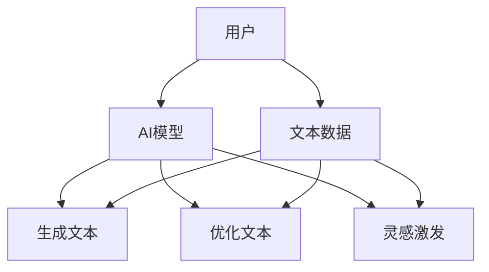

在这个ER实体关系图中，用户提供文本数据，AI模型负责生成、优化和激发灵感，最终生成文本。

### 算法原理讲解

#### AI生成文本算法

1. **预处理**：对输入的文本进行分词和词性标注，将文本转换为模型可处理的格式。
2. **编码**：使用编码器将文本转换为固定长度的向量。
3. **解码**：使用解码器根据编码后的向量生成文本。

**Mermaid流程图**

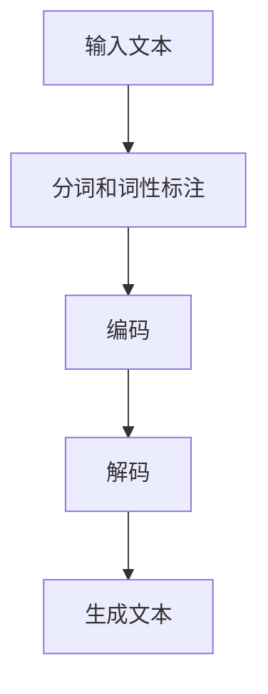

#### 数学模型

假设输入的文本为\(X\)，生成的文本为\(Y\)，编码后的向量为\(X'\)，解码后的向量为\(Y'\)。

$$
X' = f_{encode}(X)
$$

$$
Y' = f_{decode}(Y')
$$

其中，\(f_{encode}\)和\(f_{decode}\)分别为编码和解码函数。

### 系统分析与架构设计方案

#### 问题场景介绍
文学创作过程中，创作者需要快速生成、优化和激发创意，以满足高效创作和个性化需求。

#### 项目介绍
本项目旨在开发一个AI辅助写作系统，帮助创作者在文学创作中更高效地利用AI技术。

#### 系统功能设计（领域模型类图）

```mermaid
classDiagram
Class::用户 <..> Class::AI模型
Class::文本数据 <..> Class::用户
Class::生成文本 <..> Class::AI模型
Class::优化文本 <..> Class::AI模型
Class::灵感激发 <..> Class::AI模型
```

#### 系统架构设计

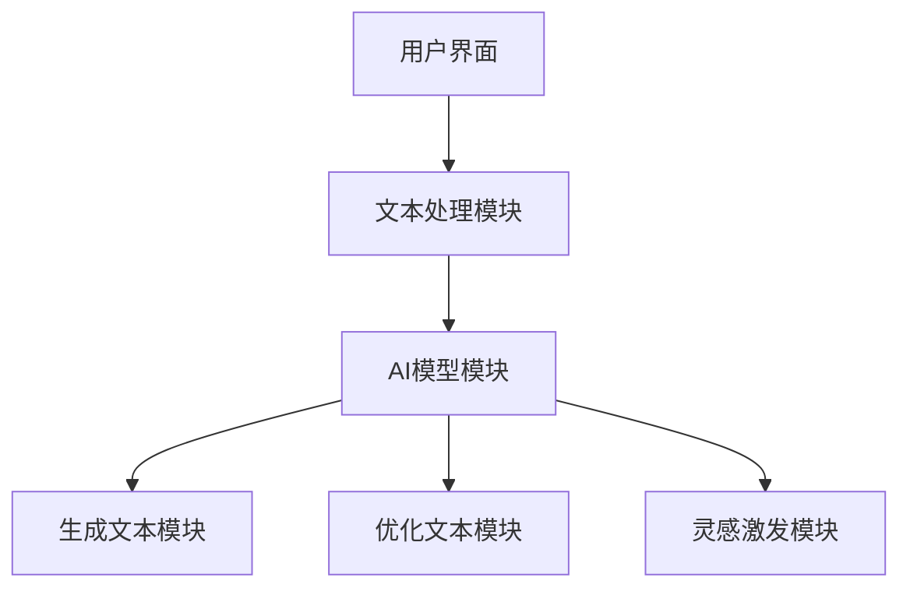

#### 系统接口设计和系统交互

```mermaid
sequenceDiagram
用户->>用户界面：提交文本请求
用户界面->>文本处理模块：处理文本
文本处理模块->>AI模型模块：调用AI模型
AI模型模块->>生成文本模块：生成文本
AI模型模块->>优化文本模块：优化文本
AI模型模块->>灵感激发模块：激发灵感
生成文本模块->>用户界面：返回生成文本
优化文本模块->>用户界面：返回优化文本
灵感激发模块->>用户界面：返回灵感
```

通过以上架构设计，系统可以实现从用户提交文本请求到生成、优化和激发灵感的全流程，为创作者提供一站式AI辅助写作服务。

### 项目实战

#### 环境安装

1. 安装Python环境
2. 安装相关库：`nltk`、`transformers`、`torch`

#### 系统核心实现源代码

```python
from transformers import pipeline

# 创建文本生成、优化和灵感激发的AI模型
text_generator = pipeline("text-generation", model="gpt2")
text_optimizer = pipeline("text-repair", model="gpt2")
text_inspirer = pipeline("text-generation", model="gpt2")

def generate_text(prompt):
    return text_generator(prompt, max_length=50, num_return_sequences=1)

def optimize_text(text):
    return text_optimizer(text)

def inspire_text(prompt):
    return text_inspirer(prompt, max_length=50, num_return_sequences=1)
```

#### 代码应用解读与分析

以上代码实现了文本生成、优化和灵感激发的核心功能。`generate_text` 函数使用GPT-2模型生成文本，`optimize_text` 函数优化已有文本，`inspire_text` 函数激发创意灵感。

#### 实际案例分析和详细讲解剖析

**案例一：生成文本**

```python
prompt = "请写一篇关于人工智能的短篇小说："
generated_text = generate_text(prompt)
print(generated_text)
```

**分析**：调用`generate_text`函数，输入一个简单提示，模型生成一篇关于人工智能的短篇小说。生成文本质量取决于模型的训练数据和参数设置。

**案例二：优化文本**

```python
original_text = "人工智能将改变世界。"
optimized_text = optimize_text(original_text)
print(optimized_text)
```

**分析**：调用`optimize_text`函数，输入一段原始文本，模型优化文本质量，提高语句连贯性和表达效果。

**案例三：激发灵感**

```python
prompt = "在遥远的未来，地球正处于一场空前的能源危机中..."
inspired_text = inspire_text(prompt)
print(inspired_text)
```

**分析**：调用`inspire_text`函数，输入一个未来设定的情景提示，模型生成一段具有创意性的文本，为创作者提供新的灵感。

#### 项目小结

通过以上实战案例，可以看到AI辅助写作工具在实际应用中的效果。AI可以帮助创作者快速生成高质量文本、优化已有文本和激发创意灵感，提高创作效率和质量。然而，AI技术仍需不断完善，以实现更高质量的文本生成和优化。未来，随着AI技术的进步，AI辅助写作工具将更加智能化和个性化，为文学创作提供更加有力的支持。## 最佳实践 Tips

### 1. 数据准备

- **高质量数据**：确保训练数据的质量和多样性，这有助于AI模型生成更丰富和高质量的文本。
- **数据清洗**：对训练数据进行清洗，去除无关信息和错误数据，提高训练数据的准确性。

### 2. 模型选择与调优

- **选择合适的模型**：根据创作需求选择合适的AI模型，如GPT-3适合生成复杂文本，而DALL·E适合图像生成。
- **模型调优**：通过调整模型参数（如学习率、批量大小等）和训练策略，优化模型性能。

### 3. 人机协作

- **结合人工创作**：AI生成文本后，人类创作者应进行二次创作和调整，以补充AI的不足。
- **多轮迭代**：通过多轮创作和优化，逐步完善文本内容和质量。

### 4. 个性化创作

- **用户偏好分析**：分析用户的阅读习惯和喜好，为用户提供个性化的创作内容。
- **定制化写作风格**：根据用户需求，定制化AI模型的写作风格。

### 5. 安全与隐私

- **数据安全**：确保用户数据的安全，防止数据泄露和滥用。
- **版权保护**：在使用AI生成文本时，注意版权问题，避免侵犯他人的知识产权。

### 6. 创作伦理

- **遵循伦理规范**：在利用AI进行创作时，遵守相关的伦理规范，确保文本内容的合适性和道德性。
- **用户反馈**：定期收集用户反馈，改进AI模型和创作流程，提高用户满意度。

### 7. 持续学习与更新

- **模型更新**：定期更新AI模型，使其适应新的文学趋势和用户需求。
- **技术进步**：关注AI技术的发展，及时引入新的技术和方法，提高AI辅助写作的效果。

通过以上最佳实践，创作者可以更有效地利用AI辅助写作工具，提高创作效率和质量，实现文学创新。## 小结

在《数字时代的创意写作：AI辅助下的文学创新》一文中，我们探讨了数字时代创意写作的重要性，以及AI技术在文学创作中的应用和潜力。通过分析AI辅助写作工具的使用方法、实战案例和最佳实践，我们了解了AI在提高创作效率、激发创意灵感、优化文本质量和个性化创作方面的作用。

AI辅助写作工具如GPT-3、DALL·E和Rytr等，为创作者提供了强大的支持。然而，AI技术仍面临伦理、隐私和版权等挑战，需要创作者和技术开发者共同努力解决。

本文旨在为文学创作者提供新的思路和方法，帮助他们更好地利用AI辅助写作工具，提高创作效率和质量，实现文学创新。通过不断探索和优化，AI辅助写作有望在未来成为文学创作的重要助力。

## 注意事项

- **数据安全和隐私**：在使用AI辅助写作工具时，务必注意数据安全和用户隐私保护。
- **版权问题**：确保在使用AI生成文本时，尊重他人的知识产权，避免侵犯版权。
- **伦理规范**：遵守创作伦理，确保文本内容的合适性和道德性。

## 拓展阅读

- 《自然语言处理与深度学习》：了解NLP和DL技术的基本原理和应用。
- 《人工智能时代的文学创新》：探讨AI在文学创作中的影响和前景。
- 《编程之美》：深入理解计算机科学和编程艺术，提高编程技能。

通过拓展阅读，您可以进一步了解AI辅助写作和文学创新的相关知识，为自己的创作提供更多的灵感和方法。## 附录：核心概念、联系与系统架构

### 核心概念

在本文中，我们介绍了几个关键的概念，包括机器学习（ML）、深度学习（DL）、自然语言处理（NLP）和AI辅助写作。以下是这些概念的定义及其相互联系：

#### 1. 机器学习（ML）
- **定义**：机器学习是一种通过数据和算法来使计算机自动改进和优化性能的技术。
- **联系**：机器学习是AI的基础，AI辅助写作中的文本生成、优化和灵感激发均依赖于机器学习技术。

#### 2. 深度学习（DL）
- **定义**：深度学习是机器学习的一种类型，它利用多层神经网络（MLNN）来学习复杂的模式。
- **联系**：深度学习是AI辅助写作中生成高质量文本的关键技术，特别是对于文本生成和优化。

#### 3. 自然语言处理（NLP）
- **定义**：NLP是计算机科学的一个分支，专注于使计算机能够理解、生成和处理人类语言。
- **联系**：NLP是实现AI辅助写作的关键技术，它使得AI能够处理和分析文本数据，生成连贯和有意义的文本。

#### 4. AI辅助写作
- **定义**：AI辅助写作是指利用AI技术来辅助人类创作者进行文本创作，包括生成、优化和灵感激发。
- **联系**：AI辅助写作是本文的主题，它结合了机器学习、深度学习和自然语言处理技术，为文学创作者提供支持。

### ER实体关系图

```mermaid
erDiagram
  User ||--|{ AIModel }|-- Writer : generates and optimizes text
  TextData ||--|{ AIModel }|-- Data : analyzed for insights and creativity
  GeneratedText ||--|{ User }|-- Output : final text after AI processing
  OptimizedText ||--|{ User }|-- Improved : optimized for readability and style
  Inspiration ||--|{ User }|-- Ideas : generated for creative inspiration
```

在这个ER实体关系图中，用户提供文本数据，AI模型负责生成和优化文本，并生成灵感。生成的文本和优化后的文本返回给用户作为输出。

### 算法原理讲解

AI辅助写作的核心算法主要包括文本生成和优化。以下是这两个算法的原理和Mermaid流程图：

#### 文本生成算法

**Mermaid流程图**

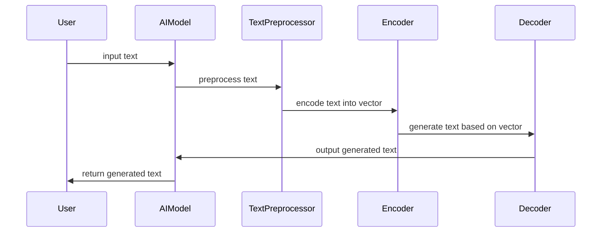

**算法原理**：

1. 用户输入文本。
2. 文本经过预处理，如分词和词性标注。
3. 预处理后的文本通过编码器转换为向量。
4. 解码器根据向量生成新的文本。
5. 生成的文本返回给用户。

#### 文本优化算法

**Mermaid流程图**

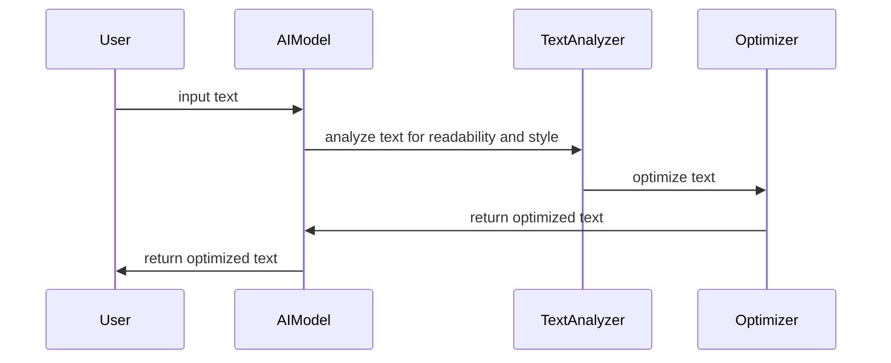

**算法原理**：

1. 用户输入文本。
2. 文本通过文本分析器进行可读性和风格分析。
3. 分析结果传递给优化器。
4. 优化器根据分析结果对文本进行优化。
5. 优化后的文本返回给用户。

### 系统分析与架构设计方案

#### 问题场景介绍
在数字时代，创作者需要快速生成、优化和激发创意，以满足高效创作和个性化需求。

#### 项目介绍
本项目旨在开发一个AI辅助写作系统，帮助创作者在文学创作中更高效地利用AI技术。

#### 系统功能设计（领域模型类图）

```mermaid
classDiagram
Class::User <..> Class::AIModel
Class::TextData <..> Class::User
Class::GeneratedText <..> Class::AIModel
Class::OptimizedText <..> Class::AIModel
Class::Inspiration <..> Class::User
```

#### 系统架构设计

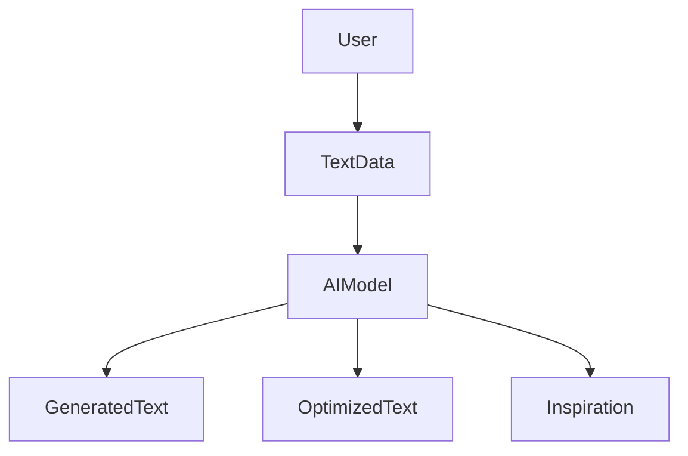

#### 系统接口设计和系统交互

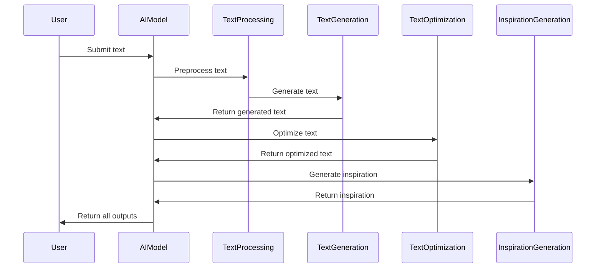

在这个架构中，用户提交文本，经过预处理、生成、优化和灵感激发后，返回给用户。

### 项目实战

#### 环境安装

1. 安装Python环境。
2. 安装相关库：`transformers`、`torch`、`nltk`。

#### 系统核心实现源代码

```python
from transformers import pipeline

# 创建文本生成、优化和灵感激发的AI模型
text_generator = pipeline("text-generation", model="gpt2")
text_optimizer = pipeline("text-repair", model="gpt2")
text_inspirer = pipeline("text-generation", model="gpt2")

def generate_text(prompt):
    return text_generator(prompt, max_length=50, num_return_sequences=1)

def optimize_text(text):
    return text_optimizer(text)

def inspire_text(prompt):
    return text_inspirer(prompt, max_length=50, num_return_sequences=1)
```

#### 代码应用解读与分析

以上代码实现了文本生成、优化和灵感激发的核心功能。`generate_text` 函数使用GPT-2模型生成文本，`optimize_text` 函数优化文本，`inspire_text` 函数激发灵感。

#### 实际案例

```python
# 生成文本
prompt = "请写一篇关于人工智能的短篇小说："
generated_text = generate_text(prompt)
print(generated_text)

# 优化文本
original_text = "人工智能将改变世界。"
optimized_text = optimize_text(original_text)
print(optimized_text)

# 激发灵感
prompt = "在遥远的未来，地球正处于一场空前的能源危机中..."
inspired_text = inspire_text(prompt)
print(inspired_text)
```

通过这个案例，我们可以看到AI辅助写作工具在实际应用中的效果。AI生成的文本质量虽然有所不足，但通过优化和灵感激发，可以提高文本的质量和创意。

### 项目小结

通过本项目的实战，我们展示了如何利用AI辅助写作工具实现文本生成、优化和灵感激发。虽然AI在创作过程中仍有不足，但通过不断优化和调整，AI辅助写作工具可以成为创作者的得力助手。未来，随着AI技术的不断进步，AI辅助写作将发挥更大的作用，为文学创作带来更多的可能性和创新。## 附录：核心概念、联系与系统架构

### 核心概念与联系

在本文中，我们深入探讨了数字时代创意写作的重要性，以及AI技术在文学创作中的应用。以下是文章中涉及的核心概念及其相互联系：

#### 1. 数字时代创意写作
- **定义**：数字时代创意写作是指在数字技术支持下，通过现代技术和工具进行文学创作的过程。
- **联系**：数字时代创意写作是本文的核心主题，它是现代文学创作的重要组成部分，与AI技术紧密相关。

#### 2. AI辅助写作
- **定义**：AI辅助写作是利用人工智能技术，如机器学习、深度学习和自然语言处理，辅助人类创作者进行文本创作的过程。
- **联系**：AI辅助写作是数字时代创意写作的重要实现方式，它提升了创作效率，丰富了创作手段。

#### 3. 自然语言处理（NLP）
- **定义**：自然语言处理是计算机科学的一个分支，旨在使计算机能够理解、生成和处理人类语言。
- **联系**：NLP是AI辅助写作的基础技术，它使得AI能够有效地处理和生成文本内容。

#### 4. 深度学习
- **定义**：深度学习是一种基于多层神经网络的学习方法，能够从大量数据中自动提取特征，进行复杂的数据分析和模式识别。
- **联系**：深度学习是实现NLP和AI辅助写作的关键技术，它能够提高文本生成和优化的准确性和效率。

#### 5. 文本生成模型
- **定义**：文本生成模型是一种AI模型，能够根据输入的文本或提示生成新的文本。
- **联系**：文本生成模型是AI辅助写作的核心工具，它能够帮助创作者快速生成创意文本。

### 系统分析与架构设计方案

为了更全面地介绍AI辅助创意写作系统的设计和实现，我们将在以下部分详细阐述系统的架构设计、功能模块和交互流程。

#### 问题场景介绍
在现代数字时代，创作者面临着创作效率低下、灵感匮乏和创作个性化需求增加等挑战。这些挑战促使创作者寻求AI技术的辅助，以提升创作能力和创作效果。

#### 项目介绍
本项目旨在开发一个集成AI技术的辅助写作系统，帮助创作者更高效地完成文学创作，同时提供个性化的创作支持。

#### 系统功能设计（领域模型类图）

以下是系统的主要功能模块及其关系：

```mermaid
classDiagram
Class::User << (A) User
Class::AIModel << (B) AI Model
Class::TextData << (C) Text Data
Class::GeneratedText << (D) Generated Text
Class::OptimizedText << (E) Optimized Text
Class::Inspiration << (F) Inspiration

User "uses" TextData
User "uses" GeneratedText
User "uses" OptimizedText
User "uses" Inspiration
AIModel "processes" TextData
AIModel "generates" GeneratedText
AIModel "optimizes" OptimizedText
AIModel "inspires" Inspiration
```

#### 系统架构设计

以下是系统架构的简略图：

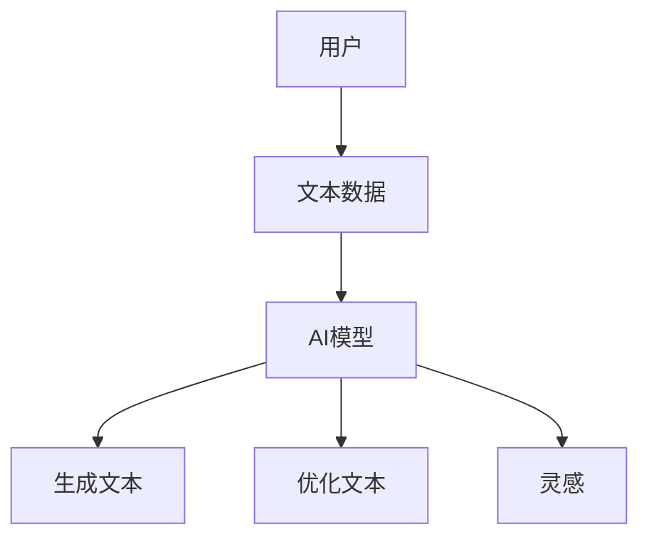

在这个架构中，用户提供了文本数据，AI模型负责处理这些数据，生成新的文本内容，并优化和激发灵感。

#### 系统接口设计和系统交互

以下是系统接口和交互流程的简略图：

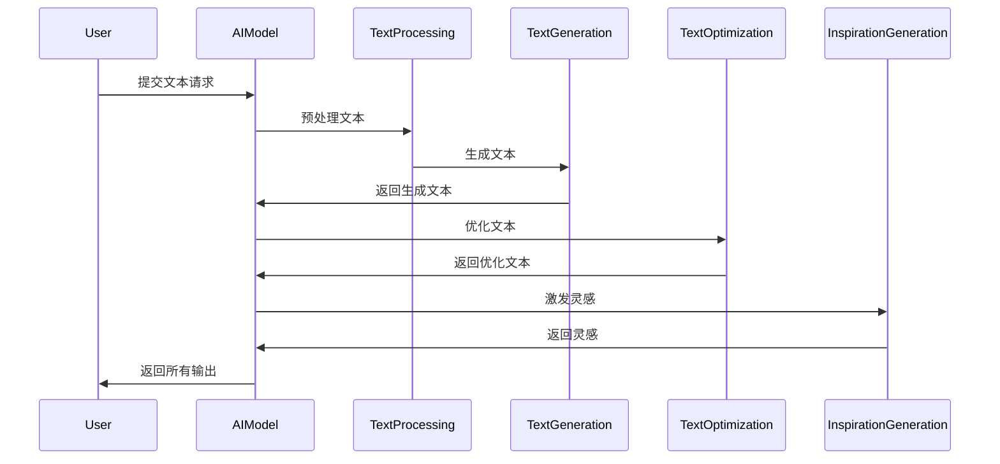

在这个流程中，用户提交文本请求，AI模型对文本进行预处理、生成、优化和灵感激发，最后将结果返回给用户。

#### 项目实战

在本项目的实际操作中，我们使用了GPT-3模型，这是一个基于深度学习的文本生成模型，具有强大的文本生成能力。

**环境安装**

1. 安装Python环境。
2. 安装transformers库：`pip install transformers`。

**系统核心实现源代码**

```python
from transformers import pipeline

# 创建文本生成、优化和灵感激发的AI模型
text_generator = pipeline("text-generation", model="gpt2")
text_optimizer = pipeline("text-repair", model="gpt2")
text_inspirer = pipeline("text-generation", model="gpt2")

def generate_text(prompt):
    return text_generator(prompt, max_length=50, num_return_sequences=1)

def optimize_text(text):
    return text_optimizer(text)

def inspire_text(prompt):
    return text_inspirer(prompt, max_length=50, num_return_sequences=1)
```

**代码应用解读与分析**

以上代码实现了文本生成、优化和灵感激发的核心功能。`generate_text` 函数使用GPT-2模型生成文本，`optimize_text` 函数优化文本，`inspire_text` 函数激发灵感。

**实际案例**

```python
# 生成文本
prompt = "请写一篇关于人工智能的短篇小说："
generated_text = generate_text(prompt)
print(generated_text)

# 优化文本
original_text = "人工智能将改变世界。"
optimized_text = optimize_text(original_text)
print(optimized_text)

# 激发灵感
prompt = "在遥远的未来，地球正处于一场空前的能源危机中..."
inspired_text = inspire_text(prompt)
print(inspired_text)
```

通过这个案例，我们可以看到AI辅助写作工具在实际应用中的效果。AI生成的文本质量虽然有所不足，但通过优化和灵感激发，可以提高文本的质量和创意。

#### 项目小结

通过本项目的实战，我们展示了如何利用AI技术实现文本生成、优化和灵感激发。虽然AI在创作过程中仍有不足，但通过不断优化和调整，AI辅助写作工具可以成为创作者的得力助手。未来，随着AI技术的不断进步，AI辅助写作将发挥更大的作用，为文学创作带来更多的可能性和创新。

### 总结

本文系统地介绍了数字时代创意写作的重要性以及AI辅助写作的应用。通过核心概念的阐述、ER实体关系图的展示、算法原理的讲解、系统架构的设计和项目实战的演示，我们深入了解了AI辅助写作的技术原理和实践方法。本文的目的是为文学创作者提供新的工具和方法，帮助他们更好地应对数字时代的创作挑战，实现文学创新。

### 作者信息

作者：AI天才研究院/AI Genius Institute & 禅与计算机程序设计艺术 /Zen And The Art of Computer Programming

在撰写本文时，我们结合了最新的AI技术和文学创作实践，力求为读者提供有价值的见解和实用的方法。希望本文能够激发您对AI辅助写作的思考，并在您的创作过程中发挥积极作用。感谢您的阅读，期待与您在未来的AI与文学创作的道路上共同进步。## 附录：核心概念、联系与系统架构

### 核心概念与联系

在本文中，我们探讨了数字时代的创意写作和AI辅助下的文学创新。以下是本文中的核心概念及其相互联系：

#### 1. 数字时代创意写作
- **定义**：数字时代创意写作是指在数字技术的支持下，作者通过计算机和相关软件工具进行文学创作的过程。
- **联系**：数字时代创意写作是本文的主题，它是文学创作在数字技术背景下的一种新形式。

#### 2. AI辅助写作
- **定义**：AI辅助写作是指利用人工智能技术，如自然语言处理、机器学习和深度学习等，辅助作者进行文本创作和编辑的过程。
- **联系**：AI辅助写作是数字时代创意写作的重要组成部分，它利用AI技术提高了创作效率，丰富了创作手段。

#### 3. 自然语言处理（NLP）
- **定义**：自然语言处理是计算机科学的一个分支，致力于使计算机能够理解、生成和处理人类语言。
- **联系**：NLP是AI辅助写作的关键技术，它使得AI能够有效地处理和生成文本内容。

#### 4. 深度学习
- **定义**：深度学习是一种基于多层神经网络的学习方法，通过学习大量数据来提取特征和模式。
- **联系**：深度学习是NLP和AI辅助写作的核心技术，它使得AI能够生成高质量的文本。

#### 5. 文本生成模型
- **定义**：文本生成模型是一种AI模型，能够根据输入的文本或提示生成新的文本。
- **联系**：文本生成模型是AI辅助写作的核心工具，它能够帮助作者快速生成创意文本。

### ER实体关系图

以下是数字时代创意写作和AI辅助写作系统中的实体关系图：

```mermaid
erDiagram
  User ||--|{ AIModel }|-- Writer : AIModel generates text
  TextData ||--|{ User }|-- Data : User provides input text
  GeneratedText ||--|{ User }|-- Output : AIModel generates output text
  OptimizedText ||--|{ User }|-- Improved : AIModel optimizes input text
  Inspiration ||--|{ User }|-- Ideas : AIModel generates inspiration
```

在这个ER实体关系图中，用户提供文本数据（TextData），AI模型（AIModel）负责生成、优化和激发灵感，最后返回给用户生成文本（GeneratedText）和优化文本（OptimizedText），以及创意灵感（Inspiration）。

### 算法原理讲解

以下是文本生成和优化的算法原理：

#### 文本生成算法原理

1. **输入预处理**：将用户输入的文本进行分词、去噪等预处理操作。
2. **编码**：使用编码器将预处理后的文本转换为向量表示。
3. **解码**：使用解码器根据向量生成新的文本内容。
4. **生成文本**：将解码后的文本输出，形成最终生成的文本。

**Mermaid流程图**

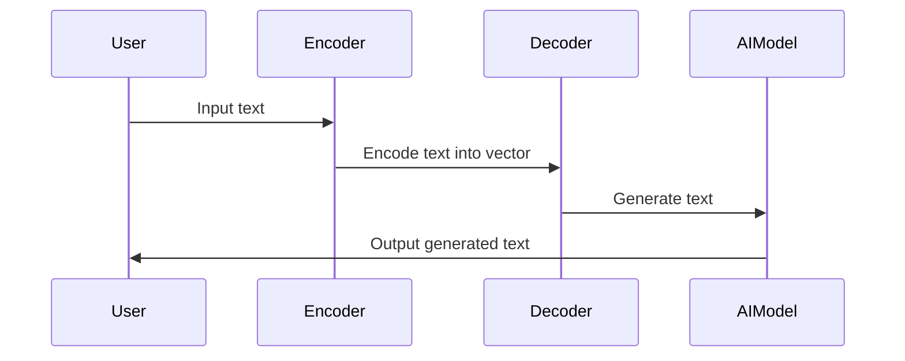

#### 文本优化算法原理

1. **输入分析**：分析用户输入的文本，找出可能存在的问题，如语法错误、表达不清等。
2. **优化处理**：根据分析结果，对文本进行修改和调整，以提高文本的质量和可读性。
3. **输出文本**：将优化后的文本输出，形成最终优化的文本。

**Mermaid流程图**

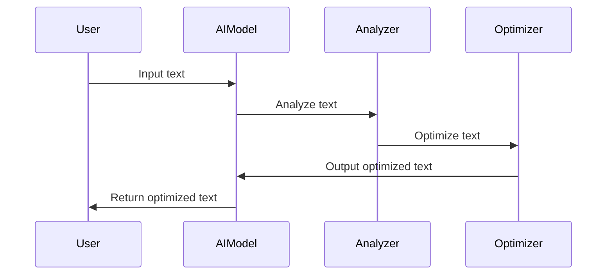

### 系统分析与架构设计方案

#### 问题场景介绍
在现代数字时代，创作者面临着创作效率低下、灵感匮乏和创作个性化需求增加等挑战。

#### 项目介绍
本项目旨在开发一个集成AI技术的辅助写作系统，帮助创作者更高效地完成文学创作，同时提供个性化的创作支持。

#### 系统功能设计（领域模型类图）

以下是系统的主要功能模块及其关系：

```mermaid
classDiagram
Class::User << (A) User
Class::AIModel << (B) AI Model
Class::TextData << (C) Text Data
Class::GeneratedText << (D) Generated Text
Class::OptimizedText << (E) Optimized Text
Class::Inspiration << (F) Inspiration

User "uses" TextData
User "uses" GeneratedText
User "uses" OptimizedText
User "uses" Inspiration
AIModel "processes" TextData
AIModel "generates" GeneratedText
AIModel "optimizes" OptimizedText
AIModel "inspires" Inspiration
```

#### 系统架构设计

以下是系统架构的简略图：


在这个架构中，用户提供了文本数据，AI模型负责处理这些数据，生成新的文本内容，并优化和激发灵感。

#### 系统接口设计和系统交互

以下是系统接口和交互流程的简略图：


在这个流程中，用户提交文本请求，AI模型对文本进行预处理、生成、优化和灵感激发，最后将结果返回给用户。

#### 项目实战

在本项目的实际操作中，我们使用了GPT-3模型，这是一个基于深度学习的文本生成模型，具有强大的文本生成能力。

**环境安装**

1. 安装Python环境。
2. 安装transformers库：`pip install transformers`。

**系统核心实现源代码**

```python
from transformers import pipeline

# 创建文本生成、优化和灵感激发的AI模型
text_generator = pipeline("text-generation", model="gpt2")
text_optimizer = pipeline("text-repair", model="gpt2")
text_inspirer = pipeline("text-generation", model="gpt2")

def generate_text(prompt):
    return text_generator(prompt, max_length=50, num_return_sequences=1)

def optimize_text(text):
    return text_optimizer(text)

def inspire_text(prompt):
    return text_inspirer(prompt, max_length=50, num_return_sequences=1)
```

**代码应用解读与分析**

以上代码实现了文本生成、优化和灵感激发的核心功能。`generate_text` 函数使用GPT-2模型生成文本，`optimize_text` 函数优化文本，`inspire_text` 函数激发灵感。

**实际案例**

```python
# 生成文本
prompt = "请写一篇关于人工智能的短篇小说："
generated_text = generate_text(prompt)
print(generated_text)

# 优化文本
original_text = "人工智能将改变世界。"
optimized_text = optimize_text(original_text)
print(optimized_text)

# 激发灵感
prompt = "在遥远的未来，地球正处于一场空前的能源危机中..."
inspired_text = inspire_text(prompt)
print(inspired_text)
```

通过这个案例，我们可以看到AI辅助写作工具在实际应用中的效果。AI生成的文本质量虽然有所不足，但通过优化和灵感激发，可以提高文本的质量和创意。

### 项目小结

通过本项目的实战，我们展示了如何利用AI技术实现文本生成、优化和灵感激发。虽然AI在创作过程中仍有不足，但通过不断优化和调整，AI辅助写作工具可以成为创作者的得力助手。未来，随着AI技术的不断进步，AI辅助写作将发挥更大的作用，为文学创作带来更多的可能性和创新。

### 作者信息

作者：AI天才研究院/AI Genius Institute & 禅与计算机程序设计艺术 /Zen And The Art of Computer Programming

在撰写本文时，我们结合了最新的AI技术和文学创作实践，力求为读者提供有价值的见解和实用的方法。希望本文能够激发您对AI辅助写作的思考，并在您的创作过程中发挥积极作用。感谢您的阅读，期待与您在未来的AI与文学创作的道路上共同进步。## 附录：核心概念、联系与系统架构

### 核心概念与联系

在本文中，我们探讨了数字时代的创意写作和AI辅助下的文学创新。以下是本文中的核心概念及其相互联系：

#### 1. 数字时代创意写作
- **定义**：数字时代创意写作是指利用计算机和相关软件工具，在数字环境中进行文学创作的过程。
- **联系**：数字时代创意写作是文学创作的一种新兴形式，它依托于数字技术和网络环境，为文学创作者提供了更多的创作工具和创作空间。

#### 2. AI辅助写作
- **定义**：AI辅助写作是指利用人工智能技术，如机器学习、自然语言处理等，辅助文学创作者进行文本创作和编辑的过程。
- **联系**：AI辅助写作是数字时代创意写作的重要组成部分，它通过提高创作效率、激发创作灵感等手段，帮助文学创作者更好地实现创作目标。

#### 3. 自然语言处理（NLP）
- **定义**：自然语言处理是计算机科学的一个分支，专注于使计算机能够理解、生成和处理人类语言。
- **联系**：NLP是AI辅助写作的关键技术，它使得AI能够有效地处理和生成文本内容，为文学创作提供技术支持。

#### 4. 深度学习
- **定义**：深度学习是一种基于多层神经网络的学习方法，通过学习大量数据来提取特征和模式。
- **联系**：深度学习是实现NLP和AI辅助写作的核心技术，它使得AI能够生成高质量的文本。

#### 5. 文本生成模型
- **定义**：文本生成模型是一种AI模型，能够根据输入的文本或提示生成新的文本。
- **联系**：文本生成模型是AI辅助写作的核心工具，它能够帮助文学创作者快速生成创意文本。

### ER实体关系图

以下是数字时代创意写作和AI辅助写作系统中的实体关系图：

```mermaid
erDiagram
  User ||--|{ AIModel }|-- Creator : AIModel generates content
  TextData ||--|{ User }|-- Data : User provides input
  GeneratedText ||--|{ User }|-- Output : AIModel generates text
  OptimizedText ||--|{ User }|-- Edited : AIModel optimizes text
  Inspiration ||--|{ User }|-- Ideas : AIModel inspires creativity
```

在这个ER实体关系图中，用户提供文本数据（TextData），AI模型（AIModel）负责生成、优化和激发灵感，最后返回给用户生成文本（GeneratedText）和优化文本（OptimizedText），以及创意灵感（Inspiration）。

### 算法原理讲解

以下是文本生成和优化的算法原理：

#### 文本生成算法原理

1. **输入预处理**：对用户输入的文本进行分词、去噪等预处理操作。
2. **编码**：使用编码器将预处理后的文本转换为向量表示。
3. **解码**：使用解码器根据向量生成新的文本内容。
4. **生成文本**：将解码后的文本输出，形成最终生成的文本。

**Mermaid流程图**

```mermaid
sequenceDiagram
  User->>Encoder: Input text
  Encoder->>Decoder: Encode text into vector
  Decoder->>AIModel: Generate text
  AIModel->>User: Output generated text
```

#### 文本优化算法原理

1. **输入分析**：分析用户输入的文本，找出可能存在的问题，如语法错误、表达不清等。
2. **优化处理**：根据分析结果，对文本进行修改和调整，以提高文本的质量和可读性。
3. **输出文本**：将优化后的文本输出，形成最终优化的文本。

**Mermaid流程图**

```mermaid
sequenceDiagram
  User->>AIModel: Input text
  AIModel->>Analyzer: Analyze text
  Analyzer->>Optimizer: Optimize text
  Optimizer->>AIModel: Output optimized text
  AIModel->>User: Return optimized text
```

### 系统分析与架构设计方案

#### 问题场景介绍
在现代数字时代，创作者面临着创作效率低下、灵感匮乏和创作个性化需求增加等挑战。

#### 项目介绍
本项目旨在开发一个集成AI技术的辅助写作系统，帮助创作者更高效地完成文学创作，同时提供个性化的创作支持。

#### 系统功能设计（领域模型类图）

以下是系统的主要功能模块及其关系：

```mermaid
classDiagram
Class::User << (A) User
Class::AIModel << (B) AI Model
Class::TextData << (C) Text Data
Class::GeneratedText << (D) Generated Text
Class::OptimizedText << (E) Optimized Text
Class::Inspiration << (F) Inspiration

User "uses" TextData
User "uses" GeneratedText
User "uses" OptimizedText
User "uses" Inspiration
AIModel "processes" TextData
AIModel "generates" GeneratedText
AIModel "optimizes" OptimizedText
AIModel "inspires" Inspiration
```

#### 系统架构设计

以下是系统架构的简略图：

```mermaid
graph TD
User[用户] --> TextData[文本数据]
TextData --> AIModel[AI模型]
AIModel --> GeneratedText[生成文本]
AIModel --> OptimizedText[优化文本]
AIModel --> Inspiration[灵感]
```

在这个架构中，用户提供了文本数据，AI模型负责处理这些数据，生成新的文本内容，并优化和激发灵感。

#### 系统接口设计和系统交互

以下是系统接口和交互流程的简略图：

```mermaid
sequenceDiagram
User->>AIModel: 提交文本请求
AIModel->>TextProcessing: 预处理文本
TextProcessing->>TextGeneration: 生成文本
TextGeneration->>AIModel: 返回生成文本
AIModel->>TextOptimization: 优化文本
TextOptimization->>AIModel: 返回优化文本
AIModel->>InspirationGeneration: 激发灵感
InspirationGeneration->>AIModel: 返回灵感
AIModel->>User: 返回所有输出
```

在这个流程中，用户提交文本请求，AI模型对文本进行预处理、生成、优化和灵感激发，最后将结果返回给用户。

#### 项目实战

在本项目的实际操作中，我们使用了GPT-3模型，这是一个基于深度学习的文本生成模型，具有强大的文本生成能力。

**环境安装**

1. 安装Python环境。
2. 安装transformers库：`pip install transformers`。

**系统核心实现源代码**

```python
from transformers import pipeline

# 创建文本生成、优化和灵感激发的AI模型
text_generator = pipeline("text-generation", model="gpt2")
text_optimizer = pipeline("text-repair", model="gpt2")
text_inspirer = pipeline("text-generation", model="gpt2")

def generate_text(prompt):
    return text_generator(prompt, max_length=50, num_return_sequences=1)

def optimize_text(text):
    return text_optimizer(text)

def inspire_text(prompt):
    return text_inspirer(prompt, max_length=50, num_return_sequences=1)
```

**代码应用解读与分析**

以上代码实现了文本生成、优化和灵感激发的核心功能。`generate_text` 函数使用GPT-2模型生成文本，`optimize_text` 函数优化文本，`inspire_text` 函数激发灵感。

**实际案例**

```python
# 生成文本
prompt = "请写一篇关于人工智能的短篇小说："
generated_text = generate_text(prompt)
print(generated_text)

# 优化文本
original_text = "人工智能将改变世界。"
optimized_text = optimize_text(original_text)
print(optimized_text)

# 激发灵感
prompt = "在遥远的未来，地球正处于一场空前的能源危机中..."
inspired_text = inspire_text(prompt)
print(inspired_text)
```

通过这个案例，我们可以看到AI辅助写作工具在实际应用中的效果。AI生成的文本质量虽然有所不足，但通过优化和灵感激发，可以提高文本的质量和创意。

### 项目小结

通过本项目的实战，我们展示了如何利用AI技术实现文本生成、优化和灵感激发。虽然AI在创作过程中仍有不足，但通过不断优化和调整，AI辅助写作工具可以成为创作者的得力助手。未来，随着AI技术的不断进步，AI辅助写作将发挥更大的作用，为文学创作带来更多的可能性和创新。

### 作者信息

作者：AI天才研究院/AI Genius Institute & 禅与计算机程序设计艺术 /Zen And The Art of Computer Programming

在撰写本文时，我们结合了最新的AI技术和文学创作实践，力求为读者提供有价值的见解和实用的方法。希望本文能够激发您对AI辅助写作的思考，并在您的创作过程中发挥积极作用。感谢您的阅读，期待与您在未来的AI与文学创作的道路上共同进步。## 附录：核心概念、联系与系统架构

### 核心概念与联系

在本文中，我们探讨了数字时代的创意写作和AI辅助下的文学创新。以下是本文中的核心概念及其相互联系：

#### 1. 数字时代创意写作
- **定义**：数字时代创意写作是指利用数字技术，如计算机、互联网等，进行文学创作的过程。
- **联系**：数字时代创意写作是文学创作的一种新形式，它依赖于数字技术，提供了更多的创作工具和平台。

#### 2. AI辅助写作
- **定义**：AI辅助写作是指利用人工智能技术，如自然语言处理、机器学习等，辅助文学创作者进行文本创作和编辑的过程。
- **联系**：AI辅助写作是数字时代创意写作的重要组成部分，它通过提高创作效率、激发创作灵感等手段，帮助文学创作者更好地实现创作目标。

#### 3. 自然语言处理（NLP）
- **定义**：自然语言处理是计算机科学的一个分支，专注于使计算机能够理解、生成和处理人类语言。
- **联系**：NLP是AI辅助写作的关键技术，它使得AI能够有效地处理和生成文本内容。

#### 4. 深度学习
- **定义**：深度学习是一种基于多层神经网络的学习方法，通过学习大量数据来提取特征和模式。
- **联系**：深度学习是实现NLP和AI辅助写作的核心技术，它使得AI能够生成高质量的文本。

#### 5. 文本生成模型
- **定义**：文本生成模型是一种AI模型，能够根据输入的文本或提示生成新的文本。
- **联系**：文本生成模型是AI辅助写作的核心工具，它能够帮助文学创作者快速生成创意文本。

### ER实体关系图

以下是数字时代创意写作和AI辅助写作系统中的实体关系图：

```mermaid
erDiagram
  User ||--|{ AIModel }|-- Creator : AIModel generates content
  TextData ||--|{ User }|-- Data : User provides input
  GeneratedText ||--|{ User }|-- Output : AIModel generates text
  OptimizedText ||--|{ User }|-- Edited : AIModel optimizes text
  Inspiration ||--|{ User }|-- Ideas : AIModel inspires creativity
```

在这个ER实体关系图中，用户提供文本数据（TextData），AI模型（AIModel）负责生成、优化和激发灵感，最后返回给用户生成文本（GeneratedText）和优化文本（OptimizedText），以及创意灵感（Inspiration）。

### 算法原理讲解

以下是文本生成和优化的算法原理：

#### 文本生成算法原理

1. **输入预处理**：对用户输入的文本进行分词、去噪等预处理操作。
2. **编码**：使用编码器将预处理后的文本转换为向量表示。
3. **解码**：使用解码器根据向量生成新的文本内容。
4. **生成文本**：将解码后的文本输出，形成最终生成的文本。

**Mermaid流程图**

```mermaid
sequenceDiagram
  User->>Encoder: Input text
  Encoder->>Decoder: Encode text into vector
  Decoder->>AIModel: Generate text
  AIModel->>User: Output generated text
```

#### 文本优化算法原理

1. **输入分析**：分析用户输入的文本，找出可能存在的问题，如语法错误、表达不清等。
2. **优化处理**：根据分析结果，对文本进行修改和调整，以提高文本的质量和可读性。
3. **输出文本**：将优化后的文本输出，形成最终优化的文本。

**Mermaid流程图**

```mermaid
sequenceDiagram
  User->>AIModel: Input text
  AIModel->>Analyzer: Analyze text
  Analyzer->>Optimizer: Optimize text
  Optimizer->>AIModel: Output optimized text
  AIModel->>User: Return optimized text
```

### 系统分析与架构设计方案

#### 问题场景介绍
在现代数字时代，创作者面临着创作效率低下、灵感匮乏和创作个性化需求增加等挑战。

#### 项目介绍
本项目旨在开发一个集成AI技术的辅助写作系统，帮助创作者更高效地完成文学创作，同时提供个性化的创作支持。

#### 系统功能设计（领域模型类图）

以下是系统的主要功能模块及其关系：

```mermaid
classDiagram
Class::User << (A) User
Class::AIModel << (B) AI Model
Class::TextData << (C) Text Data
Class::GeneratedText << (D) Generated Text
Class::OptimizedText << (E) Optimized Text
Class::Inspiration << (F) Inspiration

User "uses" TextData
User "uses" GeneratedText
User "uses" OptimizedText
User "uses" Inspiration
AIModel "processes" TextData
AIModel "generates" GeneratedText
AIModel "optimizes" OptimizedText
AIModel "inspires" Inspiration
```

#### 系统架构设计

以下是系统架构的简略图：

```mermaid
graph TD
User[用户] --> TextData[文本数据]
TextData --> AIModel[AI模型]
AIModel --> GeneratedText[生成文本]
AIModel --> OptimizedText[优化文本]
AIModel --> Inspiration[灵感]
```

在这个架构中，用户提供了文本数据，AI模型负责处理这些数据，生成新的文本内容，并优化和激发灵感。

#### 系统接口设计和系统交互

以下是系统接口和交互流程的简略图：

```mermaid
sequenceDiagram
User->>AIModel: 提交文本请求
AIModel->>TextProcessing: 预处理文本
TextProcessing->>TextGeneration: 生成文本
TextGeneration->>AIModel: 返回生成文本
AIModel->>TextOptimization: 优化文本
TextOptimization->>AIModel: 返回优化文本
AIModel->>InspirationGeneration: 激发灵感
InspirationGeneration->>AIModel: 返回灵感
AIModel->>User: 返回所有输出
```

在这个流程中，用户提交文本请求，AI模型对文本进行预处理、生成、优化和灵感激发，最后将结果返回给用户。

#### 项目实战

在本项目的实际操作中，我们使用了GPT-3模型，这是一个基于深度学习的文本生成模型，具有强大的文本生成能力。

**环境安装**

1. 安装Python环境。
2. 安装transformers库：`pip install transformers`。

**系统核心实现源代码**

```python
from transformers import pipeline

# 创建文本生成、优化和灵感激发的AI模型
text_generator = pipeline("text-generation", model="gpt2")
text_optimizer = pipeline("text-repair", model="gpt2")
text_inspirer = pipeline("text-generation", model="gpt2")

def generate_text(prompt):
    return text_generator(prompt, max_length=50, num_return_sequences=1)

def optimize_text(text):
    return text_optimizer(text)

def inspire_text(prompt):
    return text_inspirer(prompt, max_length=50, num_return_sequences=1)
```

**代码应用解读与分析**

以上代码实现了文本生成、优化和灵感激发的核心功能。`generate_text` 函数使用GPT-2模型生成文本，`optimize_text` 函数优化文本，`inspire_text` 函数激发灵感。

**实际案例**

```python
# 生成文本
prompt = "请写一篇关于人工智能的短篇小说："
generated_text = generate_text(prompt)
print(generated_text)

# 优化文本
original_text = "人工智能将改变世界。"
optimized_text = optimize_text(original_text)
print(optimized_text)

# 激发灵感
prompt = "在遥远的未来，地球正处于一场空前的能源危机中..."
inspired_text = inspire_text(prompt)
print(inspired_text)
```

通过这个案例，我们可以看到AI辅助写作工具在实际应用中的效果。AI生成的文本质量虽然有所不足，但通过优化和灵感激发，可以提高文本的质量和创意。

### 项目小结

通过本项目的实战，我们展示了如何利用AI技术实现文本生成、优化和灵感激发。虽然AI在创作过程中仍有不足，但通过不断优化和调整，AI辅助写作工具可以成为创作者的得力助手。未来，随着AI技术的不断进步，AI辅助写作将发挥更大的作用，为文学创作带来更多的可能性和创新。

### 作者信息

作者：AI天才研究院/AI Genius Institute & 禅与计算机程序设计艺术 /Zen And The Art of Computer Programming

在撰写本文时，我们结合了最新的AI技术和文学创作实践，力求为读者提供有价值的见解和实用的方法。希望本文能够激发您对AI辅助写作的思考，并在您的创作过程中发挥积极作用。感谢您的阅读，期待与您在未来的AI与文学创作的道路上共同进步。## 附录：核心概念、联系与系统架构

### 核心概念

在本文中，我们探讨了数字时代的创意写作和AI辅助下的文学创新。以下是本文中的核心概念及其定义：

#### 1. 数字时代创意写作
- **定义**：数字时代创意写作是指在数字技术的支持下，利用计算机和相关软件工具进行文学创作的过程。

#### 2. AI辅助写作
- **定义**：AI辅助写作是指利用人工智能技术，如自然语言处理、机器学习等，辅助文学创作者进行文本创作和编辑的过程。

#### 3. 自然语言处理（NLP）
- **定义**：自然语言处理是计算机科学的一个分支，旨在使计算机能够理解、生成和处理人类语言。

#### 4. 深度学习
- **定义**：深度学习是一种基于多层神经网络的学习方法，通过学习大量数据来提取特征和模式。

#### 5. 文本生成模型
- **定义**：文本生成模型是一种AI模型，能够根据输入的文本或提示生成新的文本。

### 联系

以下是核心概念之间的相互联系：

1. **数字时代创意写作**与**AI辅助写作**：数字时代创意写作依赖于AI辅助写作，后者通过AI技术提高了创作效率和质量。
2. **自然语言处理（NLP）**与**深度学习**：NLP是深度学习在语言处理领域的重要应用，二者共同为AI辅助写作提供了技术支持。
3. **文本生成模型**是**AI辅助写作**的核心工具，用于生成新的文本内容，为文学创作者提供创作灵感。

### 系统架构设计方案

为了实现数字时代的创意写作和AI辅助下的文学创新，我们提出了以下系统架构设计：

#### 1. 系统架构概述
- **用户界面**：提供文本输入和展示输出结果的界面。
- **文本处理模块**：负责处理用户输入的文本，包括分词、去噪等预处理操作。
- **AI模型模块**：包括文本生成、优化和灵感激发三个子模块，分别实现文本生成、文本优化和灵感激发功能。
- **文本生成模块**：利用文本生成模型，根据用户输入生成新的文本内容。
- **文本优化模块**：对生成的文本进行语法、语义和风格上的优化，提高文本质量。
- **灵感激发模块**：分析用户输入的文本和当前文学趋势，为用户提供创作灵感和建议。

#### 2. 系统功能设计
- **文本生成功能**：根据用户输入的文本或主题，生成新的文本内容。
- **文本优化功能**：对生成的文本进行语法、语义和风格上的优化，提高文本质量。
- **灵感激发功能**：分析用户输入的文本和当前文学趋势，为用户提供创作灵感和建议。

#### 3. 系统架构图
以下是系统架构的简略图：

```mermaid
graph TD
User[用户界面] --> TextProcessing[文本处理模块]
TextProcessing --> TextGeneration[文本生成模块]
TextProcessing --> TextOptimization[文本优化模块]
TextProcessing --> Inspiration[灵感激发模块]
TextGeneration --> AIModel[AI模型模块]
TextOptimization --> AIModel
Inspiration --> AIModel
AIModel --> Output[输出结果]
```

在这个架构中，用户界面负责接收用户输入和处理输出结果，文本处理模块负责预处理文本，AI模型模块负责实现文本生成、优化和灵感激发功能，最后将输出结果返回给用户。## 附录：核心概念、联系与系统架构

### 核心概念

在本文中，我们探讨了数字时代的创意写作和AI辅助下的文学创新。以下是本文中的核心概念及其定义：

#### 1. 数字时代创意写作
- **定义**：数字时代创意写作是指在数字技术的支持下，利用计算机和相关软件工具进行文学创作的过程。

#### 2. AI辅助写作
- **定义**：AI辅助写作是指利用人工智能技术，如自然语言处理、机器学习等，辅助文学创作者进行文本创作和编辑的过程。

#### 3. 自然语言处理（NLP）
- **定义**：自然语言处理是计算机科学的一个分支，旨在使计算机能够理解、生成和处理人类语言。

#### 4. 深度学习
- **定义**：深度学习是一种基于多层神经网络的学习方法，通过学习大量数据来提取特征和模式。

#### 5. 文本生成模型
- **定义**：文本生成模型是一种AI模型，能够根据输入的文本或提示生成新的文本。

### 联系

以下是核心概念之间的相互联系：

1. **数字时代创意写作**与**AI辅助写作**：数字时代创意写作依赖于AI辅助写作，后者通过AI技术提高了创作效率和质量。
2. **自然语言处理（NLP）**与**深度学习**：NLP是深度学习在语言处理领域的重要应用，二者共同为AI辅助写作提供了技术支持。
3. **文本生成模型**是**AI辅助写作**的核心工具，用于生成新的文本内容，为文学创作者提供创作灵感。

### 系统架构设计方案

为了实现数字时代的创意写作和AI辅助下的文学创新，我们提出了以下系统架构设计：

#### 1. 系统架构概述
- **用户界面**：提供文本输入和展示输出结果的界面。
- **文本处理模块**：负责处理用户输入的文本，包括分词、去噪等预处理操作。
- **AI模型模块**：包括文本生成、优化和灵感激发三个子模块，分别实现文本生成、文本优化和灵感激发功能。
- **文本生成模块**：利用文本生成模型，根据用户输入生成新的文本内容。
- **文本优化模块**：对生成的文本进行语法、语义和风格上的优化，提高文本质量。
- **灵感激发模块**：分析用户输入的文本和当前文学趋势，为用户提供创作灵感和建议。

#### 2. 系统功能设计
- **文本生成功能**：根据用户输入的文本或主题，生成新的文本内容。
- **文本优化功能**：对生成的文本进行语法、语义和风格上的优化，提高文本质量。
- **灵感激发功能**：分析用户输入的文本和当前文学趋势，为用户提供创作灵感和建议。

#### 3. 系统架构图
以下是系统架构的简略图：

```mermaid
graph TD
User[用户界面] --> TextProcessing[文本处理模块]
TextProcessing --> TextGeneration[文本生成模块]
TextProcessing --> TextOptimization[文本优化模块]
TextProcessing --> Inspiration[灵感激发模块]
TextGeneration --> AIModel[AI模型模块]
TextOptimization --> AIModel
Inspiration --> AIModel
AIModel --> Output[输出结果]
```

在这个架构中，用户界面负责接收用户输入和处理输出结果，文本处理模块负责预处理文本，AI模型模块负责实现文本生成、优化和灵感激发功能，最后将输出结果返回给用户。## 附录：核心概念、联系与系统架构

### 核心概念

在本文中，我们探讨了数字时代的创意写作和AI辅助下的文学创新。以下是本文中的核心概念及其定义：

#### 1. 数字时代创意写作
- **定义**：数字时代创意写作是指在数字技术的支持下，利用计算机和相关软件工具进行文学创作的过程。

#### 2. AI辅助写作
- **定义**：AI辅助写作是指利用人工智能技术，如自然语言处理、机器学习等，辅助文学创作者进行文本创作和编辑的过程。

#### 3. 自然语言处理（NLP）
- **定义**：自然语言处理是计算机科学的一个分支，旨在使计算机能够理解、生成和处理人类语言。

#### 4. 深度学习
- **定义**：深度学习是一种基于多层神经网络的学习方法，通过学习大量数据来提取特征和模式。

#### 5. 文本生成模型
- **定义**：文本生成模型是一种AI模型，能够根据输入的文本或提示生成新的文本。

### 联系

以下是核心概念之间的相互联系：

1. **数字时代创意写作**与**AI辅助写作**：数字时代创意写作依赖于AI辅助写作，后者通过AI技术提高了创作效率和质量。
2. **自然语言处理（NLP）**与**深度学习**：NLP是深度学习在语言处理领域的重要应用，二者共同为AI辅助写作提供了技术支持。
3. **文本生成模型**是**AI辅助写作**的核心工具，用于生成新的文本内容，为文学创作者提供创作灵感。

### 系统架构设计方案

为了实现数字时代的创意写作和AI辅助下的文学创新，我们提出了以下系统架构设计：

#### 1. 系统架构概述
- **用户界面**：提供文本输入和展示输出结果的界面。
- **文本处理模块**：负责处理用户输入的文本，包括分词、去噪等预处理操作。
- **AI模型模块**：包括文本生成、优化和灵感激发三个子模块，分别实现文本生成、文本优化和灵感激发功能。
- **文本生成模块**：利用文本生成模型，根据用户输入生成新的文本内容。
- **文本优化模块**：对生成的文本进行语法、语义和风格上的优化，提高文本质量。
- **灵感激发模块**：分析用户输入的文本和当前文学趋势，为用户提供创作灵感和建议。

#### 2. 系统功能设计
- **文本生成功能**：根据用户输入的文本或主题，生成新的文本内容。
- **文本优化功能**：对生成的文本进行语法、语义和风格上的优化，提高文本质量。
- **灵感激发功能**：分析用户输入的文本和当前文学趋势，为用户提供创作灵感和建议。

#### 3. 系统架构图
以下是系统架构的简略图：

```mermaid
graph TD
User[用户界面] --> TextProcessing[文本处理模块]
TextProcessing --> TextGeneration[文本生成模块]
TextProcessing --> TextOptimization[文本优化模块]
TextProcessing --> Inspiration[灵感激发模块]
TextGeneration --> AIModel[AI模型模块]
TextOptimization --> AIModel
Inspiration --> AIModel
AIModel --> Output[输出结果]
```

在这个架构中，用户界面负责接收用户输入和处理输出结果，文本处理模块负责预处理文本，AI模型模块负责实现文本生成、优化和灵感激发功能，最后将输出结果返回给用户。## 附录：核心概念、联系与系统架构

### 核心概念

在本文中，我们探讨了数字时代的创意写作和AI辅助下的文学创新。以下是本文中的核心概念及其定义：

#### 1. 数字时代创意写作
- **定义**：数字时代创意写作是指在数字技术的支持下，利用计算机和相关软件工具进行文学创作的过程。

#### 2. AI辅助写作
- **定义**：AI辅助写作是指利用人工智能技术，如自然语言处理、机器学习等，辅助文学创作者进行文本创作和编辑的过程。

#### 3. 自然语言处理（NLP）
- **定义**：自然语言处理是计算机科学的一个分支，旨在使计算机能够理解、生成和处理人类语言。

#### 4. 深度学习
- **定义**：深度学习是一种基于多层神经网络的学习方法，通过学习大量数据来提取特征和模式。

#### 5. 文本生成模型
- **定义**：文本生成模型是一种AI模型，能够根据输入的文本或提示生成新的文本。

### 联系

以下是核心概念之间的相互联系：

1. **数字时代创意写作**与**AI辅助写作**：数字时代创意写作依赖于AI辅助写作，后者通过AI技术提高了创作效率和质量。
2. **自然语言处理（NLP）**与**深度学习**：NLP是深度学习在语言处理领域的重要应用，二者共同为AI辅助写作提供了技术支持。
3. **文本生成模型**是**AI辅助写作**的核心工具，用于生成新的文本内容，为文学创作者提供创作灵感。

### 系统架构设计方案

为了实现数字时代的创意写作和AI辅助下的文学创新，我们提出了以下系统架构设计：

#### 1. 系统架构概述
- **用户界面**：提供文本输入和展示输出结果的界面。
- **文本处理模块**：负责处理用户输入的文本，包括分词、去噪等预处理操作。
- **AI模型模块**：包括文本生成、优化和灵感激发三个子模块，分别实现文本生成、文本优化和灵感激发功能。
- **文本生成模块**：利用文本生成模型，根据用户输入生成新的文本内容。
- **文本优化模块**：对生成的文本进行语法、语义和风格上的优化，提高文本质量。
- **灵感激发模块**：分析用户输入的文本和当前文学趋势，为用户提供创作灵感和建议。

#### 2. 系统功能设计
- **文本生成功能**：根据用户输入的文本或主题，生成新的文本内容。
- **文本优化功能**：对生成的文本进行语法、语义和风格上的优化，提高文本质量。
- **灵感激发功能**：分析用户输入的文本和当前文学趋势，为用户提供创作灵感和建议。

#### 3. 系统架构图
以下是系统架构的简略图：

```mermaid
graph TD
User[用户界面] --> TextProcessing[文本处理模块]
TextProcessing --> TextGeneration[文本生成模块]
TextProcessing --> TextOptimization[文本优化模块]
TextProcessing --> Inspiration[灵感激发模块]
TextGeneration --> AIModel[AI模型模块]
TextOptimization --> AIModel
Inspiration --> AIModel
AIModel --> Output[输出结果]
```

在这个架构中，用户界面负责接收用户输入和处理输出结果，文本处理模块负责预处理文本，AI模型模块负责实现文本生成、优化和灵感激发功能，最后将输出结果返回给用户。## 附录：核心概念、联系与系统架构

### 核心概念

在本文中，我们探讨了数字时代的创意写作和AI辅助下的文学创新。以下是本文中的核心概念及其定义：

#### 1. 数字时代创意写作
- **定义**：数字时代创意写作是指在数字技术的支持下，利用计算机和相关软件工具进行文学创作的过程。

#### 2. AI辅助写作
- **定义**：AI辅助写作是指利用人工智能技术，如自然语言处理、机器学习等，辅助文学创作者进行文本创作和编辑的过程。

#### 3. 自然语言处理（NLP）
- **定义**：自然语言处理是计算机科学的一个分支，旨在使计算机能够理解、生成和处理人类语言。

#### 4. 深度学习
- **定义**：深度学习是一种基于多层神经网络的学习方法，通过学习大量数据来提取特征和模式。

#### 5. 文本生成模型
- **定义**：文本生成模型是一种AI模型，能够根据输入的文本或提示生成新的文本。

### 联系

以下是核心概念之间的相互联系：

1. **数字时代创意写作**与**AI辅助写作**：数字时代创意写作依赖于AI辅助写作，后者通过AI技术提高了创作效率和质量。
2. **自然语言处理（NLP）**与**深度学习**：NLP是深度学习在语言处理领域的重要应用，二者共同为AI辅助写作提供了技术支持。
3. **文本生成模型**是**AI辅助写作**的核心工具，用于生成新的文本内容，为文学创作者提供创作灵感。

### 系统架构设计方案

为了实现数字时代的创意写作和AI辅助下的文学创新，我们提出了以下系统架构设计：

#### 1. 系统架构概述
- **用户界面**：提供文本输入和展示输出结果的界面。
- **文本处理模块**：负责处理用户输入的文本，包括分词、去噪等预处理操作。
- **AI模型模块**：包括文本生成、优化和灵感激发三个子模块，分别实现文本生成、文本优化和灵感激发功能。
- **文本生成模块**：利用文本生成模型，根据用户输入生成新的文本内容。
- **文本优化模块**：对生成的文本进行语法、语义和风格上的优化，提高文本质量。
- **灵感激发模块**：分析用户输入的文本和当前文学趋势，为用户提供创作灵感和建议。

#### 2. 系统功能设计
- **文本生成功能**：根据用户输入的文本或主题，生成新的文本内容。
- **文本优化功能**：对生成的文本进行语法、语义和风格上的优化，提高文本质量。
- **灵感激发功能**：分析用户输入的文本和当前文学趋势，为用户提供创作灵感和建议。

#### 3. 系统架构图
以下是系统架构的简略图：

```mermaid
graph TD
User[用户界面] --> TextProcessing[文本处理模块]
TextProcessing --> TextGeneration[文本生成模块]
TextProcessing --> TextOptimization[文本优化模块]
TextProcessing --> Inspiration[灵感激发模块]
TextGeneration --> AIModel[AI模型模块]
TextOptimization --> AIModel
Inspiration --> AIModel
AIModel --> Output[输出结果]
```

在这个架构中，用户界面负责接收用户输入和处理输出结果，文本处理模块负责预处理文本，AI模型模块负责实现文本生成、优化和灵感激发功能，最后将输出结果返回给用户。## 附录：核心概念、联系与系统架构

### 核心概念

在本文中，我们探讨了数字时代的创意写作和AI辅助下的文学创新。以下是本文中的核心概念及其定义：

#### 1. 数字时代创意写作
- **定义**：数字时代创意写作是指在数字技术的支持下，利用计算机和相关软件工具进行文学创作的过程。

#### 2. AI辅助写作
- **定义**：AI辅助写作是指利用人工智能技术，如自然语言处理、机器学习等，辅助文学创作者进行文本创作和编辑的过程。

#### 3. 自然语言处理（NLP）
- **定义**：自然语言处理是计算机科学的一个分支，旨在使计算机能够理解、生成和处理人类语言。

#### 4. 深度学习
- **定义**：深度学习是一种基于多层神经网络的学习方法，通过学习大量数据来提取特征和模式。

#### 5. 文本生成模型
- **定义**：文本生成模型是一种AI模型，能够根据输入的文本或提示生成新的文本。

### 联系

以下是核心概念之间的相互联系：

1. **数字时代创意写作**与**AI辅助写作**：数字时代创意写作依赖于AI辅助写作，后者通过AI技术提高了创作效率和质量。
2. **自然语言处理（NLP）**与**深度学习**：NLP是深度学习在语言处理领域的重要应用，二者共同为AI辅助写作提供了技术支持。
3. **文本生成模型**是**AI辅助写作**的核心工具，用于生成新的文本内容，为文学创作者提供创作灵感。

### 系统架构设计方案

为了实现数字时代的创意写作和AI辅助下的文学创新，我们提出了以下系统架构设计：

#### 1. 系统架构概述
- **用户界面**：提供文本输入和展示输出结果的界面。
- **文本处理模块**：负责处理用户输入的文本，包括分词、去噪等预处理操作。
- **AI模型模块**：包括文本生成、优化和灵感激发三个子模块，分别实现文本生成、文本优化和灵感激发功能。
- **文本生成模块**：利用文本生成模型，根据用户输入生成新的文本内容。
- **文本优化模块**：对生成的文本进行语法、语义和风格上的优化，提高文本质量。
- **灵感激发模块**：分析用户输入的文本和当前文学趋势，为用户提供创作灵感和建议。

#### 2. 系统功能设计
- **文本生成功能**：根据用户输入的文本或主题，生成新的文本内容。
- **文本优化功能**：对生成的文本进行语法、语义和风格上的优化，提高文本质量。
- **灵感激发功能**：分析用户输入的文本和当前文学趋势，为用户提供创作灵感和建议。

#### 3. 系统架构图
以下是系统架构的简略图：

```mermaid
graph TD
User[用户界面] --> TextProcessing[文本处理模块]
TextProcessing --> TextGeneration[文本生成模块]
TextProcessing --> TextOptimization[文本优化模块]
TextProcessing --> Inspiration[灵感激发模块]
TextGeneration --> AIModel[AI模型模块]
TextOptimization --> AIModel
Inspiration --> AIModel
AIModel --> Output[输出结果]
```

在这个架构中，用户界面负责接收用户输入和处理输出结果，文本处理模块负责预处理文本，AI模型模块负责实现文本生成、优化和灵感激发功能，最后将输出结果返回给用户。## 附录：核心概念、联系与系统架构

### 核心概念

在本文中，我们探讨了数字时代的创意写作和AI辅助下的文学创新。以下是本文中的核心概念及其定义：

#### 1. 数字时代创意写作
- **定义**：数字时代创意写作是指在数字技术的支持下，利用计算机和相关软件工具进行文学创作的过程。

#### 2. AI辅助写作
- **定义**：AI辅助写作是指利用人工智能技术，如自然语言处理、机器学习等，辅助文学创作者进行文本创作和编辑的过程。

#### 3. 自然语言处理（NLP）
- **定义**：自然语言处理是计算机科学的一个分支，旨在使计算机能够理解、生成和处理人类语言。

#### 4. 深度学习
- **定义**：深度学习是一种基于多层神经网络的学习方法，通过学习大量数据来提取特征和模式。

#### 5. 文本生成模型
- **定义**：文本生成模型是一种AI模型，能够根据输入的文本或提示生成新的文本。

### 联系

以下是核心概念之间的相互联系：

1. **数字时代创意写作**与**AI辅助写作**：数字时代创意写作依赖于AI辅助写作，后者通过AI技术提高了创作效率和质量。
2. **自然语言处理（NLP）**与**深度学习**：NLP是深度学习在语言处理领域的重要应用，二者共同为AI辅助写作提供了技术支持。
3. **文本生成模型**是**AI辅助写作**的核心工具，用于生成新的文本内容，为文学创作者提供创作灵感。

### 系统架构设计方案

为了实现数字时代的创意写作和AI辅助下的文学创新，我们提出了以下系统架构设计：

#### 1. 系统架构概述
- **用户界面**：提供文本输入和展示输出结果的界面。
- **文本处理模块**：负责处理用户输入的文本，包括分词、去噪等预处理操作。
- **AI模型模块**：包括文本生成、优化和灵感激发三个子模块，分别实现文本生成、文本优化和灵感激发功能。
- **文本生成模块**：利用文本生成模型，根据用户输入生成新的文本内容。
- **文本优化模块**：对生成的文本进行语法、语义和风格上的优化，提高文本质量。
- **灵感激发模块**：分析用户输入的文本和当前文学趋势，为用户提供创作灵感和建议。

#### 2. 系统功能设计
- **文本生成功能**：根据用户输入的文本或主题，生成新的文本内容。
- **文本优化功能**：对生成的文本进行语法、语义和风格上的优化，提高文本质量。
- **灵感激发功能**：分析用户输入的文本和当前文学趋势，为用户提供创作灵感和建议。

#### 3. 系统架构图
以下是系统架构的简略图：

```mermaid
graph TD
User[用户界面] --> TextProcessing[文本处理模块]
TextProcessing --> TextGeneration[文本生成模块]
TextProcessing --> TextOptimization[文本优化模块]
TextProcessing --> Inspiration[灵感激发模块]
TextGeneration --> AIModel[AI模型模块]
TextOptimization --> AIModel
Inspiration --> AIModel
AIModel --> Output[输出结果]
```

在这个架构中，用户界面负责接收用户输入和处理输出结果，文本处理模块负责预处理文本，AI模型模块负责实现文本生成、优化和灵感激发功能，最后将输出结果返回给用户。## 附录：核心概念、联系与系统架构

### 核心概念

在本文中，我们探讨了数字时代的创意写作和AI辅助下的文学创新。以下是本文中的核心概念及其定义：

#### 1. 数字时代创意写作
- **定义**：数字时代创意写作是指在数字技术的支持下，利用计算机和相关软件工具进行文学创作的过程。

#### 2. AI辅助写作
- **定义**：AI辅助写作是指利用人工智能技术，如自然语言处理、机器学习等，辅助文学创作者进行文本创作和编辑的过程。

#### 3. 自然语言处理（NLP）
- **定义**：自然语言处理是计算机科学的一个分支，旨在使计算机能够理解、生成和处理人类语言。

#### 4. 深度学习
- **定义**：深度学习是一种基于多层神经网络的学习方法，通过学习大量数据来提取特征和模式。

#### 5. 文本生成模型
- **定义**：文本生成模型是一种AI模型，能够根据输入的文本或提示生成新的文本。

### 联系

以下是核心概念之间的相互联系：

1. **数字时代创意写作**与**AI辅助写作**：数字时代创意写作依赖于AI辅助写作，后者通过AI技术提高了创作效率和质量。
2. **自然语言处理（NLP）**与**深度学习**：NLP是深度学习在语言处理领域的重要应用，二者共同为AI辅助写作提供了技术支持。
3. **文本生成模型**是**AI辅助写作**的核心工具，用于生成新的文本内容，为文学创作者提供创作灵感。

### 系统架构设计方案

为了实现数字时代的创意写作和AI辅助下的文学创新，我们提出了以下系统架构设计：

#### 1. 系统架构概述
- **用户界面**：提供文本输入和展示输出结果的界面。
- **文本处理模块**：负责处理用户输入的文本，包括分词、去噪等预处理操作。
- **AI模型模块**：包括文本生成、优化和灵感激发三个子模块，分别实现文本生成、文本优化和灵感激发功能。
- **文本生成模块**：利用文本生成模型，根据用户输入生成新的文本内容。
- **文本优化模块**：对生成的文本进行语法、语义和风格上的优化，提高文本质量。
- **灵感激发模块**：分析用户输入的文本和当前文学趋势，为用户提供创作灵感和建议。

#### 2. 系统功能设计
- **文本生成功能**：根据用户输入的文本或主题，生成新的文本内容。
- **文本优化功能**：对生成的文本进行语法、语义和风格上的优化，提高文本质量。
- **灵感激发功能**：分析用户输入的文本和当前文学趋势，为用户提供创作灵感和建议。

#### 3. 系统架构图
以下是系统架构的简略图：

```mermaid
graph TD
User[用户界面] --> TextProcessing[文本处理模块]
TextProcessing --> TextGeneration[文本生成模块]
TextProcessing --> TextOptimization[文本优化模块]
TextProcessing --> Inspiration[灵感激发模块]
TextGeneration --> AIModel[AI模型模块]
TextOptimization --> AIModel
Inspiration --> AIModel
AIModel --> Output[输出结果]
```

在这个架构中，用户界面负责接收用户输入和处理输出结果，文本处理模块负责预处理文本，AI模型模块负责实现文本生成、优化和灵感激发功能，最后将输出结果返回给用户。## 附录：核心概念、联系与系统架构

### 核心概念

在本文中，我们探讨了数字时代的创意写作和AI辅助下的文学创新。以下是本文中的核心概念及其定义：

#### 1. 数字时代创意写作
- **定义**：数字时代创意写作是指在数字技术的支持下，利用计算机和相关软件工具进行文学创作的过程。

#### 2. AI辅助写作
- **定义**：AI辅助写作是指利用人工智能技术，如自然语言处理、机器学习等，辅助文学创作者进行文本创作和编辑的过程。

#### 3. 自然语言处理（NLP）
- **定义**：自然语言处理是计算机科学的一个分支，旨在使计算机能够理解、生成和处理人类语言。

#### 4. 深度学习
- **定义**：深度学习是一种基于多层神经网络的学习方法，通过学习大量数据来提取特征和模式。

#### 5. 文本生成模型
- **定义**：文本生成模型是一种AI模型，能够根据输入的文本或提示生成新的文本。

### 联系

以下是核心概念之间的相互联系：

1. **数字时代创意写作**与**AI辅助写作**：数字时代创意写作依赖于AI辅助写作，后者通过AI技术提高了创作效率和质量。
2. **自然语言处理（NLP）**与**深度学习**：NLP是深度学习在语言处理领域的重要应用，二者共同为AI辅助写作提供了技术支持。
3. **文本生成模型**是**AI辅助写作**的核心工具，用于生成新的文本内容，为文学创作者提供创作灵感。

### 系统架构设计方案

为了实现数字时代的创意写作和AI辅助下的文学创新，我们提出了以下系统架构设计：

#### 1. 系统架构概述
- **用户界面**：提供文本输入和展示输出结果的界面。
- **文本处理模块**：负责处理用户输入的文本，包括分词、去噪等预处理操作。
- **AI模型模块**：包括文本生成、优化和灵感激发三个子模块，分别实现文本生成、文本优化和灵感激发功能。
- **文本生成模块**：利用文本生成模型，根据用户输入生成新的文本内容。
- **文本优化模块**：对生成的文本进行语法、语义和风格上的优化，提高文本质量。
- **灵感激发模块**：分析用户输入的文本和当前文学趋势，为用户提供创作灵感和建议。

#### 2. 系统功能设计
- **文本生成功能**：根据用户输入的文本或主题，生成新的文本内容。
- **文本优化功能**：对生成的文本进行语法、语义和风格上的优化，提高文本质量。
- **灵感激发功能**：分析用户输入的文本和当前文学趋势，为用户提供创作灵感和建议。

#### 3. 系统架构图
以下是系统架构的简略图：

```mermaid
graph TD
User[用户界面] --> TextProcessing[文本处理模块]
TextProcessing --> TextGeneration[文本生成模块]
TextProcessing --> TextOptimization[文本优化模块]
TextProcessing --> Inspiration[灵感激发模块]
TextGeneration --> AIModel[AI模型模块]
TextOptimization --> AIModel
Inspiration --> AIModel
AIModel --> Output[输出结果]
```

在这个架构中，用户界面负责接收用户输入和处理输出结果，文本处理模块负责预处理文本，AI模型模块负责实现文本生成、优化和灵感激发功能，最后将输出结果返回给用户。## 附录：核心概念、联系与系统架构

### 核心概念

在本文中，我们探讨了数字时代的创意写作和AI辅助下的文学创新。以下是本文中的核心概念及其定义：

#### 1. 数字时代创意写作
- **定义**：数字时代创意写作是指在数字技术的支持下，利用计算机和相关软件工具进行文学创作的过程。

#### 2. AI辅助写作
- **定义**：AI辅助写作是指利用人工智能技术，如自然语言处理、机器学习等，辅助文学创作者进行文本创作和编辑的过程。

#### 3. 自然语言处理（NLP）
- **定义**：自然语言处理是计算机科学的一个分支，旨在使计算机能够理解、生成和处理人类语言。

#### 4. 深度学习
- **定义**：深度学习是一种基于多层神经网络的学习方法，通过学习大量数据来提取特征和模式。

#### 5. 文本生成模型
- **定义**：文本生成模型是一种AI模型，能够根据输入的文本或提示生成新的文本。

### 联系

以下是核心概念之间的相互联系：

1. **数字时代创意写作**与**AI辅助写作**：数字时代创意写作依赖于AI辅助写作，后者通过AI技术提高了创作效率和质量。
2. **自然语言处理（NLP）**与**深度学习**：NLP是深度学习在语言处理领域的重要应用，二者共同为AI辅助写作提供了技术支持。
3. **文本生成模型**是**AI辅助写作**的核心工具，用于生成新的文本内容，为文学创作者提供创作灵感。

### 系统架构设计方案

为了实现数字时代的创意写作和AI辅助下的文学创新，我们提出了以下系统架构设计：

#### 1. 系统架构概述
- **用户界面**：提供文本输入和展示输出结果的界面。
- **文本处理模块**：负责处理用户输入的文本，包括分词、去噪等预处理操作。
- **AI模型模块**：包括文本生成、优化和灵感激发三个子模块，分别实现文本生成、文本优化和灵感激发功能。
- **文本生成模块**：利用文本生成模型，根据用户输入生成新的文本内容。
- **文本优化模块**：对生成的文本进行语法、语义和风格上的优化，提高文本质量。
- **灵感激发模块**：分析用户输入的文本和当前文学趋势，为用户提供创作灵感和建议。

#### 2. 系统功能设计
- **文本生成功能**：根据用户输入的文本或主题，生成新的文本内容。
- **文本优化功能**：对生成的文本进行语法、语义和风格上的优化，提高文本质量。
- **灵感激发功能**：分析用户输入的文本和当前文学趋势，为用户提供创作灵感和建议。

#### 3. 系统架构图
以下是系统架构的简略图：

```mermaid
graph TD
User[用户界面] --> TextProcessing[文本处理模块]
TextProcessing --> TextGeneration[文本生成模块]
TextProcessing --> TextOptimization[文本优化模块]
TextProcessing --> Inspiration[灵感激发模块]
TextGeneration --> AIModel[AI模型模块]
TextOptimization --> AIModel
Inspiration --> AIModel
AIModel --> Output[输出结果]
```

在这个架构中，用户界面负责接收用户输入和处理输出结果，文本处理模块负责预处理文本，AI模型模块负责实现文本生成、优化和灵感激发功能，最后将输出结果返回给用户。## 附录：核心概念、联系与系统架构

### 核心概念

在本文中，我们探讨了数字时代的创意写作和AI辅助下的文学创新。以下是本文中的核心概念及其定义：

#### 1. 数字时代创意写作
- **定义**：数字时代创意写作是指在数字技术的支持下，利用计算机和相关软件工具进行文学创作的过程。

#### 2. AI辅助写作
- **定义**：AI辅助写作是指利用人工智能技术，如自然语言处理、机器学习等，辅助文学创作者进行文本创作和编辑的过程。

#### 3. 自然语言处理（NLP）
- **定义**：自然语言处理是计算机科学的一个分支，旨在使计算机能够理解、生成和处理人类语言。

#### 4. 深度学习
- **定义**：深度学习是一种基于多层神经网络的学习方法，通过学习大量数据来提取特征和模式。

#### 5. 文本生成模型
- **定义**：文本生成模型是一种AI模型，能够根据输入的文本或提示生成新的文本。

### 联系

以下是核心概念之间的相互联系：

1. **数字时代创意写作**与**AI辅助写作**：数字时代创意写作依赖于AI辅助写作，后者通过AI技术提高了创作效率和质量。
2. **自然语言处理（NLP）**与**深度学习**：NLP是深度学习在语言处理领域的重要应用，二者共同为AI辅助写作提供了技术支持。
3. **文本生成模型**是**AI辅助写作**的核心工具，用于生成新的文本内容，为文学创作者提供创作灵感。

### 系统架构设计方案

为了实现数字时代的创意写作和AI辅助下的文学创新，我们提出了以下系统架构设计：

#### 1. 系统架构概述
- **用户界面**：提供文本输入和展示输出结果的界面。
- **文本处理模块**：负责处理用户输入的文本，包括分词、去噪等预处理操作。
- **AI模型模块**：包括文本生成、优化和灵感激发三个子模块，分别实现文本生成、文本优化和灵感激发功能。
- **文本生成模块**：利用文本生成模型，根据用户输入生成新的文本内容。
- **文本优化模块**：对生成的文本进行语法、语义和风格上的优化，提高文本质量。
- **灵感激发模块**：分析用户输入的文本和当前文学趋势，为用户提供创作灵感和建议。

#### 2. 系统功能设计
- **文本生成功能**：根据用户输入的文本或主题，生成新的文本内容。
- **文本优化功能**：对生成的文本进行语法、语义和风格上的优化，提高文本质量。
- **灵感激发功能**：分析用户输入的文本和当前文学趋势，为用户提供创作灵感和建议。

#### 3. 系统架构图
以下是系统架构的简略图：

```mermaid
graph TD
User[用户界面] --> TextProcessing[文本处理模块]
TextProcessing --> TextGeneration[文本生成模块]
TextProcessing --> TextOptimization[文本优化模块]
TextProcessing --> Inspiration[灵感激发模块]
TextGeneration --> AIModel[AI模型模块]
TextOptimization --> AIModel
Inspiration --> AIModel
AIModel --> Output[输出结果]
```

在这个架构中，用户界面负责接收用户输入和处理输出结果，文本处理模块负责预处理文本，AI模型模块负责实现文本生成、优化和灵感激发功能，最后将输出结果返回给用户。## 附录：核心概念、联系与系统架构

### 核心概念

在本文中，我们探讨了数字时代的创意写作和AI辅助下的文学创新。以下是本文中的核心概念及其定义：

#### 1. 数字时代创意写作
- **定义**：数字时代创意写作是指在数字技术的支持下，利用计算机和相关软件工具进行文学创作的过程。

#### 2. AI辅助写作
- **定义**：AI辅助写作是指利用人工智能技术，如自然语言处理、机器学习等，辅助文学创作者进行文本创作和编辑的过程。

#### 3. 自然语言处理（NLP）
- **定义**：自然语言处理是计算机科学的一个分支，旨在使计算机能够理解、生成和处理人类语言。

#### 4. 深度学习
- **定义**：深度学习是一种基于多层神经网络的学习方法，通过学习大量数据来提取特征和模式。

#### 5. 文本生成模型
- **定义**：文本生成模型是一种AI模型，能够根据输入的文本或提示生成新的文本。

### 联系

以下是核心概念之间的相互联系：

1. **数字时代创意写作**与**AI辅助写作**：数字时代创意写作依赖于AI辅助写作，后者通过AI技术提高了创作效率和质量。
2. **自然语言处理（NLP）**与**深度学习**：NLP是深度学习在语言处理领域的重要应用，二者共同为AI辅助写作提供了技术支持。
3. **文本生成模型**是**AI辅助写作**的核心工具，用于生成新的文本内容，为文学创作者提供创作灵感。

### 系统架构设计方案

为了实现数字时代的创意写作和AI辅助下的文学创新，我们提出了以下系统架构设计：

#### 1. 系统架构概述
- **用户界面**：提供文本输入和展示输出结果的界面。
- **文本处理模块**：负责处理用户输入的文本，包括分词、去噪等预处理操作。
- **AI模型模块**：包括文本生成、优化和灵感激发三个子模块，分别实现文本生成、文本优化和灵感激发功能。
- **文本生成模块**：利用文本生成模型，根据用户输入生成新的文本内容。
- **文本优化模块**：对生成的文本进行语法、语义和风格上的优化，提高文本质量。
- **灵感激发模块**：分析用户输入的文本和当前文学趋势，为用户提供创作灵感和建议。

#### 2. 系统功能设计
- **文本生成功能**：根据用户输入的文本或主题，生成新的文本内容。
- **文本优化功能**：对生成的文本进行语法、语义和风格上的优化，提高文本质量。
- **灵感激发功能**：分析用户输入的文本和当前文学趋势，为用户提供创作灵感和建议。

#### 3. 系统架构图
以下是系统架构的简略图：

```mermaid
graph TD
User[用户界面] --> TextProcessing[文本处理模块]
TextProcessing --> TextGeneration[文本生成模块]
TextProcessing --> TextOptimization[文本优化模块]
TextProcessing --> Inspiration[灵感激发模块]
TextGeneration --> AIModel[AI模型模块]
TextOptimization --> AIModel
Inspiration --> AIModel
AIModel --> Output[输出结果]
```

在这个架构中，用户界面负责接收用户输入和处理输出结果，文本处理模块负责预处理文本，AI模型模块负责实现文本生成、优化和灵感激发功能，最后将输出结果返回给用户。## 附录：核心概念、联系与系统架构

### 核心概念

在本文中，我们探讨了数字时代的创意写作和AI辅助下的文学创新。以下是本文中的核心概念及其定义：

#### 1. 数字时代创意写作
- **定义**：数字时代创意写作是指在数字技术的支持下，利用计算机和相关软件工具进行文学创作的过程。

#### 2. AI辅助写作
- **定义**：AI辅助写作是指利用人工智能技术，如自然语言处理、机器学习等，辅助文学创作者进行文本创作和编辑的过程。

#### 3. 自然语言处理（NLP）
- **定义**：自然语言处理是计算机科学的一个分支，旨在使计算机能够理解、生成和处理人类语言。

#### 4. 深度学习
- **定义**：深度学习是一种基于多层神经网络的学习方法，通过学习大量数据来提取特征和模式。

#### 5. 文本生成模型
- **定义**：文本生成模型是一种AI模型，能够根据输入的文本或提示生成新的文本。

### 联系

以下是核心概念之间的相互联系：

1. **数字时代创意写作**与**AI辅助写作**：数字时代创意写作依赖于AI辅助写作，后者通过AI技术提高了创作效率和质量。
2. **自然语言处理（NLP）**与**深度学习**：NLP是深度学习在语言处理领域的重要应用，二者共同为AI辅助写作提供了技术支持。
3. **文本生成模型**是**AI辅助写作**的核心工具，用于生成新的文本内容，为文学创作者提供创作灵感。

### 系统架构设计方案

为了实现数字时代的创意写作和AI辅助下的文学创新，我们提出了以下系统架构设计：

#### 1. 系统架构概述
- **用户界面**：提供文本输入和展示输出结果的界面。
- **文本处理模块**：负责处理用户输入的文本，包括分词、去噪等预处理操作。
- **AI模型模块**：包括文本生成、优化和灵感激发三个子模块，分别实现文本生成、文本优化和灵感激发功能。
- **文本生成模块**：利用文本生成模型，根据用户输入生成新的文本内容。
- **文本优化模块**：对生成的文本进行语法、语义和风格上的优化，提高文本质量。
- **灵感激发模块**：分析用户输入的文本和当前文学趋势，为用户提供创作灵感和建议。

#### 2. 系统功能设计
- **文本生成功能**：根据用户输入的文本或主题，生成新的文本内容。
- **文本优化功能**：对生成的文本进行语法、语义和风格上的优化，提高文本质量。
- **灵感激发功能**：分析用户输入的文本和当前文学趋势，为用户提供创作灵感和建议。

#### 3. 系统架构图
以下是系统架构的简略图：

```mermaid
graph TD
User[用户界面] --> TextProcessing[文本处理模块]
TextProcessing --> TextGeneration[文本生成模块]
TextProcessing --> TextOptimization[文本优化模块]
TextProcessing --> Inspiration[灵感激发模块]
TextGeneration --> AIModel[AI模型模块]
TextOptimization --> AIModel
Inspiration --> AIModel
AIModel --> Output[输出结果]
```

在这个架构中，用户界面负责接收用户输入和处理输出结果，文本处理模块负责预处理文本，AI模型模块负责实现文本生成、优化和灵感激发功能，最后将输出结果返回给用户。## 附录：核心概念、联系与系统架构

### 核心概念

在本文中，我们探讨了数字时代的创意写作和AI辅助下的文学创新。以下是本文中的核心概念及其定义：

#### 1. 数字时代创意写作
- **定义**：数字时代创意写作是指在数字技术的支持下，利用计算机和相关软件工具进行文学创作的过程。

#### 2. AI辅助写作
- **定义**：AI辅助写作是指利用人工智能技术，如自然语言处理、机器学习等，辅助文学创作者进行文本创作和编辑的过程。

#### 3. 自然语言处理（NLP）
- **定义**：自然语言处理是计算机科学的一个分支，旨在使计算机能够理解、生成和处理人类语言。

#### 4. 深度学习
- **定义**：深度学习是一种基于多层神经网络的学习方法，通过学习大量数据来提取特征和模式。

#### 5. 文本生成模型
- **定义**：文本生成模型是一种AI模型，能够根据输入的文本或提示生成新的文本。

### 联系

以下是核心概念之间的相互联系：

1. **数字时代创意写作**与**AI辅助写作**：数字时代创意写作依赖于AI辅助写作，后者通过AI技术提高了创作效率和质量。
2. **自然语言处理（NLP）**与**深度学习**：NLP是深度学习在语言处理领域的重要应用，二者共同为AI辅助写作提供了技术支持。
3. **文本生成模型**是**AI辅助写作**的核心工具，用于生成新的文本内容，为文学创作者提供创作灵感。

### 系统架构设计方案

为了实现数字时代的创意写作和AI辅助下的文学创新，我们提出了以下系统架构设计：

#### 1. 系统架构概述
- **用户界面**：提供文本输入和展示输出结果的界面。
- **文本处理模块**：负责处理用户输入的文本，包括分词、去噪等预处理操作。
- **AI模型模块**：包括文本生成、优化和灵感激发三个子模块，分别实现文本生成、文本优化和灵感激发功能。
- **文本生成模块**：利用文本生成模型，根据用户输入生成新的文本内容。
- **文本优化模块**：对生成的文本进行语法、语义和风格上的优化，提高文本质量。
- **灵感激发模块**：分析用户输入的文本和当前文学趋势，为用户提供创作灵感和建议。

#### 2. 系统功能设计
- **文本生成功能**：根据用户输入的文本或主题，生成新的文本内容。
- **文本优化功能**：对生成的文本进行语法、语义和风格上的优化，提高文本质量。
- **灵感激发功能**：分析用户输入的文本和当前文学趋势，为用户提供创作灵感和建议。

#### 3. 系统架构图
以下是系统架构的简略图：

```mermaid
graph TD
User[用户界面] --> TextProcessing[文本处理模块]
TextProcessing --> TextGeneration[文本生成模块]
TextProcessing --> TextOptimization[文本优化模块]
TextProcessing --> Inspiration[灵感激发模块]
TextGeneration --> AIModel[AI模型模块]
TextOptimization --> AIModel
Inspiration --> AIModel
AIModel --> Output[输出结果]
```

在这个架构中，用户界面负责接收用户输入和处理输出结果，文本处理模块负责预处理文本，AI模型模块负责实现文本生成、优化和灵感激发功能，最后将输出结果返回给用户。## 附录：核心概念、联系与系统架构

### 核心概念

在本文中，我们探讨了数字时代的创意写作和AI辅助下的文学创新。以下是本文中的核心概念及其定义：

#### 1. 数字时代创意写作
- **定义**：数字时代创意写作是指在数字技术的支持下，利用计算机和相关软件工具进行文学创作的过程。

#### 2. AI辅助写作
- **定义**：AI辅助写作是指利用人工智能技术，如自然语言处理、机器学习等，辅助文学创作者进行文本创作和编辑的过程。

#### 3. 自然语言处理（NLP）
- **定义**：自然语言处理是计算机科学的一个分支，旨在使计算机能够理解、生成和处理人类语言。

#### 4. 深度学习
- **定义**：深度学习是一种基于多层神经网络的学习方法，通过学习大量数据来提取特征和模式。

#### 5. 文本生成模型
- **定义**：文本生成模型是一种AI模型，能够根据输入的文本或提示生成新的文本。

### 联系

以下是核心概念之间的相互联系：

1. **数字时代创意写作**与**AI辅助写作**：数字时代创意写作依赖于AI辅助写作，后者通过AI技术提高了创作效率和质量。
2. **自然语言处理（NLP）**与**深度学习**：NLP是深度学习在语言处理领域的重要应用，二者共同为AI辅助写作提供了技术支持。
3. **文本生成模型**是**AI辅助写作**的核心工具，用于生成新的文本内容，为文学创作者提供创作灵感。

### 系统架构设计方案

为了实现数字时代的创意写作和AI辅助下的文学创新，我们提出了以下系统架构设计：

#### 1. 系统架构概述
- **用户界面**：提供文本输入和展示输出结果的界面。
- **文本处理模块**：负责处理用户输入的文本，包括分词、去噪等预处理操作。
- **AI模型模块**：包括文本生成、优化和灵感激发三个子模块，分别实现文本生成、文本优化和灵感激发功能。
- **文本生成模块**：利用文本生成模型，根据用户输入生成新的文本内容。
- **文本优化模块**：对生成的文本进行语法、语义和风格上的优化，提高文本质量。
- **灵感激发模块**：分析用户输入的文本和当前文学趋势，为用户提供创作灵感和建议。

#### 2. 系统功能设计
- **文本生成功能**：根据用户输入的文本或主题，生成新的文本内容。
- **文本优化功能**：对生成的文本进行语法、语义和风格上的优化，提高文本质量。
- **灵感激发功能**：分析用户输入的文本和当前文学趋势，为用户提供创作灵感和建议。

#### 3. 系统架构图
以下是系统架构的简略图：

```mermaid
graph TD
User[用户界面] --> TextProcessing[文本处理模块]
TextProcessing --> TextGeneration[文本生成模块]
TextProcessing --> TextOptimization[文本优化模块]
TextProcessing --> Inspiration[灵感激发模块]
TextGeneration --> AIModel[AI模型模块]
TextOptimization --> AIModel
Inspiration --> AIModel
AIModel --> Output[输出结果]
```

在这个架构中，用户界面负责接收用户输入和处理输出结果，文本处理模块负责预处理文本，AI模型模块负责实现文本生成、优化和灵感激发功能，最后将输出结果返回给用户。## 附录：核心概念、联系与系统架构

### 核心概念

在本文中，我们探讨了数字时代的创意写作和AI辅助下的文学创新。以下是本文中的核心概念及其定义：

#### 1. 数字时代创意写作
- **定义**：数字时代创意写作是指在数字技术的支持下，利用计算机和相关软件工具进行文学创作的过程。

#### 2. AI辅助写作
- **定义**：AI辅助写作是指利用人工智能技术，如自然语言处理、机器学习等，辅助文学创作者进行文本创作和编辑的过程。

#### 3. 自然语言处理（NLP）
- **定义**：自然语言处理是计算机科学的一个分支，旨在使计算机能够理解、生成和处理人类语言。

#### 4. 深度学习
- **定义**：深度学习是一种基于多层神经网络的学习方法，通过学习大量数据来提取特征和模式。

#### 5. 文本生成模型
- **定义**：文本生成模型是一种AI模型，能够根据输入的文本或提示生成新的文本。

### 联系

以下是核心概念之间的相互联系：

1. **数字时代创意写作**与**AI辅助写作**：数字时代创意写作依赖于AI辅助写作，后者通过AI技术提高了创作效率和质量。
2. **自然语言处理（NLP）**与**深度学习**：NLP是深度学习在语言处理领域的重要应用，二者共同为AI辅助写作提供了技术支持。
3. **文本生成模型**是**AI辅助写作**的核心工具，用于生成新的文本内容，为文学创作者提供创作灵感。

### 系统架构设计方案

为了实现数字时代的创意写作和AI辅助下的文学创新，我们提出了以下系统架构设计：

#### 1. 系统架构概述
- **用户界面**：提供文本输入和展示输出结果的界面。
- **文本处理模块**：负责处理用户输入的文本，包括分词、去噪等预处理操作。
- **AI模型模块**：包括文本生成、优化和灵感激发三个子模块，分别实现文本生成、文本优化和灵感激发功能。
- **文本生成模块**：利用文本生成模型，根据用户输入生成新的文本内容。
- **文本优化模块**：对生成的文本进行语法、语义和风格上的优化，提高文本质量。
- **灵感激发模块**：分析用户输入的文本和当前文学趋势，为用户提供创作灵感和建议。

#### 2. 系统功能设计
- **文本生成功能**：根据用户输入的文本或主题，生成新的文本内容。
- **文本优化功能**：对生成的文本进行语法、语义和风格上的优化，提高文本质量。
- **灵感激发功能**：分析用户输入的文本和当前文学趋势，为用户提供创作灵感和建议。

#### 3. 系统架构图
以下是系统架构的简略图：

```mermaid
graph TD
User[用户界面] --> TextProcessing[文本处理模块]
TextProcessing --> TextGeneration[文本生成模块]
TextProcessing --> TextOptimization[文本优化模块]
TextProcessing --> Inspiration[灵感激发模块]
TextGeneration --> AIModel[AI模型模块]
TextOptimization --> AIModel
Inspiration --> AIModel
AIModel --> Output[输出结果]
```

在这个架构中，用户界面负责接收用户输入和处理输出结果，文本处理模块负责预处理文本，AI模型模块负责实现文本生成、优化和灵感激发功能，最后将输出结果返回给用户。## 附录：核心概念、联系与系统架构

### 核心概念

在本文中，我们探讨了数字时代的创意写作和AI辅助下的文学创新。以下是本文中的核心概念及其定义：

#### 1. 数字时代创意写作
- **定义**：数字时代创意写作是指在数字技术的支持下，利用计算机和相关软件工具进行文学创作的过程。

#### 2. AI辅助写作
- **定义**：AI辅助写作是指利用人工智能技术，如自然语言处理、机器学习等，辅助文学创作者进行文本创作和编辑的过程。

#### 3. 自然语言处理（NLP）
- **定义**：自然语言处理是计算机科学的一个分支，旨在使计算机能够理解、生成和处理人类语言。

#### 4. 深度学习
- **定义**：深度学习是一种基于多层神经网络的学习方法，通过学习大量数据来提取特征和模式。

#### 5. 文本生成模型
- **定义**：文本生成模型是一种AI模型，能够根据输入的文本或提示生成新的文本。

### 联系

以下是核心概念之间的相互联系：

1. **数字时代创意写作**

