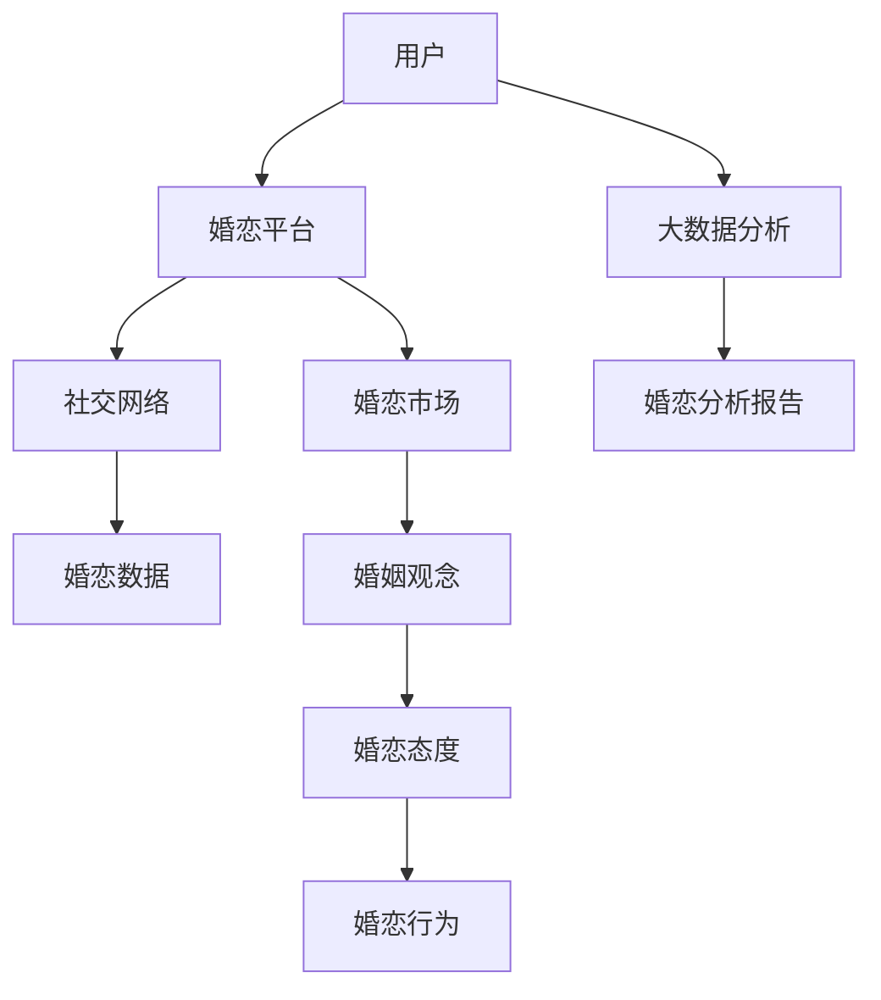

                 

### 第1章 引言：问题背景与婚恋观的演变

#### 1.1.1 问题背景

在数字时代，互联网的普及和大数据技术的飞速发展，使得人们的生活方式和观念发生了翻天覆地的变化。特别是在婚恋领域，互联网和大数据技术的应用，不仅改变了人们的婚恋方式，也影响了他们的婚恋观念。

随着互联网的普及，越来越多的人开始通过网络平台寻找伴侣，线上婚恋平台和社交媒体成为人们婚恋的重要渠道。这种方式的便捷性，使得人们可以更快速、更广泛地寻找潜在的伴侣，同时也让婚恋市场变得更加透明和公开。然而，这种方式也带来了诸多问题，如信息真实性、隐私保护、情感交流等问题。

大数据技术的应用，则为人们提供了更深入、更全面的婚恋数据分析。通过对海量用户数据的收集、存储、处理和分析，可以揭示出婚恋行为背后的规律和趋势，帮助人们更好地理解婚恋现象，优化婚恋选择。

在这个背景下，数字时代的婚恋观发生了显著的变化。年轻人更加注重个性化、多样化以及高效便捷的婚恋体验。他们更加开放和多元，对传统婚恋观念的接受度更高。同时，大数据技术的应用，使得婚恋选择更加科学和理性，但也带来了一些新的挑战和问题。

#### 1.1.2 问题描述

数字时代下的婚恋观演变带来了诸多问题，主要包括以下几个方面：

1. **单身现象的普遍化**：随着社会的发展和人们观念的变化，越来越多的人选择单身，不愿意为了结婚而结婚。这种现象在年轻人中尤为明显，导致了婚恋市场的供需失衡。

2. **婚恋市场的供需失衡**：随着单身人群的增多，婚恋市场的需求下降，而供给却相对稳定，导致了一些地区和年龄段的婚姻率下降。

3. **婚恋观念的多元冲突**：在数字时代，人们接触到的信息和观念更加多元，不同的观念之间的冲突也日益明显。例如，对于同性恋婚姻、跨文化婚姻等问题的看法，不同的人群有着截然不同的观点。

4. **婚恋选择的科学性**：大数据技术的应用，虽然提高了婚恋选择的科学性和效率，但也可能忽视了个体情感和直觉的重要性，导致了一些情感问题的出现。

5. **隐私保护问题**：在互联网和大数据技术广泛应用的时代，个人隐私保护成为了一个重要的问题。如何在享受便捷的婚恋服务的同时，保护个人隐私，成为了一个亟待解决的问题。

#### 1.1.3 问题解决

本书旨在通过大数据分析，对数字时代的婚恋观进行深入研究，探讨现代关系趋势，帮助读者更好地理解婚恋现象，为解决相关问题提供科学依据。具体来说，本书将从以下几个方面展开：

1. **数据分析方法**：介绍大数据分析的基本方法和流程，包括数据收集、存储、处理和分析等，为后续的研究提供基础。

2. **婚恋观演变趋势**：分析数字时代下婚恋观念的演变趋势，探讨不同年龄段、性别、文化背景等对婚恋观念的影响。

3. **婚恋市场分析**：通过对大数据的分析，研究婚恋市场的供需状况，探讨如何优化婚恋市场的资源配置。

4. **案例研究**：选取一些具有代表性的婚恋案例，进行深入分析，探讨婚恋现象背后的原因和规律。

5. **建议与展望**：基于研究结果，提出一些建议和展望，为未来的婚恋发展提供参考。

通过以上研究，本书希望能够为数字时代的婚恋提供一些新的思路和方法，帮助人们更好地理解和应对婚恋问题，提高婚恋质量和幸福感。

#### 1.1.4 边界与外延

数字时代婚恋观的研究范围包括但不限于以下几个方面：

1. **线上婚恋平台**：研究线上婚恋平台的发展趋势、用户行为、匹配算法等，探讨其对婚恋观念的影响。

2. **社交媒体的婚恋影响**：分析社交媒体对婚恋观念和行为的推动作用，探讨其带来的挑战和机遇。

3. **大数据在婚恋匹配中的应用**：研究大数据技术在婚恋匹配中的具体应用，如用户行为分析、兴趣偏好挖掘等。

4. **婚恋市场的供需分析**：研究婚恋市场的供需状况，探讨如何优化资源配置，提高婚恋成功率。

5. **多元婚恋观念的冲突与融合**：分析多元婚恋观念之间的冲突，探讨如何实现观念的融合与共存。

#### 1.1.5 概念结构与核心要素组成

数字时代的婚恋观包含以下几个核心要素：

1. **价值观**：个体对于婚姻和恋爱的基本看法和态度，包括对婚姻的期望、对恋爱的理解等。

2. **婚恋态度**：个体在婚恋过程中表现出来的态度和行为，包括对待婚恋的态度、对伴侣的选择标准等。

3. **婚恋行为**：个体在婚恋过程中的具体行为，包括寻找伴侣、建立关系、维持关系等。

4. **婚恋观念的多元化与冲突**：在数字时代，人们接触到的信息和观念更加多元，不同观念之间的冲突也日益明显。

这些核心要素相互作用，共同构成了数字时代的婚恋观。通过对这些要素的分析，我们可以更深入地理解数字时代的婚恋现象，为解决相关问题提供科学依据。

### 1.2 核心概念与联系

在探讨数字时代的婚恋观时，我们需要明确几个核心概念，并理解它们之间的联系。

#### 1.2.1 数字时代

数字时代指的是信息技术的快速发展，特别是互联网和大数据技术的普及，对人们生活方式和观念产生深远影响的时期。在这个时代，人们的生活方式、社交方式、工作方式等都发生了巨大的变化。特别是在婚恋领域，数字技术的发展为人们提供了更多的选择和可能性。

#### 1.2.2 婚恋观

婚恋观是指个体对于婚姻和恋爱的看法、态度和价值取向。它包括对婚姻的看法、对恋爱的理解、对伴侣的选择标准等。婚恋观受到多种因素的影响，包括文化背景、社会观念、个人经历等。

在数字时代，婚恋观也在不断演变。随着互联网和大数据技术的普及，人们对于婚恋有了更多的理解和接受方式，如线上婚恋平台、跨文化婚姻、同性恋婚姻等。这些新的婚恋形式，丰富了人们的婚恋观念，但也带来了一些新的挑战和问题。

#### 1.2.3 大数据分析

大数据分析是指运用现代信息技术，对海量数据进行收集、存储、处理和分析，从中提取有价值的信息和知识。在婚恋领域，大数据分析可以帮助我们更好地理解婚恋行为，揭示婚恋现象背后的规律和趋势。

通过大数据分析，我们可以了解不同年龄段、性别、文化背景等对婚恋观念和选择的影响，从而为婚恋市场提供科学的数据支持。同时，大数据分析也可以帮助优化婚恋匹配算法，提高婚恋成功率。

#### 1.2.4 现代关系趋势

现代关系趋势是指在数字时代背景下，婚恋关系发展变化的方向和趋势。这些趋势包括：

1. **婚恋观念的多元化**：随着社会的发展和文化的多样性，人们对婚恋有了更多的理解和接受方式，如同性恋婚姻、跨文化婚姻等。

2. **婚姻率的下降**：随着单身现象的普遍化，婚姻率有所下降，这反映了人们对婚姻的态度和观念的变化。

3. **线上婚恋的普及**：随着互联网的普及，越来越多的人通过线上婚恋平台寻找伴侣，线上婚恋成为婚恋市场的重要组成部分。

4. **数据驱动的婚恋选择**：大数据技术的应用，使得婚恋选择更加科学和理性，人们更多地依赖于数据分析来做出决策。

#### 1.2.5 各概念之间的联系

数字时代、婚恋观、大数据分析和现代关系趋势这几个概念之间存在着密切的联系。

数字时代是婚恋观演变的外部环境，它为人们提供了更多的信息和选择，推动了婚恋观念的多元化。同时，大数据分析作为现代技术的重要工具，为理解婚恋行为提供了科学的方法和手段。

现代关系趋势是数字时代下婚恋观的具体体现，它反映了婚恋关系的发展方向和变化趋势。这些趋势既受到数字时代的影响，也受到人们婚恋观念的影响。

通过理解这些概念之间的联系，我们可以更好地理解数字时代的婚恋现象，为解决相关问题提供科学依据。

### 1.3 ER实体关系图架构

为了更好地理解数字时代婚恋观中的各要素及其关系，我们可以通过ER（Entity-Relationship，实体-关系）模型来构建实体关系图。以下是数字时代婚恋观中的主要实体及其关系的ER模型：

在这个ER模型中：

- **用户（User）**：代表参与婚恋活动的个体，具有年龄、性别、职业等属性。
- **婚恋平台（Dating Platform）**：提供婚恋服务，如注册、搜索、匹配等功能。
- **社交网络（Social Network）**：包括社交媒体、朋友圈等，影响用户的社交圈子和婚恋观念。
- **大数据分析（Big Data Analysis）**：对用户数据进行分析，提供个性化匹配和决策支持。
- **婚恋数据（Dating Data）**：包括用户的个人信息、行为数据、偏好数据等。
- **婚恋分析报告（Dating Analysis Report）**：基于数据分析的结果，为用户提供婚恋建议和趋势分析。
- **婚恋市场（Dating Market）**：反映婚恋活动的总体状况，包括供需关系、市场规模等。
- **婚姻观念（Marriage Concept）**：用户的婚姻观念，包括对婚姻的看法、期望等。
- **婚恋态度（Dating Attitude）**：用户在婚恋过程中的态度，如开放、谨慎等。
- **婚恋行为（Dating Behavior）**：用户在婚恋活动中的具体行为，如在线互动、约会等。

通过ER模型，我们可以清晰地看到数字时代婚恋观中各要素之间的联系和作用，为后续的分析和研究提供了结构化的基础。

### 1.4 现代婚恋关系的特点分析

在现代社会的数字时代，婚恋关系呈现出一系列显著的特点，这些特点不仅反映了技术进步对人际交往的深远影响，也揭示了当代婚恋观念的多元化和复杂性。

#### 1.4.1 独立性

独立性是现代婚恋关系中的一个重要特点，尤其在女性中表现得尤为明显。随着教育水平的提高和职业机会的增多，女性在家庭和社会中的地位日益提升，她们更加追求个人独立和自主权。这种独立性体现在多个方面：

1. **经济独立**：女性在经济上更加自主，有能力自给自足，不再依赖婚姻作为经济保障。这种经济独立使得女性在婚恋选择上更加自由，能够更加注重精神层面的契合。

2. **职业独立**：越来越多的女性在职场中取得了显著成就，她们愿意投入更多时间和精力在职业发展上，而不仅仅局限于家庭角色。这影响了她们对伴侣的期望，更加倾向于寻找能够支持彼此成长的伴侣。

3. **情感独立**：女性在情感上也更加独立，不再将情感寄托于婚姻，而是通过多种渠道满足情感需求。这种情感独立不仅提高了女性的幸福感，也促进了她们在婚恋关系中的平等地位。

#### 1.4.2 多元性

多元性是现代婚恋关系中的另一个显著特点。随着全球化和文化多样性的增加，人们对婚恋观念的接受度变得更加开放和包容。以下是多元性在婚恋关系中的体现：

1. **婚姻形式的多样性**：现代婚恋观念中，传统的异性恋婚姻已不再是唯一的选择。同性恋婚姻、跨文化婚姻、多伴侣关系等多元化的婚姻形式得到了越来越多的认可和接受。这种多样性不仅丰富了人们的婚恋选择，也推动了社会对婚姻观念的重新审视。

2. **性别角色的多样性**：在传统观念中，男性通常被期望作为家庭的经济支柱，而女性则被期望承担更多的家务和育儿责任。然而，现代社会中，性别角色更加灵活，男性和女性在家庭和婚恋中的角色和责任逐渐趋向平衡。

3. **婚恋观念的多样性**：随着信息的传播和交流的便利，人们接触到的婚恋观念更加多元。个体可以根据自己的价值观和生活方式选择适合自己的婚恋观念，不再局限于传统的观念束缚。

#### 1.4.3 互联网的介入

互联网的介入极大地改变了现代婚恋关系的模式，它为人们提供了全新的婚恋渠道和方式：

1. **线上婚恋平台**：各种线上婚恋平台如雨后春笋般出现，为人们提供了便捷的婚恋渠道。用户可以通过这些平台注册、浏览资料、发送消息，甚至进行视频约会。这些平台不仅提高了婚恋的成功率，也改变了人们的婚恋方式。

2. **社交媒体的影响**：社交媒体的普及使得人们的社交圈更加广泛，也影响了他们的婚恋观念和行为。在社交媒体上，人们可以展示自己的生活和价值观，寻找潜在的伴侣。同时，社交媒体也为人们提供了更多的情感支持，减少了孤独感。

3. **隐私与安全**：互联网的介入也带来了隐私和安全问题。在线上婚恋过程中，用户需要保护自己的个人信息，避免受到诈骗和骚扰。同时，婚恋平台也需要加强隐私保护，确保用户的隐私安全。

#### 1.4.4 数据驱动的婚恋选择

大数据技术的应用使得婚恋选择更加科学和理性。通过分析用户的兴趣偏好、行为数据等，大数据算法可以为用户推荐最适合的伴侣，提高婚恋的成功率。以下是数据驱动婚恋选择的几个方面：

1. **匹配算法**：基于用户的兴趣偏好和性格特征，匹配算法可以找到最相似的伴侣。这种算法提高了匹配的准确性和效率，减少了无效的时间和精力浪费。

2. **数据分析**：通过对大量用户数据的分析，可以揭示出婚恋行为和趋势。这些数据可以为婚恋市场提供科学的指导，帮助优化婚恋匹配和资源配置。

3. **个性化推荐**：大数据技术还可以根据用户的偏好和行为，提供个性化的婚恋建议和推荐。这种个性化服务提高了用户的满意度和使用体验。

总之，现代婚恋关系的特点体现了数字时代下人们的价值观和生活方式的变化。独立性、多元性、互联网介入以及数据驱动的婚恋选择，共同构成了现代婚恋关系的新面貌。理解这些特点，有助于我们更好地应对数字时代下的婚恋挑战，提高婚恋质量和幸福感。

### 1.5 大数据技术在婚恋匹配中的应用

随着大数据技术的飞速发展，其在婚恋匹配中的应用也日益广泛。通过大数据技术，我们可以对海量婚恋数据进行分析，从而找到最佳的匹配对象。以下将详细探讨大数据技术在婚恋匹配中的应用，包括匹配算法的原理、应用场景以及其优势与挑战。

#### 1.5.1 匹配算法的原理

大数据技术在婚恋匹配中的核心是匹配算法。匹配算法的基本原理是通过分析用户的行为数据、兴趣偏好、性格特点等，找到最合适的匹配对象。以下是常见的匹配算法原理：

1. **基于相似度的匹配**：这种算法通过计算用户之间的相似度，找到具有相似兴趣、性格、价值观的人。相似度的计算通常基于用户的兴趣标签、行为记录、回答的问题等。例如，如果两个用户在兴趣爱好上有较高的一致性，那么他们的相似度就会较高。

2. **基于逻辑规则的匹配**：这种算法通过预设的逻辑规则，对用户进行分类和筛选，找到符合条件的匹配对象。例如，可以设定规则：如果用户的年龄相差不超过5岁，教育背景相似，且兴趣标签有重叠，则视为匹配成功。

3. **基于机器学习的匹配**：这种算法通过机器学习模型，对用户数据进行训练，建立预测模型，从而预测用户之间的匹配概率。常见的机器学习模型包括协同过滤、随机森林、神经网络等。

4. **基于图论的匹配**：这种算法通过建立用户关系的图模型，找到最短路径或最大相似度的用户。例如，可以通过社交网络中的好友关系，找到与当前用户最相似的用户。

#### 1.5.2 应用场景

大数据技术在婚恋匹配中的应用场景非常广泛，以下是一些典型的应用场景：

1. **线上婚恋平台**：各种线上婚恋平台，如Tinder、Bumble、OkCupid等，广泛应用大数据匹配算法，为用户提供个性化的推荐服务。用户可以通过平台注册信息、填写问卷、互动行为等，积累大量数据，平台通过算法为用户推荐匹配对象。

2. **婚介服务**：传统的婚介服务也逐渐采用大数据匹配算法，通过分析用户的数据，提供更精准的匹配建议。例如，婚介公司可以通过用户的历史数据，如交往记录、反馈评价等，来预测用户的匹配成功率。

3. **社交网络**：社交媒体平台，如Facebook、Instagram等，也提供了婚恋匹配功能。用户可以通过平台分享的生活状态、兴趣爱好、朋友关系等数据，来寻找潜在的伴侣。

4. **企业内部匹配**：一些企业为了提高员工的工作满意度和团队协作，也采用大数据匹配算法，为员工推荐合适的同事或合作伙伴。

#### 1.5.3 优势与挑战

大数据技术在婚恋匹配中的应用带来了诸多优势，但同时也面临一些挑战：

**优势：**

1. **提高匹配成功率**：通过分析海量用户数据，匹配算法可以找到最合适的匹配对象，提高婚恋成功率。

2. **个性化推荐**：大数据技术可以根据用户的兴趣偏好和行为数据，提供个性化的推荐服务，提升用户体验。

3. **数据驱动的决策**：通过数据分析，婚恋平台和婚介服务可以做出更科学的决策，如优化匹配规则、提升服务效率等。

**挑战：**

1. **隐私保护**：在婚恋匹配过程中，用户需要提供大量个人信息，这涉及到隐私保护的问题。如何在确保用户隐私的前提下，进行数据分析，是一个重要的挑战。

2. **算法偏见**：匹配算法可能会受到算法偏见的影响，导致某些用户群体被忽视或歧视。例如，如果算法过于依赖某些特征，可能会对具有不同特征的群体产生偏见。

3. **数据质量**：大数据技术的应用依赖于高质量的数据，然而，婚恋平台和婚介服务收集的数据可能存在不完整、不准确的问题，这会影响匹配算法的效果。

4. **用户体验**：大数据匹配算法可能会提高匹配成功率，但也会导致用户产生依赖性，降低用户在婚恋过程中的自主选择能力。

总之，大数据技术在婚恋匹配中的应用，为提高匹配效率和成功率提供了新的手段，但同时也带来了隐私保护、算法偏见、数据质量和用户体验等挑战。我们需要在享受大数据带来的便利的同时，认真应对这些挑战，确保婚恋匹配的公平、公正和透明。

### 1.6 婚恋市场的供需分析

在数字时代，婚恋市场的供需关系发生了显著的变化，这主要体现在单身人群的增多和婚恋市场的供需失衡上。以下将详细探讨这两个方面。

#### 1.6.1 单身现象的普遍化

单身现象在数字时代日益普遍，尤其是年轻人中表现尤为明显。这种现象可以从以下几个方面进行解析：

1. **延迟婚育**：随着教育水平的提升和职业发展的重视，越来越多的年轻人选择在事业稳定后再考虑婚姻和家庭。这种延迟婚育的现象导致了婚恋市场中的单身人群增多。

2. **独立生活观念**：现代社会中，越来越多的人倾向于独立生活，追求个人自由和发展。这种观念的转变使得年轻人更愿意单身，而不是为了结婚而结婚。

3. **多元选择**：数字时代提供了丰富的娱乐、社交和职业发展机会，使得人们不再将婚姻作为唯一的出路。人们有了更多的选择和可能性，也更愿意保持单身状态。

4. **高房价和生活成本**：高房价和生活成本也是单身现象增多的一个重要原因。许多年轻人因为经济压力，无法承担购房和养育孩子的成本，因此选择单身。

#### 1.6.2 婚恋市场的供需失衡

单身现象的普遍化导致了婚恋市场的供需失衡，具体体现在以下几个方面：

1. **需求下降**：随着单身人群的增多，对婚姻的需求相对下降。特别是在一些大都市，单身人群比例较高，婚姻率有所下降。

2. **供需不平衡**：在一些地区，尤其是经济发达地区，男性单身人口较多，而女性单身人口较少，导致了婚恋市场的供需不平衡。这进一步加剧了婚姻市场的压力和竞争。

3. **年龄差异**：随着婚龄的推迟，一些年龄较大的单身男女在婚恋市场上面临更大的挑战。他们在选择伴侣时，可能面临年龄差距大、生活方式不匹配等问题。

4. **地域差异**：不同地区之间的婚姻率也存在显著差异。在一些农村地区，婚姻率较高，而在城市地区，婚姻率相对较低。这种地域差异也反映了婚恋市场的供需不平衡。

#### 1.6.3 影响因素

婚恋市场的供需失衡受到多种因素的影响：

1. **经济因素**：经济状况是影响婚恋选择的一个重要因素。经济压力大的地区，单身现象更加普遍，婚姻率下降。相反，经济状况较好的地区，婚姻率相对较高。

2. **文化因素**：不同的文化背景对婚恋观念和选择有深远影响。在一些文化保守的地区，婚姻观念较为传统，单身现象较少。而在一些文化开放的地区，人们更加接受单身和多元化婚姻形式。

3. **社会因素**：社会稳定性和安全感对婚姻选择也有影响。在一个社会氛围积极向上的地区，人们对婚姻的期待更高，单身现象相对较少。而在社会问题较多的地区，单身现象较为普遍。

4. **人口结构**：人口结构的变化也是影响婚恋市场供需的一个重要因素。在一些人口老龄化较快的地区，单身人群比例较高，而年轻人口较少，导致婚恋市场供需失衡。

总之，数字时代下的单身现象和婚恋市场的供需失衡是一个复杂的社会现象，受到多种因素的共同影响。理解这些影响因素，有助于我们更好地应对婚恋市场的挑战，提高婚姻率和社会稳定性。

### 1.7 婚恋观念的演变与多样性

在数字时代，婚恋观念发生了显著的演变，呈现出多样化和开放性的特点。这一演变不仅反映了社会的发展和文化的多样性，也揭示了人们对于婚姻和爱情的全新理解。

#### 1.7.1 婚恋观念的演变

1. **从传统到现代**：在传统观念中，婚姻被视为一种社会契约，主要目的是延续血脉和维持家庭稳定。然而，随着社会的进步和人们思想的开放，婚姻逐渐成为个体追求幸福和自我实现的一种方式。现代婚恋观念更加注重个体的感受和需求，强调平等、尊重和共同成长。

2. **从物质到情感**：过去，人们在选择伴侣时，常常将物质条件视为重要标准，如家庭背景、经济实力等。而现代社会，人们更加重视情感契合和精神共鸣，认为婚姻中的情感交流和心灵共鸣是维系关系的关键。

3. **从一元到多元**：在传统观念中，婚姻通常是一元化的，即一生只有一次婚姻。然而，现代社会中，人们对于婚姻的理解更加多元，接受再婚、异国婚姻、同性婚姻等多种形式。这种观念的演变，反映了人们对于婚姻和爱情的包容和尊重。

#### 1.7.2 多样性的体现

1. **文化多样性**：全球化使得人们接触到更多的文化，不同文化背景下的人们对婚恋观念的理解和接受方式存在差异。例如，在一些传统观念较强的文化中，婚姻仍然被视为一种社会责任，而在一些开放的文化中，人们更加重视个人的自由和选择。

2. **性别角色的多样性**：在传统观念中，男性通常承担家庭的经济支柱角色，而女性则负责家庭事务和育儿。现代社会中，性别角色逐渐趋向平衡，男性和女性在家庭和婚恋中的角色更加灵活，共同分担家庭责任。

3. **婚姻形式的多样性**：现代婚恋观念中，婚姻形式变得更加多样，如自由恋爱婚姻、同性恋婚姻、跨文化婚姻等。这些形式不仅丰富了人们的婚恋选择，也反映了社会对多样性的包容和尊重。

4. **婚恋观念的多元冲突**：随着多样性的增加，不同婚恋观念之间的冲突也日益明显。例如，传统观念与现代观念之间的冲突，异性恋观念与同性恋观念之间的冲突等。这些冲突需要通过沟通和妥协来解决，以实现社会和谐。

#### 1.7.3 多样性的影响

婚恋观念的多样性和演变对个体和社会产生了深远的影响：

1. **个体影响**：多样性的婚恋观念为个体提供了更多的选择和可能性，使得他们能够更好地找到与自己价值观和生活观念相契合的伴侣。然而，多样性也可能导致个体在婚恋选择中面临更多的困惑和挑战。

2. **社会影响**：多样性的婚恋观念反映了社会的进步和开放，促进了社会的和谐与进步。然而，多样性的增加也带来了一定的社会挑战，如价值观的冲突、婚姻观念的多元化等，需要通过法律、教育等手段来调节和引导。

总之，数字时代下的婚恋观念呈现出多样化和开放性的特点，这不仅为个体提供了更多的选择和可能性，也对社会的和谐与进步产生了深远的影响。理解这些影响，有助于我们更好地应对婚恋观念的挑战，推动社会的和谐发展。

### 1.8 现代婚恋观的挑战与应对

在数字时代，现代婚恋观虽然带来了多样性和便利，但也面临诸多挑战。以下将详细探讨这些挑战以及可能的应对策略。

#### 1.8.1 挑战一：情感真实性的缺失

互联网和社交媒体的普及，使得人们可以通过虚拟世界建立联系，但这也导致了情感真实性的缺失。在线上，人们可以轻易地塑造自己的形象，甚至虚构身份。这种现象使得真实情感的交流和建立变得困难。

**应对策略**：

1. **增加现实互动**：线上交流虽然便捷，但真实情感的培养需要面对面的互动。建议在建立初步联系后，尽快安排见面，增加真实互动的机会。

2. **提高自我认知**：了解自己在虚拟世界中的行为模式，培养真诚、坦率的交流习惯，有助于建立真实的情感连接。

3. **隐私保护**：在互联网上，保护个人隐私是确保情感真实性的重要一环。用户应谨慎分享个人信息，避免被不法分子利用。

#### 1.8.2 挑战二：婚恋选择的依赖性

随着大数据匹配算法的广泛应用，人们越来越多地依赖算法来选择伴侣。虽然这提高了匹配的效率，但也可能导致个体失去自主选择的自由，产生依赖性。

**应对策略**：

1. **理性看待匹配算法**：认识到算法只是提供参考，不应完全依赖。用户应结合自身感受和需求，做出明智的选择。

2. **培养独立判断能力**：通过提升自我认知，了解自己的价值观和需求，培养独立判断和选择伴侣的能力。

3. **增加现实互动**：多参加线下活动，扩大社交圈，增加与他人互动的机会，有助于减少对算法的依赖。

#### 1.8.3 挑战三：隐私和安全问题

在数字时代，个人隐私和安全问题日益突出。婚恋平台和社交媒体上，用户需要分享大量个人信息，这可能导致隐私泄露和安全问题。

**应对策略**：

1. **增强隐私保护意识**：用户应了解个人隐私的重要性，学会保护自己的个人信息。

2. **选择可靠的婚恋平台**：选择信誉好、有严格隐私保护措施的婚恋平台，可以降低隐私泄露的风险。

3. **加强安全措施**：使用复杂的密码，定期更新密码，开启两步验证等功能，提高账户安全性。

#### 1.8.4 挑战四：多元观念的冲突

在多元文化的背景下，不同婚恋观念之间的冲突也日益明显。这种冲突可能导致婚姻和家庭关系的不稳定。

**应对策略**：

1. **开放心态**：理解并尊重不同的婚恋观念，培养包容和尊重的价值观。

2. **有效沟通**：在出现观念冲突时，通过有效沟通，寻求共同点和解决方案，避免矛盾升级。

3. **专业咨询**：在处理复杂婚恋问题时，可以寻求专业心理咨询师的帮助，提供专业的建议和指导。

总之，数字时代下的现代婚恋观虽然带来了便利和多样性，但也面临诸多挑战。通过理解和应对这些挑战，我们可以更好地适应数字时代，提高婚恋质量和幸福感。

