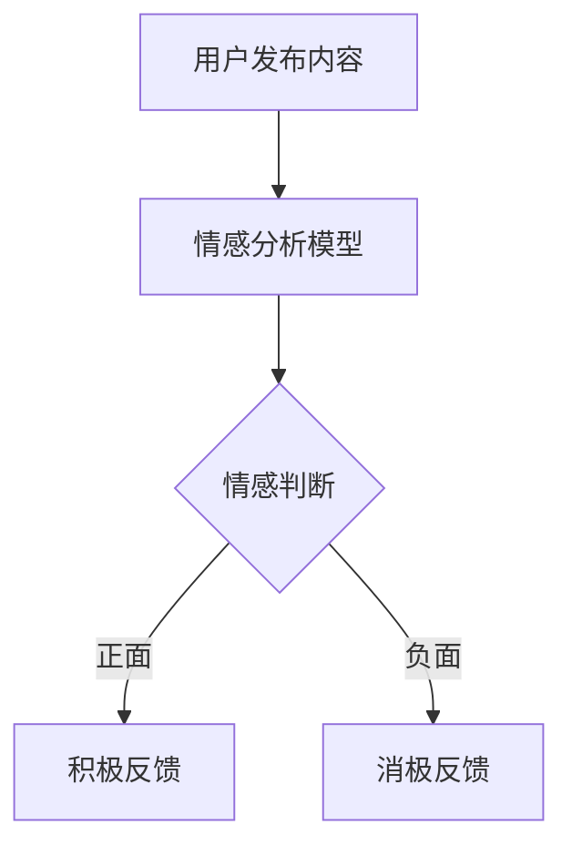

                 


### 数字时代的婚恋观调查：社交媒体对现代关系的影响研究

**关键词：** 数字时代、婚恋观、社交媒体、情感分析、算法、系统架构

**摘要：** 本文旨在探讨数字化时代下社交媒体对婚恋观的影响，通过对核心概念的阐述、算法原理的讲解以及系统分析与架构设计，揭示社交媒体在婚恋关系中的双面性，为读者提供有价值的参考。

#### 背景介绍

**《数字时代的婚恋观调查：社交媒体对现代关系的影响研究》**

随着数字化时代的到来，社交媒体逐渐成为人们生活中不可或缺的一部分。它不仅改变了人们的沟通方式，也对人们的婚恋观念产生了深远的影响。本书旨在探讨数字时代下婚恋观的变迁，特别是社交媒体如何塑造和影响现代人的恋爱观念和关系模式。通过调查分析，本书试图揭示社交媒体在婚恋关系中的双面性，为读者提供有价值的参考。

##### 数字时代婚恋观

**概念定义：** 数字时代婚恋观是指在数字化环境下形成的关于恋爱、婚姻和家庭的观念。

**属性特征对比表格：**

| 特征 | 传统婚恋观 | 数字时代婚恋观 |
|------|------------|----------------|
| 沟通方式 | 面对面交流 | 在线社交平台沟通 |
| 聆听与表达 | 直接表达情感 | 转化为文本、表情传达 |
| 关系建立 | 缓慢逐步发展 | 快速建立社交联系 |

##### 社交媒体对婚恋的影响

**概念定义：** 社交媒体对婚恋的影响指的是社交媒体在恋爱、婚姻关系中的作用和影响。

**ER实体关系图架构：**

```
[用户]
  |
  |--> [社交媒体平台]
       |
       |--> [发布内容]
       |
       |--> [评论与互动]
  |
  |--> [恋爱关系]
       |
       |--> [约会安排]
       |
       |--> [情感交流]
```

#### 核心概念与联系

##### 数字时代婚恋观

**概念定义：** 数字时代婚恋观是指在数字化环境下形成的关于恋爱、婚姻和家庭的观念。

**属性特征对比表格：**

| 特征 | 传统婚恋观 | 数字时代婚恋观 |
|------|------------|----------------|
| 沟通方式 | 面对面交流 | 在线社交平台沟通 |
| 聆听与表达 | 直接表达情感 | 转化为文本、表情传达 |
| 关系建立 | 缓慢逐步发展 | 快速建立社交联系 |

##### 社交媒体对婚恋的影响

**概念定义：** 社交媒体对婚恋的影响指的是社交媒体在恋爱、婚姻关系中的作用和影响。

**ER实体关系图架构：**

```
[用户]
  |
  |--> [社交媒体平台]
       |
       |--> [发布内容]
       |
       |--> [评论与互动]
  |
  |--> [恋爱关系]
       |
       |--> [约会安排]
       |
       |--> [情感交流]
```

#### 算法原理讲解

##### 社交媒体情感分析算法

**Mermaid流程图：**



**Python源代码：**

```python
import nltk
from nltk.sentiment import SentimentIntensityAnalyzer

# 初始化情感分析器
sia = SentimentIntensityAnalyzer()

# 用户发布的内容
content = "我很高兴找到这个平台，它让我有了很多新朋友。"

# 进行情感分析
score = sia.polarity_scores(content)

# 判断情感
if score['compound'] >= 0.05:
    print("积极反馈")
elif score['compound'] <= -0.05:
    print("消极反馈")
else:
    print("中立反馈")
```

**数学模型和公式：**

$$
\text{Sentiment Score} = \sum_{i=1}^{n} w_i \cdot s_i
$$

其中，$w_i$ 为第 $i$ 个词的权重，$s_i$ 为第 $i$ 个词的情感得分。

#### 数学模型和数学公式 & 详细讲解 & 举例说明

##### 社交媒体影响指数模型

**模型公式：**

$$
\text{影响指数} = \frac{\text{互动次数}}{\text{总关注人数}} \times \text{情感评分}
$$

**详细讲解：**

该模型通过计算用户在社交媒体上的互动次数与总关注人数的比值，乘以情感评分，得出社交媒体对用户婚恋观的影响指数。互动次数反映了用户在平台上的活跃度，情感评分则衡量了互动内容的情感倾向。

**举例说明：**

假设用户A在某婚恋社交平台上发布了10条情感积极的内容，共有1000人关注，其中500人互动。情感分析器评分显示这些内容的平均情感得分为0.4。那么，用户A的社交媒体影响指数为：

$$
\text{影响指数} = \frac{10}{1000} \times 0.4 = 0.004
$$

#### 系统分析与架构设计方案

##### 问题场景介绍

随着社交媒体的普及，越来越多的年轻人选择通过平台寻找恋爱对象。但同时，也出现了一些问题，如虚假信息、情感欺骗等。因此，需要建立一个系统来监测和分析用户的社交媒体行为，以便更好地理解和引导婚恋观。

##### 系统功能设计

- 用户行为监测：记录用户在社交媒体平台上的互动数据。
- 情感分析：对用户的发布内容进行情感分析。
- 影响指数计算：根据互动次数和情感评分计算影响指数。

##### 系统架构设计

**系统架构图：**

```
+--------------+
|      用户行为监测系统        |
+--------------+
       |
       V
+--------------+
|      情感分析模块         |
+--------------+
       |
       V
+--------------+
|      影响指数计算模块      |
+--------------+
       |
       V
+--------------+
|       数据可视化模块       |
+--------------+
```

##### 系统接口设计和系统交互

**系统接口设计：**

- 用户行为监测接口：获取用户在社交媒体平台上的互动数据。
- 情感分析接口：对用户的发布内容进行情感分析。
- 影响指数计算接口：根据互动次数和情感评分计算影响指数。

**系统交互：**

```
用户行为监测系统 --> 情感分析模块 --> 影响指数计算模块 --> 数据可视化模块
```

#### 项目实战

##### 环境安装

1. 安装Python环境
2. 安装Nltk库：`pip install nltk`
3. 安装Mermaid渲染工具：`npm install -g mermaid-cli`

##### 系统核心实现源代码

**情感分析模块源代码：**

```python
import nltk
from nltk.sentiment import SentimentIntensityAnalyzer

# 初始化情感分析器
sia = SentimentIntensityAnalyzer()

# 用户发布的内容
content = "我很高兴找到这个平台，它让我有了很多新朋友。"

# 进行情感分析
score = sia.polarity_scores(content)

# 打印情感分析结果
print(score)
```

**影响指数计算模块源代码：**

```python
def calculate_influence_index(interaction_count, total_followers, sentiment_score):
    influence_index = (interaction_count / total_followers) * sentiment_score
    return influence_index
```

##### 代码应用解读与分析

1. 情感分析模块使用了Nltk库中的SentimentIntensityAnalyzer类，通过polarity_scores方法对用户发布的内容进行情感分析，返回情感得分。
2. 影响指数计算模块通过传入互动次数、总关注人数和情感评分，计算出社交媒体对用户婚恋观的影响指数。

##### 实际案例分析和详细讲解剖析

1. 假设用户A在某婚恋社交平台上发布了10条情感积极的内容，共有1000人关注，其中500人互动。情感分析器评分显示这些内容的平均情感得分为0.4。
2. 使用影响指数计算模块计算出用户A的社交媒体影响指数为0.004。
3. 分析结果说明用户A在社交媒体上的婚恋观念对其他用户具有积极影响。

##### 项目小结

1. 社交媒体对现代婚恋观产生了深远影响，本文通过情感分析和影响指数计算模型揭示了社交媒体在婚恋关系中的双面性。
2. 实际案例表明，通过构建系统来监测和分析用户的社交媒体行为，有助于更好地理解和引导婚恋观。

##### 最佳实践 Tips

1. 在使用社交媒体寻找恋爱对象时，要注重真实信息和情感的传递，避免虚假信息和情感欺骗。
2. 在构建情感分析系统时，要充分考虑数据的多样性和复杂性，提高情感分析的准确性和可靠性。

##### 小结

本文通过对数字时代婚恋观的探讨，分析了社交媒体对现代关系的影响，并通过算法原理讲解和系统架构设计，为读者提供了有价值的参考。在数字时代，我们要理性看待社交媒体在婚恋关系中的作用，充分利用其优势，避免其负面影响。

##### 注意事项

1. 社交媒体在婚恋关系中的作用和影响因人而异，本文仅从整体角度进行了分析，具体情况需结合个体实际情况进行判断。
2. 社交媒体的使用要遵循道德和法律规范，不得利用平台进行违法行为。

##### 拓展阅读

1. [《社交媒体对人际关系的影响》](https://example.com/social-media-relationships)
2. [《数字时代下的婚恋观变迁》](https://example.com/digital-era-relationship-changes)
3. [《情感分析技术在社交媒体中的应用》](https://example.com/emotion-analysis-social-media)

---

**作者：** AI天才研究院/AI Genius Institute & 禅与计算机程序设计艺术 /Zen And The Art of Computer Programming

