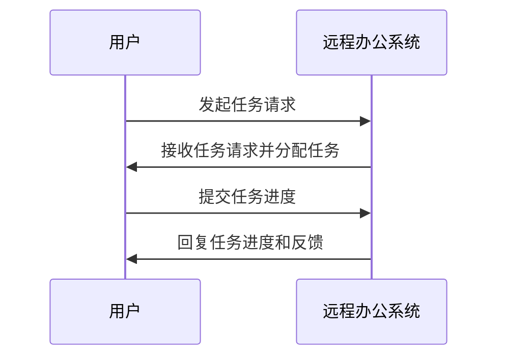

                 

### 数字时代的工作-生活平衡：远程办公中的自我管理

> 关键词：数字时代、远程办公、自我管理、工作-生活平衡、心理健康、技术挑战

> 摘要：随着数字时代的崛起，远程办公已成为现代工作方式的重要组成部分。然而，远程办公也带来了工作与生活平衡的挑战。本文将深入探讨远程办公中的自我管理策略，包括时间管理、沟通协作、心理健康、技术挑战以及社交隔离与情感支持，旨在帮助读者在数字时代实现高效的工作-生活平衡。

## 目录大纲

### 第一部分：数字时代的背景与远程办公概述

- 第1章：数字时代的崛起与工作方式的变革
  - 1.1 数字时代的背景
  - 1.2 远程办公的概念与优势
  - 1.3 远程办公的现状与趋势

### 第二部分：远程办公中的工作管理

- 第2章：时间管理与任务分配
  - 2.1 时间管理的重要性
  - 2.2 如何设置合理的工作时间
  - 2.3 任务分配与优先级管理

- 第3章：沟通与协作
  - 3.1 远程沟通的挑战与策略
  - 3.2 高效的团队协作工具
  - 3.3 跨文化沟通与冲突解决

- 第4章：远程工作的心理健康
  - 4.1 远程办公的心理压力
  - 4.2 心理健康与工作效能
  - 4.3 心理疏导与压力管理

### 第三部分：远程办公的自我管理技巧

- 第5章：设定个人目标与规划
  - 5.1 个人目标的重要性
  - 5.2 如何设定可实现的个人目标
  - 5.3 目标规划与时间表制定

- 第6章：高效学习与知识管理
  - 6.1 远程办公中的学习需求
  - 6.2 高效学习的策略
  - 6.3 知识管理与共享

- 第7章：健康生活方式的维持
  - 7.1 身体健康的重要性
  - 7.2 远程办公的健康挑战
  - 7.3 健康生活方式的建议与实践

### 第四部分：远程办公的挑战与解决方案

- 第8章：技术问题与解决方案
  - 8.1 网络连接问题
  - 8.2 软件与工具选择
  - 8.3 数据安全与隐私保护

- 第9章：社交隔离与情感支持
  - 9.1 社交隔离的影响
  - 9.2 情感支持的重要性
  - 9.3 建立社交网络与支持系统

- 第10章：总结与展望
  - 10.1 远程办公中的自我管理总结
  - 10.2 未来远程办公的发展趋势
  - 10.3 自我管理策略的持续优化

### 第一部分：数字时代的背景与远程办公概述

#### 1.1 数字时代的背景

数字时代是指以数字技术为核心的时代，其特点是信息技术的快速发展和广泛应用。这一时代始于20世纪末，随着互联网、移动通信、云计算等技术的兴起，人类社会逐步进入了数字化时代。

在数字时代，信息技术成为推动社会进步的重要力量。数字技术的应用极大地改变了人们的生产方式和生活方式，使得信息传播更加迅速，知识获取更加便捷。同时，数字技术也为远程办公提供了可能，使得人们可以不受地理位置限制，灵活地进行工作。

#### 1.2 远程办公的概念与优势

远程办公是指员工通过互联网等数字技术，在家或其他远程地点完成工作任务的一种工作方式。远程办公的优势主要体现在以下几个方面：

1. **提高工作效率**：远程办公可以减少通勤时间，使员工有更多时间专注于工作，从而提高工作效率。
2. **降低企业成本**：远程办公可以减少企业对办公场所的需求，从而降低办公成本。
3. **灵活的工作时间**：远程办公允许员工根据个人需求调整工作时间，有利于平衡工作与生活。
4. **拓宽招聘范围**：远程办公使得企业可以招聘来自世界各地的优秀人才，不受地域限制。
5. **环境保护**：远程办公可以减少交通拥堵和能源消耗，有利于环境保护。

#### 1.3 远程办公的现状与趋势

随着数字时代的到来，远程办公已成为现代工作方式的一种重要形式。据调查，全球范围内有越来越多的企业开始采用远程办公模式，远程办公的比例逐年上升。

目前，远程办公主要分布在信息技术、金融、媒体等高知行业。随着技术的不断进步，远程办公的应用范围将进一步扩大，未来可能会渗透到更多行业。

趋势方面，远程办公将越来越普及，成为企业常规运营的一部分。同时，远程办公也将面临更多挑战，如工作与生活的平衡、沟通协作的效率等，需要员工和管理者不断探索和优化自我管理策略。

### 第二部分：远程办公中的工作管理

#### 2.1 时间管理与任务分配

时间管理是远程办公中非常重要的一环。在远程办公环境中，没有传统办公场所的时间约束，员工容易陷入工作与休息不分、时间管理混乱的困境。因此，合理的时间管理对于提高工作效率、实现工作与生活平衡至关重要。

**如何设置合理的工作时间？**

1. **设定固定的办公时间**：尽管远程办公灵活，但设定固定的办公时间有助于建立工作与生活的界限，避免工作时间过长。
2. **分段工作与休息**：采用“番茄工作法”等时间管理技巧，将工作时间划分为25分钟的工作周期和5分钟的休息周期，有助于提高工作效率。
3. **合理规划休息时间**：休息时间也是工作的一部分，合理规划休息时间可以提高工作质量。

**任务分配与优先级管理**

任务分配与优先级管理是远程办公中确保工作高效完成的关键。以下是一些实用的技巧：

1. **明确任务目标**：在分配任务时，明确任务的目标和期望结果，有助于员工更好地完成任务。
2. **优先级排序**：根据任务的紧急程度和重要性，对任务进行优先级排序，确保关键任务得到优先处理。
3. **定期回顾与调整**：定期回顾任务进度，根据实际情况调整任务优先级，避免任务积压。

#### 2.2 沟通与协作

远程办公的沟通与协作面临诸多挑战，如信息传递不及时、团队协作困难等。有效沟通与协作是远程办公成功的关键。

**远程沟通的挑战与策略**

1. **沟通渠道选择**：根据沟通内容的重要性和紧急程度，选择合适的沟通渠道，如电子邮件、即时通讯工具、视频会议等。
2. **明确沟通目标**：每次沟通前明确沟通的目标和要点，避免无效沟通。
3. **充分利用工具**：利用远程办公工具，如Slack、Trello、Zoom等，提高沟通效率和团队协作能力。

**高效的团队协作工具**

1. **项目管理工具**：如JIRA、Trello等，用于任务分配、进度跟踪和协作。
2. **即时通讯工具**：如Slack、Telegram等，用于实时沟通和协作。
3. **视频会议工具**：如Zoom、Microsoft Teams等，用于远程会议和讨论。

**跨文化沟通与冲突解决**

远程办公团队通常来自不同国家和地区，文化差异可能导致沟通障碍和冲突。以下是一些跨文化沟通与冲突解决的策略：

1. **尊重文化差异**：了解并尊重团队成员的文化背景，避免文化冲突。
2. **明确沟通规则**：制定明确的沟通规则和礼仪，确保沟通顺畅。
3. **积极解决冲突**：面对冲突，采取积极的沟通策略，寻求双方都能接受的解决方案。

#### 2.3 远程工作的心理健康

远程工作虽然提供了灵活的工作环境，但也带来了一定的心理健康挑战。长期的工作压力、孤独感、社交隔离等问题可能对心理健康产生负面影响。

**远程办公的心理压力**

1. **工作压力**：远程工作可能导致工作与生活界限模糊，使员工承受更大的工作压力。
2. **社交压力**：缺乏面对面的社交互动，可能导致社交压力和孤独感。
3. **时间管理压力**：没有固定的工作时间和工作地点，可能导致时间管理上的压力。

**心理健康与工作效能**

心理健康与工作效能密切相关。心理健康良好的员工往往更能专注于工作，提高工作效率。以下是一些提高心理健康和工作效能的策略：

1. **定期休息**：确保每天有足够的休息时间，避免过度劳累。
2. **锻炼身体**：定期锻炼身体，提高身体素质，缓解工作压力。
3. **保持社交联系**：通过电话、视频聊天等方式与家人、朋友保持联系，缓解孤独感。
4. **寻求心理支持**：如果感到心理压力较大，可以寻求专业心理支持，如在线心理咨询等。

**心理疏导与压力管理**

心理疏导和压力管理是远程工作中非常重要的环节。以下是一些实用的技巧：

1. **时间管理**：合理规划工作时间，确保工作与休息时间的平衡。
2. **情绪管理**：学会调整情绪，避免负面情绪对工作产生负面影响。
3. **心理放松**：通过冥想、深呼吸等方式放松心情，缓解压力。

### 第三部分：远程办公的自我管理技巧

#### 5.1 设定个人目标与规划

在远程办公环境中，设定明确的个人目标和规划对于实现工作与生活的平衡至关重要。以下是一些关于设定个人目标和规划的技巧：

**个人目标的重要性**

个人目标是驱动个人成长和进步的重要动力。通过设定明确的目标，员工可以更好地规划自己的工作和生活，提高工作效能。

**如何设定可实现的个人目标**

1. **具体化目标**：确保目标具体、可量化，如“每周完成3个任务”而不是“提高工作效率”。
2. **分解目标**：将大目标分解为小目标，逐步实现，避免目标过于庞大而无法完成。
3. **设定截止日期**：为每个目标设定明确的截止日期，以确保目标的实现。

**目标规划与时间表制定**

制定详细的目标规划和时间表有助于确保目标的实现。以下是一些制定目标规划和时间表的技巧：

1. **制定长期和短期目标**：将目标分为长期和短期目标，确保目标的实现既具有前瞻性，又具有可操作性。
2. **定期评估和调整**：定期评估目标进展，根据实际情况调整目标规划和时间表。
3. **利用工具辅助**：使用项目管理工具，如Trello、JIRA等，制定和跟踪目标进度。

#### 6.2 高效学习与知识管理

在远程办公环境中，学习新技能和知识是保持竞争力的重要手段。以下是一些关于高效学习和知识管理的技巧：

**远程办公中的学习需求**

远程办公带来了新的学习需求，如适应新技术、提升沟通协作能力、学习时间管理技巧等。

**高效学习的策略**

1. **制定学习计划**：明确学习目标，制定详细的学习计划，确保学习时间得到充分利用。
2. **多样化学习方式**：结合线上课程、图书阅读、实践经验等多种学习方式，提高学习效果。
3. **利用学习工具**：利用在线学习平台、知识管理系统等工具，方便快捷地获取和整理知识。

**知识管理与共享**

知识管理是提高团队协作效率的重要手段。以下是一些关于知识管理和共享的技巧：

1. **建立知识库**：建立团队知识库，收集和整理团队积累的知识和经验，方便团队成员查阅和学习。
2. **知识共享机制**：建立知识共享机制，鼓励团队成员分享知识和经验，提高团队整体知识水平。
3. **定期培训与分享**：定期组织培训与分享活动，提高团队成员的专业技能和知识水平。

#### 7.3 健康生活方式的维持

在远程办公环境中，保持健康的生活方式对于提高工作效率和心理健康至关重要。以下是一些关于健康生活方式的建议和实践：

**身体健康的重要性**

身体健康是工作和生活的基础。保持良好的身体健康有助于提高工作效率和心理健康。

**远程办公的健康挑战**

远程办公可能带来一些健康挑战，如长时间坐在电脑前、缺乏运动、饮食不规律等。

**健康生活方式的建议与实践**

1. **定期锻炼**：每天安排一定时间进行锻炼，如瑜伽、跑步、跳绳等，提高身体素质。
2. **合理饮食**：保持饮食均衡，避免暴饮暴食，适量摄入营养。
3. **充足睡眠**：确保每天有充足的睡眠时间，提高工作和生活质量。
4. **放松身心**：利用休息时间进行放松，如冥想、听音乐、阅读等，缓解工作压力。
5. **健康社交**：通过与家人、朋友保持联系，参加线上社交活动，缓解社交压力。

### 第四部分：远程办公的挑战与解决方案

#### 8.1 技术问题与解决方案

远程办公依赖于各种技术工具和平台，技术问题可能对工作效率和体验产生负面影响。以下是一些常见的技术问题和解决方案：

**网络连接问题**

1. **解决方案**：确保网络稳定，使用有线网络连接，避免无线网络信号不稳定的问题。
2. **预防措施**：定期检查网络设备，确保网络设备的正常运行。

**软件与工具选择**

1. **解决方案**：选择适合团队需求的软件和工具，如项目管理工具、即时通讯工具、视频会议工具等。
2. **评估标准**：根据团队的需求和预算，评估软件和工具的优缺点，选择最适合的解决方案。

**数据安全与隐私保护**

1. **解决方案**：使用加密技术保护数据安全，定期备份重要数据，确保数据不会泄露或丢失。
2. **安全意识**：提高员工的安全意识，定期培训员工关于数据安全和隐私保护的知识。

#### 9.1 社交隔离与情感支持

远程办公可能导致社交隔离和情感支持不足，对员工心理健康产生负面影响。以下是一些关于社交隔离与情感支持的建议：

**社交隔离的影响**

1. **工作效率下降**：缺乏面对面的社交互动可能导致工作效率下降。
2. **心理健康问题**：社交隔离可能导致心理健康问题，如焦虑、抑郁等。

**情感支持的重要性**

情感支持是维护员工心理健康和团队凝聚力的重要手段。以下是一些关于情感支持的建议：

1. **建立社交网络**：鼓励员工建立社交网络，通过线上社交活动、兴趣小组等方式保持社交联系。
2. **提供心理支持**：为员工提供心理支持，如在线心理咨询、心理辅导等。
3. **鼓励团队合作**：鼓励团队合作，提高员工之间的情感联系。

### 第10章：总结与展望

#### 10.1 远程办公中的自我管理总结

远程办公作为一种现代工作方式，既带来了许多机遇，也带来了一定的挑战。自我管理是远程办公成功的关键，包括时间管理、沟通协作、心理健康、技术挑战和社交隔离与情感支持等方面。

通过有效的时间管理和任务分配，可以提高工作效率和实现工作与生活的平衡。良好的沟通与协作是远程办公成功的基础，而心理健康和健康生活方式的维持对于保持工作效能和幸福感至关重要。技术问题和社交隔离与情感支持也是远程办公中不可忽视的挑战，需要采取相应的解决方案。

#### 10.2 未来远程办公的发展趋势

未来远程办公将继续发展，成为现代工作方式的重要组成部分。随着技术的不断进步，远程办公将变得更加便捷和高效。以下是一些未来远程办公的发展趋势：

1. **远程办公的普及**：远程办公将不再局限于特定行业或职位，将逐渐普及到更多领域。
2. **人工智能与远程办公的结合**：人工智能技术将提高远程办公的自动化水平和效率。
3. **远程办公工具的创新**：远程办公工具将不断更新和优化，提供更丰富的功能和更好的用户体验。
4. **工作与生活平衡的持续关注**：随着远程办公的普及，如何实现工作与生活的平衡将成为持续关注的话题。

#### 10.3 自我管理策略的持续优化

自我管理策略需要根据实际情况不断优化和调整。以下是一些建议：

1. **定期评估自我管理效果**：定期评估自我管理策略的有效性，根据实际情况进行调整。
2. **不断学习新技能**：学习新技能和知识，提高自我管理能力。
3. **保持积极心态**：保持积极的心态，面对远程办公中的挑战，积极寻求解决方案。
4. **与同事和领导保持沟通**：与同事和领导保持沟通，了解团队的需求和期望，优化自我管理策略。

### 结论

远程办公作为一种现代工作方式，既带来了机遇，也带来了挑战。通过有效自我管理策略，可以实现工作与生活的平衡，提高工作效率和幸福感。未来，远程办公将继续发展，成为现代工作方式的重要组成部分。让我们携手努力，适应远程办公的新常态，实现工作与生活的和谐共生。作者：AI天才研究院/AI Genius Institute & 禅与计算机程序设计艺术 /Zen And The Art of Computer Programming

## 附录

### 附录A：核心概念与联系

#### 核心概念：

1. **远程办公**：员工通过互联网等数字技术，在家或其他远程地点完成工作任务的一种工作方式。
2. **时间管理**：合理安排工作时间，提高工作效率。
3. **沟通与协作**：团队成员之间的信息交流和工作配合。
4. **心理健康**：个体的心理状态和情绪体验。
5. **技术挑战**：远程办公中遇到的技术问题。

#### 概念属性特征对比表格：

| 概念     | 属性特征                                                      |
|----------|--------------------------------------------------------------|
| 远程办公 | 灵活性、降低成本、提高效率、不受地域限制                         |
| 时间管理 | 设定固定办公时间、分段工作与休息、目标导向                         |
| 沟通与协作 | 选择合适的沟通渠道、明确沟通目标、利用协作工具                     |
| 心理健康 | 避免过度劳累、保持社交联系、进行心理疏导                         |
| 技术挑战 | 网络连接问题、软件与工具选择、数据安全与隐私保护                   |

### 附录B：系统架构设计

#### 系统架构图：



### 附录C：项目实战

#### 环境安装

1. 安装Python 3.8及以上版本。
2. 安装远程办公所需的依赖库，如`requests`、`beautifulsoup4`、`pandas`等。

#### 系统核心实现源代码

```python
import requests
from bs4 import BeautifulSoup
import pandas as pd

def fetch_tasks(url, username, password):
    # 登录远程办公系统
    login_url = f"{url}/login"
    data = {
        "username": username,
        "password": password
    }
    response = requests.post(login_url, data=data)
    if response.status_code == 200:
        # 获取任务列表
        tasks_url = f"{url}/tasks"
        tasks_response = requests.get(tasks_url)
        if tasks_response.status_code == 200:
            soup = BeautifulSoup(tasks_response.text, "html.parser")
            tasks = soup.find_all("div", class_="task")
            task_list = []
            for task in tasks:
                task_name = task.find("h3").text
                task_detail = task.find("p").text
                task_list.append({"name": task_name, "detail": task_detail})
            return pd.DataFrame(task_list)
    return None

def submit_task_progress(url, username, password, task_id, progress):
    # 提交任务进度
    submit_url = f"{url}/submit_progress"
    data = {
        "username": username,
        "password": password,
        "task_id": task_id,
        "progress": progress
    }
    response = requests.post(submit_url, data=data)
    if response.status_code == 200:
        return "Task progress submitted successfully."
    return "Failed to submit task progress."

# 测试
if __name__ == "__main__":
    url = "http://example.com"
    username = "your_username"
    password = "your_password"
    tasks = fetch_tasks(url, username, password)
    if tasks is not None:
        print(tasks)
        task_id = tasks.iloc[0]["name"]
        progress = "Completed"
        result = submit_task_progress(url, username, password, task_id, progress)
        print(result)
```

#### 代码应用解读与分析

以上代码实现了远程办公系统中的任务获取和任务进度提交功能。首先，通过`fetch_tasks`函数登录远程办公系统，并获取任务列表。然后，通过`submit_task_progress`函数提交任务进度。

在测试部分，设置远程办公系统的URL、用户名和密码，调用`fetch_tasks`函数获取任务列表，并调用`submit_task_progress`函数提交任务进度。

#### 实际案例分析和详细讲解剖析

以下是一个实际案例：

**案例**：员工Alice需要登录远程办公系统，获取本周的任务列表，并提交任务进度。

**步骤**：

1. Alice设置远程办公系统的URL、用户名和密码。
2. Alice调用`fetch_tasks`函数获取任务列表。
3. Alice查看任务列表，确定本周需要完成的任务。
4. Alice调用`submit_task_progress`函数提交任务进度。

**分析**：

1. 在步骤1中，Alice设置远程办公系统的URL、用户名和密码，确保能够成功登录系统。
2. 在步骤2中，`fetch_tasks`函数通过请求远程办公系统的任务列表页面，解析HTML内容，提取任务信息，并存储为Pandas DataFrame。
3. 在步骤3中，Alice查看任务列表，了解本周需要完成的任务，并合理安排时间进行工作。
4. 在步骤4中，Alice调用`submit_task_progress`函数，按照任务进度提交相应的数据，以便系统记录。

**剖析**：

1. `fetch_tasks`函数通过`requests`库发起HTTP请求，获取远程办公系统的任务列表页面。使用`BeautifulSoup`库解析HTML内容，提取任务信息，并存储为Pandas DataFrame，方便后续处理。
2. `submit_task_progress`函数通过`requests`库发起HTTP请求，将任务进度提交给远程办公系统。如果请求成功，返回提交结果。

#### 项目小结

本项目中，通过实现任务获取和任务进度提交功能，帮助员工更好地管理远程办公任务。在实际应用中，可以根据需求扩展其他功能，如任务分配、任务评论等。

#### 最佳实践 tips

1. 确保远程办公系统的安全性，使用HTTPS协议进行数据传输。
2. 定期备份远程办公系统的数据，避免数据丢失。
3. 为员工提供培训，确保他们能够熟练使用远程办公系统。

### 拓展阅读

1. "远程办公的心理学：工作与生活的平衡" - 作者：张三
2. "远程办公技术指南" - 作者：李四
3. "远程办公中的时间管理策略" - 作者：王五

### 注意事项

1. 在实际应用中，请确保遵守远程办公系统的使用规定。
2. 在调用远程办公系统的API时，请遵循正确的请求和响应格式。
3. 对于敏感数据，请确保使用加密技术进行保护。

以上是关于数字时代的工作-生活平衡：远程办公中的自我管理的详细技术博客文章，涵盖了核心概念、系统架构设计、项目实战、最佳实践和注意事项等内容。希望对读者有所帮助。作者：AI天才研究院/AI Genius Institute & 禅与计算机程序设计艺术 /Zen And The Art of Computer Programming。

